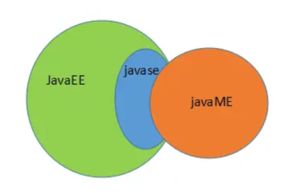

# 初识Java

1. ## 什么是Java？

   > - Java最早是由SUN公司（目前已被Oracle收购）的**詹姆斯·高斯林**在上个世纪90年代初开发的一种编程语言，最初被命名为Oak，目标是针对小型家电设备的嵌入式应用，结果市场没啥反响。谁料到互联网的崛起，让Oak重新焕发了生机，于是SUN公司改造了Oak，在1995年以Java的名称正式发布，原因是Oak已经被人注册了，因此SUN注册了Java这个商标。随着互联网的高速发展，Java逐渐成为最重要的网络编程语言。
   >
   > - 随着Java的发展，SUN给Java又分出了三个不同版本：
   >
   >   - Java SE：Standard Edition
   >   - Java EE：Enterprise Edition
   >   - Java ME：Micro Edition
   >
   >   这三者之间的关系：
   >
   >   
   >
   > - 简单来说，Java SE就是标准版，包含标准的JVM和标准库，而Java EE是企业版，它只是在Java SE的基础上加上了大量的API和库，以便方便开发Web应用、数据库、消息服务等，Java EE的应用使用的JVM和Java SE完全相同。
   >
   > - 而Java ME的JVM和Java SE的JVM不同，它是一个针对嵌入式设备的“瘦身版”，Java SE的标准库无法在Java ME上使用，Java ME的虚拟机也是“瘦身版”。
   >
   >   > **虚拟机（JVM）：**
   >   >
   >   > - **JVM（JAVA VIRTUAL MACHINE）是一种规范**，可以使用软件来实现，也可以使用硬件来实现，就是一个虚拟的用于执行bytecodes字节码的计算机。他也定义了指令集、寄存器集、结构栈、垃圾收集堆、内存区域。
   >   > - JVM是指在一台计算机上由软件或硬件模拟的计算机，它类似一个小巧而高效的CPU。
   >   > - Java虚拟机是Java最核心技术，也是跨平台的基础。可以使用软件来实现，例如：IBM, SUN, BEA等，当然你也可以自己写一个JVM；也可以使用硬件来实现，例如：SUM/Intel公司研发的java芯片。
   >
   > - 毫无疑问，Java SE是整个Java平台的核心，而Java EE是进一步学习Web应用所必须的。我们熟悉的Spring等框架都是Java EE开源生态系统的一部分。不幸的是，Java ME从来没有真正流行起来，反而是Android开发成为了移动平台的标准之一，因此，没有特殊需求，不建议学习Java ME。
   >
   > - 推荐的Java学习路线图如下：
   >
   >   1. 首先要学习Java SE，掌握Java语言本身、Java核心开发技术以及Java标准库的使用；
   >   2. 如果继续学习Java EE，那么Spring框架、数据库开发、分布式架构就是需要学习的；
   >   3. 如果要学习大数据开发，那么Hadoop、Spark、Flink这些大数据平台就是需要学习的，他们都基于Java或Scala开发；
   >   4. 如果想要学习移动开发，那么就深入Android平台，掌握Android App开发。
   >
   >   无论怎么选择，Java SE的核心技术是基础，这个教程的目的就是让你完全精通Java SE并掌握Java EE！

2. ## Java的发展史

   > - 1991年，Sun公司的Green项目（Oak语言）
   > - 1995年，推出JAVA测试版
   > - 1996年，JDK1.0
   > - 1998年，JDK1.2，大大改进了早期版本的缺陷，是一个革命性的版本，更名为Java2
   > - 1999年，Java分为J2SE、J2EE和J2ME三个版本，其中J2EE的出现标志着JSP/Servlet诞生
   > - 2006年，JDK1.6，并且Java各种版本被更名，取消其中的数字"2"：J2EE更名为Java EE, J2SE更名为Java SE，J2ME更名为Java ME 
   > - 2011年，JDK1.7，也称之为JAVA7版本 
   > - 2014年，JDK1.8，也称之为JAVA8版本，该版本是当前最广泛使用的版本（LTS）。
   > - 2017年，JDK1.9，也称之为JAVA9版本 
   > - 从2018年开始，每年3月和9月都会发布新JDK版本，并且JDK的命名从10开始递增。
   > - 2018年3月，JDK10，也称之为JAVA10版本 
   > - 2018年9月，JDK11，也称之为JAVA11版本（LTS）  
   > - ......
   > - 2021年3月，JDK16，也称之为JAVA16版本 
   > - 2021年9月，JDK17，也称之为JAVA17版本（LTS） 
   > - 2022年3月，JDK18，也称之为JAVA18版本
   > - ......
   >
   > 从1996年发布1.0版本开始，到目前为止，最新的Java版本是Java 23：（本教程使用Java 21长期支持版）

3. ## Java的特点

   > Java介于编译型语言和解释型语言之间。编译型语言如C、C++，代码是直接编译成机器码执行，但是不同的平台（x86、ARM等）CPU的指令集不同，因此，需要编译出每一种平台的对应机器码。解释型语言如Python、Ruby没有这个问题，可以由解释器直接加载源码然后运行，代价是运行效率太低。而Java是将代码编译成一种“字节码”，它类似于抽象的CPU指令，然后，针对不同平台编写虚拟机，不同平台的虚拟机负责加载字节码并执行，这样就实现了“一次编写，到处运行”的效果。当然，这是针对Java开发者而言。对于虚拟机，需要为每个平台分别开发。为了保证不同平台、不同公司开发的虚拟机都能正确执行Java字节码，SUN公司制定了一系列的Java虚拟机规范。从实践的角度看，JVM的兼容性做得非常好，低版本的Java字节码完全可以正常运行在高版本的JVM上。

4. ## JDK和JRE

   - ##### JDK：Java Development Kit（Java开发工具包）

   - ##### JRE：Java Runtime Environment（Java的运行环境）

   > 简单来说，JRE就是运行Java程序所需的环境，包括运行Java字节码的虚拟机及需要的核心库。而JDK则包含了编译Java代码所需的编译器、调试器等开发工具。

   ###### **注意**：从JDK9开始，jdk的目录中就没有单独的jre目录了，JDK中已经内嵌了JRE，所以没必要再额外包含JRE了，需要单独的JRE则单独下载即可。

   > **扩展知识：JSR和JCP又是啥？**
   >
   > - JSR规范：Java Specification Request（Java规范请求）
   > - JCP组织：Java Community Process（Java社区流程）
   >
   > 为了保证Java语言的规范性，SUN公司搞了一个JSR规范，凡是想给Java平台加一个功能，比如说访问数据库的功能，大家要先创建一个JSR规范，定义好接口，这样，各个数据库厂商都按照规范写出Java驱动程序，开发者就不用担心自己写的数据库代码在MySQL上能跑，却不能跑在PostgreSQL上。
   >
   > 所以JSR是一系列的规范，从JVM的内存模型到Web程序接口，全部都标准化了。而负责审核JSR的组织就是JCP组织。
   >
   > 一个JSR规范发布时，为了让大家有个参考，还要同时发布一个“参考实现”，以及一个“兼容性测试套件”：
   >
   > - RI：Reference Implementation
   > - TCK：Technology Compatibility Kit
   >
   > 比如有人提议要搞一个基于Java开发的消息服务器，这个提议很好啊，但是光有提议还不行，得贴出真正能跑的代码，这就是RI。如果有其他人也想开发这样一个消息服务器，如何保证这些消息服务器对开发者来说接口、功能都是相同的？所以还得提供TCK。
   >
   > 通常来说，RI只是一个“能跑”的正确的代码，它不追求速度，所以，如果真正要选择一个Java的消息服务器，一般是没人用RI的，大家都会选择一个有竞争力的商用或开源产品。

5. ## Java开发环境搭建

   1. 到Oracle官网下载对应版本的JDK（LTS后缀的JDK是长期支持版），双击安装即可（安装路径不要有中文、空格或特殊字符）。

   2. 配置环境变量（windows）：（安装高版本JDK会自动配一个javapath环境变量，可以删掉）

      1. 在系统环境变量中添加`JAVA_HOME`环境变量，值为JDK的安装目录（没有bin\）。
      2. 在系统环境变量`Path`中追加：`%JAVA_HOME%\bin`
      3. 打开DOS命令窗口，输入`java`并回车，如果出现Java21的版本号说明配置成功。

      > 之所以要配置环境变量，是因为我们开发时要在不同位置执行`java/javac`命令，而DOS中执行的所有命令都必须在Path环境变量中配置，这样系统才知道该命令所对应的可执行程序在哪里。

   ###### 细心的童鞋还可以在`JAVA_HOME`的`bin`目录下找到很多可执行文件：

   > - java：这个可执行程序其实就是JVM，运行Java程序，就是启动JVM，然后让JVM执行指定的编译后的代码。
   > - javac：这是Java的编译器，它用于把Java源码文件（以`.java`后缀结尾）编译为Java字节码文件（以`.class`后缀结尾）。
   > - jar：用于把一组`.class`文件打包成一个`.jar`文件，便于发布。
   > - javadoc：用于从Java源码中自动提取注释并生成文档。
   > - jdb：Java调试器，用于开发阶段的运行调试。

6. ## 常用的DOS命令

   - #### DOS简介：

     > - DOS是英文“Disk Operating System”的缩写，其中文含意是“磁盘操作系统”。简单来说，DOS就是一个单用户、单任务的操作系统。
     > - 从1981年直到1995年的15年间，磁盘操作系统在IBM PC兼容机市场中占有举足轻重的地位。而且，若是把部分以DOS为基础的Microsoft Windows版本，如Windows 95、Windows 98和Windows Me等都算进去的话，那么其商业寿命至少可以算到2000年。微软的所有后续版本中，磁盘操作系统仍然被保留着。
     > - 家族包括MS-DOS、PC-DOS、DR-DOS、PTS-DOS、ROM-DOS、JM-OS等，其中以MS-DOS最为著名。虽然这些系统常被简称为“DOS”，但几乎没有系统单纯以“DOS”命名（只有一个毫无关连的1960年代IBM大型主机操作系统以此命名）。此外，有几个和DOS无关、在非x86的微计算机系统上运行的磁盘操作系统在名称中也有“DOS”字眼，而且在专门讨论该机器的场合中也会简称为“DOS”（例如：AmigaDOS、AMSDOS、ANDOS、AppleDOS、Atari DOS、Commodore DOS、CSI-DOS、ProDOS、TRS-DOS等），但这些系统和DOS可执行文件以及MS-DOS API并不兼容。

   - #### 常用的DOS命令：

     > cd、md、rd、copy、del、ipconfig、ping、exit、cls、help...

     ###### 注意：DOS命令不区分大小写，但是文件或文件夹需要区分大小写。

7. ## 第一个Java程序

   1. 打开文本编辑器，输入以下代码：（Hello.java）

      ```java
      public class Hello {
          public static void main(String[] args) {
          	System.out.println("Hello, World!"); // 该语句可以调用操作系统标准输出流打印出Hello World
          }
      }
      ```

      > 简单做下说明：
      >
      > - clsss关键字声明的是一个Java类。通常类名遵循大驼峰命名规范。
      >
      > - public是类的**访问权限修饰符**，类的访问权限可以是`public`或`不加任何修饰符`。
      >
      > - Java规定：某个类定义的`public static void main(String[] args)`是Java程序的固定的**入口方法/主方法**。JVM总是从`main`主方法开始执行一个Java程序。
      >
      >   > 方法是可执行的代码块，一个方法除了方法名main，还有用`()`括起来的方法参数，这里的main方法有一个参数，参数类型是`String[]`，参数名是`args`，`public、static`用来修饰方法，表示它是一个公开的静态方法，`void`是方法的返回类型，而花括号`{}`中间的就是方法体。
      >
      > - 最后，当我们把Java代码保存为文件时，文件后缀必须是`.java`。而且文件名也要注意，因为**文件名必须和文件中`public`修饰的类名保持一致**。（一个Java文件中允许写多个类，但是其中被public修饰的类的类名必须和该文件名保持一致。通常一个类对应一个Java文件）
      >
      > （注意：Java源码的缩进不是必须的，但是用缩进后，格式好看，很容易看出代码块的开始和结束，缩进一般是`4个空格`或`一个tab`）

   2. 将Java程序编译为字节码（`.class`）：`javac Hello.java`

   3. 启动JVM，加载并运行编译好的字节码文件（将编译好的字节码放到JVM上运行）：`java Hello`

      > 注意：给JVM虚拟机传递的参数`Hello`是我们定义的类名，虚拟机启动后会自动查找对应的`类名.class`文件加载并执行。

   ###### 扩展：

   > - 有一些童鞋可能知道，直接运行`java Hello.java`也是可以的：`java Hello.java`。这是Java 11新增的一个功能，它可以直接运行一个单文件源码！
   > - 需要注意的是，在实际项目中，单个不依赖第三方库的Java源码是非常罕见的，所以，绝大多数情况下，我们无法直接运行一个Java源码文件，原因是它需要依赖其他的库，需要先将依赖的包编译成class，再去运行才行。

8. ## Java程序的基本结构

   - Java是面向对象的语言，一个Java程序的基本单位是类，所有的Java代码都必须写在类体中。类的基本结构：`访问权限修饰符 类名{}`。

   - **Java中严格区分大小写**。

   - 程序中，程序员可以自由命名的被称为**标识符**。**Java中的标识符由字母、数字、下划线、美元符号组成，且不能以数字开头**。哪些地方可以用标识符：类名、变量名、包名、方法名、接口名、常量名。

   - `class、public、static、..`等程序中预定义的、有特殊含义的标识符被称为**关键字**。Java中的关键字都是小写。（标识符命名不能和已定义的关键字冲突）

     > Java规范了50个关键字（包含了goto、const两个保留字）。还有额外的三个字面量：`true、false、null`，虽然不是关键字，但是我们也把他们看做是关键字。

   - 类中可以定义**方法**。Java中方法的基本结构：`修饰符列表 返回值类型 方法名(参数列表){方法体}`。方法体中可以编写Java语句，每条**Java语句都必须以`;`结束**。

   - Java中的注释分为：单行注释（`//注释`）、多行注释（`/*注释*/`）和文档注释（`/**注释*/`）。其中文档注释可以被`javadoc`命令解析生成说明文档。

   - Java中定义变量：**数据类型  变量名  =  变量值;**，Java中每个变量必须先声明，再使用。

   - Java中switch语句的值只能是如下类型：整型、枚举型（JDK5）、String（jdk7）。

     > 从JDK12开始，`switch`语句升级为更简洁的表达式语法，使用类似模式匹配（Pattern Matching）的方法，保证只有一种路径会被执行，并且不需要`break`语句，没有穿透效应：
     >
     > ```java
     > public class Main {
     >        public static void main(String[] args) {
     >            String fruit = "apple";
     >            switch (fruit) {
     >                case "apple" -> System.out.println("Selected apple");
     >                case "pear" -> System.out.println("Selected pear");
     >                case "mango" -> {
     >                    System.out.println("Selected mango");
     >                    System.out.println("Good choice!");
     >                }
     >                default -> System.out.println("No fruit selected");
     >            }
     >        }
     > }
     > ```

9. ## Java中的类型

   - **基本数据类型**：

     > 基本数据类型是CPU可以直接进行运算的类型。Java中的基本数据类型：byte(1)/short(2)/int(4)/long(8)/float(4)/double(8)/boolean(1)/char(2)

   - **引用数据类型**：除了上述基本类型的变量，剩下的都是引用类型。例如，引用类型最常用的就是`String`字符串：`String s = "hello";`。引用类型的变量类似于C语言的指针，存储的是一个“引用地址”，指向某个对象在内存的位置。

10. ## 字面量

    - **整型**：默认情况下，数字都当做十进制int型字面量处理；0B/0b开头表示二进制的int型字面量（JDK8），这是c语言（C99）中没有的；0x/0x开头表示十六进制字面量；0开头表示8进制字面量。若要将数字当做long类型字面量，需要在数字后面加L/l。

    - **浮点型**：默认带小数点的字面量会被当做double型处理；如果想当做float型，需要在字面量后面加F/f。还可以用科学计数法表示小数：`4.9e-32`。

      > 注意：float4个字节也比long8个字节能表示的数字大。因为float在计算机内存中是按照IEEE754标准来存的，其中32位float包含3部分(符号位，指数位，尾数位)，因此float是指数级的增大。并且比较两个浮点数要通过判断两数之间的差值，比如差值小于0.00001时就算两数相等。因为计算机存浮点数只是存了一个近似值（二进制无法完全表示十进制浮点数）。

    - **布尔型**：布尔型字面量只有两个值`true/false`。

    - **字符型**：单引号`'`括起来的字符被当做字符型字面量，可以保存一个Unicode字符。也可以用`'\u0000'`来表示一个空字符`''`，其中`\u`表示是Unicode编码，后面跟上该字符对应的2字节16进制的码点（因为是utf-16编码方式）。不能直接给char型变量赋值`''`。（char本质上保存的也是数字）

    - **字符串型**：双引号`"`括起来的一串内容被当做字符串字面量（不可变）。（Java中String型是引用类型，保存的是字符串字面量的引用地址）

      > - 当加号`+`左右两边有一个是字符串字面量，那么加号则作为**字符串连接符**。
      > - 从JDK13开始，可以用`"""多行字符串"""`表示多行字符串了。（多行字符串前面共同的空格会被去掉，是以最短的行首空格为基准）
      > - 字符串本质是对象，可以用`length()`等字符串常用的方法。

    - **`null`**：当一个引用类型变量，不知道初始化为什么值时，可以先给它赋值null，即不指向任何引用地址。

    - **数组型**：如果要定义一组类型相同的变量，可以使用该类型的数组：`类型[] 数组名 = {值1,..};`，也可以：`类型[] 数组名 = new 类型[n];`

      > **Java中的数组的特点：**
      >
      > - 数组初始化后每个元素都有默认值。
      > - 数组一旦创建，大小不可变。并且在内存中的地址是连续的。
      > - 数组本质也是对象，并且有`length`属性。
      > - 二维数组初始化：`int[][] arr = new int[3][2]`，或`int[][] arr = new int[3][]`。

11. ## 变量

    - **常量**：final修饰的是常量，一旦赋值就不可修改。通常常量名全大写。

    - **var**：有些时候，类型的名字太长，写起来比较麻烦。例如：`StringBuilder sb = new StringBuilder();`，此时可以用`var`关键字：`var sb = new StringBuilder();`，编译器会根据赋值语句自动推断出变量`sb`的类型是`StringBuilder`。对编译器来说，这里的var就是StringBuilder。

    - **变量的作用域**：变量只在离它最近的`{}`中有效，这就是它的作用域。

      > 定义变量时，要遵循作用域最小化原则，尽量将变量定义在尽可能小的作用域。

12. ## 基本运算

    - ##### 移位运算：Java中，双箭头`>>/<<`是移位运算符（算数位移），而`>>>`是逻辑右移运算符。

    - ##### 位运算：`&、|、^、~`，这些都是位运算符。

    - ##### 自动类型转换（类型提升）与强制类型转换：

      - ###### 自动类型转换：

        > 1. “小类型”转为“大类型”时，会自动做类型转换：`byte` -> `short` -> `int` -> `long` -> `float` -> `double`。（引用类型子类会自动转为父类）
        > 2. 在整型做运算时，如果参与运算的两个整型类型不一致，那么首先会自动转成较大的那个，然后再计算。（byte、short、char在做运算时，各自会先转成int，再做计算）

      - ###### 强制类型转换：

        > “大类型”转“小类型”时，需要做强制类型转换。`(类型)变量`可以将一个变量做类型强转。如果是整型做强转，则高位舍弃。

13. ## 主方法中的参数

    > Java程序的入口是`main`方法，而`main`方法可以接受命令行参数。这些参数由用户输入，JVM接收并传给main方法的`String[]`型参数args中。（注意：接收的是`java 类名`后面的参数）

14. 

15. ## 访问权限修饰符

    > Java中一个类/接口/抽象类/枚举/注解的访问权限修饰符只有两种，public和默认（不写）；而方法、属性、内部类的访问权限修饰符有4种：
    >
    > ```tex
    >        private  <    默认    <  protected  <  public
    >        同一个类     同一个包       子类         所有类
    > ```
    >
    > （**如果类的访问权限是public，那么文件名必须和该类名保持一致**）

16. 
