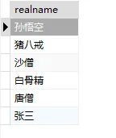
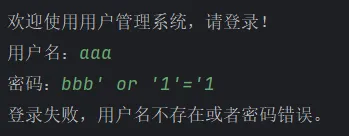
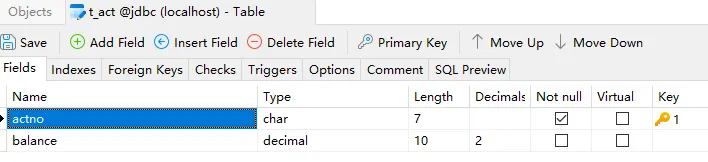
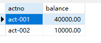
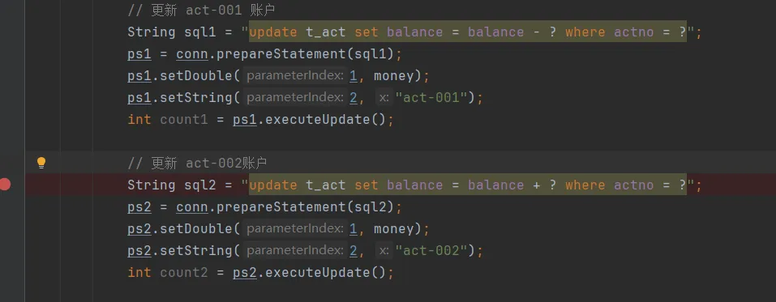
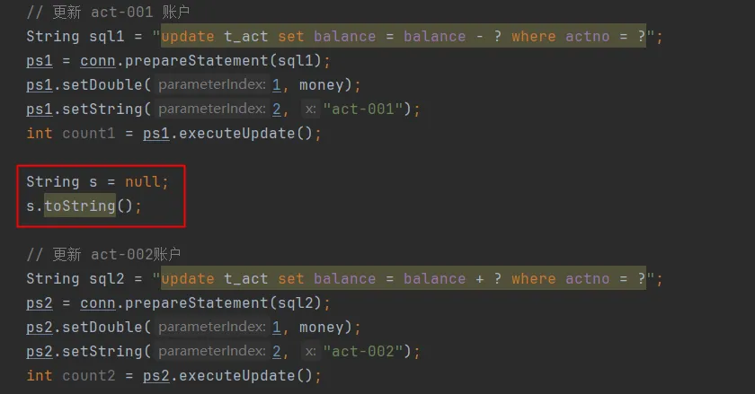
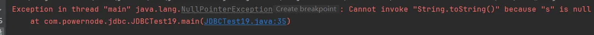
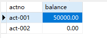
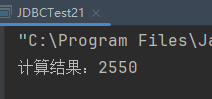
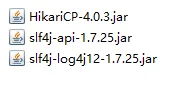

# JDBC编程

> 程序运行的时候，往往需要存取数据。现代应用程序最基本，也是使用最广泛的数据存储就是关系数据库。
>
> Java为关系数据库定义了一套标准的访问接口：JDBC（Java Database Connectivity），本章我们介绍如何在Java程序中使用JDBC。

- ## JDBC概述

  - #### 什么是JDBC

    > JDBC（Java DataBase Connectivity）就是Java数据库连接，说白了就是用Java语言来操作数据库。原来我们操作数据库是在控制台使用SQL语句来操作数据库，JDBC是用Java语言向数据库发送SQL语句。

  - #### JDBC原理

    > 早期SUN公司的天才们想编写一套可以连接天下所有数据库的API，但是当他们刚刚开始时就发现这是不可完成的任务，因为各个厂商的数据库服务器差异太大了。后来SUN开始与数据库厂商们讨论，最终得出的结论是，由SUN提供一套访问数据库的规范（就是一组接口），并提供连接数据库的协议标准，然后各个数据库厂商会遵循SUN的规范提供一套访问自己公司数据库服务器的API。SUN提供的规范命名为JDBC，而各个厂商提供的，遵循了JDBC规范的，可以访问自己数据库的API被称之为驱动！
    >
    > 
    >
    > JDBC是接口，而JDBC驱动才是接口的实现，没有驱动无法完成数据库连接！每个数据库厂商都有自己的驱动，用来连接自己公司的数据库。
    >
    > 当然还有第三方公司专门为某一数据库提供驱动，这样的驱动往往不是开源免费的！

  - #### 模拟JDBC接口

    1. ##### 接口在开发中的作用：

       > Java中接口的作用主要有以下几个方面：
       >
       > 1.  定义标准：接口可以用于定义标准，规范应该如何完成某个任务或应该具有哪些属性、方法等。 
       > 2.  隐藏实现：接口隔离了类的实现和外界的逻辑使用，使得外部无论是访问接口的常量或是接口的方法都不需要关心接口的实现。 
       > 3.  实现多态：一个类实现多个接口，在实现接口的过程中，类便会具有接口中的所有方法。这样我们就可以在实际应用中方便的实现多态的效果。 
       > 4.  扩展性和灵活性：通过接口可以为项目提供更好的扩展性和灵活性，接口定义了一个共同的标准，使得新的类可以很容易地加入到已有的系统中，而且不需要修改现有的代码。 
       >
       > 总的来说，Java中的接口可以让我们通过规范来编写更加标准和灵活的代码，使得代码易于维护和扩展，并通过多态的特性来提高代码的重用性和可读性。**Java接口在使用场景中，一定是存在两个角色的，一个是接口的调用者，一个是接口的实现者，接口的出现让调用者和实现者解耦合了。**

    2. ##### 编写程序模拟JDBC接口：

       > **接口的制定者**：SUN公司负责制定的
       >
       > ```java
       > // SUN公司负责制定JDBC接口
       > public interface JDBC {
       >        // 负责连接数据库的方法
       >        void getConnection();
       > }
       > ```

       > **接口的实现者**：各大数据库厂商分别对JDBC接口进行实现，实现类被称为**驱动**
       >
       > - MySQL数据库厂商对JDBC接口的实现：MySQL驱动
       >
       >   ```java
       >   public class MySQLDriver implements JDBC{
       >       public void getConnection(){
       >       	System.out.println("与MySQL数据库连接建立成功，您正在操作MySQL数据库");
       >       }
       >   }
       >   ```
       >
       > - Oracle数据库厂商对JDBC接口的实现：Oracle驱动
       >
       >   ```java
       >   public class OracleDriver implements JDBC{
       >       public void getConnection(){
       >       	System.out.println("与Oracle数据库连接建立成功，您正在操作Oracle数据库");
       >       }
       >   }
       >   ```

       > **接口的调用者**：要操作数据库的Java程序员（我们）
       >
       > ```java
       > public class Client{
       >        public static void main(String[] args){
       >            JDBC jdbc = new MySQLDriver();
       >            // 只需要面向接口编程即可，不需要关心具体的实现，不需要关心具体是哪个厂商的数据库
       >            jdbc.getConnection();
       >        }
       > }
       > ```
       >
       > 以上是操作MySQL数据库，如果要操作Oracle数据库的话，需要`new OracleDriver()`：
       >
       > ```java
       > public class Client{
       >        public static void main(String[] args){
       >            JDBC jdbc = new OracleDriver();
       >            // 只需要面向接口编程即可，不需要关心具体的实现，不需要关心具体是哪个厂商的数据库
       >            jdbc.getConnection();
       >        }
       > }
       > ```

       > 可能你会说，最终还是修改了java代码，不符合OCP原则呀，如果你想达到OCP，那可以将创建对象的任务交给反射机制，将类名配置到文件中，例如：
       >
       > 配置文件如下：（jdbc.properties）
       >
       > ```properties
       > driver=MySQLDriver
       > ```
       >
       > Java代码如下：
       >
       > ```java
       > import java.util.ResourceBundle;
       > 
       > public class Client{
       >     public static void main(String[] args) throws Exception{
       >            String driverClassName = ResourceBundle.getBundle("jdbc").getString("driver");
       >            Class c = Class.forName(driverClassName);
       >            JDBC jdbc = (JDBC)c.newInstance();
       >            // 只需要面向接口编程即可，不需要关心具体的实现，不需要关心具体是哪个厂商的数据库
       >            jdbc.getConnection();
       >        }
       > }
       > ```
       >
       > 最终通过修改jdbc.properties配置文件即可做到数据库的切换。这样就完全做到了调用者和实现者的解耦合。调用者不需要关心实现者，实现者也不需要关心调用者。双方都是面向接口编程。这就是JDBC的本质：它就是一套接口。

  - #### 配置CLASSPATH

    > 经过上面内容的讲解，大家应该知道JDBC开发有三个角色的参与：
    >
    > - 我们（对数据库中数据进行增删改查的Java程序员）
    > - JDBC接口的制定者
    > - JDBC接口的实现者（驱动）
    >
    > 以上三者凑齐了我们才能进行JDBC的开发。它们三个都在哪里呢？“我们”就不用多说了，写操作数据库的代码就行了。JDBC接口在哪（接口的class文件在哪）？JDBC接口实现类在哪（驱动在哪）？

    1. ##### JDBC接口在哪：

       > JDBC接口在JDK中。对应的包是：**java.sql.\*;**
       >
       > 
       >
       > 

    2. ##### 驱动在哪：

       > 驱动是JDBC接口的实现类，这些实现类是各大数据库厂家自己实现的，所以这些实现类的就需要去数据库厂商相关的网站上下载了。通常这些实现类被全部放到一个xxx.jar包中。

    3. ##### 如果使用文本编辑器开发：

       > 如果使用文本编辑器开发，不使用集成开发环境的话，以上的jar包就需要手动配置到环境变量CLASSPATH当中。

    4. ##### 如果使用IDEA工具开发：

       > 如果是采用集成开发工具，例如IDEA，就不需要手动配置CLASSPATH了，只需要将jar包放到IDEA中（实际上放到IDEA工具中的过程就是等同于在配置CLASSPATH）。具体操作这里不再赘述。

- ## JDBC的增删改

  - #### JDBC六步

    > JDBC编程的步骤是很固定的，通常包含以下六步：
    >
    > 1. 注册驱动
    >
    >    - 作用一：将 JDBC 驱动程序从硬盘上的文件系统中加载到内存中。
    >
    >    - 作用二：使得 DriverManager 可以通过一个统一的接口来管理该驱动程序的所有连接操作。
    >
    > 2. 获取（数据库）连接
    >
    >    - 获取java.sql.Connection对象，该对象的创建标志着mysql进程和jvm进程之间的通道打开了。
    >
    > 3. 创建（数据库）操作对象
    >
    >    - 创建java.sql.Statement对象，该对象负责将SQL语句发送给数据库，数据库负责执行该SQL语句。
    >
    > 4. 执行SQL语句
    >
    >    - 执行具体的SQL语句，例如：insert delete update select等。
    >
    > 5. 处理查询结果集
    >
    >    - 如果之前的操作是DQL查询语句，才会有处理查询结果集这一步。
    >
    >    - 执行DQL语句通常会返回查询结果集对象：java.sql.ResultSet。
    >
    >    - 对于ResultSet查询结果集来说，通常的操作是针对查询结果集进行结果集的遍历。
    >
    > 6. 释放资源
    >
    >    - 释放资源可以避免资源的浪费。在 JDBC 编程中，每次使用完 Connection、Statement、ResultSet 等资源后，都需要显式地调用对应的 close() 方法来释放资源，避免资源的浪费。
    >
    >    - 释放资源可以避免出现内存泄露问题。在 Java 中，当一个对象不再被引用时，会被 JVM 的垃圾回收机制进行回收。但是在 JDBC 编程中，如果不显式地释放资源，那么这些资源就不会被 JVM 的垃圾回收机制自动回收，从而导致内存泄露问题。

  - #### 数据库中准备数据

    > 1. 使用PowerDesigner设计用户表t_user。
    > 2. 使用Navicat for MySQL创建数据库，创建表，插入数据。

  - #### JDBC完成增/删/改

    1. ##### 注册驱动：

         > 注册驱动有两个作用：
         >
         > 1. 将 JDBC 驱动程序从硬盘上的文件系统中加载到内存。
         > 2. 让 DriverManager 可以通过一个统一的接口来管理该驱动程序的所有连接操作。
         >
         > 

       ```java
       import java.sql.Driver;
       import java.sql.DriverManager;
       import java.sql.SQLException;
       
       public class JDBCTest01 {
           public static void main(String[] args){
               try {
                   // 1. 注册驱动
                   Driver driver = new com.mysql.cj.jdbc.Driver(); // 创建MySQL驱动对象
                   DriverManager.registerDriver(driver); // 完成驱动注册
               } catch(SQLException e){
                   e.printStackTrace();
               }
           }
       }
       ```

       > **注意：注册驱动调用的是java.sql.DriverManager的registerDriver()方法。这些方法的使用要参阅JDK的API帮助文档。**
       >
       > 思考1：为什么以上代码中new的时候，后面类名要带上包名呢？
       >
       > 思考2：以上代码中哪些是JDBC接口，哪些是JDBC接口的实现？

    2. ##### 获取连接：

         > 获取java.sql.Connection对象，该对象的创建标志着mysql进程和jvm进程之间的通道打开了。
         >
         > 

       ```java
       import java.sql.Driver;
       import java.sql.DriverManager;
       import java.sql.SQLException;
       import java.sql.Connection;
       
       public class JDBCTest01 {
           public static void main(String[] args){
               try {
                   // 1. 注册驱动
                   Driver driver = new com.mysql.cj.jdbc.Driver(); // 创建MySQL驱动对象
                   DriverManager.registerDriver(driver); // 完成驱动注册
       
                   // 2. 获取连接
                   String url = "jdbc:mysql://localhost:3306/jdbc";
                   String user = "root";
                   String password = "123456";
                   Connection conn = DriverManager.getConnection(url, user, password);
       
                   System.out.println("连接对象：" + conn);
               } catch(SQLException e){
                   e.printStackTrace();
               }
           }
       }
       ```

         > 执行结果如下：
         >
         > 
         >
         > 看到以上的输出结果，表示数据库已经连接成功了。
         >
         > 通过以上程序的输出结果得知：com.mysql.cj.jdbc.ConnectionImpl是java.sql.Connection接口的实现类，大家可以想象一下，如果换成Oracle数据库的话，这个实现类的类名是不是就会换一个呢？答案是肯定的。不过对于我们来说是不需要关心具体实现类的，因为后续的代码都是直接面向java.sql.Connection接口来调用方法的。面向接口编程在这里体现的淋漓尽致。确实降低了耦合度。
         >
         > 以上程序中演示了连接数据库需要提供三个信息：url，用户名，密码。其中用户名和密码容易理解。url是什么？

         ###### 什么是URL？

         > URL 是统一资源定位符 (Uniform Resource Locator) 的缩写，是互联网上标识、定位、访问资源的字符串。它可以用来指定互联网上各种类型的资源的位置，如网页、图片、视频等。
         >
         > URL 通常由协议、服务器名、服务器端口、路径和查询字符串组成。其中：
         >
         > - 协议是规定了访问资源所采用的通信协议，例如 HTTP、HTTPS、FTP 等；
         > - 服务器名是资源所在的服务器主机名或 IP 地址，可以是域名或 IP 地址；
         > - 服务器端口是资源所在的服务器的端口号；
         > - 路径是资源所在的服务器上的路径、文件名等信息；
         > - 查询字符串是向服务器提交的参数信息，用来定位更具体的资源。
         >
         > URL 在互联网中广泛应用，比如在浏览器中输入 URL 来访问网页或下载文件，在网站开发中使用 URL 来访问 API 接口或文件，在移动应用和桌面应用中使用 URL 来访问应用内部的页面或功能，在搜索引擎中使用 URL 来爬取网页内容等等。
         >
         > 总之，URL 是互联网上所有资源的唯一识别标识，是互联网通信的基础和核心技术之一。

         ###### JDBC连接MySQL时的URL格式：

         > JDBC URL 是在使用 JDBC 连接数据库时的一个 URL 字符串，它用来标识要连接的数据库的位置、认证信息和其他配置参数等。JDBC URL 的格式可以因数据库类型而异，但通常包括以下几个部分：
         >
         > - 协议：表示要使用的数据库管理系统（DBMS）的类型，如 `jdbc:mysql` 表示要使用 MySQL 数据库，`jdbc:postgresql` 表示要使用 PostgreSQL 数据库。
         > - 主机地址和端口号：表示要连接的数据库所在的服务器的 IP 地址或域名，以及数据库所在服务器监听的端口号。
         > - 数据库名称：表示要连接的数据库的名称。
         > - 其他可选参数：这些参数包括连接的超时时间、使用的字符集、连接池相关配置等。
         >
         > 例如，连接 MySQL 数据库的 JDBC URL 的格式一般如下：
         >
         > ```url
         > jdbc:mysql://<host>:<port>/<database_name>?<connection_parameters>
         > ```
         >
         > 其中：
         >
         > - `<host>` 是 MySQL 数据库服务器的主机名或 IP 地址；
         > - `<port>` 是 MySQL 服务器的端口号（默认为 3306）；
         > - `<database_name>` 是要连接的数据库名称；
         > - `<connection_parameters>` 包括连接的额外参数，例如用户名、密码、字符集等。
         >
         > JDBC URL 是连接数据库的关键，通过 JDBC URL，应用程序可以通过特定的 JDBC 驱动程序与数据库服务器进行通信，从而实现与数据库的交互。在开发 Web 应用和桌面应用时，使用 JDBC URL 可以轻松地连接和操作各种类型的数据库，例如 MySQL、PostgreSQL、Oracle 等。
         >
         > 以下是一个常见的JDBC MySQL URL：
         >
         > ```url
         > jdbc:mysql://localhost:3306/jdbc
         > ```
         >
         > - `jdbc:mysql://`是协议
         > - `localhost`表示连接本地主机的MySQL数据库，也可以写作`127.0.0.1`
         > - `3306`是MySQL数据库的端口号
         > - `jdbc`是数据库实例名

         ###### MySQL URL中的其它常用配置：

         > 在 JDBC MySQL URL 中，常用的配置参数有：

       - `serverTimezone`：MySQL 服务器时区，默认为 UTC，可以通过该参数来指定客户端和服务器的时区；

           > 在 JDBC URL 中设置 `serverTimezone` 的作用是指定数据库服务器的时区。这个时区信息会影响 JDBC 驱动在处理日期时间相关数据类型时如何将其映射到服务器上的日期时间值。
           >
           > 如果不设置 `serverTimezone`，则 JDBC 驱动程序默认将使用本地时区，也就是客户端机器上的系统时区，来处理日期时间数据。在这种情况下，如果服务器的时区和客户端机器的时区不同，那么处理日期时间数据时可能会出现问题，从而导致数据错误或不一致。
           >
           > 例如，假设服务器位于美国加州，而客户端位于中国上海，如果不设置 `serverTimezone` 参数，在客户端执行类似下面的查询：
           >
           > ```sql
           > SELECT * FROM orders WHERE order_date = '2022-11-11';
           > ```
           >
           > 由于客户端和服务器使用了不同的时区，默认使用的是客户端本地的时区，那么实际查询的时间就是客户端本地时间对应的时间，而不是服务器的时间。这可能会导致查询结果不正确，因为服务器上的时间可能是比客户端慢或者快了多个小时。
           >
           > 通过在 JDBC URL 中设置 `serverTimezone` 参数，可以明确告诉 JDBC 驱动程序使用哪个时区来处理日期时间值，从而避免这种问题。在上述例子中，如果把时区设置为 `America/Los_Angeles`（即加州的时区）：
           >
           > ```url
           > jdbc:mysql://localhost:3306/mydatabase?user=myusername&password=mypassword&serverTimezone=America/Los_Angeles
           > ```
           >
           > 那么上面的查询就会在数据库服务器上以加州的时间来执行，结果更加准确。

       - `useSSL`：是否使用 SSL 进行连接，默认为 true；

           > `useSSL` 参数用于配置是否使用 SSL（Secure Sockets Layer）安全传输协议来加密 JDBC 和 MySQL 数据库服务器之间的通信。其设置为 `true` 表示使用 SSL 连接，设置为 `false` 表示不使用 SSL 连接。其区别如下：
           >
           > 当设置为 `true` 时，JDBC 驱动程序将使用 SSL 加密协议来保障客户端和服务器之间的通信安全。这种方式下，所有数据都会使用 SSL 加密后再传输，可以有效防止数据在传输过程中被窃听、篡改等安全问题出现。当然，也要求服务器端必须支持 SSL，否则会连接失败。
           >
           > 当设置为 `false` 时，JDBC 驱动程序会以明文方式传输数据，这种方式下，虽然数据传输的速度会更快，但也会存在被恶意攻击者截获和窃听数据的风险。因此，在不安全的网络环境下，或是要求数据传输安全性较高的情况下，建议使用 SSL 加密连接。
           >
           > 需要注意的是，使用 SSL 连接会对系统资源和性能消耗有一定的影响，特别是当连接数较多时，对 CPU 和内存压力都比较大。因此，在性能和安全之间需要权衡，根据实际应用场景合理设置 `useSSL` 参数。

       - `useUnicode`：是否使用Unicode编码进行数据传输，默认是true启用；

           > `useUnicode`是 JDBC 驱动程序连接数据库时的一个参数，用于告诉驱动程序在传输数据时是否使用 Unicode 编码。Unicode 是计算机科学中的一种字符编码方案，可以用于表示全球各种语言中的字符，包括 ASCII 码、中文、日文、韩文等。因此，使用 Unicode 编码可以确保数据在传输过程中能够正确、完整地呈现各种语言的字符。
           >
           > 具体地说，如果设置 `useUnicode=true`，JDBC 驱动程序会在传输数据时使用 Unicode 编码。这意味着，无论数据源中使用的是什么编码方案，都会先将数据转换为 Unicode 编码进行传输，确保数据能够跨平台、跨数据库正确传输。当从数据库中获取数据时，驱动程序会根据 `characterEncoding` 参数指定的字符集编码将数据转换为指定编码格式，以便应用程序正确处理数据。
           >
           > 需要注意的是，如果设置 `useUnicode=false`，则表示使用当前平台默认的字符集进行数据传输。这可能会导致在跨平台或跨数据库时出现字符编码不一致的问题，因此通常建议在进行数据传输时启用 Unicode 编码。
           >
           > 综上所述，设置 `useUnicode` 参数可以确保数据在传输过程中正确呈现各种字符集编码。对于应用程序处理多语言环境数据的场景，启用 `useUnicode` 参数尤为重要。

       - `characterEncoding`：连接使用的字符编码，默认为 UTF-8；

           > `characterEncoding` 参数用于设置 MySQL 服务器和 JDBC 驱动程序之间进行字符集转换时使用的字符集编码。其设置为 `UTF-8` 表示使用 UTF-8 编码进行字符集转换，设置为 `GBK` 表示使用 GBK 编码进行字符集转换。其区别如下：
           >
           > UTF-8 编码是一种可变长度的编码方式，可以表示世界上的所有字符，包括 ASCII、Unicode 和不间断空格等字符，是一种通用的编码方式。UTF-8 编码在国际化应用中被广泛使用，并且其使用的字节数较少，有利于提高数据传输的效率和节约存储空间。
           >
           > GBK 编码是一种固定长度的编码方式，只能表示汉字和部分符号，不能表示世界上的所有字符。GBK 编码通常只用于中文环境中，因为在英文和数字等字符中会出现乱码情况。
           >
           > 因此，在 MySQL 中使用 `UTF-8` 编码作为字符集编码的优势在于能够支持世界上的所有字符，而且在国际化应用中使用广泛，对于不同语言和地区的用户都能够提供良好的支持。而使用 `GBK` 编码则主要在于适用于中文环境中的数据存储和传输。
           >
           > 需要注意的是，在选择编码方式时需要考虑到应用本身的实际需要和数据的特性，根据具体情况进行选择，避免出现字符集编码错误的问题。同时，还要确保 MySQL 服务器、JDBC 驱动程序和应用程序之间的字符集编码一致，避免出现字符集转换错误的问题。

             > **注意：useUnicode和characterEncoding有什么区别？**
             >
             > - **useUnicode设置的是数据在传输过程中是否使用Unicode编码方式。**
             > - **characterEncoding设置的是数据被传输到服务器之后，服务器采用哪一种字符集进行编码。**
             >
             > 例如，连接 MySQL 数据库的 JDBC URL 可以如下所示：
             >
             > ```url
             > jdbc:mysql://localhost:3306/jdbc?useUnicode=true&serverTimezone=Asia/Shanghai&useSSL=true&characterEncoding=utf-8
             > ```
             >
             > 这里演示的是使用本地 MySQL 数据库，使用Unicode编码进行数据传输，服务器时区为 Asia/Shanghai，启用 SSL 连接，服务器接收到数据后使用 UTF-8 编码。

    3. ##### 获取操作对象：

         > 数据库操作对象是这个接口：java.sql.Statement。这个对象负责将SQL语句发送给数据库服务器，服务器接收到SQL后进行编译，然后执行SQL。
         >
         > 

       ```java
       import java.sql.Driver;
       import java.sql.DriverManager;
       import java.sql.SQLException;
       import java.sql.Connection;
       import java.sql.Statement;
       
       public class JDBCTest01 {
           public static void main(String[] args){
               try {
                   // 1. 注册驱动
                   Driver driver = new com.mysql.cj.jdbc.Driver(); // 创建MySQL驱动对象
                   DriverManager.registerDriver(driver); // 完成驱动注册
       
                   // 2. 获取连接
                   String url = "jdbc:mysql://localhost:3306/jdbc?useUnicode=true&serverTimezone=Asia/Shanghai&useSSL=true&characterEncoding=utf-8";
                   String user = "root";
                   String password = "123456";
                   Connection conn = DriverManager.getConnection(url, user, password);
       
                   // 3. 获取数据库操作对象
                   Statement stmt1 = conn.createStatement();
                   System.out.println("数据库操作对象stmt = " + stmt1);
       				// 通过一个Connection对象是可以创建多个Statement对象的：
                   Statement stmt2 = conn.createStatement();
                   System.out.println("数据库操作对象stmt2 = " + stmt2);
               } catch(SQLException e){
                   e.printStackTrace();
               }
           }
       }
       ```

         > 执行结果如下：
         >
         > 
         >
         > 同样可以看到：java.sql.Statement接口在MySQL驱动中的实现类是：com.mysql.cj.jdbc.StatementImpl。不过我们同样是不需要关心这个具体的实现类。因为后续的代码仍然是面向Statement接口写代码的。

    4. ##### 执行SQL：

         > 当获取到Statement对象后，调用这个接口中的相关方法即可执行SQL语句。
         >
         > 
         >
         > - 该方法的参数是一个SQL语句，只要将insert语句传递过来即可。当执行executeUpdate(sql)方法时，JDBC会将sql语句发送给数据库服务器，数据库服务器对SQL语句进行编译，然后执行SQL。
         > - 该方法的返回值是int类型，返回值的含义是：影响了数据库表当中几条记录。例如：返回1表示1条数据插入成功，返回2表示2条数据插入成功，以此类推。如果一条也没有插入，则返回0。
         > - 该方法适合执行的SQL语句是DML，包括：insert delete update。

       ```java
       import java.sql.Driver;
       import java.sql.DriverManager;
       import java.sql.SQLException;
       import java.sql.Connection;
       import java.sql.Statement;
       
       public class JDBCTest01 {
           public static void main(String[] args){
               try {
                   // 1. 注册驱动
                   Driver driver = new com.mysql.cj.jdbc.Driver(); // 创建MySQL驱动对象
                   DriverManager.registerDriver(driver); // 完成驱动注册
       
                   // 2. 获取连接
                   String url = "jdbc:mysql://localhost:3306/jdbc?useUnicode=true&serverTimezone=Asia/Shanghai&useSSL=true&characterEncoding=utf-8";
                   String user = "root";
                   String password = "123456";
                   Connection conn = DriverManager.getConnection(url, user, password);
       
                   // 3. 获取数据库操作对象
                   Statement stmt = conn.createStatement();
       
                   // 4. 执行SQL语句
                   String sql = "insert into t_user(name,password,realname,gender,tel) values('tangsanzang','123','唐三藏','男','12566568956')"; // sql语句最后的分号';'可以不写。
                   int count = stmt.executeUpdate(sql);
                   System.out.println("插入了" + count + "条记录");
                   
               } catch(SQLException e){
                   e.printStackTrace();
               }
           }
       }
       ```

         > 执行结果如下：
         >
         > 
         >
         > 

    5. ##### 释放资源：

         > 第五步去哪里了？第五步是处理查询结果集，以上操作不是select语句，所以第五步直接跳过，直接先看一下第六步释放资源。【后面学习查询语句的时候，再详细看第五步】
         
         - ##### 为什么要释放资源？
         
           > 在 JDBC 编程中，建立数据库连接、创建 Statement 对象等操作都需要申请系统资源，例如打开网络端口、申请内存等。为了避免占用过多的系统资源和避免出现内存泄漏等问题，我们需要在使用完资源后及时释放它们。
         
         - ##### 释放资源的原则：
         
           1. ###### 原则1：在finally语句块中释放
         
              > 建议在finally语句块中释放，因为程序执行过程中如果出现了异常，finally语句块中的代码是一定会执行的。也就是说：我们需要保证程序在执行过程中，不管是否出现了异常，最后的关闭是一定要执行的。当然了，也可以使用Java7的新特性：Try-with-resources。Try-with-resources 是 Java 7 引入的新特性。它简化了资源管理的代码实现，可以自动释放资源，减少了代码出错的可能性，同时也可以提供更好的代码可读性和可维护性。
         
           2. ###### 原则2：释放有顺序
         
              > 从小到大依次释放，创建的时候，先创建Connection，再创建Statement。那么关闭的时候，先关闭Statement，再关闭Connection。
         
           3. ###### 原则3：分别进行try...catch...
         
              > 关闭的时候调用close()方法，该方法有异常需要处理，建议分别对齐try...catch...进行异常捕获。如果只编写一个try...catch...进行一块捕获，在关闭过程中，如果某个关闭失败，会影响下一个资源的关闭。
         
         - ##### 代码：
         
           ```java
           import java.sql.Driver;
           import java.sql.DriverManager;
           import java.sql.SQLException;
           import java.sql.Connection;
           import java.sql.Statement;
           
           public class JDBCTest01 {
               public static void main(String[] args){
                   Connection conn = null;
                   Statement stmt = null;
                   try {
                       // 1. 注册驱动
                       Driver driver = new com.mysql.cj.jdbc.Driver(); // 创建MySQL驱动对象
                       DriverManager.registerDriver(driver); // 完成驱动注册
           
                       // 2. 获取连接
                       String url = "jdbc:mysql://localhost:3306/jdbc?useUnicode=true&serverTimezone=Asia/Shanghai&useSSL=true&characterEncoding=utf-8";
                       String user = "root";
                       String password = "123456";
                       conn = DriverManager.getConnection(url, user, password);
           
                       // 3. 获取数据库操作对象
                       stmt = conn.createStatement();
           
                       // 4. 执行SQL语句
                       String sql = "insert into t_user(name,password,realname,gender,tel) values('tangsanzang','123','唐三藏','男','12566568956')"; // sql语句最后的分号';'可以不写。
                       int count = stmt.executeUpdate(sql);
                       System.out.println("插入了" + count + "条记录");
                       
                   } catch(SQLException e){
                       e.printStackTrace();
                   } finally {
                       // 6. 释放资源
                       if(stmt != null){
                           try{
                               stmt.close();
                           }catch(SQLException e){
                               e.printStackTrace();
                           }
                       }
                       if(conn != null){
                           try{
                               conn.close();
                           }catch(SQLException e){
                               e.printStackTrace();
                           }
                       }
                   }
               }
           }
           ```

  - #### 注册驱动的常用方式

    > 上面在注册驱动的时候，执行了这样的代码：
    >
    > ```java
    > java.sql.Driver driver = new com.mysql.cj.jdbc.Driver();
    > java.sql.DriverManager.registerDriver(driver);
    > ```
    >
    > 这种方式是自己new驱动对象，然后调用DriverManager的registerDriver()方法来完成驱动注册，还有另一种方式，并且这种方式是常用的：
    >
    > ```java
    > Class.forName("com.mysql.cj.jdbc.Driver");
    > ```
    >
    > 为什么这种方式常用？
    >
    > - 第一：代码少了很多。
    > - 第二：这种方式可以很方便的将`com.mysql.cj.jdbc.Driver`类名配置到属性文件当中。
    >
    > 实现原理是什么？找一下`com.mysql.cj.jdbc.Driver`的源码：
    >
    > 
    >
    > 通过源码不难发现，在`com.mysql.cj.jdbc.Driver`类中有一个静态代码块，在这个静态代码块中调用了`java.sql.DriverManager.registerDriver(new Driver());`完成了驱动的注册。而`Class.forName("com.mysql.cj.jdbc.Driver");`代码的作用就是让`com.mysql.cj.jdbc.Driver`类完成加载，执行它的静态代码块。

  - #### JDBC4.0后不用手动注册驱动（了解）

    > 从JDBC 4.0（**也就是Java6**）版本开始，驱动的注册不需要再手动完成，系统会根据JDBC URL自动选择合适的驱动来完成。
    >
    > ```java
    > import java.sql.DriverManager;
    > import java.sql.SQLException;
    > import java.sql.Connection;
    > import java.sql.Statement;
    > 
    > public class JDBCTest03 {
    >     public static void main(String[] args){
    >         Connection conn = null;
    >         Statement stmt = null;
    >         try {
    >             // 2. 获取连接
    >             String url = "jdbc:mysql://localhost:3306/jdbc?useUnicode=true&serverTimezone=Asia/Shanghai&useSSL=true&characterEncoding=utf-8";
    >             String user = "root";
    >             String password = "123456";
    >             conn = DriverManager.getConnection(url, user, password);
    > 
    >             // 3. 获取数据库操作对象
    >             stmt = conn.createStatement();
    > 
    >             // 4. 执行SQL语句
    >             String sql = "insert into t_user(name,password,realname,gender,tel) values('tangsanzang','123','唐三藏','男','12566568956')"; // sql语句最后的分号';'可以不写。
    >             int count = stmt.executeUpdate(sql);
    >             System.out.println("插入了" + count + "条记录");
    >             
    >         } catch(SQLException e){
    >             e.printStackTrace();
    >         } finally {
    >             // 6. 释放资源
    >             if(stmt != null){
    >                 try{
    >                     stmt.close();
    >                 }catch(SQLException e){
    >                     e.printStackTrace();
    >                 }
    >             }
    >             if(conn != null){
    >                 try{
    >                     conn.close();
    >                 }catch(SQLException e){
    >                     e.printStackTrace();
    >                 }
    >             }
    >         }
    >     }
    > }
    > ```
    >
    > **注意**：虽然大部分情况下不需要进行手动注册驱动了，但在实际的开发中有些数据库驱动程序不支持自动发现功能，仍然需要手动注册。所以建议大家还是别省略了。

  - #### 动态配置连接数据库的信息

    > 为了程序的通用性，为了切换数据库的时候不需要修改Java程序，为了符合OCP开闭原则，建议将连接数据库的信息配置到属性文件中，例如：
    >
    > ```properties
    > driver=com.mysql.cj.jdbc.Driver
    > url=jdbc:mysql://localhost:3306/jdbc?useUnicode=true&serverTimezone=Asia/Shanghai&useSSL=true&characterEncoding=utf-8
    > user=root
    > password=123456
    > ```
    >
    > 然后使用IO流读取属性文件，动态获取连接数据库的信息：
    >
    > ```java
    > import java.sql.DriverManager;
    > import java.sql.SQLException;
    > import java.sql.Connection;
    > import java.sql.Statement;
    > import java.util.ResourceBundle;
    > 
    > public class JDBCTest04 {
    >     public static void main(String[] args){
    >         
    >     	// 通过以下代码获取属性文件中的配置信息
    > 		ResourceBundle bundle = ResourceBundle.getBundle("jdbc");
    > 		String driver = bundle.getString("driver");
    > 		String url = bundle.getString("url");
    > 		String user = bundle.getString("user");
    > 		String password = bundle.getString("password");
    > 
    >         Connection conn = null;
    >         Statement stmt = null;
    >         try {
    >             // 1. 注册驱动
    >             Class.forName(driver);
    > 
    >             // 2. 获取连接
    >             conn = DriverManager.getConnection(url, user, password);
    > 
    >             // 3. 创建数据库操作对象
    >             stmt = conn.createStatement();
    > 
    >             // 4. 执行SQL语句
    >             String sql = "insert into t_user(name,password,realname,gender,tel) values('tangsanzang','123','唐三藏','男','12566568956')"; // sql语句最后的分号';'可以不写。
    >             int count = stmt.executeUpdate(sql);
    >             System.out.println("插入了" + count + "条记录");
    >             
    >         } catch(SQLException | ClassNotFoundException e){
    >             e.printStackTrace();
    >         } finally {
    >             // 6. 释放资源
    >             if(stmt != null){
    >                 try{
    >                     stmt.close();
    >                 }catch(SQLException e){
    >                     e.printStackTrace();
    >                 }
    >             }
    >             if(conn != null){
    >                 try{
    >                     conn.close();
    >                 }catch(SQLException e){
    >                     e.printStackTrace();
    >                 }
    >             }
    >         }
    >     }
    > }
    > ```
    >
    > 以后要连接其他数据库，只要修改属性文件中的配置即可。

  - #### 获取连接的其他方式（了解）

    > 除了以上的这种方式之外，还有两种方式，通过API帮助文档可以看到：
    >
    > 

    - ##### `getConnection(String url)`：

      > 这种方式参数只有一个url，那用户名和密码放在哪里呢？可以放到url当中，代码如下：
      >
      > ```java
      > import java.sql.Driver;
      > import java.sql.DriverManager;
      > import java.sql.SQLException;
      > import java.sql.Connection;
      > 
      > public class JDBCTest05 {
      >     public static void main(String[] args){
      >         try {
      >             // 1. 注册驱动
      >             Class.forName("com.mysql.cj.jdbc.Driver");
      > 
      >             // 2. 获取连接
      >             String url = "jdbc:mysql://localhost:3306/jdbc?user=root&password=123456";
      >             Connection conn = DriverManager.getConnection(url);
      > 
      >             System.out.println("连接对象：" + conn);
      >         } catch(SQLException|ClassNotFoundException e){
      >             e.printStackTrace();
      >         }
      >     }
      > }
      > ```

    - ##### `getConnection(String url, Properties info)`：

      > 这种方式有两个参数，一个是url，一个是Properties对象。
      >
      > - url：可以单纯提供一个url地址
      > - info：可以将url的参数存放到该对象中
      >
      > ```java
      > import java.sql.Driver;
      > import java.sql.DriverManager;
      > import java.sql.SQLException;
      > import java.sql.Connection;
      > import java.util.Properties;
      > 
      > public class JDBCTest06 {
      >     public static void main(String[] args){
      >         try {
      >             // 1. 注册驱动
      >             Class.forName("com.mysql.cj.jdbc.Driver");
      > 
      >             // 2. 获取连接
      >             String url = "jdbc:mysql://localhost:3306/jdbc";
      >             
      >             Properties info = new Properties();
      >             info.setProperty("user", "root");
      >             info.setProperty("password", "123456");
      >             info.setProperty("useUnicode", "true");
      >             info.setProperty("serverTimezone", "Asia/Shanghai");
      >             info.setProperty("useSSL", "true");
      >             info.setProperty("characterEncoding", "utf-8");
      >             
      >             Connection conn = DriverManager.getConnection(url, info);
      > 
      >             System.out.println("连接对象：" + conn);
      >         } catch(SQLException|ClassNotFoundException e){
      >             e.printStackTrace();
      >         }
      >     }
      > }
      > ```

- ## JDBC的查询

  - #### JDBC的查询操作

    > ResultSet 是 JDBC （Java 数据库连接） API 提供的接口，它用于表示 SQL 查询的结果集。ResultSet 对象中包含了查询结果的所有行，可以通过 next() 方法逐行地获取并处理每一行的数据。它最常用于执行 SELECT 语句查询出来的结果集。
    >
    > ResultSet 的遍历是基于 JDBC 的流式处理机制的，即一行一行地获取结果，避免将所有结果全部取出后再进行处理导致内存溢出问题。
    >
    > 在使用 ResultSet 遍历查询结果时，一般会采用以下步骤：
    >
    > 1. 执行 SQL 查询，获取 ResultSet 对象。
    > 2. 使用 ResultSet 的 next() 方法移动游标指向结果集的下一行，判断是否有更多的数据行。
    > 3. 如果有更多的数据行，则使用 ResultSet 对象提供的 getXXX() 方法获取当前行的各个字段（XXX 表示不同的数据类型）。例如，getLong("id") 方法用于获取当前行的 id 列对应的 Long 类型的值。
    > 4. 处理当前行的数据，例如将其存入 Java 对象中。
    > 5. 重复执行步骤 2~4，直到结果集中的所有行都被遍历完毕。
    > 6. 调用 ResultSet 的 close() 方法释放资源。
    >
    > 需要注意的是，在使用完 ResultSet 对象之后，需要及时关闭它，以释放数据库资源并避免潜在的内存泄漏问题。否则，如果在多个线程中打开了多个 ResultSet 对象，并且没有正确关闭它们的话，可能会导致数据库连接过多，从而影响系统的稳定性和性能。

    1. ##### 通过列索引获取数据（以String类型获取）：

       > 需求：获取t_user表中所有数据，在控制台打印输出每一行的数据。
       >
       > ```sql
       > select id,name,password,realname,gender,tel from t_user;
       > ```
       >
       > 要查询的数据如下图：
       >
       > 

       ###### 代码如下（重点关注第4步 第5步 第6步）：

       ```java
       import java.sql.DriverManager;
       import java.sql.SQLException;
       import java.sql.Connection;
       import java.sql.Statement;
       import java.util.ResourceBundle;
       import java.sql.ResultSet;
       
       public class JDBCTest09 {
           public static void main(String[] args){
               
           	// 通过以下代码获取属性文件中的配置信息
       		ResourceBundle bundle = ResourceBundle.getBundle("jdbc");
       		String driver = bundle.getString("driver");
       		String url = bundle.getString("url");
       		String user = bundle.getString("user");
       		String password = bundle.getString("password");
       
               Connection conn = null;
               Statement stmt = null;
               ResultSet rs = null;
               try {
                   // 1. 注册驱动
                   Class.forName(driver);
       
                   // 2. 获取连接
                   conn = DriverManager.getConnection(url, user, password);
       
                   // 3. 获取数据库操作对象
                   stmt = conn.createStatement();
       
                   // 4. 执行SQL语句
                   String sql = "select id,name,password,realname,gender,tel from t_user";
                   rs = stmt.executeQuery(sql);
       
                   // 5. 处理查询结果集（这里的处理方式就是：遍历所有数据并输出）
                   while(rs.next()){
                       String id = rs.getString(1);
                       String name = rs.getString(2);
                       String pwd = rs.getString(3);
                       String realname = rs.getString(4);
                       String gender = rs.getString(5);
                       String tel = rs.getString(6);
                       System.out.println(id + "\t" + name + "\t" + pwd + "\t" + realname + "\t" + gender + "\t" + tel);
                   }
                   
               } catch(SQLException | ClassNotFoundException e){
                   e.printStackTrace();
               } finally {
                   // 6. 释放资源
                   if(rs != null){
                       try{
                           rs.close();
                       }catch(SQLException e){
                           e.printStackTrace();
                       }
                   }
                   if(stmt != null){
                       try{
                           stmt.close();
                       }catch(SQLException e){
                           e.printStackTrace();
                       }
                   }
                   if(conn != null){
                       try{
                           conn.close();
                       }catch(SQLException e){
                           e.printStackTrace();
                       }
                   }
               }
           }
       }
       ```

       > 执行结果如下：
       >
       > 

       ###### 代码解读：

       ```java
       // 4. 执行SQL语句
       String sql = "select id,name,password,realname,gender,tel from t_user";
       rs = stmt.executeQuery(sql);
       ```

       > 执行insert delete update语句的时候，调用Statement接口的executeUpdate()方法。
       >
       > 执行select语句的时候，**调用Statement接口的executeQuery()方法**。执行select语句后返回结果集对象：ResultSet。

       ```java
       // 5. 处理查询结果集（这里的处理方式就是：遍历所有数据并输出）
       while(rs.next()){
           String id = rs.getString(1);
           String name = rs.getString(2);
           String pwd = rs.getString(3);
           String realname = rs.getString(4);
           String gender = rs.getString(5);
           String tel = rs.getString(6);
           System.out.println(id + "\t" + name + "\t" + pwd + "\t" + realname + "\t" + gender + "\t" + tel);
       }
       ```

       > - rs.next() 将游标移动到下一行，如果移动后指向的这一行有数据则返回true，没有数据则返回false。
       > - while循环体当中的代码是处理当前游标指向的这一行的数据。（注意：是处理的一行数据）
       > - rs.getString(int columnIndex) 其中 int columnIndex 是查询结果的列下标，列下标从1开始，以1递增。
       >
       > 
       >
       > - rs.getString(...) 方法在执行时，不管底层数据库中的数据类型是什么，统一以字符串String类型来获取。

       ```java
       // 6. 释放资源
       if(rs != null){
           try{
               rs.close();
           }catch(SQLException e){
               e.printStackTrace();
           }
       }
       if(stmt != null){
           try{
               stmt.close();
           }catch(SQLException e){
               e.printStackTrace();
           }
       }
       if(conn != null){
           try{
               conn.close();
           }catch(SQLException e){
               e.printStackTrace();
           }
       }
       ```

       > ResultSet最终也是需要关闭的。**先关闭ResultSet，再关闭Statement，最后关闭Connection**。

    2. ##### 通过列名获取数据（以String类型获取）：

       > 获取当前行的数据，不仅可以通过列下标获取，还可以通过查询结果的列名来获取，通常这种方式是被推荐的，因为可读性好。
       >
       > 例如这样的SQL：
       >
       > ```sql
       > select id, name as username, realname from t_user;
       > ```
       >
       > 执行结果是：
       >
       > 
       >
       > 我们可以按照查询结果的列名来获取数据：
       >
       > 
       >
       > **注意：是根据查询结果的列名，而不是表中的列名。以上查询的时候将字段name起别名username了，所以要根据username来获取，而不能再根据name来获取了。**

    3. ##### 以指定的类型获取数据：

       > 前面的程序可以看到，不管数据库表中是什么数据类型，都以String类型返回。当然，也能以指定类型返回。
       >
       > 使用PowerDesigner再设计一张商品表：t_product，使用Navicat for MySQL工具准备数据如下：
       >
       > 
       >
       > 
       >
       > id以long类型获取，name以String类型获取，price以double类型获取，create_time以`java.sql.Date`类型获取，代码如下：
       >
       > ```java
       > import java.sql.DriverManager;
       > import java.sql.SQLException;
       > import java.sql.Connection;
       > import java.sql.Statement;
       > import java.util.ResourceBundle;
       > import java.sql.ResultSet;
       > 
       > public class JDBCTest11 {
       >     public static void main(String[] args){
       >         
       >     	// 通过以下代码获取属性文件中的配置信息
       > 		ResourceBundle bundle = ResourceBundle.getBundle("jdbc");
       > 		String driver = bundle.getString("driver");
       > 		String url = bundle.getString("url");
       > 		String user = bundle.getString("user");
       > 		String password = bundle.getString("password");
       > 
       >         Connection conn = null;
       >         Statement stmt = null;
       >         ResultSet rs = null;
       >         try {
       >             // 1. 注册驱动
       >             Class.forName(driver);
       > 
       >             // 2. 获取连接
       >             conn = DriverManager.getConnection(url, user, password);
       > 
       >             // 3. 获取数据库操作对象
       >             stmt = conn.createStatement();
       > 
       >             // 4. 执行SQL语句
       >             String sql = "select id,name,price,create_time as createTime from t_product";
       >             rs = stmt.executeQuery(sql);
       > 
       >             // 5. 处理查询结果集（这里的处理方式就是：遍历所有数据并输出）
       >             while(rs.next()){
       >                 long id = rs.getLong("id");
       >                 String name = rs.getString("name");
       >                 double price = rs.getDouble("price");
       >                 java.sql.Date createTime = rs.getDate("createTime");
       >                 // 以指定类型获取后是可以直接用的，例如获取到价格后，统一让价格乘以2
       >                 System.out.println(id + "\t" + name + "\t" + price * 2 + "\t" + createTime);
       >             }
       >             
       >         } catch(SQLException | ClassNotFoundException e){
       >             e.printStackTrace();
       >         } finally {
       >             // 6. 释放资源
       >             if(rs != null){
       >                 try{
       >                     rs.close();
       >                 }catch(SQLException e){
       >                     e.printStackTrace();
       >                 }
       >             }
       >             if(stmt != null){
       >                 try{
       >                     stmt.close();
       >                 }catch(SQLException e){
       >                     e.printStackTrace();
       >                 }
       >             }
       >             if(conn != null){
       >                 try{
       >                     conn.close();
       >                 }catch(SQLException e){
       >                     e.printStackTrace();
       >                 }
       >             }
       >         }
       >     }
       > }
       > ```
       >
       > 执行结果如下：
       >
       > 

    4. ##### 获取结果集的元数据信息（了解）：

       > ResultSetMetaData 是一个接口，用于描述 ResultSet 中的元数据信息，即查询结果集的结构信息，例如查询结果集中包含了哪些列，每个列的数据类型、长度、标识符等。
       >
       > ResultSetMetaData 可以通过 ResultSet 接口的 getMetaData() 方法获取，一般在对 ResultSet 进行元数据信息处理时使用。例如，可以使用 ResultSetMetaData 对象获取查询结果中列的信息，如列名、列的类型、列的长度等。通过 ResultSetMetaData 接口的方法，可以实现对查询结果的基本描述信息操作，例如获取查询结果集中有多少列、列的类型、列的标识符等。以下是一段通过 ResultSetMetaData 获取查询结果中列的信息的示例代码：
       >
       > ```java
       > import java.sql.DriverManager;
       > import java.sql.SQLException;
       > import java.sql.Connection;
       > import java.sql.Statement;
       > import java.util.ResourceBundle;
       > import java.sql.ResultSet;
       > import java.sql.ResultSetMetaData;
       > 
       > public class JDBCTest12 {
       >        public static void main(String[] args){
       >                 
       >        	// 通过以下代码获取属性文件中的配置信息
       > 		ResourceBundle bundle = ResourceBundle.getBundle("jdbc");
       > 		String driver = bundle.getString("driver");
       > 		String url = bundle.getString("url");
       > 		String user = bundle.getString("user");
       > 		String password = bundle.getString("password");
       > 
       >            Connection conn = null;
       >            Statement stmt = null;
       >            ResultSet rs = null;
       >            try {
       >                // 1. 注册驱动
       >                Class.forName(driver);
       > 
       >                // 2. 获取连接
       >                conn = DriverManager.getConnection(url, user, password);
       > 
       >                // 3. 获取数据库操作对象
       >                stmt = conn.createStatement();
       > 
       >                // 4. 执行SQL语句
       >                String sql = "select id,name,price,create_time as createTime from t_product";
       >                rs = stmt.executeQuery(sql);
       > 
       >                // 获取元数据信息
       >                ResultSetMetaData rsmd = rs.getMetaData();
       >                int columnCount = rsmd.getColumnCount();
       >                for (int i = 1; i <= columnCount; i++) {
       >                    System.out.println("列名：" + rsmd.getColumnName(i) + "，数据类型：" + rsmd.getColumnTypeName(i) +
       >                                       "，列的长度：" + rsmd.getColumnDisplaySize(i));
       >                }
       >                         
       >            } catch(SQLException | ClassNotFoundException e){
       >                e.printStackTrace();
       >            } finally {
       >                // 6. 释放资源
       >                if(rs != null){
       >                    try{
       >                        rs.close();
       >                    }catch(SQLException e){
       >                        e.printStackTrace();
       >                    }
       >                }
       >                if(stmt != null){
       >                    try{
       >                        stmt.close();
       >                    }catch(SQLException e){
       >                        e.printStackTrace();
       >                    }
       >                }
       >                if(conn != null){
       >                    try{
       >                        conn.close();
       >                    }catch(SQLException e){
       >                        e.printStackTrace();
       >                    }
       >                }
       >            }
       >        }
       > }
       > ```
       >
       > 执行结果如下：
       >
       > 
       >
       > 在上面的代码中，我们首先创建了一个 Statement 对象，然后执行了一条 SQL 查询语句，生成了一个 ResultSet 对象。接下来，我们通过 ResultSet 对象的 getMetaData() 方法获取了 ResultSetMetaData 对象，进而获取了查询结果中列的信息并进行输出。需要注意的是，在进行列信息的获取时，列的编号从 1 开始计算。该示例代码将获取查询结果集中所有列名、数据类型以及长度等信息。

  - #### 获取新增行的自增主键

    > 有很多表的主键字段值都是自增的，在某些特殊的业务环境下，当我们插入了新数据后，希望能够获取到这条新数据的主键值，应该如何获取呢？
    >
    > 在 JDBC 中，如果要获取插入数据后的主键值，可以使用 Statement 接口的 executeUpdate() 方法的重载版本，该方法接受一个额外的参数，用于指定是否需要获取自动生成的主键值。然后，通过以下两个步骤获取插入数据后的主键值：
    >
    > 1. 在执行 executeUpdate() 方法时指定一个标志位，表示需要返回插入的主键值。
    > 2. 调用 Statement 对象的 getGeneratedKeys() 方法，返回一个包含插入的主键值的 ResultSet 对象。 
    >
    > ```java
    > import java.sql.DriverManager;
    > import java.sql.SQLException;
    > import java.sql.Connection;
    > import java.sql.Statement;
    > import java.util.ResourceBundle;
    > import java.sql.ResultSet;
    > 
    > public class JDBCTest13 {
    >     public static void main(String[] args){
    >         
    >     	// 通过以下代码获取属性文件中的配置信息
    > 		ResourceBundle bundle = ResourceBundle.getBundle("jdbc");
    > 		String driver = bundle.getString("driver");
    > 		String url = bundle.getString("url");
    > 		String user = bundle.getString("user");
    > 		String password = bundle.getString("password");
    > 
    >         Connection conn = null;
    >         Statement stmt = null;
    >         ResultSet rs = null;
    >         try {
    >             // 1. 注册驱动
    >             Class.forName(driver);
    > 
    >             // 2. 获取连接
    >             conn = DriverManager.getConnection(url, user, password);
    > 
    >             // 3. 获取数据库操作对象
    >             stmt = conn.createStatement();
    > 
    >             // 4. 执行SQL语句
    >             String sql = "insert into t_user(name,password,realname,gender,tel) values('zhangsan','111','张三','男','19856525352')";
    >             // 第一步
    >             int count = stmt.executeUpdate(sql, Statement.RETURN_GENERATED_KEYS);
    >             // 第二步
    >             rs = stmt.getGeneratedKeys();
    >             if(rs.next()){
    >                 int id = rs.getInt(1);
    >                 System.out.println("新增数据行的主键值：" + id);
    >             }
    >             
    >         } catch(SQLException | ClassNotFoundException e){
    >             e.printStackTrace();
    >         } finally {
    >             // 6. 释放资源
    >             if(rs != null){
    >                 try{
    >                     rs.close();
    >                 }catch(SQLException e){
    >                     e.printStackTrace();
    >                 }
    >             }
    >             if(stmt != null){
    >                 try{
    >                     stmt.close();
    >                 }catch(SQLException e){
    >                     e.printStackTrace();
    >                 }
    >             }
    >             if(conn != null){
    >                 try{
    >                     conn.close();
    >                 }catch(SQLException e){
    >                     e.printStackTrace();
    >                 }
    >             }
    >         }
    >     }
    > }
    > ```
    >
    > 执行结果如下：
    >
    > 
    >
    > 
    >
    > 以上代码中，我们将 Statement.RETURN_GENERATED_KEYS 传递给 executeUpdate() 方法，以指定需要获取插入的主键值。然后，通过调用 Statement 对象的 getGeneratedKeys() 方法获取包含插入的主键值的 ResultSet 对象，通过 ResultSet 对象获取主键值。需要注意的是，在使用 Statement 对象的 getGeneratedKeys() 方法获取自动生成的主键值时，主键值的获取方式具有一定的差异，需要根据不同的数据库种类和版本来进行调整。

- ## SQL注入

  - #### SQL注入问题

    > SQL注入问题说的是：用户输入的信息中含有SQL语句关键字，和程序中的SQL语句进行字符串拼接，导致程序中的SQL语句改变了原意。（SQL注入问题是一种系统安全问题）

    > 接下来我们来演示一下SQL注入问题。以用户登录为例。使用表：t_user
    >
    > 业务描述：系统启动后，给出登录页面，用户可以输入用户名和密码，用户名和密码全部正确，则登录成功，反之，则登录失败。
    >
    > 分析一下要执行怎样的SQL语句？是不是这样的？
    >
    > ```sql
    > select * from t_user where name = 用户输入的用户名 and password = 用户输入的密码;
    > ```
    >
    > 如果以上的SQL语句能够查询到结果，说明用户名和密码是正确的，则登录成功。如果查不到，说明是错误的，则登录失败。
    >
    > 代码实现如下：
    >
    > ```java
    > package com.powernode.jdbc;
    > 
    > import java.sql.*;
    > import java.util.ResourceBundle;
    > import java.util.Scanner;
    > 
    > /**
    >  * 用户登录案例演示SQL注入问题
    >  */
    > public class JDBCTest02 {
    >     public static void main(String[] args) {
    >         // 输出欢迎页面
    >         System.out.println("欢迎使用用户管理系统，请登录！");
    >         // 接收用户名和密码
    >         Scanner scanner = new Scanner(System.in);
    >         System.out.print("用户名：");
    >         String loginName = scanner.nextLine();
    >         System.out.print("密码：");
    >         String loginPwd = scanner.nextLine();
    >         // 读取属性配置文件，获取连接数据库的信息。
    >         ResourceBundle bundle = ResourceBundle.getBundle("com.powernode.jdbc.jdbc");
    >         String driver = bundle.getString("driver");
    >         String url = bundle.getString("url");
    >         String user = bundle.getString("user");
    >         String password = bundle.getString("password");
    >         // JDBC程序验证用户名和密码是否正确
    >         Connection conn = null;
    >         Statement stmt = null;
    >         ResultSet rs = null;
    >         try {
    >             // 1.注册驱动
    >             Class.forName(driver);
    >             // 2.获取连接
    >             conn = DriverManager.getConnection(url, user, password);
    >             // 3.获取数据库操作对象
    >             stmt = conn.createStatement();
    >             // 4.执行SQL语句
    >             String sql = "select realname from t_user where name = '"+loginName+"' and password = '"+loginPwd+"'";
    >             rs = stmt.executeQuery(sql);
    >             // 5.处理查询结果集
    >             if (rs.next()) { // 如果可以确定结果集中最多只有一条记录的话，可以使用if语句，不一定非要用while循环。
    >                 String realname = rs.getString("realname");
    >                 System.out.println("登录成功，欢迎您" + realname);
    >             } else {
    >                 System.out.println("登录失败，用户名不存在或者密码错误。");
    >             }
    >         } catch (ClassNotFoundException | SQLException e) {
    >             throw new RuntimeException(e);
    >         } finally {
    >             // 6.释放资源
    >             if (rs != null) {
    >                 try {
    >                     rs.close();
    >                 } catch (SQLException e) {
    >                     throw new RuntimeException(e);
    >                 }
    >             }
    >             if (stmt != null) {
    >                 try {
    >                     stmt.close();
    >                 } catch (SQLException e) {
    >                     throw new RuntimeException(e);
    >                 }
    >             }
    >             if (conn != null) {
    >                 try {
    >                     conn.close();
    >                 } catch (SQLException e) {
    >                     throw new RuntimeException(e);
    >                 }
    >             }
    >         }
    >     }
    > }
    > ```
    >
    > 如果用户名和密码正确的话，执行结果如下：
    >
    > 
    >
    > 如果用户名不存在或者密码错误的话，执行结果如下：
    >
    > 
    >
    > 接下来，见证奇迹的时刻，当我分别输入以下的用户名和密码时，系统被攻破了：
    >
    > 
    >
    > 这种现象就叫做：SQL注入。为什么会发生以上的事儿呢？原因是：用户提供的信息中有SQL语句关键字，并且和底层的SQL字符串进行了拼接，变成了一个全新的SQL语句。
    >
    > 例如：本来程序想表达的是这样的SQL：
    >
    > ```sql
    > select realname from t_user where name = 'sunwukong' and password = '123';
    > ```
    >
    > 结果被SQL注入之后，SQL语句就变成这样了：
    >
    > ```sql
    > select realname from t_user where name = 'aaa' and password = 'bbb' or '1'='1';
    > ```
    >
    > 我们可以执行一下这条SQL，看看结果是什么？
    >
    > 
    >
    > 把所有结果全部查到了，这是因为 '1'='1' 是恒成立的，并且使用的是 or 运算符，所以 or 前面的条件等于是没有的。这样就会把所有数据全部查到。而在程序中的判断逻辑是只要结果集中有数据，则表示登录成功。所以以上的输入方式最终的结果就是登录成功。你设想一下，如果这个系统是一个高级别保密系统，只有登录成功的人才有权限，那么这个系统是不是极其危险了。

  - #### 解决SQL注入问题

    > 导致SQL注入的根本原因是什么？只有找到真正的原因，问题才能得到解决。
    >
    > 最根本的原因是：Statement造成的。
    >
    > Statement执行原理是：先进行字符串的拼接，将拼接好的SQL语句发送给数据库服务器，数据库服务器进行SQL语句的编译，然后执行。因此用户提供的信息中如果含有SQL语句的关键字，那么这些关键字正好参加了SQL语句的编译，所以导致原SQL语句被扭曲。
    >
    > 因此，JDBC为了解决这个问题，引入了一个新的接口：PreparedStatement，我们称为：预编译的数据库操作对象。PreparedStatement是Statement接口的子接口。它俩是继承关系。
    >
    > PreparedStatement的执行原理是：先对SQL语句进行预先的编译，然后再向SQL语句指定的位置传值，也就是说：用户提供的信息中即使含有SQL语句的关键字，那么这个信息也只会被当做一个值传递给SQL语句，用户提供的信息不再参与SQL语句的编译了，这样就解决了SQL注入问题。
    >
    > 使用PreparedStatement解决SQL注入问题：

    ```java
    package com.powernode.jdbc;
    
    import java.sql.*;
    import java.util.ResourceBundle;
    import java.util.Scanner;
    
    /**
     * PreparedStatement解决SQL注入问题
     */
    public class JDBCTest03 {
        public static void main(String[] args) {
            // 输出欢迎页面
            System.out.println("欢迎使用用户管理系统，请登录！");
            // 接收用户名和密码
            Scanner scanner = new Scanner(System.in);
            System.out.print("用户名：");
            String loginName = scanner.nextLine();
            System.out.print("密码：");
            String loginPwd = scanner.nextLine();
            // 读取属性配置文件，获取连接数据库的信息。
            ResourceBundle bundle = ResourceBundle.getBundle("com.powernode.jdbc.jdbc");
            String driver = bundle.getString("driver");
            String url = bundle.getString("url");
            String user = bundle.getString("user");
            String password = bundle.getString("password");
            // JDBC程序验证用户名和密码是否正确
            Connection conn = null;
            PreparedStatement pstmt = null;
            ResultSet rs = null;
            try {
                // 1.注册驱动
                Class.forName(driver);
                // 2.获取连接
                conn = DriverManager.getConnection(url, user, password);
                // 3.获取数据库操作对象（获取的是预编译的数据库操作对象）
                String sql = "select realname from t_user where name=? and password=?";
                pstmt = conn.prepareStatement(sql);
                pstmt.setString(1, loginName);
                pstmt.setString(2, loginPwd);
                // 4.执行SQL语句
                rs = pstmt.executeQuery();
                // 5.处理查询结果集
                if (rs.next()) {
                    String realname = rs.getString("realname");
                    System.out.println("登录成功，欢迎您" + realname);
                } else {
                    System.out.println("登录失败，用户名不存在或者密码错误。");
                }
            } catch (ClassNotFoundException | SQLException e) {
                throw new RuntimeException(e);
            } finally {
                // 6.释放资源
                if (rs != null) {
                    try {
                        rs.close();
                    } catch (SQLException e) {
                        throw new RuntimeException(e);
                    }
                }
                if (pstmt != null) {
                    try {
                        pstmt.close();
                    } catch (SQLException e) {
                        throw new RuntimeException(e);
                    }
                }
                if (conn != null) {
                    try {
                        conn.close();
                    } catch (SQLException e) {
                        throw new RuntimeException(e);
                    }
                }
            }
        }
    }
    
    ```

    > 尝试SQL注入，看看还能不能？
    >
    > 
    >
    > 通过测试得知，SQL注入问题已经解决了。**根本原因是：bbb' or '1'='1 这个字符串中虽然含有SQL语句的关键字，但是只会被当做普通的值传到SQL语句中，并没有参与SQL语句的编译**。

    > **关于使用PreparedStatement要注意的是：**
    >
    > - 带有占位符 ? 的SQL语句我们称为：预处理的SQL。
    > - **占位符 ? 不能使用单引号或双引号包裹**。如果包裹，占位符则不再是占位符，是一个普通的问号字符。
    > - 在执行SQL语句前，必须给每一个占位符 ? 传值。如何给占位符 ? 传值，通过以下的方法：
    >   - pstmt.setXxx(第几个占位符, 传什么值)
    >  - “第几个占位符”：从1开始。第1个占位符则是1，第2个占位符则是2，以此类推。
    >   - “传什么值”：具体要看调用的什么方法？
    >     - 如果调用pstmt.setString方法，则传的值必须是一个字符串。
    >     - 如果调用pstmt.setInt方法，则传的值必须是一个整数。
    >    - 以此类推......
    > 
    > 

    > **PreparedStatement和Statement都是用于执行SQL语句的接口，它们的主要区别在于：**
    >
    > - PreparedStatement预编译SQL语句，Statement直接提交SQL语句；
    > - PreparedStatement执行速度更快，可以避免SQL注入攻击；
    > - PreparedStatement会做类型检查，是类型安全的；
    > - Statement适用于处理静态的SQL语句，而PreparedStatement适用于处理在运行时动态生成的SQL语句。

  - #### blob数据的插入和读取：

    > 准备一张表：t_img，两个字段，一个id主键，一个img。
    >
    > 建表语句如下：
    >
    > ```sql
    > CREATE TABLE `t_img` (
    >       `id` BIGINT UNSIGNED NOT NULL AUTO_INCREMENT,
    >       `img` MEDIUMBLOB,
    >       PRIMARY KEY (`id`)
    > ) ENGINE=InnoDB;
    > ```
    >
    > 准备一张图片：
    >
    > 
    >
    > 
    >
    > 需求1：向t_img 表中插入一张图片。
    >
    > ```java
    >package com.powernode.jdbc;
    > 
    > import java.io.FileInputStream;
    > import java.io.IOException;
    > import java.io.InputStream;
    > import java.sql.Connection;
    > import java.sql.DriverManager;
    > import java.sql.PreparedStatement;
    > import java.sql.SQLException;
    > import java.util.ResourceBundle;
    > 
    > public class JDBCTest09 {
    >     public static void main(String[] args) {
    >         ResourceBundle bundle = ResourceBundle.getBundle("com.powernode.jdbc.jdbc");
    >            String driver = bundle.getString("driver");
    >            String url = bundle.getString("url");
    >            String user = bundle.getString("user");
    >            String password = bundle.getString("password");
    >    
    >            Connection conn = null;
    >         PreparedStatement pstmt = null;
    >            InputStream in = null;
    >            try {
    >                // 1. 注册驱动
    >                Class.forName(driver);
    >                // 2. 获取连接
    >                conn = DriverManager.getConnection(url, user, password);
    >                // 3. 获取预编译的数据操作对象
    >                String sql = "insert into t_img(img) values(?)";
    >                pstmt = conn.prepareStatement(sql);
    >                // 获取文件输入流
    >                in = new FileInputStream("d:/dog.jpg");
    >                pstmt.setBlob(1, in);
    >                // 4. 执行SQL语句
    >                int count = pstmt.executeUpdate();
    >                System.out.println("插入了" + count + "条记录");
    >            } catch (Exception e) {
    >                e.printStackTrace();
    >            } finally {
    >                // 6. 释放资源
    >                if (in != null) {
    >                    try {
    >                        in.close();
    >                    } catch (IOException e) {
    >                        throw new RuntimeException(e);
    >                    }
    >                }
    >                if (pstmt != null) {
    >                    try {
    >                        pstmt.close();
    >                    } catch (SQLException e) {
    >                        throw new RuntimeException(e);
    >                    }
    >                }
    >                if (conn != null) {
    >                    try {
    >                        conn.close();
    >                    } catch (SQLException e) {
    >                        throw new RuntimeException(e);
    >                    }
    >                }
    >            }
    >        }
    >    }
    >    ```
    > 
    > 执行结果如下：
    >
    > 
    >
    > 需求2：从t_img 表中读取一张图片。（从数据库中读取一张图片保存到本地）
    >
    > ```java
    >package com.powernode.jdbc;
    > 
    > import java.io.FileOutputStream;
    > import java.io.InputStream;
    > import java.io.OutputStream;
    > import java.sql.*;
    > import java.util.ResourceBundle;
    > 
    > public class JDBCTest10 {
    >  public static void main(String[] args) {
    >      ResourceBundle bundle = ResourceBundle.getBundle("com.powernode.jdbc.jdbc");
    >         String driver = bundle.getString("driver");
    >         String url = bundle.getString("url");
    >         String user = bundle.getString("user");
    >         String password = bundle.getString("password");
    >    
    >         Connection conn = null;
    >      PreparedStatement pstmt = null;
    >         ResultSet rs = null;
    >         try {
    >             // 1. 注册驱动
    >             Class.forName(driver);
    >             // 2. 获取连接
    >             conn = DriverManager.getConnection(url, user, password);
    >             // 3. 获取预编译的数据操作对象
    >             String sql = "select img from t_img where id = ?";
    >             pstmt = conn.prepareStatement(sql);
    >             pstmt.setInt(1, 1);
    >             // 4. 执行SQL语句
    >             rs = pstmt.executeQuery();
    >             // 5. 处理查询结果集
    >             if (rs.next()) {
    >                 // 获取二进制大对象
    >                 Blob img = rs.getBlob("img");
    >                 // 获取输入流
    >                 InputStream binaryStream = img.getBinaryStream();
    >                 // 创建输出流，该输出流负责写到本地
    >                 OutputStream out = new FileOutputStream("d:/dog2.jpg");
    >                 byte[] bytes = new byte[1024];
    >                 int readCount = 0;
    >                 while ((readCount = binaryStream.read(bytes)) != -1) {
    >                     out.write(bytes, 0, readCount);
    >                 }
    >                 out.flush();
    >                 binaryStream.close();
    >                 out.close();
    >             }
    >         } catch (Exception e) {
    >             e.printStackTrace();
    >         } finally {
    >             // 6. 释放资源
    >             if (rs != null) {
    >                 try {
    >                     rs.close();
    >                 } catch (SQLException e) {
    >                     throw new RuntimeException(e);
    >                 }
    >             }
    >             if (pstmt != null) {
    >                 try {
    >                     pstmt.close();
    >                 } catch (SQLException e) {
    >                     throw new RuntimeException(e);
    >                 }
    >             }
    >             if (conn != null) {
    >                 try {
    >                     conn.close();
    >                 } catch (SQLException e) {
    >                     throw new RuntimeException(e);
    >                 }
    >             }
    >         }
    >     }
    >    }
    >    ```
    > 
    > 执行完毕之后，查看一下图片大小是否和原图片相同，打开看看是否可以正常显示。

  - #### JDBC批处理操作

    > 准备一张商品表：t_product
    >
    > 建表语句如下：
    >
    > ```sql
    > create table t_product(
    >        id bigint primary key,
    >        name varchar(255)
    > );
    > ```

    - ##### 不使用批处理：

      > 不使用批处理，向 t_product 表中插入一万条商品信息，并记录耗时！
      >
      > ```java
      > package com.powernode.jdbc;
      > 
      > import java.sql.Connection;
      > import java.sql.DriverManager;
      > import java.sql.PreparedStatement;
      > import java.sql.SQLException;
      > import java.util.ResourceBundle;
      > 
      > public class NoBatchTest {
      >        public static void main(String[] args) {
      >            ResourceBundle bundle = ResourceBundle.getBundle("com.powernode.jdbc.jdbc");
      >            String driver = bundle.getString("driver");
      >            String url = bundle.getString("url");
      >            String user = bundle.getString("user");
      >            String password = bundle.getString("password");
      > 
      >            long begin = System.currentTimeMillis();
      >            Connection conn = null;
      >            PreparedStatement pstmt = null;
      >            try {
      >                // 1. 注册驱动
      >                Class.forName(driver);
      >                // 2. 获取连接
      >                conn = DriverManager.getConnection(url, user, password);
      >                // 3. 获取预编译的数据操作对象
      >                String sql = "insert into t_product(id, name) values (?, ?)";
      >                pstmt = conn.prepareStatement(sql);
      >                int count = 0;
      >                for (int i = 1; i <= 10000; i++) {
      >                    pstmt.setInt(1, i);
      >                    pstmt.setString(2, "product" + i);
      >                    // 4. 执行SQL语句
      >                    count += pstmt.executeUpdate();
      >                }
      >                System.out.println("插入了" + count + "条记录");
      >            } catch (Exception e) {
      >                e.printStackTrace();
      >            } finally {
      >                // 6. 释放资源
      >                if (pstmt != null) {
      >                    try {
      >                        pstmt.close();
      >                    } catch (SQLException e) {
      >                        throw new RuntimeException(e);
      >                    }
      >                }
      >                if (conn != null) {
      >                    try {
      >                        conn.close();
      >                    } catch (SQLException e) {
      >                        throw new RuntimeException(e);
      >                    }
      >                }
      >            }
      >            long end = System.currentTimeMillis();
      >            System.out.println("总耗时" + (end - begin) + "毫秒");
      >        }
      > }
      > ```
      > 
      >执行结果如下：
      > 
      >
      
    - ##### 使用批处理：

      > 使用批处理，向 t_product 表中插入一万条商品信息，并记录耗时！
      >
      > **注意：启用批处理需要在JDBC URL后面添加这个的参数：rewriteBatchedStatements=true**
      >
      > 
      >
      > ```java
      > package com.powernode.jdbc;
      > 
      > import java.sql.Connection;
      > import java.sql.DriverManager;
      > import java.sql.PreparedStatement;
      > import java.sql.SQLException;
      > import java.util.ResourceBundle;
      > 
      > public class BatchTest {
      >  public static void main(String[] args) {
      >      ResourceBundle bundle = ResourceBundle.getBundle("com.powernode.jdbc.jdbc");
      >      String driver = bundle.getString("driver");
      >      String url = bundle.getString("url");
      >      String user = bundle.getString("user");
      >      String password = bundle.getString("password");
      > 
      >      long begin = System.currentTimeMillis();
      >      Connection conn = null;
      >      PreparedStatement pstmt = null;
      >      try {
      >          // 1. 注册驱动
      >          Class.forName(driver);
      >          // 2. 获取连接
      >          conn = DriverManager.getConnection(url, user, password);
      >          // 3. 获取预编译的数据操作对象
      >          String sql = "insert into t_product(id, name) values (?, ?)";
      >          pstmt = conn.prepareStatement(sql);
      >          int count = 0;
      >          for (int i = 1; i <= 10000; i++) {
      >              pstmt.setInt(1, i);
      >              pstmt.setString(2, "product" + i);
      >              // 有时Statement中一次别打包多个sql，具体多少个add一次batch，可以测试下哪种效率最高
      >              pstmt.addBatch();
      >          }
      >          count += pstmt.executeBatch().length;
      >          System.out.println("插入了" + count + "条记录");
      >      } catch (Exception e) {
      >          e.printStackTrace();
      >      } finally {
      >          // 6. 释放资源
      >          if (pstmt != null) {
      >              try {
      >                  pstmt.close();
      >              } catch (SQLException e) {
      >                  throw new RuntimeException(e);
      >              }
      >          }
      >          if (conn != null) {
      >              try {
      >                  conn.close();
      >              } catch (SQLException e) {
      >                  throw new RuntimeException(e);
      >              }
      >          }
      >      }
      >      long end = System.currentTimeMillis();
      >      System.out.println("总耗时" + (end - begin) + "毫秒");
      >  }
      > }
      > ```
      >
      > 执行结果如下：
      >
      > 
      >
      > 使用Statement对象进行批处理：
      >
      > ```java
      > Statement stmt = conn.createStatement();
      > 
      > // 添加多条SQL到批处理
      > stmt.addBatch("INSERT INTO users VALUES (1, 'Alice', 'alice@example.com')");
      > stmt.addBatch("INSERT INTO users VALUES (2, 'Bob', 'bob@example.com')");
      > stmt.addBatch("UPDATE users SET email='alice123@example.com' WHERE id=1");
      > 
      > // 执行批处理
      > int[] updateCounts = stmt.executeBatch();
      > ```
      >
      > 在进行大数据量插入时，批处理为什么可以提高程序的执行效率？
      >
      > 1.  减少了网络通信次数：JDBC 批处理会将多个 SQL 语句一次性发送给服务器，减少了客户端和服务器之间的通信次数，从而提高了数据写入的速度，特别是对于远程服务器而言，优化效果更为显著。 
      > 2.  减少了数据库操作次数：JDBC 批处理会将多个 SQL 语句合并成一条 SQL 语句进行执行，从而减少了数据库操作的次数，减轻了数据库的负担，大大提高了数据写入的速度。  

  - #### DbUtils工具类的封装

    > JDBC编程六步中，很多代码是重复出现的，可以为这些代码封装一个工具类。让JDBC代码变的更简洁。

    ```java
    package com.powernode.jdbc;
    
    import java.sql.*;
    import java.util.ResourceBundle;
    
    /**
     * ClassName: DbUtils
     * Description: JDBC工具类
     * Datetime: 2024/4/10 22:29
     * Author: 老杜@动力节点
     * Version: 1.0
     */
    public class DbUtils {
        private DbUtils(){}
        
        private static String url;
        private static String user;
        private static String password;
    
        static {
            // 读取属性资源文件
            ResourceBundle bundle = ResourceBundle.getBundle("com.powernode.jdbc.jdbc");
            String driver = bundle.getString("driver");
            url = bundle.getString("url");
            user = bundle.getString("user");
            password = bundle.getString("password");
            // 注册驱动
            try {
                Class.forName(driver);
            } catch (ClassNotFoundException e) {
                throw new RuntimeException(e);
            }
        }
    
        /**
         * 获取数据库连接
         * @return
         * @throws SQLException
         */
        public static Connection getConnection() throws SQLException {
            Connection conn = DriverManager.getConnection(url, user, password);
            return conn;
        }
    
        /**
         * 释放资源
         * @param conn 连接对象
         * @param stmt 数据库操作对象
         * @param rs 结果集对象
         */
        public static void close(Connection conn, Statement stmt, ResultSet rs){
            if (rs != null) {
                try {
                    rs.close();
                } catch (SQLException e) {
                    throw new RuntimeException(e);
                }
            }
            if (stmt != null) {
                try {
                    stmt.close();
                } catch (SQLException e) {
                    throw new RuntimeException(e);
                }
            }
            if (conn != null) {
                try {
                    conn.close();
                } catch (SQLException e) {
                    throw new RuntimeException(e);
                }
            }
        }
    }
    ```

  - #### 使用`ThreadLocal`来封装DbUtils工具类

    > 如果需要在线程级别共享`Connection`对象，可以将其放在`ThreadLocal`中：

    ```java
    public class DBUtil {
    
        private static ResourceBundle bundle = ResourceBundle.getBundle("resources/jdbc");
        private static String driver = bundle.getString("driver");
        private static String url = bundle.getString("url");
        private static String user = bundle.getString("user");
        private static String password = bundle.getString("password");
    
        // 不让创建对象，因为工具类中的方法都是静态的。不需要创建对象。
        // 为了防止创建对象，故将构造方法私有化。
        private DBUtil(){}
    
        // DBUtil类加载时注册驱动
        static {
            try {
                Class.forName(driver);
            } catch (ClassNotFoundException e) {
                e.printStackTrace();
            }
        }
    
        // 这个对象实际上在服务器中只有一个。
        private static ThreadLocal<Connection> local = new ThreadLocal<>();
    
        /**
         * 这里没有使用数据库连接池，直接创建连接对象。
         * @return 连接对象
         * @throws SQLException
         */
        public static Connection getConnection() throws SQLException {
            Connection conn = local.get();
            if (conn == null) {
                conn = DriverManager.getConnection(url, user, password);
                local.set(conn);
            }
            return conn;
        }
    
        /**
         * 关闭资源
         * @param conn 连接对象
         * @param stmt 数据库操作对象
         * @param rs 结果集对象
         */
        public static void close(Connection conn, Statement stmt, ResultSet rs){
            if (rs != null) {
                try {
                    rs.close();
                } catch (SQLException e) {
                    throw new RuntimeException(e);
                }
            }
            if (stmt != null) {
                try {
                    stmt.close();
                } catch (SQLException e) {
                    throw new RuntimeException(e);
                }
            }
            if (conn != null) {
                try {
                    conn.close();
                    // 思考一下：为什么conn关闭之后，这里要从大Map中移除呢？
                    // 根本原因是：Tomcat服务器是支持线程池的。也就是说一个人用过了t1线程，t1线程还有可能被其他用户使用。
                    local.remove();
                } catch (SQLException e) {
                    throw new RuntimeException(e);
                }
            }
        }
    }
    ```

- ## JDBC事务

  - #### 什么是事务

    > 事务是一个完整的业务，在这个业务中需要多条DML语句共同联合才能完成，而事务可以保证多条DML语句同时成功或者同时失败，从而保证数据的安全。例如A账户向B账户转账一万，A账户减去一万(update)和B账户加上一万(update)，必须同时成功或者同时失败，才能保证数据是正确的。

  - #### 使用转账案例演示事务

    - ##### 表和数据的准备：

      > t_act表：
      >
      > 
      >
      > 

    - ##### 实现转账功能：

      ```java
      package com.powernode.jdbc;
      
      import com.powernode.jdbc.utils.DbUtils;
      
      import java.sql.Connection;
      import java.sql.PreparedStatement;
      import java.sql.SQLException;
      
      /**
       * ClassName: JDBCTest19
       * Description: 实现账户转账
       * Datetime: 2024/4/12 15:20
       * Author: 老杜@动力节点
       * Version: 1.0
       */
      public class JDBCTest19 {
          public static void main(String[] args) {
              // 转账金额
              double money = 10000.0;
      
              Connection conn = null;
              PreparedStatement ps1 = null;
              PreparedStatement ps2 = null;
              try {
                  conn = DbUtils.getConnection();
      
                  // 更新 act-001 账户
                  String sql1 = "update t_act set balance = balance - ? where actno = ?";
                  ps1 = conn.prepareStatement(sql1);
                  ps1.setDouble(1, money);
                  ps1.setString(2, "act-001");
                  int count1 = ps1.executeUpdate();
      
                  // 更新 act-002账户
                  String sql2 = "update t_act set balance = balance + ? where actno = ?";
                  ps2 = conn.prepareStatement(sql2);
                  ps2.setDouble(1, money);
                  ps2.setString(2, "act-002");
                  int count2 = ps2.executeUpdate();
      
              } catch (SQLException e) {
                  throw new RuntimeException(e);
              } finally {
                  DbUtils.close(null, ps1, null);
                  DbUtils.close(conn, ps1, null);
              }
      
          }
      }
      ```

      > 执行结果：
      >
      > 

    - ##### JDBC事务默认是自动提交的：

      > JDBC事务默认情况下是自动提交的，所谓的自动提交是指：只要执行一条DML语句则自动提交一次。测试一下，在以下代码位置添加断点：
      >
      > 
      >
      > 让代码执行到断点处：
      >
      > 
      >
      > 让程序停在此处，看看数据库表中的数据是否发生变化：
      >
      > 
      >
      > 可以看到，整个转账的业务还没有执行完毕，act-001 账户的余额已经被修改为 30000了，为什么修改为 30000了，因为JDBC事务默认情况下是自动提交，只要执行一条DML语句则自动提交一次。这种自动提交是极其危险的。如果在此时程序发生了异常，act-002账户的余额未成功更新，则钱会丢失一万。我们可以测试一下：测试前先将数据恢复到起初的时候
      >
      > 
      >
      > 在以下代码位置，让其发生异常：
      >
      > 
      >
      > 执行结果如下：
      >
      > 
      >
      > 
      >
      > 经过测试得知，丢失了一万元。

    - ##### 添加事务控制：

      > 如何解决以上问题，分三步：

      1. 将JDBC事务的自动提交机制修改为手动提交（即开启事务）

         ```java
         conn.setAutoCommit(false);
         ```

      2. 当整个业务完整结束后，手动提交事务（即提交事务，事务结束）

         ```java
         conn.commit();
         ```

      3. 在处理业务过程中，如果发生异常，则进入catch语句块进行异常处理，手动回滚事务（即回滚事务，事务结束）

         ```java
         conn.rollback();
         ```
         
         > ###### JDBC中关闭自动提交后为何需要rollback：
         >
         > 1. **释放数据库资源**：
         >    - 即使没有commit，数据库仍然会持有锁和其他资源
         >    - rollback()会明确释放这些资源，而不是等待连接关闭时才释放
         > 2. **清理未提交的更改**：
         >    - 虽然未commit的更改对其他事务不可见，但在当前连接/事务中可见
         >    - rollback()会清除这些"脏"数据，保持事务的一致性
         > 3. **事务边界明确**：
         >    - 显式rollback()使代码意图更清晰，表明这是一个失败的事务
         >    - 比依赖连接关闭时的隐式回滚更可靠
         > 4. **连接池环境**：
         >    - 在使用连接池时，连接会被重用而不关闭
         >    - 不rollback可能导致下一个使用该连接的用户看到未提交的数据
      
      > 代码如下：
      
      ```java
      public class JDBCTest19 {
          public static void main(String[] args) {
              // 转账金额
              double money = 10000.0;
      
              Connection conn = null;
              PreparedStatement ps1 = null;
              PreparedStatement ps2 = null;
              try {
                  conn = DbUtils.getConnection();
                  
                  // 开启事务（关闭自动提交机制）
                  conn.setAutoCommit(false);
      
                  // 更新 act-001 账户
                  String sql1 = "update t_act set balance = balance - ? where actno = ?";
                  ps1 = conn.prepareStatement(sql1);
                  ps1.setDouble(1, money);
                  ps1.setString(2, "act-001");
                  int count1 = ps1.executeUpdate();
      
                  String s = null;
                  s.toString();
      
                  // 更新 act-002账户
                  String sql2 = "update t_act set balance = balance + ? where actno = ?";
                  ps2 = conn.prepareStatement(sql2);
                  ps2.setDouble(1, money);
                  ps2.setString(2, "act-002");
                  int count2 = ps2.executeUpdate();
                  
                  // 提交事务
                  conn.commit();
      
              } catch (Exception e) {
                  // 遇到异常回滚事务
                  try {
                      conn.rollback();
                  } catch (SQLException ex) {
                      throw new RuntimeException(ex);
                  }
                  throw new RuntimeException(e);
              } finally {
                  DbUtils.close(null, ps1, null);
                  DbUtils.close(conn, ps1, null);
              }
      
          }
      }
      ```
      
      > 将数据恢复如初：
      >
      > 
      >
      > 执行程序，仍然会出现异常：
      >
      > 
      >
      > 但是数据库表中的数据是安全的：
      >
      > 
      >
      > 当程序不出现异常时：
      >
      > 
      >
      > 数据库表中的数据也是正确的：
      >
      > 
      >
      > 这样就采用了JDBC事务解决了数据安全的问题。

  - #### 设置JDBC事务隔离级别

    > 设置事务的隔离级别也是比较重要的，在JDBC程序中应该如何设置事务的隔离级别呢？代码如下：

    ```java
    public class JDBCTest20 {
        public static void main(String[] args) {
            Connection conn = null;
            try {
                conn = DbUtils.getConnection();
                conn.setTransactionIsolation(Connection.TRANSACTION_SERIALIZABLE);
            } catch (SQLException e) {
                throw new RuntimeException(e);
            } finally {
                DbUtils.close(conn, null, null);
            }
        }
    }
    ```

- ## JDBC调用存储过程

  - ##### 在MySQL中创建存储过程：

    ```sql
    create procedure mypro(in n int, out sum int)
    begin 
    	set sum := 0;
    	repeat 
    		if n % 2 = 0 then 
    		  set sum := sum + n;
    		end if;
    		set n := n - 1;
    		until n <= 0
    	end repeat;
    end;
    ```

  - ##### 使用JDBC代码调用存储过程：

    ```java
    package com.powernode.jdbc;
    
    import com.powernode.jdbc.utils.DbUtils;
    
    import java.sql.CallableStatement;
    import java.sql.Connection;
    import java.sql.SQLException;
    import java.sql.Types;
    
    /**
     * ClassName: JDBCTest21
     * Description:
     * Datetime: 2024/4/12 17:42
     * Author: 老杜@动力节点
     * Version: 1.0
     */
    public class JDBCTest21 {
        public static void main(String[] args) {
            Connection conn = null;
            CallableStatement cs = null;
            try {
                conn = DbUtils.getConnection();
                String sql = "{call mypro(?, ?)}";
                cs = conn.prepareCall(sql);
                // 给第1个 ? 传值
                cs.setInt(1, 100);
                // 将第2个 ? 注册为出参
                cs.registerOutParameter(2, Types.INTEGER);
                // 执行存储过程
                cs.execute();
                // 通过出参获取结果
                int result = cs.getInt(2);
                System.out.println("计算结果：" + result);
            } catch (SQLException e) {
                throw new RuntimeException(e);
            } finally {
                DbUtils.close(conn, cs, null);
            }
        }
    }
    ```

    > 执行结果：
    >
    > 

    ###### 程序解说：

    使用JDBC代码调用存储过程需要以下步骤：

    1. 加载MySQL的JDBC驱动程序：

       ```java
       Class.forName("com.mysql.jdbc.Driver");
       ```

    2. 连接到MySQL数据库：

       ```java
       Connection conn = DriverManager.getConnection("jdbc:mysql://localhost:3306/mydb", "user", "password");
       ```

    3. 创建CallableStatement对象：

       ```java
       CallableStatement cstmt = conn.prepareCall("{call mypro(?, ?)}");
       ```

       > 其中，第一个参数为调用存储过程的语句，按照实际情况修改；第二个参数是需要设定的参数。

    4. 设置输入参数：

       ```java
       cstmt.setInt(1, n);
       ```

       > 其中，第一个参数是参数在调用语句中的位置，第二个参数是实际要传入的值。

    5. 注册输出参数：

       ```java
       cstmt.registerOutParameter(2, Types.INTEGER);
       ```

       > 其中，第一个参数是要注册的参数在调用语句中的位置，第二个参数是输出参数的类型。

    6. 执行存储过程：

       ```java
       cstmt.execute();
       ```

    7. 获取输出参数值：

       ```java
       int sum = cstmt.getInt(2);
       ```

    8. 关闭连接：

       ```java
       cstmt.close();
       conn.close();
       ```

  - ##### 通过普通Statement直接执行存储过程（不推荐）：

    ```java
    try (Connection conn = dataSource.getConnection();
         Statement stmt = conn.createStatement()) {
        
        // 直接执行CALL语句（MySQL/PostgreSQL等支持）
        boolean hasResult = stmt.execute("CALL my_procedure(100, 'test')");
        
        // 处理结果集（如果存储过程返回结果）
        if (hasResult) {
            try (ResultSet rs = stmt.getResultSet()) {
                while (rs.next()) {
                    // 处理结果
                }
            }
        }
    }
    ```

    > 缺点：不支持输出参数，有SQL注入风险，并且性能较差，兼容性也不好。

- ## DAO

  - #### 什么是DAO（Data Access Object数据访问对象）

    >
    > DAO是一种JavaEE的设计模式（不是23种设计模式），它是一种只负责做数据增删查改的类（CRUD），里面不包含任何的业务逻辑。这样的对象被称为DAO对象。
    >
    > 在实际的开发中，对于（数据库中）每张表的CRUD操作，我们通常会将其封装为一个单独的DAO类。这样做的目的是：提高代码的复用性，另外也可以降低程序的耦合度，提高扩展力。如果是处理t_user表的，这个DAO就可以叫做：UserDao，一般情况下每张表对应一个DAO类。

  - #### 使用DAO改造员工信息管理

    1. ##### 定义Employee封装数据

       > Employee类是一个Java Bean，专门用来封装员工的信息：

       ```java
       package com.powernode.jdbc.beans;
       
       /**
        * ClassName: Employee
        * Description:
        * Datetime: 2024/4/14 23:32
        * Author: 老杜@动力节点
        * Version: 1.0
        */
       public class Employee {
           private Long id;
           private String name;
           private String job;
           private Double salary;
           private String hiredate;
           private String address;
       
           @Override
           public String toString() {
               return "Employee{" +
                       "id=" + id +
                       ", name='" + name + '\'' +
                       ", job='" + job + '\'' +
                       ", salary=" + salary +
                       ", hiredate='" + hiredate + '\'' +
                       ", address='" + address + '\'' +
                       '}';
           }
       
           public Employee() {
           }
       
           public Employee(Long id, String name, String job, Double salary, String hiredate, String address) {
               this.id = id;
               this.name = name;
               this.job = job;
               this.salary = salary;
               this.hiredate = hiredate;
               this.address = address;
           }
       
           public Long getId() {
               return id;
           }
       
           public void setId(Long id) {
               this.id = id;
           }
       
           public String getName() {
               return name;
           }
       
           public void setName(String name) {
               this.name = name;
           }
       
           public String getJob() {
               return job;
           }
       
           public void setJob(String job) {
               this.job = job;
           }
       
           public Double getSalary() {
               return salary;
           }
       
           public void setSalary(Double salary) {
               this.salary = salary;
           }
       
           public String getHiredate() {
               return hiredate;
           }
       
           public void setHiredate(String hiredate) {
               this.hiredate = hiredate;
           }
       
           public String getAddress() {
               return address;
           }
       
           public void setAddress(String address) {
               this.address = address;
           }
       }
       ```

    2. ##### 定义EmployeeDao

       > 定义五个方法，分别完成五个功能：新增，修改，删除，查看一个，查看所有。

       ```java
       package com.powernode.jdbc.dao;
       
       import com.powernode.jdbc.beans.Employee;
       import com.powernode.jdbc.utils.DbUtils;
       
       import java.sql.Connection;
       import java.sql.PreparedStatement;
       import java.sql.ResultSet;
       import java.sql.SQLException;
       import java.util.ArrayList;
       import java.util.List;
       
       /**
        * ClassName: EmployeeDao
        * Description:
        * Datetime: 2024/4/14 23:34
        * Author: 老杜@动力节点
        * Version: 1.0
        */
       public class EmployeeDao {
           /**
            * 新增员工
            * @param employee
            * @return
            */
           public int insert(Employee employee) {
               Connection conn = null;
               PreparedStatement ps = null;
               int count = 0;
               try {
                   conn = DbUtils.getConnection();
                   String sql = "insert into t_employee(name,job,salary,hiredate,address) values(?,?,?,?,?)";
                   ps = conn.prepareStatement(sql);
                   ps.setString(1, employee.getName());
                   ps.setString(2, employee.getJob());
                   ps.setDouble(3, employee.getSalary());
                   ps.setString(4, employee.getHiredate());
                   ps.setString(5, employee.getAddress());
                   count = ps.executeUpdate();
               } catch (SQLException e) {
                   throw new RuntimeException(e);
               } finally {
                   DbUtils.close(conn, ps, null);
               }
               return count;
           }
       
           /**
            * 修改员工
            * @param employee
            * @return
            */
           public int update(Employee employee){
               Connection conn = null;
               PreparedStatement ps = null;
               int count = 0;
               try {
                   conn = DbUtils.getConnection();
                   String sql = "update t_employee set name=?, job=?, salary=?, hiredate=?, address=? where id=?";
                   ps = conn.prepareStatement(sql);
                   ps.setString(1, employee.getName());
                   ps.setString(2, employee.getJob());
                   ps.setDouble(3, employee.getSalary());
                   ps.setString(4, employee.getHiredate());
                   ps.setString(5, employee.getAddress());
                   ps.setLong(6, employee.getId());
                   count = ps.executeUpdate();
               } catch (SQLException e) {
                   throw new RuntimeException(e);
               } finally {
                   DbUtils.close(conn, ps, null);
               }
               return count;
           }
       
           /**
            * 根据id删除员工信息
            * @param id 员工id
            * @return 1表示成功
            */
           public int deleteById(Long id){
               Connection conn = null;
               PreparedStatement ps = null;
               int count = 0;
               try {
                   conn = DbUtils.getConnection();
                   String sql = "delete from t_employee where id = ?";
                   ps = conn.prepareStatement(sql);
                   ps.setLong(1, id);
                   count = ps.executeUpdate();
               } catch (SQLException e) {
                   throw new RuntimeException(e);
               } finally {
                   DbUtils.close(conn, ps, null);
               }
               return count;
           }
       
           /**
            * 根据id查询所有员工
            * @param id
            * @return
            */
           public Employee selectById(Long id){
               Connection conn = null;
               PreparedStatement ps = null;
               ResultSet rs = null;
               Employee employee = null;
               try {
                   conn = DbUtils.getConnection();
                   String sql = "select * from t_employee where id = ?";
                   ps = conn.prepareStatement(sql);
                   ps.setLong(1, id);
                   rs = ps.executeQuery();
                   if(rs.next()){
                       employee = new Employee();
                       employee.setId(id);
                       employee.setName(rs.getString("name"));
                       employee.setJob(rs.getString("job"));
                       employee.setSalary(rs.getDouble("salary"));
                       employee.setHiredate(rs.getString("hiredate"));
                       employee.setAddress(rs.getString("address"));
                   }
               } catch (SQLException e) {
                   throw new RuntimeException(e);
               } finally {
                   DbUtils.close(conn, ps, rs);
               }
               return employee;
           }
       
           /**
            * 查询所有员工信息
            * @return 员工列表
            */
           public List<Employee> selectAll(){
               List<Employee> employees = new ArrayList<>();
               Connection conn = null;
               PreparedStatement ps = null;
               ResultSet rs = null;
               try {
                   conn = DbUtils.getConnection();
                   String sql = "select * from t_employee";
                   ps = conn.prepareStatement(sql);
                   rs = ps.executeQuery();
                   while(rs.next()){
                       Employee employee = new Employee();
                       employee.setId(rs.getLong("id"));
                       employee.setName(rs.getString("name"));
                       employee.setJob(rs.getString("job"));
                       employee.setSalary(rs.getDouble("salary"));
                       employee.setHiredate(rs.getString("hiredate"));
                       employee.setAddress(rs.getString("address"));
                       employees.add(employee);
                   }
               } catch (SQLException e) {
                   throw new RuntimeException(e);
               } finally {
                   DbUtils.close(conn, ps, rs);
               }
               return employees;
           }
       }
       ```

  - #### BaseDao的封装

    ```java
    package com.powernode.jdbc.dao;
    
    import com.powernode.jdbc.utils.DbUtils;
    
    import java.lang.reflect.Field;
    import java.sql.*;
    import java.util.ArrayList;
    import java.util.List;
    
    /**
     * ClassName: BaseDao
     * Description: 最基础的Dao，所有的Dao应该去继承该BaseDao
     * Datetime: 2024/4/15 11:08
     * Author: 老杜@动力节点
     * Version: 1.0
     */
    public class BaseDao {
    
        /**
         * 这是一个通用的执行insert delete update语句的方法。
         * @param sql
         * @param params
         * @return
         */
        public int executeUpdate(String sql, Object... params) {
            Connection conn = null;
            PreparedStatement ps = null;
            int count = 0;
            try {
                // 获取连接
                conn = DbUtils.getConnection();
                // 获取预编译的数据库操作对象
                ps = conn.prepareStatement(sql);
                // 给 ? 占位符传值
                if(params != null && params.length > 0){
                    // 有占位符 ?
                    for (int i = 0; i < params.length; i++) {
                        ps.setObject(i + 1, params[i]);
                    }
                }
                // 执行SQL语句
                count = ps.executeUpdate();
            } catch (SQLException e) {
                throw new RuntimeException(e);
            } finally {
                DbUtils.close(conn, ps, null);
            }
            return count;
        }
    
        /**
         * 这是一个通用的查询语句
         * @param clazz
         * @param sql
         * @param params
         * @return
         * @param <T>
         */
        public <T> List<T> executeQuery(Class<T> clazz, String sql, Object... params){
            List<T> list = new ArrayList<>();
            Connection conn = null;
            PreparedStatement ps = null;
            ResultSet rs = null;
            try {
                // 获取连接
                conn = DbUtils.getConnection();
                // 获取预编译的数据库操作对象
                ps = conn.prepareStatement(sql);
                // 给?传值
                if(params != null && params.length > 0){
                    for (int i = 0; i < params.length; i++) {
                        ps.setObject(i + 1, params[i]);
                    }
                }
                // 执行SQL语句
                rs = ps.executeQuery();
    
                // 获取查询结果集元数据
                ResultSetMetaData rsmd = rs.getMetaData();
    
                // 获取列数
                int columnCount = rsmd.getColumnCount();
    
                // 处理查询结果集
                while(rs.next()){
                    // 封装bean对象
                    T obj = clazz.newInstance();
                    // 给bean对象属性赋值
                    /*
                    比如现在有一张表：t_user，然后表中有两个字段，一个是 user_id，一个是user_name
                    现在javabean是User类，该类中的属性名是：userId,username
                    执行这样的SQL语句：select user_id as userId, user_name as username from t_user;
                     */
                    for (int i = 1; i <= columnCount; i++) {
                        // 获取查询结果集中的列的名字
                        // 这个列的名字是通过as关键字进行了起别名，这个列名就是bean的属性名。
                        String fieldName = rsmd.getColumnLabel(i);
                        // 获取属性Field对象
                        Field declaredField = clazz.getDeclaredField(fieldName);
                        // 打破封装
                        declaredField.setAccessible(true);
                        // 给属性赋值
                        declaredField.set(obj, rs.getObject(i));
                    }
    
                    // 将对象添加到List集合
                    list.add(obj);
                }
            } catch (Exception e) {
                throw new RuntimeException(e);
            } finally {
                DbUtils.close(conn, ps, rs);
            }
            // 返回List集合
            return list;
        }
    
    
        /**
         *
         * @param clazz
         * @param sql
         * @param params
         * @return
         * @param <T>
         */
        public <T> T queryOne(Class<T> clazz, String sql, Object... params){
            List<T> list = executeQuery(clazz, sql, params);
            if(list == null || list.size() == 0){
                return null;
            }
            return list.get(0);
        }
    
    }
    ```

- ## 连接池

  - #### 连接池的理解

    1. ##### 不使用连接池有啥问题：

       > Connection对象是重量级对象，创建Connection对象就是建立两个进程之间的通信，非常耗费资源。一次完整的数据库操作，大部分时间都耗费在连接对象的创建。
       >
       > 问题1：每一次请求都创建一个Connection连接对象，效率较低。
       >
       > 问题2：连接对象的数量无法限制。如果连接对象的数量过高，会导致mysql数据库服务器崩溃。

    2. ##### 使用连接池来解决什么问题：

       > 提前创建好N个连接对象，将其存放到一个集合中（这个集合就是一个缓存）。
       >
       > 用户请求时，需要连接对象直接从连接池中获取，不需要创建连接对象，因此效率较高。
       >
       > 另外，连接对象只能从连接池中获取，如果没有空闲的连接对象，只能等待，这样连接对象创建的数量就得到了控制。

    3. ##### `javax.sql.DataSource`：

       > 连接池有很多，不过所有的连接池都实现了 javax.sql.DataSource 接口。也就是说我们程序员在使用连接池的时候，不管使用哪家的连接池产品，只要面向javax.sql.DataSource接口调用方法即可。
       >
       > 另外，实际上我们也可以自定义属于我们自己的连接池。只要实现DataSource接口即可。

    4. ##### 连接池的属性：

       > 对于一个基本的连接池来说，一般都包含以下几个常见的属性：
       >
       > 1. 初始化连接数（initialSize）：连接池初始化时创建的连接数。
       > 2. 最大连接数（maxActive）：连接池中最大的连接数，也就是连接池所能容纳的最大连接数量，当连接池中的连接数量达到此值时，后续请求会被阻塞并等待连接池中有连接被释放后再处理。
       > 3. 最小空闲连接数量（minIdle）： 指连接池中最小的空闲连接数，也就是即使当前没有请求，连接池中至少也要保持一定数量的空闲连接，以便应对高并发请求或突发连接请求的情况。
       > 4. 最大空闲连接数量（maxIdle）： 指连接池中最大的空闲连接数，也就是连接池中最多允许保持的空闲连接数量。当连接池中的空闲连接数量达到了maxIdle设定的值后，多余的空闲连接将会被连接池释放掉。
       > 5. 最大等待时间（maxWait）：当连接池中的连接数量达到最大值时，后续请求需要等待的最大时间，如果超过这个时间，则会抛出异常。
       > 6. 连接有效性检查（testOnBorrow、testOnReturn）：为了确保连接池中只有可用的连接，一些连接池会定期对连接进行有效性检查，这里的属性就是配置这些检查的选项。
       > 7. 连接的driver、url、user、password等。
       >
       > 以上这些属性是连接池中较为常见的一些属性，不同的连接池在实现时可能还会有其他的一些属性，不过大多数连接池都包含了以上几个属性，对于使用者来说需要根据自己的需要进行灵活配置。

  - #### 常用的连接池

    > 市面上常用的数据库连接池有许多，以下是其中几种：

    1. DBCP
       - 2001年诞生，最早的连接池。
       - Apache Software Foundation的一个开源项目。
       - DBCP的设计初衷是为了满足Tomcat服务器对连接池管理的需求。
    2. c3p0
       - 2004年诞生
       - c3p0是由Steve Waldman于2004年推出的，它是一个高性能、高可靠性、易配置的数据库连接池。c3p0能够提供连接池的容错能力、自动重连等功能，适用于高并发场景和数据量大的应用。
    3. Druid
       - 2012年诞生
       - Druid连接池由阿里巴巴集团开发，于2011年底开始对外公开，2012年正式发布。Druid是一个具有高性能、高可靠性、丰富功能的数据库连接池，不仅可以做连接池，还能做监控、分析和管理数据库，支持SQL防火墙、统计分析、缓存和访问控制等功能。
    4. HikariCP
       - 2012年诞生
       - HikariCP是由Brett Wooldridge于2012年创建的开源项目，它被认为是Java语言下最快的连接池之一，具有快速启动、低延迟、低资源消耗等优点。HikariCP连接池适用于高并发场景和云端应用。
       - 很单纯的一个连接池，这个产品只做连接池应该做的，其他的不做。所以性能是极致的。相对于Druid来说，它更加轻量级。
       - Druid连接池在连接管理之外提供了更多的功能，例如SQL防火墙、统计分析、缓存、访问控制等，适用于在数据库访问过程中，需要进行细粒度控制的场景
       - HikariCP则更侧重于性能方面的优化，对各种数据库的兼容性也更好
    5. BoneCP
       - 2015年诞生
       - BoneCP是一款Java语言下的高性能连接池，于2015年由Dominik Gruntz在GitHub上发布。BoneCP具有分布式事务、连接空闲检查、SQL语句跟踪和性能分析、特定类型的连接池等特点。BoneCP连接池适用于大型应用系统和高并发的负载场景

  - #### 连接池的使用

    - ##### Druid的使用：

      1. 引入Druid的jar包：

         

      2. 配置文件：在类的根路径下创建一个属性资源文件：jdbc.properties

         ```properties
         url=jdbc:mysql://localhost:3306/jdbc
         username=root
         password=1234
         driverClassName=com.mysql.cj.jdbc.Driver
         initialSize=5
         minIdle=10
         maxActive=20
         ```

      3. 编写代码，从连接池中获取连接对象

         ```java
         // 读取属性配置文件
         InputStream in = DruidConfig.class.getClassLoader().getResourceAsStream("jdbc.properties");
         Properties props = new Properties();
         props.load(in);
         // 创建连接池
         DataSource dataSource = DruidDataSourceFactory.createDataSource(props);
         Connection conn = dataSource.getConnection();
         ```

      4. 关闭连接

         > 仍然调用Connection的close()方法，但是这个close()方法并不是真正的关闭连接，只是将连接归还到连接池，让其称为空闲连接对象。这样其他线程可以继续使用该空闲连接。

    - ##### HikariCP的使用：

      1. 引入Druid的jar包：

         

      2. 配置文件：在类的根路径下创建一个属性资源文件：jdbc2.properties

         ```properties
         jdbcUrl=jdbc:mysql://localhost:3306/jdbc
         username=root
         password=1234
         driverClassName=com.mysql.cj.jdbc.Driver
         minimumIdle=5
         maximumPoolSize=20
         ```

      3. 编写代码，从连接池中获取连接：

         ```java
         InputStream in = HikariConfig.class.getClassLoader().getResourceAsStream("jdbc2.properties");
         Properties props = new Properties();
         props.load(in);
         DataSource dataSource = new HikariDataSource(new HikariConfig(props));
         Connection conn = dataSource.getConnection();
         ```
    
      4. 关闭连接（调用conn.close()，将连接归还到连接池，连接对象为空闲状态）
    
    - ##### DbUtils的升级改造：
    
      > 我们基于Druid连接池对DbUtils做一个升级改造：
    
      ```java
      package com.powernode.jdbc;
      
      import com.alibaba.druid.pool.DruidDataSourceFactory;
      import javax.sql.DataSource;
      import java.io.InputStream;
      import java.sql.*;
      import java.util.Properties;
      
      public class DbUtils2 {
          private DbUtils2(){}
      
          private static DataSource dataSource;
      
          static {
              try {
                  InputStream in = Thread.currentThread().getContextClassLoader().getResourceAsStream("jdbc.properties");
                  Properties prop = new Properties();
                  prop.load(in);
                  dataSource = DruidDataSourceFactory.createDataSource(prop);
              } catch (Exception e) {
                  throw new RuntimeException(e);
              }
          }
      
          /**
           * 获取数据库连接
           * @return
           * @throws SQLException
           */
          public static Connection getConnection() throws SQLException {
              return dataSource.getConnection();
          }
      
          /**
           * 释放资源
           * @param conn 连接对象
           * @param stmt 数据库操作对象
           * @param rs 结果集对象
           */
          public static void close(Connection conn, Statement stmt, ResultSet rs){
              if (rs != null) {
                  try {
                      rs.close();
                  } catch (SQLException e) {
                      throw new RuntimeException(e);
                  }
              }
              if (stmt != null) {
                  try {
                      stmt.close();
                  } catch (SQLException e) {
                      throw new RuntimeException(e);
                  }
              }
              if (conn != null) {
                  try {
                      conn.close();
                  } catch (SQLException e) {
                      throw new RuntimeException(e);
                  }
              }
          }
      }
      ```

