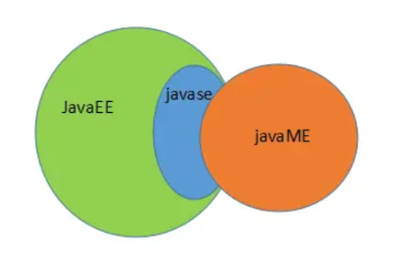

# Java

- ## 初识Java

  - #### 什么是Java？

     > - Java最早是由SUN公司（目前已被Oracle收购）的**詹姆斯·高斯林**在上个世纪90年代初开发的一种编程语言，最初被命名为Oak，目标是针对小型家电设备的嵌入式应用，结果市场没啥反响。谁料到互联网的崛起，让Oak重新焕发了生机，于是SUN公司改造了Oak，在1995年以Java的名称正式发布，原因是Oak已经被人注册了，因此SUN注册了Java这个商标。随着互联网的高速发展，Java逐渐成为最重要的网络编程语言。
     >
     > - 随着Java的发展，SUN给Java又分出了三个不同版本：
     >
     >   - Java SE：Standard Edition
     >   - Java EE：Enterprise Edition
     >   - Java ME：Micro Edition
     >
     > - 三者的关系：
     >
     >   
     >
     > - 简单来说，Java SE就是标准版，包含标准的JVM和标准库，而Java EE是企业版，它只是在Java SE的基础上加上了大量的API和库，以便方便开发Web应用、数据库、消息服务等，Java EE的应用使用的JVM和Java SE完全相同。
     >
     > - 而Java ME的JVM和Java SE的JVM不同，它是一个针对嵌入式设备的“瘦身版”，Java SE的标准库无法在Java ME上使用，Java ME的虚拟机也是“瘦身版”。
     >
     >   > **虚拟机（JVM）：**
     >   >
     >   > - **JVM（JAVA VIRTUAL MACHINE）是一种规范**，是Java最核心技术，也是跨平台的基础。它可以使用软件来实现，例如：IBM, SUN, BEA等；也可以使用硬件来实现，例如：SUM/Intel公司研发的Java芯片。
     >   > - JVM就是一个由软件或硬件模拟的、用于执行bytecodes字节码的计算机。它同样也定义了指令集、寄存器集、结构栈、垃圾收集堆、内存区域。
     >
     > - 毫无疑问，Java SE是整个Java平台的核心，而Java EE是进一步学习Web应用所必须的。我们熟悉的Spring等框架都是Java EE开源生态系统的一部分。不幸的是，Java ME从来没有真正流行起来，反而是Android开发成为了移动平台的标准之一，因此，没有特殊需求，不建议学习Java ME。
     >
     > - 推荐的Java学习路线图如下：
     >
     >   1. 首先要学习Java SE，掌握Java语言本身、Java核心开发技术以及Java标准库的使用。
     >   2. 如果继续学习Java EE，那么Spring框架、数据库开发、分布式架构就是需要学习的。
     >   3. 如果要学习大数据开发，那么Hadoop、Spark、Flink这些大数据平台就是需要学习的，他们都基于Java或Scala开发。
     >   4. 如果想要学习移动开发，那么就深入Android平台，掌握Android App开发。
     >
     >   无论怎么选择，Java SE的核心技术是基础，这个教程的目的就是让你完全精通Java SE并掌握Java EE！

  - #### Java的发展史

     - 1991年，Sun公司的Green项目（Oak语言）
     - 1995年，推出JAVA测试版
     - 1996年，JDK1.0
     - 1998年，JDK1.2，大大改进了早期版本的缺陷，是一个革命性的版本，更名为Java2
     - 1999年，Java分为J2SE、J2EE和J2ME三个版本，其中J2EE的出现标志着JSP/Servlet诞生
     - 2006年，JDK1.6，并且Java各种版本被更名，取消其中的数字"2"：J2EE更名为Java EE, J2SE更名为Java SE，J2ME更名为Java ME
     - 2011年，JDK1.7，也称之为JAVA7版本
     - 2014年，JDK1.8，也称之为JAVA8版本，该版本是当前最广泛使用的版本（LTS）。
     - 2017年，JDK1.9，也称之为JAVA9版本
     - 从2018年开始，每年3月和9月都会发布新JDK版本，并且JDK的命名从10开始递增。
     - 2018年3月，JDK10，也称之为JAVA10版本
     - 2018年9月，JDK11，也称之为JAVA11版本（LTS）
     - ......
     - 2021年3月，JDK16，也称之为JAVA16版本
     - 2021年9月，JDK17，也称之为JAVA17版本（LTS）
     - 2022年3月，JDK18，也称之为JAVA18版本
     - ......

     从1996年发布1.0版本开始，到目前为止，最新的Java版本是Java 23：（本教程使用Java 21长期支持版）

  - #### Java的特点

     > Java介于编译型语言和解释型语言之间。编译型语言如C、C++，代码是直接编译成机器码执行，但是不同的平台（x86、ARM等）CPU的指令集不同，因此，需要编译出每一种平台的对应机器码。解释型语言如Python、Ruby没有这个问题，可以由解释器直接加载源码然后运行，代价是运行效率太低。而Java是将代码编译成一种“字节码”，它类似于抽象的CPU指令，然后，针对不同平台编写虚拟机，不同平台的虚拟机负责加载字节码并执行，这样就实现了“一次编写，到处运行”的效果。当然，这是针对Java开发者而言。对于虚拟机，需要为每个平台分别开发。为了保证不同平台、不同公司开发的虚拟机都能正确执行Java字节码，SUN公司制定了一系列的Java虚拟机规范。从实践的角度看，JVM的兼容性做得非常好，低版本的Java字节码完全可以正常运行在高版本的JVM上。

  - #### JDK和JRE

     - ##### JDK：Java Development Kit（Java开发工具包）

     - ##### JRE：Java Runtime Environment（Java的运行环境）

     > 简单来说，JRE就是运行Java程序所需的环境，包括运行Java字节码的虚拟机及需要的核心库。而JDK则包含了编译Java代码所需的编译器、调试器等开发工具。

     ###### **注意**：从JDK9开始，jdk的目录中就没有单独的jre目录了，JDK中已经内嵌了JRE，所以没必要再额外包含JRE了，需要单独的JRE则单独下载即可。

     > **扩展知识：JSR和JCP又是啥？**
     >
     > - JSR规范：Java Specification Request（Java规范请求）
     > - JCP组织：Java Community Process（Java社区流程）
     >
     > 为了保证Java语言的规范性，SUN公司搞了一个JSR规范，凡是想给Java平台加一个功能，比如说访问数据库的功能，大家要先创建一个JSR规范，定义好接口，这样，各个数据库厂商都按照规范写出Java驱动程序，开发者就不用担心自己写的数据库代码在MySQL上能跑，却不能跑在PostgreSQL上。
     >
     > 所以JSR是一系列的规范，从JVM的内存模型到Web程序接口，全部都标准化了。而负责审核JSR的组织就是JCP组织。
     >
     > 一个JSR规范发布时，为了让大家有个参考，还要同时发布一个“参考实现”，以及一个“兼容性测试套件”：
     >
     > - RI：Reference Implementation
     > - TCK：Technology Compatibility Kit
     >
     > 比如有人提议要搞一个基于Java开发的消息服务器，这个提议很好啊，但是光有提议还不行，得贴出真正能跑的代码，这就是RI。如果有其他人也想开发这样一个消息服务器，如何保证这些消息服务器对开发者来说接口、功能都是相同的？所以还得提供TCK。
     >
     > 通常来说，RI只是一个“能跑”的正确的代码，它不追求速度，所以，如果真正要选择一个Java的消息服务器，一般是没人用RI的，大家都会选择一个有竞争力的商用或开源产品。

  - #### Java开发环境搭建

     > 1. 到Oracle官网下载对应版本的JDK（Oracle JDK），双击安装即可。注意：安装路径不要有中文、空格或特殊字符。（LTS后缀的JDK是长期支持版）
     >
     > 2. 配置环境变量（Windows）：（安装高版本JDK会自动配一个javapath环境变量，可以删掉）
     >
     >    1. 在系统环境变量中添加`JAVA_HOME`环境变量，值为JDK的安装目录（没有`bin\`）。
     >
     >       > 由于后面用到的很多工具，如Maven、Tomcat..等，都是Java写的，都需要依赖JDK来运行。并且它们运行默认都会去找`JAVA_HOME`所指定的JDK，因此这里这样配置比较通用。
     >
     >    2. 在系统环境变量`Path`中追加：`%JAVA_HOME%\bin`
     >
     >    3. 打开DOS命令窗口，输入`java`并回车，如果出现Java21的版本号说明配置成功。
     >
     >
     > 之所以要配置环境变量，是因为我们开发时要在不同位置执行`java/javac`命令，而DOS中执行的所有命令都必须在Path环境变量中配置，这样系统才知道该命令所对应的可执行程序在哪里。

     ###### 细心的童鞋还可以在`JAVA_HOME`的`bin`目录下找到很多可执行文件：

     - `java`：这个可执行程序其实就是JVM，运行Java程序，就是启动JVM，然后让JVM执行指定的编译后的代码。
     - `javac`：这是Java的编译器，它用于把Java源码文件（以`.java`后缀结尾）编译为Java字节码文件（以`.class`后缀结尾）。
     - `jar`：用于把一组`.class`文件打包成一个`.jar`文件，便于发布。
     - `javadoc`：用于从Java源码中自动提取注释并生成文档。
     - `jdb`：Java调试器，用于开发阶段的运行调试。

  - #### 常用的DOS命令

     - ##### DOS简介：

       > - DOS是英文“Disk Operating System”的缩写，其中文含意是“磁盘操作系统”。简单来说，DOS就是一个单用户、单任务的操作系统。
       > - 从1981年直到1995年的15年间，磁盘操作系统在IBM PC兼容机市场中占有举足轻重的地位。而且，若是把部分以DOS为基础的Microsoft Windows版本，如Windows 95、Windows 98和Windows Me等都算进去的话，那么其商业寿命至少可以算到2000年。微软的所有后续版本中，磁盘操作系统仍然被保留着。
       > - 家族包括MS-DOS、PC-DOS、DR-DOS、PTS-DOS、ROM-DOS、JM-OS等，其中以MS-DOS最为著名。虽然这些系统常被简称为“DOS”，但几乎没有系统单纯以“DOS”命名（只有一个毫无关连的1960年代IBM大型主机操作系统以此命名）。此外，有几个和DOS无关、在非x86的微计算机系统上运行的磁盘操作系统在名称中也有“DOS”字眼，而且在专门讨论该机器的场合中也会简称为“DOS”（例如：AmigaDOS、AMSDOS、ANDOS、AppleDOS、Atari DOS、Commodore DOS、CSI-DOS、ProDOS、TRS-DOS等），但这些系统和DOS可执行文件以及MS-DOS API并不兼容。

     - ##### 常用的DOS命令：

       > cd、md、rd、copy、del、ipconfig、ping、exit、cls、help...

       ###### 注意：DOS命令不区分大小写，但是文件或文件夹需要区分大小写。

  - #### 第一个Java程序：HelloWorld

     1. 新建一个文件`Hello.java`，用记事本打开并输入以下代码：

        ```java
        public class Hello {
            public static void main(String[] args) {
            	System.out.println("Hello, World!"); // 该语句可以调用操作系统标准输出流打印出Hello World
            }
        }
        ```

        > 简单做下说明：
        >
        > - clsss关键字声明的是一个Java类，类名通常遵循**大驼峰命名规范**。
        >
        > - public是类的**访问权限修饰符**，类的访问权限可以是`public`或`不加任何修饰符`。
        >
        > - Java规定：某个类定义的`public static void main(String[] args)`是Java程序**唯一的**固定**入口方法/主方法**。JVM总是从`main`主方法开始执行一个Java程序。
        >
        >   > 方法是可执行的代码块，一个方法除了方法名main，还有用`()`括起来的方法参数，这里的main方法有一个参数，参数类型是`String[]`，参数名（变量）是`args`，`public、static`用来修饰方法，表示它是一个公开的静态方法，`void`是方法的返回类型，而花括号`{}`中间的就是方法体，里面是具体要执行的方法代码。
        >
        > - 最后，当我们把Java代码保存为文件时，文件后缀必须是`.java`。而且文件名也要注意，在Java中，**`public`修饰的类名必须和文件名保持一致**。
        >
        > - 一个Java文件中允许写多个类，但是其中被public修饰的类的类名必须和该文件名保持一致。通常一个类对应一个`.java`文件。
        >
        > - 注意：Java源码的缩进不是必须的，但是用缩进后，格式好看，很容易看出代码块的开始和结束。后端代码的缩进一般是4个空格，前端代码的缩进一般是2个空格。
        >

     2. 将Java程序编译为字节码（`.class`）：`javac Hello.java`

     3. 启动JVM，加载并运行编译好的字节码文件（将编译好的字节码放到JVM上运行）：`java Hello`

        > 注意：给JVM虚拟机传递的参数`Hello`是我们定义的类名，JVM启动后会自动查找对应的`类名.class`文件装载并执行。

     ###### 扩展：

     - 有一些童鞋可能知道，直接运行`java Hello.java`也是可以的：`java Hello.java`。这是Java 11（JDK11）新增的一个功能，它可以直接运行一个单文件源码！
     - 需要注意的是，在实际项目中，单个不依赖第三方库的Java源码是非常罕见的，所以，绝大多数情况下，我们无法直接运行一个Java源码文件，原因是它需要依赖其他的库，需要先将依赖的包编译成class，再去运行才行。

  - #### 主方法中的参数

    > Java程序的入口是`main`方法（主方法），而`main`方法可以接受命令行参数。这些参数由用户输入，JVM接收并传给main方法的`String[]`型参数args中。（注意：接收的是`java 类名`后面的参数）

  - #### 输入和输出

     - 输出：在前面的代码中，我们总是使用`System.out.println()`来向屏幕输出一些内容。`println`是print line的缩写，表示输出并换行。因此，如果输出后不想换行，可以用`System.out.print()`。

     - 格式化输出：Java还提供了格式化输出的功能。为什么要格式化输出？因为计算机表示的数据不一定适合人来阅读。

        > 如果要把数据显示成我们期望的格式，就需要使用格式化输出的功能。格式化输出使用`System.out.printf()`，通过使用占位符`%?`，`printf()`可以把后面的参数格式化成指定格式：

        ```java
        // 格式化输出
        public class Main {
            public static void main(String[] args) {
                double d = 3.1415926;
                System.out.printf("输出：%.2f", d); // 输出：3.14
                System.out.printf("输出：%.4f", d); // 输出：3.1416
            }
        }
        ```

        > Java的格式化功能提供了多种占位符，可以把各种数据类型“格式化”成指定的字符串：
        >
        > | 占位符 | 说明                             |
        > | ------ | -------------------------------- |
        > | %d     | 格式化输出整数                   |
        > | %x     | 格式化输出十六进制整数           |
        > | %f     | 格式化输出浮点数                 |
        > | %e     | 格式化输出科学计数法表示的浮点数 |
        > | %s     | 格式化字符串                     |
        >
        > 注意：由于`printf`中`%`表示占位符，因此如果要输出字符`%`，要用连续两个`%%`表示一个`%`字符本身。
        >
        > 占位符本身还可以有更详细的格式化参数。下面的例子把一个整数格式化成十六进制，并用0补足8位：
        >
        > ```java
        > // 格式化输出
        > public class Main {
        >     public static void main(String[] args) {
        >         int n = 12345000;
        >         System.out.printf("n=%d, hex=%08x", n, n); // 注意，两个%占位符必须传入两个数
        >     }
        > }
        > ```
        >
        > 详细的格式化参数请参考JDK文档[java.util.Formatter](https://docs.oracle.com/en/java/javase/21/docs/api/java.base/java/util/Formatter.html#syntax)

     - 输入：Java提供`Scanner`对象来方便输入，读取对应的类型可以使用：`scanner.nextLine()` / `nextInt()` / `nextDouble()` / ...

        > 和输出相比，Java的输入就要复杂得多。我们先看一个从控制台读取一个字符串和一个整数的例子：
        >
        > ```java
        > import java.util.Scanner;
        > 
        > public class Main {
        >     public static void main(String[] args) {
        >         Scanner scanner = new Scanner(System.in); // 创建Scanner对象
        >         System.out.print("Input your name: "); // 打印提示
        >         String name = scanner.nextLine(); // 读取一行输入并获取字符串
        >         System.out.print("Input your age: "); // 打印提示
        >         int age = scanner.nextInt(); // 读取一行输入并获取整数
        >         System.out.printf("Hi, %s, you are %d\n", name, age); // 格式化输出
        >     }
        > }
        > ```
        >
        > 1. 首先创建`Scanner`对象并传入`System.in`。`System.out`代表标准输出流，而`System.in`代表标准输入流。直接使用`System.in`读取用户输入虽然是可以的，但需要更复杂的代码，而通过`Scanner`就可以简化后续的代码。
        > 2. 有了`Scanner`对象后，要读取用户输入的字符串，使用`scanner.nextLine()`，要读取用户输入的整数，使用`scanner.nextInt()`。`Scanner`对象的这些方法可以自动转换数据类型，避免了手动转换。
        >
        > 要测试输入，必须从命令行读取用户输入：
        >
        > ```bash
        > $ java Main
        > Input your name: Bob ◀── 输入 Bob
        > Input your age: 12   ◀── 输入 12
        > Hi, Bob, you are 12  ◀── 输出
        > ```
        >
        > 根据提示分别输入一个字符串和整数后，我们得到了格式化的输出。

  - #### 关于Java程序的一些说明

     - Java中严格区分大小写。每个**Java语句必须以`;`结束**。

     - 程序中，程序员可以自由命名的被称为**标识符**。**Java中的标识符由字母（Unicode字符）、数字、下划线、美元符号组成，且不能以数字开头**。哪些地方可以用标识符：类名、变量名、包名、方法名、接口名、常量名。

     - `class、public、static、..`等程序中预定义的、有特殊含义的标识符被称为**关键字**。Java中的关键字都是小写。（标识符命名不能和已定义的关键字冲突）

       > Java规范了50个关键字（包含了goto、const两个保留字）。还有额外的三个字面量：`true、false、null`，虽然不是关键字，但是我们也把他们看做是关键字。

     - Java中的注释分为：单行注释（`//注释`）、多行注释（`/*注释*/`）和文档注释（`/**注释*/`）。其中文档注释可以被`javadoc`命令解析生成说明文档。

     - Java中switch语句的值只能是如下类型：整型、枚举型（JDK5）、String（jdk7）。

       > 从JDK12开始，`switch`语句升级为更简洁的表达式语法，使用类似模式匹配（Pattern Matching）的方法，保证只有一种路径会被执行，并且不需要`break`语句，没有**Case穿透**问题：
       >
       > ```java
       > public class Main {
       >     public static void main(String[] args) {
       >         String fruit = "apple";
       >         switch (fruit) {  // 注意新语法使用->，如果有多条语句，需要用{}括起来。
       >             case "apple" -> System.out.println("Selected apple");
       >             case "pear" -> System.out.println("Selected pear");
       >             case "mango" -> {
       >                 System.out.println("Selected mango");
       >                 System.out.println("Good choice!");
       >             }
       >             default -> System.out.println("No fruit selected");
       >         }
       >     }
       > }
       > ```
       >
       > 并且**从Java 14开始，`switch`语句正式升级为表达式**，可以直接返回值。
       >
       > ```java
       > // switch
       > public class Main {
       >     public static void main(String[] args) {
       >         String fruit = "apple";
       >         int opt = switch (fruit) {
       >             case "apple" -> 1;
       >             case "pear", "mango" -> 2;
       >             default -> 0;
       >         }; // 注意赋值语句要以;结束
       >         System.out.println("opt = " + opt);
       >     }
       > }
       > ```
       >
       > 如果分支里面有复杂的语句，需要使用`yield`关键字为switch语句指定分支的返回值。旧的switch语句要返回一个值也需要用`yield`关键字。
       >
       > ```java
       > // yield
       > public class Main {
       >     public static void main(String[] args) {
       >         String fruit = "orange";
       >         int opt = switch (fruit) {
       >             case "apple" -> 1;
       >             case "pear", "mango" -> 2;
       >             default -> {
       >                 int code = fruit.hashCode();
       >                 yield code; // switch语句返回值
       >             }
       >         };
       >         System.out.println("opt = " + opt);
       >     }
       > }
       > ```
     
     - Java中的`for each`循环可以遍历所有**可迭代**的数据类型（实现了 `Iterator` 接口），包括数组及后面的`List`、`Map`等。虽然`for each`的写法更简洁，但是`for each`循环无法指定遍历顺序，也无法获取数组的索引。

   - #### 变量

      - **定义变量**：`数据类型 变量名 = 值;`，Java中的**变量必须先定义再使用**。

      - **局部变量**：在方法内部定义的变量称为局部变量，局部变量作用域从变量声明处开始到对应的块结束。方法参数也是局部变量。

      - **成员变量**：

      - **常量**：`final`修饰的变量是常量，一旦赋值后就不可修改。通常常量名全部大写。（后面还会继续说`final`关键字）

      - **var**：有些时候，类型的名字太长，写起来比较麻烦。例如：`StringBuilder sb = new StringBuilder();`，此时可以用`var`关键字：`var sb = new StringBuilder();`，编译器会根据赋值语句自动推断出变量`sb`的类型是`StringBuilder`。对编译器来说，这里的`var`就是`StringBuilder`。

      - **变量的作用域**：变量只在离它最近的`{}`中有效，这就是它的作用域。

        > - 在语句块中定义的变量，它有一个作用域，就是从定义处开始，到语句块结束。超出了作用域引用这些变量，编译器会报错。
     > - 定义变量时，要遵循作用域最小化原则，尽量将变量定义在尽可能小的作用域。局部变量必须先初始化再使用。

   - #### 基本运算

      - ##### 整数运算：

        - Java的整数运算遵循四则运算规则，可以任意嵌套小括号。四则运算规则和初等数学一致。

        - 整数的数值表示不但是精确的，而且整数运算永远是精确的，即使是除法也是精确的，因为两个整数相除只能得到结果的整数部分（向下取整）。注意：整数的除法对于除数为0时运行时将报错，但编译不会报错。

        - 要特别注意，整数由于存在范围限制，如果计算结果超出了范围，就会产生溢出，而溢出*不会出错*，但会得到一个奇怪的结果（和数值在计算机内部的存储方式有关）。

        - Java还提供了自增/自减运算符（`++`/`--`），它们可以对一个整数进行加1和减1的操作。注意`++`写在前面和后面计算结果是不同的，`++n`表示先加1再引用n，`n++`表示先引用n再加1。

        - **移位运算**：Java中，双箭头`>>/<<`是移位运算符（算数位移），而`>>>`是逻辑右移运算符。左移实际上就是不断地×2，右移实际上就是不断地÷2。

        - **位运算**：`&、|、^、~`，这些都是位运算符。（当`&`和`|`的两边是整数型，它们被识别为位运算符）

      - ##### 浮点数运算：

        - 浮点数运算和整数运算相比，只能进行加减乘除这些数值计算，不能做位运算和移位运算。
     - 整数运算在除数为`0`时会报错，而浮点数运算在除数为`0`时，不会报错，但会返回几个特殊值：
          - `NaN`表示Not a Number
          - `Infinity`表示无穷大
          - `-Infinity`表示负无穷大
        - Java的浮点数完全遵循[IEEE-754](https://standards.ieee.org/ieee/754/6210/)标准，这也是绝大多数计算机平台都支持的浮点数标准表示方法。
        - 在计算机中，浮点数虽然表示的范围大，但是，浮点数有个非常重要的特点，就是浮点数常常无法精确表示。如浮点数`0.1`在计算机中就无法精确表示，`0.5`这个浮点数又可以精确地表示（二进制无法完全表示十进制浮点数）。
        - 因为浮点数常常无法精确表示，因此，浮点数运算常常会产生误差。于浮点数存在运算误差，所以比较两个浮点数是否相等常常会出现错误的结果。正确的比较方法是判断两个浮点数之差的绝对值是否小于一个很小的数。
        - 由于float/double在计算机内存中是按照IEEE754标准来存的，故float4个字节也比long8个字节能表示的数字大。因此如果参与运算的两个数其中一个是整型，那么整型会自动提升到浮点型。这依然遵循“小类型”会被自动转为“大类型”。
        - 可以将浮点数强制转型为整数。在转型时，浮点数的小数部分会被丢掉。如果转型后超过了整型能表示的最大范围，将返回整型的最大值。如果要进行四舍五入，可以对浮点数加上`0.5`再强制转型。

      - **布尔运算**：布尔运算是一种关系运算，包括以下几类。

        - 比较运算符：`>`，`>=`，`<`，`<=`，`==`，`!=`
     - 与运算 `&&`、`&`
        - 或运算 `||`、`&`
        - 非运算 `!`

        > 注意：`&&`、`||`和`&`、`|`的区别是， 前者会短路，后者不会。一般`&&`更常用，因短路特性更安全高效。

      - **自动类型转换（类型提升）与强制类型转换**：

        - ###### 自动类型转换：

          > 1. 在整型做运算时，如果参与运算的两个整型类型不一致，那么首先会自动转成较大的那个，然后再计算。特殊的是：byte、short、char在做运算时，各自会先转成int，再做计算。
       > 2. “小类型”变量被赋值给“大类型”变量时，会存在**自动类型转换**：`byte` -> `short` -> `int` -> `long` -> `float` -> `double`。如果是引用类型，子类会自动转为父类。

        - ###### 强制类型转换：

          > “大类型”被赋值给“小类型”时，则需要手动做强制类型转换。语法：`(类型)变量名`。如果对整数型做强转，则高位会被丢弃掉，仅保留低位的字节。

- ## 数据类型

   - #### 变量的数据类型

      - ##### 基本数据类型：

        > 基本数据类型是CPU可以直接进行运算的类型。Java中的**基本数据类型**包括：（1248、4812）`byte(1)/short(2)/int(4)/long(8)/float(4)/double(8)/boolean(1)/char(2)`

      - ##### 引用数据类型：

        > 除了上述的基本数据类型，剩下的都是引用数据类型。例如，引用类型最常用的就是`String`字符串：`String s = "hello";`。引用类型的变量类似于C语言的指针，存储的是一个“引用地址”，指向某个对象在内存的地址。

   - #### 字面量的类型（值类型）

      - ##### 整数值：

        - **默认情况下，数字字面量值都被当做十进制int型处理**；`0B/0b`开头表示二进制的int型字面量（JDK8），这是c语言（C99）中没有的；`0x/0x`开头表示十六进制的int型字面量；`0`开头表示8进制的int型字面量。

          > 若要将数字当做long类型字面量，需要在数字后面加`L/l`。

      - ##### 浮点数值：

        - 默认带小数点的字面量会被当做double型处理；如果想当做float型，需要在字面量后面加F/f。
        - 浮点型字面量还可以用科学计数法表示小数：`4.9e-32`。

      - **布尔值**：布尔型字面量只有两个值`true/false`。

        > Java语言对布尔类型的存储并没有做规定，因为理论上存储布尔类型只需要1 bit，但是通常JVM内部会把`boolean`表示为4字节整数。

      - ##### 字符：

        - 用`'`单引号括起来的字符是`char`字符类型，它是基本数据类型之一。（其实char类型本质上保存的也是数字，只是输出时会显示对应的Unicode字符而已）

          > 因为Java在内存中总是使用UTF16表示字符，所以，英文字符和大部分的中文字符都可以用一个`char`类型表示，它们都占用两个字节。
      
        - 要显示一个字符的Unicode编码，只需将`char`类型直接赋值给`int`类型即可：
      
          ```java
          int n1 = 'A'; // 字母“A”的Unicodde编码是65
          int n2 = '中'; // 汉字“中”的Unicode编码是20013
          ```

        - 还可以直接用转义字符`\u`+Unicode码点来表示一个字符：

          ```java
          // 注意是十六进制:
          char c3 = '\u0041'; // 'A'，因为十六进制0041 = 十进制65
          char c4 = '\u4e2d'; // '中'，因为十六进制4e2d = 十进制20013
          ```

          > 其中`\u`表示是Unicode编码，后面跟上该字符对应的2字节16进制的码点（因为是UTF-16编码）

        - **Java中，表示`char`型的单引号中必须有东西**，因此`''`空字符可以用`'\u0000'`来表示。（Java中，不能直接给char型变量赋值`''`）
      
      - ##### 字符串：
      
        - 和单引号表示的`char`类型不同，用双引号`"`括起来的一串内容被当做字符串字面量（不可变），是引用类型`String`。一个字符串可以存储0个到任意个字符。（Java中`String`型是引用类型，保存的是字符串字面量的引用地址）
      
        - 当加号`+`左右两边有一个是字符串，那么加号会作为**字符串连接符**。如果用`+`连接字符串和其他数据类型，会将其他数据类型先做自动类型转换，转为字符串之后再进行连接。
      
          > 由于字符串字面量是不可变的，因此`+`做完拼接后返回的是新字符串的引用地址。
      
        - 有些字符具有特殊含义，比如`"`括起来的就是字符串，如果想要输出`"`，就需要用`\`转义字符将其进行转义。
      
          > 常见的转义字符包括：
          >
          > - `\"` 表示字符`"`
          > - `\'` 表示字符`'`
          > - `\\` 表示字符`\`
          > - `\n` 表示换行符
          > - `\r` 表示回车符
          > - `\t` 表示Tab
          > - `\u####` 表示一个Unicode编码的字符
      
        - 从JDK13开始，可以用`"""多行字符串"""`表示多行字符串了。
      
          ```java
          // 多行字符串
          public class Main {
              public static void main(String[] args) {
                  String s = """
                             SELECT * FROM
                               users
                             WHERE id > 100
                             ORDER BY name DESC
                             """;
                  System.out.println(s);
              }
          }
          ```
      
          > 上述多行字符串内容中会带上`\n`，实际上是5行字符串，在最后一个`DESC`后面还有一个`\n`。输出：
          >
          > ```txt
          > SELECT * FROM
          >   users
          > WHERE id > 100
          > ORDER BY name DESC
          > 
          > ```
      
          > 如果我们不想在字符串末尾加一个`\n`，就需要这么写：
      
          ```java
          String s = """ 
                     SELECT * FROM
                       users
                     WHERE id > 100
                     ORDER BY name DESC""";
          ```
      
          > 并且多行字符串前面共同的空格会被去掉，是以最短的行首空格为基准：
      
          ```java
          String s = """
          ...........SELECT * FROM
          ...........  users
          ...........WHERE id > 100
          ...........ORDER BY name DESC
          ...........""";
          ```
      
          > 用`.`标注的空格都会被去掉。
      
      - **`null`**：引用类型的变量可以指向一个空值`null`，它表示不存在，即该变量不指向任何对象，地址为空。
      
      - **数组**：如果要定义一组类型相同的变量，可以使用该类型的数组类型（引用类型）。数组的初始化：
      
        - 静态初始化：`类型[] 数组名 = new 类型[]{值1,..};`（其中`new 类型[]`可省略）
        
        - 动态初始化：`类型[] 数组名 = new 类型[n];`
        
          > 二维数组动态初始化：`int[][] arr = new int[3][2]`或`int[][] arr = new int[3][]`。
        
        > **Java中的数组的特点：**
        >
        > - 数组是同一数据类型的集合，一旦创建后，大小就不可变，并且在内存中的地址是连续的（读取快）。
        > - 数组中的元素可以是任意类型：值类型（如`int`）或引用类型（如`String`）
        > - 可以通过索引访问数组元素，但索引超出范围将报错：`arr[0]`
        > - 数组本质也是引用类型，并且有`length`属性。
        > - 数组动态初始化后每个元素都有默认值。

- ## 面向对象编程

   > Java是一种面向对象的编程语言。面向对象编程（Object-Oriented Programming）简称OOP。那什么是面向对象编程？

   - #### 面向对象编程：

     > 和面向对象编程不同的，是面向过程编程。面向过程编程，是把模型分解成一步一步的过程。比如，老板告诉你，要编写一个TODO任务，必须按照以下步骤一步一步来：
     >
     > 1. 读取文件；
     > 2. 编写TODO；
     > 3. 保存文件。
     >
     > 而面向对象编程则是：将现实世界中的某种事物抽象为类，将事物本身所具有的特征和行为，抽象为类的属性和方法，用类之间的关系来描述现实世界中不同事物之间的联系。然后通过类来创建出一个个的对象，对应现实中的一个个事物个体。进而通过一个个的对象来模拟现实中的事物，完成对应的工作过程。这种编程的方式被称为**面向对象编程**。

   - #### 面向对象的基本概念：

     - **类（class）**：类是对象的模板，用于创建具有同一种特征的不同的对象个体。类中包含了一类事物的**属性**和**方法**，对应现实中某类事物的特征和行为。比如：学生就是一个类，学生类中包含姓名、年龄等特征，并且学生可以进行学习。对应的代码为：

       ```java
       public class Student {
           private String name; // 默认为null
           private int age; // 默认为0
           private void study(){
               System.out.println(this.name +"正在学习..");
           }
       }
       ```

       > - Java是面向对象的语言，它通过类来组织代码，所有的Java代码都必须放在类中。类通过关键字`class`来定义：`修饰符列表 class 类名{/*类体*/}`。
       >
       > - 类中的属性有时也称为“成员”或“字段”。类中的属性如果没有赋值会有默认值。（引用类型的默认值为`null`）
       >
       > - **方法**只能定义在类中。Java中方法的基本结构：
       >
       >   ```java
       >   修饰符列表 返回类型 方法名(参数列表) { // 方法体
       >       若干方法语句;
       >       return 方法返回值;
       >   }
       >   ```
       >
       > - Java中没有函数只有方法，**方法是 Java 程序最小的执行单元**。方法不能独立存在，必须定义在类中。Java通过类中方法的执行来完成对应的工作。
       >
       > - Java中的方法不能重复，可以重载。两个方法的方法名相同，且参数列表相同（参数的个数相同且参数类型相同），则认为这两个方法是相同的。
       >
       >   > **方法重载：**
       >   >
       >   > 在同一个类中，允许存在一个以上的同名方法，只要它们的参数列表不同即可。调用时通过形参来决定调用哪个方法。满足这样特点的多个方法彼此之间称为**方法的重载**。
       >   >
       >   > 重载与形参名、返回值类型、权限修饰符都没关系，只和形参和方法名有关。
       >
       > - 方法的可变长参数：可变参数用`类型... 变量名`定义，它实际上是一个数组。
       >
       >   > 完全可以把可变长参数改写为数组类型，不过有2个问题：
       >   >
       >   > 1. 调用时必须传一个数组进来。
       >   > 2. 调用时可以传入`null`。
       >   >
       >   > 而可变参数可以保证无法传入`null`，因为传入0个参数时，接收到的实际值是一个空数组而不是`null`。
   
     - **对象/实例（object/instance）**：通过类可以创建一个个具有相同特征的不同实例，每个对象实例都是独立的个体。虽然它们的值可能不同，但都具有一样的结构。对应的代码为：
   
       ```java
       public static void main(String[] args) {
           Student s1 = new Student();
           s1.name = "张三";
           Student s2 = new Student();
           s2.name = "李四";
           
           s1.study();
           s2.study();
           System.out.println(s1==s2);
       }
       ```
   
       > - 类和对象是“模版”和“实例”的关系。定义类的同时也定义了一种数据类型，对应的对象是这种类型的值。
       > - 同一个类的对象必然有相同的属性和方法，但它们各自的值不同，且在内存中相互独立互不干扰。
       > - 通过`new`操作符调用类的**构造函数**可以创建对应类的对象实例，然后用该类型的变量指向它，即可通过变量来引用这个对象。（变量中保存的是对象在堆中的引用地址）
       > - 访问对象的属性/方法通过`.`运算符：`变量名.属性名/方法名();`
   
   - #### 访问控制权限修饰符：
   
     > Java中，类中的属性和方法（还有内部类）有以下4种访问权限：
   
     | 修饰符       | 类内部 | 同一个包 | 子类（不同包） | 其他包 |
     | :----------- | :----- | :------- | :------------- | :----- |
     | `private`    | ✔      | ✖        | ✖              | ✖      |
     | 默认（不写） | ✔      | ✔        | ✖              | ✖      |
     | `protected`  | ✔      | ✔        | ✔              | ✖      |
     | `public`     | ✔      | ✔        | ✔              | ✔      |
   
     > **注意**：而类/接口/抽象类/枚举/注解的访问权限修饰符只有两种，**public**和**默认（不写）**。并且public的类名必须和该类所在的文件名保持一致。
     >
     > 如果一个类没有被public修饰，那么其他包的类中`import`导入该类时会编译报错，无法导入默认权限类！
   
   - #### 构造方法：
   
     > 当我们通过new来创建类的实例时，实际上是在调用类的构造方法。类中定义构造方法：
   
     ```java
     public class A {
         访问控制权限修饰符 类名(参数列表){/*构造方法体*/}
     }
     ```
   
     > - 和普通方法相比，构造方法没有返回值（也没有`void`）。构造方法必须用`new`关键字来调用。构造方法同样可以重载。
     >
     > - 并且如果类体中没有写任何构造方法时，编译器会自动为我们生成一个默认构造方法，它没有参数，也没有执行语句，类似这样：
     >
     >   ```java
     >   class Person {
     >       public Person() {}
     >   }
     >   ```
     >   
     >> 相当于：
     >   
     >```java
     >   class Person {}
     > ```
     >   
     >   > 注意：如果我们自定义了一个构造方法，那么编译器就不再创建默认的无参构造方法。
     >
     > - 构造方法中可以通过`this`关键字来调用其他的构造方法，这样做的目的是便于代码复用。语法：`this(实参)`
     >
     > - 构造方法不会被子类所继承。
     
   - #### 类的继承：
   
     > - 继承是面向对象编程中非常强大的一种机制，它首先可以复用代码。当我们让`Student`从`Person`继承时，`Student`就获得了`Person`的所有功能，我们只需要为`Student`编写新增的功能。其次还可以节省内存，避免相似的类的属性和方法在内存中被重复定义多次。
     >
     > - Java使用`extends`关键字来完成类的继承（单继承）
     >
     >   ```java
     >   class Person {
     >       private String name;
     >       private int age;
     >   
     >       public String getName() {...}
     >       public void setName(String name) {...}
     >       public int getAge() {...}
     >       public void setAge(int age) {...}
     >   }
     >   
     >   class Student extends Person {
     >       private int score;
     >   
     >       public int getScore() { … }
     >       public void setScore(int score) { … }
     >   }
     >   ```
     >
     >   > 通过继承父类，子类`Student`中就有了父类中所有的属性和方法了，因此不要再重复name和age字段/方法了，只需要定义自己独有的属性和方法即可，不再需要写重复代码。
     >
     > - 子类继承父类之后，会自动获得父类中的所有的属性和方法（包括静态的），严禁定义与父类重名的字段！（构造方法不会被子类所继承）
     >
     > - 在OOP的术语中，我们把`Person`称为超类（super class），父类（parent class），基类（base class），把`Student`称为子类（subclass），扩展类（extended class）。
     >
     > - Java中的类只允许单继承，一个类有且仅有一个父类。并且一个类如果没有显式的写`extends`，默认会继承`Object`类。而`Object`类比较特殊，它是继承链的顶端，没有父类。
   
   - #### 阻止继承：
   
     > 从Java 15开始，允许使用`sealed`修饰class，并通过`permits`明确写出能够从该class继承的子类名称。
     >
     > 例如，定义一个`Shape`类：
     >
     > ```java
     > public sealed class Shape permits Rect, Circle, Triangle {...}
     >    ```
     > 
     > 上述`Shape`类就是一个`sealed`类，它只允许指定的3个类继承它。如果写：
     >
     > ```java
     >public final class Rect extends Shape {...}
     > ```
     > 
     > 是没问题的，因为`Rect`出现在`Shape`的`permits`列表中。但是，如果定义一个`Ellipse`就会报错：
     >
     > ```java
     >public final class Ellipse extends Shape {...}
     > // Compile error: class is not allowed to extend sealed class: Shape
     > ```
     > 
     > 原因是`Ellipse`并未出现在`Shape`的`permits`列表中。这种`sealed`类主要用于一些框架，防止继承被滥用。
     >
     > `sealed`类在Java 15中目前是预览状态，要启用它，必须使用参数`--enable-preview`和`--source 15`。
     
   - #### 区分继承和组合：
   
     > 在使用继承时，我们要注意逻辑一致性。
     >
     > 考察下面的`Book`类：
     >
     > ```java
     > class Book {
     >     protected String name;
     >     public String getName() {...}
     >     public void setName(String name) {...}
     > }
     > ```
     >
     > 这个`Book`类也有`name`字段，那么，我们能不能让`Student`继承自`Book`呢？
     >
     > ```java
     > class Student extends Book {
     >     protected int score;
     > }
     > ```
     >
     > 显然，从逻辑上讲，这是不合理的，`Student`不应该从`Book`继承，而应该从`Person`继承。
     >
     > 究其原因，是因为`Student`是`Person`的一种，它们是is关系，而`Student`并不是`Book`。实际上`Student`和`Book`的关系是has关系。
     >
     > 具有has关系不应该使用继承，而是使用组合，即`Student`可以持有一个`Book`实例：
     >
     > ```java
     > class Student extends Person {
     >     protected Book book;
     >     protected int score;
     > }
     > ```
     >
     > 因此，继承是is关系，组合是has关系。子类和父类的关系是is，has关系不能用继承。
   
   - #### 方法的重写/覆盖（Override）：
   
     > 在继承关系中，子类如果定义了一个与父类方法签名完全相同的方法，被称为**覆写/重写（Override）**。子类可以覆写父类的方法（Override），覆写在子类中改变了父类方法的行为；
     >
     > 方法上可以加`@Override`注解，来让编译器帮助检查是否进行了正确的覆写。希望进行覆写，但是不小心写错了方法签名，编译会报错。
   
     ###### `final`关键字：
   
     - final修饰的类无法被继承，并且final修饰的属性和方法不能被覆盖。final修饰的属性，对象初始化时系统不会赋默认值，因此`final`修饰的field必须在创建对象时初始化，随后就不可更改了。
   
     - 通常实例变量不会加final，因为实例变量一个对象一份，且每个对象都一样的话为什么不设置为静态变量来节省空间呢？
   
       因此通常静态变量会加final，变成了常量，只有一个且不能被改。且常变量一般用`public static final`来修饰，因为公开也不怕被改，称为“全局常量”，一般全部大写。此时这个引用是永久指向，永远不会为`null`，垃圾回收器回收不走。
   
     ###### 重写Object方法：
   
     > 因为所有的`class`最终都继承自`Object`，而`Object`定义了几个重要的方法：
     >
     > - `toString()`：把对象输出为`String`；
     > - `equals()`：判断两个对象是否逻辑相等。（`==`判断的是对象的内存地址/引用地址）
     > - `hashCode()`：计算一个对象的哈希值。
     >
     > 在必要的情况下，我们可以覆写`Object`的这几个方法。例如：
     >
     > ```java
     > class Person {
     >     ...
     >     // 显示更有意义的字符串:
     >     @Override
     >     public String toString() {
     >         return "Person:name=" + name;
     >     }
     > 
     >     // 比较是否相等:
     >     @Override
     >     public boolean equals(Object o) {
     >         // 当且仅当o为Person类型:
     >         if (o instanceof Person) {
     >             Person p = (Person) o;
     >             // 并且name字段相同时，返回true:
     >             return this.name.equals(p.name);
     >         }
     >         return false;
     >     }
     > 
     >     // 计算hash:
     >     @Override
     >     public int hashCode() {
     >         return this.name.hashCode();
     >     }
     > }
     > ```
   
   - #### `this`和`super`关键字：
   
     > 在类体中有2个特殊的变量this和super，它们只能在**实例相关的上下文中使用**（实例方法、构造方法、实例代码块、实例变量初始化）。静态上下文中不能使用 `this`，因为静态成员不依赖于对象。
   
     - **this**：它指向当前实例。通过`this.`可以访问当前实例的属性和方法，一般可以省略。如果有局部变量和属性重名，那么局部变量优先级更高，此时就必须显式通过`this.属性名`来调用实例属性。
   
     - **super**：它指向当前实例的父类。`super` 是访问父类成员的最清晰、最可靠方式，但在特定场景下可以省略。如果子类中重写了父类的属性和方法，那么想调用父类的属性和方法时，就必须显式通过`super.属性/方法()`来调用。
     
     
       > Java中，构造方法中如果没有显式调用 `this()` 或 `super()`，那么编译器会自动在第一行插入 `super()`。这是因为代码要通过这行代码来初始化继承过来的父类属性。（`Object` 类是 Java 所有类的根类，它的构造方法没有 `super()`，因为它是继承链的顶端）
       >
       > 因此一定要小心：如果父类没有提供无参数构造方法的话，子类的构造器中必须显式调用`super()`并给出参数以便让编译器定位到父类的一个合适的构造方法。
       >
       > 注意：`this()` 或 `super()` 都只能出现在构造函数中，且必须是第一条语句，出现在其他地方会报错。
     
   - #### 多态（Polymorphic）：
   
     > Java的方法调用总是作用于运行期对象的实际类型，这种行为称为多态。多态是指，针对某个类型的方法调用，其真正执行的方法取决于运行时期实际类型的方法。
     >
     > 多态的一个非常强大的功能就是，允许添加更多类型的子类实现功能扩展，却不需要修改基于父类的代码。
   
     - ###### 向上转型：
   
       > 如果一个引用变量的类型是`Student`，那么它可以指向一个`Student`类型的实例：`Student s = new Student();`；如果一个引用类型的变量是`Person`，那么它可以指向一个`Person`类型的实例：`Person p = new Person();`；
       >
       > 现在问题来了：如果`Student`是从`Person`继承下来的，那么，一个引用类型为`Person`的变量，能否指向`Student`类型的实例？
       >
       > ```java
       > Person p = new Student(); // ???
       > ```
       >
       > 测试一下就可以发现，这种指向是允许的！
       >
       > 这是因为`Student`继承自`Person`，因此，它拥有`Person`的全部功能（属性和方法）。`Person`类型的变量，如果指向`Student`类型的实例，对它进行操作，是没有问题的！
       >
       > 这种把一个子类型安全地变为父类型的赋值，被称为**向上转型（upcasting）**。
       >
       > 向上转型实际上是把一个子类型安全地变为更加抽象的父类型：
       >
       > ```java
       > Student s = new Student();
       > Person p = s; // upcasting, ok
       > Object o1 = p; // upcasting, ok
       > Object o2 = s; // upcasting, ok
       > ```
       >
       > 注意到继承树是`Student > Person > Object`，所以，可以把`Student`类型转型为`Person`，或者更高层次的`Object`。
   
     - ###### 向下转型：
   
       > 和向上转型相反，如果把一个父类型**强制转型**为子类型，就是**向下转型（downcasting）**。例如：
       >
       > ```java
       > Person p1 = new Student(); // upcasting, ok
       > Person p2 = new Person();
       > Student s1 = (Student) p1; // ok
       > Student s2 = (Student) p2; // runtime error! ClassCastException!
       > ```
       >
       > 如果测试上面的代码，可以发现：
       >
       > `Person`类型`p1`实际指向`Student`实例，`Person`类型变量`p2`实际指向`Person`实例。在向下转型的时候，把`p1`转型为`Student`会成功，因为`p1`确实是一个`Student`实例；而把`p2`转型为`Student`会失败，因为`p2`的实际类型是`Person`，不能把父类变为子类，因为子类功能比父类多，多的功能无法凭空变出来。
       >
       > 因此，向下转型很可能会失败。失败的时候，Java虚拟机会报`ClassCastException`（类型转换异常）。
       >
       > 为了避免向下转型出错，Java提供了`instanceof`操作符，可以在运行时判断一个实例究竟是不是某种类型：
       >
       > ```java
       > Person p = new Person();
       > System.out.println(p instanceof Person); // true
       > System.out.println(p instanceof Student); // false
       > 
       > Student s = new Student();
       > System.out.println(s instanceof Person); // true
       > System.out.println(s instanceof Student); // true
       > 
       > Student n = null;
       > System.out.println(n instanceof Student); // false
       > ```
       >
       > **`instanceof`实际上判断一个变量所指向的实例是否是指定类型，或者这个类型的子类**。注意：**如果一个引用变量为`null`，那么对任何`instanceof`的判断都为`false`**。
       >
       > 利用`instanceof`，在向下转型前可以先判断：
       >
       > ```java
       > Person p = new Student();
       > if (p instanceof Student) {
       >     // 只有判断成功才会向下转型:
       >     Student s = (Student) p; // 一定会成功
       > }
       > ```
       >
       > 从Java 14开始，判断`instanceof`后，可以直接转型为指定变量，避免再次强制转型。例如，对于以下代码：
       >
       > ```java
       > Object obj = "hello";
       > if (obj instanceof String) {
       >        String s = (String) obj;
       >        System.out.println(s.toUpperCase());
       > }
       > ```
       >
       > 可以改写如下：
       >
       > ```java
       > Object obj = "hello";
       > if (obj instanceof String s) {
       >        // 可以直接使用变量s:
       >        System.out.println(s.toUpperCase());
       >    }
       >    ```
       >    
       >    这种使用`instanceof`的写法更加简洁。
     
   - #### 抽象类（Abstract Class）：
   
     > 如果父类的方法本身不需要实现任何功能，仅仅是为了定义方法签名，目的是让子类去覆盖它，此时就可以将父类的方法声明为**抽象方法**：
     >
     > ```java
     > abstract class Person {
     >    	public abstract void run();
     > }
     > ```
     >
     > 此时必须把`Person`类本身也声明为`abstract`的**抽象类**，才能正确编译它。因为**抽象方法只能出现在抽象类中**。
     >
     > 把一个方法声明为`abstract`，表示它是一个抽象方法，本身没有实现任何方法语句。因为抽象方法本身是无法执行的，抽线方法所在的`Person`抽象类也无法被实例化，无法`new`出`Person`对象。因为**抽象类就是用来被子类所继承的**。
   
     - ##### 抽象方法：
   
       > - 如果一个`class`定义了方法，但没有具体执行代码，这个方法就是抽象方法，抽象方法用`abstract`修饰。
       > - **抽象方法只能出现在抽象类中**。
   
     - ##### 抽象类：
   
       > - 使用`abstract`修饰的类就是抽象类。
       > - 抽象类无法被实例化，无法`new`创建出对应的抽象类实例。因为抽象类本身被设计成只能用于被继承，因此，抽象类可以强迫子类实现其定义的抽象方法，否则编译会报错。因此，抽象方法实际上相当于定义了某个类的“规范”。
       > - 继承抽象类的子类必须实现父抽象类中所有的抽象方法，除非子类也是抽象类。
   
     - ##### 面向抽象编程：
   
       > 当我们定义了抽象类`Person`，以及具体的`Student`、`Teacher`子类的时候，我们可以通过抽象类`Person`类型去引用具体的子类的实例：
       >
       > ```java
       > Person s = new Student();
       > Person t = new Teacher();
       > ```
       >
       > 这种引用抽象类的好处在于，我们对其进行方法调用，并不关心`Person`类型变量的具体子类型：
       >
       > ```java
       > // 不关心Person变量的具体子类型:
       > s.run();
       > t.run();
       > ```
       >
       > 同样的代码，如果引用的是一个新的子类，我们仍然不关心具体类型：
       >
       > ```java
       > // 同样不关心新的子类是如何实现run()方法的：
       > Person e = new Employee();
       > e.run();
       > ```
       >
       > 这种尽量引用高层类型，避免引用实际子类型的方式，称之为面向抽象编程。
       >
       > 面向抽象编程的本质就是：
       >
       > - 上层代码只定义规范（例如：`abstract class Person`）；
       > - 不需要子类就可以实现业务逻辑（正常编译）；
       > - 具体的业务逻辑由不同的子类实现，调用者不关心子类的具体实现。
   
   - #### 接口（Interface）：
   
     > 在抽象类中，抽象方法本质上是定义接口规范：即规定高层类的接口，从而保证所有子类都有相同的接口实现，这样，多态就能发挥出威力。
     >
     > 如果一个抽象类没有字段，所有方法全部都是抽象方法：
     >
     > ```java
     > abstract class Person {
     >    	public abstract void run();
     >    	public abstract String getName();
     > }
     > ```
     >
     > 此时就可以把该抽象类改写为接口：`interface`。相对于抽象类来说，**接口是完全抽象的**。并且接口也是数据类型，适用于向上转型和向下转型。
     >
     > 在Java中，使用`interface`可以声明一个接口：
     >
     > ```java
     > interface Person {
     >        void run();
     >        String getName();
     > }
     > ```
     >
     > 所谓`interface`，就是比抽象类还要抽象的纯抽象接口，因为它连实例属性都不能有。接口中的属性都是`public static final`修饰的常量（写不写效果都一样）。
     >
     > 由于接口中定义的所有方法默认都是`public abstract`的，因此这两个修饰符不需要写出来（写不写效果都一样）。
     >
     > 当一个具体的`class`要实现一个`interface`时，需要使用`implements`关键字。举个例子：
     >
     > ```java
     > class Student implements Person {
     >        private String name;
     > 
     >        public Student(String name) {
     >        	this.name = name;
     >        }
     > 
     >        @Override
     >        public void run() {
     >        	System.out.println(this.name + " run");
     >        }
     > 
     >        @Override
     >        public String getName() {
     >        	return this.name;
     >        }
     > }
     > ```
     >
     > 我们知道，在Java中，一个类只能继承自另一个类，不能从多个类继承。但是，**一个类可以实现多个接口**，例如：
     >
     > ```java
     > class Student implements Person, Hello {...}
     >    ```
     
     - ##### 抽象类和接口的对比如下：
   
       > |            | abstract class       | interface                   |
       > | ---------- | :------------------- | :-------------------------- |
       > | 继承       | 只能extends一个class | 可以implements多个interface |
       > | 字段       | 可以定义实例字段     | 不能定义实例字段            |
       > | 抽象方法   | 可以定义抽象方法     | 可以定义抽象方法            |
       > | 非抽象方法 | 可以定义非抽象方法   | 可以定义default方法         |
     
     - ##### 接口继承：
   
       > 接口也可以使用`extends`来继承另一个接口，它相当于扩展了接口的方法。与类继承不同的是，**接口之间允许多继承**：
       >
       > ```java
       > interface Hello {
       >    	void hello();
       > }
       > interface Runable {
       >    	void run();
       > }
       > 
       > interface Person extends Hello, Runable {
       >    	String getName();
       > }
       > ```
       >
       > 此时，`Person`接口继承了`Hello、Runable`接口，因此，`Person`接口现在实际上有3个抽象方法签名，其中2个来自继承的接口。
     
     - ##### `default`方法：
   
       > 在接口中，可以定义`default`默认方法（>=Java 8）。例如，把`Person`接口的`run()`方法改为`default`方法：
       >
       > ```java
       > public class Main {
       >        public static void main(String[] args) {
       >            Person p = new Student("Xiao Ming");
       >            p.run();
       >        }
       > }
       > 
       > interface Person {
       >        String getName();
       >        default void run() {
       >        	System.out.println(getName() + " run");
       >        }
       > }
       > 
       > class Student implements Person {
       >        private String name;
       > 
       >        public Student(String name) {
       >        	this.name = name;
       >        }
       > 
       >        public String getName() {
       >        	return this.name;
       >        }
       > }
       > ```
       >
       > **子类可以不实现接口中的`default`默认方法，因为它有默认实现了**。`default`方法的目的是，当我们需要给接口新增一个方法时，会涉及到修改全部子类。如果新增的是`default`方法，那么子类就不必全部修改，只需要在需要覆写的地方去覆写新增方法。
       >
       > `default`方法和抽象类中的普通方法是有所不同的。因为`interface`没有实例属性，**`default`方法无法访问实例属性，而抽象类的普通方法可以访问实例属性**。
     
   - #### 静态方法和静态字段：
   
     - ##### 静态属性：
   
       > - 在一个类中定义的实例属性，我们称之为实例字段。实例字段的特点是，每个实例都有独立的字段，各个实例的同名字段互不影响。还有一种字段，是用`static`修饰的字段，称为静态字段。
       > - `static`关键字修饰的字段和方法是静态的，调用时通过`类名.`去调用。因为静态相关的内容绑定的是类片段，和实例没有关系。有没有创建出对应的实例对象都无所谓，类代码加载时它们就存在了。
       > - 实例字段在每个实例中都有自己的一个独立“空间”，但是静态字段只有一个共享“空间”，所有实例都会共享该字段。
       > - 虽然实例可以访问静态字段，但是它们指向的其实都是`Person class`的静态字段。所以，所有实例共享一个静态字段。因此，不推荐用`实例变量.静态字段`去访问静态字段，因为在Java程序中，实例对象并没有静态字段。在代码中，实例对象能访问静态字段只是因为编译器可以根据实例类型自动转换为`类名.静态字段`来访问静态对象。推荐用类名来访问静态字段。
   
     - ##### 静态方法：
   
       > - 有静态字段，就有静态方法。用`static`修饰的方法称为静态方法。调用静态方法不需要先创建实例对象，直接通过类名就可以调用。静态方法类似其它编程语言的函数。
       >
       > - 因为静态方法属于`class`而不属于实例，因此，静态方法内部，无法访问`this`变量，也无法访问实例字段，它只能访问静态字段。
       >
       > - 静态方法经常用于工具类。例如：
       >
       >   - `Arrays.sort()`
       >
       >   - `Math.random()`
       >
       > - 静态方法也经常用于辅助方法。注意到Java程序的入口`main()`也是静态方法。
   
     - ##### 接口的静态字段：
   
       > 因为`interface`是一个纯抽象类，所以它不能定义实例字段。但是，`interface`是可以有静态字段的，并且接口中的静态字段必须被`final`修饰。
       >
       > ```java
       > public interface Person {
       >        public static final int MALE = 1;
       >        public static final int FEMALE = 2;
       > }
       > ```
       >
       > 实际上，因为`interface`的字段只能是`public static final`类型，所以我们可以把这些修饰符都去掉，上述代码可以简写为：
       >
       > ```java
       > public interface Person {
       >        // 编译器会自动加上public static final:
       >        int MALE = 1;
       >        int FEMALE = 2;
       > }
       > ```
       >
       > 编译器会自动把该字段变为`public static final`类型。
   
   - #### 包：
   
     > Java定义了一种名字空间，称之为包：`package`。一个类总是属于某个包，类名（比如`Person`）只是一个简写，真正的完整类名是`包名.类名`。例如：JDK的`Arrays`类存放在包`java.util`下面，因此，完整类名是`java.util.Arrays`。
     >
     > 在定义`class`的时候，我们需要在第一行通过`package`关键字来声明这个`class`属于哪个包：
     >
     > ```java
     > package com.wangdao; // 申明包名com.wangdao
     > 
     > public class Student {}  // 完整类名为：com.wangdao.Student
     > ```
     > 
     >在Java虚拟机执行的时候，JVM只看完整类名，因此，只要包名不同，类就不同。
     > 
     >包可以是多层结构，用`.`隔开。一个点就是一层目录，JVM会按照目录层级去对应的目录下加载`.class`字节码文件。例如：`java.util`。
     
     - ##### import：
     
       > 在一个类中，我们总会引用其他的类。如果用到的每个地方都写完整类名，那么代码会很难看。因此Java提供了`import`语句，这样我们只需要写简类名即可，具体的完整类名通过`import`语句去指定。
       >
       > ```java
       > // Person.java
       > package ming;
       > 
       > // 导入完整类名:
       > import mr.jun.Arrays;
       > 
       > public class Person {
       >     public void run() {
       >         // 写简单类名: Arrays
       >         Arrays arrays = new Arrays();
       >     }
       > }
       > ```
       >
       > 在写`import`的时候，可以使用`*`，表示把这个包下面的所有类都导入进来（浅层次的）：
       >
       > ```java
       > // Person.java
       > package ming;
       > 
       > // 导入mr.jun包的所有class:
       > import mr.jun.*;
       > 
       > public class Person {
       >     public void run() {
       >         Arrays arrays = new Arrays();
       >     }
       > }
       > ```
       >
       > 还有一种`import static`的语法，用于导入一个类中的静态字段和静态方法：
       >
       > ```java
       > package main;
       > 
       > // 导入System类的所有静态字段和静态方法:
       > import static java.lang.System.*;
       > 
       > public class Main {
       >     public static void main(String[] args) {
       >         // 相当于调用System.out.println(…)
       >         out.println("Hello, world!");
       >     }
       > }
       > ```
       >
       > `import static`很少使用。
     
       > Java编译器最终编译出的`.class`文件只使用*完整类名*，因此，在代码中，当编译器遇到一个类名时：
       >
       > - 如果是完整类名，就直接根据完整类名查找这个`class`；
       > - 如果是简单类名，按下面的顺序依次查找：
       >   1. 查找当前`package`是否存在这个`class`；
       >   2. 查找`import`的包是否包含这个`class`；
       >   3. 查找`java.lang`包下是否包含这个`class`。
       >
       > - 如果按照上面的规则还无法确定类名，则编译报错。
       >
       > 因此，编写class的时候，编译器会自动帮我们做两个`import`动作：
       >
       > - 默认自动`import`当前`package`的其他`class`；
       > - 默认自动`import java.lang.*`。
       >
       > 如果有两个`class`名称相同，例如，`mr.jun.Arrays`和`java.util.Arrays`，那么只能`import`其中一个，另一个必须写完整类名。
     
     - ##### 最佳实践：
     
       > 为了避免全球所有的开发者之间写的类冲突，我们需要确定唯一的包名。推荐的做法是使用倒置的域名来确保唯一性。例如：
       >
       > - org.apache
       > - org.apache.commons.log
       > - com.liaoxuefeng.sample
       >
       > 子包就可以根据功能自行命名。
       >
       > 注意：不要和JDK中的类重名，即自己的类不要使用这些名字：`java.lang.String/java.util.List`
     
     - ##### 带包编译：
     
       ```bash
       javac -d . src/**/*.java
       ```
     
       > `-d`代表带包编译，`.`代表生成的字节码文件夹（包含`.class`文件）放在当前目录下，最后的参数`src/**/*.java`表示`src`目录下的所有`.java`文件，包括任意深度的子目录。
       >
       > 注意：Windows环境不支持`**`这种搜索全部子目录的做法，所以在Windows下编译必须依次列出所有`.java`文件：
       >
       > ```bash
       > C:\work> javac -d bin src\com\itranswarp\sample\Main.java src\com\itranswarp\world\Persion.java
       > ```
       >
       > 使用Windows的PowerShell可以利用`Get-ChildItem`来列出指定目录下的所有`.java`文件：
       >
       > ```bash
       > PS C:\work> (Get-ChildItem -Path .\src -Recurse -Filter *.java).FullName
       > C:\work\src\com\itranswarp\sample\Main.java
       > C:\work\src\com\itranswarp\world\Person.java
       > ```
       >
       > 因此，编译命令可写为：
       >
       > ```bash
       > PS C:\work> javac -d .\bin (Get-ChildItem -Path .\src -Recurse -Filter *.java).FullName
       > ```
     
   - #### 内部类
   
     > Java中还有一种类，它被定义在另一个类的内部，所以称为**内部类（Nested Class）**。
     >
     > Java的内部类分为好几种，通常情况用得不多，但也需要了解它们是如何使用的。
   
     - ##### 实例内部类：（类似于实例成员）
   
       > 与普通类有个最大的不同，就是Inner Class的实例不能单独存在，必须依附于一个Outer Class的实例。示例代码如下：
       >
       > ```java
       > // inner class
       > public class Main {
       >        public static void main(String[] args) {
       >            Outer outer = new Outer("Nested"); // 实例化一个Outer
       >            Outer.Inner inner = outer.new Inner(); // 实例化一个Inner
       >            inner.hello();
       >        }
       > }
       > 
       > class Outer {
       >        private String name;
       > 
       >        Outer(String name) {
       >        	this.name = name;
       >        }
       > 
       >    	class Inner {
       >            void hello() {
       >            	System.out.println("Hello, " + Outer.this.name);
       >            }
       >        }
       > }
       > ```
       >
       > 观察上述代码，要实例化一个实例内部类`Inner`，必须首先创建它所在的外部类`Outer`的实例，然后通过外部类`Outer`实例的`new`来创建内部类`Inner`实例：
       >
       > ```java
       > Outer.Inner inner = outer.new Inner();
       > ```
       >
       > 这是因为Inner Class除了有一个`this`指向它自己，还隐含地持有一个Outer Class实例，可以用`Outer.this`访问这个实例。所以，实例化一个Inner Class不能脱离Outer实例。
       >
       > Inner Class和普通Class相比，除了能引用Outer实例外，还有一个额外的“特权”，就是可以修改Outer Class的`private`字段，因为Inner Class的作用域在Outer Class内部，所以能访问Outer Class的`private`字段和方法。
       >
       > 观察Java编译器编译后的`.class`文件可以发现，`Outer`类被编译为`Outer.class`，而`Inner`类被编译为`Outer$Inner.class`。
       >
       
     - ##### 静态内部类：（类似于静态成员）
   
       > 静态内部类（Static Nested Class）使用`static`修饰，类似于静态成员：
       >
       > ```java
       > // Static Nested Class
       > public class Main {
       >        public static void main(String[] args) {
       >            Outer.StaticNested sn = new Outer.StaticNested();
       >            sn.hello();
       >        }
       > }
       > 
       > class Outer {
       >        private static String NAME = "OUTER";
       > 
       >        private String name;
       > 
       >        Outer(String name) {
       >        	this.name = name;
       >        }
       > 
       >        static class StaticNested {
       >            void hello() {
       >            	System.out.println("Hello, " + Outer.NAME);
       >            }
       >        }
       > }
       > ```
       >
       > 用`static`修饰的内部类和Inner Class有很大的不同，它不再依附于`Outer`的实例，而是一个完全独立的类，因此无法引用`Outer.this`，但它可以访问`Outer`的`private`静态字段和静态方法。如果把`StaticNested`移到`Outer`之外，就失去了访问`private`的权限。
       >
       
     - ##### 局部内部类/匿名内部类：
   
       > 还有一种局部内部类（匿名内部类），它不需要在Outer Class中明确地定义这个Class，而是在方法内部，通过匿名类（Anonymous Class）来定义。示例代码如下：
       >
       > ```java
       > // Anonymous Class
       > public class Main {
       >        public static void main(String[] args) {
       >            Outer outer = new Outer("Nested");
       >            outer.asyncHello();
       >        }
       > }
       > 
       > class Outer {
       >        private String name;
       > 
       >        Outer(String name) {
       >        	this.name = name;
       >        }
       > 
       >        void asyncHello() {
       >            Runnable r = new Runnable() {
       >                @Override
       >                public void run() {
       >                	System.out.println("Hello, " + Outer.this.name);
       >                }
       >            };
       >            new Thread(r).start();
       >        }
       > }
       > ```
       >
       > 观察`asyncHello()`方法，我们在方法内部实例化了一个`Runnable`。`Runnable`本身是接口，接口是不能实例化的，所以这里实际上是定义了一个实现了`Runnable`接口的匿名类，并且通过`new`实例化该匿名类，然后转型为`Runnable`。在定义匿名类的时候就必须实例化它，定义匿名类的写法如下：
       >
       > ```java
       > Runnable r = new Runnable() {
       >     // 实现必要的抽象方法...
       > };
       > ```
       >
       > 匿名类和Inner Class一样，可以访问Outer Class的`private`字段和方法。之所以我们要定义匿名类，是因为在这里我们通常不关心类名，比直接定义Inner Class可以少写很多代码。
       >
       > 观察Java编译器编译后的`.class`文件可以发现，`Outer`类被编译为`Outer.class`，而匿名类被编译为`Outer$1.class`。如果有多个匿名类，Java编译器会将每个匿名类依次命名为`Outer$1`、`Outer$2`、`Outer$3`……
       >
       > **除了接口外，匿名类也完全可以继承自普通类**。观察以下代码：
       >
       > ```java
       > // Anonymous Class
       > import java.util.HashMap;
       > 
       > public class Main {
       >        public static void main(String[] args) {
       >            HashMap<String, String> map1 = new HashMap<>();
       >            HashMap<String, String> map2 = new HashMap<>() {}; // 匿名类!
       >            HashMap<String, String> map3 = new HashMap<>() {
       >                {
       >                    put("A", "1");
       >                    put("B", "2");
       >                }
       >            };
       >            System.out.println(map3.get("A"));
       >        }
       > }
       > ```
       >
       > `map1`是一个普通的`HashMap`实例，但`map2`是一个匿名类实例，只是该匿名类继承自`HashMap`。`map3`也是一个继承自`HashMap`的匿名类实例，并且添加了静态代码块来初始化数据。观察编译输出可发现`Main$1.class`和`Main$2.class`两个匿名类文件。
       >
       > 匿名内部类和实例内部类本质上是相同的，都必须依附于Outer Class的实例，即隐含地持有`Outer.this`实例，并拥有Outer Class的`private`访问权限。
   
   - #### classpath和jar
   
     - ##### classpath：
   
       > 在Java中，我们经常听到`classpath`这个东西。网上有很多关于“如何设置classpath”的文章，但大部分设置都不靠谱。
       >
       > 到底什么是`classpath`？
       >
       > **`classpath`是JVM用到的一个环境变量，它用来指示JVM如何搜索要装载到JVM的类（`.class`文件）**。
       >
       > 因为Java是编译型语言，源码文件是`.java`，而编译后的`.class`文件才是真正可以被JVM执行的字节码。因此，JVM需要知道，如果要加载一个`abc.xyz.Hello`的类，应该去哪搜索对应的`Hello.class`文件。
       >
       > 所以，`classpath`就是一组目录的集合，它设置的搜索路径与操作系统相关。例如，在Windows系统上，用`;`分隔，带空格的目录用`""`括起来，可能长这样：
       >
       > ```bash
       > C:\work\project1\bin;C:\shared;"D:\My Documents\project1\bin"
       > ```
       >
       > 在Linux系统上，用`:`分隔，可能长这样：
       >
       > ```bash
       > /usr/shared:/usr/local/bin:/home/liaoxuefeng/bin
       > ```
       >
       > 现在我们假设`classpath`是`.;C:\work\project1\bin;C:\shared`，当JVM在加载`abc.xyz.Hello`这个类时，会依次查找：
       >
       > - <当前目录>\abc\xyz\Hello.class
       > - C:\work\project1\bin\abc\xyz\Hello.class
       > - C:\shared\abc\xyz\Hello.class
       >
       > 注意到`.`代表当前目录。如果JVM在某个路径下找到了对应的`class`文件，就不再往后继续搜索。如果所有路径下都没有找到，就报错。
   
       > `classpath`的设定方法有两种：
       >
       > 1. 在系统环境变量中设置`classpath`环境变量，不推荐；
       > 2. 在启动JVM时设置`classpath`变量，推荐。
       >
       > 我们强烈**不推荐**在系统环境变量中设置`classpath`，那样会污染整个系统环境。在启动JVM时设置`classpath`才是推荐的做法。实际上就是给`javac`命令传入`-classpath`参数：
       >
       > ```bash
       > javac -classpath ".;C:\work\project1\bin;C:\shared.jar" abc.xyz.Hello.java
       > ```
       >
       > 或者使用`-cp`的简写：
       >
       > ```bash
       > javac -cp ".;C:\work\project1\bin;C:\shared.jar" abc.xyz.Hello.java
       > ```
       >
       > 没有设置系统环境变量，也没有传入`-cp`参数，那么JVM默认的`classpath`为`.`，即当前目录：
       >
       > ```bash
       > java abc.xyz.Hello
       > ```
       >
       > 上述命令告诉JVM只在当前目录搜索`Hello.class`。
       >
       > 在IDE中运行Java程序，IDE自动传入的`-cp`参数是当前工程输出类文件的目录和引入的jar包目录。
   
       > 通常，我们在自己编写的`class`中，会引用Java核心库的`class`，例如，`String`、`ArrayList`等。这些`class`应该上哪去找？
       >
       > 有很多“如何设置classpath”的文章会告诉你把JVM自带的`rt.jar`放入`classpath`，但事实上，根本不需要告诉JVM如何去Java核心库查找`class`，JVM怎么可能笨到连自己的核心库在哪都不知道！
       >
       > 注意：不要把任何Java核心库添加到classpath中！JVM根本不依赖classpath加载核心库！
       >
       > 更好的做法是，不要设置`classpath`！默认的当前目录`.`对于绝大多数情况都够用了。
       >
       > 假设我们有一个编译后的`Hello.class`，它的包名是`com.example`，当前目录是`C:\work`，那么，目录结构必须如下：
       >
       > ```tex
       > C:\work
       > └─ com
       >        └─ example
       >           └─ Hello.class
       > ```
       >
       > 运行这个`Hello.class`必须在当前目录下使用如下命令：
       >
       > ```bash
       > C:\work> java -cp . com.example.Hello
       > ```
       >
       > JVM根据classpath设置的`.`在当前目录下查找`com.example.Hello`，即实际搜索文件必须位于`com/example/Hello.class`。如果指定的`.class`文件不存在，或者目录结构和包名对不上，均会报错。
   
     - ##### jar包：
   
       > 如果有很多`.class`文件，散落在各层目录中，肯定不便于管理。如果能把目录打一个包，变成一个文件，就方便多了。jar包就是用来干这个事的，它可以把`package`组织的目录层级，以及各个目录下的所有文件（包括`.class`文件和其他文件）都打成一个jar文件，这样一来，无论是备份，还是发给客户，就简单多了。
       >
       > **jar包实际上就是一个zip格式的压缩文件，而jar包相当于目录**。如果我们要执行一个jar包的`class`，就可以把jar包放到`classpath`中：
       >
       > ```bash
       > java -cp "./hello.jar abc.xyz.Hello"
       > ```
       >
       > 这样JVM会自动在`hello.jar`文件里去搜索某个类。
       >
       > 那么问题来了：如何创建jar包？
       >
       > 因为jar包就是zip包，所以，直接在资源管理器中，找到正确的目录，点击右键，在弹出的快捷菜单中选择“发送到”，“压缩(zipped)文件夹”，就制作了一个zip文件。然后，把后缀从`.zip`改为`.jar`，一个jar包就创建成功。
       >
       > 假设编译输出的目录结构是这样：
       >
       > ```tex
       > package_sample
       > └─ bin
       >    ├─ hong
       >    │  └─ Person.class
       >    │  ming
       >    │  └─ Person.class
       >    └─ mr
       >       └─ jun
       >          └─ Arrays.class
       > ```
       >
       > 这里需要特别注意的是，jar包里的第一层目录，不能是`bin`，而应该是`hong`、`ming`、`mr`。如果在Windows的资源管理器中看，应该长这样：
       >
       > 
       >
       > 如果长这样：
       >
       > 
       >
       > 上面的`hello.zip`包含有`bin`目录，说明打包打得有问题，JVM仍然无法从jar包中查找正确的`class`，原因是`hong.Person`必须按`hong/Person.class`存放，而不是`bin/hong/Person.class`。
   
       > jar包还可以包含一个特殊的`/META-INF/MANIFEST.MF`文件，`MANIFEST.MF`是纯文本，可以指定`Main-Class`和其它信息。JVM会自动读取这个`MANIFEST.MF`文件，如果存在`Main-Class`（则是一个可执行的jar包），我们就不必在命令行指定启动的类名，而是用更方便的命令：
       >
       > ```bash
       > java -jar hello.jar
       > ```
       >
       > 在大型项目中，不可能手动编写`MANIFEST.MF`文件，再手动创建jar包。Java社区提供了大量的开源构建工具，例如[Maven](https://liaoxuefeng.com/books/java/maven/index.html)，可以非常方便地创建jar包。
   
   - #### class版本：
   
     > 在Java开发中，许多童鞋经常被各种版本的JDK搞得晕头转向，本节我们就来详细讲解Java程序编译后的class文件版本问题。
     >
     > 我们通常说的Java 8，Java 11，Java 17，是指JDK的版本，也就是JVM的版本，更确切地说，就是`java.exe`这个程序的版本：
     >
     > ```bash
     > $ java -version
     > java version "17" 2021-09-14 LTS
     > ```
     >
     > 而每个版本的JVM，它能执行的class文件版本也不同。例如，Java 11对应的class文件版本是55，而Java 17对应的class文件版本是61。
     >
     > 如果用Java 11编译一个Java程序，输出的class文件版本默认就是55，这个class既可以在Java 11上运行，也可以在Java 17上运行，因为Java 17支持的class文件版本是61，表示“最多支持到版本61”。
     >
     > 如果用Java 17编译一个Java程序，输出的class文件版本默认就是61，它可以在Java 17、Java 18上运行，但不可能在Java 11上运行，因为Java 11支持的class版本最多到55。如果使用低于Java 17的JVM运行，会得到一个`UnsupportedClassVersionError`，错误信息类似：
     >
     > ```java
     >java.lang.UnsupportedClassVersionError: Xxx has been compiled by a more recent version of the Java Runtime...
     > ```
     > 
     > 只要看到`UnsupportedClassVersionError`就表示当前要加载的class文件版本超过了JVM的能力，必须使用更高版本的JVM才能运行。
     >
     > 打个比方，用Word 2013保存一个Word文件，这个文件也可以在Word 2016上打开。但反过来，用Word 2016保存一个Word文件，就无法使用Word 2013打开。
     >
     > 但是，且慢，用Word 2016也可以保存一个格式为Word 2013的文件，这样保存的Word文件就可以用低版本的Word 2013打开，但前提是保存时必须明确指定文件格式兼容Word 2013。
     >
     > 类似的，对应到JVM的class文件，我们也可以用Java 17编译一个Java程序，指定输出的class版本要兼容Java 11（即class版本55），这样编译生成的class文件就可以在Java >=11的环境中运行。
     >
     > 指定编译输出有两种方式，一种是在`javac`命令行中用参数`--release`设置：
     >
     > ```bash
     >$ javac --release 11 Main.java
     > ```
     >
     > 参数`--release 11`表示源码兼容Java 11，编译的class输出版本为Java 11兼容，即class版本55。
     > 
     > 第二种方式是用参数`--source`指定源码版本，用参数`--target`指定输出class版本：
     >
     > ```bash
     >$ javac --source 9 --target 11 Main.java
     > ```
     >
     > 上述命令如果使用Java 17的JDK编译，它会把源码视为Java 9兼容版本，并输出class为Java 11兼容版本。注意`--release`参数和`--source --target`参数只能二选一，不能同时设置。
     >
     > 然而，指定版本如果低于当前的JDK版本，会有一些潜在的问题。例如，我们用Java 17编译`Hello.java`，参数设置`--source 9`和`--target 11`：
     > 
     > ```java
     >public class Hello {
     >      public static void hello(String name) {
     >        	System.out.println("hello".indent(4));
     >      }
     >}
     > ```
     >
     > 用低于Java 11的JVM运行`Hello`会得到一个`LinkageError`，因为无法加载`Hello.class`文件，而用Java 11运行`Hello`会得到一个`NoSuchMethodError`，因为`String.indent()`方法是从Java 12才添加进来的，Java 11的`String`版本根本没有`indent()`方法。
     > 
     >    注意：如果使用--release 11则会在编译时检查该方法是否在Java 11中存在。
     >    
     >    因此，如果运行时的JVM版本是Java 11，则编译时也最好使用Java 11，而不是用高版本的JDK编译输出低版本的class。
     > 
     > 如果使用`javac`编译时不指定任何版本参数，那么相当于使用`--release 当前版本`编译，即源码版本和输出版本均为当前版本。
     >
     > 在开发阶段，多个版本的JDK可以同时安装，当前使用的JDK版本可由`JAVA_HOME`环境变量切换。
   
     - ##### 源码版本：
   
       > 在编写源代码的时候，我们通常会预设一个源码的版本。在编译的时候，如果用`--source`或`--release`指定源码版本，则使用指定的源码版本检查语法。
       >
       > 例如，使用了lambda表达式的源码版本至少要为8才能编译，使用了`var`关键字的源码版本至少要为10才能编译，使用`switch`表达式的源码版本至少要为12才能编译，且12和13版本需要启用`--enable-preview`参数。
   
   - #### 模块：
   
     > 从Java 9开始，JDK又引入了模块（Module）。
     >
     > 什么是模块？这要从Java 9之前的版本说起。
     >
     > 我们知道，`.class`文件是JVM看到的最小可执行文件，而一个大型程序需要编写很多Class，并生成一堆`.class`文件，很不便于管理，所以，`jar`文件就是`class`文件的容器。
     >
     > 在Java 9之前，一个大型Java程序会生成自己的jar文件，同时引用依赖的第三方jar文件，而JVM自带的Java标准库，实际上也是以jar文件形式存放的，这个文件叫`rt.jar`，一共有60多M。
     >
     > 如果是自己开发的程序，除了一个自己的`app.jar`以外，还需要一堆第三方的jar包，运行一个Java程序，一般来说，命令行写这样：
     >
     > ```bash
     > java -cp app.jar:a.jar:b.jar:c.jar com.liaoxuefeng.sample.Main
     > ```
     >
     > 如果漏写了某个运行时需要用到的jar，那么在运行期极有可能抛出`ClassNotFoundException`。
     >
     >  所以，jar只是用于存放class的容器，它并不关心class之间的依赖。
     >
     > 从Java 9开始引入的模块，就是为了解决“依赖”的问题。如果`a.jar`必须依赖另一个`b.jar`才能运行，那我们应该给`a.jar`加点说明啥的，让程序在编译和运行的时候能自动定位到`b.jar`，**这种自带“依赖关系”的class容器（jar）就是模块**。
     >
     > 为了表明Java模块化的决心，从Java 9开始，原有的Java标准库已经由一个单一巨大的`rt.jar`分拆成了几十个模块，**这些模块以`.jmod`扩展名标识**，可以在`$JAVA_HOME/jmods`目录下找到它们：
     >
     > - java.base.jmod
     >- java.compiler.jmod
     > - java.datatransfer.jmod
     >- java.desktop.jmod
     > - ...
     >
     > 这些`.jmod`文件每一个都是一个模块，模块名就是文件名。例如：模块`java.base`对应的文件就是`java.base.jmod`。**模块之间的依赖关系已经被写入到模块内的`module-info.class`文件了**。**所有的模块都直接或间接地依赖`java.base`模块，只有`java.base`模块不依赖任何模块，它可以被看作是“根模块”**，好比所有的类都是从`Object`直接或间接继承而来。
     > 
     > **把一堆class封装为jar仅仅是一个打包的过程，而把一堆class封装为模块则不但需要打包，还需要写入依赖关系，并且还可以包含二进制代码（通常是JNI扩展）**。此外，模块支持多版本，即在同一个模块中可以为不同的JVM提供不同的版本。
   
     - ##### 编写模块：
   
       > 那么，我们应该如何编写模块呢？还是以具体的例子来说。首先，创建模块和原有的创建Java项目是完全一样的，以`oop-module`工程为例，它的目录结构如下：
       >
       > ```
       > oop-module
       > ├── bin
       > ├── build.sh
       > └── src
       >     ├── com
       >     │   └── itranswarp
       >     │       └── sample
       >     │           ├── Greeting.java
       >     │           └── Main.java
       >     └── module-info.java
       > ```
       >
       > 其中，`bin`目录存放编译后的class文件，`src`目录存放源码，按包名的目录结构存放，**仅仅在`src`目录下多了一个`module-info.java`这个文件，这就是模块的描述文件**。在这个模块中，它长这样：
       >
       > ```java
       > module hello.world {
       > 	requires java.base; // 可不写，任何模块都会自动引入java.base
       > 	requires java.xml;
       > }
       > ```
       >
       > 其中，`module`是关键字，后面的`hello.world`是模块的名称，它的命名规范与包一致。花括号的`requires xxx;`表示这个模块需要引用的其他模块名。除了`java.base`可以被自动引入外，这里我们引入了一个`java.xml`的模块。
       >
       > **当我们使用模块声明了依赖关系后，才能使用引入的模块**。例如，`Main.java`代码如下：
       >
       > ```java
       > package com.itranswarp.sample;
       > 
       > // 必须引入java.xml模块后才能使用其中的类:
       > import javax.xml.XMLConstants;
       > 
       > public class Main {
       > 	public static void main(String[] args) {
       > 		Greeting g = new Greeting();
       > 		System.out.println(g.hello(XMLConstants.XML_NS_PREFIX));
       > 	}
       > }
       > ```
       >
       > 如果把`requires java.xml;`从`module-info.java`中去掉，编译将报错。可见，模块的重要作用就是声明依赖关系。
   
       > 下面，我们用JDK提供的命令行工具来编译并创建模块：
       >
       > 1. 首先，我们把工作目录切换到`oop-module`，在当前目录下编译所有的`.java`文件，并存放到`bin`目录下，命令如下：
       >
       >    ```bash
       >    $ javac -d bin src/module-info.java src/com/itranswarp/sample/*.java
       >    ```
       >
       >    如果编译成功，现在项目结构如下：
       >
       >    ```tex
       >    oop-module
       >    ├── bin
       >    │   ├── com
       >    │   │   └── itranswarp
       >    │   │       └── sample
       >    │   │           ├── Greeting.class
       >    │   │           └── Main.class
       >    │   └── module-info.class
       >    └── src
       >        ├── com
       >        │   └── itranswarp
       >        │       └── sample
       >        │           ├── Greeting.java
       >        │           └── Main.java
       >        └── module-info.java
       >    ```
       >
       >    注意到`src`目录下的`module-info.java`被编译到`bin`目录下的`module-info.class`。
       >
       > 2. 下一步，我们需要把bin目录下的所有class文件先打包成jar，在打包的时候，注意传入`--main-class`参数，让这个jar包能自己定位`main`方法所在的类，生成一个可执行的jar包：
       >
       >    ```bash
       >    $ jar --create --file hello.jar --main-class com.itranswarp.sample.Main -C bin .
       >    ```
       >
       >    现在我们就在当前目录下得到了`hello.jar`这个jar包，它和普通jar包并无区别，可以直接使用命令`java -jar hello.jar`来运行它。但是我们的目标是创建模块，所以，继续使用JDK自带的`jmod`命令把一个jar包转换成模块：
       >
       >    ```bash
       >    $ jmod create --class-path hello.jar hello.jmod
       >    ```
       >
       >    于是，在当前目录下我们又得到了`hello.jmod`这个模块文件，这就是最后打包出来的传说中的模块！
   
     - ##### 运行模块：
   
       > 要运行一个jar，我们使用`java -jar xxx.jar`命令。要运行一个模块，我们只需要指定模块名。试试：
       >
       > ```bash
       > $ java --module-path hello.jmod --module hello.world
       > ```
       >
       > 结果是一个错误：
       >
       > ```java
       > Error occurred during initialization of boot layer
       > java.lang.module.FindException: JMOD format not supported at execution time: hello.jmod
       > ```
       >
       > 原因是`.jmod`不能被放入`--module-path`中。换成`.jar`就没问题了：
       >
       > ```bash
       > $ java --module-path hello.jar --module hello.world
       > Hello, xml!
       > ```
       >
       > 那我们辛辛苦苦创建的`hello.jmod`有什么用？
       >
       > 答案是我们可以用它来**打包JRE**。
   
     - ##### 打包JRE：
   
       > 前面讲了，为了支持模块化，Java 9首先带头把自己的一个巨大无比的`rt.jar`拆成了几十个`.jmod`模块，原因就是，运行Java程序的时候，实际上我们用到的JDK模块，并没有那么多。不需要的模块，完全可以删除。
       >
       > 过去发布一个Java应用程序，要运行它，必须下载一个完整的JRE，再运行jar包。而完整的JRE块头很大，有100多M。怎么给JRE瘦身呢？
       >
       > 现在，JRE自身的标准库已经分拆成了模块，只需要带上程序用到的模块，其他的模块就可以被裁剪掉。怎么裁剪JRE呢？并不是说把系统安装的JRE给删掉部分模块，而是“复制”一份JRE，但只带上用到的模块。为此，JDK提供了`jlink`命令来干这件事。命令如下：
       >
       > ```bash
       > $ jlink --module-path hello.jmod --add-modules java.base,java.xml,hello.world --output jre/
       > ```
       >
       > 我们在`--module-path`参数指定了我们自己的模块`hello.jmod`，然后，在`--add-modules`参数中指定了我们用到的3个模块`java.base`、`java.xml`和`hello.world`，用`,`分隔。最后，在`--output`参数指定输出目录。
       >
       > 现在，在当前目录下，我们可以找到`jre`目录，这是一个完整的并且带有我们自己`hello.jmod`模块的JRE。试试直接运行这个JRE：
       >
       > ```bash
       > $ jre/bin/java --module hello.world
       > Hello, xml!
       > ```
       >
       > 要分发我们自己的Java应用程序，只需要把这个`jre`目录打个包给对方发过去，对方直接运行上述命令即可，既不用下载安装JDK，也不用知道如何配置我们自己的模块，极大地方便了分发和部署。
   
     - ##### 访问权限：
   
       > 前面我们讲过，Java的class访问权限分为**public、protected、private和默认**的包访问权限。引入模块后，这些访问权限的规则就要稍微做些调整。
       >
       > 确切地说，**class的这些访问权限只在一个模块内有效**，模块和模块之间，例如，**a模块要访问b模块的某个class，必要条件是b模块明确地导出了可以访问的包**。
       >
       > 举个例子：我们编写的模块`hello.world`用到了模块`java.xml`的一个类`javax.xml.XMLConstants`，我们之所以能直接使用这个类，是因为模块`java.xml`的`module-info.java`中声明了若干导出：
       >
       > ```java
       > module java.xml {
       >        exports java.xml;
       >        exports javax.xml.catalog;
       >        exports javax.xml.datatype;
       >        ...
       > }
       > ```
       >
       > 只有它声明的导出的包，外部代码才被允许访问。换句话说，如果外部代码想要访问我们的`hello.world`模块中的`com.itranswarp.sample.Greeting`类，我们必须将其导出：
       >
       > ```java
       > module hello.world {
       >        exports com.itranswarp.sample;
       > 
       >        requires java.base;
       >     requires java.xml;
       > }
       > ```
       >
       > 因此，模块进一步隔离了代码的访问权限。
   

