- ## SQL注入

  - #### SQL注入问题

    > SQL注入问题说的是：用户输入的信息中含有SQL语句关键字，和程序中的SQL语句进行字符串拼接，导致程序中的SQL语句改变了原意。（SQL注入问题是一种系统安全问题）

    > 接下来我们来演示一下SQL注入问题。以用户登录为例。使用表：t_user
    >
    > 业务描述：系统启动后，给出登录页面，用户可以输入用户名和密码，用户名和密码全部正确，则登录成功，反之，则登录失败。
    >
    > 分析一下要执行怎样的SQL语句？是不是这样的？
    >
    > ```sql
    > select * from t_user where name = 用户输入的用户名 and password = 用户输入的密码;
    > ```
    >
    > 如果以上的SQL语句能够查询到结果，说明用户名和密码是正确的，则登录成功。如果查不到，说明是错误的，则登录失败。
    >
    > 代码实现如下：
    >
    > ```java
    > package com.powernode.jdbc;
    > 
    > import java.sql.*;
    > import java.util.ResourceBundle;
    > import java.util.Scanner;
    > 
    > /**
    >  * 用户登录案例演示SQL注入问题
    >  */
    > public class JDBCTest02 {
    >     public static void main(String[] args) {
    >         // 输出欢迎页面
    >         System.out.println("欢迎使用用户管理系统，请登录！");
    >         // 接收用户名和密码
    >         Scanner scanner = new Scanner(System.in);
    >         System.out.print("用户名：");
    >         String loginName = scanner.nextLine();
    >         System.out.print("密码：");
    >         String loginPwd = scanner.nextLine();
    >         // 读取属性配置文件，获取连接数据库的信息。
    >         ResourceBundle bundle = ResourceBundle.getBundle("com.powernode.jdbc.jdbc");
    >         String driver = bundle.getString("driver");
    >         String url = bundle.getString("url");
    >         String user = bundle.getString("user");
    >         String password = bundle.getString("password");
    >         // JDBC程序验证用户名和密码是否正确
    >         Connection conn = null;
    >         Statement stmt = null;
    >         ResultSet rs = null;
    >         try {
    >             // 1.注册驱动
    >             Class.forName(driver);
    >             // 2.获取连接
    >             conn = DriverManager.getConnection(url, user, password);
    >             // 3.获取数据库操作对象
    >             stmt = conn.createStatement();
    >             // 4.执行SQL语句
    >             String sql = "select realname from t_user where name = '"+loginName+"' and password = '"+loginPwd+"'";
    >             rs = stmt.executeQuery(sql);
    >             // 5.处理查询结果集
    >             if (rs.next()) { // 如果可以确定结果集中最多只有一条记录的话，可以使用if语句，不一定非要用while循环。
    >                 String realname = rs.getString("realname");
    >                 System.out.println("登录成功，欢迎您" + realname);
    >             } else {
    >                 System.out.println("登录失败，用户名不存在或者密码错误。");
    >             }
    >         } catch (ClassNotFoundException | SQLException e) {
    >             throw new RuntimeException(e);
    >         } finally {
    >             // 6.释放资源
    >             if (rs != null) {
    >                 try {
    >                     rs.close();
    >                 } catch (SQLException e) {
    >                     throw new RuntimeException(e);
    >                 }
    >             }
    >             if (stmt != null) {
    >                 try {
    >                     stmt.close();
    >                 } catch (SQLException e) {
    >                     throw new RuntimeException(e);
    >                 }
    >             }
    >             if (conn != null) {
    >                 try {
    >                     conn.close();
    >                 } catch (SQLException e) {
    >                     throw new RuntimeException(e);
    >                 }
    >             }
    >         }
    >     }
    > }
    > ```
    >
    > 如果用户名和密码正确的话，执行结果如下：
    >
    > 
    >
    > 如果用户名不存在或者密码错误的话，执行结果如下：
    >
    > 
    >
    > 接下来，见证奇迹的时刻，当我分别输入以下的用户名和密码时，系统被攻破了：
    >
    > 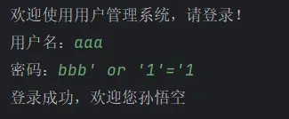
    >
    > 这种现象就叫做：SQL注入。为什么会发生以上的事儿呢？原因是：用户提供的信息中有SQL语句关键字，并且和底层的SQL字符串进行了拼接，变成了一个全新的SQL语句。
    >
    > 例如：本来程序想表达的是这样的SQL：
    >
    > ```sql
    > select realname from t_user where name = 'sunwukong' and password = '123';
    > ```
    >
    > 结果被SQL注入之后，SQL语句就变成这样了：
    >
    > ```sql
    > select realname from t_user where name = 'aaa' and password = 'bbb' or '1'='1';
    > ```
    >
    > 我们可以执行一下这条SQL，看看结果是什么？
    >
    > 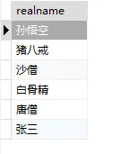
    >
    > 把所有结果全部查到了，这是因为 '1'='1' 是恒成立的，并且使用的是 or 运算符，所以 or 前面的条件等于是没有的。这样就会把所有数据全部查到。而在程序中的判断逻辑是只要结果集中有数据，则表示登录成功。所以以上的输入方式最终的结果就是登录成功。你设想一下，如果这个系统是一个高级别保密系统，只有登录成功的人才有权限，那么这个系统是不是极其危险了。

  - #### 解决SQL注入问题

    > 导致SQL注入的根本原因是什么？只有找到真正的原因，问题才能得到解决。
    >
    > 最根本的原因是：Statement造成的。
    >
    > Statement执行原理是：先进行字符串的拼接，将拼接好的SQL语句发送给数据库服务器，数据库服务器进行SQL语句的编译，然后执行。因此用户提供的信息中如果含有SQL语句的关键字，那么这些关键字正好参加了SQL语句的编译，所以导致原SQL语句被扭曲。

    > 因此，JDBC为了解决这个问题，引入了一个新的接口：PreparedStatement，我们称为：预编译的数据库操作对象。PreparedStatement是Statement接口的子接口。它俩是继承关系。
    >
    > PreparedStatement的执行原理是：先对SQL语句进行预先的编译，然后再向SQL语句指定的位置传值，也就是说：用户提供的信息中即使含有SQL语句的关键字，那么这个信息也只会被当做一个值传递给SQL语句，用户提供的信息不再参与SQL语句的编译了，这样就解决了SQL注入问题。

    > 使用PreparedStatement解决SQL注入问题：

    ```java
    package com.powernode.jdbc;
    
    import java.sql.*;
    import java.util.ResourceBundle;
    import java.util.Scanner;
    
    /**
     * PreparedStatement解决SQL注入问题
     */
    public class JDBCTest03 {
        public static void main(String[] args) {
            // 输出欢迎页面
            System.out.println("欢迎使用用户管理系统，请登录！");
            // 接收用户名和密码
            Scanner scanner = new Scanner(System.in);
            System.out.print("用户名：");
            String loginName = scanner.nextLine();
            System.out.print("密码：");
            String loginPwd = scanner.nextLine();
            // 读取属性配置文件，获取连接数据库的信息。
            ResourceBundle bundle = ResourceBundle.getBundle("com.powernode.jdbc.jdbc");
            String driver = bundle.getString("driver");
            String url = bundle.getString("url");
            String user = bundle.getString("user");
            String password = bundle.getString("password");
            // JDBC程序验证用户名和密码是否正确
            Connection conn = null;
            PreparedStatement pstmt = null;
            ResultSet rs = null;
            try {
                // 1.注册驱动
                Class.forName(driver);
                // 2.获取连接
                conn = DriverManager.getConnection(url, user, password);
                // 3.获取数据库操作对象（获取的是预编译的数据库操作对象）
                String sql = "select realname from t_user where name=? and password=?";
                pstmt = conn.prepareStatement(sql);
                pstmt.setString(1, loginName);
                pstmt.setString(2, loginPwd);
                // 4.执行SQL语句
                rs = pstmt.executeQuery();
                // 5.处理查询结果集
                if (rs.next()) {
                    String realname = rs.getString("realname");
                    System.out.println("登录成功，欢迎您" + realname);
                } else {
                    System.out.println("登录失败，用户名不存在或者密码错误。");
                }
            } catch (ClassNotFoundException | SQLException e) {
                throw new RuntimeException(e);
            } finally {
                // 6.释放资源
                if (rs != null) {
                    try {
                        rs.close();
                    } catch (SQLException e) {
                        throw new RuntimeException(e);
                    }
                }
                if (pstmt != null) {
                    try {
                        pstmt.close();
                    } catch (SQLException e) {
                        throw new RuntimeException(e);
                    }
                }
                if (conn != null) {
                    try {
                        conn.close();
                    } catch (SQLException e) {
                        throw new RuntimeException(e);
                    }
                }
            }
        }
    }
    
    ```

    > 尝试SQL注入，看看还能不能？
    >
    > 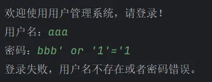
    >
    > 通过测试得知，SQL注入问题已经解决了。**根本原因是：bbb' or '1'='1 这个字符串中虽然含有SQL语句的关键字，但是只会被当做普通的值传到SQL语句中，并没有参与SQL语句的编译**。

    > **关于使用PreparedStatement要注意的是：**
    >
    > - 带有占位符 `?` 的SQL语句我们称为：预处理的SQL。
    > - **占位符 `?` 不能使用单引号或双引号包裹**。如果包裹，占位符则不再是占位符，是一个普通的问号字符。
    > - 在执行SQL语句前，必须给每一个占位符 `?` 传值。如何给占位符 `?` 传值，通过以下的方法：
    >   - `pstmt.setXxx(第几个占位符, 传什么值)`
    >   - “第几个占位符”：从1开始。第1个占位符则是1，第2个占位符则是2，以此类推...
    >   - “传什么值”：具体要看调用的什么方法？
    >     - 如果调用 `pstmt.setString()` 方法，则传的值必须是一个字符串。
    >     - 如果调用 `pstmt.setInt()` 方法，则传的值必须是一个整数。
    >     - 以此类推...
    >

    > **PreparedStatement和Statement都是用于执行SQL语句的接口，它们的主要区别在于：**
    >
    > - `PreparedStatement` 预编译SQL语句，`Statement` 直接提交SQL语句；
    > - `PreparedStatement` 执行速度更快，且可以避免SQL注入；
    > - `PreparedStatement` 会做类型检查，是类型安全的；
    > - `Statement` 适用于处理静态的SQL语句，而 `PreparedStatement` 适用于处理在运行时动态生成的SQL语句。

  - #### blob数据的存储和读取：

    > 准备一张表：t_img，两个字段，一个id主键，一个img。
    >
    > 建表语句如下：
    >
    > ```sql
    > CREATE TABLE `t_img` (
    >    `id` BIGINT UNSIGNED NOT NULL AUTO_INCREMENT,
    >    `img` MEDIUMBLOB,
    >    PRIMARY KEY (`id`)
    > ) ENGINE=InnoDB;
    > ```
    >
    > 准备一张图片：
    >
    > 
    >
    > 
    >
    > 需求1：向t_img 表中插入一张图片。
    >
    > ```java
    > package com.powernode.jdbc;
    > 
    > import java.io.FileInputStream;
    > import java.io.IOException;
    > import java.io.InputStream;
    > import java.sql.Connection;
    > import java.sql.DriverManager;
    > import java.sql.PreparedStatement;
    > import java.sql.SQLException;
    > import java.util.ResourceBundle;
    > 
    > public class JDBCTest09 {
    >  public static void main(String[] args) {
    >      ResourceBundle bundle = ResourceBundle.getBundle("com.powernode.jdbc.jdbc");
    >         String driver = bundle.getString("driver");
    >         String url = bundle.getString("url");
    >         String user = bundle.getString("user");
    >         String password = bundle.getString("password");
    > 
    >         Connection conn = null;
    >         PreparedStatement pstmt = null;
    >         InputStream in = null;
    >         try {
    >             // 1. 注册驱动
    >             Class.forName(driver);
    >             // 2. 获取连接
    >             conn = DriverManager.getConnection(url, user, password);
    >             // 3. 获取预编译的数据操作对象
    >             String sql = "insert into t_img(img) values(?)";
    >             pstmt = conn.prepareStatement(sql);
    >             // 获取文件输入流
    >             in = new FileInputStream("d:/dog.jpg");
    >             pstmt.setBlob(1, in);
    >             // 4. 执行SQL语句
    >             int count = pstmt.executeUpdate();
    >             System.out.println("插入了" + count + "条记录");
    >         } catch (Exception e) {
    >             e.printStackTrace();
    >         } finally {
    >             // 6. 释放资源
    >             if (in != null) {
    >                 try {
    >                     in.close();
    >                 } catch (IOException e) {
    >                     throw new RuntimeException(e);
    >                 }
    >             }
    >             if (pstmt != null) {
    >                 try {
    >                     pstmt.close();
    >                 } catch (SQLException e) {
    >                     throw new RuntimeException(e);
    >                 }
    >             }
    >             if (conn != null) {
    >                 try {
    >                     conn.close();
    >                 } catch (SQLException e) {
    >                     throw new RuntimeException(e);
    >                 }
    >             }
    >         }
    >     }
    > }
    > ```
    >
    > 执行结果如下：
    >
    > 
    >
    > 需求2：从t_img 表中读取一张图片。（从数据库中读取一张图片保存到本地）
    >
    > ```java
    > package com.powernode.jdbc;
    > 
    > import java.io.FileOutputStream;
    > import java.io.InputStream;
    > import java.io.OutputStream;
    > import java.sql.*;
    > import java.util.ResourceBundle;
    > 
    > public class JDBCTest10 {
    > public static void main(String[] args) {
    >   ResourceBundle bundle = ResourceBundle.getBundle("com.powernode.jdbc.jdbc");
    >      String driver = bundle.getString("driver");
    >      String url = bundle.getString("url");
    >      String user = bundle.getString("user");
    >      String password = bundle.getString("password");
    > 
    >      Connection conn = null;
    >     PreparedStatement pstmt = null;
    >      ResultSet rs = null;
    >      try {
    >          // 1. 注册驱动
    >          Class.forName(driver);
    >          // 2. 获取连接
    >          conn = DriverManager.getConnection(url, user, password);
    >          // 3. 获取预编译的数据操作对象
    >          String sql = "select img from t_img where id = ?";
    >          pstmt = conn.prepareStatement(sql);
    >          pstmt.setInt(1, 1);
    >          // 4. 执行SQL语句
    >          rs = pstmt.executeQuery();
    >          // 5. 处理查询结果集
    >          if (rs.next()) {
    >              // 获取二进制大对象
    >              Blob img = rs.getBlob("img");
    >              // 获取输入流
    >              InputStream binaryStream = img.getBinaryStream();
    >              // 创建输出流，该输出流负责写到本地
    >              OutputStream out = new FileOutputStream("d:/dog2.jpg");
    >              byte[] bytes = new byte[1024];
    >              int readCount = 0;
    >              while ((readCount = binaryStream.read(bytes)) != -1) {
    >                  out.write(bytes, 0, readCount);
    >              }
    >              out.flush();
    >              binaryStream.close();
    >              out.close();
    >          }
    >      } catch (Exception e) {
    >          e.printStackTrace();
    >      } finally {
    >          // 6. 释放资源
    >          if (rs != null) {
    >              try {
    >                  rs.close();
    >              } catch (SQLException e) {
    >                  throw new RuntimeException(e);
    >              }
    >          }
    >          if (pstmt != null) {
    >              try {
    >                  pstmt.close();
    >              } catch (SQLException e) {
    >                  throw new RuntimeException(e);
    >              }
    >          }
    >          if (conn != null) {
    >              try {
    >                  conn.close();
    >              } catch (SQLException e) {
    >                  throw new RuntimeException(e);
    >              }
    >          }
    >      }
    >  }
    > }
    > ```
    >
    > 执行完毕之后，查看一下图片大小是否和原图片相同，打开看看是否可以正常显示。

  - #### JDBC批处理操作

    > 准备一张商品表：t_product
    >
    > 建表语句如下：
    >
    > ```sql
    > create table t_product(
    >      id bigint primary key,
    >      name varchar(255)
    > );
    > ```

    - ##### 不使用批处理：

      > 不使用批处理，向 t_product 表中插入一万条商品信息，并记录耗时！
      >
      > ```java
      > package com.powernode.jdbc;
      > 
      > import java.sql.Connection;
      > import java.sql.DriverManager;
      > import java.sql.PreparedStatement;
      > import java.sql.SQLException;
      > import java.util.ResourceBundle;
      > 
      > public class NoBatchTest {
      >     public static void main(String[] args) {
      >         ResourceBundle bundle = ResourceBundle.getBundle("com.powernode.jdbc.jdbc");
      >         String driver = bundle.getString("driver");
      >         String url = bundle.getString("url");
      >         String user = bundle.getString("user");
      >         String password = bundle.getString("password");
      > 
      >         long begin = System.currentTimeMillis();
      >         Connection conn = null;
      >         PreparedStatement pstmt = null;
      >         try {
      >             // 1. 注册驱动
      >             Class.forName(driver);
      >             // 2. 获取连接
      >             conn = DriverManager.getConnection(url, user, password);
      >             // 3. 获取预编译的数据操作对象
      >             String sql = "insert into t_product(id, name) values (?, ?)";
      >             pstmt = conn.prepareStatement(sql);
      >             int count = 0;
      >             for (int i = 1; i <= 10000; i++) {
      >                 pstmt.setInt(1, i);
      >                 pstmt.setString(2, "product" + i);
      >                 // 4. 执行SQL语句
      >                 count += pstmt.executeUpdate();
      >             }
      >             System.out.println("插入了" + count + "条记录");
      >         } catch (Exception e) {
      >             e.printStackTrace();
      >         } finally {
      >             // 6. 释放资源
      >             if (pstmt != null) {
      >                 try {
      >                     pstmt.close();
      >                 } catch (SQLException e) {
      >                     throw new RuntimeException(e);
      >                 }
      >             }
      >             if (conn != null) {
      >                 try {
      >                     conn.close();
      >                 } catch (SQLException e) {
      >                     throw new RuntimeException(e);
      >                 }
      >             }
      >         }
      >         long end = System.currentTimeMillis();
      >         System.out.println("总耗时" + (end - begin) + "毫秒");
      >     }
      > }
      > ```
      >
      > 执行结果如下：
      >
      > 

    - ##### 使用批处理：

      > 使用批处理，向 t_product 表中插入一万条商品信息，并记录耗时！
      >
      > **注意：启用批处理需要在JDBC URL后面添加这个的参数：`rewriteBatchedStatements=true`**
      >
      > 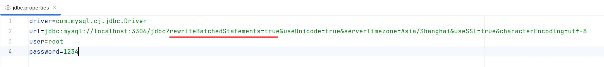
      >
      > ```java
      > package com.powernode.jdbc;
      > 
      > import java.sql.Connection;
      > import java.sql.DriverManager;
      > import java.sql.PreparedStatement;
      > import java.sql.SQLException;
      > import java.util.ResourceBundle;
      > 
      > public class BatchTest {
      >   public static void main(String[] args) {
      >     ResourceBundle bundle = ResourceBundle.getBundle("com.powernode.jdbc.jdbc");
      >     String driver = bundle.getString("driver");
      >     String url = bundle.getString("url");
      >     String user = bundle.getString("user");
      >     String password = bundle.getString("password");
      > 
      >     long begin = System.currentTimeMillis();
      >     Connection conn = null;
      >     PreparedStatement pstmt = null;
      >     try {
      >        // 1. 注册驱动
      >        Class.forName(driver);
      >        // 2. 获取连接
      >        conn = DriverManager.getConnection(url, user, password);
      >        // 3. 获取预编译的数据操作对象
      >        String sql = "insert into t_product(id, name) values (?, ?)";
      >        pstmt = conn.prepareStatement(sql);
      >        int count = 0;
      >        for (int i = 1; i <= 10000; i++) {
      >            pstmt.setInt(1, i);
      >            pstmt.setString(2, "product" + i);
      >            // 有时Statement中一次别打包多个sql，具体多少个add一次batch，可以测试下哪种效率最高
      >            pstmt.addBatch();
      >        }
      >        count += pstmt.executeBatch().length;
      >        System.out.println("插入了" + count + "条记录");
      >     } catch (Exception e) {
      >        e.printStackTrace();
      >     } finally {
      >        // 6. 释放资源
      >        if (pstmt != null) {
      >            try {
      >                pstmt.close();
      >            } catch (SQLException e) {
      >                throw new RuntimeException(e);
      >            }
      >        }
      >        if (conn != null) {
      >            try {
      >                conn.close();
      >            } catch (SQLException e) {
      >                throw new RuntimeException(e);
      >            }
      >        }
      >     }
      > 
      >     long end = System.currentTimeMillis();
      >     System.out.println("总耗时" + (end - begin) + "毫秒");
      >   }
      > }
      > ```
      >
      > 执行结果如下：
      >
      > 
      >
      > 使用Statement对象进行批处理：
      >
      > ```java
      > Statement stmt = conn.createStatement();
      > 
      > // 添加多条SQL到批处理
      > stmt.addBatch("INSERT INTO users VALUES (1, 'Alice', 'alice@example.com')");
      > stmt.addBatch("INSERT INTO users VALUES (2, 'Bob', 'bob@example.com')");
      > stmt.addBatch("UPDATE users SET email='alice123@example.com' WHERE id=1");
      > 
      > // 执行批处理
      > int[] updateCounts = stmt.executeBatch();
      > ```
      >
      > 在进行大数据量插入时，批处理为什么可以提高程序的执行效率？
      >
      > 1.  **减少了网络通信次数**：JDBC 批处理会将多个 SQL 语句一次性发送给服务器，减少了客户端和服务器之间的通信次数，从而提高了数据写入的速度，特别是对于远程服务器而言，优化效果更为显著。 
      > 2.  **减少了数据库操作次数**：JDBC 批处理会将多个 SQL 语句合并成一条 SQL 语句进行执行，从而减少了数据库操作的次数，减轻了数据库的负担，大大提高了数据写入的速度。  

  - #### DbUtils工具类的封装

    > JDBC编程六步中，很多代码是重复出现的，可以为这些代码封装一个工具类。让JDBC代码变的更简洁。

    ```java
    package com.powernode.jdbc;
    
    import java.sql.*;
    import java.util.ResourceBundle;
    
    /**
     * ClassName: DbUtils
     * Description: JDBC工具类
     * Datetime: 2024/4/10 22:29
     * Author: 老杜@动力节点
     * Version: 1.0
     */
    public class DbUtils {
        private DbUtils(){}
        
        private static String url;
        private static String user;
        private static String password;
    
        static {
            // 读取属性资源文件
            ResourceBundle bundle = ResourceBundle.getBundle("com.powernode.jdbc.jdbc");
            String driver = bundle.getString("driver");
            url = bundle.getString("url");
            user = bundle.getString("user");
            password = bundle.getString("password");
            // 注册驱动
            try {
                Class.forName(driver);
            } catch (ClassNotFoundException e) {
                throw new RuntimeException(e);
            }
        }
    
        /**
         * 获取数据库连接
         * @return
         * @throws SQLException
         */
        public static Connection getConnection() throws SQLException {
            Connection conn = DriverManager.getConnection(url, user, password);
            return conn;
        }
    
        /**
         * 释放资源
         * @param conn 连接对象
         * @param stmt 数据库操作对象
         * @param rs 结果集对象
         */
        public static void close(Connection conn, Statement stmt, ResultSet rs){
            if (rs != null) {
                try {
                    rs.close();
                } catch (SQLException e) {
                    throw new RuntimeException(e);
                }
            }
            if (stmt != null) {
                try {
                    stmt.close();
                } catch (SQLException e) {
                    throw new RuntimeException(e);
                }
            }
            if (conn != null) {
                try {
                    conn.close();
                } catch (SQLException e) {
                    throw new RuntimeException(e);
                }
            }
        }
    }
    ```

  - #### 使用`ThreadLocal`来封装DbUtils工具类

    > 如果需要在线程级别共享`Connection`对象，可以将其放在`ThreadLocal`中：

    ```java
    public class DBUtil {
    
        private static ResourceBundle bundle = ResourceBundle.getBundle("resources/jdbc");
        private static String driver = bundle.getString("driver");
        private static String url = bundle.getString("url");
        private static String user = bundle.getString("user");
        private static String password = bundle.getString("password");
    
        // 不让创建对象，因为工具类中的方法都是静态的。不需要创建对象。
        // 为了防止创建对象，故将构造方法私有化。
        private DBUtil(){}
    
        // DBUtil类加载时注册驱动
        static {
            try {
                Class.forName(driver);
            } catch (ClassNotFoundException e) {
                e.printStackTrace();
            }
        }
    
        // 这个对象实际上在服务器中只有一个。
        private static ThreadLocal<Connection> local = new ThreadLocal<>();
    
        /**
         * 这里没有使用数据库连接池，直接创建连接对象。
         * @return 连接对象
         * @throws SQLException
         */
        public static Connection getConnection() throws SQLException {
            Connection conn = local.get();
            if (conn == null) {
                conn = DriverManager.getConnection(url, user, password);
                local.set(conn);
            }
            return conn;
        }
    
        /**
         * 关闭资源
         * @param conn 连接对象
         * @param stmt 数据库操作对象
         * @param rs 结果集对象
         */
        public static void close(Connection conn, Statement stmt, ResultSet rs){
            if (rs != null) {
                try {
                    rs.close();
                } catch (SQLException e) {
                    throw new RuntimeException(e);
                }
            }
            if (stmt != null) {
                try {
                    stmt.close();
                } catch (SQLException e) {
                    throw new RuntimeException(e);
                }
            }
            if (conn != null) {
                try {
                    conn.close();
                    // 思考一下：为什么conn关闭之后，这里要从大Map中移除呢？
                    // 根本原因是：Tomcat服务器是支持线程池的。也就是说一个人用过了t1线程，t1线程还有可能被其他用户使用。
                    local.remove();
                } catch (SQLException e) {
                    throw new RuntimeException(e);
                }
            }
        }
    }
    ```

- ## JDBC事务

  - #### 什么是事务

    > 事务是一个完整的业务，在这个业务中需要多条DML语句共同联合才能完成，而事务可以保证多条DML语句同时成功或者同时失败，从而保证数据的安全。例如A账户向B账户转账一万，A账户减去一万(update)和B账户加上一万(update)，必须同时成功或者同时失败，才能保证数据是正确的。

  - #### 使用转账案例演示事务

    - ##### 表和数据的准备：

      > t_act表：
      >
      > 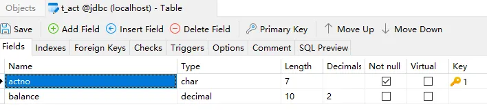
      >
      > 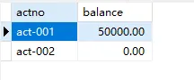

    - ##### 实现转账功能：

      ```java
      package com.powernode.jdbc;
      
      import com.powernode.jdbc.utils.DbUtils;
      
      import java.sql.Connection;
      import java.sql.PreparedStatement;
      import java.sql.SQLException;
      
      /**
       * ClassName: JDBCTest19
       * Description: 实现账户转账
       * Datetime: 2024/4/12 15:20
       * Author: 老杜@动力节点
       * Version: 1.0
       */
      public class JDBCTest19 {
          public static void main(String[] args) {
              // 转账金额
              double money = 10000.0;
      
              Connection conn = null;
              PreparedStatement ps1 = null;
              PreparedStatement ps2 = null;
              try {
                  conn = DbUtils.getConnection();
      
                  // 更新 act-001 账户
                  String sql1 = "update t_act set balance = balance - ? where actno = ?";
                  ps1 = conn.prepareStatement(sql1);
                  ps1.setDouble(1, money);
                  ps1.setString(2, "act-001");
                  int count1 = ps1.executeUpdate();
      
                  // 更新 act-002账户
                  String sql2 = "update t_act set balance = balance + ? where actno = ?";
                  ps2 = conn.prepareStatement(sql2);
                  ps2.setDouble(1, money);
                  ps2.setString(2, "act-002");
                  int count2 = ps2.executeUpdate();
      
              } catch (SQLException e) {
                  throw new RuntimeException(e);
              } finally {
                  DbUtils.close(null, ps1, null);
                  DbUtils.close(conn, ps1, null);
              }
      
          }
      }
      ```

      > 执行结果：
      >
      > 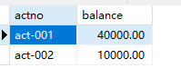

    - ##### JDBC事务默认是自动提交的：

      > JDBC事务默认情况下是自动提交的，所谓的自动提交是指：只要执行一条DML语句则自动提交一次。测试一下，在以下代码位置添加断点：
      >
      > 
      >
      > 让代码执行到断点处：
      >
      > 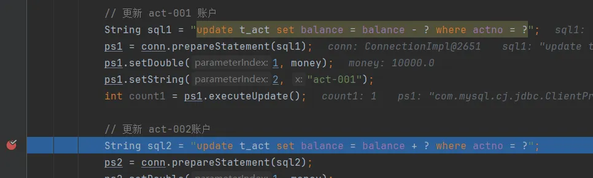
      >
      > 让程序停在此处，看看数据库表中的数据是否发生变化：
      >
      > 
      >
      > 可以看到，整个转账的业务还没有执行完毕，act-001 账户的余额已经被修改为 30000了，为什么修改为 30000了，因为JDBC事务默认情况下是自动提交，只要执行一条DML语句则自动提交一次。这种自动提交是极其危险的。如果在此时程序发生了异常，act-002账户的余额未成功更新，则钱会丢失一万。我们可以测试一下：测试前先将数据恢复到起初的时候
      >
      > 
      >
      > 在以下代码位置，让其发生异常：
      >
      > 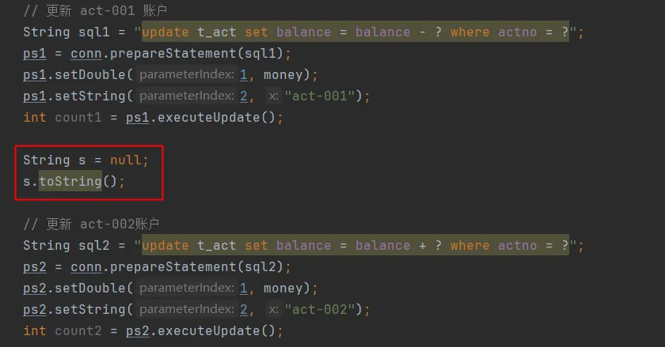
      >
      > 执行结果如下：
      >
      > 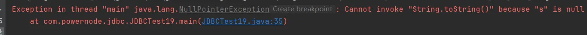
      >
      > 
      >
      > 经过测试得知，丢失了一万元。

    - ##### 添加事务控制：

      > 如何解决以上问题，分三步：

      1. 将JDBC事务的自动提交机制修改为手动提交（即开启事务）

         ```java
         conn.setAutoCommit(false);
         ```

      2. 当整个业务完整结束后，手动提交事务（即提交事务，事务结束）

         ```java
         conn.commit();
         ```

      3. 在处理业务过程中，如果发生异常，则进入catch语句块进行异常处理，手动回滚事务（即回滚事务，事务结束）

         ```java
         conn.rollback();
         ```

         > ###### JDBC关闭自动提交后，出现了异常为何还需要`rollback()`回滚呢，不是没有提交吗？：
         >
         > 1. **释放数据库资源**：
         >    - 即使没有`commit`，数据库仍然会持有锁和其他资源
         >    - `rollback()`会明确释放这些资源，而不是等待连接关闭时才释放
         > 2. **清理未提交的更改**：
         >    - 虽然未`commit`的更改对其他事务不可见，但在当前连接/事务中可见
         >    - `rollback()`会清除这些"脏"数据，保持事务的一致性
         > 3. **事务边界明确**：
         >    - 显式`rollback()`使代码意图更清晰，表明这是一个失败的事务
         >    - 比依赖连接关闭时的隐式回滚更可靠
         > 4. **连接池环境**：
         >    - 在使用连接池时，连接会被重用而不关闭
         >    - 不`rollback()`可能导致下一个使用该连接的用户看到未提交的数据

      > 代码如下：

      ```java
      public class JDBCTest19 {
          public static void main(String[] args) {
              // 转账金额
              double money = 10000.0;
      
              Connection conn = null;
              PreparedStatement ps1 = null;
              PreparedStatement ps2 = null;
              try {
                  conn = DbUtils.getConnection();
                  
                  // 开启事务（关闭自动提交机制）
                  conn.setAutoCommit(false);
      
                  // 更新 act-001 账户
                  String sql1 = "update t_act set balance = balance - ? where actno = ?";
                  ps1 = conn.prepareStatement(sql1);
                  ps1.setDouble(1, money);
                  ps1.setString(2, "act-001");
                  int count1 = ps1.executeUpdate();
      
                  String s = null;
                  s.toString();
      
                  // 更新 act-002账户
                  String sql2 = "update t_act set balance = balance + ? where actno = ?";
                  ps2 = conn.prepareStatement(sql2);
                  ps2.setDouble(1, money);
                  ps2.setString(2, "act-002");
                  int count2 = ps2.executeUpdate();
                  
                  // 提交事务
                  conn.commit();
      
              } catch (Exception e) {
                  // 遇到异常回滚事务
                  try {
                      conn.rollback();
                  } catch (SQLException ex) {
                      throw new RuntimeException(ex);
                  }
                  throw new RuntimeException(e);
              } finally {
                  DbUtils.close(null, ps1, null);
                  DbUtils.close(conn, ps1, null);
              }
      
          }
      }
      ```

      > 将数据恢复如初：
      >
      > 
      >
      > 执行程序，仍然会出现异常：
      >
      > 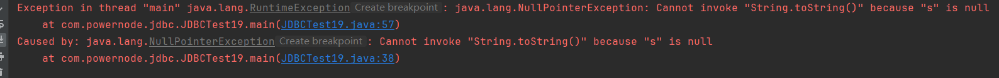
      >
      > 但是数据库表中的数据是安全的：
      >
      > 
      >
      > 当程序不出现异常时：
      >
      > 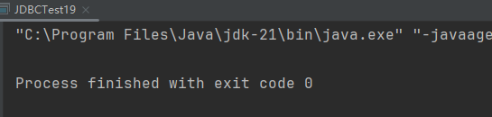
      >
      > 数据库表中的数据也是正确的：
      >
      > 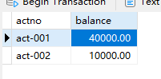
      >
      > 这样就采用了JDBC事务解决了数据安全的问题。

  - #### 设置JDBC事务隔离级别

    > 设置事务的隔离级别也是比较重要的，在JDBC程序中应该如何设置事务的隔离级别呢？代码如下：

    ```java
    public class JDBCTest20 {
        public static void main(String[] args) {
            Connection conn = null;
            try {
                conn = DbUtils.getConnection();
                // 获取到数据库连接后，就可以设置事务的隔离级别了：
                conn.setTransactionIsolation(Connection.TRANSACTION_SERIALIZABLE);
            } catch (SQLException e) {
                throw new RuntimeException(e);
            } finally {
                DbUtils.close(conn, null, null);
            }
        }
    }
    ```

- ## JDBC调用存储过程

  - #### 在MySQL中创建存储过程：

    ```sql
    create procedure mypro(in n int, out sum int)
    begin 
    	set sum := 0;
    	repeat 
    		if n % 2 = 0 then 
    		  set sum := sum + n;
    		end if;
    		set n := n - 1;
    		until n <= 0
    	end repeat;
    end;
    ```

  - #### 使用JDBC代码调用存储过程：

    ```java
    package com.powernode.jdbc;
    
    import com.powernode.jdbc.utils.DbUtils;
    
    import java.sql.CallableStatement;
    import java.sql.Connection;
    import java.sql.SQLException;
    import java.sql.Types;
    
    /**
     * ClassName: JDBCTest21
     * Description:
     * Datetime: 2024/4/12 17:42
     * Author: 老杜@动力节点
     * Version: 1.0
     */
    public class JDBCTest21 {
        public static void main(String[] args) {
            Connection conn = null;
            CallableStatement cs = null;
            try {
                conn = DbUtils.getConnection();
                String sql = "{call mypro(?, ?)}";
                cs = conn.prepareCall(sql);
                // 给第1个 ? 传值
                cs.setInt(1, 100);
                // 将第2个 ? 注册为出参
                cs.registerOutParameter(2, Types.INTEGER);
                // 执行存储过程
                cs.execute();
                // 通过出参获取结果
                int result = cs.getInt(2);
                System.out.println("计算结果：" + result);
            } catch (SQLException e) {
                throw new RuntimeException(e);
            } finally {
                DbUtils.close(conn, cs, null);
            }
        }
    }
    ```

    > 执行结果：
    >
    > 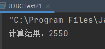

    ###### 程序解说：

    使用JDBC代码调用存储过程需要以下步骤：

    1. 加载MySQL的JDBC驱动程序：

       ```java
       Class.forName("com.mysql.jdbc.Driver");
       ```

    2. 连接到MySQL数据库：

       ```java
       Connection conn = DriverManager.getConnection("jdbc:mysql://localhost:3306/mydb", "user", "password");
       ```

    3. 创建CallableStatement对象：

       ```java
       CallableStatement cstmt = conn.prepareCall("{call mypro(?, ?)}");
       ```

       > 其中，第一个参数为调用存储过程的语句，按照实际情况修改；第二个参数是需要设定的参数。

    4. 设置输入参数：

       ```java
       cstmt.setInt(1, n);
       ```

       > 其中，第一个参数是参数在调用语句中的位置，第二个参数是实际要传入的值。

    5. 注册输出参数：

       ```java
       cstmt.registerOutParameter(2, Types.INTEGER);
       ```

       > 其中，第一个参数是要注册的参数在调用语句中的位置，第二个参数是输出参数的类型。

    6. 执行存储过程：

       ```java
       cstmt.execute();
       ```

    7. 获取输出参数值：

       ```java
       int sum = cstmt.getInt(2);
       ```

    8. 关闭连接：

       ```java
       cstmt.close();
       conn.close();
       ```

  - #### （了解）通过普通Statement直接执行存储过程（不推荐）：

    ```java
    try (Connection conn = dataSource.getConnection();
        Statement stmt = conn.createStatement()) {
    
        // 直接执行CALL语句（MySQL/PostgreSQL等支持）
        boolean hasResult = stmt.execute("CALL my_procedure(100, 'test')");
    
        // 处理结果集（如果存储过程返回结果）
        if (hasResult) {
            try (ResultSet rs = stmt.getResultSet()) {
                while (rs.next()) {
                    // 处理结果
                }
            }
        }
    }
    ```

    > 这种方式的缺点：不支持输出参数，有SQL注入风险，并且性能较差，兼容性也不好。

- ## DAO

  - #### 什么是DAO（Data Access Object数据访问对象）

    >DAO是一种JavaEE的设计模式（不是23种设计模式），它是一种只负责做数据增删查改的类（CRUD），里面不包含任何的业务逻辑。这样的对象被称为DAO对象。
    >
    >在实际的开发中，对于（数据库中）每张表的CRUD操作，我们通常会将其封装为一个单独的DAO类。这样做的目的是：提高代码的复用性，另外也可以降低程序的耦合度，提高扩展力。如果是处理t_user表的，这个DAO就可以叫做：UserDao，一般情况下每张表对应一个DAO类。

  - #### 使用DAO改造员工信息管理

    1. ##### 定义Employee封装数据

       > Employee类是一个Java Bean，专门用来封装员工的信息：

       ```java
       package com.powernode.jdbc.beans;
       
       /**
        * ClassName: Employee
        * Description:
        * Datetime: 2024/4/14 23:32
        * Author: 老杜@动力节点
        * Version: 1.0
        */
       public class Employee {
           private Long id;
           private String name;
           private String job;
           private Double salary;
           private String hiredate;
           private String address;
       
           @Override
           public String toString() {
               return "Employee{" +
                       "id=" + id +
                       ", name='" + name + '\'' +
                       ", job='" + job + '\'' +
                       ", salary=" + salary +
                       ", hiredate='" + hiredate + '\'' +
                       ", address='" + address + '\'' +
                       '}';
           }
       
           public Employee() {
           }
       
           public Employee(Long id, String name, String job, Double salary, String hiredate, String address) {
               this.id = id;
               this.name = name;
               this.job = job;
               this.salary = salary;
               this.hiredate = hiredate;
               this.address = address;
           }
       
           public Long getId() {
               return id;
           }
       
           public void setId(Long id) {
               this.id = id;
           }
       
           public String getName() {
               return name;
           }
       
           public void setName(String name) {
               this.name = name;
           }
       
           public String getJob() {
               return job;
           }
       
           public void setJob(String job) {
               this.job = job;
           }
       
           public Double getSalary() {
               return salary;
           }
       
           public void setSalary(Double salary) {
               this.salary = salary;
           }
       
           public String getHiredate() {
               return hiredate;
           }
       
           public void setHiredate(String hiredate) {
               this.hiredate = hiredate;
           }
       
           public String getAddress() {
               return address;
           }
       
           public void setAddress(String address) {
               this.address = address;
           }
       }
       ```

    2. ##### 定义EmployeeDao

       > 定义五个方法，分别完成五个功能：新增，修改，删除，查看一个，查看所有。

       ```java
       package com.powernode.jdbc.dao;
       
       import com.powernode.jdbc.beans.Employee;
       import com.powernode.jdbc.utils.DbUtils;
       
       import java.sql.Connection;
       import java.sql.PreparedStatement;
       import java.sql.ResultSet;
       import java.sql.SQLException;
       import java.util.ArrayList;
       import java.util.List;
       
       /**
        * ClassName: EmployeeDao
        * Description:
        * Datetime: 2024/4/14 23:34
        * Author: 老杜@动力节点
        * Version: 1.0
        */
       public class EmployeeDao {
           /**
            * 新增员工
            * @param employee
            * @return
            */
           public int insert(Employee employee) {
               Connection conn = null;
               PreparedStatement ps = null;
               int count = 0;
               try {
                   conn = DbUtils.getConnection();
                   String sql = "insert into t_employee(name,job,salary,hiredate,address) values(?,?,?,?,?)";
                   ps = conn.prepareStatement(sql);
                   ps.setString(1, employee.getName());
                   ps.setString(2, employee.getJob());
                   ps.setDouble(3, employee.getSalary());
                   ps.setString(4, employee.getHiredate());
                   ps.setString(5, employee.getAddress());
                   count = ps.executeUpdate();
               } catch (SQLException e) {
                   throw new RuntimeException(e);
               } finally {
                   DbUtils.close(conn, ps, null);
               }
               return count;
           }
       
           /**
            * 修改员工
            * @param employee
            * @return
            */
           public int update(Employee employee){
               Connection conn = null;
               PreparedStatement ps = null;
               int count = 0;
               try {
                   conn = DbUtils.getConnection();
                   String sql = "update t_employee set name=?, job=?, salary=?, hiredate=?, address=? where id=?";
                   ps = conn.prepareStatement(sql);
                   ps.setString(1, employee.getName());
                   ps.setString(2, employee.getJob());
                   ps.setDouble(3, employee.getSalary());
                   ps.setString(4, employee.getHiredate());
                   ps.setString(5, employee.getAddress());
                   ps.setLong(6, employee.getId());
                   count = ps.executeUpdate();
               } catch (SQLException e) {
                   throw new RuntimeException(e);
               } finally {
                   DbUtils.close(conn, ps, null);
               }
               return count;
           }
       
           /**
            * 根据id删除员工信息
            * @param id 员工id
            * @return 1表示成功
            */
           public int deleteById(Long id){
               Connection conn = null;
               PreparedStatement ps = null;
               int count = 0;
               try {
                   conn = DbUtils.getConnection();
                   String sql = "delete from t_employee where id = ?";
                   ps = conn.prepareStatement(sql);
                   ps.setLong(1, id);
                   count = ps.executeUpdate();
               } catch (SQLException e) {
                   throw new RuntimeException(e);
               } finally {
                   DbUtils.close(conn, ps, null);
               }
               return count;
           }
       
           /**
            * 根据id查询所有员工
            * @param id
            * @return
            */
           public Employee selectById(Long id){
               Connection conn = null;
               PreparedStatement ps = null;
               ResultSet rs = null;
               Employee employee = null;
               try {
                   conn = DbUtils.getConnection();
                   String sql = "select * from t_employee where id = ?";
                   ps = conn.prepareStatement(sql);
                   ps.setLong(1, id);
                   rs = ps.executeQuery();
                   if(rs.next()){
                       employee = new Employee();
                       employee.setId(id);
                       employee.setName(rs.getString("name"));
                       employee.setJob(rs.getString("job"));
                       employee.setSalary(rs.getDouble("salary"));
                       employee.setHiredate(rs.getString("hiredate"));
                       employee.setAddress(rs.getString("address"));
                   }
               } catch (SQLException e) {
                   throw new RuntimeException(e);
               } finally {
                   DbUtils.close(conn, ps, rs);
               }
               return employee;
           }
       
           /**
            * 查询所有员工信息
            * @return 员工列表
            */
           public List<Employee> selectAll(){
               List<Employee> employees = new ArrayList<>();
               Connection conn = null;
               PreparedStatement ps = null;
               ResultSet rs = null;
               try {
                   conn = DbUtils.getConnection();
                   String sql = "select * from t_employee";
                   ps = conn.prepareStatement(sql);
                   rs = ps.executeQuery();
                   while(rs.next()){
                       Employee employee = new Employee();
                       employee.setId(rs.getLong("id"));
                       employee.setName(rs.getString("name"));
                       employee.setJob(rs.getString("job"));
                       employee.setSalary(rs.getDouble("salary"));
                       employee.setHiredate(rs.getString("hiredate"));
                       employee.setAddress(rs.getString("address"));
                       employees.add(employee);
                   }
               } catch (SQLException e) {
                   throw new RuntimeException(e);
               } finally {
                   DbUtils.close(conn, ps, rs);
               }
               return employees;
           }
       }
       ```

  - #### BaseDao的封装

    ```java
    package com.powernode.jdbc.dao;
    
    import com.powernode.jdbc.utils.DbUtils;
    
    import java.lang.reflect.Field;
    import java.sql.*;
    import java.util.ArrayList;
    import java.util.List;
    
    /**
     * ClassName: BaseDao
     * Description: 最基础的Dao，所有的Dao应该去继承该BaseDao
     * Datetime: 2024/4/15 11:08
     * Author: 老杜@动力节点
     * Version: 1.0
     */
    public class BaseDao {
    
        /**
         * 这是一个通用的执行insert delete update语句的方法。
         * @param sql
         * @param params
         * @return
         */
        public int executeUpdate(String sql, Object... params) {
            Connection conn = null;
            PreparedStatement ps = null;
            int count = 0;
            try {
                // 获取连接
                conn = DbUtils.getConnection();
                // 获取预编译的数据库操作对象
                ps = conn.prepareStatement(sql);
                // 给 ? 占位符传值
                if(params != null && params.length > 0){
                    // 有占位符 ?
                    for (int i = 0; i < params.length; i++) {
                        ps.setObject(i + 1, params[i]);
                    }
                }
                // 执行SQL语句
                count = ps.executeUpdate();
            } catch (SQLException e) {
                throw new RuntimeException(e);
            } finally {
                DbUtils.close(conn, ps, null);
            }
            return count;
        }
    
        /**
         * 这是一个通用的查询语句
         * @param clazz
         * @param sql
         * @param params
         * @return
         * @param <T>
         */
        public <T> List<T> executeQuery(Class<T> clazz, String sql, Object... params){
            List<T> list = new ArrayList<>();
            Connection conn = null;
            PreparedStatement ps = null;
            ResultSet rs = null;
            try {
                // 获取连接
                conn = DbUtils.getConnection();
                // 获取预编译的数据库操作对象
                ps = conn.prepareStatement(sql);
                // 给?传值
                if(params != null && params.length > 0){
                    for (int i = 0; i < params.length; i++) {
                        ps.setObject(i + 1, params[i]);
                    }
                }
                // 执行SQL语句
                rs = ps.executeQuery();
    
                // 获取查询结果集元数据
                ResultSetMetaData rsmd = rs.getMetaData();
    
                // 获取列数
                int columnCount = rsmd.getColumnCount();
    
                // 处理查询结果集
                while(rs.next()){
                    // 封装bean对象
                    T obj = clazz.newInstance();
                    // 给bean对象属性赋值
                    /*
                    比如现在有一张表：t_user，然后表中有两个字段，一个是 user_id，一个是user_name
                    现在javabean是User类，该类中的属性名是：userId,username
                    执行这样的SQL语句：select user_id as userId, user_name as username from t_user;
                     */
                    for (int i = 1; i <= columnCount; i++) {
                        // 获取查询结果集中的列的名字
                        // 这个列的名字是通过as关键字进行了起别名，这个列名就是bean的属性名。
                        String fieldName = rsmd.getColumnLabel(i);
                        // 获取属性Field对象
                        Field declaredField = clazz.getDeclaredField(fieldName);
                        // 打破封装
                        declaredField.setAccessible(true);
                        // 给属性赋值
                        declaredField.set(obj, rs.getObject(i));
                    }
    
                    // 将对象添加到List集合
                    list.add(obj);
                }
            } catch (Exception e) {
                throw new RuntimeException(e);
            } finally {
                DbUtils.close(conn, ps, rs);
            }
            // 返回List集合
            return list;
        }
    
    
        /**
         *
         * @param clazz
         * @param sql
         * @param params
         * @return
         * @param <T>
         */
        public <T> T queryOne(Class<T> clazz, String sql, Object... params){
            List<T> list = executeQuery(clazz, sql, params);
            if(list == null || list.size() == 0){
                return null;
            }
            return list.get(0);
        }
    
    }
    ```

- ## 连接池

  - #### 连接池的理解

    1. ##### 不使用连接池有啥问题：

       > Connection对象是重量级对象，创建Connection对象就是建立两个进程之间的通信，非常耗费资源。一次完整的数据库操作，大部分时间都耗费在连接对象的创建。
       >
       > 问题1：每一次请求都创建一个Connection连接对象，效率较低。
       >
       > 问题2：连接对象的数量无法限制。如果连接对象的数量过高，会导致mysql数据库服务器崩溃。

    2. ##### 使用连接池来解决什么问题：

       > 提前创建好N个连接对象，将其存放到一个集合中（这个集合就是一个缓存）。
       >
       > 用户请求时，需要连接对象直接从连接池中获取，不需要创建连接对象，因此效率较高。
       >
       > 另外，连接对象只能从连接池中获取，如果没有空闲的连接对象，只能等待，这样连接对象创建的数量就得到了控制。

    3. ##### `javax.sql.DataSource`：

       > 连接池有很多，不过所有的连接池都实现了 `javax.sql.DataSource` 接口。也就是说我们程序员在使用连接池的时候，不管使用哪家的连接池产品，只要面向 `javax.sql.DataSource` 接口调用方法即可。
       >
       > 另外，实际上我们也可以自定义属于我们自己的连接池。只要实现 `DataSource` 接口即可。

    4. ##### 连接池的属性：

       > 对于一个基本的连接池来说，一般都包含以下几个常见的属性：
       >
       > 1. 初始化连接数（initialSize）：连接池初始化时创建的连接数。
       > 2. 最大连接数（maxActive）：连接池中最大的连接数，也就是连接池所能容纳的最大连接数量，当连接池中的连接数量达到此值时，后续请求会被阻塞并等待连接池中有连接被释放后再处理。
       > 3. 最小空闲连接数量（minIdle）： 指连接池中最小的空闲连接数，也就是即使当前没有请求，连接池中至少也要保持一定数量的空闲连接，以便应对高并发请求或突发连接请求的情况。
       > 4. 最大空闲连接数量（maxIdle）： 指连接池中最大的空闲连接数，也就是连接池中最多允许保持的空闲连接数量。当连接池中的空闲连接数量达到了maxIdle设定的值后，多余的空闲连接将会被连接池释放掉。
       > 5. 最大等待时间（maxWait）：当连接池中的连接数量达到最大值时，后续请求需要等待的最大时间，如果超过这个时间，则会抛出异常。
       > 6. 连接有效性检查（testOnBorrow、testOnReturn）：为了确保连接池中只有可用的连接，一些连接池会定期对连接进行有效性检查，这里的属性就是配置这些检查的选项。
       > 7. 连接的driver、url、user、password等。
       >
       > 以上这些属性是连接池中较为常见的一些属性，不同的连接池在实现时可能还会有其他的一些属性，不过大多数连接池都包含了以上几个属性，对于使用者来说需要根据自己的需要进行灵活配置。

  - #### 常用的连接池

    > 市面上常用的数据库连接池有许多，以下是其中几种：

    1. DBCP
       - 2001年诞生，最早的连接池。
       - Apache Software Foundation的一个开源项目。
       - DBCP的设计初衷是为了满足Tomcat服务器对连接池管理的需求。
    2. c3p0
       - 2004年诞生
       - c3p0是由Steve Waldman于2004年推出的，它是一个高性能、高可靠性、易配置的数据库连接池。c3p0能够提供连接池的容错能力、自动重连等功能，适用于高并发场景和数据量大的应用。
    3. Druid
       - 2012年诞生
       - Druid连接池由阿里巴巴集团开发，于2011年底开始对外公开，2012年正式发布。Druid是一个具有高性能、高可靠性、丰富功能的数据库连接池，不仅可以做连接池，还能做监控、分析和管理数据库，支持SQL防火墙、统计分析、缓存和访问控制等功能。
    4. HikariCP
       - 2012年诞生
       - HikariCP是由Brett Wooldridge于2012年创建的开源项目，它被认为是Java语言下最快的连接池之一，具有快速启动、低延迟、低资源消耗等优点。HikariCP连接池适用于高并发场景和云端应用。
       - 很单纯的一个连接池，这个产品只做连接池应该做的，其他的不做。所以性能是极致的。相对于Druid来说，它更加轻量级。
       - Druid连接池在连接管理之外提供了更多的功能，例如SQL防火墙、统计分析、缓存、访问控制等，适用于在数据库访问过程中，需要进行细粒度控制的场景
       - HikariCP则更侧重于性能方面的优化，对各种数据库的兼容性也更好
    5. BoneCP
       - 2015年诞生
       - BoneCP是一款Java语言下的高性能连接池，于2015年由Dominik Gruntz在GitHub上发布。BoneCP具有分布式事务、连接空闲检查、SQL语句跟踪和性能分析、特定类型的连接池等特点。BoneCP连接池适用于大型应用系统和高并发的负载场景

  - #### 连接池的使用

    - ##### Druid的使用：

      1. 引入Druid的jar包：

         

      2. 配置文件：在类的根路径下创建一个属性资源文件：jdbc.properties

         ```properties
         url=jdbc:mysql://localhost:3306/jdbc
         username=root
         password=1234
         driverClassName=com.mysql.cj.jdbc.Driver
         initialSize=5
         minIdle=10
         maxActive=20
         ```

      3. 编写代码，从连接池中获取连接对象

         ```java
         // 读取属性配置文件
         InputStream in = DruidConfig.class.getClassLoader().getResourceAsStream("jdbc.properties");
         Properties props = new Properties();
         props.load(in);
         // 创建连接池
         DataSource dataSource = DruidDataSourceFactory.createDataSource(props);
         Connection conn = dataSource.getConnection();
         ```

      4. 关闭连接

         > 关闭连接仍然是调用`Connection`的`close()`方法，但是这个`close()`方法并不是真正的关闭连接，只是将连接归还到连接池，让其称为空闲连接对象。这样其他线程可以继续使用该空闲连接。

    - ##### HikariCP的使用：

      1. 引入Druid的jar包：

         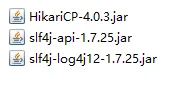

      2. 配置文件：在类的根路径下创建一个属性资源文件：jdbc2.properties

         ```properties
         jdbcUrl=jdbc:mysql://localhost:3306/jdbc
         username=root
         password=1234
         driverClassName=com.mysql.cj.jdbc.Driver
         minimumIdle=5
         maximumPoolSize=20
         ```

      3. 编写代码，从连接池中获取连接：

         ```java
         InputStream in = HikariConfig.class.getClassLoader().getResourceAsStream("jdbc2.properties");
         Properties props = new Properties();
         props.load(in);
         DataSource dataSource = new HikariDataSource(new HikariConfig(props));
         Connection conn = dataSource.getConnection();
         ```

      4. 关闭连接（调用`conn.close()`，将连接归还到连接池，连接对象为空闲状态）

    - ##### DbUtils的升级改造：

      > 我们基于Druid连接池对DbUtils做一个升级改造：

      ```java
      package com.powernode.jdbc;
      
      import com.alibaba.druid.pool.DruidDataSourceFactory;
      import javax.sql.DataSource;
      import java.io.InputStream;
      import java.sql.*;
      import java.util.Properties;
      
      public class DbUtils2 {
          private DbUtils2(){}
      
          private static DataSource dataSource;
      
          static {
              try {
                  InputStream in = Thread.currentThread().getContextClassLoader().getResourceAsStream("jdbc.properties");
                  Properties prop = new Properties();
                  prop.load(in);
                  dataSource = DruidDataSourceFactory.createDataSource(prop);
              } catch (Exception e) {
                  throw new RuntimeException(e);
              }
          }
      
          /**
           * 获取数据库连接
           * @return
           * @throws SQLException
           */
          public static Connection getConnection() throws SQLException {
              return dataSource.getConnection();
          }
      
          /**
           * 释放资源
           * @param conn 连接对象
           * @param stmt 数据库操作对象
           * @param rs 结果集对象
           */
          public static void close(Connection conn, Statement stmt, ResultSet rs){
              if (rs != null) {
                  try {
                      rs.close();
                  } catch (SQLException e) {
                      throw new RuntimeException(e);
                  }
              }
              if (stmt != null) {
                  try {
                      stmt.close();
                  } catch (SQLException e) {
                      throw new RuntimeException(e);
                  }
              }
              if (conn != null) {
                  try {
                      conn.close();
                  } catch (SQLException e) {
                      throw new RuntimeException(e);
                  }
              }
          }
      }
      ```

------

