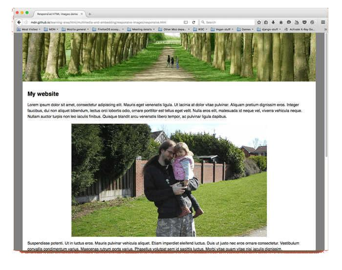

- 图像标签

  > 图片是互联网的重要组成部分，让网页变得丰富多彩。本章介绍如何在网页插入图片。
  >
  > ## ``
  >
  > 标签用于插入图片。它是单独使用的，没有闭合标签。
  >
  > ```
  > 
  > ```
  >
  > 上面代码在网页插入一张图片`foo.jpg`。`src`属性指定图片的网址，上例是相对 URL，表示图片与网页在同一个目录。
  >
  > 默认是一个行内元素，与前后的文字处在同一行。
  >
  > ```
  > <p>HelloWorld</p>
  > ```
  >
  > 上面代码的渲染结果是，文字和图片在同一行显示。
  >
  > 图像默认以原始大小显示。如果图片很大，又与文字处在同一行，那么图片将把当前行的行高撑高，并且图片的底边与文字的底边在同一条水平线上。
  >
  > 可以放在<a>标签内部，使得图片变成一个可以点击的链接。
  >
  > ```
  > <a href="example.html">
  >   
  > </a>
  > ```
  >
  > 上面代码中，图片可以像链接那样点击，点击后会产生跳转。
  >
  > **（1）alt 属性**
  >
  > `alt`属性用来设定图片的文字说明。图片不显示时（比如下载失败，或用户关闭图片加载），图片的位置上会显示该文本。
  >
  > ```
  > 
  > ```
  >
  > 上面代码中，`alt`是图片的说明。图片下载失败时，浏览器会在图片位置，显示文字“示例图片”。
  >
  > **（2）width 属性，height 属性**
  >
  > 图片默认以原始大小插入网页，`width`属性和`height`属性可以指定图片显示时的宽度和高度，单位是像素或百分比。
  >
  > ```
  > 
  > ```
  >
  > 上面代码中，`width`属性指定图片显示的宽度为400像素，`height`属性指定显示高度为300像素。
  >
  > 注意，一旦设置了这两个属性，浏览器会在网页中预先留出这个大小的空间，不管图片有没有加载成功。不过，由于图片的显示大小可以用 CSS 设置，所以不建议使用这两个属性。
  >
  > 一种特殊情况是，`width`属性和`height`属性只设置了一个，另一个没有设置。这时，浏览器会根据图片的原始大小，自动设置对应比例的图片宽度或高度。举例来说，图片大小是 800像素 x 800像素，`width`属性设置成200，那么浏览器会自动将`height`设成200。
  >
  > **（3）srcset，sizes**
  >
  > 详见下文的《响应式图像》部分。
  >
  > **（4）referrerpolicy**
  >
  > 导致的图片加载的 HTTP 请求，默认会带有Referer的头信息。referrerpolicy属性对这个行为进行设置。
  >
  > **（5）crossorigin**
  >
  > 有时，图片和网页属于不同的网站，网页加载图片就会导致跨域请求，对方服务器可能要求跨域认证。`crossorigin`属性用来告诉浏览器，是否采用跨域的形式下载图片，默认是不采用。
  >
  > 简单说，只要打开了这个属性，HTTP 请求的头信息里面，就会加入`origin`字段，给出请求发出的域名，不打开这个属性就不加。
  >
  > 一旦打开该属性，它可以设为两个值。
  >
  > - `anonymous`：跨域请求不带有用户凭证（通常是 Cookie）。
  > - `use-credentials`：跨域请求带有用户凭证。
  >
  > 下面是一个例子。
  >
  > ```
  > 
  > ```
  >
  > `crossorigin`属性如果省略值的部分，则等同于`anonymous`。
  >
  > ```
  > 
  > ```
  >
  > **（6）loading**
  >
  > 浏览器的默认行为是，只要解析到``标签，就开始加载图片。对于很长的网页，这样做很浪费带宽，因为用户不一定会往下滚动，一直看到网页结束。用户很可能是点开网页，看了一会就关掉了，那些不在视口的图片加载的流量，就都浪费了。
  >
  > `loading`属性改变了这个行为，可以指定图片的懒加载，即图片默认不加载，只有即将滚动进入视口，变成用户可见时才会加载，这样就节省了带宽。
  >
  > `loading`属性可以取以下三个值。
  >
  > > - `auto`：浏览器默认行为，等同于不使用`loading`属性。
  > > - `lazy`：启用懒加载。
  > > - `eager`：立即加载资源，无论它在页面上的哪个位置。
  >
  > ```
  > 
  > ```
  >
  > 由于行内图片的懒加载，可能会导致页面布局重排，所以使用这个属性的时候，最好指定图片的高和宽。
  >
  > ## `<figure>`，`<figcaption>`
  >
  > <figure>标签可以理解为一个图像区块，将图像和相关信息封装在一起。<figcaption>是它的可选子元素，表示图像的文本描述，通常用于放置标题，可以出现多个。
  >
  > ```
  > <figure>
  >   
  >   <figcaption>示例图片</figcaption>
  > </figure>
  > ```
  >
  > 除了图像，`<figure>`还可以封装引言、代码、诗歌等等。它等于是一个将主体内容与附加信息，封装在一起的语义容器。
  >
  > ```
  > <figure>
  >   <figcaption>JavaScript 代码示例</figcaption>
  >   <p><code>const foo = 'hello';</code></p>
  > </figure>
  > ```
  >
  > ## 响应式图像
  >
  > 网页在不同尺寸的设备上，都能产生良好的显示效果，叫做[“响应式设计”](http://www.ruanyifeng.com/blog/2012/05/responsive_web_design.html)（responsive web design）。响应式设计的网页图像，就是“响应式图像”（responsive image）。
  >
  > 响应式图像的解决方案有很多，JavaScript 和 CSS 都可以实现。这里只介绍语义性最好的 HTML 方法，浏览器原生支持。
  >
  > ### 问题的由来
  >
  > 我们知道，``标签用于插入网页图像，所有情况默认插入的都是同一张图像。
  >
  > ```
  > 
  > ```
  >
  > 上面代码在桌面端和手机上，插入的都是图像文件`foo.jpg`。
  >
  > 这种处理方法固然简单，但是有三大弊端。
  >
  > **（1）体积**
  >
  > 一般来说，桌面端显示的是大尺寸的图像，文件体积较大。手机的屏幕较小，只需要小尺寸的图像，可以节省带宽，加速网页渲染。
  >
  > **（2）像素密度**
  >
  > 桌面显示器一般是单倍像素密度，而手机的显示屏往往是多倍像素密度，即显示时多个像素合成为一个像素，这种屏幕称为 Retina 屏幕。图像文件很可能在桌面端很清晰，放到手机上会有点模糊，因为图像没有那么高的像素密度，浏览器自动把图像的每个像素复制到周围像素，满足像素密度的要求，导致图像的锐利度有所下降。
  >
  > **（3）视觉风格**
  >
  > 桌面显示器的面积较大，图像可以容纳更多细节。手机的屏幕较小，许多细节是看不清的，需要突出重点。
  >
  > 
  >
  > 
  >
  > 上面两张图片，下方的手机图片经过裁剪以后，更突出图像重点，明显效果更好。
  >
  > ### `srcset`属性
  >
  > 为了解决上面这些问题，HTML 语言提供了一套完整的解决方案。首先，``标签引入了`srcset`属性。
  >
  > `srcset`属性用来指定多张图像，适应不同像素密度的屏幕。它的值是一个逗号分隔的字符串，每个部分都是一张图像的 URL，后面接一个空格，然后是像素密度的描述符。请看下面的例子。
  >
  > ```
  >               foo-480w.jpg 1.5x,
  >              foo-640w.jpg 2x"
  >      src="foo-640w.jpg">
  > ```
  >
  > 上面代码中，`srcset`属性给出了三个图像 URL，适应三种不同的像素密度。
  >
  > 图像 URL 后面的像素密度描述符，格式是像素密度倍数 + 字母`x`。`1x`表示单倍像素密度，可以省略。浏览器根据当前设备的像素密度，选择需要加载的图像。
  >
  > 如果`srcset`属性都不满足条件，那么就加载`src`属性指定的默认图像。
  >
  > ### `sizes`属性
  >
  > 像素密度的适配，只适合显示区域一样大小的图像。如果希望不同尺寸的屏幕，显示不同大小的图像，`srcset`属性就不够用了，必须搭配`sizes`属性。
  >
  > 第一步，`srcset`属性列出所有可用的图像。
  >
  > ```
  >               foo-320.jpg 320w,
  >              foo-640.jpg 640w,
  >              foo-1280.jpg 1280w"
  >      src="foo-1280.jpg">
  > ```
  >
  > 上面代码中，`srcset`属性列出四张可用的图像，每张图像的 URL 后面是一个空格，再加上宽度描述符。
  >
  > 宽度描述符就是图像原始的宽度，加上字符`w`。上例的四种图片的原始宽度分别为160像素、320像素、640像素和1280像素。
  >
  > 第二步，`sizes`属性列出不同设备的图像显示宽度。
  >
  > `sizes`属性的值是一个逗号分隔的字符串，除了最后一部分，前面每个部分都是一个放在括号里面的媒体查询表达式，后面是一个空格，再加上图像的显示宽度。
  >
  > ```
  >               foo-320.jpg 320w,
  >              foo-640.jpg 640w,
  >              foo-1280.jpg 1280w"
  >      sizes="(max-width: 440px) 100vw,
  >             (max-width: 900px) 33vw,
  >             254px"
  >      src="foo-1280.jpg">
  > ```
  >
  > 上面代码中，`sizes`属性给出了三种屏幕条件，以及对应的图像显示宽度。宽度不超过440像素的设备，图像显示宽度为100%；宽度441像素到900像素的设备，图像显示宽度为33%；宽度900像素以上的设备，图像显示宽度为`254px`。
  >
  > 第三步，浏览器根据当前设备的宽度，从`sizes`属性获得图像的显示宽度，然后从`srcset`属性找出最接近该宽度的图像，进行加载。
  >
  > 假定当前设备的屏幕宽度是`480px`，浏览器从`sizes`属性查询得到，图片的显示宽度是`33vw`（即33%），等于`160px`。`srcset`属性里面，正好有宽度等于`160px`的图片，于是加载`foo-160.jpg`。
  >
  > 如果省略`sizes`属性，那么浏览器将根据实际的图像显示宽度，从`srcset`属性选择最接近的图片。一旦使用`sizes`属性，就必须与`srcset`属性搭配使用，单独使用`sizes`属性是无效的。
  >
  > ## `<picture>`
  >
  > ### 响应式用法
  >
  > 标签的srcset属性和sizes属性分别解决了像素密度和屏幕大小的适配，但如果要同时适配不同像素密度、不同大小的屏幕，就要用到<picture>标签。
  >
  > `<picture>`是一个容器标签，内部使用`<source>`和``，指定不同情况下加载的图像。
  >
  > ```
  > <picture>
  >   <source media="(max-width: 500px)" srcset="cat-vertical.jpg">
  >   <source media="(min-width: 501px)" srcset="cat-horizontal.jpg">
  >   
  > </picture>
  > ```
  >
  > 上面代码中，`<picture>`标签内部有两个`<source>`标签和一个``标签。
  >
  > `<picture>`内部的`<source>`标签，主要使用`media`属性和`srcset`属性。`media`属性给出媒体查询表达式，`srcset`属性就是``标签的`srcset`属性，给出加载的图像文件。`sizes`属性其实这里也可以用，但由于有了`media`属性，就没有必要了。
  >
  > 浏览器按照`<source>`标签出现的顺序，依次判断当前设备是否满足`media`属性的媒体查询表达式，如果满足就加载`srcset`属性指定的图片文件，并且不再执行后面的`<source>`标签和``标签。
  >
  > 标签是默认情况下加载的图像，用来满足上面所有<source>都不匹配的情况，或者不支持<picture>的老式浏览器。
  >
  > 上面例子中，设备宽度如果不超过`500px`，就加载竖屏的图像，否则加载横屏的图像。
  >
  > 下面给出一个例子，同时考虑屏幕尺寸和像素密度的适配。
  >
  > ```
  > <picture>
  >   <source srcset="homepage-person@desktop.png,
  >                   homepage-person@desktop-2x.png 2x"
  >           media="(min-width: 990px)">
  >   <source srcset="homepage-person@tablet.png,
  >                   homepage-person@tablet-2x.png 2x"
  >           media="(min-width: 750px)">
  >                   homepage-person@mobile-2x.png 2x"
  >        alt="Shopify Merchant, Corrine Anestopoulos">
  > </picture>
  > ```
  >
  > 上面代码中，`<source>`标签的`media`属性给出屏幕尺寸的适配条件，每个条件都用`srcset`属性，再给出两种像素密度的图像 URL。
  >
  > ### 图像格式的选择
  >
  > 除了响应式图像，`<picture>`标签还可以用来选择不同格式的图像。比如，如果当前浏览器支持 Webp 格式，就加载这种格式的图像，否则加载 PNG 图像。
  >
  > ```
  > <picture>
  >   <source type="image/svg+xml" srcset="logo.xml">
  >   <source type="image/webp" srcset="logo.webp"> 
  >   
  > </picture>
  > ```
  >
  > 上面代码中，`<source>`标签的`type`属性给出图像的 MIME 类型，`srcset`是对应的图像 URL。
  >
  > 浏览器按照`<source>`标签出现的顺序，依次检查是否支持`type`属性指定的图像格式，如果支持就加载图像，并且不再检查后面的`<source>`标签了。上面例子中，图像加载优先顺序依次为 svg 格式、webp 格式和 png 格式。

- `<a>`

  > ## 简介
  >
  > 链接（hyperlink）是互联网的核心。它允许用户在页面上，从一个网址跳转到另一个网址，从而把所有资源联系在一起。
  >
  > <a>标签就代表一个可以跳转的链接。它不仅可以跳转到其他页面，也可以跳转到文本、图像、文件等资源，甚至当前页面的某个位置。可以这样说，所有互联网上的资源，都可以通过<a>访问。
  >
  > 下面就是一个典型的链接。
  >
  > ```
  > <a href="https://wikipedia.org/">维基百科</a>
  > ```
  >
  > 上面代码就定义了一个超级链接。浏览器显示“维基百科”，文字下面默认会有下划线，表示这是一个链接。用户点击后，浏览器跳转到`href`属性指定的网址。
  >
  > <a>标签内部不仅可以放置文字，也可以放置其他元素，比如段落、图像、多媒体等等。
  >
  > ```
  > <a href="https://www.example.com/">
  >   
  > </a>
  > ```
  >
  > 上面代码中，`<a>`标签内部就是一个图像。用户点击图像，就会跳转到指定网址。
  >
  > ## 属性
  >
  > <a>标签有如下属性。
  >
  > ### href
  >
  > `href`属性给出链接指向的网址。它的值应该是一个 URL 或者锚点。
  >
  > 上文已经给出了完整 URL 的例子，下面是锚点的例子。
  >
  > ```
  > <a href="#demo">示例</a>
  > ```
  >
  > 上面代码中，`href`属性的值是`#`加上锚点名称。点击后，浏览器会自动滚动，停在当前页面里面`demo`锚点所在的位置。
  >
  > ### hreflang
  >
  > `hreflang`属性给出链接指向的网址所使用的语言，纯粹是提示性的，没有实际功能，主要供搜索引擎使用。
  >
  > ```
  > <a
  >   href="https://www.example.com"
  >   hreflang="en"
  > >示例网址</a>
  > ```
  >
  > 上面代码表明，`href`属性指向的网址的语言是英语。
  >
  > 如果某个资源有多种语言的不同版本，可以将`hreflang`设为`x-default`，表示哪一个链接是默认版本。
  >
  > ```
  > <a href="https://example.com" hreflang="x-default">English</a>
  > <a href="https://example.com/de" hreflang="de">German</a>
  > ```
  >
  > 上面示例中，`hreflang`设为`x-defalut`表示该链接为默认版本。
  >
  > `hreflang`属性所用的语言代码，跟通用的`lang`属性一样，可以参考《属性》一章的`lang`属性的介绍。
  >
  > ### title
  >
  > `title`属性给出链接的说明信息。鼠标悬停在链接上方时，浏览器会将这个属性的值，以提示块的形式显示出来。
  >
  > ```
  > <a
  >   href="https://www.example.com/"
  >   title="hello"
  > >示例</a>。
  > ```
  >
  > 上面代码中，用户鼠标停留在链接上面，会出现文字提示`hello`。
  >
  > ### target
  >
  > `target`属性指定如何展示打开的链接。它可以是在指定的窗口打开，也可以在`<iframe>`里面打开。
  >
  > ```
  > <p><a href="http://foo.com" target="test">foo</a></p>
  > <p><a href="http://bar.com" target="test">bar</a></p>
  > ```
  >
  > 上面代码中，两个链接都在名叫`test`的窗口打开。首先点击链接`foo`，浏览器发现没有叫做`test`的窗口，就新建一个窗口，起名为`test`，在该窗口打开`foo.com`。然后，用户又点击链接`bar`，由于已经存在`test`窗口，浏览器就在该窗口打开`bar.com`，取代里面已经打开的`foo.com`。
  >
  > `target`属性的值也可以是以下四个关键字之一。
  >
  > - `_self`：当前窗口打开，这是默认值。
  > - `_blank`：新窗口打开。
  > - `_parent`：上层窗口打开，这通常用于从父窗口打开的子窗口，或者`<iframe>`里面的链接。如果当前窗口没有上层窗口，这个值等同于`_self`。
  > - `_top`：顶层窗口打开。如果当前窗口就是顶层窗口，这个值等同于`_self`。
  >
  > ```
  > <a
  >   href="https://www.example.com"
  >   target="_blank"
  > >示例链接</a>
  > ```
  >
  > 上面代码点击后，浏览器会新建一个窗口，在该窗口打开链接，并且新窗口没有名字。
  >
  > 注意，使用`target`属性的时候，最好跟`rel="noreferrer"`一起使用，这样可以避免安全风险。
  >
  > ### rel
  >
  > `rel`属性说明链接与当前页面的关系。
  >
  > ```
  > <a href="help.html" rel="help">帮助</a>
  > ```
  >
  > 上面代码的`rel`属性，说明链接是当前页面的帮助文档。
  >
  > 下面是一些常见的`rel`属性的值。
  >
  > - `alternate`：当前文档的另一种形式，比如翻译。
  > - `author`：作者链接。
  > - `bookmark`：用作书签的永久地址。
  > - `external`：当前文档的外部参考文档。
  > - `help`：帮助链接。
  > - `license`：许可证链接。
  > - `next`：系列文档的下一篇。
  > - `nofollow`：告诉搜索引擎忽略该链接，主要用于用户提交的内容，防止有人企图通过添加链接，提高该链接的搜索排名。
  > - `noreferrer`：告诉浏览器打开链接时，不要将当前网址作为 HTTP 头信息的`Referer`字段发送出去，这样可以隐藏点击的来源。
  > - `noopener`：告诉浏览器打开链接时，不让链接窗口通过 JavaScript 的`window.opener`属性引用原始窗口，这样就提高了安全性。
  > - `prev`：系列文档的上一篇。
  > - `search`：文档的搜索链接。
  > - `tag`：文档的标签链接。
  >
  > ### referrerpolicy
  >
  > `referrerpolicy`属性用于精确设定点击链接时，浏览器发送 HTTP 头信息的`Referer`字段的行为。
  >
  > 该属性可以取下面八个值：`no-referrer`、`no-referrer-when-downgrade`、`origin`、`origin-when-cross-origin`、`unsafe-url`、`same-origin`、`strict-origin`、`strict-origin-when-cross-origin`。
  >
  > 其中，`no-referrer`表示不发送`Referer`字段，`same-origin`表示同源时才发送`Referer`字段，`origin`表示只发送源信息（协议+域名+端口）。其他几项的解释，请查阅 HTTP 文档。
  >
  > ### ping
  >
  > `ping`属性指定一个网址，用户点击的时候，会向该网址发出一个 POST 请求，通常用于跟踪用户的行为。
  >
  > ```
  > <a href="http://localhost:3000/other" ping="http://localhost:3000/log">
  >   Go to Other Page
  > </a>
  > ```
  >
  > 上面示例中，用户点击链接时，除了发生跳转，还会向`http://localhost:3000/log`发送一个 POST 请求。服务端收到这个请求以后，就会知道用户点击了这个链接。
  >
  > 这个请求的 HTTP 标头，包含了`ping-from`属性（点击行为发生的页面）和`ping-to`属性（`href`属性所指向的页面）。
  >
  > ```
  > headers: {
  >   'ping-from': 'http://localhost:3000/',
  >   'ping-to': 'http://localhost:3000/other'
  >   'content-type': 'text/ping'
  >   // ...other headers
  > },
  > ```
  >
  > 注意，`ping`属性只对链接有效，对其他的交互行为无效，比如按钮点击或表单提交。另外，Firefox 浏览器不支持该属性。并且，也无法让它发送任何的自定义数据。
  >
  > ### type
  >
  > `type`属性给出链接 URL 的 MIME 类型，比如到底是网页，还是图像或文件。它也是纯粹提示性的属性，没有实际功能。
  >
  > ```
  > <a
  >   href="smile.jpg"
  >   type="image/jpeg"
  > >示例图片</a>
  > ```
  >
  > 上面代码中，`type`属性提示这是一张图片。
  >
  > ### download
  >
  > `download`属性表明当前链接用于下载，而不是跳转到另一个 URL。
  >
  > ```
  > <a href="demo.txt" download>下载</a>
  > ```
  >
  > 上面代码点击后，会出现下载对话框。
  >
  > 注意，`download`属性只在链接与网址同源时，才会生效。也就是说，链接应该与网址属于同一个网站。
  >
  > 如果`download`属性设置了值，那么这个值就是下载的文件名。
  >
  > ```
  > <a
  >   href="foo.exe"
  >   download="bar.exe"
  > >点击下载</a>
  > ```
  >
  > 上面代码中，下载文件的原始文件名是`foo.exe`。点击后，下载对话框提示的文件名是`bar.exe`。
  >
  > 注意，如果链接点击后，服务器的 HTTP 回应的头信息设置了`Content-Disposition`字段，并且该字段的值与`download`属性不一致，那么该字段优先，下载时将显示其设置的文件名。
  >
  > `download`属性还有一个用途，就是有些地址不是真实网址，而是数据网址，比如`data:`开头的网址。这时，`download`属性可以为虚拟网址指定下载的文件名。
  >
  > ```
  > <a href="data:,Hello%2C%20World!">点击</a>
  > ```
  >
  > 上面链接点击后，会打开一个虚拟网页，上面显示`Hello World!`。
  >
  > ```
  > <a
  >   href="data:,Hello%2C%20World!"
  >   download="hello.txt"
  > >点击</a>
  > ```
  >
  > 上面链接点击后，下载的`hello.txt`文件内容就是“Hello, World!”。
  >
  > ## 邮件链接
  >
  > 链接也可以指向一个邮件地址，使用`mailto`协议。用户点击后，浏览器会打开本机默认的邮件程序，让用户向指定的地址发送邮件。
  >
  > ```
  > <a href="mailto:contact@example.com">联系我们</a>
  > ```
  >
  > 上面代码中，链接就指向邮件地址。点击后，浏览器会打开一个邮件地址，让你可以向`contact@example.com`发送邮件。
  >
  > 除了邮箱，邮件协议还允许指定其他几个邮件要素。
  >
  > - `subject`：主题
  > - `cc`：抄送
  > - `bcc`：密送
  > - `body`：邮件内容
  >
  > 使用方法是将这些邮件要素，以查询字符串的方式，附加在邮箱地址后面。
  >
  > ```
  > <a
  >   href="mailto:foo@bar.com?cc=test@test.com&subject=The%20subject&body=The%20body"
  > >发送邮件</a>
  > ```
  >
  > 上面代码中，邮件链接里面不仅包含了邮箱地址，还包含了`cc`、`subject`、`body`等邮件要素。这些要素的值需要经过 URL 转义，比如空格转成`%20`。
  >
  > 不指定邮箱也是允许的，就像下面这样。这时用户自己在邮件程序里面，填写想要发送的邮箱，通常用于邮件分享网页。
  >
  > ```
  > <a href="mailto:">告诉朋友</a>
  > ```
  >
  > ## 电话链接
  >
  > 如果是手机浏览的页面，还可以使用`tel`协议，创建电话链接。用户点击该链接，会唤起电话，可以进行拨号。
  >
  > ```
  > <a href="tel:13312345678">13312345678</a>
  > ```
  >
  > 上面代码在手机中，点击链接会唤起拨号界面，可以直接拨打指定号码。

- `<link>`

  > ## 简介
  >
  > `<link>`标签主要用于将当前网页与相关的外部资源联系起来，通常放在`<head>`元素里面。最常见的用途就是加载 CSS 样式表。
  >
  > ```
  > <link rel="stylesheet" type="text/css" href="theme.css">
  > ```
  >
  > 上面代码为网页加载样式表`theme.css`。
  >
  > 除了默认样式表，网页还可以加载替代样式表，即默认不生效、需要用户手动切换的样式表。
  >
  > ```
  > <link href="default.css" rel="stylesheet" title="Default Style">
  > <link href="fancy.css" rel="alternate stylesheet" title="Fancy">
  > <link href="basic.css" rel="alternate stylesheet" title="Basic">
  > ```
  >
  > 上面代码中，`default.css`是默认样式表，默认就会生效。`fancy.css`和`basic.css`是替换样式表（`rel="alternate stylesheet"`），默认不生效。`title`属性在这里是必需的，用来在浏览器菜单里面列出这些样式表的名字，供用户选择，以替代默认样式表。
  >
  > `<link>`还可以加载网站的 favicon 图标文件。
  >
  > ```
  > <link rel="icon" href="/favicon.ico" type="image/x-icon">
  > ```
  >
  > 手机访问时，网站通常需要提供不同分辨率的图标文件。
  >
  > ```
  > <link rel="apple-touch-icon-precomposed" sizes="114x114" href="favicon114.png">
  > <link rel="apple-touch-icon-precomposed" sizes="72x72" href="favicon72.png">
  > ```
  >
  > 上面代码指定 iPhone 设备需要的114像素和72像素的图标。
  >
  > `<link>`也用于提供文档的相关链接，比如下面是给出文档的 RSS Feed 地址。
  >
  > ```
  > <link rel="alternate" type="application/atom+xml" href="/blog/news/atom">
  > ```
  >
  > ## href 属性
  >
  > `href`属性表示`<link>`标签所链接的资源。
  >
  > ## rel 属性
  >
  > `rel`属性表示外部资源与当前文档之间的关系，是`<link>`标签的必需属性，可以视为对`href`属性所链接资源的说明。
  >
  > 它可以但不限于取以下值。
  >
  > - `alternate`：文档的另一种表现形式的链接，比如打印版。
  > - `author`：文档作者的链接。
  > - `dns-prefetch`：要求浏览器提前执行指定网址的 DNS 查询。
  > - `help`：帮助文档的链接。
  > - `icon`：加载文档的图标文件。
  > - `license`：许可证链接。
  > - `next`：系列文档下一篇的链接。
  > - `pingback`：接收当前文档 pingback 请求的网址。
  > - `preconnect`：要求浏览器提前与给定服务器，建立 HTTP 连接。
  > - `prefetch`：要求浏览器提前下载并缓存指定资源，供下一个页面使用。它的优先级较低，浏览器可以不下载。
  > - `preload`：要求浏览器提前下载并缓存指定资源，当前页面稍后就会用到。它的优先级较高，浏览器必须立即下载。
  > - `prerender`：要求浏览器提前渲染指定链接。这样的话，用户稍后打开该链接，就会立刻显示，感觉非常快。
  > - `prev`：表示当前文档是系列文档的一篇，这里给出上一篇文档的链接。
  > - `search`：提供当前网页的搜索链接。
  > - `stylesheet`：加载一张样式表。
  >
  > 下面是一些示例。
  >
  > ```
  > <!-- 作者信息 -->
  > <link rel="author" href="humans.txt">
  > 
  > <!-- 版权信息 -->
  > <link rel="license" href="copyright.html">
  > 
  > <!-- 另一个语言的版本 -->
  > <link rel="alternate" href="https://es.example.com/" hreflang="es">
  > 
  > <!-- 联系方式 -->
  > <link rel="me" href="https://google.com/profiles/someone" type="text/html">
  > <link rel="me" href="mailto:name@example.com">
  > <link rel="me" href="sms:+15035550125">
  > 
  > <!-- 历史资料 -->
  > <link rel="archives" href="http://example.com/archives/">
  > 
  > <!-- 目录 -->
  > <link rel="index" href="http://example.com/article/">
  > 
  > <!-- 导航 -->
  > <link rel="first" href="http://example.com/article/">
  > <link rel="last" href="http://example.com/article/?page=42">
  > <link rel="prev" href="http://example.com/article/?page=1">
  > <link rel="next" href="http://example.com/article/?page=3">
  > ```
  >
  > ## hreflang 属性
  >
  > `hreflang`属性用来表示`href`属性链接资源的所用语言，通常指当前页面的其他语言版本。
  >
  > ```
  > <link href="https://example.com/de" rel="alternate" hreflang="de" />
  > ```
  >
  > 上面示例中，`hreflang`表示`href`属性所链接页面使用德语，即当前页面的德语版本。
  >
  > 如果一个页面有多个语言的版本，`hreflang`属性可以设为`x-default`，表示哪一个页面是默认版本。
  >
  > ```
  > <link href="https://example.com" rel="alternate" hreflang="x-default" />
  > <link href="https://example.com/de" rel="alternate" hreflang="de" />
  > ```
  >
  > 上面示例中，`hreflang`设为`x-default`表示该页面为默认版本。
  >
  > ## 资源的预加载
  >
  > 某些情况下，你需要浏览器预加载某些资源，也就是先把资源缓存下来，等到使用的时候，就不用再从网上下载了，立即就能使用。预处理指令可以做到这一点。
  >
  > 预加载主要有下面五种类型。
  >
  > ### `<link rel="preload">`
  >
  > `<link rel="preload">`告诉浏览器尽快下载并缓存资源（如脚本或样式表），该指令优先级较高，浏览器肯定会执行。当加载页面几秒钟后需要该资源时，它会很有用。下载后，浏览器不会对资源执行任何操作，脚本未执行，样式表未应用。它只是缓存，当其他东西需要它时，它立即可用。
  >
  > ```
  > <link rel="preload" href="image.png" as="image">
  > ```
  >
  > `rel="preload"`除了优先级较高，还有两个优点：一是允许指定预加载资源的类型，二是允许`onload`事件的回调函数。下面是`rel="preload"`配合`as`属性，告诉浏览器预处理资源的类型，以便正确处理。
  >
  > ```
  > <link rel="preload" href="style.css" as="style">
  > <link rel="preload" href="main.js" as="script">
  > ```
  >
  > 上面代码要求浏览器提前下载并缓存`style.css`和`main.js`。
  >
  > `as`属性指定加载资源的类型，它的值一般有下面几种。
  >
  > - "script"
  > - "style"
  > - "image"
  > - "media"
  > - "document"
  >
  > 如果不指定`as`属性，或者它的值是浏览器不认识的，那么浏览器会以较低的优先级下载这个资源。
  >
  > 有时还需要`type`属性，进一步明确 MIME 类型。
  >
  > ```
  > <link rel="preload" href="sintel-short.mp4" as="video" type="video/mp4">
  > ```
  >
  > 上面代码要求浏览器提前下载视频文件，并且说明这是 MP4 编码。
  >
  > 下面是预下载字体文件的例子。
  >
  > ```
  > <link rel="preload" href="font.woff2" as="font" type="font/woff2" crossorigin>
  > ```
  >
  > 注意，所有预下载的资源，只是下载到浏览器的缓存，并没有执行。如果希望资源预下载后立刻执行，可以参考下面的写法。
  >
  > ```
  > <link rel="preload" as="style" href="async_style.css" onload="this.rel='stylesheet'">
  > ```
  >
  > 上面代码中，`onload`指定的回调函数会在脚本下载完成后执行，立即插入页面。
  >
  > ### `<link rel="prefetch">`
  >
  > `<link rel="prefetch">`的使用场合是，如果后续的页面需要某个资源，并且希望预加载该资源，以便加速页面渲染。该指令不是强制性的，优先级较低，浏览器不一定会执行。这意味着，浏览器可以不下载该资源，比如连接速度很慢时。
  >
  > ```
  > <link rel="prefetch" href="https://www.example.com/">
  > ```
  >
  > ### `<link rel="preconnect">`
  >
  > `<link rel="preconnect">`要求浏览器提前与某个域名建立 TCP 连接。当你知道，很快就会请求该域名时，这会很有帮助。
  >
  > ```
  > <link rel="preconnect" href="https://www.example.com/">
  > ```
  >
  > ### `<link rel="dns-prefetch">`
  >
  > `<link rel="dns-prefetch">`要求浏览器提前执行某个域名的 DNS 解析。
  >
  > ```
  > <link rel="dns-prefetch" href="//example.com/">
  > ```
  >
  > ### `<link rel="prerender">`
  >
  > `<link rel="prerender">`要求浏览器加载某个网页，并且提前渲染它。用户点击指向该网页的链接时，就会立即呈现该页面。如果确定用户下一步会访问该页面，这会很有帮助。
  >
  > ```
  > <link rel="prerender" href="http://example.com/">
  > ```
  >
  > ## media 属性
  >
  > `media`属性给出外部资源生效的媒介条件。
  >
  > ```
  > <link href="print.css" rel="stylesheet" media="print">
  > <link href="mobile.css" rel="stylesheet" media="screen and (max-width: 600px)">
  > ```
  >
  > 上面代码中，打印时加载`print.css`，移动设备访问时（设备宽度小于600像素）加载`mobile.css`。
  >
  > 下面是使用`media`属性实现条件加载的例子。
  >
  > ```
  > <link rel="preload" as="image" href="map.png" media="(max-width: 600px)">
  > <link rel="preload" as="script" href="map.js" media="(min-width: 601px)">
  > ```
  >
  > 上面代码中，如果屏幕宽度在600像素以下，则只加载第一个资源，否则就加载第二个资源。
  >
  > ## 其他属性
  >
  > `<link>`标签的其他属性如下。
  >
  > - `crossorigin`：加载外部资源的跨域设置。
  > - `href`：外部资源的网址。
  > - `referrerpolicy`：加载时`Referer`头信息字段的处理方法。
  > - `as`：`rel="preload"`或`rel="prefetch"`时，设置外部资源的类型。
  > - `type`：外部资源的 MIME 类型，目前仅用于`rel="preload"`或`rel="prefetch"`的情况。
  > - `title`：加载样式表时，用来标识样式表的名称。
  > - `sizes`：用来声明图标文件的尺寸，比如加载苹果手机的图标文件。