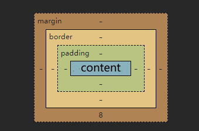

# CSS

------

> CSS：层叠样式表，给html语言一层一层加样式，也是一种标记语言，和html类似，同样不区分大小写，建议小写。
>
> CSS用于给html解构设置样式，美化页面的，实现了结构和样式的分离。
>
> CSS文件的注释只有一种方式：`/* 注释 */`
>
> CSS文件第一行写：`@charset "UTF-8";`来用于告诉浏览器，该文件采用的编码是utf8。

- ### HTML页面使用css样式的3种方式：

  1. 行内样式：在html标签内部使用style属性来设置元素的样式。如：

     ```html
     <p style="样式名1: 值;样式名2: 值;..."></p>
     ```

  2. 内部样式/内联样式：在head标签中使用style标签，在该标签内写css样式。如：（style标签写哪都行，但是建议在head标签中）

     ```html
     <head>
         <style>
             /*选择器一会说*/
             选择器1 {/*大括号是声明块。选择器和声明块之间最好有个空格，这是规范；每个声明，冒号后最好也有一个空格*/
     		   /*声明块里面是一个个的声明/样式*/
                 样式名1: 样式值;
                 样式名2: 样式值;
                 ...
             }
             选择器2 {
                 样式名1: 样式值;
                 样式名2: 样式值;
                 ...
             }
             ...
         </style>
     </head>
     ```

  3. 外部样式：head标签中使用link标签引入外部css文件（最常用，最灵活）。将css样式写到一个独立的xx.css文件中，在需要的html中使用link标签引入此css文件即可。如：（link标签写哪都行，但是建议在head标签中）

     ```html
     <head>
         <!-- 可以引入多个 -->
         <link rel="stylesheet" href="css文件的路径" />
     </head>
     ```

     这种方式易于维护，独立性高耦合度低，多个页面引用一个css文件时浏览器直接去缓存中取，效率高。

> 这三种样式的优先级：行内样式 > 内部样式 = 外部样式
>
> 样式的优先级相同时，后面的会覆盖前面的，遵循“后来者居上”。

- ### CSS的选择器：

  1. #### 基本选择器：

     - id选择器：`#btn {}`，选中页面中，id为btn的那个元素。
     - 类选择器：`.container {}`，选中页面中，所有类名为`container`的标签。
     - 元素选择器：`h1 {}`，选中页面中，所有h1标签。
     - 通配选择器：`* {}`，选中页面中的所有元素。

  2. #### 复合选择器：

     - 交集选择器：选中同时符合多个条件的元素。将基本选择器连着写就是交集选择器。如：（如果交集中有标签，那么标签得在最前面）

       ```css
       h1.container#btn {}/*选中页面中所有的h1标签，且类名是container，id还得是btn的标签*/
       ```

     - 并集选择器：选中满足其中一个条件的元素，或的意思。如：

       ```css
       #wc,/*规范起见，并集选择器中每个条件之间换个行增加可读性*/
       p,
       .dog {}/*选中页面中所有的p标签，或类名是dog，或id是wc的标签。满足条件之一即可*/
       ```

     - 后代选择器：选中指定标签的，符合条件的所有后代标签。条件之间用“空格”隔开，表示“其中的”。如：

       ```css
       #wc ul li {}/*选中id为wc元素中的所有ul中的所有li元素*/
       ```

     - 子代选择器：选中指定标签的，符合条件的所有子标签。条件之间用“>”隔开。如：

       ```css
       #wc>li {}/*选中id为wd标签，它的直接子li标签*/
       ```

     - 邻接兄弟选择器：选中指定标签“后面的”，符合条件的，紧跟着的，兄弟标签。如：（不能间隔其他标签）

       ```css
       div+p {}/*表示选中div“后面那个”，“紧紧相邻的”那个“兄弟节点”p标签，不能间隔其他标签*/
       ```

     - 通用兄弟选择器：选中指定标签“后面的”，符合条件的，所有兄弟标签。如：

       ```css
       div~p {}/*表示选中div“后面”，“所有的兄弟”p标签*/
       ```

     - 属性选择器：选中属性值符合一定要求的标签。如：

       ```css
       [href="值"] {}/*表示选中所有具有href属性，且属性值相同的元素*/
       [href*="值"] {}/*表示选中所有具有href属性，且包含该属性值的元素*/
       [href^="开头"] {}/*表示选中所有具有href属性，且属性值以此开头的元素*/
       [href$="结尾"] {}/*表示选中所有具有href属性，且属性值以此结尾的元素*/
       ```

     - ##### 伪类选择器：它不是类，是元素状态的一种描述。伪类选择器可以选中元素的某种状态，用冒号“:”。伪类有以下几种：

       - 行为伪类/动态伪类：某些元素会有默认的行为，可以为元素处于某个行为时设置样式。如：超链接有以下4种行为（顺序不能乱，因为某些状态可能会包含其他状态，所以顺序必须严格控制）

         ```css
         a:link {}/*表示选中没有被访问过的a标签*/
         a:visited {}/*表示被访问过的a标签*/
         a:hover {}/*表示鼠标悬浮在a标签时的状态*/
         a:active {}/*表示选中a元素被激活时的状态。激活状态就是鼠标按下还没有弹起*/
         /*这个顺序是lvha，LV好*/
         ```

       - 结构伪类：选中某些结构的标签。如：（特殊的，`:root {}`和`html {}`选择的都是html标签）

         ```css
         p:first-child {}/*选中所有p标签，且此p标签是第一个子节点*/
         p:nthchild(x) {}/*选中所有p标签，且此p标签是第x个子节点。括号中也可以写2n或even，表示偶数子节点，2n+1或odd是奇数子节点。n可以是从0到正无穷的所有正整数。也可以写公式，但必须是an+b的形式。比如选中前五个：-n+5，无论n是正整数的几，都只选中前五个。*/
         p:first-of-type {}/*选中所有p标签，且该p标签是第一个该类型的p，不用必须是第一个子*/
         span:only-child {}/*选中所有span标签，且span没有其他兄弟节点*/
         span:only-of-type {}/*选中所有span标签，且兄弟节点中只有一个span*/
         div:empty {}/*选中空的div标签，内部没有任何内容，空格都不行*/
         ```
       
     - 否定伪类：给选中的标签再加过滤条件，排除一些标签。语法：`:not(条件)`，如：
       
       ```css
         p:not(.dog){}/*选中所有p标签，排除掉dog类的p标签*/
       ```
       
     - UI伪类：选中具有某些UI样式的元素。如：
       
       ```css
         input:checked {}/*选中被checked勾选的元素*/
         input:enable {}/*选中可用的元素*/
         input:disabled {}/*选中不可用的元素*/
         input:focus {}/*获取焦点时的input元素*/
       ```

       - 目标伪类： `div:target {}`，选中超链接的锚点跳转到的那个div元素。

       - 语言伪类：`div:lang(en) {}` ，选中div且属性lang的值是en。

     - 伪元素选择器：选的不是标签元素，选的是标签内部的内容文本，是伪元素/文本元素。用两个冒号“::”，如：

       ```css
       p::first-letter {}/*选中p中文本的第一个字母*/
       p::selection {}/*选中p中，被鼠标选中的文本*/
       input::placeholder {}/*选中input中，文本输入框的占位符*/
       p::before {content: "$"}/*选中p中，内容的最前面。给它加上文本内容“$”伪元素，是行内元素*/
       P::after {content: "^"}
       ```

       > 不同的选择器，选中相同的元素，听哪个的呢？这就涉及到了选择器的优先级。简单的优先级如下：
       >
       > ID选择器 > 类选择器 > 元素选择器 > 通配选择器 > 默认样式 > 继承过来的样式

       > 复杂的选择器优先级要算，格式：(a,b,c)。
       >
       > - a：id选择器的个数
       >
       >
       > - b：类、伪类、属性选择器的个数
       >
       >
       > - c：元素、伪元素选择器的个数
       >
       >
       > （计算的时候注意，并集选择器是分开算的，并集选择器相当于写了3个选择器）
       >
       > （上面计算不用硬背，vscode中，鼠标放在选择器上面自动就会帮你算出来优先级）
       >
       > *所以今后写的样式出不来的话，就要考虑是不是样式的优先级被顶掉了*
       
       > 注意：有一种方式的权重最大，行内样式也不行了。直接在你的样式后面加`!important`，如：
       
       ```css
       div { color: red !important; }/*这种方式的话语权最大，谨慎使用，一般最好别用*/
       ```

- ### CSS的3大特性：（层叠、继承、优先级）

  > - **层叠性**：如果发生了样式冲突，那么就会根据选择器的优先级，来进行样式的层叠（覆盖）。
  >
  >   （样式冲突：同一个样式名，设置了不同的值，就是冲突）
  >
  > - **继承性**：元素会自动拥有其父元素、或祖先元素上所设置的某些样式，优先继承离的近的。像字体、文本、文字颜色等一般都可以被继承。边框、背景等和布局相关的，和盒子模型相关的，一般不能被继承。常见的可继承的css属性：color, font-??, text-??, line-?? ...（参考MDN，查询css属性是否可被继承）
  >
  
  > 在浏览器的开发工具中，如谷歌，element.style中是元素内部样式，带html文件名的是内部style块的样式，css文件的是外部样式，用户代理样式表是浏览器的默认样式，Inherited from是继承过来的样式

------

- ### CSS中的单位：

  > 虽然css中可以用cm和mm作为单位，但是它们还是太大了，不够精确，所以就有了像素px，那么什么是像素呢？
  > cm这种是绝对单位，哪里都是这么大，但像素（pixel）是一个相对单位，相对于屏幕大小的；如果是1920x1080的屏幕，
  > 那么屏幕的横向和纵向就分别有1920和1080个像素点。

- ### 颜色的表示：（IE不支持透明度）

  > 我们之前用的都是颜色的英文，如：`color: red`。这种方式虽然简单，但不够精确，不常用，我们常用的是：

  1. **rgb方式**：光的红绿蓝三原色表示法，如：`rgb(255,0,0)` 就是红色。还可以用百分比的形式，如：`rgb(100%,0%,0%)`。

     还可以用`rgba(255,0,0,0)`，a是不透明度，0是完全透明，1是不透明，只能在0-1之间取。
     （三个数都是0就是黑色，三个255是白色，三个相同是灰色，数值越大灰色越淡）

     rgb方式的16进制写法：`#ffffff`就是`rgb(255,255,255)`，同样的`#ffffff00`表示完全透明。如果每个位置两个数字相同，可以简写为`#fff0`

  2. **HSL方式**：这种方式是通过调：色相、饱和度、亮度，来表示一个颜色的。格式为：`hsl(色相,饱和度,亮度)`。具体含义为：

     - 色相：取值范围是0-360度，具体看色相图。
     - 饱和度：取值范围0%-100%
     - 亮度：取值范围0%-100%

     （而HSLA就是添加了不透明度）

- ### 设置元素的不透明度：

  > `opacity`属性可以设置**整个元素**的不透明度，包括里面内容的不透明度，值是0~1

------

- ### 字体：（设置元素内部字体）

  - **字体大小**：css的元素内部的字体大小用`font-size`来设置，调的是“字体设计框”的高。（浏览器通常有字体的最小值，小于此不生效）

  - **字体族**：设置字体族用`font-family: "宋体","楷体",...;` ，多个之间用逗号隔开，前提是电脑上安装有此字体，浏览器上才会显示。最终的字体从前往后看本地有哪些字体，就用哪个。

    字体族整体上分为“衬线字体”和“非衬线字体”。衬线字体比较呆板，棱棱角角不圆润，有小尾巴，比如楷体和宋体。非衬线字体比较圆润，例如微软雅黑。通常网页中非衬线比较常用。而且通常这些字体族中，要么都是非衬线字，要么都是衬线字。比如：

    ```css
    font-family: "STCaiyun","Microsoft YaHei",sans-serif;/*建议用字体的英文名*/
    /*最后这个sans-serif表示，如果前面的字体都没有，就随便来个非衬线字。serif是衬线字*/
    ```

  - **字体风格**：设置字体是否倾斜。`font-style: italic;` 表示斜体，`normal`是正常的。oblique是强制倾斜，将正常字体斜着显示而不是用改字体所设计的斜体字。

  - **字体粗细**：`font-weight: lighter;` 表示偏细，bold是偏粗，bolder是更粗，normal是正常。绝大部分字体就设计了3种粗细程度，bolder还是bold。有时也写一个[1-1000]之间的数字来表示粗细程度。

  - **字体的复合写法**：`font: italic lighter 20px "Microsoft YaHei",sans-serif;`（最后两位必须是字体大小和字体族，前面顺序随意）

------

- ### 文本：设置元素内部文本（内部的行内和行内块元素，都可以当作文本一样去处理）

  - **文本颜色**：用`color`来设置内部文本颜色。

  - **文本间距**：用`letter-spacing`来设置字符间距，用`word-spacing`来设置单词间距。值用px为单位，可以是负值。

  - **文本修饰**：用`text-decoration: overline dotted red;`来设置文本的修饰线。c3将它作为复合属性，没有顺序要求。

    - `text-decoration-line: overline;` 设置修饰的线。`overline`是上划线，`underline`是下划线，`line-through`删除线，`none`没有线。
    - `text-decoration-style: wave;`设置线的风格。`dotted`是点线，`wave`是波浪线，`dashed`是虚线，`solid`是实线，`double`是双线。
    - `text-decoration-color: blue;`设置线的颜色。

  - **文本缩进**：`text-indent: 40px;`设置文本缩进。

  - **文本水平对齐**：`text-align: center;`设置文本水平对齐方式，值还有`left`和`right`。

    （垂直对齐：top middle bottom；水平对齐：left center right）

  - **文本行高**：用`line-height: 40px;`来设置文本的行高。默认行高略高于字体设计框，也就是略大于字体大小，行给字包住。

    如果不设置或设置为`normal`，那么浏览器会根据字体大小自动调整，不至于让行之间冲突。通常会写一个数值或百分比，表示行高为`font-size`的整数倍。

    （重点：默认行高以一行中最高元素的高度为准。div的默认高度是：行数*行高）

    行高除了调整多行文字的间距之外，还可以做*单行文字的垂直居中*（不是绝对居中）：`line-height=height`

    ```css
    height: 20px;
    line-height: 20px;
    ```

  - **vertical-align**：加在行内元素、行内块元素上，可以设置它们的垂直居中。值有：

    - middle：该元素的正中央，和父元素的字体设计框的中心位置对齐。
    - baseline（默认）：该元素底部和父元素的基线对齐。
    - top：该元素在一行的顶端。
    - bottom：该元素在一行的底端。

    （小技巧：该属性还可以用于设置，单元格内部文字的垂直对齐方式）

------

- ### 列表：（可用在ul、ol、li上）

  - 列表符号：`list-style-type: none;`，常用值：`disc`圆形、`decimal`数字、`square`实方块。
  - 列表符号位置：`list-style-position: inside;`，`inside`表示列表符号是在<li>的里面，`outside`是在<li>的外面。
  - 自定义列表符号：`list-style-image: url("./image/xx.gif");`
  - 复合属性：`list-style: none outside url(".image/xx.gif");`，没有顺序要求。

- ### 边框：

  - 边框宽度：`border-weight: 1px;`
  - 边框颜色：`border-color: green;`
  - 边框风格：`border-style: solid;`
  - （常用）复合写法：`border: 1px orange solid;`

- ### 背景：

  - 背景色：`background-color: skyblue;`，默认值`transparent`是透明的背景色。
  - 背景图片：`background-image: url("./image/xx.gif");`
  - 背景重复：`background-repeat: no-repeat;`
  - 背景位置：`background-position: left top;`，值也可以是：10px 20px，表示背景距离父元素边框的x轴10px，距离y轴20px。
  - 复合写法：`background：skyblue url("./image/xx.gif") no-repeat 10px 20px;`，没有顺序要求。
  - 固定背景：`background-attachment: fixed;`固定背景，此时背景不会随着滚动条的滚动而移动了。

- ### 鼠标：

  **`cursor`**属性用来设置光标的类型（如果有），在鼠标指针悬停在元素上时显示对应的样式。值可以是`move`、`wait`、`crosshair`、`help`、`text`等。还可以自定义，如下：

  ```css
  cursor: url("./image/xx.gif"), pointer;/*自定义鼠标样式，末尾要加一个普通鼠标样式，防止url不可用*/
  ```

------

- ### 表格独有的属性：（跨行跨列只能用html的方式，css不能合并边框）

  - **设置表格标题位置**：`caption-side: bottom;`

  - **表格列宽**：`table-layout: fixed;`，默认值`auto`根据内容自动调整宽度，`fixed`列等宽。

  - **单元格间距/表格边框间距**（类似于html的`cellspacing`）：`border-spacing: 50px;`

  - **合并相邻单元格的边框**：`border-collapse: collapse;`，值`separate`不合并，`collapse`合并。

    （注意它会使上面单元格间距设置不起作用）

  - **隐藏没内容的单元格**：`empty-cells: hide;`

------

- ### CSS的常用的长度单位：（css中设置大小必须给单位，否则不起作用）

  - em：相对于当前元素的，`font-size`的倍数。如果该元素没有设置`font-size`，它会去父元素上一层层找，都没有设置就用浏览器默认的`font-size`
  - rem：相对于html元素的`font-size`的倍数。
  - xx%：相对于父元素大小的百分比。（根元素html设置100%，就是占浏览器视口的100%）


------

- ### CSS中，元素的显示模式：

  - 块元素（block）：独占一行，从上往下排列；默认宽度撑满整个父元素，默认高度由内容高度决定。宽高可以设置；
  - 行内元素（inline）：又叫“内联元素”，不独占一行，一行容不下会从左到右排列；宽高都只由内容决定，且宽高无法被设置；
  - 行内块元素（inline-block）：又叫“内联块元素”，和“行内元素”区别在于，可以通过css设置宽高（就是行内块元素）

  > 部分常见元素的显示模式：
  >
  > - 块元素：`<html>、<body> 、<h1>~<h6>、<hr>、<p>、<pre>、<div>、<ol>、<ul>、<li>、<dl>、<dt>、<dd>、<table>、<caption>、<thead>、<tbody>、<tfoot>、<tr>、<form>、<option>`
  > - 行内元素：`<br>、<em>、<strong>、<sub>、<sup>、<del>、<ins>、<a>、<label>`
  > - 行内块元素（早期作为行内元素的一种）：`、<td>、<th>、<input>、<textarea>、<select>、<button>、<iframe>`

  > 有一个css属性可以**设置元素的显示模式**，`display: block;`修改元素的显示模式为块元素，还有`inline`和`inline-block`，`none`隐藏该元素。（还有其他值，后面说）

------

- ### 盒模型：

  > css会将**所有的html元素**看作一个盒子，所有的样式也都是基于这个盒子。相关概念如下：
  >
  > 
  >
  > - margin（外边距）：盒子和外部其他元素之间的距离（可以是负数值），外边距不被当作盒子的一部分。
  > - border（边框）：盒子的边框。
  > - padding（内边距）：盒子边框和盒中内容之间的补白区。
  > - content（内容区）：盒中的元素或文本都是其内容。

  ##### 关于盒模型的注意事项：

  > - ###### 内容区content：
  >
  >   - `width`设置的只是内容区的宽，一般盒子内的子元素是在其父元素的内容区里（width/height默认值auto）。
  >   - 盒子大小 = content + padding + border   注意：margin不算盒子的一部分，就是盒子外的空气
  >   - `min-width`和`max-width`分别是设置内容区宽度的下限和上限的。一般不和width一起用。
  >   - div的默认宽度：在不显示设置div的宽度时，元素所呈现的默认宽度 = 父content - 自身的左右margin
  >
  > - ###### 内边距padding：
  >
  >   - 行内元素的上下padding（内边距）不能完美设置，而它的上下margin（外边距），设置了也没用。（行内块没事）
  >   - `padding-top/padding-bottom/padding-left/padding-right`分别可以设置元素上/下/左/右的内边距，`padding`是复合属性，1个值表示4个方向内边距，2个值是上下、左右内边距，3个值是上，左右，下内边距，4个值是上下左右。
  >   - 内边距的值不能为负数
  >
  > - ###### 边框border：
  >
  >   - 之前我们只说了边框的宽度、颜色、风格3个属性，其实这3个属性分别还有对应上下左右4个方向共12个属性，还有4个方向的复合属性，如：`border-left-color: red;`，`border-left: 1px solid red;`
  >
  > - ###### 外边距margin：
  >
  >   - margin也有像上面padding类似的几个属性。
  >   - margin的值可以为负数。
  >   - margin的值还可以是`auto`，表示离左边/右边能有多远就有多远。如果给一个块级元素设置左右margin为auto，那么该块元素会在父元素中水平居中。设置块元素水平居中`margin: 0px auto;`
  >   - **margin塌陷问题**：第1个子元素的maigin-top和最后1个子元素的margin-bottom会作用在其父元素上，解决方案：
  >     1. 给父元素设置不为0的`border`或`padding`
  >     2. （推荐）溢出隐藏：`overflow: hidden;`
  >   - **margin合并问题**：块元素的上下方向的margin会合并，无需解决。

------

- ### 内容溢出：

  > 在容器内部加：`overflow: hidden/visible/scroll/auto;`（`scroll`一定会有滚动条，`auto`不溢出则没有）

- ### 行内块、行内元素的空白：

  > 原因是写代码换行了。解决方案：
  >
  > 1. 不换行。
  > 2. （推荐）设置父元素的`font-size: 0;`，再给需要显示文字的元素单独设置`font-size`

- ### 行内块的“幽灵空白”：

  > 原因是行内元素`img`和行内的文本默认是基线对齐，而基线并不是一行中的最底端，下面还有一点空白；解决方案：
  >
  > 1. （推荐）给行内块元素加`vertical-align`，什么值都行，就是不能是默认值`baseline`
  > 2. 将行内块设置为块：`display: block;`
  > 3. （推荐）给其父元素设置`font-size: 0px;`

- ### 内容隐藏：

  > 隐藏元素的两种方式：`display: none;`和`visibility: show/hidden;`（区别是`display`隐藏了且不占位置了）

- ### 布局小技巧：

  > - 行内和行内块元素，都可以被父元素当作文本一样去处理。像`text-align`这些调文本的属性都可以作用在行内元素上。
  > - 父元素内的行内元素要水平居中，给父元素加：`text-align: center;`，块元素水平居中给子元素加：`margin: 0 auto;`
  > - 父元素内的行内元素要垂直居中，父元素加：`line-height = height;`，每个子元素加`vertical-align: middle;`如果是绝对的垂直居中，`font-size`设置为0。（块元素要垂直居中，目前先计算后用margin，后面会有更好的方式）

------

- ### 浮动：

  > 浮动最早期是用来做文字环绕图片、文字环绕文字这种效果的。只要在图片/文字上加`float: left/right/none;`，默认none不浮动。现在浮动是主流的页面布局方式之一。因为最早期是用表格做布局，过于复杂。而目前c3布局有很多种方案，一般用弹性盒子`flex布局`偏多。

  ###### 添加了浮动`float`之后的元素的特点：

  > 1. 添加了浮动后的元素，相当于在原容器上飘起来了，脱离了标准“文档流”。
  > 2. 无论什么元素，浮动后默认宽高都是被内容撑开，也就是尽量小；当然也都可以设置宽高。
  > 3. 浮动后块元素也可以和其他块元素共占一行，且浮动不会遮挡住下方元素中的内容（行内/行内块元素），内容会自动避开显示出来。
  > 4. margin合并和margin塌陷都没有了，4个方向的margin和padding都可以完美设置。
  > 5. 行内、行内块元素不能被当作文本去处理了，也没有行内块的空白问题了。
  > 6. 浮动元素仍会受到父元素的内容宽度`width`所影响。

  ###### 浮动后的影响：

  > 1. 后面的兄弟**块元素**会占据浮动元素之前的位置，在浮动元素的下边，导致块元素被遮住。
  > 2. 如果父元素没有设置高度，浮动元素不能撑起父元素的高度，导致父元素高度塌陷。

  ###### 消除浮动的影响：

  > 1. 自己计算然后手动给出父元素的高度。
  > 2. 给父元素也加上浮动。
  > 3. 给父元素设置`overflow: hidden;`
  >
  >  *（以上三种方式虽然解决了塌陷问题，但是兄弟被遮挡的问题没有解决，反而更严重）*
  >
  > 解决方案：（适合在，父元素中的子元素都浮动，没有部分浮动部分不浮动）
  >
  > 1. 给所有浮动元素的最后面，加一个**空的**、**没有浮动**的**块/行内块元素**，并给该元素加`clear: both;`，表示消除前边所有浮动兄弟产生的影响。（值`left`指消除前边所有左浮动兄弟产生的影响，相应的还有`right`）
  >
  > 2. （推荐）或者不用改html代码，直接通过css设置浮动元素的父元素，给它添加伪元素。通过：
  >
  >    `父元素::after { content: ''; display: block; clear: both;};`
  >
  > **（建议，父元素内，兄弟子元素之间要么都浮动，要么都不浮动）**

------

- ### 定位：

  > 定位用来，给页面的整体布局，做局部微调。

  - **相对定位**：给要定位的元素上加，`position: relative;`，开启相对定位，然后下方写`top/bottom/left/right: 10px;`这4个属性来调整位置，表示上/下/左/右与原位置的距离。

    > - 相对定位不离开文档流，它常用于微调。
    >
    > - 它和绝对定位是一对cp，经常会一块用（后面说）。
    > - 相对定位之后，依然可以设置margin和浮动，不影响，遵循先浮动后定位。不过一般不推荐一块用，页面很乱。
    > - 无论什么元素，只要开启了任何定位，都变成了定位元素，默认宽高都由内容决定，也就是尽量小。也可以设置宽高。
    > - 定位元素层级比普通元素高，定位元素之间层级是一样的，看哪个元素在html后出现，谁就压着谁。

  - **绝对定位**：元素上加`position: absolute;`，开启绝对定位，然后下方写`top/bottom/left/right: 10px;`这4个属性来调整位置，表示上/下/左/右与**包含块的边框**之间的距离。

    > - **绝对定位会脱离文档流**，需要消除浮动的影响。
    > - 对于绝对定位来说，定位时要参考的是它的“包含块”。**包含块**：对于没脱离文档流的元素来说，它的父元素就是它的包含块，而对于脱离了文档流的元素来说，它的包含块是第一个开启定位的祖先元素。
    > - 所以对于绝对定位来说，一定要在其父元素上设置`position: relative;`，开启相对定位，但不用给移动距离所以对父元素没影响。然后子元素就可以进行绝对定位了，这就是所谓“子绝父相”。
    > - 绝对定位也不推荐和margin一块用，因为绝对左定位只能用左margin。
    > - 浮动不可以和绝对定位一起用，浮动会失效。

  - **固定定位**：元素上加`position: fixed;`，开启固定定位，值为`fixed`固定的。它和绝对定位其他都一样，只是参考点直接就是浏览器的视口。另外，固定定位不随着滚轮滑动而变化，它永远固定在浏览器窗口的某个位置，只参照可见的视口。

  - （了解）**粘性定位**：元素上加`position: sticky;`，开启粘性定位，值为`sticky`粘性的。然后下方写`top: 10px;`，表示当此元素上方移动到距离参考点边框10px时被粘住，直到它的父元素被移走时此元素随着父元素被一块移走。粘性定位其他的和相对定位比较类似，不脱离文档流，同样不推荐和margin或浮动一块用。（参考点是：离它最近的拥有滚动条的祖先元素）

> 定位的一些注意点：
>
> - 定位不要同时定上下或左右，否则一方会失效。
> - 定位参考的一般都是与参考元素的border之间的距离。
> - 定位的元素比不同元素层级高。定位元素之间的层级都是一样的，也可以通过`z-index`属性来设置，值是一个自然数，默认是`auto`。但是z-index大的不一定能压住小的，也得看它们父元素的`z-index`层级。（只有定位元素才可以设置`z-index`）
>
> 定位的特殊应用：
>
> - 前边说过，定位不能同时设置上下，或左右，但是有一种情况比较特殊，就是：当需要子元素撑满整个父容器时，通常用绝对定位且同时设置上下或左右，然后不设置子元素的`width/height`
> - 一个固定宽高的块元素，开启绝对定位后同时设置上下左右，此时加上`margin: auto;`，此时浏览器会自动用合适的margin来达到效果，两边都不违背。

------

- ### 布局相关：

  - ###### 版心：

    > - 由于pc上每种显示器的分辨率、宽度的不同，为了都适配，通常每个网页都设置至少一个水平居中、固定宽度的盒子，用来显示网页中的主体内容，称为**版心**`container`。
    >
    > - 版心div的宽度一般是960-1200像素之间。版心可以有一个或多个。有的更高端的网页采用了“响应式”，它会利用“媒体查询”根据不同的屏宽采用不同的样式。
    >
    > - 通常网页中外层的大容器div不设置宽度，默认撑满整个屏幕，而里面的版心div宽度通常设置960-1200，目的是兼容大多数屏幕，版心两边设置背景或动态效果，主体内容都放在版心。

  - ###### 类名：

    > 顶部导航条：`topbar`
    > 页头：`header、page-header`
    > 导航：`nav、navigator、navbar`
    > 搜索框：`search、search-box`
    > 横幅、广告、宣传图：`banner`
    > 主要内容：`content、main`
    > 侧边栏：`aside、sidebar`
    > 页脚：`footer、page-footer`

  - ###### 重置默认样式：

    > 在早期，元素的默认样式可以帮助我们快速绘制网页，但如今网页越来越复杂，这些默认样式反而会给我们带来很多麻烦，而且这些默认样式在浏览器上的兼容性不好，所以我们需要清除掉元素的默认样式。一般用以下几种方案：
    >
    > 1. 使用全局选择器，在其中对所有元素进行统一设置。但这种方式在实际开发很少用。
    > 2. （推荐）自己写一个`reset.css`，将你希望的默认样式写进去，或直接用别人写好的`reset.css`来重置。经过重置后的网页，就像一张白纸一样，开发者可根据设计稿，精细地去添加具体的样式。
    > 3. `normalize.css`是一种新方案，它在清除默认样式的基础上，添加或保留了一些有价值的默认样式。它是一条默认样式的标准，由很多大公司共同维护，可以去github上下载来用。

  - ###### 引入网页图标：

    > 之前说的网页图标方式，是借助了`liveserver`插件，直接将图标放在vscode打开的文件夹中，不通用。正宗的引入图标的方式为：在<head>中写一个<link>标签，rel属性值为`shortcut icon`，表示引入外部图标，type值为`image/x-icon`，表示图片类型图标，href属性写图片路径。如：`<link rel="shortcut icon" type="image/x-icon" href="图片位置">`

  - ###### 精灵图：

    > - 所谓精灵图就是图片拼合技术，将所有的小图片拼成一张大图片，再通过给div设置背景、调整背景图片的位置来显示里面不同的小图。
    >
    > - 使用精灵图的好处是：减少页面发送请求次数，从而加快页面响应时间，减轻服务器压力。

------

