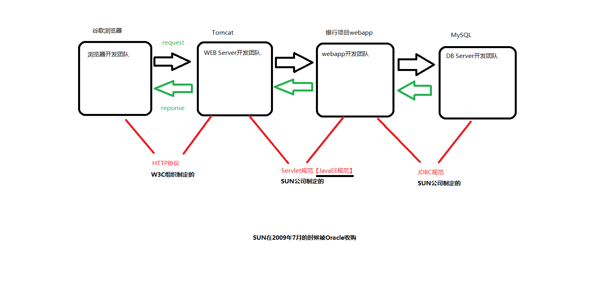

# JavaWeb

- ## 互联网通信

  - #### 关于系统架构

    - ##### C/S结构：（即：客户端/服务器）

      > - 优点：
      >   1. 速度快。大量的数据都是集成在客户端软件当中，所以服务器只需要传送很少的数据量。
      >   2. 服务器压力小。大量的数据都是集成在客户端软件当中，所以服务器只需要传送很少的数据量。
      >   3. 安全。大量的数据都是集成在客户端软件当中,数据在多个客户端上有缓存。
      > - 缺点：升级维护比较差劲。每一个客户端都需要升级。

    - ##### B/S架构：（即：浏览器/服务器）

      > - 优点：
      >   1. 升级维护方便，成本比较低。只需要升级服务器端即可。
      >   2. 不需要安装特定的客户端软件,只需要打开浏览器，输入网址即可。
      > - 缺点：
      >   1. 速度慢。因为所有的数据都是在服务器上，用户发送的每一个请求都是需要服务器全身心的响应数据。
      >   2. 不安全。

  - #### B/S结构的系统通信原理

    - ##### 域名

       > 在 https://www.baidu.com/ 网站中，www.baidu.com 就是一个域名。
       >
       > 在浏览器地址栏上输入域名，回车之后，域名解析器会将域名解析出来一个具体的IP地址和端口号等。
       >
       > 解析结果也许是：http://110.242.68.3:80/index.html
       >
       > **IP地址**：网络中一台主机的唯一标识（身份证号）。
       >
       > **端口号**：网络中一个软件的唯一标识。

    - ##### 一个WEB系统的通信原理？

       > 1. 用户输入网址（URL）
       > 2. 域名解析器进行域名解析：110.242.68.3:80/index.html
       > 3. 浏览器软件在网络中搜索并找到110.242.68.3这一台主机
       > 4. 该台主机定位到80端口对应的服务器软件
       > 5. 80端口对应的服务器软件得知浏览器想要的资源名是：index.html
       > 6. 服务器软件找到index.html文件，并且将index.html文件中的内容直接输出响应到浏览器上。
       > 7. 浏览器接收并执行到来自服务器的代码（HTML CSS JS）
       >
       > 
       >
       > 这其中最关键的就是服务器软件了，这个软件（程序）启动时会监听某个端口，等待用户通过网络协议（HTTP）与该端口的服务器程序进行数据的传输（通信）
       >
       > 
       >
       > 我们编写的JavaWeb应用应当遵循Servlet规范，这样我们编写的Web应用就可以无缝部署到任何实现了Servlet规范的服务器上，真正做到**解耦合**。

    - ##### 关于Tomcat服务器：

       > - 之前我们学JavaSE，可以通过`ServertSocket`和`Socket`来编写一个简单的Web服务器，监听端口处理浏览器发送的请求，并做出响应。但这只是简单的请求和响应，一个标准的WEB服务器需要做很多事情。如果这些代码都让我们自己来一行行写，那做WEB开发就太复杂了，还没开始写具体的业务就写了大量的、复杂的代码。
       > - 其实这些重复的，和业务无关的代码都有人帮我们写好了，我们直接用即可。目前比较流行的开源服务器有很多，如：
       >   - Apache Tomcat（Catalina）：它是Apache软件基金会的开源、免费、轻量级的WEB服务器，用纯Java语言开发，体积小运行速度快，实现了Servlet、JSP等少量JavaEE规范。由于是纯Java写的程序，所以要想运行，必须先有JRE，并配置环境变量JAVAHOME。
       >   - jetty：最轻量级的免费Web服务器，当然功能要少于tomcat一些，同样是由Java编写。
       >   - JBOSS：Java语言编写的应用服务器。
       >   - WebLogic（应用服务器）
       >   - WebSphere（应用服务器）
       >   - Apache：C语言编写的WEB服务器，开源，只支持静态解析
       >   - Nginx：C语言编写的WEB服务器
       > - 所以我们做WEB开发就用别人写好的WEB服务器即可。我们只需要将编写的WEB项目部署在服务器上，当服务器启动时用户就可以访问服务器上的资源了。我们只需要面向接口编程（类似JDBC），专注于业务的实现。
       > - 当用户在浏览器地址栏输入路径访问web服务器上对应的资源，一个路径就代表一个资源。这个资源可能是
       >   一个静态资源（index.html），也可能是一个动态资源（java代码）。但这个请求的url路径不能随便整，必须按照服务器程序中规定的来，否则就会找不到该资源（即404）。

    - ##### 模拟Servlet的本质

       1. 充当SUN公司的角色，制定Servlet规范。

          > `javax.servlet.Servlet`接口：
          >
          > ```java
          > package javax.servlet;
          > /*
          >     我们现在充当的角色是SUN公司，
          >     SUN公司把Servlet接口/规范制定出来了
          >  */
          > public interface Servlet {
          >     //一个专门提供服务的方法.
          >     void service();
          > }
          > ```

       2. 充当Webapp的开发者：

          > BankServlet implements Servlet：
          >
          > ```java
          > package com.bjpowernode.servlet;
          > 
          > import javax.servlet.Servlet;
          > public class BankServlet implements Servlet {
          > 
          >     @Override
          >     public void service() {
          >         System.out.println("BankServlet is servce...");
          >     }
          > }
          > ```
          >
          > UserListServlet implements Servlet：
          >
          > ```java
          > package com.bjpowernode.servlet;
          > 
          > import javax.servlet.Servlet;
          > public class UserListServlet implements Servlet {
          > 
          >     @Override
          >     public void service() {
          >         System.out.println("UserListServlet is servce...");
          >     }
          > }
          > ```
          >
          > UserLoginServlet implements Servlet：
          >
          > ```java
          > package com.bjpowernode.servlet;
          > 
          > import javax.servlet.Servlet;
          > public class UserLoginServlet  implements Servlet {
          > 
          >     @Override
          >     public void service() {
          >         System.out.println("UserLoginServlet is servce...");
          >     }
          > }
          > ```

       3. 充当Tomcat服务器的开发者

          > ```java
          > package org.apache;
          > 
          > import java.util.Scanner;
          > import java.util.Properties;
          > import java.io.FileReader;
          > import javax.servlet.Servlet;
          > 
          > // 充当Tomcat服务器的开发者
          > public class Tomcat{
          >  public static void main(String[] args) throws Exception{
          >      System.out.println("Tomcat服务器启动成功，开始接收用户的访问。");
          > 
          >      // 简单的使用Scanner来模拟一下用户的请求
          >      // 用户访问服务器是通过浏览器上的“请求路径”
          >      // 也就是说用户请求路径不同，后台执行的Servlet不同。
          > 		/*
          > 			/userList    UserListServlet
          > 			/login		 UserLoginServlet
          > 			/bank		 BankServlet
          > 			......
          > 		*/
          >      System.out.print("请输入您的访问路径：");
          >      Scanner s = new Scanner(System.in);
          > 
          >      // 用户的请求路径  /bbbb
          >      String key = s.nextLine(); // Tomcat服务器已经获取到了用户的请求路径了。
          > 
          >      // Tomcat服务器应该通过用户的请求路径找对应的XXXServlet
          >      // 请求路径和XXXServlet之间的关系应该由谁指定呢？
          >      // 对于Tomcat服务器来说需要解析配置文件
          > 
          >      /*    ResourceBundle bundle = ResourceBundle.getBundle("web.properties");
          >              String className=bundle.getString(提示key:"key");    */
          > 
          > 
          > 
          >      FileReader reader = new FileReader("web.properties");
          >      Properties pro = new Properties();
          >      pro.load(reader);
          >      reader.close();
          > 
          >      // 通过key获取value
          >      String className = pro.getProperty(key);
          >      // 通过反射机制创建对象
          >      Class clazz = Class.forName(className);
          >      Object obj = clazz.newInstance(); // obj的类型对于Tomcat服务器开发人员来说不知道。
          > 
          >      // 但是Tomcat服务器的开发者知道，你写的XXXXServlet一定实现了Servlet接口
          >      Servlet servlet = (Servlet)obj;
          >      servlet.service();
          > 
          >  }
          > }
          > ```
          >
          > **注意**：
          >
          > - 这个配置文件的文件名不能乱来。固定的。
          > - 这个配置文件的存放路径不能乱来。固定的。
          >
       
    - ##### 开发第一个JavaWeb应用-firstapp：
  
       1. 下载Tomcat压缩包，将其解压到某个目录下即可完成暗转：
  
          
  
       2. 配置Tomcat服务器环境变量：

          > - CATALINA_HOME=D:\SoftWare\Tomcat\apache-tomcat-10.0.12
          > - PATH=%CATALINA_HOME%\bin
          >
          > 然后打开cmd，输入`startup.bat`后按下Enter，此时Tomcat服务器就启动起来了：
          >
          > 
          >
          > 打开浏览器输入：http://localhost:8080/，如果看到以下页面说明Tomcat服务器配置成功了：
          >
          > 
          >
          > 停止服务器输入命令：`shutdown.bat`，注意要带上脚本后缀，否则就和操作系统的关机`shutdown`命令冲突了。
  
          > **解决Tomcat服务器在DOS命令窗口中的乱码问题（控制台乱码）**：
          >
          > 将`CATALINA_HOME/conf/logging.properties`文件中的内容修改如下：
          >
          > ```properties
          > java.util.logging.ConsoleHandler.encoding = GBK
          > ```
  
       3. 在Tomcat的webapps下新建目录：firstapp
  
          > firstapp
          >
          > ​     |------WEB-INF
          >
          > ​     		  |------classes(存放字节码)
          >
          > ​     		  |------lib(第三方jar包)
          >
          > ​     		  |------web.xml(注册Servlet)
          >
          > ​     |------其他的静态资源
          >
          > **注意:**
          >
          >    1. firstapp就是你web应用的名字
          >
          >    2. classes目录中存放Java程序编译之后的class文件
          >
          >    3. web.xml是web应用的核心配置文件，内容目前先写：
          >
          >       ```xml
          >       <?xml version="1.0" encoding="UTF-8"?>
          >       
          >       <web-app xmlns="https://jakarta.ee/xml/ns/jakartaee"
          >                xmlns:xsi="http://www.w3.org/2001/XMLSchema-instance"
          >                xsi:schemaLocation="https://jakarta.ee/xml/ns/jakartaee
          >                               https://jakarta.ee/xml/ns/jakartaee/web-app_5_0.xsd"
          >                version="5.0"
          >                metadata-complete="true">
          >       
          >           <!--servlet描述信息-->
          >           <!--任何一个servlet都对应一个servlet-mapping -->
          >           <servlet>
          >               <servlet-name>HelloServlet</servlet-name>
          >               <!--这个位置必须是带有包名的全限定类名-->
          >               <servlet-class>com.bjpowernode.servlet.HelloServlet</servlet-class>
          >           </servlet>
          >       
          >           <!--servlet映射信息-->
          >           <servlet-mapping>
          >               <!--这个也是随便的，不过这里写的内容要和上面的一样。-->
          >               <servlet-name>HelloServlet</servlet-name>
          >               <!--这里需要一个路径-->
          >               <!--这个路径唯一的要求是必须以 / 开始-->
          >               <!--当前这个路径可以随便写-->
          >               <url-pattern>/HelloServlet.index</url-pattern>
          >           </servlet-mapping>
          >       
          >       </web-app>
          >       ```
  
       4. 编写并编译一个java程序(必须实现Servlet接口)：
  
          > java源代码你愿意在哪里就在哪里，位置无所谓，你只需要将java源代码编译之后的class文件放到classes目录下即可。
  
          ```java
          package com.bjpowernode.servlet;
          
          import jakarta.servlet.Servlet;
          import jakarta.servlet.ServletException;
          import jakarta.servlet.ServletRequest;
          import jakarta.servlet.ServletResponse;
          import jakarta.servlet.ServletConfig;
          
          import java.io.IOException;
          import java.io.PrintWriter;
          
          public class HelloServlet implements Servlet {
              // 5个方法
              public void init(ServletConfig config) throws ServletException {
          
              }
          
              public void service(ServletRequest request, ServletResponse response)
                      throws ServletException, IOException {
          
                  // 向控制台打印输出
                  System.out.println("My First Servlet, Hello Servlet");
          
                  // 设置响应的内容类型是普通文本或html代码
                  // 需要在获取流对象之前设置，有效。
                  response.setContentType("text/html");
          
                  // 怎么将一个信息直接输出到浏览器上？
                  // 需要使用ServletResponse接口：response
                  // response表示响应：从服务器向浏览器发送数据叫做响应。
                  PrintWriter out = response.getWriter();
          
                  out.print("Hello Servlet, You are my first servlet!");
          
                  // 浏览器是能够识别html代码的，那我们是不是应该输出一段HTML代码呢？
                  out.print("<h1>hello servlet，你好Servlet</h1>");
          
                  // 这是一个输出流，负责输出字符串到浏览器
                  // 这个输出流不需要我们刷新，也不需要我们关闭，这些都由Tomcat来维护。
          	/*
          	out.flush();
          	out.close();
          	*/
              }
          
              public void destroy() {
          
              }
          
              public String getServletInfo() {
                  return "";
              }
          
              public ServletConfig getServletConfig() {
                  return null;
              }
          }
          ```
  
          > 重点：你怎么能让你的HelloServlet编译通过呢？需要将Tomcat的lib目录下的servlet-api.jar包放到CLASSPATH中，或者用以下命令编译Java文件：（否则编译报错，提示找不到Servlet接口）
          >
          > ```cmd
          > javac -cp ".;C:\dev\apache-tomcat-11.0.9\lib\servlet-api.jar" com.bjpowernode.servlet.HelloServlet.java
          > ```
  
       5. 在浏览器输入网址：http://localhost:8080/firstapp/HelloServlet.index。看到这样就说明第一个JavaWeb程序ok了：
  
          
  
       6. 可以在WEB-INF同级目录中放一个index.html：
  
          ```html
          <!DOCTYPE html>
          <html>
          <head>
          	<title>最简单的HTML</title>
          </head>
          <body>
              <h1>你好，世界</h1>
              <p>这是一个最简单的HTML页面。</p>
          </body>
          </html>
          ```
  
             > 然后在浏览器中输入：http://localhost:8080/firstapp/，效果应该是这样的：
             >
             > 
             >
             > **乱码的问题后面我们再解决。**
  
    - ##### 使用集成工具IDEA开发一个JavaWeb应用

       1. IDEA创建一个Java EE工程：
  
          
  
          

          

       2. 查看自动生成的Servlet：

          

       3. 查看自动生成web.xml文件，发现里面并没有给这个HelloServlet进行注册：

          ```xml
           <?xml version="1.0" encoding="UTF-8"?>
          <web-app xmlns="https://jakarta.ee/xml/ns/jakartaee"
                 xmlns:xsi="http://www.w3.org/2001/XMLSchema-instance"
                   xsi:schemaLocation="https://jakarta.ee/xml/ns/jakartaee https://jakarta.ee/xml/ns/jakartaee/web-app_6_0.xsd"
                 version="6.0">
          </web-app>
          ```
       
          > 原因是：HelloServlet通过类上方的`@WebServlet(name = "helloServlet", value = "/hello-servlet")`来完成了Servlet的注册。也就是说：注册Servlet我们可以通过xml文件，也可以用注解`jakarta.servlet.annotation.WebServlet`来完成。（后面会详细讲）
       
       4. 查看index.jsp：
       
          ```jsp
          <%@ page contentType="text/html; charset=UTF-8" pageEncoding="UTF-8" %>
          <!DOCTYPE html>
          <html>
          <head>
            <title>JSP - Hello World</title>
          </head>
          <body>
          <h1><%= "Hello World!" %></h1>
          <br/>
          <a href="hello-servlet">Hello Servlet</a>
          </body>
          </html>
          ```
  
          > 这里先不用纠结什么是JSP，后面会讲。目前就把他当作HTML文件来看待就行了。
    5. 编辑下Tomcat服务器，将项目名改为firstapp：
       
       
       
       
       
    6. 启动Tomcat服务器，浏览器输入地址：http://localhost:8080/firstapp/
       
       
  
  - #### 关于互联网中（应用层）的HTTP协议
  
    > - 互联网中的HTTP协议是W3C制定的一种**超文本传输协议**。简单来说就是，浏览器向服务器之间传输的数据要遵循一套标准，这套标准中规定了数据传输的具体格式。
    >
    >   > **超文本：**不是普通txt文本，可以是任何类型的数据文件，如声音、图片、视频等各种格式的文件/数据，通过超文本协议可以传输几乎任何形式的数据。（通过MIME类型）
    >
    > - HTTP协议包括： 
    >
    >   - 请求协议：浏览器  向  服务器请求数据的时候，这个数据需要遵循一套标准，这套标准中规定了发送数据的具体格式。
    >   
    >   
    >     - 响应协议：服务器  向  浏览器响应数据的时候，这个数据需要遵循一套标准，这套标准中规定了发送数据的具体格式。
    >   
    >
    >
    > - HTTP协议是基于TCP的面向链接的**无状态**协议。即每次请求-响应之间都是独立的，彼此不能共享数据。
  
    - ##### HTTP的请求协议（B --> S）
  
      > HTTP的请求协议包括4部分：请求行、请求头、空白行、请求体
  
      > GET请求的报文示例：
    
      ```http
      GET /servlet05/getServlet?username=lucy&userpwd=1111 HTTP/1.1                       请求行
      Host: localhost:8080                                                                请求头
      Connection: keep-alive
      sec-ch-ua: "Google Chrome";v="95", "Chromium";v="95", ";Not A Brand";v="99"
      sec-ch-ua-mobile: ?0
      sec-ch-ua-platform: "Windows"
      Upgrade-Insecure-Requests: 1
      User-Agent: Mozilla/5.0 (Windows NT 10.0; Win64; x64) AppleWebKit/537.36 (KHTML, like Gecko) Chrome/95.0.4638.54 Safari/537.36
      Accept: text/html,application/xhtml+xml,application/xml;q=0.9,image/avif,image/webp,image/apng,*/*;q=0.8,application/signed-exchange;v=b3;q=0.9
      Sec-Fetch-Site: same-origin
      Sec-Fetch-Mode: navigate
      Sec-Fetch-User: ?1
      Sec-Fetch-Dest: document
      Referer: http://localhost:8080/servlet05/index.html
      Accept-Encoding: gzip, deflate, br
      Accept-Language: zh-CN,zh;q=0.9
                                                                                          空白行
                                                                                          请求体
      ```
  
      > POST请求的报文示例：
    
      ```http
      POST /servlet05/postServlet HTTP/1.1                                              请求行
      Host: localhost:8080                                                              请求头
      Connection: keep-alive
      Content-Length: 25
      Cache-Control: max-age=0
      sec-ch-ua: "Google Chrome";v="95", "Chromium";v="95", ";Not A Brand";v="99"
      sec-ch-ua-mobile: ?0
      sec-ch-ua-platform: "Windows"
      Upgrade-Insecure-Requests: 1
      Origin: http://localhost:8080
      Content-Type: application/x-www-form-urlencoded
      User-Agent: Mozilla/5.0 (Windows NT 10.0; Win64; x64) AppleWebKit/537.36 (KHTML, like Gecko) Chrome/95.0.4638.54 Safari/537.36
      Accept: text/html,application/xhtml+xml,application/xml;q=0.9,image/avif,image/webp,image/apng,*/*;q=0.8,application/signed-exchange;v=b3;q=0.9
      Sec-Fetch-Site: same-origin
      Sec-Fetch-Mode: navigate
      Sec-Fetch-User: ?1
      Sec-Fetch-Dest: document
      Referer: http://localhost:8080/servlet05/index.html
      Accept-Encoding: gzip, deflate, br
      Accept-Language: zh-CN,zh;q=0.9
                                                                                        空白行
      username=lisi&userpwd=123                                                         请求体
      ```
  
      ###### 关于HTTP请求协议：
  
      - 请求行：包括3部分
  
        - 请求方式：共8种。get（常用）、post（常用）、delete、put、head、options、trace、patch
  
        - URI（统一资源标识符）：代表网络中某个资源的名字。但是通过URI是无法定位资源的。
    
          > - **URL**：统一资源定位符。指向网络中某个资源的地址，可以通过网络定位到该资源，是网络中的绝对路径。通常由`协议名://` + `ip或域名:` + `端口号` + `/URI`组成。
          > - **URI：**统一资源标识符，指向网络中某个资源。但是通过URI无法直接定位该资源，它只是资源在某台服务器上的唯一标识。
          > - **URI和URL的关系**：URL包括URI，`http://localhost:8080/servlet05/index.html`这是URL，`/servlet05/index.html`是该URL服务器的URI。
  
        - HTTP协议版本号。HTTP协议版本号目前都是`HTTP/1.1`。相对于最初的`HTTP/1.0`，它增加了`Connection: keep-alive`字段，默认是持久连接的，可以提高网络利用率。只要客户端和服务端任意一端没有明确的断开TCP连接，就可以发送多次HTTP请求，不需要重新建立连接。（每次都建立链接耗费资源）
  
      - 请求头：是`key: value`的键值对，用于标识请求的各种信息，浏览器根据该信息来解析请求。请求头中常见的信息有：请求的主机、主机的端口、浏览器信息、平台信息、cookie等信息....
  
      - 空白行：空白行是用来区分“请求头”和“请求体”的。
  
      - 请求体：用于存放向服务器发送的具体数据。
  
        > get请求携带的数据不会放在请求体中，而是通过请求 URL 的 `?key=value&...` 形式附加请求行的URI中，因此get请求的请求体无实际用途，会被忽略；post请求携带的数据才会放到请求体中。
  
    - ##### HTTP的响应协议（S --> B）
  
      > HTTP的响应协议包括4部分：状态行、响应头、空白行、响应体
  
      > HTTP响应协议的报文示例：
    
      ```http
      HTTP/1.1 200 ok                                     状态行
      Content-Type: text/html;charset=UTF-8               响应头
      Content-Length: 160
      Date: Mon, 08 Nov 2021 13:19:32 GMT
      Keep-Alive: timeout=20
      Connection: keep-alive
                                                          空白行
      <!doctype html>                                     响应体
      <html>
          <head>
              <title>from get servlet</title>
          </head>
          <body>
              <h1>from get servlet</h1>
          </body>
      </html>
      ```
  
      ###### 关于HTTP响应协议：
  
      1. 状态行：包括3部分
  
         - HTTP协议版本号（HTTP/1.1）
  
         - 响应状态码。HTTP协议中规定的响应状态号，不同的响应结果对应不同的号码，分别代表了不同的涵义。
    
           > 状态码由100---599之间的数字组成，分为5个大类：
           >
           > - 1XX：最有特征100，通知浏览器本次返回的资源文件并不是一个独立的资源文件，需要浏览器在接收响应包之后，继续向Http服务器所要依赖的其他资源文件。
           >
           > - 2XX：最有特征200，通知浏览器本次返回的资源文件是一个完整独立资源文件，浏览器在接收到之后不需要所要其他关联文件，代表是一个成功的响应报文。
           >
           > - 3XX：最有特征301、302，通知浏览器本次返回的不是一个资源文件内容，而是一个资源文件地址，需要浏览器根据这个地址自动重新发起一个新的请求来索要这个资源文件（重定向）。区别是：301是永久重定向，浏览器/搜索引擎会**自动更新书签或索引**；而302是临时重定向，浏览器不会进行更新。
           >
           >   > 304：本地请求走了本地缓存，没有真的发起网络请求。
           >
           > - 4XX：最有特征404，通知浏览器，由于在服务端没有定位到被访问的资源文件，因此无法提供帮助。通常表示意味着请求的URL不对。
           >
           >   > - 400：表示前端提交的数据格式有问题，和后端要求的数据格式对不上。
           >   > - 405：通知浏览器，在服务端已经定位到被访问的资源文件（Servlet），但是浏览器采用的请求方式不对导致访问失败，应当采用其他的方式请求这个资源（如post方式）。
           >
           > - 5XX：最具有特征500，通知浏览器，在服务端已经定位到被访问的资源文件，但是服务器在处理这个资源的过程中发生了异常，导致响应失败。属于服务器内部错误。
  
         - 响应状态码对应的字符串描述
  
      2. 响应头：是`key: value`的键值对，用于标识响应的各种信息，浏览器根据该信息来解析响应内容。响应头中常见的信息有：响应的内容类型、响应的内容长度、响应的时间....
  
      3. 空白行：空白行是用来区分“响应头”和“响应体”的。
  
      4. 响应体：存放服务器响应给浏览器的具体内容，这些内容是一个长的字符串，这个字符串被浏览器渲染，解释并执行，最终展示出效果。
  
    - ##### GET请求和POST请求有什么区别？
    
      > - GET请求在“**请求行**”上发送数据。GET请求发送数据的时候，数据会挂在URI的后面，并且在URI后面添加一个“?”，"?"后面是数据。这样会导致发送的数据显示浏览器的地址栏上，因此安全性差一点：http://localhost:8080/servlet05/getServlet?username=zhangsan&userpwd=1111。（虽然会进行简单的URI转码，但本质上是格式转换，目的是将非ASCII字符进行替换，避免在传输过程中产生歧义或错误，安全性还是无法保证）
      > - POST在“**请求体**”当中发送数据，请求体中的内容可以做加密，也以二进制的形式发送。
      >
      > - GET请求携带的数据由于在请求行上，而请求行只能是字符串，因此GET请求只能发送普通的字符串。并且请求行的字符串长度有限制，不同的浏览器限制不同。所以get请求无法发送大数据量。
      > - POST请求是在请求体中发送数据，因此可以发送任何类型的数据，包括普通字符串，二进制流媒体等信息：视频、声音、图片。并且请求体中可以发送大数据量，理论上没有长度限制。
      > - GEET请求在W3C中是这样说的：GET请求比较适合从服务器端**获取**数据。
      > - POST请求在W3C中是这样说的：POST请求比较适合向服务器端**传送**数据。
      > - GET请求是绝对安全的。为什么？因为GET请求只是为了从服务器上获取数据，不会对服务器环境造成威胁。
      > - POST请求是危险的。为什么？因为POST请求是向服务器提交数据，如果这些数据通过后门的方式进入到服务器当中，服务器是很危险的。另外POST是为了提交数据，所以一般情况下拦截请求的时候，大部分会选择拦截（监听）POST请求。
      > - get请求支持缓存，post请求不支持缓存。实际上，你只要发送get请求，浏览器做的第一件事都是先从本地浏览器缓存中找，找不到的时候才会去服务器上获取。这种缓存机制目的是为了提高用户的体验。而POST是用来修改服务器端的资源的，因此不支持缓存。缓存一定时间后会失效，也可以被用户手动删除。
      >
      > ###### get请求和post如何选择？
      >
      > 一般从服务器上获取数据都是get，如果是给服务器发送数据，建议post。所以大部分form表单提交，都是post方式提交。做文件上传，一定是post方式。其他情况可以get方式。
      >
      > ###### 如何设置请求的类型？
      >
      > - HTML中发送get请求可以通过`<a>、、<iframe>、<form>、<script>、<style>`等标签，发送POST请求只能通过`<form>`标签指定`method='post'`。
      > - 前端还可以通过JS的`XMLHttprequest`（AJAX）发送请求，可以发送任意类型的HTTP请求。
    
    - 关于MIME类型：
    
      > - MIME (Multipurpose Internet Mail Extensions) 是**多用途互联网邮件扩展**，是描述消息内容类型的标准，用来表示文档、文件或字节流的性质和格式。它最初是为电子邮件设计的标准，用于标识和描述邮件中消息体的内容类型（如文本、图片、视频等），后来被广泛应用于HTTP、文件传输等场景。HTTP协议之所以能够超文本传输，就是因为服务器中能够解析不同MIME类型的文件。
      > - MIME 消息能包含文本、图像、音频、视频以及其他应用程序专用的数据。
      > - 浏览器通常使用 MIME 类型（而不是文件扩展名）来确定如何处理URL，因此 Web 服务器在响应头中添加正确的 MIME 类型非常重要。如果配置不正确，浏览器可能会无法解析文件内容，网站将无法正常工作，并且下载的文件也会被错误处理。
      > - MIME 类型通用结构：`[type]/[subtype]`
      >   - MIME 的组成结构非常简单，由**类型**与**子类型**两个字符串中间用 **/** 分隔而组成，不允许有空格。
      >   - type 表示可以被分多个子类的独立类别，subtype 表示细分后的每个类型。
      >   - MIME类型大小写都行，但是传统写法都是小写。
      > - 服务器通常通过设置响应头`Content-Type`来表明响应体的内容的媒体类型，浏览器会根据该响应头来决定如何处理响应体。并且还可以标识改内容采用的字符编码方式，如：`Content-Type: text/html; charset=utf-8`。
      > - 常见的MIME类型：
      >   - html：'text/html'
      >   - css：'text/css'
      >   - js：'text/javascript'
      >   - png：'img/png'
      >   - jpg：'img/jpeg'
      >   - gif：'img/gif'
      >   - mp4：'video/mp4'
      >   - mp3：'audio/mpeg'
      >   - json：'application/json'
      > - 文本类型的默认值为：`text/plain`，表示普通txt文本。
      > - 未知的资源类型默认为：`application/octet-stream`（2进制字节流），当浏览器遇到这种类型，会对响应体进行独立存储，下载到本地。
    
  - #### 关于Tomcat服务器
  
    > Tomcat也被称为Web容器、Servlet容器。因为部署在Tomcat中的应用，主要是大量的Servlet，用于处理用户的HTTP请求。Servlet程序运行是要依靠Tomcat服务器的，主方法main都在服务器代码中，启动服务器就是执行Java的`main`方法。
  
    - ##### Tomcat的安装和卸载：
  
      > 直接去Tomcat的官网下载，解压到指定目录下即可，目录最好别带空格、中文。删除目录即卸载。
  
    - ##### 关于Tomcat软件的目录：
  
      > - `bin`：存放Tomcat服务器的“命令”，如：启动Tomcat，关闭Tomcat等
      > - `conf`：存放Tomcat服务器的“配置文件”，如：`server.xml`文件中可以配置端口号，默认8080；`web.xml`文件可以配置欢迎页，等等..
      > - `lib`：Tomcat服务器的核心程序的依赖库文件。因为Tomcat是java写的，所以这里存放jar包。这里放的jar包会被webapps目录下部署的所有WEB项目共享。
      > - `logs`：存放Tomcat服务器的“日志文件”的目录，如：启动信息，log方法的日志文件等
      > - `temp`：Tomcat服务器的临时目录，存储“临时文件”
      > - `webapps`：存放大量的web应用（web app），里面的一个文件夹就是一个Web应用
      > - `work`：用来存放JSP文件翻译之后的`.java`文件以及java再编译之后的`.class`文件。
  
    - ##### Tomcat的启动和关闭：
  
      - 启动：执行安装目录bin下的`startup.bat`。
  
        > Tomcat的启动原理：
        >
        > - xxx.bat文件是windows系统专用的可执行程序，是batch批处理文件，这种文件中存放大量的DOS命令，执行bat文件就相当于批量的执行dos命令，也就相当于执行了exe文件。
        >
        > - bin目录下还有startup.sh，这个文件在windows中无法执行，是linux系统专用的shell文件，在linux中执行.sh文件就是执行了大量的shell命令，类似于windows的.bat文件和dos命令tomcat服务器提供了bat和shell文件，充分说明这个tomcat服务器的通用性。
        >
        > - 打开startup.bat文件可以看到：执行这个文件，主要是去CATALINA_HOME环境变量中去找catalina.bat文件，通过该文件来启动tomcat。而catalina.bat文件是如何启动的呢？其中有这样一行配置：`MAINCLASS=org.apache.catalina.startup.Bootstrap`，这个类就是java程序的main方法所在的类，启动tomcat就是执行java程序的main方法。知道了这层关系，那么我们尝试去启动startup.bat，报错了：说找不到CATALINA_HOME环境变量，所以找不到catalina.bat文件。配置CATALINA_HOME之后再执行，还是报错：说找不到JAVA_HOME。因为Tomcat服务器配置好了，但是由于它是java写的，所以需要Java的支持，电脑上虽然装好了JDK可以运行java程序了，但是你没有告诉Tomcat去哪里找jre运行tomcat它的程序；于是想要启动Tomcat服务器，还需要配置JAVA_HOME，让Tomcat能找到Java的运行环境。
        > - 因此我们**需要配置JAVA_HOME和CATALINA_HOME两个环境变量**。
        > - 控制台中文乱码，修改`conf/logging.properties`中的配置为`java.util.logging.ConsoleHandler.encoding=GBK`即可
        > - 测试是否配置成功：启动Tomcat服务器，打开浏览器，输入：`http://localhost:8080` ，如果出现了Tomcat页面说明配置成功。
  
      - 关闭：
  
        1. 正常关闭，执行安装目录bin下的`shutdown.bat`，或在Tomcat的启动命令行里，用键盘输入Ctrl + C。
        2. 直接叉掉命令框，属于强制关闭（不推荐）。
  
    - ##### Tomcat的配置：
  
      > - Tomcat服务默认监听8080端口，修改的话在`conf/server.xml`中：
      >
      >   ```xml
      >   <Connector port="8080" protocol="HTTP/1.1"
      >                  connectionTimeout="20000"
      >                  redirectPort="8443" />
      >   ```
      >
      > - JavaWeb应用开发完成后会打成war包，放在webapps目录下。webapps目录中的war包会在启动时被Tomcat自动解压并加载。

