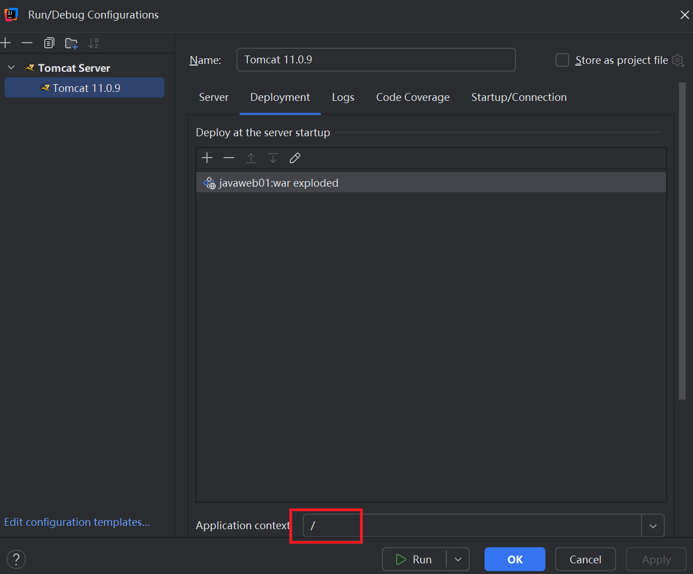

- ## Servlet

  - #### Servlet规范

    > Servlet是Java提供的一门动态Web资源开发技术，是JavaEE的规范之一。其实就是一个接口，每一个实现了Servlet接口的Java类，都有资格去处理HTTP请求了。Servlet规范是Web服务器和JavaWeb程序之间的桥梁。实现了该规范的Web服务器和按照该规范开发的Web程序可以做到解耦合，这样写的代码换到其他Web服务器（实现了Servlet规范的）上也可以部署和运行。

    > ##### 关于JavaEE规范（了解）：
    >
    > - JavaEE规范包括（不完全）：JDBC和数据源、JSP、Servlet、JNDI、XML、JMS、JTA、JPA、JTS、RMI、IDL、JavaMail、EJB、JAF..等等。
    >
    > - JavaEE目前的最高版本是JavaEE11，JavaEE被Oracle捐给了Apache了，Apache把JavaEE改名了，叫做JakartaEE。以后就没有JavaEE了，以后都叫做JakartaEE。所以JavaEE8之后的版本“JavaEE11”不再是javaEE11了，叫做JakartaEE11。JavaEE8之前对应的包名是`javax.*`，现在最新规范的包都是`jakarta.*`
    > - Tomcat11用的是JakartaEE11规范，如果你的项目包用的javax的包，那么就无法部署在Tomcat10+版本上了，只能部署在9及以下的版本上，或者将源代码所有包重新导包。
    > - 21版本之前的IDEA会识别不了Tomcat10，因为目录结构变了，因此tomcat10必须使用高版本的IDEA
    > - Tomcat通常会跟随Java EE规范的更新而更新，以支持最新的Servlet和JSP规范。因此Tomcat的每个版本通常都与JavaEE的某个版本相关联，但并不是一一对应。

    - ##### Servlet规范中规定了：

      > 1. 一个合格的webapp应该是一个怎样的目录结构。类文件（class文件）、资源文件（img、html等资源）、配置文件应该以什么样的目录结构进行存放。
      > 2. 规范了一些Java的接口和类，程序员需要面向这个接口编程，以此为基础来处理用户的请求。
      > 3. 请求路径和Java程序之间的对应关系应该怎么做。
      >
      > Tomcat服务器要遵循Servlet规范。程序员编写的JavaWeb程序也要遵循这个Servlet规范。这样Tomcat服务器和webapp才能解耦合。

    - ##### JavaWeb程序的目录：（运行程序的目录结构）

      > firstapp
      >
      > ​     |------WEB-INF
      >
      > ​     		  |------classes(存放字节码)
      >
      > ​     		  |------lib(第三方jar包)
      >
      > ​     		  |------web.xml(注册Servlet)
      >
      > ​     |------其他的静态资源
      >
      > ###### 详解：
      >
      > - 该xx项目目录的结构如上，该目录要放在`webapps`目录下。
      > - 其中动态资源（Servlet类）需要放在`WEB-INF`目录中，该目录是受到保护的，只能通过编写的程序来跳转，直接发送请求是访问不到的。
      > - 静态资源放在外面任意其他目录中。
      > - `classes`目录中的是Java字节码文件，以及程序运行所需要的配置文件。
      > - `lib`目录是项目运行所依赖的第三方程序jar包。
      > - `web.xml`是JavaWeb项目的核心配置文件，用于对项目进行配置。

    - ##### 关于后端的URL：

      > 网络路径URL也分为绝对路径和相对路径：（和本地路径一样，`./`表示当前路径，`../`表示当前资源的上一层）
      >
      > - **相对路径**：不以协议开头的都是相对路径。它默认以当前地址栏上的url的同级目录为基路径，拼接该相对路径后形成绝对路径去寻找目标资源。以`/`开头的也是相对路径，不过它相对的是当前网页的协议、IP、端口。相对路径的优点是灵活，缺点是不稳定，容易受到浏览器当前地址栏的url的影响。
      > - **绝对路径**：以协议开头的是绝对路径。绝对路径通过固定的URL去找目标资源，因此非常稳定。但缺点是不灵活，尤其是项目上下文（项目名）变化之后，可能会导致项目中使用绝对路径的地方都会受到影响，导致资源找不到。（因为绝对路径要在URI中加上项目名）
      >
      > 那我们开发中，资源的路径写相对还是绝对呢？如果是绝对。那么项目名变了不就出问题了吗，这样做：
      >
      > - 在HTML中通过`<base>`标签的`href`属性来设置相对路径的基路径，如：`/项目名/`，不让其以当前地址栏的url为基路径了。这样页面中所有的资源的相对路径，都会拼接上这个基路径，把相对路径变成一个绝对路径，项目名变的话，每个页面中只需要改href属性的值就行了。
      >
      > - 但这还不够完美，如果HTML很多，也很麻烦。通常我们开发中会这样做（项目上线才换成上面的方式）：由于我们一个服务器中通常只跑一个项目，所以项目名直接不给了，IDEA中热部署时项目名设置为`/`，此时项目中的路径统一采用绝对路径的写法：
      >
      >   

  - #### Servlet的生命周期

    - 当浏览器发送来“请求报文”时（其中包含请求行、头、体等信息），tomcat将报文信息封装成一个`HttpServletRequest`对象，该对象承载了HTTP请求报文；通过该对象可以处理用户的请求，最终我们返回给一个HTTP响应报文即可。

    - 通常我们只需要指定响应的内容即可，tomcat会自动将我们指定的内容封装成一个`HttpServletResponse`对象。最终tomcat会将该对象转换成“HTTP响应报文”发送给浏览器；我们不需要去拼接很复杂的请求报文和响应报文，而是直接用`HttpServletRequest`和`HttpServletResponsehttp`类提供的API即可。

    - 用户请求的某个动态资源，会有某个对应的Java对象去处理。这个特殊的Java对象要想完成动态资源的接收、跳转、转发等操作，就需要实现Servlet接口。实现了Servlet接口的类，相当于具备了处理用户请求的功能，这样服务器才能放心的将资源转发调度的工作交给该类对应的实例。

    - 这个用于处理用户请求的、实现了Servlet接口的实例，必须由Tomcat服务器来统一管理，统一为它们分配任务。当服务器启动完成，可以接收请求了，此时该对象就必须得准备好了，已经存在了并可以干活了（处理请求）；服务器关闭时，该对象就得下班了，不能还有没处理完的工作。因此，所有这些实现了Servlet规范，即Servlet类，它们对应的对象的创建和销毁，都要交给Tomcat，程序员不能干预。所以不要在代码里出现：我们自己new了一个Servlet对象，这是非法的。

    - 即：网站中所有的Servlet接口实现类的实例对象，只能由WEB容器（Tomcat服务器）来创建。**开发人员不能手动创建Servlet接口实现类的实例对象**。

      > **我们自己创建的Servlet对象受WEB容器的管理吗？**
      >
      > 我们自己new的Servlet对象是不会受到WEB容器的管理的。Tomcat创建的Servlet对象，这些Servlet对象都会被放到一个HashMap中（集合的key是servletName），只有放到这个集合中的Servlet对象才会被WEB容器所管理，自己new的Servlet对象不会被WEB容器管理的。
      >
      > 而不被WEB容器所管理的Servlet类（即未注册的Servlet），服务器在分配HTTP请求时，压根就不会分配到它的头上，它也无法处理用户发送的请求。所以在Servlet开发中我们程序员不被允许自己new一个Servlet对象，因为这个Servlet对象是没用的，不能处理请求。

    - 而Tomcat创建和销毁一个Servlet实例的过程，就是Servlet的生命周期。即Servlet对象什么时候被服务器创建？Servlet对象什么时候被服务器销毁？一个Servlet对象从出生到最后的死亡，整个过程是怎样的？

    - 默认当用户第一次请求某个Servlet对应的URL的时候，该Servlet实例才会被Tomcat实例化出来，调用无参构造器。

    - 默认情况下，服务器启动时并不会实例化Servlet对象。那么它启动时做了什么呢？
  
      > 服务器启动后会去解析web.xml文件，找到对应的`url-pattern`和`servlet-class`，然后将这个信息保存在Map中。
      > 这个设计是合理的。用户没有发送请求之前，提前在JVM中创建了大量的Servlet对象，必然是耗费内存的。因为创建出来的某个Servlet如果一直没有用户访问，显然这个Servlet对象此时压根没用，没有必要启动就创建。

    - 在手动配置情况下，要求服务器在启动时自动创建某个Servlet实例：

      ```xml
      <servlet>
      	<servlet-name>hello</servlet-name>
      	<servlet-class>com.bjpowernode.controller.OneServlet</servlet-class>
      	<!-- 填写一个大于0的整数即可 -->
      	<load-on-startup>30<load-on-startup>
      </servlet>
      
      <servlet-mapping>
      	<servlet-name>hello</servlet-name>
      	<url-pattern>/newhello</url-pattern> <!-- urlPattern必须以"/"为开头 -->
      </servlet-mapping>
      ```

      > `load-on-startup`的值是一个非负整数，整数越小创建的优先级越高。创建Servlet的顺序是按照这个优先级来的，默认-1不创建。（优先级一样的话按照在web.xml文件中注册的顺序）

    - 关于Servlet类中方法的调用次数？

      - 构造方法只执行一次。
      - init方法只执行一次。
      - service方法：用户发送一次请求则执行一次，发送N次请求则执行N次。
      - destroy方法只执行一次。

      > 说明：
      >
      > - 默认用户在发送第一次请求的时候Servlet对象被实例化，并且执行的是无参数构造器。
      > - Servlet对象被创建出来之后，Tomcat服务器马上调用它的init方法。然后才是service方法。
      > - 此后用户每发送一次请求，Servlet对象的service方法就会执行一次。
      > - 当服务器被正常关闭时，Tomcat 会依次销毁所有 **已初始化** 的 Servlet 实例，在销毁前触发它们的 `destroy()` 方法，做销毁前的一些工作，比如关闭out输出流等。该方法执行结束后，堆中的Servlet对象就不存在了。

    - Servlet对象是单例的（假单例，真单例构造方法也是私有的）。用户无论发送了几个请求，处理该请求的都是这一个Servlet对象。

    - **思考**：`init()`和无参构造都是在Servlet第一次创建时执行，并且都是只执行一次。那么无参构造可以替代init吗？

      > 不能。
      >
      > Servlet规范中由要求，作为javaweb程序员，编写Servlet类的时候，不建议自己手动编写构造器，因为这样很容易忘记写无参构造导致Servlet对象无法实例化。因此init方法的存在是很有必要的，我们希望在构造器中做的事情都可以放在init方法中。
      >
      > 通常我们在init方法中执行初始化操作，并且这个初始化操作只需要执行一次。例如：初始化线程池、数据库链接池...
      >
      > 什么时候用destroy方法呢？通常我们在destroy方法中对资源进行关闭、信息的保存等等。

  - #### 关于`DefaultServlet`

    > - 其实Tomcat服务器启动时会默认创建一个`DefaultServlet`实例，它的`url-pattern`是`/`，可以帮忙处理所有的静态资源（除了jsp），被称为默认的Servlet，通常用于兜底。因此一般静态资源我们都不会在url-pattern中进行配置，
    > - 当用户发起一个请求后，Tomcat会拿着URL前去一一匹配，当配置的所有url-pattern都匹配不上时，此时就会匹配上`DefaultServlet`配置的`/`，最后转给 `DefaultServlet` 默认的Servlet去处理该url请求的资源。
    > - 并且由于Tomcat全局配置文件中，默认配置了一个专门处理JSP的Servlet（JspServlet），它的url-pattern是`*.jsp`和`*.jspx`。并且 Servlet 的 URL Pattern 匹配优先级规则遵循**精确路径匹配**、**最长路径前缀匹配**。因此有处理JSP资源的Servlet，所以JSP不会交给`DefaultServlet`去处理。（在全局配置`web.xml`中查看）
    >
    > **注意**：关于`url-pattern`的设置。
    >
    > 1. 当设置为`/*`时：可以处理所有的请求。
    > 2. 当设置为`/`时：可以处理所有的静态资源（除了jsp文件）。
    > 3. 当设置为`*.html`时：可以处理所有的html资源。
    > 4. 当设置为`/a/c/*`时：可以处理所有以`/a/c/`开头的URL（前缀匹配），如：`/a/c/test`、`/a/c/user/list`...
    >
    > 当设置了模糊匹配后，要注意URL Pattern 的匹配优先级。

    > ##### 思考：DefaultServlet做了什么？
    >
    > 1. 它首先会对路径做解析以及合法性检查。
    >
    >    ```java
    >    // 检查请求路径是否合法
    >    String path = getRelativePath(request);
    >    if (path.endsWith("/")) {
    >        // 处理目录请求
    >        serveDirectory(...);
    >    } else {
    >        // 处理文件请求
    >        serveResource(...);
    >    }
    >    ```
    >
    > 2. 然后将 URL 路径转换为服务器文件系统路径，检查该文件是否存在。（不会检查 `WEB-INF` 或 `META-INF` 目录）
    >
    > 3. 若该文件存在，则通过IO流读取该文件放在`HttpServletResponse`上，并为其设置合适的响应头；不存在则返回404。

  - #### GenericServlet

    > 我们编写一个Servlet类直接实现Servlet接口有一个缺点，我们只需要用到service方法，其他方法大部分情况下是不需要实现的，直接实现Servlet接口每次都要重写很多不需要的方法，能不能优化一下？
    >
    > 可以。生活中，手机直接插到220V电源上就报废了，怎么办，用一个充电器问题就解决了。手机充电器就是一个面向于手机的适配器。
    >
    > 关于（Adapter）**适配器设计模式**：
    >
    > 我们编写一个`GenericServlet`抽象类，翻译为“通用的Servlet”。该类实现了Servlet接口，其中只有一个抽象方法`service`，其他所有的方法都做了空的实现（假实现）。这里的`GenericServlet`就是一个适配器，解决了上面的问题，以后编写的所有Servlet类直接继承`GenericServlet`、重写service方法即可，其他的方法用到了再进行覆盖。
    >
    > 好消息：在servlet-api中已经有了GenericServlet。
    >
    > 关于`jakarta.servlet.GenericServlet`：
    >
    > ```java
    > public abstract class GenericServlet implements Servlet, ServletConfig, Serializable {
    > 	//这是唯一标识
    >     private static final long serialVersionUID = 1L;
    > 	//这是servlet对应的配置信息对象，私有的
    >     private transient ServletConfig config;
    > 	//无参构造器一定要有，否则子类的super()就报错了
    >     public GenericServlet() { }
    > 
    > 	//重写了Servlet接口的destory，但里面什么也没，子类用到了再重写
    >     @Override
    >     public void destroy() { }
    > 
    > 	//通过配置信息对象config来获取该servlet对应的初始化参数
    >     @Override
    >     public String getInitParameter(String name) {
    >         return getServletConfig().getInitParameter(name);
    >     }
    >     @Override
    >     public Enumeration<String> getInitParameterNames() {
    >         return getServletConfig().getInitParameterNames();
    >     }
    > 
    > 	//获取config对象的方法
    >     @Override
    >     public ServletConfig getServletConfig() {
    >         return config;
    >     }
    > 	//通过config来获取application应用上下文对象
    >     @Override
    >     public ServletContext getServletContext() {
    >         return getServletConfig().getServletContext();
    >     }
    > 	//获取程序员自定义的，关于这个servlet的信息
    >     @Override
    >     public String getServletInfo() {
    >         return "";
    >     }
    > 	//这个方法用于给config对象初始化，不能动
    >     @Override
    >     public void init(ServletConfig config) throws ServletException {
    >         this.config = config;
    >         this.init();
    >     }
    > 	//用下面这个init方法
    >     public void init() throws ServletException { }
    > 	//记录日志方法，日志信息在tomcat中log目录下
    >     public void log(String message) {
    >         getServletContext().log(getServletName() + ": " + message);
    >     }
    >     public void log(String message, Throwable t) {
    >         getServletContext().log(getServletName() + ": " + message, t);
    >     }
    > 	//核心业务方法
    >     @Override
    >     public abstract void service(ServletRequest req, ServletResponse res)
    >             throws ServletException, IOException;
    >     @Override
    > 	//获取servlet别名
    >     public String getServletName() {
    >         return config.getServletName();
    >     }
    > }
    > ```

    - ##### `GenericServlet`抽象类中的`init()`方法：

      > 当Tomcat实例化Servlet对象后会立即调用该方法。Tomcat会首先创建每个Servlet对应的`ServletConfig`对象，在调用init方法时将`ServletConfig`对象作为参数传进去。也就是说，继承了GenericServlet的Servlet类，会存在一个ServletConfig属性，该属性对应的是`web.xml`中，程序员为每个Servlet添加的配置信息。

      ```java
      //这是servlet对应的配置信息对象，私有的
      private transient ServletConfig config;
      
      //这个方法用于给config对象初始化，不能动
      @Override
      public void init(ServletConfig config) throws ServletException {
          this.config = config;
          this.init();
      }
      //用下面这个init方法
      public void init() throws ServletException { }
      ```

      > 我们看到这个有参数的init方法就是为了给ServletConfig赋值，并且赋值后调用了无参数的init方法。因此我们重新`GenericServlet`抽象类中的init方法时，不要重写有参数的init，而要重写无参数的init。这样才能在Servlet中获取到我们为Servlet添加的配置信息。
      >
      > 在`web.xml`中为Servlet添加初始化参数：
      >
      > ```xml
      > <?xml version="1.0" encoding="UTF-8"?>
      > <web-app xmlns="https://jakarta.ee/xml/ns/jakartaee"
      >          xmlns:xsi="http://www.w3.org/2001/XMLSchema-instance"
      >          xsi:schemaLocation="https://jakarta.ee/xml/ns/jakartaee
      >                         https://jakarta.ee/xml/ns/jakartaee/web-app_5_0.xsd"
      >          version="5.0"
      >          metadata-complete="true">
      > 
      >     <!--servlet描述信息-->
      >     <servlet>
      >         <servlet-name>HelloServlet</servlet-name>
      >         <!--这个位置必须是带有包名的全限定类名-->
      >         <servlet-class>com.bjpowernode.servlet.HelloServlet</servlet-class>
      > 
      >         <load-on-startup>1</load-on-startup>
      >         <init-param>
      >             <init-name>key1</init-name>
      >             <init-value>value1</init-value>
      >         </init-param>
      >         <init-param>
      >             <init-name>key2</init-name>
      >             <init-value>value2</init-value>
      >         </init-param>
      >     </servlet>
      > 
      >     <!--servlet映射信息-->
      >     <servlet-mapping>
      >         <servlet-name>HelloServlet</servlet-name>
      >         <url-pattern>/HelloServlet.index</url-pattern><!-- 可以有多个url-pattern标签 -->
      >     </servlet-mapping>
      > 
      > </web-app>
      > ```

      > **总结**：
      >
      > - GenericServlet就是一个Servlet的包装。Servlet只是一个接口，里面啥也没有；而GenericServlet可以给你获取到该Servlet的配置信息，因此更通用。
      > - 我们编写Servlet类的时候，实际上是不会去直接继承GenericServlet类的，因为我们是B/S结构的系统，这种系统是基于HTTP超文本传输协议的。在Servlet规范当中，提供了一个类叫做`jakarta.servlet.http.HttpServlet`，它是`GenericServlet`的子类，是专门为HTTP协议准备的一个Servlet类。我们编写的Servlet类要继承HttpServlet。HttpServlet是为HTTP协议专门准备的，使用HttpServlet处理HTTP协议更便捷。它们之间的继承关系是：
      >
      >   - jakarta.servlet.Servlet（接口）【爷爷】
      >   - jakarta.servlet.GenericServlet implements Servlet（抽象类）【儿子】
      >   - jakarta.servlet.http.HttpServlet extends GenericServlet（抽象类）【孙子】

    - ##### `ServletConfig`接口中的方法：

      - `String getServletName()`：获取servletName。
      - `Enumeration<String> getInitParameterNames()`：获取所有的初始化参数信息的key，返回一个迭代器。
      - `String getInitParameter(String name)`：根据初始化参数信息的key来获取value。
      - `ServletContext getServletContext()`：获取ServletContext即Servlet上下文。（后面再说）

      ###### 注意：在`GenericServlet`抽象类中有4个同名方法，其实调用的也是上面4个方法。（为了方便）

    - ##### `Servlet`接口中的`getServletInfo`：

      > 该方法返回一个字符串，用于描述该Servlet类的作用的。具体的实现取决于程序员，非必须。通常这个字符串会包括Servlet的版本、功能、以及其他有用的信息。例如：“版本1.0，用于处理HTTP GET请求”。

    - ##### `ServletContext`（应用域）：

      > - `ServletContext`是一个接口，是Servlet规范中的一员，翻译为Servlet上下文。该对象在Tomcat服务器启动的时创建，在服务器关闭的时销毁。
      > - ServletContext对象就是Servlet的环境对象，上下文对象，它是一个容器（application应用域）。对于一个WEB应用来说，ServletContext对象只有一个，也可以理解为它就是对应的web.xml文件。放在ServletContext当中的数据，所有的Servlet对象都可以共用。
      > - 注意：它不是容器级别的，容器是Tomcat，它里面有很多的webapp，每一个都有自己的上下文（web.xml）。
      
      ###### ServletContext接口中的方法：
      
      - `public String getInitParameter(String name)`：通过初始化参数的name获取value。
      
      - `public Enumeration<String> getInitParameterNames()`：获取所有的初始化参数的name。
      
        ```xml
        <!--以上两个方法是ServletContext对象的方法，这个方法获取的是什么信息？是以下的配置信息-->
        <web-app ...>
        	...
            <context-param>
                <param-name>pageSize</param-name>
                <param-value>10</param-value>
            </context-param>
            <context-param>
                <param-name>startIndex</param-name>
                <param-value>0</param-value>
            </context-param>
        	...
        </web-app>
        <!--注意：以上的配置信息属于应用级的配置信息，一般一个项目中共享的配置信息会放到以上的标签当中。-->
        <!--如果你的配置信息只是想给某一个servlet作为参考，那么你配置到servlet标签当中即可，使用ServletConfig对象来获取。-->
        ```
      
      - （非常重要）`public String getContextPath()`：获取应用的根路径（项目上下文，即项目名）。因为在java源码中有一些地方可能会需要应用的根路径，这个方法可以动态获取应用的根路径（`/firstapp`）。记住：不要将应用的根路径写死，因为你永远都不知道这个应用在最终部署的时候，是一个什么名字。
      
      - `public String getRealPath(String path)`：获取某个文件在操作系统中的绝对路径。
      
      - `public void log(String message)`、`public void log(String message, Throwable t)`：通过ServletContext对象也是可以记录日志的。这些日志信息记录到`CATALINA_HOME/logs/localhost.2021-11-05.log`文件中了，这些日志每次重新启动也不会清空重置。并且该方法记录的时候也可以传进去一个异常对象，异常并没有发生只是记录一下。
      
        > Tomcat服务器的logs目录下都有哪些日志文件？
        >
        > - catalina.2021-11-05.log：服务器端的java程序运行的控制台信息。即tomcat控制台信息。
        > - localhost.2021-11-05.log：ServletContext对象的log方法记录的日志信息存储到这个文件中。
        > - localhost_access_log.2021-11-05.txt：访问web服务器的日志信息。用户每次请求Web服务器都会自动记录下访问日志。
      
      - `public void setAttribute(String key, Object value)`：向ServletContext应用域中存数据。
      
      - `public Object getAttribute(String key)`：从ServletContext应用域中取数据。
      
      - `public void removeAttribute(String key)`：从ServletContext应用域中删数据。
      
        > ServletContext对象还有另一个名字：应用域（后面还有其他域，例如：请求域、会话域）。如果所有的用户共享一份数据，并且这个数据很少的被修改，并且这个数据量很少，可以考虑将这些数据放到应用域中。
        >
        > 1. 为什么数据要很少被修改？因为数据涉及到共享，会有线程安全问题。所以放在ServletContext中的对象一般都是只读的。
        > 2. 为什么数据量要小？因为它会跟随着Tomcat的启动一块被创建出来，很占用服务器的运行内存。
        > 3. 放在应用域中的数据相当于放在了缓存中，不需要每次从数据库中取，大大提升效率。
      
        ###### 关于线程池：
      
        > Tomcat服务器本身就支持多线程。那么在用户发送一次请求，Tomcat就新建一个Thread线程对象来并发处理用户的请求吗？
        >
        > 当然不是！实际上是在Tomcat服务器启动的时候，会提前创建好N多个线程Thread对象，然后将线程对象放到集合当中，这个集合被称为：**线程池**。用户发送请求过来之后，需要有一个对应的线程来处理这个请求，这时候就会直接从线程池中取Thread对象，效率比较高。
        >
        > 所有的WEB服务器或应用服务器，都是支持多线程的，都有线程池机制。

  - #### HttpServlet

    > - `jakarta.servlet.http.HttpServlet`类是专门为HTTP协议准备的。比GenericServlet更加适合HTTP协议下的开发。
    >
    > - http包下都有哪些类和接口呢？（`jakarta.servlet.http.*`）
    >
    >   - jakarta.servlet.http.HttpServlet （HTTP协议专用的Servlet类，抽象类）
    >
    >   - jakarta.servlet.http.HttpServletRequest （HTTP协议专用的请求对象）
    >
    >   - jakarta.servlet.http.HttpServletResponse （HTTP协议专用的响应对象）
    >
    > - HttpServletRequest对象（简称request对象）中封装了什么信息？ 
    >
    >   - HttpServletRequest中封装了HTTP请求的全部内容。
    >
    >   - Tomcat服务器（WEB服务器）将“请求协议”中的数据全部解析出来，然后将这些数据全部封装到request对象当中了。也就是说，我们只要拿到HttpServletRequest，就可以获取请求协议中的数据。
    >
    > - HttpServletResponse对象是专门用来封装HTTP响应协议的。Tomcat最终会将我们返回的HttpServletResponse对象中的内容转换成HTTP响应报文然后返回给客户端。

    - ##### HttpServlet源码分析：

      ```java
      public class HelloServlet extends HttpServlet {
      	// 用户第一次请求，创建HelloServlet对象的时候，会执行这个无参数构造方法。
      	public HelloServlet() {
          }
          
      }
      
      public abstract class GenericServlet implements Servlet, ServletConfig,
              java.io.Serializable {
                 
      	/* 用户第一次请求的时候，HelloServlet对象第一次被创建之后，因为HelloServlet
             没有init方法，HttpServlet也没有，所以执行GenericServlet的init有参构造.。  */
          public void init(ServletConfig config) throws ServletException {
              this.config = config;
              this.init();
          }
      	// 用户第一次请求的时候，带有参数的init(ServletConfig config)执行之后，会执行这个没有参数的init()
      	public void init() throws ServletException {
              // NOOP by default
          }
      }
      
      // HttpServlet模板类。
      public abstract class HttpServlet extends GenericServlet {
          // 用户发送第一次请求的时候这个service会执行(HelloServlet没有service,执行Httpservlet的)
          // 用户发送第N次请求的时候，这个service方法还是会执行。
          // 用户只要发送一次请求，这个service方法就会执行一次。
          @Override
          public void service(ServletRequest req, ServletResponse res) throws ServletException, IOException {
              HttpServletRequest request;
              HttpServletResponse response;
              try {
                  request = (HttpServletRequest) req;
                  response = (HttpServletResponse) res;
              } catch (ClassCastException e) {
                  throw new ServletException(lStrings.getString("http.non_http"));
              }
              service(request, response);
          }
      
          // 这个service方法的两个参数都是带有Http的。
          // 这个service是一个模板方法。
          // 在该方法中定义核心算法骨架，具体的实现步骤延迟到子类中去完成。
      
      	protected void service(HttpServletRequest req, HttpServletResponse resp) throws ServletException, IOException {
      		// 获取请求方式
              	// 这个请求方式最终可能是：""
              	// 注意：request.getMethod()方法获取的是请求方式，可能是八种之一：
              	// GET POST PUT DELETE HEAD OPTIONS TRACE PATCH
              String method = req.getMethod();
              switch (method) {
      			// 如果请求方式是GET请求，则执行doGet方法。
                  case METHOD_GET -> {
                      long lastModified = getLastModified(req);
                      if (lastModified == -1) {
                          // servlet doesn't support if-modified-since, no reason
                          // to go through further expensive logic
                          doGet(req, resp);
                      } else {
                          long ifModifiedSince;
                          try {
                              ifModifiedSince = req.getDateHeader(HEADER_IFMODSINCE);
                          } catch (IllegalArgumentException iae) {
                              // Invalid date header - proceed as if none was set
                              ifModifiedSince = -1;
                          }
                          if (ifModifiedSince < (lastModified / 1000 * 1000)) {
                              // If the servlet mod time is later, call doGet()
                              // Round down to the nearest second for a proper compare
                              // A ifModifiedSince of -1 will always be less
                              maybeSetLastModified(resp, lastModified);
                              doGet(req, resp);
                          } else {
                              resp.setStatus(HttpServletResponse.SC_NOT_MODIFIED);
                          }
                      }
      
                  }
                  case METHOD_HEAD -> {
                      long lastModified = getLastModified(req);
                      maybeSetLastModified(resp, lastModified);
                      doHead(req, resp);
      
                  }
      			// 如果请求方式是POST请求，则执行doPost方法。
                  case METHOD_POST -> doPost(req, resp);
                  case METHOD_PUT -> doPut(req, resp);
                  case METHOD_DELETE -> doDelete(req, resp);
                  case METHOD_OPTIONS -> doOptions(req, resp);
                  case METHOD_TRACE -> doTrace(req, resp);
                  case METHOD_PATCH -> doPatch(req, resp);
                  default -> {
                      //
                      // Note that this means NO servlet supports whatever
                      // method was requested, anywhere on this server.
                      //
      
                      String errMsg = lStrings.getString("http.method_not_implemented");
                      Object[] errArgs = new Object[1];
                      errArgs[0] = method;
                      errMsg = MessageFormat.format(errMsg, errArgs);
      
                      resp.sendError(HttpServletResponse.SC_NOT_IMPLEMENTED, errMsg);
                  }
              }
          }
          
          /*子类没有重写doGet就会走父类的，报405错误*/
          protected void doGet(HttpServletRequest req, HttpServletResponse resp)
              throws ServletException, IOException{
              // 报405错误
              String msg = lStrings.getString("http.method_get_not_supported");
              sendMethodNotAllowed(req, resp, msg);
          }
              /*子类没有重写doPost就会走父类的，报405错误*/
          protected void doPost(HttpServletRequest req, HttpServletResponse resp)
              throws ServletException, IOException {
              // 报405错误
              String msg = lStrings.getString("http.method_post_not_supported");
              sendMethodNotAllowed(req, resp, msg);
          }
          
      }
      /*
      通过以上源代码分析：
      	假设前端发送的请求是get请求，后端程序员重写的方法是doPost
      	假设前端发送的请求是post请求，后端程序员重写的方法是doGet
      	会发生什么呢？
      		发生405这样的一个错误。
      		405表示前端的错误，发送的请求方式不对。和服务器不一致。不是服务器需要的请求方式。
      	
      	通过以上源代码可以知道：只要HttpServlet类中的doGet方法或doPost方法执行了，必然405.
      
      怎么避免405的错误呢？
      	后端重写了doGet方法，前端一定要发get请求。
      	后端重写了doPost方法，前端一定要发post请求。
      	这样可以避免405错误。
      	
      	这种前端到底需要发什么样的请求，其实应该后端说了算。后端让发什么方式，前端就得发什么方式。
      */
      ```

      > - 我们编写的HelloServlet直接继承HttpServlet，直接重写HttpServlet类中的service()方法行吗？
      >
      > - 可以，只不过你享受不到405错误。享受不到HTTP协议专属的东西。
      >
      > 到今天我们终于得到了最终的一个Servlet类的开发步骤：
      >
      > 1. 编写一个Servlet类，直接继承HttpServlet。
      > 2. 重写doGet方法或者重写doPost方法，到底重写谁，javaweb程序员说了算。
      > 3. 将Servlet类配置到web.xml文件当中。
      > 4. 准备前端的页面（form表单），form表单中指定请求路径即可。

      > **思考**：
      >
      > 你有没有发现：HttpServlet抽象类中没有抽象方法，那么HttpServlet为什么要设置成抽象类呢？
      >
      > 因为HttpServlet生来就是要被继承的。如果HttpServlet不设置为抽象类，那么就可以new出其实例，但这个实例内部的方法（如doGet()、doPost()）并没有任何实现（具体的业务逻辑代码只有开发者知道怎么写），所以new出来的这个实例是没有意义的。
      >
      > 如果有这样的一个实例，它不能做任何事情，那么将其设置为抽象类是优雅的做法。

    - ##### 欢迎资源文件：

      > 什么是一个web站点的欢迎界面？
      >
      > 对于一个webapp来说，我们是可以设置它的欢迎页面的，设置了欢迎页面之后，当你访问这个webapp的时候，或者访问这个web站点的时候，没有指定下面的任何“资源路径”，这个时候会默认访问你的欢迎页面。
      >
      > 我们一般的访问方式是：http://localhost:8080/web01/login.html，这种方式就是指定了具体要访问的资源，访问的是web01项目中的login.html。如果我们访问的方式是：http://localhost:8080/web01，只说了要访问你的web01项目，没有指定具体是哪个资源，那么服务器默认会返回给用户哪个资源呢？默认会返回给你网站的首页（欢迎页）。
      >
      > 怎么设置网站的首页（欢迎页）呢？
      >
      > 需要在`web.xml`中进行配置：
      >
      > ```xml
      > <web-app ...>
      >     ...
      >     <welcome-file-list>
      >         <welcome-file>a/b/c/login1.html</welcome-file>
      >         <welcome-file>x/y/z/login2.html</welcome-file>
      >         ...
      >         <!-- 一个webapp是可以设置多个欢迎页面的，越靠上优先级越高，找不到就向下找 -->
      >     </welcome-file-list>
      >     ...
      > </web-app>
      > ```
      >
      > **注意**：资源路径的开头不能带`/`，只能用相对路径，服务器是从项目根目录下开始找该资源的（WEB-INF同级目录）。
      >
      > ###### 欢迎页也可以是一个Servlet的url-pattern。说白了欢迎页就是一个资源的路径，可以是静态资源也可以是动态资源。

      > 你有没有注意到一件事：
      >
      > 如果webapp下有一个`index.html`，那么该文件不需要在web.xml中进行配置就已经是欢迎页了，为什么？
      >
      > 因为Tomcat服务器的全局配置文件中（`CATALINA_HOME/conf/web.xml`）已经做了默认配置了：
      >
      > ```xml
      > <welcome-file-list>
      >     <welcome-file>index.html</welcome-file>
      >     <welcome-file>index.htm</welcome-file>
      >     <welcome-file>index.jsp</welcome-file>
      > </welcome-file-list>
      > ```

    - ##### 关于WEB-INF目录：

      > 你有没有发现，如果将一个静态资源`welcome.html`放在了WEB-INF目录中，此时打开浏览器输入：http://localhost:8080/firstapp/WEB-INF/welcome.html，会出现404，找不到这个资源。这是为什么呢？
      >
      > 其实这是因为：**放在WEB-INF目录下的资源是受保护的**。用户不能通过路径直接访问`WEB-INF`目录下的资源。所以像HTML、CSS、JS、image等静态资源一定要放到WEB-INF目录之外。

  - #### HttpServletRequest/HttpServletResponse接口

    > - `jakarta.servlet.http.HttpServletRequest`是一个接口，这个对象中封装了HTTP请求协议。它的父接口是ServletRequest（顶级父接口）。
    > - 当用户发送过来HTTP请求，Tomcat服务器将HTTP请求协议中的信息及数据全部解析出来，然后将其封装到HttpServletRequest对象当中，作为`service()`方法的参数传给了我们javaweb程序员。javaweb程序员面向HttpServletRequest接口编程，调用方法就可以获取到请求的信息了。
    > - 相对应的，`jakarta.servlet.http.HttpServletResponse`接口中封装了HTTP响应协议。
    > - request和response这两个对象只在当前请求中有效。一次请求对应一个request，两次请求则对应两个request....

    - ##### `ServletRequest`接口中的方法：

      > HttpServletRequest接口提供的方法可以让我们获取到HTT请求携带的数据（无论是请求体还是URL中携带的）。
      >
      > 我们先思考：如果是你，前端的form表单提交了数据之后，你准备采用什么样的数据结构去接收这些数据呢？
      >
      > - 前端提交的数据格式：协议ip端口号?username=abc&userpwd=123&aihao=t&aihao=d&aihao=tt
      > - 因此用`Map<String, String>`来存储是再合适不过的了。但这样的话，key重复value会覆盖，如果有3个一样的key，你的value怎么存？这样存：`Map<String, String[]>`。

      - `Map<String,String[]> getParameterMap()`：获取Map
      - `Enumeration<String> getParameterNames()`：这个是获取Map集合中所有的key
      - `String[] getParameterValues(String name)`：这个是通过key获取value数组
      - `String getParameter(String name)`：这个是通过key获取value数组中第一个元素（最常用）

      > 注意：前端表单提交数据的时候，假设提交了120这样的“数字”，其实是以字符串"120"的方式提交的，所以服务器端获取到的一定是一个字符串的"120"，而不是一个数字。（前端永远提交的是字符串，后端获取的也永远是字符串）

      > 如果提交的数据是json字符串或者file文件怎么获取：

      - `BufferedReader getReader()`：获取字符输入流，用于从请求体中读取字符数据。
      - `ServletInputStream getInputStream()`：获取字节输入流，用于从请求体中读取字节数据。

      > 我们知道，ServletContext上下文对象又被称为“应用域application”对象，放在它里面的数据其实就是放在服务器缓存中了，减少了IO流的操作，使用缓存机制是提高执行效率的重要手段，大大提高读取速度。但是要慎用，因为会一直占用JVM的堆内存。
      >
      > 而ServletContext里面有三个操作“应用域”的方法：`getAttriubute()、setAttribute()、removeAttribute()`，我们可以将一些几乎不修改、所有用户共享的、数据量很小的、这部分数据放在应用域里。
      >
      > 与之类似，ServletRequest对象又被称为“请求域”对象。请求域要比应用域范围小很多，生命周期短很多。请求域只在一次请求内有效。
      >
      > ServletRequest请求域对象中也有这三个方法：

      - `Object getAttriubute(String)`：获取请求域中的数据。
      - `void setAttribute(String, Object)`：往请求域中存数据。
      - `void removeAttribute(String)`：从请求域中删数据。

      > ##### 请求域和应用域：
      >
      > ServletContext对象在服务器启动时创建，此时应用域就开启了，直到服务器被关闭，ServletContext对象才被销毁，应用域关闭。而实际开发中，服务器一般是不会关闭的。所以，应用域里面的东西很有可能一直存在，因此要谨慎使用。
      >
      > 一个ServletRequest请求对象对应一个请求域，一次请求结束之后，这个请求对象就被销毁了，对应的请求域也就没了。当用户发送请求的时候，ServletRequest对象创建，请求域开启；当下一条请求发送的时候，ServletRequest对象创建了一个新的，获取的也是新的ServletRequest对象和请求域，旧的对象和域就被销毁了。
      >
      > 相对于应用域，我们应该尽量使用范围更小的请求域，因为请求域占用资源少。

      ###### `ServletRequest`接口中其他的常用方法：

      - `String getRemoteAdder()`：用户浏览器的ip地址
      - `int getRemotePort()`：用户浏览器的端口号
      - `int getLocalPort()`：本地服务器的端口号
      - `int getServerPort()`：用户请求的端口号
      - `String getRemoteHost()`：获取浏览器的主机号，通常这个目前不怎么用了，获取ip用上面那个
      - `String getScheme()`：请求的协议
      - `String getProtocol()`：请求的协议及版本号
      - `String getCharacterEncoding()`：获取请求头的字符集编码参数
      - `int getContentLength()`：获取请求内容长度
      - `String getContentType()`：获取请求体的内容类型（MIME类型）
      - `void setCharacterEncoding(String env)`：设置解析请求体内容，所使用的解码方式

    - ##### `HttpServletRequest`接口中的方法：

      - `String getMethod()`：请求的方式
      - `StringBuffer getRequestURL()`：请求的完整URL
      - `String getRequestURI()`：完整URL去掉了协议ip端口
      - `String getContextPath()`：获取应用的根路径（/项目名）。其实servletContext对象的`getContextPath`方法就是调用的这个方法。
      - `String getServletPath()`：获取请求的urlPattern，不带项目名
      - `String getHeader(String name)`：获取根据key请求头的value
      - `Enumeration<String> getHeaders(String name)`：根据key获取**所有请求头的值**（因为HTTP允许同一个头名称有多个值，如 `Accept`、`Cookie` 等）。
      - `Enumeration<String> getHeaderNames()`：获取所有请求头

    - ##### `ServletResponse`接口中的方法：

      - `ServletOutputStream getOutputStream()`：获取响应对象的二进制输出流
      - `PrintWriter getWriter()`：获取响应对象的字符输出流
      - `void setCharacterEncoding(String charset)`：设置响应的字符集
      - `void setContentLength(int len)`：设置响应内容长度
      - `void setContentType(String type)`：设置响应内容MIME类型

    - ##### `HttpServletResponse`接口中的方法：

      - `void setStatus(int code)`：设置响应状态码
      - `void setHeader(String name, String value)`：设置响应头。通常用来设置Content-Type和Content-Length。由于这两个比较重要，所以单独在ServletResponse类中做成了俩方法。（`addHeader()`和这个差不多，只是不会覆盖已有的响应头）

    - ##### 解决乱码：

      - ###### POST请求乱码：

        > `req.setCharacterEncoding()`可以解决POST请求乱码问题，因为POST请求是在请求体中提交数据的。
        >
        > 在Tomcat9及以前，如果前端POST请求提交的数据是中文，后端获取就会出现乱码（因为Tomcat会用操作系统的默认编码去解码请求体），怎么解决呢？就用这个方法设置正确的解码方式就行了。
        >
        > Tomcat10之后，如果请求未指定 `Content-Type` 头，Tomcat 10 会尝试自动检测编码（倾向于 UTF-8）；如果 `Content-Type` 头包含 `charset`（例如 `application/x-www-form-urlencoded; charset=UTF-8`），Tomcat 会直接使用指定的字符集，无需手动设置。因此Tomcat10之后，POST请求不会出现乱码问题。

      - ###### GET请求乱码：

        > GET请求数据是在请求行上提交的，不是请求体。那么GET请求乱码怎么解决呢？
        >
        > 首先我用GET请求发送了一些中文数据，然后使用Tomcat9发现没有乱码问题，而Tomcat8会乱码。通过查看`CATALINA_HOME/conf/server.xml`文件发现，它们的配置不同：`<Connector URIEncoding="UTF-8" />`。
        >
        > **注意**：从Tomcat8之后，URIEncoding的默认值就是UTF-8，所以GET请求也没有乱码问题。URIEncoding就是设置如何解析浏览器地址栏中URL的字符集的，我们并不严格区分URL和URI。

      - ###### 响应乱码：

        > `response.print()`响应中文字符时也会出现乱码，怎么解决？
        >
        > ```java
        > response.setContentType("text/html;charset=UTF-8");
        > ```
        >
        > 响应前，先用上面代码设置下响应头，给出响应内容采用的字符编码，就可以了。
        >
        > **注意**：不推荐用`response.setCharacterEncoding()`设置我们响应内容采用的字符集，因为如果前端换环境了，还是会乱码。正确的方式就是通过`Content-Type`响应体告诉浏览器，响应内容的字符集是什么就行了。
        >
        > **建议**：响应时，先显式的通过`response.setCharacterEncoding()`设置自己响应内容所采用的编码方式，然后再`setContentType`告诉用户浏览器内容所采用的编码方式是什么。

    - ##### 请求转发

      > 当用户发送HTTP请求了某个资源，此时会有对应的Servlet去处理该资源。如果这个Servlet处理不了用户的请求（超出了自己的能力范围），能不能将这个请求转发给其他的Servlet去处理呢？当然可以！这就是请求转发。
      >
      > 请求转发是由Tomcat服务器内部来控制的。A Servlet将HTTP请求转发给B Servlet，这个转发动作是Tomcat服务器内部完成的。
      >
      > 转发的下一个资源必须是一个Servlet吗？不一定，只要是Tomcat服务器当中的合法资源，都是可以转发的。例如：html....
      >
      > （注意：转发的时候，路径的写法要注意，转发的路径以`/`开始，不加项目名）

      - 使用`Dispatcher`完成请求转发（转发器/调度器）：

        1. 通过`ServletRequest`对象获取请求转发器对象：`RequestDispatcher dispatcher = servletRequest.getRequestDispatcher("/b");`

           > 注意：
           >
           > - 如果参数是相对路径，它会以当前请求的路径进行转发。如果请求的是 http://localhost:8080/oa/servlet1 ，则`servletRequest.getRequestDispatcher("./b")`转发后路径为：http://localhost:8080/oa/b
           > - 如果参数是以`/`开头的绝对路径，那么路径可以只给“url-pattern”，不用加项目名。

        2. 调用转发器的forward方法完成转发：`dispatcher.forward(request, response);`

           > 注意：转发还是一次HTTP请求，它会将当前的request和response对象传递给下一个Servlet。这样就可以做到两个Servlet对象共享同一个请求域中的数据。

      - ###### 转发的刷新问题：

        > 当用户发送POST请求，服务器接收数据并返回结果页，此时用户浏览器上的URL还是旧的地址。因此如果用户点击刷新重新发起POST请求，就又重新提交了一次数据。如果服务器没有进行限制，那么数据库中就存在了2条一样的记录。

    - ##### 重定向

      > 重定向是，浏览器发送HTTP请求，服务器收到后响应给浏览器一个特殊的HTTP响应报文（通常状态码是301或302，并且响应头带有Location标识新的请求URL，响应体为空），来通知浏览器重新发起新的请求。

      ```java
      httpServletResponse.sendRedirect("请求地址")
      ```

      > 注意：
      >
      > - 和getRequestDispatcher方法不同，sendRedirect是`HttpServletResponse`接口中的方法。这是因为只有HTTP协议中才有重定向。
      > - 重定向的资源地址既可以是当前服务器中的资源地址，也可以是其他网站的资源文件地址。
      > - 重定向的URL地址需要加上项目根路径，因为浏览器重新发起新的请求是需要带项目名的。

    - ##### 转发和重定向的区别

      > - 重定向解决方案中，通过地址栏通知浏览器发起下一次请求，因此通过重定向解决方案调用的资源文件接收的请求方式一定是GET。而转发可以是任意方式。
      > - 重定向一共要发送两次请求（至少），但是只有第一次请求是用户手动发送，后续请求都是浏览器自动发送的。而转发只发了一次请求。
      > - 转发浏览器地址栏上的URL不会变，重定向URL会变。
      
      ###### 转发和重定向如何选择：
      
      > 如果在上一个Servlet当中向request域当中绑定了数据，希望从下一个Servlet当中把request域里面的数据取出来，则要使用转发。剩下所有的跳转均使用重定向。（重定向使用较多）

  - #### 注解式开发（Servlet3.0 规范）

    > Servlet3.0 后JavaWeb应用支持纯注解式开发。也就是说，原先配置到web.xml文件中的内容，现在全部都可以通过注解来配置，连web.xml文件也可以不要了。

    ###### 注意：在`web.xml`文件中，`<web-app>`标签的`version`属性标识了编译时Servlet规范的版本。运行时使用的Servlet规范版本是依赖的Tomcat服务器中servlet-api.jar的版本。

    - ##### `web.xml`文件的替换：

      > Servlet3.0规范中新加了一个`ServletContainerInitializer`（Servlet容器初始化器）接口，当Tomcat服务器启动的时候，会自动在该项目的源码中找 `ServletContainerInitializer`接口的实现类，找到后实例化对象，并后调用它的`onStartup()`方法来完成Servlet容器（上下文）的初始化，创建所有的Servlet实例。
      >
      > 编写WebInitializer类实现`ServletContainerInitializer`接口重写`onStartup()`方法：
      >
      > ```java
      > public class WebInitializer implements WebApplicationInitializer {
      >     @Override
      >     public void onStartup(ServletContext servletContext) {
      >         // 创建 Spring 应用程序上下文
      >         AnnotationConfigWebApplicationContext springContext = new AnnotationConfigWebApplicationContext();
      >         springContext.register(SpringConfig.class);
      > 
      >         // 配置 Spring MVC 的中央调度器 DispatcherServlet
      >         AnnotationConfigWebApplicationContext mvcContext = new AnnotationConfigWebApplicationContext();
      >         //让SpringMVC容器拿到ServletContext对象
      >         mvcContext.setServletContext(servletContext);
      >         mvcContext.register(MvcConfig.class);
      >         ServletRegistration.Dynamic servlet = servletContext.addServlet("dispatcherServlet", new DispatcherServlet(mvcContext));
      >         servlet.setLoadOnStartup(1);
      >         servlet.addMapping("/");
      > 
      >         // 配置字符编码过滤器
      >         FilterRegistration.Dynamic filter = servletContext.addFilter("characterEncodingFilter", CharacterEncodingFilter.class);
      >         filter.setInitParameter("encoding", "UTF-8");
      >         filter.setInitParameter("forceRequestEncoding", "true");
      >         filter.setInitParameter("forceResponseEncoding", "true");
      >         filter.addMappingForUrlPatterns(null, true, "/*");
      >     }
      > }
      > ```

      > 注意：在高版本的web.xml配置文件中，web-app标签的metadate-coplete属性如果设置为false，表示支持注解和web.xml配置文件两种方式联合使用。

    - ##### 关于注解`jakarta.servlet.annotation.WebServlet`注解：

      ```java
      @WebServlet("/newhello")
      public class HelloServlet implements Servlet {}
      ```

      > `@WebServlet`注解只能在Servlet类上使用，该注解中有以下属性：
      >
      > - name属性：用来指定Servlet的名字。等同于：`<servlet-name>`
      > - urlPatterns/value属性：用来指定Servlet的映射路径。可以指定多个字符串。等同于：`<url-pattern>`
      > - loadOnStartUp属性：用来指定在服务器启动阶段是否加载该Servlet。等同于：`<load-on-startup>`
      > - initParams属性：用来给Servlet配置参数的。等同于：`<init-param>`。属性值`@WebInitParam`是一个注解数组，该数组的类型是注解`@WebInitParam`，它里面有两个属性name和value，都是String类型。
      >

------

