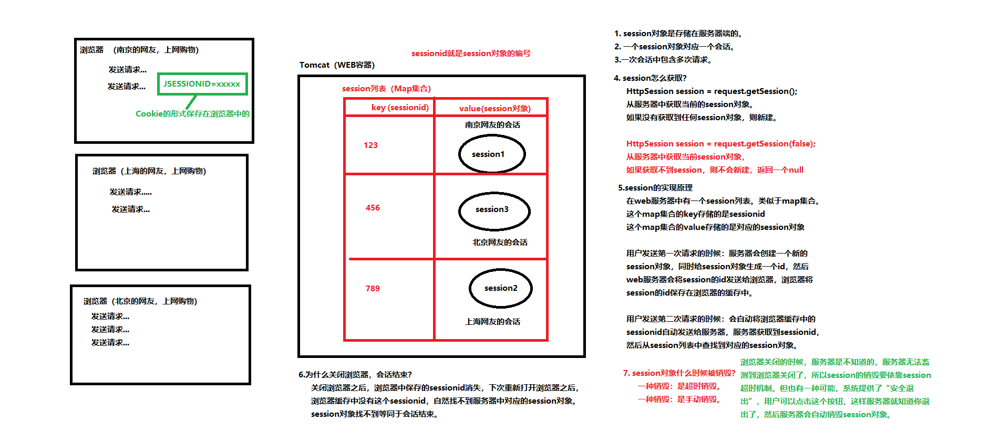

- ## session和cookie

  - #### session
  
    > ###### 关于B/S系统的会话机制：
    >
    > 什么是会话（Session）？
    >
    > - 用户打开浏览器，进行一系列操作，然后到最终浏览器关闭，整个这个过程就叫做：一次“会话”（Session）。
    > - Session会话机制是BS系统的一个概念。使用php开发WEB项目，同样会有Session。Session实际上是HTTP协议的一个规范，不同的语言做WEB开发，都要对这种会话机制做相应的实现。
    > - 什么是一次请求：用户在浏览器上点击了一下发送了一个HTTP请求报文，然后到服务器响应回来数据，这个过程就可以粗略认为是一次请求。请求对应的服务器端的Java对象是ServletRequest。
    > - JavaEE中对Session的实现是`jakarta.servlet.http.HttpSession`，一次会话对应一个Session对象。一次会话包含多次请求，即一个Session包含了多个Request请求对象。
    >
    > ###### 为什么要有会话机制，它的作用是？
    >
    > - Session对象主要的作用是：保存会话状态。
    > - 用户登录成功了，这是一种登录成功的状态，你怎么把登录成功的状态一直保存下来呢？就通过Session对象来保留会话状态。这样只要登陆一次，打开多个页签都还是登录状态，不用重复登陆了，因为每个用户的登陆状态都通过他自己的Session对象保存在了服务器中。
    > - Session对象对应的是“会话域”。对应的，`HttpSession`对象同样有`setAttribute()、getAttribute()、removeAttribute()`这些3个方法。会话域中可以保存用户的登陆状态等信息，这些信息可以被多个Request请求对象共享。
    >
    > ###### 为什么需要Session对象来保存会话状态呢？
    >
    > - 因为HTTP协议是一种无状态协议。
    > - 什么是无状态：请求的时候，B和S是连接的，但请求结束之后，连接就断了。为什么要这么做？HTTP协议为什么要设计成这样？因为这样的无状态协议可以降低服务器的压力。请求的瞬间是连接的，请求结束之后，连接断开，这样服务器压力小。
    > - 当某个时刻用户关掉了浏览器，那么关闭浏览器这个动作，服务器知道吗？不知道。服务器是不会知道用户的浏览器什么时候关闭了。（总不可能用户关掉浏览器前，还要发送一堆请求告知每个网页后的服务器吧）
    > - 张三打开一个浏览器A，李四打开一个浏览器B，访问服务器之后，在服务器端会生成：张三专属的Session对象、李四专属的Session对象...。他们的登陆状态等信息，都通过各自的Session对象保存在服务器中。
    >
    > ###### 为什么不用HttpRequest对象（请求域）保存会话状态？为什么不用ServletContext对象（应用域）保存会话状态？
    >
    > 因为ServletContext应用域太大，而HttpRequest请求域又太小了。（request请求域 < session会话域 < application应用域）
    >
    > ###### Session对象的实现原理：`HttpSession session = request.getSession();`
    >
    > - 这行代码很神奇。张三的请求获取的Session对象就是张三的；李四的请求获取的Session对象就是李四的。
    > - Session机制需要依赖一个特殊的键值对`JSESSIONID=xxxxxx`（Session Cookie），这个键值对保存在浏览器的内存中。浏览器只要关闭，这个Session Cookie就没有了。（一会说Cookie）
    > - 服务器中有一个Session列表，它是一个Map，Map的key是SessionId（即JSESSIONID对应的值），Map的value是一个Session对象。
    > - 当用户第一次请求服务器，此时服务器为它生成对应的Session对象，同时将该Session对象的id发送给浏览器。
    > - 当用户第二次、第N次请求该URL时，服务器会自动携带该Session的id（以Cookie的形式），服务器根据这个id来查找用户对应的Session对象。
    > - 直到用户关闭浏览器，内存中保存的Session对象的id消失（Session Cookie消失），会话结束。此时服务器中保存的Session对象虽然可能还在，但是没人能访问到它的，因为id没了。因此服务器中的Session对象默认会有一个生命周期时间，超过了这个时间没人访问它，这个Session对象就被销毁掉了。这也是为什么长时间不请求服务器，网页就需要重新去登陆了。
    >
    > 
    >
    > ###### Session对象怎么获取？
    >
    > `httpServletRequest.getSession()`可以获取服务器Map中用户保存的Session对象。这行代码的作用是：
    >
    > - 如果用户的请求中携带了JSESSIONID，那么这行代码会根据这个Session对象的ID去找对应的Session对象，找到就返回；
    > - 没找到、或请求中没有携带JSESSIONID，这行代码则会创建一个新的Session对象，此时程序员需要将该Session对象的id以Cookie的形式响应给浏览器。这样下次浏览器再请求该URL时，就会自动携带上该URL对应的Cookie。
    > - 如果没找到或请求中没有携带JSESSIONID，此时不想创建这个新的Session对象，可以在`getSession()`中传`false`参数。
    >
    > ###### 服务器中的Session对象什么时候被销毁？
    >
    > - 实际上保存在服务器中的Session对象，会有一个默认的时间设定，如果超过一定时间没有人来访问，这个Session对象会自动销毁，默认是30分钟。（可以去查看`CATALINA_HOME\conf\web.xml`）
    >
    > - 超时销毁也可以配置到`web.xml`文件中去：
    >
    >   ```xml
    >   <web-app>
    >       <!-- 设置 Session 超时时间为 30 分钟（单位：分钟） -->
    >       <session-config>
    >           <session-timeout>30</session-timeout>
    >       </session-config>
    >   </web-app>
    >   ```
    >
    > - 使用Java代码设置某个Session对象存活时间：`session.setMaxInactiveInterval(60)`，单位是秒。
    >
    > - 手动销毁一个Session对象：`session.invalidate();`
    >
    > - 获取服务器中已有的Session对象的id：`session.getId();`
    >
    > - 判断获取的Session对象是新创建的还是已有的旧的：`session.isNew();`
    >
    > ###### 注意：jsp中的九大内置对象之一就有session对象，只要访问jsp页面，九大内置对象之一的session对象就被创建好了。
  
  - #### Cookie
  
    > - Cookie是一种会话技术，它由服务器产生，是放在浏览器上的一小段数据。有在内存中的Cookie，有保存到硬盘上的Cookie。Session Cookie就是内存中的Cookie。
    > - Session的实现原理中，每一个Session对象都会关联一个sessionid，例如：`JSESSIONID=41C481F0224664BDB28E95081D23D5B8`。浏览器下次再请求该URL时，就会携带该URL关联的Session Cookie（以请求头的形式`Cookie: key=value;..`），服务器根据Session Cookie中的id找到用户在服务器中对应的Session对象。
    > - Cookie实际上就是一个字符串键值对，`key=value`的形式。在JavaEE中的对应的是`jakarta.servlet.http.Cookie`
    > - 服务器创建Session对象后，会将Session对象的id封装成Cookie对象，放入Response对象中，最终该Cookie会作为`Set-Cookie`响应头返回给浏览器。浏览器会将该URL对应的Cookie进行记录，下次请求该URL就会带上该Cookie。
    > - 由于Cookie存储在浏览器端，因此不建议存储那些敏感或影响安全的数据，敏感的数据一般都在服务器中保存保存。
  
    - ##### Cookie怎么生成？怎么将Session对象的id封装成Cookie对象并响应给浏览器？
  
      > 通过`httpServletResponse.addCookie(Cookie cookie)`方法，将指定的Cookie添加到响应头中，这样响应头中就会有`Set-Cookie: key=value;..`。该方法可以被多次调用来添加多个Cookie。参数中的Cookie对象通过new来创建：`new Cookie("key","value");`。
  
    - ##### 关于cookie的有效时间：`cookie.setMaxAge(int second)`
  
      > - 如果没有设置Cookie的有效时间，默认Cookie保存在浏览器的运行内存中，浏览器关闭则Cookie消失。
      > - 如果参数是一个负数，则表示该Cookie仅在本浏览器窗口以及本窗口打开的子窗口内有效，关闭窗口后该Cookie即失效。maxAge为负数的Cookie为临时性Cookie，不会被写到Cookie文件中进行持久化保存。
      > - 如果参数是一个正数，那么它一定会被浏览器自动保存在用户的电脑硬盘上second秒，过时后自动删除。
      > - 如果设置为0，则表示删除该Cookie。这种方式通常被用在：删除浏览器上的同名Cookie。
    
    - ##### 设置Cookie关联的URL：`cookie.setPath("/xx")`
    
      > 只要是访问这个URL或它的子URL，那么浏览器会自动携带与该路径关联的Cookie，在请求头中一块发送给服务器。
      >
      > 如果这样设置`cookie.setPath("/servlet")`，表示请求的路径为`/servlet、/servlet/x、/servlet/x/y`，都会携带该Cookie给服务器。
    
      > ###### 没有设置的情况下，Cookie默认关联的路径是什么？
      >
      > 假设现在服务器响应给B端是 http://localhost:8080/servlet13/cookie/generic 这个资源，响应头中携带了Cookie。如果这个Cookie没有设置`setPath("path")`，那么该Cookie默认关联的路径是 http://localhost:8080/servlet13/cookie 及它的所有子路径。
    
    - ##### 服务器怎么接收用户发送过来的Cookie？`request.getCookies()`
    
      > `Cookie[] cookie = httpServletRequest.getCookies()`。如果没有携带Cookie则获取的是`null`。
    
    - ##### 如果用户设置了禁用Cookie怎么办？
    
      > 服务器正常发送Cookie给浏览器，但是浏览器不要了，拒收了。Cookie禁用了，Session机制还可以实现吗？
      >
      > 可以，需要使用**URL重写机制**：在所有请求的URL后面跟一个`;jsessionid=26bb49b009aec0dc78`，比如：`https://www.bilibili.com/?name=value&name=value;jsessionid=26bb49b009aec0dc78`，但是这种做法并不总是最佳实践，因为它可能会暴露敏感的会话信息。
      >
      > 在现代的Web应用程序中，更常见的做法是使用Cookie来存储会话信息，因为这种方式更安全，并且可以更好地控制和保护用户的会话数据。
      >
      > URL重写机制会提高开发者的成本。开发人员在编写任何请求路径的时候，后面都要手动添加一个`jsessionid`，这给开发带来了很大的难度和成本。所以大部分的网站都是这样设计的：你要是禁用Cookie，你就别用了。
    
  
- ## 过滤器和监听器

  - #### Filter过滤器

    > - 当前的OA项目存在什么缺陷？ 
    >
    > - DeptServlet、EmpServlet、OrderServlet。每一个Servlet都是处理自己相关的业务。在这些Servlet执行之前都是需要判断用户是否登录了。如果用户登录了，可以继续操作，如果没有登录，需要用户登录。这段判断用户是否登录的代码是固定的，并且在每一个Servlet类当中都需要编写，显然代码没有得到重复利用。包括每一个Servlet都要解决中文乱码问题，也有公共的代码。这些代码目前都是重复编写，并没有达到复用。怎么解决这个问题? 
    >
    > - 可以使用Servlet规范中的Filter过滤器来解决这个问题。
    >
    > - Filter是什么，有什么用，执行原理是什么？ 
    >
    > - Filter是过滤器。
    > - Filter可以在Servlet这个目标程序执行之前添加代码。也可以在目标Servlet执行之后添加代码。之前之后都可以添加过滤规则。
    > - 一般情况下，都是在过滤器当中编写公共代码。
    >
    > - 一个过滤器怎么写呢？ 
    >
    > - 第一步：编写一个Java类实现一个接口：jarkata.servlet.Filter。并且实现这个接口当中所有的方法。 
    >
    > - init方法：在Filter对象第一次被创建之后调用，并且只调用一次。
    > - doFilter方法：只要用户发送一次请求，则执行一次。发送N次请求，则执行N次。在这个方法中编写过滤规则。
    > - destroy方法：在Filter对象被释放/销毁之前调用，并且只调用一次。
    >
    > - 第二步：在web.xml文件中对Filter进行配置。这个配置和Servlet很像。
    >
    > ```xml
    > <filter>
    >     <filter-name>filter2</filter-name>
    >     <filter-class>com.bjpowernode.javaweb.servlet.Filter2</filter-class>
    > </filter>
    > <filter-mapping>
    >     <filter-name>filter2</filter-name>
    >     <url-pattern>*.do</url-pattern>
    > </filter-mapping>
    > ```
    >
    > - 或者使用注解：@WebFilter({"*.do"})
    >
    > - 注意： 
    >
    > - Servlet对象默认情况下，在服务器启动的时候是不会新建对象的。
    > - Filter对象默认情况下，在服务器启动的时候会新建对象。
    > - Servlet是单例的。Filter也是单例的。（单实例。）
    >
    > - 目标Servlet是否执行，取决于两个条件： 
    >
    > - 第一：在过滤器当中是否编写了：chain.doFilter(request, response); 代码。
    > - 第二：用户发送的请求路径是否和Servlet的请求路径一致。
    >
    > - chain.doFilter(request, response); 这行代码的作用： 
    >
    > - 执行下一个过滤器，如果下面没有过滤器了，执行最终的Servlet。
    >
    > - 注意：Filter的优先级，天生的就比Servlet优先级高。 
    >
    > - /a.do 对应一个Filter，也对应一个Servlet。那么一定是先执行Filter，然后再执行Servlet。
    >
    > - 关于Filter的配置路径： 
    >
    > - /a.do、/b.do、/dept/save。这些配置方式都是精确匹配。
    > - /* 匹配所有路径。
    > - *.do 后缀匹配。不要以 / 开始
    > - /dept/*  前缀匹配。
    >
    > - 在web.xml文件中进行配置的时候，Filter的执行顺序是什么？ 
    >
    > - 依靠filter-mapping标签的配置位置，越靠上优先级越高。
    >
    > - 过滤器的调用顺序，遵循栈数据结构。 
    > - 使用@WebFilter的时候，Filter的执行顺序是怎样的呢？ 
    >
    > - 执行顺序是：比较Filter这个类名。
    > - 比如：FilterA和FilterB，则先执行FilterA。
    > - 比如：Filter1和Filter2，则先执行Filter1.
    >
    > - Filter的生命周期？ 
    >
    > - 和Servlet对象生命周期一致。
    > - 唯一的区别：Filter默认情况下，在服务器启动阶段就实例化。Servlet不会。
    >
    > - Filter过滤器这里有一个设计模式： 
    >
    > - 责任链设计模式。
    > - 过滤器最大的优点： 
    >
    > - 在程序编译阶段不会确定调用顺序。因为Filter的调用顺序是配置到web.xml文件中的，只要修改web.xml配置文件中filter-mapping的顺序就可以调整Filter的执行顺序。显然Filter的执行顺序是在程序运行阶段动态组合的。那么这种设计模式被称为责任链设计模式。
    >
    > - 责任链设计模式最大的核心思想： 
    >
    > - 在程序运行阶段，动态的组合程序的调用顺序。
    >
    > 过滤器的实现原理
    >
    > 

  - #### Listener监听器

    > - 什么是监听器？
    >
    > - 监听器是Servlet规范中的一员。就像Filter一样。Filter也是Servlet规范中的一员。
    > - 在Servlet中，所有的监听器接口都是以“Listener”结尾。
    >
    > - 监听器有什么用？
    >
    > - 监听器实际上是Servlet规范留给我们javaweb程序员的特殊时机。
    > - 特殊的时刻如果想执行这段代码，你需要想到使用对应的监听器。
    >
    > - Servlet规范中提供了哪些监听器？
    >
    > - jakarta.servlet包下：
    >
    > - ServletContextListener
    > - ServletContextAttributeListener
    > - ServletRequestListener
    > - ServletRequestAttributeListener
    >
    > - jakarta.servlet.http包下：
    >
    > - HttpSessionListener
    > - HttpSessionAttributeListener
    >
    > - 该监听器需要使用@WebListener注解进行标注。
    > - 该监听器监听的是什么？是session域中数据的变化。只要数据变化，则执行相应的方法。主要监测点在session域对象上。
    >
    > - HttpSessionBindingListener
    >
    > - 该监听器不需要使用@WebListener进行标注。
    > - 假设User类实现了该监听器，那么User对象在被放入session的时候触发bind事件，User对象从session中删除的时候，触发unbind事件。
    > - 假设Customer类没有实现该监听器，那么Customer对象放入session或者从session删除的时候，不会触发bind和unbind事件。
    >
    > - HttpSessionIdListener
    >
    > - session的id发生改变的时候，监听器中的唯一一个方法就会被调用。
    >
    > - HttpSessionActivationListener
    >
    > - 监听session对象的钝化和活化的。
    > - 钝化：session对象从内存存储到硬盘文件。
    > - 活化：从硬盘文件把session恢复到内存。
    >
    > - 实现一个监听器的步骤：以ServletContextListener为例。
    >
    > - 第一步：编写一个类实现ServletContextListener接口。并且实现里面的方法。
    >
    > ```java
    > void contextInitialized(ServletContextEvent event)
    > void contextDestroyed(ServletContextEvent event)
    > ```
    >
    > - 第二步：在web.xml文件中对ServletContextListener进行配置，如下：
    >
    > ```xml
    > <listener>
    >   <listener-class>com.bjpowernode.javaweb.listener.MyServletContextListener</listener-class>
    > </listener>
    > ```
    >
    > - 当然，第二步也可以不使用配置文件，也可以用注解，例如：@WebListener
    > - 注意：所有监听器中的方法都是不需要javaweb程序员调用的，由服务器来负责调用？什么时候被调用呢？
    >
    > - 当某个特殊的事件发生（特殊的事件发生其实就是某个时机到了。）之后，被web服务器自动调用。
    >
    > - 思考一个业务场景：
    >
    > - 请编写一个功能，记录该网站实时的在线用户的个数。
    > - 我们可以通过服务器端有没有分配session对象，因为一个session代表了一个用户。有一个session就代表有一个用户。如果你采用这种逻辑去实现的话，session有多少个，在线用户就有多少个。这种方式的话：HttpSessionListener够用了。session对象只要新建，则count++，然后将count存储到ServletContext域当中，在页面展示在线人数即可。
    > - 业务发生改变了，只统计登录的用户的在线数量，这个该怎么办？
    >
    > - session.setAttribute("user", userObj); 
    > - 用户登录的标志是什么？session中曾经存储过User类型的对象。那么这个时候可以让User类型的对象实现HttpSessionBindingListener监听器，只要User类型对象存储到session域中，则count++，然后将count++存储到ServletContext对象中。页面展示在线人数即可。
    >
    > - 实现oa项目中当前登录在线的人数。
    >
    > - 什么代表着用户登录了？
    >
    > - session.setAttribute("user", userObj); User类型的对象只要往session中存储过，表示有新用户登录。
    >
    > - 什么代表着用户退出了？
    >
    > - session.removeAttribute("user"); User类型的对象从session域中移除了。
    > - 或者有可能是session销毁了。（session超时）

- ## JSP

  > sdf
  >
  > ```tex
  > 分析使用纯粹Servlet开发web应用的缺陷：
  > 	# 在Servlet当中编写HTML/CSS/JavaScript等前端代码。存在什么样的问题？
  > 		-在Java程序中编写前端代码，编写难度大，麻烦，不利于查错
  > 		-显然程序的耦合度非常高
  > 		-代码非常不美观
  > 		-维护成本高：修改一个小小的前端代码，还需要动Java程序，那就得重新编译，生成新的class文件，
  > 			打一个新的war包，重新发布
  > 	# 思考一下，如果是你的话，你准备怎么解决这个问题？
  > 		-上面那个Servlet能不能不写了（又是继承HttpServlet，又是重写doGet方法，还得拼接前端代码），
  > 		让机器自动生成。我们程序员只需要写这个Servlet程序中的“前端的那段代码”，然后让机器将我们
  > 		写的那段“前端代码”自动翻译成“Servlet的这种java程序”，然后机器再自动将java程序编译生成
  > 		class文件。然后再使用JVM调用这个class中的方法。
  > 		-有没有这种机制呢？有，JSP就是，看JSP。
  > ---------------------
  > JSP（Java Server Pages）:是由Sun公司主导创建的一种动态网页技术标准。JSP将Java代码和特定变动内容嵌入到静态的页面中，实现以静态页面为模板，动态生成其中的部分内容。JSP本质还是servlet，一般每个jsp页面都会生成一个java文件和clsss文件。tomcat内部就有一个jsp的编译器。
  > ---------------------------------------------
  > 	*编写第一个JSP程序：
  > 		- 在webapp下创建一个index.jsp，里面没有任何内容，空的，这就是第一个JSP程序
  > 		- 打开浏览器：http://localhost:8080/jsp/index.jsp 页面是空白
  > 		- 实际上，访问以上的这个index.jsp文件，底层执行的是：index_jsp.class这个java程序
  > 		- 这个jsp翻译后生成的java程序的位置：如果用IDEA生成的话，位置在：Tomcat启动的时候有一个CATALINA_BASE：
  > 			后面的路径打开，然后work/Catalina/localhost/jsp/org/apache/jsp，这就是它程序的位置
  > 		- 这个index.jsp会被tomcat翻译成index_jsp.java文件，然后tomcat服务器会将index_jsp.java文件编译生成
  > 			index_jsp.class文件
  > 		- 访问jsp文件，实际上就是执行java的Servlet程序，只不过这个java程序是tomcat自动给生成的
  > 		- 访问index.jsp，实际上执行的是index_jsp.class中的方法
  > 		- index_jsp类继承的是HttpJspBase，而HttpJspBase类继承的就是HttpServlet，所以index_jsp类就是一个
  > 			Servlet类；index_jsp类和HttpServlet生命周期完全相同，就是一个东西，没有任何区别，同样是假单例；
  > 	*JSP文件在浏览器中第一次访问的时候是比较慢的（服务器开启后，B端第一次访问jsp），为什么？
  > 		第一次比较麻烦：
  > 			- 要把jsp文件翻译生成java文件
  > 			- java文件要编译生成class文件
  > 			- 然后通过class去创建servlet对象，该对象保存在堆内存中
  > 			- 然后调用servlet对象的init方法
  > 			- 最后调用servlet对象的service方法
  > 		第二次就比较快了，为什么？
  > 			- 因为第二次直接调用单例Servlet对象的service方法即可，文件已经翻译生成了class在服务器的work目录下，
  > 			并且该对象已经在服务器中被创建好了，用户请求过来就直接调用它的service方法，进行请求的处理了
  > 	*这也是jsp的一个缺点，每个jsp界面第一次打开太慢，所以一般项目部署的时候会先给所有的jsp都打开一遍
  > （注意：虽然各种品牌的服务器都实现了Servlet和JSP规范，但是同样的jsp用不同的服务器翻译成的java文件可能是不同的）
  > 
  > · JSP是什么？
  > 	·JSP是java程序，本质上还是一个Servlet
  > 	·Servlet和JSP都是JavaEE的13个子规范之一
  > 	·所有的web容器/web服务器都是遵循这套规范的，都是按照这套规范进行翻译的
  > 	·每个web容器里都内置有一个JSP翻译引擎
  > （注意：JSP访问出错，专业人员都是直接打开jsp的java程序进行的调错，不要在jsp文件里找半天，没用，开发JSP的最高境界：
  > 	眼前是JSP，但是脑袋中都是Java代码）
  > ---------------------------------
  > · JSP语法：
  > 
  > 	# 在jsp文件中直接编写文字，都会被自动翻译到哪里？
  > （JSP语法1：）jsp中直接编写的文字都会翻译到servlet类的service方法的out.write("翻译到这里")，
  > 		被java程序当作字符串打印输出到浏览器，除非你对它进行特殊的处理
  > 	# 先用JSP的page指令，解决响应中文乱码问题（JSP默认并不是UTF8），在jsp文件的头部，加一个：
  > 		<%@ page contentType="text/html;charset=UTF-8" %>，表示响应的内容类型是text/html，
  > 		字符集为UTF-8，这个指令后面再详细说，先解决下中文乱码问题
  > 
  > （JSP语法2：）在JSP中编写java程序：<%java语句%>
  > 	# 在这个符号当中编写的被视为java程序，被翻译到servlet类的service方法内部
  > 	# 这里你要细心点，在<%  %>这个符号里面写java代码，你要时刻记住你正在service方法的方法体当中写代码，
  > 	方法体中可以出现什么内容，我们java程序员要非常清楚才行
  > 	# <%-- --%>是JSP的专业注释，它并不会被翻译到java源代码当中，建议使用这种方式；
  > 		而<!-- -->这个注释是html注释，这个注释不专业，它会被翻译到out.print里面，不建议使用
  > 	（注意，这个注释标签不要在其他的<%标签内嵌套使用）
  > 	# 编译不通过的jsp不会生成class，但仍会翻译为java源文件
  > 
  > （JSP语法3：）如果想在service方法外部编写java代码，需要用：<%! %>
  > 	# 这种方式会被编译到service方法之外，几乎不用，而且不建议用
  > 		为什么？因为会有线程安全问题，Servlet类就一个，在类体中写的是成员变量，这个成员变量多个线程共享，
  > 		如果在tomcat多线程环境下，共享数据存在修改，就会有线程安全问题
  > 	# 这种方式编写的代码，出现的位置是从jsp类体的开头
  > 
  > 	# 怎么在JSP中向浏览器上输出一个name变量
  > 			<%
  > 				String name="Jack";
  > 				out.print("name="+ name);
  > 			%>
  > 		以上的out是JSP的九大内置对象之一，可以直接拿来用。这九大内置对象在service方法开始中有声明，
  > 		所以只能在service方法中使用这些内置对象；
  > 
  > （JSP语法4：）
  > 		·如果输出的东西有java代码也有字符串，两种格式拼接在一块的，不用out.write有没有更好的方式
  > 	# 有，用这个：<%= %>，注意：在=号后面编写要输出的内容
  > 	# 那么这种格式：<%= %>会被翻译到哪里呢，翻译成什么东西呢？
  > 		·翻译成了service中这个java代码：out.print(); ，就在这个括号里面，和上面不同的是，不带双引号
  > 	# 所以如果需要输出java变量加字符串，那么只需要这样：<%= "name="+ name %>
  > 
  > ----------------
  > JSP语法总结：
  > 	·JSP中直接编写普通字符串
  > 		# 翻译到service方法的out.write("这里");
  > 	·<% %>
  > 		# 翻译到service方法内部，里面是一条一条java语句
  > 	·<%! %>
  > 		# 翻译到service方法之外
  > 	·<%= %>
  > 		# 翻译到service方法体内部，out.print(这里);
  > 	·<%@ page contentType="text/html;charset=UTF-8" %>
  > 		# page指令，通过contentType属性用来设置响应的内容类型
  > 
  > ---------------------------------
  > 既然JSP说到底还是一个Servlet，那么它和Servlet有什么区别呢？
  > 	# 职责不同：
  > 		- Servlet的职责：收集数据。Servlet的强项是逻辑处理，业务处理，连接数据库，获取/收集数据
  > 		- JSP的职责：展示数据。JSP的强项是做数据的展示，只要是B上展示数据，都用JSP写
  > (纯用JSP可不可以写一个webapp？可以，但是没有必要，你懂的)
  > 
  > ----------------------------------------------------
  > *JSP文件的扩展名是必须的吗？
  > 	不是，是可以在Tomcat的conf中配置的：CATALINA_HOME/conf/web.xml
  > 	<servlet-mapping>
  > 		<servlet-name>jsp</servlet-name>
  > 		<url-pattern>*.jsp</url-pattern>
  > 		<url-pattern>*.jspx</url-pattern>
  > 	</servlet-mapping>
  > 其实这个jsp就是一个普通txt文本，tomcat认为哪个文件是jsp文件，就翻译哪个
  > 
  > -------------------------------------------------------------------------------------
  > *包名bean是什么意思？
  > 	javabean(java的logo是一杯冒着热气的咖啡，故javabean被翻译为咖啡豆)
  > 	java是一杯咖啡，咖啡是由一个个的咖啡豆研磨而成。整个java程序是由一个个的bean组成
  > 	什么是JavaBean，你可以理解为：符合某种规范的java类
  > 		·含有无参构造
  > 		·属性私有化
  > 		·对外提供公开的set和get方法
  > 		·实现java.io.Serializable接口(可序列化)private static final long serialVersionUID=xxxL
  > 		·重写toString、equals和hashCode方法
  > 	JavaBean其实就是java的实体类。负责数据的封装
  > 	JavaBean符合JavaBean规范，具有更强的通用性
  > 
  > -------------------------------------------------------------------------------
  > 
  > 关于JSP的指令：
  > 	# 指令的作用：指导JSP的翻译引擎如何翻译jsp文件
  > 	# 指令包括哪些呢：
  > 		page：通过该指令可以操作jsp生成的servlet类中的一些信息。
  > 		taglib：引入标签库的指令。
  > 		include：包含指令，在jsp中完成静态包含或动态包含。
  > 	# 指令的使用语法：
  > 		<%@ 指令名 属性名1=属性值1 属性名2=属性值2 属性名3=属性值3 %>
  > 	# page指令的属性：
  > 
  > 		session属性：<%@ page session="true|false" %>
  > 				设置jsp内置对象session是否启用，默认值就是true启用9大内置对象的session
  > 
  > 		contentType属性：<%@ page contentType="text/html;charset=UTF-8" %>
  > 				设置jsp中响应的内容类型，但同时也可以设置响应的字符编码。不写的话默认就是：
  > 				response.setContextType("text/html");
  > 
  > 		pageEncoding属性：<%@ page pageEncoding="GBK" %>
  > 				设置响应的字符编码，可以直接用上面的方式直接设置，两种方式是一模一样的
  > 
  > 		import属性：<%@ page import="xxx,xxx,xxx,..." %>jsp中导包
  > 
  > 		errorPage属性：<%@ page errorPage="url" %>设置当前jsp，也就是JSP代码出现异常后的跳转位置
  > 
  > 		isErrorPage属性：<%@ page isErrorPage="true|false" %>
  > 				如果jsp界面使用了这个并且设置为true，表示它是一个error的jsp界面，那么此时这个界面会启用
  > 				9大内置对象中的exception，程序员可以使用该对象去打印异常堆栈信息到tomcat控制台上
  > 
  > 		isELIgnored属性：<%@ page isELIgnored="true|false" %>
  > 				true表示忽略jsp页面中的EL表达式，将它当作普通字符串，默认false启用
  > 				（如果想只忽略其中某一个EL表达式，可以用转义字符\${xxx}）
  > 
  > 		（了解）language属性：<%@ page language="java" %>
  > 				该属性用于设置当前JSP页面使用的语言，目前只支持Java语言，所以这个属性只需要知道就行
  > 
  > 	# include包含指令：可以将一些重复的jsp代码提取到一个公共的jsp中，然后通过使用该指令将公共jsp引入到某个文件中使用。分为静态包含和动态包含2种。
  > 	静态包含：使用include指令，<%@ include file="jsp的相对路径" %>，它就是将该标签，直接替换了jsp文件中的所有内容，最后生成一个servlet源代码。虽然运行效率高一点点，但耦合度较高，不够灵活。而且要注意公共jsp中应该出现哪些内容，避免在同一个servlet代码中出现Java语法错误。
  > 	动态包含：使用jsp的语法标签，<jsp:include page="jsp的相对路径"></jsp:include>，它相当于在运行时方法的调用，会生成多个servlet，效率也高耦合度还低。如果不需要传参数标签中间不要出现任何内容。需要传参数时：在该标签之间使用，<jsp:param name="参数名" value="<%=变量名%>"/>，注意name属性不支持表达式，只能是字符串。获取参数就req.getParameter(变量名);，因为参数是放在了request请求域中。
  > 	page和file属性都是可以写表达式的。
  > 	
  > 	#jsp页面之间做转发，<jsp:forward page=""></jsp:forward>，其中可以携带数据。
  > --------------------------------------------------------------------------
  > 
  > 关于JSP的九大内置对象：
  > 	(jakarta.servlet.jsp.PageContext)pageContext：页面域。本页面中有效
  > 	(jakarta.servlet.http.HttpServletRequest)request：请求域
  > 	(jakarta.servlet.http.HttpSession)session：会话域
  > 	(jakarta.servlet.ServletContext)application：应用域
  > 	(jakarta.servlet.http.HttpServletResponse)response：负责响应
  > 其中这四个域：pageContext<request<session<application，它们都有
  > setAttribute()、getApplication()、removeAttribute()
  > 	(jakarta.servlet.ServletConfig)config：配置对象
  > 	(java.lang.Throwable)exception：异常对象
  > 	(java.lang.Object)page：当前的jsp对象的引用，其实就是this
  > 	(jakarta.servlet.jsp.JspWriter)out：负责输出
  > 
  > 
  > ========day11===(关于EL表达式)============================================================
  > 
  > # EL表达式是干什么的？
  > 	·Expression Language(表达式语言)
  > 	·el表达式是为了使jsp写起来更简单，灵感来自于ECMAScript的模板字符串和xpath表达式语言。它提供了在jsp中简化表达式的方法，让jsp的代码更加简化。EL表达式属于JSP语法的一部分。
  > 	·在JSP中使用EL表达式可以简化jsp页面的Java代码，提高了页面的可读性和维护性，使得页面更易于理解和维护
  > 	·JSP中夹杂着各种java代码，导致jsp页面很混乱，不好看，不好维护，所以才有了后期的EL表达式
  > 
  > # EL表达式一般操作的都是域中的数据，操作不了局部变量。它会自动调用tostring()将其转换成字符串输出到浏览器：
  > 	1、从某个域中取数据（页面域pageContext、请求域request、会话域session、应用域application）
  > 	2、将取出的数据转换成字符串，底层是调用了toString方法
  > 	3、将字符串输出在浏览器上，和<%=%>一样
  > 
  > # EL表达式从域中取数据的语法：${表达式}，默认从小域往大域开始找。全找不到返回空串。指定域去找用jsp的隐式对象：pageScope，requestScope，sessionScope，applicationScope。例如：${pageScope.user}。不过一般域中的数据不会重名。
  > 			<%
  > 				User user = new User();
  > 				user.setUsername("jack");
  > 				user.setPassword("a123");
  > 				user.setAge(34);
  > 				request.setAttribute("userObj", user);
  > 			%>
  > 		使用EL表达式来取：${userObj}
  > 			等同于这段代码：<%=request.getAttribute("userObj")%>
  > 
  > # EL表达式从域中取数据的另一种形式：[""]，如果你的key中有特殊字符，可以用中括号[]的方式来取，例如：
  > 	如果你的域的key是"abc.def"这种形式，为了让浏览器不认为这是对象，你可以用这种方式来取:
  > 		${requestScope["abc.def"]}
  > 
  > # ${"userObj"}这个表示将字符串"userObj"输出在浏览器上，和${userObj不同}
  > 
  > # EL表达式取出来的对象，还可以再去获取对象中的私有属性：${user.age}，相当于调用了User类的getAge()方法，前提是
  > 	必须有getter方法，且按照驼峰命名规则。可以一层层往下找。
  > 	也可以直接${user.getAge()}
  > 
  > # 域中的对象是个数组或集合，可以从集合或数组中取数据：
  > 		${map.key}		${数组[0]}		${list[3]}list集合也是通过下标取的，和数组一样
  > 
  > # 通过EL表达式获取应用的根：
  > 	EL表达式有一个隐式对象叫pageContext，它和JSP的9大内置对象pageContext是一个东西，
  > 	pageContext里面有这这个方法：getRequest()返回ServletRequest类型对象，获取的其实就是
  > 	9大内置对象之一的request，然后request.getContextPath()可以获取根路径；
  > 	于是EL表达式可以通过这种方式来动态获取应用的根：
  > 		${pageContext.request.contextPath}
  > 	*--------------------------------------------------------------------
  > 		常用的EL表达式：
  > 			协议:${ pageContext.request.scheme }
  > 			服务器ip: ${ pageContext.request.serverName }
  > 			服务器端口: ${ pageContext.request.serverPort }
  > 			获取应用根路径: ${ pageContext.request.contextPath }
  > 			获取请求方式（GET/POST/..）: ${ pageContext.request.method }
  > 			获取B端ip地址: ${ pageContext.request.remoteHost }
  > 			获取会话的id编号: ${ pageContext.session.id }
  > 	*--------------------------------------------------------------------
  > 
  > # 关于EL表达式的隐含对象：
  > 	1、pageContext
  > 	2、param		(获取前端请求域提交过来的数据)
  > 	3、paramValues	(获取前端请求域提交过来的数据)
  > 	4、initParam
  > 	5、其他（不是重点）
  > 	* pageContext：
  > 		<%=(HttpServlet)(pageContext.getRequest()).getContextPath()%>等同于：
  > 		${pageContext.request.contextPath}
  > 	* param：
  > 		<%=request.getParameter("key")%>等同于：
  > 		${param.key}
  > 	* paramValues：
  > 		<%= (request.getParameterValues("key"))[0] %>等同于：
  > 		${paramValues.key[0]}
  > 	* initParam：获取全局初始化参数
  > 			<context-param>
  > 				<param-name>startIndex</param-name>
  > 				<param-value>0</param-value>
  > 			</context-param>
  > 			<context-param>
  > 				<param-name>stopIndex</param-name>
  > 				<param-value>10</param-value>
  > 			</context-param>
  > 			...
  > 		<%=application.getInitParameter("key")%>等同于：
  > 		${initParam.key}
  > 所以EL表达式是干什么的？就是从域中或对象中取数据，输出；取数据，输出....
  > 
  > ----------------------------------------------------------
  > 关于EL表达式的运算符：
  > 			1、算术运算符：+ - * / %
  > 				${10 + "20"}		30
  > 				（在EL表达式中+只会做求和运算，当两边不是数字的时候，一定会转成数字，这点和Java不同）
  > 				${10 + "abc"}		数字格式化异常
  > 				（/还可以用div）
  > 			2、关系运算符：== != > >= < <= eq
  > 				${"abc" == "abc"}	true
  > 				${"abc" eq "abc"}	true
  > 				k1 = new Object();k2 = k1;	${k1 == k2}	true
  > 				（双等号==和eq运算符在EL表达式中都是调用了equals方法）
  > 			3、逻辑运算符：&& || ! not and or	(注意!和not都是取反)
  > 			4、条件运算符：?:
  > 			5、取值运算符：[] .
  > 			6、empty运算符：判断是否为null，如果为空，返回true。遵循，没有就是空。
  > 				${empty param.aihao}		true
  > ---------------------------------------------------
  > JSTL标签库：
  > ---------------------------------------------
  > 	# 什么是JSTL标签库？
  > 		- JSP Standard Tag Lib：JSP标准标签库，它是一个JSP标签集合，它封装了JSP应用的通用核心功能。就是一个定制的标签库。
  > 		- JSTL标签库通常与EL表达式在jsp页面中一起用，目的是让jsp中的java代码消失
  > 		- 根据JSTL标签所提供的功能，可以将其分为5个类别：
  > 			核心标签（常用的功能都在这）
  > 			格式化标签（做数据格式化的）
  > 			SQL 标签
  > 			XML 标签
  > 			JSTL 函数
  > 		- JSTL的标签是写在JSP中的，但实际上最终还是执行的java程序，而java程序在jar包中的
  > 
  > 	# 使用JSTL标签库的步骤：
  > 		* 第一步：引入JSTL对应的依赖
  > 										jakarta.servlet.jsp.jstl-2.0.0.jar（对应关系的xml约束文件）
  > 			tomcat10之后对应的jar包是{
  > 										jakarta.servlet.jsp.jstl-api-2.0.0.jar（约束文件对应的Java代码文件）
  > 
  > 			tomcat10之前对应的jar包是：
  >                     <dependency>
  >                         <groupId>javax.servlet.jsp.jstl</groupId>
  >                         <artifactId>jstl</artifactId>
  >                         <version>1.2</version>
  >                     </dependency>
  >                     <dependency>
  >                         <groupId>taglibs</groupId>
  >                         <artifactId>standard</artifactId>
  >                         <version>1.1.2</version>
  >                     </dependency>
  > 			将这些jar包放在lib目录下就行了
  > 		* 第二步：在jsp页面中引入要使用的标签库（taglib指令引入）
  > 			<%@ taglib uri="http://java.sun.com/jsp/jstl/core" prefix="c" %>
  > 			<%@ taglib uri="http://java.sun.com/jsp/jstl/fmt" prefix="fmt" %>
  > 		这是常用的核心标签库和格式化标签库。prefix是一个标识，指定该标签是哪个库中的标签，核心和格式化标签库一般叫c和fmt
  > ---------------------------------------------------------------------------------
  > 	# JSTL标签的原理：
  > 		* 实际上你在jsp中使用这个：<c:catch></c:catch>标签，它会根据uri去匹配标签库
  > 			<%@ taglib prefix="c" uri="http://java.sun.com/jsp/jstl/core" %>，
  > 			这个uri指向了jar包中的一个xxx.tld文件，这个文件本质上就是一个
  > 			xml文件(配置文件)，在该文件中描述了Java类和JSTL标签之间的对应关系。
  > 			以上核心库对应的配置文件是c.tld，它在：jakarta.servlet.jsp.jstl-2.0.0.jar的META-INF文件中
  > 		* 源码解析：
  > 		  <tag>
  > 			<description>对该标签的描述</description>
  > 			<name>catch</name>标签名
  > 			<tag-class>org.apache.taglibs.standard.tag.common.core.CatchTag</tag-class>标签名对应的java类
  > 			<body-content>JSP</body-content>标签体中可以出现哪些内容，jsp表示可以出现所有jsp代码，包括EL表达式
  > 			<attribute>
  > 				<description>属性的描述</description>
  > 				<name>属性名</name>
  > 				<required>属性是否是必须的</required>
  > 				<rtexprvalue>该属性里面是否可以写el表达式</rtexprvalue>
  > 			</attribute>
  > 		  </tag>
  > 
  > ===================JSTL核心库常用的标签========================================================================
  > 以下的标签操作的都是域对象
  > 
  > # <c:if test="${!empty obj.username}">test属性是必须的，里面可以跟一个boolean类型的东西，支持EL表达式
  > 	<h1>hello</h1>		//if标签体里面写jsp代码
  >   </c:if>
  >   	相当于if(obj的username属性非空){out.print("<h1>hello</h1>");}
  > 	if标签里面还有var和scope属性，可以保存if的结果，非必须。var是变量名，scopevar的作用域，
  > 	（page/request/session/application），指将test中的值true|false存储到该变量中，而该变量保存在域中。
  > 
  > # <c:choose>			//类似于switch语句
  > 	<c:when test="${age}<20">青年</c:when>
  > 	<c:when test="${age}>30">中年</c:when>
  > 	<c:when test="${age}>60">老年</c:when>
  > 	<c:otherwise>默认</c:otherwise>
  >   </c:choose>
  > 
  > # <c:forEach var="i" begin="1" end="10" step="1">		分别有var、begin、end、step属性，类似于for循环
  > 	${i}<br/>
  >   </c:forEach>		//循环输出1-10
  > 	（这里其实有隐含的东西，我们既然可以用${i}取出来i，所以i一定被保存在域中，i其实是在最小的域页面域中保存）
  > 
  > # <c:forEach items="${lists}" var="list" varStatus="num">
  > 				编号${num.count},${list[0]}<br/>
  > 				编号${num.count},${list[1]}<br/>
  >   </c:forEach>输出：编号1,xxx
  > 	它里面有一个items属性和var属性，类似于forEach循环。
  > 	varStatus属性保存循环的状态，该状态对象里面有很多属性：
  > 		index：保存循环的下标
  > 		count：保存循环的次数
  > 		first：是否是第一次循环
  > 		last：是否是最后一次循环
  > 
  > =================================格式化标签库===================================
  > <fmt:formatNumber>：将数值格式化为指定格式字符串。属性value是源数据，type是格式化类型，var是变量，scope结果放在哪个域中。
  > 			如果不设置var那么会直接输出，如果设置了就不输出而存放在域中。type可以是NUMBER/CURRENCY/PERCENT，默认number
  > 			<fmt:setLocale value="en_US">设置时区为美国。此时格式化默认的形式就变了。
  > <fmt:formatDate>（重要）：日期格式化。同样有value和type属性。type可以是DATE/TIME/BOTH，默认date。
  > <fmt:parseNumber>：将指定字符串转成数值。
  > <fmt:parseDate>：将指定字符串转成日期。
  > 具体其他的用法用的时候可以查文档。
  > ```

- ## MVC架构模式

  > sd
  >
  > ```tex
  > #关于MVC架构模式：
  > 		它是软件工程的一种“软件架构模式”，它把软件系统分为“模型”、“视图”和“控制器”三个基本部分，用一种业务逻辑、数据、界面分开的方法来
  > 	组织代码，将业务逻辑聚集到一个部件里面，在改进和个性化定制界面以及用户交互的同时，不需要重新编写业务逻辑。
  > 
  > 	1、系统为什么要分层？
  > 		希望专人干专事、各司其职，职能分工要明确，这样可以让代码耦合度降低，扩展力变强，组件复用性高
  > 	2、MVC解释：
  > 		M：Model/数据/业务，m是负责业务处理，数据处理的一个秘书；像实体类（pojo/domain/bean）、数据库访问（dao/mapper）、
  > 			处理业务的service包，这些内容都属于M层；
  > 		V：View/视图/展示，v是负责展示的一个秘书（JSP/html/css/js/img）
  > 		C：Controller/控制器，c是核心，是控制器，是司令官（SpringMVC），如Servlet类，都是C层；
  > 		MVC：一个司令官两个秘书，去管理控制一个项目
  > 	用户通过html发送请求给S端服务器，服务器统一交给C控制器来处理用户的请求，C可以通过调用M和V来进行业务逻辑处理和前端页面展示。
  > 
  > #关于三层架构（web层/表示层、服务层/业务层、持久层/DAO层）：
  > 	每一层之间互相都通过接口来调用，具体每一层的实现类在每一层包下会有一个impl包，实现类的类名以impl结尾；
  > 
  > 	*表示层/表现层/web层：Servlet、JSP，用于处理前端发送过来的请求以及界面的展示；
  > 	*业务逻辑层Service：java代码，用于具体业务的具体处理与实现，调用DAO进行数据的持久化，调用各种javabean进行数据的封装；
  > 		一般情况下，每张表都对应处理这张表相关业务的service类；
  > 	*持久化层DAO：和业务无关的jdbc代码，将数据持久化保存到数据库；我们之后会学一些DAO层的框架，如：MyBatis、SpringData..
  > 
  > #什么是DAO：Data Access Object（数据访问对象）
  > 	DAO实际上是一种设计模式，属于JavaEE设计模式之一（不是23种设计模式），它只负责数据库的CRUD，没有任何的业务逻辑在里面，
  > 	这样的对象被称为DAO对象；如果是处理t_user表的，这个DAO就可以叫做：UserDao，一般情况下每张表对应一个DAO对象类；
  > 
  > 
  > 
  > ===================servlet做文件上传===================================================================================
  > 1、前端：
  > ------------------------
  > <!DOCTYPE html>
  > <html lang="en">
  > <head>
  >     <meta charset="UTF-8">
  >     <title>上传文件</title>
  > </head>
  > <body>
  > <form action="/upload" method="post" enctype="multipart/form-data">
  >     <input type="file" name="img"><p>
  >     <input type="submit" value=" 提 交 ">
  > </form>
  > </body>
  > </html>
  > ------------------------
  > 2、后端的web.xml配置：
  > ------------------------
  > <?xml version="1.0" encoding="UTF-8"?>
  > <web-app xmlns="http://xmlns.jcp.org/xml/ns/javaee"
  >          xmlns:xsi="http://www.w3.org/2001/XMLSchema-instance"
  >          xsi:schemaLocation="http://xmlns.jcp.org/xml/ns/javaee http://xmlns.jcp.org/xml/ns/javaee/web-app_4_0.xsd"
  >          version="4.0">
  > 
  >     <servlet>
  >         <servlet-name>FileUploadServlet</servlet-name>
  >         <servlet-class>FileUploadServlet</servlet-class>
  > 	<!-- 重点是在servlet中配置这个，表示该servlet支持文件上传，在这里面设置文件上传属性 -->
  >         <multipart-config>
  > 	    <!--设置单个支持最大文件的大小-->
  > 	    <max-file-size>102400</max-file-size>
  >             <!--设置整个表单所有文件上传的最大值-->
  >             <max-request-size>102400</max-request-size>
  >             <!--设置最小上传文件大小-->
  >             <file-size-threshold>0</file-size-threshold>
  >         </multipart-config>
  >     </servlet>
  >     <servlet-mapping>
  >         <servlet-name>FileUploadServlet</servlet-name>
  >         <url-pattern>/upload</url-pattern>
  >     </servlet-mapping>
  > </web-app>
  > ------------------------
  > 3、后端servlet：
  > ------------------------
  > //也可以使用注解来代替xml中的配置：@MultipartConfig( fileSizeThreshold = 1024 * 1024,  maxFileSize = 1024 * 1024 * 10,  maxRequestSize = 1024 * 1024 * 50 )
  > public class FileUploadServlet extends HttpServlet {
  >     protected void doPost(HttpServletRequest req, HttpServletResponse resp) throws ServletException, IOException {
  > 
  > //重点方法，request.getPart("img");获取请求体中上传文件的流信息，返回的是一个part对象
  >         Part part = req.getPart("img");
  > 
  >         //手下声明一个保存路径，这里保存在D盘的File文件下
  >         String filePath = "D:\File\";
  > 
  > 	//part.getSubmittedFileName()可以获取文件名，UUID.randomUUID().toString()是避免文件名冲突的
  > 	String fileName = UUID.randomUUID().toString()+
  >                 part.getSubmittedFileName().substring(part.getSubmittedFileName().indexOf("."));
  > 
  >         //通过write方法，可以将这个png文件保存在任意路径下，write里面的参数，就是要保存的路径；这种方式比较适合简单的写入，也可以part.getInputStream();手动写入控制更多读写细节
  >         part.write(filePath+fileName);
  > 
  >         //然后给前端返回响应的结果
  >         resp.setContentType("text/html");
  >         resp.setCharacterEncoding("utf-8");
  >         PrintWriter writer = resp.getWriter();
  >         writer.println("<h1>上传成功</h1>");
  >     }}
  > ```

