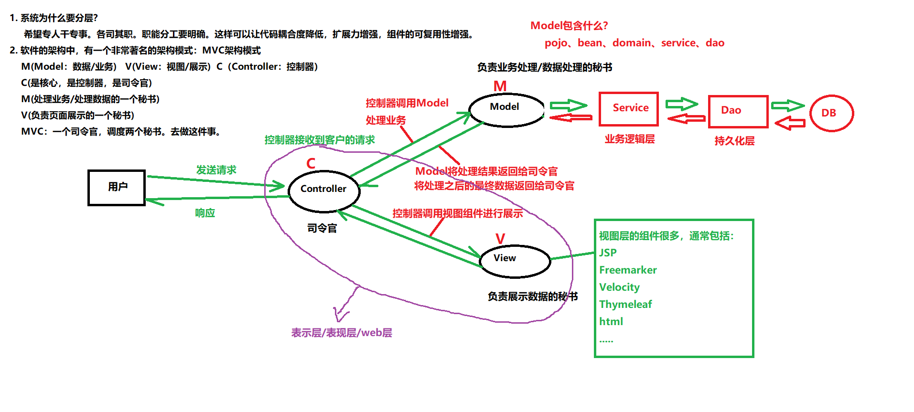

- ## session和cookie

  - #### Session

    > ###### 关于B/S系统的会话机制：
    >
    > 什么是会话（Session）？
    >
    > - 用户打开浏览器，进行一系列操作，然后到最终浏览器关闭，整个这个过程就叫做：一次“会话”（Session）。
    > - Session会话机制是BS系统的一个概念。使用php开发WEB项目，同样会有Session。Session实际上是HTTP协议的一个规范，不同的语言做WEB开发，都要对这种会话机制做相应的实现。
    > - 什么是一次请求：用户在浏览器上点击了一下发送了一个HTTP请求报文，然后到服务器响应回来数据，这个过程就可以粗略认为是一次请求。请求对应的服务器端的Java对象是ServletRequest。
    > - JavaEE中对Session的实现是`jakarta.servlet.http.HttpSession`，一次会话对应一个Session对象。一次会话包含多次请求，即一个Session包含了多个Request请求对象。
    >
    > ###### 为什么要有会话机制，它的作用是？
    >
    > - Session对象主要的作用是：保存会话状态。
    > - 用户登录成功了，这是一种登录成功的状态，你怎么把登录成功的状态一直保存下来呢？就通过Session对象来保留会话状态。这样只要登陆一次，打开多个页签都还是登录状态，不用重复登陆了，因为每个用户的登陆状态都通过他自己的Session对象保存在了服务器中。
    > - Session对象对应的是“会话域”。对应的，`HttpSession`对象同样有`setAttribute()、getAttribute()、removeAttribute()`这些3个方法。会话域中可以保存用户的登陆状态等信息，这些信息可以被多个Request请求对象共享。
    >
    > ###### 为什么需要Session对象来保存会话状态呢？
    >
    > - 因为HTTP协议是一种无状态协议。
    > - 什么是无状态：请求的时候，B和S是连接的，但请求结束之后，连接就断了。为什么要这么做？HTTP协议为什么要设计成这样？因为这样的无状态协议可以降低服务器的压力。请求的瞬间是连接的，请求结束之后，连接断开，这样服务器压力小。
    > - 当某个时刻用户关掉了浏览器，那么关闭浏览器这个动作，服务器知道吗？不知道。服务器是不会知道用户的浏览器什么时候关闭了。（总不可能用户关掉浏览器前，还要发送一堆请求告知每个网页后的服务器吧）
    > - 张三打开一个浏览器A，李四打开一个浏览器B，访问服务器之后，在服务器端会生成：张三专属的Session对象、李四专属的Session对象...。他们的登陆状态等信息，都通过各自的Session对象保存在服务器中。
    >
    > ###### 为什么不用HttpRequest对象（请求域）保存会话状态？为什么不用ServletContext对象（应用域）保存会话状态？
    >
    > 因为ServletContext应用域太大，而HttpRequest请求域又太小了。（request请求域 < session会话域 < application应用域）
    >
    > ###### Session对象的实现原理：
    >
    > - 获取`Session`对象：`HttpSession session = request.getSession()`，这行代码很神奇，张三的请求获取的Session对象就是张三的；李四的请求获取的Session对象就是李四的。（后面会说原因）
    > - Session机制需要依赖一个特殊的键值对`JSESSIONID=xxxxxx`（Session Cookie），这个键值对保存在浏览器的内存中。浏览器只要关闭，这个键值对（Session Cookie）就没有了。（后面会说`Cookie`）
    > - 服务器中有一个Session列表，它是一个Map，Map的key是`SessionId`（即`JSESSIONID`对应的值），Map的value是一个`Session`对象。
    > - 当用户第一次请求服务器，此时服务器为它生成对应的Session对象，同时将该Session对象的id发送给浏览器。
    > - 当用户第二次、第N次请求该URL时，服务器会自动携带该Session的id（以Cookie的形式），服务器根据这个id来查找用户对应的Session对象。
    > - 直到用户关闭浏览器，内存中保存的Session对象的id消失（Session Cookie消失），会话结束。此时服务器中保存的Session对象虽然可能还在，但是没人能访问到它的，因为id没了。因此服务器中的Session对象默认会有一个生命周期时间，超过了这个时间没人访问它，这个Session对象就被销毁掉了。这也是为什么长时间不请求服务器，网页就需要重新去登陆了。
    >
    > 
    >
    > ###### Session对象怎么获取？
    >
    > `httpServletRequest.getSession()`可以获取服务器Map中用户保存的Session对象。这行代码的作用是：
    >
    > - 如果用户的请求中携带了JSESSIONID，那么这行代码会根据这个Session对象的ID去找对应的Session对象，找到就返回；
    > - 没找到、或请求中没有携带JSESSIONID，这行代码则会创建一个新的Session对象，此时程序员需要将该Session对象的id以Cookie的形式响应给浏览器。这样下次浏览器再请求该URL时，就会自动携带上该URL对应的Cookie。
    > - 如果没找到或请求中没有携带JSESSIONID，此时不想创建这个新的Session对象，可以：`getSession(false)`
    >
    > ###### 服务器中的Session对象什么时候被销毁？
    >
    > - 实际上保存在服务器中的Session对象，会有一个默认的时间设定，如果超过一定时间没有人来访问，这个Session对象会自动销毁，默认是30分钟。（可以去查看`CATALINA_HOME\conf\web.xml`）
    >
    > - 超时销毁也可以配置到`web.xml`文件中去：
    >
    >   ```xml
    >   <web-app>
    >       <!-- 设置 Session 超时时间为 30 分钟（单位：分钟） -->
    >       <session-config>
    >           <session-timeout>30</session-timeout>
    >       </session-config>
    >   </web-app>
    >   ```
    >
    > - 使用Java代码设置某个Session对象存活时间：`session.setMaxInactiveInterval(60)`，单位是秒。
    >
    > - 手动销毁一个Session对象：`session.invalidate();`
    >
    > - 获取Session对象的SessionId：`session.getId();`
    >
    > - 判断获取的Session对象是新创建的还是已有的旧的：`session.isNew();`
    >
    > ###### 注意：JSP中的九大内置对象之一就有Session对象，只要访问JSP页面，九大内置对象之一的Session对象就被创建好了。

  - #### Cookie

    > - Cookie是一种会话技术，它由服务器产生，是放在浏览器上的一小段数据。有在内存中的Cookie，有保存到硬盘上的Cookie。Session Cookie就是内存中的Cookie。
    > - Session的实现原理中，每一个Session对象都会关联一个sessionid，例如：`JSESSIONID=41C481F0224664BDB28E95081D23D5B8`。浏览器下次再请求该URL时，就会携带该URL关联的Session Cookie（以请求头的形式`Cookie: key=value;..`），服务器根据Session Cookie中的id找到用户在服务器中对应的Session对象。
    > - Cookie实际上就是一个字符串键值对，`key=value`的形式。在JavaEE中的对应的是`jakarta.servlet.http.Cookie`
    > - 服务器创建Session对象后，会将Session对象的id封装成Cookie对象，放入Response对象中，最终该Cookie会作为`Set-Cookie`响应头返回给浏览器。浏览器会将该URL对应的Cookie进行记录，下次请求该URL就会带上该Cookie。
    > - 由于Cookie存储在浏览器端，因此不建议存储那些敏感或影响安全的数据，敏感的数据一般都在服务器中保存保存。

    - ##### Cookie怎么生成？怎么将Session对象的id封装成Cookie对象并响应给浏览器？

      > 通过`httpServletResponse.addCookie(Cookie cookie)`方法，将指定的Cookie添加到响应头中，这样响应头中就会有`Set-Cookie: key=value;..`。该方法可以被多次调用来添加多个Cookie。创建Cookie对象：`new Cookie("key","value");`。

    - ##### 关于cookie的有效时间：`cookie.setMaxAge(int second)`

      > - 如果没有设置Cookie的有效时间，默认Cookie保存在浏览器的运行内存中，浏览器关闭则Cookie消失。
      > - 如果参数是一个负数，则表示该Cookie仅在本浏览器窗口以及本窗口打开的子窗口内有效，关闭窗口后该Cookie即失效。maxAge为负数的Cookie为临时性Cookie，不会被写到Cookie文件中进行持久化保存。
      > - 如果参数是一个正数，那么它一定会被浏览器自动保存在用户的电脑硬盘上second秒，过时后自动删除。
      > - 如果设置为0，则表示删除该Cookie。这种方式通常被用在：删除浏览器上的同名Cookie。
    
    - ##### 设置Cookie关联的URL：`cookie.setPath("/xx")`
    
      > 只要是访问这个URL或它的子URL，那么浏览器会自动携带与该路径关联的Cookie，在请求头中一块发送给服务器。
      >
      > 如果这样设置`cookie.setPath("/servlet")`，表示请求的路径为`/servlet、/servlet/x、/servlet/x/y`，都会携带该Cookie给服务器。
    
      > ###### 没有设置的情况下，Cookie默认关联的路径是什么？
      >
      > 假设现在服务器响应给B端是 http://localhost:8080/servlet13/cookie/generic 这个资源，响应头中携带了Cookie。如果这个Cookie没有设置`setPath("path")`，那么该Cookie默认关联的路径是 http://localhost:8080/servlet13/cookie 及它的所有子路径。
    
    - ##### 服务器怎么接收用户发送过来的Cookie？`request.getCookies()`
    
      > `Cookie[] cookie = httpServletRequest.getCookies()`。如果没有携带Cookie则获取的是`null`。
    
    - ##### 如果用户设置了禁用Cookie怎么办？
    
      > 服务器正常发送Cookie给浏览器，但是浏览器不要了，拒收了。Cookie禁用了，Session机制还可以实现吗？
      >
      > 可以，需要使用**URL重写机制**：在所有请求的URL后面跟一个`;jsessionid=26bb49b009aec0dc78`，比如：`https://www.bilibili.com/?name=value&name=value;jsessionid=26bb49b009aec0dc78`，但是这种做法并不总是最佳实践，因为它可能会暴露敏感的会话信息。
      >
      > 在现代的Web应用程序中，更常见的做法是使用Cookie来存储会话信息，因为这种方式更安全，并且可以更好地控制和保护用户的会话数据。
      >
      > URL重写机制会提高开发者的成本。开发人员在编写任何请求路径的时候，后面都要手动添加一个`jsessionid`，这给开发带来了很大的难度和成本。所以大部分的网站都是这样设计的：你要是禁用Cookie，你就别用了。
    

- ## 过滤器和监听器

  - #### Filter过滤器

    > 过滤器（Filter）是JavaWeb中的一种重要组件，它可以在请求到达Servlet之前或响应返回客户端之前对请求和响应进行预处理和后处理。过滤器是位于客户端与服务器资源（Servlet、html等）之间的一道过滤网，可以：
    >
    > 1. 在请求到达目标资源前进行拦截处理
    > 2. 在响应返回客户端前进行拦截处理
    > 3. 决定是否将请求继续传递给下一个过滤器或目标资源
    >
    > 过滤器的主要作用：
    >
    > 1. **权限控制**：如登录验证、权限检查
    > 2. **编码设置**：统一设置请求和响应的字符编码
    > 3. **敏感词过滤**：对请求参数或响应内容进行过滤
    > 4. **日志记录**：记录请求日志
    > 5. **性能监控**：统计请求处理时间
    > 6. **数据压缩**：对响应进行压缩处理
    >
    > 即Filter过滤器可以在Servlet这个目标程序执行之前添加代码，也可以在目标Servlet执行之后添加代码。一般情况下，我们都是在过滤器中编写公共代码。
    >
    > 过滤器的实现原理：
    >
    > 

    - ##### 一个过滤器怎么写呢？ 

      1. ###### 编写一个类实现接口`jarkata.servlet.Filter`，并实现这个接口中的所有方法。 （所有的过滤器都要实现该接口）

         > - `init()`：在Filter对象第一次被创建之后调用，并且只调用一次。
         > - `doFilter()`：只要用户发送一次请求，就执行一次；发送N次请求则执行N次。在这个方法中编写过滤规则。
         > - `destroy()`：在Filter对象被释放/销毁之前调用，并且只调用一次。

      2. ###### 在web.xml文件中注册过滤器Filter。（类似于注册一个Servlet，这些请求会先走过滤器）

         ```xml
         <filter>
           <filter-name>filter2</filter-name>
           <filter-class>com.bjpowernode.javaweb.servlet.Filter2</filter-class>
         </filter>
         <filter-mapping>
           <filter-name>filter2</filter-name>
           <url-pattern>/*</url-pattern><!-- 过滤所有请求 -->
           <servlet-name>servlet1<servlet-name><!-- 过滤器路径还可以写servlet的别名 -->
         </filter-mapping>
         ```

         > 或者使用注解：`@WebFilter({"*.do"})`

      3. ###### 过滤器中编写过滤规则。

         ```java
         public void doFilter(ServletRequest request, ServletResponse response, FilterChain chain) throws IOException,ServletException{
         	System.out.println("在目标程序执行前过滤");
         	chain.doFilter(request, response);  // 放行代码，去执行对应的Servlet。响应后还会重新回到此处继续往下执行
         	System.out.println("在目标程序执行后过滤");
         }
         ```

         > doFilter方法用于在Filter中对HTTP请求进行放行，放行就由其后的过滤器或servlet进行请求处理；拒绝就在过滤器本身做出响应。
         >
         > 它的调用会去执行这条请求链上的下一个过滤器，如果下面没有过滤器了，则执行Servlet去处理请求。

    - ##### 关于过滤器Filter：

      > - Filter的生命周期和Servlet对象生命周期一致。唯一的区别是：Filter默认情况下，在服务器启动阶段就实例化，而Servlet不会。
      > - Servlet和Filter都是单例的。
      >
      > - Filter的优先级天生就比Servlet或html优先级高。`/a.do`路径对应一个Filter和Servlet，那么一定会先执行Filter。
      > - 如果有多个过滤器，且`web.xml`中配置的url相同，那么到底先走哪个过滤器呢？Filter执行的顺序根据web.xml中配置的`<filter-mapping>`标签的先后顺序。如果采用了注解的方式来配置过滤器，那么则按照“过滤器的类名”在字典上的先后顺序来执行的。
      > - Filter过滤器这里有一个设计模式： 责任链设计模式。它的核心思想是：在程序运行阶段，动态的组合程序的调用顺序。而过滤器最大的优点是：它在编译阶段不会确定调用顺序，因为Filter的执行顺序是根据配置文件来确定的，只要修改配置文件就可以实现过滤器之间执行顺序的动态组合，因此符合责任链设计模式。
      > - 过滤器同样有GenericFilter和HttpFilter这两个抽象类，前者比Filter多了一个过滤器配置属性filterConfig，更通用，否则你想用过滤器的初始化参数信息就得自己重写init方法；后者就是将doFilter()的前2个参数变为了HttpServletRequest的，更适合web开发，这点类似于前面的Servlet接口。

  - #### Listener监听器

    > 监听器（Listener）是 JavaEE 中的一种特殊组件，用于监听 Web 应用中特定事件的发生，并在这些事件发生时执行预定义的代码。监听器是JavaEE对（GoF的）**观察者模式**的实现，主要用于监听 ServletContext、HttpSession 和 ServletRequest 等域对象的生命周期的变化，以及属性的变化。
    >
    > 监听器是Servlet规范留给我们JavaWeb程序员的一个特殊时机，如果在特殊的时刻想做一些事情，就可以通过它来做。
    >
    > 就像Filter一样，监听器也是Servlet规范的一员。所有的监听器接口都是以“Listener”结尾。
    >
    > 监听器什么时候执行？当某个特殊的事件发生（特殊的事件发生其实就是某个时机到了。）之后，被web服务器自动调用。
    
    - ##### Servlet规范中提供了哪些监听器？

      - ###### `jakarta.servlet`包下：

        > - `ServletContextListener`：域对象`ServletContext`的创建/销毁。
        > - `ServletContextAttributeListener`：域对象`ServletContext`中，数据的增删改。
        > - `ServletRequestListener`：域对象`ServletRequest`的创建/销毁。
        > - `ServletRequestAttributeListener`：域对象`ServletRequest`中，数据的增删改。
    
      - ###### `jakarta.servlet.http`包下：

        > - `HttpSessionListener`：域对象`HttpSession`的创建/销毁。
        > - `HttpSessionAttributeListener`：它监听的是Session域中数据的变化。只要数据变化（增删改），则执行相应的方法。主要监测点在Session域对象上。
        > - `HttpSessionIdListener`：Session对象的id发生变化的时候，该监听器接口中的唯一一个方法就会被调用。
        > - `HttpSessionBindingListener`：实现了该接口的对象，放到了Session域中，或从Session域中移除，就会触发绑定（bind）和解绑（unbind）方法。（该监听器不需要注册）
        > - `HttpSessionActivationListener`：用来监听（放在）Session域中JavaBean对象的钝化与活化状态。如果某个JavaBean对象需要在Session钝化和活化时做一些事情，那么该对象的类就需要实现这个接口中的方法，并将该类实例放在Session域中。此时HttpSession对象钝化和活化时，就会执行接口中的方法。（该监听器不需要注册）
        >
        > **什么是钝化与活化？**
        >
        > 钝化和活化原本是化学中的术语，钝化指把金属表面转换成不容易氧化、不易被锈蚀的状态，也就是不活跃状态；活化又称激发，把物体变成活跃状态。
        >
        > JavaEE借鉴了这两个概念，用来表示Java对象的状态变化：
        >
        > - 钝化：把一个Java对象序列化保存到磁盘文件上
        > - 活化：把磁盘文件里的数据，反序列化恢复到内存中形成一个Java对象
        >
        > 其次，并不是任意一个Java对象都可以被钝化的：
        >
        > - 这个类必须要实现java.io.Serializable接口
        > - 类里的属性也要实现java.io.Serializable接口
        >
        > **Session的钝化与活化：**
        >
        > 服务器中有很多Session对象，会大量占用服务器资源，如果某些对象不常使用，可以暂时放在硬盘上，当需要的时候再加载到内存。保存到磁盘就是钝化，加载到内存就是活化。
        >
        > 在JavaEE中，最常见的就是HttpSession对象的钝化与活化了：当服务器正常关闭时，内存中的HttpSession对象并不是销毁了，而是被序列化保存到了磁盘文件上（`work\Catalina\ip地址\项目名\SESSIONS.ser`）；当服务器重新启动时，磁盘文件上保存的数据又被恢复到内存中，重新转换成了HttpSession对象。
        >
        > 
        >
        > **Tomcat的钝化与活化机制介绍：**
        >
        > Tomcat提供了两种session钝化与活化的管理机制：`StandardManager`和`PersistentManager`。其中：`StandardManager`是Tomcat的默认session管理机制，而`PersistentManager`需要进行配置才会生效。
        >
        > 1. **StandardManager管理Session：**
        >
        >    - session钝化：当Tomcat被关闭，或者重启时，会把session对象钝化保存到磁盘文件上
        >    - session活化：当Tomcat启动时，会把保存在磁盘上的文件进行反序列化，恢复到内存中形成一个session对象
        >
        >    （注意：强制kill掉Tomcat，是不会把session钝化到磁盘上的）
        >
        > 2. **PersistentManager管理Session：**
        >
        >    配置这种方式，可以将长时间不用的session对象钝化到磁盘上，减少内存的占用。
        >
        >    比如：当web应用有大量用户访问量，服务器会创建大量的session对象，占用大量的内存资源。我们可以设置：当用户一分钟不操作时，就把session钝化，生成文件保存到磁盘上。当用户再访问时，Tomcat会把磁盘文件反序列化恢复成为session对象。
        >
        > **Tomcat的Session钝化机制配置：**
        >
        > 那么应该怎样进行配置呢？Tomcat提供了很多种配置方式，这里介绍三种：
        >
        > 1. 在web应用的META-INF目录下，创建一个context.xml文件，内容如下：（只针对当前web应用有效）
        >
        >    ```xml
        >    <?xml version="1.0" encoding="UTF-8"?>
        >    <Context>
        >      <!-- className：指定session管理对象是PersistentManager   maxIdleSwap：配置多长
        >      时间不访问就钝化session -->
        >      <Manager className="org.apache.catalina.session.PersistentManager"
        >       maxIdleSwap="1">
        >        <!-- 
        >        className：指定钝化session时生成文件的管理类    
        >        directory：指定生成的文件保存的文件夹（tomcat\work\Catalina\localhost\web应用
        >        名称\指定的文件夹） 
        >        -->
        >        <Store className="org.apache.catalina.session.FileStore" directory="itheima">
        >        </Store>
        >      </Manager>
        >    </Context>
        >    ```
        >
        > 2. 修改Tomcat的`conf\server.xml`，在`<Host>`标签中增加子标签内容如下：
        >
        >    ```xml
        >    <!-- 
        >    docBase：部署的web应用的路径，可以写web应用的绝对路径，也可以写webapps
        >    中的web应用文件夹名称
        >    path：web应用的访问路径，也就是contextPath 
        >    -->
        >    <Context docBase="activation" path="/activation" reloadable="true">
        >      <Manager className="org.apache.catalina.session.PersistentManager" 
        >      maxIdleSwap="1">
        >      	<Store className="org.apache.catalina.session.FileStore" directory="itheima"/>
        >      </Manager>
        >    </Context>
        >    ```
        >
        >    > Context标签中的docBase，配置的哪个web应用，就针对哪个web应用生效。可以有多个Context标签，分别给不同的web应用进行配置。
        >
        > 3. 修改Tomcat的`conf\context.xml`，在Context标签里增加子标签内容如下：（全局方式）
        >
        >    ```xml
        >    <Manager className="org.apache.catalina.session.PersistentManager"
        >     maxIdleSwap="1">
        >      <Store className="org.apache.catalina.session.FileStore" directory="itheima">
        >      </Store>
        >    </Manager>
        >    ```
        >
        >    > 注意：这种方式，对Tomcat里部署的每一个web应用都会生效。在Tomcat\work\catalina\localhost目录下，每个web应用的文件夹里都会有一个itheima文件夹，用来保存自己的web应用里钝化的session对象。
    
    - ##### 实现一个监听器的步骤：（以ServletContextListener为例）
    
      1. 编写一个类实现ServletContextListener接口，并且实现里面的方法：
    
         ```java
         void contextInitialized(ServletContextEvent event)
         void contextDestroyed(ServletContextEvent event)
         // 参数是ServletContextEvent对象是事件对象，可以通过它来拿到发生此次事件的对象源
         ```
    
         > 注意：所有监听器中的方法都不需要javaweb程序员手动调用，是服务器（在某个时机）自动调用的。
    
      2. 在`web.xml`文件中对ServletContextListener进行注册，如下：
    
         ```xml
         <listener>
         	<listener-class>com.bjpowernode.javaweb.listener.MyServletContextListener</listener-class>
         </listener>
         ```
    
         > 也可以不使用配置文件，用注解：`@WebListener`
         >
         > 注意：`HttpSessionBindingListener`和`HttpSessionActivationListener`这两个监听器接口的实现类，不需要第二步的注册。

- ## MVC架构模式

  - #### 关于MVC架构模式

    > **MVC架构模式**是软件工程的一种“软件架构模式”，它把软件系统分为“模型”、“视图”和“控制器”三个基本部分，用一种业务逻辑、数据、界面分开的方法来组织代码，将业务逻辑聚集到一个部件里面，在改进和个性化定制界面以及用户交互的同时，不需要重新编写业务逻辑。
    >
    > **系统为什么要分层**？就是希望专人干专事、各司其职，职能分工要明确，这样可以让代码耦合度降低，扩展力变强，组件复用性高。
    >
    > **MVC解释**：
    >
    > - M：Model/数据/业务，m是负责业务处理，数据处理的一个秘书；像实体类（pojo/domain/bean）、数据库访问（dao/mapper）、处理业务的service包，这些内容都属于M层。
    > - V：View/视图/展示，v是负责展示的一个秘书（JSP/html/css/js/img）
    > - C：Controller/控制器，c是核心，是控制器，是司令官（SpringMVC），如Servlet类，都是C层。
    >
    > MVC：一个司令官两个秘书，去管理控制一个项目。
    >
    > 用户通过html发送请求给S端服务器，服务器统一交给C控制器来处理用户的请求，C可以通过调用M和V来响应数据和展示页面。
    >
    > 

    - ##### 关于三层架构（web层/表示层、service层/业务层、DAO层/持久化层）：

      > 每一层都是一个目录，目录中的代码之间互相都通过接口来调用，具体每一层的实现类在每一层包下会有一个`impl`目录，实现类的类名就是在接口名后面加了`Impl`结尾。web层的实现类中，包含了service层的接口（以属性的形式）；service层的实现类中，又包含了dao层的接口。
      >
      > - 表示层/表现层/web层：Servlet、JSP，用于处理前端发送过来的请求以及界面的展示；
      > - 业务逻辑层Service：java代码，用于具体业务的具体处理与实现，调用DAO进行数据的持久化，调用各种javabean进行数据的封装；一般情况下，每张表都对应处理这张表相关业务的service类；
      > - 持久化层DAO：和业务无关的jdbc代码，将数据持久化保存到数据库；我们之后会学一些DAO层的框架，如：MyBatis、SpringData..
      >
      > 
      >
      > 

  - #### 文件上传

    1. ##### 前端：

       ```html
       <!DOCTYPE html>
       <html lang="en">
       <head>
           <meta charset="UTF-8">
           <title>上传文件</title>
       </head>
       <body>
           <form action="/upload" method="post" enctype="multipart/form-data">
               <input type="file" name="img"><p>
               <input type="submit" value=" 提 交 ">
           </form>
       </body>
       </html>
       ```

    2. ##### 后端`web.xml`中进行配置后端路由：

       ```xml
       <?xml version="1.0" encoding="UTF-8"?>
       <web-app xmlns="http://xmlns.jcp.org/xml/ns/javaee"
           xmlns:xsi="http://www.w3.org/2001/XMLSchema-instance"
           xsi:schemaLocation="http://xmlns.jcp.org/xml/ns/javaee http://xmlns.jcp.org/xml/ns/javaee/web-app_4_0.xsd"
           version="4.0">
       
           <servlet>
               <servlet-name>FileUploadServlet</servlet-name>
               <servlet-class>FileUploadServlet</servlet-class>
       
               <!-- 重点是在servlet中配置这个，表示该servlet支持文件上传，在这里面设置文件上传属性 -->
               <multipart-config>
                   <!--设置单个支持最大文件的大小-->
                   <max-file-size>102400</max-file-size>
                   <!--设置整个表单所有文件上传的最大值-->
                   <max-request-size>102400</max-request-size>
                   <!--设置最小上传文件大小-->
                   <file-size-threshold>0</file-size-threshold>
               </multipart-config>
           </servlet>
       
           <servlet-mapping>
               <servlet-name>FileUploadServlet</servlet-name>
               <url-pattern>/upload</url-pattern>
           </servlet-mapping>
       </web-app>
       ```

       > 也可以使用注解来代替xml中的配置：`@MultipartConfig( fileSizeThreshold = 1024 * 1024,  maxFileSize = 1024 * 1024 * 10,  maxRequestSize = 1024 * 1024 * 50 )`

    3. ##### 后端Servlet处理用户请求：

       ```java
       public class FileUploadServlet extends HttpServlet {
       	protected void doPost(HttpServletRequest req, HttpServletResponse resp) throws ServletException, IOException {
       
               //重点方法，request.getPart("img");获取请求体中上传文件的流信息，返回的是一个part对象
               Part part = req.getPart("img");
       
               //手下声明一个保存路径，这里保存在D盘的File文件下
               String filePath = "D:\File\";
       
               //part.getSubmittedFileName()可以获取文件名，UUID.randomUUID().toString()是避免文件名冲突的
               String fileName = UUID.randomUUID().toString()+
               part.getSubmittedFileName().substring(part.getSubmittedFileName().indexOf("."));
       
               //通过write()方法，可以将这个png文件保存在任意路径下，write里面的参数，就是要保存的路径；这种方式比较适合简单的写入，也可以part.getInputStream();手动写入控制更多读写细节
               part.write(filePath+fileName);
       
               //然后给前端返回响应的结果
               resp.setContentType("text/html");
               resp.setCharacterEncoding("utf-8");
               PrintWriter writer = resp.getWriter();
               writer.println("<h1>上传成功</h1>");
       	}
       }
       ```

------

