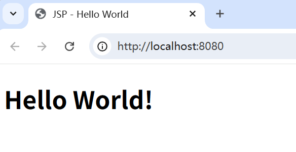

- ## JSP

  > JSP（Java Server Pages）是由Sun公司主导创建的一种动态网页技术标准。JSP将Java代码和特定变动内容嵌入到静态的页面中，实现以静态页面为模板，动态生成其中的部分内容。JSP本质还是servlet，一般每个jsp页面都会生成一个java文件和clsss文件。Tomcat内部就有一个jsp的编译器。

  - #### 概念

    - ##### 我的第一个JSP程序：

      1. 首先在`WEB-INF`目录外面创建一个`index.jsp`文件，内容如下：
  
         ```jsp
         <%@ page contentType="text/html; charset=UTF-8" pageEncoding="UTF-8" %>
         <!DOCTYPE html>
         <html>
           <head>
             <title>JSP - Hello World</title>
           </head>
           <body>
             <h1><%= "Hello World!" %></h1>
           </body>
         </html>
         ```

      2. 启动Tomcat，打开浏览器，访问以下地址：http://localhost:8080/index.jsp，效果如下：

         
  
         > ###### 过程说明：
         >
         > - 实际上访问以上的这个：index.jsp，底层执行的是：index_jsp.class 这个java程序。
         > - 这个index.jsp会被tomcat翻译生成index_jsp.java文件，然后tomcat服务器又会将index_jsp.java编译生成index_jsp.class文件。
         > - 访问index.jsp，实际上执行的是index_jsp.class中的Java代码。

    - ##### 关于JSP：
  
      > - JSP其实就是一个Servlet。它们的生命周期完全相同，都是单例的（假单例），完全就是一个东西。没有任何区别。
      >
      > - index.jsp访问的时候，会自动翻译生成index_jsp.java，会自动编译生成index_jsp.class，那么index_jsp 这就是一个类。
      > - index_jsp 类继承 HttpJspBase，而HttpJspBase类继承的是HttpServlet。所以index_jsp类就是一个Servlet类。
      > - 注意：编译不通过的JSP不会生成class，但仍会翻译为Java源文件。
  
    - ##### JSP的定义：
  
      > - JSP是Java Server Pages的缩写。即**基于Java语言实现的服务器端的页面**。
      > - Servlet是JavaEE的13个子规范之一，那么JSP也是JavaEE的13个子规范之一。
      > - JSP是一套规范。所有的web容器/web服务器都是遵循这套规范的，都是按照这套规范进行的“翻译”。每一个是实现了JSP规范的web容器/web服务器都内置了一个JSP翻译引擎。
      > - 对JSP进行错误调试的时候，还是要直接打开JSP文件对应的java文件，检查java代码。
      > - 开发JSP的最高境界：眼前是JSP代码，但是脑袋中呈现的是java代码。
  
    - ##### 思考：为什么JSP文件第一次打开的时候比较慢？
  
      > 因为第一次比较麻烦：
      >
      > 1. 要把.jsp文件翻译生成.java源文件。
      > 2. .java源文件要编译生成.class字节码文件。
      > 3. 然后通过class去创建`Servlet`对象。
      > 4. 然后调用`Servlet`对象的`init()`方法。
      > 5. 最后调用`Servlet`对象的`service()`方法。
      >
      > 第二次就比较快了，为什么？因为第二次直接调用单例`Servlet`对象的`service()`方法即可。
      >
      > 这也是为什么运维人员在给客户演示JSP项目的时候，都要提前把所有的JSP页面先访问一遍。
  
    - ##### JSP文件的扩展名是必须的吗？
  
      > 不是，是可以在Tomcat的`conf`中配置的：`CATALINA_HOME/conf/web.xml`
      >
      > ```xml
      > <servlet-mapping>
      >   <servlet-name>jsp</servlet-name>
      >   <url-pattern>*.jsp</url-pattern>
      >   <url-pattern>*.jspx</url-pattern>
      > </servlet-mapping>
      > ```
      >
      >
      > 其实这个JSP就是一个普通txt文本，Tomcat认为哪个文件是JSP文件，就翻译哪个。

  - #### JSP的语法

    - 在`.jsp`文件中直接编写的文字会被翻译到`Servlet`类的`service()`方法里的`out.write("翻译到这里")`里面。即：没有任何特殊标记的JSP的内容，都被直接放到了`write()`方法的双引号里，被Java程序当做普通字符串打印输出到浏览器。

      > 在JSP中编写的HTML、CSS、JS代码，这些代码对于JSP来说只是一个普通的字符串。但是JSP把这个普通的字符串一旦输出到浏览器，浏览器就会对HTML、CSS、JS进行解释执行，最终展现出效果。

    - 在JSP中编写Java程序：`<% Java代码写在这里 %>`，例如：向浏览器上输出一个java变量。

      ```jsp
      <% String name = “jack”;
      out.write("name = " + name); %>
      ```
  
      > - 在这个符号当中编写的被视为java程序，会被放在Servlet类的`service()`方法内部。
      > - 在一个JSP当中 `<% %>` 符号可以出现多个。它们会按照先后顺序依次被放在`service()`方法中。
      > - 因此`<% %>`中（即`service()`方法中）不能写静态代码块，不能写方法，不能定义成员变量...
      > - 注意：以上代码中的`out`是JSP的九大内置对象之一。可以直接拿来用。9大内置对象其实就是Servlet类中的9个成员变量。

    - `<%= 变量名 %>`可以直接输出一个变量或表达式。里面的东西相当于放在了`service()`方法的`out.print()`中了。

    - `<%! %>`中的内容会被放在`service()`方法之外。也就是成员作用域中。这种方式编写的代码，出现的位置是类体的开头。

      > 这种方式会被编译到service方法之外，几乎不用，而且不建议用！
      > 为什么？因为会有线程安全问题，Servlet类就一个，在类体中写的是成员变量，这个成员变量多个线程共享，如果在Tomcat多线程环境下，共享数据存在修改，就会有线程安全问题。
  
    - JSP中编写注释：`<%-- JSP的专业注释，不会被翻译到java源代码当中 --%>`
  
      > `<!--这种注释属于HTML的注释，这个注释信息仍然会被翻译到java源代码当中，不建议。-->`
  
    - JSP的指令语法：`<%@指令名 属性名=属性值 属性名=属性值 属性名=属性值... %>`
  
  - #### JSP指令
  
    - 指令的作用是：指导JSP的翻译引擎如何工作（指导当前的JSP翻译引擎如何翻译JSP文件）
  
    - 指令包括哪些呢？
  
      - `include`指令：包含指令，在JSP中完成静态包含，很少用了。
  
        > include包含指令可以将一些重复的jsp代码提取到一个公共的jsp中，然后通过使用该指令将公共jsp引入到某个文件中使用。
        >
        > JSP中有静态包含和动态包含：
        >
        > 1. 静态包含：使用include指令，`<%@include file="jsp的相对路径" %>`，它其实就是，将该标签直接替换了jsp文件中的所有内容，最后生成一个servlet源代码。虽然运行效率高一点点，但耦合度较高，不够灵活。
        > 2. 动态包含：使用jsp的语法标签，`<jsp:include page="jsp的相对路径"></jsp:include>`，它相当于在运行时方法的调用，会生成多个servlet，效率高且耦合度低。如果不需要传参数标签可以用自闭合的形式。需要传参数时，在该标签中间加上标签：`<jsp:param name="参数名" value="<%=变量名%>" />`，注意name属性不支持Java表达式，只能是字符串。获取参数就`req.getParameter(变量名);`，因为这里的参数是放在了request请求域中。page和file属性都是可以写表达式的。
  
      - `taglib`指令：引入标签库的指令。这个到JJSTL标签库的时候再学习。现在先不管。
  
      - `page`指令：目前重点学习一个page指令。
  
    - JSP指令的语法：`<%@指令名 属性名=属性值 属性名=属性值 属性名=属性值.. %>`
  
    - 关于`page`指令当中都有哪些常用的属性呢？
  
      > - session属性：`<%@ page session="true|false" %>`，设置jsp内置对象session是否启用，默认值就是true启用9大内置对象的session。
      > - contentType属性：`<%@ page contentType="text/html;charset=UTF-8" %>`，设置jsp中响应的内容类型，但同时也可以设置响应的字符编码。不写的话默认就是：`response.setContextType("text/html");`
      > - pageEncoding属性：`<%@ page pageEncoding="GBK" %>`，设置响应的字符编码，可以直接用上面的方式直接设置，两种方式是一模一样的。
      > - import属性：`<%@ page import="xxx,xxx,xxx,..." %>`jsp中导包
      > - errorPage属性：`<%@ page errorPage="url" %>`设置当前jsp，也就是JSP代码出现异常后的跳转位置
      > - isErrorPage属性：`<%@ page isErrorPage="true|false" %>`，如果jsp界面使用了这个并且设置为true，表示它是一个error的jsp界面，那么此时这个界面会启用9大内置对象中的exception，程序员可以使用该对象去打印异常堆栈信息到tomcat控制台上
      > - isELIgnored属性：`<%@ page isELIgnored="true|false" %>`，true表示忽略jsp页面中的EL表达式，将它当作普通字符串，默认false启用。（如果想只忽略其中某一个EL表达式，可以用转义字符`\${xxx}`）
      > - （了解）language属性：`<%@ page language="java" %>`，该属性用于设置当前JSP页面使用的语言，目前只支持Java语言，所以这个属性只需要知道就行。
  
    - JSP的九大内置对象：
  
      > - `(jakarta.servlet.jsp.PageContext)pageContext`：页面域。本页面中有效
      > - `(jakarta.servlet.http.HttpServletRequest)request`：请求域
      > - `(jakarta.servlet.http.HttpSession)session`：会话域
      > - `(jakarta.servlet.ServletContext)application`：应用域
      > - `(jakarta.servlet.http.HttpServletResponse)response`：负责响应
      > - `(jakarta.servlet.ServletConfig)config`：配置对象
      > - `(java.lang.Throwable)exception`：异常对象
      > - `(java.lang.Object)page`：当前的jsp对象的引用，其实就是this
      > - `(jakarta.servlet.jsp.JspWriter)out`：负责输出
  
    - JSP页面之间做转发：`<jsp:forward page=""></jsp:forward>`，其中可以携带数据。
  
  - #### EL表达式（Expression Language）
  
    > EL表达式可以代替JSP中的java代码，让JSP文件中的程序看起来更加整洁，美观。
    >
    > JSP中夹杂着各种java代码，例如`<% java代码 %>`、`<%=%>`等，导致JSP文件很混乱，不好看，不好维护。所以才有了后期的EL表达式。
    >
    > EL表达式可以算是JSP语法的一部分。EL表达式归属于JSP。
  
    - ##### 语法格式：`${Java表达式}`
  
    - ##### EL表达式的作用：
  
      > 从某个作用域中取数据，然后将其转换成字符串，然后将其输出到浏览器。
  
    - ##### EL表达式的三大功效：
  
      1. 从某个域中取数据。四个域：pageContext、request、session、application
  
      2. 将取出的数据转成字符串。
  
         > 如果是一个java对象，也会自动调用java对象的`toString()`方法将其转换成字符串。
  
      3. 将字符串输出到浏览器。类似于`<%= %>`
  
    - ##### EL表达式的使用：
  
      ```java
      <%
      	// 创建User对象
      	User user = new User();
      	user.setUsername("jackson");
      	user.setPassword("1234");
      	user.setAge(50);
      
      	// 将User对象存储到某个域当中。一定要存，因为EL表达式只能从某个范围中取数据。
      	// 数据是必须存储到四大范围之一的。
      	request.setAttribute("userObj", user);
      %>
      
      <%--使用EL表达式取--%>
      ${这个位置写什么？？？？这里写的一定是存储到域对象当中时的name}
      要这样写：
      ${userObj}
      等同于java代码：<%=request.getAttribute("userObj")%>
      你不要这样写：${"userObj"}
      
      面试题：
      	${abc} 和 ${"abc"}的区别是什么？
      		${abc}表示从某个域中取出数据，并且被取的这个数据的name是"abc"，之前一定有这样的代码: 域.setAttribute("abc", 对象);
      		${"abc"} 表示直接将"abc"当做普通字符串输出到浏览器。不会从某个域中取数据了。
      
      ${userObj} 底层是怎么做的？从域中取数据，取出user对象，然后调用user对象的toString方法，转换成字符串，输出到浏览器。
      
      <%--如果想输出对象的属性值，怎么办？--%>
      ${userObj.username} 使用这个语法的前提是：User对象有getUsername()方法。
      ${userObj.password} 使用这个语法的前提是：User对象有getPassword()方法。
      ${userObj.age} 使用这个语法的前提是：User对象有getAge()方法。
      ${userObj.email} 使用这个语法的前提是：User对象有getEmail()方法。
      EL表达式中的. 这个语法，实际上调用了底层的getXxx()方法。
      注意：如果没有对应的get方法，则出现异常。报500错误。
      
      ${userObj.addr222.zipcode}
      以上EL表达式对应的java代码：
      user.getAddr222().getZipcode()
      ```
  
      > - EL表达式优先从小范围中读取数据：pageContext < request < session < application
      >
      > - EL表达式中有四个隐含的隐式的范围：
      >
      >   - pageScope 对应的是 pageContext范围。
      >
      >   - requestScope 对应的是 request范围。
      >
      >   - sessionScope 对应的是 session范围。
      >
      >   - applicationScope 对应的是 application范围。
      >
      > - EL表达式对null进行了预处理。如果是null，则向浏览器输出一个空字符串。
      >
      > - EL表达式取数据的时候有两种形式：`.key`和`["key"]`，如果存储到域中的key包含特殊字符，此时只能用`[ ]`来取值。
      >
      > - 从Map集合中取数据：`${map.key}`
      >
      > - 从数组和list集合中取数据：`${数组[0]}`、`${list[0]}`
      >
      > - `page`指令当中，有一个属性，可以忽略JSP中的EL表达式：
      >
      >   ```java
      >   <%@page contentType="text/html;charset=UTF-8" isELIgnored="true" %>
      >   isELIgnored="true" 表示忽略EL表达式
      >   isELIgnored="false" 表示不忽略EL表达式。（这是默认值）
      >       
      >   isELIgnored="true" 这个是全局的控制。
      >       
      >   可以使用反斜杠进行局部控制：\${username} 这样也可以忽略EL表达式。
      >   ```
  
    - ##### EL表达式中常用的内置对象：
  
      - `pageContext`：`${pageContext.request.contextPath}`
  
        > 因为只有pageContext，没有request内置对象所以通过pageContext的方法获取request
  
      - `param`：
  
        ```jsp
        用户名:<%=request.getParameter("username")%>
        //使用param
        用户名:${param.username}
        ```
  
      - `paramValues`：
  
        ```java
        爱好:${paramValues.aihao[0]}、${paramValues.aihao[1]}、${paramValues.aihao[2]}
        ```
  
      - `initParam`：
  
        ```java
        <%
            String a =application.getInitParameter("pageSize");
        %>
            每页显示的记录条数:<%=a%>  //20
            //使用initParam
        每页显示的记录条数${initParam.pageSize} //20
        ```
  
      - 其他..(不是重点)
  
    - ##### EL表达式中的运算符：
  
      - 算数运算符：`+ - * / %`，并且`+`只能做求和运算，不会进行字符串的拼接。当算数运算符两边不是数字的时候，一定会先转成数字，转不成就报错`NumberFormatException`。
      - 关系运算符：`== != > >= < <= eq`，其中`== != eq`都是调用的`equals()`
      - 逻辑运算符：`! && || not and or`
      - 条件运算符：`? :`
      - `empty` 运算符：`${empty param.username}`，判断是否为空（不仅仅是`null`），如果为空结果是`true`,如果不为空结果是`false`
  
  - #### JSTL标签库
  
    - ##### 什么是jstl标签库？
  
      - Java Standard Tag Lib (Java标准的标签库)
      - JSTL标签库通常结合EL表达式一起使用。目的是让JSP中的java代码消失。
      - 标签是写在JSP当中的，但实际上最终还是要执行对应的java程序。(java程序在jar包当中。)
  
    - ##### 使用JSTL标签库：
  
      1. 引入JSTL对应的jar包。在WEB-INF下面新建lib目录 然后把对应的jar包复制过去。
  
      2. 通过`taglib`指令引入要使用的标签库。
  
         > 在JSTL中有很多标签，使用哪个?  重点掌握核心标签库。
         >
         > ```jsp
         > <%@taglib prefix="c" uri="http://java.sun.com/jsp/jstl/core" %>
         > ```
         >
         > `prefix="c"`：这里的c是随便起的名字。
  
      3. 将JSP中的Java代码用JSTL标签替换掉即可。（表面使用的是JSTL标签，底层实际上还是java程序）
  
         > **JSTL标签原理：**
         >
         > ```java
         > <%@taglib prefix="c" uri="http://java.sun.com/jsp/jstl/core" %>
         > 以上uri后面的路径实际上指向了一个×x×.tld文件。
         > tld文件实际上是一个xml配置文件。
         > 在tld文件中描述了"标签"和"java类"之间的关系。
         > 以上核心标签库对应的tld文件是:c.tld文件。它在哪里。
         > 在jakarta.serv1et.jsp.jst1-2.0.0.jar里面META-INF目录下，有一个c.tld文件。
         > ```
         >
         > 配置文件`tld`解析：
         >
         > ```xml
         > <tag>
         >   <description>对标签的描述</description>
         >   <name>标签的名字</name>
         >   <tag-class>标签对应java类</tag-class>
         >   <body-content>JSP</body-content>标签体当中可以出现的内容，如果是JSp，就表示标签体中可以出现符合JSp所有语法的代码。例如EL表达式。
         >   
         >   <attribute>
         >     <description>
         >       对这个属性的描述
         >     </description>
         >     <name>var</name>//属性名
         >     <required>false</required>//false表示该属性不是必须的
         >     <rtexprvalue>false</rtexprvalue>//false表示不支持EL表达式
         >   </attribute>
         > </tag>
         > ```
  
    - ##### 常用的标签：
  
      ```java
      <c:if text="boolean类型,支持EL表达式"></c:if>
      
      <c:forEach items="集合,支持EL表达式" var = "集合中的元素" varStatus="元素的状态对象">${元素状态对象:count}</c:forEach>
      <c:forEach var="i" begin="1" end="10" step="2"> ${i}</c:forEach>
      
      <c:choose>
          <c:when test="${param.age < 18}">
              青少年
          </c:when>
          <c:when test="${param.age < 35}">
              青年
          </c:when>
          <c:when test="${param.age < 55}">
              中年
          </c:when>
          <c:otherwise>
              老年
          </c:otherwise>
      </c:choose>
      ```
  
  
  > ```
  > ========day11===(关于EL表达式)============================================================
  > 
  > # EL表达式是干什么的？
  > 	·Expression Language(表达式语言)
  > 	·el表达式是为了使jsp写起来更简单，灵感来自于ECMAScript的模板字符串和xpath表达式语言。它提供了在jsp中简化表达式的方法，让jsp的代码更加简化。EL表达式属于JSP语法的一部分。
  > 	·在JSP中使用EL表达式可以简化jsp页面的Java代码，提高了页面的可读性和维护性，使得页面更易于理解和维护
  > 	·JSP中夹杂着各种java代码，导致jsp页面很混乱，不好看，不好维护，所以才有了后期的EL表达式
  > 
  > # EL表达式一般操作的都是域中的数据，操作不了局部变量。它会自动调用tostring()将其转换成字符串输出到浏览器：
  > 	1、从某个域中取数据（页面域pageContext、请求域request、会话域session、应用域application）
  > 	2、将取出的数据转换成字符串，底层是调用了toString方法
  > 	3、将字符串输出在浏览器上，和<%=%>一样
  > 
  > # EL表达式从域中取数据的语法：${表达式}，默认从小域往大域开始找。全找不到返回空串。指定域去找用jsp的隐式对象：pageScope，requestScope，sessionScope，applicationScope。例如：${pageScope.user}。不过一般域中的数据不会重名。
  > 			<%
  > 				User user = new User();
  > 				user.setUsername("jack");
  > 				user.setPassword("a123");
  > 				user.setAge(34);
  > 				request.setAttribute("userObj", user);
  > 			%>
  > 		使用EL表达式来取：${userObj}
  > 			等同于这段代码：<%=request.getAttribute("userObj")%>
  > 
  > # EL表达式从域中取数据的另一种形式：[""]，如果你的key中有特殊字符，可以用中括号[]的方式来取，例如：
  > 	如果你的域的key是"abc.def"这种形式，为了让浏览器不认为这是对象，你可以用这种方式来取:
  > 		${requestScope["abc.def"]}
  > 
  > # ${"userObj"}这个表示将字符串"userObj"输出在浏览器上，和${userObj不同}
  > 
  > # EL表达式取出来的对象，还可以再去获取对象中的私有属性：${user.age}，相当于调用了User类的getAge()方法，前提是
  > 	必须有getter方法，且按照驼峰命名规则。可以一层层往下找。
  > 	也可以直接${user.getAge()}
  > 
  > # 域中的对象是个数组或集合，可以从集合或数组中取数据：
  > 		${map.key}		${数组[0]}		${list[3]}list集合也是通过下标取的，和数组一样
  > 
  > # 通过EL表达式获取应用的根：
  > 	EL表达式有一个隐式对象叫pageContext，它和JSP的9大内置对象pageContext是一个东西，
  > 	pageContext里面有这这个方法：getRequest()返回ServletRequest类型对象，获取的其实就是
  > 	9大内置对象之一的request，然后request.getContextPath()可以获取根路径；
  > 	于是EL表达式可以通过这种方式来动态获取应用的根：
  > 		${pageContext.request.contextPath}
  > 	*--------------------------------------------------------------------
  > 		常用的EL表达式：
  > 			协议:${ pageContext.request.scheme }
  > 			服务器ip: ${ pageContext.request.serverName }
  > 			服务器端口: ${ pageContext.request.serverPort }
  > 			获取应用根路径: ${ pageContext.request.contextPath }
  > 			获取请求方式（GET/POST/..）: ${ pageContext.request.method }
  > 			获取B端ip地址: ${ pageContext.request.remoteHost }
  > 			获取会话的id编号: ${ pageContext.session.id }
  > 	*--------------------------------------------------------------------
  > 
  > # 关于EL表达式的隐含对象：
  > 	1、pageContext
  > 	2、param		(获取前端请求域提交过来的数据)
  > 	3、paramValues	(获取前端请求域提交过来的数据)
  > 	4、initParam
  > 	5、其他（不是重点）
  > 	* pageContext：
  > 		<%=(HttpServlet)(pageContext.getRequest()).getContextPath()%>等同于：
  > 		${pageContext.request.contextPath}
  > 	* param：
  > 		<%=request.getParameter("key")%>等同于：
  > 		${param.key}
  > 	* paramValues：
  > 		<%= (request.getParameterValues("key"))[0] %>等同于：
  > 		${paramValues.key[0]}
  > 	* initParam：获取全局初始化参数
  > 			<context-param>
  > 				<param-name>startIndex</param-name>
  > 				<param-value>0</param-value>
  > 			</context-param>
  > 			<context-param>
  > 				<param-name>stopIndex</param-name>
  > 				<param-value>10</param-value>
  > 			</context-param>
  > 			...
  > 		<%=application.getInitParameter("key")%>等同于：
  > 		${initParam.key}
  > 所以EL表达式是干什么的？就是从域中或对象中取数据，输出；取数据，输出....
  > 
  > ----------------------------------------------------------
  > 关于EL表达式的运算符：
  > 			1、算术运算符：+ - * / %
  > 				${10 + "20"}		30
  > 				（在EL表达式中+只会做求和运算，当两边不是数字的时候，一定会转成数字，这点和Java不同）
  > 				${10 + "abc"}		数字格式化异常
  > 				（/还可以用div）
  > 			2、关系运算符：== != > >= < <= eq
  > 				${"abc" == "abc"}	true
  > 				${"abc" eq "abc"}	true
  > 				k1 = new Object();k2 = k1;	${k1 == k2}	true
  > 				（双等号==和eq运算符在EL表达式中都是调用了equals方法）
  > 			3、逻辑运算符：&& || ! not and or	(注意!和not都是取反)
  > 			4、条件运算符：?:
  > 			5、取值运算符：[] .
  > 			6、empty运算符：判断是否为null，如果为空，返回true。遵循，没有就是空。
  > 				${empty param.aihao}		true
  > ---------------------------------------------------
  > JSTL标签库：
  > ---------------------------------------------
  > 	# 什么是JSTL标签库？
  > 		- JSP Standard Tag Lib：JSP标准标签库，它是一个JSP标签集合，它封装了JSP应用的通用核心功能。就是一个定制的标签库。
  > 		- JSTL标签库通常与EL表达式在jsp页面中一起用，目的是让jsp中的java代码消失
  > 		- 根据JSTL标签所提供的功能，可以将其分为5个类别：
  > 			核心标签（常用的功能都在这）
  > 			格式化标签（做数据格式化的）
  > 			SQL 标签
  > 			XML 标签
  > 			JSTL 函数
  > 		- JSTL的标签是写在JSP中的，但实际上最终还是执行的java程序，而java程序在jar包中的
  > 
  > 	# 使用JSTL标签库的步骤：
  > 		* 第一步：引入JSTL对应的依赖
  > 										jakarta.servlet.jsp.jstl-2.0.0.jar（对应关系的xml约束文件）
  > 			tomcat10之后对应的jar包是{
  > 										jakarta.servlet.jsp.jstl-api-2.0.0.jar（约束文件对应的Java代码文件）
  > 
  > 			tomcat10之前对应的jar包是：
  >                     <dependency>
  >                         <groupId>javax.servlet.jsp.jstl</groupId>
  >                         <artifactId>jstl</artifactId>
  >                         <version>1.2</version>
  >                     </dependency>
  >                     <dependency>
  >                         <groupId>taglibs</groupId>
  >                         <artifactId>standard</artifactId>
  >                         <version>1.1.2</version>
  >                     </dependency>
  > 			将这些jar包放在lib目录下就行了
  > 		* 第二步：在jsp页面中引入要使用的标签库（taglib指令引入）
  > 			<%@ taglib uri="http://java.sun.com/jsp/jstl/core" prefix="c" %>
  > 			<%@ taglib uri="http://java.sun.com/jsp/jstl/fmt" prefix="fmt" %>
  > 		这是常用的核心标签库和格式化标签库。prefix是一个标识，指定该标签是哪个库中的标签，核心和格式化标签库一般叫c和fmt
  > ---------------------------------------------------------------------------------
  > 	# JSTL标签的原理：
  > 		* 实际上你在jsp中使用这个：<c:catch></c:catch>标签，它会根据uri去匹配标签库
  > 			<%@ taglib prefix="c" uri="http://java.sun.com/jsp/jstl/core" %>，
  > 			这个uri指向了jar包中的一个xxx.tld文件，这个文件本质上就是一个
  > 			xml文件(配置文件)，在该文件中描述了Java类和JSTL标签之间的对应关系。
  > 			以上核心库对应的配置文件是c.tld，它在：jakarta.servlet.jsp.jstl-2.0.0.jar的META-INF文件中
  > 		* 源码解析：
  > 		  <tag>
  > 			<description>对该标签的描述</description>
  > 			<name>catch</name>标签名
  > 			<tag-class>org.apache.taglibs.standard.tag.common.core.CatchTag</tag-class>标签名对应的java类
  > 			<body-content>JSP</body-content>标签体中可以出现哪些内容，jsp表示可以出现所有jsp代码，包括EL表达式
  > 			<attribute>
  > 				<description>属性的描述</description>
  > 				<name>属性名</name>
  > 				<required>属性是否是必须的</required>
  > 				<rtexprvalue>该属性里面是否可以写el表达式</rtexprvalue>
  > 			</attribute>
  > 		  </tag>
  > 
  > ===================JSTL核心库常用的标签========================================================================
  > 以下的标签操作的都是域对象
  > 
  > # <c:if test="${!empty obj.username}">test属性是必须的，里面可以跟一个boolean类型的东西，支持EL表达式
  > 	<h1>hello</h1>		//if标签体里面写jsp代码
  >   </c:if>
  >   	相当于if(obj的username属性非空){out.print("<h1>hello</h1>");}
  > 	if标签里面还有var和scope属性，可以保存if的结果，非必须。var是变量名，scopevar的作用域，
  > 	（page/request/session/application），指将test中的值true|false存储到该变量中，而该变量保存在域中。
  > 
  > # <c:choose>			//类似于switch语句
  > 	<c:when test="${age}<20">青年</c:when>
  > 	<c:when test="${age}>30">中年</c:when>
  > 	<c:when test="${age}>60">老年</c:when>
  > 	<c:otherwise>默认</c:otherwise>
  >   </c:choose>
  > 
  > # <c:forEach var="i" begin="1" end="10" step="1">		分别有var、begin、end、step属性，类似于for循环
  > 	${i}<br/>
  >   </c:forEach>		//循环输出1-10
  > 	（这里其实有隐含的东西，我们既然可以用${i}取出来i，所以i一定被保存在域中，i其实是在最小的域页面域中保存）
  > 
  > # <c:forEach items="${lists}" var="list" varStatus="num">
  > 				编号${num.count},${list[0]}<br/>
  > 				编号${num.count},${list[1]}<br/>
  >   </c:forEach>输出：编号1,xxx
  > 	它里面有一个items属性和var属性，类似于forEach循环。
  > 	varStatus属性保存循环的状态，该状态对象里面有很多属性：
  > 		index：保存循环的下标
  > 		count：保存循环的次数
  > 		first：是否是第一次循环
  > 		last：是否是最后一次循环
  > 
  > =================================格式化标签库===================================
  > <fmt:formatNumber>：将数值格式化为指定格式字符串。属性value是源数据，type是格式化类型，var是变量，scope结果放在哪个域中。
  > 			如果不设置var那么会直接输出，如果设置了就不输出而存放在域中。type可以是NUMBER/CURRENCY/PERCENT，默认number
  > 			<fmt:setLocale value="en_US">设置时区为美国。此时格式化默认的形式就变了。
  > <fmt:formatDate>（重要）：日期格式化。同样有value和type属性。type可以是DATE/TIME/BOTH，默认date。
  > <fmt:parseNumber>：将指定字符串转成数值。
  > <fmt:parseDate>：将指定字符串转成日期。
  > 具体其他的用法用的时候可以查文档。
  > ```

------

