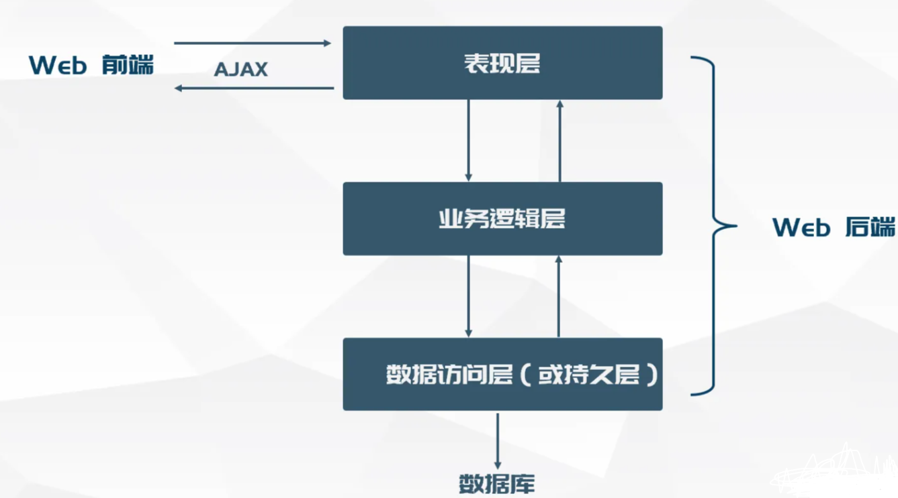
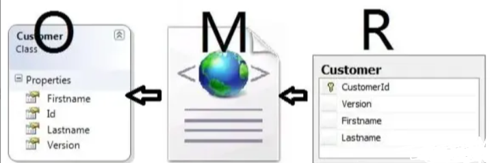
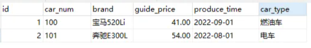
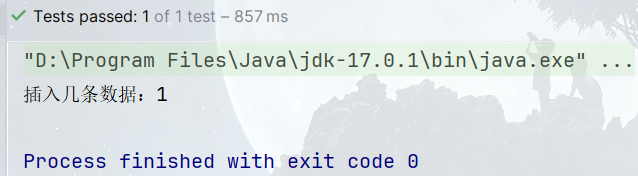
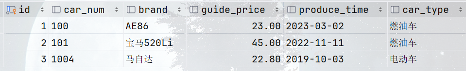

(语雀笔记地址：https://www.yuque.com/dujubin/ltckqu/pozck9?# 密码：rs4n)(项目代码：prj-mybatis)

# Mybatis概述

------

###### 框架(framework)

```txt
·Java中的常用的框架：SSM三大框架：Spring+SpringMVC+MyBatis，SpringBoot、SpringCloud等；
·框架其实就是对通用代码的封装，是别人提前写好了一堆接口和类，我们可以在做项目的时候直接引入这些接口和类（引入框架），
    基于这些现有的接口和类进行开发，可以大大提高效率；
·框架一般都是以jar包的形式存在的，因为这些东西其实就是别人写好的一堆Java代码；
```

###### 三层架构：表现层、服务层、持久层；MyBatis其实就是将持久层（jdbc的代码）进行了通用代码的高级封装而已



#### SSM三大框架：Spring、SpringMVC、MyBatis

```txt
Spring：项目大管家，负责整个项目所有对象的创建以及维护对象和对象之间的关系
SpringMVC：将MVC模式体现的淋漓尽致，在这个基础上开发的项目一定是用了MVC架构模式的，SpringMVC框架已经把MVC架构给你搭建出来了
MyBatis：DAO层框架，jdbc代码封装（MyBatis/Spring Data/Hibernate）
```

###### 为什么需要MyBatis呢？因为jdbc有不足的地方：

```txt
1、sql语句写死到java代码中了，改SQL的话就要改Java代码，不灵活。。违背开闭原则OCP。
2、如果表字段很多，用set给?传值且将数据封装到JavaBean中都是非常繁琐的，需要写大量的、重复的代码，代码不美观很冗余。
3、将结果集封装成Java对象是繁琐的。
```

###### 这些能不能自动化？？？可以，通过MyBatis可以做到。

#### MyBatis：

##### MyBatis SQL Mapper Framework for Java（MyBatis SQL映射框架for Java），之前叫ibatis，它相较于jdbc的优点：

```txt
·支持定制化 SQL、存储过程、基本映射以及高级映射
·避免了几乎所有的 JDBC 代码中手动设置参数以及获取结果集
·支持XML开发，也支持注解式开发。[为了保证sql语句的灵活，所以mybatis大部分是采用XML方式开发]
·将接口和 Java 的 POJOs(Plain Ordinary Java Object，简单普通的Java对象)映射成数据库中的记录
·体积小好学：两个jar包，两个XML配置文件
·完全做到sql解耦合
·提供了基本映射标签
·提供了高级映射标签
·提供了XML标签，支持动态SQL的编写
```

###### ORM(对象关系映射)

```txt
O（Object）：JVM中的Java对象
R（Relational）：关系型数据库
M（Mapping）：将JVM中的Java对象映射到数据库表中的一行记录，或是将数据库表中一行记录映射成JVM中的一个Java对象
* MyBatis框架就是一个ORM框架，它可以做什么？它可以：Java对象 <----> 数据库表中的一条记录
* MyBatis是一个半自动化的ORM，因为MyBatis中的SQL语句需要程序员自己来写
* Hibernate是一个全自动化的ORM。使用Hibernate框架的时候，不需要程序员手动编写SQL，可以通过调方法自动生成，
    所以它是全自动化的ORM框架；
```



------

#### 开始之前，有一些准备工作：

###### 工具：

```txt
    工具版本：idea2023.3.2
    Navicat Premium：16
    mysql：8.0.36

    依赖：
    MyBatis：3.5.10
    mysql驱动：8.0.30
    jdk：17
    junit：5.10.2
```

###### 准备数据库表：(使用navicat for mysql工具建表)

```txt
汽车表t_car，字段包括：
    id：主键（自增）【bigint】
    car_num：汽车编号【varchar(255)】
    brand：品牌【varchar(255)】
    guide_price：厂家指导价【decimal类型，专门为财务数据准备的类型】
    produce_time：生产时间【char(10)，年月日即可，'2022-10-11'】
    car_type：汽车类型（燃油车、电车、氢能源）【varchar(255)】
```


###### 使用navicat for mysql工具向t_car表中插入两条数据，如下：



------

### 开始第一个MyBatis程序

###### 首先打开idea新建一个空的工程，然后新建一个maven的模块，设置打包方式为jar（因为封装的是JDBC），引入3个依赖；开始我的第一个mybatis程序

##### 1、在resources目录下创建一个mybatis的核心配置文件：mybatis-config.xml，内容如下：（也可以去mybatis官网拷贝）

###### （框架一般都有核心配置文件；文件名和存放位置都不是必须的，不过一般都是mybatis-config在类路径下，这是规范）

```xml
<?xml version="1.0" encoding="UTF-8" ?>
<!DOCTYPE configuration
        PUBLIC "-//mybatis.org//DTD Config 3.0//EN"
        "http://mybatis.org/dtd/mybatis-3-config.dtd">
<configuration>
    <environments default="dev">
        <environment id="dev">
            <transactionManager type="JDBC"/>
            <dataSource type="POOLED">
                <property name="driver" value="com.mysql.cj.jdbc.Driver"/>
                <property name="url" value="jdbc:mysql://localhost:3306/test"/>
                <property name="username" value="root"/>
                <property name="password" value="a123456789"/>
            </dataSource>
        </environment>
    </environments>
</configuration>
```

###### mybatis中有两个核心的配置文件，都在resources下：

```txt
第一个就是：mybatis-config.xml，该配置文件是mybatis的全局配置信息，只有一个；最好就用这个名字，也可以改。
（后面spring整合开发可以没有该文件，配置全放在spring配置文件中）
第二个配置文件叫：XxxxMapper.xml，该配置文件专门用来编写SQL语句的，一个表一个。如：UserMapper.xml对应t_user表
```

##### 2、在resources下编写CarMapper.xml配置文件：（重点，里面是sql）

```xml
<?xml version="1.0" encoding="UTF-8" ?>
<!DOCTYPE mapper
        PUBLIC "-//mybatis.org//DTD Mapper 3.0//EN"
        "http://mybatis.org/dtd/mybatis-3-mapper.dtd">
<mapper namespace="safsafdas">
    <!--其中这个namespace先随便写-->
    <!--我们在里面编写SQL语句：（先来个固定的sql）
        id是这条sql语句的唯一表示，这个id就代表了这条sql语句；sql语句最后结尾可以不加分号“;” -->
    <insert id="insertCar">
        insert into t_car(id,car_num,brand,guide_price,produce_time,car_type)
        values(null,'1003','梅赛德斯奔驰',55.00,'2022-06-01','燃油车')
    </insert>
</mapper>
```

##### 3、将CarMapper.xml配置文件关联到mybatis-config.xml核心配置文件中：（告诉MyBatis你的sql在哪）

```xml
<!--mybatis-config.xml默认从当前所在的类路径下开始找资源-->
<mappers>
    <!--resource表示从类的根路径下开始找资源，还有其他后面再说-->
    <mapper resource="CarMapper.xml"/>
</mappers>
```

##### 4、用junit5编写mybatis测试程序：（insert语句就用SqlSession对象的insert方法，方法参数是sqlId，其他的也类似）

```java
@Test
public void testFirst() throws FileNotFoundException {
//创建一个StringSessionFactoryBuilder对象，创建该对象目的是，通过它的build方法去解析mybatis核心配置文件，然后将其中信息封装到SqlSessionFactory对象中
    SqlSessionFactoryBuilder factoryBuilder = new SqlSessionFactoryBuilder();
    SqlSessionFactory factory = factoryBuilder.build(Thread.currentThread().getContextClassLoader().getResourceAsStream("mybatis-config.xml"));
//        SqlSession对象类似于JDBC中的Connection对象
    SqlSession sqlSession = factory.openSession();
//        执行sql。这个"insertCar"必须是sql的id
    int count = sqlSession.insert("insertCar");
    System.out.println("插入几条数据：" + count);
//        提交
    sqlSession.commit();//同样也有sqlSession.rollback()方法
//        关闭资源
    sqlSession.close();
}
```

运行结果：




###### 关于以上代码的说明：

```txt
·在mybatis中，负责执行sql语句的对象叫：SqlSession；
·SqlSession是专门执行sql语句的，是一个java程序和数据库之间的一次会话，需要关闭；多次操作数据库，就得有多个sqlsession；
·要想获取SqlSession对象，必须先获取SqlSessionFactory对象，通过SqlSessionFactory工厂的openSession()来生产一个SqlSession对象；每次操作数据库都用新的对象；
·怎么获取SqlSessionFactory对象呢？需要首先获取SqlSessionFactoryBuilder对象，通过该对象的build方法，传进去一个
    InputStream流来获取，流里面是mybatis的核心配置文件；一般情况下是一个数据库对应一个SqlSessionFactory对象，该对象一般不会扔掉。而SqlSessionFactoryBuilder对象就临时拿来解析核心配置文件，用完就扔；
·怎么获取SqlSessionFactoryBuilder对象呢？直接new；
·java程序和mysql程序之间建立了通信，所以最后记得关闭会话，也可以说是释放资源：sqlSession.close();
·mybatis配置文件中，目前采用的事务管理器是JDBC，默认是不自动提交的，需要手动提交：sqlSession.commit();
·如果sqlSessionFactory.openSession(true)时传入了一个true，那么底层会执行conn.setAutoCommit(true)，没有关闭自动提交，
此时执行一个sql就直接提交了；所以不建议这样做，不安全；默认false是关闭了自动提交的。
```

###### 还有一些小细节：

```txt
·获取流也可以用Resources.getResourceAsStream()方法来获取，是一个Mybatis工具类，以下方式都可以，它底层也是用的以下的方式：
	java.lang包下的ClassLoader类加载器的静态方法：ClassLoader.getSystemClassLoader()来获取classpath的类加载器，
    然后使用类加载器的getResourceAsStream("")方法来获取一个流，返回inputstream，参数URL默认从src下开始找（类路径下），
    也就是maven项目里的java包下
	（也可以用，Thread.currentThread().getContextClassLoader().getResourceAsStream("mybatis-config.xml")
    来获取系统当前的类加载器）
·CarMapper.xml配置文件里的mapper标签
    <mapper resource="CarMapper.xml"/>
    标签里面这个resource属性：它是以类路径src下加载资源的；值如果是url，那么就以计算机中的绝对路径的方式加载资源的，
    并且绝对路径前要加上：file:///绝对路径，如：file:///d:/CarMapper.xml
    建议使用resource，url这种方式不太好，因为绝对路径的方式移植性太差；还可以用class属性的方式，这个后面会讲；
·关于Mapper文件中的namespace属性：翻译为“命名空间”，这个命名空间主要是为了防止sqlId冲突的；核心配置文件中如果关联多个Mapper	文件，为了防止sql语句的id冲突，通常每个Mapper文件都有不同的namespace，用namespace.sqlId就可以防止冲突；
```

------

###### 我们想看到mybatis具体执行的sql语句，或执行细节怎么办？

#### 引入logback日志框架：

- ##### 可以启用mybatis中集成的日志组件，只需要在mybatis-config.xml文件中添加以下配置即可：

  ```xml
  <settings>
      <!-- 启用标准日志组件 -->
      <setting name="logImpl" value="STDOUT_LOGGING"/>
  </settings>
  ```

- ##### 它自带的配置不够灵活，我们也可以集成其他的日志组件，例如：log4j，logback等。logback是目前日志框架中性能较好的，较流行的，所以我们选它。引入logback的步骤：

  ###### （如果不使用mybatis自带的日志框架，setting设置日志组件的步骤，可有可无，mybatis会通过配置文件来自动识别。想加的话就将value属性值写为你用的日志框架所遵循的日志规范，logback的是【SLF4J】规范）

  1. logback日志框架实现了SLF4J规范（沙拉风：日志门面，日志标准），引入logback依赖：

     ```xml
     <dependency>
         <groupId>ch.qos.logback</groupId>
         <artifactId>logback-classic</artifactId>
         <version>1.2.11</version>
         <scope>test</scope>
     </dependency>
     ```

  2. 类路径下新建logback.xml文件（必须），内容为：

     ```xml
     <?xml version="1.0" encoding="UTF-8"?>
     
     <configuration debug="false">
         <!-- 控制台输出 -->
         <appender name="STDOUT" class="ch.qos.logback.core.ConsoleAppender">
             <encoder class="ch.qos.logback.classic.encoder.PatternLayoutEncoder">
                 <!--格式化输出：%d表示日期，%thread表示线程名，%-5level：级别从左显示5个字符宽度%msg：日志消息，%n是换行符-->
                 <pattern>%d{yyyy-MM-dd HH:mm:ss.SSS} [%thread] %-5level %logger{50} - %msg%n</pattern>
             </encoder>
         </appender>
         <!-- 按照每天生成日志文件 -->
         <appender name="FILE" class="ch.qos.logback.core.rolling.RollingFileAppender">
             <rollingPolicy class="ch.qos.logback.core.rolling.TimeBasedRollingPolicy">
                 <!--日志文件输出的文件名-->
                 <FileNamePattern>${LOG_HOME}/TestWeb.log.%d{yyyy-MM-dd}.log</FileNamePattern>
                 <!--日志文件保留天数-->
                 <MaxHistory>30</MaxHistory>
             </rollingPolicy>
             <encoder class="ch.qos.logback.classic.encoder.PatternLayoutEncoder">
                 <!--格式化输出：%d表示日期，%thread表示线程名，%-5level：级别从左显示5个字符宽度%msg：日志消息，%n是换行符-->
                 <pattern>%d{yyyy-MM-dd HH:mm:ss.SSS} [%thread] %-5level %logger{50} - %msg%n</pattern>
             </encoder>
             <!--日志文件最大的大小-->
             <triggeringPolicy class="ch.qos.logback.core.rolling.SizeBasedTriggeringPolicy">
                 <MaxFileSize>100MB</MaxFileSize>
             </triggeringPolicy>
         </appender>
     
         <!--mybatis log configure-->
         <logger name="com.apache.ibatis" level="TRACE"/>
         <logger name="java.sql.Connection" level="DEBUG"/>
         <logger name="java.sql.Statement" level="DEBUG"/>
         <logger name="java.sql.PreparedStatement" level="DEBUG"/>
     
         <!-- 日志输出级别,logback日志级别包括五个：TRACE < DEBUG < INFO < WARN < ERROR -->
         <root level="DEBUG">
             <appender-ref ref="STDOUT"/>
             <appender-ref ref="FILE"/>
         </root>
     
     </configuration>
     ```


------

#### 获取SqlSession的步骤太繁琐了，写一个MyBatis工具类：

```java
public class SqlSessionUtil {
    //构造方法私有化
    private SqlSessionUtil() {}
    //静态变量
    private static SqlSessionFactory sqlSessionFactory = null;
    //静态代码块，类加载时执行
    static{
        try {
            SqlSessionFactoryBuilder sqlSessionFactoryBuilder = new SqlSessionFactoryBuilder();
            sqlSessionFactory = sqlSessionFactoryBuilder.build(Resources.getResourceAsStream("mybatis-config.xml"));
        } catch (IOException e) {
            e.printStackTrace();
        }
    }
    public static SqlSession getSession(){
        return sqlSessionFactory.openSession();
    }
}
```

#### 测试工具类和logback框架：

###### 我们之前在Mapper文件中将sql写死了，接下来用占位符的方式写sql：

```txt
MyBatis中的占位符有两种，#{}和${}，前者底层是PreparedStatement，后者底层是Statement会存在SQL注入的风险；除了特殊需求，一般都用#{}
parameterType用于指定传进来的参数类型，
```

###### 这里用#{}，parameterType属性用于指定传过来的参数类型，虽然可以省略，mybatis可以自动识别参数，但是还是建议显示的加上；给占位符传值这里先使用Map<String,Object>类型，取值写map的key：（这里map的key必须是String；还可以用其他类型传值）

```xml
<update id="updateCar" parameterType="java.util.Map">
    update t_car set car_num=#{carNum}, brand=#{brand}, guide_price=#{guidePrice}, produce_time=#{produceTime}, car_type=#{carType}
    where id=#{id}
</update>
```

###### 测试程序：（update修改）

```java
@Test
public void testUtil() {
    SqlSession sqlSession = SqlSessionUtil.openSession();
    //Map的key必须是String的
    HashMap<String, Object> map = new HashMap<>();
    map.put("id", 3);
    map.put("carNum", "1004");
    map.put("brand", "马自达");
    map.put("guidePrice", 22.80);
    map.put("prouceTime", "2019-10-03");
    map.put("carType", "电动车");

//        执行sql。第二个参数传个map进去
    int count = sqlSession.update("updateCar", map);
    System.out.println("更新了的数据条数为：" + count);
//        手动提交，默认采用jdbc不会自动提交
    sqlSession.commit();
//        关闭资源
    sqlSession.close();
}
```

###### 运行成功：



##### 除了用map来进行传参，也可以用pojo类传参；（新建一个pojo类Car，里面遵循pojo的规范：类公开、属性私有化、无参构造、getter和setter，实现序列化接口，重写hashCode和equals，重写toString）

- ###### 用pojo类在Mapper中写个增加：（注意pojo中必须有对应的getter方法）

  ```xml
  <insert id="insertByPojo" parameterType="com.itheima.pojo.Car">
      insert into t_car values(null, #{carNum}, #{brand}, #{guidePrice}, #{produceTime}, #{carType})
  </insert>
  ```

- ###### 测试代码：(insert新增)

  ```java
  @Test
  public void testInsertByPojo() {
      SqlSession sqlSession = SqlSessionUtil.openSession();
      Car car = new Car(null, "1110", "红旗", 32.8, "2023-09-21", "燃油车");
  
  //        执行sql。第二个参数传pojo对象
      int count = sqlSession.insert("insertByPojo", car);
      System.out.println("更新了的数据条数为：" + count);
  //        手动提交，默认采用jdbc不会自动提交
      sqlSession.commit();
  //        关闭资源
      sqlSession.close();
  }
  ```

#### 删除delete：

- ###### 在Mapper中写个删除：

  ```xml
  <delete id="deleteByCarNum">
      delete from t_car where car_num = #{suibianxie}
  </delete>
  ```

- ###### 测试代码：（只有一个参数时不用任何封装直接在方法内传值即可，因为第二个参数是Object类型的）

  ```java
  @Test
  public void testDeleteByCarNum() {
      SqlSession sqlSession = SqlSessionUtil.openSession();
  
  //        执行sql。第二个参数传pojo对象
      int count = sqlSession.delete("deleteByCarNum", "1110");
      System.out.println("更新了的数据条数为：" + count);
  //        手动提交，默认采用jdbc不会自动提交
      sqlSession.commit();
  //        关闭资源
      sqlSession.close();
  }
  ```

#### 查询select：（查询会有一条结果集，我们看MyBatis是怎么处理查询结果集的）

- ##### selectOne查询一条数据：（一定要指定resultType结果集，否则MyBatis不知道返回结果拿什么类型给你封装）

  ```xml
  <select id="selectCarById" resultType="com.powernode.mybatis.pojo.Car">
    select * from t_car where id = #{id}
  </select>
  ```

  ```java
  @Test
  public void testSelectCarById(){
      // 获取SqlSession对象
      SqlSession sqlSession = SqlSessionUtil.openSession();
      // 执行SQL语句；由于CarMapper中指定了returnType的类型，所以这里返回的是Car类型，否则就是Object
      Car car = sqlSession.selectOne("selectCarById", 1);
      System.out.println(car);
  }
  ```

  ###### 仔细观察控制台的日志信息，不难看出，虽然查询出了结果，但是奇怪的是返回的Car对象，只有id和brand两个属性有值，其它属性的值都是null，这是怎么回事？

  ###### 我们来观察一下查询结果列名和Car类的属性名是否能一一对应：

  ###### 查询结果集的列名：id, car_num, brand, guide_price, produce_time, car_type

  ###### Car类的属性名：id, carNum, brand, guidePrice, produceTime, carType

  ###### 通过观察发现：只有id和brand是一致的，其他字段名和属性名对应不上，这就是导致null的原因；我们尝试在sql语句中使用as关键字来给查询结果列名起别名，sql这样写：

  ```xml
  <select id="selectCarById" resultType="com.itheima.pojo.Car">
      select
          id, car_num as carNum, brand, guide_price as guidePrice, produce_time as produceTime, car_type as carType
      from
          t_car
      where
          id = #{id}
  </select>
  ```

  ###### 然后结果就可以正常显示了：（**当然还有其它解决方案，我们后面再看**）

  ```java
  Car{id=1, carNum='100', brand='AE86', guidePrice=23.0, produceTime='2023-03-02', carType='燃油车'}
  ```

- ##### selectList查询多条数据：

  ```xml
  <!--虽然结果是List集合，但是resultType属性需要指定的是List集合中元素的类型。-->
  <select id="selectCarAll" resultType="com.powernode.mybatis.pojo.Car">
    <!--记得使用as起别名，让查询结果的字段名和java类的属性名对应上。-->
    select
      id, car_num as carNum, brand, guide_price as guidePrice, produce_time as produceTime, car_type as carType
    from
      t_car
  </select>
  ```

  ```java
  @Test
  public void testSelectCarAll(){
      // 获取SqlSession对象
      SqlSession sqlSession = SqlSessionUtil.openSession();
      // 执行SQL语句
      List<Car> cars = sqlSession.selectList("selectCarAll");
      // 输出结果
      cars.forEach(car -> System.out.println(car));
  }
  ```

  结果：

  ```java
  Car{id=1, carNum='100', brand='AE86', guidePrice=23.0, produceTime='2023-03-02', carType='燃油车'}
  Car{id=2, carNum='101', brand='宝马520Li', guidePrice=45.0, produceTime='2022-11-11', carType='燃油车'}
  Car{id=3, carNum='1004', brand='马自达', guidePrice=22.8, produceTime='2019-10-03', carType='电动车'}
  ```

