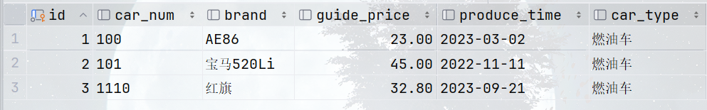
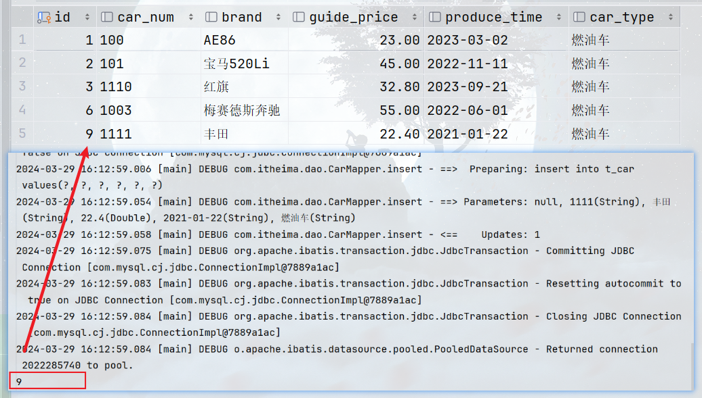

## 关于MyBatis的配置文件

```xml
<?xml version="1.0" encoding="UTF-8" ?>
<!DOCTYPE configuration
        PUBLIC "-//mybatis.org//DTD Config 3.0//EN"
        "http://mybatis.org/dtd/mybatis-3-config.dtd">
<configuration>
    <environments default="test">
        <environment id="test">
            <transactionManager type="JDBC"/>
            <dataSource type="POOLED">
                <property name="driver" value="com.mysql.cj.jdbc.Driver"/>
                <property name="url" value="jdbc:mysql://localhost:3306/powernode"/>
                <property name="username" value="root"/>
                <property name="password" value="root"/>
            </dataSource>
        </environment>
    </environments>
    <mappers>
        <mapper resource="CarMapper.xml"/>
    </mappers>
</configuration>
```

- MyBatis的核心配置文件是dtd约束，文件的根标签是<configuration>，配置都在该标签中配置

- **<environments>**环境标签，里面配置多个数据库环境<environment>，default属性：表示默认使用的是哪个环境，值是环境标签<environment>的id。也可以在SqlSessionFactoryBuilder对象的build()方法解析配置文件时，第2个参数指定使用配置文件中的环境id。

- **<environment>**标签配置具体的数据库环境（**主要包括**：**事务管理器的配置** + **数据源的配置**），一个**SqlSessionFactory**对应一个数据库，一个数据库对应一个<environment>环境标签

  - **<transactionManager>**标签用于配置该数据库环境的事务管理器，通过type属性指定事务管理器具体使用什么方式，可选值两个：
  - **JDBC**：使用JDBC原生的事务管理机制。底层通过**conn.setAutoCommit(false);**关闭了全局的自动提交，所以需要手动提交**sqlSession.commit();**，但是注意：如果配置了JDBC来管理事务，那么就不要写**sqlSessionFactory.openSession(true)**
    
  - **MANAGED（默认）**：交给第三方容器（如Spring）来管理事务，MyBatis不管了。此时如果没有第三方来管理，那么事务就处于没人管的状态，默认**执行一条DML语句就提交一次**。（注意：如果你正在使用 Spring + MyBatis，则没有必要配置事务管理器，因为Spring会使用自带的事务管理器来覆盖Mybatis中的配置）
  
- **<dataSource>**指定该数据库环境使用的**数据源**，也就是连接数据库的信息，type属性的可选值3个（根据不同的值，内部的property标签可以写不同的name属性，通常都有`driver、url、username、password`）：
    - **UNPOOLED**：不使用数据库连接池技术，每一次openSession()都创建一个新的Connection连接对象
  - **POOLED**：使用mybatis自己的数据库连接池（数据源），openSession()是从数据源中获取链接，关闭时将连接还给数据源而不是关闭
    - **JNDI**：使用第三方web容器中的数据库连接池，当然只有web项目中才可以设置为JNDI；这种方式给了我们可以使用第三方连接池的接口。如果想使用dbcp、c3p0、druid（德鲁伊）等，需要使用这种方式
  
  - <dataSource>内部的<property>标签通过name和value属性来进行**数据库连接池**的配置

- <mappers>在mappers标签中可以配置多个sql映射文件（Mapper文件）的路径。

  - <mapper>标签通过配置不同的属性，来引入某个Mapper文件。

    - resource属性：使用的相对于类路径的方式
    - url属性：使用绝对路径的方式，如果是本地绝对路径，前面需要加*file:///*

    （mapper中还有其他属性值，后面再说）

###### *以上是关于MyBatis核心配置文件的简单说明*

------

#### 如果在<dataSource>标签中使用了Mybatis中的连接池，那么<property>标签中的name属性就可以这样写：（其他的连接池这些也都能设置，只是名字不同而已）

```xml
<dataSource type="POOLED">
    <property name="driver" value="com.mysql.cj.jdbc.Driver"/>
    <property name="url" value="jdbc:mysql://localhost:3306/test"/>
    <property name="username" value="root"/>
    <property name="password" value="a123456789"/>
    <!-- 除了以上4个基本的之外，name属性还可以这样写 -->
    <!-- 池中最多的存活的连接数量，就是连接池的链接数量。默认值10 -->
    <property name="poolMaximumActiveConnections" value="3"/>
    <!-- 池中最多的空闲连接数量。默认值5 -->
    <property name="poolMaximumIdleConnections" value="1"/>
    <!-- 强行回归池的时间。默认值20秒 -->
    <property name="poolMaximumCheckoutTime" value="20000"/>
    <!-- 当无法获取到空闲连接时，每隔20秒打印一次日志并重新获取链接，避免因代码配置有误，导致傻等 -->
    <property name="poolTimeToWait" value="20000"/>
</dataSource>
```

###### 当然，还有其他属性。对于连接池来说，以上几个属性比较重要

#### MyBatis配置文件中还可以引入外部的properties属性配置文件：(在用的地方通过${}来使用)

```xml
<!-- 引入外部属性资源文件，类似于Mapper，resource是类路径引入，url是绝对路径引入 -->
<properties resource="jdbc.properties">
    <!-- 里面可以继续通过property标签来配置properties文件中没有的配置项 -->
    <property name="jdbc.username" value="root"/>
    <property name="jdbc.password" value="a123456789"/>
</properties>
```

------

### MyBatis对象作用域：

- ##### SqlSessionFactoryBuilder：

  > 这个类可以被实例化、使用和丢弃，一旦用它创建过了SqlSessionFactory后，SqlSessionFactoryBuilder就不再需要了，我们就是用下它来解析核心配置文件而已。因此SqlSessionFactoryBuilder对象的最佳作用域是局部作用域。如果还需要解析xml配置文件，你可以重新创建多个SqlSessionFactoryBuilder对象。它底层是dom方式解析的xml，所以最好还是不要一直保留着它，以保证所有的XML解析资源可以被释放给更重要的事情。

- ##### SqlSessionFactory：

  > SqlSessionFactory一旦被创建就应该在应用的运行期间一直存在，没有任何理由丢弃它或重新创建另一个实例。该对象在运行期间不要重复创建多次，多次重建SqlSessionFactory被视为一种代码“坏习惯”。因此SqlSessionFactory的最佳作用域是“应用域”。比如，我们通过使用单例模式或者静态单例模式来保证该对象只能被创建一个。一个SqlSessionFactory对象就对应了一个数据库，一个数据库对应一个<environment>环境，所以它就代表了一个数据库环境。

- ##### SqlSession：

  > 每个线程都应该有它自己的 SqlSession 实例。SqlSession 的实例不是线程安全的，因此是不能被共享的，所以它的最佳的作用域是请求或方法作用域。绝对不能将 SqlSession 的实例作为类的静态或实例成员，因为堆和方法区只有一个，多线程环境下会存在线程安全问题。也绝不能将 SqlSession 实例的引用放在任何类型的托管作用域中，比如 Servlet 框架中的 HttpSession会话域中。可以将它放在类似于 ThreadLocal 容器中，同一个线程共享一个SqlSession。如果你现在正在使用一种 Web 框架，你可以将 SqlSession 放在一个和 HTTP 请求域中。换句话说，每次收到 HTTP 请求，就可以打开一个SqlSession，返回一个响应后，就关闭它。这个关闭操作很重要，为了确保每次都能执行关闭操作，你应该把这个关闭操作放到finally 代码块中。可以这样关闭SqlSession对象：
  >
  > ```java
  > try (SqlSession session = sqlSessionFactory.openSession()) {
  >   // 你的应用逻辑代码
  > }
  > ```

------

### Javassist的使用

##### 在我们业务开发中，我们经常会写这样的XxxMapperImpl这样的dao层实现类，如下：

```java
public class CarMapperImpl implements CarMapper {
    @Override
    public Car selectById(Long id) {
        SqlSession sqlSession = SqlSessionUtil.openSession();
        Car car = sqlSession.selectOne("selectById", id);
        sqlSession.close();
        return car;
    }

    @Override
    public int update(Car car) {
        SqlSession sqlSession = SqlSessionUtil.openSession();
        int count = sqlSession.update("update", car);
        sqlSession.commit();
        sqlSession.close();
        return count;
    }
}
```

###### 我们知道，dao层实现类的代码逻辑是和业务之间没有任何关系，而且这个dao实现类中的方法，代码很固定。任何dao层实现类，只要确定了dao接口、dao实现类中调用哪个sql，dao实现类的写法基本就确定了。那么这种固定的DAO层实现类能不能让MyBatis自动生成呢？

###### 当然可以，但用MyBatis自动生成dao实现类的功能之前，我们先来看一下内部的原理，它底层用了**javassist**：（以下来自百度百科）

> - Javassist是一个开源的分析、编辑和**创建Java字节码的类库**。是由东京工业大学的数学和计算机科学系的 Shigeru Chiba （千叶 滋）所创建的。它已加入了开放源代码JBoss 应用服务器项目，通过使用Javassist对字节码操作为JBoss实现动态"AOP"框架；Mybatis底层就是用的这个。
>
>
> - Javassist是可以在jvm运行时，动态编辑Java字节码的类库。它可以在Java程序运行时定义一个新的类，并加载到JVM中；还可以在JVM加载时修改一个类文件。Javassist使用户不必关心字节码相关的规范也是可以编辑类文件的。
>
>
> - 在Javassist中每个需要编辑的class都对应一个CtCLass实例，CtClass的含义是编译时的类（compile time class），这些类会存储在Class Pool中（Class poll是一个存储CtClass对象的容器）。CtClass中的CtField和CtMethod分别对应Java中的字段和方法。通过CtClass对象即可对类新增字段和修改方法等操作了。

###### 其实Javassist底层就是通过反射机制完成的，使用方式：（当然还有其他的动态生成类的类库如CGLIB，后面再说）

1. ##### 要使用javassist，首先引入jar包依赖：（mybatis中也关联了javassist的jar包，所以如果有mybatis也可以不引入该依赖）

   ```xml
   <dependency>
     <groupId>org.javassist</groupId>
     <artifactId>javassist</artifactId>
     <version>3.29.1-GA</version>
   </dependency>
   ```

2. ##### Javassist示例代码：

   ```java
   public class JavassistTest {
       /**
        * 这是一个使用javassist依赖，在内存中动态生成class字节码执行的例子
        */
       @Test
       public void testJavassist() throws Exception {
           // 获取类池（生成类的）
           ClassPool pool = ClassPool.getDefault();
           // 通过类池创建一个空类
           CtClass ctClass = pool.makeClass("com.itheima.javassist.Test");
   
           // 给空类加一个属性name
           CtField nameField = new CtField(pool.get("java.lang.String"), "name", ctClass);
           // 设置name属性的访问权限为private
           nameField.setModifiers(Modifier.PRIVATE);
           // 设置初始值并将属性加到空类中
           ctClass.addField(nameField, CtField.Initializer.constant("zs"));
   
           // 给name属性生成并加上 getter、setter
           ctClass.addMethod(CtNewMethod.setter("setName", nameField));
           ctClass.addMethod(CtNewMethod.getter("getName", nameField));
   
           // 创建printName()方法；参数是：1.返回值类型 2.方法名 3.形式参数列表 4.所属类
               //造方法也可以直接自己写所有的代码：CtMethod.make("方法的所有代码", ctClass);
           CtMethod ctMethod = new CtMethod(CtClass.voidType, "printName", new CtClass[]{}, ctClass);
           // 设置方法的修饰符列表
           ctMethod.setModifiers(Modifier.PUBLIC);
           // 设置方法体
           ctMethod.setBody("{System.out.println(name);}");
           // 将方法加到类上
           ctClass.addMethod(ctMethod);
   
   
           // 添加无参构造
           CtConstructor cons = new CtConstructor(new CtClass[]{}, ctClass);
           cons.setBody("{}");
           ctClass.addConstructor(cons);
   
           // 添加有参构造
           cons = new CtConstructor(new CtClass[]{pool.get("java.lang.String")}, ctClass);
           // $0就是this，$1,$2,$3... 代表方法的实参
           cons.setBody("{$0.name = $1;}");
           ctClass.addConstructor(cons);
   
           //这里会将这个运行时创建的类编译为.class文件
           ctClass.writeFile("./");
           /**
            * 需要注意的是 ClassPool 会在内存中维护所有被它创建过的 CtClass，当 CtClass 数量过多时，
            * 会占用大量的内存，API中给出的解决方案是：有意识的调用CtClass的detach()方法以释放内存。
            */
   
           // toClass：通过类加载器加载该CtClass
           Class<?> clazz = ctClass.toClass();
   //        通过反射创建该类对象并执行方法
           Object obj = clazz.newInstance();
           Method printName = clazz.getDeclaredMethod("printName");
           printName.invoke(obj);
       }
   }
   ```

   > 注意：第一次执行会出现问题，这是因为jdk版本过高导致的。在JDK 9之后，Java引入了一个新特性叫做“模块化系统”，通过该特性，Java实现了更加严格的访问控制，以提高Java应用程序的安全性和稳定性。解决方法：此时需要配置两个参数，虚拟机参数和环境变量参数，分别是：
   > --add-opens java.base/java.lang=ALL-UNNAMED
   > --add-opens java.base/sun.net.util=ALL-UNNAMED

##### 了解了Javassist之后，接下来才是重头戏，我们就可以通过Javassist来动态生成Dao实现类了，不用写Dao类了，只写接口就行

###### 使用Javassist生成MapperImpl类，代码：

```java
public class GenerateDao {
    public static Object getMapper(SqlSession sqlSession, Class daoInterface) {
        Object ret = null;
//        创建类池，通过类池来造Mapper实现类
        ClassPool pool = ClassPool.getDefault();
//        造一个CarMapperImpl实现类；此时需要知道你给哪个接口造实现类吧，所以需要将接口作为参数传进来
        CtClass ctClass = pool.makeClass(daoInterface.getPackageName() + ".impl." + daoInterface.getSimpleName() + "Impl");
//        让CarMapperImpl实现CarMapper接口
        CtClass ctInterface = pool.makeClass(daoInterface.getName());
        ctClass.addInterface(ctInterface);
//        让CarMapperImpl实现接口的所有方法，否则运行就出问题了
        Method[] methods = daoInterface.getDeclaredMethods();
        Arrays.stream(methods).forEach(method -> {
            StringBuilder methodStr = new StringBuilder();
            //方法的修饰符列表
            methodStr.append("public ");
            String returnTypeName = method.getReturnType().getName();
            //方法的返回值类型
            methodStr.append(returnTypeName);
            methodStr.append(" ");
            //方法名
            String methodName = method.getName();
            methodStr.append(methodName);
            methodStr.append("(");
            //方法的形参
            Class<?>[] parameterTypes = method.getParameterTypes();
            for (int i = 0; i < parameterTypes.length; i++) {
                methodStr.append(parameterTypes[i].getName());
                methodStr.append(" arg");
                methodStr.append(i);
                if (i != parameterTypes.length - 1) {
                    methodStr.append(",");
                }
            }
            methodStr.append("){");
            /**
             * 方法体当中的代码怎么写？我们来看下CarMapperImpl类是怎么写的；我们发现：
             *      第一行是固定的【SqlSession sqlSession = SqlSessionUtil.openSession();】
             *      一定要写全名，否则还得导包啥的；
             */
            methodStr.append("org.apache.ibatis.session.SqlSession sqlSession = com.itheima.utils.SqlSessionUtil.openSession();");
            /**
             * 接下来就不同了，每个方法会对应不同的sql语句，根据sql语句的标签类型来执行selectOne或insert等方法；
             * 也就是说，不同方法对应的sqlId，决定了该方法的方法名是怎样的，所以需要获取，该方法对应的sqlId。
             * sqlId怎么获取呢？一个方法对应一个sql，将来哪个方法中调用哪个mapper文件的哪个sql，这个对应关系是
             * 程序员到时候随意指定的，都不固定那怎么办？所以要制定规范来解决这个问题：（要想让我给你自动生成Mapper实现类，就要遵循我的规范）
             * 一张表对应一个Mapper(namespace)文件，也对应一个Mapper接口和实现类；Mapper文件中的每个sql
             * 都会一一对应在Mapper实现类中的不同方法上，通过不同方法的调用去完成sql的执行。
             * 所以Mybatis规定：要让我们自动生成的MapperImpl实现类，以后namespace和sqlId不能随便写了，
             * 既然它们是一一对应的关系，每个namespace都对应一个Mapper接口，每个sql对应Mapper接口中的一个方法，所以规定：
             * namespace必须和接口全名保持一致；sqlId必须和接口中的方法名保持一致；
             * 这样一但我们遵循了这样的规范，以后实现类不用写了，接口写好，sql写好，名字之间保持一致，实现类代码MyBatis帮我们自动补全。
             * (注意：namespace必须和接口全名保持一致；sqlId必须和接口中的方法名保持一致)
             */
            //sqlId就有了
            String sqlId = daoInterface.getName() + "." + methodName;
            // 根据sqlId来获取对应的sql标签，需要用SqlSession对象来拿到Mapper文件的内容
            String sqlCommondTypeName = sqlSession.getConfiguration().getMappedStatement(sqlId).getSqlCommandType().name();
                //如果是<SELECT>标签，那么执行selectOne()方法；目前只简单写一个查询一条的，参数也只接收一个
            if ("SELECT".equals(sqlCommondTypeName)) {//这里的obj的类型必须要强转，sqlSession中的泛型机制只能在编译时，而javassist生成的是class文件
                methodStr.append(returnTypeName +" obj = (com.itheima.pojo.Car)sqlSession.selectOne(\"" + sqlId + "\", arg0);");
                methodStr.append("sqlSession.close();");
                methodStr.append("return obj;");
                //如果是<UPDATE>标签，执行update方法
            } else if ("UPDATE".equals(sqlCommondTypeName)) {
                methodStr.append("int count = sqlSession.update(\"" + sqlId + "\", arg0);");
                methodStr.append("sqlSession.commit();sqlSession.close();");
                methodStr.append("return count;");
            }
            methodStr.append("}");
            //方法体拼接完成
//            System.out.println(methodStr);
/*
public int update(com.itheima.pojo.Car arg0){
    org.apache.ibatis.session.SqlSession sqlSession = com.ithemia.utils.SqlSessionUtil.openSession();
    int count = sqlSession.update("com.itheima.dao.CarMapper.update", arg0);
    return count;
}
public com.itheima.pojo.Car selectById(java.lang.Long arg0){
    org.apache.ibatis.session.SqlSession sqlSession = com.ithemia.utils.SqlSessionUtil.openSession();
    com.itheima.pojo.Car obj = sqlSession.selectOne("com.itheima.dao.CarMapper.selectById", arg0);
    return obj;
}
 */
            try {
                // 将方法造出来
                CtMethod ctMethod = CtMethod.make(methodStr.toString(), ctClass);
                // 将方法加上去
                ctClass.addMethod(ctMethod);
            } catch (CannotCompileException e) {
                throw new RuntimeException(e);
            }
        });
        //方法的字节码弄好了

        try{
            // 方法字节码装进jvm
            Class<?> aClass = ctClass.toClass();
            ret = aClass.newInstance();
        }catch (Exception e){
            e.printStackTrace();
        }
        return ret;
    }
}
```

###### 测试写的javassist动态代理mapper实现类的工具好不好用：

```java
public class CarMapperTest {
//    CarMapper carMapper = new CarMapperImpl();
    CarMapper carMapper = (CarMapper)GenerateDao.getMapper(SqlSessionUtil.openSession(), CarMapper.class);
    @Test
    public void testSelectById(){
        Car car = carMapper.selectById(1L);
        System.out.println(car);
    }
    @Test
    public void testUpdate(){
        int rows = carMapper.update(new Car(3L, "1110", "红旗", 32.8, "2023-09-21", "燃油车"));
        System.out.println(rows);
    }
}
```

###### 注意此时dao.impl包下并没有实现类：


###### 执行结果：




##### 确实好用。我们看下其中的重点：

> - 我们知道：一张表对应一个Mapper（namespace）文件，也对应一个Mapper接口和实现类；Mapper文件中的每个sql，都会一一对应Mapper实现类中的不同方法，通过不同方法去调用不同的sql完成的SQL语句的执行。
> - 但Mapper实现类中的方法，和Mapper文件中的sql语句，之间的对应关系是不确定的，是程序员写实现类的时候随意指定的。所以要让Mybatis自动生成MapperImpl实现类，就得告诉它Mapper接口中的哪个方法，对应要执行哪个SQL语句，让Mapper接口的方法和SQL语句一一对应起来。所以Mybatis规定：以后namespace和sqlId不能随便写了，既然它们是一一对应的关系，每个namespace（Mapper文件）都对应一个Mapper接口，每个sql对应Mapper接口中的一个方法。所以：namespace必须和Mapper接口全名保持一致，sqlId必须和接口中的方法名保持一致。
> - 这样我们只要遵循了这个规范，我们的SQL语句就和Mapper接口的方法实现了一一对应，Mybatis就知道了接口的实现类去执行哪个SQL可以实现对应的功能。以后很固定的Mapper实现类代码就不用自己写了。程序员将接口写好，sql写好，名字之间对应起来，实现类代码MyBatis帮我们自动写了，也就能通过SqlSession对象去执行对应的SQL了。

##### 重点：**namespace必须和Mapper接口全名保持一致**、**sqlId必须和接口中的方法名保持一致**

------

#### MyBatis中接口代理机制及使用：

好消息！！！其实以上javassist自动生成Mapper实现类的代码，mybatis内部已经实现了。直接调用以下代码即可获取dao接口的代理类：

```java
CarMapper carMapper = sqlSession.getMapper(CarMapper.class);//将来返回的mapper对象会放在spring容器中，这行代码也不用写了
carMapper.add();carMapper.delete();carMapper.select()...//直接调用接口中的方法即可，底层实现类还是调用的Sqlsession对象的方法
```

*我们用javassist写GenerateDao时用到了两个参数：SqlSession和接口，所以上面也需要这两个对象才可以生成Mapper实现类*

##### 以后我们只需要写好Mapper接口和sql语句，然后获取sqlSession对象，调用它的getMapper(CarMapper.class)传进去一个接口，此时就直接可以用接口方法来完成增删查改了。这就是MyBatis中的动态代理机制

------

### MyBatis小技巧

1. ##### typeAliases：

   - Mapper文件中的参数类型和返回值类型还得写全名，能不能只写简类名呢？可以通过在mybatis-config.xml中配置<typeAliases>标签来给类型起别名，如：

     ```xml
     <typeAliases>
       <!-- typeAlias可以写多个，type属性指定类型；alias属性指定别名，省略的话默认别名就是简类名Car，不分大小写 -->
       <typeAlias type="com.itheima.pojo.Car" alias="Car"/>
     </typeAliases>
     ```

   - 如果一个包下的类太多，每个类都要起别名，会导致typeAlias标签配置较多，所以mybatis用<package>包标签的方式，指定包名，该包下的所有类都自动起别名，别名就是简类名，不分大小写。如：

     ```xml
     <typeAliases>
       <package name="com.itheima.pojo"/><!-- 该标签同样可以有多个 -->
     </typeAliases>
     ```
     
     > 实际上Mybatis中内置了许多常用类的别名，java.lang.Long就可以直接写为long/Long就行

2. ##### mapper标签：（之前说了mapper标签的url和resource属性，其实它还可以写class和package属性）

   - class：写Mapper接口的全名。此时mybatis会去接口的同级目录下找XxxMapper.xml文件。所以使用该属性必须满足2个条件，**Mapper文件和dao的Mapper接口在同一个目录下**，**Mapper文件名必须和mapper接口的简类名一致**

     *这也是为什么dao层接口在mybatis中一般不以XxxDao结尾而是XxxMapper结尾*

     ```xml
     <mappers>
       <mapper class="com.itheima.dao.CarMapper"/>
       <mapper class="com.itheima.dao.BlogMapper"/>
       <mapper class="com.itheima.dao.PostMapper"/>
     </mappers>
     ```
     
   - package：如果mapper标签过多，可以用<package>标签指定包，如：
   
     ```xml
     <mappers>
       <package name="com.itheima.dao"/>
     </mappers>
     ```
   
     **这里一定要注意了**：如果直接将Mapper配置文件放在了java目录中，那么maven不会对非java文件进行处理的。你可能会说：那好办，直接在maven的pom中配置<resources>资源标签不就行了吗。不行的，maven找到后，还是将该配置文件放在了类路径下，只有java代码在编译时会生成一层层的包中，执行时在接口的class文件的包中根本找不到Mapper文件的。
   
     **那怎么让配置文件Mapper放在，class类文件所在的包目录中呢？**很简单，在resources目录下建一个相同的包结构就行了，表面上配置文件和接口不在同一个目录，但是编译后哥俩就在一块了：
   
     
   
3. ##### 插入数据时获取自动生成的主键：（JDBC可以获取insert插入数据时自动生成的主键，MyBatis中同样可以）

   通过sql中的<insert>标签的两个属性**useGeneratedKeys**和**keyProperty**，如：

   ```xml
   <!-- 使用自动生成的key，将主键值赋值给，传过来Car对象的id属性上 -->
   <insert id="insert" parameterType="car" useGeneratedKeys="true" keyProperty="id">
       insert into t_car values(#{id}, #{carNum}, #{brand}, #{guidePrice}, #{produceTime}, #{carType})
   </insert>
   ```

   ```java
   @Test
   public void testInsert(){
       SqlSession sqlSession = SqlSessionUtil.openSession();
       CarMapper carMapper = sqlSession.getMapper(CarMapper.class);
       Car car = new Car(null, "1111", "丰田", 22.4, "2021-01-22", "燃油车");
       carMapper.insert(car);
       sqlSession.commit();
       sqlSession.close();
       System.out.println(car.getId());
   }
   ```

   

------

