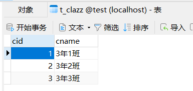
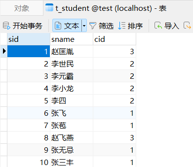
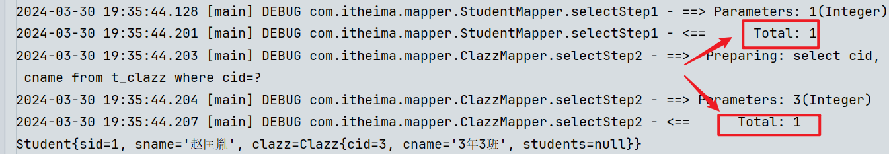
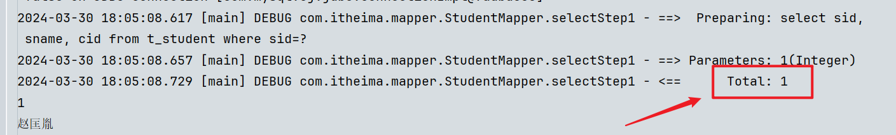

## MyBatis参数处理

###### 我们来探究下mybatis的mapper文件中的占位符#{}中可以传哪些类型的参数：

- #### 单个参数：（这种情况下mybatis可以做类型的自动推断，所以sql中可以不用指定parameterType属性的值）

  1. **单个简单类型参数**：`byte/short/int/long/float/double/boolean/char`，以及它们各自的包装类型，还有`String、java.util.Date、java.sql.Date`
  2. **单个Map类型**：#{}里写map的key，注意**map的key只能是String类型**。
  3. **单个pojo类**：#{}里写属性名，底层调用了pojo类的get方法进行的传值。

  > **其实#{}中的完整写法是：**`#{name,javaType=String,jdbcType=VARCHAR}`，指定该name属性传过来的值类型为String，对应数据库中的类型是varchar。其实这两个包括sql标签中的parameterType属性，都是用来帮助mybatis进行类型确定的。不过大多数情况下这些配置可以省略，因为mybatis它有强大的自动类型推断，所以了解即可。

- #### 多个参数：

  > 如果需要给sql传多个参数，但是sqlSession的方法只能传单个参数（map、pojo）怎么办？

  - 我们可以将多个参数封装到一个`Map<String,Object>`集合里，指定map集合的key为String型的arg1、arg2..，将map集合作为参数传给sqlSession对象的方法中；此时mapper文件中用arg0、arg1...来取map中的数据就行了。

  - 但是现在我们自己不写Mapper实现类了，直接用Mybatis生成的，它底层的原理和上面一样。mybatis会帮我们将接口中传过来的多个参数，先进行处理。它底层会创建一个**map<String,Object>**，将接口的多个参数封装到这个map中，并且该map的key是**#{arg0}**、#{arg1}...或**#{param1}**、#{param2}..这样的形式*（注意：如果是mybatis3.4.2之前的版本，要用#{0}和#{1}这种方式取出来）*

  - 但是它的这种方式的可读性太差，能不能自定义map的key？可以，在参数前用`@param()`注解。相当于告诉mybatis，我的这些个参数，存到map中时，用我给这个key来存：
  
    ```java
    List<Student> selectByNameAndAge(@Param(value="name") String name, @Param("age") int age);
    ```
  
  - 如果形参是单个，数组、Collection、List类型的，Mybatis同样会封装到map中，取用`#{array}、#{collection}、#{list}`取，取到的就是这个对象本身，不过建议手动加`@Param()`注解指定map中的键名
  

------

### MyBatis查询专题

- 我们之前用`sqlSession.select()`方法查询时，返回的结果可以用**pojo类**、**List<T>集合**来接收；但如果没有合适的pojo类，可以用**Map集合**来接收单个数据，字段名作map的key(String)，值做map的value，一个map对应一条查询结果；如果有多条结果可以用List<Map>来接收。

- 当我们用List<Map>来接收多条数据时，取数据不方便，此时也可以用大Map<K,Map>，key是数据的描述信息，Map是数据；通常会将查询结果的主键当作大Map的key，如：

  ```java
  //通过注解，将结果集字段id的值，作为整个大map的key
  @MapKey("id")
  Map<Integer,Map<String,Object>> selectAllRetMap();
  ```

- 我们之前查询时发现，pojo类属性名和结果集的字段名对不上，还需要用as起别名，这里有更好的方式：

  - 全局开启**驼峰命名自动映射**。在mybatis-config中配置：

    ```xml
    <settings>
      <!-- 开启驼峰命名自动映射 -->
      <setting name="mapUnderscoreToCamelCase" value="true"/>
    </settings>
    ```

    ***使用这种方式的前提是***：pojo类的属性名遵循Java的驼峰命名规范，数据库表的字段名遵循SQL的命名规范。

    ```txt
    Java命名规范：首字母小写，后面每个单词首字母大写，遵循驼峰命名方式；
    SQL命名规范：全部小写，单词之间采用下划线分割；
    ```

  - **resultMap结果映射**：在sql语句的mapper文件中通过配置<resultMap>结果映射标签，然后在<select>标签中添加resultMap属性，值是<resultMap>标签的id：

    ```xml
    <!-- resultMap:
        id：这个结果映射的标识，作为select标签的resultMap属性的值。
        type：结果集要映射成Java的什么类型。可以使用别名 -->
    <resultMap id="selectAllResultMap" type="Car">
      <!-- 对象的唯一标识，官方解释是：为了提高mybatis的性能。建议写上 -->
      <id column="id" property="id"/>
      <result column="car_num" property="carNum"/>
      <!-- 当属性名和数据库列名一致时，可以省略，但建议都写上 -->
      <result column="brand" property="brand"/>
      <result column="guide_price" property="guidePrice"/>
      <result column="produce_time" property="produceTime"/>
      <!-- javaType用来指定属性的类型，可以用别名。jdbcType用来指定列类型。这俩一般都可以省略 -->
      <result column="car_type" property="carType" javaType="string" jdbcType="VARCHAR"/>
    </resultMap>
    
    <!-- resultMap属性的值必须和resultMap标签中id属性值一致，建议命名为sqlid+ResultMap -->
    <select id="selectAll" resultMap="selectAllResultMap">
      select * from t_car
    </select>
    ```

------

### 动态SQL

##### 有的业务场景，也需要SQL语句能够进行动态拼接，为了让sql语句更加灵活，Mybatis提供了很多标签：

- <if>标签：

  ```xml
  <select id="selectByMultiCondition" resultType="car">
      select * from t_car where 1=1 //这里要加一个恒成立条件，如果不加这个条件，3个条件都不成立此时sql语句最后会有一个where关键字
      <if test="brand != null and brand != ''">
          and brand like "%"#{brand}"%"
      </if>
      <if test="guidePrice != null and guidePrice != ''">
          and guide_price >= #{guidePrice}
      </if>
      <if test="carType != null and carType != ''">
          and car_type = #{carType}
      </if>
  </select>
  ```

  > 关于if标签有以下几点说明：
  >
  > 1. if标签的test属性是必须的，值是false或true；如果test为true，则if标签中内容会拼接，反之则不会
  > 2. test属性中的关键字，要和下方#{}中的关键字保持一致
  > 3. 在xml中，“且”只能用and来表示，&是特殊字符

- <where>标签：它的作用是让where子句更加动态智能；当where标签中有内容时，会自动生成where关键字，并且会自动去除内容**前面**多余的and或or

  ```xml
  <select id="selectByMultiCondition" resultType="car">
  	select * from t_car
  	<where>//where标签时专门负责where子句的动态生成的，最前面的这个and/or关键字会根据需去掉
  		<if test="brand != null and brand != ''">
  			and brand like "%"#{brand}"%"
  		</if>
  		<if test="guidePrice != null and guidePrice != ''">
  			and guide_price >= #{guidePrice}
  		</if>
  		<if test="carType != null and carType != ''">
  			and car_type = #{carType}
  		</if>
  	</where>
  </select>
  ```

- <trim>标签：给标签里的内容加上或去除前缀；trim标签有四个属性，prefix加前缀，suffix加后缀，prefixOverrides删除前缀，suffixOverrides删除后缀：（这些都是在整个trim块的前后操作的，并且和where一样，标签内没内容就没效果）

  ```xml
  <select id="selectByMultiCondition" resultType="car">
  	select * from t_car
  	
  	<trim prefix="where" suffixOverrides="and|or">
  		<if test="brand != null and brand != ''">
  			brand like "%"#{brand}"%" and
  		</if>
  		<if test="guidePrice != null and guidePrice != ''">
  			guide_price >= #{guidePrice} and
  		</if>
  		<if test="carType != null and carType != ''">
  			car_type = #{carType} and
  		</if>
  	</trim>
  </select>
  ```

- <set>标签：主要使用在update语句当中，用来生成set关键字，同时去掉**最后**多余的逗号

  ```xml
  <update id="updateWithSet">
    update t_car
    <set>
      <if test="carNum != null and carNum != ''">car_num = #{carNum},</if>
      <if test="brand != null and brand != ''">brand = #{brand},</if>
      <if test="guidePrice != null and guidePrice != ''">guide_price = #{guidePrice},</if>
      <if test="produceTime != null and produceTime != ''">produce_time = #{produceTime},</if>
      <if test="carType != null and carType != ''">car_type = #{carType},</if>
    </set>
    where id = #{id}
  </update>
  ```

- <choose>、<when>、<ohterwise>标签：这三个标签是在一起使用的，类似于if else，比多个<if>标签更方便，只有一个分支会被选择。<when>最少出现1次，<ohterwise>最多出现1次

  ```xml
  <select id="selectWithChoose" resultType="car">
    select * from t_car
    <where>
      <choose>
        <when test="brand != null and brand != ''">
          brand like #{brand}"%"
        </when>
        <when test="guidePrice != null and guidePrice != ''">
          guide_price >= #{guidePrice}
        </when>
        <otherwise>
          produce_time >= #{produceTime}
        </otherwise>
      </choose>
    </where>
  </select>
  ```

- <foreach>标签：循环遍历数组或集合，动态生成sql，比如这样的SQL：

  ```sql
  # 批量删除
  delete from t_car where id in(1,2,3);
  delete from t_car where id = 1 or id = 2 or id = 3;
  # 批量添加
  insert into t_car values
    (null,'1001','凯美瑞',35.0,'2010-10-11','燃油车'),
    (null,'1002','比亚迪唐',31.0,'2020-11-11','新能源'),
    (null,'1003','比亚迪宋',32.0,'2020-10-11','新能源')
  ```

  ```xml
  <!--
      collection：要遍历的集合或数组
      item：集合或数组中的元素
      separator：分隔符
      open：foreach标签中所有内容的开始要加的内容
      close：foreach标签中所有内容的结束要加的内容
  以下是动态的：delete from t_car where id in(1,2,3);
  -->
  <delete id="deleteBatchByForeach">
    delete from t_car where id in
    <foreach collection="ids" item="id" separator="," open="(" close=")">
      #{id}
    </foreach>
  </delete>
  ```

- <sql>和<include>标签：sql标签用来声明sql片段，include标签用来将声明的sql片段包含到某个sql语句当中；作用是代码复用，易维护。

  ```xml
  <sql id="carCols">id,car_num carNum,brand,guide_price guidePrice,produce_time produceTime,car_type carType</sql>
  
  <select id="selectAllRetMap" resultType="map">
    select <include refid="carCols"/> from t_car
  </select>
  
  <select id="selectAllRetListMap" resultType="map">
    select <include refid="carCols"/> carType from t_car
  </select>
  
  <select id="selectByIdRetMap" resultType="map">
    select <include refid="carCols"/> from t_car where id = #{id}
  </select>
  ```

------

### MyBatis的高级映射

*什么是高级映射，就是说表和表之间有关系；我们之前都是从1张表查的结果，可以对应一个pojo类；那么如果是多张表链接查询的结果，应该怎么封装到pojo类中呢？看例子：*

##### 准备工作：

1. 首先准备数据库表，t_clazz和t_student，两个表之间有外键关系，一个班级对应多个学生：（外键关系不用数据库维护，Java程序来维护）

   

   

2. 创建两个pojo类Clazz（除了cid和cname，还有List<Student>属性）和Student（sid、sname和Clazz属性），分别模拟一对多，多对一的场景。创建mapper接口StudentMapper、ClazzMapper，创建mapper映射文件StudentMapper.xml、ClazzMapper.xml，还有两个Mapper接口的测试用例，ClazzMapperTest和StudentMapperTest

------

- ##### 当学生表为主表时（多对一）：

  1. ###### 级联属性映射：(需要写链接查询的sql)

       > StudentMapper：
       >
       > ```java
       > public Student select(Integer id);
       > ```

       > StudentMapper.xml：
       >
       > ```xml
       > <!-- 第1种方式查 -->
       > <select id="select" resultMap="selectResultMap">
       >     select s.sid, s.sname, c.cid, c.cname from t_student as s
       >         left join t_clazz as c on s.cid=c.cid
       >     where s.sid=#{id}
       > </select>
       > <resultMap id="selectResultMap" type="Student">
       >     <id column="sid" property="sid"/>
       >     <result column="sname" property="sname"/>
       >     <!-- 将这两个标签去掉 -->
       >     <!-- <result column="cid" property="clazz.cid"/> -->
       >     <!-- <result column="cname" property="clazz.cname"/> -->
       > 
       >     <!-- 也可以这样 -->
       >     <!-- association翻译为“关联”，表示student对象的clazz属性要关联一个Clazz类型的Java对象 -->
       >     <association property="clazz" javaType="Clazz">
       >         <id column="cid" property="cid"/><!-- 结果集字段的cid映射到Clazz对象的cid属性，是主键 -->
       >         <result column="cname" property="cname"/><!-- 结果集字段的cname映射到Clazz对象的cname属性 -->
       >     </association>
       > </resultMap>
       > ```

     > 测试代码：（clazz属性的students属性为null是正常的，否则就递归了）
     >
     > ```java
     > @Test
     > public void testSelect(){
     >     SqlSession sqlSession = SqlSessionUtil.openSession();
     >     StudentMapper studentMapper = sqlSession.getMapper(StudentMapper.class);
     >     Student student = studentMapper.select(1);
     >     System.out.println(student);
     >     //Student{sid=1, sname='赵匡胤', clazz=Clazz{cid=3, cname='3年3班', students=null}}
     >     sqlSession.close();
     > }
     > ```

  2. ###### 分步查询：（优点：不用写链接查询了，代码复用性增强，且支持懒加载提高执行效率）

     *懒加载：暂时不访问的数据先不查，提高程序的执行效率。*

     > StudentMapper：
     >
     > ```java
     > public Student selectStep1(Integer id);
     > ```

     > StudentMapper.xml：
     >
     > ```xml
     > <select id="selectStep1" resultMap="selectStep1ResultMap">
     >     select sid, sname, cid from t_student where sid=#{id}//不用写链接查询的sql
     > </select>
     > <resultMap id="selectStep1ResultMap" type="Student">
     >     <id column="sid" property="sid"/>
     >     <result column="sname" property="sname"/>
     >     <!-- 将cid传给第2步的sql，select指向第2步的sqlId，查到的Clazz结果对象给clazz属性 -->
     >     <association column="cid" select="com.itheima.mapper.ClazzMapper.selectStep2" property="clazz"/>
     > </resultMap>
     > ```

     > 第2步的ClazzMapper：
     >
     > ```java
     > public Clazz selectStep2(Integer id);
     > ```
     >
     > 第2步的sql在ClazzMapper.xml：
     >
     > ```xml
     > <!-- 分布查询第2步；这里的id接收第1步传过来的column属性的值，查询结果对象Clazz传给第1步的property属性 -->
     > <select id="selectStep2" resultType="Clazz">
     >     select cid, cname from t_clazz where cid=#{id}
     > </select>
     > ```

     > 测试代码：
     >
     >   ```java
     > @Test
     > public void testSelectStep1(){
     >     SqlSession sqlSession = SqlSessionUtil.openSession();
     >     StudentMapper studentMapper = sqlSession.getMapper(StudentMapper.class);
     >     Student student = studentMapper.selectStep1(1);
     >     System.out.println(student.getSid());
     >     System.out.println(student.getSname());
     >     sqlSession.close();
     > }
     >   ```
     >

     > 没开启懒加载时的结果：虽然暂时不需要看clazz属性，但2条sql都编译且执行了，说明clazz属性也查了赋值了
     >
     > 
     >
     > 开启懒加载时的结果：没用到clazz属性，第二个sql先不执行，clazz还没赋值
     >
     > 

     > 怎么开启懒加载：
     >
     > 在第一步的<association>标签中加属性**fetchType="lazy"**。这是局部的懒加载，全局的在mybatis核心配置文件中开启：
     >
     > ```xml
     > <!-- 全局设置标签 -->
     > <settings>
     >  <setting name="lazyLoadingEnabled" value="true"/>
     > </settings>
     > ```
     >
     > 通常都会开启全局懒加载，如果某个地方不希望懒加载，可以在<association>标签中加属性**fetchType="eager"**

- ##### 当班级表为主表时（一对多）：

  1. ###### 级联属性映射：(需要写链接查询的sql)

     > ClazzMapper：
     >
     >   ```java
     > public Clazz select(Integer id);
     >   ```
     >
  
     > ClazzMapper.xml：
     >
     >   ```xml
     > <select id="select" resultMap="selectResultMap">
     >     select c.cid, c.cname, s.sid, s.sname from t_clazz as c
     >         left join t_student as s on c.cid=s.cid
     >     where c.cid=#{id}
     > </select>
     > <resultMap id="selectResultMap" type="Clazz">
     >     <id column="cid" property="cid"/>
     >     <result column="cname" property="cname"/>
     > 
     >     <!-- 一对多，这里用的是collection，表示Clazz对象的students属性是集合，ofType指定集合中java对象的类型 -->
     >     <collection property="students" ofType="Student">
     >         <id column="sid" property="sid"/>
     >         <result column="sname" property="sname"/>
     >         <!-- 注意：student对象的clazz不要设置，就是null，否则就递归了 -->
     >     </collection>
     > </resultMap>
     >   ```
     >
  
     > 测试代码：（Student对象的clazz属性为null是正常的，否则就递归了）
     >
     > ```java
     > @Test
     > public void testSelect(){
     >     SqlSession sqlSession = SqlSessionUtil.openSession();
     >     ClazzMapper clazzMapper = sqlSession.getMapper(ClazzMapper.class);
     >     Clazz clazz = clazzMapper.select(1);
     >     System.out.println(clazz);
     >     /*
     >     Clazz{cid=1, cname='3年1班', students=[Student{sid=6, sname='张飞', clazz=null}, 
     >     Student{sid=7, sname='张苞', clazz=null}, Student{sid=9, sname='张无忌', clazz=null}, 
     >     Student{sid=10, sname='张三丰', clazz=null}, Student{sid=16, sname='张伟', clazz=null}, 
     >     Student{sid=17, sname='张大炮', clazz=null}, Student{sid=19, sname='张三', clazz=null}, 
     >     Student{sid=20, sname='张宗昌', clazz=null}]}
     >     */
     >     sqlSession.close();
     > }
     > ```
  
  2. ###### 分布查询：
  
     > ClazzMapper：
     >
     >   ```java
     > public Clazz selectStep1(Integer id);
     >   ```
     >
  
     > ClazzMapper.xml：
     >
     > ```xml
     > <select id="selectStep1" resultMap="selectStep1ResultMap">
     >     select cid, cname from t_clazz where cid=#{id}
     > </select>
     > <resultMap id="selectStep1ResultMap" type="Clazz">
     >     <id column="cid" property="cid"/>
     >     <result column="cname" property="cname"/>
     > 
     >     <!-- 将cid传给第2步的sql，select指向第2步的sqlId，查到的结果对象List<Student>给students属性 -->
     >     <collection column="cid" select="com.itheima.mapper.StudentMapper.selectStep2" property="students" fetchType="eager"/>
     > </resultMap>
     > ```
  
     > 第2步的StudentMapper：
     >
     > ```java
     > public List<Student> selectStep2(Integer id);
     > ```
     >
     > 第2步的sql在StudentMapper.xml：
     >
     > ```xml
     > <!-- 分布查询第2步；这里的cid接收第1步传过来的column属性的值 -->
     > <select id="selectStep2" resultType="Student">
     >     select sid, sname from t_student where cid=#{id}
     > </select>
     > ```
  
     > 测试代码：
     >
     > ```java
     > @Test
     > public void testSelectStep1(){
     >     SqlSession sqlSession = SqlSessionUtil.openSession();
     >     ClazzMapper clazzMapper = sqlSession.getMapper(ClazzMapper.class);
     >     Clazz clazz = clazzMapper.selectStep1(1);
     >     System.out.println(clazz);
     >     sqlSession.close();
     > }
     > ```
  

------

