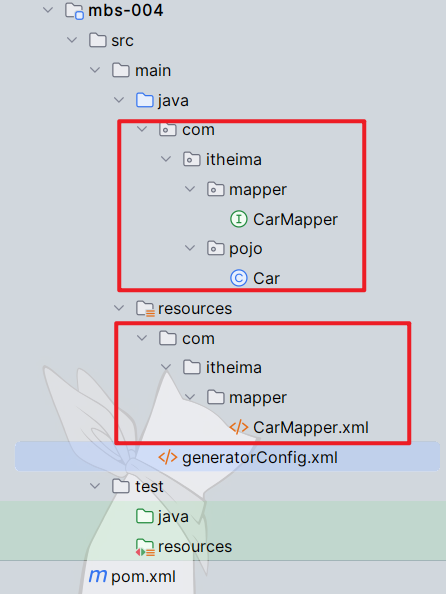
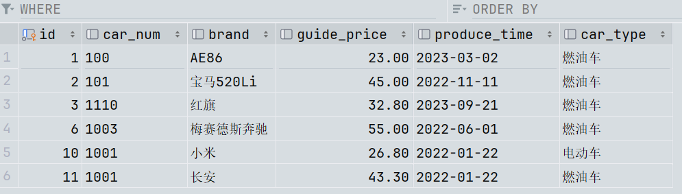

## MyBatis的缓存

> 缓存（cache）是一种，通过减少IO交互，来提高程序的执行效率的机制。

- ##### MyBatis中的缓存机制：

  > Mybatis中的缓存机制只针对于DQL语句，它将上次select语句的执行结果（pojo对象）放到缓存（内存）当中，下一次还是同一条DQL语句的话，就不去数据库中取数据了，直接从本地缓存中找。这样一方面减少了IO，另一方面不再执行繁琐的查找算法，效率大大提升。缓存是我们程序开发中优化程序执行效率的一个重要手段。

- ##### mybatis缓存包括：

  - 一级缓存：将查询到的数据存储到SqlSession中。

  - 二级缓存：将查询到的数据存储到SqlSessionFactory中。二级缓存是以每个Mapper文件为单位划分的，每个Mapper文件都有自己独立的二级缓存。Mapper文件也可以使用第三方的缓存去代替自带的二级缓存：比如EhCache【Java语言开发】、Memcache【C语言开发】等。

    > 区别：范围不同。一级缓存是SqlSession对象，是局部的；二级缓存是SqlSessionFactory对象，数据库级别

- **什么时候不会走缓存，缓存失效**：

  - 不同的SqlSession对象，一级缓存范围肯定不同。或者不同的select语句，肯定也不走缓存。
  - 两次select中间，进行了任何增删改操作，一级二级缓存都会失效。（无论哪张表，只要有DML操作）

- ##### 缓存的使用：

  - **一级缓存**：默认开启，不需要做任何配置。只要使用同一个SqlSession对象执行同一条DQL语句，就会走缓存；手动清空一级缓存用`sqlSession.clearCache();`
  - **二级缓存**：二级缓存的范围是在SqlSessionFactory内，也就是数据库范围，使用二级缓存需要同时具备以下几个条件：
    1. 核心配置文件中，全局开启二级缓存（默认）：`<setting name="cacheEnabled" value="true"/>`，此时所有使用了二级缓存的Mapper文件都会缓存查询到的对象。该配置默认就是true，无需设置。
    2. 在需要使用二级缓存的SqlMapper.xml文件中添加配置：`<cache/>`
    3. 使用二级缓存的pojo对象必须是可序列化的，也就是必须实现`Serializable`接口。
    4. SqlSession对象`close()`关闭或`submit()`提交之后，一级缓存中的数据才会被写入到二级缓存当中，此时二级缓存才可用。
  - 缓存标签`<cache/>`中可以出现的属性：（二级缓存中可以配置很多属性）
    - `flushInterval`（刷新间隔）：二级缓存的刷新时间间隔，单位毫秒；如果没有设置，就代表不刷新缓存，只要内存足够大，会一直会向二级缓存中缓存数据，直到执行了增删改。
    - `size`：设置二级缓存中最多可存储的java对象数量，默认值1024个Java对象。
    - `eviction`（驱逐）：指定从缓存中删除某个对象时所使用的淘汰算法，默认采用LRU策略。策略有以下几种：
      - LRU：Least Recently Used，最近最少使用。优先淘汰在间隔时间内使用频率最低的对象。(其实还有一种LFU算法，淘汰最不常用)
      - FIFO：First In First Out，一种先进先出的数据缓存器。先进入二级缓存的对象最先被淘汰。
      - SOFT：软引用。淘汰软引用指向的对象，具体算法和JVM的垃圾回收算法有关。
      - WEAK：弱引用。淘汰弱引用指向的对象。具体算法和JVM的垃圾回收算法有关。
    - `readOnly`：值可以是true或false；
      - true：相同的sql语句执行之后返回的对象是共享的同一个，堆中地址相同，虽然性能好，但是多线程并发可能会存在安全问题。
      - false：相同的sql语句执行之后返回的对象是克隆的副本，调用了clone方法，堆中地址不同，虽然性能一般，但安全。

- ##### MyBatis集成第三方缓存EhCache：

  > mybatis对外提供了接口，可以通过集成第三方的缓存组件，来代替mybatis自带的二级缓存，一级缓存是无法替代的。
  > 常见的第三方缓存有EhCache、Memcache等。
  > EhCache是Java写的，Memcache是C语言写的，所以mybatis集成EhCache较为常见。按照以下步骤操作就可以：
  >
  > 1. 引入mybatis整合ehcache的依赖：
  >
  >    ```xml
  >    <!--mybatis集成ehcache的组件-->
  >    <dependency>
  >        <groupId>org.mybatis.caches</groupId>
  >        <artifactId>mybatis-ehcache</artifactId>
  >        <version>1.2.2</version>
  >    </dependency>
  >    ```
  >
  > 2. 在类路径resources下新建`echcache.xml`文件：
  >
  >    ```xml
  >    <?xml version="1.0" encoding="UTF-8"?>
  >    <ehcache xmlns:xsi="http://www.w3.org/2001/XMLSchema-instance"
  >             xsi:noNamespaceSchemaLocation="http://ehcache.org/ehcache.xsd"
  >             updateCheck="false">
  >        <!--磁盘存储:将缓存中暂时不使用的对象,转移到硬盘,类似于Windows系统的虚拟内存-->
  >        <diskStore path="d:/ehcache"/>
  >         
  >        <!--defaultCache：默认的管理策略-->
  >        <!--eternal：设定缓存的elements是否永远不过期。如果为true，则缓存的数据始终有效，如果为false那么还要根据timeToIdleSeconds，timeToLiveSeconds判断-->
  >        <!--maxElementsInMemory：在内存中缓存的element的最大数目-->
  >        <!--overflowToDisk：如果内存中数据超过内存限制，是否要缓存到磁盘上-->
  >        <!--diskPersistent：是否在磁盘上持久化。指重启jvm后，数据是否有效。默认为false-->
  >        <!--timeToIdleSeconds：对象空闲时间(单位：秒)，指对象在多长时间没有被访问就会失效。只对eternal为false的有效。默认值0，表示一直可以访问-->
  >        <!--timeToLiveSeconds：对象存活时间(单位：秒)，指对象从创建到失效所需要的时间。只对eternal为false的有效。默认值0，表示一直可以访问-->
  >        <!--memoryStoreEvictionPolicy：缓存的3 种清空策略-->
  >        <!--FIFO：first in first out (先进先出)-->
  >        <!--LFU：Less Frequently Used (最少使用).意思是一直以来最少被使用的。缓存的元素有一个hit 属性，hit 值最小的将会被清出缓存-->
  >        <!--LRU：Least Recently Used(最近最少使用). (ehcache 默认值).缓存的元素有一个时间戳，当缓存容量满了，而又需要腾出地方来缓存新的元素的时候，那么现有缓存元素中时间戳离当前时间最远的元素将被清出缓存-->
  >        <defaultCache eternal="false" maxElementsInMemory="1000" overflowToDisk="false" diskPersistent="false"
  >                      timeToIdleSeconds="0" timeToLiveSeconds="600" memoryStoreEvictionPolicy="LRU"/>
  >       </ehcache>
  >    ```
  >    
  >3. 在需要使用此缓存的Mapper.xml文件中用type属性设置：
  > 
  >   ```xml
  >    <cache type="org.mybatis.caches.ehcache.EhcacheCache"/>
  >   ```

------

### MyBatis的逆向工程

> 所谓的逆向工程是：根据数据库表逆向生成Java的pojo类、XxxMapper.xml文件、Mapper接口。要完成这个工作，需要借助maven中别人写好的逆向工程插件。思考：使用这个插件的话，需要给这个插件配置哪些信息？
>
> - pojo类名、包名以及生成位置
> - Mapper.xml文件的文件名以及生成位置
> - Mapper接口名以及生成位置
> - 连接数据库的信息
> - 指定哪些表参与逆向工程
> - ......
>
> 逆向工程的配置与使用：

1. 在maven的pom文件中添加逆向工程插件依赖：

   ```xml
   <!--定制构建过程-->
   <build>
     <!--可配置多个插件-->
     <plugins>
       <!--其中的一个插件：mybatis逆向工程插件-->
       <plugin>
         <!--插件的GAV坐标-->
         <groupId>org.mybatis.generator</groupId>
         <artifactId>mybatis-generator-maven-plugin</artifactId>
         <version>1.4.1</version>
         <!--允许覆盖-->
         <configuration>
           <overwrite>true</overwrite>
         </configuration>
         <!--插件的依赖-->
         <dependencies>
           <!--mysql驱动依赖-->
           <dependency>
             <groupId>mysql</groupId>
             <artifactId>mysql-connector-java</artifactId>
             <version>8.0.30</version>
           </dependency>
         </dependencies>
       </plugin>
     </plugins>
   </build>
   ```

2. 配置逆向工程配置文件generatorConfig.xml：在该文件里设置你的数据库，以及生成类的一些信息..
   （注意：文件名必须叫做**generatorConfig.xml**，而且**必须要放在类路径resources**下）

   ```xml
   <?xml version="1.0" encoding="UTF-8"?>
   <!DOCTYPE generatorConfiguration
           PUBLIC "-//mybatis.org//DTD MyBatis Generator Configuration 1.0//EN"
           "http://mybatis.org/dtd/mybatis-generator-config_1_0.dtd">
   
   <generatorConfiguration>
       <!--
           targetRuntime有两个值：
               MyBatis3Simple：生成的是基础版，只有基本的增删改查。
               MyBatis3：生成的是增强版，除了基本的增删改查之外还有复杂的增删改查。
       -->
       <context id="DB2Tables" targetRuntime="MyBatis3Simple">
           <!--防止生成重复代码-->
           <plugin type="org.mybatis.generator.plugins.UnmergeableXmlMappersPlugin"/>
   
           <commentGenerator><!--这是关于生成类的注释信息的配置-->
               <!--是否去掉生成日期-->
               <property name="suppressDate" value="true"/>
               <!--是否去除注释-->
               <property name="suppressAllComments" value="true"/>
           </commentGenerator>
   
           <!--连接数据库信息-->
           <jdbcConnection driverClass="com.mysql.cj.jdbc.Driver"
                           connectionURL="jdbc:mysql://localhost:3306/test"
                           userId="root"
                           password="a123456789">
           </jdbcConnection>
   
           <!-- 生成pojo包名和位置 -->
           <javaModelGenerator targetPackage="com.itheima.pojo" targetProject="src/main/java">
               <!--是否开启子包-->
               <property name="enableSubPackages" value="true"/>
               <!--是否去除字段名的前后空白-->
               <property name="trimStrings" value="true"/>
           </javaModelGenerator>
   
           <!-- 生成SQL映射文件的包名和位置 -->
           <sqlMapGenerator targetPackage="com.itheima.mapper" targetProject="src/main/resources">
               <!--是否开启子包-->
               <property name="enableSubPackages" value="true"/>
           </sqlMapGenerator>
   
           <!-- 生成Mapper接口的包名和位置 -->
           <javaClientGenerator type="xmlMapper" targetPackage="com.itheima.mapper" targetProject="src/main/java">
               <!--是否开启子包-->
               <property name="enableSubPackages" value="true"/>
           </javaClientGenerator>
   
           <!-- 指定哪些表参与逆向工程，指定表名和对应的实体类名 -->
           <table tableName="t_car" domainObjectName="Car"/>
   
       </context>
   </generatorConfiguration>
   ```

3. 最后运行插件即可，生成的文件：

   

------

#### 测试生成的东西好不好用：

- ##### 测试基础版：

  > BaseCarMapperTest.java

  ```java
  public class BaseCarMapperTest {
      @Test
      public void testDeleteByPrimaryKey(){
          SqlSession sqlSession = SqlSessionUtil.openSession();
          CarMapper mapper = sqlSession.getMapper(CarMapper.class);
          int count = mapper.deleteByPrimaryKey(9L);
          sqlSession.commit();
          sqlSession.close();
          System.out.println("影响的数据："+ count);
      }
  
      @Test
      public void testInsert(){
          SqlSession sqlSession = SqlSessionUtil.openSession();
          CarMapper mapper = sqlSession.getMapper(CarMapper.class);
          Car car = new Car(null, "1001", "长安", new BigDecimal(43.3), "2022-01-22", "燃油车");
          int count = mapper.insert(car);
          sqlSession.commit();
          sqlSession.close();
          System.out.println("影响的数据："+ count);
      }
  
      @Test
      public void testSelectByPrimaryKey(){
          SqlSession sqlSession = SqlSessionUtil.openSession();
          CarMapper mapper = sqlSession.getMapper(CarMapper.class);
          Car car = mapper.selectByPrimaryKey(2L);
          sqlSession.close();
          System.out.println(car);
      }
  
      @Test
      public void testSelectAll(){
          SqlSession sqlSession = SqlSessionUtil.openSession();
          CarMapper mapper = sqlSession.getMapper(CarMapper.class);
          List<Car> cars = mapper.selectAll();
          sqlSession.close();
          System.out.println(cars);
      }
  
      @Test
      public void testUpdateByPrimaryKey(){
          SqlSession sqlSession = SqlSessionUtil.openSession();
          CarMapper mapper = sqlSession.getMapper(CarMapper.class);
          Car car = new Car(10L, "1001", "小米", new BigDecimal(26.8), "2022-01-22", "电动车");
          int count = mapper.updateByPrimaryKey(car);
          sqlSession.commit();
          sqlSession.close();
          System.out.println("影响的数据："+ count);
      }
  }
  ```

- ##### 测试高级版：

  > PlusCarMapperTest.java

  ```java
  //高级版除了方法多了之外，pojo包下还多个CarExample类，它是封装where后面的查询条件的
  public class PlusCarMapperTest {
      @Test
      public void testSelect(){
          SqlSession sqlSession = SqlSessionUtil.openSession();
          CarMapper mapper = sqlSession.getMapper(CarMapper.class);
          //查询所有，根据条件查询，如果传进去的CarExample对象是null，就是查所有
  //        List<Car> cars = mapper.selectByExample(null);
          //条件查询，通过carExample对象来封装查询条件
          CarExample carExample = new CarExample();
          //通过carExample的createCriteria()创建查询条件
          carExample.createCriteria()
                  .andCarTypeEqualTo("燃油车")
                  .andGuidePriceGreaterThan(new BigDecimal(30.00));
          //这样表示or和前面的一堆and是或者的关系
          carExample.or()
                  .andCarTypeEqualTo("电动车")
                  .andGuidePriceGreaterThan(new BigDecimal(20.00));
          //这种叫【QBC】风格：Query By Criteria，一种查询方式，比较面向对象，看不到sql语句
          List<Car> cars = mapper.selectByExample(carExample);
          System.out.println(cars);
          sqlSession.close();
      }
  }
  ```

  > 看下生成的sql语句：

  ```sql
  select id, car_num, brand, guide_price, produce_time, car_type from t_car WHERE ( car_type = ? and guide_price > ? ) or( car_type = ? and guide_price > ? )
  ```

------

### MyBatis中使用`PageHelper`分页插件（重要）

> 我们正常写分页功能时，都是要向后端发送`页码`和`每页显示条数`这两个数据的。后端获取之后，将表中所有数据通过`limit`截取后返回。假设每页显示`pageSize`条，第`pageNum`页的数据应该怎么写`limit`来获取呢？可以这样：`startIndex = (pageNum - 1) * pageSize`
>

###### 获取数据不难，难的是获取分页相关的数据比较难。此时可以借助`PageHelper`插件：

> PageHelper是别人写好的一个插件，可以在MyBatis中更方便的使用分页查询，不局限于用`limit`拼接进sql进行分页。并且它的性能也很不错。使用时注意：**Mapper中的sql语句不要加;分号**，因为分页插件底层是，在原来SQL语句的基础上通过拼SQL完成的。

##### 使用步骤：

1. 引入依赖：

   ```xml
   <dependency>
     <groupId>com.github.pagehelper</groupId>
     <artifactId>pagehelper</artifactId>
     <version>5.3.1</version>
   </dependency>
   ```

2. 在mybatis-config.xml文件中开启分页过滤器：

   ```xml
   <!--    开启分页过滤器-->
   <plugins>
       <plugin interceptor="com.github.pagehelper.PageInterceptor"/>
   </plugins>
   ```

3. 编写测试代码：

   ```java
   @Test
   public void testPageHelper(){
       SqlSession sqlSession = SqlSessionUtil.openSession();
       CarMapper mapper = sqlSession.getMapper(CarMapper.class);
   //一定在查之前开启分页
       // 开启分页，最重要的就是这一步，参数是开始页码pageNum和每页记录条数pageSize，和mysql的limit一样
       int pageNum = 2;
       int pageSize = 2;
       PageHelper.startPage(pageNum, pageSize);
       // 执行查询语句
       List<Car> cars = mapper.selectByExample(null);
       // 最后要将结果封装成PageInfo分页信息对象，第2个参数是导航卡片数量
       PageInfo<Car> pageInfo = new PageInfo<>(cars, 3);
       System.out.println(pageInfo);
   /*结果：
   PageInfo{pageNum=2, pageSize=2, size=2, startRow=3, endRow=4, total=6, pages=3, 
   list=Page{count=true, pageNum=2, pageSize=2, startRow=2, endRow=4, total=6, pages=3, 
   reasonable=false, pageSizeZero=false}[Car{id=3, carNum='1110', brand='红旗', 
   guidePrice=32.80, produceTime='2023-09-21', carType='燃油车'}, Car{id=6, carNum='1003', 
   brand='梅赛德斯奔驰', guidePrice=55.00, produceTime='2022-06-01', carType='燃油车'}], prePage=1, 
   nextPage=3, isFirstPage=false, isLastPage=false, hasPreviousPage=true, hasNextPage=true, 
   navigatePages=3, navigateFirstPage=1, navigateLastPage=3, navigatepageNums=[1, 2, 3]}
   */
       sqlSession.close();
   }
   ```

   

   ###### 此时我们就可以通过PageInfo的get方法来拿到所有我们需要的信息了，将来这些东西我们也可以放在request请求域中去使用

------

### MyBatis的注解式开发

> mybatis中也提供了注解式开发方式，采用注解可以减少Mapper文件的内容。
>
> 当然，使用注解式开发的话，sql语句是写在java程序中的，这种方式也会给sql语句的维护带来成本。
>
> 官方是这么说的：*使用注解来映射简单语句会使代码显得更加简洁，但对于稍微复杂一点的语句，Java 注解不仅力不从心，还会让你本就复杂的 SQL 语句更加混乱不堪。 因此，如果你需要做一些很复杂的操作，最好用 XML 来映射语句*
>
> 原则：**简单SQL使用注解，复杂SQL使用xml**

###### 注解的使用方式：（在Mapper接口上使用）

- ##### @Insert

```java
@Insert(value="insert into t_car values(null,#{carNum},#{brand},#{guidePrice},#{produceTime},#{carType})")
int insert(Car car);
```

- ##### @Delete

```java
@Delete("delete from t_car where id = #{id}")
int deleteById(Long id);
```

- ##### @Update

```java
@Update("update t_car set car_num=#{carNum},brand=#{brand},guide_price=#{guidePrice},produce_time=#{produceTime},car_type=#{carType} where id=#{id}")
int update(Car car);
```

- ##### @Select

```java
@Select("select * from t_car where id = #{id}")
@Results({
    @Result(column = "id", property = "id", id = true),
    @Result(column = "car_num", property = "carNum"),
    @Result(column = "brand", property = "brand"),
    @Result(column = "guide_price", property = "guidePrice"),
    @Result(column = "produce_time", property = "produceTime"),
    @Result(column = "car_type", property = "carType")
})
Car selectById(Long id);
```

------

