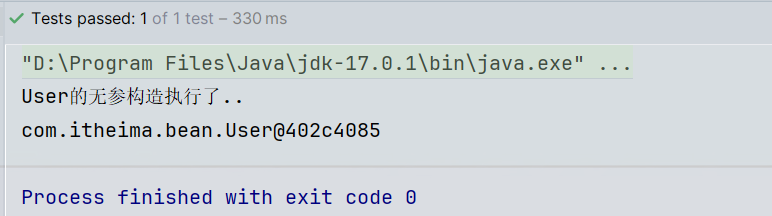

(语雀笔记地址：https://www.yuque.com/docs/share/866abad4-7106-45e7-afcd-245a733b073f?# 密码：mg9b)(项目代码：prj-spring6)

------

# Spring框架

- #### Spring启示录：

  > UserController：控制器类中调用服务层的接口方法

  ```java
  public class UserController {
      private UserService userService = new UserServiceImpl();
  
      public void login(){
          String username = "admin";
          String password = "123456";
          boolean success = userService.login(username, password);
          if (success) {
              // 登录成功
          } else {
              // 登录失败
          }
      }
  }
  ```

  > UserServiceImpl：服务层接口实现类，通过调用dao接口实现类来操作数据库

  ```java
  public class UserServiceImpl implements UserService {
      private UserDao userDao = new UserDaoImplForMySQL();
  
      public boolean login(String username, String password) {
          User user = userDao.selectByUsernameAndPassword(username, password);
          if (user != null) {
              return true;
          }
          return false;
      }
  }
  ```

  > UserDaoImplForMySQL：dao实现类完成数据库数据的增删改操作

  ```java
  public class UserDaoImplForMySQL implements UserDao {
      public User selectByUsernameAndPassword(String username, String password) {
          // 连接MySQL数据库，根据用户名和密码查询用户信息
          return null;
      }
  }
  ```

  > 可以很明显的看出，上层是依赖下层的。UserController依赖UserServiceImpl，而UserServiceImpl依赖UserDaoImplForMySQL，这样就会导致下面只要改动，上面必然会受牵连（跟着也会改），所谓牵一发而动全身。如果此时需要链接Oracle数据库，那么UserServiceImpl中就需要new一个UserDaoImplForOracle();的DAO实现类。

  > 这样一来就违背了**OCP开闭原则**。开闭原则是这样说的：在软件开发过程中应当对扩展开放，对修改关闭。也就是说，如果在进行功能扩展的时候，添加额外的类是没问题的，但因为功能扩展而修改之前运行正常的程序，这是忌讳的，不被允许的。因为一旦修改之前运行正常的程序，就会导致项目整体要进行全方位的重新测试。这是相当麻烦的过程。导致以上问题的主要原因是：代码和代码之间的耦合度太高。

  > 同时还违背了开发中常用的一个原则，**依赖倒置原则**(Dependence Inversion Principle)，简称DIP：高层模块不应该依赖低层模块，两者都应该依赖其抽象。该原则主要倡导**面向抽象编程，面向接口编程**，不要面向具体编程，让上层不再依赖下层，下面改动了，上面的代码不会受到牵连。这样可以大大降低程序的耦合度，耦合度低了，扩展力就强了，同时代码复用性也会增强。

  > 你可能会说，上面的代码已经面向接口编程了呀，我们就是用接口来调的方法：userService.login(username, password);
  >
  > 但是还没有完全面向接口编程，我们还是在代码中自己new对象了：private UserService userService = new UserServiceImpl();
  >
  > 但是如果我们不自己new对象，不就发生空指针异常了吗？所以我们现在的核心问题就是：**谁来负责对象的创建**，以及**谁负责把创建好的对象赋值给变量（属性）**。也就是谁来维护对象之间的关系。
  >
  > 如果将这两个问题解决了，那么我们的代码就能在做到高扩展、解耦合的同时，又符合OCP开闭原则。

  ##### 很荣幸的通知你：Spring框架可以做到。在Spring框架中，它可以帮助我们new对象，并且它还可以将new出来的对象赋到属性上。换句话说，Spring框架可以帮助我们创建对象，并且可以帮助我们维护对象和对象之间的关系。（它是我们的项目大管家）

  *像这种把对象的创建、管理权交出去称为控制反转IoC：*

  > **控制反转**（Inversion of Control，缩写为IoC），是面向对象编程中的一种设计思想，可以用来降低代码之间的耦合度，符合依赖倒置原则。使用这种思想可以达到OCP原则、DIP原则。
  >
  > 控制反转的核心是：**将对象的创建权交出去，将对象和对象之间关系的管理权交出去，由第三方容器来负责创建与维护**。
  >
  > 控制反转是通过**依赖注入DI**（Dependency Injection）来实现的。

  ##### Spring框架就是一个实现了IoC思想的框架。（IoC可以认为是一种**全新的思想**，但是理论和时间成熟相对较晚，并没有包含在GoF23种设计模式中）

------

- #### Spring概述：

  - ###### Spring简介：（来自百度百科）

    > - Spring是一个主流的、非侵入式的，JavaEE轻量级开源框架，它由“Spring之父”Rod Johnson创建。其目的是为了简化企业开发的复杂性而创建。从简单性、可测试性和松耦合的角度而言，任何Java应用都可以从Spring中受益。
    > - Spring是一个轻量级的**控制反转(IoC)**和**面向切面(AOP)**的容器框架。
    > - Spring最初的出现是为了解决EJB臃肿的设计，以及难以测试等问题。
    > - Spring为简化开发而生，让程序员只需关注核心业务的实现，尽可能的不再关注非业务逻辑代码（事务控制，安全日志等）
  
  - ###### Spring的狭义和广义：
  
    > - 狭义上的Spring框架：特指我们现在要用的Spring Framework。
    > - 广义上的Spring是指：是指以 Spring 框架为核心的 Spring 技术栈。这些技术栈涵盖了从企业级应用到云计算等各个方面的内容。包括：Spring Data、Spring Batch、Spring Integration、Spring Security、Spring Mobile、Spring Boot、Spring for Android、Spring Cloud、..等其他技术框架的总称。

  - ###### Spring特点：
  
    > 1. 轻量
    >
    >    - 从大小与开销两方面而言Spring都是轻量的。完整的Spring框架可以在一个大小只有1MB多的JAR文件里发布。并且Spring所需的处理开销也是微不足道的。
    >    - Spring是非侵入式的：Spring应用中的对象不依赖于Spring的特定类。
    >
    > 2. 控制反转
    >
    >    Spring通过一种称作控制反转（IoC）的技术促进了松耦合。当应用了IoC，一个对象依赖的其它对象会通过被动的方式传递进来，而不是这个对象自己创建或者查找依赖对象。你可以认为IoC与JNDI相反——不是对象从容器中查找依赖，而是容器在对象初始化时不等对象请求就主动将依赖传递给它。
    >
    > 3. 面向切面
    >
    >    Spring提供了面向切面编程的丰富支持，允许通过分离应用的业务逻辑与系统级服务（例如审计（auditing）和事务（transaction）管理）进行内聚性的开发。应用对象只实现它们应该做的——完成业务逻辑——仅此而已。它们并不负责（甚至是意识）其它的系统级关注点，例如日志或事务支持。
    >
    > 4. 容器
    >
    >    Spring包含并管理应用对象的配置和生命周期，在这个意义上它是一种容器，你可以配置你的每个bean如何被创建——基于一个可配置原型（prototype），你的bean可以创建一个单独的实例或者每次需要时都生成一个新的实例——以及它们是如何相互关联的。然而，Spring不应该被混同于传统的重量级的EJB容器，它们经常是庞大与笨重的，难以使用。
    >
    > 5. 框架
    >
    >    Spring可以将简单的组件配置、组合成为复杂的应用。在Spring中，应用对象被声明式地组合，典型地是在一个XML文件里。Spring也提供了很多基础功能（事务管理、持久化框架集成等等），将应用逻辑的开发留给了你。
    >
    > 所有Spring的这些特征使你能够编写更干净、更可管理、并且更易于测试的代码。它们也为Spring中的各种模块提供了基础支持。
  
  - ###### Spring8大模块：（注意：Spring5之后是8个模块。在Spring5中新增了WebFlux模块）
  
    
  
    *以下这些模块我们可以根据需要有选择的使用：*
  
    - Spring Core：（核心容器）
  
      ```txt
      这是Spring框架最基础的部分，它是任何Spring应用的核心。它提供了DI依赖注入，控制反转IoC，Bean配置装载的核心实现。核心容器的主要组件是Beans、BeanFactory、BeanDefinitinos、ApplicationContext。
      ```
  
    - Spring Context：

      ```txt
      如果说核心模块中的BeanFactory使Spring成为容器的话，那么上下文模块就是Spring成为框架的原因。
      这个模块扩展了BeanFactory，增加了对国际化（I18N）消息、事件传播、验证的支持。另外提供了许多企业服务，例如电子邮件、JNDI访问、EJB集成、远程以及时序调度（scheduling）服务。也包括了对模版框架例如Velocity和FreeMarker集成的支持。
      ```
  
    - Spring AOP：
  
      ```txt
      Spring在它的AOP模块中提供了对面向切面编程的丰富支持，Spring AOP 模块为基于 Spring 的应用程序中的对象提供了事务管理服务。通过使用 Spring AOP，不用依赖组件，就可以将声明性事务管理集成到应用程序中，可以自定义拦截器、切点、日志等操作。
      ```
  
    - Spring DAO：
  
      ```txt
      提供了一个JDBC的抽象层和异常层次结构，消除了烦琐的JDBC编码和数据库厂商特有的错误代码解析，用于简化JDBC。
      ```
  
    - Spring ORM：
  
      ```txt
      Spring提供了ORM模块。Spring并不试图实现它自己的ORM解决方案，而是为几种流行的ORM框架提供了集成方案，包括Hibernate、JDO和iBATIS SQL映射，这些都遵从 Spring 的通用事务和 DAO 异常层次结构。
      ```
  
    - Spring Web MVC：（Spring MVC）
  
      ```txt
      Spring为构建Web应用提供了一个功能全面的MVC框架。虽然Spring可以很容易地与其它MVC框架集成，例如Struts，但Spring MVC框架使用IoC对控制逻辑和业务对象提供了完全的分离。
      ```
  
    - Spring Web：
  
      ```txt
      Web 上下文模块建立在应用程序上下文模块之上，为基于 Web 的应用程序提供了上下文，提供了Spring和其它Web框架的集成，比如Struts、WebWork。还提供了一些面向服务支持，例如：实现文件上传的multipart请求。
      ```
  
    - Spring WebFlux：
  
      ```txt
      Spring Framework 中包含的原始 Web 框架 Spring Web MVC 是专门为 Servlet API 和 Servlet 容器构建的。反应式堆栈 Web 框架 Spring WebFlux 是在 5.0 版的后期添加的。它是完全非阻塞的，支持反应式流(Reactive Stream)背压，并在Netty，Undertow和Servlet 3.1+容器等服务器上运行。
      ```

------

- #### spring框架的jar包说明：

| **JAR文件**            | **描述**                                                     |
| ---------------------- | ------------------------------------------------------------ |
| spring-aop             | 这个jar 文件包含在应用中使用Spring 的AOP 特性时所需的类      |
| spring-aspects         | 提供对AspectJ的支持，以便可以方便的将面向切面的功能集成进IDE中 |
| spring-beans           | 这个jar 文件是所有应用都要用到的，它包含访问配置文件、创建和管理bean 以及进行Inversion ofControl / Dependency Injection（IoC/DI）操作相关的所有类。如果应用只需基本的IoC/DI 支持，引入spring-core.jar 及spring-beans.jar 文件就可以了。 |
| spring-context         | 这个jar 文件为Spring 核心提供了大量扩展。可以找到使用Spring ApplicationContext特性时所需的全部类，JDNI 所需的全部类，instrumentation组件以及校验Validation 方面的相关类。 |
| spring-context-indexer | 虽然类路径扫描非常快，但是Spring内部存在大量的类，添加此依赖，可以通过在编译时创建候选对象的静态列表来提高大型应用程序的启动性能。 |
| spring-context-support | 用来提供Spring上下文的一些扩展模块,例如实现邮件服务、视图解析、缓存、定时任务调度等 |
| spring-core            | Spring 框架基本的核心工具类。Spring 其它组件要都要使用到这个包里的类，是其它组件的基本核心，当然你也可以在自己的应用系统中使用这些工具类。 |
| spring-expression      | Spring表达式语言。                                           |
| spring-instrument      | Spring3.0对服务器的代理接口。                                |
| spring-jcl             | Spring的日志模块。JCL，全称为"Jakarta Commons Logging"，也可称为"Apache Commons Logging"。 |
| spring-jdbc            | Spring对JDBC的支持。                                         |
| spring-jms             | 这个jar包提供了对JMS 1.0.2/1.1的支持类。JMS是Java消息服务。属于JavaEE规范之一。 |
| spring-messaging       | 为集成messaging api和消息协议提供支持                        |
| spring-orm             | Spring集成ORM框架的支持，比如集成hibernate，mybatis等。      |
| spring-oxm             | 为主流O/X Mapping组件提供了统一层抽象和封装，OXM是Object Xml Mapping。对象和XML之间的相互转换。 |
| spring-r2dbc           | Reactive Relational Database Connectivity (关系型数据库的响应式连接) 的缩写。这个jar文件是Spring对r2dbc的支持。 |
| spring-test            | 对Junit等测试框架的简单封装。                                |
| spring-tx              | 为JDBC、Hibernate、JDO、JPA、Beans等提供的一致的声明式和编程式事务管理支持。 |
| spring-web             | Spring集成MVC框架的支持，比如集成Struts等。                  |
| spring-webflux         | WebFlux是 Spring5 添加的新模块，用于 web 的开发，功能和 SpringMVC 类似的，Webflux 使用当前一种比较流程响应式编程出现的框架。 |
| spring-webmvc          | SpringMVC框架的类库                                          |
| spring-websocket-5.jar | Spring集成WebSocket框架时使用                                |

------

### 第一个Spring程序

###### 环境准备：（新建父maven工程prj-spring6）

- IDEA工具：2023.3.2
- JDK：Java17**（Spring6要求JDK最低版本是Java17）**
- Maven：3.8.4
- Spring：6.0.18（正式版）

###### 开始第一个spring入门程序：

1. 引入spring context模块的jar包：（它会自动关联引入spring core核心模块的jar包）

   ```xml
   <dependency>
       <groupId>org.springframework</groupId>
       <artifactId>spring-context</artifactId>
       <version>6.0.18</version>
   </dependency>
   ```

   > 当加入spring context的依赖之后，会关联引入其他依赖：
   >
   > ​	spring aop：面向切面编程
   >
   > ​	spring beans：IoC核心（所有spring模块都要用到）
   >
   > ​	spring core：spring的核心工具包（所有spring模块都要用到）
   >
   > ​	spring expression：spring表达式

2. 编写一个bean类User.java，里面写个无参构造输出一句话，用来测试；然后编写Spring容器的核心配置文件（idea中有模板）：beans.xml（注意：名字随意；但**必须在类路径下**，后面再说文件路径的其他方式）

   ```xml
   <?xml version="1.0" encoding="UTF-8"?>
   <beans xmlns="http://www.springframework.org/schema/beans"
          xmlns:xsi="http://www.w3.org/2001/XMLSchema-instance"
          xsi:schemaLocation="http://www.springframework.org/schema/beans http://www.springframework.org/schema/beans/spring-beans.xsd">
       <!-- id属性是spring容器中，每个对象的唯一标识；class属性指定该对象类型的全类名 -->
       <bean id="userBean" class="com.itheima.bean.User"/>
   </beans>
   ```

3. 编写测试用例：SpringTest.java

   ```java
   public class SpringTest {
       @Test
       public void testFirst(){
           // 我们通过创建Spring上下文对象，让spring解析beans.xml文件，默认会new出来其中所有的bean对象，每个类new一个
           	//spring的配置文件可以有多个，因为该类的参数是可变长参数，可以("beans.xml","pojo.xml")
           ApplicationContext applicationContext = new ClassPathXmlApplicationContext("beans.xml");
           // 通过Spring上下文对象的getBean方法，传beanId进去，就可以获取该对象
           Object userBean = applicationContext.getBean("userBean");
           System.out.println(userBean);
       }
   }
   ```
   
   > 执行结果：
   >
   > 
   

------

#### 关于第一个Spring程序的说明：

- ###### 我们通过创建Spring上下文对象，让spring解析beans.xml文件，创建其中所有的bean对象后，通过getBean方法传beanId可以获取该对象。那么它底层是怎么创建对象的？

  > 默认是通过反射机制，调用的**无参构造器**来new的对象的，并且将创建的对象放在了Map<String,Object>容器中。如果类没有无参构造的话会报错，所以必须**要保证Spring管理的类有无参构造器**，可以被new实例化。

- ###### 被Spring管理的类必须是自定义的吗，别人写好的jar包中的类可以吗？

  > 可以。在spring配置文件中配置的bean可以是任意类，只要这个类不是抽象的，并且提供了无参数构造方法。

- ###### getBean()方法返回的类型是Object，如果访问子类的特有属性和方法时，还需要手动向下转型，有其它办法可以解决这个问题吗？

  > //通过类型和id获取bean
  >
  > User user = applicationContext.getBean("userBean", User.class);
  >
  > //还可以只通过类型获取：（注意该类型bean在容器中只能有一个）
  >
  > User user = applicationContext.getBean(User.class);

- ###### ClassPathXmlApplicationContext是从类路径中加载配置文件，如果没有在类路径当中，又应该如何加载配置文件呢？

  > 用这个对象：ApplicationContext applicationContext2 = new FileSystemXmlApplicationContext("d:/spring6.xml");
  >
  > 这种方式很少用，了解即可。

- ###### ApplicationContext（应用上下文）接口的超级父接口是BeanFactory（Bean工厂），所有的bean对象都在bean工厂中存放

------

#### Spring6启用Log4j2日志框架：

1. 引入log4j2的依赖：

   ```xml
   <!--log4j2的依赖-->
   <dependency>
     <groupId>org.apache.logging.log4j</groupId>
     <artifactId>log4j-core</artifactId>
     <version>2.19.0</version>
   </dependency>
   <dependency>
     <groupId>org.apache.logging.log4j</groupId>
     <artifactId>log4j-slf4j2-impl</artifactId>
     <version>2.19.0</version>
   </dependency>
   ```

2. 在类路径下编写log4j2.xml配置文件（文件名必须是log4j2.xml，且必须放到类路径下）

   ```xml
   <?xml version="1.0" encoding="UTF-8"?>
   
   <configuration>
   
       <loggers>
           <!--
               level指定日志级别，从低到高的优先级：
                   ALL < TRACE < DEBUG < INFO < WARN < ERROR < FATAL < OFF
           -->
           <root level="DEBUG">
               <appender-ref ref="spring6log"/>
           </root>
       </loggers>
   
       <appenders>
           <!--输出日志信息到控制台-->
           <console name="spring6log" target="SYSTEM_OUT">
               <!--控制日志输出的格式-->
               <PatternLayout pattern="%d{yyyy-MM-dd HH:mm:ss SSS} [%t] %-3level %logger{1024} - %msg%n"/>
           </console>
       </appenders>
   
   </configuration>
   ```

3. 日志已经启用了，控制台上有信息了。假如要在自己写的代码中记录日志呢？这样写：

   > 1. 获取类的日志记录器对象：（只要是这个类中的代码执行了记录日志后，就输出相关信息）
   >
   >    Logger logger = LoggerFactory.getLogger(记录哪个类的日志);
   >
   > 2. 根据不同级别输出日志：（根据配置文件中的日志级别的不同，logger输出的信息也不同）
   >
   >    logger.info("我是一条日志消息");
   >
   >    logger.debug("我是一条调试消息");
   >
   >    logger.error("我是一条错误消息");

------

### Spring对IoC的实现

> 我们之前介绍了IoC这种思想，它就是为了降低程序耦合度，提高程序扩展力，达到OCP原则，达到DIP原则。这种思想是如何实现的呢？就是靠：依赖注入DI（Dependency Injection）

- #### 依赖注入：（实现了IoC）

  > 依赖简单来说就是，对象和对象之间的依赖关系、引用关系；注入是一种数据的传递、关联行为，通过注入来让对象之间产生依赖关系、关联关系。java常见的依赖注入有set注入和构造注入。

  - **set注入（推荐）**：它是基于set()方法实现的。底层会通过反射机制调用属性对应的setter方法然后给属性赋上值。当然这种方式要求属性必须有set()方法。使用方式：

    ```java
    public class UserService {
        private UserDao userDao;
        // 使用set方式注入必须提供set方法，反射机制要调用这个方法给上面的属性userDao赋值
        public void setUserDao(UserDao userDao) {
            this.userDao = userDao;
        }
    }
    ```

    ```xml
    <bean id="userDaoBean" class="com.itheima.dao.UserDao"/>
    <bean id="userServiceBean" class="com.itheima.service.UserService">
        <!-- 通过property标签，将userDao属性引用上userDaoBean对象 -->
        <property name="userDao" ref="userDaoBean"/>
    </bean>
    ```
    
  - **构造注入（spring官方推荐，但存在循环依赖问题）**：它是基于构造方法实现的。创建该对象时会通过构造方法创建，创建的同时给属性赋值，new对象和赋值是一个动作。而set注入是分开的。使用方式：
  
    ```java
    public class UserService {
        private UserDao userDao;
        // 使用构造注入必须提供对应的构造器，反射机制通过该构造器实例化该对象的同时，进行属性的赋值
        public UserService(UserDao userDao){
            this.userDao = userDao;
        }
    }
    ```
  
    ```xml
    <bean id="userDaoBean" class="com.itheima.dao.UserDao"/>
    <bean id="userServiceBean" class="com.itheima.service.UserService">
    	<!-- 通过constructor-arg标签，将orderDaoBean对象的引用，传给构造器方法上第1个参数（下标index=0） -->
    	<constructor-arg index="0" ref="orderDaoBean"/>
        <!-- 如果构造器有多个参数，就写多个constructor-arg标签 -->
        <!-- 也可以指定参数的名字 -->
        <!-- <constructor-arg name="userDao" ref="orderDaoBean"/> -->
        <!-- 甚至也可以不写下标和名字，让spring来自动推断 -->
        <!-- <constructor-arg ref="orderDaoBean"/> -->
    </bean>
    ```
    
  
- #### set注入专题：

  - **注入外部bean**：上面set注入的例子中，就是注入了外部bean标签，这种方式很常用，也可以注入内部bean。

  - **注入内部bean（了解）**：在bean标签中嵌套bean标签进行注入。（不用写ref了）如：

    ```xml
    <bean id="userServiceBean" class="com.itheima.service.UserService">
        <property name="userDao">
            <!-- 方式1，bean不能写id了 -->
        	<bean class="com.itheima.dao.UserDao"/>
    		<!-- 方式2 -->
    		<!-- <ref bean="userDaoBean"/> -->
        </property>
    </bean>
    ```

  - **注入简单类型**：我们之前在进行注入的时候，属性是赋值了一个对象。也可以赋值简单类型，不是ref了，用value。如：
  
    ```xml
    <bean id="userBean" class="com.itheima.bean.User">
        <property name="age" value="10">
            <!-- 或者<value>23</value> -->
        </property>
    </bean>
    ```

    > ###### 那么spring中的简单类型包括哪些呢？
  
    ```txt
    通过源码分析得知，简单类型包括：
        ● 基本数据类型以及他们对应的包装类
        ● CharSequence及其子类，包括String
        ● Number及其子类
        ● Date及其子类
        ● Enum及其子类
        ● URI
        ● URL
        ● Temporal及其子类
        ● Locale
        ● Class
        ● 另外还包括以上类型对应的数组类型
    ```
  
    > **注意**：其中的一些虽然是简单类型，比如`Date`类型，如果把`Date`当做简单类型的话，日期字符串格式不能随便写。格式必须符合`Date`的`toString()`方法格式。显然这就比较鸡肋了。如果我们将一个这样格式的日期字符串"2010-10-11"给value，spring是无法直接赋值给`Date`类型的属性的。
    >
    > 还有`URL`类型。spring6之后，当注入的是URL，那么这个url字符串是会进行有效性检测的。如果是一个存在的url，那就没问题。如果不存在则报错。
    >
    > 那这就比较鸡肋了，所以**一般这种类型我们还是选择当作复杂类型用ref来赋值**。

    ###### 例如：给User对象的birth属性赋Date类型值
  
    ```xml
    <bean id="userBean" class="com.itheima.bean.User">
        <property name="birth" ref="dateBean"/>
    </bean>
    
    <bean id="dateBean" class="java.util.Date">
        <constructor-arg index="0" value="123"/>
        <constructor-arg index="1" value="10"/>
        <constructor-arg index="2" value="11"/>
    </bean>
    ```

  - **级联属性赋值（了解）**：我们有一个Student类，类中有Clazz类型的属性clazz，Clazz类中有String类型的name属性。这种一个对象的属性关联了另一个对象的情况下，怎么给这个clazz属性赋值呢？通过级联属性赋值：
  
    ```xml
    <bean id="studentBean" class="com.itheima.beans.Student">
        <!-- 要点1：以下两行配置的顺序不能颠倒 -->
        <property name="clazz" ref="clazzBean"/>
        <!-- 要点2：clazz属性必须有getter方法 -->
        <property name="clazz.name" value="高三一班"/>
    </bean>
    <bean id="clazzBean" class="com.itheima.beans.Clazz"/>
    <!-- 为什么级联属性赋值，这里的clazz属性必须有getter方法呢？
    	你想：级联属性赋值是通过student类中的clazz属性，来给clazz关联的Clazz对象的name属性赋值的；所以，你要是想设置
    	name属性，必须先获取到clazz属性，通过clazz才能给它的name赋值，所以clazz没有getter方法肯定不行 -->
    ```
  
  - **注入数组**：用<array>标签
  
    ```xml
    <bean id="person" class="com.itheima.beans.Person">
        <property name="favariteFoods">
            <array>
                <value>鸡排</value>
                <!--非简单类型用ref标签即可-->
                <ref bean="goods1"/>
            </array>
        </property>
    </bean>
    ```
  
  - **注入List集合**：用<list>标签
  
    ```xml
    <bean id="peopleBean" class="com.itheima.beans.People">
        <property name="names">
            <list>
                <value>铁锤</value>
                <value>张三</value>
                <value>张三</value>
                <value>张三</value>
                <value>狼</value>
            </list>
        </property>
    </bean>
    ```
  
  - **注入Set集合**：用<set>标签
  
    ```xml
    <bean id="peopleBean" class="com.itheima.beans.People">
        <property name="phones">
            <set>
                <!--非简单类型可以使用ref，简单类型使用value-->
                <value>110</value>
                <value>110</value>
                <value>120</value>
                <value>120</value>
                <value>119</value>
                <value>119</value>
            </set>
        </property>
    </bean>
    ```
  
  - **注入Map集合**：用<map>标签和<entry>标签
  
    ```xml
    <bean id="peopleBean" class="com.itheima.beans.People">
        <property name="addrs">
            <map>
                <!--如果key不是简单类型，使用 key-ref 属性-->
                <!--如果value不是简单类型，使用 value-ref 属性-->
                <entry key="1" value="北京大兴区"/>
                <entry key="2" value="上海浦东区"/>
                <entry key="3" value="深圳宝安区"/>
            </map>
        </property>
    </bean>
    ```
  
  - **注入Properties集合**：用<props>标签和<prop>标签
  
    ```xml
    <bean id="peopleBean" class="com.itheima.beans.People">
        <property name="properties">
            <props>
                <!-- Properties集合key和value都是简单类型 -->
                <prop key="driver">com.mysql.cj.jdbc.Driver</prop>
                <prop key="url">jdbc:mysql://localhost:3306/spring</prop>
                <prop key="username">root</prop>
                <prop key="password">123456</prop>
            </props>
        </property>
    </bean>
    ```
  
  - **注入null和空串（了解）**：空字符串使用<value/> 或**value=""**，注入null使用<null/> 或**不注入**
  
  - **注入的值中含有特殊符号**：XML中有5个特殊字符，分别是【<、>、'、"、&】，如果这些特殊符号直接出现在注入的字符串当中,它们在XML配置文件中会被当做XML语法的一部分进行解析。
  
    > 解决方法有2种：
    >
    > - 将特殊符号放到<![CDATA[这里]]> 当中，放在CDATA区中的数据不会被XML文件解析器解析。注意：**这种方式不能使用value属性只能用<value>标签。**如：
    >
    >   ```xml
    >   <bean id="mathBean" class="com.itheima.beans.Math">
    >       <property name="result">
    >           <!--只能使用value标签-->
    >           <value><![CDATA[2 < 3]]></value>
    >       </property>
    >   </bean>
    >   ```
    >
    > - 使用xml的实体符号代替。这里不再赘述，可以参考html。
  
  - **p命名空间注入**：这种方式是为了简化配置，少写代码。底层**基于setter注入**，p是property，所以必须提供setter方法；并且需要在XML头部信息中添加p命名空间的配置信息【xmlns:p="http://www.springframework.org/schema/p"】
  
    ```xml
    <!-- 如果是非简单类型注入，后面加-ref -->
    <bean id="peopleBean" class="com.itheima.beans.People" p:name="zs" p:age="14" p:family-ref="familyBean"/>
    ```
  
  - **c命名空间注入**：类似p命名空间注入，底层**基于构造注入**，c是constructor，所以必须提供有参构造器；而且也需要在XML头部信息中添加c命名空间的配置信息【xmlns:p="http://www.springframework.org/schema/c"】
  
    ```xml
    <bean id="peopleBean" class="com.itheima.beans.People" c:_0="zs" c:age="20" c:_2-ref="familyBean"/>
    ```
  
  - **util命名空间**：目的是让**配置复用**，前提是在XML头部信息中添加util命名空间的配置信息【xmlns:util="http://www.springframework.org/schema/util"】，还要在xsi:schemaLocation的内容中追加：（以空格分开）
  
    【http://www.springframework.org/schema/util  http://www.springframework.org/schema/util/spring-util.xsd】
  
    ```xml
    <?xml version="1.0" encoding="UTF-8"?>
    <beans xmlns="http://www.springframework.org/schema/beans"
           xmlns:xsi="http://www.w3.org/2001/XMLSchema-instance"
           xmlns:util="http://www.springframework.org/schema/util"
           xsi:schemaLocation="http://www.springframework.org/schema/beans http://www.springframework.org/schema/beans/spring-beans.xsd
                               http://www.springframework.org/schema/util http://www.springframework.org/schema/util/spring-util.xsd">
    	<!-- 其实就相当于是一个集合对象，可以是map/list/set/properties -->
        <util:properties id="prop">
            <prop key="driver">com.mysql.cj.jdbc.Driver</prop>
            <prop key="url">jdbc:mysql://localhost:3306/test</prop>
            <prop key="username">root</prop>
            <prop key="password">123456</prop>
        </util:properties>
    
        <bean id="dataSource1" class="com.itheima.beans.MyDataSource1">
            <property name="properties" ref="prop"/>
        </bean>
    
        <bean id="dataSource2" class="com.itheima.beans.MyDataSource2">
            <property name="properties" ref="prop"/>
        </bean>
    </beans>
    ```

------

- #### 自动装配：

  > Spring还可以完成自动化注入，称为**自动装配**。它可以根据**名字**进行自动装配，也可以根据**类型**进行自动装配。**底层都是setter注入**。

  - *根据名字自动装配*：<bean>标签中添加`autowire="byName"`属性，表示通过名字自动装配。要求：**被注入的bean的id需要和属性名保持一致**。
  - *根据类型自动装配*：<bean>标签中加`autowire="byType"`属性，表示通过类型自动装配。此时如果spring容器内有两个类型一样的bean会报错，所以这种方式**要求被注入的bean是唯一的**。

------

- #### Spring引入外部属性配置文件：

  ###### 在spring配置文件中引入**context命名空间**，然后通过`<context:property-placeholder>`的location属性指定文件的类路径即可：（数据用${}来取；如果是配置类用`@PropertyResource("classpath:jdbc.properties")`注解即可）

  ```xml
  <?xml version="1.0" encoding="UTF-8"?>
  <beans xmlns="http://www.springframework.org/schema/beans"
         xmlns:xsi="http://www.w3.org/2001/XMLSchema-instance"
         xmlns:context="http://www.springframework.org/schema/context"
         xsi:schemaLocation="http://www.springframework.org/schema/beans http://www.springframework.org/schema/beans/spring-beans.xsd
                             http://www.springframework.org/schema/context http://www.springframework.org/schema/context/spring-context.xsd">
  
      <context:property-placeholder location="jdbc.properties"/>
  
      <bean id="dataSource" class="com.itheima.beans.MyDataSource">
          <property name="driver" value="${driver}"/>
          <property name="url" value="${url}"/>
          <property name="username" value="${username}"/>
          <property name="password" value="${password}"/>
      </bean>
  </beans>
  ```
  
  > 这里要注意：${key}默认会先去找windows系统环境变量path中的key，所以如果你的配置文件中的key和系统中的key冲突了就比较尴尬了，所以一般属性配置文件中的key会加前缀，这样写【jdbc.url=xxx】
  
  ###### 有一个小技巧：
  
  > 如果需要使用某命名空间时，就需要复制xml头部的【xmlns="http://www.springframework.org/schema/名字"】，然后改成该命名空间的格式。
  > 如果还要用该命名空间内部的标签的话，再给xsi:schemaLocation中追加命名空间标签的约束【http://www.springframework.org/schema/名字 http://www.springframework.org/schema/名字/spring-名字.xsd】，以空格分开。

------

### Bean的作用域

- **singleton**：默认情况下，Spring的IoC容器创建的Bean对象是单例的，只有一份；而且**Bean对象的创建是在初始化Spring上下文对象的时候**就完成的。因为<bean>标签的scope属性的默认值是singleton单例的。如果不希望某个bean在容器启动时就创建，可以给<bean>标签设置属性：`lazy-init="true"`，使用时才创建。（一般不建议使用懒加载）
- **prototype**：如果想让Spring的Bean对象以多例的形式存在，可以在bean标签中指定scope属性的值为【prototype】，这样Spring容器（上下文对象），只有在每次执行getBean()方法的时候，才会将Bean对象创建出来。调用几次则创建几次。

> - 从默认值`singleton`就可以看出来，其实单例的对象才适合交给Spring容器去管理，像bean对象，我们一般不会放在Spring容器中。
>
> - 那么什么对象才适合作为单例对象呢？
>
>   - 无状态的对象。也就是说：要么该对象的类型中没有属性；要么该对象的类型中的属性不会被改。这种叫做**无状态对象**。例如：controller、service、dao层对象，他们都是接口，里面没有任何属性，他们就是无状态对象，建议放在Spring容器中去管理。
>
>   
>   - 而bean对象中有很多属性，utils对象中也会有属性，所以他俩不是无状态对象，所以不建议放在Spring容器中。

- **其它scope（了解）**：scope属性的值不止两个，它一共包括8个选项：

  ```txt
  ● singleton：默认的，单例。
  ● prototype：原型。每调用一次getBean()方法则获取一个新的Bean对象。或每次注入的时候都是新对象。
  ● request：一个请求对应一个Bean。（仅限于WEB应用）
  ● session：一个会话对应一个Bean。（仅限于在WEB应用）
  ● global session：portlet应用中专用的。如果在Servlet的WEB应用中使用global session的话，和session一个效果。（portlet和servlet都是规范。servlet运行在servlet容器中，例如Tomcat。portlet运行在portlet容器中）（仅限于在WEB应用）
  ● application：一个应用对应一个Bean。（仅限于在WEB应用）
  ● websocket：一个websocket生命周期对应一个Bean。（仅限于在WEB应用）
  ● 自定义scope：很少用
  ```

  > 接下来我们自定义一个Scope，线程级别的Scope，在同一个线程中，获取的Bean都是同一个。跨线程则是不同的对象：（以下内容作为了解）

  1. 自定义Scope类，实现Scope接口。（spring内置了线程范围的Scope类【org.springframework.context.support.SimpleThreadScope】，直接拿来用，不用自己写了。

  2. 将自定义的Scope类注册到spring容器中：（此时scope属性的值就可以写【myScope】了）

     ```xml
     <bean class="org.springframework.beans.factory.config.CustomScopeConfigurer">
       <property name="scopes">
         <map>
           <entry key="myScope">
             <bean class="org.springframework.context.support.SimpleThreadScope"/>
           </entry>
         </map>
       </property>
     </bean>
     ```

------

