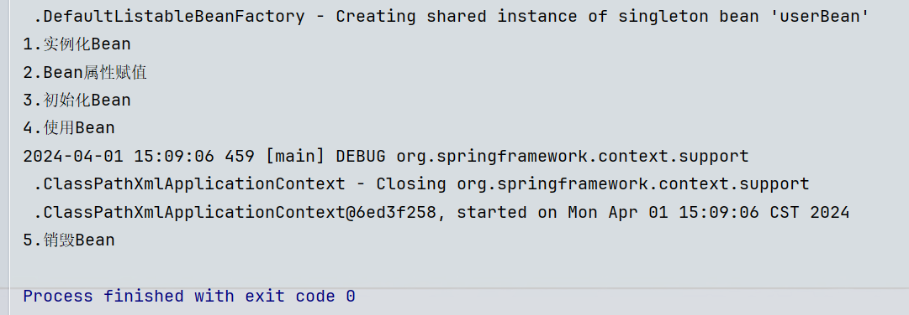
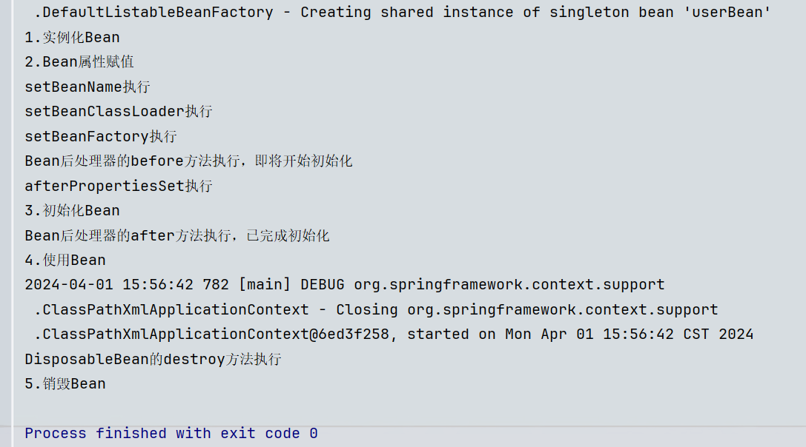

### GoF之工厂模式

```txt
● 设计模式：一种可以被重复利用的解决方案。
● GoF（Gang of Four），中文名——四人组。
● 《Design Patterns: Elements of Reusable Object-Oriented Software》（即《设计模式》一书），1995年由 Erich Gamma、Richard Helm、Ralph Johnson 和 John Vlissides 合著。这几位作者常被称为"四人组（Gang of Four）"。
● 该书中描述了23种设计模式。我们平常所说的设计模式就是指这23种设计模式。
● 工厂模式是解决对象创建问题的，属于创建型设计模式。这里为什么学习工厂模式呢？这是因为Spring框架底层使用了大量的工厂模式。
● 不过除了GoF23种设计模式之外，还有其它的设计模式，比如：JavaEE的设计模式（DAO模式、MVC模式等）。
● GoF23种设计模式可分为三大类：
  ○ 创建型（5个）：解决对象创建问题。
    ■ 单例模式
    ■ 原型模式
    ■ 工厂方法模式
    ■ 抽象工厂模式
    ■ 建造者模式
  ○ 结构型（7个）：一些类或对象组合在一起的经典结构。
    ■ 代理模式
    ■ 装饰模式
    ■ 适配器模式
    ■ 组合模式
    ■ 享元模式
    ■ 外观模式
    ■ 桥接模式
  ○ 行为型（11个）：解决类或对象之间的交互问题。
    ■ 策略模式
    ■ 模板方法模式
    ■ 责任链模式
    ■ 观察者模式
    ■ 迭代子模式
    ■ 命令模式
    ■ 备忘录模式
    ■ 状态模式
    ■ 访问者模式
    ■ 中介者模式
    ■ 解释器模式
```

- #### 工厂模式的三种形态：

  > ● **简单工厂模式**（Simple Factory）：它又叫**静态工厂方法模式**。不属于23种设计模式，只是工厂方法模式的一种特殊实现。
  > ● **工厂方法模式**（Factory Method）：是23种设计模式之一。
  > ● **抽象工厂模式**（Abstract Factory）：是23种设计模式之一。

  - ##### 简单工厂模式：（这个很简单，就是将同类的pojo再进行了一层抽象，然后通过静态方法获取某个类对象）

    > 简单工厂模式的角色包括三个：
    > 	● 抽象产品
    > 	● 具体产品
    > 	● 工厂类

    > 抽象产品角色：（Weapon）

    ```java
    public abstract class Weapon {
        /**
         * 所有的武器都有攻击行为
         */
        public abstract void attack();
    }
    ```

    > 具体产品角色：（Tank、Fighter）

    ```java
    public class Tank extends Weapon{
        @Override
        public void attack() {
            System.out.println("坦克开炮！");
        }
    }
    ```

    ```java
    public class Fighter extends Weapon{
        @Override
        public void attack() {
            System.out.println("战斗机投下原子弹！");
        }
    }
    ```

    > 工厂类角色：（WeaponFactory）

    ```java
    public class WeaponFactory {
        //从武器工厂WeaponFactory的静态方法中获取Weapon
        public static Weapon get(String weaponType){
            if (weaponType == null || weaponType.trim().length() == 0) {
                return null;
            }
            Weapon weapon = null;
            if ("TANK".equals(weaponType)) {
                weapon = new Tank();
            } else if ("FIGHTER".equals(weaponType)) {
                weapon = new Fighter();
            } else if ("DAGGER".equals(weaponType)) {
                weapon = new Dagger();
            } else {
                throw new RuntimeException("不支持该武器！");
            }
            return weapon;
        }
    }
    ```

    ```txt
    简单工厂模式的优点：
    ● 客户端程序不需要关心对象的创建细节，需要哪个对象时，只需要向工厂索要即可，初步实现了责任的分离。客户端只负责“消费”，工厂负责“生产”。生产和消费分离。
    简单工厂模式的缺点：
    ● 缺点1：工厂类集中了所有产品的创造逻辑，形成一个无所不知的全能类，有人把它叫做上帝类。显然工厂类非常关键，不能出问题，一旦出问题，整个系统瘫痪。
    ● 缺点2：不符合OCP开闭原则，在进行系统扩展时，需要修改工厂类。
    ```

    ###### *Spring中的BeanFactory就使用了简单工厂模式*

  - ##### 工厂方法模式：(只是将上面工厂类WeaponFactory又进行了抽象)

    > 工厂方法模式的角色包括：
    > 	● 抽象产品角色
    > 	● 具体产品角色
    >
    > ​	● 抽象工厂角色
    >
    > ​	● 具体工厂角色

    > 产品层类似，将上面的WeaponFactory工厂类，变成了工厂抽象类。抽象工厂角色：（WeaponFactory）

    ```java
    public abstract WeaponFactory {
        Weapon get();
    }
    ```

    > 具体工厂角色：（FighterFactory、TankFactory）

    ```java
    public class FighterFactory extends WeaponFactory{
        @Override
        public Weapon get() {
            return new Fighter();
        }
    }
    ```

    ```java
    public class TankFactory extends WeaponFactory{
        @Override
        public Weapon get() {
            return new Tank();
        }
    }
    ```

    > 测试程序：

    ```java
    public class Test {
        @Test
        public void test() {
            //new不同的工厂对象，get方法拿到对象也不同
            WeaponFactory factory = new GunFactory();
            Weapon weapon = factory.get();
            weapon.attack();
    
            WeaponFactory factory1 = new FighterFactory();
            Weapon weapon1 = factory1.get();
            weapon1.attack();
        }
    }
    ```

    *如果想扩展一个新的产品，只要新增一个产品类，再新增一个该产品对应的工厂即可*

    ```txt
    我们可以看到在进行功能扩展的时候，不需要修改之前的源代码，显然工厂方法模式符合OCP原则。
    工厂方法模式的优点：
    ● 一个调用者想创建一个对象，只要知道其名称就可以了。 
    ● 扩展性高，如果想增加一个产品，只要扩展一个工厂类就可以。
    ● 屏蔽产品的具体实现，调用者只关心产品的接口。
    工厂方法模式的缺点：
    ● 每次增加一个产品时，都需要增加一个具体类和对象实现工厂，使得系统中类的个数成倍增加，在一定程度上增加了系统的复杂度，同时也增加了系统具体类的依赖。这并不是什么好事。
    ```

  - ##### 抽象工厂模式（了解）：

    > 抽象工厂模式相对于工厂方法模式的区别在于：工厂方法模式是针对一个产品系列的，而抽象工厂模式是针对多个产品系列的，就是将weaponFactory又进行了一层抽象而已。即工厂方法模式是一个产品系列一个工厂类，而抽象工厂模式是多个产品系列一个工厂类。
    > 特点：抽象工厂模式是所有形态的工厂模式中最为抽象和最具一般性的一种形态。抽象工厂模式是指当有多个抽象角色时，使用的一种工厂模式。抽象工厂模式可以向客户端提供一个接口，使客户端在不必指定产品的具体的情况下，创建多个产品族中的产品对象。它有多个抽象产品类，每个抽象产品类可以派生出多个具体产品类，一个抽象工厂类，可以派生出多个具体工厂类，每个具体工厂类可以创建多个具体产品类的实例。每一个模式都是针对一定问题的解决方案，工厂方法模式针对的是一个产品等级结构；而抽象工厂模式针对的是多个产品等级结果。
    > 抽象工厂中也是包含4个角色：
    >
    > ​	● 抽象产品角色
    >
    > ​	● 具体产品角色
    >
    > ​	● 抽象工厂角色
    >
    > ​	● 具体工厂角色

    *新添加了水果产品族：*
    
    ```java
    public abstract class Fruit {
        //所有果实都有一个成熟周期
        public abstract void ripeCycle();
    }
    ```
    
    ```java
    public class Orange extends Fruit{
        @Override
        public void ripeCycle() {
            System.out.println("橘子的成熟周期是10个月");
        }
    }
    ```
    
    ```java
    public class Apple extends Fruit{
        @Override
        public void ripeCycle() {
            System.out.println("苹果的成熟周期是8个月");
        }
    }
    ```

    > 抽象工厂角色：（AbstractFactory）
    
    ```java
    public abstract class AbstractFactory {
        public abstract Weapon getWeapon(String type);
        public abstract Fruit getFruit(String type);
    }
    ```

    > 具体工厂角色：（WeaponFactory、FruitFactory）
    
    ```java
    public class WeaponFactory extends AbstractFactory{
    
        public Weapon getWeapon(String type){
            if (type == null || type.trim().length() == 0) {
                return null;
            }
            if ("Gun".equals(type)) {
                return new Gun();
            } else if ("Dagger".equals(type)) {
                return new Dagger();
            } else {
                throw new RuntimeException("无法生产该武器");
            }
        }
    
        @Override
        public Fruit getFruit(String type) {
            return null;
        }
    }
    ```
    
    ```java
    public class FruitFactory extends AbstractFactory{
        @Override
        public Weapon getWeapon(String type) {
            return null;
        }
    
        public Fruit getFruit(String type){
            if (type == null || type.trim().length() == 0) {
                return null;
            }
            if ("Orange".equals(type)) {
                return new Orange();
            } else if ("Apple".equals(type)) {
                return new Apple();
            } else {
                throw new RuntimeException("我家果园不产这种水果");
            }
        }
    }
    ```

    > 测试代码：
    
    ```java
    public class Test {
        @Test
        public void test() {
            // 客户端调用方法时只面向AbstractFactory调用方法。
            AbstractFactory factory = new WeaponFactory(); // 注意：这里的new WeaponFactory()可以采用 简单工厂模式 进行隐藏。
            Weapon gun = factory.getWeapon("Gun");
            Weapon dagger = factory.getWeapon("Dagger");
    
            gun.attack();
            dagger.attack();
    
            AbstractFactory factory1 = new FruitFactory(); // 注意：这里的new FruitFactory()可以采用 简单工厂模式 进行隐藏。
            Fruit orange = factory1.getFruit("Orange");
            Fruit apple = factory1.getFruit("Apple");
    
            orange.ripeCycle();
            apple.ripeCycle();
        }
    }
    ```
    
    ```txt
    抽象工厂模式的优缺点：
    ● 优点：当一个产品族中的多个对象被设计成一起工作时，它能保证客户端始终只使用同一个产品族中的对象。
    ● 缺点：产品族扩展非常困难，要增加一个系列的某一产品，既要在AbstractFactory里加代码，又要在具体的里面加代码。
    ```

------

### Bean的实例化方式

> Spring为Bean提供了多种实例化方式，即为Bean对象的创建提供了多种方案，这样更加灵活。通常包括4种方式：
>
> - （默认）通过无参构造实例化。（要求必须存在无参构造器）
> - 通过<bean>标签的`factory-method`属性，简单工厂模式实例化
> - 通过<bean>标签的`factory-bean`属性，工厂方法模式实例化
> - 通过Spring提供的`FactoryBean`接口实例化，本质也是工厂方法模式实例化

- ##### 通过构造方法实例化：

  我们之前一直使用的就是这种方式。默认情况下，spring上下文对象（spring容器）会调用Bean的无参数构造方法来实例化对象。

- ##### 通过简单工厂模式实例化：

  1. 首先需要给bean类定义工厂类，工厂类中定义静态方法：

     ```java
     public class UserFactory {
         //必须是静态方法
         public static User get(){
             return new User();
         }
     }
     ```

  2. 然后就可以通过<bean>标签的**factory-method**属性将对象实例化方式改为**简单工厂模式**实例化：（class属性值是工厂类）

     ```xml
     <bean id="user" class="com.itheima.bean.UserFactory" factory-method="get"/>
     ```

- ##### 通过factory-bean实例化：（本质上是通过**工厂方法模式**进行的实例化）

  1. 定义工厂类，工厂类中定义实例方法：

     ```java
     public class UserFactory {
         //必须是实例方法
         public User get(){
             return new User();
         }
     }
     ```

  2. 通过<bean>标签的**factory-bean**属性指定bean的工厂对象，**factory-method**属性指定工厂对象的方法名，将对象实例化方式改为**工厂方法模式**实例化：（不用class属性了，但是需要先有工厂对象的beanId）

     ```xml
     <bean id="userFactory" class="com.itheima.bean.UserFactory"/>
     <bean id="userBean" factory-bean="userFactory" factory-method="get"/>
     ```

- ##### 通过FactoryBean接口实例化：

  > 在上面的方式中，factory-bean对象是我们自定义的，factory-method也是我们自己定义的，何必这么麻烦。
  >
  > 在Spring中，当你编写的工厂类直接实现FactoryBean工厂bean接口之后，factory-bean、factory-method都不需要指定了。
  >
  > factory-bean会自动指向实现FactoryBean接口的类，factory-method会自动指向getObject()方法。

  > 编写UserFactoryBean用户工厂bean类，实现FactoryBean接口：

  ```java
  public class UserFactoryBean implements FactoryBean<User> {
      @Override
      public User getObject() throws Exception {
          return new User();
      }
  
      @Override
      public Class<?> getObjectType() {
          return null;
      }
  
      @Override
      public boolean isSingleton() {
          // true表示单例
          // false表示原型
          return true;
      }
  }
  ```

  > 直接通过bean标签的class属性指定UserFactoryBean类，最终实例化的就是User对象：

  ```xml
  <bean id="user" class="com.itheima.bean.UserFactoryBean"/>
  ```

  > 这种方式和上面那种本质上是一回事，就是通过上方factory-bean实例化的方式演变过来的，它也会先创建factory-bean对象，通过调用该对象的实例方法来创建一个bean；
  > 而且在Spring框架中，FactoryBean对象的生命周期与普通的Bean是一样的。实例化完毕bean后，这个FactoryBean不会被销毁，而是会一直存在于Spring容器中，直到Spring容器被关闭。

- ##### BeanFactory和FactoryBean的区别：

  - **FactoryBean**在Spring中是一个接口，被称为“工厂Bean”。“工厂Bean”是一种特殊的Bean类，所有的“工厂Bean”都是用来协助Spring框架来创建对应的Bean对象的。在Spring中的Bean可以分为两类，一类是普通bean一类是工厂bean。
  - **BeanFactory**是spring容器的顶级接口，叫做“Bean工厂”。在spring容器中，Bean工厂负责创建和管理存放Bean对象。

- ##### 除了第一种实例化方式，其他几种实例化方式需要我们自己来new出来对象。为什么提供这么多实例化的方式？

  > Spring给我们提供，静态工厂模式实例化的方式，是为了让我们在实例化对象前，做一些处理。
  >
  > 而工厂方法模式实例化，是为了让我们不仅管理起来该对象，还将创建该对象的工厂对象也管理起来，方便我们使用。
  >
  > （一般我们都是第一种实例化方式，其他几种方式了解即可）

- ##### FactoryBean的使用场景：（注入Date）

  > 我们前面说过，java.util.Date在Spring中虽然被当作简单类型，但是我们还是将它当作复杂类型来用。
  >
  > 也可以通过FactoryBean来注入Date类型的值：

  > 编写DateFactoryBean类，实现FactoryBean接口：（User中有Date类型的birth）

  ```java
  public class DateFactoryBean implements FactoryBean<Date> {
      // 定义属性接收日期字符串
      private String date;
  
      // 通过构造方法给日期字符串属性赋值
      public DateFactoryBean(String date) {
          this.date = date;
      }
      
      //返回Date类型对象
      @Override
      public Date getObject() throws Exception {
          SimpleDateFormat sdf = new SimpleDateFormat("yyyy-MM-dd");
          return sdf.parse(this.date);
      }
  
      @Override
      public Class<?> getObjectType() {
          return null;
      }
  }
  ```

  ```xml
  <bean id="userBean" class="com.itheima.bean.User">
      <property name="birth" ref="dateBean"/>
  </bean>
  
  <bean id="dateBean" class="com.itheima.bean.factory.DateFactoryBean">
      <constructor-arg name="date" value="2023-11-11"/>
  </bean>
  ```

------

### Bean的生命周期

- ##### 什么是Bean的生命周期：

  > - 其实Spring就是一个管理Bean对象的工厂（容器）。它负责对象的创建，对象的销毁等。
  > - 所谓Bean的生命周期就是：spring容器中Bean对象从创建开始到最终销毁的整个过程。
  > - 什么时候创建Bean对象？
  > - 创建Bean对象的前后会调用什么方法？
  > - Bean对象什么时候销毁？
  > - Bean对象的销毁前后调用什么方法？

- ##### 为什么要知道Bean的生命周期：

  > - 生命周期的本质是：在哪个时间节点上，调用了哪个Bean类的哪个方法。我们需要充分的了解在这个生命线上，都有哪些特殊的时间节点。只有我们知道了特殊的时间节点都在哪，到时我们才可以确定代码写到哪。
  > - 因为我们可能需要在某个特殊的时间点上执行一段特定的代码，这段代码就可以放到这个节点上。当生命线走到这里的时候，自然会被调用。

- ##### Bean的生命周期之5步（粗略）：

  > Bean生命周期可以粗略的划分为五大步：
  >
  > - 第1步：实例化Bean
  > - 第2步：属性赋值
  > - 第3步：初始化Bean
  > - 第4步：使用Bean
  > - 第5步：销毁Bean

  > 我们写代码来试一下：编写一个User类

  ```java
  public class User {
      private String name;
  
      public User() {
          System.out.println("1.实例化Bean");
      }
  
      public void setName(String name) {
          this.name = name;
          System.out.println("2.Bean属性赋值");
      }
  
      public void initUser(){
          System.out.println("3.初始化Bean");
      }
  
      public void destroyUser(){
          System.out.println("5.销毁Bean");
      }
  }
  ```

  > 让spring管理起来：

  ```xml
  <!-- init-method属性指定初始化方法，destroy-method属性指定销毁方法 -->
  <bean id="userBean" class="com.itheima.bean.User" init-method="initUser" destroy-method="destroyUser">
      <property name="name" value="张三"/>
  </bean>
  ```

  > 测试代码：

  ```java
  @Test
  public void test5Step(){
      ApplicationContext applicationContext = new ClassPathXmlApplicationContext("spring.xml");
      User user = applicationContext.getBean("userBean", User.class);
      System.out.println("4.使用Bean");
      // 只有正常关闭spring容器才会执行销毁方法
      ClassPathXmlApplicationContext context = (ClassPathXmlApplicationContext) applicationContext;
      context.close();
  }
  ```

  

  ```txt
  需要注意的：
  1、只有正常关闭spring容器，bean的销毁方法才会被调用。
  2、ClassPathXmlApplicationContext类才有close()方法。
  3、<bean>标签的init-method属性指定初始化方法，destroy-method属性指定销毁方法。
  ```

- ##### Bean的生命周期之7步（细分）：

  > 在以上的5步中，第3步是初始化Bean。还可以在初始化Bean前后做点事情，加入“Bean后处理器”即可。步骤如下：

  1. 编写一个类实现**BeanPostProcessor**类，并且重写before和after方法：

     ```java
     public class LogBeanPostProcessor implements BeanPostProcessor {
         @Override
         public Object postProcessBeforeInitialization(Object bean, String beanName) throws BeansException {
             //参数bean和beanName是当前bean对象和对象名，如果你想让当前即将初始化的bean对象做些事情，可以直接用
             System.out.println("Bean后处理器的before方法执行，即将开始初始化");
             return bean;
         }
     
         @Override
         public Object postProcessAfterInitialization(Object bean, String beanName) throws BeansException {
             System.out.println("Bean后处理器的after方法执行，已完成初始化");
             return bean;
         }
     }
     ```

  2. 在bean.xml文件中配置**Bean后处理器**：

     ```xml
     <!-- 配置Bean后处理器。这个bean后处理器将对当前配置文件中的所有bean多加2个生命周期 -->
     <bean class="com.itheima.bean.LogBeanPostProcessor"/>
     ```

- ##### Bean生命周期之10步（最详细）：

  > 就是在上面7步的基础上，又加了3步。分别是：
  >
  > - bean后处理器的before方法执行之前，判断bean是否实现了Aware相关的接口，并执行接口方法
  > - bean后处理器的before方法执行之后，判断bean是否实现了InitializingBean接口，并执行接口方法
  > - bean的销毁之前，判断bean是否实现了DisposableBean接口，并执行接口方法
  >
  > Aware相关的3个接口包括：BeanNameAware、BeanClassLoaderAware、BeanFactoryAware
  >
  > - 当Bean实现了BeanNameAware，Spring会将beanId传递给该Bean的setBeanName(String name)方法
  > - 当Bean实现了BeanClassLoaderAware，Spring会将加载该Bean的类加载器传递给该Bean的setBeanClassLoader()方法
  > - 当Bean实现了BeanFactoryAware，Spring会将该Bean对象对应的工厂对象传递给该方法setBeanFactory(BeanFactory beanFactory)
  
> 代码：
  
```java
  public class User implements InitializingBean, DisposableBean, BeanNameAware, BeanClassLoaderAware, BeanFactoryAware {
      private String name;
  
      public User() {
          System.out.println("1.实例化Bean");
      }
  
      public void setName(String name) {
          this.name = name;
          System.out.println("2.Bean属性赋值");
      }
  
      @Override
      public void setBeanName(String name) {
          System.out.println("setBeanName执行");
      }
      @Override
      public void setBeanClassLoader(ClassLoader classLoader) {
          System.out.println("setBeanClassLoader执行");
      }
      @Override
      public void setBeanFactory(BeanFactory beanFactory) throws BeansException {
          System.out.println("setBeanFactory执行");
      }
  
      @Override
      public void afterPropertiesSet() throws Exception {
          System.out.println("afterPropertiesSet执行");
      }
  
      public void initUser(){
          System.out.println("3.初始化Bean");
      }
  
      @Override
      public void destroy() throws Exception {
          System.out.println("DisposableBean的destroy方法执行");
      }
  
      public void destroyUser(){
          System.out.println("5.销毁Bean");
      }
  }
  ```
  


------

- ##### Bean的作用域不同，管理方式不同：

  > Spring是根据Bean的作用域scope属性的值，来选择对bean的管理方式。
  >
  > - 对于singleton的Bean，Spring 能够精确地知道该Bean何时被创建，何时初始化完成，以及何时被销毁。
  > - 而对于prototype的Bean，Spring 只负责创建，当容器创建了 Bean 的实例后，Bean 的实例就交给程序员来管理，Spring 容器将不再跟踪其生命周期。相当于bean的生命周期只到**使用Bean**这一步，后面2个销毁阶段就没有了。

- ##### 自己new的对象如何让Spring管理：

  > 有些时候可能会遇到这样的需求，某个java对象是我们自己new的，然后我们希望这个对象被Spring容器管理。可以这样做：

  ```java
  @Test
  public void testSelf(){
      // 自己new的对象
      User user = new User();
      System.out.println(user);
  
      // 创建，默认可列表bean工厂对象（DefaultListableBeanFactory）
      DefaultListableBeanFactory factory = new DefaultListableBeanFactory();
      // 注册Bean（beanId不会和配置文件中的beanId发生冲突）
      factory.registerSingleton("userBean", user);
      // 通过上面new的工厂对象来获取bean
      User userBean = factory.getBean("userBean", User.class);
      System.out.println(userBean);
  }
  ```


------

### Bean的循环依赖问题

> 什么是**Bean的循环依赖**：A对象中有B属性。B对象中有A属性。这就是循环依赖。我依赖你，你也依赖我。比如：丈夫类Husband，妻子类Wife。Husband中有Wife的引用。Wife中有Husband的引用。

###### 像这种循环依赖的情况spring能够应付的了吗？我们需要分情况来说明：

- **singleton**的**set注入**产生的循环依赖：这种情况下的循环依赖是**没问题**的（无论哪个bean，有一个singleton就行）。原理是：

  > 因为这种方式可以做到，将“实例化Bean”和“给Bean属性赋值”这两个动作分开去完成。
  > 实例化Bean的时候调用无参数构造方法来完成。此时先不给属性赋值，先将该“单例”Bean对象“曝光”给外界；然后再对曝光的Bean对象的属性进行赋值操作（调用setter）。
  > 核心原因是：两个步骤是完全可以分离开去完成的。
  > 注意：只有scope是singleton的bean对象，才会使用“曝光”机制。这也是为什么，在set注入时，我们的bean标签的顺序可以随便写。

- **其他情况下都会出现异常**

- prototype下的set注入产生的循环依赖：会出现异常。因为两个对象都是singleton的，有很多个。

- singleton下的**构造注入产生的循环依赖**：一定会出现异常。根本原因是，构造注入是创建对象的同时进行的赋值，两个步骤没有分开，根本没法曝光。

- Spring解决循环依赖的机理：

  > 那么在Spring框架底层源码级别上是如何实现的呢？如下，在DefaultSingletonBeanRegistry类中，有这三个重要的Map集合：
  >
  > - private final Map<String, Object> singletonObjects：一级缓存，存储的都是单例的、已经赋过值的bean对象
  > - private final Map<String, Object> earlySingletonObjects：二级缓存，存储的是早期的单例bean对象，没赋值
  > - private final Map<String, ObjectFactory<?>> singletonFactories：三级缓存，存储的是单例的工厂对象，每一个都有对应的单例bean，它们是创建bean的实例BeanFactory对象。
  >
  > 再分析源码，从源码中可以看到，spring会先从一级缓存中获取Bean，如果获取不到，则从二级缓存中获取Bean，如果二级缓存还是获取不到，则从三级缓存中获取之前曝光的ObjectFactory对象，通过ObjectFactory对象创建该单例Bean对象，然后立马将该bean放在了二级缓存中（没赋值）。这样在set赋值阶段就可以从这里拿到该对象进行赋值，就解决了循环依赖的问题。

- **总结**：

  > Spring只能解决**setter**注入的**单例**bean之间的循环依赖。ClassA依赖ClassB，ClassB又依赖ClassA，形成依赖闭环。Spring在创建ClassA对象后，不需要等给属性赋值，直接将其曝光到bean缓存当中。在解析ClassA的属性时，又发现依赖于ClassB，再次去获取ClassB，当解析ClassB的属性时，又发现需要ClassA的属性，但此时的ClassA已经被提前曝光加入了正在创建的bean的缓存中，则无需创建新的的ClassA的实例，直接从缓存中获取即可。从而解决循环依赖问题。

------

