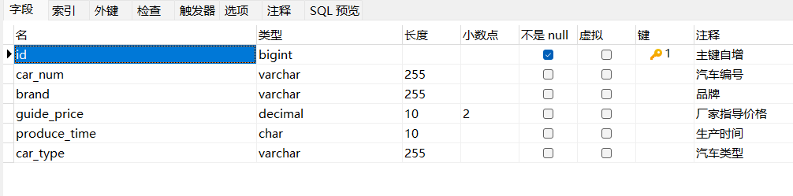
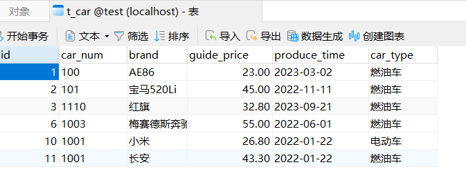
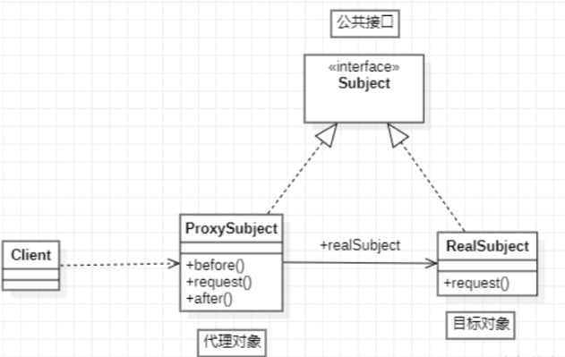

### 注解式开发

> 注解的存在主要是为了简化XML的配置。**Spring6倡导全注解开发**。

- ##### 声明Bean的注解：（@Component、@Controller、@Service、@Repository）

  > 它们的源码如下：都是只有value属性，用来指定beanId的

  ```java
  @Target(value = {ElementType.TYPE})
  @Retention(value = RetentionPolicy.RUNTIME)
  public @interface Component {
      String value();
  }
  //-------------------------------------------------
  @Target({ElementType.TYPE})
  @Retention(RetentionPolicy.RUNTIME)
  @Documented
  @Component
  public @interface Controller {
      @AliasFor(
          annotation = Component.class
      )
      String value() default "";
  }
  //-------------------------------------------------
  @Target({ElementType.TYPE})
  @Retention(RetentionPolicy.RUNTIME)
  @Documented
  @Component
  public @interface Service {
      @AliasFor(
          annotation = Component.class
      )
      String value() default "";
  }
  //-------------------------------------------------
  @Target({ElementType.TYPE})
  @Retention(RetentionPolicy.RUNTIME)
  @Documented
  @Component
  public @interface Repository {
      @AliasFor(
          annotation = Component.class
      )
      String value() default "";
  }
  ```

  ###### 通过源码可以看到，@Controller、@Service、@Repository都是@Component注解的别名而已，功能都一样，用哪个都可以。只是为了增强可读性，建议：

  > 控制器类上使用：@Controller
  > service类上使用：@Service
  > dao类上使用：@Repository
  >
  > 其他用：@Component
  >
  > （注意：是类上使用，接口、静态工具类、抽象类不需要被Spring管理去实例化，只有可以new的**无状态**类才需要被spring管理）

- ##### Spring注解的使用：

  加入aop的依赖：我们可以看到当加入spring-context依赖之后，会关联加入aop的依赖。所以这一步不用做。

  在配置文件中添加context命名空间（因为要用context标签），然后通过context标签指定要扫描的包：

  ```xml
  <?xml version="1.0" encoding="UTF-8"?>
  <beans xmlns="http://www.springframework.org/schema/beans"
         xmlns:xsi="http://www.w3.org/2001/XMLSchema-instance"
         xmlns:context="http://www.springframework.org/schema/context"
         xsi:schemaLocation="http://www.springframework.org/schema/beans http://www.springframework.org/schema/beans/spring-beans.xsd
                             http://www.springframework.org/schema/context http://www.springframework.org/schema/context/spring-context.xsd">
      <!-- 指定要扫描的包，多个包用,隔开。如果要扫描多个包，也可以指定它们的父包 -->
      <context:component-scan base-package="com.itheima.bean,com.itheima.dao"/>
  </beans>
  ```

  在Bean类上使用注解：（如果没有指定beanId，那么**默认是Bean类名首字母小写**）

  ```java
  @Component("userBean")
  public class User {
  }
  ```

  > 测试下：

  ```java
  public class AnnotationTest {
      @Test
      public void testBean(){
          ApplicationContext applicationContext = new ClassPathXmlApplicationContext("spring.xml");
          User userBean = applicationContext.getBean("userBean", User.class);
          System.out.println(userBean);
      }
  }
  ```

- ##### 选择性实例化Bean：

  > 假设在某个包下有很多Bean，有的Bean上标注了Component，有的标注了Controller，有的标注了Service，有的标注了Repository。
  >
  > 现在由于某种特殊业务的需要，只允许其中所有的Controller参与Bean管理，其他的都不实例化。这应该怎么办呢？
  >
  > spring配置文件中这样做：

  ```xml
  <!-- use-default-filters="true"表示使用spring的默认规则，只要有Component、Controller、Service、Repository中的任意一个注解标注，都让spring来管理；false表示不使用spring默认的管理规则，即使有这些注解，也不管 -->
  <context:component-scan base-package="com.itheima.bean" use-default-filters="false">
  	<!-- 内部使用include标签，表示只管理有@Controller注解标注的bean -->
      <context:include-filter type="annotation" expression="org.springframework.stereotype.Controller"/>
      <!-- 或者设置为true，默认也是true。用exclude标签来表示，去掉哪些注解不管理 -->
  <!--<context:exclude-filter type="annotation" expression="org.springframework.stereotype.Controller"/>-->
  </context:component-scan>
  ```

- ##### 使用注解来注入：（这些注解负责给Bean属性赋值）

  > 要使用这些注解，需要在spring配置文件中配置标签`<context:annotaion-config>`。如果配置了上面的包扫描标签，那么该标签可以省略。所以了解即可。

  - `@Value`：注入简单类型。它可以出现在属性上、setter方法上、构造方法的形参上。（也可以用来获取`.properties`文件中的内容）

    ```java
    @Value("20")
    private int age;
    //没有给属性提供setter方法或构造器，仍然可以完成属性赋值。因为spring在某些情况下会使用反射等机制来绕过限制
    ```

  - `@Autowired`和`@Qualifier`：

    - `@Autowired`注解可以用来注入非简单类型。译为：自动连线的或自动装配的。单独使用`@Autowired`注解，默认**根据类型**装配。该注解可以出现在：构造方法上、方法上、形参上、属性上、注解上。甚至**当只有一个有参构造时，Autowired注解还可以省略**。

      **注意**：该注解有一个**required**属性，默认值是true，表示在注入的时候要求被注入的Bean必须是存在的，如果不存在则报错。如果required属性设置为false，表示注入的Bean存在或者不存在都没关系，存在的话就注入，不存在的话也不报错。

    - `@Autowired`和`@Qualifier`联合使用可以根据名字进行自动装配，此时必须在`@Qualifier`注解中指定Bean的Id

  - `@Resource`：它也可以完成非简单类型的注入，那么和上面两个注解的区别是什么呢？

    > - `@Resource`注解是JDK扩展包中的，属于JDK的一部分，所以它是标准注解，更加通用。而`@Autowired`是Spring框架中的。
    > - `@Resource`注解默认是根据名称装配byName，未指定name时，使用属性名作为name。通过name找不到的话会自动byType装配。底层也是通过反射机制。不依赖构造器和setter
    > - `@Resource`注解只能在属性上、setter()上。而`@Autowired`可以在属性、setter方法、构造方法、构造方法参数上，都可以。
    > - `@Resource`注解属于JDK扩展包，所以不在JDK当中，需要额外引入以下依赖：（高于JDK11或低于JDK8都需要引入）
    
    ```xml
    <!-- 这是spring6的@resource注解依赖 -->
    <dependency>
      <groupId>jakarta.annotation</groupId>
      <artifactId>jakarta.annotation-api</artifactId>
      <version>2.1.1</version>
    </dependency>
    ```
    
    > 一定要注意：如果你用Spring6，要知道Spring6不再支持JavaEE，它支持的是JakartaEE9。Oracle把JavaEE捐献给Apache软件基金会了，Apache把JavaEE的名字改成JakartaEE了，大家之前所接触的所有的【javax.】包名统一修改为【jakarta.*】了。spring6之前依赖用这个：

    ```xml
    <dependency>
        <groupId>javax.annotation</groupId>
        <artifactId>javax.annotation-api</artifactId>
        <version>1.3.2</version>
    </dependency>
    ```

- ##### 全注解式开发：

  > 所谓的全注解开发就是，不再使用spring核心配置文件了，写一个配置类来代替配置文件。（配置类用`@Configuration`注解标注）

  ```java
  //@Configuration注解表示该类是spring核心配置类，下面使用@ComponentScan注解来替代扫描包的标签
  @Configuration
  @ComponentScan({"com.itheima.dao", "com.itheima.service"})//该注解不写扫描位置，默认扫描，该类所在包下的所有类
  public class SpringConfiguration {}
  ```
  
  > 测试程序：（不再new ClassPathXmlApplicationContext()了）
  
  ```java
  @Test
  public void testNoXml(){
      ApplicationContext applicationContext = new AnnotationConfigApplicationContext(SpringConfiguration.class);
      UserService user = applicationContext.getBean("userBean", userBean.class);
      System.out.println(user);
  }
  ```

------

> Spring的IoC已经学完了，接下来学Spring的AOP。在学AOP之前，我们先来用下Spring的JDBC模板工具JdbcTemplate：

------

### JdbcTemplate

> JdbcTemplate是Spring提供的一个JDBC模板类，是对JDBC的封装，简化JDBC代码。接下来我们简单来学习一下，使用JdbcTemplate完成增删改查。（当然，你也可以让Spring集成其它的ORM框架，MyBatis、Hibernate等）

###### xxxxxxxxxx <!-- 日期格式化 --><p th:text="${#dates.format(user.birth,'yyyy-MM-dd HH:mm')}"></p>html

- 数据库表：（还是mybatis中用的t_car表）

  

  

- 由于要使用Spring DAO模板，除了spring-context依赖，还需要引入spring-jdbc依赖。

  - 然后新建一个Car的pojo类，我们通过JdbcTemplate对象就可以完成所有的增删改查，所以在spring容器配置文件中将该类管理起来，让spring容器帮我们创建该类的对象。
  - 还要给该对象的dataSource属性注入数据源（Druid、C3P0等），这里我们先自己写一个数据源。新建utils包，里面创建MyDataSource工具类，实现DataSource接口，重写getConnection()，提供实例属性driver、url、username、password，创建并引入jdbc.properties文件。最后就可以创建测试用例来使用JdbcTemplate了：
  
  ```xml
  <?xml version="1.0" encoding="UTF-8"?>
  <beans xmlns="http://www.springframework.org/schema/beans"
         xmlns:xsi="http://www.w3.org/2001/XMLSchema-instance"
         xmlns:context="http://www.springframework.org/schema/context"
         xsi:schemaLocation="http://www.springframework.org/schema/beans http://www.springframework.org/schema/beans/spring-beans.xsd
                             http://www.springframework.org/schema/context http://www.springframework.org/schema/context/spring-context.xsd">
      <!-- 引入jdbc.properties文件 -->
      <context:property-placeholder location="jdbc.properties"/>
  
      <!-- 配置自己写的数据源 -->
      <bean name="dataSourceBean" class="com.itheima.utils.MyDataSource">
          <constructor-arg name="driver" value="${jdbc.driver}"/>
          <constructor-arg name="url" value="${jdbc.url}"/>
          <constructor-arg name="username" value="${jdbc.username}"/>
          <constructor-arg name="password" value="${jdbc.password}"/>
      </bean>
  
      <!-- 管理spring写好的JdbcTemplate类，通过这个类就能完成增删改查 -->
      <bean name="jdbcTempleteBean" class="org.springframework.jdbc.core.JdbcTemplate">
          <!-- 需要注入数据源，这是一定的。这里用我们自己的数据源 -->
          <property name="dataSource" ref="dataSourceBean"/>
      </bean>
  </beans>
  ```
  

------

- #### 增、删、改：（增删改的sql，都是用的update()方法）

  ```java
  @Test
  public void testInsert(){
      // 获取JdbcTemplate对象
      ApplicationContext applicationContext = new ClassPathXmlApplicationContext("spring.xml");
      JdbcTemplate jdbcTemplate = applicationContext.getBean("jdbcTempleteBean", JdbcTemplate.class);
      // 执行插入操作
      // 注意：
      //update方法有两个参数：第1个参数是要执行的SQL语句（会有占位符），第2个参数是可变长参数，用于给占位符传值
      String sql = "insert into t_car values(null,?,?,?,?,?)";
      int count = jdbcTemplate.update(sql, "102", "奔驰", 32.00, "2021-09-22", "燃油车");//或直接传Object[]
      System.out.println("插入的记录条数：" + count);
  }
  ```

  ```java
  @Test
  public void testDelete(){
      ApplicationContext applicationContext = new ClassPathXmlApplicationContext("spring.xml");
      JdbcTemplate jdbcTemplate = applicationContext.getBean("jdbcTempleteBean", JdbcTemplate.class);
      // 执行delete
      String sql = "delete from t_car where id = ?";
      int count = jdbcTemplate.update(sql, 1);
      System.out.println("删除了几条记录：" + count);
  }
  ```

  ```java
  @Test
  public void testUpdate(){
      ApplicationContext applicationContext = new ClassPathXmlApplicationContext("spring.xml");
      JdbcTemplate jdbcTemplate = applicationContext.getBean("jdbcTempleteBean", JdbcTemplate.class);
      // 执行更新操作
      String sql = "update t_car set car_num=? where id=?";
      int count = jdbcTemplate.update(sql,  "1000", 2);
      System.out.println("更新的记录条数：" + count);
  }
  ```

- #### 查一个：（queryForObject）

  ```java
  @Test
  public void testSelectOne(){
      ApplicationContext applicationContext = new ClassPathXmlApplicationContext("spring.xml");
      JdbcTemplate jdbcTemplate = applicationContext.getBean("jdbcTempleteBean", JdbcTemplate.class);
      // 执行select
      String sql = "select * from t_car where id = ?";
      /* queryForObject方法的3个参数：
          参数1：sql语句
          参数2：Bean属性值和数据库记录行的映射对象BeanPropertyRowMapper。在构造方法中指定映射的java对象类型
          参数3：可变长参数，给sql的占位符传值
      */
      Car car = jdbcTemplate.queryForObject(sql, new BeanPropertyRowMapper<Car>(Car.class), 2);
      System.out.println(car);
  }
  ```

- #### 查值：（queryForObject）

  ```java
  //查值
  @Test
  public void testSelectOneValue(){
      ApplicationContext applicationContext = new ClassPathXmlApplicationContext("spring.xml");
      JdbcTemplate jdbcTemplate = applicationContext.getBean("jdbcTempleteBean", JdbcTemplate.class);
      // 执行select
      String sql = "select count(*) from t_car";
      Integer count = jdbcTemplate.queryForObject(sql, int.class);//Integer.class也可以
      System.out.println("总记录条数：" + count);
  }
  ```

- #### 查多个：（query）

  ```java
  @Test
  public void testSelectAll(){
      ApplicationContext applicationContext = new ClassPathXmlApplicationContext("spring.xml");
      JdbcTemplate jdbcTemplate = applicationContext.getBean("jdbcTempleteBean", JdbcTemplate.class);
      // 执行select
      String sql = "select * from t_car";
      List<Car> cars = jdbcTemplate.query(sql, new BeanPropertyRowMapper<>(Car.class));
      System.out.println(cars);
  }
  ```

- #### 批量增、删、改：（batchUpdate）

  ```java
  @Test
  public void testAddBatch(){
      ApplicationContext applicationContext = new ClassPathXmlApplicationContext("spring.xml");
      JdbcTemplate jdbcTemplate = applicationContext.getBean("jdbcTempleteBean", JdbcTemplate.class);
      // 批量添加
      String sql = "insert into t_car values(null,?,?,?,?,?)";
  
      //用Object[]给一条记录的值封装起来，然后将多条记录装进List集合
      Object[] row1 = {"1111", "小米汽车", 29.8, "2024-04-22", "电动车"};
      Object[] row2 = {"1100", "大众汽车", 29.8, "2024-04-22", "电动车"};
      Object[] row3 = {"2100", "长安汽车", 29.8, "2024-04-22", "电动车"};
      List<Object[]> list = new ArrayList<>();
      list.add(row1);
      list.add(row2);
      list.add(row3);
  
      //第二个参数传进去list集合
      int[] count = jdbcTemplate.batchUpdate(sql, list);
      System.out.println(Arrays.toString(count));
  }
  ```

- #### 使用回调函数：（可以控制更多JDBC细节）

  ```java
  @Test
  public void testCallback(){
      // 获取JdbcTemplate对象
      ApplicationContext applicationContext = new ClassPathXmlApplicationContext("spring.xml");
      JdbcTemplate jdbcTemplate = applicationContext.getBean("jdbcTempleteBean", JdbcTemplate.class);
      String sql = "select * from t_car where id=?";
  
      //传进去一个PreparedStatementCallback的匿名内部类，在里面控制jdbc代码
      Car car = jdbcTemplate.execute(sql, new PreparedStatementCallback<Car>() {
          @Override
          public Car doInPreparedStatement(PreparedStatement ps) throws SQLException, DataAccessException {
              Car car = null;
              //从jdbc第3步，预编译sql语句对象之后，开始控制
              ps.setInt(1, 6);
              ResultSet rs = ps.executeQuery();
              if (rs.next()) {
                  car = new Car(rs.getLong("id"),
                                rs.getString("car_num"),
                                rs.getString("brand"),
                                rs.getDouble("guide_price"),
                                rs.getString("produce_time"),
                                rs.getString("car_type"));
              }
              return car;
          }
      });
      System.out.println(car);
  }
  ```

- #### 使用德鲁伊连接池：

  1. 引入依赖：

     ```xml
     <dependency>
       <groupId>com.alibaba</groupId>
       <artifactId>druid</artifactId>
       <version>1.2.16</version>
     </dependency>
     ```

  2. 不用new DruidDataSource()对象了，让spring管理起来：

     ```xml
     <bean id="druidDataSource" class="com.alibaba.druid.pool.DruidDataSource">
         <property name="driverClassName" value="com.mysql.cj.jdbc.Driver"/>
         <property name="url" value="jdbc:mysql://localhost:3306/spring6"/>
         <property name="username" value="root"/>
         <property name="password" value="root"/>
     </bean>
     ```

------

### GoF之代理模式（数据代理）

> 代理模式是GoF23种设计模式之一，属于结构型设计模式。代理模式的作用是：为其他对象提供一种代理，以控制对这个对象的访问。在某些情况下，一个客户不想或者不能直接引用一个对象，此时可以通过一个称之为“代理”的第三者来实现间接引用。代理对象可以在客户端和目标对象之间起到中介的作用，并且可以通过代理对象去掉客户不应该看到的内容和服务或者添加客户需要的额外服务。 通过引入一个新的对象来实现对真实对象的操作或者将新的对象作为真实对象的一个替身，这种实现机制即为代理模式，通过引入代理对象来间接访问一个对象，这就是代理模式的模式动机。
>
> 代理模式中有一个非常重要的特点：**对于使用的用户来说，使用代理对象时就像在使用目标对象一样。**
>
> 使用代理模式不但可以让目标受到保护，代码也可以得到复用。

- #### 代理模式中的角色：

  - 代理类
  - 目标类
  - 代理类和目标类的公共接口（或公共父类）：用户在使用代理类时就像在使用目标类，不被用户所察觉，所以代理类和目标类要有共同的行为，也就是实现共同的接口（或父类）。

- #### 代理模式的类图：

  

- #### 代理模式的使用场景：

  - 在程序中，对象A和对象B无法直接交互，目标需要被保护时
  - 在程序中，功能需要增强时

###### 代理模式在代码实现上，包括两种形式：静态代理和动态代理

- #### 静态代理：

  > 现在有这样一个接口和实现类：

  ```java
  public interface OrderService {
      // 生成订单
      void generate();
      // 查看订单详情
      void detail();
      // 修改订单
      void modify();
  }
  ```

  ```java
  public class OrderServiceImpl implements OrderService {
      public void generate() {
          //生成订单的具体代码
          xxx...
      }
      public void detail() {
          //查看订单的具体代码
          xxx...
      }
      public void modify() {
          //修改订单的具体代码
          xxx...
      }
  }
  ```

  > 项目已上线，并且运行正常，只是客户反馈系统有一些地方运行较慢，要求项目组对系统进行优化。于是项目负责人就下达了这个需求。首先需要搞清楚是哪些业务方法耗时较长，于是让我们统计每个业务方法所耗费的时长。如果是你，你该怎么做呢？

  > 方案1：直接在源码中添加统计时长的代码，然后运行一遍看看耗费的时长。
  >
  > 这个肯定不行，项目运行的好好的，不能改代码

  > 方案2：编写一个子类继承OrderServiceImpl，在子类中重写每个方法，代码如下：

  ```java
  package com.powernode.mall.service.impl;
  
  /**
   * @author 动力节点
   * @version 1.0
   * @className OrderServiceImplSub
   * @since 1.0
   **/
  public class OrderServiceImplSub extends OrderServiceImpl{
      public void generate() {
          long begin = System.currentTimeMillis();
          super.generate();
          long end = System.currentTimeMillis();
          System.out.println("耗时"+(end - begin)+"毫秒");
      }
      public void detail() {
          long begin = System.currentTimeMillis();
          super.detail();
          long end = System.currentTimeMillis();
          System.out.println("耗时"+(end - begin)+"毫秒");
      }
      public void modify() {
          long begin = System.currentTimeMillis();
          super.modify();
          long end = System.currentTimeMillis();
          System.out.println("耗时"+(end - begin)+"毫秒");
      }
  }
  ```

  > 这种通过继承来实现的方式虽然可以解决，但是存在两个问题：
  >
  > 1. 假设系统中有100个这样的业务类，需要提供100个子类，源代码要写太多了，类爆炸。
  > 2. 由于采用了继承的方式，导致代码之间的耦合度较高。而且之前写好的，创建Service对象的代码，都要修改为创建子类对象。也要改代码。所以这种方案也不可取。

  > 方案3：使用静态代理（先采用静态代理，写一个代理类实现OrderService接口）

  ```java
  public class OrderServiceProxy implements OrderService{ // 代理对象
      // 目标对象
      private OrderService orderService;
  
      // 通过构造方法将目标对象传递给代理对象
      public OrderServiceProxy(OrderService orderService) {
          this.orderService = orderService;
      }
  
      public void generate() {
          long begin = System.currentTimeMillis();
          // 执行目标对象的目标方法
          orderService.generate();
          long end = System.currentTimeMillis();
          System.out.println("耗时"+(end - begin)+"毫秒");
      }
      public void detail() {
          long begin = System.currentTimeMillis();
          // 执行目标对象的目标方法
          orderService.detail();
          long end = System.currentTimeMillis();
          System.out.println("耗时"+(end - begin)+"毫秒");
      }
      public void modify() {
          long begin = System.currentTimeMillis();
          // 执行目标对象的目标方法
          orderService.modify();
          long end = System.currentTimeMillis();
          System.out.println("耗时"+(end - begin)+"毫秒");
      }
  }
  ```

  > 方案3的优点：符合OCP开闭原则，由于采用的是关联关系（实现），所以程序的耦合度相比于继承要低很多。故该方案被推荐。

  > 测试代码：
  >
  > ```java
  > public class Client { //用户来使用代理模式
  >  public static void main(String[] args) {
  >      // 创建目标对象
  >      OrderService target = new OrderServiceImpl();
  >      // 创建代理对象。将目标传给代理
  >      OrderService proxy = new OrderServiceProxy(target);
  >      // 调用代理对象的代理方法
  >      proxy.generate();
  >      proxy.modify();
  >      proxy.detail();
  >  }
  > }
  > ```
  >

  > 这就是静态代理，其中OrderService接口是代理类和目标类的公共接口。OrderServiceImpl是目标类。OrderServiceProxy是代理类。

  *思考一下：如果系统中业务接口很多，一个接口要写一个代理类，显然工作量也很大，也会导致类爆炸。怎么解决这个问题？*

  *动态代理可以解决。因为在动态代理中可以在内存中动态的为我们生成代理类的字节码。代理类不需要我们写了，类爆炸解决了，而且代码只需要写一次，代码也会得到复用，不需要大量的工作。*

- #### 动态代理：

  > 在程序运行阶段，在内存中动态生成代理类，去完成动态代理。动态代理是为了减少代理类的源代码数量，解决代码复用的问题。
  > 常见的，可以在程序运行时，在内存中动态生成类可以用反射机制，不过麻烦。常用的动态代理的类库有：
  >
  > - JDK动态代理技术：**只能代理接口**。
  > - CGLIB动态代理技术：CGLIB(Code Generation Library)是一个开源项目。是一个强大的，高性能，高质量的Code生成类库，它可以在运行期扩展Java类与实现Java接口。它既可以代理接口，又可以代理类，**底层是通过继承的方式实现**的。性能比JDK的动态代理要好。（底层有一个小而快的字节码处理框架ASM）
  > - Javassist动态代理技术：Javassist是一个开源的分析、编辑和创建Java字节码的类库。是由东京工业大学的数学和计算机科学系的Shigeru Chiba （千叶 滋）所创建的。它已加入了开放源代码JBoss 应用服务器项目，通过使用Javassist对字节码操作为JBoss实现动态"AOP"框架
  
  > 看下cglib和jdk如何实现动态代理，Spring的AOP底层就是用的它们俩：（还用上面的目标类OrderServiceImpl和公共父接口OrderService）
  
  - **JDK动态代理**：（**只能代理接口**）之前我们写静态代理的时候，除了目标类和公共接口，还写了代理类OrderServiceProxy。但是现在我们不需要了，这个类的代码我们通过JDK提供的方法，在程序运行时通过反射机制自动生成。
  
    > 直接写客户端程序来使用JDK动态代理：
  
    ```java
    public class Client {
        public static void main(String[] args) {
            // 1、创建目标对象
            OrderService target = new OrderServiceImpl();
            // 2、创建代理类对象。用JDK反射包下的Proxy类的静态方法来动态生成代理类
            OrderService orderServiceProxy = Proxy.newProxyInstance(target.getClass().getClassLoader(),
                                                                    target.getClass().getInterfaces(),
                                                                    调用处理器对象);
            // 3、调用代理对象的代理方法
            orderServiceProxy.detail();
            orderServiceProxy.modify();
            orderServiceProxy.generate();
        }
    }
    ```
  
    > `java.lang.reflect.Proxy`是JDK的一个类。通过这个类可以在运行时动态生成代理类。关于`newProxyInstance()`的参数：
    >
    > - 参数1：创建该代理类所使用的类加载器。反射机制动态生成类是通过Java的类加载器来完成的，所以要指定类加载器
    > - 参数2：目标类和代理类的公共父接口（数组）。代理类和目标类需要实现相同的父接口，所以要指定代理类需要实现哪些接口
    > - 参数3：**调用处理器（java.lang.reflect.InvocationHandler）**。由于代理类中的增强代码需要我们自己写，所以我们需要编写一个类实现该接口去写增强代码，然后将该对象传进来。**之后生成的代理对象，在每次调用代理方法时，实际上是调用的接口的`invoke()`方法，并将代理方法名和参数传了进去，然后invoke中就可以通过反射机制去调用目标对象的目标方法，并在前后加上自定义的增强代码**
    >
    > 所以接下来我们要写一下`java.lang.reflect.InvocationHandler`接口的实现类，实现接口中的invoke方法。如：
  
    ```java
    public class TimerInvocationHandler implements InvocationHandler {
        public Object invoke(Object proxy, Method method, Object[] args) throws Throwable {
            return null;
        }
    }
    ```
  
    > invoke方法上有3个参数：
    >
    > - 参数1：Object proxy。代理对象，就是上面的orderServiceProxy。设计这个参数是为了后期的方便，如果想在invoke方法中使用代理对象的话，尽管通过这个参数来使用。
    > - 参数2：Method method。目标对象的目标方法。
    > - 参数3：Object[] args。目标方法的参数。
    >
  
    > 我们将来肯定是在invoke中调用“目标方法”的，但是要用反射调用目标方法的话，需要“目标对象”的存在，“目标对象”从哪儿来呢？
    >
    > 我们可以给TimerInvocationHandler提供一个有参构造，通过这个构造方法进去“目标对象”，代码如下：
  
    ```java
    public class TimerInvocationHandler implements InvocationHandler {
        // 目标对象
        private Object target;
        // 通过构造方法来传目标对象
        public TimerInvocationHandler(Object target) {
            this.target = target;
        }
        public Object invoke(Object proxy, Method method, Object[] args) throws Throwable {
            return null;
        }
    }
    ```
  
    > 有了目标对象，我们就可以在invoke()方法中调用目标方法来完成代码的增强了。如下：
  
    ```java
    public class TimerInvocationHandler implements InvocationHandler {
        // 目标对象
        private Object target;
        // 通过构造方法来传目标对象
        public TimerInvocationHandler(Object target) {
            this.target = target;
        }
        //这个invoke方法在每次调用代理对象的代理方法时，都会调用invoke方法并将目标对象的目标方法作为参数传进去
        public Object invoke(Object proxy, Method method, Object[] args) throws Throwable {
            // ---------前增强------------
            long begin = System.currentTimeMillis();
            // 调用目标对象的目标方法
            Object retValue = method.invoke(target, args);
            // ---------后增强------------
            long end = System.currentTimeMillis();
            System.out.println("耗时"+(end - begin)+"毫秒");
            // 目标方法的执行结果在这里返回，否则代理方法将没有返回结果
            return retValue;
        }
    }
    ```
  
    > 接下来写Client程序测试JDK动态代理：
  
    ```java
    public class Client {
        public static void main(String[] args) {
            // 创建目标对象
            OrderService target = new OrderServiceImpl();
            // 创建代理对象
            OrderService orderServiceProxy = (OrderService) Proxy.newProxyInstance(target.getClass().getClassLoader(),
                                                                                  target.getClass().getInterfaces(),
                                                                                   new TimerInvocationHandler(target));
    		//在每次调用代理方法时，实际上是调用的接口的`invoke()`方法，并将代理方法名和参数传了进去，然后invoke中就可以通过反射机制去调用目标对象的目标方法，并在前后加上自定义的增强代码
            orderServiceProxy.detail();
            orderServiceProxy.modify();
            orderServiceProxy.generate();
        }
    }
    ```
  
    > 我们可以看到，不管有多少个目标接口和目标类，增强代码TimerInvocationHandler只需要写一次，代码得到了复用。
    >
  
  - **CGLIB动态代理**：（和javassist一样，jdk9之后，第三方的代理的使用需要在运行时加两个参数）CGLIB既可以代理接口，又可以代理类。**底层采用继承**（方案2）的方式实现。所以被代理的目标类**不能被final修饰**
  
    1. 使用第三方的工具，首先需要引入依赖jar包：
  
       ```xml
       <dependency>
         <groupId>cglib</groupId>
         <artifactId>cglib</artifactId>
         <version>3.3.0</version>
       </dependency>
       ```
  
    2. cglib不需要目标接口也可以实现代理，先将公共接口删掉。（因为底层采用的继承来实现的。动态代理，所以没有类爆炸一说）直接写用户端程序：
  
       ```java
       public class Client {
           public static void main(String[] args) {
               // 创建字节码增强器
               Enhancer enhancer = new Enhancer();
               // 告诉cglib要继承哪个类
               enhancer.setSuperclass(OrderServiceImpl.class);
               // 设置回调接口
               enhancer.setCallback(方法拦截器对象);
               // 动态生成代理类对象
               OrderServiceImpl orderServiceProxy = (OrderServiceImpl)enhancer.create();
       
               // 调用代理对象的代理方法。
               orderServiceProxy.login();
               orderServiceProxy.logout();
           }
       }
       ```
       
       > 类似JDK动态代理，CGLIB中需要提供的不是InvocationHandler，而是：`net.sf.cglib.proxy.MethodInterceptor`接口的实现类对象，在该类中写增强代码。而实现该接口需要重写intercept方法，该方法有4个参数：
       >
       > - 参数1：目标对象
       > - 参数2：目标方法
       > - 参数3：目标方法的实参
       > - 参数4：代理方法
       
       > intercept()中编写增强代码：
       
       ```java
       public class TimerMethodInterceptor implements MethodInterceptor {
           public Object intercept(Object target, Method method, Object[] objects, MethodProxy methodProxy)
               																		throws Throwable {
               // 前增强
               long begin = System.currentTimeMillis();
               // 调用目标
               Object retValue = methodProxy.invokeSuper(target, objects)
               // 也可以用这种方式来调用，不过推荐用上面的方式
               //Object retValue = method.invoke(target, objects);
               // 后增强
               long end = System.currentTimeMillis();
               System.out.println("耗时" + (end - begin) + "毫秒");
               // 返回目标方法的执行结果
               return retValue;
           }
       }
       ```
       
       > 最后将Client程序的【方法拦截器对象】替换为【new TimerMethodInterceptor()】即可。
       >
       > 对于高版本的JDK，如果使用CGLIB，需要在启动项中添加两个启动参数：
       >
       > --add-opens java.base/java.lang=ALL-UNNAMED
       >
       > --add-opens java.base/sun.net.util=ALL-UNNAMED

------

