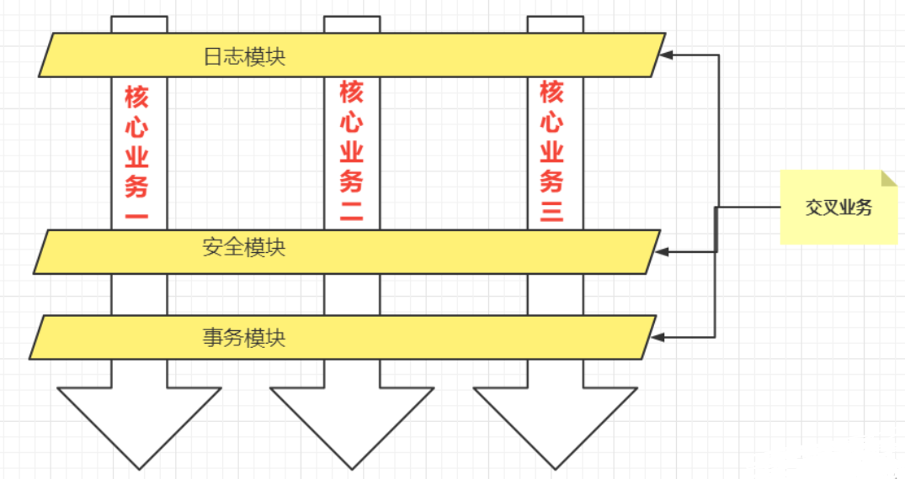
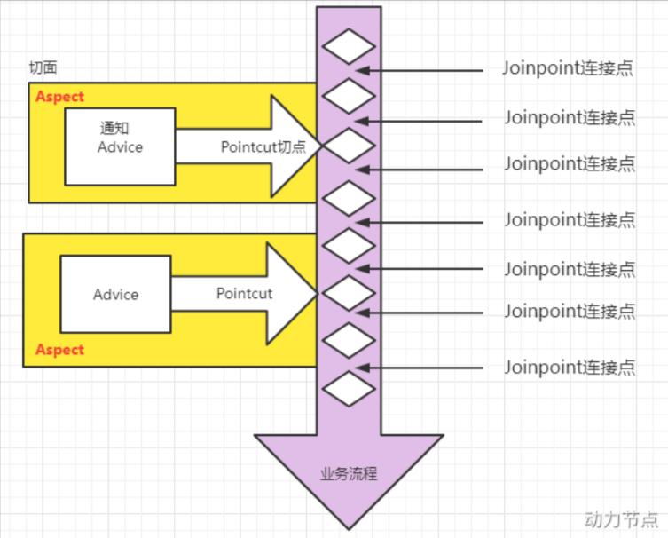

### 面向切面编程AOP

> - IoC使软件组件松耦合。AOP让你能够捕捉系统中经常使用的功能，把它转化成**组件**。
> - AOP（Aspect Oriented Programming）：面向切面编程，面向方面编程。（AOP是一种编程技术）
>   - AOP是对OOP的补充延伸，底层使用的就是动态代理来实现的。
>   - Spring的AOP使用的动态代理技术是：JDK动态代理 + CGLIB动态代理。
>   - Spring在这两种动态代理中灵活切换，如果是代理接口，会默认使用JDK动态代理，如果要代理某个类，这个类没有实现接口，就会切换使用CGLIB。当然，你也可以强制通过一些配置让Spring只使用CGLIB。

- #### 交叉业务：

  > - 一般一个系统当中都会有一些系统服务，例如：日志、事务管理、安全等。这些系统服务被称为：**交叉业务**
  >
  >
  > - 这些**交叉业务**几乎是通用的，不管你是做银行账户转账，还是删除用户数据。日志、事务管理、安全，这些都是需要做的。
  >
  >
  > - 如果在每一个业务处理过程当中，都掺杂这些交叉业务代码进去的话，存在以下问题：
  >
  >   1. 交叉业务代码在多个业务流程中反复出现，显然这个交叉业务代码没有得到复用。
  >   2. 如果要修改这些交叉业务代码的话，所有地方都需要修改，强耦合的。
  >   3. 程序员无法专注核心业务代码的编写，在编写核心业务代码的同时还需要处理这些交叉业务。
  >
  > - 使用AOP可以很轻松的解决以上问题。请看下图，可以帮助你快速理解AOP的思想：

  

- #### 使用AOP的优势：

  > - 为了解决以上问题，我们可以通过代理模式的思想，在指定位置加入增强代码即可。这就是AOP的底层实现。
  >
  > - **用一句话总结AOP：AOP将与核心业务无关的代码独立的抽取出来，形成一个独立的组件，然后以横向交叉的方式应用到各个业务流程当中的过程被称为AOP。**
  >
  > - 使用AOP有如下优点：
  >   1. 代码复用性增强。
  >   2. 代码易维护。
  >   3. 使开发者更关注业务逻辑。
  > - 接下来我们看下，如何使用Spring中的AOP。

- #### AOP的相关概念：

  > 使用AOP之前，我们先来看下AOP的相关概念：

  - ##### AOP的七大术语：

    > - **切点 Pointcut**：切点本质上就是方法。你要将增强代码放到哪个方法上，这个要进行切入的方法就是切点。（一个切点有多个连接点）
    > - **连接点 Joinpoint**：增强代码连接到，切点方法的前还是后哪个位置，这个位置就是连接点。连接点也可以是发生异常的位置或finally等位置。
    > - **通知 Advice**：通知又叫增强，就是具体你要织入的方法代码。通知根据连接点的位置，又分为以下几种：
    >   - 前置通知`@Before`
    >
    >   - 后置通知`@AfterReturning`
    >
    >   - 环绕通知`@Around`
    >
    >   - 异常通知`@AfterThrowing`
    >
    >   - 最终通知`@After`
    > - **切面 Aspect**：就是**切点 + 通知**。（位置 + 增强代码 = 切面）
    > - 织入 Weaving：把通知应用到目标位置上的过程。
    > - 代理对象 Proxy：一个目标对象被织入通知后产生的新对象。
    > - 目标对象 Target：被织入通知的对象。

    ###### 通过下图，大家可以很好的理解AOP的相关术语：

    

  - ##### 切点表达式：

    > 切点表达式用来定义，通知（Advice）在哪些方法（切点）上切入。切点表达式的语法：
    >
    > - `execution([访问控制权限修饰符] 返回值类型 [全限定类名]方法名(形式参数列表) [异常])`
    >
    > 其中：
    >
    > - 方法的访问控制权限修饰符：可选项，没写，就是4个权限都包括，写public就表示只包括公开的方法。
    > - 返回值类型：必填项，`*`表示返回值类型任意。
    > - 全限定类名：可选项，2个点`..`代表当前包以及子包下的所有类，省略时表示所有的类。
    > - 方法名：必填项，`*`表示所有方法，`set*`表示所有以set开头的方法。
    > - 形式参数列表：必填项，`()`表示没有参数的方法，`(..)`表示参数类型和个数任意，`(*)`一个任意类型参数，`(*,String)`匹配两个参数的方法，第1个参数任意类型，第2个参数String
    > - 异常：可选项，省略时表示任意异常类型。
    >
    > 例如：
    >
    > ```java
    > execution(public * com.powernode.mall.service.*.delete*(..))//表示service包下所有的类中以delete开始的所有方法
    > execution(* com.powernode.mall..*(..))//表示mall包下所有的类的所有的方法
    > execution(* *(..))//表示所有类的所有方法
    > ```

- #### Spring对AOP的实现：

  - Spring对AOP的实现包括以下2种方式：

    - **方式1：Spring框架结合AspectJ框架实现的AOP，基于注解方式。**

    - **方式2：Spring框架结合AspectJ框架实现的AOP，基于XML方式。**

  - 什么是AspectJ？

    > - 它是Eclipse组织的一个支持AOP的框架。AspectJ框架是独立于Spring框架之外的一个框架，Spring框架用了AspectJ框架。
    > - AspectJ项目起源于帕洛阿尔托（Palo Alto）研究中心（缩写为PARC）。该中心由Xerox集团资助，Gregor Kiczales领导，从1997年开始致力于AspectJ的开发，1998年第一次发布给外部用户，2001年发布1.0 release。为了推动AspectJ技术和社团的发展，PARC在2003年3月正式将AspectJ项目移交给了Eclipse组织，因为AspectJ的发展和受关注程度大大超出了PARC的预期，他们已经无力继续维持它的发展。

  - 使用Spring的AOP：

    > 使用该功能前，除了已有的spring-aop依赖，还要引入spring-aspects依赖：（还要添加aop的命名空间）
    >
    > ```xml
    > <!--spring aspects依赖-->
    > <dependency>
    > 	<groupId>org.springframework</groupId>
    > 	<artifactId>spring-aspects</artifactId>
    > 	<version>6.0.18</version>
    > </dependency>
    > ```

- #### 基于注解方式的AOP的使用：

  > 首先：我们有一个目标类以及目标方法：
  >
  > ```java
  > // 目标类
  > @Service
  > public class OrderService {
  >     // 目标方法
  >     public void generate(){
  >         System.out.println("订单已生成！");
  >     }
  > }
  > ```

  1. 用`@Aspect`注解**定义一个切面类**（类似于代理类）：（这里的目标类和切面类都纳入了Spring容器的管理，它们上面都添加了`@Service`注解，并在spring配置文件中配置了组件扫描）

     ```java
     // 声明当前类是一个切面类
     @Aspect
     @Service
     public class MyAspect {}//切面中有通知和切点
     ```

  2. 在**切面类中编写通知**（增强）代码，并在增强代码的方法上**配置切点**注解`@Before`，指定切入位置：（类似代理方法）

     ```java
     // 切面类，切面 = 通知 + 切点
     @Aspect
     @Component
     public class MyAspect {
         // @Before表示该通知是前置通知，即连接点是方法（切点）的前面。值是切点表达式，指定切点，也就是织入的位置
         @Before("execution(* com.itheima.service.OrderService.*(..))")
         public void advice(JoinPoint jp){//JoinPoint连接点参数可以拿到，通知连接位置的信息
             System.out.println("我是一个通知");
         }
     }
     ```

     > - 这些通知方法中都可以写一个参数`JoinPoint`，这就是连接点，里面有很多方法可以用。如：获取目标方法名等。
     >
     > - 其中**环绕通知**`@Around`的方法中的参数是`ProceedingJoinPoint`表示进行连接点：
     >
     >   ```java
     >   @Around("execution(* com.itheima.service.OrderService.*(..))")
     >   public void aroundAdvice(ProceedingJoinPoint proceedingJoinPoint) throws Throwable {
     >       System.out.println("环绕通知开始");
     >       // 执行目标方法。
     >       proceedingJoinPoint.proceed();
     >       System.out.println("环绕通知结束");
     >   }
     >   ```
     >
     > - **返回通知**可以通过`returning`属性去定义，将返回值传给方法中的哪个参数：
     >
     >   ```java
     >   @AfterReturning(pointcut="myPointCut()",returning="objeeeee")
     >   //注意那串eeeee了吗，那是为了引起你的注意，告诉你这两个命名须一致。
     >   public void myAfterReturning(JoinPoint point,Object objeeeee) {}
     >   ```
     >
     > - **异常通知**可以通过`throwing`属性去定义，将异常对象传给方法中的哪个参数：
     >
     >   ```java
     >   @AfterThrowing(pointcut="myPointCut()",throwing="eeeee")
     >   public void myAfterThrowing(JoinPoint point,Exception eeeee) {
     >   //注意那串eeeee了吗，那是为了引起你的注意，告诉你这两个命名须一致。
     >       System.out.println("——————异常通知————"+eeeee.getMessage());
     >   }
     >   ```

  3. 在spring配置文件中**开启AOP的自动代理**：

     ```xml
     <?xml version="1.0" encoding="UTF-8"?>
     <beans xmlns="http://www.springframework.org/schema/beans"
            xmlns:xsi="http://www.w3.org/2001/XMLSchema-instance"
            xmlns:context="http://www.springframework.org/schema/context"
            xmlns:aop="http://www.springframework.org/schema/aop"
            xsi:schemaLocation="http://www.springframework.org/schema/beans http://www.springframework.org/schema/beans/spring-beans.xsd
                                http://www.springframework.org/schema/context http://www.springframework.org/schema/context/spring-context.xsd
                                http://www.springframework.org/schema/aop http://www.springframework.org/schema/aop/spring-aop.xsd">
         <!--开启组件扫描-->
         <context:component-scan base-package="com.itheima.service"/>
         <!--开启自动代理-->
         <aop:aspectj-autoproxy proxy-target-class="true"/>
     </beans>
     ```

     > 开启自动代理之后，凡事带有`@Aspect`注解的bean类都会生成代理对象。`proxy-target-class="true"`表示采用cglib动态代理。false表示采用JDK动态代理。默认值是false。（但即使写成false，当没有接口的时候，也会自动选择cglib动态生成代理类）

  ###### 通知类型包括：

  > - 前置通知：`@Before`目标方法执行之前的通知
  > - 返回通知：`@AfterReturning`目标方法执行正常执行完毕return返回之后的通知
  > - 环绕通知：`@Around`在目标方法前后添加通知。它是最大的范围，包住了其他的通知。
  > - 异常通知：`@AfterThrowing`发生异常之后执行的通知
  > - 最终通知：`@After`放在finally语句块中执行的通知
  > - 注意：出现异常之后，后置通知和环绕通知的结束部分是不会执行的

  ###### 多个切面的执行顺序：

  > 我们知道，业务流程当中不一定只有一个切面，可能有的切面控制事务，有的记录日志，有的进行安全控制，如果多个切面的话，顺序如何控制：可以使用`@Order`注解来标识切面类，为@Order注解的value指定一个整数型的数字，**数字越小，优先级越高**。

  ###### 优化使用切点表达式：可以将切点表达式单独的定义出来，在需要的位置引入即可。如下：

  ```java
  // 切面类
  @Component
  @Aspect
  @Order(2)
  public class MyAspect {
  //使用@Pointcut注解来定义独立的切点表达式。这个方法名随意，方法中不需要任何代码，它只是作为标识
      @Pointcut("execution(* com.itheima.service.OrderService.*(..))")
      public void pointcut(){}
  
      @Around("pointcut()")//前面也可以补上类名表示引入某个类的某个切点com.it.User.pointcut()
      public void aroundAdvice(ProceedingJoinPoint proceedingJoinPoint) throws Throwable {
          System.out.println("环绕通知开始");
          // 执行目标方法。
          proceedingJoinPoint.proceed();
          System.out.println("环绕通知结束");
      }
  }
  ```

  ###### 全注解式开发AOP：

  > 在配置类上使用`@EnableAspectJAutoProxy(proxyTargetClass = true)`注解，来代替核心配置文件中的标签。

------

- #### 基于XML的AOP的使用（了解）：

  > 首先：我们有一个目标类以及目标方法：
  >
  > ```java
  > // 目标类
  > public class VipService {
  >     public void add(){
  >         System.out.println("保存vip信息。");
  >     }
  > }
  > ```

  1. **编写切面类和通知**：（和上面类似，只是没有用注解标注了，也没有切点了）

     ```java
     // 负责计时的切面类
     public class TimerAspect {
         public void time(ProceedingJoinPoint proceedingJoinPoint) throws Throwable {
             long begin = System.currentTimeMillis();
             //执行目标
             proceedingJoinPoint.proceed();
             long end = System.currentTimeMillis();
             System.out.println("耗时"+(end - begin)+"毫秒");
         }
     }
     ```

  2. **将切面类配置到XML中**：

     ```xml
     <?xml version="1.0" encoding="UTF-8"?>
     <beans xmlns="http://www.springframework.org/schema/beans"
            xmlns:xsi="http://www.w3.org/2001/XMLSchema-instance"
            xmlns:context="http://www.springframework.org/schema/context"
            xmlns:aop="http://www.springframework.org/schema/aop"
            xsi:schemaLocation="http://www.springframework.org/schema/beans http://www.springframework.org/schema/beans/spring-beans.xsd
                                http://www.springframework.org/schema/context http://www.springframework.org/schema/context/spring-context.xsd
                                http://www.springframework.org/schema/aop http://www.springframework.org/schema/aop/spring-aop.xsd">
     
         <!--纳入spring bean管理-->
         <bean id="vipService" class="com.itheima.service.VipService"/>
         <bean id="timerAspect" class="com.itheima.service.TimerAspect"/>
     
         <!-- aop功能的配置 -->
         <aop:config>
             <!-- 配置切面。将该单例bean对象配置为切面，切面 = 通知 + 切点 -->
             <aop:aspect ref="timerAspect">
                 <!-- 在切面类内部，将方法配置为环绕通知，指定通知的切点 -->
                 <aop:around method="time" pointcut-ref="p1"/>
                 <!-- 配置切点 -->
     			<aop:pointcut id="p1" expression="execution(* com.itheima.service.VipService.*(..))"/>
             </aop:aspect>
     
             <!-- 该aop:config标签里还可以用<aop:advisor>直接引入通知bean或通知标签。通知bean要实现某些接口 -->
         </aop:config>
     </beans>
     ```

- #### AOP的小案例：事务处理

  > 项目中的事务控制是在所难免的。在一个业务流程当中，可能需要多条DML语句共同完成，为了保证数据的安全，这多条DML语句要么同时成功，要么同时失败。这就需要添加事务控制的代码。而很多业务类中的很多个业务方法都是需要控制事务的，而控制事务的代码又是固定的格式，这种和业务逻辑没有任何关系的重复代码统称为“**交叉业务**”。
  >
  > 我们可以采用AOP思想解决，不用写那么多和业务无关的重复代码，将注意力放在业务逻辑上而不是代码的安全性上。可以把控制事务的代码配置为环绕通知，切入到每个需要控制事务的目标类的方法中。用AOP来完成：

  ```java
  @Aspect
  @Component
  // 事务切面类
  public class TransactionAspect {
      //指定在哪些方法上进行切入，开始事务
      @Around("execution(* com.itheima.biz..*(..))")
      public void aroundAdvice(ProceedingJoinPoint proceedingJoinPoint){
          try {
              System.out.println("开启事务");
              // 执行目标
              proceedingJoinPoint.proceed();
              System.out.println("提交事务");
          } catch (Throwable e) {
              System.out.println("发生异常回滚事务");
          }
      }
  }
  ```

  > 你看，这个事务控制代码是不是只需要写一次就行了，并且维护起来也没有成本。

------

### Spring对事务的支持

> 事务在开发中很常见，几乎任何业务都需要配置事务，并且基本都是那几行代码。虽然AOP可以完成事务的配置，但是还需要写代码。既然事务那么重要，所以Spring专门提供了一套事务相关的API，只要加上注解或xml中配置一下就行了很方便。底层也是AOP代码的封装。

- #### 事务Transaction概述：

  > 什么是事务（tx）？
  >
  > 在一个业务流程当中，通常需要多条DML（insert delete update）语句共同联合才能完成，这多条DML语句必须同时成功，或者同时失败，这样才能保证数据的安全。将多条DML作为一个不可分割的整体，要么同时成功，或同时失败，这就是事务。
  >
  > 事务的四个处理过程：
  >
  > ​	第1步：开启事务 (start transaction)
  >
  > ​	第2步：执行核心业务代码
  >
  > ​	第3步：提交事务（如果核心业务处理过程中没有出现异常）(commit transaction)
  >
  > ​	第4步：回滚事务（如果核心业务处理过程中出现异常）(rollback transaction)
  >
  > 事务的四个特性：
  >
  > ​	**A 原子性**：事务是最小的工作单元，不可再分。要么全部成功，要么全部失败。
  >
  > ​	**C 一致性**：事务在执行前后，数据库中的数据要保持一致性的状态，即事务前和事务后的总量不变。
  >
  > ​	**I 隔离性**：事务和事务之间因为有隔离性，才可以保证互不干扰。
  >
  > ​	**D 持久性**：持久性是事务结束的标志。
  >
  > 事务隔离级别包括四个：
  >
  > 1. 读未提交（READ_UNCOMMITTED）：这是最低的隔离级别，存在脏读、不可重复读和幻读问题。
  > 2. 读已提交（READ_COMMITTED）：读到的是别人提交后的值，解决了脏读问题，但还存在不可重复读和幻读问题。
  > 3. 可重复读（REPEATABLE_READ）：解决了不可重复读，只要当前事务不结束，读取到的数据一直都是一样的。但存在幻读问题。
  > 4. 序列化读（SERIALIZABLE）：最严格的隔离，解决了幻读问题，多个事务排队执行，不支持并发，效率较低。

- #### Spring对事务的支持：

  > ##### Spring实现事务有两种方式：
  >
  > - 编程式事务：通过手动编写事务代码的方式来实现事务的管理。
  >
  > - 声明式事务：（主要学这个）
  >
  >   - 基于注解方式。
  >
  >   - 基于XML配置方式。

- #### Spring事务管理API：

  > Spring对事务的管理底层实现是基于AOP，通过AOP封装了事务，所以Spring针对事务专门有一套API，核心接口如下：
  >
  > - `TransactionDefinition`：定义事务的接口，定义了事务相关的特性，如传播行为、隔离级别、事务超时、只读事务等。
  > - `PlatformTransactionManager`：核心，用来执行事务具体的操作，如提交、回滚等。Spring并不直接管理事务，它为不同平台提供了以下几种事务管理器类，将具体的事务管理交给第三方框架来实现。如果mybatis想让spring帮它管理事务，就需要提供一个该接口的实现类。该接口在**Spring6**中已经有两个实现类了：
  >   - `DataSourceTransactionManager`：支持`JdbcTemplate`、`MyBatis`、`Hibernate`等事务管理。
  >   - `JtaTransactionManager`：支持分布式事务管理。
  > - `TransactionStatus`：代表事务当前的状态。
  >
  > （如果要在Spring6中使用`JdbcTemplate`或`MyBatis`，就要使用`DataSourceTransactionManager`实现类来管理事务，直接用即可）

- #### 事务的注解方式：（不需要spring-aspects的jar包，但是需要spring-jdbc的jar包）

  1. 在spring配置文件中配置事务管理器：

     ```xml
     <bean id="myTransactionManager" class="org.springframework.jdbc.datasource.DataSourceTransactionManager">
       <!-- 给事务管理器注入数据源，因为要调用conn.rollback()方法 -->
       <property name="dataSource" ref="dataSource"/>
     </bean>
     ```

  2. 在spring配置文件中配置“事务注解驱动器”，开启注解的方式控制事务，扫描事务注解：（还要引入tx命名空间和约束）

     ```xml
     <!-- 开启事务的注解驱动器，指向使用的事务管理器 -->
     <tx:annotation-driven transaction-manager="myTransactionManager"/>
     ```
     
  3. 在需要开启事务的，类或方法上添加`@Transactional`注解即可，例如：（类范围则类中所有方法都开启事务）

  ###### 事务的全注解式开发：配置类上加`@EnableTransactionManagement`注解开启事务注解扫描，然后类中配置事务类即可。

  ```java
  @Configuration
  @ComponentScan("com.itheima.bank")
  @EnableTransactionManagement
  //使用spring5版本 ，需要手动设置@EnableTransactionManagement(proxyTargetClass=true)为CGLIB，不然会报异常 
  public class Spring6Config {
      //Bean注解会将该方法的返回值对象，交给Spring容器管理；不指定bean的id默认是方法名
      //如果Bean注解标注的方法上有参数，那么Spring会自动去容器里根据类型找对应的Bean对象传进去
      @Bean(name = "dataSource")
      public DataSource getDataSource(){
          DruidDataSource dataSource = new DruidDataSource();
          dataSource.setDriverClassName("com.mysql.cj.jdbc.Driver");
          dataSource.setUrl("jdbc:mysql://localhost:3306/spring6");
          dataSource.setUsername("root");
          dataSource.setPassword("root");
          return dataSource;
      }
  
      @Bean("jdbcTemplate")
      public JdbcTemplate getJdbcTemplate(DataSource dataSource){
          JdbcTemplate jdbcTemplate = new JdbcTemplate();
          jdbcTemplate.setDataSource(dataSource);
          return jdbcTemplate;
      }
  
      //默认会使用spring容器中唯一的这个DataSourceTransactionManager作为管理事务的注解驱动对象
      @Bean
      public DataSourceTransactionManager getDataSourceTransactionManager(DataSource dataSource){
          DataSourceTransactionManager dataSourceTransactionManager = new DataSourceTransactionManager();
          dataSourceTransactionManager.setDataSource(dataSource);
          return dataSourceTransactionManager;
      }
  }
  ```


------

- #### 事务的XML方式：（需要AOP的spring-aspects包）

  > 不用`@Transactional`注解了，用纯配置文件的方式来加上事务。由于这种方式是通过aop切面配置的方式将事务当作切面织入到代码中去了，所以要用到spring整合的AspectJ框架的jar包，spring-aspects：

  1. 添加依赖：

     ```xml
     <dependency>
         <groupId>org.springframework</groupId>
         <artifactId>spring-aspects</artifactId>
         <version>6.0.18</version>
     </dependency>
     ```

  2. 在spring核心配置文件中进行如下配置：（**记得添加aop的命名空间**）

     ```xml
     <?xml version="1.0" encoding="UTF-8"?>
     <beans xmlns="http://www.springframework.org/schema/beans"
            xmlns:xsi="http://www.w3.org/2001/XMLSchema-instance"
            xmlns:context="http://www.springframework.org/schema/context"
            xmlns:tx="http://www.springframework.org/schema/tx"
            xmlns:aop="http://www.springframework.org/schema/aop"
            xsi:schemaLocation="http://www.springframework.org/schema/beans http://www.springframework.org/schema/beans/spring-beans.xsd
                                http://www.springframework.org/schema/context http://www.springframework.org/schema/context/spring-context.xsd
                                http://www.springframework.org/schema/tx http://www.springframework.org/schema/tx/spring-tx.xsd
                                http://www.springframework.org/schema/aop http://www.springframework.org/schema/aop/spring-aop.xsd">
     	<!--包扫描-->
         <context:component-scan base-package="com.itheima.bank"/>
         <!--配置数据源-->
         <bean id="dataSource" class="com.alibaba.druid.pool.DruidDataSource">
             <property name="driverClassName" value="com.mysql.cj.jdbc.Driver"/>
             <property name="url" value="jdbc:mysql://localhost:3306/spring6"/>
             <property name="username" value="root"/>
             <property name="password" value="root"/>
         </bean>
     
     	<!--用下jdbcTemplete来操作数据库-->
         <bean id="jdbcTemplate" class="org.springframework.jdbc.core.JdbcTemplate">
             <property name="dataSource" ref="dataSource"/>//注入数据源
         </bean>
     
         <!--配置事务管理器来控制事务-->
         <bean id="txManager" class="org.springframework.jdbc.datasource.DataSourceTransactionManager">
             <property name="dataSource" ref="dataSource"/>//注入数据源
         </bean>
     
         <!-- 配置事务通知，具体的增强代码，代替了事务注解 -->
         <tx:advice id="txAdvice" transaction-manager="txManager">
     		<!-- 对save、del、update、transfer开头的方法都加上事务，name是对切点进行细化 -->
             <tx:attributes>
                 <tx:method name="save*" propagation="REQUIRED" isolation="DEFAULT"/>
                 <tx:method name="del*" propagation="REQUIRED" rollback-for="java.lang.Throwable"/>
                 <tx:method name="update*" propagation="REQUIRED" rollback-for="java.lang.Throwable"/>
                 <tx:method name="transfer*" propagation="REQUIRED" rollback-for="java.lang.Throwable"/>
             </tx:attributes>
         </tx:advice>
     
         <!-- AOP切面相关的配置。将上面的事务通知切入到哪里 -->
         <aop:config>
     		<!-- 配置切点 -->
             <aop:pointcut id="txPointcut" expression="execution(* com.itheima.service..*(..))"/>
             <!-- 切面 = 通知 + 切点 -->
             <aop:advisor advice-ref="txAdvice" pointcut-ref="txPointcut"/>
         </aop:config>
     </beans>
     ```

------

- #### 事务的特性

  - ###### 事务传播行为：

    > 什么是事务的传播行为？
    > 	在service类中有a()方法和b()方法，a()方法上有事务代码，b()方法上也有事务代码，当a()方法执行过程中调用了b()方法。当b()方法执行时发生异常，没有提交的话，a()方法中的事务会提交吗？它们两个的事务之间是如何传递的？合并到一个事务里？还是开启一个新的事务？这就是事务的传播行为。
    >
    > 事务传播行为在spring框架中被定义为枚举类型：`Propagation`，一共有7个值对应7种传播行为：
    > 	- `REQUIRED`：支持当前事务，如果不存在就新建一个(默认)【没有就新建，有就加入】
    > 	- `SUPPORTS`：支持当前事务，如果当前没有事务，就以非事务方式执行【有就加入，没有就不管了】
    > 	- `MANDATORY`：必须运行在一个事务中，如果当前没有事务正在发生，将抛出一个异常【有就加入，没有就抛异常】
    > 	- `REQUIRES_NEW`：开启一个新的事务，如果一个事务已经存在，则将这个存在的事务挂起
    > 		【不管有没有，直接开启一个新事务，开启的新事务和之前的事务不存在嵌套关系，之前事务被挂起】
    > 	- `NOT_SUPPORTED`：以非事务方式运行，如果有事务存在，挂起当前事务【不支持事务，存在就挂起】
    > 	- `NEVER`：以非事务方式运行，如果有事务存在，抛出异常【不支持事务，存在就抛异常】
    > 	- `NESTED`：如果当前正有一个事务在进行中，则该方法应当运行在一个嵌套式事务中。被嵌套的事务可以独立于外层事务
    > 		进行提交或回滚。如果外层事务不存在，行为就像REQUIRED一样。【有事务的话，就在这个事务里再嵌套一个
    > 		完全独立的事务，嵌套的事务可以独立的提交和回滚。没有事务就和REQUIRED一样】。
    >
    > 在代码中设置事务的传播行为：`@Transactional(propagation = Propagation.REQUIRED)`


  - ###### 事务隔离级别：

    > 事务隔离级就是2个事务之间的隔离性，一个事务进行的操作会不会影响另一个事务。
    >
    > 数据库中读取数据存在的三大问题：（三大读问题）
    >
    > - **脏读：读取到没有提交到数据库的数据，叫做脏读。**
    > - **不可重复读：在同一个事务当中，第一次和第二次读取的数据不一样。**
    > - **幻读：读到的数据是假的。**
    >


  - ###### 事务超时：

    > `@Transactional(timeout = 10)`设置事务的超时时间为10秒。如果超过10秒该事务中**所有的DML语句**还没有执行完毕的话，最终事务会回滚。默认值-1，表示没有时间限制。
    >
    > 如果最后一条DML语句后面很有很多业务逻辑，这些业务代码执行的时间不被计入超时时间。
    >
    > 当然，如果想让整个方法的所有代码都计入超时时间的话，可以在方法最后一行添加一行无关紧要的DML语句。


  - ###### 只读事务：

    > `@Transactional(readOnly = true)`将当前事务设置为只读事务，在该事务执行过程中，**只允许select语句执行**，delete insert update均不可执行。该特性的作用是：**启动Spring的优化策略。提高select语句执行效率。**
    >
    > 如果该事务中确实没有增删改操作，建议设置为只读事务。


  - ###### 设置出现哪些异常回滚事务：

    > `@Transactional(rollbackFor = RuntimeException.class)`表示只有发生`RuntimeException`异常才会回滚。


  - ###### 设置出现哪些异常不回滚事务：

    > `@Transactional(noRollbackFor = NullPointerException.class)`表示发生`NullPointerException`异常的话不回滚，其他异常才回滚。

------

### Spring Task定时任务

> 在项目开发中定时任务是一种很常见的需求。Java中处理这种需求可以用JDK的工具类`Timer`，虽然简单易用，但是无法处理复杂的定时任务。或者用第3方的组件`Quartz`，功能强大但相对笨重。而`Spring Task`具备了前两者的优点，功能强大且易用（但不支持分布式），除了`spring-context`依赖包之外不需要引入其他包了，且支持注解和xml两种使用方式。

- #### 注解方式：

  1. 编写一个定时任务类TaskJob，添加`@Component`注解交给Spring容器管理，在类中编写要定时调用的方法并加`@Scheduled`注解：

     ```java
     @Component
     public class TaskJob {
         @Scheduled(cron = "0/2 * * * * ?")
         public void job1(){
             System.out.println("定时任务1执行了..");
         }
     }
     ```

  2. spring.xml中配置定时任务的注解驱动标签，让Spring去扫描`@Scheduled`注解：

     ```xml
     <task:annotation-driven/>
     ```

- #### XML方式：

  1. 编写一个定时任务类TaskJob，添加`@Component`注解交给Spring容器管理，在类中编写要定时调用的方法：

     ```java
     @Component
     public class TaskJob {
         public void job1(){
             System.out.println("定时任务1执行了..");
         }
     }
     ```

  2. spring.xml中配置定时任务：

     ```xml
     <!--配置定时任务-->
     <task:scheduled-tasks>
         <!-- 配置定时任务1，可以配置多个 -->
         <task:scheduled ref="taskJob" method="job1" cron="0/2 * * * * ?"/>
     </task:scheduled-tasks>
     ```

  > main方法中运行：
  >
  > ```java
  > public class Test {
  >     public static void main(String[] args){
  >         ApplicationContext applicationContext = new ClassPathXmlApplicationContext("spring.xml");
  >         TaskJob taskJob = applicationContext.getBean("taskJob", TaskJob.class);
  >     }
  > }
  > ```
  >
  > 当从容器中获取到该定时任务对象后，配置的定时任务就会执行。

- #### Cron表达式：

  > Cron表达式至少有6个（或7个）由空格分开的时间元素（相同的时间元素由逗号,隔开），从左到右。这些时间元素的定义如下：
  >
  > 1. 秒（0-59 , - * /）
  > 2. 分钟（0-59 , - * /）
  > 3. 小时（0-23 , - * /）
  > 4. 月中的日期（0-31 , - * / ? L W C）
  > 5. 月份（1-12或JAN-DEC , - * /）
  > 6. 星期（1-7或SUN-SAT , - * / ? L C #）
  > 7. 年（可以不填，或1970-2099 , - * /）
  >
  > 例如：
  >
  > 0 0 10,14,16 * * ?		每天10点、2点、4点，星期不确定
  >
  > 0 0,15,30,45 * 1-10 * ?    每月前10天每隔15分钟
  >
  > 30 0 0 1 1 ? 2012		在2012年1月1日午夜过30秒时
  >
  > 含义：
  >
  > `*`表示每一，`?`表示不确定周几或几号，`-`表示一个范围的值，`,`表示或，`/`表示从左边值开始增加的幅度，`0/2`就是第0、2、4...秒，`L`表示last最后，`W`表示离这一天最近的工作日，`6#3`表示这个月第3个周五，`5C`表示本月的第1天或5号之后，或本周第1天或周四之后

------

### 邮件发送

- #### JavaMail发送邮件

  > - JavaMail是SUN公司定义的一套，用于收发电子邮件的编程接口（JavaEE），可以方便的执行一些常用的邮件传输，不同的厂商可以提供自己的实现类，选择性地实现某些邮件协议，常见的（应用层的）邮件协议包括：
  >
  >   - SMTP：简单邮件传输协议，用于发送邮件。它定义了电子邮件的发送机制，程序员通过JavaMail程序与SMTP邮件服务器通信，最终用户通过POP3或IMAP协议接收邮件。
  >
  >   - POP3：邮局协议，用于接收邮件。
  >
  >   - IMAP：互联网消息协议，是POP3的替代协议。
  >
  > - 这3种协议都有对应的SSL加密传输的协议，分别是SMTPS、POP3S、IMAPS。
  >
  > - 除了JavaMail提供邮件服务之外，还需要JAF来处理非纯文本的邮件内容，包括MIME，HTML页面和文件附件等。

  ###### JavaMail的关键对象：

  - Properties：由于JavaMail要和邮件服务器进行通信，所以需要提供邮件服务器相关的信息，这些信息要放在该集合中，如地址、端口号、用户名、密码等信息。常见的属性：

    ```properties
    #smtp服务器地址
    mail.smtp.host
    #端口号，smtp服务器默认端口号25
    mail.smtp.port
    #是否需要认证，一般都要认证
    mail.smtp.auth
    ```

  - Transport（传输）和Store（存储）：这两个对象分别代表邮件发送和邮件接收。

  - Message：设置邮件内容。

  - Address：设置邮件地址。

  - Authenticator（认证者）：访问邮件服务器的用户和密码。

  ###### 添加依赖：

  ```xml
  <dependency>
  	<groupId>jakarta.mail</groupId>
  	<artifactId>jakarta.mail-api</artifactId>
  	<version>2.0.1</version>
  </dependency>
  <dependency>
  	<groupId>com.sun.mail</groupId>
  	<artifactId>jakarta.mail</artifactId>
  	<version>2.0.1</version>
  </dependency>
  ```

  ###### 代码：

  ```java
  public class App {
      public static void main(String[] args) throws MessagingException {
          //设置邮件服务器的相关配置
          Properties props = new Properties();
          props.setProperty("mail.smtp.host", "smtp.qq.com");
          props.setProperty("mail.smtp.post", "25");
          //设置邮箱服务器是否需要认证，true需要认证
          props.setProperty("mail.smtp.auth", "true");
  
  //使用JavaMail发送邮件
          //1、创建session对象，加载邮件服务器配置
          Session session = Session.getInstance(props);
          	//开启session对象的debug设置，这样可以查看邮件的发送状态（可有可无）
          	session.setDebug(true);
          //2、通过session对象获取传输对象
          Transport transport = session.getTransport();
          //3、用传输对象连接邮件服务器，用户名只需要写@前面的就行，密码是SMTP授权码
          transport.connect("smtp.qq.com", "2273705254", "mextwgqphtlseaeb");
          //4、设置邮件
          Message message = createTextMail(session);
          //5、发送邮件。第2个参数是所有接收者
          transport.sendMessage(message, message.getAllRecipients());
          //6、关闭资源
          transport.close();
      }
  
      /**
       * 创建普通文本邮件
       */
      private static Message createTextMail(Session session) throws MessagingException {
          //创建MiME类型的邮件对象
          MimeMessage message = new MimeMessage(session);
          //设置邮件发送者
          message.setFrom("2273705254@qq.com");
          //设置接收者（可以多个）。第1个参数是接收者类型，TO是发送，CC是抄送，BCC是密送；第2个参数是接收地址（可以是同一个账户）
          message.setRecipient(Message.RecipientType.TO, new InternetAddress("2273705254@qq.com"));
          //设置邮件主题
          message.setSubject("一封测试邮件！");
  		//设置发送日期，可以不写，默认当前日期
          message.setSentDate(new Date(System.currentTimeMillis()));
  		//设置邮件体内容
          message.setText("这是一个测试邮件，请忽略！");
          return message;
      }
  }
  ```

  ###### 发送包含HTML内容的邮件：

  ```java
  /**
   * 创建包含HTML内容的邮件
   */
  private static Message createHTMLMail(Session session) throws MessagingException {
          //创建MiME类型的邮件对象
          MimeMessage message = new MimeMessage(session);
          //设置邮件发送者
          message.setFrom("2273705254@qq.com");
          //设置接收者（可以多个）。第1个参数是接收者类型，TO是发送，CC是抄送，BCC是密送；第2个参数是接收地址（可以是同一个账户）
          message.setRecipient(Message.RecipientType.TO, new InternetAddress("2273705254@qq.com"));
          //设置发送日期，默认当前日期
          message.setSentDate(new Date(System.currentTimeMillis()));
          //设置邮件主题
          message.setSubject("一封测试邮件！");
  
  //        设置邮件内容
          //准备多媒体容器（一个MimeMultipart可以包含多个MimeBodyPart）
          MimeMultipart multipart = new MimeMultipart();
          //准备多媒体对象
          MimeBodyPart bodyPart = new MimeBodyPart();
          //设置HTML内容
          StringBuffer sb = new StringBuffer();
          sb.append("<!DOCTYPE html>\n" +
                  "<html lang='en'>\n" +
                  "<head>\n" +
                  "  <meta charset='UTF-8'>\n" +
                  "  <title>测试邮件</title>\n" +
                  "</head>\n" +
                  "<body>\n" +
                  "  <h1>这是一封测试邮件</h1>\n" +
                  "  <a href='https://www.baidu.com'>点我去百度</a>\n" +
                  "</body>\n" +
                  "</html>");
          //将HTML文本设置到MimeBodyPart邮件体对象中
          bodyPart.setContent(sb.toString(), "text/html;charset=UTF-8");
          //将MimeBodyPart邮件体对象添加到MimeMultipart多媒体对象中
          multipart.addBodyPart(bodyPart);
          //将多媒体容器设置到邮件体中
          message.setContent(multipart);
          return message;
      }
  ```

  ###### 发送包含附件的邮件：

  ```java
  /**
   * 创建包含附件内容的邮件
   */
  private static Message createAttachMail(Session session) throws MessagingException, UnsupportedEncodingException {
      //创建MiME类型的邮件对象
      MimeMessage message = new MimeMessage(session);
      //设置邮件发送者
      message.setFrom("2273705254@qq.com");
      //设置接收者（可以多个）。第1个参数是设置接收者类型，TO是发送，CC是抄送，BCC是密送；第2个参数设置接收地址（可以是同一个账户）
      message.setRecipient(Message.RecipientType.TO, new InternetAddress("16639877851@qq.com"));
      //设置发送日期，默认当前日期
      message.setSentDate(new Date(System.currentTimeMillis()));
      //设置邮件主题
      message.setSubject("一封测试邮件！");
  
  //        设置邮件内容
      //准备多媒体容器（一个MimeMultipart可以包含多个MimeBodyPart）
      MimeMultipart multipart = new MimeMultipart();
  
      //第一个多媒体对象，它是邮件正文
      MimeBodyPart bodyPart = new MimeBodyPart();
      bodyPart.setContent("<h2>这是一封包含附件的邮件</h2>", "text/html;charset=UTF-8");
  
      //第二个多媒体对象，它是邮件附件
      MimeBodyPart attachPart = new MimeBodyPart();
      //包装一个本地文件
      DataHandler dh = new DataHandler(new FileDataSource("C:\\Users\\22737\\Pictures\\pictures\\ca7b04fc0433215687a2a3100741951a.jpg"));
      //将该本地文件设置到附件对象中
      attachPart.setDataHandler(dh);
      //设置附件文件名，顺便解决文件名乱码
      attachPart.setFileName(MimeUtility.encodeText(dh.getName()));
  
      //添加正文
      multipart.addBodyPart(bodyPart);
      //添加附件
      multipart.addBodyPart(attachPart);
      //如果邮件中包含附件，要设置子类型为mixed
      multipart.setSubType("mixed");
  
      //将多媒体容器设置到邮件体中
      message.setContent(multipart);
  
      return message;
  }
  ```

- #### Spring发送邮件

  > JavaMail发送邮件步骤太繁琐了，我们可以用Spring的API来发送邮件，它底层也是JavaMail实现的。

  ###### 加依赖：（除了Spring的上下文依赖和上面JavaMail的2个依赖之外，还需要以下依赖）

  ```xml
  <dependency>
      <groupId>org.springframework</groupId>
      <artifactId>spring-context-support</artifactId>
      <version>6.1.0</version>
  </dependency>
  ```

  1. ###### spring.xml中配置：

     ```xml
     <!-- 邮件发送器 -->
     <bean id="mailSender" class="org.springframework.mail.javamail.JavaMailSenderImpl">
         <property name="host" value="smtp.qq.com"/>
         <property name="port" value="25"/>
         <property name="defaultEncoding" value="UTF-8"/>
         <property name="username" value="2273705254"/>
         <property name="password" value="SMTP授权码"/>
     </bean>
     <!-- 普通文本邮件对象 -->
     <bean>
         <property name="from" value="发件人邮箱"/>
         <property name="subject" value="邮件主题"/>
     </bean>
     ```

  2. ###### 定义接口和实现类：

     > `OrderManager`接口：（名字随意）
     >
     > ```java
     > public interface OrderManager {
     > 	void placeOrder(Order order);
     > }
     > ```
     >
     > `SimpleOrderManager`实现类：
     >
     > ```java
     > @Service
     > public class SimpleOrderManager implements OrderManager {
     > 	@Resource
     > 	private MailSender mailSender;
     > 	@Resource
     > 	private SimpleMailMessage templateMessage;
     >     //发送方法
     > 	public void placeOrder(Order order) {
     > 		SimpleMailMessage msg = new SimpleMailMessage(this.templateMessage);
     > 		msg.setTo("2273705254@qq.com");
     > 		msg.setText("Hello Spring Mail!");
     > 		try {
     > 			this.mailSender.send(msg);
     > 		}
     > 		catch (MailException ex) {
     > 			System.err.println(ex.getMessage());
     > 		}
     > 	}
     > }
     > ```

  3. ###### 测试：

     ```java
     public static void main(String[] args){
         BeanFactory factory = new ClassPathXmlApplicationContext("spring.xml");
     	SimpleOrderManager manager = factory.getBean("simpleOrderManager", SimpleOrderManager.class);
         manager.placeOrder();
     }
     ```

  ###### 发送带附件的邮件：

  ```java
  public static void main(String[] args){
      BeanFactory factory = new ClassPathXmlApplicationContext("spring.xml");
  	MailSender sender = factory.getBean("mailSender", MailSender.class);
      //创建message对象
      MimeMessage message = sender.createMimeMessage();
      //设置邮件主题
      message.setSubject("测试邮件");
      MimeMessageHelper helper = new MimeMessageHelper(message,true,"utf-8");
  	helper.setFrom("");
      helper.setTo(new InternetAddress(""));
      helper.setText("Thank you!");
      //设置附件
      File file = new File("本地文件路径");
      helper.addAttachment(file.getName(), file);
      //发送
      sender.send(message);
  }
  ```

------

### Spring整合JUnit5

> Spring中有一套api对junit进行了封装，用起来很方便，我们了解下：

- ##### Spring6对JUnit4的支持：

  ```xml
  <!--spring对junit的支持相关依赖-->
  <dependency>
      <groupId>org.springframework</groupId>
      <artifactId>spring-test</artifactId>
      <version>6.0.18</version>
  </dependency>
  ```

  > 测试代码：
  >
  > ```java
  > @RunWith(SpringJUnit4ClassRunner.class)			//这是junit4的注解，表示不用原生的junit了，用指定类进行单元测试
  > @ContextConfiguration("classpath:spring.xml")	//这是Spring的注解，用于指定Spring配置文件的类路径
  > //或者用这个注解代替以上两个：@SpringJUnitConfig(locations = "classpath:spring.xml")
  > public class SpringTest {
  >        @Autowired
  >    	private User user;
  > 
  >        @Test
  >        public void testFirst(){
  >        //下面这2行代码就可以不写了
  >         //ApplicationContext applicationContext = new ClassPathXmlApplicationContext("spring.xml");
  >         //Object userBean = applicationContext.getBean("userBean");
  >         System.out.println(user);
  >        }
  > }
  > ```

  > 如果此时有多个测试类，那么每个类上都要加这两个注解，很麻烦，可以将这两个注解写到一个单独的类上。然后其他测试类都`extends`继承该类即可。这样其他测试类就不需要添加这两个注解了：
  >
  > ```java
  > @RunWith(SpringJUnit4ClassRunner.class)
  > @ContextConfiguration("classpath:spring.xml")
  > public class BaseTest{}
  > ```

- ##### Spring6对JUnit5的支持：

  > 如果是JUnit5，上面的`@RunWith(SpringJUnit4ClassRunner.class)`替换为：`@ExtendWith(SpringExtension.class)`即可。

------

### Spring6集成MyBatis（3.5.10）

#### 步骤：

1. 准备t_car表（还是mybatis中用那个），创建模块并引入以下依赖：

   > - spring-context6.0.18
   > - spring-jdbc（要用jdbcTemplete来操作数据库以及使用事务tx）
   > - spring-test（试下spring对junit5的支持）
   > - spring-aspects
   > - mysql驱动
   > - mybatis3.5.10
   > - mybatis-spring3.0.0（核心：mybatis提供的与spring框架集成的依赖）
   > - 德鲁伊连接池
   > - junit5

2. 基于3层架构实现，所以提前创建好所有的包：

   > mapper、controller、controller.impl、service、service.impl、pojo、utils

3. pojo类准备好，编写mapper接口和mapper文件，以及jdbc.properties文件，mybatis核心配置文件，核心配置文件可以没有，大部分的配置可以转移到spring配置文件中，如果遇到mybatis相关的系统级配置，还是需要这个文件：

   ```xml
   <?xml version="1.0" encoding="UTF-8" ?>
   <!DOCTYPE configuration
           PUBLIC "-//mybatis.org//DTD Config 3.0//EN"
           "http://mybatis.org/dtd/mybatis-3-config.dtd">
   <configuration>
       <!-- 全局设置标签 -->
       <settings>
           <!-- 启用标准日志组件 -->
           <setting name="logImpl" value="STDOUT_LOGGING"/>
           <!-- 开启驼峰命名自动映射 -->
           <setting name="mapUnderscoreToCamelCase" value="true"/>
           <!-- 开启全局懒加载 -->
           <setting name="lazyLoadingEnabled" value="true"/>
       </settings>
   </configuration>
   ```

4. 编写spring.xml配置文件：配置组件扫描，引入外部的属性文件，配置数据源，配置SqlSessionFacotryBean，配置Mapper扫描器，配置事务管理器，启用事务注解：

   ```xml
   <?xml version="1.0" encoding="UTF-8"?>
   <beans xmlns="http://www.springframework.org/schema/beans"
          xmlns:xsi="http://www.w3.org/2001/XMLSchema-instance"
          xmlns:context="http://www.springframework.org/schema/context" xmlns:tx="http://www.springframework.org/schema/tx"
          xsi:schemaLocation="http://www.springframework.org/schema/beans http://www.springframework.org/schema/beans/spring-beans.xsd http://www.springframework.org/schema/context https://www.springframework.org/schema/context/spring-context.xsd http://www.springframework.org/schema/tx http://www.springframework.org/schema/tx/spring-tx.xsd">
   <!--    引入jdbc-->
       <context:property-placeholder location="classpath:jdbc.properties"/>
       <context:component-scan base-package="com.itheima.service"/>
   
   <!--    数据源-->
       <bean id="dataSource" class="com.alibaba.druid.pool.DruidDataSource" init-method="init" destroy-method="close">
           <property name="driverClassName" value="${jdbc.driver}"/>
           <property name="url" value="${jdbc.url}"/>
           <property name="username" value="${jdbc.username}"/>
           <property name="password" value="${jdbc.password}"/>
       </bean>
   
   <!--    SqlSessionFactory，而SqlSessionFactoryBean是SqlSessionFactory的工厂bean，用于创建SqlSessionFactory对象的-->
       <bean id="sqlSessionFactory" class="org.mybatis.spring.SqlSessionFactoryBean">
           <property name="dataSource" ref="dataSource"/>
           <property name="typeAliasesPackage" value="com.itheima.bean"/>
           <property name="configLocation" value="classpath:mybatis-config.xml"/>
           <!-- mapper文件的位置 -->
           <property name="mapperLocations" value="classpath:com/itheima/mapper/*.xml"/>
       </bean>
   <!-- mapper文件位置，配置mapper扫描器，主要扫描mapper接口，生成接口的代理Mapper类。然后会自动将mapper实现类对象纳入spring容器的管理，不需要我们手动getMapper了 -->
       <bean class="org.mybatis.spring.mapper.MapperScannerConfigurer">
           <!-- mapper接口的位置 -->
           <property name="basePackage" value="com.itheima.mapper"/>
           <property name="sqlSessionFactoryBeanName" value="sqlSessionFactory"/>
       </bean>
   
       <!-- 配置事务管理器 -->
       <bean id="txManager" class="org.springframework.jdbc.datasource.DataSourceTransactionManager">
           <property name="dataSource" ref="dataSource"/>
       </bean>
   
       <!-- 启用事务注解 -->
       <tx:annotation-driven transaction-manager="txManager"/>
   </beans>
   ```
   
5. 测试：

   ```java
   public class TestMybatis {
       @Test
       public void test(){
           ClassPathXmlApplicationContext context = new ClassPathXmlApplicationContext("spring.xml");
           SqlSessionFactory sqlSessionFactory = context.getBean("sqlSessionFactory", SqlSessionFactory.class);
           SqlSession sqlSession = sqlSessionFactory.openSession();
           CarMapper mapper = sqlSession.getMapper(CarMapper.class);
           Car car = mapper.selectById(2L);
           System.out.println(car);
       }
   }
   ```

------

#### Spring配置文件的import：

> - spring配置文件可以有多个，并且可以在spring的主配置文件中使用import导入副配置文件：`<import resource="common.xml"/>`
>
> 
>- 注解方式在配置类上标注：`@Import({DataSourceConfig.class, MyBatisConfig.class})`或`@ImportResource(resources="classpath:某个xml配置文件")`

**注意：在实际开发中，service单独配置到一个文件中，dao单独配置到一个文件中，然后在核心配置文件中引入，养成好习惯。**

*一般你的new ClassPathXmlApplicationContext("spring.xml");里面那个就是主的配置文件*

------

