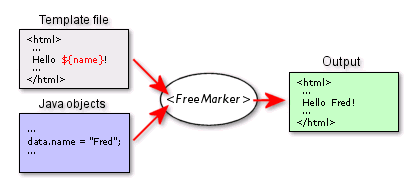

# FreeMarker

------

- ## 概述：

  1. ### 什么是FreeMarker？

     > `FreeMarker`全称`FreeMarker Template Language (FTL)`，和`Thymeleaf`一样，`FreeMarker`也是一款由Java编写的模板引擎，即一种基于模板和要改变的数据，用来生成输出文本(HTML网页，电子邮件，配置文件，源代码等)的通用工具。它不是面向最终用户的，而是一个Java类库，是一款视图组件。它的特点：
     >
     > - 轻量级模版引擎，不需要Servlet环境就可以很轻松的嵌入到应用程序中
     > - 能生成各种文本，如html，xml，java代码..等
     > - 入门简单，它是用java编写的，很多语法和java相似
     >
     > 

  2. ### 工作原理：

     

------

- ## JavaWeb中使用：

  1. 首先要在项目中引入`FreeMarker`的依赖：

     ```xml
     <dependency>
         <groupId>org.freemarker</groupId>
         <artifactId>freemarker</artifactId>
         <version>2.3.32</version>
     </dependency>
     ```

  2. 然后在web.xml中注册一个专门处理freemarker视图的servlet：

     ```xml
     <!DOCTYPE web-app PUBLIC
      "-//Sun Microsystems, Inc.//DTD Web Application 2.3//EN"
      "http://java.sun.com/dtd/web-app_2_3.dtd" >
     <web-app>
     
       <servlet>
         <servlet-name>freemarker</servlet-name>
         <servlet-class>freemarker.ext.servlet.FreemarkerServlet</servlet-class>
     	<!-- 设置模板路径，默认在webapp根下找ftl文件 -->
         <init-param>
           <param-name>TemplatePath</param-name>
           <param-value>/</param-value>
         </init-param>
     	<!-- 设置设置渲染用的字符编码 -->
         <init-param>
           <param-name>default_encoding</param-name>
           <param-value>UTF-8</param-value>
         </init-param>
       </servlet>
       <!-- 处理所有以.ftl结尾的请求 -->
       <servlet-mapping>
         <servlet-name>freemarker</servlet-name>
         <url-pattern>*.ftl</url-pattern>
       </servlet-mapping>
     
     </web-app>
     ```

------

- ## SpringMVC中使用：

  1. 除了freemarker依赖，还需要以下依赖：

     ```xml
     <!--springmvc对freemarker的支持依赖-->
     <dependency>
         <groupId>org.springframework</groupId>
         <artifactId>spring-context-support</artifactId>
         <version>6.0.18</version>
     </dependency>
     ```

  2. springmvc.xml中配置视图解析器：

     ```xml
     <!-- 配置freeMarker的模板路径 -->
     <bean class="org.springframework.web.servlet.view.freemarker.FreeMarkerConfigurer">
     	<property name="templateLoaderPath" value="/WEB-INF/ftl/"/>
     	<!-- 渲染时采用的字符编码 -->
     	<property name="defaultEncoding" value="UTF-8"/>
     </bean>
     <!-- freemarker视图解析器 -->
     <bean class="org.springframework.web.servlet.view.freemarker.FreeMarkerViewResolver">
     	<property name="suffix" value=".html"/>
         <!-- 告诉浏览器，响应体的类型 -->
     	<property name="contentType" value="text/html;charset=UTF-8"/>
     </bean>
     ```

------

- ## FreeMarker语法：

  > - 类似的，freemarker也是通过${}从4大域中取数据
  > - freemarker文件一般结尾为`.jfl`，也可以用`.html`，都可以。
  > - freemarker的标准注释为：`<#-- 这里是注释内容，不会被渲染 -->`
  > - 字符串拼接同样也是+号
  > - freemarker文档中的js、css、html还和之前一样写就行。
  > - freemarker中的指令以标签的形式存在：`<#xx></#xx>`

  - ### FreeMarker中的数据类型：

    1. **布尔型**：从域中取的布尔型数据不能直接输出，要先转成字符串，后面要加`?c`。这样做：

       `${flag?c}`、`${flag?string}`、`${flag?string('true时的文本','false时的文本')}`，但是新版本目前推荐用`then`来代替`string()`的写法：

       `${flag?then(('true时的文本','false时的文本')}`

    2. **日期型**：日期类型同样不能直接输出，要转成字符串，后面加`?date`。这样做：

       `${birth?date}`、`${birth?time}`、`${birth?datetime}`、`${birth?string('yyyy-MM-dd HH:mm:sss')}`

    3. **字符串型**：它可以直接被输出。字符串类型有很多常用方法：

       `?substring(start,end)`、`?length`、`?index_of('')`、`?trim`、`?replace('','')`、`?starts_with('')`(starts_with()返回布尔，输出得转string)

    4. **数组/List集合**：获取数组长度：`${users?size}`，获取第1个元素：`${users?first}`

       遍历用list指令：`<#list users as user>下标:${user?index}，元素:${user}，姓名:${user.name}</#list>`，也可以指定倒序输出：`users?reverse`

       集合或数组中如果有对象类型，那么就通过user.的方式

    5. **Map集合**：对应遍历集合中的所有key和所有value的方法，遍历map有两种方式keys和values：

       `<#list users?keys as userId>${userId}，${users[userId]}</#list>`

       `<#list users?values as userName>${userName}</#list>`

  - ### FreeMarker中的null和变量不存在：

    > - 如果域中变量的值为`null`，此时用${}输出会报错，用`!`：`${str!}`，此时`null`值默认输出空串，也可以指定：`${haha!'默认值'}`
    >
    > - 如果域中不存在某个变量，此时用${}取值也会报错，用`??`：`${(haha??)?c}`，它会判断该变量是否存在于域中，返回布尔值

  - ### FreeMarker中的常见指令：

    - **assign指令**：assign指令可以创建新的变量，在页面域中，它会覆盖已有的重名变量。语法：

      `<#assign 变量名=值 变量名=值...>`，双标签形式：`<#assign 变量名>值</#assign>`

    - **if elseif else指令**：语法：`<#if 条件>..<#elseif 条件>..<#else>..</#if>`，其中的elseif和else标签是可选的。例如：

      ```xml
      <#if x lt 1>
        x is 1
      <#elseif x == 2>
        x is 2
      <#elseif x == 3>
        x is 3
      <#elseif x gt 4>
        x is 4
      <#else>
        x is not 1 nor 2 nor 3 nor 4
      </#if>
      ```

    - **macro和nested指令**：

    - **import和include指令**：

  - ### 页面静态化：

  - ### FreeMarker中的运算符：

    - 算数运算符：`+ - * / %`
    - 逻辑运算符：`&& || !`
    - 比较运算符：`gt`或`>`，`lt`或`<`，`gte`或`>=`，`lte`或`<=`，`==`或`!=`

