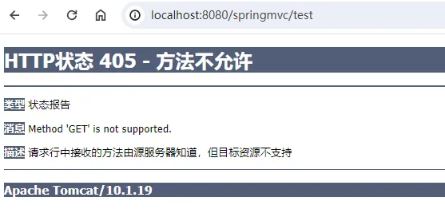
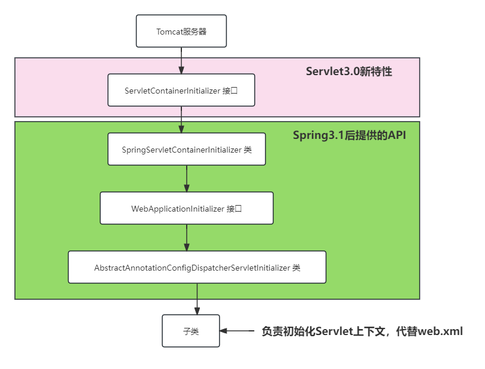

老杜语雀笔记地址：

1、https://www.yuque.com/dujubin/java/myxi54xu063hgsl4?singleDoc#aSNCf

2、https://www.yuque.com/dujubin/java/ogwoytryn7bugbl6?singleDoc#IB5dM

3、https://www.yuque.com/dujubin/java/szhdmdqgkl0id6km?singleDoc#YIDyC

4、https://www.yuque.com/dujubin/java/xx2pep14urc8i5b3?singleDoc#x2cgy

5、https://www.yuque.com/dujubin/java/nnv0b4etaq37rhi9?singleDoc#jzGlv

6、https://www.yuque.com/dujubin/java/ya030vq1147hp0zc?singleDoc#SIMK0

7、https://www.yuque.com/dujubin/java/zo4ab0u8ku4fzu6y?singleDoc#JUBil

8、https://www.yuque.com/dujubin/java/rmw13pozxr3zr0bk?singleDoc#%20

9、https://www.yuque.com/dujubin/java/gus9uv1y746q4o2g?singleDoc#%20

10、https://www.yuque.com/dujubin/java/otwub2uw65d1aid3?singleDoc#%20

11、https://www.yuque.com/dujubin/java/px94n1f868chscci?singleDoc#%20

12、https://www.yuque.com/dujubin/java/iptnrxyr74aeehc8?singleDoc#%20

------

# Spring MVC

### 概念

1. ##### 什么是Spring MVC：

   > - Spring MVC也叫Spring Web MVC，是一个实现了MVC架构模式的Web框架，底层基于Servlet实现，是Spring Web子项目的一个模块（Spring3.0之后发布），是专门做WEB开发的，是Servlet的一个升级。
   > - Spring MVC是基于MVC模式开发的框架，主要用来优化Controller层的。它将数据和视图分离开来，由控制器来统一调度。
   > - 由于Spring MVC是Spring家族的一员，所以它同同样具备IOC和AOP的功能。

2. ##### 什么是MVC：

   > 它是一种开发模式，它是模型视图控制器的简称。所有的WEB应用基本都是基于MVC模式开发。其中：
   >
   > - M：模型层，包含实体类，业务逻辑层，数据访问层
   > - V：视图层，html、javaScript、vue等都是视图层，用来展示数据
   > - C：控制器，它是用来接收客户端的请求，并返回响应到客户端的组件，Servlet就是组件
   >
   > 

3. ##### Spring MVC框架的特点：

   > 1.  轻量级：相对于其他Web框架，Spring MVC框架比较小巧轻便。（只有几个几百KB左右的Jar包文件）
   >
   > 2.  模块化：请求处理过程被分成多个模块，以模块化的方式进行处理。
   >
   >    - 控制器模块：Controller
   >
   >    - 业务逻辑模块：Model
   >
   >    - 视图模块：View
   >
   > 3.  依赖注入：Spring MVC框架利用Spring框架的依赖注入功能实现对象的管理，实现松散耦合。
   >
   > 4.  易于扩展：提供了很多口子，允许开发者根据需要插入自己的代码，以扩展实现应用程序的特殊需求。
   >
   >    - Spring MVC框架允许开发人员通过自定义模块和组件来扩展和增强框架的功能。
   >
   >    - Spring MVC框架与其他Spring框架及第三方框架集成得非常紧密，这使得开发人员可以非常方便地集成其他框架，以获得更好的功能。
   >
   > 5.  易于测试：支持单元测试框架，提高代码质量和可维护性。（对SpringMVC中的Controller测试时，不需要依靠Web服务器）
   >
   > 6.  自动化配置：提供自动化配置，减少配置细节。
   >
   > 7.  Spring MVC框架基于约定大于配置的原则，对常用的配置约定进行自动化配置。
   >
   > 8.  灵活性：Spring MVC框架支持多种视图技术，如JSP、FreeMarker、Thymeleaf等，针对不同的视图配置不同的视图解析器即可。

4. ##### Spring MVC帮我们做了什么，与纯粹的Servlet开发有什么区别：

   > 1.  入口控制：Spring MVC框架通过`DispatcherServlet`作为入口控制器，负责接收请求和分发请求。而在Servlet开发中，需要自己编写大量Servlet类，并在web.xml中进行配置，才能接受和处理请求。
   > 2. xxxxxxxxxx <!-- 日期格式化 --><p th:text="${#dates.format(user.birth,'yyyy-MM-dd HH:mm')}"></p>html
   > 3.  IoC容器：Spring MVC框架通过IoC容器管理对象，只需要在配置文件中进行相应的配置即可获取实例对象，而在Servlet开发中需要手动创建对象实例。
   > 4.  统一处理请求：Spring MVC框架提供了**拦截器**、**异常处理器**等统一处理请求的机制，并且可以灵活地配置这些处理器。而在Servlet开发中，需要自行编写过滤器、异常处理器等，增加了代码的复杂度和开发难度。
   > 5.  视图解析：Spring MVC框架提供了多种视图模板，如JSP、FreeMarker、Thymeleaf、Velocity等，并且支持国际化、主题等特性。而在Servlet开发中需要手动处理视图层，增加了代码的复杂度。

   > 总之，与Servlet开发相比，Spring MVC框架可以帮我们节省很多时间和精力，减少代码的复杂度，更加专注于业务开发。同时，也提供了更多的功能和扩展性，可以更好地满足企业级应用的开发需求。

5. ##### Spring MVC执行流程：

   > Spring MVC是Spring框架的一员，而Spring是一个容器，所以Spring MVC同样也可以创建对象，然后放在它专属的Spring MVC容器中。Spring MVC容器中是专门放Controller对象的。我们要做的就是使用`@Controller`注解标注控制器类，将该对象放入Spring MVC的容器中，将Controller对象当作Servlet使用，由这个Controller对象接收用户的请求并显示处理结果。实际上这个Controller对象就是一个普通的类而已，是Spring MVC框架赋予了它一些额外的功能。
   >
   > JavaWeb开发底层都是Servlet在处理的请求。同样，Spring MVC中有一个处理请求的核心Servlet对象`DispatcherServlet`中央调度器，它来负责接收用户所有的请求，再由它统一将请求转发给MVC容器中的普通Controller对象，由Controller对象去处理请求，最终返回给`DispatcherServlet`这里做出响应。


### Spring MVC的第一个程序

1. 新建maven项目，选择web模板。将各层的包建好，并添加Spring MVC的依赖（6.0.18，此时Spring的依赖也有了），添加Servlet的依赖（6.0.0），Junit5依赖：

   ```xml
   <dependency>
   	<groupId>org.junit.jupiter</groupId>
   	<artifactId>junit-jupiter-api</artifactId>
   	<version>5.10.2</version>
   	<scope>test</scope>
   </dependency>
   <dependency>
   	<groupId>jakarta.servlet</groupId>
   	<artifactId>jakarta.servlet-api</artifactId>
   	<version>6.0.0</version>
   	<scope>provided</scope>
   </dependency>
   <dependency>
   	<groupId>org.springframework</groupId>
   	<artifactId>spring-webmvc</artifactId>
   	<version>6.0.18</version>
   </dependency>
   ```

2. 类路径下新建`springmvc.xml`配置文件（名字随意），指定包扫描：

   ```xml
   <?xml version="1.0" encoding="UTF-8"?>
   <beans xmlns="http://www.springframework.org/schema/beans"
          xmlns:xsi="http://www.w3.org/2001/XMLSchema-instance"
          xmlns:context="http://www.springframework.org/schema/context"
          xsi:schemaLocation="http://www.springframework.org/schema/beans http://www.springframework.org/schema/beans/spring-beans.xsd http://www.springframework.org/schema/context https://www.springframework.org/schema/context/spring-context.xsd">
       <!-- 指定包扫描 -->
       <context:component-scan base-package="com.itheima.controller"/>
   </beans>
   ```

3. webapp下新建index.jsp，里面的超链接跳转到/some.do，WEB-INF下新建static/main.jsp

4. （重点）Spring MVC是一个web框架，在javaweb中谁来负责接收请求，处理请求，以及响应呢？当然是Servlet。在Spring MVC框架中已经为我们写好了一个Servlet，它的名字叫做：`DispatcherServlet`，我们称其为“中央调度器”。既然是Servlet，那么它就需要在web.xml文件中进行配置。在web.xml文件中注册Spring MVC的中央调度器DispatcherServlet（所有的web请求都是基于servlet的，DispatcherServlet继承了HttpServlet，其他所有的处理请求的Controller都是普通类，都需要DispatcherServlet将请求转给普通的Controller才行）：

   ```xml
   <?xml version="1.0" encoding="UTF-8"?>
   <web-app xmlns="https://jakarta.ee/xml/ns/jakartaee"
            xmlns:xsi="http://www.w3.org/2001/XMLSchema-instance"
            xsi:schemaLocation="https://jakarta.ee/xml/ns/jakartaee https://jakarta.ee/xml/ns/jakartaee/web-app_5_0.xsd"
            version="5.0">
       <!--    注册springmvc的中央调度器，由它来接管所有前端请求 -->
       <servlet>
           <servlet-name>springmvc</servlet-name>
           <servlet-class>org.springframework.web.servlet.DispatcherServlet</servlet-class>
           <!-- 服务器启动就创建该中央调度器对象，为什么启动就创建呢？
   			因为该servlet对象的创建会调用init()方法，方法中{
   			    WebApplicationContext cts = new ClassPathXmlApplicationContext("springmvc.xml");
   			    getServletContext().setAttribute(key,cts);
   			}，
   			作用是创建该对象的同时，解析springmvc.xml核心配置文件将其中的所有controller都实例化，
   			然后将mvc的容器对象放在context域中，此时请求过来就可以直接处理请求了。
   		-->
           <load-on-startup>1</load-on-startup>
           <!-- 如果没有告诉中央调度器，springmvc配置文件在哪，那么它默认去/WEB-INF/中央调度器的servletName-servlet.xml找该文件，
           但是这个文件位置和名字我们想自定义，所以就需要告诉中央调度器，springmvc的核心配置文件在哪，名字是啥 -->
           <init-param>
               <param-name>contextConfigLocation</param-name>
               <param-value>classpath:springmvc.xml</param-value>
           </init-param>
       </servlet>
       <servlet-mapping>
           <servlet-name>springmvc</servlet-name>
           <!--配置该中央调度器的urlPattern时，通常有两种方式：
               1、使用扩展名的方式：  *.xxx
                   xxx是自定义的文件扩展名，常用的扩展名为：*.do或*.mvc或*.action
                   例如：http://localhost:8080/myweb/some.do
               2、使用斜杠“/”，表示除了jsp所有未映射的资源都给它来处理 -->
           <url-pattern>*.do</url-pattern>
       </servlet-mapping>
   </web-app>
   ```

5. 在controller包下新建控制器类MyController：

   ```java
   @Controller
   public class MyController {
       /*在Controller类中编写doSome()来处理中央调度器转发过来的/some.do请求：
           1、@RequestMapping请求映射，作用是把一个请求地址和一个控制器方法绑定在一起，一个请求对应一个方法；
           2、@RequestMapping注解的value属性String[]类型，用于指定url请求地址，地址要是唯一的，默认是{}；
           3、这和我们servelt不同的是，servlet的请求路径是映射在类上，而@RequestMapping在方法上指定url，更灵活了；
           4、该注解的method属性是RequestMethod[]类型，是个枚举，用于指定访问该url必须使用的请求方式（get/post），
           	否则就405。默认值{}表示什么类型请求都行；
           5、@RequestMapping("/test")放在类上表示：我这个控制器类，其中所有的控制器方法的url，
           	前缀都有一个公共部分是“/test”，它叫做“模块名称”。主要是区分不同类中相同的url。
           6、以该注解修饰的方法叫做“控制器方法”，相应的还有“控制器类”；
           7、（了解）SpringMVC还提供了另一个注解@PostMapping("/test")，使用该注解时不需要指定method属性，
           	因为它默认采用的就是POST处理方式，它是为了简化@RequestMapping注解的。除此之外还有：
           	@GetMapping\@PutMapping\@DeleteMapping\@PatchMapping
           8、（了解）params属性是String[]，params={"user","pwd"}要求url中必须携带该参数才能匹配成功。
           9、（了解）headers属性和params类似，要求请求必须包含某个请求头才行。
           	@RequestMapping(value="/login",headers={"Referer", "Host"}) 表示：
           		请求头信息中必须包含Referer和Host，才能与当前标注的方法进行映射。
           	@RequestMapping(value="/login", headers={"Referer", "!Host"}) 表示：
           		请求头信息中必须包含Referer，但不包含Host，才能与当前标注的方法进行映射。
           	@RequestMapping(value="/login",headers={"Referer!=http://localhost:8080/springmvc/", "Host"}) 					表示：请求头信息中必须包含Referer和Host，并且Referer的值必须不是
           			http://localhost:8080/springmvc/，才能与当前标注的方法进行映射。
       */
       @RequestMapping("/some.do")
       public ModelAndView doSome(){
           /*该方法的返回值为：ModelAndView，是springmvc框架的类，里面封装本次请求的处理结果，包括：
       	    Model：数据，要放到request域中的数据，请求处理完成后，要显示给用户的数据
   		    View：视图，跳转的页面，比如jsp等
           （框架后期拿到该对象后，会把其中的数据封装放在request域中，其中的视图url执行forward请求转发）
           */
           ModelAndView mv = new ModelAndView();
           //添加数据
           mv.addObject("data1", "zs");
           mv.addObject("data2", new Object());
           //设置视图的完整路径，也就是要转发的路径
           mv.setViewName("/static/main.jsp");
           //返回ModelAndView对象
           return mv;
       }
   }
   ```

6. 部署项目，添加tomcat进行测试（项目名为/）。运行成功：


> - 到目前为止，我们的请求路径是这样的格式：`uri?name1=value1&name2=value2&name3=value3`
>
> - 其实除了这种方式，还有另外一种格式的请求路径，格式为：`uri/value1/value2/value3`，我们将这样的请求路径叫做**RESTful**风格的请求路径。RESTful风格的请求路径在现代的开发中使用较多。
>
>   - 普通的请求路径：http://localhost:8080/springmvc/login?username=admin&password=123&age=20
>   - RESTful风格的请求路径：http://localhost:8080/springmvc/login/admin/123/20
>
> - RESTful的路径中没有动词，只有操作的资源（名词），具体对这些资源做的是增/删/改/查，是由请求方式来决定的。
>
>   - GET是查，POST是增，DELET是删，PUT/PATCH是改（改局部）
>   - 通过请求方式和资源url，以及在路径url后的资源标识，就可以完成对某个资源的操作。
>   - 而且对资源操作成功还是失败，一定要与HTTP的响应状态码保持一致，成功就要返回是200状态码。
>
> - 如果使用RESTful风格的请求路径，在控制器方法中应该如何获取请求路径中的数据呢？用Spring MVC中支持的`{}`占位符，如：
>
>   - 前端的rest风格的url：`/testRESTful/1/zhangsan/20`
>
>   - 后端RequestMapping中：`@RequestMapping(value="/testRESTful/{id}/{username}")`，这样任何以`/testRESTful`开头的url都能够匹配上该处理器方法。
>
>   - 程序中获取：
>
>     ```java
>     public String testRESTful(@PathVariable("id") int id, @PathVariable("username") String username){
>     	System.out.println(id + "," + username + "," + age);
>     	return "testRESTful";
>     }
>     ```
>
> - 如果是普通的Servlet程序，那么就只能手动判断了。先确定哪部分是数据，哪部分是路径，后端程序需要手动截取字符串来获取数据。
>
> - **Ant风格的url**：Spring MVC中的路径支持模糊匹配，我们把这种模糊匹配称之为Ant风格。路径中的通配符包括
>
>   - `?`：代表任意1个字符（不包括`?`和`/`）
>   - `*`：代表任意n个任意字符（不包括`?`和`/`）
>   - `**`：代表表示任意一层或多层目录，就是说路径中可以出现路径分隔符`/`和`?`（注意：`**`通配符在使用时，左右只能是`/`）

------

##### 现在第一个程序有个问题：用户可以直接访问/static/main.jsp，这是我们不希望看到的。因为必须先通过Servlet将数据放在域中后，JSP中的动态数据才能正确展现，此时才能让用户访问该JSP页面。那怎么让用户访问JSP之前必须先通过Servlet呢？

> 通过WEB-INF目录。我们知道，WEB-INF目录下的资源是受保护的，只能通过Servlet来跳转。所以我们**将jsp放在WEB-INF目录下**。

> 那么此时我们内部写的大量的前端路径，前面都要加上一个相同的/WEB-INF/这样的前缀很麻烦，可以通过视图解析器解决静态页面公共前缀的问题。在`springmvc.xml`文件中加入如下配置：（后面再说跳过路径拼接的问题）

```xml
<!-- 配置JSP的视图解析器，这个类是mvc框架自己写好的，可以解析jsp，我们直接用即可 -->
<bean class="org.springframework.web.servlet.view.InternalResourceViewResolver">
	<!--配置前缀-->
	<property name="prefix" value="/WEB-INF/"></property>
	<!--配置后缀-->
	<property name="suffix" value=".jsp"></property>
</bean>
```

> 如果是Thymeleaf模板，需要配置Thymeleaf的解析器。该解析器是`thymeleaf-spring6`的依赖里的，要提前添加该依赖：
>
> ```xml
> <dependency>
>     <groupId>org.thymeleaf</groupId>
>     <artifactId>thymeleaf-spring6</artifactId>
>     <version>3.1.2.RELEASE</version>
> </dependency>
> ```
>
> 配置Thymeleaf的视图解析器：

```xml
<!-- thymeleaf的视图解析器 -->
<bean id="thymeleafViewResolver" class="org.thymeleaf.spring6.view.ThymeleafViewResolver">
    <!-- 渲染完成输出采用的字符集 -->
    <property name="characterEncoding" value="UTF-8"/>
    <!-- 如果有多个视图解析器，那么order值越小的优先级越高 -->
    <property name="order" value="1"/>
    <!--当 ThymeleafViewResolver 渲染模板时，会使用该模板引擎来解析、编译和渲染模板-->
    <property name="templateEngine">
        <bean class="org.thymeleaf.spring6.SpringTemplateEngine">
            <property name="templateResolver">
                <bean class="org.thymeleaf.spring6.templateresolver.SpringResourceTemplateResolver">
                    <!-- 视图前缀 -->
                    <property name="prefix" value="/WEB-INF/templates/"/>
                    <!-- 视图后缀 -->
                    <property name="suffix" value=".html"/>
                    <!-- 模板语法为HTML语法 -->
                    <property name="templateMode" value="HTML"/>
                    <!-- 模板文件的编码是UTF-8 -->
                    <property name="characterEncoding" value="UTF-8" />
                </bean>
            </property>
        </bean>
    </property>
</bean>
```

> 此时`doSome()`里的`setViewName("static/main");`只留下逻辑名称即可，前缀后缀会被拼接上。

##### 解决POST乱码：（高版本的tomcat中，get请求没有乱码）

> 我们通过框架的spring-web中写好的类`CharacterEncodingFilter`来解决：（他底层是通过`req.setCharacterEncoding()`和`resp.setCharacterEncoding()`来完成的）

```xml
<filter>
    <filter-name>characterEncodingFilter</filter-name>
    <filter-class>org.springframework.web.filter.CharacterEncodingFilter</filter-class>
    <!-- 设置项目中使用的字符编码 -->
    <init-param>
        <param-name>encoding</param-name>
        <param-value>UTF-8</param-value>
    </init-param>
    <!-- 强制request对象使用上面的编码 -->
    <init-param>
        <param-name>forceRequestEncoding</param-name>
        <param-value>true</param-value>
    </init-param>
    <!-- 强制response对象使用上面的编码 -->
    <init-param>
        <param-name>forceResponseEncoding</param-name>
        <param-value>true</param-value>
    </init-param>
</filter>
<filter-mapping>
    <filter-name>characterEncodingFilter</filter-name>
    <!-- 表示所有请求过来都先走过滤器 -->
    <url-pattern>/*</url-pattern>
</filter-mapping>
```

> 这样用户和服务器之间传输的所有文本数据，只要采用UTF-8方式编码和解码，就能确保资源被正确解析。

------

### 处理器方法的参数和返回值

##### 处理器方法的参数：

> 处理器方法的形参中可以出现以下4种类型参数，这些参数会在处理器方法调用时自动赋值：
>
> `HttpServletRequest`、`HttpServletResponse`、`HttpSession`、url后携带的查询字符串
>
> 其中前3种相当于还是原生的Servlet的API，不建议使用。因为不方便对处理器方法做单元测试，而且我们既然用了框架，为什么还要用Servlet的原生API呢？
>
> 所以我们重点学习，框架中如何获取**url后携带的查询字符串**：

1. ###### 逐个接收：

   > 这种方式要求，形参名必须和携带参数的key保持一致。类型也要一致，否则就`ClassCastException`，建议用包装类型接收，参数没有不至于报错400。String可以接收任何类型，因为本质上，前端通过网络传给服务器的都是String。
   > 如果参数名不一致，那么可以在参数前面加`@RequestParam("key")`注解。里面除了value属性还有布尔类型属性required，默认值true表示参数必须有，没有就报错。`defaultValue`属性当前端没有该参数时给形参赋默认值。
   > `@RequestHeader(value="Refer")`注解可以将请求头的信息映射到形参上。和RequestParam注解功能相似，它也有三个属性value、required、defaultValue。
   > `@CookieValue()`注解可以将请求提交的Cookie数据映射到方法形参上，同样有三个属性value、required、defaultValue。

2. ###### pojo对象接收（常用）：

   > 要求该pojo类的属性名和参数的key相同，且要提供setter、getter方法。此时处理器方法的形参写该pojo类型，框架会根据属性名将参数封装成pojo对象传进去；注意：这种方式不能用`@RequestParam`注解
   
3. ###### 日期处理：（启用注解驱动标签，参数前使用`@DateTimeFormat`注解）

   > - 如果前端提交过来一个日期字符串，处理器方法上此时是不能直接用Date来接收的，格式匹配上了还好，格式匹配不上就会出问题。怎么能让前端提交过来的日期字符串，用Date类型成功匹配接收呢？形参前用`@DateTimeFormat`注解，用法如下：
   >
   >
   > （注意：还得启用`<mvc:annotation-driven>`注解驱动标签，因为底层要用到做格式转换的类，该注解能启用该类）
   >
   > - 如果形参是Student类型，它里面有Date属性需要匹配前端传来的日期串，那么就**在Student类的属性或setter上使用该注解**。
   >
   >
   > - 如果要将Student类型对象返回给前端（返回的是一个JSON串），那么就在Student的属性或getter上使用`@JsonFormat()`
   
   ```java
   @RequestMapping("/mydate")
   public String mydate( @DateTimeFormat(pattern = "yyyy-MM-dd") Date mydate){
       System.out.println(mydate);
       System.out.println(sf.format(mydate));
       return "show";
   }
   ```

   ###### 如果控制器类中有很多控制器方法，很多方法都要用Date类型，如果在形参上一个个写该注解就太麻烦了，用类的全局数据处理：
   
   ```java
   //该控制器类中注册一个全局的数据处理注解
   @InitBinder
   public void initBinder(WebDataBinder dataBinder){
       //解析本类中所有的日期类型，自动转换。而且无需开启注解驱动
       dataBinder.registerCustomEditor(Date.class,
                   new CustomDateEditor(DateTimeFormatter.ofPattern("yyyy-MM-dd"),true));
   }
   ```

##### 处理器方法的返回值：（其实无论哪种，最终的返回值都是`ModelAndView`对象）

- ###### `ModelAndView`：这种方式在转发页面的同时，还可以携带数据。但是如果转发和数据只需要使用一个，此时用这个作为返回值就有点浪费了，用下面3种比较合适。（但是处理器方法最终的返回值还是该对象）

- ###### String：这种方式只进行资源转发，不会携带数据。当然也可以手动在请求域中添加数据req.setAttribute("key", value)。

- ###### void（了解）：其实我们可以不返回任何值，就纯粹通过req和resp对象来做请求的转发、处理和响应。此时返回值是void。

- ###### 还有其他的，后面再说...

------

### Spring MVC中使用域对象

- ##### request域：（SpringMVC中，使用request域有以下几种方式）

  1. 使用原生Servlet API方式。通过调度器方法的形参中传过来的request对象来使用。

  2. 使用Model接口。（框架会自动传过来该对象，往Model对象中放数据相当于放在了请求域中）

     ```java
     @RequestMapping("/testModel")
     public String testModel(Model model){
         // 向request域中存储数据
         model.addAttribute("testRequestScope", "在SpringMVC中使用Model接口实现request域数据共享");
         return "view";
     }
     ```

  3. 使用ModelMap类：（往ModelMap对象中放数据相当于放在了请求域中）

     ```java
     @RequestMapping("/testModelMap")
     public String testModelMap(ModelMap modelMap){
         // 向request域中存储数据
         modelMap.addAttribute("testRequestScope", "在SpringMVC中使用ModelMap实现request域数据共享");
         return "view";
     }
     ```

  4. 使用Map接口：（map对象中的数据会自动放在请求域中）

     ```java
     @RequestMapping("/testMap")
     public String testMap(Map<String, Object> map){
         // 向map中放就是在向request域中存储数据
         map.put("testRequestScope", "在SpringMVC中使用Map接口实现request域数据共享");
         return "view";
     }
     ```

     **无论是Model、ModelMap还是Map，底层传过来的对象都是BindingAwareModelMap，它就是一个HashMap**

  5. 返回**ModelAndView**对象。（上面说过了，除了转发还可以携带数据）

###### （其实执行完处理器方法后，框架最终还是将方法返回的视图名、请求域中添加的数据，封装为ModelAndView对象返回给了DispatcherServlet中央调度器）

- ##### session域：

  > 除了原生的servletAPI方式，还可以使用`@SessionAttributes`注解session域中添加数据：（注意：是**加在Controller类上**）

  ```java
  @Controller
  @SessionAttributes({"x", "y"})
  //表示，当key是x或y时，数据将被存储到session域中。如果没有该注解，默认是存储到request域中了
  public class SessionScopeTestController {
      @RequestMapping("/testSessionScope2")
      public String testSessionAttributes(ModelMap modelMap){
          // 向session域中存储数据
          modelMap.addAttribute("x", "我是埃克斯");
          modelMap.addAttribute("y", "我是歪");
          return "view";
      }
  }
  ```

- ##### application域：一般往应用域加数据都是用servletAPI来做的。

------

### Spring MVC中视图的实现原理

- ##### 在Spring MVC中，视图View是支持定制的，例如我们之前在 springmvc.xml 文件中进行了如下的配置：

  ```xml
  <!-- 配置视图解析器，这个类是mvc框架自己写好的，我们直接用即可 -->
  <bean class="org.springframework.web.servlet.view.InternalResourceViewResolver">
  	<!--配置前缀-->
  	<property name="prefix" value="/WEB-INF/"></property>
  	<!--配置后缀-->
  	<property name="suffix" value=".jsp"></property>
  </bean>
  ```

  > 以上的配置表明当前Spring MVC框架使用的视图View是JSP的。
  >
  > 如果你需要换成其他的视图View，修改以上的配置即可。这样就可以非常轻松的完成视图View的扩展。
  >
  > 这种设计是完全符合OCP开闭原则的。视图View和框架是解耦合的，耦合度低扩展能力强。视图View可以通过配置文件进行灵活切换。

- ##### Spring MVC支持的常见视图：

  > 1. `InternalResourceView`：内部资源视图（Spring MVC框架内置的，专门为JSP模板语法准备的），而且也是做资源转发的。
  >
  > 2. `RedirectView`：重定向视图（Spring MVC框架内置的，用来完成重定向效果）
  >
  > 3. `ThymeleafView`：第三方的视图解析器，需要引入jar包，它是第三方为Thymeleaf模板语法准备的
  >
  >    ...

- ##### 实现视图机制的核心类与核心接口：

  - `DispatcherServlet`类（前端控制器）：

    > 负责接收前端过来的所有请求，根据url匹配相应的控制器方法，执行方法并最终返回`ModelAndView`对象。之后是处理视图相关的

  - `ViewResolver`接口（视图解析器）：

    > 上面常见的视图类都实现了该接口。作用是将物理视图名称转换为逻辑视图名称，并最终返回View接口对象。

  - `View`接口（视图）：

    > 负责将模型数据Model渲染为视图格式（HTML代码），并最终将生成的视图（HTML代码）输出到客户端（render方法）。

- ##### Spring MVC中的forward和redirect：

  > Spring MVC框架将原来Servlet中的转发和重定向进行了封装，可以使用简化版的转发和重定向：`forward:`和`redirect:`
  >
  > 它们的特点是：不和视图解析器一同工作，相当于项目中没有视图解析器。可以**跳过视图解析器对路径的拼接**。

  > 其实Spring MVC中，**默认的资源跳转方式就是转发**，我们之前的程序都是转发的方式，而且会使用配置的视图解析器来解析路径。如果想使用框架内置的视图解析器，就可以在路径url前加`forward:`，表示使用**InternalResourceView**这个解析器，它可以做转发和JSP视图的解析。路径url前加`redirect:`表示使用**RedirectView**这个解析器，它是专门做重定向的。

  ###### 注意：使用重定向方式，ModelAndView中的数据是放在了get请求的url中。这样重定向也可以携带数据了。但是重定向不可以直接访问WEB-INF下的资源。

- ##### 视图控制器`<mvc:view-controller>`：（用于处理动态视图资源）

  > 我们不是将jsp页面放在了WEB-INF下，被保护起来了吗，此时直接访问就不行了，必须通过中央调度器的转发才行。但是中央调度器转发还需要写控制器方法，通过控制器返回视图才能跳转到jsp页面，很麻烦。
  >
  > 这里有更好的方式，我们可以直接通过配置**视图控制器**标签，它相当于写了一个控制器，直接帮我们对视图进行了转发。
  >
  > `<mvc:view-controller path="/test" view-name="index.jsp">`用于配置，将某个请求url直接映射到特定的视图上。它相当于是一个独立的处理程序，不需要编写任何Controller，只需要指定 URL 和对应的视图名就可以了。
  >
  > 一般情况下，`<mvc:view-controller>`配置用于替代一些没有业务逻辑的Controller，例如首页、错误页面等。当用户访问配置的URL时，框架将直接匹配到对应的视图，而无需再经过其他控制器的处理。
  >
  > 但是要注意了：如果加了该标签，那么它**会影响@RequestMapping注解**，此时**一定要加注解驱动标签`<mvc:annotaion-drivern>`**

- ##### 访问静态资源：（处理静态视图资源，不经过视图解析器，无法访问WEB-INF下的资源）

  > 在之前学的Servlet中，我们没有说为什么url可以直接访问WEB-INF外的静态资源。实际上，Tomcat帮我们内置了一个处理静态资源的Servlet，在它的web.xml中有一个写好的Servlet叫`DefaultServlet`，它启动时就初始化了，urlPattern设置的是`/`，所以会处理所有的未映射的资源（除了jsp，jsp是servlet，所以会自动注册在web.xml中）。它可以配置一些初始化参数，如：input表示读的资源的最大值，fileEncoding表示读静态资源所采用的编码方式。

  > 当项目中将`DispatcherServlet`的urlPattern设置为`/`，那么它就覆盖了Tomcat的默认的DefaultServlet，此时访问静态资源一定会出问题（动态资源没问题，因为@RequestMapping注解设置了动态资源的映射关系）。那怎么办呢？

  - 方式1：（启用tomcat服务器中的DefaultServlet）

    ```xml
    <!-- 重新启用tomcat中的默认Servlet来处理静态资源 -->
    <mvc:default-servlet-handler/>
    ```

    > 加了之后，底层框架会创建一个`DefaultServletHttpRequestHandler`控制器对象，中央调度器找不到资源发生404时，会将请求默认转发给该对象，由它转发给tomcat的DefaultServlet去处理。（同样，**`<mvc:default-servlet-handler>`标签和@RequestMapping有冲突，所以也必须加上注解驱动标签**）
    > 但是这种方式不太好，因为它要依赖tomcat服务器写好的类，如果项目移植到其他服务器上就不行了，还有一种办法：

  - （推荐）方式2：（配置静态资源标签`<mvc:resources>`）

    ```xml
    <!-- 配置静态资源处理，mapping指定访问的url，location是资源在本地的地址；可以有多个 -->
    <mvc:resources mapping="/static/**" location="/static/"/>
    ```

    > 加了之后底层框架会实例化一个`ResourceHttpRequestHandle`控制器对象来专门负责静态资源的处理。同样也和@RequestMapping有冲突**需要加注解驱动标签**。

  
  ##### 这样的话，程序中所有资源的请求都由我们的mvc框架来负责了。

------

### RESTful编程风格

##### RESTFul是什么：

> - RESTFul是`WEB服务接口`的一种设计风格。RESTFul定义了一组约束条件和规范，可以让`WEB服务接口`更加简洁、易于理解、易于扩展、安全可靠。
>
> - RESTFul对一个`WEB服务接口`都规定了哪些东西？
>
>   - 对请求的URL格式有约束和规范（重点）
>
>   - 对HTTP的请求方式有约束和规范（重点）
>
>   - 对请求和响应的数据格式有约束和规范
>
>   - 对HTTP状态码有约束和规范
>
>   - 等 ......
>
> - REST对请求方式的约束是这样的：
>
>   - 查询必须发送GET请求
>
>   - 新增必须发送POST请求
>
>   - 修改必须发送PUT请求
>
>   - 删除必须发送DELETE请求
>
> - REST对URL的约束是这样的：
>
>   - 传统的URL：get请求，/springmvc/getUserById?id=1
>
>   - REST风格的URL：get请求，/springmvc/user/1
>   - 传统的URL：get请求，/springmvc/deleteUserById?id=1
>   - REST风格的URL：delete请求, /springmvc/user/1
>
> - RESTFul对URL的约束和规范的核心是：通过采用**不同的请求方式**+**URL**来确定WEB服务中的资源。
>
> - **RESTful 的英文全称是 Representational State Transfer（表述性状态转移）。简称REST。**
>
>   - 表述性（Representational）是：URI + 请求方式。
>   - 状态（State）是：服务器端的数据。
>   - 转移（Transfer）是：变化。
>   - 表述性状态转移是指：通过 URI + 请求方式 来控制服务器端数据的变化。

##### 怎么发送PUT/DELETE请求？

> - 通常情况下，HTML表单元素并不直接支持PUT请求。因此，要发送PUT请求，一般需要通过JS来发送。可以使用JS中的XMLHttpRequest对象，然后设置请求方法为PUT，再发送请求到后端服务器。
> - 还有一种发送PUT请求的方式，它类似于骗了后端服务器。这种方式是在表单中新增隐藏域控件，name设置为`_method`，value指定为put，然后通过后端设置的过滤器，将数据中带有`_method`数据的都拦截住，然后将该请求的`getMethod()`值改为put，再交给servlet。这样servlet查看过来的请求的方式发现就变成了put方式。相当于骗了后端程序，不过需要过滤器的支持。
> - 好消息：springmvc中给我们提供了这样个过滤器，直接用，前端form只要提交的数据带有_method就行。该过滤器要求：
>   1. 首先你必须是一个POST请求。
>   2. 在前端发送POST请求的时候，url中必须携带这样的数据：xxx/xx?_method=PUT&key=value...
>   3. 在web.xml文件注册Spring MVC提供的过滤器：`HiddenHttpMethodFilter`隐藏的HTTP请求方式过滤器

```HTML
<form action="/api/user" method="post">
    <!-- 隐藏域的方式提交数据：_method=PUT -->
    <input type="hidden" name="_method" value="PUT">
    用户名：<input type="text" name="username"><br>
</form>
```

```xml
<!-- web.xml注册过滤器，使用springmvc中写好的，隐藏的HTTP请求方式过滤器 -->
<filter>
    <filter-name>hiddenHttpMethodFilter</filter-name>
    <filter-class>org.springframework.web.filter.HiddenHttpMethodFilter</filter-class>
</filter>
<filter-mapping>
    <filter-name>hiddenHttpMethodFilter</filter-name>
    <url-pattern>/*</url-pattern>
</filter-mapping>
```

> **注意事项：**
>
> 该过滤器的路径`/*`和字符编码过滤器冲突了，所以他们俩谁在上面谁先执行。那么谁得先执行呢？字符编码过滤器先执行。
>
> 细心的同学应该注意到了，在`HiddenHttpMethodFilter`源码中有这样一行代码：`request.getParameter()`，而字符编码的设置需要在这行代码执行之前。因此这两个过滤器就有先后顺序的要求，应该**先配置CharacterEncodingFilter，然后再配置HiddenHttpMethodFilter**

###### 这样就可以在@RequestMapping中通过method = RequestMethod.PUT来处理PUT请求了

------

### 关于Http消息转换器接口HttpMessageConverter

> 这是Spring MVC中一个很重要的接口，其实之前一直都在用它只是没有详细讲。它是做http消息转换的，其中不同的实现类实现了不同数据格式的转换。接口下的实现类有：（默认用的是`StringHttpMessageConverter`）


> http消息其实就是http请求消息和响应消息，就是http协议。http请求和响应消息本质都是字符串，之前都是Servlet的req和resp对象对http消息做的数据格式转换，这样我们就能直接使用http协议进行通信。

##### 以下是一份HTTP POST请求协议：

```txt
POST /springmvc/user/login HTTP/1.1																	--请求行
Content-Type: application/x-www-form-urlencoded														--请求头
Content-Length: 32
Host: www.example.com
User-Agent: Mozilla/5.0
Connection: Keep-Alive
Accept: text/html,application/xhtml+xml,application/xml;q=0.9,*/*;q=0.8
																									--空白行
username=admin&password=1234																		--请求体
```

##### 以下是一份HTTP GET请求协议：(没有空白行和请求体)

```txt
GET /springmvc/user/del?id=1&name=zhangsan HTTP/1.1													--请求行
Host: www.example.com																				--请求头
User-Agent: Mozilla/5.0
Connection: Keep-Alive
Accept: text/html,application/xhtml+xml,application/xml;q=0.9,*/*;q=0.8
```

##### 以下是一份HTTP响应协议：

```txt
HTTP/1.1 200 OK																						--状态行
Date: Thu, 01 Jul 2021 06:35:45 GMT																	--响应头
Content-Type: text/plain; charset=utf-8
Content-Length: 12
Connection: keep-alive
Server: Apache/2.4.43 (Win64) OpenSSL/1.1.1g
                                                                                        			--空白行
<!DOCTYPE html>																						--响应体
<html>
  <head>
    <title>hello</title>
  </head>
  <body>
    <h1>Hello World!</h1>
  </body>
</html>
```

------

#### 转换器转换的是什么：

> 转换的是`HTTP协议`与`Java程序中的对象`之间的互相转换（我们之前处理器方法的参数就说过）。请看下图：


> 上图是我们之前写的代码。请求体中的数据是如何转换成user对象的，底层实际上使用了mvc框架内置的`HttpMessageConverter`接口的其中一个实现类`FormHttpMessageConverter`。通过上图可以看出`FormHttpMessageConverter`是负责将`请求协议`转换为`Java对象`的。再看下图：


> 上图的代码也是之前我们经常写的，Controller返回值看做逻辑视图名称，视图解析器将其转换成物理视图名称，生成视图对象，`StringHttpMessageConverter`负责将视图对象中的HTML字符串写入到HTTP协议的响应体中来完成响应。
>
> 通过上图可以看出`StringHttpMessageConverter`是负责将`Java对象`转换为`响应协议`的。
>
> 通过以上内容的学习，大家应该能够了解到`HttpMessageConverter`接口是用来做什么的了：


> 如上图所示：`HttpMessageConverter`接口的可以将请求协议转换成Java对象，也可以把Java对象转换为响应协议。
> `HttpMessageConverter`是接口，SpringMVC帮我们提供了非常多而丰富的实现类。每个实现类都有自己不同的转换风格。
>
> 对于我们程序员来说，我们只需要在不同的业务场景下，选择合适的HTTP消息转换器实现类对象即可。
> 怎么使用呢？通过Spring MVC为我们提供的注解，我们通过使用不同的注解来启用不同的消息转换器。
>
> 目前我们重点要掌握的是两个注解两个类：
>
> `@ResponseBody`注解和`@RequestBody`注解
> `ResponseEntity`类和`RequestEntity`类

------

#### @ResponseBody：

> 其实处理器方法的返回值类型还可以是`Object`类型，返回一个Java对象，但是要给处理器方法上加`@ResponseBody`注解，表示启用底层对应的消息转换器对象。此时哪怕返回值类型是String或任何其他类型，也不会当作视图的逻辑名称去处理了，都会调用消息转换器对象来转成http响应体中的数据。底层消息转换器对象会根据不同的Java对象来调用不同的消息转换器对象来做消息类型转换。

> `@ResponseBody`注解的作用：**将控制器方法的返回值直接写入HTTP响应体中**，常用属性：
>
> - `produces`：用于指定响应体中数据的内容类型`Content-Type`，如：`@ResponseBody(produces="text/html;charset=utf-8")`，不指定默认是前端请求头`Accept`要求的数据格式进行转换。默认为`application/json`

##### 如果处理器方法返回的是一个POJO对象，怎么将POJO对象以JSON格式的字符串响应给浏览器呢？

1. 可以自己写代码将POJO对象转换成JSON格式的字符串，然后return该字符串即可。这里介绍一个java对象转json串的工具`jackson`

   - 首先引入依赖：（jackson是Spring MVC框架内置的json转换器`MappingJackson2HttpMessageConverter`默认使用的json格式转换工具，它虽然速度方便略逊fastjson，但是综合起来各方面都优于fastjson）

     ```xml
     <!-- 引入该依赖，关联的jackson-core等其他2个依赖也会关联引入 -->
     <dependency>
         <groupId>com.fasterxml.jackson.core</groupId>
         <artifactId>jackson-databind</artifactId>
         <version>2.9.6</version>
     </dependency>
     ```

   - 使用方式：jackson的核心对象为ObjectMapper，它的writeValueAsString()可以传进去一个Java对象或集合，返回值是json串。

2. Spring还提供了更便捷的方式，不用手动转换，只要返回值是Object对象，并且加了`@ResponseBody`注解，那么框架会帮你自动做转换。该方式的前提是，**提供了上面的Jackson依赖**，且**开启注解驱动**。

   开启注解驱动，底层才会启动共7个内置的消息转换器类（不加只有4个），其中包含转换json格式的类`MappingJackson2HttpMessageConverter`，它底层用的是jackson的jar包所以要引入依赖。

##### 还有一个@RestController：

> 因为我们现代的开发方式基本都是基于AJAX方式的，因此@ResponseBody注解非常重要，很常用。为了方便，Spring MVC中提供了一个注解`@RestController`，它在类上使用。
>
> **加上该注解就代表了：类上加@Controller，以及每个控制器方法上加了@ResponseBody**

------

#### @RequestBody：（在处理器方法形参前）

> - 这个注解的作用是直接将请求体字符串传递给Java程序，在Java程序中可以直接使用一个String类型的变量接收这个请求体的内容。底层也是通过`FormHttpMessageConverter`消息转换器来完成的。
> - 如果前端请求体中提交的数据格式是JSON串，此时也需要使用该注解来将JSON串转成Java对象。底层使用的消息转换器对象是`MappingJackson2HttpMessageConverter`。同样**也要开启注解驱动，以及引入jackson依赖**。

------

#### RequestEntity请求实体类：

> 之前是Servlet API中的req对象来封装的，现在我们用框架了，所以不用Servlet API了，我们有自己的请求实体类`RequestEntity`。这个类对象封装了全部的http请求消息，包括请求行、请求头、请求体所有信息。它支持泛型，如果你想知道请求的详细信息，就用该类，用法：（框架会自动传过来该对象）
>

```java
@RequestMapping("/send")
@ResponseBody
public String send(RequestEntity<User> requestEntity){//请求体数据是user对象，所以用泛型user
    System.out.println("请求方式：" + requestEntity.getMethod());
    System.out.println("请求URL：" + requestEntity.getUrl());
    HttpHeaders headers = requestEntity.getHeaders();
    System.out.println("请求的内容类型：" + headers.getContentType());
    System.out.println("请求头：" + headers);

    User user = requestEntity.getBody();
    System.out.println(user);
    System.out.println(user.getUsername());
    System.out.println(user.getPassword());
    return "success";
}
```

#### ResponseEntity响应实体类：

> 类似的，该类的实例可以封装http响应消息，包括：状态行、响应头、响应体。也就是说：如果你想定制属于自己的响应协议，可以将处理器方法的返回值设置为该对象。例如：

> 假如我要完成这样一个需求：前端提交一个id，后端根据id进行查询，如果返回null，请在前端显示404错误。如果返回不是null，则输出返回的user：

```java
@Controller
public class UserController {
    @GetMapping("/users/{id}")
    public ResponseEntity<User> getUserById(@PathVariable Long id) {//响应体是user对象，所以泛型用user
        User user = userService.getUserById(id);
        if (user == null) {
            return ResponseEntity.status(404).body(null);
        } else {
            return ResponseEntity.ok(user);
        }
    }
}
```

------

### 文件上传与下载

- ##### 文件上传：

  1. 如果是**Spring6之前的版本**，做文件上传还需要引入依赖，因为后面要用**MultipartFile**类：（springmvc6已经内置了该类）

     ```xml
     <dependency>
         <groupId>commons-fileupload</groupId>
         <artifactId>commons-fileupload</artifactId>
         <version>1.5</version>
     </dependency>
     ```

  2. 前端这样写：

     ```html
     <!--文件上传表单-->
     <form action="/file/up" method="post" enctype="multipart/form-data">
         文件：<input type="file" name="img"><br>
         <input type="submit" value="上传">
     </form>
     ```

  3. 后端web.xml中配置，中央调度器的`<multipart-config>`标签，让它成为支持文件上传的Servlet：（这里不多解释，Servlet讲过）（这是Spring6，如果是Spring5，这里不是这样配置，而是在springmvc.xml文件中配置bean标签`CommonsMultipartResolver`，里面同样可以注入这3个上传文件相关的属性。SpringMVC6中把这个类已经删除了。废弃了）

     ```xml
     <!--前端控制器-->
     <servlet>
         <servlet-name>dispatcherServlet</servlet-name>
         <servlet-class>org.springframework.web.servlet.DispatcherServlet</servlet-class>
         <init-param>
             <param-name>contextConfigLocation</param-name>
             <param-value>classpath:springmvc.xml</param-value>
         </init-param>
         <load-on-startup>1</load-on-startup>
         <multipart-config>
             <!--设置单个支持最大文件的大小为100KB-->
             <max-file-size>102400</max-file-size>
             <!--设置整个表单所有文件上传的最大值-->
             <max-request-size>102400</max-request-size>
             <!--设置最小上传文件大小-->
             <file-size-threshold>0</file-size-threshold>
         </multipart-config>
     </servlet>
     <servlet-mapping>
         <servlet-name>dispatcherServlet</servlet-name>
         <url-pattern>/</url-pattern>
     </servlet-mapping>
     ```
     
  4. 后端程序：（重点是MultipartFile类）
  
     ```java
     @Controller
     public class FileController {
         @RequestMapping(value = "/file/up", method = RequestMethod.POST)
         public String fileUp(@RequestParam("img") MultipartFile multipartFile, HttpServletRequest request) throws IOException {
             //String name = multipartFile.getName();//img
             //System.out.println(name);
             // 获取真正的文件名
             String originalFilename = multipartFile.getOriginalFilename();
             //System.out.println(originalFilename);
             // 将文件存储到服务器中
             // 获取输入流
             InputStream in = multipartFile.getInputStream();
             // 获取上传之后的存放目录
             File file = new File(request.getServletContext().getRealPath("/upload"));
             // 如果服务器目录不存在则新建
             if(!file.exists()){
                 file.mkdirs();
             }
             // 开始写
             //BufferedOutputStream out = new BufferedOutputStream(new FileOutputStream(file.getAbsolutePath() + "/" + originalFilename));
             // 可以采用UUID来生成文件名，防止服务器上传文件时产生覆盖
             BufferedOutputStream out = new BufferedOutputStream(new FileOutputStream(file.getAbsolutePath() + "/" + UUID.randomUUID().toString() + originalFilename.substring(originalFilename.lastIndexOf("."))));
             byte[] bytes = new byte[1024 * 100];
             int readCount = 0;
             while((readCount = in.read(bytes)) != -1){
                 out.write(bytes,0,readCount);
             }
             // 刷新缓冲流
             out.flush();
             // 关闭流
             in.close();
             out.close();
             return "ok";
         }
     
     }
     ```
  
- ##### 文件下载：（返回ResponseEntity响应实体类，用它来封装响应体内容）

  > 核心程序：

  ```java
  @GetMapping("/download")
  public ResponseEntity<byte[]> downloadFile(HttpServletRequest request) throws IOException {
      // 要下载的文件，保存路径看前端浏览器设置的保存路径是哪里
      File file = new File(request.getServletContext().getRealPath("/upload") + "/1.jpeg");
  
      // 创建响应头对象
      HttpHeaders headers = new HttpHeaders();
      // 设置响应内容类型
      headers.setContentType(MediaType.APPLICATION_OCTET_STREAM);
      // 设置下载文件的名称
      headers.setContentDispositionFormData("attachment", file.getName());
  
      // 响应文件，设置响应体、响应头、响应状态码；Files.readAllBytes()是将文件转成byte[]，字节流
      return new ResponseEntity<byte[]>(Files.readAllBytes(file.toPath()), headers, HttpStatus.OK);
  }
  ```

------

### 异常处理

##### 关于异常处理器：

> Spring MVC在控制器层的`处理器方法`执行过程中如果出现了异常，就可以采用`异常处理器`进行应对。当处理器方法执行过程中出现了异常，跳转到对应的视图，在视图上展示友好错误信息。类似于Tomcat提供的404、405等错误页，Spring MVC框架可以自定义异常跳转的视图页。

> - Spring MVC为异常处理提供了一个接口：`HandlerExceptionResolver`，它的核心方法是：`resolveException()`，用来编写具体的异常处理方案。返回类型是`ModelAndView`，表示异常处理完之后跳转到哪个视图携带什么数据。
> - `HandlerExceptionResolver` 接口有两个常用的默认实现：
>   - （默认）`DefaultHandlerExceptionResolver`
>   - `SimpleMappingExceptionResolver`

##### 默认的异常处理器`DefaultHandlerExceptionResolver`：

> - 它是默认的异常处理器，核心方法是`doResolveException()`
> - 我们其实一直在用它。之前代码中`@RequestMapping`的`method`指定为`post`方式时，如果前端请求方式不对，后端其实就报了异常，下面的方法根本没执行，已经跳转到默认的异常处理器了。`DefaultHandlerExceptionResolver`会自动给前端响应视图：



##### 自定义的异常处理器`SimpleMappingExceptionResolver`：

> 如果想自定义异常处理器，需要使用`SimpleMappingExceptionResolver`
>
> 自定义异常处理机制的两种使用方式：
>
> - XML配置
> - 注解方式

- XML配置文件方式：

  > 在`springmvc.xml`中配置`SimpleMappingExceptionResolver`类：

  ```xml
  <bean class="org.springframework.web.servlet.handler.SimpleMappingExceptionResolver">
      <property name="exceptionMappings">
          <props>
              <!-- 这里配置很多string的键值对，只要任何处理器方法发生该异常，就跳转到对应的逻辑视图 -->
              <prop key="java.lang.Exception">tip</prop>
          </props>
      </property>
      <!-- 将异常信息存储到本次请求的request域，value属性指定域的key，域的value为异常对象Exception -->
      <property name="exceptionAttribute" value="e"/>
  </bean>
  ```

  ```html
  <!DOCTYPE html>
  <!-- 自己写一个异常的html页面 -->
  <html lang="en">
  <head>
      <meta charset="UTF-8">
      <title>出错了</title>
  </head>
  <body>
  <h1>出错了，请联系管理员！</h1>
  <div>${e}</div>
  </body>
  </html>
  ```

- 注解方式（常用）：

  > 1. 编写一个全局控制器类，类上使用`@ControllerAdvice`注解标注，表示这是一个处理异常的控制器类。
  > 2. 然后在其中写处理不同异常的处理器方法，方法上用`@ExceptionHandler(异常)`注解标注这是一个处理异常的处理器方法。
  > 3. 最后在XML中加上**注解驱动**标签即可。
  
  ```java
  @ControllerAdvice //它包括了@Controller注解，并且可以指定扫描包的范围
  public class ExceptionController {
      //不同的异常走不同的处理器方法。注解的默认值是根据方法的形参类型来确定的。
      @ExceptionHandler(ClassCastException.class)
      public String tip(Exception e, Model model){
          model.addAttribute("e", e);
          //调转到对应的视图
          return "tip1";
      }
      @ExceptionHandler(ArithmeticException.class)
      public String tip(Exception e){
          return "tip2";
      }
  }
  ```

> 对于没有被捕获的异常，可以在`web.xml`中通过配置`<error-page>`标签来设置处理方式，不至于服务器报错停掉。

------

### 拦截器（HandlerInterceptor）

- ##### 拦截器概述：

  > 拦截器（Interceptor）类似于过滤器（Filter），Spring MVC中的拦截器作用是在请求到达控制器方法之前或之后进行拦截，可以对请求和响应进行一些特定的处理。拦截器可以用于很多场景下：
  >
  > 1.  登录验证：对于需要登录才能访问的网址，使用拦截器可以判断用户是否已登录，如果未登录则跳转到登录页面。 
  > 2.  权限校验：根据用户权限对部分网址进行访问控制，拒绝未经授权的用户访问。 
  > 3.  请求日志：记录请求信息，例如请求地址、请求参数、请求时间等，用于排查问题和性能优化。 
  > 4.  更改响应：可以对响应的内容进行修改，例如添加头信息、调整响应内容格式等。 
  >
  > 拦截器和过滤器的区别在于它们的作用层面不同：
  >
  > - 过滤器更注重在请求和响应的流程中进行处理，可以修改请求和响应的内容，例如设置编码和字符集、请求头、状态码等。
  > - 拦截器则更加侧重于对控制器进行前置或后置处理，在请求到达控制器之前或之后进行特定的操作，例如打印日志、权限验证等。
  >
  > Spring MVC中的拦截器说白了就是，中央调度器和控制器方法之间加的一道过滤网，和过滤器很类似，但是没有过滤器范围广。Spring MVC中所有的拦截器都有这3个方法，`preHandle()`、`postHandle()`、`afterCompletion()`。

  **Filter、Servlet、Interceptor、Controller的执行顺序：**

  

- ##### 定义拦截器：

  > Spring MVC中的拦截器必须要实现`org.springframework.web.servlet.HandlerInterceptor`接口，其中有三个方法可以进行选择性的实现：
  >
  > - `preHandle()`：处理器方法之前执行。只有该方法有返回值，true放行，false拦截。
  > - `postHandle()`：处理器方法之后，视图渲染前执行。
  > - `afterCompletion()`：视图渲染完成后执行。
  >


###### 首先写好这个拦截器类Interceptor1，实现拦截器接口的方法，然后在框架中启用该拦截器：

- ##### 拦截器的启用：（是对中央调度器过来的所有请求进行拦截的）

  - 简单配置：在springmvc核心配置文件中注册拦截器类，简单配置是拦截所有。

    ```xml
    <mvc:interceptors>
        <bean class="com.powernode.springmvc.interceptors.Interceptor1"/>
        <!-- 或者也可以 -->
        <!-- <ref bean="interceptor1"/> -->
    </mvc:interceptors>
    ```

  - 高级配置：如果要针对某些路径进行拦截，某些路径不拦截，可以采用高级配置。

    ```xml
    <mvc:interceptors>
        <!-- 以下这个拦截器的配置表示，除/test路径之外，剩下的请求路径都拦截 -->
        <mvc:interceptor>
            <!-- 拦截所有路径 -->
            <mvc:mapping path="/**"/>
            <!-- 除/test路径之外 -->
            <mvc:exclude-mapping path="/test"/>
            <!-- 拦截器。这里也可以用ref标签的方式 -->
            <ref bean="interceptor1"/>
        </mvc:interceptor>
    </mvc:interceptors>
    ```

- ##### 多个拦截器的执行顺序：

  - ###### 所有的`preHandle()`都返回true时，拦截器的顺序根据MVC配置文件中的先后顺序。

  - ###### 只要有一个拦截器`preHandle()`返回false，所有的`postHandle()`都不执行。但返回false的拦截器的前面的拦截器，会逆序在视图渲染后执行`afterCompletion()`方法。

------

### SSM整合开发（xml）

1. 创建包结构：

2. 在`web.xml`中进行配置：

   ```xml
   <?xml version="1.0" encoding="UTF-8"?>
   <web-app xmlns="https://jakarta.ee/xml/ns/jakartaee"
            xmlns:xsi="http://www.w3.org/2001/XMLSchema-instance"
            xsi:schemaLocation="https://jakarta.ee/xml/ns/jakartaee https://jakarta.ee/xml/ns/jakartaee/web-app_6_0.xsd" version="6.0" metadata-complete="false">
   <!--    注册中央调度器-->
       <servlet>
           <servlet-name>springmvc</servlet-name>
           <servlet-class>org.springframework.web.servlet.DispatcherServlet</servlet-class>
           <init-param>
               <param-name>contextConfigLocation</param-name>
               <param-value>classpath:springmvc.xml</param-value>
           </init-param>
           <load-on-startup>1</load-on-startup>
       </servlet>
       <servlet-mapping>
           <servlet-name>dispatcherServlet</servlet-name>
           <url-pattern>/</url-pattern>
       </servlet-mapping>
   
   <!--    注册spring的监听器
           ContextLoaderListener监听器会在Web应用程序启动时，创建Spring的根应用程序上下文，
           并将spring容器beanFactory对象存储在Context域中，以便在整个应用程序中共享Spring容器。这样可以确保在整个
           应用程序中都可以访问到Spring管理的Bean，实现了IoC容器的初始化和管理 -->
       <context-param>
           <param-name>contextConfigLocation</param-name>
           <param-value>classpath:applicationContext.xml</param-value>
       </context-param>
       <listener>
           <listener-class>org.springframework.web.context.ContextLoaderListener</listener-class>
       </listener>
   
   <!--    字符编码过滤器-->
       <filter>
           <filter-name>characterEncodingFilter</filter-name>
           <filter-class>org.springframework.web.filter.CharacterEncodingFilter</filter-class>
           <init-param>
               <param-name>encoding</param-name>
               <param-value>UTF-8</param-value>
           </init-param>
           <init-param>
               <param-name>forceRequestEncoding</param-name>
               <param-value>true</param-value>
           </init-param>
           <init-param>
               <param-name>forceResponseEncoding</param-name>
               <param-value>true</param-value>
           </init-param>
       </filter>
       <filter-mapping>
           <filter-name>characterEncodingFilter</filter-name>
           <url-pattern>/*</url-pattern>
       </filter-mapping>
   </web-app>
   ```
   
3. 编写`applicationContext.xml`：（这是spring的核心配置文件）

   ```xml
   <?xml version="1.0" encoding="UTF-8"?>
   <beans xmlns="http://www.springframework.org/schema/beans"
          xmlns:xsi="http://www.w3.org/2001/XMLSchema-instance"
          xmlns:context="http://www.springframework.org/schema/context" xmlns:tx="http://www.springframework.org/schema/tx"
          xsi:schemaLocation="http://www.springframework.org/schema/beans http://www.springframework.org/schema/beans/spring-beans.xsd http://www.springframework.org/schema/context https://www.springframework.org/schema/context/spring-context.xsd http://www.springframework.org/schema/tx http://www.springframework.org/schema/tx/spring-tx.xsd">
   <!--    引入jdbc-->
       <context:property-placeholder location="classpath:jdbc.properties"/>
       <context:component-scan base-package="com.itheima.service"/>
   
   <!--    数据源-->
       <bean id="dataSource" class="com.alibaba.druid.pool.DruidDataSource" init-method="init" destroy-method="close">
           <property name="driverClassName" value="${jdbc.driver}"/>
           <property name="url" value="${jdbc.url}"/>
           <property name="username" value="${jdbc.username}"/>
           <property name="password" value="${jdbc.password}"/>
       </bean>
   
   <!--    SqlSessionFactory -->
       <bean id="sqlSessionFactory" class="org.mybatis.spring.SqlSessionFactoryBean">
           <property name="dataSource" ref="dataSource"/>
           <property name="configLocation" value="classpath:mybatis-config.xml"/>
           <!-- mapper文件的位置 -->
           <property name="mapperLocations" value="classpath:com/itheima/mapper/*.xml"/>
           <property name="typeAliasesPackage" value="com.itheima.bean"/>
       </bean>
   
   <!-- mapper文件位置，配置mapper扫描器，主要扫描mapper接口，生成接口的代理Mapper类。然后会自动将mapper实现类对象纳入spring容器的管理，不需要我们手动getMapper了 -->
       <bean class="org.mybatis.spring.mapper.MapperScannerConfigurer">
           <!-- mapper接口的位置 -->
           <property name="basePackage" value="com.itheima.mapper"/>
           <property name="sqlSessionFactoryBeanName" value="sqlSessionFactory"/>
       </bean>
   
       <!-- 配置事务管理器 -->
   	<bean id="txManager" class="org.springframework.jdbc.datasource.DataSourceTransactionManager">
   		<property name="dataSource" ref="dataSource"/>
   	</bean>
   
       <!-- 启用事务注解扫描 -->
   	<tx:annotation-driven transaction-manager="txManager"/>
   </beans>
   ```
   
4. `mybatis-config.xml`核心配置文件只剩下全局的配置了：

   ```xml
   <?xml version="1.0" encoding="UTF-8" ?>
   <!DOCTYPE configuration
           PUBLIC "-//mybatis.org//DTD Config 3.0//EN"
           "http://mybatis.org/dtd/mybatis-3-config.dtd">
   <configuration>
       <!-- 全局设置标签 -->
       <settings>
           <!-- 启用标准日志组件 -->
           <setting name="logImpl" value="STDOUT_LOGGING"/>
           <!-- 开启驼峰命名自动映射 -->
           <setting name="mapUnderscoreToCamelCase" value="true"/>
           <!-- 开启全局懒加载 -->
           <setting name="lazyLoadingEnabled" value="true"/>
       </settings>
   </configuration>
   ```

5. 最后是Spring MVC的核心配置文件`springmvc.xml`：

   ```xml
   <?xml version="1.0" encoding="UTF-8"?>
   <beans xmlns="http://www.springframework.org/schema/beans"
          xmlns:xsi="http://www.w3.org/2001/XMLSchema-instance"
          xmlns:context="http://www.springframework.org/schema/context"
          xmlns:mvc="http://www.springframework.org/schema/mvc"
          xsi:schemaLocation="http://www.springframework.org/schema/beans http://www.springframework.org/schema/beans/spring-beans.xsd
          http://www.springframework.org/schema/context https://www.springframework.org/schema/context/spring-context.xsd
          http://www.springframework.org/schema/mvc https://www.springframework.org/schema/mvc/spring-mvc.xsd">
   <!--    组件扫描，springmvc只负责处理器-->
       <context:component-scan base-package="com.itheima.handler"/>
   
       <!--    视图解析器-->
       <bean class="org.springframework.web.servlet.view.InternalResourceViewResolver">
           <property name="prefix" value="/WEB-INF/jsp/"/>
           <property name="suffix" value=".jsp"/>
       </bean>
   
       <!--    注解驱动-->
       <mvc:annotation-driven/>
       <!-- 视图控制器 -->
       <mvc:view-controller path="/test" view-name="index.jsp">
   
       <!-- 配置静态资源处理，mapping指定访问的url，location是资源在本地的地址；可以有多个 -->
       <mvc:resources mapping="/static/**" location="/static/"/>
   </beans>
   ```

------

### SSM整合开发（全注解）

- ##### `web.xml`文件的替代：

  > - Servlet3.0规范后新增了一个特性，`web.xml`文件可以不写了。Servlet规范中新加了一个`ServletContainerInitializer`（Servlet容器初始化器）接口，当Tomcat服务器启动的时候，会自动在该项目的源码中找 `ServletContainerInitializer`接口的实现类，找到后实例化对象，并后调用它的`onStartup()`方法来完成Servlet容器（上下文）的初始化，创建所有的Servlet实例。
  >
  > - 编写WebInitializer类实现`ServletContainerInitializer`接口重写`onStartup()`方法：
  >
  >   ```java
  >   public class WebInitializer implements WebApplicationInitializer {
  >       @Override
  >       public void onStartup(ServletContext servletContext) {
  >           // 创建 Spring 应用程序上下文
  >           AnnotationConfigWebApplicationContext springContext = new AnnotationConfigWebApplicationContext();
  >           springContext.register(SpringConfig.class);
  >                   
  >           // 配置 Spring MVC 的中央调度器 DispatcherServlet
  >           AnnotationConfigWebApplicationContext mvcContext = new AnnotationConfigWebApplicationContext();
  >           //让SpringMVC容器拿到ServletContext对象
  >           mvcContext.setServletContext(servletContext);
  >           mvcContext.register(MvcConfig.class);
  >           ServletRegistration.Dynamic servlet = servletContext.addServlet("dispatcherServlet", new DispatcherServlet(mvcContext));
  >           servlet.setLoadOnStartup(1);
  >           servlet.addMapping("/");
  >                   
  >           // 配置字符编码过滤器
  >           FilterRegistration.Dynamic filter = servletContext.addFilter("characterEncodingFilter", CharacterEncodingFilter.class);
  >           filter.setInitParameter("encoding", "UTF-8");
  >           filter.setInitParameter("forceRequestEncoding", "true");
  >           filter.setInitParameter("forceResponseEncoding", "true");
  >           filter.addMappingForUrlPatterns(null, true, "/*");
  >       }
  >   }
  >   ```
  >

  ###### Spring框架中提供了一个对该接口的实现类`SpringServletContainerInitializer`，该实现类的`onStartup()`方法中去加载所有实现了`WebApplicationInitializer`接口的类，该接口下的一个子抽象类`AbstractAnnotationConfigDispatcherServletInitializer`是我们要用的。当我们编写类继承该抽象类，并实现它的抽象方法`onStartup()`后，Tomcat服务器启动时就根据我们写的这个类来初始化Servlet容器（上下文），替代了原来的`web.xml`文件。Spring提供的这种方式，比直接实现`WebApplicationInitializer`的方式更好用：

  

  ###### 编写抽象类`AbstractAnnotationConfigDispatcherServletInitializer`的实现类：（不需要web.xml了）

  ```java
  // 写这个配置类就相当于在写web.xml文件
  public class WebAppInitializer extends AbstractAnnotationConfigDispatcherServletInitializer {
      // Spring的配置类
      @Override
      protected Class<?>[] getRootConfigClasses() {
          return new Class[]{SpringConfig.class};//需要在外部有一个spring的配置类，类上有@Configuration标注
      }
      // Spring MVC的配置类
      @Override
      protected Class<?>[] getServletConfigClasses() {
          return new Class[]{SpringMvcConfig.class};//需要在外部有一个SpringMvcConfig的配置类，类上有@Configuration标注
      }
      // 用于配置 DispatcherServlet 的url-pattern，因为这种方式中央调度器已经配置好了，启动时就会创建，容器中叫dispatcherServlet
      @Override
      protected String[] getServletMappings() {
          return new String[]{"/"};
      }
  
  	// 配置过滤器的方法，不设置的话过滤器的urlPattern默认是/*
      @Override
      protected Filter[] getServletFilters() {
          //字符编码过滤器
          CharacterEncodingFilter characterEncodingFilter = new CharacterEncodingFilter();
          characterEncodingFilter.setEncoding("UTF-8");
          characterEncodingFilter.setForceRequestEncoding(true);
          characterEncodingFilter.setForceResponseEncoding(true);
  
          //配置hidden过滤器
          HiddenHttpMethodFilter hiddenHttpMethodFilter = new HiddenHttpMethodFilter();
          return new Filter[]{characterEncodingFilter, hiddenHttpMethodFilter};//注意字符编码过滤器在前
      }
  }
  /*如果希望自定义过滤器的url，可以重写该方法来完成：
  @Override
  protected void registerCharacterEncodingFilter(ServletContext servletContext) {
      FilterRegistration.Dynamic characterEncodingFilter = servletContext.addFilter("characterEncodingFilter", CharacterEncodingFilter.class);
      characterEncodingFilter.setInitParameter("encoding", "UTF-8");
      characterEncodingFilter.setInitParameter("forceEncoding", "true");
      characterEncodingFilter.addMappingForUrlPatterns(EnumSet.allOf(DispatcherType.class), true, "/*");
  }
  */
  ```

- ##### Spring MVC的配置类：

  ```java
  @Configuration
  @ComponentScan("com.itheima.controller")
  // 开启注解驱动
  @EnableWebMvc
  public class SpringMVCConfig implements WebMvcConfigurer {//SpringMVC配置类要用到该接口的方法
      //Thymeleaf视图解析器的配置，注意顺序
      @Bean
      public ThymeleafViewResolver viewResolver(SpringTemplateEngine springTemplateEngine) {
          ThymeleafViewResolver resolver = new ThymeleafViewResolver();
          resolver.setTemplateEngine(springTemplateEngine);
          resolver.setCharacterEncoding("UTF-8");
          resolver.setOrder(1);
          return resolver;
      }
  
      @Bean
      public SpringTemplateEngine templateEngine(SpringResourceTemplateResolver templateResolver) {
          SpringTemplateEngine templateEngine = new SpringTemplateEngine();
          templateEngine.setTemplateResolver(templateResolver);
          return templateEngine;
      }
  
      @Bean
      public SpringResourceTemplateResolver templateResolver(ApplicationContext applicationContext) {
          SpringResourceTemplateResolver resolver = new SpringResourceTemplateResolver();
          resolver.setApplicationContext(applicationContext);
          resolver.setPrefix("/WEB-INF/template/");
          resolver.setSuffix(".html");
          resolver.setTemplateMode(TemplateMode.HTML);
          resolver.setCharacterEncoding("UTF-8");
          resolver.setCacheable(false);//开发时关闭Thymeleaf的缓存
          return resolver;
      }
  
  //    JSP的视图解析器
  //    @Bean
  //    public InternalResourceViewResolver jspViewResolver() {
  //        InternalResourceViewResolver jspViewResolver = new InternalResourceViewResolver();
  //        jspViewResolver.setPrefix("/WEB-INF/template/");
  //        jspViewResolver.setSuffix(".jsp");
  //        return jspViewResolver;
  //    }
  
      //让DefaultServlet来处理静态资源
      @Override
      public void configureDefaultServletHandling(DefaultServletHandlerConfigurer configurer) {
          configurer.enable();
      }
      //让SpringMVC来处理静态资源
  //    @Override
  //    public void addResourceHandlers(ResourceHandlerRegistry registry) {
  //        registry.addResourceHandler("/static/**").addResourceLocations("/static/");
  //        //可以继续注册多个..
  //    }
  
      //视图控制器
      @Override
      public void addViewControllers(ViewControllerRegistry registry) {
          registry.addViewController("/test").setViewName("index.jsp");
          //可以继续配置多个..
      }
  
      //配置拦截器
      @Override
      public void addInterceptors(InterceptorRegistry registry) {
          MyInterceptor myInterceptor = new MyInterceptor();
          registry.addInterceptor(myInterceptor).addPathPatterns("/**").excludePathPatterns("/test");
          //可以继续配置多个..
      }
  }
  ```

- ##### Spring的配置类：（也可以将下面2个配置类的配置都写在SpringConfig配置类中）

  ```java
  @Configuration
  @ComponentScan("com.itheima.service")
  @PropertySource("classpath:jdbc.properties")
  @Import({DataSourceConfig.class, MybatisConfig.class})
  //开启事务的注解驱动
  @EnableTransactionManagement
  public class SpringConfig {
      @Bean("txManager")
      public DataSourceTransactionManager txManager(DataSource dataSource){
          DataSourceTransactionManager txManager = new DataSourceTransactionManager();
          txManager.setDataSource(dataSource);
          return txManager;
      }
  }
  ```

  > `DataSourceConfig.java`：

  ```java
  public class DataSourceConfig {
      @Value("${jdbc.driver}")
      private String driver;
      @Value("${jdbc.url}")
      private String url;
      @Value("${jdbc.username}")
      private String username;
      @Value("${jdbc.password}")
      private String password;
  
      @Bean("dataSource")
      public DataSource getDataSource(){
          DruidDataSource dataSource = new DruidDataSource();
          dataSource.setDriverClassName(driver);
          dataSource.setUrl(url);
          dataSource.setUsername(username);
          dataSource.setPassword(password);
          return dataSource;
      }
      //还有以下的getter and setter...
  }
  ```

  > `MybatisConfig.java`：

  ```java
  public class MybatisConfig {
      @Bean("sqlSessionFactory")
      public SqlSessionFactory sqlSessionFactory(DataSource dataSource) throws Exception {
          SqlSessionFactoryBean sqlSessionFactoryBean = new SqlSessionFactoryBean();
          sqlSessionFactoryBean.setDataSource(dataSource);
          sqlSessionFactoryBean.setTypeAliasesPackage("com.itheima.bean");
          //设置mapper文件的位置
          Resource[] resources = new PathMatchingResourcePatternResolver().getResources("classpath:com/itheima/mapper/*.xml");
          sqlSessionFactoryBean.setMapperLocations(resources);
          //也可以直接返回sqlSessionFactoryBean对象，Spring会自动用该对象创建sqlSessionFactory对象。但此时@Bean的名字是sqlSessionFactoryBean的名字
          return sqlSessionFactoryBean.getObject();
      }
      @Bean
      public MapperScannerConfigurer mapperScannerConfigurer(){
          MapperScannerConfigurer mapperScannerConfigurer = new MapperScannerConfigurer();
          mapperScannerConfigurer.setBasePackage("com.itheima.mapper");
          mapperScannerConfigurer.setSqlSessionFactoryBeanName("sqlSessionFactory");
          return mapperScannerConfigurer;
      }
  }
  ```

------

