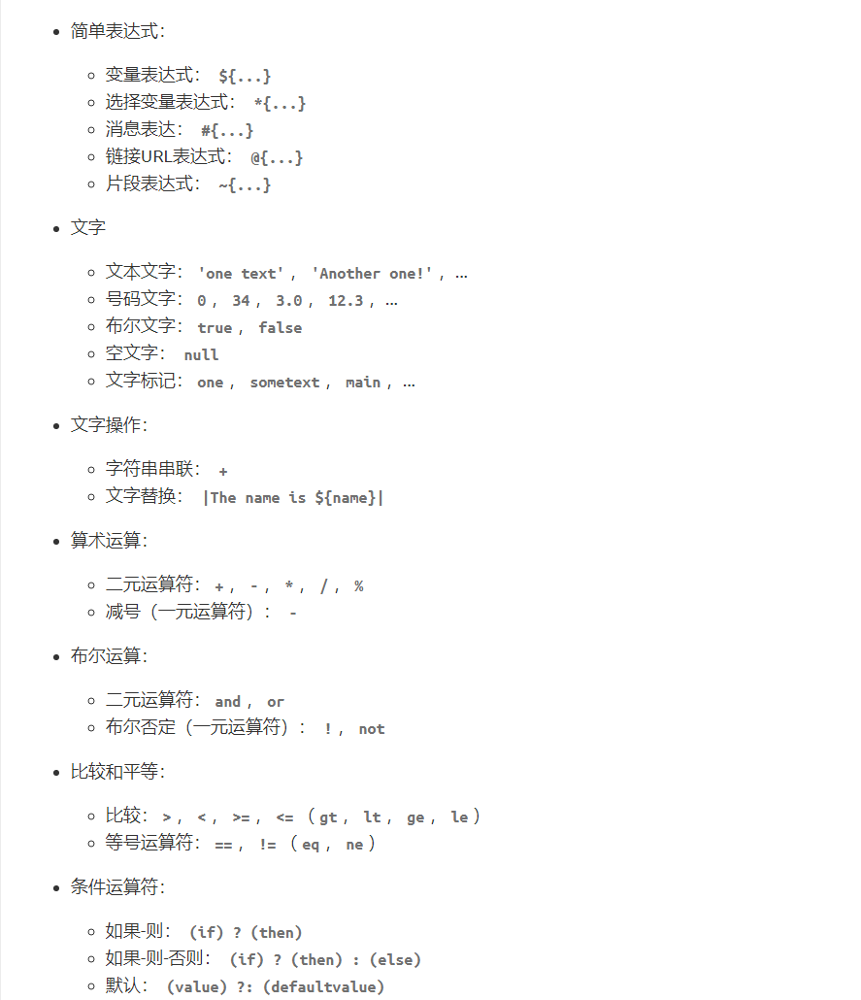

# Thymeleaf模板引擎

------

## Thymeleaf简介

> Thymeleaf 是适用于 Web 和独立环境的现代服务器端 的Java的**模板引擎**，它够渲染 HTML，XML，JavaScript，CSS 甚至纯文本。它与 JSP，Velocity，FreeMarker 等模板引擎类似，也可以轻易地与 Spring MVC 等 Web 框架集成。
>
> 与其它模板引擎相比，Thymeleaf 最大的特点是**动静结合**，它的语法都以html的属性方式出现，即使不启动 Web 应用进行数据渲染，也可以直接在浏览器中打开并正确显示模板页面，只是标签的一些属性浏览器不认识不处理而已。
>
> Thymeleaf 的主要目标是提供一种优雅且高度可维护的静态模板页面的创建方式。为此，它以**自然模板**的概念为基础，以不影响模板用作设计原型的方式将其逻辑注入模板文件。这样可以改善设计沟通，并缩小设计团队与开发团队之间的差距。

## Thymeleaf的基础使用

1. ### 语法：

   

2. ### 使用：

   ```html
   <!DOCTYPE html>
   <!-- 引入thymeleaf的约束，方便写代码 -->
   <html lang="en" xmlns:th="http://www.thymeleaf.org">
   <head>
       <meta charset="UTF-8">
   	<!-- 默认会从请求域中取数据data1，取到就渲染该标签的innerText，取不到不处理 -->
       <title th:text="${data1.getTitle()}">index</title>
   	<!-- th:content属性用来渲染content属性的，类似的还有很多其他的属性分别对应渲染不同的html标签属性 -->
       <meta name="description" content="静态的内容" th:content="${data2.description}">
   	<!-- 需要拼接字符串可以使用||来包裹，类似于JS的模板字符串 -->
       <meta name="keywords" content="默认的内容" th:content="|keywords:${data3}|">
   </head>
   <body>
   	<!-- th:classAppend给标签追加类名 -->
       <h1 th:classAppend="active">首页</h1>
   	<!-- th:object属性将user定义为局部变量，作用于标签内，里面就不需要${user.age}了，直接*{age}就可以 -->
       <div th:object="${user}">
           <h2 th:text="*{username}"></h2>
           <p th:text="*{age}"></p>
       </div>
   	<!-- th:if通过判断表达式的布尔值，来决定是否渲染该p标签 -->
       <p th:if="${user.isVip}">会员</p>
   	<!-- th:each可以迭代数据，值为数组或集合 -->
       <ul th:each="obj,state:${lists}">
           <!-- 元素加上th:each属性表示开始循环该标签了，obj和state是变量名，分别表示数组/集合中的元素以及迭代状态。
               迭代状态变量中有这几个属性可以用：index、count、size、current、even/odd、first、last -->
           <li th:text="${obj}"></li><!-- 这里相当于n个li标签 -->
       </ul>
   	<!-- switch选择语句，选择渲染哪个p标签 -->
       <div th:switch="${user.sex}">
           <p th:case="'1'">男</p>
           <p th:case="'2'">女</p>
           <p th:case="*">默认</p>
       </div>
   </body>
   </html>
   ```

3. ### 路径：

   > `@{/xxx}`就是项目的上下文路径，里面写的路径前面都会拼上项目上下文形成完整的url。例如：

   ```html
   <link rel="stylesheet" th:href="@{/app.css}" href="默认url">
   ```

4. ### JS代码块和style块中也可以渲染：

   ```html
   <!-- th:inline="javascript"表示该script块内部也需要渲染 -->
   <script th:inline="javascript">
       // 语法是多行注释/**/中，加两层中括号，里面就可以用${}取数据了。后面要跟一个空对象，就算没渲染也不报错
       const user = /*[[${user}]]*/{}
   </script>
   <!-- style块中也是如此 -->
   <style th:inline="css">
       .main\ elems {
           text-align: /*[[${align}]]*/ left;
       }
   </style>
   ```

5. ### 碎片（fragment）：

   类似于jsp的include，它也是将公共部分提取出来形成碎片，方便在各个html中引用。使用方式如下：

   1. 定义碎片：

      ```html
      <!-- 将该div定义为一个碎片。一个html中可以定义多个 -->
      <div th:fragment="碎片名"></div>
      ```

   2. 引入碎片：

      ```html
      <!-- 它会将该标签替换为上面的碎片 -->
      <div th:replace="~{文件名::碎片名}"></div>
      <!-- 它是将整个碎片作为内容，添加加入到该div中 -->
      <div th:insert="~{index::frag1}"></div>
      <!-- 将碎片包含的内容，插入到当前div标签中 -->
      <div th:include="~{index::frag1}"></div>
      <!-- 甚至不需要提前定义碎片名，直接用css选择器的方式。而且碎片如果不复杂，~{}也可以省略 -->
      <div th:replace="~{index::#id}"></div>
      
      <!-- 在碎片中可以使用，要引入地方的数据的，但idea可能报错，使用idea的错误修正，加上这个注释信息即可 -->
      <!--/*@thymesVar id="user" type="cn.lookroot.loop.thymeleafdemo.vo.UserVO"*/-->
      <div th:text="${user.name}"></div>
      ```

      > 碎片的参数传递：
      >
      > ```html
      > <!-- 传递参数 -->
      > <div th:insert="~{文件名::碎片名(数据)}"></div>
      > <!-- 接收参数 -->
      > <div th:fragment="碎片名(变量形参名)">
      > 	<p th:text="${变量形参名}"></p>
      > </div>
      > ```

6. ### 基本对象：

   > Thymeleaf提供了一些基本对象供使用，如：
   >
   > `#ctx`：它是Thymeleaf的上下文对象。通过该对象可以拿到其他对象，如域对象：（和#root和#vars是一样的）
   >
   > ```shell
   > ${#ctx.request}
   > ${#ctx.response}
   > ${#ctx.session}
   > ${#ctx.servletContext}
   > ```
   >
   > `#locale`：它就是`java.util.Locale`
   >
   > `param`：用于获取请求参数。`${param.username}`是获取具有`username`请求参数值的`String[]`，因此`${param.username[0]}`可以获取第一个值。
   >
   > `session` ：从会话域中取值。
   >
   > `application`：从应用域中取值。
   >
   > 还可以直接用WEB上下文对象：
   >
   > `#request`：直接获取request请求对象。
   >
   > `#session`：直接获取HttpSession对象。
   >
   > `#servletContext`：直接获取ServletContext对象。

7. ### 工具对象：

> 在`Thymeleaf`里面是可以直接使用一些Java的工具函数，如下：（它们就是Java的工具类）
>
> - #dates
> - \#calendars
> - \#strings
> - \#numbers
> - \#objects
> - \#bools
> - \#arrays
> - \#lists
> - \#sets
> - \#maps
> - \#aggregates
>
> 以日期格式化来举例：
>
> ```html
> <!-- 日期格式化 -->
> <p th:text="${#dates.format(user.birth,'yyyy-MM-dd HH:mm')}"></p>
> ```
