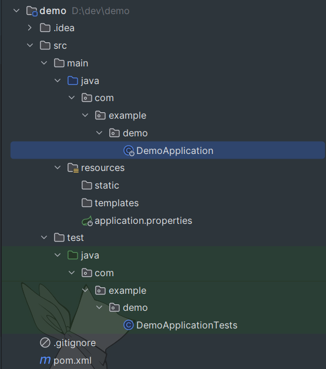
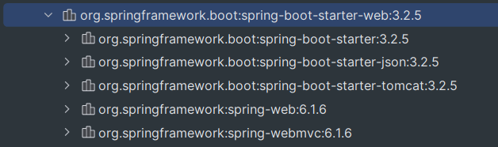
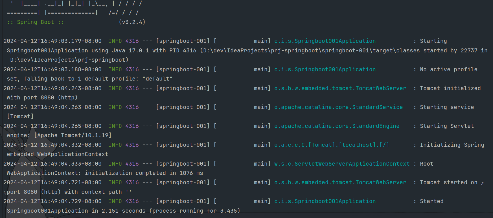

# Spring Boot

------

## 初识Spring Boot

- ### 背景：

  > 随着动态语言（Ruby、Scala、Nodejs）的流行，Java开发变得相对笨重，配置繁琐，开发效率低，部署复杂，以及第三方集成难度相对较大。针对该情况，Spring Boot被开发出来。其使用“习惯大于配置”的目标，能够让项目快速运行起来。同时借助Spring Boot可以快速创建WEB应用并进行独立部署（jar包、war包、内嵌Servlet容器），在开发应用时可以不用或很少用xml来配置，大大提高了开发效率。
  
- ### 什么是Spring Boot：

  > - Spring Boot是Spring家族的一员，它是Pivotal团队开发的一个**全新的框架**，其设计目的是简化Spring应用的**初始化搭建**及**开发过程**。
  >- 该框架使用了特定的方式来进行配置，从而使开发人员不再需要定义样板化的配置。它将Spring中的优点拿过来，缺点摒弃掉，用它来开发可以能够让项目快速运行起来。借助Spring Boot可以快速搭建WEB项目并独立部署，内嵌了Tomcat。同时在开发时可以不用或很少使用XML，大大提高了开发效率。
  > - Spring Boot的特点：
  >
  >   - 使用Spring Boot可以创建独立的应用程序。内嵌Tomcat、Jetty、Undertow服务器（红帽的），无需部署war包。
  >   - 简化Maven、Gradle的配置。我们原来的SSM项目中需要引入大量war包，而Spring Boot中引入了一种全新的，starter起步依赖的方式来简化应用的配置。
  >   - 尽可能的自动化配置Spring。我们之前引入druid的jar包，还需要将druid数据源对象配置到Spring容器中才能用，在Spring Boot中引入依赖后可以直接用，自动配置到容器中了。
  >   - 对WEB应用做了简化，提供了一系列的依赖包来把其他配置工作做成开箱即用。
  >   - 直接植入产品环境下的使用功能。如度量指标、健康检查、扩展配置，无需动态代理及xml配置。

------

- ### 创建Spring Boot项目：

  - ##### 方式1（需要联网）：使用Spring Boot提供的`初始化器`。URL（[https://start.spring.io](https://start.spring.io/)）向导的方式一步步完成Spring Boot项目的创建

     1. IDEA新建Spring Initializr工程，语言选Java，Type是maven，设置JDK、语言版本以及打包方式。点击Next选择要用的Spring Boot的版本（这里用3.3.0），下面是选择Spring Boot工程要用的依赖，选择`Spring Web`依赖创建即可。

     2. 生成的文件中有`.mvn`目录以及`HTLP.md、mvnw、mvnw.cmd`这3个文件，它们是增强版的maven的一些工具，目前可以先删除。
  
     3. 该地址是国外地址访问很慢，IDEA构建时也可以指定使用国内的URL进行Spring Boot项目的初始化：https://start.springboot.io，或者用阿里云镜像地址：https://start.aliyun.com
  
        > 也可以直接用浏览器打开该地址，然后网页中设置项目的信息，最后点击GENERATE生成代码下载到本地，再用IDEA导入工程。
  
        ###### 查看创建的Spring Boot项目：
  
        - `src`目录中有启动程序`Springboot002Application`以及测试启动程序`Springboot002ApplicationTests`，`resources`下的`static`目录是存放静态资源的，`templates`是视图模板目录，`application.properties`是Spring Boot的配置文件。

          

        - `pom`文件中有`<parent>`标签。该标签是必须的，所有的Spring Boot项目都是该父项目的子项目，由该父项目帮你管理Spring Boot所用到的依赖和插件的版本。
  
          ```xml
          <parent>
              <groupId>org.springframework.boot</groupId>
              <artifactId>spring-boot-starter-parent</artifactId>
              <version>3.3.0</version>
              <relativePath/>
          </parent>
          ```
  
          > pom文件中的依赖：（starter依赖中包含了大量默认的初始化配置，简化了程序开发）
  
          ```xml
          <dependencies>
              <!-- 我们选的`Spring Web`依赖 -->
              <dependency>
                  <groupId>org.springframework.boot</groupId>
                  <artifactId>spring-boot-starter-web</artifactId>
              </dependency>
              <!-- 默认的测试依赖，可有可无 -->
              <dependency>
                  <groupId>org.springframework.boot</groupId>
                  <artifactId>spring-boot-starter-test</artifactId>
                  <scope>test</scope>
              </dependency>
          </dependencies>
          <build>
              <plugins>
                  <!-- Spring Boot项目的maven的插件，默认引入的，目前可有可无 -->
                  <plugin>
                      <groupId>org.springframework.boot</groupId>
                      <artifactId>spring-boot-maven-plugin</artifactId>
                  </plugin>
              </plugins>
          </build>
          ```
  
          > 其中我们导入的这个`spring-boot-starter-web`依赖，它关联了`spring-webmvc`及以下的依赖：
          >
          > 
  
  - ##### 方式2：先创建一个普通的Maven项目，然后在pom文件中，手动加上`<parent>`标签（必须），再手动引入`spring-boot-starter-web`起步依赖（不指定版本号），resources目录下创建Spring Boot的配置文件和Starter启动类即可。

------

- ### 第1个Spring Boot程序：

  - 我们之前的Spring MVC的程序中，需要在项目的`web.xml`中注册中央调度器，并创建Spring MVC的XML核心配置文件，再配置包扫描，然后才能启动本地的tomcat去运行项目代码。
  
  - 现在我们`Spring Boot`程序根本不需要这么多步，直接编写控制器类`MyController`，使用`@Controller`标注，然后在其中编写控制器方法即可。最后运行`Springboot002Application`中的`main()`方法，它会使用自带的`tomcat10`来运行项目，中央调度器啥的都自动配置好了，浏览器直接访问服务器即可。
  
  - 启动类：
  
    ```java
    @SpringBootApplication
    public class Springboot001Application {
        public static void main(String[] args) {
            SpringApplication.run(Springboot001Application.class, args);
        }
    }
    ```
  
  - 启动信息如下：（可以看到默认的项目上下文路径是空的）
  
    
  
  - 运行结果：
  
    xxxxxxxxxx <!-- 日期格式化 --><p th:text="${#dates.format(user.birth,'yyyy-MM-dd HH:mm')}"></p>html

------

- ### 关于第一个程序的细节：

  - #### parent：

    - Spring Boot程序必须要继承`spring-boot-starter-parent`，因为该项目的pom文件中定义了所有依赖的jar包的版本，继承该模块可以避免多个依赖使用相同技术时出现版本冲突。

    - 也可以不继承，直接将`spring-boot-dependencies`导入到`<dependencyManagement>`中自己管理所有jar包的版本，效果相同：

      ```xml
      <dependencyManagement>
          <dependencies>
              <dependency>
                  <groupId>org.springframework.boot</groupId>
                  <artifactId>spring-boot-dependencies</artifactId>
                  <version>3.2.4</version>
                  <type>pom</type>
                  <scopt>import</scopt>
              </dependency>
          </dependencies>
      </dependencyManagement>
      ```

    - 所以对于Spring Boot应用的依赖，我们一般不指定依赖的版本号，这样使用的就是`<parent>`中定好的无冲突的版本。如果发生了坐标错误，再手动指定版本。

  - #### starter：

    - 我们应该首选使用Spring Boot的`starter`依赖，这种起步依赖中包含了Spring整合用的配置类，只引入该依赖就能直接用，不需要再进行额外的配置，实现了快速配置。（如果不想用它默认的配置，也可以在`.yml`文件中指定`starter`的配置）
    - 并且每个不同的`starter`根据功能的不同，通常又包含多个其他依赖。根据依赖传递，这一个`starter`其实是一堆依赖，减少了依赖配置。

  - #### 引导类：（`Springboot002Application`主启动类）

    - 在我们的启动程序中，`SpringApplication.run(Springboot001Application.class, args);`的返回值就是Spring容器对象`ApplicationContext`，它就是启动了一个Spring容器。
  
    - 被`@SpringBootApplication`注解所标注的类叫引导类（主启动类）。该注解组合了以下3个注解：
  
      > `@SpringBootApplication`：
  
      > ```java
      > @Target({ElementType.TYPE})
      > @Retention(RetentionPolicy.RUNTIME)
      > @Documented
      > @Inherited
      > @SpringBootConfiguration
      > @EnableAutoConfiguration
      > @ComponentScan(
      >        excludeFilters = {@Filter(
      >        	type = FilterType.CUSTOM,
      >        	classes = {TypeExcludeFilter.class}
      >     ), @Filter(
      >        	type = FilterType.CUSTOM,
      >        	classes = {AutoConfigurationExcludeFilter.class}
      >     )}
      > )
      > public @interface SpringBootApplication{...}
      > ```
  
      1. `@SpringBootConfiguration`：类似于`@Configuration`。以前的全注解方式的SSM整合开发，不就是加载配置类吗，这个启动类就是一个配置类。并且可以在该启动类中进行Spring Boot框架的配置以及Bean的配置。
      2. `@EnableAutoConfiguration`：启用自动配置。通过加载`starter`中大量的自动配置类，完成Spring Boot项目的自动配置。
      3. `@ComponentScan`：包扫描。Spring Boot容器会自动进行包扫描。它默认对，该注解所在类的**所在包下的所有包进行注解扫描**，所以**建议启动类放在主包下面**。
  
      > 所以引导类就是Spring Boot工程的执行入口，运行main()方法就是启动项目。运行后会初始化Spring容器，扫描并初始化bean。
  
  - #### 内嵌Tomcat：
  
    > - 在引入的`spring-boot-starter-web`依赖中，传递了这样一个依赖：
    >
    >   ```xml
    >   <dependency>
    >       <groupId>org.springframework.boot</groupId>
    >       <artifactId>spring-boot-starter-tomcat</artifactId>
    >       <version>3.2.4</version>
    >       <scope>compile</scope>
    >   </dependency>
    >   ```
    >
    > - 该依赖中又包含了`tomcat-embed-core`内嵌的tomcat核心。因此之所以能够直接运行程序，就是因为程序中有内嵌的tomcat。
    >
    > - 它的工作原理是，将Tomcat服务器做为对象运行，并将该对象交给Spring容器管理。
    >
    > - 如果想换其他服务器如Jetty，就可以先去掉这个依赖`spring-boot-starter-tomcat`，加上Jetty服务器的依赖即可：
    >
    >   ```xml
    >   <dependency>
    >       <groupId>org.springframework.boot</groupId>
    >       <artifactId>spring-boot-starter-web</artifactId>
    >       <exclusions>
    >           <exclusion>
    >               <groupId>org.springframework.boot</groupId>
    >               <artifactId>spring-boot-starter-tomcat</artifactId>
    >           </exclusion>
    >       </exclusions>
    >   </dependency>
    >   <dependency>
    >       <groupId>org.springframework.boot</groupId>
    >       <artifactId>spring-boot-starter-jetty</artifactId>
    >   </dependency>
    >   ```
    >
    > - Spring Boot中内置了3款服务器：Tomcat（默认）、Jetty、Undertow

------

- ### 配置Banner图标：

  > Spring Boot项目启动时默认加载类路径`resources`下的`banner.txt`图标文件，如果没有则使用Spring Boot默认的图标。如果不想看到启动图标，可以通过代码关闭，修改启动类`Springboot002Application`的`main()`方法：

  ```java
  public static void main(String[] args) {
  //        SpringApplication.run(Springboot002Application.class, args);
  	SpringApplication springApplication = new SpringApplication(Springboot002Application.class);
  	springApplication.setBannerMode(Banner.Mode.OFF);
  	springApplication.run(args);
  }
  ```

  > 或者直接在配置文件中关闭：`spring.main.banner-mode=off`。其他的像`banner.txt`的位置等都可以在该文件中配置。

- ### 关于Spring Boot的核心配置文件`application.properties | yml | yaml`：

  > Spring Boot应用默认会去类路径`resources`下获取全局配置文件`application.properties`或`application.yml | yaml`，**文件名和位置都是必须的，可以有多个**，冲突时`.properties` > `.yml` > `.yaml`，并且里面的配置会进行整合。我们可以通过配置文件来修改Spring Boot项目的默认配置，配置文件中的内容也可以自定义。

  - ###### application.properties：（这里面的配置，是和你用什么技术（starter）有关的。你要没用某个starter，那么里面的某个配置就不生效）

    ```yaml
    ## 项目启动端口号
    server.port=8081
    ## 设置项目的上下文路径
    server.servlet.context-path=/myboot
    ## 数据源的配置
    spring.datasource.driver-class-name=com.mysql.cj.jdbc.Driver
    spring.datasource.url=jdbc:mysql://localhost:3306/test?useUnicode=true&characterEncoding=utf8
    spring.datasource.name=root
    spring.datasource.password=a123456789
    ```

  - ###### application.yml | yaml：（主流格式）

    > - 这种以`.yml`或`.yaml`结尾的也是一种配置文件。它是一种比较直观的、容易被电脑识别的一种**数据序列化格式**，容易与脚本语言进行交互，支持不同编程语言的导入，有很好的可阅读性，且具有一定的结构。所以说它通常用来做配置文件。
    >
    > - 这种文件的内容格式为`key: value`，中间以**冒号和空格**分开。它以空格来表示层级关系（不能用Tab键），大小写敏感，一般都用**短横线风格**的**小写字母**做为key，如：
    >
    >   ```yaml
    >   server:
    >     port: 8081
    >     servlet:
    >       context-path: /myboot
    >   spring:
    >     datasource:
    >       driver-class-name: com.mysql.cj.jdbc.Driver
    >   ```
    >
    > - 一个key可以对应多个值（数组），用换行和短横线表示：
    >
    >   ```yaml
    >   hobby:
    >     - game
    >     - music
    >     - sleep
    >   # 或者
    >   hobby: [game,music,sleep]
    >   ```
    >
    >   对象数组：
    >
    >   ```yaml
    >   hobby:
    >     - game1: heishenhua
    >       price: 268
    >     - game2: csgo
    >       price: 0
    >   # 或者
    >   hobby:
    >     - 
    >       game1: heishenhua
    >       price: 268
    >     - 
    >       game2: csgo
    >       price: 0
    >   # 或者
    >   hobby: [{game1:csgo,price:11},{game2:lol,price:101}]
    >   ```
    >
    > - 字面值表示方式：
    >
    >   - 布尔值：TRUE | true | True
    >   - 实数：3.14 | 3.342324e+5
    >   - 整型数：12（也支持2、8、16进制数）
    >   - 空值：~（用它来表示null值）
    >   - 字符串：Hello | "Hello"（双引号可加可不加，如果需要使用转义字符，那么就需要加双引号）
    >   - 日期：2013-12-23（日期必须用yyyy-MM-dd格式）
    >   - 日期时间：2013-12-23T12:02:31+08:00（日期和时间之间用T链接，最后使用+跟上时区）
    
  - ###### 多环境配置：
  
    > 为了方便我们在多个配置环境之间切换，Spring Boot提供了多环境配置，可以为每一个环境都准备一个配置文件，文件名必须是`application-环境标识.properties | yml`。然后在`application.properties | yml`主配置文件中，激活某个环境的配置文件`spring.profiles.active=环境标识`即可。
  
  - ###### 引用配置文件中的内容：
  
    > Spring Boot配置文件里的内容，都能够在外部通过`${key}`来引用，就像引入了外部的`jdbc.properties`文件一样。并且Spring Boot项目的配置文件中，可以使用`${}`来引用文件里其他位置定义的值。
  
  - ###### `@ConfigurationProperties`注解和`Environment`对象：
  
    > - `@ConfigurationProperties`注解是Spring Boot框架独有的。它用于将配置文件中的属性值注入到Spring Boot应用程序中的Java对象中。因此该对象必须定义为Spring容器管理的Bean，所以要用`@Component`注解标注在对象所在的类上。
    >
    > - 该注解在类上使用，类中的属性名要和配置文件中**最后的key**保持一致。`prefix`属性指定这些key的前缀。如：
    >
    >   > `User.class`：
    >
    >   ```
    >   @ConfigurationProperties(prefix = "user")
    >   public class User {
    >   	private String name;
    >   	private Integer age;
    >   }
    >   ```
    >
    >   > `application.properties`：
    >
    >   ```properties
    >   user.name=张三
    >   user.age=18
    >   ```
    >
    > - 除此之外，Spring Boot中提供了`Environment`对象，里面装了配置文件中**所有的属性**，然后将该对象放在了Spring容器中。

------

## 日志配置

> 在企业开发中，日志的输出对于系统bug定位无疑是一种有效的方式，也是项目后续进入生产环境后快速发现错误并解决的有效手段。所以日志的使用是项目中比较重要的一个功能。

- Spring Boot默认使用LogBack日志框架，如果不需要更改则无需进行特殊配置。默认就会将日志信息输出到控制台。

- 原则上是需要引入LogBack依赖的。LogBack依赖：

  ```xml
  <dependency>
      <groupId>org.springframework.boot</groupId>
      <artifactId>spring-boot-starter-logging</artifactId>
  </dependency>
  ```

- 但是我们新建的Spring Boot项目一般都会引入`spring-boot-starter`或`spring-boot-starter-web`依赖，而这两个依赖中已经包含了`spring-boot-starter-logging`依赖，所以无需额外添加了。

- 在`application.yml`中，修改日志输出的格式：（并将日志保存到外部文件中）

  ```yml
  logging:
    pattern:
      console: "%d{yyyy-MM-dd HH:mm:ss} [%thread] %-5level %logger- %msg%n"
      level: debug
    file:
      path: "."
      name: "springboot.log"
  ```

  > 在启动类中打印下日志信息：
  >
  > ```java
  > @SpringBootApplication
  > public class Springboot001Application {
  >        private static Logger logger = LoggerFactory.getLogger(Springboot001Application.class);
  >        public static void main(String[] args) {
  >            logger.info("Spring Boot项目启动了");
  >            SpringApplication.run(Springboot001Application.class, args);
  >        }
  > }
  > ```

- 也可以在`application.yml`中，设置主包的日志级别为debug：`logging.level.root=debug`（默认info），修改其他包的日志级别：`logging.level.com.itheima=warn`

------

## Spring Boot中集成FreeMarker和Thymeleaf

- ### FreeMarker视图的集成：

  > Spring Boot内部支持FreeMarker视图技术的集成，并提供了自动化配置类`FreeMarkerAutoConfiguration`，借助自动化配置可以方便的集成FreeMarker视图到Spring Boot项目中。

  1. Starter坐标引入：

     ```xml
     <dependency>
         <groupId>org.springframework.boot</groupId>
         <artifactId>spring-boot-starter-freemarker</artifactId>
     </dependency>
     ```

  2. 添加FreeMarker的配置信息：

     > FreeMarker默认的视图路径是类路径中`/templates/`目录下，文件以`.ftlh`结尾。由自动化配置类`FreeMarkerProperties`所决定，该目录也可以在`application.yml`中修改：

     ```yaml
     spring:
       freemarker:
         suffix: .ftl
         content-type: text/html
         charset: UTF-8
         template-loader-path: classpath:/views/
     ```

- ### Thymeleaf视图的集成：

  > Spring Boot支持多种视图技术集成，并且官方推荐使用Thymeleaf做为前端视图页面。

  1. Starter坐标引入：

     ```xml
     <dependency>
         <groupId>org.springframework.boot</groupId>
         <artifactId>spring-boot-starter-thymeleaf</artifactId>
     </dependency>
     ```

  2. 添加Thymeleaf的配置信息：

     > Thymeleaf默认的视图路径是类路径中`/templates/`目录下，文件以`.html`结尾。由自动化配置类`ThymeleafProperties`所决定，该目录也可以在`application.yml`中修改：

     ```yaml
     spring:
       thymeleaf:
         prefix: classpath:/html/
         # 开发时关闭页面缓存
         cache: false
     ```

------

## Spring Boot静态资源访问

- 之前Spring MVC中，静态资源是通过在XML中配置静态资源标签，指定静态资源的存放目录，将静态资源交给静态资源控制器来处理的。

- 而在Spring Boot应用中默认静态资源目录为类路径下的`/META-INF/resources/`、`/resources/`、`/static/`、`/public/`，只要在类路径下创建其中1个目录，将静态资源放在里面即可。

- 和Spring MVC中不同的是，访问这些目录下的静态资源不需要加上这一层`/static/`，直接访问即可。

- 也可以自定义静态资源目录，在`application.yml`中：

  ```yaml
  spring:
    web:
      ## 修改默认的静态资源目录，多个目录以逗号隔开
      resources:
        static-locations: classpath:/hello/,classpath:/abc/
  ```

------

## Spring Boot中使用JSP（不推荐）

> Spring Boot不推荐使用JSP，而且它本身也不支持JSP，因为JSP已经慢慢被淘汰了。我们现在都用模板引擎：`Thymeleaf`、`Freemaker`、`Velocity`等视图模版来代替JSP。如果非要使用JSP的话配置比较繁琐：

1. 添加JSP的编译依赖：（如果要用servlet、jsp、jstl的话，还得单独再加它们的依赖jar包）

   ```xml
   <dependency>
       <groupId>org.apache.tomcat.embed</groupId>
       <artifactId>tomcat-embed-jasper</artifactId>
       <scope>provided</scope>
   </dependency>
   ```

   > 还要添加servlet、jsp、jstl的依赖：

   ```xml
   <dependency>
       <groupId>jakarta.servlet</groupId>
       <artifactId>jakarta.servlet-api</artifactId>
   </dependency>
   <dependency>
       <groupId>jakarta.servlet.jsp</groupId>
       <artifactId>jakarta.servlet.jsp-api</artifactId>
       <version>3.1.1</version>
   </dependency>
   <dependency>
       <groupId>jakarta.servlet.jsp.jstl</groupId>
       <artifactId>jakarta.servlet.jsp.jstl-api</artifactId>
   </dependency>
   ```

2. 创建templates目录，将jsp文件放在该目录下。

3. 编写一个控制器类，来处理jsp资源的跳转：

   ```java
   @Controller
   public class JspController{
       @RequestMapping("/myjsp")
       @ResponseBody
       public String doJsp(Model model){
           model.addAttribute("data", "欢迎张三");
           return "index";
       }
   }
   ```

4. application.properties中配置视图解析器：

   ```properties
   # /就是src/main/webapp
   spring.mvc.view.prefix=/
   spring.mvc.view.suffix=.jsp
   ```

5. 告诉框架到哪里去找jsp文件：

   ```xml
   <build>
       <resources>
           <resource>
               <!--jsp源文件在哪-->
               <directory>scr/main/webapp</directory>
               <!--必须复制到META-INF/resources这个目录下，它只编译该目录下的jsp文件-->
               <targetPath>META-INF/resources</targetPath>
               <!--指定源文件夹中哪个资源要进行复制-->
               <includes>
                   <include>**/*.*</include>
               </includes>
           </resource>
       </resources>
   </build>
   ```

------

## Spring Boot应用的打包与部署

> 传统的WEB应用在发布之前，通常会打成war包，然后将war包部署到Tomcat容器中运行。而Spring Boot应用有2种打包与部署方式，分别是jar包和war包。

- Jar包部署：我们第1个Spring Boot应用就是使用的jar包部署，最终项目是一个可以直接运行的jar包，代码中包含程序入口`main()`方法。所以我们可以在命令行直接通过`java -jar [jar包名]`来运行项目。

- War包部署：虽然在开发时可以直接通过jar包方式运行项目，但是在生产环境下需要将项目打成war包，部署在Tomcat服务器中。步骤如下：

  1. 修改打包方式为`war`。并且忽略内嵌的Tomcat，将Tomcat依赖的`scope`设置为`provided`：（这样打包的项目中就没有main()方法了）

     ```xml
     <dependency>
         <groupId>org.springframework.boot</groupId>
         <artifactId>spring-boot-starter-tomcat</artifactId>
         <scope>provided</scope>
     </dependency>
     ```

  2. 修改主启动类`Springboot002Application`：

     > 添加容器启动加载文件（类似于读取web.xml），这里采用继承`SpringBootServletInitializer`类重写`configure()`方法的方式，在部署项目时指定外部Tomcat读取项目的入口方法：

     ```java
     @SpringBootApplication
     public class Springboot001Application extends SpringBootServletInitializer {
         private static Logger logger = LoggerFactory.getLogger(Springboot001Application.class);
     
         public static void main(String[] args) {
             logger.info("Spring Boot项目启动了");
             SpringApplication.run(Springboot001Application.class, args);
         }
     
         @Override
         protected SpringApplicationBuilder configure(SpringApplicationBuilder builder) {
             return builder.sources(Springboot001Application.class);
         }
     }
     ```

     > 这样通过maven就可以打成一个war包，放在Tomcat容器中即可运行。（原来的jar方式仍然可以运行项目）
     >
     > 注意：此时在`application.yml`中设置的项目上下文路径就失效了，需要在pom文件的`<build>`标签中，通过war包名来设置项目的上下文路径：
     >
     > ```xml
     > <finalName>/</finalName>
     > ```

------

