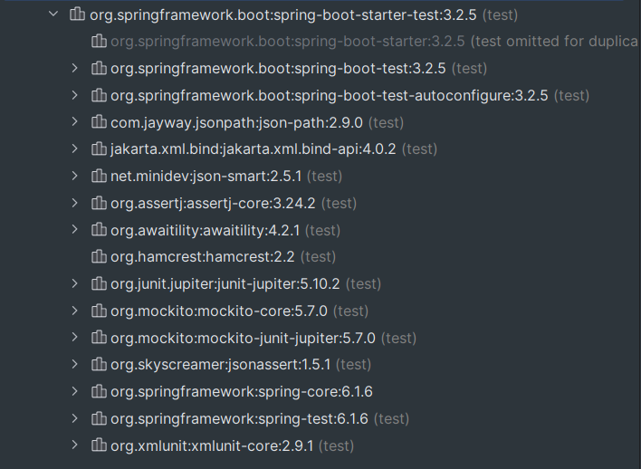
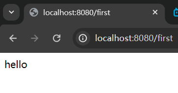

# Spring Boot

------

## 初识Spring Boot

- ### 什么是Spring Boot？

  > `Spring Boot`是spring家族的一员，它是一个全新的框架，可以简化spring、springmvc的使用。其设计目的是用来简化spring应用的初始化搭建以及开发过程。
  >
  > 该框架使用了特定的方式来进行配置，从而使开发人员不再需要定义样板化的配置。它将spring中的优点拿过来，缺点摒弃掉，用它来开发可以能够让项目快速运行起来。借助springboot可以快速搭建web项目并独立部署，内嵌了tomcat。同时在开发时可以不用或很少使用xml，大大提高了开发效率。
  >
  > `Spring Boot`的特点：
  >
  > - 使用Spring Boot可以创建独立的应用程序。内嵌tomcat、jetty、Undertow服务器（红帽的），无需部署war包。
  > - 简化maven、gradle配置。我们原来的ssm中需要引入大量war包，而spring boot中引入了一种全新的坐标方式来简化配置。
  > - 尽可能的自动化配置spring。我们之前引入druid数据源，还需要配置才能用。Spring Boot中引入后直接用，配置好了，而且容器中也有了。
  > - 直接植入产品环境下的使用功能。如度量指标、健康检查、扩展配置，无需动态代理及xml配置。
  > - 对web应用做了简化，开箱即用。

- ### Spring Boot工程的创建方式：

  1. ##### 方式1（https://start.spring.io）：需要联网。使用springboot提供的初始化器。url向导的方式，一步步完成springboot项目的创建。

     - 通过idea新建Spring Initializr工程，语言选java，type是maven，设置jdk和语言版本以及打包方式jar。点击next选择要用的springboot的版本（这里用3.2.5），下面是选择springboot工程的父工程中的所有依赖，选择spring web依赖创建。
  
     - 生成的文件中有.mvn目录以及HTLP.md、mvnw、mvnw.cmd这3个文件，它们是增强版的maven的一些工具，可以删掉
  
  
     - 该地址是国外地址访问很慢，idea构建时也可以指定使用国内的url进行springboot项目初始化https://start.springboot.io
  
     （还可以直接浏览器输入该地址，然后网页中设置项目，最后生成代码下载到本地，再用idea导入）
  
     - src中有启动程序`DemoApplication`以及测试启动程序`DemoApplicationTests`，resources下的`static`目录是存放静态资源的，`templates`是视图模板目录，`application.properties`是springboot的配置文件。

     

     - pom文件中有parent标签，所有的springboot项目都是该GAV的子项目，springboot的父项目只是帮你管理springboot所用到的依赖和插件的。
  
  
     - 其中我们导入的这个spring-boot-starter-web依赖，它关联了springmvc的以及以下的依赖：

       

     - springboot项目还默认引入了spring-boot-starter-test依赖：(可有可无)

       

  2. ##### 方式2：通过创建普通的maven项目，然后在pom文件中，将parent标签写上（必须），引入spring-boot-starter-web起步依赖（无版本号），resources下创建springboot的配置文件和启动类即可。

------

- ### 第一个Spring Boot程序：

  > - 我们之前springmvc的第一个程序中，需要在项目的web.xml中注册中央调度器，并创建mvc核心配置文件，并配置包扫描；然后才能启动安装的tomcat运行程序。
  >
  > - 现在我们`Spring Boot`程序根本不需要这多步，直接编写控制器类MyController，使用`@Controller`标注，然后在其中编写控制器方法即可。最后运行`DemoApplication`中的`main`方法，它会使用自带的`tomcat10`来运行项目，中央调度器啥的都不需要配了。启动信息如下：（可以看到默认的项目上下文路径是空的）

  

  

------

- ### 关于第一个程序的细节


> 

- ### 关于@SpringBootApplication（springboot应用）：

> 我们查看它的源码发现，该注解是一个复合注解。其中`@SpringBootConfiguration`、`@EnableAutoConfiguration`、`@ComponentScan`这3个注解的功能，组合起来构成了该注解的功能。源码如下：

```java
@Target({ElementType.TYPE})
@Retention(RetentionPolicy.RUNTIME)
@Documented
@Inherited
@SpringBootConfiguration
@EnableAutoConfiguration
@ComponentScan(
    excludeFilters = {@Filter(
    type = FilterType.CUSTOM,
    classes = {TypeExcludeFilter.class}
), @Filter(
    type = FilterType.CUSTOM,
    classes = {AutoConfigurationExcludeFilter.class}
)}
)
public @interface SpringBootApplication{...}
```

> 我们看下该这3个注解分别是做什么的：
>
> - `@SpringBootConfiguration`：类似于`@Configuration`，有该注解的类是springboot的配置类，可以在该类中进行框架的配置以及bean的配置。
> - `@EnableAutoConfiguration`：启用自动配置的注解。通过一些配置，可以自动将一些常用对象放到spring容器中。
> - `@ComponentScan`：扫描注解。springboot容器会自动进行包扫描。它默认对，该注解所在类的所在包下的所有包进行扫描。所以**建议该Application类放在主包下面**。
>
> 所以`@SpringBootApplication`注解的主要功能就是：做配置、包扫描、启动自动配置。

------

- ### 关于springboot的重要配置文件application.properties：（可以有多个）

> - 该文件用于对springboot项目进行各种配置，配置文件也可以是以`.yml`结尾的`yaml文件`。`yaml文件`的格式为【key: value】，中间以**冒号和空格**分开。
>
> - spring boot配置文件的`文件名是必须的`。并且可以有多个配置文件。冲突的话以`properties`结尾的配置为主。
>
> - 配置文件中的常用配置如下：
>
>   ```properties
>   #这是.properties文件
>   server.port=8081
>   #设置tomcat的项目上下文路径
>   server.servlet.context-path=/myboot
>   ```
>
>   ```yaml
>   #这是yaml文件（鸭卖奥）
>   #yaml文件有层级关系，层级关系用空格组织，这里每层是2个空格
>   server:
>     port: 8081
>     servlet:
>       context-path: /myboot
>   ```
>
> - 多环境配置：为了方便我们在多环境之间切换配置，springboot提供了多环境配置，可以为每一个环境都准备一个配置文件，文件名必须是【application-环境标识.properties | yml】。
>
>   - 然后需要指定用启用某个配置文件，不启用就不知道到底用的哪个文件中的设置了
>   - 在application.properties | yml主配置文件中设置：`spring.profiles.active=环境标识`


> - 这些配置文件里的内容，都能够在外部通过${key}来使用，就像引入了外部的jdbc.properties文件后${jdbc.driver}一样。
>- 在Java对象创建时，可以用`@ConfigurationProperties`注解，将配置文件中的信息注入的对象属性中，在类上使用。
>   - 首先类上加`@Component`让springboot管理起来该对象
>
>   - 然后类上再加`@ConfigurationProperties( prefix="server" )`注解，此时该对象的`port`属性值就会匹配上配置文件中的server.port对应的值8081了
>

------

### spring boot中使用JSP：（不推荐）

> springboot不推荐用jsp来做视图，而且它本身也不支持jsp，因为jsp已经慢慢被淘汰掉了。我们现在都用模板引擎，Thymeleaf、Freemaker、Velocity等来代替jsp。如果非要使用jsp的话配置比较繁琐：

1. 添加jsp的翻译依赖：（如果要用servlet、jsp、jstl，还得单独再加它们的依赖jar包）

   ```xml
   <dependency>
       <groupId>org.apache.tomcat.embed</groupId>
       <artifactId>tomcat-embed-jasper</artifactId>
   </dependency>
   ```

2. 添加webapp目录，将jsp文件放在该目录下。（因为springboot是jar项目，所以没有该目录需要我们手动添加）

3. 编写一个控制器类，来处理jsp资源的跳转：

   ```java
   @Controller
   public class JspController{
       @RequestMapping("/myjsp")
       @ResponseBody
       public String doJsp(Model model){
           model.addAttribute("data", "欢迎张三");
           return "index";
       }
   }
   ```

4. application.properties中配置视图解析器：

   ```properties
   # /就是src/main/webapp
   spring.mvc.view.prefix=/
   spring.mvc.view.suffix=.jsp
   ```

5. 告诉框架到哪里去找jsp文件：

   ```xml
   <build>
       <resources>
           <resource>
               <!--jsp源文件在哪-->
               <directory>scr/main/webapp</directory>
               <!--必须复制到META-INF/resources这个目录下，它只编译该目录下的jsp文件-->
               <targetPath>META-INF/resources</targetPath>
               <!--指定源文件夹中哪个资源要进行复制-->
               <includes>
                   <include>**/*.*</include>
               </includes>
           </resource>
       </resources>
   </build>
   ```

------

### 在Springboot中，使用Spring的ApplicationContext核心接口

> 主启动方法中，有一个静态方法`SpringApplication.run()`，该方法的返回值类型是`ConfigurableApplicationContext`，它是ApplicationContext的子接口，所以我们要使用spring容器，就通过该方法的返回值即可。

------

