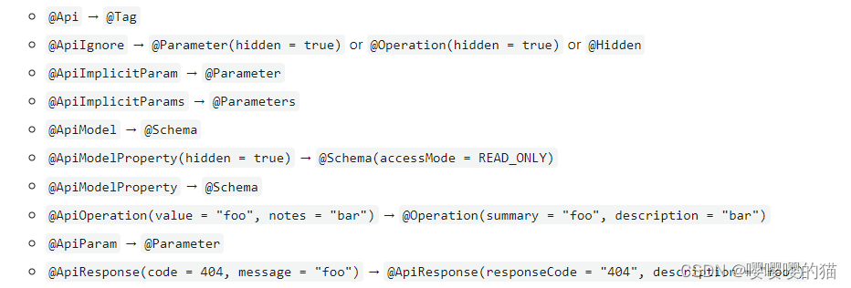

## Spring Boot整合Mybatis实现增删改查

> Spring Boot支持市面上常见的关系型数据库（Oracle、Mysql、SqlServer、DB2等）对应的持久层框架（Hibernate、Mybatis、MybatisPlus），除此之外还支持非关系型数据库（Redis、MongoDB、Solr）的数据访问操作。这里介绍Spring Boot集成Mybatis并实现持久层的基本操作。

###### Spring Boot集成Mybatis步骤如下：

1. ##### 添加依赖：

   ```xml
   <dependencies>
       <dependency>
           <groupId>org.springframework.boot</groupId>
           <artifactId>spring-boot-starter-web</artifactId>
       </dependency>
   <!--        Mybatis整合SpringBoot依赖-->
       <dependency>
           <groupId>org.mybatis.spring.boot</groupId>
           <artifactId>mybatis-spring-boot-starter</artifactId>
           <version>3.0.3</version>
       </dependency>
   <!--        PageHelper整合Mybatis的依赖-->
       <dependency>
           <groupId>com.github.pagehelper</groupId>
           <artifactId>pagehelper-spring-boot-starter</artifactId>
           <version>2.0.0</version>
       </dependency>
   <!--        Mysql驱动-->
       <dependency>
           <groupId>com.mysql</groupId>
           <artifactId>mysql-connector-j</artifactId>
       </dependency>
   <!--        c3p0数据源-->
       <dependency>
           <groupId>com.mchange</groupId>
           <artifactId>c3p0</artifactId>
           <version>0.9.5.5</version>
       </dependency>
   <!--        druid数据源-->
   <!--        <dependency>-->
   <!--            <groupId>com.alibaba</groupId>-->
   <!--            <artifactId>druid-spring-boot-starter</artifactId>-->
   <!--            <version>1.2.23</version>-->
   <!--        </dependency>-->
   </dependencies>
   
   <build>
   <!--        <finalName>/</finalName>-->
       <plugins>
           <plugin>
               <groupId>org.springframework.boot</groupId>
               <artifactId>spring-boot-maven-plugin</artifactId>
           </plugin>
       </plugins>
   </build>
   ```
   
2. ##### 在`.yml`文件中进行配置：

   ```yaml
   server:
     port: 80
     servlet:
       context-path: /
   # 配置数据源
   spring:
     datasource:
       type: com.mchange.v2.c3p0.ComboPooledDataSource
       driver-class-name: com.mysql.cj.jdbc.Driver
       url: jdbc:mysql://localhost:3306/test?useUnicode=true&characterEncoding=utf8
       username: root
       password: a123456789
   # 配置Mybatis
   mybatis:
     mapper-locations: classpath:/com/itheima/springboot001/mapper/*.xml
     type-aliases-package: com.itheima.springboot001.pojo
     configuration:
       # 下划线转驼峰
       map-underscore-to-camel-case: true
   # 配置PageHelper
   pagehelper:
     helper-dialect: mysql
   # 日志
   logging:
     level:
       com:
         itheima:
           springboot001:
             mapper: debug
   ```

3. ##### 添加源代码：

   1. 定义JavaBean：

      ```java
      public class Clazz implements Serializable {
          private static final long serialVersionUID = 1L;
          private Integer cid;
          private String cname;
          //提供getter和setter..
          //提供toString方法
      }
      ```

      > 对应的数据库表t_clazz：
      >
      > 

   2. 定义接口：

      ```java
      public interface ClazzMapper {//com.itheima.springboot001.mapper.ClazzMapper
          List<Clazz> selectAll();
      }
      ```

      > `resources`目录下创建对应层级的mapper文件`ClazzMapper.xml`：
      >
      > ```xml
      > <mapper namespace="com.itheima.springboot001.mapper.ClazzMapper">
      >     <select id="selectAll" resultType="com.itheima.springboot001.pojo.Clazz">
      >         select * from t_clazz
      >     </select>
      > </mapper>
      > ```
      >
   
      > 启动类上加上`@MapperScan`注解：
      >
      > ```java
      > @SpringBootApplication
      >    //扫描Mapper接口，并在Spring容器中生成Mapper实现类
      >    @MapperScan("com.itheima.springboot001.mapper")
      >    public class Springboot001Application {...}
      > ```
   
   3. 定义service层代码：
   
      ```java
      @Service
      public class ClazzService {
          @Autowired
          private ClazzMapper mapper;
          public PageInfo<Clazz> allClazz(){
              PageHelper.startPage(1,1);
              return new PageInfo<>(mapper.selectAll(), 3);
          }
      }
      ```
   
   4. 定义controller层代码：
   
      ```java
      @RestController
      @RequestMapping("/clazz")
      public class ClazzController {
          @Autowired
          private ClazzService service;
          @GetMapping
          public PageInfo<Clazz> doClazz(){
              return service.allClazz();
          }
      }
      ```
   
   > 启动项目浏览器输入http://localhost/clazz运行即可。

------

## Spring Boot整合Swagger2

> 由于Spring Boot能够快速开发、便携部署等特性，通常在使用Spring Boot构建Restful接口应用时考虑到多终端的原因（这些终端会共用很多底层业务逻辑），因此我们会抽象出这样一层来服务于多个终端。对于不同的终端共用这一套API接口时，它们都需要使用（后端提供的）一套API接口文档。后端人员需要根据该层接口来编写对应的API接口文档，文档中描述了接口的地址、所需参数、返回结果等信息。这里我们就借助**API文档构建工具**Swagger2来实现API接口文档的生成。

###### Spring Boot2集成Swagger2的步骤：

1. 添加依赖：

   ```xml
   <dependency>
       <groupId>io.springfox</groupId>
       <artifactId>springfox-swagger2</artifactId>
       <version>3.0.0</version>
   </dependency>
   <dependency>
       <groupId>io.springfox</groupId>
       <artifactId>springfox-swagger-ui</artifactId>
       <version>3.0.0</version>
   </dependency>
   ```

2. 添加Swagger2的配置类：

   ```java
   //配置类
   @Configuration
   //启用Swagger2
   @EnableSwagger2
   public class Swagger2Config {
       @Bean
       public Docket createRestApi() {
           return new Docket(DocumentationType.SWAGGER_2)
                   .apiInfo(apiInfo())
                   //是否开启 (true开启false隐藏。生产环境建议隐藏)
                   //.enable(true)
                   .select()
                   //要生成api文档的包，它会对该包下的所有被@Api标记的类都生成API文档
                   .apis(RequestHandlerSelectors.basePackage("com.itheima.springboot001.controller"))
                   //指定路径处理，PathSelectors.any()代表所有的路径
                   .paths(PathSelectors.any())
                   .build();
       }
       private ApiInfo apiInfo() {
           return new ApiInfoBuilder()
                   //设置当前文档的标题
                   .title("API接口文档")
                   //文档描述
                   .description("SpringBoot中使用Swagger2接口规范")
                   //服务条款URL
                   .termsOfServiceUrl("http://localhost:8080/")
                   //版本号
                   .version("1.0")
                   .build();
       }
   }
   ```

3. 在（controller层的）类上添加对应的注解：

   > ###### Swagger2的常用注解说明：
   >
   > - `@Api`：放在要生成文档的类上，`tags`属性说明该类的作用。
   > - `@ApiOperation`：放在要生成文档（控制器）方法上，`value`属性说明该方法的作用，`notes`表示方法的注意事项。
   > - `@ApilmplicitParams`：放在（控制器）方法上，对方法的参数进行说明。值是`@ApilmplicitParam`注解用于说明每一个参数。其中`name`是参数名，`value`对参数进行说明，`required`参数是否是必须的，`dataType`是数据类型，`defaultValue`是参数的默认值。`paramType`说明数据（参数）提交的位置，值可以是：`header`请求头，`query`是查询字符串，`path`是路径上用于`restful`，`body`是请求体，`form`是表单数据。
   > - `@ApiResponses`：放在（控制器）方法上，对响应进行说明。值是`@ApiResponse`注解，一般用于表达一个错误的响应信息。其中`code`属性是响应状态码，`message`是响应信息串，`response`是抛出异常的类。
   > - `@ApiModel`：放在类上。如果控制器方法的参数是一个对象，就需要用`@ApiModelProperty`注解对对象中的每个属性进行说明。`@ApiModel`的`description`属性用于描述该类。`@ApiModelProperty`的`value`表示该属性的含义，`example`示例值。

   ```java
   @Api(tags = "操作clazz对象的控制器类")
   @RestController
   @RequestMapping("/clazz")
   public class ClazzController {
       @Autowired
       private ClazzService service;
   
       @ApiOperation(value = "获取所有Clazz对象", notes = "返回的是PageInfo分页信息对象")
       @ApiResponses({
               @ApiResponse(code = 400, message = "请求参数没填好"),
               @ApiResponse(code = 404, message = "页面找不到")
       })
       @GetMapping
       public PageInfo<Clazz> doClazz(){
           return service.allClazz();
       }
   }
   ```

4. 启动项目，浏览器上输入http://localhost:8080/swagger-ui.html，访问接口文档。

------

## Spring Boot3整合Swagger3

1. 添加依赖：

   ```xml
   <dependency>
       <groupId>org.springdoc</groupId>
       <artifactId>springdoc-openapi-starter-webmvc-ui</artifactId>
       <version>2.0.2</version>
       <exclusions>
           <exclusion>
               <artifactId>slf4j-api</artifactId>
               <groupId>org.slf4j</groupId>
           </exclusion>
       </exclusions>
   </dependency>
   ```

2. 添加Swagger3的配置类：

   ```java
   @Configuration
   public class SwaggerConfig {
       @Bean
       public OpenAPI springShopOpenAPI() {
           return new OpenAPI()
                   .info(new Info().title("我的api")
                           .description("springboot3集成swagger3")
                           .version("1.0")
                           .license(new License().name("Apache 2.0").url("http://springdoc.org")))
                   .externalDocs(new ExternalDocumentation()
                           .description("外部文档")
                           .url("https://springshop.wiki.github.org/docs"));
       }
   }
   ```

3. 在（controller层的）类上添加对应的注解：

   > ###### Swagger3的注解说明：
   >
   > 

   ```jaca
   @Tag(name = "操作clazz对象的控制器类", description = "这是描述")
   @RestController
   @RequestMapping("/clazz")
   public class ClazzController {
       @Autowired
       private ClazzService service;
   
       @Operation(summary  = "获取所有Clazz对象", description = "返回的是PageInfo分页信息对象")
       @ApiResponses({
               @ApiResponse(responseCode = "400", description = "请求参数没填好"),
               @ApiResponse(responseCode = "404", description = "页面找不到")
       })
       @GetMapping
       public PageInfo<Clazz> doClazz(){
           return service.allClazz();
       }
   }
   ```

4. 启动项目，浏览器上输入http://localhost:8080/swagger-ui.html，访问接口文档。（也可以在`.yml`中配置访问路径`springdoc.swagger-ui.path=/swagger-ui.html`）

   

------

## Spring Boot应用的热部署（对比SSM热部署运行方式）

> 热部署就是，正在运行的应用增加或修改代码，却不需要重启应用。

> - 我们都知道在项目开发中，常常会改代码，改完后需要重启服务器才能查看改动后的效果，这其实就是重新编译生成所有的Class文件，新的Class文件重新被类加载器ClassLoader加载放到JVM上运行。
> - 热部署正是利用了这个特点，它监听到如果有Class文件改动了，就会创建一个新的ClassLoader加载该文件到JVM，而不是重新编译加载所有的Class文件。原理是用了2个ClassLoader，一个加载那些不会变的第三方Jar包，另一个加载我们自己写的可能会更改的类，称为restart ClassLoader。当项目的Class文件改动时，原来的restart ClassLoader被丢弃，重新创建一个新的restart ClassLoader。由于热部署需要加载的类文件很少，所以实现了较快的重启。
> - Spring Boot是通过配置DevTools工具来达到热部署的效果。

###### 热部署配置与测试：

1. 添加`DevTools`依赖：

   ```xml
   <dependency>
       <groupId>org.springframework.boot</groupId>
       <artifactId>spring-boot-devtools</artifactId>
       <scope>runtime</scope>
       <optional>true</optional>
   </dependency>
   ```

   > - DevTools可以实现视图页面的热部署（即页面修改后会立即生效，需要配置`spring.thymeleaf.cache=false`），实现类文件的热部署（需要按Ctrl+F9重新编译），实现配置文件的热部署。也就是说，DevTools工具会监听类路径下所有文件的改动，发现Clazz文件改了会立即重启应用。由于采用的虚拟机机制，所以该重启是很快的。（这种启动属于项目重启，会清空内存中的所有Session）
   > - 默认情况下，修改类路径下`/META-INF/resources/`、`/resources/`、`/static/`、`/public/`这些目录的静态资源不会重启应用，而是重新加载静态资源。

2. `.yml`中对DevTools进行配置：

   > 默认`spring.devtools.restart.enabled=false`，此时restart类加载器会初始化，但不会监测文件更新。

   ```yaml
   spring:
     # DevTools配置
     devtools:
       restart:
         enabled: true
         additional-paths: src/main/java
         # 解决项目自动重新编译后接口报404的问题
         poll-interval: 3000
         quiet-period: 1000
   ```

3. IDEA中开启自动编译。将`Settings -> Compiler -> Build project automatically`开启即可。

###### 这样就完成了Spring Boot项目的热部署。当运行时的程序更改后，按`Ctrl+F9`重新编译Class类文件，此时就会自动重启应用，速度较快。

------

## Spring Boot的单元测试

> 做WEB项目避免不了要进行单元测试，通过它能够快速检测业务代码功能的正确与否，Spring Boot框架对Junit单元测试也提供了好的支持。

###### 添加单元测试的依赖：

```xml
<dependency>
    <groupId>org.springframework.boot</groupId>
    <artifactId>spring-boot-starter-test</artifactId>
</dependency>
```

> - 如果是Spring Boot3和Junit5，在测试类上加`@SpringBootTest`注解即可。
> - 如果是Spring Boot2和Junit4，在测试类上加`@RunWith(该测试类.class)`和`@SpringBootTest`注解。

###### 例如：

> 控制器层使用`MockMvc`对象进行测试，用它可以模拟HTTP请求，不用启动服务器打开浏览器发送请求了。

```java
@SpringBootTest
//自动配置MockMvc
@AutoConfigureMockMvc
class Springboot001ApplicationTests {
    @Autowired
    private ClazzService service;
    @Autowired
    private MockMvc mockMvc;

    @BeforeAll
    public static void beforeAll(){
        System.out.println("单元测试开始");
    }
    @AfterAll
    public static void afterAll(){
        System.out.println("单元测试结束");
    }

//    对service层进行测试
    @Test
    public void testClazzServie() throws Exception {
        System.out.println("服务层测试："+ service.allClazz());
    }

//    对controller层进行测试
    @Test
    public void testClazzController() throws Exception {
        MockHttpServletRequestBuilder request = MockMvcRequestBuilders.get("/clazz")
                .accept(MediaType.APPLICATION_JSON);//指定请求头信息
        //发送请求，获取请求结果
        ResultActions perform = mockMvc.perform(request);
        //对请求结果进行校验
        perform.andExpect(MockMvcResultMatchers.status().isOk());
        //校验成功获取响应结果
        MvcResult mvcResult = perform.andReturn();
        //获取响应对象
        MockHttpServletResponse response = mvcResult.getResponse();
        System.out.println("响应状态码："+ response.getStatus());
        System.out.println("响应内容："+ response.getContentAsString());
    }
}
```

------

## Spring Boot整合EhCache

> 在开发中大型项目时，频繁读取数据库会给程序带来很大压力。虽然有Redis缓存数据库，但是它也是通过网络传输的，当数据量大时Redis压力也会很大。因此我们使用缓存技术，将频繁用到的数据放在内存堆中一份，减少网络传输。当要更新数据库时，对应的缓存也进行更新。

> EhCache是一个比较成熟的Java的缓存框架，最早从Hibernate发展而来，是进程中的缓存。它提供了用内存、磁盘文件存储、分布式存储等多种灵活的cache管理方案，快速简单好用。
>
> Spring Boot对EhCache框架有很好的支持，只需要简单的配置即可使用。

### Spring Cache：

> Spring Boot内部使用Spring Cache实现的缓存控制，集成EhCache实际上是对Spring Cache的一种实现。

> 以下是Spring Cache缓存控制的注解：

- `@CacheConfig`：放在类上（非必须），用于设置该类下所有缓存的公共属性。如`cacheNames`是缓存名字。
- `@Cacheable`：放在**查询**数据的方法上，将该方法的返回值对象进行缓存，下次执行该方法会先从缓存中找。常用的属性：
  - `value`、`cacheNames`：将缓存对象存储到哪个集合中，值是集合名。
  - `key`：设置缓存对象在集合中的key。这个key用于区分不同的缓存对象，可以用Spring的EL表达式。例如`key="#user.id"`表示将方法实参user对象的id做为缓存的key。如果是多条件查询`key="#user.id+'-'+#user.name"`。
  - `condition`：缓存对象的条件，可以用Spring的EL表达式，只有满足条件的返回值对象才会被放入缓存中。
- `@CachePut`：放在**新增**和**修改**数据的方法上。当调用该方法修改数据库数据时，会自动将相应的数据放入缓存中。
- `@CacheEvict`：放在**删除**数据的方法上。当调用该方法删除数据库数据时，会自动删除集合中对应的缓存对象。`allEntries`删除集合中所有的缓存，`beforeInvocation`调用方法之前删除缓存。
- `@Caching`：该注解用于组合以上的注解。

### Spring Boot集成EhCache：

1. 添加EhCache依赖：

   ```xml
   <dependency>
       <groupId>org.springframework.boot</groupId>
       <artifactId>spring-boot-starter-cache</artifactId>
   </dependency>
   <dependency>
       <groupId>org.ehcache</groupId>
       <artifactId>ehcache</artifactId>
   </dependency>
   ```

2. 类路径下新建EhCache的配置文件`ehcache.xml`：

   ```xml
   <config xmlns='http://www.ehcache.org/v3'>
       <!-- 持久化 路径 -->
       <persistence directory="./tmp/Ehcache3"/>
   
       <!-- 缓存模版,此处为了显示其用法,也可以不用模版直接在cache中配置与模版参数相同 -->
       <cache-template name="oneHourTemplate">
           <!--        <key-type>java.lang.String</key-type>-->
           <!--        <value-type>java.lang.String</value-type>-->
           <expiry>
               <!-- 单位默认为秒当用秒作单位时,可以不填-->
               <ttl unit="hours">1</ttl>
           </expiry>
           <resources>
               <!-- 单位默认为entries当用entries作单位时,可以不填-->
               <heap>100</heap>
               <offheap unit="MB">5</offheap>
               <!-- persistent 默认为false可以不填-->
               <disk unit="MB">1024</disk>
           </resources>
       </cache-template>
   
       <cache-template name="tenMinutesTemplate">
           <!--        <key-type>java.lang.String</key-type>-->
           <!--        <value-type>java.lang.String</value-type>-->
           <expiry>
               <!-- 单位默认为秒当用秒作单位时,可以不填-->
               <ttl unit="minutes">10</ttl>
           </expiry>
           <resources>
               <!-- 单位默认为entries当用entries作单位时,可以不填-->
               <heap>1000</heap>
               <offheap unit="MB">50</offheap>
               <!-- persistent 默认为false可以不填-->
               <disk unit="MB" persistent="false">1024</disk>
           </resources>
       </cache-template>
       <cache-template name="tenSecondsTemplate">
           <!--        <key-type>java.lang.String</key-type>-->
           <!--        <value-type>java.lang.String</value-type>-->
           <expiry>
               <!-- 单位默认为秒当用秒作单位时,可以不填-->
               <ttl unit="seconds">10</ttl>
           </expiry>
           <resources>
               <!-- 单位默认为entries当用entries作单位时,可以不填-->
               <heap>1000</heap>
               <offheap unit="MB">50</offheap>
               <!-- persistent 默认为false可以不填-->
               <disk unit="MB" persistent="true">1024</disk>
           </resources>
       </cache-template>
   
       <!-- 缓存对象,如果使用了模版会覆盖模版中的内容,使用uses-template=""来引用模版 -->
       <cache alias="indexArticleList" uses-template="oneHourTemplate">
           <!--        <key-type>java.lang.Integer</key-type>-->
           <!--        <value-type>com.github.pagehelper.PageInfo</value-type>-->
           <!--        <expiry>-->
           <!--            <!–此处会覆盖模版中的(TTL)配置 –>-->
           <!--            <tti>60</tti>-->
           <!--        </expiry>-->
           <!--        <resources>-->
           <!--            <disk unit="MB" persistent="true"> 500</disk>-->
           <!--        </resources>-->
           <!-- 没有研究这块,暂时先不管
           <eviction-advisor></eviction-advisor>
           -->
       </cache>
   
       <cache alias="modules" uses-template="tenMinutesTemplate">
           <!--        <key-type>java.lang.String</key-type>-->
           <!--        <value-type>java.lang.Boolean</value-type>-->
       </cache>
       <cache alias="tests" uses-template="tenSecondsTemplate" >
           <key-type>java.lang.Long</key-type>
           <value-type>com.sun.practice.domain.Test</value-type>
       </cache>
   </config>
   ```

3. `.yml`中配置EhCache：

   ```yaml
   spring:
     cache:
       type: jcache
       jcache:
         provider: org.ehcache.jsr107.EhcacheCachingProvider
         config: classpath:ehcache.xml
   ```

4. 在启动类上添加注解`@EnableCaching`启用缓存。

5. 要缓存的JavaBean对象实现序列化接口。

###### 接下来就可以在service层的方法上添加对应的注解，将对象进行缓存了

------

