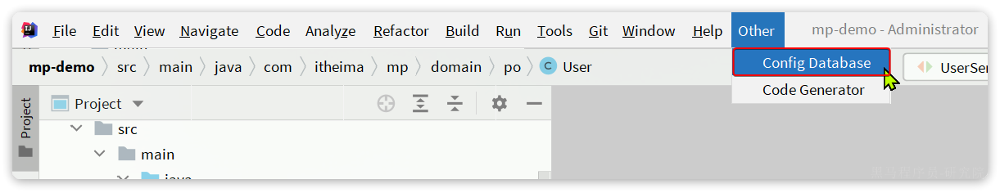
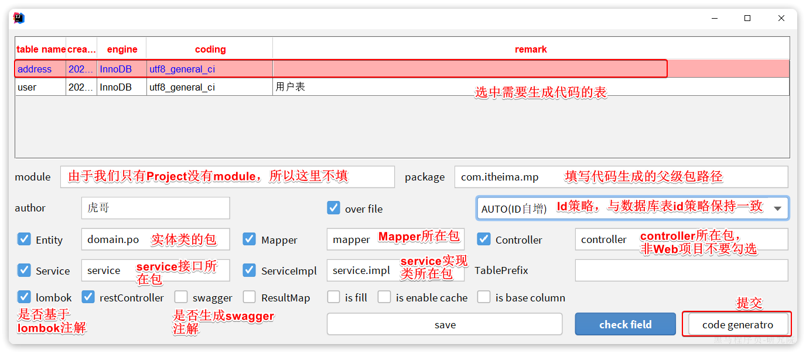
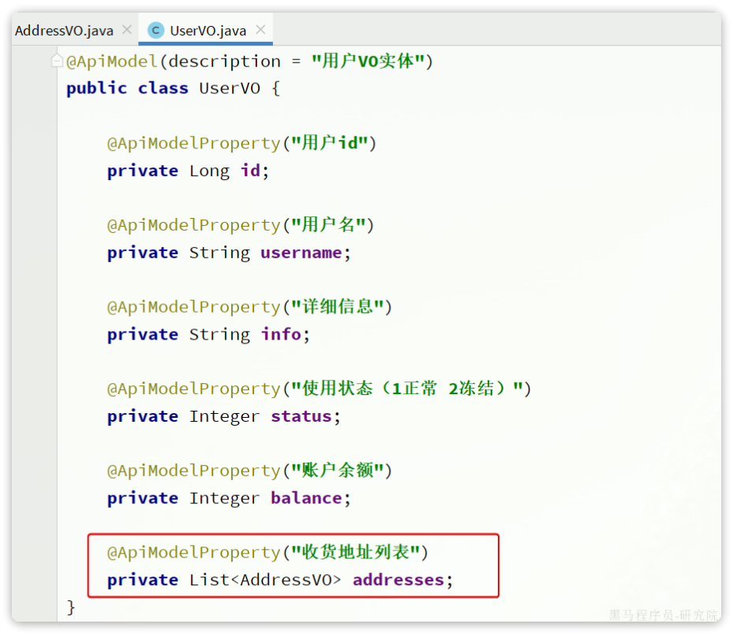
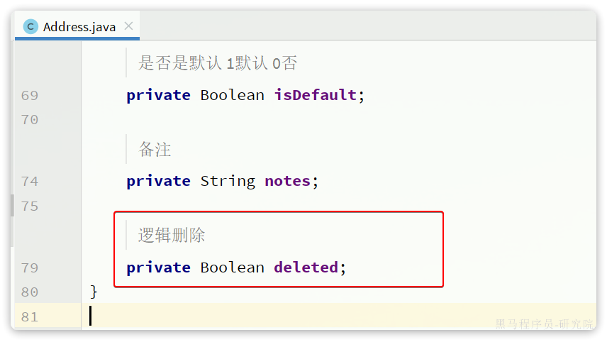
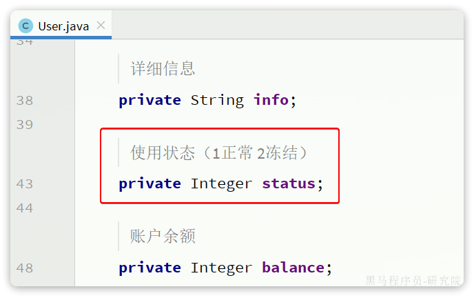
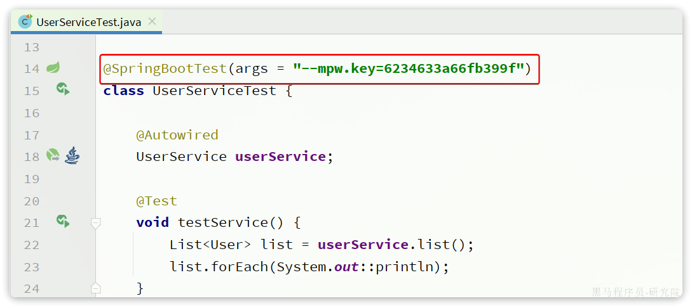
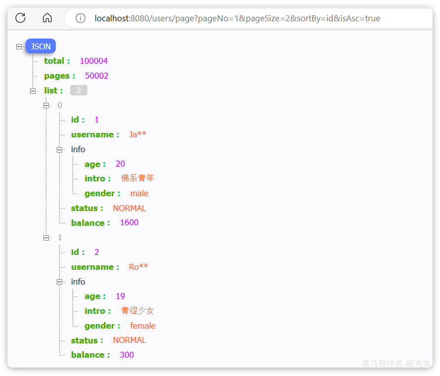

- ### 扩展功能

  - #### 代码生成

    > 在使用MybatisPlus以后，基础的Mapper、Service、PO代码相对固定，重复编写也比较麻烦。因此MybatisPlus官方提供了代码生成器根据数据库表结构生成PO、Mapper、Service等相关代码。只不过代码生成器同样要编码使用，也很麻烦。
    >
    > 这里推荐大家使用一款MybatisPlus的插件，它可以基于图形化界面完成MybatisPlus的代码生成，非常简单。

    - ##### 安装插件

      > 在Idea的plugins市场中搜索并安装MyBatisPlus插件，然后重启你的Idea即可使用。

    - ##### 使用

      > 刚好数据库中还有一张address表尚未生成对应的实体和mapper等基础代码。我们利用插件生成一下。 首先需要配置数据库地址，在Idea顶部菜单中，找到other，选择Config Database：
      >
      > 
      >
      > 在弹出的窗口中填写数据库连接的基本信息：
      >
      > 
      >
      > 点击OK保存。
      >
      > 然后再次点击Idea顶部菜单中的other，然后选择Code Generator:
      >
      > 
      >
      > 在弹出的表单中填写信息：
      >
      > 
      >
      > 最终，代码自动生成到指定的位置了：

  - #### 静态工具

    > 有的时候Service之间也会相互调用，为了避免出现循环依赖问题，MybatisPlus提供一个静态工具类：Db，其中的一些静态方法与IService中方法签名基本一致，也可以帮助我们实现CRUD功能：
    >
    > 
    >
    > 示例：
    >
    > ```java
    > @Test
    > void testDbGet() {
    >     User user = Db.getById(1L, User.class);
    >     System.out.println(user);
    > }
    > 
    > @Test
    > void testDbList() {
    >     // 利用Db实现复杂条件查询
    >     List<User> list = Db.lambdaQuery(User.class)
    >     .like(User::getUsername, "o")
    >     .ge(User::getBalance, 1000)
    >     .list();
    >     list.forEach(System.out::println);
    > }
    > 
    > @Test
    > void testDbUpdate() {
    >     Db.lambdaUpdate(User.class)
    >                     .set(User::getBalance, 2000)
    >                     .eq(User::getUsername, "Rose");
    > }
    > ```
    >
    > 需求：改造根据id用户查询的接口，查询用户的同时返回用户收货地址列表
    >
    > 首先，我们要添加一个收货地址的VO对象：
    >
    > ```java
    > package com.itheima.mp.domain.vo;
    > 
    > import io.swagger.annotations.ApiModel;
    > import io.swagger.annotations.ApiModelProperty;
    > import lombok.Data;
    > 
    > @Data
    > @ApiModel(description = "收货地址VO")
    > public class AddressVO{
    > 
    >     @ApiModelProperty("id")
    >     private Long id;
    > 
    >     @ApiModelProperty("用户ID")
    >     private Long userId;
    > 
    >     @ApiModelProperty("省")
    >     private String province;
    > 
    >     @ApiModelProperty("市")
    >     private String city;
    > 
    >     @ApiModelProperty("县/区")
    >     private String town;
    > 
    >     @ApiModelProperty("手机")
    >     private String mobile;
    > 
    >     @ApiModelProperty("详细地址")
    >     private String street;
    > 
    >     @ApiModelProperty("联系人")
    >     private String contact;
    > 
    >     @ApiModelProperty("是否是默认 1默认 0否")
    >     private Boolean isDefault;
    > 
    >     @ApiModelProperty("备注")
    >     private String notes;
    > }
    > ```
    >
    > 然后，改造原来的UserVO，添加一个地址属性：
    >
    > 
    >
    > 接下来，修改UserController中根据id查询用户的业务接口：
    >
    > ```java
    > @GetMapping("/{id}")
    > @ApiOperation("根据id查询用户")
    > public UserVO queryUserById(@PathVariable("id") Long userId){
    >     // 基于自定义service方法查询
    >     return userService.queryUserAndAddressById(userId);
    > }
    > ```
    >
    > 由于查询业务复杂，所以要在service层来实现。首先在IUserService中定义方法：
    >
    > ```java
    > package com.itheima.mp.service;
    > 
    > import com.baomidou.mybatisplus.extension.service.IService;
    > import com.itheima.mp.domain.po.User;
    > import com.itheima.mp.domain.vo.UserVO;
    > 
    > public interface IUserService extends IService<User> {
    >     void deduct(Long id, Integer money);
    > 
    >     UserVO queryUserAndAddressById(Long userId);
    > }
    > ```
    >
    > 然后，在UserServiceImpl中实现该方法：
    >
    > ```java
    > @Override
    > public UserVO queryUserAndAddressById(Long userId) {
    > // 1.查询用户
    >     User user = getById(userId);
    >     if (user == null) {
    >         return null;
    >     }
    > // 2.查询收货地址
    >     List<Address> addresses = Db.lambdaQuery(Address.class)
    >     .eq(Address::getUserId, userId)
    >     .list();
    > // 3.处理vo
    >     UserVO userVO = BeanUtil.copyProperties(user, UserVO.class);
    >     userVO.setAddresses(BeanUtil.copyToList(addresses, AddressVO.class));
    >     return userVO;
    > }
    > ```
    >
    > 在查询地址时，我们采用了Db的静态方法，因此避免了注入AddressService，减少了循环依赖的风险。
    >
    > 再来实现一个功能：
    >
    > -  根据id批量查询用户，并查询出用户对应的所有地址

  - #### 逻辑删除

    > 对于一些比较重要的数据，我们往往会采用逻辑删除的方案，即：
    >
    > - 在表中添加一个字段标记数据是否被删除
    > - 当删除数据时把标记置为true
    > - 查询时过滤掉标记为true的数据
    >
    > 一旦采用了逻辑删除，所有的查询和删除逻辑都要跟着变化，非常麻烦。
    >
    > 为了解决这个问题，MybatisPlus就添加了对逻辑删除的支持。
    >
    > **注意**，只有MybatisPlus生成的SQL语句才支持自动的逻辑删除，自定义SQL需要自己手动处理逻辑删除。
    >
    > 例如，我们给address表添加一个逻辑删除字段：
    >
    > ```sql
    > alter table address add deleted bit default b'0' null comment '逻辑删除';
    > ```
    >
    > 然后给Address实体添加deleted字段：
    >
    > 
    >
    > 接下来，我们要在application.yml中配置逻辑删除字段：
    >
    > ```yaml
    > mybatis-plus:
    >   global-config:
    >     db-config:
    >       logic-delete-field: deleted # 全局逻辑删除的实体字段名(since 3.3.0,配置后可以忽略不配置步骤2)
    >       logic-delete-value: 1 # 逻辑已删除值(默认为 1)
    >       logic-not-delete-value: 0 # 逻辑未删除值(默认为 0)
    > ```
    >
    > 测试： 首先，我们执行一个删除操作：
    >
    > ```java
    > @Test
    > void testDeleteByLogic() {
    >     // 删除方法与以前没有区别
    >     addressService.removeById(59L);
    > }
    > ```
    >
    > 方法与普通删除一模一样，但是底层的SQL逻辑变了：
    >
    > 
    >
    > 查询一下试试：
    >
    > ```java
    > @Test
    > void testQuery() {
    >     List<Address> list = addressService.list();
    >     list.forEach(System.out::println);
    > }
    > ```
    >
    > 会发现id为59的确实没有查询出来，而且SQL中也对逻辑删除字段做了判断：
    >
    > 
    >
    > 综上， 开启了逻辑删除功能以后，我们就可以像普通删除一样做CRUD，基本不用考虑代码逻辑问题。还是非常方便的。
    >
    > **注意**： 逻辑删除本身也有自己的问题，比如：
    >
    > - 会导致数据库表垃圾数据越来越多，从而影响查询效率
    > - SQL中全都需要对逻辑删除字段做判断，影响查询效率
    >
    > 因此，我不太推荐采用逻辑删除功能，如果数据不能删除，可以采用把数据迁移到其它表的办法。

  - #### 通用枚举

    > User类中有一个用户状态字段：
    >
    > 
    >
    >  像这种字段我们一般会定义一个枚举，做业务判断的时候就可以直接基于枚举做比较。但是我们数据库采用的是int类型，对应的PO也是Integer。因此业务操作时必须手动把枚举与Integer转换，非常麻烦。
    >
    > 因此，MybatisPlus提供了一个处理枚举的类型转换器，可以帮我们**把枚举类型与数据库类型自动转换**。

    - ##### 定义枚举

      > 我们定义一个用户状态的枚举：
      >
      > 
      >
      >  代码如下：
      >
      > ```java
      > package com.itheima.mp.enums;
      > 
      > import com.baomidou.mybatisplus.annotation.EnumValue;
      > import lombok.Getter;
      > 
      > @Getter
      > public enum UserStatus {
      >     NORMAL(1, "正常"),
      >     FREEZE(2, "冻结")
      >     ;
      >     private final int value;
      >     private final String desc;
      > 
      >     UserStatus(int value, String desc) {
      >         this.value = value;
      >         this.desc = desc;
      >     }
      > }
      > ```
      >
      > 然后把User类中的status字段改为UserStatus 类型：
      >
      > 
      >
      > 要让MybatisPlus处理枚举与数据库类型自动转换，我们必须告诉MybatisPlus，枚举中的哪个字段的值作为数据库值。 MybatisPlus提供了@EnumValue注解来标记枚举属性：
      >
      > 

    - ##### 配置枚举处理器

      > 在application.yaml文件中添加配置：
      >
      > ```yaml
      > mybatis-plus:
      >   configuration:
      >     default-enum-type-handler: com.baomidou.mybatisplus.core.handlers.MybatisEnumTypeHandler
      > ```

    - ##### 测试

      > ```java
      > @Test
      > void testService() {
      >     List<User> list = userService.list();
      >     list.forEach(System.out::println);
      > }
      > ```
      >
      > 最终，查询出的User类的status字段会是枚举类型：
      >
      > 
      >
      > 同时，为了使页面查询结果也是枚举格式，我们需要修改UserVO中的status属性：
      >
      > 
      >
      > 并且，在UserStatus枚举中通过@JsonValue注解标记JSON序列化时展示的字段：
      >
      > 
      >
      > 最后，在页面查询，结果如下：
      >
      > 

  - #### JSON类型处理器

    > 数据库的user表中有一个info字段，是JSON类型：
    >
    > 
    >
    >  格式像这样：
    >
    > ```java
    > {"age": 20, "intro": "佛系青年", "gender": "male"}
    > ```
    >
    > 而目前User实体类中却是String类型：
    >
    > 
    >
    > 这样一来，我们要读取info中的属性时就非常不方便。如果要方便获取，info的类型最好是一个Map或者实体类。
    >
    >  而一旦我们把info改为对象类型，就需要在写入数据库时手动转为String，再读取数据库时，手动转换为对象，这会非常麻烦。
    >
    > 因此MybatisPlus提供了很多特殊类型字段的类型处理器，解决特殊字段类型与数据库类型转换的问题。例如处理JSON就可以使用JacksonTypeHandler处理器。
    >
    > 接下来，我们就来看看这个处理器该如何使用。

    - ##### 定义实体

      > 首先，我们定义一个单独实体类来与info字段的属性匹配：
      >
      > 
      >
      >  代码如下：
      >
      > ```java
      > package com.itheima.mp.domain.po;
      > 
      > import lombok.Data;
      > 
      > @Data
      > public class UserInfo {
      >     private Integer age;
      >     private String intro;
      >     private String gender;
      > }
      > ```

    - ##### 使用类型处理器

      > 接下来，将User类的info字段修改为UserInfo类型，并声明类型处理器：
      >
      > 
      >
      > 测试可以发现，所有数据都正确封装到UserInfo当中了：
      >
      > 
      >
      > 同时，为了让页面返回的结果也以对象格式返回，我们要修改UserVO中的info字段：
      >
      > 
      >
      > 此时，在页面查询结果如下：
      >
      > 

  - #### ~~配置加密（选学）~~

    > 目前我们配置文件中的很多参数都是明文，如果开发人员发生流动，很容易导致敏感信息的泄露。所以MybatisPlus支持配置文件的加密和解密功能。
    >
    > 我们以数据库的用户名和密码为例。

    - ##### 生成秘钥

      > 首先，我们利用AES工具生成一个随机秘钥，然后对用户名、密码加密：
      >
      > ```java
      > package com.itheima.mp;
      > 
      > import com.baomidou.mybatisplus.core.toolkit.AES;
      > import org.junit.jupiter.api.Test;
      > 
      > class MpDemoApplicationTests {
      >     @Test
      >     void contextLoads() {
      >         // 生成 16 位随机 AES 密钥
      >         String randomKey = AES.generateRandomKey();
      >         System.out.println("randomKey = " + randomKey);
      > 
      >         // 利用密钥对用户名加密
      >         String username = AES.encrypt("root", randomKey);
      >         System.out.println("username = " + username);
      > 
      >         // 利用密钥对用户名加密
      >         String password = AES.encrypt("MySQL123", randomKey);
      >         System.out.println("password = " + password);
      > 
      >     }
      > }
      > ```
      >
      > 打印结果如下：
      >
      > ```java
      > randomKey = 6234633a66fb399f
      > username = px2bAbnUfiY8K/IgsKvscg==
      > password = FGvCSEaOuga3ulDAsxw68Q==
      > ```

    - ##### 修改配置

      > 修改application.yaml文件，把jdbc的用户名、密码修改为刚刚加密生成的密文：
      >
      > ```yaml
      > spring:
      >   datasource:
      >     url: jdbc:mysql://127.0.0.1:3306/mp?useUnicode=true&characterEncoding=UTF-8&autoReconnect=true&serverTimezone=Asia/Shanghai&rewriteBatchedStatements=true
      >     driver-class-name: com.mysql.cj.jdbc.Driver
      >     username: mpw:QWWVnk1Oal3258x5rVhaeQ== # 密文要以 mpw:开头
      >     password: mpw:EUFmeH3cNAzdRGdOQcabWg== # 密文要以 mpw:开头
      > ```

    - ##### 测试

      > 在启动项目的时候，需要把刚才生成的秘钥添加到启动参数中，像这样：`--mpw.key=6234633a66fb399f`
      >
      > 单元测试的时候不能添加启动参数，所以要在测试类的注解上配置：
      >
      > 
      >
      > 然后随意运行一个单元测试，可以发现数据库查询正常。

- ## MyBatisPlus中的插件

  > MybatisPlus提供了很多的插件功能，进一步拓展其功能。目前已有的插件有：
  >
  > - PaginationInnerInterceptor：自动分页
  > - TenantLineInnerInterceptor：多租户
  > - DynamicTableNameInnerInterceptor：动态表名
  > - OptimisticLockerInnerInterceptor：乐观锁
  > - IllegalSQLInnerInterceptor：sql 性能规范
  > - BlockAttackInnerInterceptor：防止全表更新与删除
  >
  > **注意：** 使用多个分页插件的时候需要注意插件定义顺序，建议使用顺序如下：
  >
  > - 多租户,动态表名
  > - 分页,乐观锁
  > - sql 性能规范,防止全表更新与删除
  >
  > 这里我们以分页插件为例来学习插件的用法。

  - #### 分页插件

    > 在未引入分页插件的情况下，MybatisPlus是不支持分页功能的，IService和BaseMapper中的分页方法都无法正常起效。 所以，我们必须配置分页插件。

    1. ##### 配置分页插件

       > 在项目中新建一个配置类：
       >
       > 
       >
       >  其代码如下：
       >
       > ```java
       > package com.itheima.mp.config;
       > 
       > import com.baomidou.mybatisplus.annotation.DbType;
       > import com.baomidou.mybatisplus.extension.plugins.MybatisPlusInterceptor;
       > import com.baomidou.mybatisplus.extension.plugins.inner.PaginationInnerInterceptor;
       > import org.springframework.context.annotation.Bean;
       > import org.springframework.context.annotation.Configuration;
       > 
       > @Configuration
       > public class MybatisConfig {
       > 
       >     @Bean
       >     public MybatisPlusInterceptor mybatisPlusInterceptor() {
       >         // 初始化核心插件
       >         MybatisPlusInterceptor interceptor = new MybatisPlusInterceptor();
       >         // 添加分页插件
       >         interceptor.addInnerInterceptor(new PaginationInnerInterceptor(DbType.MYSQL));
       >         return interceptor;
       >     }
       > }
       > ```

    2. ##### 分页API

       > 编写一个分页查询的测试：
       >
       > ```java
       > @Test
       > void testPageQuery() {
       >     // 1.分页查询，new Page()的两个参数分别是：页码、每页大小
       >     Page<User> p = userService.page(new Page<>(2, 2));
       >     // 2.总条数
       >     System.out.println("total = " + p.getTotal());
       >     // 3.总页数
       >     System.out.println("pages = " + p.getPages());
       >     // 4.数据
       >     List<User> records = p.getRecords();
       >     records.forEach(System.out::println);
       > }
       > ```
       >
       > 运行的SQL如下：
       >
       > 
       >
       > 这里用到了分页参数，Page，即可以支持分页参数，也可以支持排序参数。常见的API如下：
       >
       > ```java
       > int pageNo = 1, pageSize = 5;
       > // 分页参数
       > Page<User> page = Page.of(pageNo, pageSize);
       > // 排序参数, 通过OrderItem来指定
       > page.addOrder(new OrderItem("balance", false));
       > 
       > userService.page(page);
       > ```

  - #### 通用分页实体

    > 现在要实现一个用户分页查询的接口，接口规范如下：
    >
    > | **参数** | **说明**                                                     |
    > | -------- | ------------------------------------------------------------ |
    > | 请求方式 | GET                                                          |
    > | 请求路径 | /users/page                                                  |
    > | 请求参数 | `{    "pageNo": 1,    "pageSize": 5,    "sortBy": "balance",    "isAsc": false,    "name": "o",    "status": 1 }` |
    > | 返回值   | `{    "total": 100006,    "pages": 50003,    "list": [        {            "id": 1685100878975279298,            "username": "user_9****",            "info": {                "age": 24,                "intro": "英文老师",                "gender": "female"            },            "status": "正常",            "balance": 2000        }    ] }` |
    > | 特殊说明 | 如果排序字段为空，默认按照更新时间排序排序字段不为空，则按照排序字段排序 |
    >
    > 这里需要定义3个实体：
    >
    > - UserQuery：分页查询条件的实体，包含分页、排序参数、过滤条件
    > - PageDTO：分页结果实体，包含总条数、总页数、当前页数据
    > - UserVO：用户页面视图实体

    1. ##### 实体

       > 由于UserQuery之前已经定义过了，并且其中已经包含了过滤条件，具体代码如下：
       >
       > ```java
       > package com.itheima.mp.domain.query;
       > 
       > import io.swagger.annotations.ApiModel;
       > import io.swagger.annotations.ApiModelProperty;
       > import lombok.Data;
       > 
       > @Data
       > @ApiModel(description = "用户查询条件实体")
       > public class UserQuery {
       >     @ApiModelProperty("用户名关键字")
       >     private String name;
       >     @ApiModelProperty("用户状态：1-正常，2-冻结")
       >     private Integer status;
       >     @ApiModelProperty("余额最小值")
       >     private Integer minBalance;
       >     @ApiModelProperty("余额最大值")
       >     private Integer maxBalance;
       > }
       > ```
       >
       > 其中缺少的仅仅是分页条件，而分页条件不仅仅用户分页查询需要，以后其它业务也都有分页查询的需求。因此建议将分页查询条件单独定义为一个PageQuery实体：
       >
       > 
       >
       > PageQuery是前端提交的查询参数，一般包含四个属性：
       >
       > - pageNo：页码
       > - pageSize：每页数据条数
       > - sortBy：排序字段
       > - isAsc：是否升序
       >
       > ```java
       > @Data
       > @ApiModel(description = "分页查询实体")
       > public class PageQuery {
       >     @ApiModelProperty("页码")
       >     private Long pageNo;
       >     @ApiModelProperty("页码")
       >     private Long pageSize;
       >     @ApiModelProperty("排序字段")
       >     private String sortBy;
       >     @ApiModelProperty("是否升序")
       >     private Boolean isAsc;
       > }
       > ```
       >
       > 然后，让我们的UserQuery继承这个实体：
       >
       > ```java
       > package com.itheima.mp.domain.query;
       > 
       > import io.swagger.annotations.ApiModel;
       > import io.swagger.annotations.ApiModelProperty;
       > import lombok.Data;
       > import lombok.EqualsAndHashCode;
       > 
       > @EqualsAndHashCode(callSuper = true)
       > @Data
       > @ApiModel(description = "用户查询条件实体")
       > public class UserQuery extends PageQuery {
       >     @ApiModelProperty("用户名关键字")
       >     private String name;
       >     @ApiModelProperty("用户状态：1-正常，2-冻结")
       >     private Integer status;
       >     @ApiModelProperty("余额最小值")
       >     private Integer minBalance;
       >     @ApiModelProperty("余额最大值")
       >     private Integer maxBalance;
       > }
       > ```
       >
       > 返回值的用户实体沿用之前定一个UserVO实体：
       >
       > 
       >
       > 最后，则是分页实体PageDTO:
       >
       > 
       >
       > 代码如下：
       >
       > ```java
       > package com.itheima.mp.domain.dto;
       > 
       > import io.swagger.annotations.ApiModel;
       > import io.swagger.annotations.ApiModelProperty;
       > import lombok.Data;
       > 
       > import java.util.List;
       > 
       > @Data
       > @ApiModel(description = "分页结果")
       > public class PageDTO<T> {
       >     @ApiModelProperty("总条数")
       >     private Long total;
       >     @ApiModelProperty("总页数")
       >     private Long pages;
       >     @ApiModelProperty("集合")
       >     private List<T> list;
       > }
       > ```

    2. ##### 开发接口

       > 我们在UserController中定义分页查询用户的接口：
       >
       > ```java
       > package com.itheima.mp.controller;
       > 
       > import com.itheima.mp.domain.dto.PageDTO;
       > import com.itheima.mp.domain.query.PageQuery;
       > import com.itheima.mp.domain.vo.UserVO;
       > import com.itheima.mp.service.UserService;
       > import lombok.RequiredArgsConstructor;
       > import org.springframework.web.bind.annotation.GetMapping;
       > import org.springframework.web.bind.annotation.RequestMapping;
       > import org.springframework.web.bind.annotation.RestController;
       > 
       > @RestController
       > @RequestMapping("users")
       > @RequiredArgsConstructor
       > public class UserController {
       > 
       >     private final UserService userService;
       > 
       >     @GetMapping("/page")
       >     public PageDTO<UserVO> queryUsersPage(UserQuery query){
       >         return userService.queryUsersPage(query);
       >     }
       > 
       >     // 。。。 略
       > }
       > ```
       >
       > 然后在IUserService中创建queryUsersPage方法：
       >
       > ```java
       > PageDTO<UserVO> queryUsersPage(PageQuery query);
       > ```
       >
       > 接下来，在UserServiceImpl中实现该方法：
       >
       > ```java
       > @Override
       > public PageDTO<UserVO> queryUsersPage(PageQuery query) {
       > // 1.构建条件
       >     // 1.1.分页条件
       >     Page<User> page = Page.of(query.getPageNo(), query.getPageSize());
       >     // 1.2.排序条件
       >     if (query.getSortBy() != null) {
       >         page.addOrder(new OrderItem(query.getSortBy(), query.getIsAsc()));
       >     }else{
       >         // 默认按照更新时间排序
       >         page.addOrder(new OrderItem("update_time", false));
       >     }
       >  // 2.查询
       >     page(page);
       > // 3.数据非空校验
       >     List<User> records = page.getRecords();
       >     if (records == null || records.size() <= 0) {
       >         // 无数据，返回空结果
       >         return new PageDTO<>(page.getTotal(), page.getPages(), Collections.emptyList());
       >     }
       >  // 4.有数据，转换
       >     List<UserVO> list = BeanUtil.copyToList(records, UserVO.class);
       > // 5.封装返回
       >     return new PageDTO<UserVO>(page.getTotal(), page.getPages(), list);
       > }
       > ```
       >
       >  启动项目，在页面查看：
       >
       > 

    3. ##### 改造`PageQuery`实体

       > 在刚才的代码中，从PageQuery到MybatisPlus的Page之间转换的过程还是比较麻烦的。
       >
       >  我们完全可以在PageQuery这个实体中定义一个工具方法，简化开发。 像这样：
       >
       > ```java
       > package com.itheima.mp.domain.query;
       > 
       > import com.baomidou.mybatisplus.core.metadata.OrderItem;
       > import com.baomidou.mybatisplus.extension.plugins.pagination.Page;
       > import lombok.Data;
       > 
       > @Data
       > public class PageQuery {
       >     private Integer pageNo;
       >     private Integer pageSize;
       >     private String sortBy;
       >     private Boolean isAsc;
       > 
       >     public <T>  Page<T> toMpPage(OrderItem ... orders){
       >         // 1.分页条件
       >         Page<T> p = Page.of(pageNo, pageSize);
       >         // 2.排序条件
       >         // 2.1.先看前端有没有传排序字段
       >         if (sortBy != null) {
       >             p.addOrder(new OrderItem(sortBy, isAsc));
       >             return p;
       >         }
       >         // 2.2.再看有没有手动指定排序字段
       >         if(orders != null){
       >             p.addOrder(orders);
       >         }
       >         return p;
       >     }
       > 
       >     public <T> Page<T> toMpPage(String defaultSortBy, boolean isAsc){
       >         return this.toMpPage(new OrderItem(defaultSortBy, isAsc));
       >     }
       > 
       >     public <T> Page<T> toMpPageDefaultSortByCreateTimeDesc() {
       >         return toMpPage("create_time", false);
       >     }
       > 
       >     public <T> Page<T> toMpPageDefaultSortByUpdateTimeDesc() {
       >         return toMpPage("update_time", false);
       >     }
       > }
       > ```
       >
       > 这样我们在开发也时就可以省去对从PageQuery到Page的的转换：
       >
       > ```java
       > // 1.构建条件
       > Page<User> page = query.toMpPageDefaultSortByCreateTimeDesc();
       > ```

    4. ##### 改造`PageDTO`实体

       > 在查询出分页结果后，数据的非空校验，数据的vo转换都是模板代码，编写起来很麻烦。
       >
       > 我们完全可以将其封装到PageDTO的工具方法中，简化整个过程：
       >
       > ```java
       > package com.itheima.mp.domain.dto;
       > 
       > import cn.hutool.core.bean.BeanUtil;
       > import com.baomidou.mybatisplus.extension.plugins.pagination.Page;
       > import lombok.AllArgsConstructor;
       > import lombok.Data;
       > import lombok.NoArgsConstructor;
       > 
       > import java.util.Collections;
       > import java.util.List;
       > import java.util.function.Function;
       > import java.util.stream.Collectors;
       > 
       > @Data
       > @NoArgsConstructor
       > @AllArgsConstructor
       > public class PageDTO<V> {
       >     private Long total;
       >     private Long pages;
       >     private List<V> list;
       > 
       >     /**
       >      * 返回空分页结果
       >      * @param p MybatisPlus的分页结果
       >      * @param <V> 目标VO类型
       >      * @param <P> 原始PO类型
       >      * @return VO的分页对象
       >      */
       >     public static <V, P> PageDTO<V> empty(Page<P> p){
       >         return new PageDTO<>(p.getTotal(), p.getPages(), Collections.emptyList());
       >     }
       > 
       >     /**
       >      * 将MybatisPlus分页结果转为 VO分页结果
       >      * @param p MybatisPlus的分页结果
       >      * @param voClass 目标VO类型的字节码
       >      * @param <V> 目标VO类型
       >      * @param <P> 原始PO类型
       >      * @return VO的分页对象
       >      */
       >     public static <V, P> PageDTO<V> of(Page<P> p, Class<V> voClass) {
       >         // 1.非空校验
       >         List<P> records = p.getRecords();
       >         if (records == null || records.size() <= 0) {
       >             // 无数据，返回空结果
       >             return empty(p);
       >         }
       >         // 2.数据转换
       >         List<V> vos = BeanUtil.copyToList(records, voClass);
       >         // 3.封装返回
       >         return new PageDTO<>(p.getTotal(), p.getPages(), vos);
       >     }
       > 
       >     /**
       >      * 将MybatisPlus分页结果转为 VO分页结果，允许用户自定义PO到VO的转换方式
       >      * @param p MybatisPlus的分页结果
       >      * @param convertor PO到VO的转换函数
       >      * @param <V> 目标VO类型
       >      * @param <P> 原始PO类型
       >      * @return VO的分页对象
       >      */
       >     public static <V, P> PageDTO<V> of(Page<P> p, Function<P, V> convertor) {
       >         // 1.非空校验
       >         List<P> records = p.getRecords();
       >         if (records == null || records.size() <= 0) {
       >             // 无数据，返回空结果
       >             return empty(p);
       >         }
       >         // 2.数据转换
       >         List<V> vos = records.stream().map(convertor).collect(Collectors.toList());
       >         // 3.封装返回
       >         return new PageDTO<>(p.getTotal(), p.getPages(), vos);
       >     }
       > }
       > ```
       >
       > 最终，业务层的代码可以简化为：
       >
       > ```java
       > @Override
       >     public PageDTO<UserVO> queryUserByPage(PageQuery query) {
       >     // 1.构建条件
       >     Page<User> page = query.toMpPageDefaultSortByCreateTimeDesc();
       >     // 2.查询
       >     page(page);
       >     // 3.封装返回
       >     return PageDTO.of(page, UserVO.class);
       > }
       > ```
       >
       > 如果是希望自定义PO到VO的转换过程，可以这样做：
       >
       > ```java
       > @Override
       > public PageDTO<UserVO> queryUserByPage(PageQuery query) {
       > // 1.构建条件
       > Page<User> page = query.toMpPageDefaultSortByCreateTimeDesc();
       > // 2.查询
       > page(page);
       > // 3.封装返回
       > return PageDTO.of(page, user -> {
       >     // 拷贝属性到VO
       >     UserVO vo = BeanUtil.copyProperties(user, UserVO.class);
       >     // 用户名脱敏
       >     String username = vo.getUsername();
       >     vo.setUsername(username.substring(0, username.length() - 2) + "**");
       >     return vo;
       > });
       > }
       > ```
       >
       > 最终查询的结果如下：
       >
       > 

