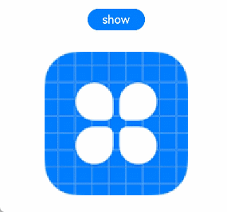
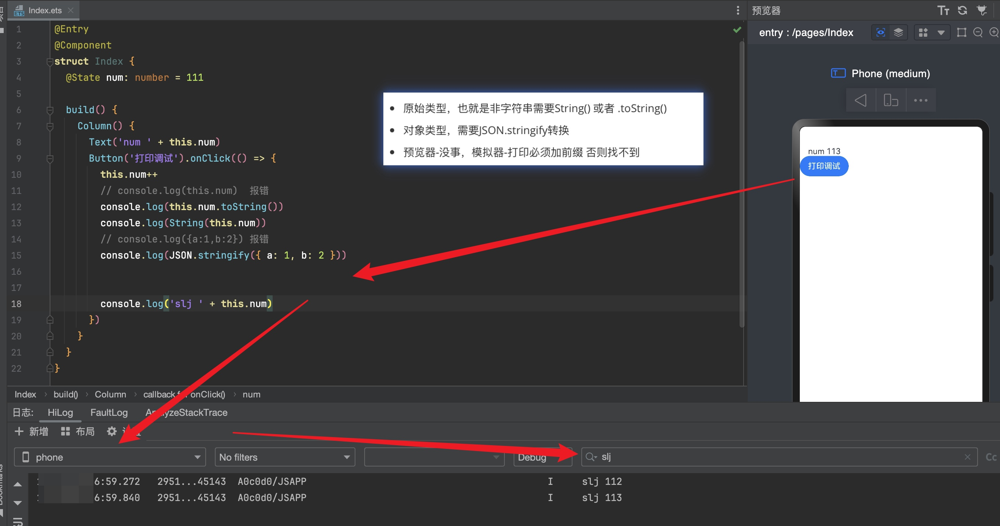

## 

安卓-Android

苹果-iOS

鸿蒙-HarmonyOS

 

# 第1章 华为鸿蒙系统概述

## 1. HarmonyOS简介

鸿蒙OS是华为公司开发的一款基于微内核、 耗时10年、4000多名研发人员投入开发、面向5G物联网、面向全场景的分布式操作系统。鸿蒙的英文名是HarmonyOS，意为和谐。 这个新的操作系统将打通手机、电脑、平板、电视、工业自动化控制、无人驾驶、车机设备 、智能穿戴统一成一个操作系统，并且该系统是面向下一代技术而设计的，能兼容全部安卓应用的所有Web应用。

 

> 系统兼容

2023年 9 月份，余承东正式宣布鸿蒙下一个版本HarmonyOSNEXT 蓄势待发，鸿蒙原生应用全面启动。其系统底座全栈自研，去掉了传统的 AOSP 代码，仅支持鸿蒙内核和鸿蒙系统的应用。此外，HarmonyOS NEXT 只能使用 Hap 格式的安装包，这就代表着 HarmonyOS 将不再适配Android应用。

2023年11月20日，针对华为可能推出不兼容安卓的鸿蒙版本，一华为相关人士向澎湃新闻表示：推出时间还不确定，未来[IOS](https://baike.baidu.com/item/IOS/45705?fromModule=lemma_inlink)、鸿蒙、[安卓](https://baike.baidu.com/item/安卓/61750934?fromModule=lemma_inlink)将为三个各自独立的系统。 

  

 

## 2. HarmonyOS的发展历程

[https://baike.baidu.com/starmap/view?nodeId=dfbc67e96b15581aaff83c28&lemmaTitle=%E5%8D%8E%E4%B8%BA%E9%B8%BF%E8%92%99%E7%B3%BB%E7%BB%9F&lemmaId=23500650&starMapFrom=lemma_starMap&fromModule=lemma_starMap](https://baike.baidu.com/starmap/view?nodeId=dfbc67e96b15581aaff83c28&lemmaTitle=华为鸿蒙系统&lemmaId=23500650&starMapFrom=lemma_starMap&fromModule=lemma_starMap)

- 2019年8月9日   华为鸿蒙系统  HUAWEI HarmonyOS
- 2020年9月10日  Harmony 2.0    （鸿蒙2.0     代表API6 FA模型支持JS、JAVA）  
- 2022年7月27日  Harmony 3        （鸿蒙3        代表API9 专注ArkTS开发）          23年10月
- 2023年8月04日  Harmony 4        （鸿蒙4        代表API10/11  NEXT Preview  星河预览版）
- 2024年1月18日  Harmony Next （鸿蒙5         代表API12 ）

> 2023年8月4日，华为推出HarmonyOS NEXT开发者预览版 ；
>
> 2023年9月25日，华为在秋季全场景发布会上对外宣布启动“HarmonyOS NEXT计划”。
>
> 2024年1月18日，HarmonyOS NEXT星河版正式面向开发者开放申请。
>
> 2024年秋天，HarmonyOS NEXT鸿蒙星河版将正式和消费者见面。 
>
> 2024年第四季度，HarmonyOS NEXT将推出商用版本。
>
> ```txt
> HarmonyOS NEXT减少40%冗余代码，提升系统流畅度、能效、安全性。 该系统从编程语言到编译器都是全栈自研，华为称其为“真正的操作系统” ，系统底座采用“盘古”AI大模型、“MindSpore”AI框架、“DevEco Studio”等集成开发环境、“HarmonyOS Design”设计系统、“ArkUI”等编程框架、“方舟编译器”“毕昇编译器”等编译器、“ArkTS”“仓颉”等编程语言、“EROFS”“HMDFS”等分布式文件系统以及鸿蒙内核.
> 华为鸿蒙原生应用版图已经成型，包括但不限于导航、新闻、工具、旅游、金融、便捷生活、美食、游戏等多个领域的企业和开发者陆续宣布加入鸿蒙生态 。
> 
> 中文名： 鸿蒙星河版
> 外文名： HarmonyOS NEXT
> 别  名：“纯血鸿蒙”
> ```
>

 

## 3. 华为关键战略

**华为的一个关键战略**

“1+8+N”是华为的一个关键战略，这个战略的目的是为了打造全场景智慧生活（万物互联）。

在这个战略中，

“1”指的是智能手机，作为个人便携的算力提供终端，通过不同的方式与其他设备进行连接；

“8”代表华为的八大核心产品，包括[平板](https://www.baidu.com/s?rsv_idx=1&wd=平板&fenlei=256&usm=1&ie=utf-8&rsv_pq=a30c461801bccfc7&oq=1%2B8%2Bn是什么&rsv_t=d176ptoQmbwItzYgF5zB0zWBisJmvGoEem8C1AIIEuol0AlcFmhW1vSjmeE&sa=re_dqa_zy&icon=1)、[智能音箱](https://www.baidu.com/s?rsv_idx=1&wd=智能音箱&fenlei=256&usm=1&ie=utf-8&rsv_pq=a30c461801bccfc7&oq=1%2B8%2Bn是什么&rsv_t=f5132gVwRZz2YijWPzrsEakv%2BZMy%2BchS%2Ftd%2B7qbUQzxrW45nrmCTNEc2Cok&sa=re_dqa_zy&icon=1)、[眼镜](https://www.baidu.com/s?rsv_idx=1&wd=眼镜&fenlei=256&usm=1&ie=utf-8&rsv_pq=a30c461801bccfc7&oq=1%2B8%2Bn是什么&rsv_t=f5132gVwRZz2YijWPzrsEakv%2BZMy%2BchS%2Ftd%2B7qbUQzxrW45nrmCTNEc2Cok&sa=re_dqa_zy&icon=1)、[手表](https://www.baidu.com/s?rsv_idx=1&wd=手表&fenlei=256&usm=1&ie=utf-8&rsv_pq=a30c461801bccfc7&oq=1%2B8%2Bn是什么&rsv_t=f5132gVwRZz2YijWPzrsEakv%2BZMy%2BchS%2Ftd%2B7qbUQzxrW45nrmCTNEc2Cok&sa=re_dqa_zy&icon=1)、[车机](https://www.baidu.com/s?rsv_idx=1&wd=车机&fenlei=256&usm=1&ie=utf-8&rsv_pq=a30c461801bccfc7&oq=1%2B8%2Bn是什么&rsv_t=f5132gVwRZz2YijWPzrsEakv%2BZMy%2BchS%2Ftd%2B7qbUQzxrW45nrmCTNEc2Cok&sa=re_dqa_zy&icon=1)、[耳机](https://www.baidu.com/s?rsv_idx=1&wd=耳机&fenlei=256&usm=1&ie=utf-8&rsv_pq=a30c461801bccfc7&oq=1%2B8%2Bn是什么&rsv_t=f5132gVwRZz2YijWPzrsEakv%2BZMy%2BchS%2Ftd%2B7qbUQzxrW45nrmCTNEc2Cok&sa=re_dqa_zy&icon=1)、[笔记本](https://www.baidu.com/s?rsv_idx=1&wd=笔记本&fenlei=256&usm=1&ie=utf-8&rsv_pq=a30c461801bccfc7&oq=1%2B8%2Bn是什么&rsv_t=494733GZ0W9zW1klkzByv6eUBAyP697VM034E3cf%2Bn9KaLPpmuQJL5NrFRM&sa=re_dqa_zy&icon=1)和PC；

而“N”则涵盖了移动办公、[智能家居](https://www.baidu.com/s?rsv_idx=1&wd=智能家居&fenlei=256&usm=1&ie=utf-8&rsv_pq=a30c461801bccfc7&oq=1%2B8%2Bn是什么&rsv_t=494733GZ0W9zW1klkzByv6eUBAyP697VM034E3cf%2Bn9KaLPpmuQJL5NrFRM&sa=re_dqa_zy&icon=1)、[运动健康](https://www.baidu.com/s?rsv_idx=1&wd=运动健康&fenlei=256&usm=1&ie=utf-8&rsv_pq=a30c461801bccfc7&oq=1%2B8%2Bn是什么&rsv_t=494733GZ0W9zW1klkzByv6eUBAyP697VM034E3cf%2Bn9KaLPpmuQJL5NrFRM&sa=re_dqa_zy&icon=1)、[影音娱乐](https://www.baidu.com/s?rsv_idx=1&wd=影音娱乐&fenlei=256&usm=1&ie=utf-8&rsv_pq=a30c461801bccfc7&oq=1%2B8%2Bn是什么&rsv_t=494733GZ0W9zW1klkzByv6eUBAyP697VM034E3cf%2Bn9KaLPpmuQJL5NrFRM&sa=re_dqa_zy&icon=1)及智能出行等领域的延伸业务，这些业务可能涉及与华为合作的生态企业。

总的来说，“1+8+N”战略体现了华为在5G时代下的全场景智慧生活布局，旨在通过整合各种智能设备和服务，为用户提供更加便捷和智能的生活体验。

>        
>
>  
>
>  
>
>   
>
>    
>
>  
>
>  
>
>      

 

## 4. 鸿蒙的最新相关信息

- [各大互联网企业纷纷加入鸿蒙原生应用开发](https://www.baidu.com/s?ie=utf-8&f=8&rsv_bp=1&rsv_idx=1&tn=baidu&wd=各大互联网企业纷纷加入鸿蒙原生应用开发&fenlei=256&rsv_pq=0xcf4f7ef7003b8f4b&rsv_t=5b2f3exXdBmwdCmNT9LHnufAzlivipmUCmWO1iDT5tUEjAZ%2FKbE3CbRWwV7c&rqlang=en&rsv_dl=tb&rsv_sug3=1&rsv_enter=1&rsv_sug2=0&rsv_btype=i&inputT=173&rsv_sug4=173)
- [华为鸿蒙进入135所高校!清华、复旦、哈工大等:共建鸿蒙世界](https://www.baidu.com/s?ie=utf-8&f=8&rsv_bp=1&rsv_idx=1&tn=baidu&wd=华为鸿蒙进入高校&fenlei=256&oq=%E5%8D%8E%E4%B8%BA%E9%B8%BF%E8%92%99%E8%BF%9B%E5%85%A51%26lt%3B5%E6%89%80%E9%AB%98%E6%A0%A1&rsv_pq=e659518c0048ed29&rsv_t=0ddfkHzIqhl3%2BN6V5vkg0As6M2Ec4Du2xXEjL2oos0q7RaReMY77ahaD8BQ&rqlang=cn&rsv_dl=tb&rsv_enter=1&rsv_sug3=10&rsv_sug1=4&rsv_sug7=100&rsv_sug2=0&rsv_btype=t&inputT=1550&rsv_sug4=1777) 
- [四家车企官宣合作!华为鸿蒙生态壮大](https://www.baidu.com/s?ie=utf-8&f=8&rsv_bp=1&rsv_idx=1&tn=baidu&wd=四家车企官宣合作!华为鸿蒙生态壮大&fenlei=256&oq=%E9%B8%BF%E8%92%99%E5%92%8C%E5%9B%BD%E5%86%85%E8%BD%A6%E4%BC%81&rsv_pq=e1856a04002481bb&rsv_t=36f3X83TVol8V%2F279hpMydEya0%2BtazB3rIPrI2y67rLmyVH1UqSLqfT8hCI&rqlang=cn&rsv_dl=tb&rsv_enter=1&rsv_btype=t&inputT=337&rsv_sug3=102&rsv_sug1=23&rsv_sug7=100&rsv_sug2=0&rsv_sug4=379)  
- [江苏千行万业加速拥抱*鸿蒙*,超两百款应用启动*鸿蒙*原...](http://www.baidu.com/link?url=U0DisjvBAdzjTFZ5gIk0uQFPlxva8kpu3OswoRF764aun3qNyXIjIuNsxkUo040t2uXkjSBmbzSXmAheg7gecYexDMcxqsWNnyVlYUHHQim)  

> 南京市建邺区委书记、区长姜宸表示，愿携手华为共同打造数智之城，通过应用场景、创新生态、金融赋能、产业政策“四个支撑”，全力以赴推动千行万业共建鸿蒙生态，助力华为及鸿蒙生态企业在建邺这个青春之城再谱创新传奇、再攀产业高峰；华为终端云全球生态发展与销售部总裁宁胜蓝表示，鸿蒙生态在江苏省的发展壮大，离不开伙伴们的大力支持。“我们期盼更多的江苏企业与开发者能够加入鸿蒙生态的大家庭，共同探索更多创新的应用模式。

- [华为*鸿蒙*系统再获深圳官方力挺!全面覆盖政务和公共服务,助...](http://www.baidu.com/link?url=wbbqvGBh-AmmWGAEpFoT1aDc-nah3b1Qqt5vkL43J2-A46nD2RTakk7c9BKwMlQw-gc8DSbBEpUwqiMlw9zjtC0V-GJyE0-xuWOdozJuy7a) 

> 深圳这座科技之城，再次站在风口浪尖，官方率先出招力挺“纯血鸿蒙”！鸿蒙应用版图基本成型，政务和公共服务全面覆盖！   

 

- 此外，根据Counterpoint Research的最新数据显示，**HarmonyOS在中国的市场份额已经从2023年第一季度的8%，显著增长至2024年第一季度的17%，正式超越了苹果iOS，成为中国市场上的第二大操作系统。**

  **目前，已有超过9亿台设备**装载了**HarmonyOS。** 

>    

 

## 5. 鸿蒙开发


相同点：1-都是华为研发的，2-都是分布式操作系统 

不同点：1-HarmonyOS商业华为自己用，OpenHarmony开源大家用；2先有HarmonyOS于19年发布，再OpenHarmony于20年发布


 

 

 

## 6. 知识点小结

- 鸿蒙HarmonyOS  -  分布式操作系统（23年9月宣传下一个版本不支持安卓）

- 发展历程

  - 星河版不再支持安卓， Harmony Next   鸿蒙星河版   纯血鸿蒙

  - > 23年10月   4个   DevEco3  API9
    >
    > 24年04月  4个   升级了  DevEco4  API11   星河版预览版
    >
  
- 华为关键战况：1+8+N

- 鸿蒙开发：上北-应用开发  ArkTS   TypeScript、下南-硬件开发  C、C++

 

# 第2章 开发环境搭建

## 1. HarmonyOS学习前置条件

Windows环境

- 操作系统：Windows10 64位、Windows11 64位
- 内存：16GB及以上
- 硬盘：100GB及以上
- 分辨率：1280*800像素及以上

 

macOS环境

- 操作系统：macOS(X86) 11/12/13/14 macOS(ARM) 12/13/14
- 内存：8GB及以上
- 硬盘：100GB及以上
- 分辨率：1280*800像素及以上

 

## 2. 下载

注册华为开发者账号-实名认证


前往下载中心获取并下载DevEco Studio。

https://developer.huawei.com/consumer/cn/download/

 

## 3. 安装DevEco Studio

### Windows环境

1. 下载完成后，双击下载的“deveco-studio-xxxx.exe”，进入DevEco Studio安装向导。在如下界面选择安装路径，默认安装于C:\Program Files路径下，也可以单击**Browse...**指定其他安装路径，然后单击**Next**。

    

    

    

2. 在如下安装选项界面勾选**DevEco Studio**后，单击**Next**，直至安装完成。

    

    

    

3. 安装完成后，单击**Finish**完成安装。

    

    

### macOS环境

1. 在安装界面中，将“**DevEco-Studio.app**”拖拽到“**Applications**”中，等待安装完成。

    

       

    

2. 安装完成后，检查开发环境

 

### 诊断开发环境

为了您开发应用/服务的良好体验，DevEco Studio提供了开发环境诊断的功能，帮助您识别开发环境是否完备。您可以在欢迎页面单击**Diagnose**进行诊断。如果您已经打开了工程开发界面，也可以在菜单栏单击**Help > Diagnostic Tools > Diagnose Development Environment**进行诊断。

 

DevEco Studio开发环境诊断项包括电脑的配置、网络的连通情况、依赖的工具是否安装等。如果检测结果为未通过，请根据检查项的描述和修复建议进行处理。

 

### 启用中文化插件

1. 单击**File > Settings > Plugins**，选择**Installed**页签，在搜索框输入“Chinese”，搜索结果里将出现**Chinese(Simplified)**，在右侧单击**Enable**，单击**OK**。

    

     

    

2. 在弹窗中单击**Restart**，重启DevEco Studio后即可生效。

    

        

 

# 第3章 牛刀小试——开发第一个HarmonyOS应用

DevEco Studio安装完成后，可以通过运行Hello World工程来验证环境设置是否正确。

接下来以创建一个支持Phone设备的工程为例进行介绍。

 

## 1. 创建一个新工程

1. 打开DevEco Studio，在欢迎页单击**Create Project**，创建一个新工程。
2. 根据工程创建向导，选择创建**Application**或**Atomic Service**。选择**Empty Ability**模板，然后单击**Next**。

 

1. 填写工程相关信息，单击**Finish**。

> - **Project name**：工程的名称，可以自定义，由大小写字母、数字和下划线组成。
>
> - Bundle name：标识应用的包名，用于标识应用的唯一性。
>
>   应用包名要求：
>
>   - 必须为以点号（.）分隔的字符串，且至少包含三段，每段中仅允许使用英文字母、数字、下划线（_），如“com.example.myapplication ”。
>   - 首段以英文字母开头，非首段以数字或英文字母开头，每一段以数字或者英文字母结尾，如“com.01example.myapplication”。
>   - 不允许多个点号（.）连续出现，如“com.example..myapplication ”。
>   - 长度为7~128个字符。
>
> - **Save location**：工程文件本地存储路径，由大小写字母、数字和下划线等组成，不能包含中文字符。
>
> - **Compatible SDK**：兼容的最低API Version。
>
> - **Module name**： 模块的名称。
>
> - **Device type：**该工程模板支持的设备类型。

  

1. 单击**Finish**，工具会自动生成示例代码和相关资源，等待工程创建完成。

 

## 2. 使用DevEco Studio预览器

  

 

## 3. 在模拟器中运行应用

### 创建模拟器

1. 点击菜单栏的**Tools > Device Manager**，点击右下角的**Edit**设置模拟器实例的存储路径**Local Emulator Location**，Mac默认存储在~/.Huawei/Emulator/deployed下，Windows默认存储在C:\Users\xxx\AppData\Local\Huawei\Emulator\deployed下。 

   切记切记切记Local Emulator Location禁止出现中文或者空格路径，他们是导致安装失败因素之一 

       

    

2. 在**Local Emulator**页签中，单击右下角的**New Emulator**按钮，创建一个模拟器。

    

   在模拟器配置界面，可以选择一个默认的设备模板，首次使用时会提示“Download the system image first”，请点击设备右侧的下载模拟器镜像，您也可以在该界面更新或删除不同设备的模拟器镜像。单击**Edit**可以设置镜像文件的存储路径。Mac默认存储在~/Library/Huawei/Sdk下，Windows默认存储在C:\Users\xxx\AppData\Local\Huawei\Sdk下。

   

    

3. 单击**Next**，核实确定需要创建的模拟器的名称，内存和存储空间，然后单击**Finish**创建模拟器。

    

   

    

4. 在设备管理器页面，单击启动模拟器。

    

   

    

5. 单击DevEco Studio的**Run > Run'模块名称'**或。

    

   

    

6. DevEco Studio会启动应用/元服务的编译构建与推包，完成后应用/元服务即可运行在模拟器上。

    

   

### 启动和关闭模拟器

在设备管理器页面，单击即可启动模拟器。模拟器启动时会默认携带上一次运行时的用户数据，包括用户上传的文件，安装的应用等。如果是新创建的模拟器，则不会携带用户数据。如果想清除上一次运行时的用户数据，点击**Actions >**  **> Wipe User Data**。


在模拟器运行期间，可以点击**Actions >**  **> Show on Disk**显示模拟器在本地生成的用户数据。点击**Actions >**  **> Generate logs**可以生成模拟器自启动到此刻的所有日志信息。想要关闭运行时的模拟器，可以在设备管理器页面点击，或者点击模拟器工具栏上的关闭按钮。


模拟器关闭后，点击**Actions >**  **> Delete**可以删除模拟器，并清除模拟器的用户数据和配置信息。 

 


## 4. 在真机中运行应用

https://developer.huawei.com/consumer/cn/doc/harmonyos-guides-V5/ide-emulator-specification-0000001839876358-V5 

https://developer.huawei.com/consumer/cn/doc/harmonyos-guides-V5/ide-run-device-0000001670539800-V5

 

 

## 5. 热重载Hot Reload

DevEco Studio提供Hot Reload（热重载）能力，支持开发者在真机或模拟器上运行/调试应用时，修改代码并保存后无需重启应用，在真机或模拟器上即可使用最新的代码，帮助开发者更快速地进行调试。

 

1. 通过USB连接真机设备 或者 开启模拟器。
2. 在下拉菜单中，将运行/调试配置切换为Hot Reload的配置。

 

 

1. 运行/调试应用，将代码编译打包运行/调试到真机上，请参考[使用本地真机运行应用/元服务](https://developer.huawei.com/consumer/cn/doc/harmonyos-guides-V13/ide-run-device-V13)或[调试概述](https://developer.huawei.com/consumer/cn/doc/harmonyos-guides-V13/ide-debug-device-V13)。
2. 修改代码后，可以通过如下操作，查看真机上修改后的显示效果。

- 点击Hot Reload按钮：

   

- 通过快捷键方式触发Hot Reload：需要先在菜单栏点击File > Settings，选择Tools > Actions on Save，勾选Perform hot reload，点击OK完成设置。修改代码后通过快捷键Ctrl + S即可触发Hot Reload。 

         

   

点击停止按钮终止运行/调试运行，退出Hot Reload模式。

 

# 第4章 初探HarmonyOS应用

## 4.1. ArkUI 方舟UI框架介绍

### 4.1.1 声明式UI页面结构

- 传统html文件  Index.html

```html
<html>
    <head></head>
    <body>
            ....
            ....
    </body>
</html>
```

- 后来vue文件 Index.vue

```vue
<template>

<template>
<script setup></script>
<style lang="scss"></style>
```

- 现在鸿蒙文件：Index.ets

 

- 页面结构由来：上述语法是基于ts面向对象演变而来


#### ArkTS 方舟编程语言

#### 面向对象语法分析

```ts
class 类名 {
    属性 = 数据
    a = 1                                   js属性
    public a:number  = 1    ts属性，多了修饰符和类型
}

const obj = new 类名()   
console.log(obj)  // {a:1}
```

### 语法演变

ArkTS是HarmonyOS优选的应用高级开发语言。

ArkTS提供了声明式UI范式、状态管理支持等相应的能力，让开发者可以以更简洁、更自然的方式开发应用。

```ts
@Entry              路由
@Component    组件
struct 组件名 {

    // 知识点1：普通数据
    public 属性名:类型 =  数据
    // 知识点2：响应式数据  ->  视图层build里面  this.响应式名     this.响应式名 = 数据
    @State 属性名:类型 =  数据
    
    //方法-调用方法 this.函数名()
    函数名() {}       
    
    // 这里面写结构、样式
    build() {
        Text(内容)
            .css属性名()
            ...
            // 知识点3：事件
            .事件类型小驼峰(处理函数 推荐写箭头函数)
            .onClick(() => {
                console.log('hello')
            })
    }
    
    // ....
}
```

 


- 页面结构语法

```ts
细节1：class改成struct、类名改成组件名
细节2；@Component支持导出导入、@Entry支持路由访问
细节3：.ets文件必须写build声明UI渲染界面

@Entry               // 路由（PS. 如果没有这个 就必须导出  然后导入使用， 也就是有@Entry才能单独访问）
@Component       // 组件
struct 组件名 {
  // 数据
     // ...
     // 数据
     build() {        
            这里面写布局代码 UI层
     }
}
```

 

### 4.1.2 声明式UI 组件的基本语法

方舟开发框架（简称：ArkUI），是一套 构建HarmonyOS应用 界面 的框架。

构建页面的最小单位就是 "组件"。

```
组件名({参数：参数值}) {
  内容
}
    .属性1()
    .属性2()
    .属性N()
```

这里大家要小心`vue`调用组件写标签语法`<组件名 属性名="数据" ... 属性名="数据" >内容<组件名/>`   

鸿蒙中参考函数调用语法，小括号传递参数，大括号填写组件中的子元素。

 


## 4.2 常见的内置组件简介

内置组件，我们先了解下面几个

| **组件** | **描述**         |
| -------- | ---------------- |
| Text     | 显示文本         |
| Image    | 显示图片         |
| Column   | 列，内容垂直排列 |
| Row      | 行，内容水平排列 |
| Button   | 按钮             |


#### 线性布局组件（Column/Row）

线性布局（`LinearLayout`）是开发中最常用的布局，可通过容器组件`Column`和`Row`构建，其子组件会在垂直或者水平方向上进行线性排列，具体效果如下图所示。

类似于原来的div，里面可以放其他的标签（组件）


- 布局容器：具有布局能力的容器组件，可以承载其他元素作为其子元素，布局容器会对其子元素进行尺寸计算和布局排列。

- 布局子元素：布局容器内部的元素。

- 主轴：线性布局容器在布局方向上的轴线，子元素默认沿主轴排列。Row容器主轴为水平方向，Column容器主轴为垂直方向。

  

##### Column 列

子元素默认沿主轴排列。Column容器主轴为垂直方向。

```
    Column() {
      Text('hello')
      Text('world')
    }
```


##### Row行

子元素默认沿主轴排列。Row容器主轴为水平方向

```
    Row() {
      Text('hello')
      Text('world')
    }
```


先简单了解下这两个组件，后面会再详细讲其他用法

#### Text/Span组件

Text是文本组件，通常用于展示用户视图，如显示文章的文字内容。

Span则用于呈现显示行内文本。

为文本组件，用于显示文字内容


html 写标签

```
<span>hello</span>
<div>hello</div>
<h1>hello</h1>
```


arkts  写组件/写属性

```
Text(content: string)
	.fontSize(30)
	.fontColor('#000')
```


```
Text('我是一段文本')
```


Span只能作为Text组件的子组件显示文本内容。可以在一个Text内添加多个Span来显示一段信息，例如产品说明书、承诺书等。

```
Text() {
  Span('产品说明书')
  Span('承诺书')
}
```


#### TextInput

html 写标签

```
<input typet="text" placeholder="请输入内容" value="默认数据" />
```


arkts  写组件/写属性

> TextInput( {  名字:数据,  名字:数据   }  )
>
> 留心1：写的是花括号
>
> 留心2：名字:数据 多个之间逗号隔开   名字不是随便写的鸿蒙规定好了  具体有哪些后期带你看手册 今天快速入门 

```
TextInput({placeholder?:"请输入内容", text?:"默认数据"})
 .width('100%')
 .height(50)
 .backgroundColor('#000')
 .borderRadius(0)
```

#### Button

html 写标签

```
<button>内容</button>
```


arkts  写组件/写属性

```
Button() {
	Image(图片).width()
}

Button(label?: ResourceStr)
 .width('100%')
 .height(50)
 .type(ButtonType.Normal)
 .onclick(() => {
 
 })
```

#### Image

html 写标签/写属性

```

```


arkts  写组件/写属性

```
Image(src: string|Resource)
	.width(100)
	.height(100)
	.broderRadius(10)
```

##### 本地图片

 Image($r('app.media.background'))   


$r是获取鸿蒙项目中本地资源的方法（固定的，记住）

本地图片要放到资源目录下面


##### 网络图片

 Image('互联网地址')

如果使用网络图片-》在模拟器或者是真机上（否则不显示），需要在  src/main文件夹下面的 module.json5做配置，开启网络请求权限


```
"requestPermissions": [
  {"name": "ohos.permission.INTERNET"}
],
```


#### 示例代码

```
@Entry
@Component
struct Index {
  build() {
    // 鸿蒙不支持div 所以需要通过Column、或者Row来包括内容
    // 留心1：Text文本组件，直接小括号传参展示数据    包括Image
    // 留心2：Column容器组件  小括号不用管  大括号里面放内容
    Column() {
      Image('https://m.360buyimg.com/mobilecms/s750x750_jfs/t1/166466/3/53183/189131/675a2edfF58dedfe2/60c2e67717bde610.jpg!q80.dpg.webp')
        .width('100%')
      
      Text('万家乐16升燃气热水器【家电国家补贴至高20%】天然气下置风机密闭稳燃舱JSQ3...').fontSize(24)

      Row() {
        Text('￥2？？8')
        Text('￥登录查看价格')
      }

      Button('加入购物车')
    }.padding(10)
  }
}
```


## 4.3 响应式数据-组件内部的状态

声明式 UI 的一个典型特征是通过状态数据的变化驱动组件视图的刷新

`@State`用于装饰当前组件的状态变量，`@State`装饰的变量发生变化时会驱动当前组件的视图刷新。

**注意：**`@State`装饰的变量必须进行本地初始化。（即声明时必须要赋值）

#### 响应式数据定义

具体语法如下

```typescript
@State count:number = 1;
```

组件内部定义属性，使用装饰器装饰，响应式数据! 


```
@Entry
@Component
struct Page06_state {
	//这里用state装饰的数数据
  @State count: number = 1;
}
```

#### 模板build中使用响应式数据（插值语法）

具体语法如下

```typescript
this.count
```

像是普通的属性一样，通过this使用

```
@Entry
@Component
struct Page06_state {
	//这里用state装饰的数据
  @State count: number = 1;
  build() {
    Column() {
    	//使用响应式数据
      Text('数字count的值是'+this.count)
    }
    .height('100%')
    .width('100%')
  }
}
```

#### 状态数据驱动界面更新

开发者只需修改状态变量的值，界面就会自动更新。


#### 通过事件修改响应式数据

添加一个按钮，点击事件中修改响应式数据，

点击事件的处理函数，一定要写成箭头函数，函数中要使用外部的this

```
    Button('增加').onClick(()=>{
        this.count++
    })
```


#### 案例，实现计数器


```
@Entry
@Component
struct Page06_state {
//这里用state装饰的数数据
  @State count: number = 1;
  build() {
    Column() {
      Text('数字count的值是'+this.count)
      //这里给按钮，添加了一个点击事件
      Button('增加').onClick(()=>{
        this.count++
      })

    }
    .height('100%')
    .width('100%')
  }
}
```


## 4.4 渲染控制

在声明式描述语句中开发者除了使用系统组件外，还可以使用渲染控制语句来辅助UI的构建，

这些渲染控制语句包括控制组件是否显示的条件渲染语句，

基于数组数据快速生成组件的循环渲染语句


### 1 条件渲染if/else

ArkTS提供了渲染控制的能力。条件渲染可根据应用的不同状态，使用if、else和else if渲染对应状态下的UI内容。

#### 使用if进行条件渲染

```
@Entry
@Component
struct MyComponent {
  @State count: number = 0;

  build() {
    Column() {
      Text(`count=${this.count}`)

      if (this.count > 0) {
      //条件成立，if里面的内容才会渲染
        Text(`count is positive`)
          .fontColor(Color.Green)
      }
    }
  }
}
```

#### if ... else ...语句

```
@Entry
@Component
struct MyComponent {
  @State count: number = -10;

  build() {
    Column() {
      Text(`count=${this.count}`)

      if (this.count >= 0) {
        //条件成立，if里面的内容才会渲染
        Text(`count is 正数`)
          .fontColor(Color.Green)
      }else{
        Text(`count is 负数`)
          .fontColor(Color.Red)
      }
    }
  }
}
```


#### if ... else if ... else 语句

```
@Entry
@Component
struct MyComponent {
  @State count: number = 0;

  build() {
    Column() {
      Text(`count=${this.count}`)

      if (this.count > 0) {
        //条件成立，if里面的内容才会渲染
        Text(`count is 正数`)
          .fontColor(Color.Green)
      }else if(this.count==0){
        Text(`count is 0`)
          .fontColor(Color.Gray)
      }else{
        Text(`count is 负数`)
          .fontColor(Color.Red)
      }
    }
  }
}
```


### 2 列表渲染ForEach

循环渲染可使用`ForEach`语句基于一个数组来快速渲染一个组件列表

####  语法说明

`ForEach`循环渲染的语法如下

```typescript
ForEach(
  arr: any[], 
  itemGenerator: (item: any, index?: number) => void,
  keyGenerator?: (item: any, index?: number) => string
)
```

各参数的含义如下

- **arr**

需要进行循环渲染的数据源，必须为数组类型

```
@State listArr: string[] = ["小米su7", "比亚迪汉", "问界m9", "理想L9"];
```

- **itemGenerator**

组件生成函数，用于为`arr`数组中的每个元素创建对应的组件。该函数可接收两个参数，分别是

- - item：`arr`数组中的数据项
  - index（可选）：`arr`数组中的数据项的索引

#### 案例

```
@Entry
@Component
struct Page10_for {
  @State listArr: string[] = ["小米su7", "比亚迪汉", "问界m9"];

  build() {
    Column() {
      ForEach(this.listArr,(item:string)=>{
        Text(item)
      })
    }
    .height('100%')
    .width('100%')
  }
}

```

#### 参数提示

如果忘记了，组件的参数，1-鼠标放到组件名上，过一会有提示，2-鼠标放到组件的小括号内，ctrl+p，也会有提示


- **keyGenerator**（可选）：

**key**生成函数，用于为`arr`数组中的每个数据项生成唯一的**key**。

**key的作用**

`ForEach`在数组发生变化（修改数组元素或者向数组增加或删除元素）时，需要重新渲染组件列表，在重新渲染时，它会尽量复用原来的组件对象，而不是为每个元素都重新创建组件对象。**key**的作用就是辅助`ForEach`完成组件对象的复用。具体逻辑如下：`ForEach`在进行初次渲染时，会使用**keyGenerator**为数组中的每个元素生成一个唯一的**key**，并将**key**作为组件对象的标识。当数组发生变化导致`ForEach`需要重新渲染时，`ForEach`会再次使用**keyGenerator**为每个元素重新生成一遍**key**，然后`ForEach`会检查新生成的**key**在上次渲染时是否已经存在，若存在，`ForEach`就会认为这个**key**对应的数组元素没有发生变化，那它就会直接复用这个**key**所对应的组件对象；若不存在，`ForEach`就会认为这个**key**对应的元素发生了变化，或者该元素为新增元素，此时，就会为该元素重新创建一个组件对象。

开发者可以通过**keyGenerator**函数自定义**key**的生成规则。如果开发者没有定义**keyGenerator**函数，则系统会使用默认的**key**生成函数，即

```
(item: any, index: number) => { return index + '__' + JSON.stringify(item); }
```

在某些情况下默认的**key**生成函数，会导致界面渲染效率低下，此时可考虑通过**keyGenerator**函数自定义生成逻辑，例如如下场景

状态变量数组定义如下

```
@State listArr: string[] = ["小米su7", "比亚迪汉", "问界m9"];
```

ForEach语句如下

```

	ForEach(this.arr,(item)=>{ Text(item) })

```

初次渲染时，每个元素对应的**key**依次为`0__"小米su7"`、`1__"比亚迪汉"`、`2__"问界m9"`。若现有一个操作是向`arr`数组头部插入新的元素，例如新元素为**理想L9**，按照默认的**key**生成逻辑，插入新元素之后每个元素的**key**就会依次变为`0__"理想L9"`、`1__"小米su7"`、`2__"比亚迪汉"`、`3__"问界m9"`，也就是所有元素的**key**都发生了变化，因此UI界面更新时需要为每个元素都重新创建组件对象，即便原有的元素没有发生变化也无法复用之前的组件，这样一来就导致了性能浪费。此时我们就可以考虑提供第三个参数，如下

```
   
      ForEach(this.listArr,(item:string)=>{
        Text(item)
      },(item:string)=>JSON.stringify(item))
    
```

这样的key是内容的名字，即使下标改变了，每个元素key是一样的,就会复用！ 


## 4.5 事件处理

触屏事件指当手指/手写笔在组件上按下、滑动、抬起时触发的回调事件。包括[点击事件](https://developer.huawei.com/consumer/cn/doc/harmonyos-guides-V5/arkts-common-events-touch-screen-event-V5#点击事件)、[拖拽事件](https://developer.huawei.com/consumer/cn/doc/harmonyos-guides-V5/arkts-common-events-drag-event-V5)和[触摸事件](https://developer.huawei.com/consumer/cn/doc/harmonyos-guides-V5/arkts-common-events-touch-screen-event-V5#触摸事件)。

这里我们只研究点击事件。

### 点击事件

点击事件是指通过手指或手写笔做出一次完整的按下和抬起动作。当发生点击事件时，会触发以下回调函数：

```
onClick(event: (event?: ClickEvent) => void)
```

event参数提供点击事件相对于窗口或组件的坐标位置，以及发生点击的事件源。（一般很少用）

### 行内事件

案例-通过按钮的点击事件控制图片的显示和隐藏。

```typescript
@Entry
@Component
struct IfElseTransition {
  @State flag: boolean = true;
  @State btnMsg: string = 'show';

  build() {
    Column() {
      Button(this.btnMsg).width(80).height(30).margin(30)
        .onClick(() => {
          if (this.flag) {
            this.btnMsg = 'hide';
          } else {
            this.btnMsg = 'show';
          }
          // 点击Button控制Image的显示和消失
          this.flag = !this.flag;
        })
      if (this.flag) {
        Image($r('app.media.startIcon')).width(200).height(200)
      }
    }.height('100%').width('100%')
  }
}
```

**图2** 通过按钮的点击事件控制图片的显示和隐藏




### 方法事件处理

组件内部定义方法，处理事件，事件触发的时候，调用方法

```
@Entry
@Component
struct IfElseTransition {
  @State flag: boolean = true;
  @State btnMsg: string = 'show';

  build() {
    Column() {
      Button(this.btnMsg).width(80).height(30).margin(30)
        //事件处理函数-是箭头函数-里面调用组件内部定义的方法
        .onClick(() => {
            this.btnClick()
        })
      Button(this.btnMsg).width(80).height(30).margin(30)
        //事件处理函数-是箭头函数-里面调用组件内部定义的方法
        .onClick(() => this.btnClick())
      Button(this.btnMsg).width(80).height(30).margin(30)
        //事件处理函数-是方法-但是得改变方法内部的this-否则没有效果
        .onClick(this.btnClick.bind(this))

      if (this.flag) {
        Image($r('app.media.startIcon')).width(200).height(200)
      }
    }.height('100%').width('100%')
  }
  // 组件内部定义的方法
  btnClick(){
    if (this.flag) {
      this.btnMsg = 'hide';
    } else {
      this.btnMsg = 'show';
    }
    // 点击Button控制Image的显示和消失
    this.flag = !this.flag;
  }
}
```


# 第5章 HarmonyOS实战开发调试

## 1. 预览+console.log日志的方式debug

这种方式只能进行基本数据类型的打印，适合简单调试

- 原始类型，也就是非字符串需要String() 或者 .toString()
- 对象类型，需要JSON.stringify转换
- 预览器-没事，模拟器-打印必须加前缀 **否则找不到**

 

```
@Entry
@Component
struct Index {
  @State num: number = 111

  build() {
    Column() {
      Text('num ' + this.num)
      Button('打印调试').onClick(() => {
        this.num++
        // console.log(this.num)  报错
        console.log(this.num.toString())
        console.log(String(this.num))
        // console.log({a:1,b:2}) 报错
        console.log(JSON.stringify({ a: 1, b: 2 }))

        // 模拟器必须加前缀
        console.log('slj ' + this.num)
      })
    }
  }
}
```

 

## 2. 断点调试

以模拟器为例

a）写代码

```
@Entry
@Component
struct Index {

  onTest() {
    let sum = 0
    for (let i=1; i<=10; i++) {
      sum+=i
    }
    console.log(sum.toString())
  }
  build() {
    Column() {
      Button('start12').onClick(this.onTest)
    }
  }
}

```

b）打断点

 

c）点击右上角小虫子调试

点击Debug图标，开始调试。如果您的应用已经在运行，请点击Attach Debugger to Process图标。

 

当应用运行到代码处，会在代码处停住，并高亮显示。

 

 

- 相关功能键使用 

| **按钮**                                                     | **名称**        | **功能**                                                     | **快捷键**                                     |
| ------------------------------------------------------------ | --------------- | ------------------------------------------------------------ | ---------------------------------------------- |
|  | Resume Program  | 当程序执行到断点时停止执行，单击此按钮程序继续执行。         | **F9**（macOS为**Option+Command+R**）          |
|  | Step Over       | 在单步调试时，直接前进到下一行（如果在函数中存在子函数时，不会进入子函数内单步执行，而是将整个子函数当作一步执行）。 | **F8**（macOS为**F8**）                        |
|  | Step Into       | 在单步调试时，遇到子函数后，进入子函数并继续单步执行。       | **F7**（macOS为**F7**）                        |
|  | Force Step Into | 在单步调试时，强制进入方法。                                 | **Alt+Shift+F7**（macOS为**Option+Shift+F7**） |
|  | Step Out        | 在单步调试执行到子函数内时，单击Step Out会执行完子函数剩余部分，并跳出返回到上一层函数。 | **Shift+F8**（macOS为**Shift+F8**）            |
|  | Stop            | 停止调试任务。                                               | **Ctrl+F2**（macOS为**Command+F2**）           |
|  | Run To Cursor   | 断点执行到鼠标停留处。                                       | **Alt+F9**（macOS为**Option+F9**）             |

 

 

## 3. this指向

### 原生

简单概括： 调用当前方法的对象  也就是谁调用的打印的就是谁

固定公式

```
普通函数   window
对象函数   对象本身
事件函数   事件源
定时器函数  window
箭头函数   父function中的this  父没有function就是window
构造函数   this === 实例化对象 === 公共空间/原型对象上方法中的this 

自定义     call/apply/bind
```

code

```
<button>+1</button>

<script>
const fn1 = function() {
    console.log('普通函数 window: ', this)
}
fn1()

const obj1 = {
    a:1,
    b:2,
    c: function() {},
    d() {
        console.log('对象函数 对象本身：', this)
    }
}
obj1.d()


document.querySelector('button').onclick = function() {
    console.log('事件函数：', this)
}

setTimeout(function() { // TODO: 切记别写箭头  写了就是父级this指向 
    console.log('定时器函数 window： ', this)
}, 0)


class Animal {
    a = 1
    b = 2
    
    eat() {
        console.log('构造函数/类中的 自身', this)
    }
}

const dog = new Animal()  // {a:1,b:2}
dog.eat()
</script>
```

 

### 鸿蒙

this 自身/组件实例   


验证鸿蒙中的this是谁，确保写项目别出问题

```
@Entry
@Component
struct Index {

  // 需 求：验证鸿蒙中的this是谁，确保写项目别出问题
  // 明确1： 鸿蒙声明响应式数据参考了class语法
  // 明确2： 加@State修饰符才有影响是  =》  @State  当数据改变会重新同步到视图

  // 1 定义数据 组件大括号里面声明 {}   => 修饰符 数据名:类型 = 数据
  // 2 获取数据 this.数据名
  // 3 更新数据 this.数据名 = 数据

  // @State 响应式数据名:类型 = 数据
  // @State 状态:类型 = 数据

  // 声明/定义 响应式数据
  // 声明/定义 状态
  @State num:number = 1

  aaa = 1111
  bbbb = 2222
  cccc = 3333
  dddd = function() {this}
  other() {this}

  build() {
    Column() {
      Text(String(this.num))
      Button('测试响应式效果')
        .onClick(() => {
          console.log('hello')
          this.num++
          console.log('内存数据：',this.num) // 组件自身、组件实例   里面存放了 自身数据
        })

      Button('打印this').onClick(() => {
        console.log('this是谁：', this)  // 留心：对象看不到具体数据，咱们可以吧对象转换为字符串  JSON数据格式
        console.log('this是谁：', JSON.stringify(this))
        // console.log('this是谁：', this.fn)
        console.log('this是谁：', this.other)
      })
    }
  }
}
```

 

### this使用细节

传统开发普通函数遇到的坑 

```
const obj1 = {
    a:1,
    b:2,
    c: function() {},
    d() {
        console.log(1, this)
        setTimeout(() => {
            console.log(2, this)
        }, 0)
        setTimeout(function() {  // 普通函数，this是window而不是组件自身  
            console.log(3, this)
        }, 0)
    }
}
obj1.d()
```

#### 鸿蒙中非箭头函数遇到的坑

如果事件处理函数，刚好是一个方法，这个时候需要注意下面的两种写法

```
@Entry
@Component
struct Index {

  @State data:number = 111

  // fn1() {
  fn1 = () => {
    console.log('hello1 ' + this)
  }


  fn2() {
    console.log('hello2 ' + this)
  }

  build() {
    Column() {
      Button('实战打印1').onClick(this.fn1)         // fn1 声明必须写箭头函数  否则this undefined
      Button('实战打印2').onClick(() => this.fn2())  // fn2 调用得包括箭头函数  否则this undefined  推荐
    }
  }
}
```

根据上面案例推荐大家后面写代码 只要事件触发   不管调用谁  先写一个箭头函数

 


 

## 4. 知识点小结

- 后期打印 console.log      细节1-仅支持打印字符串，细节2-日志查看要切换设备，细节3-模拟器/真机需要加打印前缀
-  断点调试   了解
-   this指向  

```
鸿蒙中的是组件自身   因此可以直接通过  this.名字  获取更新数据
.onClick(处理函数)  切记切记一定要写箭头函数 避免this指向
```

 

 


