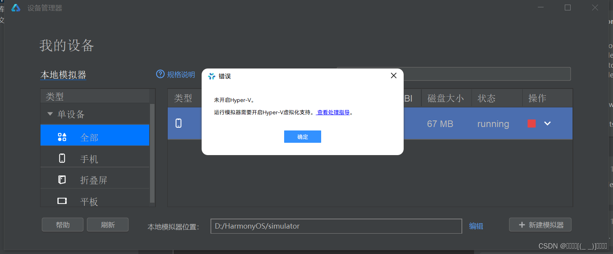
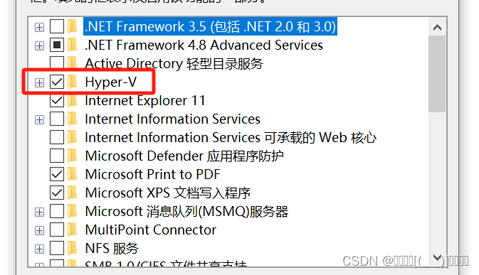
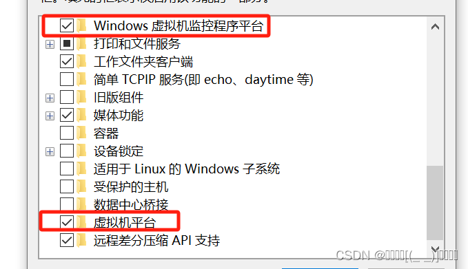

https://developer.huawei.com/consumer/cn/doc/harmonyos-guides-V5/ide-emulator-faqs-V5#section172728114485

参考文档

一些小伙伴在安装DevEco Studio模拟器的时候发现下载了但是运行不了，如下图：

这时候可以打开电脑的控制面板，打开程序，点击启用或关闭Windows功能。

把***Hyper-V\***、**Windows虚拟机监控平台** 和***虚拟机平台***勾选上。

 