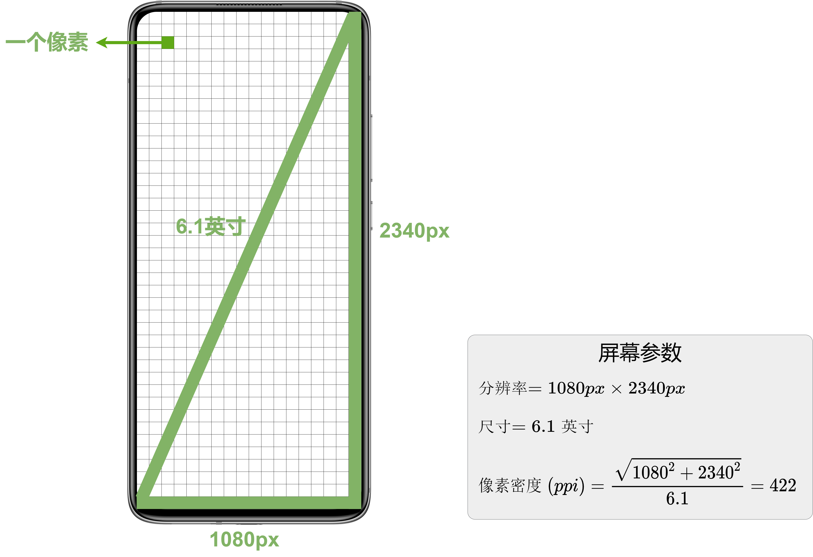
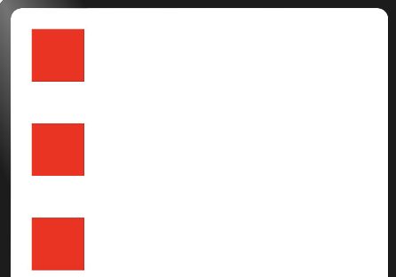
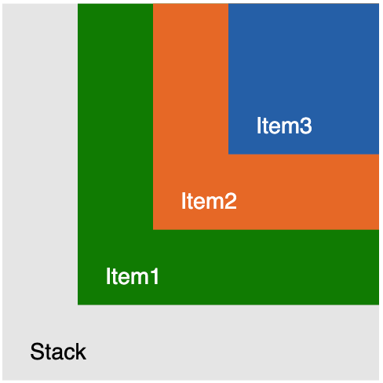
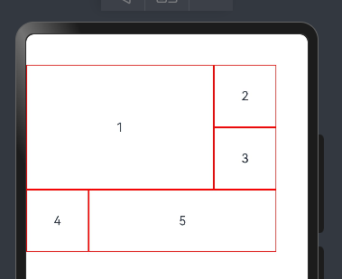

# 第6章-组件

## 1、组件化

在鸿蒙开发中，组件是构成界面的最小单元，我们所看到的界面，都是由众多组件组合而成的

所以编写界面其实就是组合组件的过程，ArkTS提供了很多的内置组件，例如：`Text`、`Button`、`Image`等等；

并且ArkTS还支持自定义组件，让开发者可根据具体需求自定义组件中的内容。


[内置组件的文档](https://developer.huawei.com/consumer/cn/doc/harmonyos-references-V5/arkui-declarative-comp-V5)


比如下面的这个功能，空调开关控制的界面。


我们需要一个变量控制页面的状态，开状态，和关状态展示的内容查不多，但是有些不一样。

我们就可以通过一个变量去影响界面。

然后通过三目运算符，去控制text的文本，和字体颜色，image的图片地址

```
@Entry
@Component
struct Page07_component {
  @State on: boolean =  false;
  build() {
    Column() {
      Row(){
          Text('空调开关')
          Text(this.on?'已开启':'已关闭').fontColor(this.on?Color.Green:Color.Red)
          Image(this.on?$r('app.media.on'):$r('app.media.off')).width(34).onClick(()=>{
            this.on=!this.on
          })
      }
    }
    .height('100%')
    .width('100%')
  }
}
```


考虑到上面功能可能复用，我们可以把这个功能封装成要给单独的组件！

#### 自定义组件

除去系统预置的组件外，ArkTS 还支持自定义组件。使用自定义组件，可使代码的结构更加清晰，并且能提高代码的**复用性**。

##### 组件定义语法

自定义组件的语法如下图所示


各部分语法说明如下：

- `**struct**`**关键字**

`struct`是**ArkTS**新增的用于自定义组件或者自定义弹窗的关键字。其声明的数据结构和**TS**中的类十分相似，可包含属性和方法。

- `**build**`**方法**

`build()`方法用于声明自定义组件的UI结构。

- **组件属性**

组件属性可用作自定义组件的参数，使得自定义组件更为通用。

- `**@Compnent**`**装饰器**

`@Component`装饰器用于装饰`struct`关键字声明的数据结构。`struct`被`@Component`装饰后才具备组件化的能力。

注： 装饰器是Typescript中的一种特殊语法，常用于装饰类、方法、属性，用于修改或扩展其原有的行为。

在学完自定义组件的语法之后，我们会发现前文案例中的每个页面实际上都是一个自定义组件。

##### 定义KWSwitch组件-直接定义到某一个页面组件的文件中

下面我们在页面中定义一个组：就是把想要重复利用的结构和逻辑都单独写到一个组件中


```
@Entry
@Component
struct Page07_component {
  build() {
    Column() {
      KTSwitch()
      KTSwitch()
    }
    .height('100%')
    .width('100%')
  }
}

@Component
struct KTSwitch{
  @State on: boolean =  false;
  build() {
    Row(){
      Text('空调开关')
      Text(this.on?'已开启':'已关闭').fontColor(this.on?Color.Green:Color.Red)
      Image(this.on?$r('app.media.on'):$r('app.media.off')).width(34).onClick(()=>{
        this.on=!this.on
      })
    }
  }
}
```

##### 使用KTSwitch组件

使用组件，像是调用函数一样

```
组件名()
```


但是和自定义组件的语法相比，ets文件中还会多出一个`@Entry`装饰器，那`@Entry`的作用又是啥呢？

解释：我们创建的页面就是一个ets文件，文件中可以定义多个组件，那么这个页面到底要展示那个组件呢，这就是`@Entry`的作用，被它装饰的组件，就是这个页面的要展示的内容


#### 

这个组件可以直接定义到某一个页面组件的文件中

先新建一个页面组件，，里面直接定义


#### 定义组件到一个单独的文件中（ets）

也可以像vue一样，定义到一个单独的文件中（ets）


##### 直接创建`KTSwitch`公共组件 ，并且导出

```
@Component
export   struct KTSwitch{
  @State on: boolean =  false;
  build() {
    Row(){
      Text('空调开关')
      Text(this.on?'已开启':'已关闭').fontColor(this.on?Color.Green:Color.Red)
      Image(this.on?$r('app.media.on'):$r('app.media.off')).width(34).onClick(()=>{
        this.on=!this.on
      })
    }
  }
}
```


##### 接着在页面导入使用就可以

```
import  {KTSwitch} from './KTSwitch'
@Entry
@Component
struct Page07_component {
  build() {
    Column() {
      KTSwitch()
    }
    .height('100%')
    .width('100%')
  }
}


```


#### 状态即属性，组件参数

组件内部的状态，也可以由外部调用组件的使用传入属性控制

##### 传参语法

```
组件名({属性：属性值，属性2：属性值2})
```

KWSwitch中我们定义了一个on状态，也可以由外部传入，需要注意的时候，传入的是一个对象，对象里面写属性


```
import  {KTSwitch} from './KTSwitch'
@Entry
@Component
struct Page07_component {
  build() {
    Column() {
      KTSwitch({on:true})
      KTSwitch({on:false})
    }
    .height('100%')
    .width('100%')
  }
}


```


#### 单向数据流-传入基本类型

如果父组件传入的属性(基础类型)，给子组件，子组件内部修改状态，但是不会响应外部状态

```
  @State f:boolean=true


  Text(`父组件中的 状态 state 属性 f:${this.f }`)
      // ***传入f的变量的值，Kt组件内部修改 flag变量
      // ？会不会响应外部的变量---不会--单向数据流
  KTSwitch({flag:this.f})
```


KTSwitch组件内部修改了 flag属性-但是不会响应外部的f

```

// 导出组件
@Component
export  struct KTSwitch {
  // 组件自己的状态---
  // 状态也是属性---也可以由外部传入（外部没有传入就用自己的内部的初始值）  组件名({属性名:属性值})
  //
  @State flag:boolean=false

  // 组件自己的结构
  build() {
    Row(){
      Column(){
        Text('空调开关')
        Text(this.flag?'已经开启':'已经完毕')
          .fontColor(this.flag?Color.Green:Color.Black)
          .fontSize(10)
      }
      Column(){
        Image($r('app.media.ic_contacts_delete1'))
          // .backgroundColor(Color.Green)
          .colorBlend(this.flag?Color.Green:Color.Black)
          .width(50)
          .onClick(()=>{
            // 修改了flag，内部会改，但是不会影响外部（单向数据量）
            this.flag = !this.flag
          })
      }
      Text('孩子中obj.num:'+this.obj.num.toString())

    }
  }


}
```


#### 单向数据流-传入对象类型

组件外部传入对象，内部修改了obj（@State），内部会改，会影响外部--传递的是对象的地址

```
  @State faObj:KtObj = new KtObj(1)


  Text('父级中对象 this.faObj.num:'+this.faObj.num)
   KTSwitch({
        //传入的属性
        flag:this.f,
        obj:this.faObj,
      
      })
```


```

// 导出组件
@Component
export  struct KTSwitch {
  // 组件自己的状态---
  // 状态也是属性---也可以由外部传入（外部没有传入就用自己的内部的初始值）  组件名({属性名:属性值})
  //
  @State flag:boolean=false
  @State obj:KtObj = new KtObj(10)


  // 组件自己的结构
  build() {
    Row(){
      Column(){
        Text('空调开关')
        Text(this.flag?'已经开启':'已经完毕')
          .fontColor(this.flag?Color.Green:Color.Black)
          .fontSize(10)
      }
      Column(){
        Image($r('app.media.ic_contacts_delete1'))
          // .backgroundColor(Color.Green)
          .colorBlend(this.flag?Color.Green:Color.Black)
          .width(50)
          .onClick(()=>{
            
            // 修改了obj，内部会改，会影响外部--传递的是对象的地址
            //孩子修改 传入的obj的num属性
            this.obj.num++
          })
      }
      Text('孩子中obj.num:'+this.obj.num.toString())

    }
  }


}

export  class KtObj{
  num:number=1

  constructor(n:number) {
    this.num = n
  }
}
```


#### 传入函数-事件

组件内部支持传入一个回调函数

```

// 导出组件
@Component
export  struct KTSwitch {
  // 组件自己的状态---
  // 状态也是属性---也可以由外部传入（外部没有传入就用自己的内部的初始值）  组件名({属性名:属性值})
  //
  @State flag:boolean=false
  @State obj:KtObj = new KtObj(10)

  // onAA:()=>void -onAA属性的类型是一个没有参数没有返回值的函数
  // onAA:()=>void = ()=>{}   --= ()=>{} 表示的onAA的初始值
  // onAA:()=>void = ()=>{}
  // 也可以省略类型
  onAA= (f:boolean)=>{}


  }

}

export  class KtObj{
  num:number=1

  constructor(n:number) {
    this.num = n
  }
}
```


组件内部适当的时候调用函数

```
Image($r('app.media.ic_contacts_delete1'))
          // .backgroundColor(Color.Green)
          .colorBlend(this.flag?Color.Green:Color.Black)
          .width(50)
          .onClick(()=>{
            // 修改了flag，内部会改，但是不会影响外部（单向数据量）
            this.flag = !this.flag

            // 事件2----调用onAA 函数，通知外部了--传入最新的flag的值
            this.onAA(this.flag)

          })
      }
```


外部使用的时候可以监听函数

```
   KTSwitch({
        //传入的属性
        flag:this.f,
        obj:this.faObj,
        // 组件的事件---1- 传入的也是属性--只不过属性值是函数
        onAA:(e:boolean)=>{
          console.log('外部的监听onAA 事件的函数')
          console.log(e+'')
          //修改 父中数据
          this.f = e
        }
      })
```


## 2、组件的通用属性

鸿蒙中的组件也是一个盒子，css中盒模型的属性基本都可以使用。

| 属性                                         | 描述                   |
| -------------------------------------------- | ---------------------- |
| width/height/backgroundColor                 | 宽度/高度/背景色       |
| padding/margin/border                        | 盒模型                 |
| position/offset/zIndex/shadow/linearGradient | 定位/Z序控制/阴影/渐变 |

#### 宽度/高度/背景色、盒模型，边框


```
     Text('hello')
        .width(100)
        .height(100)
        .backgroundColor('#000')
        .padding(20)//  .padding({left:10,right:10,top:10,bottom:10})
        .margin(20)//  .margin({left:10,right:10,top:10,bottom:10})
        .border({
          // width: { bottom: 10 }, //  width:5 四边
          width: 10, //  width:5 四边
          style: BorderStyle.Solid,
          color: Color.Red
        })
        // .borderRadius(20)
        .borderRadius({topLeft:10,topRight:10,bottomLeft:10,bottomRight:10})
        .backgroundImage($r('app.media.startIcon'))
```

#### 定位/Z序控制/阴影

```
Text(内容)
    .position({x: 水平偏移量, y: 垂直偏移量} )    // 绝对定位-偏移量取值参照父组件尺寸计算结果-脱离文档流
    .offset({x: 水平偏移量, y: 垂直偏移量} )      // 相对定位-组件相对原本的布局位置进行偏移-脱离文档流，原来的位置还留着
    .zIndex(2)
  .shadow({
    radius: 30,                             // 模糊半径
    type: ShadowType.COLOR,     // 阴影类型
    color: 'rgba(0,0,0,0.5)', // 阴影颜色
    offsetX: 0,                             // X 轴偏移
    offsetY: 0,                         // Y 轴偏移
    fill: false // 是否内部填充，值为布尔型，默认为flase
  })
 
```

#### 渐变

```
@Entry
@Component
struct Index {
  build() {
    // {
    //   angle?:  线性渐变的起始角度,
    //   direction?: 线性渐变的方向,
    //   colors: [[颜色1, 颜色1所处位置], [颜色2, 颜色2所处位置], ...],
    //   repeating?: 是否重复着色
    // }
    Column() {
      Text('线性渐变').width(100).height(50).backgroundColor(Color.Pink)
        .linearGradient({
          direction: GradientDirection.Right,
          colors: [['red', 0.1], ['#fc0', 0.8]]
        })

      // {
      //   center:  径向渐变的中心点坐标,
      //   radius: 径向渐变的半径,
      //   colors: [[颜色1, 颜色1所处位置], [颜色2, 颜色2所处位置], ...],
      //   repeating?: 是否重复着色
      // }
        Text('径向渐变')
        .width(100).height(50).backgroundColor(Color.Pink)
        .radialGradient({
          center: [40, 0],
          radius: 40,
          colors: [['red', 0.1], ['#fc0', 0.8]],
          // colors: [
          //   ['rgba(255, 255, 255, 0.6)', 0],
          //   ['rgba(255, 255, 255, 0)', 1]
          // ],
          repeating:true
        })
    }.padding(20)

  }
}
```

 

# 3. 常用内置组件

## 图片

### 

`Image`为图片组件，用于在应用中显示图片。

### 

`**Image**`组件的参数类型为`string | Resource | media.PixelMap`

下面对三种参数类型逐一进行介绍。

- `**string**`**类型**

`string`类型的参数用于通过路径的方式引用图片，包括本地图片和网络图片。


- - **本地图片**

`Image('images/demo.jpg')`**注意**：使用这种方式引入本地图片，需要将图片置于`ets`目录下，并且需要为`Image`组件提供图片相对于`ets`目录的路径。


- - **网络图片**

`Image('http://xxx/xxx.jpg')`**注意：**真机中运行的鸿蒙应用，访问网络图片需要配置网络访问权限，不过在预览器和模拟器中测试时不受限制。

权限配置

如果使用网络图片-》在模拟器或者是真机上（否则不显示），需要在  src/main文件夹下面的 module.json5做配置，开启网络请求权限


```
"requestPermissions": [
  {"name": "ohos.permission.INTERNET"}
],
```


- `**Resource**`**类型**

`Resource`类型的参数用于引入 **resources** 目录下的图片。

**resources**目录用于统一存放应用所需的各种资源，包括图片、音频、视频、文本等等。下面简要介绍 **resources** 目录的用法，首先需要了解 **resources** 的目录结构，如下


**resources** 目录下，用于存放资源的子目录有（**element**、**media**、**profile**）和**rawfile**。下面分别介绍

**element、media、profile**（**element**、**media**、**profile**）可存在多种版本，用于适配不同的环境，例如语言环境（**zh_CN**和**en_US**）。我们可以为上述每种环境各自准备一套资源文件，每种环境对应 **resources** 下的一个目录，例如上述的 **zh_CN** 和 **en_US**。我们在使用**resources**下的资源时，无需指定具体的环境版本，系统会根据设备所处的环境自动选择匹配的版本，例如当设备系统语言为中文时，则会使用**zh_CN**目录下的资源，为英文时，则会使用**en_US**目录下的资源。若没有与当前所处环境相对应的版本，则使用 **base** 目录下资源**。**各目录存储的具体资源如下**media**存放媒体资源，包括图片、音频、视频等文件。**element**存放用于描述页面元素的尺寸、颜色、样式等的各种类型的值，每种类型的值都定义在一个相应的 **JSON** 文件中。**profile**存放自定义配置文件。**rawfile**用于存储任意格式的原始文件，需要注意的是**rawfile**不会根据设备所处的环境去匹配不同的资源。


### 国际化

> 先修改`resources/base/element/string.json`
>
> ```
> {
> "name": "location",
> "value": "获取用户地理位置方便打车"
> }
> ```
>
> 接着创建`resources/en_US/element/string.json 追加一个对象，内容如下`
>
> ```
> {
> "name": "location",
> "value": "get location"
> }
> ```
>
> 接着创建`resources/zh_CN/element/string.json 追加一个对象，内容如下`
>
> ```
> {
> "name": "location",
> "value": "获取用户位置"
> }
> ```
>
> 最终读取配置内容 `Text($r('app.string.location'))`    这里 `app指element目录string是文件`
>
> 

最终app展示的时候会根据实际的语言环境展示不同的语言


**总结：**

**resources**目录下可用于存放图片的目录有**resources/\*/****media** 以及 **resources/****rawfile**，两个目录下图片的使用方式有所不同，下面逐一介绍

- - **media目录**

该目录下的资源，需要使用`$r('app.media.')`的方式引用。

**注意**：无需指定具体版本，系统会自动根据所处环境选择相应版本

例如上图中的**img.png**图片，可通过`$r('app.media.img')`引用。需要注意的是`$r()`的返回值即为 `**Resource**` 类型，因此可以直接将`$r('app.media.img')`作为 **Image** 组件的参数，例如`Image($r('app.media.img'))`。

- - **rawfile目录**

该目录下的资源，可通过`$rawfile('path/to/your/file')`的方式引用，文件的路径为相对于 **rawfile** 的路径。例如上图中的**icon.png**，须使用`$rawfile('icon.png)`引用。需要注意的是，`$rawfile()`的返回值也是**Resource**类型，因此其也可以直接作为 **Image** 组件的参数，如`Image($rawfile('icon.png))`。


### 常用属性

####  图片尺寸

图片尺寸可通过`width()`方法和`height()`方法进行设置。例如

```arkts
Image($r('app.media.img'))
	.width(100)
	.height(100)
```

两个方法可接收的参数类型均为`string | number `。

下面对三种参数类型逐一进行介绍。

- `**string**`**类型**

`string`类型的参数可为百分比，例如`'100%'`，或者为具体尺寸，例如`'100px'`。

具体尺寸的单位，常用的有两个，分别是`px`和`vp`，下面逐个介绍

**前置知识（屏幕参数）**想要理解上述尺寸单位，需要大家先掌握屏幕相关的几个参数**像素**屏幕显示的最小单位，屏幕上的一个小亮点称为一个像素。**分辨率**屏幕上横向和纵向的像素数量。**尺寸**屏幕对角线的长度，以英寸(`inches`)为单位。**像素密度**像素密度是每英寸屏幕上的像素数量，通常以`PPI`（Pixels Per Inch）表示，计算公式如下。较高的像素密度意味着在相同尺寸的屏幕上有更多的像素，从而提供更加清晰和细腻的图像。如下图所示

##### `px(Pixel)`

物理像素，以像素个数来定义图像尺寸。这种方式的弊端是，在不同像素密度的屏幕上，相同的像素个数对应的物理尺寸是不同的。这样一来就会导致我们的应用在不同设备上显示的尺寸可能不同。如下图所示


##### `vp(Virtual Pixel)`

为了保证一致的观感，我们可以使用虚拟像素作为单位。虚拟像素是一种可根据屏幕像素密度灵活缩放的单位。**1vp**相当于像素密度为**160ppi**的屏幕上的**1px**。在不同像素密度的屏幕上，HarmonyOS会根据如下公式将虚拟像素换算为对应的物理像素


根据上述公式，不难看出，使用虚拟像素作为单位时，同一尺寸，在像素密度低的屏幕上（单个像素的物理尺寸大），对应的物理像素会更少，相反在像素密度高的屏幕上（单个像素的物理尺寸小），对应的物理像素会更多。因此就能在不同像素密度的屏幕上，获得基本一致的观感了。如下图所示


- `**number**`**类型**

`number`类型的参数，默认以`vp`作为单位。

```
Image($r('app.media.555')).width(300)
```


####  图片缩放

当图片的原始大小与**Image**组件不同时，可通过`objectFit()`方法来设置图片的显示效果。该方法的参数类型为`ImageFit`枚举类型，可选的枚举值如下

| **名称**             | **描述**                                                     |
| -------------------- | ------------------------------------------------------------ |
| `ImageFit.None`      | 保持原有尺寸显示，不做任何缩放，超出显示区域的部分不显示。   |
| `ImageFit.Contain`   | 保持宽高比进行缩小或者放大，使得显示区域刚好包含整个图片。   |
| `ImageFit.Cover`     | 保持宽高比进行缩小或者放大，使得图片刚好完全覆盖显示区域。   |
| `ImageFit.Fill`      | 不保持宽高比进行放大缩小，使得图片充满显示区域。             |
| `ImageFit.ScaleDown` | 保持宽高比进行缩小或不变（不会放大），使得图片完全显示在显示区域内。 |
| `ImageFit.Auto`      | 自适应显示                                                   |

```
Image($r('app.media.555')).width(300).height(300).objectFit(ImageFit.Contain)
```


各选项的效果如下图所示


##  文本

### 

`**Text**`为文本组件，用于显示文字内容。

### 

`**Text**`组件的参数类型为`string | Resource`，下面分别对两个参数类型进行介绍：

- **string类型**

```
Text('我是一段文本')
```

- **Resource 类型**

`Resource`类型的参数用于引用 `resources/*/element`目录中定义的字符串，同样需要使用`$r()`引用。

例如`resources/base/element`目录中有一个`string.json`文件，内容如下

```
{  "string": [    {      "name": "greeting",      "value": "你好"    }  ] }
```

此时我们便可通过如下方式引用并显示`greeting`的内容。

```
Text($r('app.string.greeting'))
```

其他参考上文的国际化案例


###  常用属性

#### 字体大小

字体大小可通过`fontSize()`方法进行设置，该方法的参数类型为`string | number| Resource`，下面逐一介绍

- **string类型**

`string`类型的参数可用于指定字体大小的具体单位，例如`fontSize('100px')`，字体大小的单位支持`px`、`fp`。其中`fp(font pixel)`与`vp`类似，具体大小也会随屏幕的像素密度变化而变化。

- **number类型**

`number`类型的参数，默认以`fp`作为单位。


####  字体粗细

字体粗细可通过`fontWeight()`方法进行设置，该方法参数类型为`number | FontWeight | string`，下面逐一介绍

- **number类型**

`number`类型的取值范围是`[100,900]`，取值间隔为`100`，默认为`400`，取值越大，字体越粗。

- **FontWeight类型**

`FontWeight`为枚举类型，可选枚举值如下

名称描述`FontWeight.Lighter`字体较细。`FontWeight.Normal`字体粗细正常。`FontWeight.Regular`字体粗细正常。`FontWeight.Medium`字体粗细适中。`FontWeight.Bold`字体较粗。`FontWeight.Bolder`字体非常粗。

- **string类型**

`string`类型的参数仅支持`number`类型和`FontWeight`类型参数的字符串形式，例如例如`'100'`和`bold`。


#### 字体颜色

字体颜色可通过`fontColor()`方法进行设置，该方法参数类型为`Color | string | number | Resource`，下面逐一介绍

- **Color类型**

```
Color`为枚举类型，其中包含了多种常用颜色，例如`Color.Green
```

- **string类型**

```
string`类型的参数可用于设置 **rgb** 格式的颜色，具体写法可以为`'rgb(0, 128, 0)'`或者`'#008000'
```

- **number类型**

```
number`类型的参数用于使用16进制的数字设置 **rgb** 格式的颜色，具体写法为`0x008000
```


#### 文本对齐

文本对齐方向可通过`textAlign()`方法进行设置，该方法的参数为枚举类型`TextAlign`，可选的枚举值如下

| 名称               | 描述     |
| ------------------ | -------- |
| `TextAlign.Start`  | 首部对齐 |
| `TextAlign.Center` | 居中对齐 |
| `TextAlign.End`    | 尾部对齐 |

各选项效果如下


####  最大行数和超长处理

可使用`maxLines()`方法控制文本的最大行数，当内容超出最大行数时，可使用`textOverflow()`方法处理超出部分，该方法的参数类型为`{ overflow: TextOverflow }`，其中`TextOverflow`为枚举类型，可用枚举值有

| 名称                    | 描述                                     |
| ----------------------- | ---------------------------------------- |
| `TextOverflow.Clip`     | 文本超长时，进行裁剪显示。               |
| `TextOverflow.Ellipsis` | 文本超长时，显示不下的文本用省略号代替。 |

##### 案例

```
      Text('字体')
        .width(200)
        .height(100)
        .border({width:1})
        .fontSize(30)                          // 字体大小
        .fontColor(Color.Pink)             // 颜色枚举值 推荐
        .fontColor('#ff0000')          // 十六进制（HEX）颜色
        .fontStyle(FontStyle.Italic) // 字体样式
        .fontWeight(FontWeight.Bold) // 字体粗细
        // .lineHeight(40)                            // 行高
        .decoration({ type: TextDecorationType.Underline })  // 文本修饰符：Underline-下划线，LineThrough-删除线
        .textAlign(TextAlign.Center)   // 水平对齐
        .align(Alignment.Bottom)      // 垂直对齐
        // .textIndent(28)                               // 文本缩进
```

##### 文本溢出

maxLines配合textOverflow 的 Ellipsis

```
@Entry
@Component
struct Index {
  build() {
    Column() {
      Text('鸿蒙OS是华为公司开发的一款基于微内核、 耗时10年、4000多名研发人员投入开发、面向5G物联网、面向全场景的分布式操作系统。鸿蒙的英文名是HarmonyOS，意为和谐。 这个新的操作系统将打通手机、电脑、平板、电视、工业自动化控制、无人驾驶、车机设备 、智能穿戴统一成一个操作系统，并且该系统是面向下一代技术而设计的，能兼容全部安卓应用的所有Web应用。')
        .fontSize(14)
        .textIndent(28)
        .maxLines(2) 
        .textOverflow({ overflow: TextOverflow.Ellipsis }) // 超长文本裁剪略号代替
      // .textOverflow({ overflow: TextOverflow.Clip }) //   超长文本裁剪
      // .textOverflow({ overflow: TextOverflow.MARQUEE }) // 超长文本滚动显示
    }
  }
}
```

#### 


各选项效果如下


##  按钮


`Button`为按钮组件，通常用于响应用户的点击操作。


`Button`组件有两种使用方式，分别是**不包含子组件**和**包含子组件**，两种方式下，`Button` 组件所需的参数有所不同，下面分别介绍

- **不包含子组件**

不包含子组件时，`Button`组件所需的参数如下

```
Button(label?: string, options?: { type?: ButtonType, stateEffect?: boolean })
```

- - **label**

`label`为按钮上显示的文字内容。

- - **options.type**

`options.type`为按钮形状，该属性的类型`ButtonType`，可选的枚举值有

名称描述效果`ButtonType.Capsule`胶囊形状`ButtonType.Circle`圆形`ButtonType.Normal`普通形状

- - **options.stateEffect**

`options.stateEffect`表示是否开启点击效果，点击效果如下


```
      Button('登陆',{type:ButtonType.Normal})
      Button('登陆',{type:ButtonType.Capsule})
      Button('登陆',{type:ButtonType.Circle,stateEffect:true}).width(100)
```


- **包含子组件**

子组件会作为按钮上显示的内容，可以是图片、文字等。这种方式下，`Button`组件就不在需要`label`参数了，具体如下

```
Button(options?: {type?: ButtonType, stateEffect?: boolean})
```

```
    Button(){
        Row(){
          Text('登陆')
          Image($r('app.media.on')).height(30)
        }
      }.width(100).height(50)
```


###  常用属性

####  背景颜色

按钮的颜色可使用`backgroundColor()`方法进行设置，例如

```arkts
Button('绿色按钮').backgroundColor(Color.Green)
```

#### 边框圆角

按钮的边框圆角大小可使用`borderRadius()`方法进行设置，例如

```arkts
Button('圆角按钮', { type: ButtonType.Normal }).borderRadius(10)
```


###  常用事件

对于Button组件而言，最为常用的就是点击事件，可以通过`onClick()`方法为按钮绑定点击事件，该方法的参数为一个回调函数，当按钮被点击时，就会触发该回调函数，例如

```arkts
Button('点击事件').onClick(() => {
  console.log('我被点击了')
})
```


## 切换按钮


`**Toggle**`为切换按钮组件，一般用于两种状态之间的切换，例如下图中的蓝牙开关。


`Toggle`组件的参数定义如下

```arkts
Toggle(options: { type: ToggleType, isOn?: boolean })
```

- **type**

`type`属性用于设置`Toggle`组件的类型，可通过`ToggleType`枚举类型进行设置，可选的枚举值如下

名称描述效果`ToggleType.Switch`开关`ToggleType.Checkbox`复选框`ToggleType.Button`按钮

- **isOn**

`isOn`属性用于设置`Toggle`组件的状态


```
      Toggle({type:ToggleType.Checkbox,isOn:true})
      Toggle({type:ToggleType.Switch,isOn:true})
      Toggle({type:ToggleType.Button,isOn:true}){
        Text('按钮')
      }
```


### 常用属性：

####  选中状态背景色

可使用`selectedColor()`方法设置`Toggle`组件在选中（或打开）状态下的背景色，例如


####  Swtich滑块颜色

可使用设置`switchPointColor()`方法设置**Switch**类型的Toggle组件中的圆形滑块颜色，例如


```
      Toggle({type:ToggleType.Switch,isOn:true}).selectedColor(Color.Red).switchPointColor(Color.Black)

```


###  常用事件

`Toggle`组件常用的事件为**change**事件，每当`Toggle`组件的状态发生变化，就会触发`change`事件。开发者可通过`onChange()`方法为`Toggle`组件绑定**change**事件，该方法参数为一个回调函数，具体定义如下

```arkts
onChange(callback: (isOn: boolean) => void)
```

当`Toggle`组件的状态由关闭切换为打开时，`isOn`为`true`，从打开切换为关闭时，`isOn`为`false`。

```
      Toggle({type:ToggleType.Switch,isOn:this.flag}).onChange((isOn)=>{
        console.log(isOn+'')
        this.flag = isOn
      })
```

### 双向绑定$$

```
 Toggle({type:ToggleType.Switch,isOn:$$this.flag})
```

传入属性的时候加上$$跟上变量，switch状态改变，自动会修改flag变量的值


## 文本输入


`TextInput`为文本输入组件，用于接收用户输入的文本内容。

`TextInput`组件的参数定义如下

```typescript
TextInput(value?:{placeholder?: string|Resource , text?: string|Resource})
```

#### **placeholder**

`placeholder`属性用于设置无输入时的提示文本，效果如下


#### **text**

`text`用于设置输入框当前的文本内容，效果如下


```
   TextInput({placeholder:'请输入用户名'})
   TextInput({placeholder:'请输入用户名',text:'zhangsan'})
```


##### 双向绑定text $$

$$可以和状态双向绑定

```
 @State message: string = 'Hello World'; 	
```


```
 Text(this.message)
 TextInput({placeholder:'请输入用户名',text:$$this.message})
```


### 常用属性

####  输入框类型

可通过`type()`方法设置输入框的类型，该方法的参数为`InputType`枚举类型，可选的枚举值有

| **名称**             | **描述**       |
| -------------------- | -------------- |
| `InputType.Normal`   | 基本输入模式   |
| `InputType.Password` | 密码输入模式   |
| `InputType.Number`   | 纯数字输入模式 |


```
 TextInput({text:'zhang san'}).type(InputType.Password)
 TextInput({text:'23'}).type(InputType.Number)
```


#### 光标样式

可通过`caretColor()`方法设置光标的颜色

```
      TextInput({text:'zhang san'}).caretColor(Color.Red)

```


####  placeholder样式

可通过`placeholderFont()`和`placeholderColor()`方法设置 **placeholder** 的样式，其中`placeholderFont()`用于设置字体，包括字体大小、字体粗细等，`placeholderColor()`用于设置字体颜色

```
 TextInput({placeholder:'请输入'}).placeholderColor(Color.Green).placeholderFont({size:20,weight:500})
```


#### 文本样式

输入文本的样式可通过`fontSize()`、`fontWeight()`、`fontColor()`等通用属性方法进行设置。

```
      TextInput({text:'zhang san'}).fontColor(Color.Red).fontSize(39).fontWeight(FontWeight.Bold)

```


### 常用事件

####  change事件

每当输入的内容发生变化，就会触发 **change** 事件，开发者可使用`onChange()`方法为`TextInput`组件绑定 **change** 事件，该方法的参数定义如下

```typescript
onChange(callback: (value: string) => void)
```

其中`value`为最新内容。

```
      TextInput({text:'zhang san'}).onChange((v)=>{
        console.log(v)
      })

```


#### 焦点事件

焦点事件包括**获得焦点**和**失去焦点**两个事件，当输入框获得焦点时，会触发 **focus** 事件，失去焦点时，会触发 **blur** 事件，开发者可使用`onFocus()`和`onBlur()`方法为 `TextInput` 组件绑定相关事件，两个方法的参数定义如下

```typescript
onFocus( () => void)	
onBlur( () => void)
```


## 进度条

`Progress`为进度条组件，用于显示各种进度。


`Progress`组件的参数定义如下

```arkts
Progress(options: {value: number, total?: number, type?: ProgressType})
```

- **value**

`value`属性用于设置当前进度值。

- **total**

`total`属性用于设置总值。


```
     Progress({value: 10}).width(100)
      Progress({value: 10, type: ProgressType.Linear}).width(100)
      Progress({value: 10,total:200, type: ProgressType.Linear}).width(100)
```


- **type**

`type`属性用于设置进度条类型，可通过`ProgressType`枚举类型进行设置，可选的枚举值如下

名称描述效果`ProgressType.Linear`

线性样式`ProgressType.Ring`

环形无刻度样式`ProgressType.Eclipse`月食样式

`ProgressType.ScaleRing`环形有刻度样式

`ProgressType.Capsule`胶囊样式


```
      Progress({value: 10,total:200, type: ProgressType.Linear}).width(100)
      Progress({value: 10, type: ProgressType.Ring}).width(100)
      Progress({value: 10, type: ProgressType.Eclipse}).width(100)
      Progress({value: 10, type: ProgressType.ScaleRing}).width(100)
      Progress({value: 20, type: ProgressType.Capsule}).height(50).height(100)
```


###  常用属性

#### 进度条样式

可通过`style()`调整进度条的样式，例如进度条的宽度，该方法的参数类型定义如下

```typescript
style({strokeWidth?: string|number|Resource,scaleCount?: number,scaleWidth?: string|number|Resource})
```

- **strokeWidth**

`strokeWidth`属性用于设置进度条的宽度，默认值为`4vp`。该属性可用于`Linear`、`Ring`、`ScaleRing`三种类型，效果如下

```
      Progress({value: 10,type:ProgressType.ScaleRing}).style({strokeWidth:10})
      Progress({value: 10,type:ProgressType.ScaleRing}).style({strokeWidth:20})
```


- **scaleCount**

`scaleCount`属性用于设置`ScaleRing`的刻度数，默认值为`120`。效果如下


- **scaleWidth**

`scaleCount`属性用于设置`ScaleRing`的刻度线的宽度，默认值为`2vp`。效果如下

```
      Progress({value: 10,type:ProgressType.ScaleRing}).style({scaleCount:10,strokeWidth:20})
      Progress({value: 10,type:ProgressType.ScaleRing}).style({scaleCount:20,strokeWidth:20})
      Progress({value: 10,type:ProgressType.ScaleRing}).style({scaleWidth:4,scaleCount:10,strokeWidth:20})

```


####  进度条颜色

进度条的颜色可通过`color()`和`backgroundColor()`方法进行设置，其中`color()`用于设置前景色，`backgroundColor()`用于设置背景色，例如

```
Progress({value: 10}).width(100).color(Color.Red).backgroundColor(Color.Black)
```


##  弹窗

弹窗是移动应用中常见的一种用户界面元素，常用于显示一些重要的信息、提示用户进行操作或收集用户输入。ArkTS提供了多种内置的弹窗供开发者使用，除此之外还支持自定义弹窗，来满足各种不同的需求。

### 消息提示

#### 

**Toast**（消息提示），常用于显示一些简短的消息或提示，一般会在短暂停留后自动消失。


可使用`@ohos.promptAction`模块中的`showToast()`方法显示 **Toast** 提示，使用时需要先导入`@ohos.promptAction`模块，如下

```typescript
import promptAction from '@ohos.promptAction'
```

`showToast()`方法的参数定义如下

```typescript
showToast(options: { message: string | Resource,duration?: number,bottom?: string | number})
```

- **message**

`message`属性用于设置提示信息

- **duration**

`duration`属性用于设置提示信息停留时长，单位为毫秒，取值范围是[1500,10000]

- **bottom**

`bottom`属性用于设置提示信息到底部的距离


```
   promptAction.showToast({
          message:'hello',
         
          duration:2000,
          bottom:200
        })
```


也可以弹出对话框

```
 promptAction.showDialog({
          title: 'Title Info',
          message: 'Message Info',
          buttons: [
            {
              text: 'button1',
              color: '#000000'
            },
            {
              text: 'button2',
              color: '#000000'
            }
          ],
        })
          .then(data => {
            console.info('showDialog success, click button: ' + data.index);
          })
          .catch((err:Error) => {
            console.info('showDialog error: ' + err);
          })
```


### 警告对话框

#### 

**AlertDialog**（警告对话框）用于向用户发出警告或确认操作的提示，确保用户在敏感操作前进行确认。


可使用全局方法`AlertDialog.show()`显示警告对话框，具体用法可参考相关案例或者[官方文档](https://developer.huawei.com/consumer/cn/doc/harmonyos-references-V2/ts-methods-alert-dialog-box-0000001478341185-V2)。


```
AlertDialog.show(
          {
            title: 'title',
            message: 'text',
            autoCancel: true,
            alignment: DialogAlignment.Bottom,
            gridCount: 5,//最大5，最小1
            offset: { dx: 0, dy: -20 },
            primaryButton: {
              value: 'cancel',
              action: () => {
                console.info('Callback when the first button is clicked')
              }
            },
            secondaryButton: {
              value: 'ok',
              action: () => {
                console.info('Callback when the second button is clicked')
              }
            },
            cancel: () => {
              console.info('Closed callbacks')
            }
          }
        )
```


###  操作列表弹框

#### 

**ActionSheet**（操作列表弹窗）用于提供一组选项给用户选择，用户从中选择后，可执行相应的操作。

可使用全局方法`ActionSheet.show()`显示操作列表弹窗，具体用法可参考相关案例或者[官方文档](https://developer.huawei.com/consumer/cn/doc/harmonyos-references-V2/ts-methods-action-sheet-0000001478061737-V2)。

```
 ActionSheet.show({
          message:'提示内容',
          title:'提示标题',
          confirm:{
            value:'取消',
            action:()=>{
              console.log('取消回调')
            }
          },
          sheets:[{
            title:'操作1',
            icon:$r('app.media.app_icon'),
            action:()=>{
              console.log('操作1回调')
            }
          },{
            icon:$r('app.media.app_icon'),
            title:'操作2',
            action:()=>{
              console.log('操作2回调')
            }
          }]
        })
```


#### 


###  选择器弹窗


选择器弹窗用于让用户从一个列表中选择一个具体的值。`ArkTS`内置了多种选择器弹窗，例如文本选择器、日期选择器、时间选择器等等

https://developer.huawei.com/consumer/cn/doc/harmonyos-references-V5/ts-methods-timepicker-dialog-V5


| 类型                                       | 文档地址                                                     |
| ------------------------------------------ | ------------------------------------------------------------ |
| **TextPickerDialog（文本滑动选择器弹窗）** | [官方文档](https://developer.huawei.com/consumer/cn/doc/harmonyos-references-V2/ts-methods-textpicker-dialog-0000001427584912-V2) |
| **DatePickerDialog（日期滑动选择期弹窗）** | [官方文档](https://developer.huawei.com/consumer/cn/doc/harmonyos-references-V2/ts-methods-datepicker-dialog-0000001427902500-V2) |
| **TimePickerDialog（时间滑动选择器弹窗）** | [官方文档](https://developer.huawei.com/consumer/cn/doc/harmonyos-references-V2/ts-methods-timepicker-dialog-0000001428061780-V2) |


```
// xxx.ets
@Entry
@Component
struct TextPickerDialogExample {
  @State select: number = 2
  private fruits: string[] = ['apple1', 'orange2', 'peach3', 'grape4', 'banana5']

  build() {
    Row() {
      Column() {
        Button("TextPickerDialog")
          .margin(20)
          .onClick(() => {
            TextPickerDialog.show({
              range: this.fruits,
              selected: this.select,
              onAccept: (value: TextPickerResult) => {
                // 设置select为按下确定按钮时候的选中项index，这样当弹窗再次弹出时显示选中的是上一次确定的选项
                this.select = value.index
                console.info("TextPickerDialog:onAccept()" + JSON.stringify(value))
              },
              onCancel: () => {
                console.info("TextPickerDialog:onCancel()")
              },
              onChange: (value: TextPickerResult) => {
                console.info("TextPickerDialog:onChange()" + JSON.stringify(value))
              }
            })
          })
      }.width('100%')
    }.height('100%')
  }
}
```


 ```
// xxx.ets
@Entry
@Component
struct DatePickerDialogExample {
  selectedDate: Date = new Date("2010-1-1")

  build() {
    Column() {
      Button("DatePickerDialog")
        .margin(20)
        .onClick(() => {
          DatePickerDialog.show({
            start: new Date("2000-1-1"),
            end: new Date("2100-12-31"),
            selected: this.selectedDate,
            onAccept: (value: DatePickerResult) => {
              // 通过Date的setFullYear方法设置按下确定按钮时的日期，这样当弹窗再次弹出时显示选中的是上一次确定的日期
              this.selectedDate.setFullYear(value.year, value.month, value.day)
              console.info("DatePickerDialog:onAccept()" + JSON.stringify(value))
            },
            onCancel: () => {
              console.info("DatePickerDialog:onCancel()")
            },
            onChange: (value: DatePickerResult) => {
              console.info("DatePickerDialog:onChange()" + JSON.stringify(value))
            }
          })
        })

      Button("Lunar DatePickerDialog")
        .margin(20)
        .onClick(() => {
          DatePickerDialog.show({
            start: new Date("2000-1-1"),
            end: new Date("2100-12-31"),
            selected: this.selectedDate,
            lunar: true,
            onAccept: (value: DatePickerResult) => {
              this.selectedDate.setFullYear(value.year, value.month, value.day)
              console.info("DatePickerDialog:onAccept()" + JSON.stringify(value))
            },
            onCancel: () => {
              console.info("DatePickerDialog:onCancel()")
            },
            onChange: (value: DatePickerResult) => {
              console.info("DatePickerDialog:onChange()" + JSON.stringify(value))
            }
          })
        })
    }.width('100%')
  }
}
 ```


```
// xxx.ets
@Entry
@Component
struct TimePickerDialogExample {
  private selectTime: Date = new Date('2020-12-25T08:30:00')

  build() {
    Column() {
      Button("TimePickerDialog 12小时制")
        .margin(20)
        .onClick(() => {
          TimePickerDialog.show({
            selected: this.selectTime,
            onAccept: (value: TimePickerResult) => {
              // 设置selectTime为按下确定按钮时的时间，这样当弹窗再次弹出时显示选中的为上一次确定的时间
              this.selectTime.setHours(value.hour, value.minute)
              console.info("TimePickerDialog:onAccept()" + JSON.stringify(value))
            },
            onCancel: () => {
              console.info("TimePickerDialog:onCancel()")
            },
            onChange: (value: TimePickerResult) => {
              console.info("TimePickerDialog:onChange()" + JSON.stringify(value))
            }
          })
        })
      Button("TimePickerDialog 24小时制")
        .margin(20)
        .onClick(() => {
          TimePickerDialog.show({
            selected: this.selectTime,
            useMilitaryTime: true,
            onAccept: (value: TimePickerResult) => {
              this.selectTime.setHours(value.hour, value.minute)
              console.info("TimePickerDialog:onAccept()" + JSON.stringify(value))
            },
            onCancel: () => {
              console.info("TimePickerDialog:onCancel()")
            },
            onChange: (value: TimePickerResult) => {
              console.info("TimePickerDialog:onChange()" + JSON.stringify(value))
            }
          })
        })
    }.width('100%')
  }
}
```


### 自定义弹窗


当现有组件不满足要求时，可考虑自定义弹窗，自定义弹窗允许开发者自定义弹窗内容和样式。例如


显示自定义弹窗需要使用`CustomDialogController`，具体用法可参考相关案例或者[官方文档](https://developer.huawei.com/consumer/cn/doc/harmonyos-guides-V2/arkts-common-components-custom-dialog-0000001450754206-V2)。


```

@CustomDialog
struct CustomDialogExample {
  //可选属性，加问号，否则需要本地初始化
  controller?: CustomDialogController
  build() {
    Column() {
      Text('我是内容')
        .fontSize(20)
        .margin({ top: 10, bottom: 10 })
      Button('取消').onClick(()=>{
        this.controller?.close()

      })
    }
  }
}
@Entry
@Component
struct DialogExample {
  dialogController: CustomDialogController = new CustomDialogController({
    builder: CustomDialogExample(),
  })
 build() {
   Flex({justifyContent:FlexAlign.Center}){
     Button('click me')
       .onClick(() => {
         this.dialogController.open()
       })
   }.width('100%')
 }
}
```


## 4-组件内部样式复用


当多个组件具有相同的样式时，若每个组件都单独设置，将会有大量的重复代码。为避免重复代码，开发者可使用`@Styles`或者`@Extend`装饰器将多条样式设置提炼成一个方法，然后直接在各组件声明的位置进行调用，这样就能完成样式的复用。


### @styles

- @Styles可以定义在组件内或全局，在全局定义时需在方法名前面添加function关键字，组件内定义时则不需要添加function关键字。

说明

只能在当前文件内使用，不支持export。类似函数，但是不能传参数。

由于不能传参数，因此如果复用的事件处理函数中需要使用this，此时就必须定义在组件内。


```
// 全局
@Styles
function  MyButtonStyle()
{
  .width(100)
  .height(40)
  .borderRadius(10)
  .backgroundColor(Color.Red)
}


```

使用

```
@Entry
@Component
struct Demo07_styles {
  @State message: string = 'Hello World';

  build() {
    Column() {
      Button('按钮').MyButtonStyle()
      Button('按钮').MyButtonStyle()

    }
    .height('100%')
    .width('100%')
  }
}
```


```
// 在组件内
@Entry
@Component
struct Demo07_styles {
  @State message: string = 'Hello World';

  build() {
    Column() {
  
  	//使用
      Button('按钮').MyButtonStyle2()

    }
    .height('100%')
    .width('100%')
  }
	//定义
  @Styles MyButtonStyle2()
  {
    .width(100)
    .height(40)
    .borderRadius(10)
    .backgroundColor(Color.Red)
  }

}
```


### @Extend

@Extend，用于扩展原生组件样式。

- 和@Styles不同，@Extend支持封装指定组件的私有属性

- 和@Styles不同，@Extend仅支持在全局定义，不支持在组件内部定义。

  只能在当前文件内使用，不支持export。

  ```typescript
  // @Extend(Text)可以支持Text的私有属性fontColor
  @Extend(Text) 
  function fancy () {
    .fontColor(Color.Red).height(100)
  }
  // superFancyText可以调用预定义的fancy
  @Extend(Text) function superFancyText(size:number) {
    .fontSize(size)
    .fancy()
  }
  
  @Entry
  @Component
  struct Demo08_extend {
  
  
    build() {
      Column() {
        Text('hello').fancy()
        Text('hello').superFancyText(20)
  
      }
      .height('100%')
      .width('100%')
    }
  }
  ```


## 5-组件内部-结构复用`@Builder`

当页面有多个相同的UI结构时，若每个都单独声明，同样会有大量重复的代码。为避免重复代码，可以将相同的UI结构提炼为一个自定义组件，完成UI结构的复用


除此之外，ArkTS还提供了一种更轻量的UI结构复用机制`@Builder`方法，开发者可以将重复使用的UI元素抽象成一个`@Builder`方法，该方法可在`build()`方法中调用多次，以完成UI结构的复用。


为了简化语言，我们将@Builder装饰的函数也称为“自定义构建函数”


`@Builder`方法同样可以定义在组件内或者全局


[文档](https://developer.huawei.com/consumer/cn/doc/harmonyos-guides-V13/arkts-builder-V13)


### 组件内

```
@Entry
@Component
struct Demo10_build {
  @State message: string = 'Hello World';

  //定义UI结构
  @Builder
  compButtonBuilder(icon: Resource, text: string){
    Row(){
      Image(icon).height(20)
      Text(text)
    }
  }

  build() {
    Column(){
      //调用UI结构
      this.compButtonBuilder($r('app.media.app_icon'),'登录')
      this.compButtonBuilder($r('app.media.startIcon'),'注册')
    }
    .height('100%')
    .width('100%')
  }
}
```


### 全局

```
//定义UI结构
@Builder
function  compButtonBuilder2(icon: Resource, text: string){
  Row(){
    Image(icon).height(20)
    Text(text)
  }
}

@Entry
@Component
struct Demo10_build {


  build() {
    Column(){
      //调用UI结构
      compButtonBuilder2($r('app.media.startIcon'),'注册')
    }
    .height('100%')
    .width('100%')
  }
}
```


### **注意**

1. **组件内**的`@Builder`方法可通过`this`访问当前组件的属性和方法，而**全局**的`@Builder`方法则不能
2. **组件内**的`@Builder`方法只能用于当前组件，**全局**的`@Builder`方法导出（`export`）后，可用于整个应用。

### 和自定义组件的区别

`@Builder`方法和自定义组件虽然都可以实现UI复用的效果，但是两者还是有着本质的区别的，其中最为显著的一个区别就是自定义组件可以定义自己的状态变量，而`@Builder`方法则不能


### 参数传递规则

自定义构建函数的参数传递有[按值传递](https://developer.huawei.com/consumer/cn/doc/harmonyos-guides-V13/arkts-builder-V13#按值传递参数)和[按引用传递](https://developer.huawei.com/consumer/cn/doc/harmonyos-guides-V13/arkts-builder-V13#按引用传递参数)两种，均需遵守以下规则：

- 参数的类型必须与参数声明的类型一致，不允许undefined、null和返回undefined、null的表达式。
- 在@Builder修饰的函数内部，不允许改变参数值（纯函数）。
- @Builder内UI语法遵循[UI语法规则](https://developer.huawei.com/consumer/cn/doc/harmonyos-guides-V13/arkts-create-custom-components-V13#build函数)。
- 只有传入一个参数，且参数需要直接传入对象字面量才会按引用传递该参数，其余传递方式均为按值传递。


#### 按值传递参数

调用@Builder装饰的函数默认按值传递。当传递的参数为状态变量时，状态变量的改变不会引起@Builder方法内的UI刷新。所以当使用状态变量的时候，推荐使用[按引用传递](https://developer.huawei.com/consumer/cn/doc/harmonyos-guides-V13/arkts-builder-V13#按引用传递参数)。

```typescript
@Builder function overBuilder(paramA1: string) {
  Row() {
    Text(`UseStateVarByValue: ${paramA1} `)
  }
}
@Entry
@Component
struct Parent {
  @State label: string = 'Hello';
  build() {
    Column() {
      overBuilder(this.label)
    }
  }
}
```


#### 按引用传递参数

按引用传递参数时，传递的参数可为状态变量，且状态变量的改变会引起@Builder方法内的UI刷新。

```typescript
class Tmp {
  paramA1: string = '';
}

@Builder function overBuilder(params: Tmp) {
  Row() {
    Text(`UseStateVarByReference: ${params.paramA1} `)
  }
}
@Entry
@Component
struct Parent {
  @State label: string = 'Hello';
  build() {
    Column() {
      // 在父组件中调用overBuilder组件时，
      // 把this.label通过引用传递的方式传给overBuilder组件。
      overBuilder({ paramA1: this.label })
      Button('Click me').onClick(() => {
        // 单击Click me后，UI文本从Hello更改为ArkUI。
        this.label = 'ArkUI';
      })
    }
  }
}
```


# 6-@BuilderParam


`@BuilderParam`用于装饰自定义组件（struct）中的属性，其装饰的属性可作为一个UI结构的**占位符**，待创建该组件时，可通过参数为其传入具体的内容。（其作用类似于Vue框架中的slot）


#### 定义组件-内的插槽

定义组件，使用 @BuilderParam 属性，占位

@BuilderParam属性-  类型为一个函数，并要描述UI结构，定义的时候要给一个初始值，否则会报错

```
@Builder  function  MyBuilderFunction(): void {
}
// 自定义组件
@Component
struct Container {
  //@BuilderParam属性-  类型为一个函数，并要描述UI结构，定义的时候要给一个初始值，否则会报错
  @BuilderParam content: () => void //类型是一个函数
    = MyBuilderFunction //这里给一个默认值，空的构建函数
  build() {
    Column() {
      Text('头部')
      //占位符
      this.content();
      
      Text('尾部')

    }
  }
}
```


#### 使用组件-插入UI结构

如果一个组件中**只定义了一个**`@BuilderParam`属性，那么创建该组件时，也可直接通过**"子组件"**的方式传入具体的UI结构

```
//页面组件
@Entry
@Component
struct Test{
  build() {
    Column(){
      //使用组件
      Container(){
      	//子组件
        Text('插入的内容')//这是插入的内容，会插入到 上面组件Container的唯一的 @BuilderParam属性里面
      }
      //使用组件
      Container(){
        Image($r('app.media.app_icon')).height(50)//这是插入的内容，会插入到 上面组件Container的唯一的 @BuilderParam属性里面
      }
    }
  }
}
```

完整代码

```
@Builder  function  MyBuilderFunction(): void {
}
// 自定义组件
@Component
struct Container {
  //@BuilderParam属性-  类型为一个函数，并要描述UI结构，定义的时候要给一个初始值，否则会报错
  @BuilderParam content: () => void //类型是一个函数
    = MyBuilderFunction //这里给一个默认值，空的构建函数
  build() {
    Column() {
      Text('其他内容')
      //占位符
      this.content();
      Button('其他内容')
    }
  }
}
//页面组件
@Entry
@Component
struct Test{
  build() {
    Column(){
      //使用组件-类似于默认插槽
      Container(){
        Text('插入的内容')//这是插入的内容，会插入到 上面组件Container的唯一的 @BuilderParam属性里面
      }
      //使用组件-类似于默认插槽
      Container(){
        Image($r('app.media.app_icon')).height(50)//这是插入的内容，会插入到 上面组件Container的唯一的 @BuilderParam属性里面
      }
    }
  }
}
```


### 也可以这样使用-具名插槽

传入的必须是一个自定义构造函数

```
 //类似于具名插槽
 Container({content:this.myBuild})
```

案例

```
//页面组件
@Entry
@Component
struct Test{

  //自定义构造函数
  @Builder myBuild(){
    Text('测试')
  }

  build() {
    Column(){
  
      //类似于具名插槽，传入构造函数
      Container({content:this.myBuild})
    }
  }
}
```


# 7-常用布局组件-----------

#### 

布局是指对页面组件进行排列和定位的过程，其目的是有效地组织和展示页面内容，会涉及到组件的大小、位置以及它们之间的相互关系等等。


###  布局基础-盒模型

在鸿蒙应用中，页面上的每个组件都可以看做是一个矩形的盒子，这个盒子包含了**内容区域**（content）、**边框**（border）、**内边距**（padding）和**外边距**（margin），各部分内容如下图所示


其中**margin**、**padding**和**border**均可使用同名的属性方法进行设置，各方法定义如下

- **margin**

`margin(value: { top?:Length, right?:Length, bottom?:Length, left?:Length } |  Length )`

```
@Entry
@Component
struct Demo13_box_model {
  build() {
    Column() {
    
    }
    .width(100)
    .height(100)
    .backgroundColor(Color.Red)
    .margin({top:100,left:10})

  }
}
```


**说明：**`Length`=`string | number | Resource`当参数类型为`Length`时，四个方向的边距同时生效

```
@Entry
@Component
struct Demo13_box_model {
  build() {
    Column() {
    	Text('hello')
    }
    .width(100)
    .height(100)
    .backgroundColor(Color.Red)
    // .margin({top:100,left:10})
    .margin(100)
  }
}
```


- **padding**

```
padding(value: { top?:Length, right?:Length, bottom?:Length, left?:Length } |  Length )
```

```
@Entry
@Component
struct Demo13_box_model {
  build() {
    Column() {
      Text('hello').backgroundColor(Color.Yellow)
    }
    .width(100)
    .height(100)
    .backgroundColor(Color.Green)
    // .margin({top:100,left:10})
    // .margin(100)
    // .padding(40)
    .padding({top:20})
    .border({width:2})

  }

}
```


- 
- **border**

```
border(value: {width?:Length, color?:ResourceColor, radius?:Length, style?:BorderStyle })
```

各属性含义如下

- - **width**

`width`属性表示边框宽度

- - **color**

`color`属性表示边框颜色

- - **radius**

`radius`属性表示边框圆角半径

- - **style**

`style`属性表示边框样式，可通过`BorderStyle`这一枚举类型进行设置，可选的枚举值有

名称描述效果`BorderStyle.Dotted`显示为一系列圆点`BorderStyle.Dashed`显示为一系列短的方形虚线`BorderStyle.Solid`显示为一条实线

```
   .border({width:2,style:BorderStyle.Solid,radius:'50%'})
    .border({width:2,style:BorderStyle.Solid,radius:'20'})
        .border({width:2,style:BorderStyle.Solid,radius:'20',color:Color.Red})

```


## 线性布局（Column/Row）


线性布局（`LinearLayout`）是开发中最常用的布局，可通过容器组件`Column`和`Row`构建，其子组件会在垂直或者水平方向上进行线性排列，具体效果如下图所示

|  |  |
| ---------------------------------------------- | ---------------------------------------------- |
|                                                |                                                |

线性布局（LinearLayout）是开发中最常用的布局，通过线性容器Row和Column构建。线性布局是其他布局的基础，其子元素在线性方向上（水平方向和垂直方向）依次排列。线性布局的排列方向由所选容器组件决定，Column容器内子元素按照垂直方向排列，Row容器内子元素按照水平方向排列。根据不同的排列方向，开发者可选择使用Row或Column容器创建线性布局

### Row容器内子元素排列示意图+基本使用


```typescript
@Styles function blockStyle () {
  .width(50)
  .height(50)
  .backgroundColor(Color.Red)
  .margin(20)
}


@Entry
@Component
struct LearnCol {

  build() {
    Row() {
      Text().blockStyle()
      Text().blockStyle()
      Text().blockStyle()
    }
  }
}
```


### Column容器内子元素排列示意图+基本使用



```typescript
@Styles function blockStyle () {
  .width(50)
  .height(50)
  .backgroundColor(Color.Red)
  .margin(20)
}


@Entry
@Component
struct LearnCol {

  build() {
    Column() {
      Text().blockStyle()
      Text().blockStyle()
      Text().blockStyle()
    }
  }
}
```

### 布局子元素在排列方向上的间距（space）

> 在布局容器内，可以通过space属性设置排列方向上子元素的间距，使各子元素在排列方向上有等间距效果。

### Column容器内排列方向上的间距


```typescript
@Styles function blockStyle() {
  .width(50)
  .height(50)
  .backgroundColor(Color.Red)
}


@Entry
@Component
struct LearnCol {
  build() {
    Column({ space: 20 }) {
      // 每个元素间隔20
      Text().blockStyle()
      Text().blockStyle()
      Text().blockStyle()
    }
    .height('100%')
    .width('100%')
  }
}
```

### Row容器内排列方向上的间距


```typescript
@Styles function blockStyle() {
  .width(50)
  .height(50)
  .backgroundColor(Color.Red)
}


@Entry
@Component
struct LearnCol {
  build() {
    Row({ space: 35 }) {
      // 每个元素间隔20
      Text().blockStyle()
      Text().blockStyle()
      Text().blockStyle()
    }
    .height('100%')
    .width('100%')
  }
}
```

### 布局子元素在交叉轴上的对齐方式（alignItems）

在布局容器内，可以通过alignItems属性设置子元素在交叉轴（排列方向的垂直方向）上的对齐方式。且在各类尺寸屏幕中，表现一致。其中，交叉轴为垂直方向时，取值为VerticalAlign类型，水平方向取值为HorizontalAlign。
alignSelf属性用于控制单个子元素在容器交叉轴上的对齐方式，其优先级高于alignItems属性，如果设置了alignSelf属性，则在单个子元素上会覆盖alignItems属性

#### VerticalAlign类型

| 名称   | 描述                     |
| ------ | ------------------------ |
| Top    | 顶部对齐。               |
| Center | 居中对齐，默认对齐方式。 |
| Bottom | 底部对齐。               |

#### HorizontalAlign类型

| 名称   | 描述                     |
| ------ | ------------------------ |
| Start  | 按照语言方向起始端对齐。 |
| Center | 居中对齐，默认对齐方式。 |
| End    | 按照语言方向末端对齐。   |

#### Column容器内子元素在水平方向上的排列

```typescript
@Styles function blockStyle() {
  .width(50)
  .height(50)
  .backgroundColor(Color.Red)
}


@Entry
@Component
struct LearnCol {
  build() {
    Column({space: 20}) {
      Column() {
      }.blockStyle()

      Column() {
      }.blockStyle()

      Column() {
      }.blockStyle()
      /**
       * 使用alignItems设置水平方向为竖向
       * 使用不同的枚举切换不同的对齐方式
       */
    }.width('100%').alignItems(HorizontalAlign.Start).backgroundColor('rgb(242,242,242)')
  }
}
```

#### Row容器内子元素在垂直方向上的排列

```typescript
@Styles function blockStyle() {
  .width(50)
  .height(50)
  .backgroundColor(Color.Red)
}


@Entry
@Component
struct LearnCol {
  build() {
    Row({space: 20}) {
      Column() {
      }.blockStyle()

      Column() {
      }.blockStyle()

      Column() {
      }.blockStyle()
      /**
       * 使用alignItems设置水平方向为竖向
       * 使用不同的枚举切换不同的对齐方式
       * 注意设置高度
       */
    }.height('100%').alignItems(VerticalAlign.Bottom).backgroundColor('rgb(242,242,242)')
  }
}
```


#### 使用alignSelf设置单个元素

```typescript
@Styles function blockStyle() {
  .width(50)
  .height(50)
  .backgroundColor(Color.Red)
}


@Entry
@Component
struct LearnCol {
  build() {
    Row({space: 20}) {
      Column() {
      }.blockStyle()

      /**
       * 要使用ItemAlign的枚举
       */
      Column() {
      }.blockStyle().alignSelf(ItemAlign.Start)

      Column() {
      }.blockStyle()
      /**
       * 使用alignItems设置水平方向为竖向
       * 使用不同的枚举切换不同的对齐方式
       * 注意设置高度
       */
    }.height('100%').alignItems(VerticalAlign.Bottom).backgroundColor('rgb(242,242,242)')
  }
}
```

### 布局子元素在主轴上的排列方式（justifyContent）

> 相关枚举可以直接通过类型文件查看

#### Row容器内子元素在主轴上的排列

```typescript
@Styles function blockStyle() {
  .width(50)
  .height(50)
  .backgroundColor(Color.Red)
}


@Entry
@Component
struct LearnCol {
  build() {
    Row({space: 20}) {
      Column() {
      }.blockStyle()

      /**
       * 要使用ItemAlign的枚举
       */
      Column() {
      }.blockStyle().alignSelf(ItemAlign.Start)

      Column() {
      }.blockStyle()
      /**
       * 使用justifyContent设置排列
       * 注意设置宽度
       */
    }.width('100%').justifyContent(FlexAlign.SpaceBetween).backgroundColor('rgb(242,242,242)')
  }
}
```

#### Column容器内子元素在水平方向上的排列

```typescript
@Styles function blockStyle() {
  .width(50)
  .height(50)
  .backgroundColor(Color.Red)
}


@Entry
@Component
struct LearnCol {
  build() {
    Column({space: 20}) {
      Column() {
      }.blockStyle()

      /**
       * 要使用ItemAlign的枚举
       */
      Column() {
      }.blockStyle().alignSelf(ItemAlign.Start)

      Column() {
      }.blockStyle()
      /**
       * 使用justifyContent设置排列
       * 注意设置高度
       */
    }.height('100%').justifyContent(FlexAlign.SpaceBetween).backgroundColor('rgb(242,242,242)')
  }
}
```


### 常用属性

#### 子元素沿主轴方向的排列方式

子元素沿主轴方向的排列方式可以通过`justifyContent()`方法进行设置，其参数类型为枚举类型`FlexAlign`，可选的枚举值有

| 名称 | `Start`  | `Center` | `End`    | `SpaceBetween`                                 | `SpaceAround`                            | `SpaceEvenly`                                            |
| ---- | -------- | -------- | -------- | ---------------------------------------------- | ---------------------------------------- | -------------------------------------------------------- |
| 描述 | 头部对齐 | 居中对齐 | 尾部对齐 | 均匀分布，首尾两项两端对齐，中间元素等间距分布 | 均匀分布，所有子元素两侧都留有相同的空间 | 均匀分布，所有子元素之间以及首尾两元素到两端的距离都相等 |
|      |          |          |          |                                                |                                          |                                                          |

### 自适应缩放

#### layoutWeight属性的使用

`layoutWeight`属性可用于**Column**和**Row**容器的子组件，其作用是配置子组件在主轴方向上的尺寸权重。配置该属性后，子组件沿主轴方向的尺寸设置（`width`或`height`）将失效，具体尺寸根据权重进行计算，计算规则如下图所示：


- **layoutWeight：**父容器尺寸确定时，使用layoutWeight属性设置子组件和兄弟元素在主轴上的权重，忽略元素本身尺寸设置，使它们在任意尺寸的设备下自适应占满剩余空间

```typescript
@Styles function blockStyle() {
  // .width(50)
  .height(50)
  .backgroundColor(Color.Red)
}


@Entry
@Component
struct LearnCol {
  build() {
    Column() {
      Text('1:2:3').width('100%')
      Row() {
        Column() {
          Text('layoutWeight(1)')
        }.layoutWeight(1).backgroundColor(Color.Red).height('100%')

        Column() {
          Text('layoutWeight(2)')
        }.layoutWeight(2).backgroundColor(Color.Blue).height('100%')

        Column() {
          Text('layoutWeight(3)')
        }.layoutWeight(3).backgroundColor(Color.Gray).height('100%')

      }.height('30%')
    }
  }
}
```


### 

####  Blank组件的使用

**Blank**可作为**Column**和**Row**容器的子组件，该组件不显示任何内容，并且会始终充满容器主轴方向上的剩余空间，效果如下：


```
      Row(){
        Text('标题')
        Blank()
        Button('按钮')
      }.width('100%')
```


## 层叠布局（Stack）




### 

层叠布局是指将多个组件沿垂直于屏幕的方向堆叠在一起，类似于图层的叠加。

#### 一、概念

​       层叠布局（StackLayout）是一种常见的用户界面布局方式，通常用于在屏幕上创建一层层叠加的元素。这种布局方式允许开发者通过简单的方式来控制元素的位置和层次关系，从而实现一些特定的界面效果，比如卡片叠加、广告展示等。
​        在层叠布局中，元素按照它们添加到容器中的顺序依次叠加，后面添加的元素会覆盖前面的元素。这种布局方式可以通过容器组件（如Stack容器）来实现，容器中的子元素按照添加的顺序形成一个栈，后面的元素放在前面元素的上面。

#### 二、使用

​       Stack组件为容器组件，容器内可包含各种子组件。其中子组件默认进行居中堆叠。默认情况下子元素显示层级遵循类似 后进先出  的概念，最下面的子元素层级最高。

```typescript
@Entry
@Component
struct StackPage {

  build() {
    Column() {
      Stack({}) {
        // 最后一层
        Column() {
        }.width('90%').height('100%').backgroundColor(Color.Black)
        // 第二层
        Text('text').width('60%').height('60%').backgroundColor(Color.Blue)
        // 第一层
                    Button('button').width('30%').height('30%').backgroundColor(Color.Gray).fontColor('#000')
      }.width('100%').height(150).margin({ top: 50 })
    }
  }
}
```


#### 三、对齐方式

##### 枚举值说明

​       Stack组件通过alignContent参数实现位置的相对移动，可以直接查看对应文档[https://developer.harmonyos.com/cn/docs/documentation/doc-references-V3/ts-appendix-enums-0000001478061741-V3](https://developer.harmonyos.com/cn/docs/documentation/doc-references-V3/ts-appendix-enums-0000001478061741-V3)


##### 样例


##### 代码

```typescript
@Entry
@Component
struct StackPage {
  build() {
    Column() {
      /**
       * 使用Alignment对应的枚举值设置内部子元素的对齐方式
       * 如子元素局右上
       */
      Stack({alignContent: Alignment.TopStart}) {
        // 最后一层
        Column() {
        }.width('90%').height('100%').backgroundColor(Color.Black)
        // 第二层
        Text('text').width('60%').height('60%').backgroundColor(Color.Blue).fontColor('#fff')
        // 第一层
        Button('button').width('30%').height('30%').backgroundColor(Color.Gray).fontColor('#fff')
      }.width('100%').height(150).margin({ top: 50 })
    }
  }
}
```


#### 四、zIndex

##### 概念

​       Stack容器中兄弟组件显示层级关系可以通过Z序控制的zIndex属性改变。zIndex值越大，显示层级越高，即zIndex值大的组件会覆盖在zIndex值小的组件上方。一般来说组件的默认层级都是1，可以直接使用一些较大的数去尝试改变层级。类似前端的z-index属性。

> 注意：
> 在层叠布局中，如果后面子元素尺寸大于前面子元素尺寸，则前面子元素完全隐藏

##### 代码

###### 默认情况下会出现遮挡

```typescript
@Entry
@Component
struct StackPage {
  build() {
    Stack({ alignContent: Alignment.BottomStart }) {
      Column() {
        Text('Stack子元素1').textAlign(TextAlign.End).fontSize(20)
      }.width(100).height(100).backgroundColor(Color.Blue)

      // 这层元看不到
      Column() {
        Text('Stack子元素2').fontSize(20)
      }.width(150).height(150).backgroundColor(Color.Pink)

      Column() {
        Text('Stack子元素3').fontSize(20)
      }.width(200).height(200).backgroundColor(Color.Grey)
        
    }.margin({ top: 100 }).width(350).height(350).backgroundColor(0xe0e0e0)
  }
}
```

###### 使用z-index改变显示层级使stack子元素能够完全显示出现

```typescript
@Entry
@Component
struct StackPage {
  build() {
    Stack({ alignContent: Alignment.BottomStart }) {
      Column() {
        Text('Stack子元素1').textAlign(TextAlign.End).fontSize(20)
      }.width(100).height(100).backgroundColor(Color.Blue)

      // 这层元看不到
      Column() {
        Text('Stack子元素2').fontSize(20)
      }.width(150).height(150).backgroundColor(Color.Pink).zIndex(2)

      Column() {
        Text('Stack子元素3').fontSize(20)
      }.width(200).height(200).backgroundColor(Color.Grey)
    }.margin({ top: 100 }).width(350).height(350).backgroundColor(0xe0e0e0)
  }
}
```

#### 五、offset

##### 可以使用offset调整元素位置

相对自身的偏移

```typescript
@Entry
@Component
struct StackPage {
  build() {
    Stack({ alignContent: Alignment.BottomStart }) {
      Column() {
        Text('Stack子元素1').textAlign(TextAlign.End).fontSize(20)
      }.width(100).height(100).backgroundColor(Color.Blue).offset({x: 10, y: 10})

      // 这层元看不到
      Column() {
        Text('Stack子元素2').fontSize(20)
      }.width(150).height(150).backgroundColor(Color.Pink).zIndex(2)

      Column() {
        Text('Stack子元素3').fontSize(20)
      }.width(200).height(200).backgroundColor(Color.Grey)
    }.margin({ top: 100 }).width(350).height(350).backgroundColor(0xe0e0e0)
  }
}
```


#### 六，子组件精确定位position

**Stack**容器的子组件可使用`position()`方法进行更精确的定位，该方法可设置子组件**左上角**相对于**Stack**容器**左上角**的偏移量，具体效果如下


```
      Stack() {
        Image($r('app.media.head')).width('100%').height('100%')
        Image($r('app.media.v')).width(60).height(60)
          .position({ x: 140, y: 140 })
      }.width(200).height(200)
```


##  弹性布局（Flex）


弹性布局（**Flex**）的效果类似于线性布局（**Column**/**Row**），也会使子元素呈线性排列，但是弹性布局在子元素的排列、对齐和剩余空间的分配等方面更加灵活。

和前端中的flex布局几乎一致，属性也一致。


## 

###  参数

Flex组件的参数定义如下，下面逐一介绍每个属性

```arkts
Flex(value?: { direction?: FlexDirection, justifyContent?: FlexAlign, alignItems?: ItemAlign, wrap?: FlexWrap, alignContent?: FlexAlign })
```


```
 Flex(){
 	子元素
 }
```


#### 布局方向（dirction）

`dirction`用于设置**Flex**容器的布局方向，即子元素的排列方向，其类型`FlexDirection`为枚举类型，通过设置参数direction，可以决定主轴的方向，从而控制子组件的排列方向。

```
    //FlexDirection.Row

    Flex({ direction: FlexDirection.Row }) {
    
    }
```


### 样例


### 代码

```
@Entry
@Component
struct Demo16_flex {
  @State message: string = 'Hello World';

  build() {
    Column() {
      Flex({ direction: FlexDirection.Row }) {
        Column() {

        }.width(100).height(100).backgroundColor(Color.Blue)

        Column() {

        }.width(150).height(150).backgroundColor(Color.Pink)

        Column() {

        }.width(200).height(200).backgroundColor(Color.Grey)
      }
    }
    .height('100%')
    .width('100%')
  }
}
```


###  主轴排列方式（justifyContent）

`**justifyContent**`参数的作用同**Column/Row**容器的`justifyContent()`完全相同，也是用于设置子元素在**主轴方向**的排列方式，其类型同样为`FlexAlign`，可选的枚举值如下


```
 Flex({ direction: FlexDirection.Row, justifyContent: FlexAlign.Start }){  }
```


##### FlexAlign.Start

子组件在主轴方向起始端对齐， 第一个子组件与父元素边沿对齐，其他元素与前一个元素对齐。

##### FlexAlign.Center

子组件在主轴方向居中对齐

##### FlexAlign.End

子组件在主轴方向终点端对齐, 最后一个子组件与父元素边沿对齐，其他元素与后一个元素对齐。

##### FlexAlign.SpaceBetween

Flex主轴方向均匀分配弹性元素，相邻子组件之间距离相同。第一个子组件和最后一个子组件与父元素边沿对齐

##### FlexAlign.SpaceAround

Flex主轴方向均匀分配弹性元素，相邻子组件之间距离相同。第一个子组件到主轴起始端的距离和最后一个子组件到主轴终点端的距离是相邻元素之间距离的一半

##### FlexAlign.SpaceEvenly

Flex主轴方向元素等间距布局，相邻子组件之间的间距、第一个子组件与主轴起始端的间距、最后一个子组件到主轴终点端的间距均相等


```
     Flex({ direction: FlexDirection.Row,justifyContent: FlexAlign.Center  }) {
        Column() {

        }.width(50).height(100).backgroundColor(Color.Blue)

        Column() {

        }.width(50).height(150).backgroundColor(Color.Pink)

        Column() {

        }.width(50).height(200).backgroundColor(Color.Grey)
      }
```


#### 交叉轴对齐方式（alignItems）

`alignItems`参数的作用同**Column/Row**容器的`alignItems()`相同，也是用于设置子元素在**交叉轴**的对齐方式。但该参数的类型与**Column/Row**容器的`alignItems()`方法不同，为`ItemAlign`，可选的枚举值有

容器和子元素都可以设置交叉轴对齐方式，且子元素设置的对齐方式优先级较高。

##### ItemAlign.Auto

使用Flex容器中默认配置

##### ItemAlign.Start

交叉轴方向首部对齐

##### ItemAlign.Center

交叉轴方向居中对齐

##### ItemAlign.End

交叉轴方向底部对齐

##### ItemAlign.Stretch

交叉轴方向拉伸填充，在未设置尺寸时，拉伸到容器尺寸


          Flex({ direction: FlexDirection.Row, justifyContent: FlexAlign.Center, alignItems: ItemAlign.Center }) {
            Column() {
    
            }.width(20).height(100).backgroundColor(Color.Blue)
    
            Column() {
    
            }.width(30).height(150).backgroundColor(Color.Pink).zIndex(2)
    
            Column() {
    
            }.width(40).height(200).backgroundColor(Color.Grey)
          }.margin({ top: 100 }).width(350).height(350).backgroundColor(0xe0e0e0)


#### 布局换行（列）（wrap）

默认情况下，**Flex**容器的子组件，都排在一条线（主轴）上。当子组件在主轴方向的尺寸之和大于**Flex**容器时，为适应容器尺寸，所有子组件的尺寸都会自动**收缩**。如果需要保持子组件的尺寸不收缩，也可选择令子组件**换行（列）**显示。

`wrap`属性的作用就是控制如何换行，该属性的类型`FlexWrap`为枚举类型，可选的枚举值如下


 弹性布局分为单行布局和多行布局。默认情况下，Flex容器中的子元素都排在一条线（又称“轴线”）上。wrap属性控制当子元素主轴尺寸之和大于容器主轴尺寸时，Flex是单行布局还是多行布局。在多行布局时，通过交叉轴方向，确认新行堆叠方向。


##### 代码

```typescript
      Flex({ direction: FlexDirection.Row, wrap: FlexWrap.Wrap }) {
        Column() {

        }.width(100).height(100).backgroundColor(Color.Blue)

        Column() {

        }.width(100).height(100).backgroundColor(Color.Pink)

        Column() {
        }.width(100).height(100).backgroundColor(Color.Grey)
        Column() {
        }.width(100).height(100).backgroundColor(Color.Yellow)
        Column() {
        }.width(100).height(100).backgroundColor(Color.Grey)

      }.margin({ top: 100 }).width(350).height(350).backgroundColor(0xe0e0e0)
```


## 


### 子组件常用属性

#### 交叉轴对齐（alignSelf）

Flex容器的子组件可以使用`alignSelf()`方法单独设置自己的交叉轴对齐方式，并且其优先级高于**Flex**容器`alignItems`。具体效果如下

**说明：**

`alignSelf()`的参数类型和`alignItems()`相同，均为`ItemAlign`枚举类型，且各枚举值的含义也完全相同。

```
      Flex({ direction: FlexDirection.Row,alignItems:ItemAlign.Center }) {
        Column() {

        }.width(100).height(100).backgroundColor(Color.Blue)

        Column() {

        }.width(100).height(100).backgroundColor(Color.Pink)

        Column() {
        }.width(100).height(100).backgroundColor(Color.Grey)
        Column() {
        }.width(100).height(100).backgroundColor(Color.Yellow)
        Column() {
        }.width(100).height(100).backgroundColor(Color.Grey).alignSelf(ItemAlign.Start)

      }.margin({ top: 100 }).width(350).height(350).backgroundColor(0xe0e0e0)
```


### 自适应伸缩

弹性布局的显著特点之一是**子组件**沿**主轴**方向的尺寸具有**弹性**，即子组件的大小能够随着Flex容器尺寸的变化而**自动伸缩**。这种弹性特性使得Flex布局能够使子组件更灵活地适应不同的屏幕尺寸和设备。和自适应伸缩的相关的属性有`flexShrink`、`flexGrow`和`flexBasis`，下面逐一介绍

- **flexShrink**

`flexShrink`用于设置父容器空间不足时，子组件的压缩比例，尺寸的具体计算逻辑如下

```
      Flex() {
        //尺寸=100
        Text('1').width(100).height(100).backgroundColor(Color.Blue)
          .flexShrink(0)//不压缩

        // 主轴尺寸=100
        //  设置每一个元素宽度100，所以主轴要占的宽度是 300
        //  但是实际的主轴宽度我们设置成了240， 所以子元素要被压缩，整体要被压缩300-240=60
        //  text1 设置的不压缩
        // text2设置的压缩比1  （被压缩60乘以 1/3 = 20， 宽度100，被压缩20，100-20=80 ，实际宽度80）
        // text2 设置的压缩比2   (被压缩60乘以2/3=40，宽度100，被压缩40，100-40=60 ，实际宽度60)
        Text('2').width(100).height(100).backgroundColor(Color.Yellow)
          .flexShrink(1)//压缩比例为1
        // 主轴尺寸=100-(300-240)*(2/3)=60
        Text('3').width(100).height(100).backgroundColor(Color.Green)
          .flexShrink(2) //压缩比例为2
      }.height(150).width(240)
```


代码效果

`//Flex容器主轴尺寸为240，子组件主轴尺寸之和为100*3=300 `

- **flexGrow**

`flexGrow`用于设置父容器空间充足时，组件瓜分剩余空间的比例，尺寸的具体计算逻辑如下

```
      Flex() { //尺寸=100
        Text('1').width(100).height(100).backgroundColor(Color.Green)
          .flexGrow(0) //不拉伸
        //
        // 设置的主轴总体 宽度300
        // 屏幕宽度 360
        // 要被360-300=60 ，撑满的话还差60，所以总体要被拉伸60
        // 主轴尺寸=100+60*(1/3)=120
        Text('2').width(100).height(100).backgroundColor(Color.Yellow)
          .flexGrow(1) //拉伸比例为1
        // 主轴尺寸=100+60*(2/3)=140
        Text('3').width(100).height(100).backgroundColor(Color.Blue)
          .flexGrow(2) //拉伸比例为2
      }
      .height(150).width(360)
```


- **flexBasis**

`flexBasis`用于设置子组件沿主轴方向的尺寸，相当于`width`或者`height`的作用。若设置了`flexBasis`，则以`flexBasis`为准，否则以`widht`或者`height`为准。


## 网格布局（Grid）


网格布局（`Grid`）是一种强大的布局方案，它将页面划分为**行**和**列**组成的网格，然后将页面内容在二维网格中进行自由的定位。

网格布局是由“行”和“列”分割的单元格所组成，通过指定“项目”所在的单元格做出各种各样的布局。网格布局具有较强的页面均分能力，子组件占比控制能力，是一种重要自适应布局，其使用场景有九宫格图片展示、日历、计算器等。
ArkUI提供了Grid容器组件和子组件GridItem，用于构建网格布局。Grid用于设置网格布局相关参数，GridItem定义子组件相关特征。Grid组件支持使用条件渲染、循环渲染、懒加载等渲染控制方式生成子组件

> Grid的子组件必须是GridItem组件。


#### 语法

网格布局的容器组件为 **Grid**，子组件为 **GridItem**，具体语法如下

```
 Grid() {
      GridItem() {
        Text('GridItem')
      }
      GridItem() {
        Text('GridItem')
      }
      GridItem() {
        Text('GridItem')
      }
      GridItem() {
        Text('GridItem')
      }
    }
```


###  常用属性

####  划分网格

**Grid**组件支持自定义行数和列数以及每行和每列的尺寸大小,需要使用`rowsTemplate()`方法和`columnsTemplate()`方法进行设置，

Grid组件提供了rowsTemplate和columnsTemplate属性用于设置网格布局行列数量与尺寸占比。
rowsTemplate和columnsTemplate属性值是一个由多个空格和'数字+fr'间隔拼接的字符串，fr的个数即网格布局的行或列数，fr前面的数值大小，用于计算该行或列在网格布局宽度上的占比，最终决定该行或列的宽度

`fr`为 fraction(比例、分数) 的缩写。`fr`的个数表示网格布局的行数或列数，`fr`前面的数值大小，表示该行或列的尺寸占比。

```
      /**
       * 如果Grid组件设置了宽高属性，则其尺寸为设置值。
       * 如果没有设置宽高属性，Grid组件的尺寸默认适应其父组件的尺寸
       */
      Grid() {
        // Grid的子组件必须是GridItem组件。
        ForEach(['1份', '2份', '1份', '1份', '2份', '1份','1份', '2份', '1份'], (item:string) => {
          GridItem() {
            Text(item)
              .borderRadius(10)
              .fontColor(Color.White)
          }.backgroundColor(Color.Gray).border({ width: 1, color: Color.Red })
        })
      }
      // （三个fr）表示行数，三行 -每一行占1格（因为都是都是1fr）  （总共3格 1fr+1fr+1fr）
      .rowsTemplate('1fr 1fr 1fr')

      /**
       * 三个fr，表示3列表，第一列占1格，第二列占2格，第三列占1个 （总共4格，1fr+2fr+1fr）
       */
      .columnsTemplate('1fr 2fr 1fr')
```


如上图所示，构建的是一个三行三列的的网格布局，其在垂直方向上分为三等份，每行占一份；在水平方向上分为四等份，第一列占一份，第二列占两份，第三列占一份


#### 子组件所占行列数

**GridItem**组件支持横跨几行或者几列，如下图所示


可以使用`columnStart()`、`columnEnd()`、`rowStart()`和`rowEnd()`方法设置 **GridItem** 组件所占的单元格，其中`rowStart`和`rowEnd`属性表示当前子组件的起始行号和终点行号，`columnStart`和`columnEnd`属性表示指定当前子组件的起始列号和终点列号。

**说明：**

**Grid**容器中的行号和列号均从**0**开始。



```
      Grid() {
        GridItem() {
          Text('1')
        }.border({width:1,color:Color.Red})
        .rowStart(0).rowEnd(1)
        .columnStart(0).columnEnd(1)

        GridItem() {
          Text('2')
        }.border({width:1,color:Color.Red})

        GridItem() {
          Text('3')
        }.border({width:1,color:Color.Red})

        GridItem() {
          Text('4')
        }.border({width:1,color:Color.Red})
        
        GridItem() {
          Text('5')
        }.border({width:1,color:Color.Red})
        .columnStart(1).columnEnd(2)
      }
      .width(320)
      .height(240)
      .rowsTemplate('1fr 1fr 1fr')
      .columnsTemplate('1fr 2fr 1fr')
```


####  行列间距

使用`rowsGap()`和`columnsGap()`属性，可以控制行列间距，具体用法如下

```
Grid() {  ...... } .columnsGap(20) .rowsGap(20)
```


```
 Grid() {
        GridItem() {
          Text('1')
        }.border({width:1,color:Color.Red})
        .rowStart(0).rowEnd(1)
        .columnStart(0).columnEnd(1)

        GridItem() {
          Text('2')
        }.border({width:1,color:Color.Red})

        GridItem() {
          Text('3')
        }.border({width:1,color:Color.Red})

        GridItem() {
          Text('4')
        }.border({width:1,color:Color.Red})

        GridItem() {
          Text('5')
        }.border({width:1,color:Color.Red})
        .columnStart(1).columnEnd(2)
      }
      .width(320)
      .height(240)
      .rowsTemplate('1fr 1fr 1fr')
      .columnsTemplate('1fr 2fr 1fr')
      .columnsGap(20) .rowsGap(20)

```


#### 设置主轴方向

使用Grid构建网格布局时，**若没有设置行列数量与占比**，可以通过layoutDirection可以设置网格布局的主轴方向，决定子组件的排列方式。此时可以结合minCount和maxCount属性来约束主轴方向上的网格数量

> 注意：
>
> 1. layoutDirection属性仅在不设置rowsTemplate和columnsTemplate时生效，此时元素在layoutDirection方向上排列。
> 2. 仅设置rowsTemplate时，Grid主轴为水平方向，交叉轴为垂直方向。
> 3. 仅设置columnsTemplate时，Grid主轴为垂直方向，交叉轴为水平方向


```typescript
// xxx.ets
@Entry
@Component
struct GridItemExample {
  @State numbers: string[] = Array.apply(null, { length: 9 }).map((item, i) => (i + 1).toString())

  build() {
     Grid() {

        ForEach(['1','2','3','4','5','6','7','8','9'], (item:string) => {
          GridItem() {
            Text(item)
              .fontSize(16)
              .width(100)
              .height(100)
              .textAlign(TextAlign.Center)

          }.backgroundColor(Color.Red)
        })
      }
      .layoutDirection(GridDirection.Row)
      .columnsGap(10)
      .rowsGap(20)
      .maxCount(3)
      .padding(10)

  }
}
```


> 

# Scroll组件


## 基本使用

> 可滚动的容器组件，当子组件的布局尺寸超过父组件的尺寸时，内容可以滚动。

- 该组件嵌套List子组件滚动时，若List不设置宽高，则默认全部加载，在对性能有要求的场景下建议指定List的宽高。
- 该组件滚动的前提是主轴方向大小小于内容大小。（主轴默认是竖直）
- 该组件回弹的前提是要有滚动。内容小于一屏时，没有回弹效果。

> 仅支持单个子组件

```
@Entry
@Component
struct ScrollExample {
  private arr: number[] = [0, 1, 2, 3, 4, 5, 6, 7, 8, 9]

  build() {
    /**
     * 使用Scroll组件
     *
     */
    Scroll() {
      // 高度超过会自动滚动
      Column() {
        ForEach(this.arr, (item) => {
          Text(item.toString())
            .width('90%')
            .height(150)
            .backgroundColor(Color.Gray)
            .borderRadius(15)
            .textAlign(TextAlign.Center)
            .margin({ top: 10 })
        }, item => item)
      }.width('100%')
    }

  }
}
```


## 属性

除支持[通用属性](https://developer.huawei.com/consumer/cn/doc/harmonyos-references-V5/ts-universal-attributes-size-V5)和[滚动组件通用属性](https://developer.huawei.com/consumer/cn/doc/harmonyos-references-V5/ts-container-scrollable-common-V5#属性)外，还支持以下属性：

### scrollable滚动方向

scrollable(value: ScrollDirection)

设置滚动方向。


**参数：**

| 参数名 | 类型                                                         | 必填 | 说明                                       |
| :----- | :----------------------------------------------------------- | :--- | :----------------------------------------- |
| value  | [ScrollDirection](https://developer.huawei.com/consumer/cn/doc/harmonyos-references-V5/ts-container-scroll-V5#scrolldirection枚举说明) | 是   | 滚动方向。默认值：ScrollDirection.Vertical |

```
    Scroll() {
      //子元素整体宽度超过scroll会自动滚动
      Row() {
        ForEach(this.arr, (item:number) => {
          Text(item.toString())
            .width(100)
            .height(150)
            .backgroundColor(Color.Gray)
            .borderRadius(15)
            .textAlign(TextAlign.Center)
            .margin({ top: 10 })
        })
      }
    }
    
    .scrollable(ScrollDirection.Horizontal)
    .width('100%')

```


### scrollBar滚动条

scrollBar(barState: BarState)

设置滚动条状态。如果容器组件无法滚动，则滚动条不显示。如果容器组件的子组件大小为无穷大，则滚动条不支持拖动和伴随滚动。


**参数：**

| 参数名   | 类型                                                         | 必填 | 说明                              |
| :------- | :----------------------------------------------------------- | :--- | :-------------------------------- |
| barState | [BarState](https://developer.huawei.com/consumer/cn/doc/harmonyos-references-V5/ts-appendix-enums-V5#barstate) | 是   | 滚动条状态。默认值：BarState.Auto |

```
    .scrollBar(BarState.On)
    .scrollBar(BarState.Auto)
    .scrollBar(BarState.Off)
```


### scrollBarColor

scrollBarColor(color: Color | number | string)

设置滚动条的颜色。


**参数：**

| 参数名 | 类型                                                         | 必填 | 说明                                           |
| :----- | :----------------------------------------------------------- | :--- | :--------------------------------------------- |
| color  | [Color](https://developer.huawei.com/consumer/cn/doc/harmonyos-references-V5/ts-appendix-enums-V5#color) \| number \| string | 是   | 滚动条的颜色。默认值：'#182431'（40%不透明度） |

```
.scrollBarColor(Color.Red)
```


### scrollBarWidth

scrollBarWidth(value: number | string)

设置滚动条的宽度，不支持百分比设置。宽度设置后，滚动条正常状态和按压状态宽度均为滚动条的宽度值。如果滚动条的宽度超过Scroll组件主轴方向的高度，则滚动条的宽度会变为默认值。

**参数：**

| 参数名 | 类型             | 必填 | 说明                            |
| :----- | :--------------- | :--- | :------------------------------ |
| value  | number \| string | 是   | 滚动条的宽度。默认值：4单位：vp |

```
 .scrollBarWidth(10)
```


### edgeEffect

edgeEffect(edgeEffect: EdgeEffect, options?: EdgeEffectOptions)

设置边缘滑动效果。


**参数：**

| 参数名     | 类型                                                         | 必填 | 说明                                                         |
| :--------- | :----------------------------------------------------------- | :--- | :----------------------------------------------------------- |
| edgeEffect | [EdgeEffect](https://developer.huawei.com/consumer/cn/doc/harmonyos-references-V5/ts-appendix-enums-V5#edgeeffect) | 是   | Scroll组件的边缘滑动效果，支持弹簧效果和阴影效果。默认值：EdgeEffect.None |
| options11+ | [EdgeEffectOptions](https://developer.huawei.com/consumer/cn/doc/harmonyos-references-V5/ts-container-scrollable-common-V5#edgeeffectoptions11对象说明) | 否   | 组件内容大小小于组件自身时，是否开启滑动效果。设置为{ alwaysEnabled: true }会开启滑动效果，{ alwaysEnabled: false }不开启。默认值：{ alwaysEnabled: true } |


```
    .edgeEffect(EdgeEffect.Spring,{alwaysEnabled:true})
    
```


### 事件

| onScroll(event: (xOffset: number, yOffset: number) => void) | 滚动事件回调, 返回滚动时水平、竖直方向偏移量。

触发该事件的条件 ：
1、滚动组件滚动到边缘时触发，支持键鼠操作等其他触发滚动的输入设置。
2、通过滚动控制器API接口调用。
3、越界回弹。 

**参数：**

| 参数名  | 类型   | 必填 | 说明                                                         |
| :------ | :----- | :--- | :----------------------------------------------------------- |
| xOffset | number | 是   | 每帧滚动时水平方向的偏移量，Scroll的内容向左滚动时偏移量为正，向右滚动时偏移量为负。单位vp。 |
| yOffset | number | 是   | 每帧滚动时竖直方向的偏移量，Scroll的内容向上滚动时偏移量为正，向下滚动时偏移量为负。单位vp。 |

```
    .onScroll((x,y)=>{
      //每帧滚动时水平方向的偏移量，不是整体滚动距离
      console.log(x+'')
      console.log(y+'')
    })
```


```
   offsetY:number=0
   
   .onWillScroll((x:number,y:number)=>{
      console.log('开始滚动前')
      this.offsetY+=y
      //记录整体滚动距离
      console.log(this.offsetY+'')
    })
```


| onScrollEdge(event: (side: Edge) => void) | 滚动到边缘事件回调。
触发该事件的条件 ：
1、滚动组件触发滚动时触发，支持键鼠操作等其他触发滚动的输入设置。
2、通过滚动控制器API接口调用。
3、越界回弹。 

```
  .onScrollEdge((evt)=>{
      console.log('onScrollEdge')
      //Edge.Bottom 是枚举值
      let flag = evt==Edge.Bottom
      console.log(flag+'')
    })
```


| onScrollEnd (event: () => void) | 滚动停止事件回调。
该事件从API version 9开始废弃，使用onScrollStop事件替代。
触发该事件的条件 ：
1、滚动组件触发滚动后停止，支持键鼠操作等其他触发滚动的输入设置。
2、通过滚动控制器API接口调用后停止，带过渡动效。 |
| 

(event: () => void) | 滚动开始时触发。手指拖动Scroll或拖动Scroll的滚动条触发的滚动开始时，会触发该事件。使用[Scroller](https://developer.harmonyos.com/cn/docs/documentation/doc-references-V3/ts-container-scroll-0000001427902480-V3#ZH-CN_TOPIC_0000001523648790__scroller)滚动控制器触发的带动画的滚动，动画开始时会触发该事件。 


| onScrollStop(event: () => void) | 滚动停止时触发。手拖动Scroll或拖动Scroll的滚动条触发的滚动，手离开屏幕并且滚动停止时会触发该事件。使用[Scroller](https://developer.harmonyos.com/cn/docs/documentation/doc-references-V3/ts-container-scroll-0000001427902480-V3#ZH-CN_TOPIC_0000001523648790__scroller)滚动控制器触发的带动画的滚动，动画停止时会触发该事件。 |

```
    .onScrollStop(()=>{
      console.log('onScrollStop')
    })
    
    
    .onReachEnd(()=>{
      console.log('滚动到底-onReachEnd')
    })
    .onReachStart(()=>{
      console.log('滚动到顶部了')

    })
```


## 二、Scroller对象


Scroll(scroller?: Scroller)

**参数：**

| 参数名   | 类型                                                         | 必填 | 说明                                           |
| :------- | :----------------------------------------------------------- | :--- | :--------------------------------------------- |
| scroller | [Scroller](https://developer.huawei.com/consumer/cn/doc/harmonyos-references-V5/ts-container-scroll-V5#scroller) | 否   | 可滚动组件的控制器。用于与可滚动组件进行绑定。 |


> 可滚动容器组件的控制器，可以将此组件绑定至容器组件，然后通过它控制容器组件的滚动，同一个控制器不可以控制多个容器组件，目前支持绑定到List、Scroll、ScrollBar、Grid、WaterFlow上。

```typescript
scroller: Scroller = new Scroller()

//滚动距离
let y = this.scroller.currentOffset().yOffset
```


```
  Scroll(this.scroll) 
```


### 使用

```typescript
    Stack(){
      /**
       * 使用Scroll组件
       */
      Scroll(this.scroller) {
        // 高度超过会自动滚动
        Column() {
          ForEach(this.arr, (item:number) => {
            Text(item.toString())
              .width('90%')
              .height(150)
              .backgroundColor(Color.Gray)
              .borderRadius(15)
              .textAlign(TextAlign.Center)
              .margin({ top: 10 })
          })
        }.width('100%')
      }.height('100%')
      .onScroll((x,y)=>{
        //
        console.log(x+'')
        console.log(y+'')
      })
      .onScrollStop(()=>{
        console.log('onScrollStop')
      })
      .onScrollEdge((evt)=>{
        console.log('onScrollEdge')
        let flag = evt==Edge.Bottom
        console.log(flag+'')
      })
      Button('回到到顶部').onClick(() => {
        // 滚动顶部
        // this.scroller.scrollEdge(Edge.Top)
        // 滚动到指定为止
        this.scroller.scrollTo({xOffset:0,yOffset:200,animation:true})
      })
    }

```


## 列表布局（List）

###  概述

List 列表是一种复杂的容器，当列表项达到一定数量，内容超过屏幕大小时，可以自动提供滚动功能。它适合用于呈现同类数据类型或数据类型集，例如图片和文本。在列表中显示数据集合是许多应用程序中的常见要求（如通讯录、音乐列表、购物清单等）。

使用列表可以轻松高效地显示结构化、可滚动的信息。通过在List组件中按垂直或者水平方向线性排列子组件ListItemGroup或ListItem，为列表中的行或列提供单个视图，或使用ForEach迭代一组行或列，或混合任意数量的单个视图和ForEach结构，构建一个列表。List组件支持使用条件渲染、循环渲染、懒加载等渲染控制方式生成子组件。


**List**容器的子组件为**ListItem**或者**ListItemGroup**，其中，**ListItem**表示单个列表项，**ListItemGroup**用于列表数据的分组展示，其子组件也是**ListItem**，具体用法如下


```
      List() {
        ListItem() {
          Text('hello')
        }

        ListItem() {
          Text('hello')
        }
      }
```


### 设置横排竖排

横排listDirection(Axis.Horizontal) 

竖排 listDirection(Axis.Vertical)


```typescript
const arr:string[] = []

for (let i = 0; i < 50; i++) {
  arr.push(i+'')
}

@Entry
@Component
struct Demo18_list {
  @State message: string = 'Hello World';

  build() {
    Column() {
      List() {
        ForEach(arr,(item:string)=>{
          ListItem() {
            Text(item + '').fontSize(24)
          }
        })
      }
       .listDirection(Axis.Vertical)
      .listDirection(Axis.Horizontal)


    }
  }
}
```


### 列数设置

设置三列


```typescript
const arr:string[] = []

for (let i = 0; i < 100; i++) {
  arr.push(i+'')
}


@Entry
  @Component
  struct LearnList {
    build() {
      List() {
        ForEach(arr,(item:string)=>{
          ListItem() {
            Text(item + '').fontSize(24)
          }
        })
      }
      .listDirection(Axis.Vertical)
      
      .lanes(2)//两列
      .backgroundColor('#FFF1F3F5')
    }
  }
```

### 设置内容间距

如需在列表项之间添加间距，可以使用space参数。例如，在每个列表项之间沿主轴方向添加10vp的间距


```typescript
const arr:string[] = []

for (let i = 0; i < 100; i++) {
  arr.push(i+'')
}

@Entry
@Component
struct LearnList {
  build() {
      List({space:10}) {
        ForEach(arr,(item:string)=>{
          ListItem() {
            Row(){
              Text(item + '').fontSize(24)
            }
          }.backgroundColor('#FFF1F3F5')
        })
      }
  }
}
```

### 添加分隔线

List提供了divider属性用于给列表项之间添加分隔线。在设置divider属性时，可以通过strokeWidth和color属性设置分隔线的粗细和颜色

使用`divider()`属性可设置列表元素分割线样式，该方法的参数定义如下

```arkts
divider(value: {strokeWidth: Length, color?: ResourceColor, startMargin?: Length, endMargin?: Length})
```

各参数的含义如下

| 参数          | 含义                                     |
| ------------- | ---------------------------------------- |
| `strokeWidth` | 分割线线宽                               |
| `color`       | 分割线颜色                               |
| `startMargin` | 分割线起始端到列表侧边距离（如下图所示） |
| `endMargin`   | 分割线末端到列表侧边距离（如下图所示）   |


```typescript
const arr:string[] = []

for (let i = 0; i < 100; i++) {
  arr.push(i+'')
}


@Entry
@Component
struct LearnList {
  build() {
      List({space:10}) {
        ForEach(arr,(item:string)=>{
          ListItem() {
            Row(){
              Text(item + '').fontSize(24)
            }
          }
        })
      }.divider({
        strokeWidth: 1,
        // 下划线的左边距
        startMargin: 0,
        // 下划线的右边距
        endMargin: 50,
        color: Color.Red
      })
      .backgroundColor('#FFF1F3F5')
  }
}
```

### 添加滚动条

.scrollBar(BarState.Auto)

使用`scrollBar()`方法可以设置滚动条状态，该方法的参数类型为枚举类型`BarState`，可选的枚举值如下

| 名称            | 描述                           |
| --------------- | ------------------------------ |
| `BarState.Off`  | 不显示                         |
| `BarState.On`   | 常驻显示                       |
| `BarState.Auto` | 按需显示(触摸时显示，2s后消失) |


```typescript
const arr:string[] = []

for (let i = 0; i < 100; i++) {
  arr.push(i+'')
}


@Entry
@Component
struct LearnList {
  build() {
      List({space:10}) {
        ForEach(arr,(item:string)=>{
          ListItem() {
            Row(){
              Text(item + '').fontSize(24)
            }
          }
        })
      }.divider({
        strokeWidth: 1,
        // 下划线的左边距
        startMargin: 0,
        // 下划线的右边距
        endMargin: 50,
        color: Color.Red
      })
      .backgroundColor('#FFF1F3F5')
      // 添加滚动条
      .scrollBar(BarState.Auto)
  }
}
```

### 列表分组

在List组件中使用ListItemGroup对项目进行分组，可以构建二维列表。在List组件中可以直接使用一个或者多个ListItemGroup组件，ListItemGroup的宽度默认充满List组件。在初始化ListItemGroup时，可通过header参数设置列表分组的头部组件


```typescript

@Entry
@Component
struct LearnList {
  @Builder itemHead(text: string) {
    // 列表分组的头部组件，对应联系人分组A、B等位置的组件
    Text(text)
      .fontSize(20)
      .backgroundColor('#fff1f3f5')
      .width('100%')
      .padding(5)
      // .textAlign(TextAlign.Center)
      .backgroundColor('#FFF1F3F5')
  }

  build() {
    List({ space: 10 }) {
      ListItemGroup({ header: this.itemHead('A') }) {
        ListItem() {
          Text('A组成员')
        }
      }
      ListItemGroup({ header: this.itemHead('B') }) {
        ListItem() {
          Text('B组成员')
        }
      }
    }
    // 添加滚动条
    .scrollBar(BarState.Auto)

    // // 设置列表内容对齐方式
    // .alignListItem(ListItemAlign.Center)
  }
}
```

### 添加粘性标题

List组件的sticky属性配合ListItemGroup组件使用，用于设置ListItemGroup中的头部组件是否呈现吸顶效果或者尾部组件是否呈现吸底效果。
通过给List组件设置sticky属性为StickyStyle.Header，即可实现列表的粘性标题效果。如果需要支持吸底效果，可以通过footer参数初始化ListItemGroup的底部组件，并将sticky属性设置为StickyStyle.Footer。


.sticky(StickyStyle.Header)  // 设置吸顶，实现粘性标题效果


```typescript
const arr2:string[] = []

for (let i = 0; i < 100; i++) {
  arr2.push(i+'')
}

@Entry
@Component
struct LearnList {
  @Builder itemHead(text: string) {
    // 列表分组的头部组件，对应联系人分组A、B等位置的组件
    Text(text)
      .fontSize(20)
      .backgroundColor('#fff1f3f5')
      .width('100%')
      .padding(5)
      // .textAlign(TextAlign.Center)
      .backgroundColor('#FFF1F3F5')
  }

  build() {
    List({ space: 10 }) {
      ListItemGroup({ header: this.itemHead('A') }) {
       ForEach(arr2,(item:string)=>{
         ListItem() {
           Text('A组成员'+item)
         }
       })
      }
      ListItemGroup({ header: this.itemHead('B') }) {
        ListItem() {
          Text('B组成员')
        }
      }
    }
    // 添加滚动条
    .scrollBar(BarState.Auto)

    // // 设置列表内容对齐方式
    // .alignListItem(ListItemAlign.Center)
    .sticky(StickyStyle.Header)  // 设置吸顶，实现粘性标题效果
  }
}
```


### 控制滚动位置

List组件初始化时，可以通过scroller参数绑定一个Scroller对象，进行列表的滚动控制。Scroller对象可以参考
[Scroll可滚动的容器组件](https://www.yuque.com/wangkai-jjgja/fn56r3/vqro0820eq4qggg3?view=doc_embed)


```typescript
const arr11:string[] = []

for (let i = 0; i < 20; i++) {
  arr11.push(i+'')
}

const arr22 = ['A', 'B', 'C', 'D', 'E', 'F', 'G', 'G']

@Entry
@Component
struct demo20 {
  private listScroller: Scroller = new Scroller();

  @Builder itemHead(text: string) {
    // 列表分组的头部组件，对应联系人分组A、B等位置的组件
    Text(text)
      .fontSize(20)
      .backgroundColor('#fff1f3f5')
      .width('100%')
      .padding(5)
      .textAlign(TextAlign.Center)
  }

  build() {
    Stack() {
      Button('回到顶部').zIndex(2).offset({x: -30, y: -80}).onClick(() => {
        //滚动到第3组
        this.listScroller.scrollToIndex(3)
      })
      List({ space: 10, scroller: this.listScroller }) {
        ForEach(arr22, (child:string) => {
          ListItemGroup({ header: this.itemHead(child) }) {
            ForEach(arr11, (item:string) => {
              ListItem() {
                Text(child + item)
              }
            })
          }
        })

      }
      .divider({
        strokeWidth: 1,
        // 下划线的左边距
        startMargin: 50,
        // 下划线的右边距
        endMargin: 50,
        color: Color.Red
      })
      // 添加滚动条
      .scrollBar(BarState.Auto)
      .backgroundColor('#FFF1F3F5')
      // 设置列表内容对齐方式
      .alignListItem(ListItemAlign.Center)
      .sticky(StickyStyle.Header) // 设置吸顶，实现粘性标题效果
    }.alignContent(Alignment.BottomEnd)
  }
}
```

### 响应列表项侧滑

ListItem的swipeAction属性可用于实现列表项的左右滑动功能。swipeAction属性方法初始化时有必填参数SwipeActionOptions，其中，start参数表示设置列表项右滑时起始端滑出的组件，end参数表示设置列表项左滑时尾端滑出的组件

#### 滑动删除

```
ListItem(){}
.swipeAction({ end:滑动出现的组件或者构建函数 }) // 设置侧滑属性
```


```typescript

@Entry
@Component
struct demo21_swiper_action {

  @State messages: string[] =[]


  //类似页面加载完毕的函数
  aboutToAppear(): void {
    const arr:string[] = []
    for (let i = 0; i < 25; i++) {
      arr.push(i+'')
    }
    this.messages = arr
  }

  @Builder itemEnd(index: number) {
    //
    /**
     * 侧滑后尾端出现的组件
     * 原型按钮
     */
    Button({ type: ButtonType.Circle }) {
      Image($r('app.media.ic_public_list_deleted'))
        .width(20)
        .height(20)
    }.width(40).height(40)
    .onClick(() => {
      console.log('删除了'+this.messages[index])
		//根据下标，删除数组中元素
      this.messages.splice(index, 1)
    })
  }

  build() {
    List({ space: 10 }) {
      ForEach(this.messages, (item:string,index) => {
        ListItem() {
          Text(item + '').fontColor(Color.White).fontSize(20).width('100%')
        }
        .padding(20)
        .backgroundColor(Color.Pink)
          //把对应的下标传入，构建函数中
        .swipeAction({ end: this.itemEnd(index) }) // 设置侧滑属性
      })
    }
    .padding(20)
    .alignListItem(ListItemAlign.Center)
  }
}
```


### 滚动到底部

list(){}.edgeEffect(EdgeEffect.None) // 边缘效果设置为noe -无回弹   否则会触发两次

```
   List({space:10}){

          ForEach(this.arr,(v:Product)=>{
            ListItem(){
              Row(){
                Text(v.id+'')
              }.width('100%')
            }.height(100).backgroundColor(Color.Gray)
          })

        }
        .height('100%')
        .edgeEffect(EdgeEffect.None) // 边缘效果设置为noe -无回弹
        .onReachEnd(()=>{
          console.log('react end')
         
        })
```


###  其余功能

上述只是**List**列表布局最为常用的一些功能，其余功能可参考[官方文档](https://developer.huawei.com/consumer/cn/doc/harmonyos-guides-V2/arkts-layout-development-create-list-0000001451074018-V2)。


# Refresh下拉刷新

可以进行页面下拉操作并显示刷新动效的容器组件。

## 接口

Refresh(value: RefreshOptions)

**参数：**

| 参数名 | 类型                                                         | 必填 | 说明           |
| :----- | :----------------------------------------------------------- | :--- | :------------- |
| value  | [RefreshOptions](https://developer.huawei.com/consumer/cn/doc/harmonyos-references-V13/ts-container-refresh-V13#refreshoptions对象说明) | 是   | 刷新组件参数。 |

## RefreshOptions对象说明

**系统能力：** SystemCapability.ArkUI.ArkUI.Full

| 名称                 | 类型                                                         | 必填 | 说明                                                         |
| :------------------- | :----------------------------------------------------------- | :--- | :----------------------------------------------------------- |
| refreshing           | boolean                                                      | 是   | 组件当前是否处于刷新中状态。true表示处于刷新中状态，false表示未处于刷新中状态。默认值：false该参数支持[$$](https://developer.huawei.com/consumer/cn/doc/harmonyos-guides-V13/arkts-two-way-sync-V13)双向绑定变量。**元服务API：** 从API version 11开始，该接口支持在元服务中使用。 |
| offset(deprecated)   | number \| string                                             | 否   | 下拉起点距离组件顶部的距离。默认值：16，单位vp从API version 11开始废弃，无替代接口。**说明：**offset取值范围[0vp,64vp]。大于64vp按照64vp处理。不支持百分比，不支持负数 。 |
| friction(deprecated) | number \| string                                             | 否   | 下拉摩擦系数，取值范围为0到100。默认值：62- 0表示下拉刷新容器不跟随手势下拉而下拉。- 100表示下拉刷新容器紧紧跟随手势下拉而下拉。- 数值越大，下拉刷新容器跟随手势下拉的反应越灵敏。从API version 11开始废弃，从API version 12开始，可用[pullDownRatio](https://developer.huawei.com/consumer/cn/doc/harmonyos-references-V13/ts-container-refresh-V13#pulldownratio12)属性替代。 |
| builder10+           | [CustomBuilder](https://developer.huawei.com/consumer/cn/doc/harmonyos-references-V13/ts-types-V13#custombuilder8) | 否   | 自定义刷新区域显示内容。**说明：**API version 10及之前版本，自定义组件的高度限制在64vp之内。API version 11及以后版本没有此限制。自定义组件设置了固定高度时，自定义组件会以固定高度显示在刷新区域下方；自定义组件未设置高度时，自定义组件高度会自适应刷新区域高度，会发生自定义组件高度跟随刷新区域变化至0的现象。建议对自定义组件设置最小高度约束来避免自定义组件高度小于预期的情况发生，具体可参照[示例3](https://developer.huawei.com/consumer/cn/doc/harmonyos-references-V13/ts-container-refresh-V13#示例3自定义刷新区域显示内容-builder)。从API version 12开始，建议使用refreshingContent参数替代builder参数自定义刷新区域显示内容，以避免刷新过程中因自定义组件销毁重建造成的动画中断问题。**元服务API：** 从API version 11开始，该接口支持在元服务中使用。 |
| promptText12+        | [ResourceStr](https://developer.huawei.com/consumer/cn/doc/harmonyos-references-V13/ts-types-V13#resourcestr) | 否   | 设置刷新区域底部显示的自定义文本。**说明：**输入文本的限制参考Text组件，使用builder或refreshingContent参数自定义刷新区域显示内容时，promptText不显示。promptText设置有效时，[refreshOffset](https://developer.huawei.com/consumer/cn/doc/harmonyos-references-V13/ts-container-refresh-V13#refreshoffset12)属性默认值为96vp。自定义文本最大的字体缩放倍数[maxFontScale](https://developer.huawei.com/consumer/cn/doc/harmonyos-references-V13/ts-basic-components-text-V13#maxfontscale12)为2。**元服务API：** 从API version 12开始，该接口支持在元服务中使用。 |
| refreshingContent12+ | [ComponentContent](https://developer.huawei.com/consumer/cn/doc/harmonyos-references-V13/js-apis-arkui-componentcontent-V13) | 否   | 自定义刷新区域显示内容。**说明：**与builder参数同时设置时builder参数不生效。自定义组件设置了固定高度时，自定义组件会以固定高度显示在刷新区域下方；自定义组件未设置高度时，自定义组件高度会自适应刷新区域高度，会发生自定义组件高度跟随刷新区域变化至0的现象。建议对自定义组件设置最小高度约束来避免自定义组件高度小于预期的情况发生，具体可参照[示例4](https://developer.huawei.com/consumer/cn/doc/harmonyos-references-V13/ts-container-refresh-V13#示例4自定义刷新区域显示内容-refreshingcontent)。**元服务API：** 从API version 12开始，该接口支持在元服务中使用。 |

说明


## 事件

除支持[通用事件](https://developer.huawei.com/consumer/cn/doc/harmonyos-references-V13/ts-universal-events-click-V13)外，还支持以下事件：

### onStateChange

onStateChange(callback: (state: RefreshStatus) => void)

当前刷新状态变更时，触发回调。

**参数：**

| 参数名 | 类型                                                         | 必填 | 说明       |
| :----- | :----------------------------------------------------------- | :--- | :--------- |
| state  | [RefreshStatus](https://developer.huawei.com/consumer/cn/doc/harmonyos-references-V13/ts-container-refresh-V13#refreshstatus枚举说明) | 是   | 刷新状态。 |

## RefreshStatus枚举说明

**元服务API：** 从API version 11开始，该接口支持在元服务中使用。

**系统能力：** SystemCapability.ArkUI.ArkUI.Full

| 名称     | 值   | 说明                                       |
| :------- | :--- | :----------------------------------------- |
| Inactive | 0    | 默认未下拉状态。                           |
| Drag     | 1    | 下拉中，下拉距离小于刷新距离。             |
| OverDrag | 2    | 下拉中，下拉距离超过刷新距离。             |
| Refresh  | 3    | 下拉结束，回弹至刷新距离，进入刷新中状态。 |
| Done     | 4    | 刷新结束，返回初始状态（顶部）             |

### onRefreshing

onRefreshing(callback: () => void)

进入刷新状态时触发回调。

**元服务API：** 从API version 11开始，该接口支持在元服务中使用。


## 案例


```
// xxx.ets
@Entry
@Component
struct RefreshExample {
  @State isRefreshing: boolean = false
  @State arr: String[] = ['0', '1', '2', '3', '4', '5', '6', '7', '8', '9', '10']

  build() {
    Column() {
      Refresh({ refreshing: $$this.isRefreshing }) {
        List() {
          ForEach(this.arr, (item: string) => {
            ListItem() {
              Text('' + item)
                .width('70%')
                .height(80)
                .fontSize(16)
                .margin(10)
                .textAlign(TextAlign.Center)
                .borderRadius(10)
                .backgroundColor(0xFFFFFF)
            }
          }, (item: string) => item)
        }
        .onScrollIndex((first: number) => {
          console.info(first.toString())
        })
        .width('100%')
        .height('100%')
        .alignListItem(ListItemAlign.Center)
        .scrollBar(BarState.Off)
      }
      .onStateChange((refreshStatus: RefreshStatus) => {
        console.info('Refresh onStatueChange state is ' + refreshStatus)
      })
      .onOffsetChange((value: number) => {
        console.info('Refresh onOffsetChange offset:' + value)
      })
      .onRefreshing(() => {
        setTimeout(() => {
          this.isRefreshing = false
        }, 2000)
        console.log('onRefreshing test')
      })
      .backgroundColor(0x89CFF0)
      .refreshOffset(64)
      .pullToRefresh(true)
    }
  }
}
```


### 自定义下拉文本内容


```
    Refresh({ refreshing: $$this.isRefreshing, promptText: '刷新中' }) {}
```

自定义下拉区域内容

```
  @Builder
  customRefreshComponent() {
    Stack() {
      Row() {
        LoadingProgress().height(32)
        Text("刷新中...").fontSize(16).margin({ left: 20 })
      }
      .alignItems(VerticalAlign.Center)
    }
    .align(Alignment.Center)
    .clip(true)
    // 设置最小高度约束保证自定义组件高度随刷新区域高度变化时自定义组件高度不会低于minHeight
    .constraintSize({ minHeight: 32 })
    .width("100%")
  }
```


```
 Refresh({ refreshing: $$this.isRefreshing, builder: this.customRefreshComponent() }) 
```


完整代码

```
// xxx.ets
@Entry
@Component
struct RefreshExample {
  @State isRefreshing: boolean = false
  @State arr: String[] = ['0', '1', '2', '3', '4', '5', '6', '7', '8', '9', '10']

  @Builder
  customRefreshComponent() {
    Stack() {
      Row() {
        LoadingProgress().height(32)
        Text("Refreshing...").fontSize(16).margin({ left: 20 })
      }
      .alignItems(VerticalAlign.Center)
    }
    .align(Alignment.Center)
    .clip(true)
    // 设置最小高度约束保证自定义组件高度随刷新区域高度变化时自定义组件高度不会低于minHeight
    .constraintSize({ minHeight: 32 })
    .width("100%")
  }

  build() {
    Column() {
      Refresh({ refreshing: $$this.isRefreshing, builder: this.customRefreshComponent() }) {
        List() {
          ForEach(this.arr, (item: string) => {
            ListItem() {
              Text('' + item)
                .width('70%')
                .height(80)
                .fontSize(16)
                .margin(10)
                .textAlign(TextAlign.Center)
                .borderRadius(10)
                .backgroundColor(0xFFFFFF)
            }
          }, (item: string) => item)
        }
        .onScrollIndex((first: number) => {
          console.info(first.toString())
        })
        .width('100%')
        .height('100%')
        .alignListItem(ListItemAlign.Center)
        .scrollBar(BarState.Off)
      }
      .backgroundColor(0x89CFF0)
      .pullToRefresh(true)
      .refreshOffset(64)
      .onStateChange((refreshStatus: RefreshStatus) => {
        console.info('Refresh onStatueChange state is ' + refreshStatus)
      })
      .onRefreshing(() => {
        setTimeout(() => {
          this.isRefreshing = false
        }, 2000)
        console.log('onRefreshing test')
      })
    }
  }
}
```


## 其他库

也可以使用第三方库完成这个功能

https://gitee.com/openharmony-sig/ohos_pull_to_refresh


# RelativeContainer 组件

相对布局组件，用于复杂场景中元素对齐的布局。

## 一、概念

​      RelativeContainer为采用相对布局的容器，支持容器内部的子元素设置相对位置关系。子元素支持指定兄弟元素作为锚点，也支持指定父容器作为锚点，基于锚点做相对位置布局。

- 锚点：通过锚点设置当前元素基于哪个元素确定位置。
- 对齐方式：通过对齐方式，设置当前元素是基于锚点的上中下对齐，还是基于锚点的左中右对齐

## 二、RelativeContainer容器说明


### 子组件可以将容器或者其他子组件设为锚点

参与相对布局的容器内组件必须设置id，不设置id的组件不显示，**容器id固定为__container__，如果要依赖其它容器则设置为其它容器id**。

### 容器内-子组件区分-水平方向-垂直方向

1-水平方向的对齐方式为left， middle， right，

​		表示子组件的，左边或者中间或者右边 left， middle， right，

​		相对于锚点的哪个位置，HorizontalAlign.Start， HorizontalAlign.Center， HorizontalAlign.End。


```
    RelativeContainer() {
      Text(this.message)
        .id('Demo23_RelativeContainerHelloWorld')
        .backgroundColor(Color.Red)
        .fontSize(50)
        .fontWeight(FontWeight.Bold)
        .alignRules({
          // text组件的左边，相对于 父组件的水平开始位置对齐
          left:{anchor:'__container__',align:HorizontalAlign.Start},
        })
    }
    .height('100%')
    .width('100%')
```


```
@Entry
@Component
struct Demo23_RelativeContainer {
  @State message: string = 'Hello World';

  build() {
    RelativeContainer() {
      Text(this.message)
        .id('Demo23_RelativeContainerHelloWorld').backgroundColor(Color.Red)
        .fontSize(50)
        .fontWeight(FontWeight.Bold)
        .alignRules({
       
          // text组件的左边，相对于 父组件的水平中间位置对齐
          left:{anchor:'__container__',align:HorizontalAlign.Center},
       
        })
    }
    .height('100%')
    .width('100%')
  }
}
```


2-垂直方向为top， center， bottom，

​		表示子组件的，顶边或者中间或者底边，top， center， bottom，

​		相对于锚点的哪个位置，VerticalAlign.Top， VerticalAlign.Center， VerticalAlign.Bottom。
以上规则需要使用alignRules设置


```
   //容器
   RelativeContainer() {
   	  //子组件
      Text('hello')
         //设置id
        .id('Demo23_RelativeContainerHelloWorld')
        //定位规则
        .alignRules({
          //水平方向相对规则
          //---anchor: '__container__ 表示相对 父容器，
          //---align: HorizontalAlign.Center  表示水平居中
          middle: { anchor: '__container__', align: HorizontalAlign.Center }

 		 //垂直方向相对规则
          //---anchor: '__container__ 表示相对 父容器，
          //---align:VerticalAlign.Center 表示垂直居中
          center: { anchor: '__container__', align: VerticalAlign.Center },
        })
    }
    .height('100%')
    .width('100%')
  }
```


一般情况下，设置的子组件尺寸大小不会受到相对布局规则的影响。

但是子组件某个方向上设置两个或以上alignRules时不建议设置此方向尺寸大小，因为这时候，子组件宽度会受布局规则影响。


```
@Entry
@Component
struct Demo23_RelativeContainer {
  @State message: string = 'Hello World';

  build() {
    RelativeContainer() {
      Text(this.message)
        .id('Demo23_RelativeContainerHelloWorld').backgroundColor(Color.Red)
        .fontSize(50)
        .fontWeight(FontWeight.Bold)
        .alignRules({
  
          // text组件的左边，相对于 父组件的水平中间位置对齐
          left:{anchor:'__container__',align:HorizontalAlign.Start},
          right:{anchor:'__container__',align:HorizontalAlign.End},,
        })
    }
    .height('100%')
    .width('100%')
  }
}
```


对齐后需要额外偏移可设置offset。

```
@Entry
@Component
struct Demo23_RelativeContainer {
  @State message: string = 'Hello World';

  build() {
    RelativeContainer() {
      Text(this.message)
        .id('Demo23_RelativeContainerHelloWorld').backgroundColor(Color.Red)
        .fontSize(50)
        .fontWeight(FontWeight.Bold)
        .alignRules({
          left:{anchor:'__container__',align:HorizontalAlign.Center}
        }).offset({x:-30})
    }
    .height('100%')
    .width('100%')
  }
}
```


水平垂直居中

```
   //容器
   RelativeContainer() {
   	  //子组件
      Text('hello')
         //设置id
        .id('Demo23_RelativeContainerHelloWorld')
        //定位规则
        .alignRules({
          //水平方法规则
          center: { anchor: '__container__', align: VerticalAlign.Center },
          middle: { anchor: '__container__', align: HorizontalAlign.Center }
        })
    }
    .height('100%')
    .width('100%')
  }
```


### 特殊情况

互相依赖，环形依赖时容器内子组件全部不绘制。

```typescript
@Entry
@Component
struct StackPage {
  build() {
    /**
     * 行程环形依赖都不显示
     */
    RelativeContainer() {
      Row()
        .alignRules({
          top: { anchor: 'row2', align: VerticalAlign.Top },
        })
        .id("row1")
        .width(100)
        .height(100)
        .backgroundColor(Color.Red)
        
        
      Row()
        .alignRules({
          bottom: { anchor: 'row1', align: VerticalAlign.Bottom },
        })
        .id("row2")
        .width(100)
        .height(100)
        .backgroundColor(Color.Blue)
        

    }
    .width(300).height(300)
    .margin({ left: 20 })
    .border({ width: 2, color: '#6699FF' })
  }
}
```

容器不设置宽高时，容器与容器内子组件不绘制

## 三、设置依赖关系

### 锚点设置

#### 概念

锚点设置是指设置子元素相对于父元素或兄弟元素的位置依赖关系。在水平方向上，可以设置left、middle、right的锚点。在竖直方向上，可以设置top、center、bottom的锚点。为了明确定义锚点，必须为RelativeContainer及其子元素设置ID，用于指定锚点信息。ID默认为“  \_\_container\_\_ ”，其余子元素的ID通过id属性设置。未设置ID的子元素在RelativeContainer中不会显示。

> 注意：
> 在使用锚点时要注意子元素的相对位置关系，避免出现错位或遮挡的情况。

#### 代码

```typescript
@Entry
@Component
struct StackPage {
  build() {
    RelativeContainer() {
      Row()
        /**
         * alignRules 添加对齐规则
         * 右上
         */
        .alignRules({
          top: { anchor: '__container__', align: VerticalAlign.Top },
          left: { anchor: '__container__', align: HorizontalAlign.Start }
        })
        .id("row1")
        .width(100)
        .height(100)
        .backgroundColor(Color.Red)
      /***
       * 可以直接使用offset设置x、y的偏移量基于相对位置进行偏移
       *
       * 基于容器右下角进行偏移
       */
      Row()
        .alignRules({
          bottom: { anchor: '__container__', align: VerticalAlign.Bottom },
          left: { anchor: '__container__', align: HorizontalAlign.Start }
        })
        .offset({ x: 10, y: 10 })
        .id("row2")
        .width(100)
        .height(100)
        .backgroundColor(Color.Blue)

    }
    .width(300).height(300)
    .margin({ left: 20 })
    .border({ width: 2, color: '#6699FF' })
  }
}
```

## 四、小练习

### 样例


### 代码

```typescript
@Styles function itemStyle () {
  .width(100)
  .height(100)
}


@Entry
@Component
struct LearnRelativeContainer {
  build() {
    Flex({alignItems: ItemAlign.Center, justifyContent:FlexAlign.Center}) {
      RelativeContainer() {
        Row()
          .backgroundColor(Color.Red)
          .alignRules({
            top: {anchor: "__container__", align: VerticalAlign.Top},
            left: {anchor: "__container__", align: HorizontalAlign.Start}
          })
          .id("row1")
          .itemStyle()

        Row()
          .backgroundColor(Color.Yellow)
          .alignRules({
            top: {anchor: "__container__", align: VerticalAlign.Top},
            right: {anchor: "__container__", align: HorizontalAlign.End}
          })
          .id("row2")
          .itemStyle()

        Row()
          .backgroundColor(Color.Blue)
          .alignRules({
            // 基于红色块定位，定位到红色块下面
            top: {anchor: "row1", align: VerticalAlign.Bottom},
            // 基于红色块定位，定位到红色块最后面
            left: {anchor: "row1", align: HorizontalAlign.End},
          })
          .id("row3")
          .itemStyle()


        Row()
          .backgroundColor(Color.Orange)
          .alignRules({
            bottom: {anchor: "__container__", align: VerticalAlign.Bottom},
            left: {anchor: "__container__", align: HorizontalAlign.Start},
          })
          .id("row4")
          .itemStyle()


        Row()
          .backgroundColor(Color.Gray)
          .alignRules({
            bottom: {anchor: "__container__", align: VerticalAlign.Bottom},
            right: {anchor: "__container__", align: HorizontalAlign.End}
          })
          .id("row5")
          .itemStyle()

      }
      .width(300).height(300)
      .border({width:2, color: "#6699FF"})
    }
    .height('100%')
    .width('100%')
  }
}
```


# 栅格布局


1. 提供可循的规律：栅格布局可以为布局提供规律性的结构，解决多尺寸多设备的动态布局问题。通过将页面划分为等宽的列数和行数，可以方便地对页面元素进行定位和排版。
2. 统一的定位标注：栅格布局可以为系统提供一种统一的定位标注，保证不同设备上各个模块的布局一致性。这可以减少设计和开发的复杂度，提高工作效率。
3. 灵活的间距调整方法：栅格布局可以提供一种灵活的间距调整方法，满足特殊场景布局调整的需求。通过调整列与列之间和行与行之间的间距，可以控制整个页面的排版效果。
4. 自动换行和自适应：栅格布局可以完成一对多布局的自动换行和自适应。当页面元素的数量超出了一行或一列的容量时，他们会自动换到下一行或下一列，并且在不同的设备上自适应排版，使得页面布局更加灵活和适应性强
5. 栅格的默认列数12列


[GridRow](https://developer.huawei.com/consumer/cn/doc/harmonyos-references-V5/ts-container-gridrow-V5)为栅格容器组件，需与栅格子组件[GridCol](https://developer.huawei.com/consumer/cn/doc/harmonyos-references-V5/ts-container-gridcol-V5)在栅格布局场景中联合使用

下面是一个例子


栅格的默认是一行分成 列数12个格子，一个col默认占一个格子

```
    GridRow() {
      GridCol(){
        Row() {
          Text('1')
        }.backgroundColor(Color.Red).width('100%').height(50).border({ color: Color.Black, width: 1 })
      }
      GridCol(){
        Row() {
          Text('1')
        }.backgroundColor(Color.Red).width('100%').height(50).border({ color: Color.Black, width: 1 })
      }
    }
```


## 栅格容器GridRow断点

​        栅格系统以设备的水平宽度（屏幕密度像素值，单位vp）作为断点依据，定义设备的宽度类型，形成了一套断点规则。开发者可根据需求在不同的断点区间实现不同的页面布局效果。

### 栅格系统默认断点将设备宽度分为xs、sm、md、lg


###      在GridRow栅格组件中，允许开发者使用breakpoints自定义修改断点的取值范围，最多支持6个断点


### 

## 子组件GridCol的span

GridCol组件作为GridRow组件的子组件，通过给GridCol传参或者设置属性两种方式，设置span（占用列数），offset（偏移列数），order（元素序号）的值。

### span

子组件占栅格布局的列数，决定了子组件的宽度，默认为1。

#### 当类型为number时，子组件在所有尺寸设备下占用的列数相同

#### 当类型为GridColColumnOption时，支持六种不同尺寸（xs, sm, md, lg, xl, xxl）设备中子组件所占列数设置,各个尺寸下数值可不同

```
    GridRow() {
      GridCol(){
        Row() {
          Text('1')
        }.backgroundColor(Color.Red).width('100%').height(50).border({ color: Color.Black, width: 1 })
      }.span({xs:1,sm:2,md:3})
      GridCol(){
        Row() {
          Text('1')
        }.backgroundColor(Color.Red).width('100%').height(50).border({ color: Color.Black, width: 1 })
      }
    }
```

单击模拟上的那个正方形可以跳转预览器的分辨率


## 断点的设置


针对断点位置，开发者根据实际使用场景，通过一个单调递增数组设置。由于breakpoints最多支持六个断点

按照上述表格位置一次排列

```typescript
// 表示启用xs、sm、md共3个断点，小于100vp为xs，100vp-200vp为sm，大于200vp为md
breakpoints: {value: ['100vp', '200vp']}

// 表示启用xs、sm、md、lg、xl共5个断点，小于320vp为xs，320vp-520vp为sm，520vp-840vp为md，840vp-1080vp为lg，大于1080vp为xl。
breakpoints: {value: ['320vp', '520vp', '840vp', '1080vp']}
```

栅格系统通过监听窗口或容器的尺寸变化进行断点，通过reference设置断点切换参考物。 考虑到应用可能以非全屏窗口的形式显示，以应用窗口宽度为参照物更为通用

```
GridRow({
  breakpoints: {
    value: ['320vp', '520vp', '840vp', '1080vp'],
    reference: BreakpointsReference.WindowSize
  }
}){

}
```


## 布局的总列数

columns默认值为12，即在未设置columns时，任何断点下，栅格布局被分成12列

当columns为自定义值，栅格布局在任何尺寸设备下都被分为columns列。下面分别设置栅格布局列数为4，子元素默认占一列

```typescript
    GridRow({columns:4}) {
      GridCol(){
        Row() {
          Text('1')
        }.backgroundColor(Color.Red).width('100%').height(50).border({ color: Color.Black, width: 1 })
      }.span({xs:1})
      GridCol(){
        Row() {
          Text('1')
        }.backgroundColor(Color.Red).width('100%').height(50).border({ color: Color.Black, width: 1 })
      }
    }
```


## 子组件GridCol

GridCol组件作为GridRow组件的子组件，通过给GridCol传参或者设置属性两种方式，设置span（占用列数）

### span

子组件占栅格布局的列数，决定了子组件的宽度，默认为1。

#### 当类型为number时，子组件在所有尺寸设备下占用的列数相同

#### 当类型为GridColColumnOption时，支持六种不同尺寸（xs, sm, md, lg, xl, xxl）设备中子组件所占列数设置,各个尺寸下数值可不同

```typescript

GridRow({ columns: 8 }) {
  GridCol({ span: { xs: 1, sm: 2 } }) {      
      Row() {
        Text(`${index}`)
      }.width('100%').height('50vp')          
    }
    .backgroundColor(color)
}     
```


# 轮播组件

> 文档
> [https://developer.harmonyos.com/cn/docs/documentation/doc-references-V3/ts-container-swiper-0000001427744844-V3](https://developer.harmonyos.com/cn/docs/documentation/doc-references-V3/ts-container-swiper-0000001427744844-V3)

## 概念

​        滑块视图容器，提供子组件滑动轮播显示的能力。Swiper本身是一个容器组件，当设置了多个子组件后，可以对这些子组件进行轮播显示。通常，在一些应用首页显示推荐的内容时，需要用到轮播显示的能力

### index

index(value: number)

设置当前在容器中显示的子组件的索引值。设置小于0或大于等于子组件数量时，按照默认值0处理。

### autoPlay

autoPlay(value: boolean)

设置子组件是否自动播放。

### interval

interval(value: number)

设置使用自动播放时播放的时间间隔

### indicator

indicator(value: DotIndicator | DigitIndicator | boolean)

参数：**

| 参数名 | 类型                                                         | 必填 | 说明                                                         |
| :----- | :----------------------------------------------------------- | :--- | :----------------------------------------------------------- |
| value  | [DotIndicator](https://developer.huawei.com/consumer/cn/doc/harmonyos-references-V5/ts-container-swiper-V5#dotindicator10)10+ \| [DigitIndicator](https://developer.huawei.com/consumer/cn/doc/harmonyos-references-V5/ts-container-swiper-V5#digitindicator10)10+ \| boolean | 是   | 可选导航点指示器样式。- DotIndicator.dot()：圆点指示器样式。- DigitIndicator.digit()：数字指示器样式。- boolean：是否启用导航点指示器。设置为true启用，false不启用。默认值：true默认类型：DotIndicator |


```
 Swiper() {
       //子元素
      }
      // 循环播放
      .loop(true)
      // 自动播放
      .autoPlay(true)
       //默认选中
      .index(1)
       //自动播放时间间隔
      .interval(4000)
      //垂直播放
      // .vertical(true)
      .indicator(true)
      .indicator(DotIndicator.dot())
      .indicator(DotIndicator.digit())
      //// 设置圆点导航点样式
       .indicator( 
        new DotIndicator()
          .itemWidth(15)
          .itemHeight(15)
          .selectedItemWidth(15)
          .selectedItemHeight(15)
          .color(Color.Gray)
          .selectedColor(Color.Yellow))
      
```


## 使用


```typescript
@Entry
@Component
struct LearnSwiper {
  build() {
    Swiper() {
      Text("0")
        .width('100%')
        .height('100%')
        .backgroundColor(Color.Gray)
        .textAlign(TextAlign.Center)
        .fontSize(30)

      Text("1")
        .width('100%')
        .height('100%')
        .backgroundColor(Color.Green)
        .textAlign(TextAlign.Center)
        .fontSize(30)

      Text("2")
        .width('100%')
        .height('100%')
        .backgroundColor(Color.Blue)
        .textAlign(TextAlign.Center)
        .fontSize(30)
    }
    // 循环播放
    .loop(true)
    // 自动播放
    .autoPlay(true)
  }
}
```


## SwiperController

Swiper容器组件的控制器，可以将此对象绑定至Swiper组件，然后通过它控制翻页。

```
  //定义轮播控制，并且初始化
  private swiperController: SwiperController = new SwiperController()
  
  ···
  //设置控制器
  Swiper(this.swiperController){ 
  
  }
  。。。
  
  //播放下一页
  this.swiperController.showNext()
   
```


### 点击翻到下一页

```typescript
@Entry
@Component
struct Demo25_swiper {
  private swiperController: SwiperController = new SwiperController()
  build() {
    Column() {
      Swiper(this.swiperController) {
        Text("0")
          .width('100%')
          .height('100%')
          .backgroundColor(Color.Gray)
          .textAlign(TextAlign.Center)
          .fontSize(30)

        Text("1")
          .width('100%')
          .height('100%')
          .backgroundColor(Color.Green)
          .textAlign(TextAlign.Center)
          .fontSize(30)

        Text("2")
          .width('100%')
          .height('100%')
          .backgroundColor(Color.Blue)
          .textAlign(TextAlign.Center)
          .fontSize(30)
      }
      // 循环播放
      .loop(true)
      // 自动播放
      .autoPlay(true)
      .height(200)
      Button('下一页').onClick(() => {
        this.swiperController.showNext()
      })
    }
    .height('100%')
    .width('100%')
  }
}
```


# 搜索组件


> 文档地址
> [https://developer.harmonyos.com/cn/docs/documentation/doc-references/ts-basic-components-search-0000001333641069](https://developer.harmonyos.com/cn/docs/documentation/doc-references/ts-basic-components-search-0000001333641069)

### 接收参数


### 属性


### 事件


```
@Entry
@Component
struct LearnSearch {
  @State searchValue: string = '22'

  build() {

    Column() {
      Search(
        // 参数
        {value:this.searchValue,placeholder:'请输入商品'}
      )
        // 属性
        .searchButton('搜索')
        // 事件
        .onChange((val) => {
          console.log(val)
        })
        .onSubmit((v)=>{
          console.log(v)
        })

    }
  }
}
```


