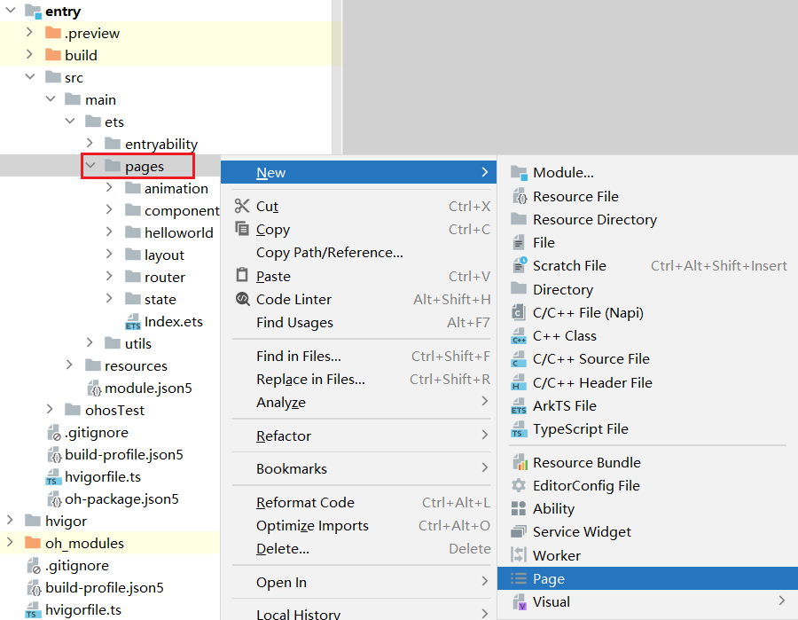

# 页面路由

## 概述

页面路由用于实现应用程序中不同页面之间的跳转。HarmonyOS提供了**router**模块，用于实现页面路由功能。通过该模块，开发者可以轻松实现页面跳转、页面返回等功能。

## 页面跳转pushUrl-replaceUrl

**router**模块提供了两种跳转模式，分别是`router.pushUrl()`和`router.replaceUrl()`，这两种模式的区别在于是否保留当前页的状态。

`pushUrl()`会将当前页面压入历史页面栈，因此使用该方法跳转到目标页面之后，还可以再返回。而`replaceUrl()`，会直接销毁当前页面并释放资源，然后用目标页替换当前页，因此使用该方法跳转到目标页面后，不能返回。


### **第一步：注册页面**

页面注册后才能进行跳转，具体操作如下，例如现有一个页面的路径为`src/main/ets/pages/demo30_router_listPage.ets`，

我们在`src/main/resources/base/profile/main_pages.json`文件增加如下配置即可

```json
{
  "src": [
    "pages/demo30_router_listPage",
    "pages/demo30_router_detail"
  ]
}
```

**注意：**

在创建页面时，若选择新建`Page`而不是`ArkTs File`，则**IDE**会自动完成页面的注册。



### **第二步：导入router模块**,使用

```arkts
import router from '@ohos.router'
```

或者下面的都可以,每个页面的时候要保持一直哈

```
import { router } from '@kit.ArkUI';
```


### 第三步：跳转

之后便可使用上述两个方法完页面的跳转（也可以在代码中直接使用router，会自动引入）

```arkts
router.pushUrl({ url: 'pages/router/pushAndReplace/TargetPage' })
router.replaceUrl({ url: 'pages/router/pushAndReplace/TargetPage' })
```


列表页

```
import router from '@ohos.router';
@Entry
@Component
struct Demo30_router_listPage {
  @State message: string = 'Hello World';

  build() {
    Column() {
      Button('去商品1详情页面')
        .onClick(()=>{
          router.pushUrl({url: 'pages/demo30_router_detail'})
        })

    }
    .height('100%')
    .width('100%')
  }
}
```

详情页

```
@Entry
@Component
struct Demo30_router_detail {
  @State message: string = 'Hello World';

  build() {
    Column() {
      Text('商品详情')
    }
    .height('100%')
    .width('100%')
  }
}
```


##  页面返回

返回页面使用`router.back()`方法即可，直接调用`router.back()`将返回上一页面，除此之外该方法也支持返回指定页面，例如

```arkts
router.back({url:'pages/Index'})
```

**注意：**

若指定的页面不在历史页面栈中，也就是用户并未浏览过指定页面，那么将无法回到指定页面。

```
import router from '@ohos.router';

@Entry
@Component
struct Demo30_router_detail {
  @State message: string = 'Hello World';

  build() {
    Column() {
      Button('返回').onClick(()=>{
        router.back()
      })
      Text('商品详情')

    }
    .height('100%')
    .width('100%')
  }
}
```


## 传递数据params

在进行页面跳转时，如果需要传递一些数据给目标页面，可以在调用上述方式时，添加一个`params`属性，并指定一个对象作为参数，例如

```arkts
router.pushUrl({
  url: 'pages/router/pushAndReplace/TargetPage',
  params: {
    id: 10,
    name: 'zhangsan',
    age: '20'
  }
})
```

目标页面可通过`router.getParams()`方法获取参数，例如


```arkts
let params = router.getParams();

 const params2 = router.getParams()  as  Record<string,number>; // 获取传递过来的参数对象
 console.log(params2.id+'')


```


### 使用Record类型类型，防止报错

作用 :定义一个对象的 key 和 value 类型

`Record`的使用，接收两个[泛型](https://so.csdn.net/so/search?q=泛型&spm=1001.2101.3001.7020)参数；`Record`后面的泛型就是对象键和值的类型


```
 Record<string,number>;

```

上面代码会得到一个对象类型，属性名是字符串，属性值是number类型

```
 let obj : Record<string,number> = {'name':1}

```


```
 const params2 = router.getParams()  as  Record<string,number>; // 获取传递过来的参数对象
 console.log(params2.id+'')

```


### 使用类的写法防止报错

```
import router from '@ohos.router';
class DataModelInfo {
  age: number = 0;
}
class DataModel {
  id: number = 0;
  info: DataModelInfo | null = null;
}
@Entry
@Component
struct Demo30_router_detail {
  @State message: string = 'Hello World';
  build() {
    Column() {
      Button('返回').onClick(()=>{
        router.back()
      })
      Text('商品详情')

    }
    .height('100%')
    .width('100%')
  }

  aboutToAppear(): void {
    console.log('detail page')
    const params = router.getParams() as DataModel; // 获取传递过来的参数对象
    const id = params.id // 获取id属性的值
    const age = params.info?.age as number// 获取age属性的值
    console.log(id+' '+age)

 
  }
}

```


## 路由实例模式

- 需要页面栈只有一份  就单实例 否则默认
- 需要返回pushUrl  否则  replaceUrl


### Standard

标准实例模式，也是默认情况下的实例模式。每次调用该方法都会新建一个目标页，并压入栈顶

### Single 

单实例模式。即如果目标页的url在页面栈中已经存在同url页面，则离栈顶最近的同url页面会被移动到栈顶，并重新加载；如果目标页的url在页面栈中不存在同url页面，则按照标准模式跳转。

```
// 引入路由模块
import router from '@ohos.router'

@Entry
@Component
struct LearnRouter1 {
  @State message: string = 'Hello World'

  build() {
    Row() {
      Column() {
        Button('替换到页面2').onClick(() => {
          /**
           * pushUrl接收第二个参数
           * 跳转模式
           */
          router.pushUrl({
            //
            /**
             * 目标url 和  src/main/resources/base/profile/main_pages.json
             * 目录地址一致
             */
            url: 'pages/LearnRouter2'
            // 实例模式
          // }, router.RouterMode.Standard)
            // 单例模式
            }, router.RouterMode.Single, (err) => {
              // 跳转后的回调

              if (err) {
                // 跳转失败
                console.log(err,'错误信息')
                return
              }

              console.log("跳转成功")
            })
        })
      }
      .width('100%')
    }
    .height('100%')
  }
}
```


