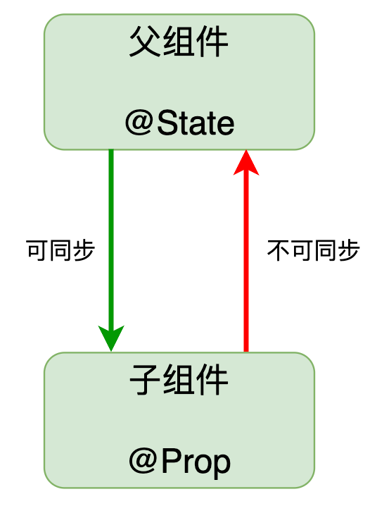
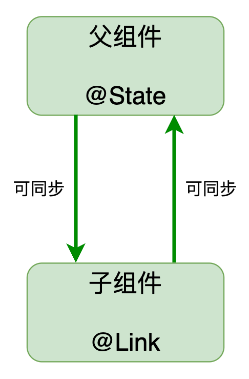
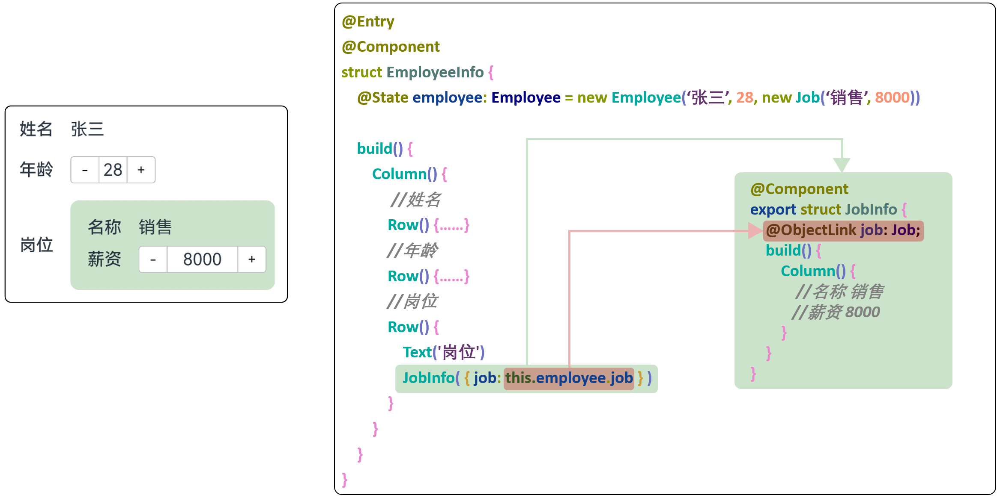
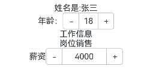

#  组件级状态管理

## 概述

声明式 UI 的一个典型特征是通过状态数据的变化驱动组件视图的刷新，因此状态数据的有效管理在整个开发过程中显得至关重要。尽管对于单个组件而言，状态数据的管理并不复杂，但在实际应用场景中，整个页面往往由一个复杂的组件树构成。每个组件可能都需要维护自己的状态，并且这些状态还可能需要在组件之间进行共享

## 状态管理入门

为了方便开发者管理组件状态，ArkTS 提供了一系列状态相关的装饰器，例如`@State`，`@Prop`，`@Link`，`@Provide`和`@Consume`等等。

### 组件自己的状态@State 

@State装饰的变量，或称为状态变量，一旦变量拥有了状态属性，就和自定义组件的渲染绑定起来。当状态改变时，UI会发生对应的渲染改变
@State装饰的变量，与声明式范式中的其他被装饰变量一样，是私有的，只能从组件内部访问，在声明时必须指定其类型和本地初始化。

初始化也可选择使用命名参数机制从父组件完成初始化。

**注意：**`@State`装饰的变量必须进行本地初始化。

具体语法如下

```typescript
@State count:number = 1;
```


#### @State装饰基本数据类型


实现点击按钮+1功能

```
@Entry
@Component
struct Index {

  @State num: number = 1


  build() {
    Column() {
      Text('num：' + this.num).fontSize(30)
      Button('+1').onClick(() => this.num++)
    }
  }
}
```

 或者下面

```
@Entry
@Component
struct LearnState {
  /**
   * 使用@State装饰器 修饰num
   * 让num 属性具备响应式
   * 也就是就该后视图会发生变化
   *
   * 注意：@State装饰的属性必须定义类型
   */
  @State num: number = 1


  add () {
    /***
     * 直接对数据进行修改
     * 视图就会相应发生发辫
     */
    this.num += 1
  }

  build() {
    Column() {
      Button('+1')
        .onClick(() => this.add())
      Text(this.num + '')
    }
  }
}
```


#### @State装饰引用数据类型🐝

@State只会对**引用数据类型的第一层赋予响应式数据的能力**，**嵌套的属性不具备响应式** 

如下

##### 修改对象info的第一层有响应式

 this.info.name = '🐂'  

#####  修改对象info第二层，没有响应式

当`@State`装饰的变量类型为class或者object时，可以观察到变量自身赋值的变化，和其属性赋值的变化。需要注意的是，若某个属性也为 class 或者 object，则嵌套属性的变化是观察不到的。


this.info.child.name = '🐂'  

鸿蒙在设计的时候 如果深度监控所有子数据变化 有性能开销！


###### 解决方法：


解决方法-修改一维数据本身 （直接修改对象的第一层）

```
  this.info.child = {
          name: '🐂'
  }
```


- 案例

```
interface IChild {
  age: number
}

interface IPerson {
  age: number
  child: IChild
}

@Entry
@Component
struct Demo01_state {
  @State obj: IPerson = {
    age: 1,
    child: { age: 1 }
  };

  build() {
    Column() {
      Text('obj  年龄是：' + this.obj.age)
      Button('按钮-修改obj.age').onClick(() => {
        //有响应式
        this.obj.age++
      })

      Text('obj.child 年龄是：' + this.obj.child.age)
      Button('按钮-修改obj.child.age').onClick(() => {
        // 没有响应式
        this.obj.child.age++
        //有响应式
        this.obj.child = {age:this.obj.child.age++}
      })

    }
    .height('100%')
    .width('100%')
  }
}
```

 

##### 数组中对象的修改

当`@State`装饰的变量类型为数组时，可以观察到数组本身赋值的变化，和其元素的添加、删除及更新的变化，若元素类型为 class 或者 object 时，元素属性的变化，是观察不到的。


直接修改数组中对象，没有响应式

解决方法：直接创建一个新对象，替换掉原来的对象

- 实战案例：类型使用值得学习(官方推荐的写法，使用类来定义字面量对象)

```
class Goods {
  id:number
  title:string
  price:number

  constructor(id:number,title:string,price:number) {
    this.id = id
    this.title = title
    this.price = price
  }
}

@Entry
@Component
struct demo03 {

  // 实战1
  @State goods: Goods[] = [
  // {id:1,title:'商品1',price:1},
  // {id:2,title:'商品2',price:2},
  // {id:3,title:'商品3',price:3},
    new Goods(1, '商品1', 1),
    new Goods(2, '商品2', 2),
    new Goods(3, '商品2', 3),
  ]

  // 实战2
  build() {
    Column() {
      Text('第二个商品的price属性：' + this.goods[1].price)
      Button('更改').onClick(() => {
        // this.goods[1].price++ //直接修改数组中对象，没有响应式
        const item = this.goods[1]
        this.goods[1] = new Goods(item.id, item.title, item.price+1)
      })
    }
  }
}
```

 


### 组件的属性@Prop-父子单向同步

属性一般用来实现父组件给子组件传值

类似vue中props


@Prop装饰的变量和父组件建立单向的同步关系：

- @Prop变量允许在本地修改，但修改后的变化不会同步回父组件。
- 当数据源更改时，@Prop装饰的变量都会更新，并且会覆盖本地所有更改。因此，数值的同步是父组件到子组件（所属组件)，子组件数值的变化不会同步到父组件。

#### 限制条件

- @Prop装饰变量时会进行**深拷贝**，在拷贝的过程中除了基本类型、Map、Set、Date、Array外，都会丢失类型。


`@Prop`装饰的变量发生变化时也会驱动当前组件的视图刷新，除此之外，`@Prop`装饰的变量还可以同步父组件中的状态变量，但只能单向同步，也就是父组件的状态变化会自动同步到子组件，而子组件的变化不会同步到父组件。




**注意：**`@Prop`装饰的变量不允许本地初始化，只能通过父组件向子组件传参进行初始化。


##### 能够观察到的变化（同`@State`）

- 当装饰的数据类型为boolean、string、number类型时，可以观察到数值的变化。
- 当装饰的数据类型为class或者object时，可以观察到变量自身赋值的变化，和其属性赋值的变化。需要注意的是，若某个属性也为 class 或者 object，则嵌套属性的变化是观察不到的。
- 当装饰的数据类型为数组时，可以可以观察到数组本身赋值的变化，和其元素的添加、删除及更新的变化，若元素类型为 class 或者 object 时，元素属性的变化，是观察不到的。


具体语法如下

子组件

```
// 子组件
@Component
struct  ChildCom{
  // 子组件的属性--由外部传入
  @Prop n:number
  build() {
    Row(){
      Button('+')
      Text(this.n+'')
      Button('-')
    }
  }
}
```


父组件

```
@Entry
@Component
struct Demo04_prop {
  @State num: number = 1;

  build() {
    Column() {
      Text('父组件的中num的 值'+this.num)
      // 使用子组件-传入属性n
      ChildCom({n:this.num})

    }
    .height('100%')
    .width('100%')
  }

}
```

#### 测试，是否是单向同步

测试 父亲中数据修改，子组件是否修改

测试，子组件中的数据修改，父组件中数据是否修改

```
@Entry
@Component
struct Demo04_prop {
  @State num: number = 1;

  build() {
    Column() {
      Text('父组件的中num的 值'+this.num)
        Button('测试父组件中的数据').onClick(()=>{
          //修改父组件中数据，可以响应式子组件
          this.num++
        })
      // 使用子组件-传入属性n
      ChildCom({n:this.num})

    }
    .height('100%')
    .width('100%')
  }

}

// 子组件
@Component
struct  ChildCom{
  // 子组件的属性--由外部传入
  @Prop n:number
  build() {
    Row(){
      Button('+').onClick(()=>{
        //子组件props修改，不会响应父亲
        this.n++
      })
      Text(this.n+'')
      Button('-')
        .onClick(()=>{
          this.n--
        })
    }
  }
}
```


### @Link-父子双向同步

类似于组件的v-model

基本使用同props，但是可以双向同步


`@Link`也可用于装饰状态变量，`@Link`装饰的变量发生变化时也会驱动当前组件的视图刷新，

除此之外，`@Link`变量同样会同步父组件状态，并且能够双向同步。也就是父组件的变化会同步到子组件，子组件的变化也会同步到父组件。




**注意：**`@Link`装饰的变量不允许本地初始化，只能由父组件通过传参进行初始化

从API version 9开始，@Link子组件从父组件初始化@State的语法为Comp({ aLink: this.aState })。同样Comp({aLink: $aState})也支持，以表示传递的是变量的引用。


例子

```
@Entry
@Component
struct Demo05 {
  @State num: number = 1;

  build() {
    Column() {
      Text('父组件的中num的 值'+this.num)
      Button('测试父组件中的数据').onClick(()=>{
        //修改父组件中数据，可以影响子组件
        this.num++
      })
      // 使用子组件-传入属性n
      ChildCom2({n:$num})
      ChildCom2({n:this.num})

    }
    .height('100%')
    .width('100%')
  }

}

// 子组件
@Component
struct  ChildCom2{
  // 子组件的属性--由外部传入
  @Link n:number
  build() {
    Row(){
      Button('+').onClick(()=>{
        //子组件Link 修改，会响应父亲
        this.n++
      })
      Text(this.n+'')
      Button('-')
        .onClick(()=>{
          this.n--
        })
    }
  }
}
```


###  @ObjectLink 和 @Observed-嵌套类对象属性变化

​		之前学的装饰器都仅能观察到状态变量第一层的变化，而第二层的变化是观察不到的。

如需观察到这些状态变量第二层的变化，除了之前的方法，还可以用`@ObjectLink`和`@Observed`装饰器。


@ObjectLink和@Observed类装饰器用于在涉及嵌套对象或数组的场景中进行双向数据同步：


- 使用new创建被@Observed装饰的类，可以被观察到属性的变化。
- 子组件中@ObjectLink装饰器装饰的状态变量用于接收@Observed装饰的类的实例，和父组件中对应的状态变量建立双向数据绑定。这个实例可以是数组中的被@Observed装饰的项，或者是class object中的属性，这个属性同样也需要被@Observed装饰。


#### `@ObjectLink`数据源更新时机

数据源（`@Observed`装饰的类实例）的属性变化会触发`@ObjectLink`装饰变量的更新，从而更新相关UI组件，


具体用法为：

1. 将第二层内容抽取为一个子组件，并将第二层的数据作为子组件的状态变量，该变量需要使用`@ObjectLink`装饰。




#### 第二层属性不会触发，对应的组件更新

先来个之前的例子




```
class Job {
  name: string;
  salary: number;

  constructor(name: string, salary: number) {
    this.name = name;
    this.salary = salary;
  }
}
class Employee{
  name:string
  age:number
  job:Job
  constructor(name:string,age:number,job:Job) {
    this.name = name
    this.age = age
    this.job = job
  }
}
@Entry
@Component
struct Demo07_object_link_observe {
  @State zhangsan:Employee=new Employee('张三',18,new Job('销售',4000))
  build() {
    Column() {

      Row(){
        Text('姓名是:'+this.zhangsan.name)
      }
      Row(){
        Text('年龄：')
        Counter(){
          Text(this.zhangsan.age+'')
        }.onDec(()=>{
          this.zhangsan.age--
        }).onInc(()=>{
          this.zhangsan.age++
        })
      }
        //工作信息
      // JobInfo({job:this.zhangsan.job})

      Text('工作信息')
      Text('岗位'+this.zhangsan.job.name)
     Row(){
       Text('薪资')
       Counter(){
         Text(this.zhangsan.job.salary+'')
       }.onDec(()=>{
         this.zhangsan.job.salary--
       }).onInc(()=>{
         this.zhangsan.job.salary++
       }).width(150)
     }

    }
    .height('100%')
    .width('100%')
  }
}

```


#### 使用@ObjectLink 和 @Observed


1. 第二层数据的类定义需要使用`@Observed`装饰器进行装饰。

```arkts
//使用观察装饰器-观察job类
@Observed
class Job {
  name: string;
  salary: number;

  constructor(name: string, salary: number) {
    this.name = name;
    this.salary = salary;
  }
}

class Employee{
  name:string
  age:number
  job:Job
  constructor(name:string,age:number,job:Job) {
    this.name = name
    this.age = age
    this.job = job
  }
}


```

2.封装子组件，把第二层要监听的数据，使用 ObjectLink 装饰


```
// 2-封装子组件，把第二层要监听的数据，使用 ObjectLink 装饰
@Component
struct  JobInfo{
  @ObjectLink job:Job
  build() {
    Column(){
      Text('工作信息')
      Text('岗位'+this.job.name)
      Row(){
        Text('薪资')
        Counter(){
          Text(this.job.salary+'')
        }.onDec(()=>{
          this.job.salary--
        }).onInc(()=>{
          this.job.salary++
        }).width(150)
      }

    }
  }
}
```


3-使用子组件的时候，传入第二层对象

JobInfo({job:this.zhangsan.job})

```
@Entry
@Component
struct Demo07_object_link_observe {
  @State zhangsan:Employee=new Employee('张三',18,new Job('销售',4000))
  build() {
    Column() {

      Row(){
        Text('姓名是:'+this.zhangsan.name)
      }
      Row(){
        Text('年龄：')
        Counter(){
          Text(this.zhangsan.age+'')
        }.onDec(()=>{
          this.zhangsan.age--
        }).onInc(()=>{
          this.zhangsan.age++
        })
      }
        // 3-使用子组件的时候，传入第二层对象
        //工作信息
      JobInfo({job:this.zhangsan.job})


    }
    .height('100%')
    .width('100%')
  }
}

```


完整代码如下

```
// 1-使用Observed装饰装饰，要监听的类
@Observed
class Job {
  name: string;
  salary: number;

  constructor(name: string, salary: number) {
    this.name = name;
    this.salary = salary;
  }
}
class Employee{
  name:string
  age:number
  job:Job
  constructor(name:string,age:number,job:Job) {
    this.name = name
    this.age = age
    this.job = job
  }
}
@Entry
@Component
struct Demo07_object_link_observe {
  @State zhangsan:Employee=new Employee('张三',18,new Job('销售',4000))
  build() {
    Column() {

      Row(){
        Text('姓名是:'+this.zhangsan.name)
      }
      Row(){
        Text('年龄：')
        Counter(){
          Text(this.zhangsan.age+'')
        }.onDec(()=>{
          this.zhangsan.age--
        }).onInc(()=>{
          this.zhangsan.age++
        })
      }
        // 3-使用子组件的时候，传入第二层对象
        //工作信息
      JobInfo({job:this.zhangsan.job})


    }
    .height('100%')
    .width('100%')
  }
}

// 2-封装子组件，把第二层要监听的数据，使用 ObjectLink 装饰
@Component
struct  JobInfo{
  @ObjectLink job:Job
  build() {
    Column(){
      Text('工作信息')
      Text('岗位'+this.job.name)
      Row(){
        Text('薪资')
        Counter(){
          Text(this.job.salary+'')
        }.onDec(()=>{
          this.job.salary--
        }).onInc(()=>{
          this.job.salary++
        }).width(150)
      }

    }
  }
}
```


### @Provide和@Consume  依赖注入

实现-祖孙通信


`@Provide`和`@Consume`用于跨组件层级传递状态信息，其中`@Provide`用于装饰祖先组件的状态变量，`@Consume`用于装饰后代组件的状态变量。可以理解为祖先组件提供（**Provide**）状态信息供后代组件消费（**Consume**），并且祖先和后代的状态信息可以实现双向同步。


**注意：**`@Provide`装饰变量必须进行本地初始化，而`@Consume`装饰的变量不允许进行本地初始化。


具体语法如下

祖辈提供数据

```
@Provide count: number = 1
```


`@Provide`和`@Consume`装饰的变量不是通过父组件向子组件传参的方式进行绑定的，而是通过相同的变量名进行绑定的。

后代接受数据

```
@Consume count:number
```


案例

```
@Entry
@Component
struct Demo06_provide_consumer {
  // 注入数据
  @Provide num: number = 1;

  // 当前组件就是爷爷组件
  build() {
    Column() {
      Text('爷爷中的num：'+this.num)
      FatherCom()

    }
    .height('100%')
    .width('100%')
  }
}

// 父亲组件
@Component
struct FatherCom{
  build() {
  //
    Column(){
      Text('父亲组件')
      GrandSon()
    }
  }
}
//孙子组件
@Component
struct  GrandSon{
  // 获取数据
  @Consume num:number
  build() {
    Text('孙子组件中的num：'+this.num)

  }
}
```


除了通过变量名进行绑定，还可通过变量的别名进行绑定，具体语法如下

```
@Consume('num')childCount:number
```

然后使用this.childCount

案例

```
//孙子组件
@Component
struct  GrandSon{
  // 获取数据
  @Consume('num')
  childCount:number

  // @Consume num:number
  build() {
    Text('孙子组件中的childCount：'+this.childCount)

  }
}
```


`@Provide`和`@Consume`允许装饰的变量类型有`string`、`number`、`boolean`、`object`、`class`和`enum`类型，以及这些类型的数组。

#####  框架能够观察到的变化（同`@State`）

- 当装饰的数据类型为boolean、string、number类型时，可以观察到数值的变化
- 当装饰的数据类型为class或者object时，可以观察到变量自身赋值的变化，和其属性赋值的变化。需要注意的是，若某个属性也为 class 或者 object，则嵌套属性的变化是观察不到的。
- 当装饰的数据类型为数组时，可以可以观察到数组本身赋值的变化，和其元素的添加、删除及更新的变化，若元素类型为 class 或者 object 时，元素属性的变化，是观察不到的。


#### 


## 其他状态管理

除了前面章节提到的组件状态管理，ArkTS还提供了@Watch、$$运算符


- [@Watch](https://developer.huawei.com/consumer/cn/doc/harmonyos-guides-V5/arkts-watch-V5)：用于监听状态变量的变化。

  

- [$$运算符](https://developer.huawei.com/consumer/cn/doc/harmonyos-guides-V5/arkts-two-way-sync-V5)：给内置组件提供TS变量的引用，使得TS变量和内置组件的内部状态保持同步。


### @Watch装饰器：状态变量更改通知

类似于vue中watch监听


@Watch应用于对状态变量的监听。如果开发者需要关注某个状态变量的值是否改变，可以使用@Watch为状态变量设置回调函数。

@Watch提供了状态变量的监听能力，@Watch仅能监听到可以观察到的变化。


@Watch用于监听状态变量的变化，当状态变量变化时，@Watch的回调方法将被调用。@Watch在ArkUI框架内部判断数值有无更新使用的是严格相等（===），遵循严格相等规范。当在严格相等为false的情况下，就会触发@Watch的回调。


#### 装饰器说明

| @Watch补充变量装饰器   | 说明                                                         |
| :--------------------- | :----------------------------------------------------------- |
| 装饰器参数             | 必填。常量字符串，字符串需要有引号。                         |
| 可装饰的自定义组件变量 | 可监听所有装饰器装饰的状态变量。不允许监听常规变量。         |
| 装饰器的顺序           | 装饰器顺序不影响实际功能，开发者可以根据自己的需要决定装饰器顺序的先后。建议[@State](https://developer.huawei.com/consumer/cn/doc/harmonyos-guides-V5/arkts-state-V5)、[@Prop](https://developer.huawei.com/consumer/cn/doc/harmonyos-guides-V5/arkts-prop-V5)、[@Link](https://developer.huawei.com/consumer/cn/doc/harmonyos-guides-V5/arkts-link-V5)等装饰器在@Watch装饰器之前，以保持整体风格的一致。 |
| @Watch触发时机         | 使用@Watch来监听状态变量变化时，回调触发时间是变量真正变化、被赋值的时间。 |


在第一次初始化的时候，@Watch装饰的方法不会被调用，即认为初始化不是状态变量的改变。只有在后续状态改变时，才会调用@Watch回调方法。


语法

```
// 正确写法
@State @Watch('change') num: number = 10;
change() {
  console.log(`xxx`);
}
```


#### 监听一个数据的改变

```
@Entry
@Component
struct Demo10_watch01 {
  @State @Watch('numChange') num: number = 1
  numChange(propName:string){
    console.log('属性'+propName+'改变了')
  }

  build() {
    Column() {
      Text(this.num.toString())
       Button('修改num').onClick(()=>{
         this.num++
       })

    }
    .height('100%')
    .width('100%')
  }
}
```


#### 监听多个数据的改变

一个函数监听多个数据的改变

```
@Entry
@Component
struct Demo10_watch01 {
  @State @Watch('numChange') num: number = 1
  @State @Watch('numChange') price: number = 100
  numChange(propName:string){
    console.log('属性'+propName+'改变了')
  }

  build() {
    Column() {
      Text(this.num.toString())
       Button('修改num').onClick(()=>{
         this.num++
       })
      Text(this.price.toString())
      Button('修改price').onClick(()=>{
        this.price++
      })


    }
    .height('100%')
    .width('100%')
  }
}


```


#### 监听数组的改变

```
class Todo2{
  title:string
  flag:boolean
  constructor(title:string,flag:boolean) {
    this.title = title;
    this.flag = flag
  }
}

@Entry
@Component
struct Demo11_watch_arr {
  @State
  @Watch('arrChange')
  arr:Todo2[]=[new Todo2('今天记得吃药',false),new Todo2('今天要给女朋友打个电话',true)]
  arrChange(){
    console.log('arr change')
  }

  build() {
    Column() {
      Button('添加').onClick(()=>{
        //添加和删除都能监听到
        // this.arr.push(new Todo2('aa',false))
        this.arr.splice(0,1)
      })
      ForEach(this.arr,(item:Todo2,index:number)=>{
        Row(){
          Text(item.title)
          Checkbox().select(item.flag).onChange(v=>{
            //直接修改监听不到-第二层监听不到
            // this.arr[index].flag = v
            //可以给数组对应位置重新赋值
            this.arr[index] = new Todo2(item.title,v)
          })

        }
      },(item:Todo2)=>item.title)

    }
    .height('100%')
    .width('100%')


  }
}
```


### $$运算符

[$$运算符](https://developer.huawei.com/consumer/cn/doc/harmonyos-guides-V5/arkts-two-way-sync-V5)：给内置组件提供TS变量的引用，使得TS变量和内置组件的内部状态保持同步。

内部状态具体指什么取决于组件。例如，[TextInput](https://developer.huawei.com/consumer/cn/doc/harmonyos-references-V5/ts-basic-components-textinput-V5)组件的text参数。

- 当前$$支持基础类型变量，以及[@State](https://developer.huawei.com/consumer/cn/doc/harmonyos-guides-V5/arkts-state-V5)、[@Link](https://developer.huawei.com/consumer/cn/doc/harmonyos-guides-V5/arkts-link-V5)和[@Prop](https://developer.huawei.com/consumer/cn/doc/harmonyos-guides-V5/arkts-prop-V5)装饰的变量。

- 当前$$支持的组件：

  | 组件                                                         | 支持的参数/属性 | 起始API版本 |
  | :----------------------------------------------------------- | :-------------- | :---------- |
  | [Checkbox](https://developer.huawei.com/consumer/cn/doc/harmonyos-references-V5/ts-basic-components-checkbox-V5) | select          | 10          |
  | [CheckboxGroup](https://developer.huawei.com/consumer/cn/doc/harmonyos-references-V5/ts-basic-components-checkboxgroup-V5) | selectAll       | 10          |
  | [DatePicker](https://developer.huawei.com/consumer/cn/doc/harmonyos-references-V5/ts-basic-components-datepicker-V5) | selected        | 10          |
  | [TimePicker](https://developer.huawei.com/consumer/cn/doc/harmonyos-references-V5/ts-basic-components-timepicker-V5) | selected        | 10          |
  | [MenuItem](https://developer.huawei.com/consumer/cn/doc/harmonyos-references-V5/ts-basic-components-menuitem-V5) | selected        | 10          |
  | [Panel](https://developer.huawei.com/consumer/cn/doc/harmonyos-references-V5/ts-container-panel-V5) | mode            | 10          |
  | [Radio](https://developer.huawei.com/consumer/cn/doc/harmonyos-references-V5/ts-basic-components-radio-V5) | checked         | 10          |
  | [Rating](https://developer.huawei.com/consumer/cn/doc/harmonyos-references-V5/ts-basic-components-rating-V5) | rating          | 10          |
  | [Search](https://developer.huawei.com/consumer/cn/doc/harmonyos-references-V5/ts-basic-components-search-V5) | value           | 10          |
  | [SideBarContainer](https://developer.huawei.com/consumer/cn/doc/harmonyos-references-V5/ts-container-sidebarcontainer-V5) | showSideBar     | 10          |
  | [Slider](https://developer.huawei.com/consumer/cn/doc/harmonyos-references-V5/ts-basic-components-slider-V5) | value           | 10          |
  | [Stepper](https://developer.huawei.com/consumer/cn/doc/harmonyos-references-V5/ts-basic-components-stepper-V5) | index           | 10          |
  | [Swiper](https://developer.huawei.com/consumer/cn/doc/harmonyos-references-V5/ts-container-swiper-V5) | index           | 10          |
  | [Tabs](https://developer.huawei.com/consumer/cn/doc/harmonyos-references-V5/ts-container-tabs-V5) | index           | 10          |
  | [TextArea](https://developer.huawei.com/consumer/cn/doc/harmonyos-references-V5/ts-basic-components-textarea-V5) | text            | 10          |
  | [TextInput](https://developer.huawei.com/consumer/cn/doc/harmonyos-references-V5/ts-basic-components-textinput-V5) | text            | 10          |
  | [TextPicker](https://developer.huawei.com/consumer/cn/doc/harmonyos-references-V5/ts-basic-components-textpicker-V5) | selected、value | 10          |
  | [Toggle](https://developer.huawei.com/consumer/cn/doc/harmonyos-references-V5/ts-basic-components-toggle-V5) | isOn            | 10          |
  | [AlphabetIndexer](https://developer.huawei.com/consumer/cn/doc/harmonyos-references-V5/ts-container-alphabet-indexer-V5) | selected        | 10          |
  | [Select](https://developer.huawei.com/consumer/cn/doc/harmonyos-references-V5/ts-basic-components-select-V5) | selected、value | 10          |
  | [BindSheet](https://developer.huawei.com/consumer/cn/doc/harmonyos-references-V5/ts-universal-attributes-sheet-transition-V5) | isShow          | 10          |
  | [BindContentCover](https://developer.huawei.com/consumer/cn/doc/harmonyos-references-V5/ts-universal-attributes-modal-transition-V5) | isShow          | 10          |
  | [Refresh](https://developer.huawei.com/consumer/cn/doc/harmonyos-references-V5/ts-container-refresh-V5) | refreshing      | 8           |
  | [GridItem](https://developer.huawei.com/consumer/cn/doc/harmonyos-references-V5/ts-container-griditem-V5) | selected        | 10          |
  | [ListItem](https://developer.huawei.com/consumer/cn/doc/harmonyos-references-V5/ts-container-listitem-V5) | selected        | 10          |

- $$绑定的变量变化时，会触发UI的同步刷新


#### 使用示例

以[TextInput](https://developer.huawei.com/consumer/cn/doc/harmonyos-references-V5/ts-basic-components-textinput-V5)方法的text参数为例：

```typescript
// xxx.ets
@Entry
@Component
struct TextInputExample {
  @State text: string = ''
  build() {
    Column({ space: 20 }) {
      Text(this.text)
      TextInput({ text: $$this.text, placeholder: 'input your word...' })
        .placeholderColor(Color.Grey)
        .placeholderFont({ size: 14, weight: 400 })
        .caretColor(Color.Blue)
        .width(300)
    }.width('100%').height('100%').justifyContent(FlexAlign.Center)
  }
}
```


# 作业-完成todos


