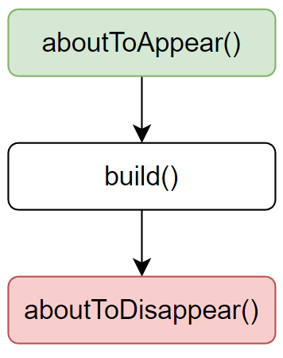
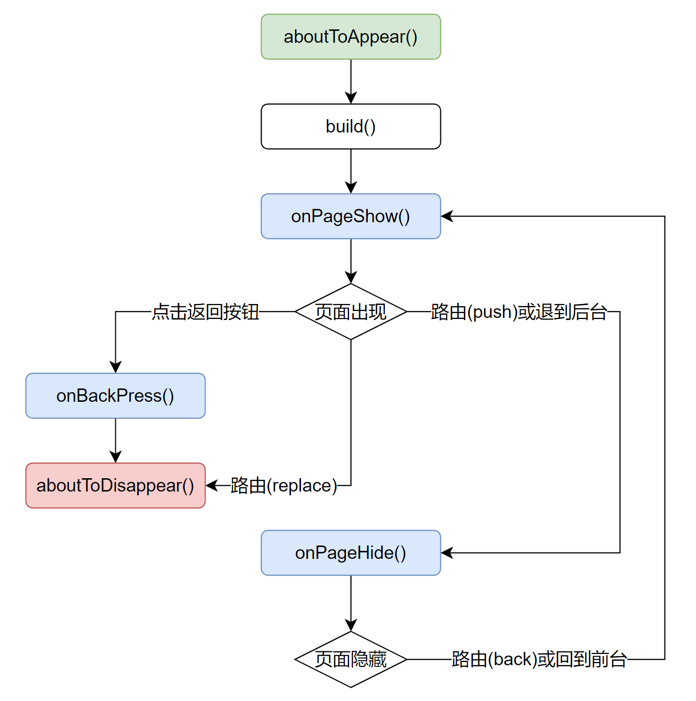

# 组件生命周期钩子函数

在鸿蒙应用中，每个自定义组件从创建到销毁，都会经历一系列的步骤，在这个过程中，系统会在一些特定的阶段运行一些特定函数，这些函数就被称为生命周期钩子函数，利用这些钩子函数，开发者可以在组件创建或者销毁时执行一些自己的代码，例如在组件出现之前从后台服务器请求数据。

## **普通组件生命周期函数**

普通组件的生命周期函数只有如下两个：

- `aboutToAppear()`：该函数会在组件出现之前被调用，具体时机为创建自定义组件的实例之后，执行`build()`方法之前。
- `aboutToDisappear()`：该函数会在组件销毁之前被调用。

## **页面入口组件生命周期函数**

页面入口组件（使用`@Entry`装饰的组件）的生命周期函数函数如下五个：

- `aboutToAppear()`：该函数会在组件出现之前被调用，具体时机为创建自定义组件的实例之后，执行`build()`方法之前。
- `aboutToDisappear()`：该函数会在组件销毁之前被调用。
- `onPageShow()`：页面每次显示时都会被调用一次，包括路由、应用从后台进入前台等场景。
- `onPageHide()`：页面每次隐藏时都会被调用一次，包括路由、应用从前台进入后台等场景。
- `onBackPress()`：当用后点击返回按钮时会被调用。

