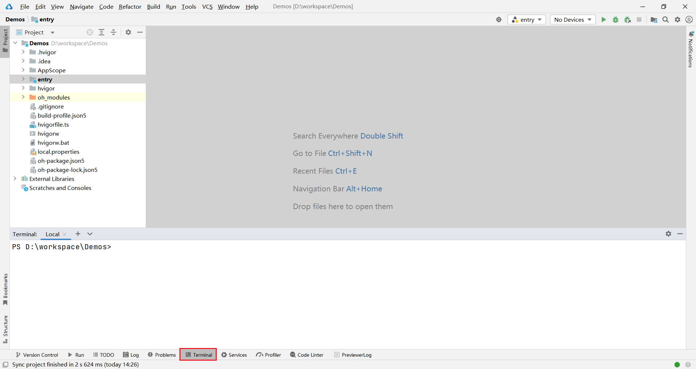
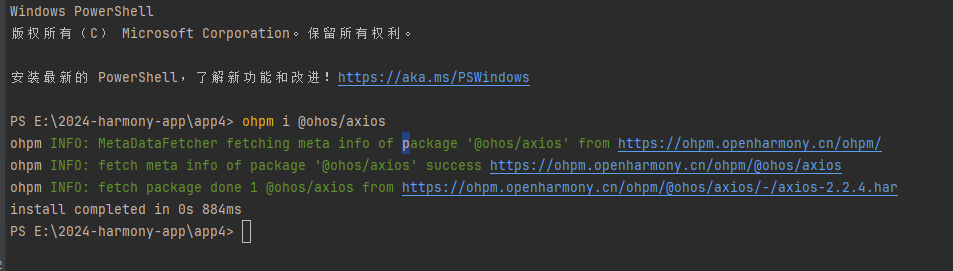
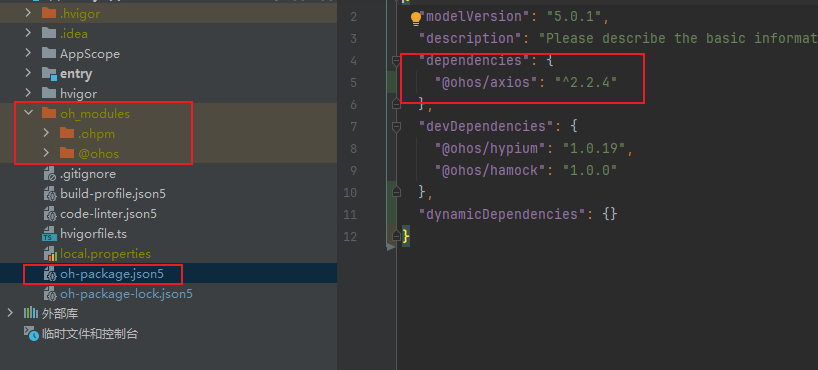
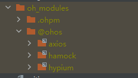
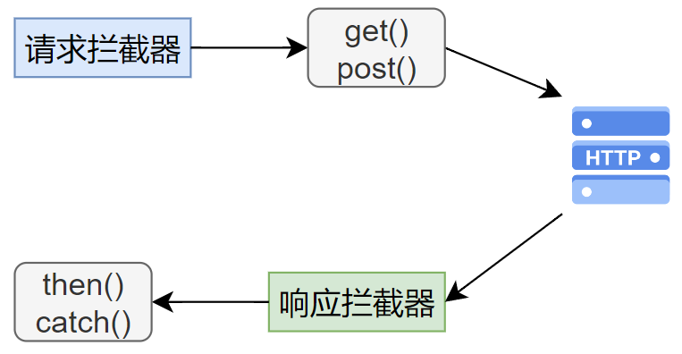

# 网络请求

鸿蒙系统提供了**http模块**用于发送http请求，另外，**OpenHarmony**社区基于该模块将前端开发中常用的网络请求库**axios**移植到了鸿蒙系统，因此我们也可以在鸿蒙系统中使用**axios**发送http请求，下面重点为大家介绍**axios**的用法。

https://ohpm.openharmony.cn/#/cn/home

https://ohpm.openharmony.cn/#/cn/detail/@ohos%2Faxios

## 准备工作

### 启动本地HTTP服务

启动hi-server-new

程序启动后，会在本地启动一个HTTP服务

http://localhost:3001


注意，**模拟器也相当于是一台电脑**，模拟器要访问自己电脑的接口必须通过局域网能访问到的ip地址

比如 http://192.168.x.x:3001  或者公网的ip地址 , 访问http://localhost:3001 不行


### 申请网络访问权限

默认情况下，应用只能访问有限的系统资源，若应用需要访问一些受保护的数据（照片、通讯录、位置等）或者功能（打电话、发短信、联网等），需要先申请相应的权限。鸿蒙系统的权限列表可参考[官方文档](https://developer.huawei.com/consumer/cn/doc/harmonyos-guides-V2/permission-list-0000001544464017-V2)。

权限的申请可分为如下两步

**第一步：声明所需权限**

开发者需要在`entry/src/main/module.json5`文件中声明所需权限，具体格式如下

```json
{
  "module": {
    ......
    "requestPermissions": [
      {
        "name": 'ohos.permission.******'
      }
    ]
  }
}
```

**第二步：申请授权**

- 如果目标权限的**授权方式**为**system_grant**，开发者在完成第一步后，系统会在安装应用时自动为其进行权限预授予，开发者不需要做其他操作即可使用权限。
- 如果目标权限的**授权方式**为是**user_grant**，开发者在完成第一步后，还需要在应用运行时弹窗请求用户授权，具体操作可参考[官方文档](https://developer.huawei.com/consumer/cn/doc/harmonyos-guides-V2/accesstoken-guidelines-0000001493744016-V2#ZH-CN_TOPIC_0000001574088333__向用户申请授权)。

由于网络访问权限的授权方式为**system_grant**，因此只需完成第一步即可，具体内容如下

```json
{
  "module": {
    ......
    "requestPermissions": [
      {
        "name": 'ohos.permission.INTERNET'
      }
    ]
  }
}
```

## 安装axios库

**axios**相当于鸿蒙应用项目的一个第三方库，鸿蒙应用项目使用**ohpm**管理（包括安装、卸载等）第三方库。除了axios，还有很多其他的第三方库可供开发者使用，所有的第三方库都收录在[OpenHarmony三方库中心仓](https://ohpm.openharmony.cn/#/cn/home)中。


###  安装axios

点击**Deveco Studio**底部的**Terminal**选项卡，启动终端



之后在终端执行如下命令即可

```powershell
ohpm i @ohos/axios
```




安装完成以后，项目中的package.json5文件会有记录，同时on_modules文件夹下面也会由对应的模块






## axios快速入门

**第一步：导入axios**

```arkts
import axios from '@ohos/axios'
```

**第二步：创建axios实例**

```arkts
const instance = axios.create({
  baseURL: 'http://<ip>:<port>',
  timeout: 2000
})
```

**注意：**需要根据实际情况替换上述的ip地址和端口号

**第三步：发送http请求**

创建**axios**实例后，便可通过该实例的api来发送各种http请求，常用的api定义如下

| api                                           | 功能               |
| --------------------------------------------- | ------------------ |
| instance(config)                              | 可以发送任何请求   |
| `instance.get(url, config?): Promise`         | 发送**GET**请求    |
| `instance.delete(url, config?): Promise`      | 发送**DELETE**请求 |
| `instance.post(url, data?, config?): Promise` | 发送**POST**请求   |
| `instance.put(url, data?, config?): Promise`  | 发送**PUT**请求    |

**第四步：获取请求结果**

上述api的返回值类型均为`Promise`，`Promise`是JavaScript中用于表示异步操作结果的对象，若操作成功，其中会包含具体结果，若操作失败，其会包含错误的原因。在实际应用中，开发者可以通过该对象的`then()`方法来处理操作成功时的结果，通过`catch()`方法来处理操作失败的情况，例如

```arkts
get(...)
  .then((response:AxiosResponse)=>{
    //处理请求成功的结果
    ...
  })
  .catch((error:AxiosError)=>{
    //处理请求失败的错误
    ...
  })
```

**AxiosResponse**是**axios**定义的响应结果类型，默认情况下，通过**axios**发送的所有请求，其成功的响应结果都是该类型。其包含的属性如下

```arkts
{
  //服务器返回的响应结果
  data: {},

  //服务器响应的 HTTP 状态码
  status: 200,

  //服务器响应的 HTTP 状态信息
  statusText: 'OK',

  // 服务器响应头
  headers: {},

  //axios请求的配置信息
  config: {},
  
  //生成此响应的请求信息
  request: {}
}
```

因此，`response.data`才是服务器返回的真实数据，具体处理逻辑如下

```arkts
import { AxiosResponse } from '@ohos/axios';


get(...)
  .then((response:AxiosResponse)=>{
    //获取服务器返回的数据
    let data = response.data;
    //处理服务器返回的数据
    ...
  })
  .catch((error:AxiosError)=>{
    //处理请求失败的错误
    ...
  })
```


## 二次封装

实际使用的时候，我们一般会把axios进行二次封装

### 创建utils/request.ets

----里面创建请求实例并且导出

```

import axios from '@ohos/axios'
const instance = axios.create({
//这里需要改成自己服务器的ip地址
  baseURL: 'http://localhost:3001',
  timeout: 2000
})
export default instance
```


每一类请求会单独再封装到一个文件里面，里面导出每一个函数

比如关于商品的相关请求都会封装到 api/product.ets下面

###  创建 api/product.ets

```
import instance from '../utils/request'
//导出商品列表请求
export  function  productListReq(count:number,limitNum:number){
  return instance({
    url:'/api/pro/list',
    method:'get',
    params:{
      count,limitNum
    }
  })
}

```


### 页面中使用请求函数


#### 发请求-定义接口

组件加载完毕的周期中发起请求

----定义返回数据的接口-类型声明

```
import { AxiosResponse } from '@ohos/axios';
import { productListReq } from '../api/product';

//定义返回数据的接口-类型声明
interface IProductListItem{
  proid:string
  proname:string
  desc:string
  imgs:string[]
}
interface IResData{
  code:number
  messsage:string
  data:IProductListItem[]
}

@Entry
@Component
struct Demo13_axios {
  //保存页面列表数据
  @State arr:IProductListItem[]=[]
  //发起请求
  aboutToAppear(): void {
    productListReq(1,10).then((r:AxiosResponse)=>{
      console.log(r.data)
      //保存服务器返回的列表数据
      let data:IResData = r.data
      //给arr赋值
      this.arr = data.data

    })
  }
  
  build() {
    Column() {
    
    }
    .height('100%')
    .width('100%')
    .backgroundColor(Color.Gray)
  }

}
```

#### 然后build函数中渲染列表

```

  build() {
    Column() {
      List({space:5}){
        ForEach(this.arr,(item:IProductListItem)=>{
          ListItem(){
            Column(){
              Image(item.imgs[0])
              Text(item.proname)
                .maxLines(1)
                .textOverflow({ overflow: TextOverflow.Ellipsis }) // 超长文本裁剪略号代替
            }.padding(5)
          }
        })
      }.lanes(2)

    }
    .height('100%')
    .width('100%')
    .backgroundColor(Color.Gray)
```


#### 改成类的写法也可以

接口声明类型改成类的写法也可以

```
import { AxiosResponse } from '@ohos/axios';
import { productListReq } from '../api/product';
class ProductListItem{
  proname:string
  desc:string
  imgs:string[]
  // 写构造函数，可以不给属性初始值
  constructor(proname:string,desc:string,imgs:string[]) {
    this.proname = proname
    this.desc = desc
    this.imgs = imgs
  }
}
class ResData{
  //不写构造函数，必须给一个初始值
  code:number=0
  messsage:string=''
  data:ProductListItem[]=[]
}

@Entry
@Component
struct Demo13_axios {
  //保存页面列表数据
  @State arr:ProductListItem[]=[]

  aboutToAppear(): void {
    productListReq(1,10).then((r:AxiosResponse)=>{
      console.log(r.data)
      let data:ResData = r.data
      this.arr = data.data

    })
  }


  build() {
    Column() {
      List({space:5}){
        ForEach(this.arr,(item:ProductListItem)=>{
          ListItem(){
            Column(){
              Image(item.imgs[0])
              Text(item.proname)
                .maxLines(1)
                .textOverflow({ overflow: TextOverflow.Ellipsis }) // 超长文本裁剪略号代替
            }.padding(5)
          }
        })
      }.lanes(2)

    }
    .height('100%')
    .width('100%')
    .backgroundColor(Color.Gray)
  }
}
```


##  axios拦截器

axios可以分别为请求和响应配置拦截器，请求拦截器可在请求发送前进行拦截，响应拦截器可以在`then()`或者`catch()`方法执行前进行拦截，如下图所示



在拦截器中，开发者可以对请求的参数或者响应的结果做一些统一的处理，比如在请求拦截器中统一为所有请求增加`token`这一Header，在响应拦截器中统一处理错误响应。

拦截器的配置方式如下

**请求拦截器**

```arkts
import axios, { AxiosError, AxiosResponse, InternalAxiosRequestConfig } from '@ohos/axios'


// 添加请求拦截器
instance.interceptors.request.use((config:InternalAxiosRequestConfig) => {
  // 对请求数据做点什么
  //读取token
  let token = ''
  if(token){
    config.headers['token'] = token
  }

  
  return config;
}, (error:AxiosError) => {
  // 对请求错误做些什么
  return Promise.reject(error);
});
```

**响应拦截器**

```arkts
import axios, { AxiosError, AxiosResponse, InternalAxiosRequestConfig } from '@ohos/axios'


// 添加响应拦截器
instance.interceptors.response.use((response:AxiosResponse)=> {
  // 对响应数据做点什么
  return response;
}, (error:AxiosError)=> {
  // 对响应错误做点什么
  return Promise.reject(error);
});
```

# 