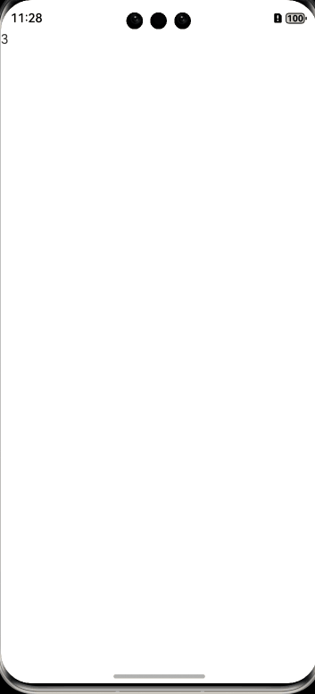

# 应用级状态管理

之前学习了一系列状态共享相关的装饰器（`@State`、`@Prop`、`@Link`、`@Provide`、`@Consume`等）

但是这些装饰器仅能在两个组件之间共享状态

如果开发者需要在一个页面内的所有组件中共享状态，

或者是在多个页面之间共享状态，

这些装饰器便不再适用了，此时我们需要的就是**应用级状态管理**功能。

## LocalStorage


LocalStorage是ArkTS为构建页面级别状态变量提供存储的内存内的“数据库”。


这里虽然叫LocalStorage，但是只是内存数据，不会永久存入用户的手机上


**LocalStorage**用于存储页面级的状态数据，位于**LocalStorage**中的状态数据可以在一个页面内的所有组件中共享，其用法如下

**第一步：创建LocalStorage实例，并初始化状态变量**

```arkts
let storage = new LocalStorage({ count: 0 });
```

**第二步：将LocalStorage实例绑定到页面的入口组件**


组件树的根节点，即被@Entry装饰的@Component，可以被分配一个LocalStorage实例，此组件的所有子组件实例将自动获得对该LocalStorage实例的访问权限

```arkts
@Entry(storage)
@Component
struct Parent {
  build(){
    ......
  }
}
```

**第三步：在页面内的组件访问LocalStorage**

ArkTs提供了两个装饰器用于访问**LocalStorage**，分别是 `@LocalStorageProp`和 `@LocalStorageLink`，前者可以和**LocalStorage**实现单向同步，后者可以和**LocalStorage**实现双向同步，具体用法如下


#### 页面组件中使用-LocalStorageLink-LocalStorageProp

```
//3-组件的变量count 与 storage中的PropA属性双向同步
 @LocalStorageLink('PropA') count: number=1;
  // count修改了，storage.get('PropA') 会获取最新的值
  
  
  //3-组件的变量count 与 storage中的PropA属性单向向同步
  // count修改了，storage.get('PropA') 不会获取最新的值
   @LocalStorageProp('PropA') count: number=1;
```

案例

```

let para: Record<string, number> = { 'PropA': 47 };

// 1-创建新实例并使用给定对象初始化
let storage: LocalStorage = new LocalStorage(para);
// 修改或创建一个属性
storage.setOrCreate('PropB', 'zhangsan');


// 2-将LocalStorage实例绑定到页面的入口组件
@Entry(storage)
@Component
struct Demo15_localStorage {
  //3-组件的变量count 与 storage中的PropA属性双向同步
  // count修改了，storage.get('PropA') 会获取最新的值
  
  @LocalStorageLink('PropA') count: number=1;
  
  
  //3-组件的变量count 与 storage中的PropA属性单向向同步
  // count修改了，storage.get('PropA') 不会获取最新的值
  // @LocalStorageProp('PropA') count: number=1;

  build() {
    Column() {
      Text(this.count.toString())
      Button('修改数据').onClick(()=>{
        this.count++
      })
      Button('获取 数据').onClick(()=>{
        // count修改了，storage.get('PropA')
        console.log(this.count.toString())
        console.log(storage.get('PropA'))
      })
    }
    .height('100%')
    .width('100%')
  }
}
```


#### 子组件中使用

```
//3-组件的变量count 与 storage中的PropA属性双向同步
 @LocalStorageLink('PropA') count: number=1;
  // count修改了，storage.get('PropA') 会获取最新的值
  
  
  //3-组件的变量count 与 storage中的PropA属性单向向同步
  // count修改了，storage.get('PropA') 不会获取最新的值
   @LocalStorageProp('PropA') count: number=1;
```


定义子组件

```
@Component
struct  ChildTest{
  //双向同步
  // @LocalStorageLink('PropA') count: number=1;
  // 单向同步
  @LocalStorageProp('PropA') count: number=1;
  build() {
    Column(){
      Text('我是子组件')
      Text(this.count.toString())
      Button('修改count').onClick(()=>{
        this.count++
      })
    }
  }
}

```

父组件中使用子组件

```

let para: Record<string, number> = { 'PropA': 47 };

// 1-创建新实例并使用给定对象初始化
let storage: LocalStorage = new LocalStorage(para);
// 修改或创建一个属性
storage.setOrCreate('PropB', 'zhangsan');


// 2-将LocalStorage实例绑定到页面的入口组件
@Entry(storage)
@Component
struct Demo15_localStorage {
  //3-组件的变量count 与 storage中的PropA属性双向同步
  // count修改了，storage.get('PropA') 会获取最新的值
  @LocalStorageLink('PropA') count: number=1;


  //3-组件的变量count 与 storage中的PropA属性单向向同步
  // count修改了，storage.get('PropA') 不会获取最新的值
  // @LocalStorageProp('PropA') count: number=1;

  build() {
    Column() {
      Text(this.count.toString())
      Button('修改数据').onClick(()=>{
        this.count++
      })
      Button('获取 数据').onClick(()=>{
        // count修改了，storage.get('PropA')
        console.log(this.count.toString())
        console.log(storage.get('PropA'))
      })
     //++++++++++++++++++
      ChildTest()
    }
    .height('100%')
    .width('100%')
  }
}

```


##  AppStorage

**AppStorage**用于存储应用级的状态数据，位于**AppStorage**中的状态数据可以在整个应用的所有组件中共享，其用法如下

### **第一步：初始化状态变量**

```arkts
AppStorage.setOrCreate('count', 0)
```

### **第二步：StorageLink-StorageProp在整个应用内的组件中访问AppStorage**

ArkTs提供了两个装饰器用于访问**AppStorage**实例，分别是 `@StorageProp`和 `@StorageLink`，前者可以和**AppStorage**实现单向同步，后者可以和**AppStorage**实现双向同步，具体用法如下


a页面

```
AppStorage.setOrCreate('count', 0)
@Entry
@Component
struct PageOne {
  //与AppStorage中的count属性双向同步
  @StorageLink('count') count: number = 0;

  build() {
    Column() {
      Text(this.count+'')
      Button('修改count').onClick(()=>{
        this.count++
      })
      Button('获取count').onClick(()=>{
        console.log(this.count+'')
        console.log(AppStorage.get('count'))

      })
       Button('跳转到b').onClick(()=>{
        router.pushUrl({
          url:'pages/demo16_page_b'
        })
      })
    }
    .width('100%').height('100%')
  }
}
```

b页面

```
@Entry
@Component
struct Demo16_page_b {
  //与AppStorage中的count属性双向同步
  @StorageLink('count') count: number = 0;

  build() {
    Column() {
      Text('page b')

      Text(this.count+'')
      Button('修改count').onClick(()=>{
        this.count++
      })
      Button('获取count').onClick(()=>{
        console.log(this.count+'')
        console.log(AppStorage.get('count'))

      })

    }
    .height('100%')
    .width('100%')
  }
}
```


## PersistentStorage

**LocalStorage**和**AppStorage**都是将状态数据保存在内存中，应用一旦退出，数据就会被清理，如果需要对数据进行持久化存储，就需要用到**PersistentStorage**，其用法如下

**PersistentStorage**可以将指定的**AppStorage**中的属性保存到磁盘中，并且**PersistentStorage**和**AppStorage**的该属性会自动建立双向同步，开发者不能直接访问**PersistentStorage**中的属性，而只能通过**AppStorage**进行访问。

注意：测试的时候只能通过模拟器测试，预览器不支持这个





### 初始化

```
PersistentStorage.persistProp('count', 0);

```

### StorageLink 双向同步

```
  @StorageLink('count') count: number = 0

```


具体操作如下

```arkts
PersistentStorage.persistProp('count', 0);

@Entry
@Component
struct Demo17 {
  @StorageLink('count') count: number = 0

  build() {
    Row() {
      Column() {
        // 应用退出时会保存当前结果。重新启动后，会显示上一次的保存结果
        Text(`${this.count}`)
          .onClick(() => {
            this.count += 1;
          })
      }
    }
  }
}
```


## 登录以后的token 可以存入AppStorage中


```
PersistentStorage.persistProp('token','')

@Entry
@Component
struct Demo18 {
    aboutToAppear(): void {
   
  }

  build() {

    Row() {
      Column() {
        
        Button('app storage').onClick(()=>{
          AppStorage.set('token','aaa')

        })
        Button('获取 app s').onClick(()=>{
          console.log('ttt',AppStorage.get('token'))
        })
      }
    }
  }
}
```


