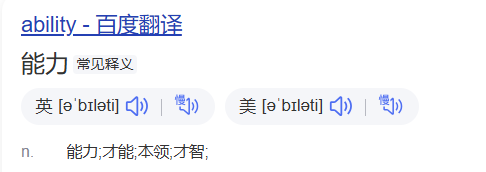
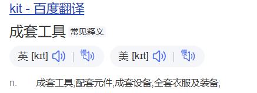
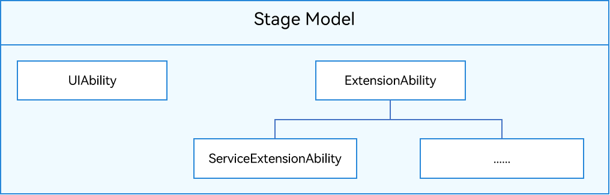
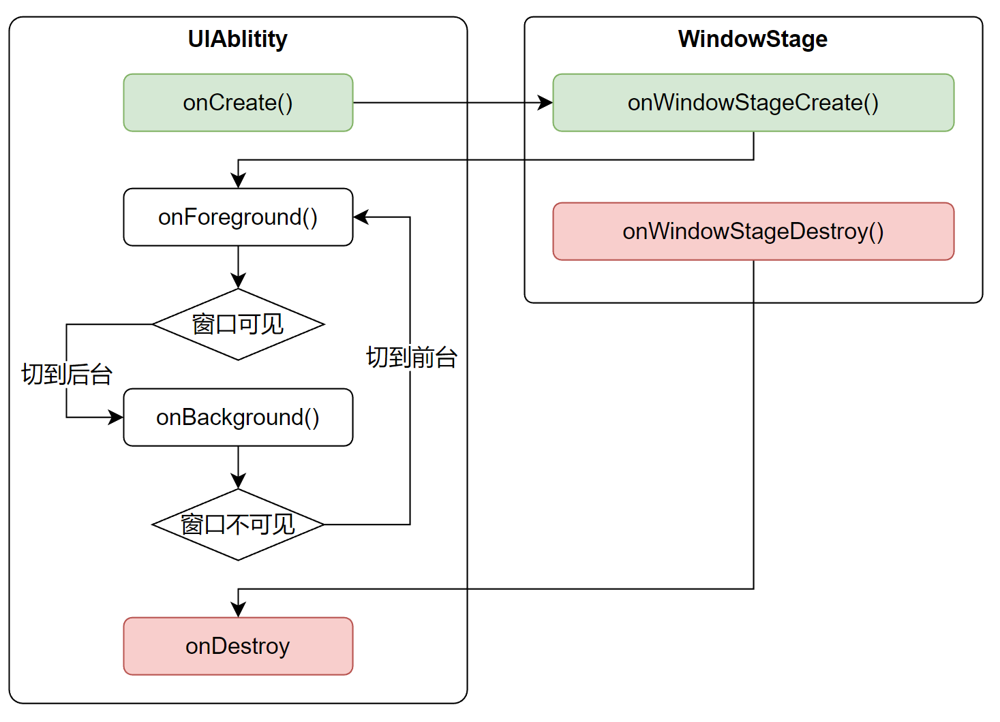
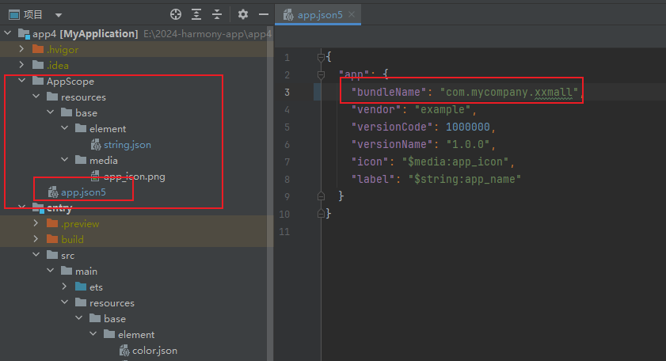
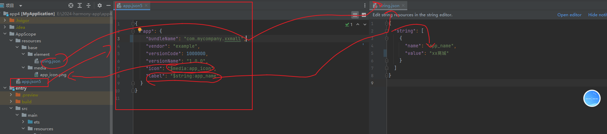
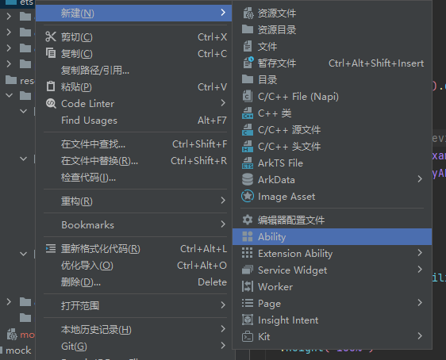
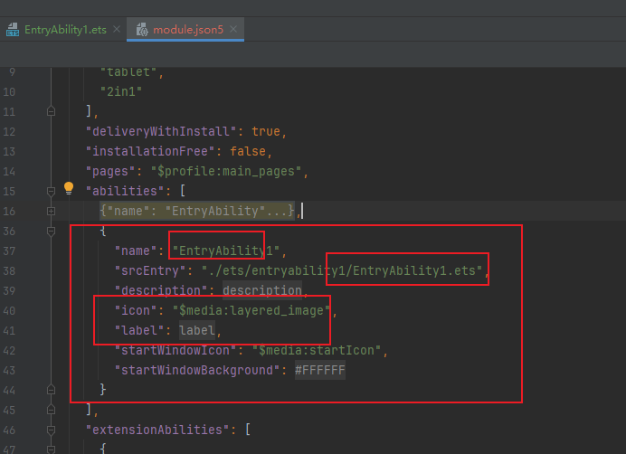
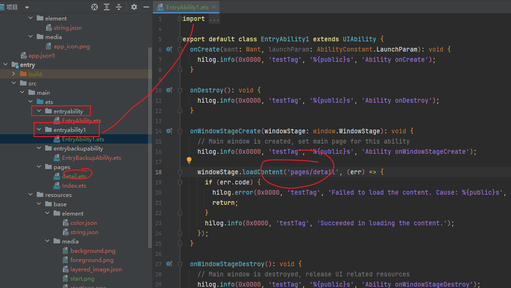
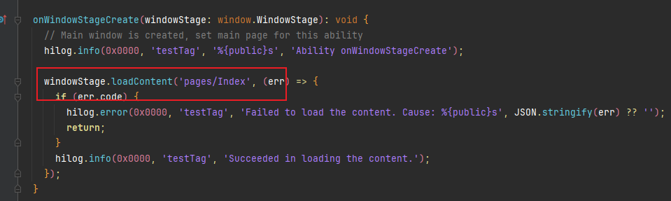

# Ability Kit简介





Ability Kit 能力工具包


Ability Kit（官方叫法 程序框架服务）提供了应用程序开发和运行的应用模型，是系统为开发者提供的应用程序所需能力的抽象提炼，它提供了应用程序必备的组件和运行机制。有了应用模型，开发者可以基于一套统一的模型进行应用开发，使应用开发更简单、高效


# 鸿蒙应用模型

# 

## 应用模型概述

**应用模型可以理解为HarmonyOS为开发者提供的应用程序开发规范，组织文件入口设置、生命周期、进程线程服务、配置项内容等，具有必备的组件和运行机制，让开发者在统一的模型进行应用开发，更简单、高效。**


应用模型是HarmonyOS为开发者提供的应用程序所需能力的抽象提炼，它提供了应用程序必备的组件和运行机制。有了应用模型，开发者可以基于一套统一的模型进行应用开发，使应用开发更简单、高效。


随着系统的演进发展，先后提供了两种应用模型：

- FA（Feature Ability）模型：从API 7开始支持的模型，已经不再主推。    
  -  FA   api6      根uniapp很相似    
- Stage模型：从API 9开始新增的模型，是目前主推且会长期演进的模型。在该模型中，由于提供了AbilityStage、WindowStage等类作为应用组件和Window窗口的“舞台”，因此称这种应用模型为Stage模型。


 FA模型与Stage模型差异概览

| 项目             | FA模型                                                       | Stage模型                                                    |
| :--------------- | :----------------------------------------------------------- | :----------------------------------------------------------- |
| **应用组件**     | 1. 组件分类 - PageAbility组件：包含UI，提供展示UI的能力。详细介绍请参见[PageAbility组件概述](https://developer.huawei.com/consumer/cn/doc/harmonyos-guides-V5/pageability-overview-V5)。- ServiceAbility组件：提供后台服务的能力，无UI。详细介绍请参见[ServiceAbility组件概述](https://developer.huawei.com/consumer/cn/doc/harmonyos-guides-V5/serviceability-overview-V5)。- DataAbility组件：提供数据分享的能力，无UI。详细介绍请参见[DataAbility组件概述](https://developer.huawei.com/consumer/cn/doc/harmonyos-guides-V5/dataability-overview-V5)。2. 开发方式通过导出匿名对象、固定入口文件的方式指定应用组件。开发者无法进行派生，不利于扩展能力。 | 1. 组件分类 - UIAbility组件：包含UI，提供展示UI的能力，主要用于和用户交互。详细介绍请参见[UIAbility组件概述](https://developer.huawei.com/consumer/cn/doc/harmonyos-guides-V5/uiability-overview-V5)。- ExtensionAbility组件：提供特定场景（如卡片、输入法）的扩展能力，满足更多的使用场景。详细介绍请参见[ExtensionAbility组件概述](https://developer.huawei.com/consumer/cn/doc/harmonyos-guides-V5/extensionability-overview-V5)。2. 开发方式采用面向对象的方式，将应用组件以类接口的形式开放给开发者，可以进行派生，利于扩展能力。 |
| **进程模型**     | 有两类进程：1. 主进程2. 渲染进程详细介绍请参见[进程模型](https://developer.huawei.com/consumer/cn/doc/harmonyos-guides-V5/process-model-fa-V5)。 | 有三类进程：1. 主进程2. ExtensionAbility进程3. 渲染进程详细介绍请参见[进程模型](https://developer.huawei.com/consumer/cn/doc/harmonyos-guides-V5/process-model-stage-V5)。 |
| **线程模型**     | 1. ArkTS引擎实例的创建一个进程可以运行多个应用组件实例，每个应用组件实例分别运行在单独的ArkTS引擎实例中。2. 线程模型每个ArkTS引擎实例都在一个单独线程（非主线程）上创建，主线程没有ArkTS引擎实例。3. 进程内对象共享：不支持。详细介绍请参见[线程模型](https://developer.huawei.com/consumer/cn/doc/harmonyos-guides-V5/thread-model-fa-V5)。 | 1. ArkTS引擎实例的创建一个进程可以运行多个应用组件实例，所有应用组件实例共享一个ArkTS引擎实例。2. 线程模型ArkTS引擎实例在主线程上创建。3. 进程内对象共享：支持。详细介绍请参见[线程模型](https://developer.huawei.com/consumer/cn/doc/harmonyos-guides-V5/thread-model-stage-V5)。 |
| **应用配置文件** | 使用config.json描述应用信息、HAP信息和应用组件信息。详细介绍请参见[应用配置文件概述（FA模型）](https://developer.huawei.com/consumer/cn/doc/harmonyos-guides-V5/application-configuration-file-overview-fa-V5)。 | 使用app.json5描述应用信息，module.json5描述HAP信息、应用组件信息。详细介绍请参见[应用配置文件概述（Stage模型）](https://developer.huawei.com/consumer/cn/doc/harmonyos-guides-V5/application-configuration-file-overview-stage-V5)。 |


## Stage模型基本概念

 

- UIAbility组件：包含UI，提供展示UI的能力，主要用于和用户交互。详细介绍请参见[UIAbility组件概述](https://developer.huawei.com/consumer/cn/doc/harmonyos-guides-V5/uiability-overview-V5)。

- ExtensionAbility组件：提供特定场景（如卡片、输入法）的扩展能力，满足更多的使用场景。详细介绍请参见[ExtensionAbility组件概述](https://developer.huawei.com/consumer/cn/doc/harmonyos-guides-V5/extensionability-overview-V5)。

  

  开发方式采用面向对象的方式，将应用组件以类接口的形式开放给开发者，可以进行派生，利于扩展能力。


下图展示了Stage模型中的基本概念。

**图1** Stage模型概念图


- [AbilityStage](https://developer.huawei.com/consumer/cn/doc/harmonyos-guides-V5/abilitystage-V5)

  每个Entry类型或者Feature类型的[HAP](https://developer.huawei.com/consumer/cn/doc/harmonyos-guides-V5/hap-package-V5)在运行期都有一个AbilityStage类实例，当[HAP](https://developer.huawei.com/consumer/cn/doc/harmonyos-guides-V5/hap-package-V5)中的代码首次被加载到进程中的时候，系统会先创建AbilityStage实例。

- [UIAbility组件](https://developer.huawei.com/consumer/cn/doc/harmonyos-guides-V5/uiability-overview-V5)和[ExtensionAbility组件](https://developer.huawei.com/consumer/cn/doc/harmonyos-guides-V5/extensionability-overview-V5)

  Stage模型提供UIAbility和ExtensionAbility两种类型的组件，这两种组件都有具体的类承载，支持面向对象的开发方式。

  - UIAbility组件是一种包含UI的应用组件，主要用于和用户交互。例如，图库类应用可以在UIAbility组件中展示图片瀑布流，在用户选择某个图片后，在新的页面中展示图片的详细内容。同时用户可以通过返回键返回到瀑布流页面。UIAbility组件的生命周期只包含创建/销毁/前台/后台等状态，与显示相关的状态通过WindowStage的事件暴露给开发者。
  - ExtensionAbility组件是一种面向特定场景的应用组件。开发者并不直接从ExtensionAbility组件派生，而是需要使用ExtensionAbility组件的派生类。目前ExtensionAbility组件有用于卡片场景的FormExtensionAbility，用于输入法场景的InputMethodExtensionAbility，用于闲时任务场景的WorkSchedulerExtensionAbility等多种派生类，这些派生类都是基于特定场景提供的。例如，用户在桌面创建应用的卡片，需要应用开发者从FormExtensionAbility派生，实现其中的回调函数，并在配置文件中配置该能力。ExtensionAbility组件的派生类实例由用户触发创建，并由系统管理生命周期。在Stage模型上，三方应用开发者不能开发自定义服务，而需要根据自身的业务场景通过ExtensionAbility组件的派生类来实现。

- [WindowStage](https://developer.huawei.com/consumer/cn/doc/harmonyos-guides-V5/application-window-stage-V5)

  每个UIAbility实例都会与一个WindowStage类实例绑定，该类起到了应用进程内窗口管理器的作用。它包含一个主窗口。也就是说UIAbility实例通过WindowStage持有了一个主窗口，该主窗口为ArkUI提供了绘制区域。

- [Context](https://developer.huawei.com/consumer/cn/doc/harmonyos-guides-V5/application-context-stage-V5)

  在Stage模型上，Context及其派生类向开发者提供在运行期可以调用的各种资源和能力。UIAbility组件和各种ExtensionAbility组件的派生类都有各自不同的Context类，他们都继承自基类Context，但是各自又根据所属组件，提供不同的能力。


Stage模型贯穿一个鸿蒙应用的整个生命周期，从源码到编译再到运行，都会涉及到Stage模型相关的概念。


## Stage模型UIAblitity生命周期函数

**UIAblitity**是**Stage**模型中最常用的组件，其生命周期函数及调用时机如下

- `onCreate()`：当UIAblitity实例创建完成时被调用，可在该函数中进行应用的初始化操作，例如定义全局变量
- `onForeground()`：当UIAblitity实例切换至前台时被调用，可在该函数中加载所需的系统资源
- `onBackground()`：当UIAblitity实例切换至后台时被调用，可在函数中释放系统资源，以节省系统资源的消耗
- `onDestroy()`：当UIAblitity实例销毁时被调用，可在该函数中释放系统资源，保存数据等

另外WindowStage也有两个生命周期函数，如下

- `onWindowStageCreate()`：当WindowStage实例创建时被调用，可在该函数中设置应用加载的初始页面
- `onWindowStageDestroy()`：当WindowStage实例销毁时被调用

上述函数的调用时序如下图所示



# Stage模型配置文件

基于Stage模型创建的工程，有两个重要的配置文件，一个是应用级的配置文件`app.json5`，另一个是模块级的`module.json5`。

`app.json5`用于配置整个应用的基本信息，包括应用的包名、开发厂商、版本号等。

`module.json5`用于配置当前模块的各项信息，包括基本信息（例如名称、类型、描述、支持的设备类型等）、Ablitity组件信息、所需权限等

具体内容可参考官方文档：[app.json5配置文件](https://developer.huawei.com/consumer/cn/doc/harmonyos-guides-V2/app-configuration-file-0000001427584584-V2)、[module.json5配置文件](


在开发应用时，需要配置应用的一些标签，例如应用的包名、图标等标识特征的属性。本文描述了在开发应用需要配置的一些关键标签。

## 应用包名配置

应用需要在工程的AppScope目录下的[app.json5配置文件](https://developer.huawei.com/consumer/cn/doc/harmonyos-guides-V5/app-configuration-file-V5)中配置bundleName标签，该标签用于标识应用的唯一性。推荐采用反域名形式命名（如com.example.demo，建议第一级为域名后缀com，第二级为厂商/个人名，第三级为应用名，也可以多级）。




## 图标和标签配置

图标和标签通常一起配置，对应[app.json5配置文件](https://developer.huawei.com/consumer/cn/doc/harmonyos-guides-V5/app-configuration-file-V5)和[module.json5配置文件](https://developer.huawei.com/consumer/cn/doc/harmonyos-guides-V5/module-configuration-file-V5)中的icon和label标签。DevEco Studio从5.0.3.800版本开始，不再对module.json5中的icon和label做强制校验，因此module.json5与app.json5只需要选择其一配置。




### 配置示例

- **方式一：配置app.json5**

  ```json
  { 
      "app": {   
          "icon": "$media:app_icon",   
          "label": "$string:app_name"    
          // ...  
      }
  }
  ```

- **方式二：配置module.json5**

  如果需要在桌面显示UIAbility图标，除了需要配置icon与label字段，还需要在skills标签下面的entities中添加"entity.system.home"、actions中添加"ohos.want.action.home"。

  
  
  注意：这里的icon和label配置 会覆盖 app.json5中的配置，显示到桌面上
  
  
  
  ```json
  {
    "module": {
       ...
      "abilities": [
        {
          "name": "EntryAbility",
          "srcEntry": "./ets/entryability/EntryAbility.ets",
          "description": "$string:EntryAbility_desc",
          "icon": "$media:start",
          "label": "$string:EntryAbility_label",
          "startWindowIcon": "$media:startIcon",
          "startWindowBackground": "$color:start_window_background",
          "exported": true,
          "skills": [
            {
              "entities": [
                "entity.system.home"
              ],
              "actions": [
                "action.system.home"
              ]
            }
          ]
        },
       
      ],
     
    }
  }
  ```


## 应用版本声明配置

应用版本声明需要在工程的AppScope目录下的[app.json5配置文件](https://developer.huawei.com/consumer/cn/doc/harmonyos-guides-V5/app-configuration-file-V5)中配置versionCode标签和versionName标签。versionCode用于标识应用的版本号，该标签值为32位非负整数。此数字仅用于确定某个版本是否比另一个版本更新，数值越大表示版本越高。versionName标签标识版本号的文字描述。

## Module权限配置

Module访问系统或其他应用受保护部分所需的权限信息需要在[module.json5配置文件](https://developer.huawei.com/consumer/cn/doc/harmonyos-guides-V5/module-configuration-file-V5)中配置[requestPermissions标签](https://developer.huawei.com/consumer/cn/doc/harmonyos-guides-V5/declare-permissions-V5)。该标签用于声明需要申请权限的名称、申请权限的原因以及权限使用的场景。


## UIAbility组件

### 概述

- UIAbility的设计理念：

1. 原生支持应用组件级的跨端迁移和多端协同。
2. 支持多设备和多窗口形态！！！。


- 对于开发者而言，可以根据具体场景选择单个还是多个UIAbility，划分建议如下：

  - 如果开发者希望在任务视图中看到一个任务，则建议使用一个UIAbility，多个页面的方式。

  - 如果开发者希望在任务视图中看到多个任务，或者需要同时开启多个窗口，则建议使用多个UIAbility开发不同的模块功能。

    例如微信视频号、小程序     苹果系统下永远是一个任务；安卓/华为多个  大家可以自己试试


- UIAbility核心配置

为使应用能够正常使用UIAbility，需要在[module.json5配置文件](https://developer.huawei.com/consumer/cn/doc/harmonyos-guides/module-configuration-file-0000001820879553)的[abilities标签](https://developer.huawei.com/consumer/cn/doc/harmonyos-guides/module-configuration-file-0000001820879553#ZH-CN_TOPIC_0000001811158666__abilities标签)中声明UIAbility的名称、入口、标签等相关信息。

```
{
  "module": {
    ...
    "abilities": [  // 一个项目可以有多个UIAbility  例如微信    但是第一个是app的图标 
      {
        "name": "EntryAbility", // UIAbility组件的名称!!!!  可以用于跳转
        "srcEntry": "./ets/entryability/EntryAbility.ets", // UIAbility组件的代码路径
        "description": "$string:EntryAbility_desc", // UIAbility组件的描述信息
        "icon": "$media:icon", // UIAbility组件的图标!!!
        "label": "$string:EntryAbility_label", // UIAbility组件的标签!!!!
        "startWindowIcon": "$media:icon", // UIAbility组件启动页面图标资源文件的索引
        "startWindowBackground": "$color:start_window_background", // UIAbility组件启动页面背景颜色资源文件的索引
        ...
      }
    ]
  }
}
```


### 基础使用

1、创建一个【商品详情】页面，并声明路由  main_pages.json   （咱们有了就不搞了）

2、创建任务/窗口/Ability     并打开修改他加载的【商品】页面    （会生成1个文件，修改这个文件里面需要加载的页面）




module.json中会自动生成这个Ability     配置信息







3、通过startAbility打开新窗口

index页面中

````
import { common, Want } from '@kit.AbilityKit';


@Entry
@Component
struct Index {
	//获取应用上下文对象
  private context = getContext(this) as common.UIAbilityContext;

  build() {
    Column() {
      Text('全国领导人大会简章')
      Text($r('app.string.hello'))


      Button('打开花小猪小程序').onClick((event: ClickEvent) => {
        const want: Want = {
          // Want参数信息
          deviceId: '', // deviceId为空表示本设备
          bundleName: 'com.mycompany.xxmall',  //这里要换成 app.json中配置的 com.xxx.xx 应用id
          abilityName: 'EntryAbility1',//这里换成对应abilityName
          parameters: {
            id: 1111,
            other: 2
          }
        };
        this.context.startAbility(want);
      })
    }
  }
}
````


### UIAbility传参

 

- 点击传参

````
 // 打开窗口
              const context = getContext(this) as common.UIAbilityContext
              context.startAbility({
                bundleName: context.abilityInfo.bundleName,
                abilityName: 'GoodsDetailAbility',
                parameters: {
                  a:1,
                  b:2,
                  goodsTitle: item.title,
                  goodsImg: item.imageUrl,
                }
              })
````

- 收（小心Ability首次是创建，后续用的缓存 也就是onCreate不触发了 仅仅触发onNewWant）

```
onCreate(want: Want, launchParam: AbilityConstant.LaunchParam): void {
    // 需 求：把 窗口数据 <=> 页面
   	console.log(want.parameters?.goodsImg+'')
   	AppStorage.setOrCreate('goodsImg', want.parameters?.goodsImg)
    AppStorage.setOrCreate('goodsTitle', want.parameters?.goodsTitle)

    hilog.info(0x0000, 'testTag', '%{public}s', 'Ability onCreate');
  }

 

```


- 使用

```
@Entry
@Component
struct GoodsDetail {

  @StorageProp('goodsImg') goodsImg:string = ''
  @StorageProp('goodsTitle') goodsTitle:string = ''
  
  
    // 图片
      Image(this.goodsImg)
        .width('100%')
        .height(280)
      // 图片
```


### 生命周期

当用户打开、切换和返回到对应应用时，应用中的UIAbility实例会在其生命周期的不同状态之间转换。UIAbility类提供了一系列回调，通过这些回调可以知道当前UIAbility实例的某个状态发生改变，会经过UIAbility实例的创建和销毁，或者UIAbility实例发生了前后台的状态切换。

UIAbility的生命周期包括Create、Foreground、Background、Destroy四个状态，如下图所示。

**图1** **UIAbility生命周期状态**

   

**WindowStageCreate和WindowStageDestroy状态**

UIAbility实例创建完成之后，在进入Foreground之前，系统会创建一个WindowStage。WindowStage创建完成后会进入onWindowStageCreate()回调，可以在该回调中设置UI加载、设置WindowStage的事件订阅。

**图2** WindowStageCreate和WindowStageDestroy状态 

      


这里可以控制 UIAbility 加载的页面

