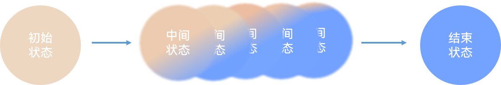

# 动画


动画可以在UI界面发生变化时，提供渐变过渡效果，提升用户体验。动画的实现原理是通过在一段时间内连续播放一系列静止画面（帧），从而产生流畅的视觉效果。

在鸿蒙应用中，实现动画效果非常方便，我们只需明确组件的初始状态和结束状态，并配置一些动画相关的参数（动画时长），系统就会自动的生成中间的过度状态，并呈现出动画效果。



在鸿蒙应用中，开发者可以为组件配置两类动画效果，

一是组件的布局相关属性（如尺寸、位置等）发生变化时的**布局更新动画**，

二是组件出现或消失时的**组件转场动画**

## 布局更新动画

布局更新动画可通过两种方式实现，分别是**显式动画**和**属性动画**。

### 显式动画

`animateTo()`是一个全局的动画函数，该函数可用于触发动画效果，定义如下

```typescript
animateTo(value: AnimateParam, event: () => void): void

```

该函数共有两个参数，分别是

- **动画参数**

该参数用于设置动画时长、属性值变化曲线等等，其类型为`AnimateParam`，其包含的属性有

duration:number动画持续时间，单位为毫秒，默认值为1000

curve:[Curve](https://developer.huawei.com/consumer/cn/doc/harmonyos-references-V2/ts-appendix-enums-0000001478061741-V2#ZH-CN_TOPIC_0000001574248789__curve)动画曲线

delay:number延迟播放，单位为毫秒，默认值为0

iterations:number循环播放次数，默认值为1

playMode:[PlayMode](https://developer.huawei.com/consumer/cn/doc/harmonyos-references-V2/ts-appendix-enums-0000001478061741-V2#ZH-CN_TOPIC_0000001574248789__playmode)动画播放模式

#### PlayMode

从API version 9开始，该接口支持在ArkTS卡片中使用。

| 名称             | 描述                                                         |
| :--------------- | :----------------------------------------------------------- |
| Normal           | 动画按正常播放。                                             |
| Reverse          | 动画反向播放。                                               |
| Alternate        | 动画在奇数次（1、3、5...）正向播放，在偶数次（2、4、6...）反向播放。 |
| AlternateReverse | 动画在奇数次（1、3、5...）反向播放，在偶数次（2、4、6...）正向播放。 |

onFinish() => void动效播放完成回调


- **匿名函数**

该函数用于修改组件的属性，由该函数导致的组件布局变化，都会产生动画效果。


```
@Entry
@Component
struct Index {
  @State message: string = 'Hello World';
  @State num: number = 100

  build() {
    Column() {
      Row() {
      }.backgroundColor(Color.Gray).height(this.num).width(this.num)

      Blank()
      Button('改变').onClick(() => {
        animateTo({
          duration: 2000,
          curve: Curve.EaseInOut,
          // delay:1000,
          // iterations:2,
          // playMode:PlayMode.Alternate
        }, () => {
          this.num = 200

        })
      })
      Button('恢复').onClick(() => {
        animateTo({ duration: 2000 }, () => {
          this.num = 100

        })
      })


    }
    .height('100%')
    .width('100%')
  }
}
```


### 属性动画

`animation()`是一个组件的属性方法，该方法同样可用于实现动画效果。使用该方法实现动画效果时需要注意两点，第一点是该方法的参数，其类型为`AnimateParam`，用于配置动画时长、动画曲线等参数。第二点是该属性方法的位置，用于产生动画效果的属性方法必须位于`animation()`之前，例如

```typescript
 Row() {
      }.backgroundColor(Color.Gray).height(this.num).width(this.num).animation({
        duration:1000
      })

```

配置完`animation()`属性后，只要我们修改其之前的属性，就会产生相应的动画效果。

```
@Entry
@Component
struct Index {
  @State message: string = 'Hello World';
  @State num: number = 100

  build() {
    Column() {
      Row() {
      }.backgroundColor(Color.Gray).height(this.num).width(this.num).animation({
        duration:1000
      })

      Blank()
      Button('改变').onClick(() => {
        this.num = 200
      })
      Button('恢复').onClick(() => {
          this.num = 100

      })


    }
    .height('100%')
    .width('100%')
  }
}
```


##  组件转场动画

组件转场效果需要通过`transition()`属性和`animateTo()`方法来实现。

其中`transition()`属性方法来设置组件的转场效果，支持的效果有平移、透明度、旋转、缩放等，`animateTo()`用于触发上述的组件转场动画效果，

具体用法如下

```typescript
@State flag:boolean = false; //状态变量，用于控制组件出现或消失

if(this.flag){
  Text('hello world')
    .transition(TransitionEffect.OPACITY) //transition()用于设置组件的转场效果,参数TransitionEffect 设置具体的效果
}

Button('出现')
  .onClick(() => {
    //animateTo()用于触发动画效果
    animateTo({ duration: 1000, curve: Curve.Linear, iterations: 1 }, () => {
      this.flag = true;
    })
  })

```

`transition()`方法的参数类型为`TransitionEffect`，其包含的属性有

[transition](https://developer.huawei.com/consumer/cn/doc/harmonyos-references-V5/ts-transition-animation-component-V5)是基础的组件转场接口，用于实现一个组件出现或者消失时的动画效果。可以通过[TransitionEffect对象](https://developer.huawei.com/consumer/cn/doc/harmonyos-references-V5/ts-transition-animation-component-V5#transitioneffect10对象说明)的组合使用，定义出各式效果。

**表1** 转场效果接口

| 转场效果  | 说明                                                         | 动画                                                         |
| :-------- | :----------------------------------------------------------- | :----------------------------------------------------------- |
| IDENTITY  | 禁用转场效果。                                               | 无。                                                         |
| OPACITY   | 默认的转场效果，透明度转场。                                 | 出现时透明度从0到1，消失时透明度从1到0。                     |
| SLIDE     | 滑动转场效果。                                               | 出现时从窗口左侧滑入，消失时从窗口右侧滑出。                 |
| translate | 通过设置组件平移创建转场效果。                               | 出现时为translate接口设置的值到默认值0，消失时为默认值0到translate接口设置的值。 |
| rotate    | 通过设置组件旋转创建转场效果。                               | 出现时为rotate接口设置的值到默认值0，消失时为默认值0到rotate接口设置的值。 |
| opacity   | 通过设置透明度参数创建转场效果。                             | 出现时为opacity设置的值到默认透明度1，消失时为默认透明度1到opacity设置的值。 |
| move      | 通过[TransitionEdge](https://developer.huawei.com/consumer/cn/doc/harmonyos-references-V5/ts-transition-animation-component-V5#transitionedge10)创建从窗口哪条边缘出来的效果。 | 出现时从TransitionEdge方向滑入，消失时滑出到TransitionEdge方向。 |
| combine   | 组合其他TransitionEffect。                                   | 组合其他TransitionEffect，一起生效。                         |
| animation | 定义转场效果的动画参数：- 如果不定义会跟随animateTo的动画参数。- 不支持通过控件的animation接口配置动画参数。- TransitionEffect中animation的onFinish不生效。 | 调用顺序时从上往下，上面TransitionEffect的animation也会作用到下面Transiti |


```
// 出现时会是所有转场效果的出现效果叠加，消失时会是所有消失转场效果的叠加
  // 用于说明各个effect跟随的动画参数
  // 第一步，创建TransitionEffect
  private effect: TransitionEffect =
    // 创建默认透明度转场效果,并指定了springMotion(0.6, 0.8)曲线
    TransitionEffect.OPACITY.animation({
      curve: curves.springMotion(0.6, 0.8)
    })// 通过combine方法,这里的动画参数会跟随上面的TransitionEffect，也就是springMotion(0.6, 0.8)
      .combine(TransitionEffect.scale({
        x: 0,
        y: 0
      }))// 添加旋转转场效果，这里的动画参数会跟随上面带animation的TransitionEffect，也就是springMotion(0.6, 0.8)
      .combine(TransitionEffect.rotate({ angle: 90 }))// 添加平移转场效果，这里的动画参数使用指定的springMotion()
      .combine(TransitionEffect.translate({ y: 150 })
        .animation({ curve: curves.springMotion() }))// 添加move转场效果，这里的动画参数会跟随上面的TransitionEffect，也就是springMotion()
      .combine(TransitionEffect.move(TransitionEdge.END))
```


例子

```
import { curves } from '@kit.ArkUI';

@Entry
@Component
struct Index {
  @State flag:boolean = false; //状态变量，用于控制组件出现或消失

  // 出现时会是所有转场效果的出现效果叠加，消失时会是所有消失转场效果的叠加
  // 用于说明各个effect跟随的动画参数
  // 第一步，创建TransitionEffect
  private effect: TransitionEffect =
    // 创建默认透明度转场效果,并指定了springMotion(0.6, 0.8)曲线
    TransitionEffect.OPACITY.animation({
      curve: curves.springMotion(0.6, 0.8)
    })// 通过combine方法,这里的动画参数会跟随上面的TransitionEffect，也就是springMotion(0.6, 0.8)
      .combine(TransitionEffect.scale({
        x: 0,
        y: 0
      }))// 添加旋转转场效果，这里的动画参数会跟随上面带animation的TransitionEffect，也就是springMotion(0.6, 0.8)
      .combine(TransitionEffect.rotate({ angle: 90 }))// 添加平移转场效果，这里的动画参数使用指定的springMotion()
      .combine(TransitionEffect.translate({ y: 150 })
        .animation({ curve: curves.springMotion() }))// 添加move转场效果，这里的动画参数会跟随上面的TransitionEffect，也就是springMotion()
      .combine(TransitionEffect.move(TransitionEdge.END))

  build() {
    Column() {
      if(this.flag){
        Row() {
        }.backgroundColor(Color.Gray).height(200).width(200)
        .transition(this.effect)
      }

      Blank()

      Button('改变').onClick(() => {
        //animateTo()用于触发动画效果
        animateTo({ duration: 1000, curve: Curve.Linear, iterations: 1 }, () => {
          this.flag = !this.flag
        })
      })


    }
    .height('100%')
    .width('100%')
  }
}
```

