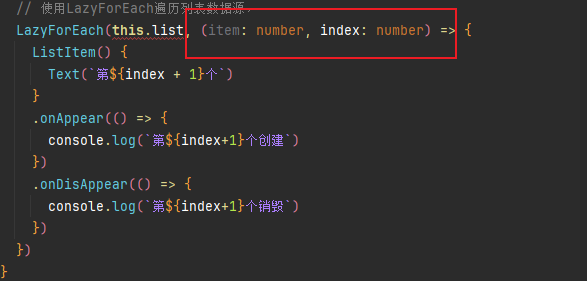
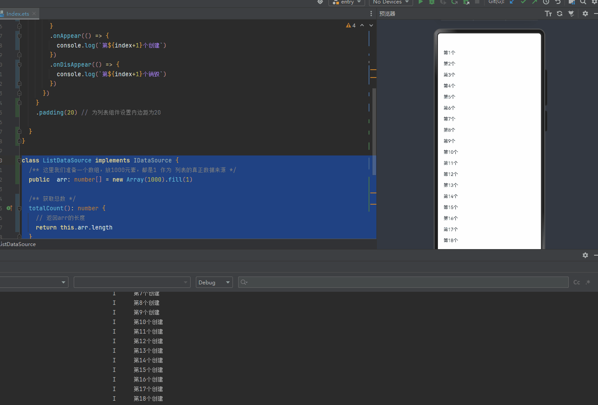
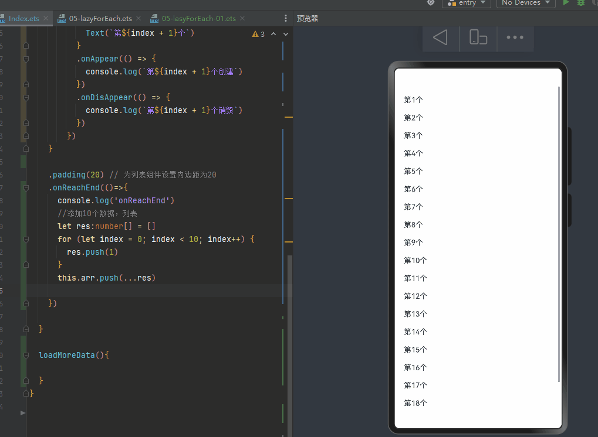

# LazyForEach：数据懒加载


 循环渲染（ForEach）适用于短列表，当构建具有大量列表项的长列表时，如果直接采用循环渲染方式，会一次性加载所有的列表元素，会导致页面启动时间过长，影响用户体验。因此，推荐使用数据懒加载（LazyForEach）方式实现按需迭代加载数据，从而提升列表性能


LazyForEach从提供的数据源中按需迭代数据，并在每次迭代过程中创建相应的组件。当在滚动容器中使用了LazyForEach，框架会根据滚动容器可视区域按需创建组件，当组件滑出可视区域外时，框架会进行组件销毁回收以降低内存占用。

## LazyForEach接口描述

```typescript
LazyForEach(
    dataSource: IDataSource,             // 需要进行数据迭代的数据源
    itemGenerator: (item: any, index: number) => void,  // 子组件生成函数
    keyGenerator?: (item: any, index: number) => string // 键值生成函数
): void
```

这个看起来跟ForEach一样，但是一个参数不一样！！不是一个数组


LazyForEach使用的时候需要传入三个参数

​		第一个参数，传入 数据源，这个数据元素类型不是数组，**必须是一个实现了IDataSource接口的对象**

​		第二个参数是一个item生成函数，第一个参数是item，也就是元素，第二个元素是下标  （跟ForEach一样）

​        第三个参数  key生成函数（跟ForEach一样）

```
    
 build(){
    List({ space: 20 }) { 
     // 使用LazyForEach遍历列表数据源list，list必须实现了IDataSource接口
      LazyForEach(this.list, (item: number, index: number) => { 
        ListItem() { // 为每个列表项创建一个ListItem组件
          Text(`第${index + 1}个`) // 在ListItem中添加一个文本组件，显示当前项的索引
        }
      })
    }
 
 
 }

```

 Q：LazyForEach既然不是数组，那么数据item，从哪里来？ ，LazyForEach是在遍历谁？

 A：数据源 肯定和   IDataSource 这个接口有关系


接下来，我们来了解一下IDataSource

## IDataSource

这里最重要的一点要记住，LazyForEach的第一个参数，**必须是一个实现了IDataSource接口的对象** 

-----所以我们要先定义一个类，让这个类实现IDataSource接口，然后再说这个接口有啥要求

-----一个类型实现（ts中约束类的一种方法）一个接口的意思是，我们必须让这个类里面的代码，实现这个接口里面规定的方法和属性（可以扩展其他属性和方法）

​		使用class定义类，后面跟 implements（实现） 再跟对应的接口

```
class ListDataSource implements IDataSource {
 
}
```

上面就表示ListDataSource 要实现IDataSource接口里面规定的属性和方法，否则就会报错！！


使用起来像是下面那样，LazyForEach组件传入一个ListD对象ataSource

```
  LazyForEach(new ListDataSource() )
```


直接写一个字面量对象，断言他是IDataSource类型，这样也行

```
LazyForEach({} as IDataSource)
```


### IDataSource接口-类型说明

```
interface IDataSource {
    totalCount(): number; // 获得数据总数
    getData(index: number): Object; // 获取索引值对应的数据
    registerDataChangeListener(listener: DataChangeListener): void; // 注册数据改变的监听器
    unregisterDataChangeListener(listener: DataChangeListener): void; // 注销数据改变的监听器
}
```


### 字面量写法

#### 1-totalCount 方法返回数据总数  （重要，框架底层调用的，类似于回调函数）

​       假如我们有1000条数据，LazyForEach  不会全部都创建显示到屏幕上，只会创建几个，会节省内存！

​		LazyForEach 内部会根据数据总数，和每一个ListItem组件的高度，来计算 屏幕 到底要创建一个元素，来显示到屏幕上！底层自己的算的！我们只需要通过这个返回，返回数据的总条数即可！


​			--这里我们准备一个数组，放1000元素，元素都是1 作为 列表的真正数据来源（加入1000数据都要显示到页面中）

​			--实现totalCount 方法，放回数组的长度

```
      // 使用LazyForEach遍历列表数据源，
      LazyForEach({
        totalCount:()=>{
          return 列表数据的总数据量
        }
      } as IDataSource,
      ...
     )
```


代码

```
@Entry
  // 标记为入口组件
@Component
  // 标记为组件
struct LazyForEachCase {
  // 数组
  public  arr: number[] = new Array(100000).fill(1)

  build() {
    // 构建组件的UI结构
    List({ space: 20 }) {
      // 使用LazyForEach遍历列表数据源，
      LazyForEach({
        totalCount:()=>{
          return this.arr.length
        }
      } as IDataSource,
       //listItem生成器函数 
      (item: number, index: number) => {
          ListItem() {
            Text(`第${index + 1}个`)
          }
          
        })
    }
    .padding(20) // 为列表组件设置内边距为20

  }
}

```


#### 2-getData 方法根据索引获取数据项（重要，框架底层调用的，类似于回调函数）

实现getData  方法，参数是index，数组的下标，我返回数组的对应下标的元素即可

```
  getData(index: number): number {
    return 列表中的每一项的数据
    return this.arr[index]
  }
```

这里我们renturn了数组的一个元素，这个元素有什么用呢？

看下图，就在LazyForEach  第二个参数里面，那个item就是这里返回的对应的元素，index是他的下标




至此列表懒加载功能已经实现了


代码

```
@Entry
  // 标记为入口组件
@Component
  // 标记为组件
struct LazyForEachCase {
  // 数组
  public  arr: number[] = new Array(100000).fill(1)

  build() {
    // 构建组件的UI结构
    List({ space: 20 }) {
      // 使用LazyForEach遍历列表数据源，
      LazyForEach({
        getData:(index: number)=> {
          return this.arr[index]
        },
        totalCount:()=>{
          return this.arr.length
        }
      } as IDataSource,
        (item: number, index: number) => {
          ListItem() {
            Text(`第${index + 1}个`)
          }
          .onAppear(() => {
            console.log(`第${index + 1}个创建`)
          })
          .onDisAppear(() => {
            console.log(`第${index + 1}个销毁`)
          })
        })
    }
    .padding(20) // 为列表组件设置内边距为20

  }
}

```


我们监听ListItem组件的onAppear和onDisAppear事件，可以知道这个组件什么时候被创建，什么时候被销毁。


滚动屏幕，通过打印会发现，1000个元素不会都渲染到屏幕上，只有能显示到屏幕上的才会被创建和显示。其他都被销毁了，手机上不会同时创建1000个组件，同时存在的只有一些组件，非常节省内存！，即使100万条数据也能无忧展示！


### 类的写法


ListDataSource 类作为数据源，实现了 IDataSource 接口。

它内部要实现四个方法

#### 1-totalCount 方法返回数据总数  （重要，框架底层调用的，类似于回调函数）

​       假如我们有1000条数据，LazyForEach  不会全部都创建显示到屏幕上，只会创建几个，会节省内存！

​		LazyForEach 内部会根据数据总数，和每一个ListItem组件的高度，来计算 屏幕 到底要创建一个元素，来显示到屏幕上！底层自己的算的！我们只需要通过这个返回，返回数据的总条数即可！


​			--这里我们准备一个数组，放1000元素，元素都是1 作为 列表的真正数据来源（加入1000数据都要显示到页面中）

​			--实现totalCount 方法，放回数组的长度


```
class ListDataSource implements IDataSource {
  /** 这里我们准备一个数组，放1000元素，元素都是1 作为 列表的真正数据来源 */
  public  arr: number[] = new Array(1000).fill(1)

  /** 获取总数 */
  totalCount(): number {
    // 返回arr的长度
    return this.arr.length
  }

}
```

然后使用ListDataSource创建一个对象，给LazyForEach

```
@Entry // 标记为入口组件
@Component // 标记为组件
struct LazyForEachCase {
   //++++++
  // 初始化列表数据源
  list: ListDataSource = new ListDataSource();
  aboutToAppear(): void {

  }
  build() {
    // 构建组件的UI结构
    List({ space: 20 }) {
       //++++++
      // 使用LazyForEach遍历列表数据源，
      LazyForEach(this.list, (item: number, index: number) => {
        ListItem() {
          Text(`第${index + 1}个`)
        }
        .onAppear(() => {
          console.log(`第${index+1}个创建`)
        })
        .onDisAppear(() => {
          console.log(`第${index+1}个销毁`)
        })
      })
    }
    .padding(20) // 为列表组件设置内边距为20

  }
}
```


这里会报错，继续实现其他方法

#### 2-getData 方法根据索引获取数据项（重要，框架底层调用的，类似于回调函数）

实现getData  方法，参数是index，数组的下标，我返回数组的对应下标的元素即可

```
  getData(index: number): number {
    return this.arr[index]
  }
```

这里我们renturn了数组的一个元素，这个元素有什么用呢？

看下图，就在LazyForEach  第二个参数里面，那个item就是这里返回的对应的元素，index是他的下标


至此列表懒加载功能已经实现了


我们监听ListItem组件的onAppear和onDisAppear事件，可以知道这个组件什么时候被创建，什么时候被销毁。


滚动屏幕，通过打印会发现，1000个元素不会都渲染到屏幕上，只有能显示到屏幕上的才会被创建和显示。其他都被销毁了，手机上不会同时创建1000个组件，同时存在的只有一些组件，非常节省内存！，即使100万条数据也能无忧展示！

```
ListItem() {
          Text(`第${index + 1}个`)
        }
        .onAppear(() => {
          console.log(`第${index+1}个创建`)
        })
        .onDisAppear(() => {
          console.log(`第${index+1}个销毁`)
        })
```

虽然剩下的两个方法目前没有什么用，但是不实现也会报错！所及继续实现它，里面做个打印就好


#### 3-registerDataChangeListener   方法用于注册数据变化监听器（框架底层调用的）

#### 4- unregisterDataChangeListener 方法用于移除数据变化监听器（框架底层调用的）


```
class ListDataSource implements IDataSource {
  /** 这里我们准备一个数组，放1000元素，都是1 作为 列表的真正数据来源 */
  public  arr: number[] = new Array(1000).fill(1)

  /** 获取总数 */
  totalCount(): number {
    // 返回arr的长度
    return this.arr.length
  }
  getData(index: number): number {
    return this.arr[index]
  }

  registerDataChangeListener(listener: DataChangeListener): void {
    console.log('registerDataChangeListener')
  }
  unregisterDataChangeListener(listener: DataChangeListener): void {
    console.log('unregisterDataChangeListener')
  }
}
```


通过这种方式，LazyForEach 能够与数据源紧密协作，实现高效的数据展示和动态更新 （本质上就会js中的回调函数）


### 这


| 接口声明                                                     | 参数类型                                                     | 说明                                                     |
| :----------------------------------------------------------- | :----------------------------------------------------------- | :------------------------------------------------------- |
| totalCount(): number                                         | -                                                            | 获得数据总数。                                           |
| getData(index: number): any                                  | number                                                       | 获取索引值index对应的数据。index：获取数据对应的索引值。 |
| registerDataChangeListener(listener:[DataChangeListener](https://developer.huawei.com/consumer/cn/doc/harmonyos-guides-V2/arkts-rendering-control-lazyforeach-0000001524417213-V2#ZH-CN_TOPIC_0000001523648414__datachangelistener类型说明)): void | [DataChangeListener](https://developer.huawei.com/consumer/cn/doc/harmonyos-guides-V2/arkts-rendering-control-lazyforeach-0000001524417213-V2#ZH-CN_TOPIC_0000001523648414__datachangelistener类型说明) | 注册数据改变的监听器。listener：数据变化监听器           |
| unregisterDataChangeListener(listener:[DataChangeListener](https://developer.huawei.com/consumer/cn/doc/harmonyos-guides-V2/arkts-rendering-control-lazyforeach-0000001524417213-V2#ZH-CN_TOPIC_0000001523648414__datachangelistener类型说明)): void | [DataChangeListener](https://developer.huawei.com/consumer/cn/doc/harmonyos-guides-V2/arkts-rendering-control-lazyforeach-0000001524417213-V2#ZH-CN_TOPIC_0000001523648414__datachangelistener类型说明) | 注销数据改变的监听器。listener：数据变化监听器           |



看打印！进入屏幕的会创建，离开屏幕的会被销毁

测试一下100万条数据，会不会正常显示


## 使用限制

- LazyForEach必须在容器组件内使用，仅有List、Grid、Swiper以及WaterFlow组件支持数据懒加载（可配置cachedCount属性，即只加载可视部分以及其前后少量数据用于缓冲），其他组件仍然是一次性加载所有的数据。
- LazyForEach在每次迭代中，必须创建且只允许创建一个子组件。
- 生成的子组件必须是允许包含在LazyForEach父容器组件中的子组件。
- 允许LazyForEach包含在if/else条件渲染语句中，也允许LazyForEach中出现if/else条件渲染语句。
- 键值生成器必须针对每个数据生成唯一的值，如果键值相同，将导致键值相同的UI组件渲染出现问题。
- LazyForEach必须使用DataChangeListener对象来进行更新，第一个参数dataSource使用状态变量时，状态变量改变不会触发LazyForEach的UI刷新。
- 为了高性能渲染，通过DataChangeListener对象的onDataChange方法来更新UI时，需要生成不同于原来的键值来触发组件刷新。


## 键值生成规则

在LazyForEach循环渲染过程中，系统会为每个item生成一个唯一且持久的键值，用于标识对应的组件。当这个键值变化时，ArkUI框架将视为该数组元素已被替换或修改，并会基于新的键值创建一个新的组件。

LazyForEach提供了一个名为keyGenerator的参数，这是一个函数，开发者可以通过它自定义键值的生成规则。如果开发者没有定义keyGenerator函数，则ArkUI框架会使用默认的键值生成函数，即(item: any, index: number) => { return viewId + '-' + index.toString(); }, viewId在编译器转换过程中生成，同一个LazyForEach组件内其viewId是一致的。


## 案例代码

```
@Entry // 标记为入口组件
@Component // 标记为组件
struct LazyForEachCase {
  // 初始化列表数据源
  list: ListDataSource = new ListDataSource();
  aboutToAppear(): void {

  }
  build() {
    // 构建组件的UI结构
    List({ space: 20 }) {
      // 使用LazyForEach遍历列表数据源，
      LazyForEach(this.list, (item: number, index: number) => {
        ListItem() {
          Text(`第${index + 1}个`)
        }
        .onAppear(() => {
          console.log(`第${index+1}个创建`)
        })
        .onDisAppear(() => {
          console.log(`第${index+1}个销毁`)
        })
      })
    }
    .padding(20) // 为列表组件设置内边距为20

  }
}

class ListDataSource implements IDataSource {
  /** 这里我们准备一个数组，放1000元素，都是1 作为 列表的真正数据来源 */
  public  arr: number[] = new Array(100000).fill(1)

  /** 获取总数 */
  totalCount(): number {
    // 返回arr的长度
    return this.arr.length
  }
  getData(index: number): number {
    return this.arr[index]
  }

  registerDataChangeListener(listener: DataChangeListener): void {
    console.log('registerDataChangeListener')
  }
  unregisterDataChangeListener(listener: DataChangeListener): void {
    console.log('unregisterDataChangeListener')
  }
}
```


## 配合上拉加载更多实现-长列表滚动


这里的上拉加载更多的思路是，滚动到底部的时候向数组中添加数据

```
    .onReachEnd(()=>{
      console.log('onReachEnd')
      //添加10个数据，列表

      let res:number[] = []
      for (let index = 0; index < 10; index++) {
        res.push(1)
      }
      this.arr.push(...res)

    })
```



实现滚动到底部，添加数据以后，我们会发现，列表的滚动条确实变成长了。

但是列表往下滚动不了？


现在等于说是，LazyForEach组件知道我们最新的数据的长度，但是，他没有更新LazyForEach的内部逻辑!


这里需要用到 registerDataChangeListener 里面的istener参数，是数据变化监听器。

​		这个函数会被LazyForEach使用的时候，会被执行一次，我们以后如果想要动态修改arr，就得把listener保存起来，以后调用listener对象的方法来更新

```
  registerDataChangeListener(listener: DataChangeListener): void {
    console.log('registerDataChangeListener')
    //istener：数据变化监听器
  }
```


给当前组件添加一个属性

```
  listener:DataChangeListener|null=null

```

然后 监听器注册的时候，保存监听器

```
  registerDataChangeListener(listener: DataChangeListener): void {
    console.log('registerDataChangeListener')
    //istener：数据变化监听器
    this.listener = listener
  }
```

然后再数据更新以后，调用  this.listener?.onDataAdd(this.arr.length) 方法，传入最新数据的长度，告诉监听器，在这个位置数据有更新！


onDataAdd(index: number): void8+  number  通知组件index的位置有数据添加。index：数据添加位置的索引值。


## DataChangeListener类型说明

```typescript
interface DataChangeListener {
    onDataReloaded(): void; // 重新加载数据完成后调用
    onDataAdded(index: number): void; // 添加数据完成后调用
    onDataMoved(from: number, to: number): void; // 数据移动起始位置与数据移动目标位置交换完成后调用
    onDataDeleted(index: number): void; // 删除数据完成后调用
    onDataChanged(index: number): void; // 改变数据完成后调用
    onDataAdd(index: number): void; // 添加数据完成后调用
    onDataMove(from: number, to: number): void; // 数据移动起始位置与数据移动目标位置交换完成后调用
    onDataDelete(index: number): void; // 删除数据完成后调用
    onDataChange(index: number): void; // 改变数据完成后调用
}
```

| 接口声明                                                | 参数类型                | 说明                                                         |
| :------------------------------------------------------ | :---------------------- | :----------------------------------------------------------- |
| onDataReloaded(): void                                  | -                       | 通知组件重新加载所有数据。键值没有变化的数据项会使用原先的子组件，键值发生变化的会重建子组件。 |
| onDataAdd(index: number): void8+                        | number                  | 通知组件index的位置有数据添加。index：数据添加位置的索引值。 |
| onDataMove(from: number, to: number): void8+            | from: number,to: number | 通知组件数据有移动。from: 数据移动起始位置，to: 数据移动目标位置。**说明：**数据移动前后键值要保持不变，如果键值有变化，应使用删除数据和新增数据接口。 |
| onDataDelete(index: number):void8+                      | number                  | 通知组件删除index位置的数据并刷新LazyForEach的展示内容。index：数据删除位置的索引值。**说明：**需要保证dataSource中的对应数据已经在调用onDataDelete前删除，否则页面渲染将出现未定义的行为。 |
| onDataChange(index: number): void8+                     | number                  | 通知组件index的位置有数据有变化。index：数据变化位置的索引值。 |
| onDataAdded(index: number):void(deprecated)             | number                  | 通知组件index的位置有数据添加。从API 8开始，建议使用onDataAdd。index：数据添加位置的索引值。 |
| onDataMoved(from: number, to: number): void(deprecated) | from: number,to: number | 通知组件数据有移动。从API 8开始，建议使用onDataMove。from: 数据移动起始位置，to: 数据移动目标位置。将from和to位置的数据进行交换。**说明：**数据移动前后键值要保持不变，如果键值有变化，应使用删除数据和新增数据接口。 |
| onDataDeleted(index: number):void(deprecated)           | number                  | 通知组件删除index位置的数据并刷新LazyForEach的展示内容。从API 8开始，建议使用onDataDelete。index：数据删除位置的索引值。 |
| onDataChanged(index: number): void(deprecated)          | number                  | 通知组件index的位置有数据有变化。从API 8开始，建议使用onDataChange。index：数据变化监听器。 |


完整代码

```
@Entry
  // 标记为入口组件
@Component
  // 标记为组件
struct LazyForEachCase {
  // 数组
  public arr: number[] = new Array(20).fill(1)
  // lister:DataChangeListener={} as DataChangeListener
  listener:DataChangeListener|null=null

  build() {
    // 构建组件的UI结构
    List({ space: 20 }) {
      // 使用LazyForEach遍历列表数据源，
      LazyForEach({
        getData: (index: number) => {
          return this.arr[index]
        },
        totalCount: () => {
          return this.arr.length
        },
        registerDataChangeListener:(listener:DataChangeListener)=>{
          console.log('registerDataChangeListener')
          this.listener = listener
        },
        unregisterDataChangeListener:(listener:DataChangeListener)=>{
          console.log('unregisterDataChangeListener')
          this.listener = null

        },

      } as IDataSource,
        (item: number, index: number) => {
          ListItem() {
            Text(`第${index + 1}个`)
          }
          .onAppear(() => {
            console.log(`第${index + 1}个创建`)
          })
          .onDisAppear(() => {
            console.log(`第${index + 1}个销毁`)
          })
        })
    }

    .padding(20) // 为列表组件设置内边距为20
    .onReachEnd(()=>{
      console.log('onReachEnd')
      //添加10个数据，列表
      let res:number[] = []
      for (let index = 0; index < 10; index++) {
        res.push(1)
      }
      this.arr.push(...res)
      this.listener?.onDataAdd(this.arr.length)

    })

  }

  loadMoreData(){

  }
}

```


思考？上述代码，改成类的写法，怎么写


