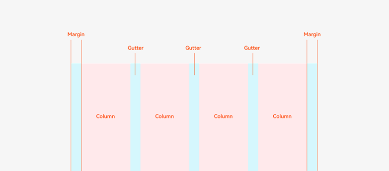
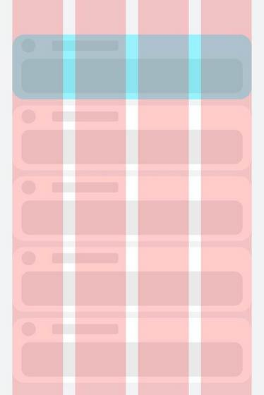
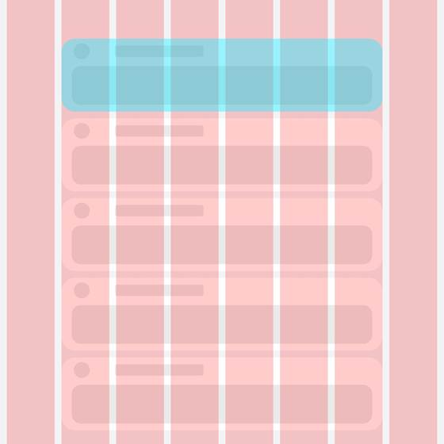
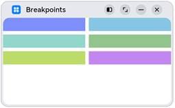
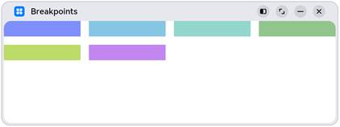
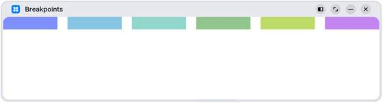

# 媒体查询mediaquery

​       [媒体查询](https://developer.huawei.com/consumer/cn/doc/harmonyos-references-V2/js-apis-mediaquery-0000001478181613-V2)作为响应式设计的核心，在移动设备上应用十分广泛。媒体查询可根据不同设备类型或同设备不同状态修改应用的样式。媒体查询常用于下面两种场景：

1. 针对设备和应用的属性信息（比如显示区域、深浅色、分辨率），设计出相匹配的布局。
2. 当屏幕发生动态改变时（比如分屏、横竖屏切换），同步更新应用的页面布局。


## 引入与使用流程

媒体查询通过mediaquery模块接口，设置查询条件并绑定回调函数，在对应的条件的回调函数里更改页面布局或者实现业务逻辑，实现页面的响应式设计。具体步骤如下：

首先导入媒体查询模块。

```javascript
import medaquery from '@ohos.mediaquery';
```

通过matchMediaSync接口设置媒体查询条件，保存返回的条件监听句柄listener。例如监听横屏事件：

```bash
   // '(orientation: landscape)' 这是查询条件-表示是横屏 -不需要记忆-后面有文档
   listener = mediaquery.matchMediaSync('(orientation: landscape)')

```

给条件监听句柄listener绑定回调函数onPortrait，当listener检测设备状态变化时执行回调函数。在回调函数内，根据不同设备状态更改页面布局或者实现业务逻辑。

```javascript
   aboutToAppear(): void {
      //监听屏幕的状态
     this.listener.on('change',(mediaQueryResult)=>{
       console.log(mediaQueryResult.matches+'是否匹配查询条件')
       console.log(mediaQueryResult.media)
       if (mediaQueryResult.matches) {
         // do something here
          //横屏了怎么处理
       } else {
         // do something here
         //竖屏了怎么处理  
       }
     })
   }
```


 完整代码

```
import { mediaquery } from '@kit.ArkUI'


@Entry
@Component
struct Index {
   // '(orientation: landscape)' 这是查询条件-表示是横屏 -不需要记忆-后面有文档
   listener = mediaquery.matchMediaSync('(orientation: landscape)')

   aboutToAppear(): void {
     this.listener.on('change',(mediaQueryResult)=>{
       console.log(mediaQueryResult.matches+'是否匹配查询条件')
       console.log(mediaQueryResult.media)
       if (mediaQueryResult.matches) {
         // do something here
       } else {
         // do something here
       }
     })
   }

  build() {

  }
}
```


## 媒体查询条件

媒体查询条件由媒体类型、逻辑操作符、媒体特征组成，其中媒体类型可省略，逻辑操作符用于连接不同媒体类型与媒体特征，其中，媒体特征要使用“()”包裹且可以有多个。具体规则如下：

### 语法规则

语法规则包括[媒体类型（media-type）](https://developer.huawei.com/consumer/cn/doc/harmonyos-guides-V2/arkts-layout-development-media-query-0000001454445606-V2#section861273217318)、[媒体逻辑操作（media-logic-operations）](https://developer.huawei.com/consumer/cn/doc/harmonyos-guides-V2/arkts-layout-development-media-query-0000001454445606-V2#section1538871014512)和[媒体特征（media-feature）](https://developer.huawei.com/consumer/cn/doc/harmonyos-guides-V2/arkts-layout-development-media-query-0000001454445606-V2#section347144245014)。

```css
[media-type] [media-logic-operations] [(media-feature)]
```

例如：

- screen and (round-screen: true) ：表示当设备屏幕是圆形时条件成立。
- (max-height: 800) ：表示当高度小于等于800vp时条件成立。
- (height <= 800) ：表示当高度小于等于800vp时条件成立。
- screen and (device-type: tv) or (resolution < 2) ：表示包含多个媒体特征的多条件复杂语句查询，当设备类型为tv或设备分辨率小于2时条件成立。

### 媒体类型（media-type）

| **类型** | **说明**                     |
| :------- | :--------------------------- |
| screen   | 按屏幕相关参数进行媒体查询。 |

### 媒体逻辑操作（media-logic-operations）

媒体逻辑操作符：and、or、not、only用于构成复杂媒体查询，也可以通过comma（, ）将其组合起来，详细解释说明如下表。

| 类型        | 说明                                                         |
| :---------- | :----------------------------------------------------------- |
| and         | 将多个媒体特征（Media Feature）以“与”的方式连接成一个媒体查询，只有当所有媒体特征都为true，查询条件成立。另外，它还可以将媒体类型和媒体功能结合起来。例如：screen and (device-type: wearable) and (max-height: 600) 表示当设备类型是智能穿戴且应用的最大高度小于等于600个像素单位时成立。 |
| or          | 将多个媒体特征以“或”的方式连接成一个媒体查询，如果存在结果为true的媒体特征，则查询条件成立。例如：screen and (max-height: 1000) or (round-screen: true) 表示当应用高度小于等于1000个像素单位或者设备屏幕是圆形时，条件成立。 |
| not         | 取反媒体查询结果，媒体查询结果不成立时返回true，否则返回false。例如：not screen and (min-height: 50) and (max-height: 600) 表示当应用高度小于50个像素单位或者大于600个像素单位时成立。使用not运算符时必须指定媒体类型。 |
| only        | 当整个表达式都匹配时，才会应用选择的样式，可以应用在防止某些较早的版本的浏览器上产生歧义的场景。一些较早版本的浏览器对于同时包含了媒体类型和媒体特征的语句会产生歧义，比如：screen and (min-height: 50)。老版本浏览器会将这句话理解成screen，从而导致仅仅匹配到媒体类型（screen），就应用了指定样式，使用only可以很好地规避这种情况。使用only时必须指定媒体类型。 |
| comma（, ） | 将多个媒体特征以“或”的方式连接成一个媒体查询，如果存在结果为true的媒体特征，则查询条件成立。其效果等同于or运算符。例如：screen and (min-height: 1000), (round-screen: true) 表示当应用高度大于等于1000个像素单位或者设备屏幕是圆形时，条件成立。 |

媒体范围操作符包括<=，>=，<，>，详细解释说明如下表。

| 类型 | 说明                                         |
| :--- | :------------------------------------------- |
| <=   | 小于等于，例如：screen and (height <= 50)。  |
| >=   | 大于等于，例如：screen and (height >= 600)。 |
| <    | 小于，例如：screen and (height < 50)。       |
| >    | 大于，例如：screen and (height > 600)。      |

### 媒体特征（media-feature）

媒体特征包括应用显示区域的宽高、设备分辨率以及设备的宽高等属性，详细说明如下表。

| 类型              | 说明                                                         |
| :---------------- | :----------------------------------------------------------- |
| height            | 应用页面可绘制区域的高度。                                   |
| min-height        | 应用页面可绘制区域的最小高度。                               |
| max-height        | 应用页面可绘制区域的最大高度。                               |
| width             | 应用页面可绘制区域的宽度。                                   |
| min-width         | 应用页面可绘制区域的最小宽度。                               |
| max-width         | 应用页面可绘制区域的最大宽度。                               |
| resolution        | 设备的分辨率，支持dpi，dppx和dpcm单位。其中：- dpi表示每英寸中物理像素个数，1dpi ≈ 0.39dpcm；- dpcm表示每厘米上的物理像素个数，1dpcm ≈ 2.54dpi；- dppx表示每个px中的物理像素数（此单位按96px = 1英寸为基准，与页面中的px单位计算方式不同），1dppx = 96dpi。 |
| min-resolution    | 设备的最小分辨率。                                           |
| max-resolution    | 设备的最大分辨率。                                           |
| orientation       | 屏幕的方向。可选值：- orientation: portrait（设备竖屏）；- orientation: landscape（设备横屏）。 |
| device-height     | 设备的高度。                                                 |
| min-device-height | 设备的最小高度。                                             |
| max-device-height | 设备的最大高度。                                             |
| device-width      | 设备的宽度。                                                 |
| device-type       | 设备的类型。可选值：default、tablet。                        |
| min-device-width  | 设备的最小宽度。                                             |
| max-device-width  | 设备的最大宽度。                                             |
| round-screen      | 屏幕类型，圆形屏幕为true，非圆形屏幕为false。                |
| dark-mode         | 系统为深色模式时为true，否则为false。                        |


#### 响应式布局

响应式布局是指页面内的元素可以根据特定的特征（如窗口宽度、屏幕方向等）自动变化以适应外部容器变化的布局能力。响应式布局中最常使用的特征是窗口宽度，可以将窗口宽度划分为不同的范围（下文中称为断点）。当窗口宽度从一个断点变化到另一个断点时，改变页面布局（如将页面内容从单列排布调整为双列排布甚至三列排布等）以获得更好的显示效果


## 断点

断点以应用窗口宽度为切入点，将应用窗口在宽度维度上分成了几个不同的区间即不同的断点，在不同的区间下，开发者可根据需要实现不同的页面布局效果。具体的断点如下所示。

| 断点名称 | 取值范围（vp）           |
| :------- | :----------------------- |
| xs       | [0, 320）  手表-目前很少 |
| sm       | [320, 600)   手机        |
| md       | [600, 840)    折叠屏展开 |
| lg       | [840, +∞)平板            |

### 判断应用当前处于何种断点

系统提供了多种方法，判断应用当前处于何种断点，进而可以调整应用的布局。常见的监听断点变化的方法如下所示：

- 获取窗口对象并监听窗口尺寸变化
- 通过媒体查询监听应用窗口尺寸变化
- 借助栅格组件能力监听不同断点的变化


#### 通过媒体查询监听应用窗口尺寸变化

```
const listenerXS= mediaquery.matchMediaSync('(0vp<=width<320vp)');
```


```
// 1. 导入 模块

import { mediaquery } from '@kit.ArkUI'

// 2. 创建监听器
const listenerXS: mediaquery.MediaQueryListener = mediaquery.matchMediaSync('(0vp<=width<320vp)');
const listenerSM: mediaquery.MediaQueryListener = mediaquery.matchMediaSync('(320vp<=width<600vp)');
const listenerMD: mediaquery.MediaQueryListener = mediaquery.matchMediaSync('(600vp<=width<840vp)');
const listenerLG: mediaquery.MediaQueryListener = mediaquery.matchMediaSync('(840vp<=width)');


@Entry
@Component
struct Index {
  @State breakPoint:string='sm'
  // 3. 注册监听器
  // 组件即将创建出来
  aboutToAppear(): void {
    // 添加回调函数
    listenerXS.on('change', (res: mediaquery.MediaQueryResult) => {
      console.log('changeRes:', JSON.stringify(res))
      // 执行逻辑
      if(res.matches) this.breakPoint = 'xs'
    })
    listenerSM.on('change', (res: mediaquery.MediaQueryResult) => {
      console.log('changeRes:', JSON.stringify(res))
      // 执行逻辑-手机
      if(res.matches) this.breakPoint = 'sm'

    })
    listenerMD.on('change', (res: mediaquery.MediaQueryResult) => {
      console.log('changeRes:', JSON.stringify(res))
      // 执行逻辑-折叠屏-展开
      if(res.matches) this.breakPoint = 'md'
    })
    listenerLG.on('change', (res: mediaquery.MediaQueryResult) => {
      console.log('changeRes:', JSON.stringify(res))
      // 执行逻辑-平板
      if(res.matches) this.breakPoint = 'lg'
    })
  }

  aboutToDisappear(): void {
    // 移除监听 避免性能浪费
    listenerXS.off('change')
    listenerSM.off('change')
  }

  build() {
    Text(this.breakPoint)
  }
}
```


#### 获取窗口对象并监听窗口尺寸变化

下面介绍如何通过窗口对象监听断点变化


过窗口对象监听断点变化的核心是获取窗口对象及注册窗口尺寸变化的回调函数


在UIAbility的[onWindowStageCreate](https://developer.huawei.com/consumer/cn/doc/harmonyos-guides-V5/uiability-lifecycle-V5)生命周期回调中，通过[窗口](https://developer.huawei.com/consumer/cn/doc/harmonyos-references-V5/js-apis-window-V5)对象获取启动时的应用窗口宽度并注册回调函数监听窗口尺寸变化。将窗口尺寸的长度单位[由px换算为vp](https://developer.huawei.com/consumer/cn/doc/harmonyos-references-V5/ts-pixel-units-V5)后，即可基于前文中介绍的规则得到当前断点值，此时可以使用[状态变量](https://developer.huawei.com/consumer/cn/doc/harmonyos-guides-V5/arkts-state-V5)记录当前的断点值方便后续使用。

```
// MainAbility.ts
import { window, display } from '@kit.ArkUI'
import { UIAbility } from '@kit.AbilityKit'

export default class MainAbility extends UIAbility {
  private windowObj?: window.Window
  private curBp: string = ''
  //...
  // 根据当前窗口尺寸更新断点
  private updateBreakpoint(windowWidth: number) :void{
    // 拿到当前窗口对象获取当前所在displayId
   let displayId = this.windowObj?.getWindowProperties().displayId
   try {
     // 将长度的单位由px换算为vp
     let windowWidthVp = windowWidth / display.getDisplayByIdSync(displayId).densityPixels
    let newBp: string = ''
    if (windowWidthVp < 320) {
      newBp = 'xs'
    } else if (windowWidthVp < 600) {
      newBp = 'sm'
    } else if (windowWidthVp < 840) {
      newBp = 'md'
    } else {
      newBp = 'lg'
    }
    if (this.curBp !== newBp) {
      this.curBp = newBp
      // 使用状态变量记录当前断点值
      AppStorage.setOrCreate('currentBreakpoint', this.curBp)
    }
    } catch(err) {
      console.log("getDisplayByIdSync failed err"+err.code)
    }
  } 

  onWindowStageCreate(windowStage: window.WindowStage) :void{
    windowStage.getMainWindow().then((windowObj) => {
      this.windowObj = windowObj
      // 获取应用启动时的窗口尺寸
      this.updateBreakpoint(windowObj.getWindowProperties().windowRect.width)
      // 注册回调函数，监听窗口尺寸变化
      windowObj.on('windowSizeChange', (windowSize)=>{
        this.updateBreakpoint(windowSize.width)
      })
    });
   // ...
  }
    
  //...
}
```


在页面中，获取及使用当前的断点。

```
@Entry
@Component
struct Index {
  @StorageProp('currentBreakpoint') curBp: string = 'sm'

  build() {
    Flex({justifyContent: FlexAlign.Center, alignItems: ItemAlign.Center}) {
      Text(this.curBp).fontSize(50).fontWeight(FontWeight.Medium)
    }
    .width('100%')
    .height('100%')
  }
}
```


## 栅格布局

### 简介

栅格是多设备场景下通用的辅助定位工具，通过将空间分割为有规律的栅格。栅格可以显著降低适配不同屏幕尺寸的设计及开发成本，使得整体设计和开发流程更有秩序和节奏感，同时也保证多设备上应用显示的协调性和一致性，提升用户体验。



栅格的样式由Margin、Gutter、Columns三个属性决定。

- Margin是相对应用窗口、父容器的左右边缘的距离，决定了内容可展示的整体宽度。
- Gutter是相邻的两个Column之间的距离，决定内容间的紧密程度。
- Columns是栅格中的列数，其数值决定了内容的布局复杂度。

单个Column的宽度是系统结合Margin、Gutter和Columns自动计算的，不需要也不允许开发者手动配置。

栅格布局就是栅格结合了断点，实现栅格布局能力的组件叫栅格组件。在实际使用场景中，可以根据需要配置不同断点下栅格组件中元素占据的列数，同时也可以调整Margin、Gutter、Columns的取值，从而实现不同的布局效果。

| sm断点                                                       | md断点                                                       |
| :----------------------------------------------------------- | :----------------------------------------------------------- |
|  |  |


### 栅格组件的断点

栅格组件提供了丰富的断点定制能力。

**（一）开发者可以修改断点的取值范围，支持启用最多6个断点。**

- 基于本文断点小节介绍的推荐值，栅格组件默认提供xs、sm、md、lg四个断点。
- 栅格组件支持开发者修改断点的取值范围，除了默认的四个断点，还支持开发者启用xl和xxl两个额外的断点。

说明

断点并非越多越好，通常每个断点都需要开发者“精心适配”以达到最佳显示效果。

**示例1：**

修改默认的断点范围，同时启用xl和xxl断点。

图片右下角显示了当前设备屏幕的尺寸（即应用窗口尺寸），可以看到随着窗口尺寸发生变化，栅格的断点也相应发生了改变


```typescript
@Entry
@Component
struct GridRowSample1 {
  @State private currentBreakpoint: string = 'unknown'
  build() {
    // 修改断点的取值范围同时启用更多断点，注意，修改的断点值后面必须加上vp单位。
    GridRow({breakpoints: {
      //默认值的断点
      // value: ['320vp', '600vp', '840vp'],
      // 参考屏幕的宽度
      reference: BreakpointsReference.WindowSize}})
    {
      // 一行为12个格子
      // 这个代码  GridCol({span:{xs:10 ,sm: 6, md: 4, lg:3}})
      // xs 设备上占10格子
      // sm 设备上占6格子
      // md 设备上占4格子
      // lg 设备上占3格子
      GridCol({span:{xs:10 ,sm: 6, md: 4, lg:3}}) {
        Flex({ direction: FlexDirection.Column, alignItems: ItemAlign.Center, justifyContent: FlexAlign.Center }) {
          Text(this.currentBreakpoint).fontSize(50).fontWeight(FontWeight.Medium)
        }
      }.backgroundColor(Color.Red)
    }
    //这里可以监听断点的变化
    .onBreakpointChange((currentBreakpoint: string) => {
      console.log(currentBreakpoint)
      this.currentBreakpoint = currentBreakpoint
    })
  }
}

```


### 栅格组件的columns、gutter和margin

栅格组件columns默认为12列，gutter默认为0(单位vp)，同时支持开发者根据实际需要定义不同断点下的columns数量以及gutter长度。特别的，在栅格组件实际使用过程中，常常会发生多个元素占据的列数相加超过总列数而折行的场景。栅格组件还允许开发者分别定义水平方向的gutter（相邻两列之间的间距）和垂直方向的gutter（折行时相邻两行之间的间距）


不同断点下，定义不同的columns和gutter。

| sm                                                           | md                                                           | lg                                                           |
| :----------------------------------------------------------- | :----------------------------------------------------------- | :----------------------------------------------------------- |
|  |  |  |

```typescript
@Entry
@Component
struct GridRowSample3 {
  private bgColors: Color[] = [
    Color.Gray,
    Color.Red,
    Color.Green,
    Color.Yellow,
    Color.Orange,
    Color.Green
  ]
  build() {
    // 配置不同断点下columns和gutter的取值
    //sm 总共分成4格子
    //md 总共分成8格子
    //lg 总共分成12格子
    GridRow({columns: {sm: 4, md: 8, lg: 12},
      gutter: {x: {sm: 8, md: 16, lg: 24}, y: {sm: 8, md: 16, lg: 24}}}) {
      ForEach(this.bgColors, (bgColor:Color)=>{
        GridCol({span: {sm: 2, md: 2, lg: 2}}) {
          Row().backgroundColor(bgColor).height(30).width('100%')
        }
      })
    }
  }
}
```