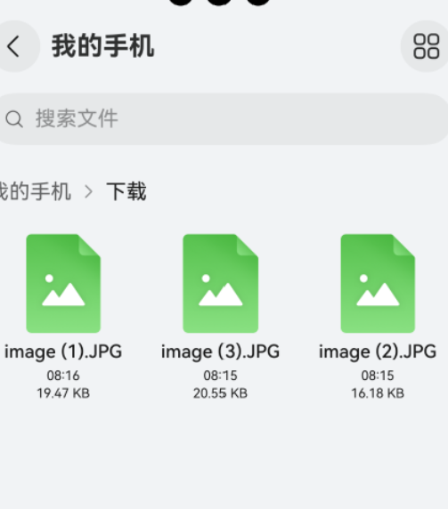
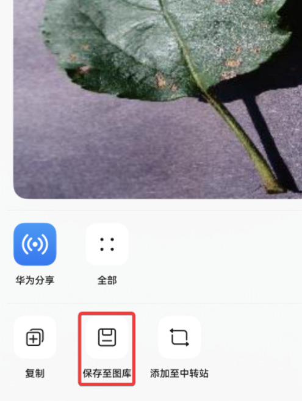

## 图片上传

### 总体流程概述

无论采用哪种方式上传图片，都需要先把用户选择的图片放到应用的沙箱中，再进行上传操作。不同方式的主要区别在于选择照片的形式。


- uniapp

​		先通过 uni.chooseImage 获取临时图片地址

​		再通过  uni.uploadFile 上传


----上传之前--确定配置了网络访问权限

module.json5 中的module下面配置

```
 "requestPermissions": [{"name": "ohos.permission.INTERNET"}],
```


### 操作之前，我们需要在模拟中保存一些图片

在DevEco Studio中，一般来说是在本地磁盘中将图片拖拽至Emulator中以实现图片的上传。但是，我们没有办法直接上传图片至图库，我们首先需要打开文件管理->我的手机->下载

在此处将图片拖拽到空白处实现上传。




在上传成功之后，“下载"文件夹中不会立刻显示图片，需要在Emulator中退出重进该文件夹之后才会显示图片。
然后，在Emulator中点击目标图片，再点击图片栏下方的分享->保存至图库中将在"下载"文件夹中将图片另存为到"图库”，应用则可直接调用图库中的图片。




### picker选择图片或者视频-上传

[文档](https://developer.huawei.com/consumer/cn/doc/harmonyos-guides-V5/photoaccesshelper-photoviewpicker-V5)


1-调用picker把用户选择的图片拿到

2-放到应用的沙箱

3-再进行上传请求


- 首先创建照片选择器（new photoAccessHelper.PhotoViewPicker()）
- 然后通过select方法打开图库选择，传入选择照片配置，包括限制选择图片类型（photoAccessHelper.PhotoViewMIMETypes.IMAGE_TYPE）和最多选择数量（maxSeletNumber:1）
- 从返回结果photo中获取选择的照片路径，如果返回数组长度为 0，则表示没有选择照片

```
// 先创建照片选择器
const options = new photoAccessHelper.PhotoViewPicker()
// 打开图库选择
const photo = await options.select({MIMEType:photoAccessHelper.PhotoViewMIMETypes.IMAGE_TYPE, maxSelectNumber:1})
// 返回一个数组，无长度则代表没选
if(photo.photoUris.length==0) return
const uri = photo.photoUris[0]
```


#### 1-导入选择器模块和文件管理模块。

```typescript
import { photoAccessHelper } from '@kit.MediaLibraryKit';
import { fileIo } from '@kit.CoreFileKit';
import { BusinessError } from '@kit.BasicServicesKit';
```

#### 2-创建图片-音频类型文件选择选项实例。

```typescript
const photoSelectOptions = new photoAccessHelper.PhotoSelectOptions();
```

#### 3-配置可选的媒体文件类型和媒体文件的最大数目。

以下示例以图片选择为例，媒体文件类型请参见[PhotoViewMIMETypes](https://developer.huawei.com/consumer/cn/doc/harmonyos-references-V5/js-apis-photoaccesshelper-V5#photoviewmimetypes)。

```typescript
// photoSelectOptions.MIMEType = photoAccessHelper.PhotoViewMIMETypes.IMAGE_TYPE; // 过滤选择媒体文件类型为IMAGE
photoSelectOptions.MIMEType = photoAccessHelper.PhotoViewMIMETypes.VIDEO_TYPE; // 过滤选择媒体文件类型为IMAGE
photoSelectOptions.maxSelectNumber = 5; // 选择媒体文件的最大数目
```

#### 4-创建图库选择器实例

调用[PhotoViewPicker.select](https://developer.huawei.com/consumer/cn/doc/harmonyos-references-V5/js-apis-photoaccesshelper-V5#select)接口拉起图库界面进行文件选择。文件选择成功后，返回[PhotoSelectResult](https://developer.huawei.com/consumer/cn/doc/harmonyos-references-V5/js-apis-photoaccesshelper-V5#photoselectresult)结果集。

```typescript
 Button('按钮').onClick(()=>{
        // 4-创建图库选择器实例，调用PhotoViewPicker.select接口拉起图库界面进行文件选择。文件选择成功后，返回PhotoSelectResult结果集。
        let uris: Array<string> = [];
        const photoViewPicker = new photoAccessHelper.PhotoViewPicker();
        photoViewPicker.select(photoSelectOptions).then((photoSelectResult: photoAccessHelper.PhotoSelectResult) => {
          uris = photoSelectResult.photoUris;
          //选中的图片结果，一个数组，
          // 数组中放像是下面一样的图片地址字符串
            //photoSelectResult.photoUris[0] // file://media/Photo/q/IMG_1732730211_000/1.jpg  得到文件路径
          console.info('photoViewPicker.select to file succeed and uris are:' + uris);
        }).catch((err: BusinessError) => {
          console.error(`Invoke photoViewPicker.select failed, code is ${err.code}, message is ${err.message}`);
        })
      })
```

select返回的uri权限是只读权限，可以根据结果集中uri进行读取文件数据操作


#### 	5-把图片拷贝到应用的缓存目录

使用文件io模块的只读权限打开的文件，存入缓存中，然后才能使用ajax上传

```
            //打开文件
            //使用文件io模块的只读权限打开的文件
            const file = fileIo.openSync(uris[0], fileIo.OpenMode.READ_ONLY)
            console.log(file.name, '2404')
            console.log(file.path, '2404')
            
            //获取上应用程序上下文文
            const context = getContext(this)
            // 拼接一个缓存路径
            const copyFilePath = context.cacheDir + '/' + file.name
            // 把文件写入缓存区
            fileIo.copyFileSync(file.fd, copyFilePath)
            // /data/storage/el2/base/haps/entry/cache/afb394d7-05e6-4cb2-b72b-e9c2bfc17e80.jpg 2404
            console.log(copyFilePath, '2404-333',)
```

#### 		6-上传文件-请求发起

这里使用request模块的uploadFile  上传文件方法上传，稍微简单一点

后端请求地址 一定要改为 后端的ip地址，不是localhost:3001 .

http://192.168.31.250:3001/api/file/upload 类似这样的，你电脑可以访问的局域网地址或者是ip地址


```
            request.uploadFile(context, {
              // 后端请求地址
              url: 'http://192.168.31.250:3001/api/file/upload',

              // 请求头信息 类型、token......
              header: {
                'content-type': 'multipart/form-data',
                // Authorization: `xxxx`,

              },
              // 请求类型 （）
              method: 'POST',
              // 图片信息
              files: [{
                // 上传给后端的名字
                filename: `${file.name}`,
                // 沙箱路径
                uri: `internal://cache/${file.name}`,
                // 和后端Body一致
                name: 'img',
                // 照片类型（后缀）
                type: `${file.name.split('.')[file.name.split('.').length - 1]}`
              }],
              // 请求的表单数据
              data: [],

            }).then((task) => {
              console.log('上传成功 2404')
              //   4. 获取服务器返回来的数据
              task.on('headerReceive', async res => {
                console.log('2404')
                AlertDialog.show({ message: JSON.stringify(res) })
                // 解析res
                let  bodyStr:string = (res as IUploadRes).body
                console.log(bodyStr,'2404')
                // 解析res.body属性
                let resObj:IUploadData = JSON.parse(bodyStr)
                console.log(resObj.fileUrl,'2404')


              })
              
            }).catch((err: BusinessError) => {
              console.log('2404-err', err.message)
            })

```


解析数据的时候，需要写两个接口！！

```
interface IUploadRes{
  body:string
}
interface  IUploadData{
  fileUrl:string
  }


```


完整代码

```
// 1-导入选择器模块和文件管理模块。

import { photoAccessHelper } from '@kit.MediaLibraryKit';
import { fileIo } from '@kit.CoreFileKit';
import { BusinessError, request } from '@kit.BasicServicesKit';


// 2-创建图片-音频类型文件选择选项实例。
const photoSelectOptions = new photoAccessHelper.PhotoSelectOptions();

// 3-配置可选的媒体文件类型和媒体文件的最大数目。
photoSelectOptions.MIMEType = photoAccessHelper.PhotoViewMIMETypes.IMAGE_TYPE; // 过滤选择媒体文件类型为IMAGE
// photoSelectOptions.MIMEType = photoAccessHelper.PhotoViewMIMETypes.VIDEO_TYPE; // 过滤选择媒体文件类型为IMAGE
photoSelectOptions.maxSelectNumber = 5; // 选择媒体文件的最大数目

interface IUploadRes{
  body:string
}
interface  IUploadData{
  fileUrl:string
}


@Entry
@Component
struct GridRowSample3 {
  @State ImgUrl: string = ''

  build() {

    Column() {
      Image(this.ImgUrl).width(200)
      Button('选择图片').onClick(() => {
        console.log('111--2404')
        // 4-创建图库选择器实例，调用PhotoViewPicker.select接口拉起图库界面进行文件选择。文件选择成功后，返回PhotoSelectResult结果集。
        let uris: Array<string> = [];
        const photoViewPicker = new photoAccessHelper.PhotoViewPicker();
        photoViewPicker.select(photoSelectOptions)
          .then(async (photoSelectResult: photoAccessHelper.PhotoSelectResult) => {
            uris = photoSelectResult.photoUris;
            //选中的图片结果，一个数组，
            // 数组中放像是下面一样的图片地址字符串
            // file://media/Photo/2/IMG_1740406047_001/afb394d7-05e6-4cb2-b72b-e9c2bfc17e80.jpg
            console.info('photoViewPicker.select to file succeed and uris are:' + uris);


            //打开文件
            const file = fileIo.openSync(uris[0], fileIo.OpenMode.READ_ONLY)
            console.log(file.name, '2404')
            console.log(file.path, '2404')

            //获取上应用程序上下文文
            const context = getContext(this)
            // 拼接一个缓存路径
            const copyFilePath = context.cacheDir + '/' + file.name
            // 把文件写入缓存区
            fileIo.copyFileSync(file.fd, copyFilePath)
            // /data/storage/el2/base/haps/entry/cache/afb394d7-05e6-4cb2-b72b-e9c2bfc17e80.jpg 2404
            console.log(copyFilePath, '2404-333',)

            request.uploadFile(context, {
              // 后端请求地址
              url: 'http://192.168.31.250:3001/api/file/upload',

              // 请求头信息 类型、token......
              header: {
                'content-type': 'multipart/form-data',
                // Authorization: `xxxx`,

              },
              // 请求类型 （）
              method: 'POST',
              // 图片信息
              files: [{
                // 上传给后端的名字
                filename: `${file.name}`,
                // 沙箱路径
                uri: `internal://cache/${file.name}`,
                // 和后端Body一致
                name: 'img',
                // 照片类型（后缀）
                type: `${file.name.split('.')[file.name.split('.').length - 1]}`
              }],
              // 请求的表单数据
              data: [],

            }).then((task) => {
              console.log('上传成功 2404')
              //   4. 获取服务器返回来的数据
              task.on('headerReceive', async res => {
                console.log('2404')
                AlertDialog.show({ message: JSON.stringify(res) })
                // 解析res
                let  bodyStr:string = (res as IUploadRes).body
                console.log(bodyStr,'2404')
                // 解析res.body属性
                let resObj:IUploadData = JSON.parse(bodyStr)
                console.log(resObj.fileUrl,'2404')
                this.ImgUrl = resObj.fileUrl


              })

            }).catch((err: BusinessError) => {
              console.log('2404-err', err.message)
            })


          })
          .catch((err: BusinessError) => {
            console.error(`2404 Invoke photoViewPicker.select failed, code is ${err.code}, message is ${err.message}`);
          })
      })


    }

  }
}

```


### 用户拍照上传

API参考：https://developer.huawei.com/consumer/cn/doc/harmonyos-references-V13/js-apis-camerapicker-V13


- 使用相机拍摄前，需要申请**ohos.permission.CAMERA**相机权限。

  ```
  {
          "name":"ohos.permission.CAMERA",
          "reason":"$string:permissionCamera",
          "usedScene": {
            "abilities": [
              "EntryAbility"
            ],
            "when":"inuse"
          }
        }
  ```

  


1、使用cameraPicker 读取拍照的图片与视频  （返回一个临时的图片地址）（模拟器上不能测试）

2、把图片拷贝到应用的缓存目录    （不支持直接通过相册本地路径上传，仅支持通过缓存目录上传 context.cacheDir）

3、上传文件


```
const pickerResult: cameraPicker.PickerResult = await cameraPicker.pick(getContext(this),
 [cameraPicker.PickerMediaType.PHOTO], { 
cameraPosition: camera.CameraPosition.CAMERA_POSITION_BACK 
});
if(pickerResult.code === -1) return
const uri = pickerResult.resultUri

```


参数 1：上下文（getContext(this)）
参数 2：拍摄类型（拍照、摄影），以数组形式传入，这里选择了拍照（cameraPicker.PickerMediaType.PHOTO）
参数 3：配置信息，包括摄像头位置（这里选择后摄camera.CameraPosition.CAMERA_POSITION_BACK）
拍照结束后，从pickerResult对象中获取相关信息：

resultUri：照片路径
code：成功与否的标志，0表示成功，-1表示失败


下面只写了，选择相机的获取照片地址的代码，剩余代码逻辑和上面案例一样

```
// 1-导入选择器模块和文件管理模块。

import { fileIo } from '@kit.CoreFileKit';
import { BusinessError, request } from '@kit.BasicServicesKit';
import { camera, cameraPicker } from '@kit.CameraKit';


interface IUploadRes{
  body:string
}
interface  IUploadData{
  fileUrl:string
}


@Entry
@Component
struct GridRowSample3 {
  @State ImgUrl: string = ''

  build() {

    Column() {
      Image(this.ImgUrl).width(200)


      Button('上传图片').onClick(async  ()=>{
        const pickerResult: cameraPicker.PickerResult = await cameraPicker.pick(getContext(this),
          [cameraPicker.PickerMediaType.PHOTO], {
            cameraPosition:camera.CameraPosition.CAMERA_POSITION_BACK
          });
        if(pickerResult.resultCode === -1) return
        const uri = pickerResult.resultUri
        console.log(uri)

      })

    }

  }
}

```


#### 使用axios上传

创建FormData对象并添加数据

```
const formData = new FormData();
formData.append('file', `internal://cache/${file.name}`);

```


上传代码

```
const res =  await axiosRequest({
      url:'xxxxx',
      data:formData,
      method:'post',
      context:getContext(this),
      headers:{"Content-Type":'multipart/form-data'},
      onUploadProgress:(event)=>{   //上传进度                
  event.loaded   // 当前
        event.total     // 总   }
    })

```


### 上传完成释放相关资源

fileIo.close(file.fd)


通过以上步骤，我们可以在鸿蒙应用中实现完整的图片上传功能，无论是拍照上传、用户操作上传还是从图库中上传，都可以遵循这一流程来确保图片能够安全、高效地传输到后端服务器。


### 其他文件 - 选择用户文件

http://tmp00002.zhaodashen.cn/hello.txt

http://tmp00002.zhaodashen.cn/hello2.docx

http://tmp00002.zhaodashen.cn/hello3.pdf

http://tmp00002.zhaodashen.cn/hello4.zip


https://developer.huawei.com/consumer/cn/doc/harmonyos-guides-V13/select-user-file-V13

- text/zip/pdf/docx

```
import  { picker } from '@kit.CoreFileKit';
import { fileIo } from '@kit.CoreFileKit';
import { common } from '@kit.AbilityKit';
import { BusinessError, request } from '@kit.BasicServicesKit';
import log from '@open/log';

@Entry
@Component
struct Test {
  build() {
    Button('选择文档上传').onClick(() => {
      // 一、获取临时的图片地址
      const documentSelectOptions = new picker.DocumentSelectOptions();
      // 创建文件选择器实例
      const documentViewPicker = new picker.DocumentViewPicker(getContext(this));
      documentViewPicker.select(documentSelectOptions).then((documentSelectResult: Array<string>) => {
        //文件选择成功后，返回被选中文档的uri结果集。
        // uris = documentSelectResult;
        console.info('documentViewPicker.select to file succeed and uris are:' + documentSelectResult);
      
    })
  }
}

```


