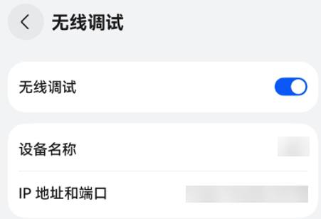
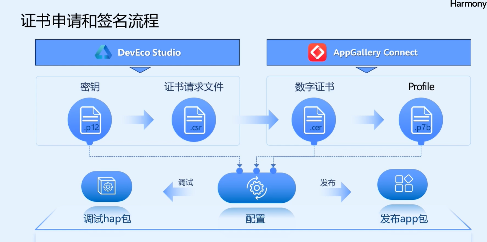
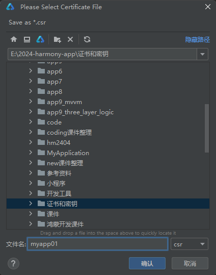
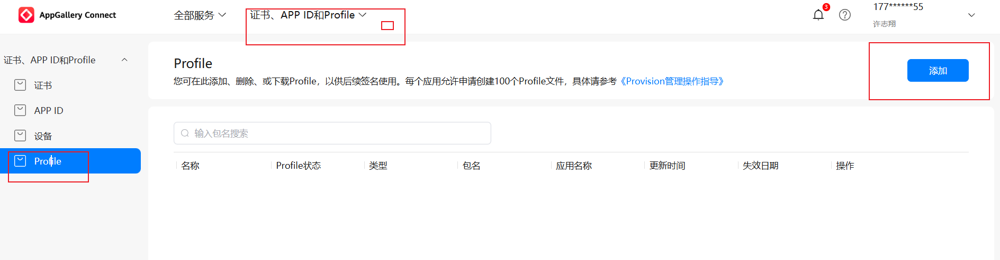
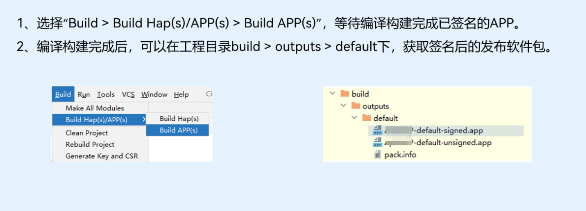
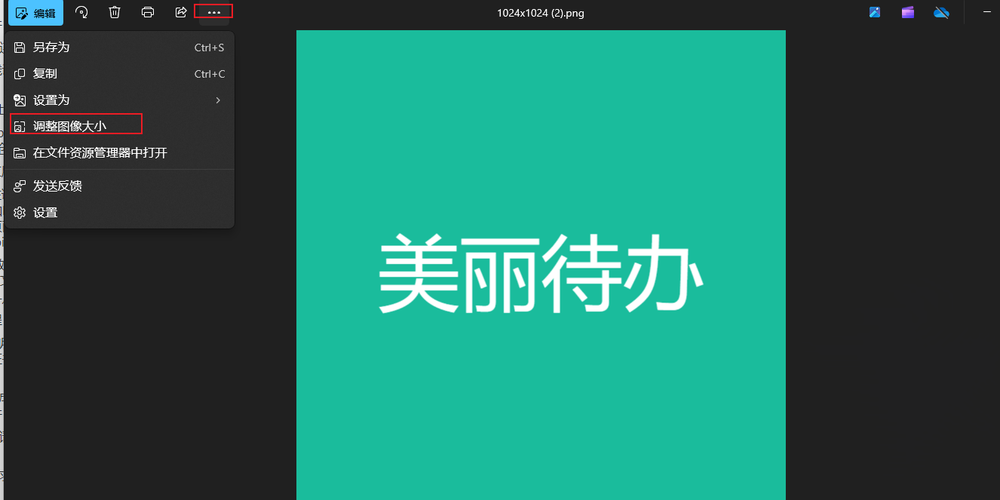
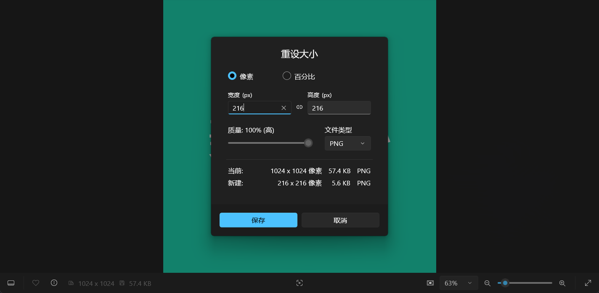

# 应用签名

## 自动签名

说明

使用自动签名前，请确保本地系统时间与北京时间（UTC/GMT +8.00）保持一致。如果不一致，将导致签名失败。

### 操作步骤

1. 连接真机设备或模拟器，具体请参考[使用本地真机运行应用/元服务](https://developer.huawei.com/consumer/cn/doc/harmonyos-guides-V5/ide-run-device-V5)或[使用模拟器运行应用/元服务](https://developer.huawei.com/consumer/cn/doc/harmonyos-guides-V5/ide-run-emulator-V5)，真机连接成功后如下图所示：

   

   

   说明

   - 如果同时连接多个设备，则使用自动化签名时，会同时将这多个设备的信息写到证书文件中。
   - 大部分场景下，模拟器无需签名就可以调试应用/元服务，但是当应用/元服务需要[获取ODID](https://developer.huawei.com/consumer/cn/doc/harmonyos-references-V5/js-apis-device-info-V5)或使用Push Kit时，需要配置签名，可在模拟器上自动签名。

   

2. 进入**File > Project Structure... > Project > Signing Configs**界面，勾选“Automatically generate signature”（如果是HarmonyOS工程，需同时勾选“Support HarmonyOS”），即可完成签名。如果未登录，请先单击**Sign In**进行登录，然后自动完成签名。

   

   

   

   签名完成后，如下图所示，并在本地生成密钥（.p12）、证书请求文件（.csr）、数字证书（.cer）及Profile文件（.p7b），数字证书在AppGallery Connect网站的“证书、APP ID和Profile”页签中可以查看。

   

   


## 手动签名

HarmonyOS应用/元服务通过数字证书（.cer文件）和Profile文件（.p7b文件）来保证应用/元服务的完整性。在申请数字证书和Profile文件前，首先需要通过DevEco Studio来生成密钥（存储在格式为.p12的密钥库文件中）和证书请求文件（.csr文件）。然后，申请调试数字证书和调试Profile文件。最后，将密钥（.p12）文件、数字证书（.cer）文件和Profile（.p7b）文件配置到工程中。

**基本概念**

- **密钥**：格式为.p12，包含非对称加密中使用的公钥和私钥，存储在密钥库文件中，公钥和私钥对用于数字签名和验证。
- **证书请求文件**：格式为.csr，全称为Certificate Signing Request，包含密钥对中的公钥和公共名称、组织名称、组织单位等信息，用于向AppGallery Connect申请数字证书。
- **数字证书**：格式为.cer，由华为AppGallery Connect颁发。
- **Profile文件**：格式为.p7b，包含HarmonyOS应用/元服务的包名、数字证书信息、描述应用/元服务允许申请的证书权限列表，以及允许应用/元服务调试的设备列表（如果应用/元服务类型为Release类型，则设备列表为空）等内容，每个应用/元服务包中均必须包含一个Profile文件。

### 生成密钥和证书请求文件

1. 在主菜单栏单击**Build > Generate Key** **and CSR**。

   

   说明

   如果本地已有对应的密钥，无需新生成密钥，可以在**Generate Key**界面中单击下方的Skip跳过密钥生成过程，直接使用已有密钥生成证书请求文件。

   

2. 在**Key Store File**中，可以单击**Choose Existing**选择已有的密钥库文件（存储有密钥的.p12文件）；如果没有密钥库文件，单击**New**进行创建。下面以新创建密钥库文件为例进行说明。

   

   

   

3. 在**Create Key Store**窗口中，填写密钥库信息后，单击**OK**。

   

   - **Key store file**：设置密钥库文件存储路径，并填写p12文件名。
   - **Password**：设置密钥库密码，必须由大写字母、小写字母、数字和特殊符号中的两种以上字符的组合，长度至少为8位。请记住该密码，后续签名配置需要使用。
   - **Confirm password**：再次输入密钥库密码。

   

   

4. 在**Generate Key** **and CSR**界面中，继续填写密钥信息后，单击**Next**。

   

   - **Alias**：密钥的别名信息，用于标识密钥名称。请记住该别名，后续签名配置需要使用。
   - **Password**：密钥对应的密码，与密钥库密码保持一致，无需手动输入。

   

   

5. 在**Generate Key** **and CSR**界面，设置CSR文件存储路径和CSR文件名。

   

   

   

6. 单击**Finish**，创建CSR文件成功，可以在存储路径下获取生成的密钥库文件（.p12）、证书请求文件（.csr）和material文件夹（存放签名方案相关材料，如密码、证书等）。

   

   

   

### 申请调试证书和调试Profile文件

通过生成的证书请求文件，向AppGallery Connect申请调试证书和Profile文件，操作如下：

- 创建HarmonyOS应用/元服务：在AppGallery Connect项目中，创建一个HarmonyOS应用/元服务，用于调试证书和Profile文件申请，具体请参考[创建HarmonyOS应用/元服务](https://developer.huawei.com/consumer/cn/doc/app/agc-help-createharmonyapp-0000001945392297)。
- 申请调试证书和Profile文件：在AppGallery Connect中申请、下载调试证书和Profile文件，具体请参考[申请调试证书](https://developer.huawei.com/consumer/cn/doc/app/agc-help-add-debugcert-0000001914263178)和[申请调试Profile](https://developer.huawei.com/consumer/cn/doc/app/agc-help-add-debugprofile-0000001914423102)。

### 手动配置签名信息

在DevEco Studio中配置密钥（.p12）文件、申请的调试证书（.cer）文件和调试Profile（.p7b）文件。

在**File >** **Project Structure >** **Project > Signing Configs**窗口中，取消勾选“Automatically generate signature”（如果是HarmonyOS应用，请勾选“Support HarmonyOS”），然后配置工程的签名信息。

- **Store file**：选择密钥库文件，文件后缀为.p12，该文件为[生成密钥和证书请求文件](https://developer.huawei.com/consumer/cn/doc/harmonyos-guides-V5/ide-signing-V5#section462703710326)中生成的.p12文件。
- **Store password**：输入密钥库密码，该密码与[生成密钥和证书请求文件](https://developer.huawei.com/consumer/cn/doc/harmonyos-guides-V5/ide-signing-V5#section462703710326)中填写的密钥库密码保持一致。
- **Key alias**：输入密钥的别名信息，与[生成密钥和证书请求文件](https://developer.huawei.com/consumer/cn/doc/harmonyos-guides-V5/ide-signing-V5#section462703710326)中填写的别名保持一致。
- **Key password**：输入密钥的密码，与[生成密钥和证书请求文件](https://developer.huawei.com/consumer/cn/doc/harmonyos-guides-V5/ide-signing-V5#section462703710326)中填写的**Store Password**保持一致。
- **Sign alg**：签名算法，固定为SHA256withECDSA。
- **Profile file**：选择[申请调试证书和调试Profile文件](https://developer.huawei.com/consumer/cn/doc/harmonyos-guides-V5/ide-signing-V5#section15151840123413)中生成的Profile文件，文件后缀为.p7b。
- **Certpath file**：选择[申请调试证书和调试Profile文件](https://developer.huawei.com/consumer/cn/doc/harmonyos-guides-V5/ide-signing-V5#section15151840123413)中生成的数字证书文件，文件后缀为.cer。

说明

Store file，Profile file，Certpath file三个字段支持配置相对路径，以项目根目录为起点，配置文件所在位置的路径名称。


配置完成后，进入工程级build-profile.json5文件，在“signingConfigs”下可查看到配置成功的签名信息。


# 真机调试

在Phone和Tablet中运行HarmonyOS应用/元服务的操作方法一致，可以采用USB连接方式或者无线调试的连接方式。两种连接方式是互斥的，只能使用一种，无法同时使用两种方式。


## 前提条件

- 在**Phone或Tablet**上查看**设置 > 系统**中开发者选项是否存在，如果不存在，可在**设置 > 设备名称**中，连续七次单击“版本号”，直到提示“开启开发者选项”，点击**确认开启**后输入PIN码（如果已设置），设备将自动重启，请等待设备完成重启。
- 在设备运行应用/元服务需要根据[为应用/元服务进行签名](https://developer.huawei.com/consumer/cn/doc/harmonyos-guides-V5/ide-signing-V5)章节，提前对应用/服务进行签名。


## 使用USB连接方式

1. 使用USB方式，将Phone或Tablet与PC端进行连接。

2. 在**设置 > 系统 > 开发者选项**中，打开“**USB调试**”开关（确保设备已连接USB）。

3. 在Phone或Tablet中会弹出“允许USB调试”的弹框，单击**允许**。

   

   

   

4. 在菜单栏中，单击**Run>Run'模块名称'**或，或使用默认快捷键**Shift+F10**（macOS为**Control+R**）运行应用/元服务。

   

   

   

5. DevEco Studio启动HAP的编译构建和安装。安装成功后，设备会自动运行安装的HarmonyOS应用/元服务。

说明

设备连接后，如果DevEco Studio无法识别到设备，显示“No device”，请参考[设备连接后，无法识别设备的处理指导](https://developer.huawei.com/consumer/cn/doc/harmonyos-faqs-V5/faqs-app-debugging-3-V5)。


## 使用无线调试连接方式

1. 将Phone/Tablet和PC连接到同一WLAN网络。

2. 在**设置 > 系统 >** **开发者选项**中，打开“**无线调试**”开关，并获取Phone/Tablet端的IP地址和端口号。

   

   

   

3. 在PC中执行如下命令连接设备，关于hdc工具的使用指导请参考[hdc](https://developer.huawei.com/consumer/cn/doc/harmonyos-guides-V5/hdc-V5)。

   

   ```cangjie
   hdc tconn 设备IP地址:端口号
   ```

   

4. 在菜单栏中，单击**Run>Run'模块名称'**或，或使用默认快捷键**Shift+F10**（macOS为**Control+R**）运行应用/元服务。

   

   

   

5. DevEco Studio启动HAP的编译构建和安装。安装成功后，Phone/Tablet会自动运行安装的HarmonyOS应用/元服务。


# 签名不匹配问题

连接[鸿蒙](https://so.csdn.net/so/search?q=鸿蒙&spm=1001.2101.3001.7020)手机运行项目报如下错误


这是由于本地签名和鸿蒙设备签名不匹配导致的，需要注释掉如下代码，选择file project 自动签名 勾选auto选项，会在build-profile.json5中生成一个签名，然后运行就ok了~


# 打包上线-上架

应用开发和测试完成后，您可以将APP的软件包提交发布申请

通过AppGallery Connect发布HarmonyOS应用/元服务后，用户即可在华为应用市场搜索获取您的HarmonyOS应用/元服务。


基本步骤


操作流程


## 1-登录AppGallery Connect创建项目

[AppGallery Connect](https://developer.huawei.com/consumer/cn/service/josp/agc/index.html)


我们自己的开发者id，也可以在这里查看


## 2-添加应用


添加应用


选中鸿蒙app


## 3-请前往证书、APP ID和Profile的APP ID页面创建 应用 appid


devEcostudio创建 项目的时候，我们已经写过报名了，也可以修改包名


在 appScope 下面的app.json5里面


开放能力哪里，需要什么就选什么


## 4- 申请数字证书和profile文件

数字证书和profile文件，


这里还需要密钥文件和证书请求文件


### 签名打包的基本流程




 先在devEcostudio中通过密钥文件，生成证书请求文件

然后通过证书请求文件 申请 发布证书（数字证书）

在通过发布证书 申请 发布profile文件

最后在devEcostudio中配置相关信息后，编译发包出签名的软件包


接下来，看每个阶段的具体操作

### 4-1声明密钥证书和证书请求文件


点击new按钮，生成密钥文件（类似密码），（密钥文件，证书文件，密码一定要妥善保管，否则会影响后续的app升级更新）已经有的选choose existing 选择已有的p12文件即可


然后确定，输入密码和确认密码(这个密码也要记住)


然后点击ok

别名需要自己输入


### 4-2 生成证书请求文件

然后选择





然后点击finish


### 4-3 申请数字证书


[AppGallery Connect](https://developer.huawei.com/consumer/cn/service/josp/agc/index.html)


点击新增证书

名称随便起一个，类型选择发布证书（发布证书-用于发布到应用商店，调试证书-用于真机调试）


然后点击下载，保存证书文件


### 4-4 请求profile文件


进入 证书-appID和profile里面，左侧选择profile，点击右侧新增



然后点击输入框，选择应用名称， 输入 profile文件名称，选择发布证书，点击添加


证书那里选择发布证书


下载profile 配置文件


## 5- 配置签名信息


取消自动签名


分别选择对应的证书

输入两个密码

是咱们之前步骤中输入了一次密码 


点击apply应用，签名配置完成，点击oj


## 6-构建发布软件包




然后在项目的根目录下面找到build-》outputs-》default文件夹

里面有打包好的后缀名为app的，软件安装包


## 7-开放式测试


[AppGallery Connect](https://developer.huawei.com/consumer/cn/service/josp/agc/index.html)，选择我的应用，你自己的应用


上传应用图标（美工UI做尺寸216，216）

这里我们自己制作一个 https://www.pgyer.com/tools/appIcon，

下载一个最大的


然后使用window照片工具或者ps调整大小为216








上传图标，选择应用分类，选择应用便签和主标签


点击保存


然后左侧菜单，选择软件包管理，点击上传 


然后，点击+好选择，签名好的软件包


使用场景--选择测试和正式上架，或者仅测试都可以


然后选择-左侧的-应用测试

添加测试版本


测试用户-选择单个添加


完善-版本信息里面的内容，比较多，这个最好是运营填写，我们只负责给运营app包，或者我们填写，填写完以后，找个人核对！里面涉及到隐私条款，版权信息，应用截图等信息，需要公司运营，项目经理，美工等一起完成！


华为应用市场-网页版本https://appgallery.huawei.com/


然后完成


填写完信息，提交审核


## 7-2 应用信息的其他填写说明 参考

https://developer.huawei.com/consumer/cn/doc/app/agc-help-harmonyos-releaseapp-0000001914554900


## 8-审核指南

审核的时候-做好心里准备-可能会多次审核不过


## 常见问题


参考文档

https://developer.huawei.com/consumer/cn/training/course/slightMooc/C101705111830082071


应用信息详细，说明参考

https://developer.huawei.com/consumer/cn/training/course/video/101599756879280024


