# 鸿蒙应用架构三层架构

简单的app，我们随便按照自己的逻辑写就行。

复杂的大型的app开发，我们就需要用到，三层架构 来开发更加复杂的APP


## 鸿蒙中的三层架构概念

（这里不是mvc），是鸿蒙开发中，在复杂app开发中建议使用的一种应用架构

HarmonyOS应用的分层架构主要包括三个层次：产品定制层、基础特性层和公共能力层，为开发者构建了一个清晰、高效、可扩展的设计架构。

三层架构文档 https://developer.huawei.com/consumer/cn/doc/best-practices-V5/bpta-layered-architecture-design-V5


## 默认的单层架构 

默认的创建的项目是单层项目，一般的小公司用单层架构就可以，所有的业务逻辑都写到了entry里面。

**中小型公司，一般业务逻辑不是很庞大，单层就可以了**！

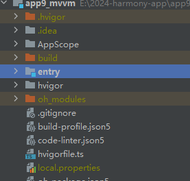

项目的逻辑模型如下：    

​		

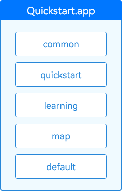


## 三层架构逻辑分层模型如下

项目里面的业务逻辑特别庞大，比如一个超级app，类似抖音，微信等 ，里面有商城，直播，聊天，公众号，随便拉出来一个功能就能做一个app！

这种大项目，需要上百人，甚至上千人一起开发！需要专门的架构师设计项目的分层


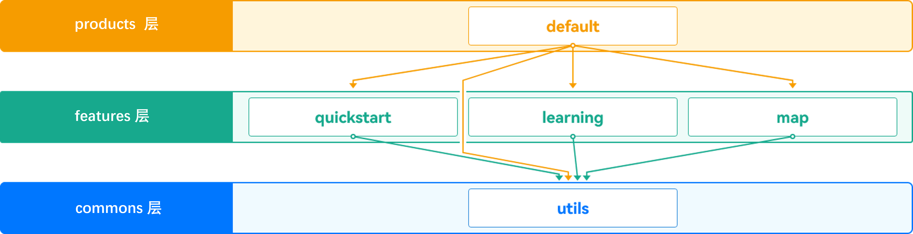


三层架构 ，等于项目里面有三个 类似entry的文件夹

两层架构，等于项目里面有两个 类似entry的文件夹


三层：三个大文件夹

### 产品层 product

- 产品定制层

  产品定制层专注于满足不同设备或使用场景（如应用）的个性化需求，包括UI设计、资源和配置，以及针对特定场景的交互逻辑和功能特性。

  产品定制层的功能模块独立运作，同时依赖基础特性层和公共能力层来实现具体功能。

  作为应用的入口，产品定制层是用户直接互动的界面。为满足特定产品需求，产品定制层可灵活地调整和扩展，从而满足各种使用场景。

### 基础特性层feature


- 基础特性层

  基础特性层位于公共能力层之上，用于存放基础特性集合，例如相对独立的功能UI和业务逻辑实现。该层的每个功能模块都具有高内聚、低耦合、可定制的特点，以支持产品的灵活部署。

  基础特性层为上层的产品定制层提供稳健且丰富的基础功能支持，包括UI组件、基础服务等。同时依赖于下层的公共能力层为其提供通用功能和服务。

  为了增强系统的可扩展性和维护性，基础特性层将功能进行模块化处理。例如，一个应用的底部导航栏中的每个选项都可能是一个独立的业务模块。

### 公共能力层 common

- 公共能力层

  公共功能层用于存放公共基础能力，集中了例如公共UI组件、数据管理、外部交互以及工具库等的共享功能。应用可以共享和调用这些公共能力。

  公共能力层为上层的基础特性层和产品定制层提供稳定可靠的功能支持，确保整个应用的稳定性和可维护性。

  公共能力层包括但不限于以下组成：

  - 公共UI组件：这些组件被设计成通用且高度可复用的，确保在不同的应用程序模块间保持一致的用户体验。公共UI组件提供了标准化且友好的界面，帮助开发者快速实现常见的用户交互需求，例如提示、警告、加载状态显示等，从而提高开发效率和用户满意度。
  - 数据管理：负责应用程序中数据的存储和访问，包括应用数据、系统数据等，提供了统一的数据管理接口，简化数据的读写操作。通过集中式的数据管理方式不仅使得数据的维护更为简单，而且能够保证数据的一致性和安全性。
  - 外部交互：负责应用程序与外部系统的交互，包括网络请求、文件I/O、设备I/O等，提供统一的外部交互接口，简化应用程序与外部系统的交互。开发者可以更为方便地实现应用程序的网络通信、数据存储和硬件接入等功能，从而加速开发流程并保证程序的稳定性和性能。
  - 工具库：提供一系列常用工具函数和类，例如字符串处理、日期时间处理、加密解密、数据压缩解压等，帮助开发者提高效率和代码质量。


也可以这样理解，

产品层，就是我们需要的开发的页面。（微信的首页，登录页，注册页）

基础特性层，相对独立的功能UI和业务逻辑实现（朋友圈-小程序-视频号,或者是UI组件库等，当然这些也可以放入产品层）

公共能力层，就是我们用到的各种js工具，网络请求，字符串处理，日期处理，或者是UI组件库等，找个团队专门去封装（(相当于开发一个库)），然后下载到我们的项目中


每层里面放什么不是固定不变的


在学习三层架构之前，我们先来了解一下应用程序和包

# 应用与应用程序包

用户应用程序泛指运行在设备的操作系统之上，为用户提供特定服务的程序，简称“应用”。一个应用所对应的软件包文件，称为“应用程序包”。

## 应用的多Module设计机制

- **支持模块化开发：** 一个应用通常会包含多种功能，将不同的功能特性按模块来划分和管理是一种良好的设计方式。在开发过程中，我们可以将每个功能模块作为一个独立的Module进行开发，Module中可以包含源代码、资源文件、第三方库、配置文件等，每一个Module可以独立编译，实现特定的功能。这种模块化、松耦合的应用管理方式有助于应用的开发、维护与扩展。

## Module类型

Module按照使用场景可以分为两种类型：

- **Ability类型的Module：** 用于实现应用的功能和特性。每一个Ability类型的Module编译后，会生成一个以.hap为后缀的文件，我们称其为HAP（Harmony Ability Package）包。HAP包可以独立安装和运行，是应用安装的基本单位，一个应用中可以包含一个或多个HAP包，具体包含如下两种类型。

  - entry类型的Module：应用的主模块，包含应用的入口界面、入口图标和主功能特性，编译后生成entry类型的HAP。每一个应用分发到同一类型的设备上的应用程序包，只能包含唯一一个entry类型的HAP，也可以不包含。
  - feature类型的Module：应用的动态特性模块，编译后生成feature类型的HAP。一个应用中可以包含一个或多个feature类型的HAP，也可以不包含。

- **Library类型的Module：** 用于实现代码和资源的共享。同一个Library类型的Module可以被其他的Module多次引用，合理地使用该类型的Module，能够降低开发和维护成本。Library类型的Module分为Static和Shared两种类型，编译后会生成共享包。

  - Static Library：静态共享库。编译后会生成一个以.har为后缀的文件，即静态共享包HAR（Harmony Archive）。

  - Shared Library：动态共享库。编译后会生成一个以.hsp为后缀的文件，即动态共享包HSP（Harmony Shared Package）

    HAR与HSP两种共享包的主要区别体现在：

    | 共享包类型     | 编译和运行方式                                               | 发布和引用方式                                               |
    | :------------- | :----------------------------------------------------------- | :----------------------------------------------------------- |
    | HAR-静态共享库 | HAR中的代码和资源跟随使用方编译，如果有多个使用方，它们的编译产物中会存在多份相同拷贝。注意：[编译HAR](https://developer.huawei.com/consumer/cn/doc/harmonyos-guides-V5/har-package-V5#编译)时，建议开启混淆能力，保护代码资产。 | HAR除了支持应用内引用，还可以独立打包发布，供其他应用引用。  |
    | HSP-动态共享库 | HSP中的代码和资源可以独立编译，运行时在一个进程中代码也只会存在一份。 | HSP一般随应用进行打包，当前支持应用内和[集成态HSP](https://developer.huawei.com/consumer/cn/doc/harmonyos-guides-V5/integrated-hsp-V5)。应用内HSP只支持应用内引用，集成态HSP支持发布到ohpm私仓和跨应用引用。 |


### HAR和HSP在APP包中的形态示意图


总结

### hap包-app程序包

Harmony Ability Package）是应用安装和运行的基本单元,可以理解为**app的安装包**

#### [使用场景](https://developer.huawei.com/consumer/cn/doc/harmonyos-guides-V5/har-package-V5#%E4%BD%BF%E7%94%A8%E5%9C%BA%E6%99%AF)

- 支持**应用内共享**，也可以发布后供其他应用使用。
- 作为二方库，发布到[OHPM私仓](https://developer.huawei.com/consumer/cn/doc/harmonyos-guides-V5/ide-ohpm-repo-V5)，供公司内部其他应用使用。
- 作为三方库，发布到[OHPM中心仓](https://ohpm.openharmony.cn/)，供其他应用使用。
- 多包（HAP/HSP）引用相同的HAR时，会造成多包间代码和资源的重复拷贝，从而导致应用包膨大。


### har包-静态共享包 

可以理解为一个**第三方库**，

		1-我们可以写一个第三方库上传到ohpm官网上（公司私有ohpm也可以），也可以下载第三方库到我们的项目		中使用，比如axios库或者其他的功能库或者组件库
	
			如果在本地创建，相当于一个本地库，可以导出相应的资源，组件，类等，此外，也有远程库（即第三方			库）。
	
			该种模块用于多个模块共享ArkUI组件，资源等。
	
		2-我们也可以写一个第三库，不上传，只在我们项目中使用


缺点：HAR中的代码和资源跟随使用方编译，如果有多个使用方，它们的编译产物中会存在多份相同拷贝


### HSP包- 动态共享包

其实和HAR功能一样，但是不同的是，它的存在可以优化HAR存在的问题。

	运行时在一个进程中代码也只会存在一份。


## 开发态包结构

在DevEco Studio上创建一个项目工程，并尝试创建多个不同类型的Module。根据实际工程中的目录对照本章节进行学习，可以有助于理解开发态的应用程序结构。

**图1** 项目工程结构示意图（以实际为准）


工程结构主要包含的文件类型及用途如下：

说明

- AppScope目录由DevEco Studio自动生成，不可更改。
- Module目录名称可以由DevEco Studio自动生成（比如entry、library等），也可以自定义。为了便于说明，下表中统一采用Module_name表示。


## 编译态包结构

不同类型的Module编译后会生成对应的HAP、HAR、HSP等文件，开发态视图与编译态视图的对照关系如下：

**图2** 开发态与编译态的工程结构视图


从开发态到编译态，Module中的文件会发生如下变更：

- **ets目录**：ArkTS源码编译生成.abc文件。
- **resources目录**：AppScope目录下的资源文件会合入到Module下面资源目录中，如果两个目录下存在重名文件，编译打包后只会保留AppScope目录下的资源文件。
- **module配置文件**：AppScope目录下的app.json5文件字段会合入到Module下面的module.json5文件之中，编译后生成HAP或HSP最终的module.json文件。


## 发布态包结构

每个应用中至少包含一个.hap文件，可能包含若干个.hsp文件、也可能不含，一个应用中的所有.hap与.hsp文件合在一起称为**Bundle**，其对应的bundleName是应用的唯一标识（详见[app.json5配置文件](https://developer.huawei.com/consumer/cn/doc/harmonyos-guides-V5/app-configuration-file-V5)中的bundleName标签）。

当应用发布上架到应用市场时，需要将Bundle打包为一个.app后缀的文件用于上架，这个.app文件称为**App Pack**（Application Package），与此同时，DevEco Studio工具自动会生成一个**pack.info**文件。**pack.info**文件描述了App Pack中每个HAP和HSP的属性，包含APP中的bundleName和versionCode信息、以及Module中的name、type和abilities等信息。

说明

- App Pack是发布上架到应用市场的基本单元，但是不能在设备上直接安装和运行。
- 在应用签名、云端分发、端侧安装时，都是以HAP/HSP为单位进行签名、分发和安装的。


**图3** 编译发布与上架部署流程图

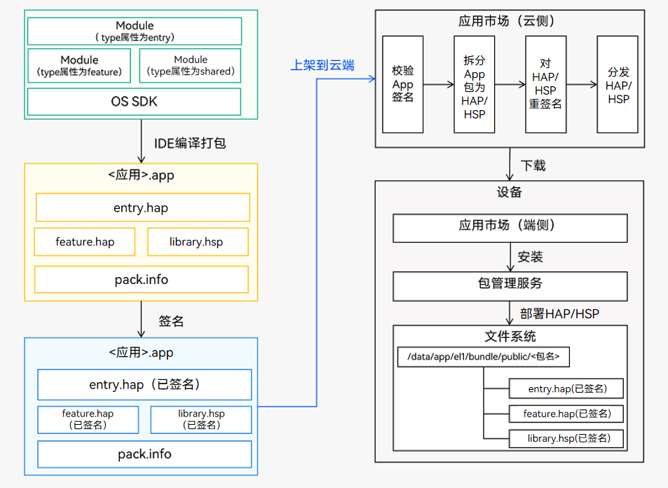


## 选择合适的包类型

HAP、HAR、HSP三者的功能和使用场景总结对比如下：

| Module类型     | 包类型                                                       | 说明                                                         |
| :------------- | :----------------------------------------------------------- | :----------------------------------------------------------- |
| Ability        | [HAP](https://developer.huawei.com/consumer/cn/doc/harmonyos-guides-V5/hap-package-V5) | 应用的功能模块，可以独立安装和运行，必须包含一个entry类型的HAP，可选包含一个或多个feature类型的HAP。 |
| Static Library | [HAR](https://developer.huawei.com/consumer/cn/doc/harmonyos-guides-V5/har-package-V5) | 静态共享包，编译态复用。- 支持应用内共享，也可以发布后供其他应用使用。- 作为二方库，发布到[OHPM私仓](https://developer.huawei.com/consumer/cn/doc/harmonyos-guides-V5/ide-ohpm-repo-V5)，供公司内部其他应用使用。- 作为三方库，发布到[OHPM中心仓](https://ohpm.openharmony.cn/)，供其他应用使用。- 多包（HAP/HSP）引用相同的HAR时，会造成多包间代码和资源的重复拷贝，从而导致应用包膨大。- 注意：[编译HAR](https://developer.huawei.com/consumer/cn/doc/harmonyos-guides-V5/har-package-V5#编译)时，建议开启混淆能力，保护代码资产。 |
| Shared Library | [HSP](https://developer.huawei.com/consumer/cn/doc/harmonyos-guides-V5/in-app-hsp-V5) | 动态共享包，运行时复用。- 当多包（HAP/HSP）同时引用同一个共享包时，采用HSP替代HAR，可以避免HAR造成的多包间代码和资源的重复拷贝，从而减小应用包大小。 |

HAP、HSP、HAR支持的规格对比如下，其中“√”表示是，“×”表示否。


开发者可以根据实际场景所需的能力，选择相应类型的包进行开发。在后续的章节中还会针对如何使用[HAP](https://developer.huawei.com/consumer/cn/doc/harmonyos-guides-V5/hap-package-V5)、[HAR](https://developer.huawei.com/consumer/cn/doc/harmonyos-guides-V5/har-package-V5)、[HSP](https://developer.huawei.com/consumer/cn/doc/harmonyos-guides-V5/in-app-hsp-V5)分别展开详细介绍。

| 规格                                                         | HAP  | HAR  | HSP  |
| :----------------------------------------------------------- | :--- | :--- | :--- |
| 支持在配置文件中声明[UIAbility](https://developer.huawei.com/consumer/cn/doc/harmonyos-guides-V5/uiability-overview-V5)组件与[ExtensionAbility](https://developer.huawei.com/consumer/cn/doc/harmonyos-guides-V5/extensionability-overview-V5)组件 | √    | ×    | ×    |
| 支持在配置文件中声明[pages](https://developer.huawei.com/consumer/cn/doc/harmonyos-guides-V5/module-configuration-file-V5#pages标签)页面 | √    | ×    | √    |
| 支持包含资源文件与.so文件                                    | √    | √    | √    |
| 支持依赖其他HAR文件                                          | √    | √    | √    |
| 支持依赖其他HSP文件                                          | √    | √    | √    |
| 支持在设备上独立安装运行                                     | √    | ×    | ×    |

说明

- HAR虽然不支持在配置文件中声明pages页面，但是可以包含pages页面，并通过[命名路由](https://developer.huawei.com/consumer/cn/doc/harmonyos-guides-V5/arkts-routing-V5#命名路由)的方式进行跳转。
- 由于HSP仅支持应用内共享，如果HAR依赖了HSP，则该HAR文件仅支持应用内共享，不支持发布到二方仓或三方仓供其他应用使用，否则会导致编译失败。
- HAR和HSP均不支持循环依赖，也不支持依赖传递。


## 开发模型

**图2** 分层架构开发模型


- 产品定制层

  产品定制层的各个子目录会被编译成一个[Entry类型的HAP](https://developer.huawei.com/consumer/cn/doc/harmonyos-guides-V5/hap-package-V5)，作为应用的主入口。该层主要针对跨多种设备，为各种设备形态集成相应的功能和特性。产品定制层被划分为多个功能模块，每个功能模块都针对特定的设备或使用场景设计，并根据具体的产品需求进行功能及交互的定制开发。

  说明

  - 在产品定制层，开发者可以从不同设备对应的应用UX设计和功能两个维度，结合具体的业务场景，选择一次编译生成[相同或者不同的HAP（或其组合）](https://developer.huawei.com/consumer/cn/doc/harmonyos-guides-V5/introduction-V5#部署模型)。
  - 通过使用[定制多目标构建产物](https://developer.huawei.com/consumer/cn/doc/harmonyos-guides-V5/ide-customized-multi-targets-and-products-guides-V5)的定制功能，可以将应用所对应的HAP编译成各自的.app文件，用于上架到应用市场。

- 基础特性层

  在基础特性层中，功能模块根据部署需求被分为两类。对于需要通过Ability承载的功能，可以设计为[Feature类型的HAP](https://developer.huawei.com/consumer/cn/doc/harmonyos-guides-V5/hap-package-V5)，而对于不需要通过Ability承载的功能，根据是否需要实现按需加载，可以选择设计为[HAR](https://developer.huawei.com/consumer/cn/doc/harmonyos-guides-V5/har-package-V5)模块或者[HSP](https://developer.huawei.com/consumer/cn/doc/harmonyos-guides-V5/in-app-hsp-V5)模块，编译后对应HAR包或者HSP包。

- 公共能力层

  公共能力层的各子目录将被编译成HAR包，而他们只能被产品定制层和基础特性层所依赖，不允许存在反向依赖。该层旨在提取模块化公共基础能力，为上层提供标准接口和协议，从而提高整体的复用率和开发效率。


## 部署模型

**图3** 分层架构部署模型（不同设备的定制）
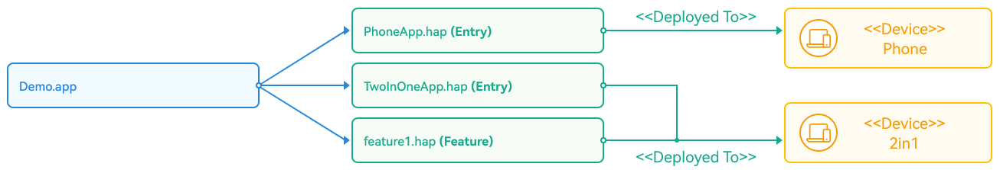

应用程序（.app文件）在流水线或应用市场上被解包为n * Entry类型的HAP + n * Feature类型的HAP，根据设备类型和使用场景将应用部署到不同类型的设备上，实现多端的统一用户体验。

在部署模型中，每个Entry类型的HAP代表了应用的入口点，而Feature类型的HAP则包含了应用的特定功能模块。允许应用能够以模块化的方式适配和部署，从而满足不同设备和场景的需求。

该部署模型不仅优化了应用的组织结构，也为保持应用在各种设备和场景中的一致性提供了支持。通过按照设备类型和使用场景来区分和部署不同的HAP，能确保无论在何种设备或场景中，用户都能获得统一且高质量的体验。


# 三层架构实战

## 单层

		之前的代码结构如下，我们所有的业务都在一个entry模块中，此时再新增功能，就需要修改或者新增这个模块内容。
	
		例如要开发map和learning对应的功能时，就需要修改这个entry模块的内容，为了让模块更加内聚减少耦合，所以需要对工程进行目录结构拆分，实现模块化。

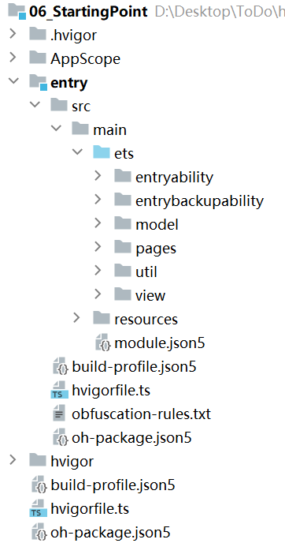


## 三层-预期效果

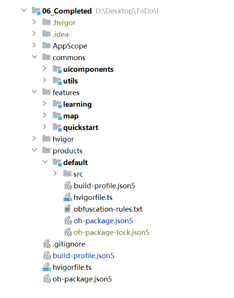


## 下面我们先来实现一个两层架构


#### 1-先创建一个空项目

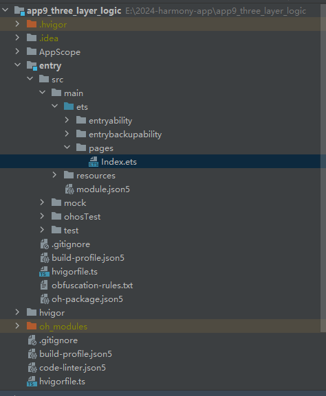


#### 2-创建三个目录

首先在工程目录Project下，跟entry平级，创建三个文件夹commons、features、products。 存放三层的代码

文件夹的名字，自定，不一定非得按照这三个名字！

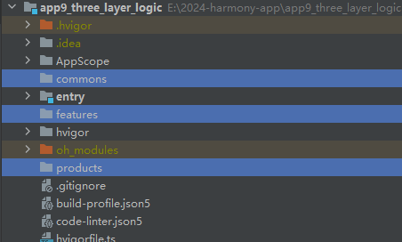


#### 3-创建公共能力层har包


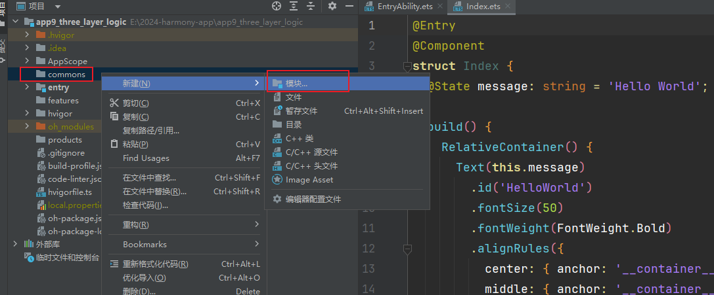

##### 选择har包

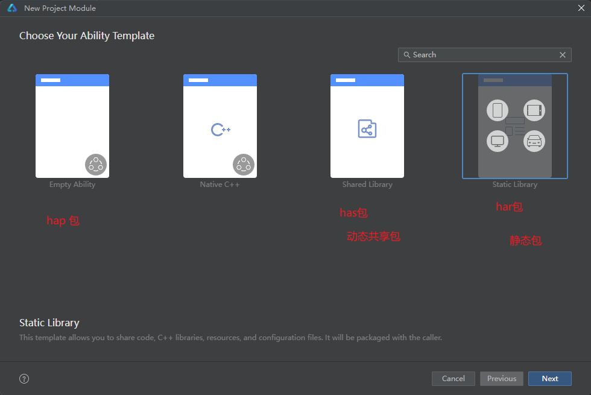


名字根据你开发功能随便起

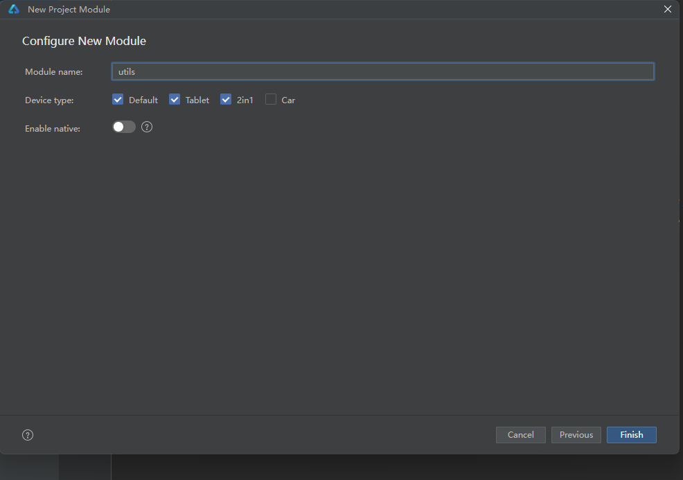


点击finish创建

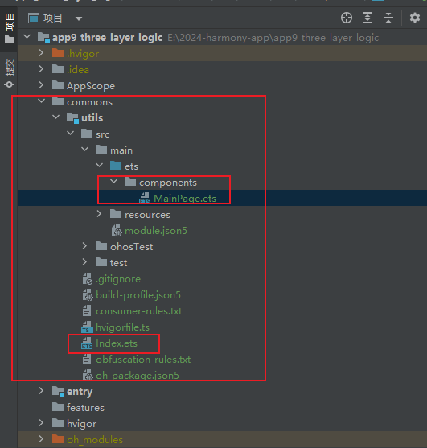


这里里面已经写好了一个组件，并且在这个包的根目录下面的index.ets导出了这个组件！表示这个包对外提供了一个名为MainPage的模板

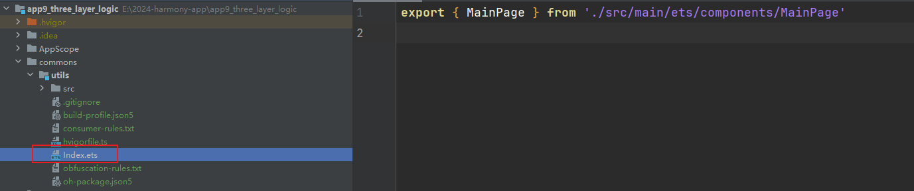

MainPage里面的默认内容如下

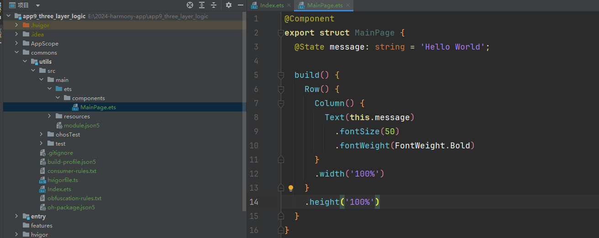

##### 导出一个自己封装的组件和函数

假如，设置我们自己封装的一个组件，内容我们可以修改一下

```
@Component
export struct MainPage {
  @State title:string='默认按钮内容';

  build() {
   Button(this.title).fontColor(Color.White).backgroundColor(Color.Red)
  }
}

```

包里面index，导出的内容也修改一下 

包里面根目录的index里面，导出的模块，就是我们这个库，对外提供的东西！（别人使用这个库的时候就可以导入）

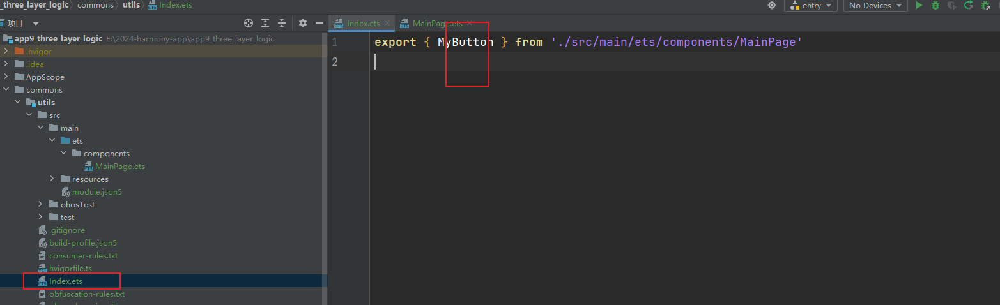


这里我们就封装了一个简单的组件库，里面只有一个按钮组件


顺便也导出一个简单的函数

ets下面创建一个add.ets

```
export  function  add(a:number,b:number){
    return a+b
}
```


修改har包根目录下面的index.ets

```
export { MyButton } from './src/main/ets/components/MainPage'
export {add} from './src/main/ets/add'
```


##### 给自己的包起个名字

在当前har包里面的oh-package.json5里面配置，名字和库的版本号

```
{
  "name": "@zhansan/utils",
  "version": "1.0.0",
  "description": "这是我自己封装的一个har包",
  "main": "Index.ets",
  "author": "张三是大爷",
  "license": "Apache-2.0",
  "dependencies": {}
}

```


#### 4- 把entry移入products层

将entry文件夹 其拖入products文件夹中

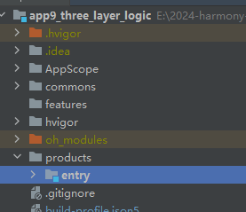


#### 5-entry（hap包）里面使用har包

entry这里相当于使我们的product层，只不过没有放入products文件夹下面

har包相当于是一个二方库（三方库是通过ohpm网上下载的，二方库等于是我们自己本地开发的一个库）

不管二方库还是三方库使用的，使用都需要安装

##### ohpm网络库安装库的方法

- 方式一：在Terminal窗口中，执行如下命令安装三方包，DevEco Studio会自动在工程的oh-package.json5中自动添加三方包依赖。

```
ohpm install @ohos/lottie
```

- 方式二：在工程的oh-package.json5中设置三方包依赖，配置示例如下：

```
"dependencies": { "@ohos/lottie": "^2.0.0"}

```

依赖设置完成后，需要执行ohpm install命令安装依赖包，依赖包会存储在工程的oh_modules目录下。

```
ohpm install

```

##### 引用本地库模块的文件和资源

·

- 方式一：在Terminal窗口中，执行如下命令进行安装，并会在oh-package5.json中自动添加依赖。

```
ohpm install ../library

```

- 方式二：在工程的oh-package.json5中设置三方包依赖，配置示例如下：

```
"dependencies": {
   "@ohos/library": "file:../library"
}

```

依赖设置完成后，需要执行ohpm install命令安装依赖包，依赖包会存储在工程的oh_modules目录下。

```
ohpm install

```

 

##### 这里我们本地库安装，方式2

终端中进入，entry目录

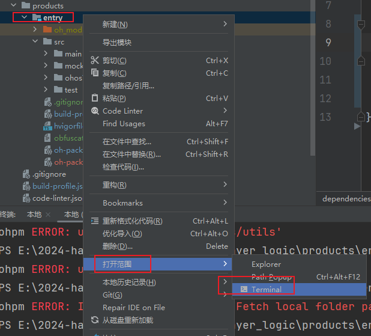


输入命令

```
ohpm install ../../commons/utils

```

安装完以后，entry下面的oh-package.json5 会多一条记录，同时entry下面多有一个oh_modules里面会下载我们的本地模块 

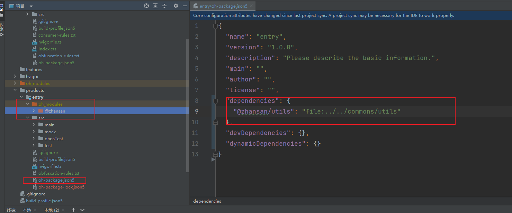

（安装完以后，点击一下左上角的同步按钮，否则一会写代码不会提示）


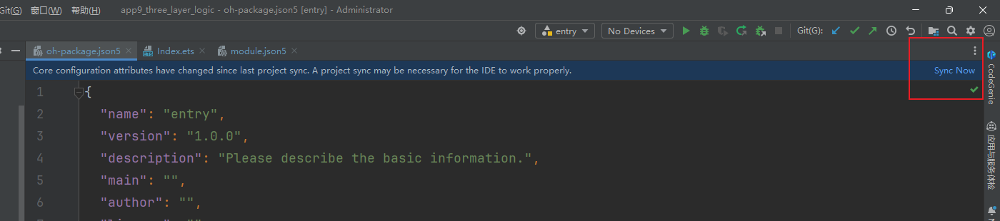


##### entry中的index页面中使用har包中模块

跟引入其他模块一样

```
import  {add,MyButton} from '@zhansan/utils'

```


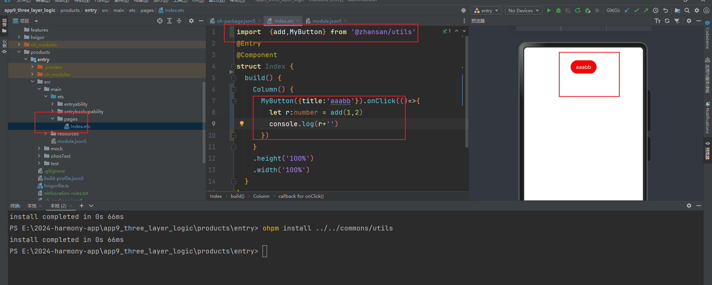


### feature层

feature层一般我们可以写一些，其他的页面，比如微信里面其他视频号模块，或者小程序模块。


#### 新建detail模块

这里我们在feature文件夹下面新建一个详情页面模块(har包)


ets下面新建pages文件夹，里面新建一个page，**注意：这里创建出来的页面，是没有@entry装饰器的**

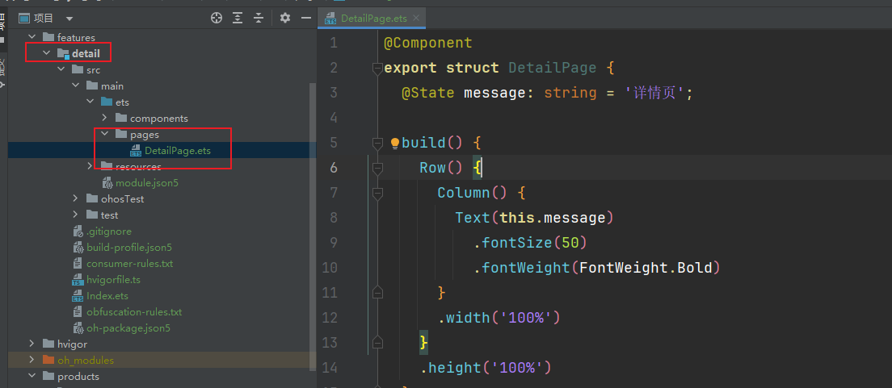


#### har中页面的跳转方式-命名路由

HAR不支持在配置文件中声明pages页面，但是可以包含pages页面，并通过命名路由的方式进行跳转。

##### 1-给har包中的页面添加 entry装饰器，并添加命名路由

```
@Entry({routeName:'myPage'})

```


features/detail/src/main/ets/pages/DetailPage.ets

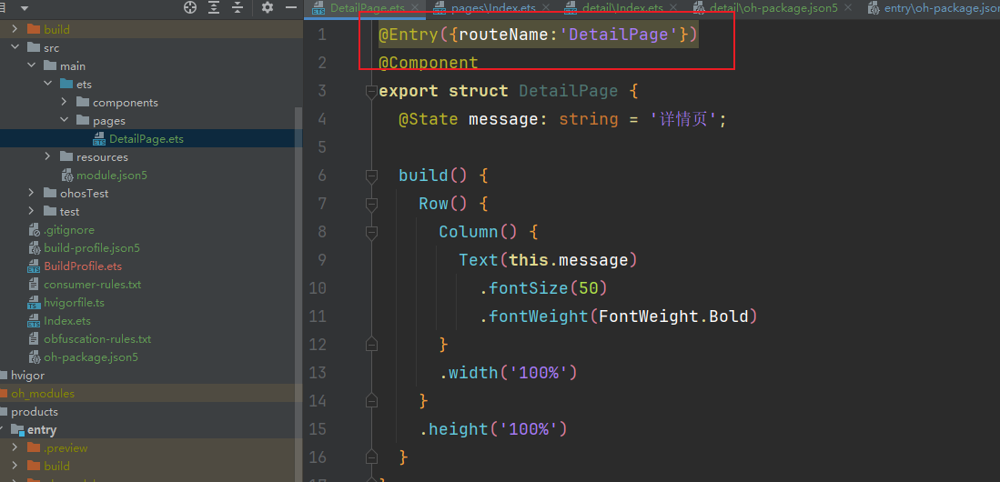

```
//配置命名路由
@Entry({routeName:'DetailPage'})
@Component
export struct DetailPage {
  @State message: string = '详情页';

  build() {
    Row() {
      Column() {
        Text(this.message)
          .fontSize(50)
          .fontWeight(FontWeight.Bold)
      }
      .width('100%')
    }
    .height('100%')
  }
}


```


##### 2-跳转的时候通过router.pushNamedRoute 方法

配置成功后需要在跳转的页面中引入命名路由的页面：

```
import 'features/detail/src/main/ets/pages/DetailPage'; // 引入共享包中的命名路由页面


import '@lisi/shop/src/main/ets/pages/ShopIndex'; // 引入共享包中的命名路由页面

```

然后就可以使用pushNamedRoute跳转

```
router.pushNamedRoute({
	name:'myPage'
}

```


##### 2-1 我们在product的entry模块安装har包

	entry模块中引入har包


```
 ohpm install ../../features/detail

```

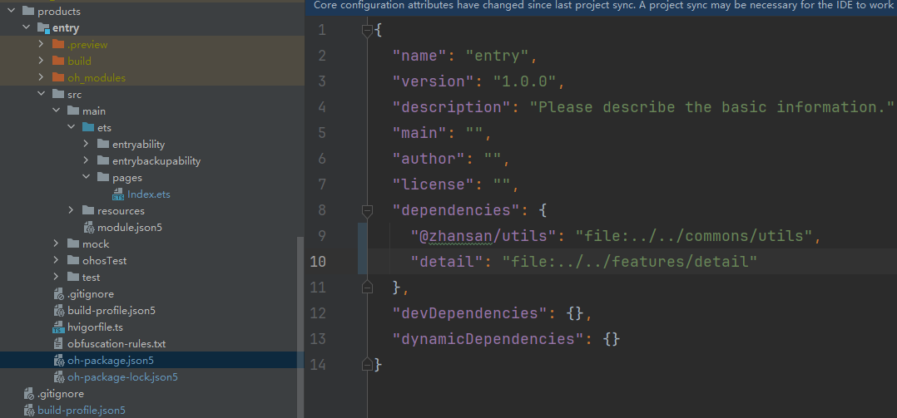

##### 2-2 我们在product的entry模块中的index页面中跳转到detail模块的DetailPage页面

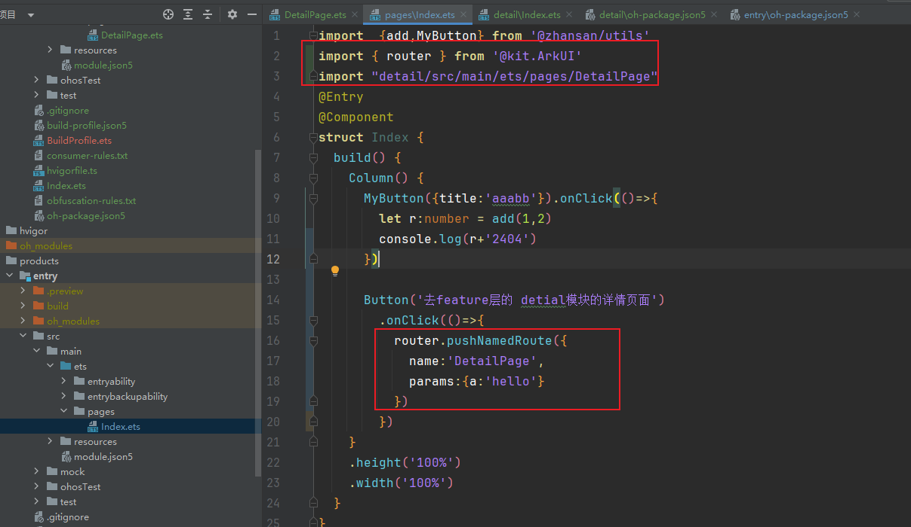


```
import  {add,MyButton} from '@zhansan/utils'
import { router } from '@kit.ArkUI'
import "detail/src/main/ets/pages/DetailPage"
@Entry
@Component
struct Index {
  build() {
    Column() {
      MyButton({title:'aaabb'}).onClick(()=>{
        let r:number = add(1,2)
        console.log(r+'2404')
      })

      Button('去feature层的 detial模块的详情页面')
        .onClick(()=>{
          router.pushNamedRoute({
            name:'DetailPage',
            params:{a:'hello'}
          })
        })
    }
    .height('100%')
    .width('100%')
  }
}

```


detial页面也可接受参数

```
import { router } from "@kit.ArkUI";

@Entry({routeName:'DetailPage'})
@Component
export struct DetailPage {
  @State message: string = '详情页';
  aboutToAppear(): void {
    let a = (router.getParams() as Record<string,string>).a
    console.log(a)
    setTimeout(()=>{
      AlertDialog.show({title:'传入的参数',message:a})
    },1000)
  }

  build() {
    Row() {
      Column() {
        Text(this.message)
          .fontSize(50)
          .fontWeight(FontWeight.Bold)
      }
      .width('100%')
    }
    .height('100%')
  }
}


```


## 参考

https://developer.huawei.com/consumer/cn/doc/harmonyos-guides-V5/application-package-overview-V5

https://developer.huawei.com/consumer/cn/doc/harmonyos-guides-V5/application-package-structure-stage-V5


三层架构文档 https://developer.huawei.com/consumer/cn/doc/best-practices-V5/bpta-layered-architecture-design-V5


https://developer.huawei.com/consumer/cn/codelabsPortal/carddetails/tutorials_Next-BasicArchitectureDesignPart2