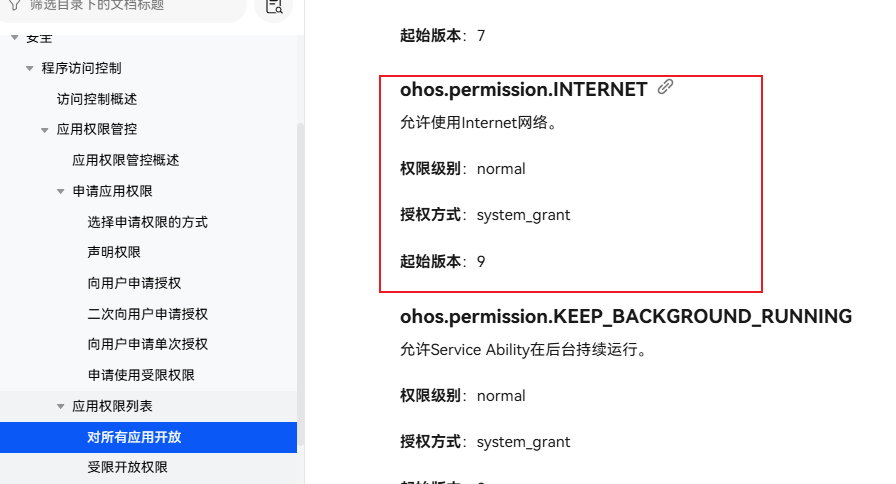
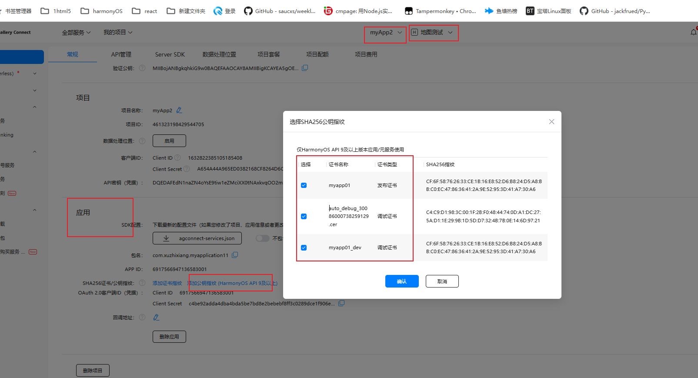
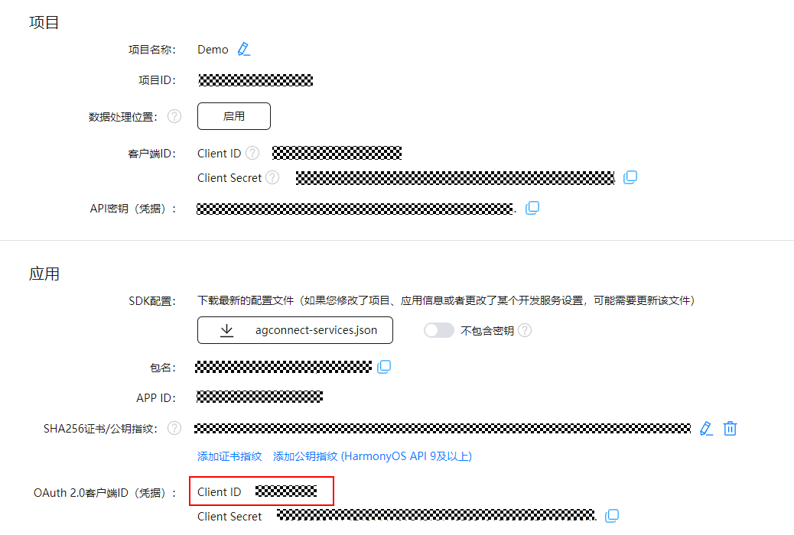
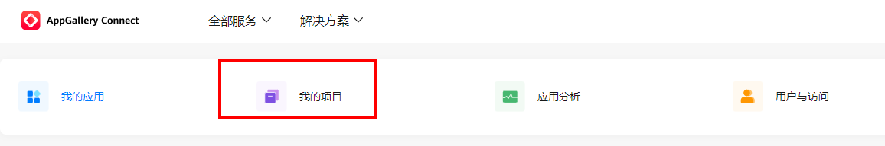
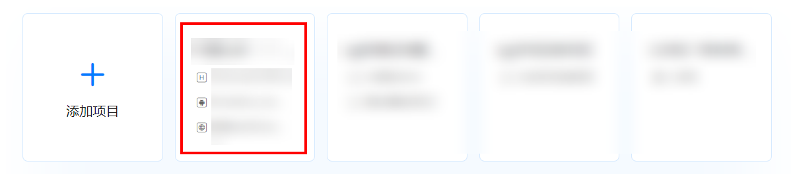
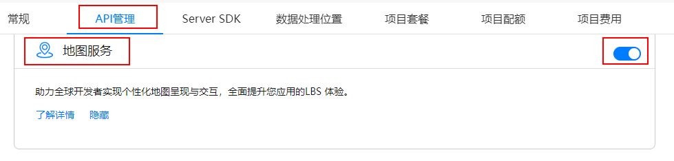
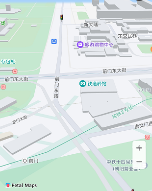

#  程序访问控制


## 应用权限

## 1. 应用权限管控

 ### 1.1 概述

3. 系统提供了一种允许应用访问系统资源（如：通讯录等）和系统能力（如：访问摄像头、麦克风等）的通用权限访问方式，来保护系统数据（包括用户个人数据）或功能，避免它们被不当或恶意使用。

4. 应用权限保护的对象可以分为数据和功能：

5. - 数据包括个人数据（如照片、通讯录、日历、位置等）、设备数据（如设备标识、相机、麦克风等）。
   - 功能包括设备功能（如访问摄像头/麦克风、打电话、联网等）、应用功能（如弹出悬浮窗、创建快捷方式等）。

6.      


 ### 1.2 授权级别

2. - normal-都可以用
   - system_basic-需要签名（想表达后期应用上架了需要去申请权限 并且等待审核后才可以用）
   - system_core-三方无权 （系统核心权限-应用没有权限）


[这里可以查看-](https://developer.huawei.com/consumer/cn/doc/harmonyos-guides-V5/app-permission-mgmt-overview-V5)-某个权限的授权级别

1. 


 ### 1.3 授权方式-系统授权

根据授权方式的不同，权限类型可分为  

​			系统授权system_grant（只要项目中配置要使用相关权限，系统自动弹框提示用户是否运行app使用这个权限）

​			用户授权user_grant （项目中配置要使用相关权限-app在使用这个权限的时候，会使用的视图弹窗给用户，让用户选择）

#### system_grant（系统授权）-网络权限

如果在应用中申请了system_grant权限，那么系统会在用户安装应用时，自动把相应权限授予给应用。

系统授权的[权限列表](https://developer.huawei.com/consumer/cn/doc/harmonyos-guides-V5/permissions-for-all-V5#system_grant%E7%B3%BB%E7%BB%9F%E6%8E%88%E6%9D%83%E6%9D%83%E9%99%90%E5%88%97%E8%A1%A8)

 授权方式为[system_grant](https://developer.huawei.com/consumer/cn/doc/harmonyos-guides-V5/app-permission-mgmt-overview-V5#system_grant系统授权)，申请方式请参考[声明权限](https://developer.huawei.com/consumer/cn/doc/harmonyos-guides-V5/declare-permissions-V5)。


比如说[网络访问权限](https://developer.huawei.com/consumer/cn/doc/harmonyos-guides-V5/permissions-for-all-V5#ohospermissioninternet)




##### module.json5中配置权限或者叫申请权限

应用需要在module.json5配置文件的requestPermissions标签中声明权限。

```
{
  "module": {
    "requestPermissions": [
        {
          "name" : "ohos.permission.xxxxxx", // 需要使用的权限名称
          // 申请权限的原因（用于录制音频）=> 必须去resources/base/element/string.json中声明(注意国际化)
          "reason": "$string:reason",  
          "usedScene": { // 权限使用的场景
            "abilities": [
              "EntryAbility"  // 使用权限的UIAbility或者ExtensionAbility组件的名称
            ],
            "when":"inuse" // 调用时机:inuse-使用时, always-始终
          }
        },
```


比如网络访问权限配置

```
   "requestPermissions": [
      {
        "name":"ohos.permission.INTERNET",
        "reason": "$string:reason1",
        "usedScene": { // 权限使用的场景
          "abilities": [
            "EntryAbility"  // 使用权限的UIAbility或者ExtensionAbility组件的名称
          ],
          "when":"inuse" // 调用时机:inuse-使用时, always-始终
        }

      },
```


然后我们就可以在项目中使用axios发起网络请求了


#### user_grant（用户授权） -定位权限

1. > 该类型权限不仅需要在安装包中申请权限，还需要在应用动态运行时，通过发送弹窗的方式请求用户授权。在用户手动允许授权后，应用才会真正获取相应权限，从而成功访问操作目标对象。


[定位权限文档](https://developer.huawei.com/consumer/cn/doc/harmonyos-guides-V5/permissions-for-all-V5#ohospermissionlocation)


定位权限 需要与模糊位置权限[ohos.permission.APPROXIMATELY_LOCATION](https://developer.huawei.com/consumer/cn/doc/harmonyos-guides-V5/permissions-for-all-V5#ohospermissionapproximately_location)一起，才可申请此权限。


#####  在配置文件中声明定位权限

应用需要在module.json5配置文件的requestPermissions标签中声明权限。

```
 "requestPermissions": [
 
      {
        "name": "ohos.permission.LOCATION",
        "reason": "$string:location_permission",
        "usedScene": {
          "abilities": [
            "EntryAbility"
          ],
          "when":"inuse"
        }
      },
      {
        "name": "ohos.permission.APPROXIMATELY_LOCATION",
        "reason": "$string:approximately_location_permission",
        "usedScene": {
          "abilities": [
            "EntryAbility"
          ],
          "when":"inuse"
        }
      }
    ],
```


配置完定位权限，以后我们就可以使用Location Kit，鸿蒙内置的一个位置服务库


##### Location Kit

###### Location Kit开发概述

移动终端设备已经深入人们日常生活的方方面面，如查看所在城市的天气、新闻轶事、出行打车、旅行导航、运动记录。这些习以为常的活动，都离不开定位用户终端设备的位置。

当用户处于这些丰富的使用场景中时，系统的位置能力可以提供实时准确的位置数据。对于开发者，设计基于位置体验的服务，也可以使应用的使用体验更贴近每个用户。

当应用在实现基于设备位置的功能时，如：驾车导航，记录运动轨迹等，可以调用该模块的API接口，完成位置信息的获取。

###### Location Kit简介

位置子系统使用多种定位技术提供服务，如GNSS定位、基站定位、WLAN/蓝牙定位（基站定位、WLAN/蓝牙定位后续统称“网络定位技术”）；通过这些定位技术，无论用户设备在室内或是户外，都可以准确地确定设备位置。

Location Kit除了提供基础的定位服务之外，还提供了地理围栏、地理编码、逆地理编码、国家码等功能和接口。


应用在使用[Location Kit](https://developer.huawei.com/consumer/cn/doc/harmonyos-references-V5/js-apis-geolocationmanager-V5)系统能力前，需要检查是否已经获取用户授权访问设备位置信息。如未获得授权，可以向用户申请需要的位置权限。

系统提供的定位权限有：

- ohos.permission.LOCATION：用于获取精准位置，精准度在米级别。
- ohos.permission.APPROXIMATELY_LOCATION：用于获取模糊位置，精确度为5公里。
- ohos.permission.LOCATION_IN_BACKGROUND：用于应用切换到后台仍然需要获取定位信息的场景。

Location Kit接口对权限的要求参见：[Location Kit](https://developer.huawei.com/consumer/cn/doc/harmonyos-references-V5/js-apis-geolocationmanager-V5)。


应用在使用[Location Kit](https://developer.huawei.com/consumer/cn/doc/harmonyos-references-V5/js-apis-geolocationmanager-V5)系统能力前，需要检查是否已经获取用户授权访问设备位置信息。如未获得授权，可以向用户申请需要的位置权限。


##### 检测是否已经获取定位授权

​		在进行权限申请之前，需要先检查当前应用程序是否已经被授予权限。可以通过调用[checkAccessToken()](https://developer.huawei.com/consumer/cn/doc/harmonyos-references-V5/js-apis-abilityaccessctrl-V5#checkaccesstoken9)方法来校验当前是否已经授权。如果已经授权，则可以直接访问目标操作，否则需要进行下一步操作，即向用户申请授权。

```typescript
import { abilityAccessCtrl ,bundleManager} from '@kit.AbilityKit';
import { BusinessError } from '@kit.BasicServicesKit';

async function checkPerssion() {
  // 三方应用可以通过bundleManager.getBundleInfoForSelf获取 (为了获取应用的tokenID)
  let bundleInfo: bundleManager.BundleInfo =
    await bundleManager.getBundleInfoForSelf(bundleManager.BundleFlag.GET_BUNDLE_INFO_WITH_APPLICATION);
  let appInfo: bundleManager.ApplicationInfo = bundleInfo.appInfo;
  // 每个程序都拥有唯一的ID（TokenID），系统基于此ID识别与限制应用的访问行为。
  let tokenID = appInfo.accessTokenId;
  console.log('checkAccessToken tokenID')

  //创建程序访问控制管理器
  let atManager: abilityAccessCtrl.AtManager = abilityAccessCtrl.createAtManager();
  //检测是否有某一个权限
  atManager.checkAccessToken(tokenID, 'ohos.permission.LOCATION')
    .then((data: abilityAccessCtrl.GrantStatus) => {
      //   -1表示没有权限
      console.log(`2404 checkAccessToken success, data->${JSON.stringify(data)}`)
      if (data == abilityAccessCtrl.GrantStatus.PERMISSION_GRANTED) {
        // 已经授权，可以继续访问目标操作
        console.log('2404 已经授权')

      } else {
        console.log('2404 未授权')

        //调用api 申请定位权限
        reqPermissionsFromUser()
      }
    }).catch((err: BusinessError) => {
    console.error(`checkAccessToken fail, err->${JSON.stringify(err)}`);
  });
}

```


##### 动态向用户申请授权 requestPermissionsFromUser

动态向用户申请权限是指在应用程序运行时向用户请求授权的过程。可以通过调用[requestPermissionsFromUser()](https://developer.huawei.com/consumer/cn/doc/harmonyos-references-V5/js-apis-abilityaccessctrl-V5#requestpermissionsfromuser9)方法来实现。该方法接收一个权限列表参数，例如位置、日历、相机、麦克风等。用户可以选择授予权限或者拒绝授权。

可以在UIAbility的onWindowStageCreate()回调中调用[requestPermissionsFromUser()](https://developer.huawei.com/consumer/cn/doc/harmonyos-references-V5/js-apis-abilityaccessctrl-V5#requestpermissionsfromuser9)方法来动态申请权限，也可以根据业务需要在UI中向用户申请授权。

应用在onWindowStageCreate()回调中申请授权时，需要等待异步接口loadContent()/setUIContent()执行结束后或在loadContent()/setUIContent()回调中调用[requestPermissionsFromUser()](https://developer.huawei.com/consumer/cn/doc/harmonyos-references-V5/js-apis-abilityaccessctrl-V5#requestpermissionsfromuser9)，否则在Content加载完成前，requestPermissionsFromUser会调用失败。


```

function reqPermissionsFromUser() {
  let atManager: abilityAccessCtrl.AtManager = abilityAccessCtrl.createAtManager();
  // const context: common.UIAbilityContext = getContext(this) as common.UIAbilityContext;

  // requestPermissionsFromUser会判断权限的授权状态来决定是否唤起弹窗
  atManager.requestPermissionsFromUser(getContext(), ['ohos.permission.LOCATION','ohos.permission.APPROXIMATELY_LOCATION']).then((data) => {
    //获取授权结果
    let grantStatus: Array<number> = data.authResults;
    let length: number = grantStatus.length;
    console.log('2404',JSON.stringify(data))
    for (let i = 0; i < length; i++) {
      if (grantStatus[i] === 0) {
        // 用户授权，可以继续访问目标操作--就可以获取经纬度
        console.log('2404  用户点击了授权')
      } else {
        // 用户拒绝授权，提示用户必须授权才能访问当前页面的功能，并引导用户到系统设置中打开相应的权限（二次授权）
        console.log('2404  用户点不允许')

      }
    }
    // 授权成功
  }).catch((err: BusinessError) => {
    console.error(`2404 Failed to request permissions from user. Code is ${err.code}, message is ${err.message}`);
  })
}

```


##### 二次授权

```
function  test2(){
  let permissionsDenied: Array<Permissions> = new Array()
  let permissionsArray :Permissions[]=  ['ohos.permission.LOCATION','ohos.permission.APPROXIMATELY_LOCATION']
  let atManager: abilityAccessCtrl.AtManager = abilityAccessCtrl.createAtManager();
  atManager.requestPermissionOnSetting(getContext(), ['ohos.permission.LOCATION','ohos.permission.APPROXIMATELY_LOCATION']).then((data: Array<abilityAccessCtrl.GrantStatus>) => {//api12中提供
    permissionsArray.forEach((value,index)=>{
      if (data[index]===abilityAccessCtrl.GrantStatus.PERMISSION_DENIED) {
        permissionsDenied.push(permissionsArray[index])
      }
    })

  }).catch((err: BusinessError) => {

  });
}
```


##### 获取经纬度

引入 LocationKit ,[api文档](https://developer.huawei.com/consumer/cn/doc/harmonyos-references-V5/js-apis-geolocationmanager-V5#locationrequest)

[指南文档](https://developer.huawei.com/consumer/cn/doc/harmonyos-guides-V5/location-guidelines-V5#%E5%BC%80%E5%8F%91%E6%AD%A5%E9%AA%A4)


```
import { geoLocationManager } from '@kit.LocationKit';
```

调用获取位置接口之前需要先判断位置开关是否打开。

##### 检测位置开关是否看起

查询当前位置开关状态，返回结果为布尔值，true代表位置开关开启，false代表位置开关关闭，示例代码如下：

```typescript
import { geoLocationManager } from '@kit.LocationKit';
try {
    let locationEnabled = geoLocationManager.isLocationEnabled();
} catch (err) {
    console.error("errCode:" + err.code + ", message:"  + err.message);
}
```

如果位置开关未开启，可以拉起全局开关设置弹框，引导用户打开位置开关，具体可参考[拉起全局开关设置弹框](https://developer.huawei.com/consumer/cn/doc/harmonyos-references-V5/js-apis-abilityaccessctrl-V5#requestglobalswitch12)

一般都是开启的，这个不用管

```
import { abilityAccessCtrl, Context, common } from '@kit.AbilityKit';
import { BusinessError } from '@kit.BasicServicesKit';

let atManager: abilityAccessCtrl.AtManager = abilityAccessCtrl.createAtManager();
let context: Context = getContext(this) as common.UIAbilityContext;
atManager.requestGlobalSwitch(context, abilityAccessCtrl.SwitchType.CAMERA).then((data: Boolean) => {
  console.info('data:' + JSON.stringify(data));
}).catch((err: BusinessError) => {
  console.error('data:' + JSON.stringify(err));
});

```

z


##### 方式一：获取系统缓存的最新位置。

如果系统当前没有缓存位置会返回错误码。

推荐优先使用该接口获取位置，可以减少系统功耗。

如果对位置的新鲜度比较敏感，可以先获取缓存位置，将位置中的时间戳与当前时间对比，若新鲜度不满足预期可以使用方式二获取位置。

```typescript
import { geoLocationManager } from '@kit.LocationKit';
try {
    let locationEnabled = geoLocationManager.isLocationEnabled();
} catch (err) {
    console.error("errCode:" + err.code + ", message:"  + err.message);
}


```


##### 方式二：获取当前位置。

首先要实例化[SingleLocationRequest](https://developer.huawei.com/consumer/cn/doc/harmonyos-references-V5/js-apis-geolocationmanager-V5#singlelocationrequest12)对象，用于告知系统该向应用提供何种类型的位置服务，以及单次定位超时时间。

- 设置LocatingPriority：

  如果对位置的返回精度要求较高，建议LocatingPriority参数优先选择PRIORITY_ACCURACY，会将一段时间内精度较好的结果返回给应用。

  如果对定位速度要求较高，建议LocatingPriority参数选择PRIORITY_LOCATING_SPEED，会将最先拿到的定位结果返回给应用。

  两种定位策略均会同时使用GNSS定位和网络定位技术，以便在室内和户外场景下均可以获取到位置结果，对设备的硬件资源消耗较大，功耗也较大。

- 设置locatingTimeoutMs：

  因为设备环境、设备所处状态、系统功耗管控策略等的影响，定位返回的时延会有较大波动，建议把单次定位超时时间设置为10秒。

以快速定位策略(PRIORITY_LOCATING_SPEED)为例，调用方式如下：


```
  getLocationPosition(): void {
    let request: geoLocationManager.SingleLocationRequest = {
      locatingPriority:  geoLocationManager.LocatingPriority.PRIORITY_LOCATING_SPEED,
      locatingTimeoutMs: 10000
    };
    geoLocationManager.getCurrentLocation(request).then((location: geoLocationManager.Location) => {
      console.log('2404',JSON.stringify(location))
    }).catch((err: BusinessError) => {
    
      console.log('2404',JSON.stringify(err))
    });
  }


```

通过本模块获取到的坐标均为WGS-84坐标系坐标点，如需使用其它坐标系类型的坐标点，请进行坐标系转换后再使用。

可参考Map Kit提供的地图计算工具进行[坐标转换](https://developer.huawei.com/consumer/cn/doc/harmonyos-guides-V5/map-convert-coordinate-V5)。


##### 坐标转换

华为地图在中国大陆、中国香港和中国澳门使用GCJ02坐标系，若使用WGS84坐标系直接叠加在华为地图上，因坐标值不同，展示位置会有偏移。所以，在中国大陆、中国香港和中国澳门如果使用WGS84坐标调用Map Kit服务，需要先将其转换为GCJ02坐标系再访问。

主要由[map](https://developer.huawei.com/consumer/cn/doc/harmonyos-references-V5/map-map-V5)命名空间下的[convertCoordinateSync](https://developer.huawei.com/consumer/cn/doc/harmonyos-references-V5/map-map-V5#section14966449114916)方法提供


###### 开发步骤

导入相关模块。

```typescript
import { map, mapCommon } from '@kit.MapKit';

```

###### 坐标转换

初始化需要转换的坐标，调用[convertCoordinateSync](https://developer.huawei.com/consumer/cn/doc/harmonyos-references-V5/map-map-V5#section14966449114916)方法转换坐标。

```typescript
let wgs84Position: mapCommon.LatLng = {
  latitude: 30,
  longitude: 118
};
// 转换经纬度坐标
let gcj02Position: mapCommon.LatLng =
  map.convertCoordinateSync(mapCommon.CoordinateType.WGS84, mapCommon.CoordinateType.GCJ02, wgs84Position);

```


### 受限开放权限

 

#### a. 在配置文件中声明权限 

module.json5

```
{
  "module": {
    "requestPermissions": [
    	....
    	继续追加

// 受限开放权限 ---------------------------------
      // 通讯录（权限组-读写）
      {
        "name": "ohos.permission.READ_CONTACTS",
        "reason": '$string:permission_reason_contact',
        "usedScene": {}
      },
      {
        "name": "ohos.permission.WRITE_CONTACTS",
        "reason": '$string:permission_reason_contact',
        "usedScene": {}
      },
      // 图片或视频文件（权限组-读写 仅应用需要克隆、备份或同步图片/视频类文件可申请） 其他场景用使用Picker选择媒体库资源。
      {
        "name": "ohos.permission.READ_IMAGEVIDEO",
        "reason": "$string:permission_reason_imageVideo",
        "usedScene": {}
      },
      {
        "name": "ohos.permission.WRITE_IMAGEVIDEO",
        "reason": "$string:permission_reason_imageVideo",
        "usedScene": {}
      }
      // 受限开放权限 ---------------------------------

```


#### b. 自动签名或者手动签名

配置好声明权限，直接模拟器运行会报错，因为这些权限需要签名（目的就是告诉开发者这些权限不是说直接就可以用，上架的时候需要审批通过才可以用）

https://developer.huawei.com/consumer/cn/doc/harmonyos-guides-V5/ide-signing-V5#section18815157237 

  


配置完在运行就没事了，


### 这里我们封装了一个权限管理类

#### OHPermission.ets

```
import { abilityAccessCtrl, bundleManager, common, Permissions } from '@kit.AbilityKit';
import { BusinessError } from '@kit.BasicServicesKit';
// import Logger from './Logger';
let Logger = console
let TAG = "OHPermission"
const context = getContext(this) as common.UIAbilityContext;
export interface PermissionGrantStatusResult{
  permissionsAll:Permissions[];
  permissionsDenied:Permissions[];//被拒绝
  grantStatus:boolean;
}

export default class OHPermission {
  //-1 PERMISSION_DENIED表示未授权。0 PERMISSION_GRANTED表示已授权。
  static async checkPermissionsArray(permissionsArray: Array<Permissions>): Promise<PermissionGrantStatusResult> {
    //Logger.debug(TAG,'checkPermissionsArray permissionArray:' + JSON.stringify(permissionsArray));
    let authResults = new Array<number>(permissionsArray.length)
    let permissionsDenied: Array<Permissions> = new Array()
    permissionsArray.forEach((value, index) => {
      const grantStatus: abilityAccessCtrl.GrantStatus = OHPermission.checkPermissionGrant(value);
      authResults[index] = grantStatus;
      if (grantStatus != abilityAccessCtrl.GrantStatus.PERMISSION_GRANTED) {
        permissionsDenied.push(permissionsArray[index])
      }
    })
    let result = {
      "permissionsAll": permissionsArray,
      "permissionsDenied": permissionsDenied,
      "grantStatus": permissionsDenied.length <= 0
    } as PermissionGrantStatusResult
    return result
  }

  /**
   * 动态申请权限
   * @param permissions
   * @returns 相应请求权限的结果。
   */
  static async requestPermissionsArray(permissionArray: Array<Permissions>): Promise<PermissionGrantStatusResult>{
    Logger.debug(TAG,'requestPermissionsArray permissionArray:' + JSON.stringify(permissionArray));
    let result =  await OHPermission.reqPermissionsArrayFromUser(permissionArray)
    if (!result.grantStatus) {
      result = await OHPermission.requestPermissionsArrayOnSetting(result.permissionsDenied)
    }
    Logger.debug(TAG,'requestPermissionsArray permissionArray:' + JSON.stringify(result));
    return result
  }

  /**
   * 校验应用是否被授予 {permission} 权限
   * @param permission
   * @returns
   */
  private static checkPermissionGrant(permission: Permissions): abilityAccessCtrl.GrantStatus {
    const atManager = abilityAccessCtrl.createAtManager();
    // 初始化grantStatus为未授权
    let grantStatus: abilityAccessCtrl.GrantStatus = abilityAccessCtrl.GrantStatus.PERMISSION_DENIED;
    let tokenId: number = 0;
    try {
      // 获取应用程序的accessTokenID
      const bundleInfo: bundleManager.BundleInfo =
        bundleManager.getBundleInfoForSelfSync(bundleManager.BundleFlag.GET_BUNDLE_INFO_WITH_APPLICATION);
      const appInfo: bundleManager.ApplicationInfo = bundleInfo.appInfo;
      tokenId = appInfo.accessTokenId;
      // 校验应用是否被授予权限
      grantStatus = atManager.checkAccessTokenSync(tokenId, permission);
      Logger.debug(TAG, `checkPermissionGrant 检查${permission},grantStatus=${grantStatus},权限状态为：${grantStatus ===
      abilityAccessCtrl.GrantStatus.PERMISSION_DENIED ? "未授权" : "已授权"}`);
    } catch (error) {
      const err = error as BusinessError;
      Logger.debug(TAG, `checkPermissionGrant检查${permission}权限异常：${JSON.stringify(err)}`);
      grantStatus = abilityAccessCtrl.GrantStatus.PERMISSION_DENIED;
    }
    return grantStatus;
  }

  /**
   * 动态申请权限 首次请求
   * @param permissions
   * @returns 相应请求权限的结果。
   */
  private static async reqPermissionsArrayFromUser(permissionsArray: Array<Permissions>): Promise<PermissionGrantStatusResult> {
    Logger.debug(TAG, 'reqPermissionArrayFromUser permissionArray:' + JSON.stringify(permissionsArray));
    let atManager: abilityAccessCtrl.AtManager = abilityAccessCtrl.createAtManager();
    let permissionsDenied: Array<Permissions> = new Array()
    return atManager.requestPermissionsFromUser(context, permissionsArray).then((data) => {
      Logger.debug(TAG, 'requestPermissionsFromUser:' + JSON.stringify(data));
      let grantStatus: Array<number> = data.authResults;
      let permissions: Array<string> = data.permissions;
      let dialogShownResults: Array<boolean> | undefined = data.dialogShownResults
      permissions.forEach((value, index) => {
        let dialogShown = false
        let grantStatusTxt = "未知"
        if (dialogShownResults != undefined) {
          dialogShown = dialogShownResults[index]
        }
        //值0表示授权，值-1表示不授权，值2表示请求无效。
        if (grantStatus[index] == 0) {
          grantStatusTxt = "授权"
        } else if (grantStatus[index] == -1) {
          grantStatusTxt = "不授权"
        } else if (grantStatus[index] == 2) {
          grantStatusTxt = "请求无效"
        }
        Logger.debug(TAG,
          `requestPermissionsFromUser [${value},${grantStatusTxt},${dialogShown ? "已经弹窗" : "没有弹窗"}]`);
        if (grantStatus[index] === -1 && !dialogShown) {
          permissionsDenied.push(permissionsArray[index])
        } else if (grantStatus[index] === 2) {
          throw new Error("请求无效")
        }
      })
      let result = {
        "permissionsAll": permissionsArray,
        "permissionsDenied": permissionsDenied,
        "grantStatus": permissionsDenied.length <= 0
      } as PermissionGrantStatusResult
      return result
    }).catch((err: BusinessError) => {
      Logger.debug(TAG, `reqPermissionArrayFromUser err:${err?.message},${JSON.stringify(permissionsArray)}`);
      let result = {
        "permissionsAll": permissionsArray,
        "permissionsDenied": permissionsArray,
        "grantStatus": false
      } as PermissionGrantStatusResult
      return result
    });
  }

  /**
   * 动态申请权限 二次请求 api12中提供
   * @param permissions
   * @returns 相应请求权限的结果。值0表示授权，值-1表示不授权
   */
  private static async requestPermissionsArrayOnSetting(permissionsArray: Array<Permissions>): Promise<PermissionGrantStatusResult>{
    let permissionsDenied: Array<Permissions> = new Array()
    Logger.debug(TAG,'requestPermissionOnSetting permissionArray:' + JSON.stringify(permissionsArray));

    let atManager: abilityAccessCtrl.AtManager = abilityAccessCtrl.createAtManager();
    return atManager.requestPermissionOnSetting(context, permissionsArray).then((data: Array<abilityAccessCtrl.GrantStatus>) => {//api12中提供
      Logger.debug(TAG,'requestPermissionOnSetting data:' + JSON.stringify(data));
      permissionsArray.forEach((value,index)=>{
        Logger.debug(TAG,`requestPermissionOnSetting [${value},${data[index] === abilityAccessCtrl.GrantStatus.PERMISSION_DENIED ? "用户拒绝授权" : "用户授权"}]` );
        if (data[index]===abilityAccessCtrl.GrantStatus.PERMISSION_DENIED) {
          permissionsDenied.push(permissionsArray[index])
        }
      })
      let result = {"permissionsAll":permissionsArray,
        "permissionsDenied" :permissionsDenied,
        "grantStatus":permissionsDenied.length<=0} as PermissionGrantStatusResult
      return result
    }).catch((err: BusinessError) => {
      Logger.debug(TAG,`reqPermissionArrayFromUser err:${err?.message},${JSON.stringify(permissionsArray)}`);
      let result = {"permissionsAll":permissionsArray,
        "permissionsDenied" :permissionsArray,
        "grantStatus":false} as PermissionGrantStatusResult
      return result
    });
  }
}


```


##### 使用

```
  test(){
    //要申请的权限
    let locationPermissions: Array<Permissions> = [
      'ohos.permission.LOCATION',
      'ohos.permission.APPROXIMATELY_LOCATION'
    ]
    // 校验是否被授予定位权限
     OHPermission.checkPermissionsArray(locationPermissions).then((data)=> {
       // 如果没有这个权限
       if (!data.grantStatus) {
         // 申请授权，如果用于拒绝内部，自动调到 应用权限设置页面
         OHPermission.requestPermissionsArray(data.permissionsDenied).then((r) => {
           if (r.grantStatus) {
             // this.getCurrentLocation()
           } else {
             throw Error("获取权限失败")
           }
         })
       } else {
         // 如果有这个权限
         // this.getCurrentLocation()
       }
     })

  }

```


### 一个定位权限处理类


#### OHLocation.ets

```
import OHPermission from './OHPermission';
import { Permissions } from '@kit.AbilityKit';
import { geoLocationManager } from '@kit.LocationKit';
// import Logger from './Logger';
import { BusinessError } from '@kit.BasicServicesKit';
let Logger = console

const TAG = "OHLocation"
export default class OHLocation {
  async getCurrentLocationWithPermission():Promise<GeoLocationInfo>{
    let locationPermissions: Array<Permissions> = [
      'ohos.permission.LOCATION',
      'ohos.permission.APPROXIMATELY_LOCATION'
    ]
    // 校验是否被授予定位权限
    return OHPermission.checkPermissionsArray(locationPermissions).then((data)=>{
      if (!data.grantStatus) {
        return OHPermission.requestPermissionsArray(data.permissionsDenied).then((r)=>{
          if (r.grantStatus) {
            return this.getCurrentLocation()
          }else {
            throw Error("获取权限失败")
          }
        })
      }else {
        return this.getCurrentLocation()
      }
    }).catch((error:Error)=>{
      let geoLocationInfo = {"status":false,"msg":error.message} as GeoLocationInfo
      return geoLocationInfo
    })
  }

  async getCurrentLocation():Promise<GeoLocationInfo>{
    let request: geoLocationManager.SingleLocationRequest = {
      'locatingPriority': geoLocationManager.LocatingPriority.PRIORITY_LOCATING_SPEED,
      'locatingTimeoutMs': 10000
    }
    return geoLocationManager.getCurrentLocation(request).then((result) => { // 调用getCurrentLocation获取当前设备位置，通过promise接收上报的位置
      Logger.debug(TAG,"getCurrentLocation======= location="+JSON.stringify(result))
      let location:geoLocationManager.Location = result
      let geoLocationInfo = {"status":true,lng:location.longitude,lat:location.latitude} as GeoLocationInfo
      return geoLocationInfo
    }).catch((error:BusinessError) => { // 接收上报的错误码
      Logger.debug(TAG,"getCurrentLocation======= location="+JSON.stringify(error))
      let geoLocationInfo = {"status":false} as GeoLocationInfo
      return geoLocationInfo
    });
  }
}
export interface GeoLocationInfo{
  address:string;
  lng:number;
  lat:number;
  status:boolean;
  msg:string
}


```


#### 使用


引入 

 ```
import OHLocation, { GeoLocationInfo } from './OHLocation'


 ```

使用

```
  new OHLocation().getCurrentLocationWithPermission().then((r:GeoLocationInfo) => {
      console.log('2404 r',JSON.stringify(r))
  })

```


## 安全访问机制

首先，鸿蒙 NEXT 全面梳理了所有系统授权，**取消了 9 类不合理权限**，有效避免了潜在的隐私泄露风险。这些权限包括读取**已安装应用列表、访问短信、访问存储文件、创建桌面快捷方式、获取设备信息、显示悬浮窗、访问通话记录、应用内安装应用以及拨打电话和管理通话**。  

 

其次，鸿蒙 NEXT 改变了传统的权限控制逻辑，**从“管权限”转变为“管数据”**，从而为用户提供更高级别的隐私保护。例如，在使用支付宝或小红书等第三方应用进行拍照或扫码时，**传统系统需要调用摄像头权限完成此次操作，拍摄或扫码时，应用可以看到整个过程中摄像头实时扫过的画面**。而在鸿蒙 NEXT 上，当用户在第三方应用中点击拍摄时，系统提示变为“您的摄像头正在取景，但应用仅可访问拍摄完成的图片”。


鸿蒙 NEXT 这一创新的安全访问机制，涵盖了位置、文件、图库、相机、联系人、剪贴板和音频 7 个方面，这些高频使用场景，也是用户隐私风险泄露的高发区。通过精准性、单次性的权限授予方式，确保了最小化的数据访问，大大降低了用户隐私泄露的风险。可以说是把隐私控制权完全交还给用户，让用户能够真正掌控。

 

举个简单的例子，假设用户的隐私数据是家中的珍贵物品，而“权限”则如同一把把房间钥匙。过去，当用户点击“允许”授权时，实际上是交出了钥匙，应用便可以自由进入该房间并取用其中的物品。然而，在 HarmonyOS NEXT 上，情况发生了变化。应用只能收到用户授权的具体物品，房间里的其他东西，都与之隔绝。**例如修改头像选择照片** 


  


HarmonyOS推出安全访问机制，改变应用获取隐私数据的方式，让用户从管理“权限”到管理“数据”，按需授予系统数据。举例而言，当用户想要更换社交平台头像时，应用将无法再获取整个图库的访问权限，用户选择哪张照片，应用就得到哪张照片，将用户的隐私数据与应用之间受控隔离，全面守护用户隐私。

具体来说，安全访问机制主要由系统Picker、安全控件两种系统机制来实现，在特定的场景中，应用无需向用户申请权限也可临时访问受限资源，实现精准化权限管控，更好地保护用户隐私。

- [系统Picker](https://developer.huawei.com/consumer/cn/doc/harmonyos-guides-V5/system-app-startup-V5)

  由系统独立进程实现，在应用拉起Picker，并由用户操作Picker后，应用可以获取Picker返回的资源或结果。举例说明，当应用需要读取用户图片时，可通过使用照片Picker，在用户选择所需要的图片资源后，直接返回该图片资源，而不需要授予应用读取图片文件的权限。

- [安全控件](https://developer.huawei.com/consumer/cn/doc/harmonyos-guides-V5/security-component-overview-V5)

  由系统提供UI控件，应用在界面内集成对应控件，用户点击后，应用将获得临时授权，从而执行相关操作。举例说明，当应用需要分享当前位置时，可使用位置控件，用户点击后，将会在本次前台期间获得精准定位的授权，可以调用位置服务获取精准定位。当发生灭屏、应用切后台、应用退出等任一情况时，临时授权结束。


- **使用系统Picker组件**

  相机、文件管理、联系人等系统应用提供了系统Picker组件，支持开发者无需申请权限、即可使用系统应用的一些常用功能，比如访问用户的资源文件。

  应用拉起系统Picker组件（文件选择器、照片选择器、联系人选择器等）后，由用户在Picker上选择对应的文件、照片、联系人等资源，应用即可获取到Picker的返回结果。例如，一个音频播放器应用可以通过AudioViewPicker让用户选择音频文件，然后获取所选的音频文件路径进行播放。

  说明

  由于系统Picker已经获取了对应权限的预授权，开发者使用系统Picker时，无需再次申请权限也可临时受限访问对应的资源。例如，当应用需要读取用户图片时，可通过使用照片Picker，在用户选择所需要的图片资源后，直接返回该图片资源，而不需要授予应用读取图片文件的权限。

  系统Picker由系统独立进程实现。


### 地图**Picker**

[Map Kit](https://developer.huawei.com/consumer/cn/doc/harmonyos-guides-V5/map-introduction-V5)提供了地图**Picker**，支持[地点详情展示](https://developer.huawei.com/consumer/cn/doc/harmonyos-guides-V5/map-location-details-V5)、[地点选取](https://developer.huawei.com/consumer/cn/doc/harmonyos-guides-V5/map-location-selecting-V5)、[区划选择](https://developer.huawei.com/consumer/cn/doc/harmonyos-guides-V5/map-location-division-V5)。


[地点选取](https://developer.huawei.com/consumer/cn/doc/harmonyos-guides-V5/map-location-selecting-V5)

#### 开发步骤

1. 导入相关模块。

   ```typescript
   import { sceneMap } from '@kit.MapKit';
   import { BusinessError } from '@kit.BasicServicesKit';
   import { common } from '@kit.AbilityKit';
   
   ```

2. 创建地点选取参数，调用

   chooseLocation

   方法拉起地点选取页。

   ```typescript
   let locationChoosingOptions: sceneMap.LocationChoosingOptions = {
     // 地图中心点坐标
     location: { latitude: 39.92194051376904, longitude: 116.3971836796932 },
     language: 'en',
     // 展示搜索控件
     searchEnabled: true,
     // 展示附近Poi
     showNearbyPoi: true
   };
   // 拉起地点选取页
   sceneMap.chooseLocation(getContext(this) as common.UIAbilityContext, locationChoosingOptions).then((data) => {
     console.info("ChooseLocation", "Succeeded in choosing location.");
   }).catch((err: BusinessError) => {
     console.error("ChooseLocation", `Failed to choose location, code: ${err.code}, message: ${err.message}`);
   });
   
   ```


### 相机pick

- [拍照录像](https://developer.huawei.com/consumer/cn/doc/harmonyos-guides-V5/camera-picker-V5)：[Camera Kit](https://developer.huawei.com/consumer/cn/doc/harmonyos-guides-V5/camera-overview-V5)提供了相机Picker，用于拍照、录像。

  真机才能用

  ```
  /*
  * Copyright (C) 2024 Huawei Device Co., Ltd.
  * Licensed under the Apache License, Version 2.0 (the "License");
  * you may not use this file except in compliance with the License.
  * You may obtain a copy of the License at
  *
  * http://www.apache.org/licenses/LICENSE-2.0
  *
  * Unless required by applicable law or agreed to in writing, software
  * distributed under the License is distributed on an "AS IS" BASIS,
  * WITHOUT WARRANTIES OR CONDITIONS OF ANY KIND, either express or implied.
  * See the License for the specific language governing permissions and
  * limitations under the License.
  */
  
  import { cameraPicker } from '@kit.CameraKit';
  import { camera } from '@kit.CameraKit';
  import { BusinessError } from '@ohos.base';
  import { hilog } from '@kit.PerformanceAnalysisKit'
  
  @Entry
  @Component
  struct ImagePickerPage {
    @State uri: Resource | string | undefined = undefined;
    private cameraPosition: Array<camera.CameraPosition> = [
      camera.CameraPosition.CAMERA_POSITION_UNSPECIFIED, camera.CameraPosition.CAMERA_POSITION_BACK,
      camera.CameraPosition.CAMERA_POSITION_FRONT, camera.CameraPosition.CAMERA_POSITION_FOLD_INNER
    ];
    private mediaType: Array<cameraPicker.PickerMediaType> = [
      cameraPicker.PickerMediaType.PHOTO, cameraPicker.PickerMediaType.VIDEO
    ];
  
    build() {
      Row() {
        Column() {
          Image(this.uri)
            .height(80)
  
          Button('ann')
            .width(200)
            .margin({ top: 10 })
            .onClick(async () => {
              try {
                // Configure to launch the rear camera
                let pickerProfile: cameraPicker.PickerProfile = { cameraPosition: this.cameraPosition[1] };
                // Configure to photo mode
                let pickerResult: cameraPicker.PickerResult = await cameraPicker.pick(getContext(this),
                  [this.mediaType[0]], pickerProfile);
                // Get video URI
                this.uri = pickerResult.resultUri;
                hilog.info(0x0000, ' ', "the pick pickerResult is:" + JSON.stringify(pickerResult));
              } catch (error) {
                let err = error as BusinessError;
                hilog.error(0x0000, '', `the pick call failed. error code: ${err.code}`);
              }
            })
        }
        .width('100%')
      }
      .height('100%')
    }
  }
  
  ```

  

  

### 图库（媒体库）

[Media Library Kit](https://developer.huawei.com/consumer/cn/doc/harmonyos-guides-V5/photoaccesshelper-overview-V5)提供了照片Picker（PhotoViewPicker），用于访问、保存公共目录的图片或视频文件。详见[选择媒体库资源](https://developer.huawei.com/consumer/cn/doc/harmonyos-guides-V5/photoaccesshelper-photoviewpicker-V5) 、[创建媒体资源](https://developer.huawei.com/consumer/cn/doc/harmonyos-guides-V5/photoaccesshelper-savebutton-V5)。


## 安全控件

保存控件是一种特殊的安全控件，它允许用户通过点击按钮临时获取存储权限，而无需通过权限弹框进行授权确认。

集成保存控件后，当用户点击该控件时，应用会获得10秒内访问媒体库特权接口的授权。这适用于任何需要将文件保存到媒体库的应用场景，例如保存图片或视频等。

与需要触发系统应用并由用户选择具体保存路径的Picker不同，保存控件可以直接保存到指定的媒体库路径，使得操作更为便捷。


### saveBtn保存图片到相册

当用户需要保存图片、视频等用户文件到图库时，无需在应用中申请相册管理模块权限'ohos.permission.WRITE_IMAGEVIDEO'，应用可以通过[安全控件](https://developer.huawei.com/consumer/cn/doc/harmonyos-guides-V5/photoaccesshelper-savebutton-V5#使用安全控件保存媒体库资源)或[授权弹窗](https://developer.huawei.com/consumer/cn/doc/harmonyos-guides-V5/photoaccesshelper-savebutton-V5#使用弹窗授权保存媒体库资源)的方式，将用户指定的媒体资源保存到图库中。


#### 约束与限制

- 当用户首次点击应用中的保存控件，系统将弹窗请求用户授权。如果用户点击“取消”，弹窗消失，应用无授权，用户再次点击保存控件时，将会重新弹窗；如果用户点击“允许”，弹窗消失，应用将被授予临时保存权限，此后点击该应用的保存控件将不会弹窗。
- 应用在onClick()触发回调到调用媒体库特权接口的时间间隔不能大于10秒。
- 用户点击一次控件，仅获取一次授权调用。
- 为了保障用户的隐私不被恶意应用获取，应用需确保安全控件是可见的且用户能够识别的。开发者需要合理的配置控件的尺寸、颜色等属性，避免视觉混淆的情况，如果发生因控件的样式不合法导致授权失败的情况，请检查设备错误日志。


### 保存本地图片

```
import { photoAccessHelper } from '@kit.MediaLibraryKit';
import { fileIo } from '@kit.CoreFileKit';
import { common } from '@kit.AbilityKit';
import { promptAction } from '@kit.ArkUI';
import { BusinessError } from '@kit.BasicServicesKit';

async function savePhotoToGallery(context: common.UIAbilityContext) {
  let helper = photoAccessHelper.getPhotoAccessHelper(context);
  try {
    // onClick触发后10秒内通过createAsset接口创建图片文件，10秒后createAsset权限收回。
    let uri = await helper.createAsset(photoAccessHelper.PhotoType.IMAGE, 'jpg');
    // 使用uri打开文件，可以持续写入内容，写入过程不受时间限制
    let file = await fileIo.open(uri, fileIo.OpenMode.READ_WRITE | fileIo.OpenMode.CREATE);
    // $r('app.media.startIcon')需要替换为开发者所需的图像资源文件
    context.resourceManager.getMediaContent($r('app.media.startIcon').id, 0)
      .then(async value => {
        let media = value.buffer;
        // 写到媒体库文件中
        await fileIo.write(file.fd, media);
        await fileIo.close(file.fd);
        promptAction.showToast({ message: '已保存至相册！' });
      });
  }
  catch (error) {
    const err: BusinessError = error as BusinessError;
    console.error(`Failed to save photo. Code is ${err.code}, message is ${err.message}`);
  }
}

@Entry
@Component
struct Index {
  build() {
    Row() {
      Column({ space: 10 }) {
        // $r('app.media.startIcon')需要替换为开发者所需的图像资源文件
        Image($r('app.media.startIcon'))
          .height(400)
          .width('100%')

        SaveButton()
          .padding({top: 12, bottom: 12, left: 24, right: 24})
          .onClick(async (event: ClickEvent, result: SaveButtonOnClickResult) => {
            if (result === SaveButtonOnClickResult.SUCCESS) {
              const context: common.UIAbilityContext = getContext(this) as common.UIAbilityContext;
              // 免去权限申请和权限请求等环节，获得临时授权，保存对应图片
              savePhotoToGallery(context);
            } else {
              promptAction.showToast({ message: '设置权限失败！' })
            }
          })
      }
      .width('100%')
    }
    .height('100%')
    .backgroundColor(0xF1F3F5)
  }
}

```


### 网络图片保存

#### 	下载图片，并将数据转化为 ArrayBuffer 类型。

```
/**
   * 通过http的request方法从网络下载图片资源
   */
   async getPicture(url:string) {
    http.createHttp()
      .request(url,
        (error: Error, data: http.HttpResponse) => {
          if (error) {
            return;
          }
          // 判断网络获取到的资源是否为ArrayBuffer类型
          if (data.result instanceof ArrayBuffer) {
            this.saveImageToPhoto(data.result as ArrayBuffer)
          }
        }
      )
  }


```

#### 保存图片到相册

```
  /**
   * 保存ArrayBuffer到图库
   * @param buffer：图片ArrayBuffer
   * @returns
   */
   async saveImageToPhoto(buffer: ArrayBuffer | string): Promise<void> {
    const context = getContext() as common.UIAbilityContext; // 获取getPhotoAccessHelper需要的context
    const helper = photoAccessHelper.getPhotoAccessHelper(context); // 获取相册管理模块的实例
    const uri = await helper.createAsset(photoAccessHelper.PhotoType.IMAGE, 'jpg'); // 指定待创建的文件类型、后缀和创建选项，创建图片或视频资源
     //获取文件管理模块
     let file = await fileIo.open(uri, fileIo.OpenMode.READ_WRITE | fileIo.OpenMode.CREATE);

    //写入文件
    let r =  await fileIo.write(file.fd, buffer);
    //写入完毕-关闭文件
    await fileIo.close(file.fd);
  }

```


#### 安全按钮调用保存

```
  build() {
    Column(){
      SaveButton().onClick(()=>{
        this.getPicture('https://img.alicdn.com/bao/uploaded/i3/3012860579/O1CN01E2B9GO1G9ELTLYa4A_!!4611686018427386531-0-item_pic.jpg_460x460q90.jpg_.webp')

      })
    }
    
  }

```


### 保存组件为图片

1-给组件添加id

```
  Column(){
        Image('https://img.alicdn.com/bao/uploaded/i3/3012860579/O1CN01E2B9GO1G9ELTLYa4A_!!4611686018427386531-0-item_pic.jpg_460x460q90.jpg_.webp')
          .width(300)
        Text('hello')
      }.id("photo").backgroundColor(Color.Red)

```

2-安全按钮

```
  SaveButton().onClick(()=>{

		////组件截屏
        componentSnapshot.get("photo", (error: Error, pixmap: image.PixelMap) => {
          if (error) {
            console.log("error: " + JSON.stringify(error))
            return;
          }
          // 图片编码指将PixelMap编码成不同格式的存档图片，当前支持打包为JPEG、WebP、png和 HEIF(不同硬件设备支持情况不同) 格式，用于后续处理，如保存、传输等。

          // rmat为图像的编码格式；quality为图像质量，范围从0-100，100为最佳质量。
          const  packOpts : image.PackingOption = { format:"image/jpeg", quality:98 };
          // 创建图像编码ImagePacker对象。
          const imagePackerApi = image.createImagePacker();
          // 进行图片编码，并保存编码后的图片。
          imagePackerApi.packing(pixmap, packOpts).then( (data : ArrayBuffer) => {
            // data 为打包获取到的文件流，写入文件保存即可得到一张图片
            this.saveImageToPhoto(data)
          }).catch((error : BusinessError) => {
            console.error('Failed to pack the image. And the error is: ' + error);
          })


        })


      })

```


保存到相册

```
/**
   * 保存ArrayBuffer到图库
   * @param buffer：图片ArrayBuffer
   * @returns
   */
  async saveImageToPhoto(buffer: ArrayBuffer | string): Promise<void> {
    const context = getContext() as common.UIAbilityContext; // 获取getPhotoAccessHelper需要的context
    const helper = photoAccessHelper.getPhotoAccessHelper(context); // 获取相册管理模块的实例
    const uri = await helper.createAsset(photoAccessHelper.PhotoType.IMAGE, 'jpg'); // 指定待创建的文件类型、后缀和创建选项，创建图片或视频资源
    //获取文件管理模块,传入文件地址，打开文件
    let file = await fileIo.open(uri, fileIo.OpenMode.READ_WRITE | fileIo.OpenMode.CREATE);

    //写入文件
    let r =  await fileIo.write(file.fd, buffer);
    //写入完毕-关闭文件
    await fileIo.close(file.fd);
  }

```


代码

```
import { componentSnapshot } from '@kit.ArkUI'
import { image } from '@kit.ImageKit'
import { photoAccessHelper } from '@kit.MediaLibraryKit';
import { common } from '@kit.AbilityKit';
import { fileIo } from '@kit.CoreFileKit';
import { BusinessError } from '@kit.BasicServicesKit';

@Entry
@Component
struct Index {
  /**
   * 保存ArrayBuffer到图库
   * @param buffer：图片ArrayBuffer
   * @returns
   */
  async saveImageToPhoto(buffer: ArrayBuffer | string): Promise<void> {
    const context = getContext() as common.UIAbilityContext; // 获取getPhotoAccessHelper需要的context
    const helper = photoAccessHelper.getPhotoAccessHelper(context); // 获取相册管理模块的实例
    const uri = await helper.createAsset(photoAccessHelper.PhotoType.IMAGE, 'jpg'); // 指定待创建的文件类型、后缀和创建选项，创建图片或视频资源
    //获取文件管理模块
    let file = await fileIo.open(uri, fileIo.OpenMode.READ_WRITE | fileIo.OpenMode.CREATE);

    //写入文件
    let r =  await fileIo.write(file.fd, buffer);
    //写入完毕-关闭文件
    await fileIo.close(file.fd);
  }

  build() {
    Column() {
      //布局样式
      Column(){
        Image('https://img.alicdn.com/bao/uploaded/i3/3012860579/O1CN01E2B9GO1G9ELTLYa4A_!!4611686018427386531-0-item_pic.jpg_460x460q90.jpg_.webp')
          .width(300)
        Text('hello')
      }.id("photo").backgroundColor(Color.Red)

      SaveButton().onClick(()=>{

        //组件截屏
        componentSnapshot.get("photo", (error: Error, pixmap: image.PixelMap) => {
          if (error) {
            console.log("error: " + JSON.stringify(error))
            return;
          }
          // 图片编码指将PixelMap编码成不同格式的存档图片，当前支持打包为JPEG、WebP、png和 HEIF(不同硬件设备支持情况不同) 格式，用于后续处理，如保存、传输等。

          // rmat为图像的编码格式；quality为图像质量，范围从0-100，100为最佳质量。
          const  packOpts : image.PackingOption = { format:"image/jpeg", quality:98 };
          // 创建图像编码ImagePacker对象。
          const imagePackerApi = image.createImagePacker();
          // 进行图片编码，并保存编码后的图片。
          imagePackerApi.packing(pixmap, packOpts).then( (data : ArrayBuffer) => {
            // data 为打包获取到的文件流，写入文件保存即可得到一张图片
            this.saveImageToPhoto(data)
          }).catch((error : BusinessError) => {
            console.error('Failed to pack the image. And the error is: ' + error);
          })


        })


      })
    }

  }
}

```


## 其他pick详见图片选择


# 地图开发


## 应用开发准备


在开始应用开发前，需要先完成以下[准备工作](https://developer.huawei.com/consumer/cn/doc/harmonyos-guides-V5/application-dev-overview-V5)。

### 注册成为开发者

在华为开发者联盟网站上，[注册成为开发者](https://developer.huawei.com/consumer/cn/doc/start/registration-and-verification-0000001053628148)，并完成[实名认证](https://developer.huawei.com/consumer/cn/doc/start/rna-0000001062530373)，从而享受联盟开放的各类能力和服务。

### 创建应用

在[AppGallery Connect](https://developer.huawei.com/consumer/cn/service/josp/agc/index.html)（简称AGC）上，参考[创建项目](https://developer.huawei.com/consumer/cn/doc/distribution/app/agc-help-createproject-0000001100334664)和[创建应用](https://developer.huawei.com/consumer/cn/doc/app/agc-help-createharmonyapp-0000001945392297)完成**HarmonyOS**应用的创建，从而使用各类服务。

### 配置安装DevEco Studio

安装最新版[DevEco Studio](https://developer.huawei.com/consumer/cn/download/)。具体安装指导请参见[安装DevEco Studio](https://developer.huawei.com/consumer/cn/doc/harmonyos-guides-V5/ide-software-install-V5)。

### 使用DevEco Studio创建应用工程

使用DevEco Studio创建应用工程。具体创建工程指导请参见[创建一个新工程](https://developer.huawei.com/consumer/cn/doc/harmonyos-guides-V5/ide-create-new-project-V5)。

### 配置签名信息

使用模拟器和预览器调试无需配置签名信息，使用真机设备调试则需要对HAP进行签名。

目前提供了两种签名方式，请根据实际情况选择：

- [自动签名](https://developer.huawei.com/consumer/cn/doc/harmonyos-guides-V5/ide-signing-V5#section18815157237)：如果您只需要使用一台调试设备，建议使用DevEco Studio提供的自动签名。
- 手动签名：如果您使用多台调试设备或者会在断网情况下调试，您需要在AGC中[申请调试证书](https://developer.huawei.com/consumer/cn/doc/app/agc-help-add-debugcert-0000001914263178)、[注册调试设备](https://developer.huawei.com/consumer/cn/doc/app/agc-help-add-device-0000001946142249)、[申请调试Profile](https://developer.huawei.com/consumer/cn/doc/app/agc-help-add-debugprofile-0000001914423102)后，再[手动配置签名信息](https://developer.huawei.com/consumer/cn/doc/harmonyos-guides-V5/ide-signing-V5#section297715173233)。

### （条件必选）添加公钥指纹

当应用需要使用以下开放能力的一种或多种时，为正常调试运行应用，需要预先添加公钥指纹。

- Account Kit（华为账号服务）
- Game Service Kit（游戏服务）
- Health Service Kit（运动健康服务）
- IAP Kit（应用内支付服务）
- Map Kit（地图服务）
- Payment Kit（华为支付服务）
- Wallet Kit（钱包服务）
- Wear Engine Kit（穿戴服务）

说明

发布应用前，需要将调试应用的指纹更新为发布指纹。

添加公钥指纹，具体操作请参见[配置应用签名证书指纹](https://developer.huawei.com/consumer/cn/doc/app/agc-help-signature-info-0000001628566748#section5181019153511)。




# 一、华为地图开发准备工作

请先参考“[应用开发准备](https://developer.huawei.com/consumer/cn/doc/harmonyos-guides-V5/application-dev-overview-V5)”完成基本准备工作及公钥指纹配置，再继续进行以下开发活动。

## 配置Client ID

1. 登录[AppGallery Connect](https://developer.huawei.com/consumer/cn/service/josp/agc/index.html)平台，在“我的项目”中选择目标应用，获取“项目设置 > 常规 > 应用”的Client ID。

   

   注意

   需要获取应用的Client ID，而不是项目的Client ID。

   

   

2. 在工程中entry模块的module.json5文件中，新增metadata，配置name为client_id，value为上一步获取的Client ID的值，如下所示：

   

   ```json
   "metadata": [
         {
           "name": "client_id",
           "value": "6917566947136583001"  // 配置为获取的Client ID
         }
       ],
   
   ```

   

定位服务权限开启

```
"requestPermissions": [

      {
        "name": "ohos.permission.LOCATION",
        "reason": "$string:location_permission",
        "usedScene": {
          "abilities": [
            "EntryAbility"
          ],
          "when":"inuse"
        }
      },
      {
        "name": "ohos.permission.APPROXIMATELY_LOCATION",
        "reason": "$string:approximately_location_permission",
        "usedScene": {
          "abilities": [
            "EntryAbility"
          ],
          "when":"inuse"
        }
      }
    ],

```


## 开通地图服务

1. 登录

   AppGallery Connect

   网站，选择

   “我的项目”

   。

   

   

2. 在项目列表中找到您的项目，在项目下的应用列表中选择需要打开地图服务的应用。

   

   

3. 选择API管理，找到地图服务开关，打开开关。

   

# 显示地图

更新时间: 2025-03-04 17:12


## 场景介绍

本章节将向您介绍如何使用地图组件[MapComponent](https://developer.huawei.com/consumer/cn/doc/harmonyos-references-V5/map-mapcomponent-V5#section816451553012)和[MapComponentController](https://developer.huawei.com/consumer/cn/doc/harmonyos-references-V5/map-map-V5#section816451553012)呈现地图，效果如下图所示。


- [MapComponent](https://developer.huawei.com/consumer/cn/doc/harmonyos-references-V5/map-mapcomponent-V5#section816451553012)是地图组件，用于在您的页面中放置地图。
- [MapComponentController](https://developer.huawei.com/consumer/cn/doc/harmonyos-references-V5/map-map-V5#section816451553012)是地图组件的主要功能入口类，用来操作地图，与地图有关的所有方法从此处接入。它所承载的工作包括：地图类型切换（如标准地图、空地图）、改变地图状态（中心点坐标和缩放级别）、添加点标记（Marker）、绘制几何图形(如MapPolyline、MapPolygon、MapCircle)、监听各类事件等。

## 接口说明

显示地图功能主要由[MapComponent](https://developer.huawei.com/consumer/cn/doc/harmonyos-references-V5/map-mapcomponent-V5#section816451553012)提供，更多接口及使用方法请参见[接口文档](https://developer.huawei.com/consumer/cn/doc/harmonyos-references-V5/map-mapcomponent-V5)。

| 接口                                                         | 接口描述   |
| :----------------------------------------------------------- | :--------- |
| [MapComponent](https://developer.huawei.com/consumer/cn/doc/harmonyos-references-V5/map-mapcomponent-V5#section816451553012)(mapOptions: [mapCommon.MapOptions](https://developer.huawei.com/consumer/cn/doc/harmonyos-references-V5/map-common-V5#section816451553012), mapCallback: AsyncCallback<[map.MapComponentController](https://developer.huawei.com/consumer/cn/doc/harmonyos-references-V5/map-map-V5#section816451553012)>) | 地图组件。 |

## 开发步骤

注意：该效果需要在真机上运行才能显示，同时需要注意权限、地图服务及签名配置是否成功 

### 地图显示

1. 导入Map Kit相关模块。

   ```typescript
   import { MapComponent, mapCommon, map } from '@kit.MapKit';
   import { AsyncCallback } from '@kit.BasicServicesKit';
   
   ```

2. 新建地图初始化参数mapOptions，设置地图中心点坐标及层级。

   通过callback回调的方式获取[MapComponentController](https://developer.huawei.com/consumer/cn/doc/harmonyos-references-V5/map-map-V5#section816451553012)对象，用来操作地图。

   调用[MapComponent](https://developer.huawei.com/consumer/cn/doc/harmonyos-references-V5/map-mapcomponent-V5#section816451553012)组件，传入mapOptions和callback参数，初始化地图。

   ```typescript
   import { MapComponent, mapCommon, map } from '@kit.MapKit';
   import { AsyncCallback } from '@kit.BasicServicesKit';
   import OHLocation from './OHLocation';
   
   @Entry
   @Component
   struct HuaweiMapDemo {
     private TAG = "HuaweiMapDemo";
     private mapOptions?: mapCommon.MapOptions;
     private callback?: AsyncCallback<map.MapComponentController>;
     private mapController?: map.MapComponentController;
     private mapEventManager?: map.MapEventManager;
   
     aboutToAppear(): void {
       // 地图初始化参数，设置地图中心点坐标及层级
       this.mapOptions = {
         position: {
           target: {
             latitude: 39.9,
             longitude: 116.4
           },
           zoom: 10
         }
       };
   
       // 地图初始化的回调
       this.callback = async (err, mapController) => {
         console.log('2404 callback')
         console.log(JSON.stringify(err),'2404')
         new OHLocation().getCurrentLocationWithPermission().then(r=>{
           console.log(JSON.stringify(r),'2404')
         })
   
         if (!err) {
           // 获取地图的控制器类，用来操作地图
           this.mapController = mapController;
           this.mapEventManager = this.mapController.getEventManager();
           let callback = () => {
             console.info(this.TAG, `on-mapLoad 2404`);
           }
           this.mapEventManager.on("mapLoad", callback);
         }else {
           console.log(JSON.stringify(err),'2404')
         }
       };
     }
   
     // 页面每次显示时触发一次，包括路由过程、应用进入前台等场景，仅@Entry装饰的自定义组件生效
     onPageShow(): void {
       // 将地图切换到前台
       if (this.mapController) {
         this.mapController.show();
       }
     }
   
     // 页面每次隐藏时触发一次，包括路由过程、应用进入后台等场景，仅@Entry装饰的自定义组件生效
     onPageHide(): void {
       // 将地图切换到后台
       if (this.mapController) {
         this.mapController.hide();
       }
     }
   
     build() {
       Stack() {
         // 调用MapComponent组件初始化地图
         MapComponent({ mapOptions: this.mapOptions, mapCallback: this.callback }).width('100%').height('100%');
       }.height('100%')
     }
   }
   
   ```

3. 运行您刚完成的工程就可以在您的APP中看到地图了，运行后的效果如下图所示。

   注意：该效果需要在真机上运行才能显示，同时需要注意权限、地图服务及签名配置是否成功 

   

   

   与真机相比，模拟器暂时只支持部分Kit，以下是模拟器对各种Kit的支持情况。

   [模拟器与真机的差异](https://developer.huawei.com/consumer/cn/doc/harmonyos-guides-V5/ide-emulator-specification-V5#section75181355174117)

   

   如果真机没有成功加载地图，请参见[地图不显示](https://developer.huawei.com/consumer/cn/doc/harmonyos-guides-V5/map-faq-1-V5)。

   

   

   

### 设置地图属性

[MapOptions](https://developer.huawei.com/consumer/cn/doc/harmonyos-references-V5/map-common-V5#section816451553012)包含以下属性。

| 属性                      | 描述                                                         |
| :------------------------ | :----------------------------------------------------------- |
| mapType                   | 地图类型，默认值：[MapType](https://developer.huawei.com/consumer/cn/doc/harmonyos-references-V5/map-common-V5#section18522846142615).STANDARD。 |
| position                  | 地图相机位置。                                               |
| bounds                    | 地图展示框。                                                 |
| minZoom                   | 地图最小图层，有效范围[2, 20]，默认值：2。                   |
| maxZoom                   | 地图最大图层，有效范围[2, 20]，默认值：20。                  |
| rotateGesturesEnabled     | 是否支持旋转手势，默认值：true。                             |
| scrollGesturesEnabled     | 是否支持滑动手势，默认值：true。                             |
| zoomGesturesEnabled       | 是否支持缩放手势，默认值：true。                             |
| tiltGesturesEnabled       | 是否支持倾斜手势，默认值：true。                             |
| zoomControlsEnabled       | 是否展示缩放控件，默认值：true。                             |
| myLocationControlsEnabled | 是否展示我的位置按钮，默认值：false。                        |
| compassControlsEnabled    | 是否展示指南针控件，默认值：true。                           |
| scaleControlsEnabled      | 是否展示比例尺，默认值：false。                              |
| alwaysShowScaleEnabled    | 是否始终显示比例尺，默认值：false。                          |
| padding                   | 设置地图和边界的距离。                                       |
| styleId                   | 自定义样式ID。                                               |
| dayNightMode              | 日间夜间模式，默认值：[DayNightMode](https://developer.huawei.com/consumer/cn/doc/harmonyos-references-V5/map-common-V5#section634916281725).DAY（日间模式）。 |

1. 设置mapType，[切换地图类型](https://developer.huawei.com/consumer/cn/doc/harmonyos-guides-V5/map-type-V5)章节中有详细讲解。

2. 设置myLocationControlsEnabled，展示我的位置按钮。

   在mapOptions中设置myLocationControlsEnabled属性为true，可展示我的位置按钮，显示效果如下图所示。

   也可通过调用[MapComponentController](https://developer.huawei.com/consumer/cn/doc/harmonyos-references-V5/map-map-V5#section816451553012)对象的方法展示我的位置按钮，详情见[显示我的位置](https://developer.huawei.com/consumer/cn/doc/harmonyos-guides-V5/map-location-V5)章节。

   ```typescript
   this.mapOptions = {
     position: {
       target: {
         latitude: 39.9,
         longitude: 116.4
       },
       zoom: 10
     },
     myLocationControlsEnabled: true
   };
   
   ```

   

3. 展示比例尺。

   在mapOptions中设置scaleControlsEnabled属性为true，可展示比例尺，显示效果如下图所示。

   ```typescript
   this.mapOptions = {
     position: {
       target: {
         latitude: 39.9,
         longitude: 116.4
       },
       zoom: 10
     },
     scaleControlsEnabled: true
   };
   
   ```

   

### 开启3D建筑图层

调用[MapComponentController](https://developer.huawei.com/consumer/cn/doc/harmonyos-references-V5/map-map-V5#section816451553012)对象的[setBuildingEnabled](https://developer.huawei.com/consumer/cn/doc/harmonyos-references-V5/map-map-V5#section15905291318)方法开启3D建筑图层，将两个手指放在地图上，向上滑动倾斜地图可看到3D建筑图层的效果。

```typescript
this.mapController.setBuildingEnabled(true);

```

显示效果如下：



### 地图前后台切换

您可以通过[MapComponentController](https://developer.huawei.com/consumer/cn/doc/harmonyos-references-V5/map-map-V5#section816451553012)对象来控制地图页面前后台切换的生命周期。应用触发前后台切换时，可以在Page生命周期里调用[show](https://developer.huawei.com/consumer/cn/doc/harmonyos-references-V5/map-map-V5#section1853182212711)/[hide](https://developer.huawei.com/consumer/cn/doc/harmonyos-references-V5/map-map-V5#section629216147285)，以便申请/释放资源。

**地图切换至前台：**

```typescript
// 页面每次显示时触发一次，包括路由过程、应用进入前台等场景，仅@Entry装饰的自定义组件生效
onPageShow(): void {
  // 建议页面切换到前台，调用地图组件的show方法
  if (this.mapController) {
    this.mapController.show();
  }
}

```

**地图切换至后台：**

```kotlin
// 页面每次隐藏时触发一次，包括路由过程、应用进入后台等场景，仅@Entry装饰的自定义组件生效
onPageHide(): void {
  // 建议页面切换到后台，调用地图组件的hide方法
  if (this.mapController) {
    this.mapController.hide();
  }
}

```

### 深色模式

Map Kit提供2种方式设置地图的夜间模式：初始化地图时和创建地图后。

方式一：初始化地图时

在地图初始化参数中设置dayNightMode参数，参数可选值包括DAY（日间模式）、NIGHT（夜间模式）、AUTO（自动模式）。如果将参数值设置为AUTO，地图的深色模式会跟随系统，打开系统深色开关，显示夜间模式，否则显示日间模式。

```typescript
this.mapOptions = {
  position: {
    target: {
      latitude: 39.9,
      longitude: 116.4
    },
    zoom: 10
  },
  myLocationControlsEnabled: true,
  // 设置地图为夜间模式
  dayNightMode: mapCommon.DayNightMode.NIGHT
};

```


方式二：创建地图后

创建地图后，可调用mapController对象的[setDayNightMode](https://developer.huawei.com/consumer/cn/doc/harmonyos-references-V5/map-map-V5#section123945545109)方法设置夜间模式。下面的例子中将参数值设置为AUTO，在设置完之后，打开系统的深色开关，地图会自动变为夜间模式。

```typescript
// 设置地图为自动模式
this.mapController.setDayNightMode(mapCommon.DayNightMode.AUTO);

```


# 显示我的位置


## 场景介绍

本章节将向您介绍如何开启和展示“我的位置”功能，“我的位置”指的是进入地图后点击“我的位置”显示当前位置点的功能。效果如下：


## 接口说明

“我的位置”功能主要由[MapComponentController](https://developer.huawei.com/consumer/cn/doc/harmonyos-references-V5/map-map-V5#section816451553012)的方法实现，更多接口及使用方法请参见[接口文档](https://developer.huawei.com/consumer/cn/doc/harmonyos-references-V5/map-map-V5#section201759451313)。

| 方法名                                                       | 描述                                                         |
| :----------------------------------------------------------- | :----------------------------------------------------------- |
| [setMyLocationEnabled](https://developer.huawei.com/consumer/cn/doc/harmonyos-references-V5/map-map-V5#section201759451313)(myLocationEnabled: boolean): void | “我的位置”图层功能开关，默认使用系统的连续定位能力显示用户位置。开关打开后，“我的位置”按钮默认显示在地图的右下角。点击“我的位置”按钮，将会在屏幕中心显示当前定位，以蓝色圆点的形式呈现。 |
| [setMyLocationControlsEnabled](https://developer.huawei.com/consumer/cn/doc/harmonyos-references-V5/map-map-V5#section3464719101814)(enabled: boolean): void | 设置是否启用“我的位置”按钮。只显示按钮，在不开启“我的位置”图层功能的情况下，点击按钮没反应。 |
| [setMyLocation](https://developer.huawei.com/consumer/cn/doc/harmonyos-references-V5/map-map-V5#section1165002535516)(location: [geoLocationManager.Location](https://developer.huawei.com/consumer/cn/doc/harmonyos-references-V5/js-apis-geolocationmanager-V5#location)): void | 设置“我的位置”坐标。如果不使用Map Kit提供的默认定位行为，可以通过[Location Kit](https://developer.huawei.com/consumer/cn/doc/harmonyos-references-V5/location-api-V5)获取用户位置后，传给Map Kit。 |
| [setMyLocationStyle](https://developer.huawei.com/consumer/cn/doc/harmonyos-references-V5/map-map-V5#section126791641317)(style: [mapCommon.MyLocationStyle](https://developer.huawei.com/consumer/cn/doc/harmonyos-references-V5/map-common-V5#section3713124215275)): Promise<void> | 设置“我的位置”样式。                                         |
| [on](https://developer.huawei.com/consumer/cn/doc/harmonyos-references-V5/map-map-V5#section9264124723916)(type: 'myLocationButtonClick', callback: Callback<void>): void | 监听“我的位置”按钮点击事件。                                 |
| [off](https://developer.huawei.com/consumer/cn/doc/harmonyos-references-V5/map-map-V5#section19268134715398)(type: 'myLocationButtonClick', callback?: Callback<void>): void | 取消监听“我的位置”按钮点击事件。                             |

## 开发步骤

### 开启“我的位置”按钮

1. 启用“我的位置”之前，您需要确保您的应用可以获取用户定位。获取用户定位有两种方式：

   方式一（推荐）：使用安全控件[LocationButton](https://developer.huawei.com/consumer/cn/doc/harmonyos-references-V5/ts-security-components-locationbutton-V5?catalogVersion=V5)。

   方式二：申请ohos.permission.LOCATION和ohos.permission.APPROXIMATELY_LOCATION权限，您需要在module.json5配置文件中声明所需要的权限，具体可参考[声明权限](https://developer.huawei.com/consumer/cn/doc/harmonyos-guides-V5/declare-permissions-V5?catalogVersion=V5)。

   ```typescript
   {
     "module" : {
       // ...
       "requestPermissions":[
         {
           // 允许应用在前台运行时获取位置信息
           "name" : "ohos.permission.LOCATION",
           // reason需要在/resources/base/element/string.json中新建
           "reason": "$string:location_permission",
           "usedScene": {
             "abilities": [
               "EntryAbility"
             ],
             "when":"inuse"
           }
         },
         {
           // 允许应用获取设备模糊位置信息
           "name" : "ohos.permission.APPROXIMATELY_LOCATION",
           // reason需要在/resources/base/element/string.json中新建
           "reason": "$string:approximately_location_permission",
           "usedScene": {
             "abilities": [
               "EntryAbility"
             ],
             "when":"inuse"
           }
         }
       ]
     }
   }
   
   ```

2. 初始化地图并获取[MapComponentController](https://developer.huawei.com/consumer/cn/doc/harmonyos-references-V5/map-map-V5#section816451553012)地图操作类对象。[显示地图](https://developer.huawei.com/consumer/cn/doc/harmonyos-guides-V5/map-presenting-V5)章节中有详细讲解。

3. 调用mapController对象的

   setMyLocationEnabled

   方法启用

   “我的位置”

   功能。

   1）如果是通过方式一申请用户定位权限，可以在点击安全控件后打开地图，并开启“我的位置”功能。

   ```typescript
   // 启用我的位置图层
   this.mapController.setMyLocationEnabled(true);
   // 启用我的位置按钮
   this.mapController.setMyLocationControlsEnabled(true);
   
   ```

   2）如果是通过方式二申请用户定位权限，建议在获得用户授权后开启“我的位置”功能。

   ```typescript
   import { abilityAccessCtrl, bundleManager, common, PermissionRequestResult, Permissions } from '@kit.AbilityKit';
   import { BusinessError } from '@kit.BasicServicesKit';
   
   // 校验应用是否被授予定位权限，可以通过调用checkAccessToken()方法来校验当前是否已经授权。
   async checkPermissions(): Promise<boolean> {
     const permissions: Array<Permissions> = ['ohos.permission.LOCATION', 'ohos.permission.APPROXIMATELY_LOCATION'];
     for (let permission of permissions) {
       let grantStatus: abilityAccessCtrl.GrantStatus = await this.checkAccessToken(permission);
       if (grantStatus === abilityAccessCtrl.GrantStatus.PERMISSION_GRANTED) {
         // 启用我的位置图层，mapController为地图操作类对象，获取方式详见显示地图章节
         this.mapController?.setMyLocationEnabled(true);
         // 启用我的位置按钮
         this.mapController?.setMyLocationControlsEnabled(true);
         return true;
       }
     }
     return false;
   }
   
   // 如果没有被授予定位权限，动态向用户申请授权
   requestPermissions(): void {
     let atManager: abilityAccessCtrl.AtManager = abilityAccessCtrl.createAtManager();
     atManager.requestPermissionsFromUser(getContext() as common.UIAbilityContext, ['ohos.permission.LOCATION', 'ohos.permission.APPROXIMATELY_LOCATION'])
       .then((data: PermissionRequestResult) => {
         // 启用我的位置图层
         this.mapController?.setMyLocationEnabled(true);
       })
       .catch((err: BusinessError) => {
         console.error(`Failed to request permissions from user. Code is ${err.code}, message is ${err.message}`);
       })
   }
   
   async checkAccessToken(permission: Permissions): Promise<abilityAccessCtrl.GrantStatus> {
     let atManager: abilityAccessCtrl.AtManager = abilityAccessCtrl.createAtManager();
     let grantStatus: abilityAccessCtrl.GrantStatus = abilityAccessCtrl.GrantStatus.PERMISSION_DENIED;
   
     // 获取应用程序的accessTokenID
     let tokenId: number = 0;
     let bundleInfo: bundleManager.BundleInfo = await bundleManager.getBundleInfoForSelf(bundleManager.BundleFlag.GET_BUNDLE_INFO_WITH_APPLICATION);
     console.info('Succeeded in getting Bundle.');
     let appInfo: bundleManager.ApplicationInfo = bundleInfo.appInfo;
     tokenId = appInfo.accessTokenId;
   
     // 校验应用是否被授予权限
     grantStatus = await atManager.checkAccessToken(tokenId, permission);
     console.info('Succeeded in checking access token.');
     return grantStatus;
   }
   
   ```

4. 检查

   “我的位置”

   功能是否成功启用。

   “我的位置”按钮默认显示在地图的右下角。点击“我的位置”按钮，将会在屏幕中心显示当前定位，以蓝色圆点的形式呈现，效果如下图所示，效果根据获取到的用户位置会有变化。

   

5. 获取用户位置坐标并设置用户的位置。

   Map Kit默认使用系统的连续定位能力，如果您希望定制显示频率或者精准度，可以调用[geoLocationManager](https://developer.huawei.com/consumer/cn/doc/harmonyos-references-V5/js-apis-geolocationmanager-V5)相关接口获取用户位置坐标（WGS84坐标系）。注意访问设备的位置信息必须申请权限，并且获得用户授权，详情见[geoLocationManager](https://developer.huawei.com/consumer/cn/doc/harmonyos-references-V5/js-apis-geolocationmanager-V5)。

   下面的示例仅显示一次定位结果，在获取到用户坐标后，调用mapController对象的[setMyLocation](https://developer.huawei.com/consumer/cn/doc/harmonyos-references-V5/map-map-V5#section1165002535516)(location: [geoLocationManager.Location](https://developer.huawei.com/consumer/cn/doc/harmonyos-references-V5/js-apis-geolocationmanager-V5#location))设置用户的位置。[setMyLocation](https://developer.huawei.com/consumer/cn/doc/harmonyos-references-V5/map-map-V5#section1165002535516)接口使用的是WGS84坐标系，如果用户位置在大陆、香港、澳门，需将WGS84坐标转换成GCJ02坐标系，详见[坐标转换](https://developer.huawei.com/consumer/cn/doc/harmonyos-guides-V5/map-convert-coordinate-V5)。

   ```typescript
   // 需要引入@kit.LocationKit模块
   import { geoLocationManager } from '@kit.LocationKit';
   // ...
   
   // 获取用户位置坐标
   let location = await geoLocationManager.getCurrentLocation();
   
   // 设置用户的位置
   this.mapController.setMyLocation(location);
   
   ```

### 监听“我的位置”按钮点击事件

通过调用[on(type: 'myLocationButtonClick')](https://developer.huawei.com/consumer/cn/doc/harmonyos-references-V5/map-map-V5#section9264124723916)方法，设置'myLocationButtonClick'事件监听。设置监听后“我的位置按钮”点击事件自定义，反之不设置则由Map Kit执行点击后默认事件，即地图移动到当前用户位置。

```typescript
let callback = () => {
  console.info("myLocationButtonClick", `myLocationButtonClick`);
};
this.mapEventManager.on("myLocationButtonClick", callback);

```

### 隐藏“我的位置”按钮

控制是否显示“我的位置”按钮。

```typescript
this.mapController.setMyLocationControlsEnabled(false);

```

### 自定义位置图标样式

通过调用mapController.[setMyLocationStyle](https://developer.huawei.com/consumer/cn/doc/harmonyos-references-V5/map-map-V5#section126791641317)(style: [mapCommon.MyLocationStyle](https://developer.huawei.com/consumer/cn/doc/harmonyos-references-V5/map-common-V5#section3713124215275))方法，设置用户位置图标样式。效果如下：

```typescript
let style: mapCommon.MyLocationStyle = {
  anchorU: 0.5,
  anchorV: 0.5,
  radiusFillColor: 0xffff0000,
  // icon为自定义图标资源，使用时需要替换
  // 图标存放在resources/rawfile，icon参数传入rawfile文件夹下的相对路径
  icon: 'test.png'
};
await this.mapController.setMyLocationStyle(style);

```


# 标记


## 场景介绍

本章节将向您介绍如何在地图的指定位置添加标记以标识位置、商家、建筑等。

点标记用来在地图上标记任何位置，例如用户位置、车辆位置、店铺位置等一切带有位置属性的事物。Map Kit提供的点标记功能（又称 Marker）封装了大量的触发事件，例如点击事件、长按事件、拖拽事件。

Marker有默认风格，同时也支持自定义。由于内容丰富，以下只能展示一些基础功能的使用，详细内容可参见[接口文档](https://developer.huawei.com/consumer/cn/doc/harmonyos-references-V5/map-map-V5#section166747193469)。


## 接口说明

添加标记功能主要由[MarkerOptions](https://developer.huawei.com/consumer/cn/doc/harmonyos-references-V5/map-common-V5#section559041743210)、[addMarker](https://developer.huawei.com/consumer/cn/doc/harmonyos-references-V5/map-map-V5#section0810361284)和[Marker](https://developer.huawei.com/consumer/cn/doc/harmonyos-references-V5/map-map-V5#section166747193469)提供，更多接口及使用方法请参见[接口文档](https://developer.huawei.com/consumer/cn/doc/harmonyos-references-V5/map-map-V5#section166747193469)。

| 接口名                                                       | 描述                           |
| :----------------------------------------------------------- | :----------------------------- |
| [MarkerOptions](https://developer.huawei.com/consumer/cn/doc/harmonyos-references-V5/map-common-V5#section559041743210) | 标记参数。                     |
| [addMarker](https://developer.huawei.com/consumer/cn/doc/harmonyos-references-V5/map-map-V5#section0810361284)(options: [mapCommon.MarkerOptions](https://developer.huawei.com/consumer/cn/doc/harmonyos-references-V5/map-common-V5#section559041743210)): Promise<[Marker](https://developer.huawei.com/consumer/cn/doc/harmonyos-references-V5/map-map-V5#section166747193469)> | 在地图上添加标记。             |
| [Marker](https://developer.huawei.com/consumer/cn/doc/harmonyos-references-V5/map-map-V5#section166747193469) | 标记，支持更新和查询相关属性。 |

## 开发步骤

### 添加标记

1. 导入相关模块。

   ```typescript
   import { MapComponent, mapCommon, map } from '@kit.MapKit';
   import { AsyncCallback } from '@kit.BasicServicesKit';
   
   ```

2. 添加标记，在Callback方法中创建初始化参数并新建

   Marker

   。

   ```typescript
   @Entry
   @Component
   struct MarkerDemo {
     private mapOptions?: mapCommon.MapOptions;
     private mapController?: map.MapComponentController;
     private callback?: AsyncCallback<map.MapComponentController>;
     private mapEventManager?: map.MapEventManager;
     private marker?: map.Marker;
   
     aboutToAppear(): void {
       // 地图初始化参数
       this.mapOptions = {
         position: {
           target: {
             latitude: 31.984410259206815,
             longitude: 118.76625379397866
           },
           zoom: 15
         }
       };
       this.callback = async (err, mapController) => {
         if (!err) {
           this.mapController = mapController;
           this.mapEventManager = this.mapController.getEventManager();
           // Marker初始化参数
           let markerOptions: mapCommon.MarkerOptions = {
             position: {
               latitude: 31.984410259206815,
               longitude: 118.76625379397866
             },
             rotation: 0,
             visible: true,
             zIndex: 0,
             alpha: 1,
             anchorU: 0.5,
             anchorV: 1,
             clickable: true,
             draggable: true,
             flat: false
           };
           // 创建Marker
           this.marker = await this.mapController.addMarker(markerOptions);
         }
       };
     }
   
     build() {
       Stack() {
         Column() {
           MapComponent({ mapOptions: this.mapOptions, mapCallback: this.callback });
         }.width('100%')
       }.height('100%')
     }
   }
   
   ```

   

3. 在添加标记之后，修改已经设置的标记属性。

   ```typescript
   // 设置标记可拖拽
   this.marker.setDraggable(true);
   // 设置标记锚点
   this.marker.setMarkerAnchor(1.0, 1.0);
   
   ```

### 自定义标记

通过在[MarkerOptions](https://developer.huawei.com/consumer/cn/doc/harmonyos-references-V5/map-common-V5#section559041743210)中将icon属性设置为自定义图标的资源，可将默认标记图标修改成自定义图标。

```typescript
let markerOptions: mapCommon.MarkerOptions = {
  position: {
    latitude: 31.984410259206815,
    longitude: 118.76625379397866
  },
  rotation: 0,
  visible: true,
  zIndex: 0,
  alpha: 1,
  anchorU: 0.5,
  anchorV: 1,
  clickable: true,
  draggable: true,
  flat: false,
  // 图标存放在resources/rawfile，icon参数传入rawfile文件夹下的相对路径
  icon: 'test.png'
};
this.marker = await this.mapController.addMarker(markerOptions);

```


### 设置监听标记点击事件

```typescript
let callback = (marker: map.Marker) => {
  console.info(`on-markerClick marker = ${marker.getId()}`);
};
this.mapEventManager.on("markerClick", callback);

```