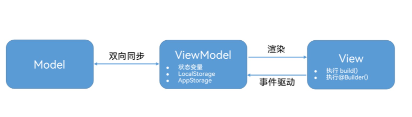
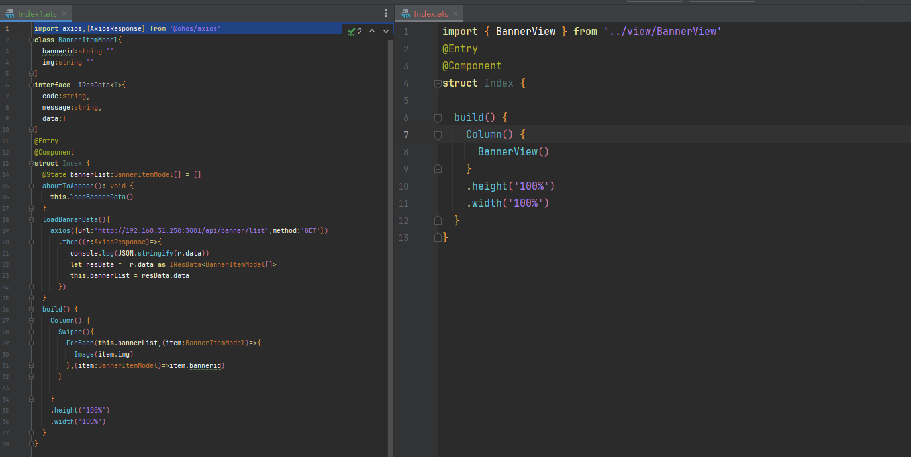

## **应用架构设计基础——MVVM模式**

### MVVM模式

ArkUI采取MVVM = Model + View + ViewModel模式，其中状态管理模块起到的就是ViewModel的作用，将数据与视图绑定在一起，更新数据的时候直接更新视图。


ArkUI中，model为我们定义的数据结构和数据来源，通过ArkUI提供的装饰器@State等装饰对应的数据，就提供了响应式能力，model数据的变化能够触发UI的更新。




### 我们以轮播图功能为例

ps：需要发起请求，所以要安装axios ， https://ohpm.openharmony.cn/#/cn/detail/@ohos%2Faxios/

1-安装 axios的库 ，项目目录的终端下面输入命令 

```
ohpm install @ohos/axios
```


2-请求权限 ohos.permission.INTERNET

module.json5的module配置项中添加如下

```
  "requestPermissions": [{
      "name":"ohos.permission.INTERNET"
    }],
```

index.est中实现轮播图功能

```
import axios,{AxiosResponse} from '@ohos/axios'
class BannerItemModel{
  bannerid:string=''
  img:string=''
}
interface  IResData<T>{
  code:string,
  message:string,
  data:T
}
@Entry
@Component
struct Index {
  @State bannerList:BannerItemModel[] = []
  aboutToAppear(): void {
    this.loadBannerData()
  }
  loadBannerData(){
    axios({url:'http://192.168.31.250:3001/api/banner/list',method:'GET'})
      .then((r:AxiosResponse)=>{
         console.log(JSON.stringify(r.data))
         let resData =  r.data as IResData<BannerItemModel[]>
         this.bannerList = resData.data
      })
  }
  build() {
    Column() {
      Swiper(){
        ForEach(this.bannerList,(item:BannerItemModel)=>{
          Image(item.img)
        },(item:BannerItemModel)=>item.bannerid)
      }

    }
    .height('100%')
    .width('100%')
  }
}
```


之前的，我们的轮播图功能，直接写到了页面中，现在我们做一下拆分

### 主要步骤：


​    1-建立model文件夹

​		里面放数据模型类，接口定义，并且导出

​	2-轮播需要的界面UI，封装成一个单独组件 BannerView，并且导出

​			里面写轮播图需要的UI组件结构

​			定义属性bannerList，轮播图需要的数据 

​     3-   HomeView的aboutToAppear生命周期回调函数中调用接口，获取数据，数据传入到bannerList

​    


### Step 1-总体说明

目录结构调整

为了让代码更加清晰，容易维护，我们需要对代码进行分层管理，

常见的数据结构放置在model文件夹中，

UI组件放置在view文件夹中，并以对应的组件名命名。

### Step 2 model文件夹

建立model文件夹

在entry/src/main/ets文件夹下点击右键 - > new - > Directory。

文件夹命名为model。

model文件夹用于存储数据模型。它表示组件或其他相关业务逻辑之间传输的数据，是对原始数据的进一步处理。

选择New-> ArkTS file，分别创建 ets文件 BannerItemMode.ets

```
 export  class BannerItemModel{
  bannerid:string=''
  img:string=''
}
export  interface  IResData<T>{
  code:string,
  message:string,
  data:T
}
```


### Step 3 view文件夹

创建view文件夹，用于存储UI组件

在entry/src/main/ets文件夹下点击右键 - > new - > Directory，命名为view，用于存放页面相关的自定义组件。

通过右键单击view文件夹，选择New-> ArkTS file，分别创建BannerView.ets文件。


把原来写到页面里面的方法，属性 都移动过来

```
import axios,{AxiosResponse} from '@ohos/axios'
import { BannerItemModel, IResData } from '../model/BannerItemModel'
@Component
export  struct BannerView {
  @State bannerList:BannerItemModel[] = []
  aboutToAppear(): void {
    this.loadBannerData()
  }
  loadBannerData(){
    axios({url:'http://192.168.31.250:3001/api/banner/list',method:'GET'})
      .then((r:AxiosResponse)=>{
        console.log(JSON.stringify(r.data))
        let resData =  r.data as IResData<BannerItemModel[]>
        this.bannerList = resData.data
      })
  }
  build() {
    Swiper(){
      ForEach(this.bannerList,(item:BannerItemModel)=>{
        Image(item.img)
      },(item:BannerItemModel)=>item.bannerid)
    }
  }
}
```


### Step 4 页面中使用组件

```
import { BannerView } from '../view/BannerView'
@Entry
@Component
struct Index {

  build() {
    Column() {
      BannerView()
    }
    .height('100%')
    .width('100%')
  }
}
```

### 好处

原来的首页代码，现在的首页代码




这样修改以后，如果首页功能复杂，每个维护一个组件（模板），不会都在首页中写太多的代码，首页代码也更容易维护！在多人协作分工使用git的时候，也不容出现代码冲突。（多人都频繁在一个文件中写代码，容易出现冲突）


这种拆分思想在vue中也可以使用！


ps：实际开发中，把请求都放入到页面中发起，然后给对应的组件传入数据，也是可以的！

​     有些时候，服务器会把首页数据一个接口全部返回，这样在首页中发起也行！

设计模式的思想我们明白了，具体怎么写代码，都可！