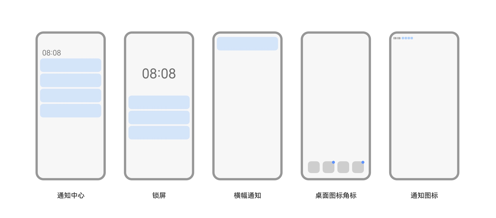
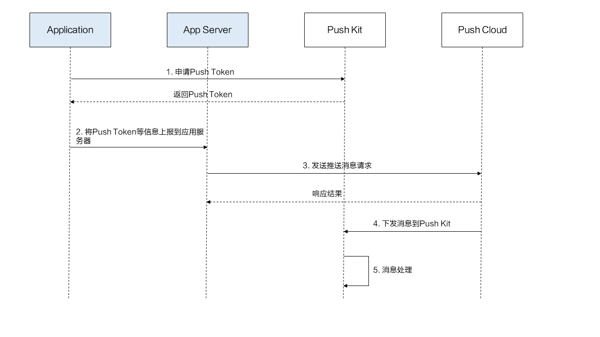
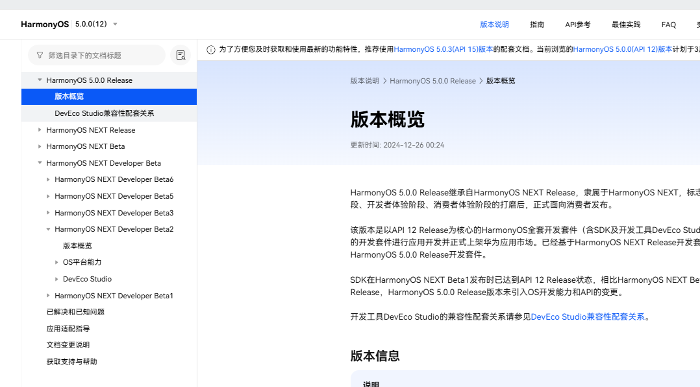
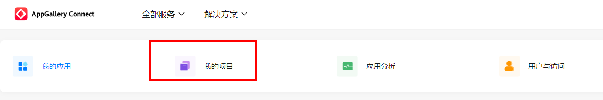
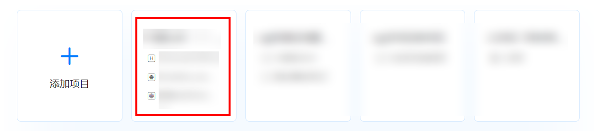
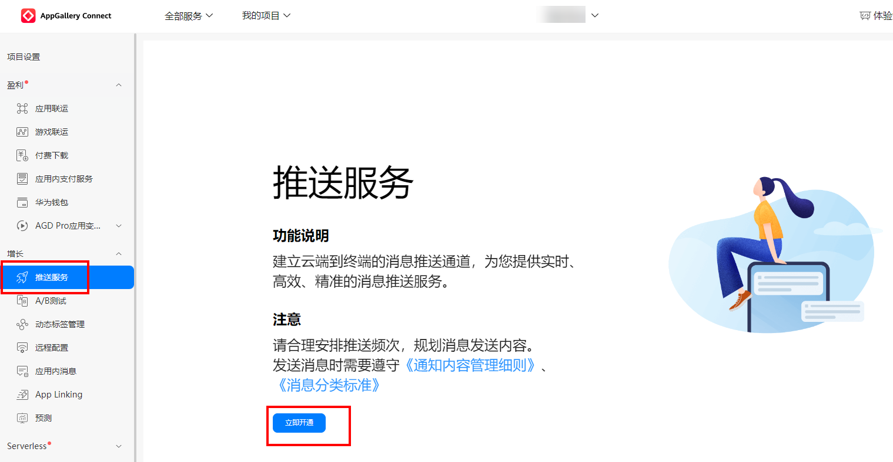
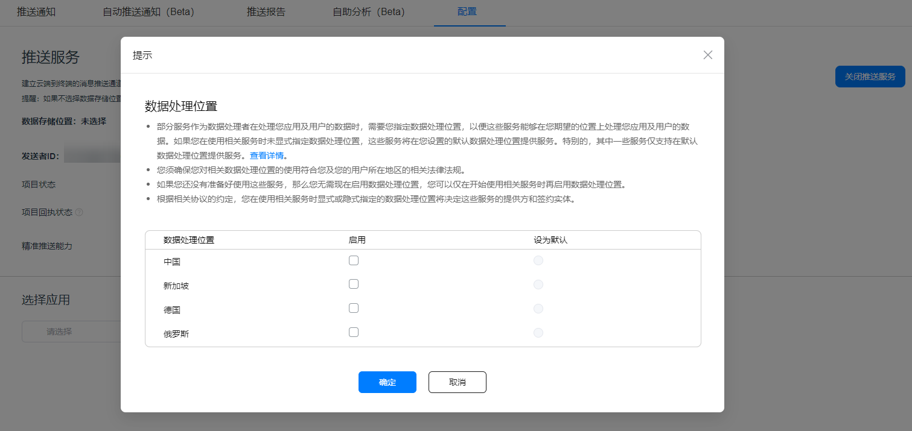
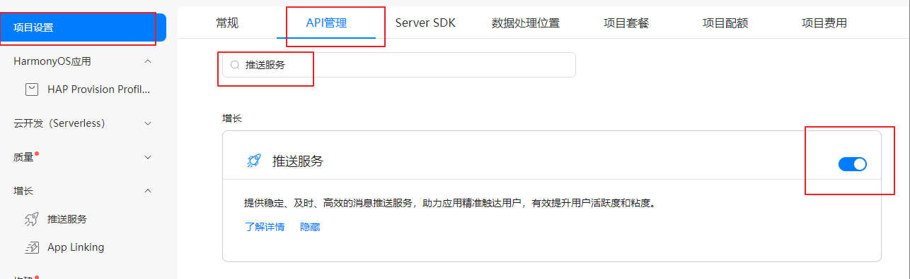
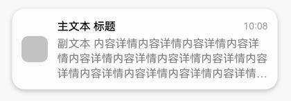
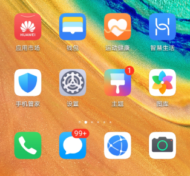

# Push Kit

模拟器不支持推送，我们这里只过一下流程。


（推送服务）是华为提供的消息推送平台，建立了从云端到终端的消息推送通道。所有HarmonyOS应用可通过集成Push Kit，实现向应用实时推送消息，使消息易见，构筑良好的用户关系，提升用户的感知度和活跃度。

## 推送消息提示场景

推送消息指的是应用**通过Push Kit发送的**，在华为终端设备上显示的通知消息。显示场景主要包括通知中心、锁屏、横幅、桌面图标角标与通知图标。



有关各场景的详细说明请参见[通知提示场景](https://developer.huawei.com/consumer/cn/doc/design-guides/system-features-notification-0000001793074217#section162699204401)。

## 推送消息类型

Push Kit支持以下消息类型：

| 消息类型                                                     | 说明                                                         |
| :----------------------------------------------------------- | :----------------------------------------------------------- |
| [通知消息](https://developer.huawei.com/consumer/cn/doc/harmonyos-guides-V5/push-alert-V5) | 通知消息由Push Kit直接下发，在终端设备的通知中心、锁屏、横幅等展示，用户点击后拉起应用。您可以[设置通知消息样式](https://developer.huawei.com/consumer/cn/doc/harmonyos-guides-V5/push-send-alert-V5#section5164103925811)来吸引用户。常用场景：行程提醒、账号动态等。 |
| [授权订阅消息](https://developer.huawei.com/consumer/cn/doc/harmonyos-guides-V5/push-alert-subscribe-V5) | 授权订阅消息是一种特殊的通知消息，Push Kit为开发者提供了一次性授权订阅能力，当且仅当用户同意订阅后，开发者可向用户推送对应的消息，从而实现服务闭环。常用场景：订阅内容。 |
| [通知扩展消息](https://developer.huawei.com/consumer/cn/doc/harmonyos-guides-V5/push-extend-noti-V5) | 当用户终端收到您发送的通知扩展消息后，Push Kit会拉起应用的子进程，您可以在子进程中自行处理业务。常用场景：语音播报。 |
| [卡片刷新消息](https://developer.huawei.com/consumer/cn/doc/harmonyos-guides-V5/push-form-update-V5) | 通过卡片刷新服务，在合适场景向用户即时推送卡片内容，提升用户的感知度和活跃度。常用场景：打车出行、快递动态等。 |
| [后台消息](https://developer.huawei.com/consumer/cn/doc/harmonyos-guides-V5/push-background-V5) | 消息到达终端后，如果应用进程在运行，将消息内容传给应用，如果不在运行则缓存消息，等待应用启动后再传给应用，不显示通知。常用场景：用于告知应用更新配置参数。 |
| [实况窗消息](https://developer.huawei.com/consumer/cn/doc/harmonyos-guides-V5/push-update-liveview-V5) | 应用服务端向Push Kit服务端发送创建或更新实况窗的请求，创建实况窗，或更新实况窗内容。常用场景：赛事比分更新，出行打车状态更新等。 |
| [应用内通话消息](https://developer.huawei.com/consumer/cn/doc/harmonyos-guides-V5/push-voip-V5) | 支持应用实现网络音视频通话的能力。常用场景：网络音视频通话。 |


## 业务流程



使用Push Kit的主要业务流程如下：

1. 应用调用Push Kit，获取Push Token。
2. 应用成功获取Token后，建议及时上报Token等信息至应用服务端。
3. 应用服务端向华为Push Kit服务端（Push Cloud）发送推送消息请求。应用的通知开关默认关闭，发送请求前，请先请求通知授权，详情请参见[请求通知授权](https://developer.huawei.com/consumer/cn/doc/harmonyos-guides-V5/notification-enable-V5)。
4. Push Kit服务端下发消息到Push Kit。
5. Push Kit进行消息处理。


### 1.开通推送服务

按照官方文档开通推送服务: [developer.huawei.com/consumer/cn…](https://link.juejin.cn/?target=https%3A%2F%2Fdeveloper.huawei.com%2Fconsumer%2Fcn%2Fdoc%2Fharmonyos-guides-V5%2Fpush-config-setting-V5)


在开通推送服务前，请先参考“[应用开发准备](https://developer.huawei.com/consumer/cn/doc/harmonyos-guides-V5/application-dev-overview-V5)”创建项目和应用工程，再继续进行以下操作步骤后，完成[手动签名](https://developer.huawei.com/consumer/cn/doc/harmonyos-guides-V5/ide-signing-V5#section297715173233)。

说明

从HarmonyOS NEXT Developer Beta2起，开发者无需配置公钥指纹和Client ID。



### 操作步骤

1. 登录[AppGallery Connect](https://developer.huawei.com/consumer/cn/service/josp/agc/index.html)网站，选择“我的项目”。

   

   

   

   

2. 在项目列表中找到您的项目，在项目下的应用列表中选择需要配置推送服务参数的应用。

   

   

   

   

3. 在左侧导航栏选择“增长 > 推送服务”，点击“立即开通”，在弹出的提示框中点击“确定”。至此，您已可以向应用推送通知消息。

   

   

   

   说明

   推送服务权益为项目级，若您已有开通过推送服务的项目，当您在项目中添加新的应用时，无需再次开通推送服务。

   

4. 若项目当前未配置数据处理位置，请在提示中点击“确定”，会弹出设置数据处理位置的弹窗。完成数据处理位置的设置，点击“确定”。

   

   

   

   注意

   推送服务当前仅支持中国境内（不包含中国香港、中国澳门、中国台湾），数据处理地固定为中国，请您选择数据处理位置为中国。

   

5. 在“项目设置 > API管理”中，确认已经开启“推送服务”开放能力，并完成[手动签名](https://developer.huawei.com/consumer/cn/doc/harmonyos-guides-V5/ide-signing-V5#section297715173233)。

   

   

   

   说明

   若使用原有的Profile文件，请确保在申请Profile文件之前已开启“推送服务”，否则开启后需要重新[申请调试Profile文件](https://developer.huawei.com/consumer/cn/doc/app/agc-help-add-debugprofile-0000001914423102)，并重新[配置签名信息](https://developer.huawei.com/consumer/cn/doc/harmonyos-guides-V5/ide-signing-V5#section112371245115818)。

   

6. （可选）您还可以通过“增长 > 推送服务 > 配置”，在“配置”页签开通或关闭您的项目级和应用级的[消息回执](https://developer.huawei.com/consumer/cn/doc/harmonyos-guides-V5/push-msg-receipt-V5)，开通应用级的[通知消息自分类权益](https://developer.huawei.com/consumer/cn/doc/harmonyos-guides-V5/push-apply-right-V5#section15173623155816)。


### 2.配置 client_id

在`entry/src/main/module.json5` 配置新增 `metadata client_id`, 该值在鸿蒙后台AppGallery Connect中找到`常规→应用→Client Id`。

```JavaScript
{
 "module": { 
    "metadata": [
      {
        "name": "client_id",
        "value": "xxxxxxxx"
      }
    ],
 }
}
```

### 3.获取 华为推送 token 并且上报token 到自己的应用服务器

push Token标识了每台设备上每个应用，开发者调用[getToken](https://developer.huawei.com/consumer/cn/doc/harmonyos-references-V5/push-pushservice-V5#section562973524818)()接口向Push Kit服务端请求Push Token，获取到之后使用Push Token来推送消息。

Push Token一般情况不会变化，仅下列场景Push Token会发生变化：

- 卸载应用后重新安装。
- 设备恢复出厂设置。


因此，建议您在应用启动时调用getToken()接口，若设备的Push Token发生变化，及时上报到您的应用服务器更新Push Token。

#### 注意事项

- 请勿使用Push Token跟踪标记用户。
- 应用不要固定判断Push Token长度，因为Push Token长度可能会变化。
- 禁止应用频繁申请Push Token。建议应用每次启动时获取Push Token。
- 只有在AppGallery Connect平台[开通推送服务](https://developer.huawei.com/consumer/cn/doc/harmonyos-guides-V5/push-config-setting-V5)后，[getToken](https://developer.huawei.com/consumer/cn/doc/harmonyos-references-V5/push-pushservice-V5#section163204312464)方法才会返回Push Token。

#### 获取[Push Token](https://developer.huawei.com/consumer/cn/doc/harmonyos-guides-V5/push-get-token-V5)

1. 导入pushService模块及相关公共模块。

   

   ```typescript
   import { pushService } from '@kit.PushKit';
   import { hilog } from '@kit.PerformanceAnalysisKit';
   import { BusinessError } from '@kit.BasicServicesKit';
   import { UIAbility, AbilityConstant, Want } from '@kit.AbilityKit';
   ```

   

2. 建议在您的UIAbility（例如EntryAbility）的[onCreate](https://developer.huawei.com/consumer/cn/doc/harmonyos-references-V5/js-apis-app-ability-uiability-V5#uiabilityoncreate)()方法中调用[getToken](https://developer.huawei.com/consumer/cn/doc/harmonyos-references-V5/push-pushservice-V5#section562973524818)()接口获取Push Token并上报到您的服务端，方便您的服务端向终端推送消息。代码示例：

   

   ```typescript
   export default class EntryAbility extends UIAbility {
     // 入参 want 与 launchParam 并未使用，为初始化项目时自带参数
     async onCreate(want: Want, launchParam: AbilityConstant.LaunchParam): Promise<void> {
       // 获取Push Token
       try {
         const pushToken: string = await pushService.getToken();
         hilog.info(0x0000, 'testTag', 'Succeeded in getting push token');
        // 上报Push Token并上报到您的服务端 （ajax请求后端接口）
     
       } catch (err) {
         let e: BusinessError = err as BusinessError;
         hilog.error(0x0000, 'testTag', 'Failed to get push token: %{public}d %{public}s', e.code, e.message);
       }
     }
   }
   ```

   

注意


### 4.在应用进入首页时申请允许通知权限.

```JavaScript
static requestPermission(context: common.UIAbilityContext) {
    // 申请权限
    notificationManager.isNotificationEnabled().then((data: boolean) => {
      console.info("run isNotificationEnabled success, data: " + data);
      if (!data) {
        notificationManager.requestEnableNotification(context).then(() => {
          console.info(`run requestEnableNotification success`);
        }).catch((err: BusinessError) => {
          if (1600004 == err.code) {
            console.error(
              `run requestEnableNotification refused, code is ${err.code}, message is ${err.message}`);
          } else {
            console.error(
              `run requestEnableNotification failed, code is ${err.code}, message is ${err.message}`);
          }
        });
      }
    }).catch((err: BusinessError) => {
      console.error(`run isNotificationEnabled fail: ${JSON.stringify(err)}`);
    });
  }
```

### 5.新增 skills 配置

在 `entry/src/main/module.json5` 找到启动 Ability 的 skills 配置，`注意默认skills会有一项，千万不要删除，要在尾部添加一条`, actions 设置为空字符串表示不实用actions。

```JavaScript
 {
            "actions": [
              "" 
            ],
            "uris": [
              {
                "scheme": "https",
                "host": "xxx.xxxx.com", //自己的域名
                "path": "test"
              }
            ]
          } // 新增一个skill对象，配置actions和uris用于其他业务场景
```


## 点击消息动作

### 点击消息进入应用首页并传递数据

1. 检查项目模块级别下的**src/main/module.json5**中关于应用首页Ability的[skills标签](https://developer.huawei.com/consumer/cn/doc/harmonyos-guides-V5/module-configuration-file-V5#skills标签)配置（可以同时存在多个skill对象），其中某个skill对象的entities中应包含"entity.system.home"、actions中应包含"action.system.home"，如果在该skill对象中又已经配置了uris属性，建议将uris属性配置迁移到其他skill中，或者可以参考[点击消息进入应用内页并传递数据](https://developer.huawei.com/consumer/cn/doc/harmonyos-guides-V5/push-send-alert-V5#section8794131614597)中的方式实现点击消息进入应用首页的功能。

   

   注意

   module.json5文件中的skills标签下可以同时存在多个skill对象，每个对象对应一种能力。

   若您需要同时设置推送消息跳转能力和其他跳转能力（如NFC跳转、浏览器跳转等），需要在skills数组中创建不同的skill对象，分别映射对应的能力。

   点击消息进入应用首页skills标签配置示例：

   ```json
   {
     "name": "TestAbility",
     "srcEntry": "./ets/abilities/TestAbility.ets",
     "exported": false,
     "startWindowIcon": "$media:icon",
     "startWindowBackground": "$color:start_window_background",
     "skills": [
       {
         "entities": [
           "entity.system.home"
         ],
         "actions": [
           "action.system.home"
         ]
       }, // 保证该skill对象中无uris配置
       {
         "actions": [
           "com.app.action"
         ],
         "uris": [
           {
             "scheme": "https",
             "host": "www.app.com",
             "port": "8080",
             "path": "app/test"
           }
         ]
       } // 新增一个skill对象，配置actions和uris用于其他业务场景
     ]
   }
   ```

   

2. 发送消息时[clickAction](https://developer.huawei.com/consumer/cn/doc/harmonyos-references-V5/push-scenariozed-api-request-param-V5#section152462191216)中携带**data**字段并设置**actionType**字段为0：

   

   ```json
   // Request URL
   POST https://push-api.cloud.huawei.com/v3/[projectId]/messages:send
   
   // Request Header
   Content-Type: application/json
   Authorization: Bearer eyJr*****OiIx---****.eyJh*****iJodHR--***.QRod*****4Gp---****
   push-type: 0
   
   // Request Body
   {
     "payload": {
       "notification": {
         "category": "MARKETING",
         "title": "普通通知标题",
         "body": "普通通知内容",
         "clickAction": {
           "actionType": 0,
           "data": {"testKey": "testValue"}
         }
       }
     },
     "target": {
       "token": ["IQAAAA**********4Tw"]
     },
     "pushOptions": {
       "testMessage": true
     }
   }
   ```

   - actionType：点击消息的动作，0表示点击消息后进入首页。
   - data：点击消息时携带的JSON格式的数据。

   

3. 在应用首页中（通常为项目模块级别下的**src/main/module.json5**中**mainElement**的值）的[onCreate](https://developer.huawei.com/consumer/cn/doc/harmonyos-references-V5/js-apis-app-ability-uiability-V5#uiabilityoncreate)()方法中覆写如下代码：

   

   ```typescript
   import { UIAbility, Want } from '@kit.AbilityKit';
   import { hilog } from '@kit.PerformanceAnalysisKit';
   
   export default class MainAbility extends UIAbility {
     onCreate(want: Want): void {
       // 获取消息中传递的data数据
       const data = want.parameters;
       const value = want.parameters?.["testKey"]; // value: "testValue"
       hilog.info(0x0000, 'testTag', 'Succeeded in getting message data');
       // 根据实际业务场景对data进行处理
     }
   }
   ```

   [onNewWant](https://developer.huawei.com/consumer/cn/doc/harmonyos-references-V5/js-apis-app-ability-uiability-V5#uiabilityonnewwant)()方法中覆写如下代码：

   ```typescript
   import { UIAbility, Want } from '@kit.AbilityKit';
   import { hilog } from '@kit.PerformanceAnalysisKit';
   
   export default class MainAbility extends UIAbility {
     onNewWant(want: Want): void {
       // 获取消息中传递的data数据
       const data = want.parameters;
       const value = want.parameters?.["testKey"]; // value: "testValue"
       hilog.info(0x0000, 'testTag', 'Succeeded in getting message data');
       // 根据实际业务场景对data进行处理
     }
   }
   ```

   注意

   onNewWant()方法仅在单例（singleton）模式下可用。

   点击消息，当应用进程不存在时，会在[onCreate](https://developer.huawei.com/consumer/cn/doc/harmonyos-references-V5/js-apis-app-ability-uiability-V5#uiabilityoncreate)()方法中获取消息data数据，当应用进程存在时，会在[onNewWant](https://developer.huawei.com/consumer/cn/doc/harmonyos-references-V5/js-apis-app-ability-uiability-V5#uiabilityonnewwant)()方法中获取消息数据。

   

### 点击消息进入应用内页并传递数据

1. 在您的项目模块级别下的**src/main/module.json5** 中设置待跳转Ability的[skills标签](https://developer.huawei.com/consumer/cn/doc/harmonyos-guides-V5/module-configuration-file-V5#skills标签)中的actions或uris值。

   

   注意

   module.json5文件中的skills标签下可以同时存在多个skill对象，每个对象对应一种能力。

   若您需要同时设置推送消息跳转能力和其他跳转能力（如NFC跳转、浏览器跳转等），需要在skills数组中创建不同的skill对象，分别映射对应的能力。

   在skills标签中新增一个对象，设置actions参数完成点击消息进入应用内页示例（**若该skill对象中添加了uris参数，则uris内容需为空**）：

   ```json
   {
     "name": "TestAbility",
     "srcEntry": "./ets/abilities/TestAbility.ets",
     "exported": false,
     "startWindowIcon": "$media:icon",
     "startWindowBackground": "$color:start_window_background",
     "skills": [
       {
         "actions": [
           "com.app.action"
         ]
       }, // 保持skills中原有的对象不变
       {
         "actions": [
           "com.test.action"
         ]
       } // 新增一个skill对象用于推送消息点击跳转
     ]
   }
   ```

   在skills标签中新增一个对象，设置uris参数完成点击消息进入应用内页示例（**该skill对象中****必须同时设置actions参数****，actions参数为空字符串**），uris对象内部结构说明请参见[skills标签](https://developer.huawei.com/consumer/cn/doc/harmonyos-guides-V5/module-configuration-file-V5#skills标签)。

   ```json
   {
     "name": "TestAbility",
     "srcEntry": "./ets/abilities/TestAbility.ets",
     "exported": false,
     "startWindowIcon": "$media:icon",
     "startWindowBackground": "$color:start_window_background",
     "skills": [
       {
         "actions": [
           "com.app.action"
         ]
       }, // 保持skills中原有的对象不变
       {
         "actions": [""],
         "uris": [
           {
             "scheme": "https",
             "host": "www.xxx.com",
             "port": "8080",
             "path": "push/test"
           }
         ]
       } // 新增一个skill对象用于推送消息点击跳转
     ]
   }
   ```

   

2. 发送消息时[clickAction](https://developer.huawei.com/consumer/cn/doc/harmonyos-references-V5/push-scenariozed-api-request-param-V5#section152462191216)中携带**data**字段并设置**actionType**字段为1：

   

   ```json
   // Request URL
   POST https://push-api.cloud.huawei.com/v3/[projectId]/messages:send
   
   // Request Header
   Content-Type: application/json
   Authorization: Bearer eyJr*****OiIx---****.eyJh*****iJodHR--***.QRod*****4Gp---****
   push-type: 0
   
   // Request Body
   {
     "payload": {
       "notification": {
         "category": "MARKETING",
         "title": "普通通知标题",
         "body": "普通通知内容",
         "clickAction": {
           "actionType": 1,
           "action": "com.test.action",
           "uri": "https://www.xxx.com:8080/push/test",
           "data": {"testKey": "testValue"}
         }
       }
     },
     "target": {
       "token": ["IQAAAA**********4Tw"]
     },
     "pushOptions": {
       "testMessage": true
     }
   }
   ```

   - actionType：点击消息动作，1表示点击消息后进入应用内页。当本字段设置为1时，uri和action至少填写一个，若都填写优先寻找与action匹配的应用页面。
   - action：表示能够接收[Want](https://developer.huawei.com/consumer/cn/doc/harmonyos-references-V5/js-apis-inner-ability-want-V5)的action值的集合，取值可以自定义。
   - uri：表示与[Want](https://developer.huawei.com/consumer/cn/doc/harmonyos-references-V5/js-apis-inner-ability-want-V5)中uris相匹配的集合，uris规则请参见[skills标签](https://developer.huawei.com/consumer/cn/doc/harmonyos-guides-V5/module-configuration-file-V5#skills标签)。
   - data：点击消息时携带的JSON格式的数据。

   

3. 在待跳转页面（下以TestAbility为例）中的[onCreate](https://developer.huawei.com/consumer/cn/doc/harmonyos-references-V5/js-apis-app-ability-uiability-V5#uiabilityoncreate)()方法中覆写如下代码：

   

   ```typescript
   import { UIAbility, Want } from '@kit.AbilityKit';
   import { hilog } from '@kit.PerformanceAnalysisKit';
   
   export default class TestAbility extends UIAbility {
     onCreate(want: Want): void {
       // 获取消息中传递的data数据
       const data = want.parameters;
       const value = want.parameters?.["testKey"]; // value: "testValue"
       hilog.info(0x0000, 'testTag', 'Succeeded in getting message data');
       // 根据实际业务场景对data进行处理
     }
   }
   ```

   [onNewWant](https://developer.huawei.com/consumer/cn/doc/harmonyos-references-V5/js-apis-app-ability-uiability-V5#uiabilityonnewwant)()方法中覆写如下代码：

   ```typescript
   import { UIAbility, Want } from '@kit.AbilityKit';
   import { hilog } from '@kit.PerformanceAnalysisKit';
   
   export default class TestAbility extends UIAbility {
     onNewWant(want: Want): void {
       // 获取消息中传递的data数据
       const data = want.parameters;
       const value = want.parameters?.["testKey"]; // value: "testValue"
       hilog.info(0x0000, 'testTag', 'Succeeded in getting message data');
       // 根据实际业务场景对data进行处理
     }
   }
   ```

   注意

   onNewWant()方法仅在单例（singleton）模式下可用。

   点击消息，当应用进程不存在时，会在[onCreate](https://developer.huawei.com/consumer/cn/doc/harmonyos-references-V5/js-apis-app-ability-uiability-V5#uiabilityoncreate)()方法中获取消息data数据，当应用进程存在时，会在[onNewWant](https://developer.huawei.com/consumer/cn/doc/harmonyos-references-V5/js-apis-app-ability-uiability-V5#uiabilityonnewwant)()方法中获取消息数据。

   

## 设置通知消息样式

Push Kit提供了多种通知消息样式，您可以自定义其中内容来吸引用户，从而提高应用的日活跃用户数量。

### 普通通知

您在发送通知消息时[notification](https://developer.huawei.com/consumer/cn/doc/harmonyos-references-V5/push-scenariozed-api-request-param-V5#section17371529101117)参数中必须携带**title**与**body**字段，来设置应用收到通知消息后展示在通知中心的标题与内容。文本内容最多显示3行，超出3行以“...”截断。




消息体示例：

```json
import { UIAbility, Want } from '@kit.AbilityKit';
import { hilog } from '@kit.PerformanceAnalysisKit';

export default class TestAbility extends UIAbility {
  onNewWant(want: Want): void {
    // 获取消息中传递的data数据
    const data = want.parameters;
    const value = want.parameters?.["testKey"]; // value: "testValue"
    hilog.info(0x0000, 'testTag', 'Succeeded in getting message data');
    // 根据实际业务场景对data进行处理
  }
}
```

### 通知角标

您可以发送通知消息时携带[badge](https://developer.huawei.com/consumer/cn/doc/harmonyos-references-V5/push-scenariozed-api-request-param-V5#section266310382145)字段来设置应用收到通知消息后以数字的形式展示角标，提醒用户查看消息。




消息体示例：

```json
{
  "payload": {
    "notification": {
      "category": "MARKETING",
      "title": "通知标题",
      "body": "通知内容",
      "badge":{
        "addNum": 1,
        "setNum": 99
      },
      "clickAction": {
        "actionType": 0
      }
    }
  },
  "target": {
    "token": ["IQAAAACy0tE*************MXzvN7iIKSBYontV2cWj-HFTY_8lSh04w"]
  },
  "pushOptions": {
    "testMessage": true
  }
}
```

说明

- addNum设置后为应用角标累加数字，非应用角标实际显示数字。
- setNum设置后为应用角标实际显示数字。setNum优先级高于addNum。
- 打开应用或者点击、清理通知消息并不会清理角标数字，开发者可通过[setBadgeNumber](https://developer.huawei.com/consumer/cn/doc/harmonyos-references-V5/js-apis-notificationmanager-V5#notificationmanagersetbadgenumber10)()方法清理角标，使用前需先[导入模块](https://developer.huawei.com/consumer/cn/doc/harmonyos-references-V5/js-apis-notificationmanager-V5#导入模块)。
- 当setBadgeNumber()方法中的badgeNumber设置为0时，可以实现清理效果