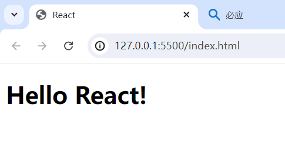
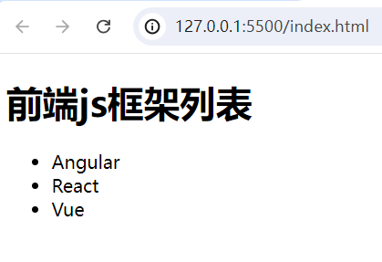
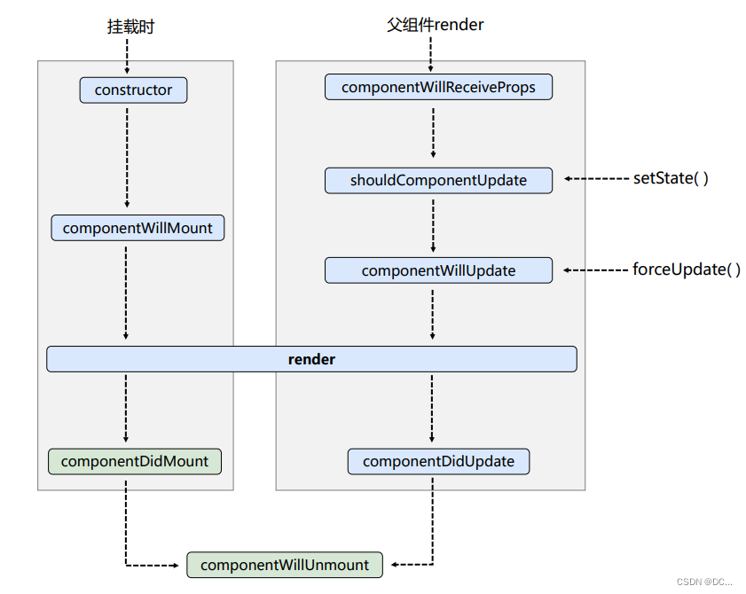
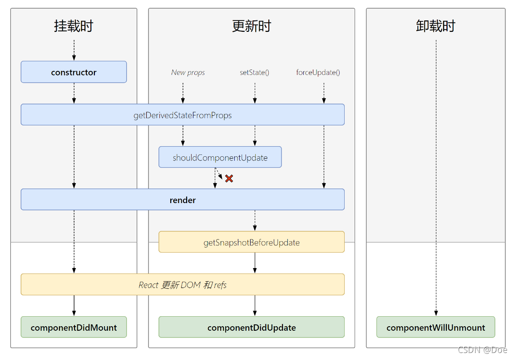

# React

------

> React是一个用于构建用户界面的JS库。也就是说它只关注视图（界面），我们只需要准备好数据，由它将数据渲染成视图，不需要我们自己来操作DOM了。即：React是一个将数据渲染为HTML视图的开源JS库。

- ##### 发展史：

  > 1. 起初是由**Facebook**的软件工程师Jordan Walke创建。
  >
  > 2. 于2011年部署于Facebook的newsfeed。
  >
  > 3. 随后在2012年部署于Instagram。
  >
  > 4. 2013年5月宣布开源。
  >
  >    ......
  >
  >    *近10年“陈酿”React正在被腾讯、阿里等一线大厂广泛使用。*

- ##### 为什么要用React？

  > 1. 原生JS操作DOM繁琐、效率低。因为浏览器会进行大量的重绘重排。
  > 2. 原生JS没有组件化编码方案，代码复用率很低。

- ##### React的特点：

  > 1. React使用**虚拟DOM** + 优秀的**Diffing算法**，尽量减少与真实DOM的交互。
  > 2. 采用组件化模式、声明化编码，提高开发效率及组件复用率。
  > 3. 在**React Native**中可以使用React的语法进行移动端（安卓、IOS）开发。

------

- ### 第一个React程序

  > 我们先来做一个React程序，这里先用React的旧版本（16.8.4）。

  ###### 目前，我们会用到3个文件：

  1. `babel.min.js`：我们之前用babel来将ES6语法转换为ES5，其实它还有一个功能是：将React的**JSX语法**转换成JS语法。（类似Vue脚手架中的**模板解析器**，将Vue容器中的模板语法解析为JS）
  2. `react.development.js`：它是React的核心库。所有React的功能通过它来实现。
  3. `react-dom.development.js`：React的扩展库。用于支持React去操作DOM（以及虚拟DOM）。

  ###### 第一个React程序：

  > index.html：
  >
  > ```html
  > <!DOCTYPE html>
  > <html lang="en">
  >        <head>
  >    	    <meta charset="UTF-8">
  >        	<title>React</title>
  >        </head>
  > <body>
  >   	<div id="app">33</div>
  > 
  >       <!-- 引入babel，用于将jsx转为js -->
  >       <script src="./lib/babel.min.js"></script>
  >       <!-- 引入react核心库 -->
  >       <script src="./lib/react.development.js"></script>
  >       <!-- 引入react-dom，用于支持react操作dom。该文件必须在核心库之后引入 -->
  >       <script src="./lib/react-dom.development.js"></script>
  > 
  >       <!-- type属性写text/babel，表示里面写的是jsx语法（在js的基础上加了xml语法），jsx语法得通过babel来转成js -->
  >       <script type="text/babel">
  >            // 1、创建虚拟DOM（等号后面就是虚拟DOM）
  >            const VDOM = <h1 id="title">Hello React!</h1>/* JSX中，xml标签能和JS混着写 */
  >            // 2、将创建的虚拟DOM渲染到页面中（div内部）
  >    			//引入上面两个react库之后，全局就多了一个React和ReactDOM对象
  >            ReactDOM.render(VDOM, document.getElementById('app'))//参数1是虚拟DOM，参数2是dom对象（容器对象）
  >       </script>
  > </body>
  > </html>
  > ```

  ###### 浏览器打开运行：

  

  ###### F12打开控制台，发现控制台上有黄色的提示信息：

  `You are using the in-browser Babel transformer. Be sure to precompile your scripts for production - https://babeljs.io/docs/setup/`

  > - 其实浏览器在拿到script标签中的代码后，发现是babel类型，于是它会找babel让它先做一个翻译。这种情况如果代码少还好说，代码量一多则非常影响用户体验，我们目前初学时会使用这种方式，后面就不用了。它这个提示就是说：你这个方式不太对，代码一多可能会有问题。
  > - 还有一个提示是说：可以用框架提供的**调试工具**来开发React项目。一般框架都会提供它专门的调试工具。所以我们将这个React的Google调试工具插件下载下来，方便后面代码的调试。
  
  ###### 为什么我们不用原生的JS来创建虚拟DOM，而要使用JSX创建虚拟DOM呢？
  
  > 要说清楚这个问题，首先我们将上面创建虚拟DOM的方式，改为用JS来写：（不需要引入babel了）
  >
  > ```html
  > <script>
  >        // 1、用React对象上的createElement(标签名,标签属性,标签内容)方法来创建虚拟DOM
  >        const VDOM = React.createElement('h1',{id:'title'},'Hello React!')
  >        // 2、将创建的虚拟DOM渲染到页面上
  >        ReactDOM.render(VDOM, document.getElementById('app'))
  > </script>
  > ```
  
  ###### 这种方式好像也可以，那为什么还要用JSX语法呢？
  
  > 因为如果要求h1标签中还有个span，span中写“Hello React！”，此时就需要将`createElement()`的第3个参数变为：`React.createElement('span',{}/null,'Hello React!')`
  >
  > 如果用JSX的语法来创建虚拟DOM，就简单多了：
  >
  > ```jsx
  > //加外层的小括号表示里面的虚拟DOM是一个整体
  > const VDOM = (
  >        <h1 id="title">
  >        	<span>Hello React!</span>
  >        </h1>
  > )
  > ```
  
  ###### 这就是为什么React要打造JSX语法的原因。总结：
  
  > - JSX只为解决一个问题：原生的JS创建虚拟DOM太麻烦了，用JSX可以让编码人员更加简单的创建虚拟DOM，写起来更加流畅。
  > - 其实babel就是将其中第1步的JSX语法翻译为了JS：`React.createElement('h1',{id:'title'},'Hello React!')`

------

- ### 虚拟DOM与真实DOM

  ###### 刚刚我们创建的虚拟DOM（VDOM）到底是个什么东西呢？

  > - 我们在控制台上打印VDOM，发现它其实就是一个普通JS对象。也就是说，JSX中的标签（虚拟DOM）最终会被Babel转化为JS对象。
  > - 其次，虚拟DOM比较“轻”，真实DOM比较重。因为虚拟DOM只是React内部在用，无需真实DOM上的那么多属性。
  > - 虚拟DOM最终会被React变成真实DOM渲染到页面上。

- ### JSX

  > JSX全程JavaScript XML，是React定义的一种类似于XML的JS的扩展语法：JS + XML。本质上是`React.createElement('h1',{id:'title'},'Hello React!')`的语法糖，是用来简化创建虚拟DOM的。

  ###### JSX的语法规则：

  1. JSX中**根标签只能有一个**，且每个**标签必须闭合**。
  2. JSX中可以写任意名字的标签。如果是小写字母开头的标签，会被当作HTML标签；如果是**大写字母开头的标签，会被当作组件**去渲染。
  3. 如果XML标签要动态化，需要混入JS表达式时，要用`{}`包起来。
  4. 如果`{}`里面的是数组，那么React会自动帮你遍历数组，数组中每个元素都当作虚拟DOM顺序放在`{}`所在位置上。
  5. 和HTML中不同的是，标签的class类名属性叫`className`，因为JSX中包含JS语法，而`class`是JS中的关键字。
  6. 和HTML中不同的是，标签的`style`样式属性的值不能用字符串，也就是不能这样写：`<span style='container'></span>`，值必须是JS中的对象（动态的），如：`<span style={ {backgroundColor:'red',color:'red'} }></span>`，属性名采用小驼峰形式。
  7. 和HTML中不同的是，**JSX标签的事件句柄属性是小驼峰形式**（后面再详细说），且值为JS表达式或回调函数名。如：`<div onClick={sayHi}></div>`
  
  ###### 做一个小练习：
  
  ```html
  <!DOCTYPE html>
  <html lang="en">
  <head>
    <meta charset="UTF-8">
    <title>React</title>
  </head>
  <body>
    <div id="app"></div>
  
    <!-- 引入babel，用于将jsx转为js -->
    <script src="./lib/babel.min.js"></script>
    <!-- 引入react核心库 -->
    <script src="./lib/react.development.js"></script>
    <!-- 引入react-dom，用于支持react操作dom。该文件必须在核心库之后引入 -->
    <script src="./lib/react-dom.development.js"></script>
  
    <!-- type属性写text/babel，表示里面写的是jsx，且要通过babel来转成js -->
    <script type="text/babel">
      const data = ['Angular','React','Vue']
      // 1、创建虚拟DOM
      const VDOM = (
        <div>
          <h1>前端js框架列表</h1>
          <ul>
            {
              //此时这里就是一个虚拟DOM数组了
              data.map((item,index)=>{
                //要求数组中每一个虚拟DOM节点都必须有一个key属性作为虚拟DOM的唯一标识。和Vue中一样，最好用数据的id
                return <li key={index}>{item}</li>
              })
            }
          </ul>
        </div>
      )
      // 2、将创建的虚拟DOM渲染到页面上
      ReactDOM.render(VDOM, document.getElementById('app'))
    </script>
  </body>
  </html>
  ```
  
  > 最终效果：
  >
  > 

------

- ### React面向组件编程

  ###### 关于组件：

  > 组件是用来**实现局部功能效果的代码和资源的集合**（html/css/js/imgs等）。作用是：**复用代码，简化项目编码，提高运行效率**。当一个应用是以多组件的方式实现，那么这个应用就是一个**组件化的应用**。

  ###### 如何定义组件：

  - ##### 方式1：函数式组件

    > 用函数定义出来的组件就叫**函数式组件**。如：（以下代码都是在babel标签中执行）

    ```jsx
    // 1、创建函数式组件（函数名一定要大写字母开头，因为下面要用函数对应的组件标签）
    function Demo(props){// props形参后面会说
    	//此处的this是undefined，因为babel编译后开启了严格模式
    	return <h2>我是用函数定义的组件（适用于简单组件的定义）</h2>
    }
    // 2、渲染组件到页面
    ReactDOM.render(<Demo/>, document.getElementById('app'))
    /*  ReactDOM.render(<Demo/>, document.getElementById('app'))的执行流程是：
    		1、React会去解析组件标签<Demo/>，然后找到对应的Demo组件。
    		2、发现是函数式组件于是就调用该函数，将函数返回的虚拟DOM转为真实DOM渲染到页面上。
    */
    ```

  - ##### 方式2：类式组件

    > 用类定义出来的组件就叫**类式组件**。如：（以下代码都是在babel标签中执行）
    
    ```jsx
    // 1、创建类式组件
    class Demo extends React.Component {
        //要求定义的类必须继承React中的React.Component类，且里面必须写render()方法并返回一个虚拟DOM对象
        render(){
            //这里的this就是<Demo/>组件实例对象
            console.log(this)
        	return <h2>我是用类定义的组件（适用于复杂组件的定义）</h2>
        }
    }
    // 2、渲染组件到页面
    ReactDOM.render(<Demo/>, document.getElementById('app'))
    /*  ReactDOM.render(<Demo/>, document.getElementById('app'))的执行流程是：
    		1、React会去解析组件标签<Demo/>，然后找到对应的Demo组件。
    		2、发现是类式组件于是就new出来了Demo类的实例对象（组件实例对象），并通过该实例调用了Demo原型对象上的render()方法。
        	3、最后render()返回的虚拟DOM转为真实DOM渲染到页面上。
    */
    ```

  ###### 简单组件和复杂组件的区别就是是否包含状态（state），有状态的组件就是复杂组件。那什么是状态呢？

  > 组件的状态驱动着页面，状态中保存着响应式的数据，如果数据变化了组件所对应的HTML页面也会随之更新。所谓组件的状态就是**组件实例对象上的`state`属性**，它是组件实例对象的三大核心属性之一。

------

- ### 组件实例对象的核心属性

  - #### state（状态）

    > - state是组件实例对象身上最重要的属性，**值必须是一个对象**。组件也被称作**状态机**，通过更新组件的state可以完成对应页面的更新（重新渲染页面）。
    >
    > - 更新state中的数据必须通过组件实例对象上的方法`setState({})`来完成，否则无法做到响应式的渲染页面。该API在`React.Component`的原型上，它会拿着传进去的对象和原来的state对象进行合并，不是替换。
    >
    > - 初始化组件实例对象身上的state有2种方式：（以下代码都是在组件类的类体中写）
    >
    >   1. 通过类的构造器来初始化state：
    >
    >      ```js
    >      constructor(props){
    >      	super(props)
    >      	// 初始化类式组件中的状态（state属性）
    >      	this.state= { isHot: true }
    >      }
    >      ```
    >
    >   2. （推荐）通过在组件类中定义固定的实例属性：
    >
    >      ```js
    >      // 初始化state状态
    >      state = { isHot: true }
    >      ```
    >
    > - **注意：**（类式）组件中的**自定义方法的this是`undefined`**。因为这些方法是通过事件回调的方式调用的，并且由于**类中所有的方法都在局部开启了严格模式**，所以this不是组件实例对象并且也不能指向window而是undefined。怎么解决呢？
    >
    >   1. 在类式组件的构造函数中，给每一个自定义方法都加一行代码：
    >
    >      ```js
    >      this.changeWeather = this.changeWeather.bind(this)
    >      ```
    >
    >      > 这样在每个组件实例自身都多了一个新的`changeWeather()`，它将原来原型上的`changeWeather()`的this做了更正。但这种方式的**缺点是**：每一个自定义方法都需要加一行代码在构造函数中做更正。
    >
    >   2. （推荐）将组件中的自定义方法写成这种格式：
    >
    >      ```js
    >      changeWeather = ()=>{//这里的this是组件实例对象
    >      }
    >      ```
    >
    >      > 这种方式相当于在每个组件实例的自身都有一个自定义方法。并且该方法是箭头函数写法，方法中的this是类作用域的this，所以方法中的this是当前的组件实例对象。

  - #### props

    > 组件实例对象上的`props`属性可以让组件实例接收外部传过来的数据。只需要使用组件标签时给标签加上属性，React会自动将属性名和属性值以key-value的形式放在**props对象**中。如：（**注意：props是只读的，不允许改！**）

    ```jsx
    // 定义Student组件
    class Student extends React.Component {
        render() {
            const {name,sex,age} = this.props
            return (<ul id="student">
            			<li>姓名：{name}</li>
            			<li>性别：{sex}</li>
            			<li>年龄：{age+1}</li>
            		</ul>)
        }
    }
    // 将Student组件渲染到页面上
    ReactDOM.render(<Student name="艾克" age={15} sex="男"/>, document.getElementById('app'))
    ```

    > 还可以**用展开运算符直接将对象的值展开传到`props`对象中**：`let p = {name:'zs',age:13}`，`<Student {...p}/>`

    ###### 通过给类加静态属性`propTypes`和`defaultProps`，来约束传递的`props`数据的类型和默认值：

    > React15.5版本后，PropTypes对象被React核心库给分离出来了。如果要对props做类型限制，还需要另外引入`prop-types`依赖包。

    ```js
    // 对props标签属性进行类型、必要性的限制。此时如果不按照要求给组件传递数据的话，页面虽然会正常显示但控制台会报错
    Student.propTypes = {
        name: PropTypes.string.isRequired,
        ses: PropTypes.string,
        age: PropTypes.number,
        speak: PropTypes.func
    }
    // 指定props标签属性的默认值
    Student.defaultProps = {
        sex: '未知性别',
        age: 18
    }
    ```

    ###### 其实给类加静态属性还可以这样做，在类体中：

    ```js
    class Student extends React.Component {
        static propTypes = {}
        static defaultProps = {}
        ...
    }
    ```

    ###### 关于类式组件的构造器：

    > 我们之前在写类式组件时，有一种初始化`state`的方式是通过组件类的构造器：
    >
    > ```js
    > class Student extends React.Component {
    >        constrator(props){
    >        	super(props)
    >        	console.log(props)
    >        }
    >        ...
    > }
    > ```
    >
    > 当时没说为什么必须写`super(props)`，现在可以说了。其实这里的props实参就是组件实例上的`props`，我们并不是一定要将props传给super()，甚至这个构造器不写都行。那么问题来了：
    >
    > 1. 组件类中的构造器有什么作用，通常在构造器中做什么事情呢？
    >
    > 2. 这个props传给super()和不传有什么区别吗？
    >
    >    > 在React中，构造器仅用于2种情况，**初始化state**和**解决类中自定义函数的this指向**。而props实参如果不传，那么构造器中通过`this.props`无法访问实例上的`props`（但这个小bug无关紧要，因为构造器通过实参就可以拿到props）。

    ###### 函数式组件中也有`props`，是在函数的实参上。要限制props的类型和默认值，就给函数上加那2个静态属性即可。（函数式组件用不了state和refs，除非使用Hooks）

  - #### refs（不要过度使用）

    > 组件中的虚拟DOM标签上，可以通过定义`ref`属性（值是String）来标识自己。之后React会将组件中所有的ref收集到组件实例的`refs`对象中，key是标识名，value是真实DOM对象。

    ###### 注意：上面String类型的`ref`已经不被React所推荐使用了，并且在之后的新版本中可能会移除。因为这种方式存在效率问题，写多了效率就不高了。但开发中还是有部分人在用，因为简单。

    ###### 推荐使用下面2种形式的`ref`：

    1. ##### 回调函数的`ref`：

       ```jsx
       <input ref={ (currentNode)=>{this.input1 = currentNode} } type="text"/>
       ```

       > `ref`属性的值如果是一个回调函数，React在解析虚拟DOM时发现ref值是一个函数于是立即执行该回调函数并将**当前真实DOM**作为参数传了进去。通常在该回调中我们将真实DOM放在组件实例对象上，这样来访问：`this.input1`

       ###### 关于回调函数被调用的次数：

       > - 当每次state变化后重新调用`render()`**更新**页面时，ref指定的回调会被执行2次。并且第1次调用时传的是`null`，第2次才是当前的真实DOM。
       > - 这是因为每次render()渲染时ref的值都是一个新的回调，为了确保新回调能正常执行，它先对旧回调做了清空操作。
       > - 其实大多数情况下这都不会有什么问题。如果就是想**只执行1次该回调**，可以将该回调写成组件中自定义方法的形式。

    2. ##### `React.createRef()`：（React最推荐的方式）

       > `React.createRef()`函数调用后会返回一个容器对象，该容器可以存储被`ref`标识的节点（真实DOM）。

       ###### 使用：（一个容器只能存一个真实DOM）

       > 组件实例自身上定义固定属性myInput（容器）：
       >
       > ```js
       > class Student extends React.Component {
       >        myInput = React.createRef()
       >        ...
       > }
       > ```
       >
       > 组件标签中：
       >
       > ```html
       > <input ref={this.myInput} type="text"/>
       > ```
       >
       > 当React解析时发现ref的值是一个容器，于是就把该真实DOM放在了该容器中。获取：`this.myInput.current`

------

- ### React中的事件处理

  > - React中使用的是自定义事件（合成事件）而不是原生的DOM事件，通过给（虚拟DOM）标签加`onXxxx`属性来指定事件处理的回调函数。这样做是为了更好的兼容性。
  >
  > - React中的事件是通过**事件委托**的方式来处理的。事件委托就是将事件委托给最外层的元素（为了高效）。此时通过`event.target`就可以拿到真正发生该事件的DOM元素。（不要过度使用ref，能不用尽量不用ref）

- ### 受控组件和非受控组件

  > 页面中所有输入类的DOM的值，如果是现用现取，这种就是**非受控组件**。页面中所有输入类的DOM的值，随着用户的输入数据能实时维护到`state`中去，等到用的时候直接去`state`中取，这种就是**受控组件**。（推荐使用受控组件，因为这种写法不用写很多ref）

- ### 函数的柯里化

  > 符合以下条件之一的函数称为**高阶函数**：
  >
  > 1. 函数的形参是一个函数。
  > 2. 函数的返回值是一个函数。

  ###### 函数的柯里化：通过函数调用继续返回函数的方式，实现多次接收参数，最终统一处理的函数编码形式。如：

  ```js
  // 没用函数的柯里化
  // function sum(a,b,c){ return a+b+c }
  // 采用函数的柯里化
  function sum(a){
      return (b)=>{
          return (c)=>{
              return a+b+c
          }
      }
  }
  sum(1)(2)(3)
  ```

------

- ### 组件的生命周期

  > 每个组件实例从创建到销毁都会经历一系列过程，在这个过程中会通过组件实例去调用组件实例（原型）上一系列叫做**生命周期钩子**的函数，这给了用户在不同阶段执行自己的代码的机会。这就是组件的生命周期。

  - ###### 关于组件实例的生命周期（16及之前的旧版本）：
  
    
  
    - **初始化阶段（挂载阶段）**：当执行`ReactDOM.render()`之后，也就是组件实例对象初次被创建并挂载到页面上时：
  
      1. React首先new出来对应的组件实例对象，此时组件的**constrator()构造器执行了**。
      2. 然后调用了组件实例的`componentWillMount()`方法，此时组件还没被挂载到页面上。
      3. 紧接着调用组件实例的`render()`方法将组件挂载到页面对应位置上。组件实例**初始化渲染**、以及**state更新**后重新渲染页面时都会调用render()方法。
      4. 挂载完毕后又调用了组件实例的`componentDidMount()`。（常用）一般在这里做初始化，如：开启定时器，发送请求等。
  
    - **更新阶段**：当调用了`setState()`更新state状态，或父组件调用`render()`重新渲染页面时：
  
      1. React先调用了组件实例的`shouldComponentUpdate()`。它是控制页面更新的阀门，如果该方法返回false，那么接下来的更新流程都不会执行，也就是页面并不会重新渲染。（该方法不写的话默认返回true）
      2. 如果更新阀门打开了，紧接着会调用组件实例的`componentWillUpdate()`。此时页面还没重新渲染。
      3. 之后就调用组件实例的`render()`完成对页面的重新渲染。
      4. 最后渲染完毕后会调用组件实例的`componentDidUpdate()`。
  
      > - 有时不想更新state中的数据，也希望通过`render()`将页面重新渲染下。此时可以调用组件实例的API：`forceUpdate()`，它直接绕过阀门从更新流程的第2步开始走强制渲染页面。
      > - 当父组件的state更新后，重新执行`render()`渲染页面时，其中的子组件不仅会进行更新，还会在每次更新前，也就是`shouldComponentUpdate()`执行之前，去调用`componentWillReceiveProps(props)`。也就是子组件收到父组件传递的`props`之前，还可以对数据处理下。（注意：更新时才会执行）
  
    - **卸载阶段**：当执行了`ReactDOM.unmountComponentAtNode(document.querySelector('#app'))`之后，React会将HTML节点上挂载的组件卸载掉。在卸载前，组件实例的`componentWillUnmount()`会被调用（一般在这里做收尾工作）。（**注意**：此时已经过了更新阶段，此时再改state页面也不会变了）
  
  - ###### 关于组件实例的生命周期（17及之后的新版本）：废弃了3个钩子，新增了2个钩子。
  
    
  
    > 在新版本React中（17+），`componentWillMount()`、`componentWillUpdate()`、`componentWillReceiveProps(props)`这3个生命周期钩子函数**过时了**，即将被弃用不推荐再用了。如果非要用前面需要加上`UNSAFE_`前缀。因为这3个钩子函数经常会被误解和滥用，尤其是在未来版本启用**异步渲染**之后问题会更严重。
  
    - （了解）初始化挂载和更新阶段新增了`static getDerivedStateFromProps(props,state)`钩子（得到一个派生的状态从props）。它是实例上的静态方法，且有返回值。返回值可以是2种：
  
      1. 返回一个对象，该对象会和原来的状态对象state进行合并（覆盖原来的同名属性）。
  
      2. 返回null，此时不会对state有任何的影响。
  
         > 派生状态会导致代码很冗余，并使组件难以维护，所以该钩子用的极少，了解即可。（若state的值在任何情况下都取决于props时才考虑使用该钩子函数）
  
    - （了解）当组件更新`render()`执行后，在页面完成更新之前，还会执行`getSnapshotBeforeUpdate(preProps,preState)`。该函数需要返回一个值作为snapshot（快照）。那么这个快照值给谁了呢？
  
      > 其实`componentDidUpdate(preProps,preState,snapshotValue)`钩子函数可以接收3个参数。第1个参数是先前的props，第2个参数是先前的state，第3个参数就是返回的快照值。

------
- ### React脚手架

  > - 使用React脚手架可以快速创建基于React的项目，在脚手架环境下开发React项目效率更高。
  > - React官方提供了一个用于快速创建React项目的工具：create-react-app，通过它提供的命令可以快速创建React项目（node项目）。

  ###### 安装`create-react-app`工具并通过该工具创建React模版项目（React脚手架环境）：

  1. 安装create-react-app工具：`npm i -g create-react-app`（也可以用yarn，yarn和React是同一家公司的配合使用更好）
  2. 切换到你存放React项目的目录下执行：`create-react-app 项目名`
  3. 等待React项目创建成功后，cd进入项目目录中执行`npm start`即可启动React脚手架中自带的Hello Word项目。

  ###### React项目创建成功后，查看`package.json`的scripts配置项目：

  ```json
    "scripts": {
    	"start": "react-scripts start",
    	"build": "react-scripts build",
    	"test": "react-scripts test",
    	"eject": "react-scripts eject"
    },
  ```

  > - 其中`npm start`可以启动一台开发者服务器，帮助我们开发和调试React项目。
  > - `npm run build`可以将前端开发完毕的项目，打包生成静态资源文件，由后端部署在服务器上运行。
  > - `npm run test`是做前端测试的，我们几乎不用。
  > - `npm run eject`可以将React脚手架隐藏起来的、所有Webpack相关的命令及配置文件都暴露出来，方便我们更底层的配置React脚手架。这个操作是永久性的不能返回。（之所以React将其隐藏起来就是怕碰坏了导致项目崩溃，一般我们不用动）

  ###### 分析脚手架目录：

  - public/：该目录下存放不参与打包的静态资源。其中包含`index.html`，它是React项目的主页面，将来所有的东西都会打包放在这个文件中（以后我们编写的都是SPA单页面应用），里面有一个id为root的div用于存放根组件App。public下的其他文件目前还用不到删除即可。

  - src/：

    - App.js & App.css：分别是App组件和App组件的样式文件。**App组件是所有组件的根组件**，id为root的div中只需要引入App组件即可。
    - index.js & index.css：React项目的**入口文件**和全局样式文件。入口文件中引入了App组件并通过`ReactDOM.render()`将根组件（虚拟DOM）渲染到了id为root的div中（至于为什么能找到index.html是因为脚手架的Webpack中配置好了）。全局样式文件中存放全局样式，如果不想参与打包也可以放在public目录下在index.html中进行导入。

    > - 至于`<App/>`标签外层为什么要包裹一个`<React.StrictMode>`标签，是因为包裹了之后它能帮助检查App组件及其子组件写的是否合理。
    > - App组件中还用了`reportWebVitals.js`，它是用于记录页面上的性能的，里面用的`web-vitals`库。

  - 其他的像：App.test.js是专门为App组件做测试的，setupTests.js是用于React项目的整体测试或组件测试的。（这俩几乎不用）

  > 我们一般只需要写index.html、index.js、App.js、App.css即可。其中App.js中由于写的是组件且用了JSX语法，所以一般扩展名写成`App.jsx`。并且其他子组件都放在`src/components`下，每个组件都是单独的目录，目录名就是组件名。目录中存放组件（`index.jsx`或`组件名.jsx`）以及组件的样式和其他用到的资源。

------

- ### 样式的模块化

  > 样式在React脚手架中怎么模块化呢？步骤如下：

  1. 将`.css`文件的后缀名改成`.module.css`
  2. 引入时：`import hello from './hello.module.css'`，此时样式就保存在了hello对象中。使用时通过`hello.类名`，它是一个JS表达式。

  > 不过我们一般用Less写样式，外层嵌套个组件名后，不同组件的样式的类名不同，所以不会产生冲突。

- ### React项目的注意事项

  1. JSX多选框标签上的`checked`属性，会根据值`true/false`来决定是否勾选。如果加了该属性必须同时加上`onChange`属性（值为回调函数名），指定当多选框发生变化时要做什么。不加的话多选框就无法取消勾选了，只取决于checked属性的值了。
  2. 而JSX多选框的`defaultChecked`属性，只在页面初始化时生效，以后`defaultChecked`的值变了也不去关联多选框的勾选和取消勾选状态了。

------

- ### React脚手架配置代理

  > React脚手架也是一个Node项目，在项目中向后端发送AJAX请求会跨域。可以在React脚手架中通过配置代理来解决。React脚手架配置代理：

  - 方式1：在`package.json`中，加配置项：`"proxy": "http://localhost:5000"`，这是方式2的简写形式。

    > 这样需要的所有资源都向本地服务器发送请求。如果是**public目录下没有的资源**，本地代理服务器会继续请求目标服务器5000。

  - 方式2：新建`src/setupProxy.js`文件（CommonJS）：

    ```js
    const proxy = require('http-proxy-middleware')
    module.exports = function(app){
      // use函数可以传多个参数
      app.use(
        proxy('/api1',{
          target: 'http://localhost:5000',
          changeOrigin: true,
          pathRewrite: {'^/api1':''}
        }),
        proxy('/api2',{
          target: 'http://localhost:5001',
          changeOrigin: true,
          pathRewrite: {'^/api2':''}
        }),
      )
    }
    ```

    > 这是标准的配置代理方式，只要请求uri以/api1开头就转发给5000服务器，不管public目录下有没有这个资源。

- ### 消息订阅与发布

  > React中要想实现任意组件间通信，需要用第三方的消息订阅与发布技术。一般我们用`pubsub-js`，在`componentDidMount()`中订阅消息，在`componentWillUnmount()`中取消订阅。（Vue中讲过，这里不再细说）

------

