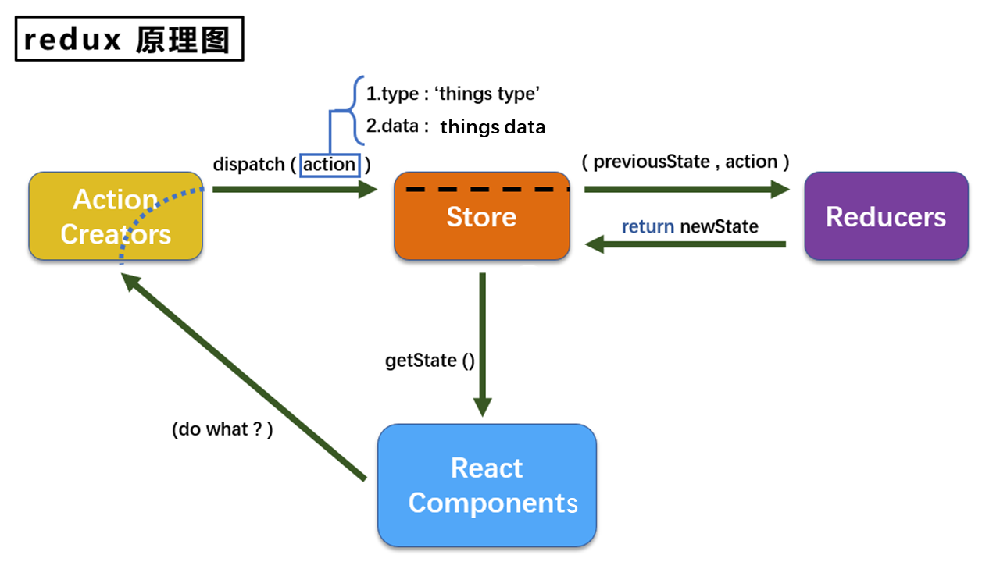
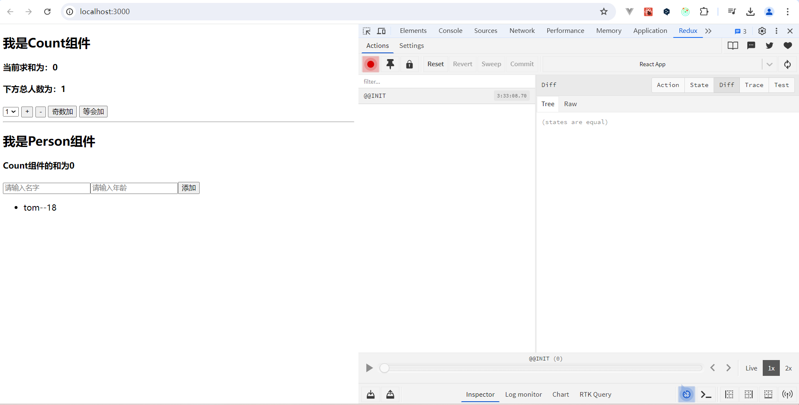
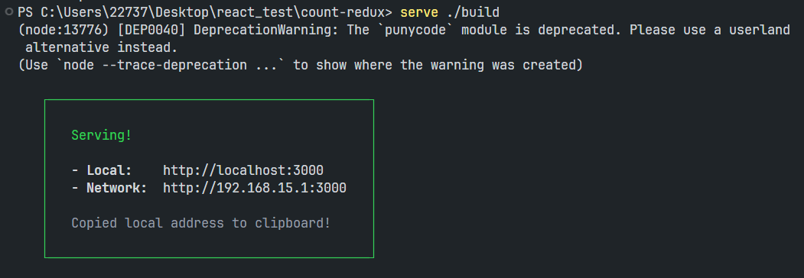

# React路由（前端路由）

------

> - **路由（Route）**就是一组K-V的对应关系。多个路由需要经过**路由器（Router）**的管理。
>
> - React中的路由（react-router）是一个React的插件，专门为了实现SPA（单页面）应用的。其中路由的K是路径、V是组件。原理是：当页面导航栏的路径发生变化后（没有发请求），就会被react-router监测到，然后根据路径找对应的组件渲染到页面上。
>
>   > React中的插件没有明确的插件规范，不同的插件用法也不同比较随意。
>
> - SPA应用（Single Page web Application）的特点：
>   1. 整个应用只有**一个完整的页面**（1个html）。
>   2. 点击页面导航**不会刷新页面，只做局部的组件更换**。
>   3. 数据需要通过AJAX来获取。
>   
> - `react-router`专门用于在React中实现路由。它有3个分支，分别为：
>
>   - react-router：路由的核心库，提供了很多组件和钩子。
>   - **react-router-dom**：包含react-router核心库，并添加一些WEB环境下用于DOM的组件，例如`<BrowserRouter>`等。（我们用这个）
>   - react-router-native：包含react-router核心库，并添加一些专门用于React Native的API，例如`<NativeRouter>`等。
>

###### React中路由的使用：

> 使用前要先安装：`npm i react-router-dom@5`，这里先用5版本，后面再说ReactRouter6。

1. 编写路由导航：React中通过`<Link>`标签来切换组件。它是一个组件，本质上就是a标签。所以首先将页面中的a标签（路由导航）换成`<Link/>`标签。

   ```jsx
   import { Link } from 'react-router-dom'
   
   export default class App extends Component{
     render(){
       return (
         ...
         <div>
           <Link className="list-group-item" to="/about">About</Link>
           <Link className="list-group-item" to="/home">Home</Link>
         </div>
         ...
       )
     }
   }
   ```

   > 但此时运行会报错，因为还没有路由器实例。

   > 路由相关的标签都需要写在`<BrowserRouter>`或`<HashRouter>`路由器标签（Router实例）里面，都要收到路由器的管理。而一般项目中我们就用一个路由器，并且不同文件中写的路由标签都需要被这一个路由器标签包起来。因此路由器标签我们直接写在入口文件index.js中`<App/>`组件的外面：
   >
   > ```jsx
   > import React from 'react'
   > import ReactDOM from 'react-dom'
   > // 引入路由器
   > import { BrowserRouter } from 'react-router-dom'
   > import App from './App' // React脚手架中可以省略扩展名.jsx
   > 
   > ReactDOM.render(
   >       <BrowserRouter>
   > 		<App/>
   >       </BrowserRouter>,
   >       document.getElementById('root')
   > )
   > ```

   > **路由的两种工作模式：**
   >
   > React中路由器有两种：一种是`<BrowserRouter>`底层是H5的History API，路径上没有哈希值。另一种是`<HashRouter>`底层是`#`号实现的，路径上有哈希值。（路由器两种工作模式的区别后面会说）

2. 注册路由：在切换组件的地方写`<Route>`标签，并通过它的path和component属性注册路由。

   ```jsx
   import { Link, Route } from 'react-router-dom'
   import About from './pages/About'
   import Home from './pages/Home'
   
   export default class App extends Component{
     render(){
       return (
         ...
         <div>
           <Route path="/about" component={About}/>
           <Route path="/home" component={Home}/>
         </div>
         ...
       )
     }
   }
   ```
   
   > 在`<Route/>`中注册的组件是路由组件，路由组件是通过`<Link/>`标签放在页面上的，不是我们自己写的。通常为了与普通组件区分开，路由组件会放在pages/目录中，而不是components/中。

------

- #### NavLink标签（组件）

  > - 它和`<Link>`标签的区别是：`<NavLink>`标签对应的**组件被激活时**会给自身加`active`类名。
  > - 并且`<NavLink>`标签还有一个`activeClassName`属性，可以自己指定**组件被激活时**要加的类名。

- #### Switch标签（组件）

  > - 默认情况下，组件切换时一个path可以匹配多个组件。如果你切换的地方注册了多个路径path相同的组件：
  >
  >   ```xml
  >   <div>
  >   	<Route path="/about" component={About}/>
  >   	<Route path="/home" component={Home}/>
  >   	<Route path="/home" component={Home1}/>
  >   	<Route path="/home" component={Home2}/>
  >   </div>
  >   ```
  >
  >   那么路由切换时匹配上了`/home`之后还会继续往下匹配，将符合路径的所有组件都激活展示。
  >
  > - 这其实这是存在效率问题的，我们希望它匹配上第一个path之后就不要再激活下面的其他组件了。此时就可以用`<Switch>`标签将`<Route>`包起来。
  >
  > - 通常情况下，path和component是一一对应的关系。如果注册了多个组件，通常为了提高效率，会用`<Switch>`标签给这些`<Route>`包起来。

- #### 路由的严格匹配和模糊匹配

  > 默认情况下，每个`<Route path="/home" component={Home2}/>`标签中注册的路由组件都是模糊匹配，也就是说`<Link to="/home/a/b" >Home</Link>`也可以匹配上该组件。如果想设置为严格匹配，加属性：`<Link exact={true}/>`

  ###### 注意：通常页面没啥问题我们不开启严格匹配。如果严格匹配随便开，有时候会引发很严重的问题（如：无法匹配二级路由等问题）。

- #### Redirect标签（组件）

  > Redirect组件用于兜底。只要Redirect组件被渲染，就会重定向切换路由。也就是说，若前面的`<Route path="/home" component={Home2}/>`都没匹配上，那么就去渲染Redirect组件，它一渲染就会重定向并切换路由：

  ```jsx
  import { Link, Route, Switch, Redirect } from 'react-router-dom'
  ...
  <div>
    <Switch>
      <Route path="/about" component={About}/>
      <Route path="/home" component={Home}/>
      <Redirect to="/home"/>
    </Switch>
  </div>
  ```

  > `<Redirect>`的path是`/`，它实际上是将path进行了重定向。（注意：`/`对应的组件不需要通过`<Link/>`标签去激活了，因为它是页面默认的URL）

------

- #### 路由的嵌套（多级路由）

  > **路由注册的顺序：**
  >
  > - 组件被渲染执行`render()`方法时，如果发现其中有`<Route/>`标签，那么会顺序注册这些路由组件。
  > - 注册路由组件时会根据路径给组件分等级。若组件的path包含了另一个组件的path，那么该组件就作为另一个组件的子组件。
  > - 当路由切换进行路径匹配时，只有父组件的路径匹配成功，才会继续拿着剩下的path去匹配其下的子组件进行展示。（这也是为什么开启路由的严格匹配，会导致无法匹配二级路由。父组件都匹配不上路径无法展示了，子组件就更没有机会去匹配路径和展示组件了）
  >
  
###### 	所谓路由的嵌套就是：根据路由的注册和匹配模式，注册子路由时，子路由的path开头要加上父路由的path值。

------

- #### React中路由组件和一般组件的区别（类式）

  > 我们知道Vue中路由组件身上会多两个API：`$router`和`$route`，那么React的路由组件和一般组件有什么区别呢？路由组件激活后props会收到数据：
  >
  > - history：该属性是**全局唯一**的。它是路由的历史记录是Router路由器在维护，而路由器只有一个。
  >   - go(n)/goBack()/goForward()：用于操作历史记录栈针。（后面会说）
  >   - push(url, state)/replace(url, state)：用于实现**编程式路由导航**，让路由跳转不再依赖于`<Link/>`标签。参数1是路由的path，参数2是state对象用于state传参。
  > - location：
  >   - pathname：存放to中指定的path值。
  >   - search：存放路由路径`?`以及后面的查询字符串。默认为空串。
  >   - state：存放传过来的state对象的。默认值undefined。
  > - match：
  >   - params：存放传过来的params参数对应的对象，默认为空对象`{}`。
  >   - path：存放该路由组件的path值。不同于pathname，它可能会包含动态参数（params参数的占位符）。
  >   - url：存放该路由组件的path值。不同于path，它是实际传过来的path，会将动态参数替换为值。

- #### 路由传参

  > 由于路由组件没有办法直接写组件标签，所以之前通过props给普通组件传递数据的方式就不能用了。路由组件有自己独有的传参方式。路由组件可以接收三种参数：**search参数**、**params参数**、**state参数**。（使用频率从上到下）
  >
  
  - ##### search参数（query参数）：
  
    - 路由导航`<Link/>`标签中传数据：
  
      ```jsx
      <Link to={`/home?id=${id}&title=${title}`}>Home</Link>
      ```
  
    - 从`this.props.location.search`对象中取数据，数据React并没有整理成对象，而是：`?id=001&title=abc`
  
    - 一般我们用`querystring`库将这个数据再处理下：（无需安装，React脚手架已经下载好了）
  
      ```js
      import qs from 'querystring'
      // url编码格式的字符串都可以用该方法转成对象（不带?）
      // qs.parse(str)
      // 对象转成url编码字符串（不带?）
      // qs.stringify(obj)
      
      // 处理数据
      const str = this.props.location.search.slice(1)
      const result = qs.parse(str)
      ```
  
  - ##### params参数（路径参数）：
  
    - 路由导航`<Link/>`标签中传数据：
  
      ```jsx
      <Link to={`/home/${id}/${title}`}>Home</Link>
      ```
  
    - 在`<Route/>`标签中，使用占位符声明接收params参数：
  
      ```jsx
      <Route path="/home/:id/:title" component={Home}/>
      ```
  
    - 然后就可以从`this.props.match.params`对象中取对应的数据了（数据已经整理成对象了）。
  
  - ##### state参数：
  
    > 前两种参数都会将数据暴露在地址栏url中，state参数不会在地址栏中暴露数据。
  
    - 路由导航`<Link/>`标签中传数据：state参数要求**to的值必须是一个对象**（其实前两种方式to的值也可以是对象）
  
      ```jsx
      <Link to={{
          pathname: '/about/message',
          state: { id,title }
        }}>Home</Link>
      ```
  
    - 从`this.props.location.state`中可以拿到这个state对象。
  
    > - 这种方式就算地址栏url中没东西，但**刷新页面仍可以保留住参数**，不会丢数据。因为BrowserRouter的url是靠浏览器的历史记录来维护的，所以没问题。
    > - 但是HashRouter刷新页面state参数会丢失，因为它底层的实现方式不同，没有人帮它去保存和维护url。

------

- #### 路由的push和replace

  > - 点击`<Link/>`写的路由导航时，由于是a标签所以每一次点击更改地址栏路径后，都会形成历史记录。历史记录栈会将当前路径url进行push压栈（默认），栈针默认指向栈顶。而点击前进、后退按钮其实就是在操作历史记录栈的栈针。
  > - 浏览器中有前进和后退按钮，这两个按钮都是依赖于浏览器的历史记录在工作的。浏览器的历史记录有2种写入模式，分别是：push和replace。push是追加历史记录，replace是替换当前记录。`<Link/>`路由导航跳转的时候默认为push。
  > - 对历史记录栈的操作其实还有另一种模式：替换（replace），它是用当前url对栈顶记录进行替换。开启替换模式：`<Link replace/>`

- #### `withRouter()`的使用（了解，6中已经删除了）

  > 编程式路由导航要想用，必须先拿到history对象，但是该对象是路由组件所独有的，普通组件没办法拿到怎么办？通过withRouter()函数给普通组件加上：

  ```js
  import App, { Component } from 'react'
  import { withRouter } from 'react-router-dom'
  
  class Header extends Component {...}
  // 暴露前先用withRouter()函数把普通组件Header加工后，返回一个新组件暴露出去，此时它身上就也有了路由组件的3个API
  export default withRouter(Header)
  ```

------

# React UI组件库

> - 所谓的UI组件库就是：将我们常用的元素、样式及交互，封装成各种组件供我们使用。只需要将组件拿过来即可使用。React常用的UI组件库是Ant Design。
> - UI组件库分为两大类：移动端和PC端。移动端常用的UI组件库：Vant、Cube UI、Mint UI..，PC端常用的UI组件库：Element UI、IView UI..

------

# Redux

> Redux是一个专门用于做状态管理的JS库。作用：集中式管理应用中多个组件共享的状态（state）。（它不是专门用于React的插件库，还可以在Vue、Angular中用，但一般都与React配合使用）

###### 什么时候使用Redux？

> 1. 多个组件依赖同一状态。
> 2. 多个组件要变更同一状态。
>
> 此时这个状态（数据）就应该放在Redux中。

###### Redux的工作原理图：



###### Redux的工作原理：

> - 当某个组件的数据需要多个组件共享时，最好的方式就是将其放在Redux中，让它帮我们维护需要多个组件共享的数据（状态）。此时数据不在自身了，当组件要操作数据（状态）时，需要通知Redux让它来调度去完成对state的操作。
>
> - Redux中有3个重要的组成部分：**Action、Reducer、Store**。其中`Action`是一个对象，其中定义了对state的操作。`Reducer`完成state的初始化、以及后续state的更新，返回值作为新的state，它必须是一个**纯函数**。`Store`是Redux的核心对象，Redux工作的核心API都在该对象上，它是唯一的且维护着唯一的state（类型任意）。state的更新通过Store调用相应的Reducer来完成，具体工作流程为：
>
>   - 当你要操作state时，首先需要将要做的操作，通过`ActionCreator`函数创建出来一个操作该state的action对象（当然这个action也可以自己写）。
>   - 然后通知Store拿着这个action对象，去根据type分发给对应的Reducer完成state的更新：`store.dispatch(action)`。（Redux中管理的每个数据都一一对应一个ActionCreator和Reducer）
>   - 执行了这行代码后，Store就会拿着action去调用相应的Reducer函数完成对state的更新了。最终会跟据action对象的type属性来决定调用哪个Reducer。
>
>   > **纯函数：**相同的输入永远会得到相同的输出，而且没有任何可观察的副作用。所以纯函数中不能改写形参，不能调用Math.random()，不能发送网络请求、调用IO设备等不靠谱有副作用的操作。
>
> - Action对象有2个属性：其中type属性是必须的，表示操作的类型，值是Reducer函数中定义好的操作名（字符串，在Redux中必须唯一）。data属性是可选的，用于存放操作的值。
>
> - Reducer函数接收2个参数：preState（先前的state）和action对象。Reducer函数的返回值会作为新的state交给Store维护。
>
> - 当Store对象初始化时，会调用1次Reducer函数（所有的）去初始化state。此时Reducer函数的preState为undefined、action对象中只有type属性且值为随机字符串。
>
> - 通过`store.getState()`方法可以获取Store对象中维护的（唯一的）状态state。（里面可能包含了Redux管理的多个数据）
>
> - Redux只负责管理状态，至于状态的改变驱动着页面的展示，需要我们自己写。因此Redux提供了一个API，只要state发生变化（浅层次），就会帮你调指定的函数：`store.subscribe(func)`。
>
>   > 因此我们只需要将重新渲染页面的函数订阅到Redux中，那么state变化Redux就可以重新渲染页面了。
>

###### 搭建Redux环境：

1. 安装Redux：`npm i redux`，并在src/下新建redux/目录，用于存放Redux中的所有文件。

2. （核心）编写`redux/store.js`，用于创建Redux中的核心**store对象**（全局唯一）：

   ```js
   // 引入createStore()函数，它专门用于创建核心的store对象
   import { createStore } from 'redux'
   // 目前只用Redux存放一个count数据，所以只引入一个为count服务的Reducer
   import countReducer from './count_reducer'
   
   // 创建并暴露store对象，参数是Reducer函数
   export default createStore(countReducer)
   ```

   > 目前Store就管理一个count数据所以就关联一个为count服务的Reducer，将来要管理多个数据需要关联多个Reducer时就不是这样写了。

3. 编写`redux/count_reducer.js`，用于创建**为count数据服务的Reducer（函数）**：

   ```js
   // 定义初始化的state
   const initState = 0
   // 创建并暴露Reducer函数
   export default function countReducer(preState=initState, action){
     const {type, data} = action // 从action对象中获取type和data
     switch (type) { // 根据type决定如何加工数据
       case 'increment':
         return preState + data
       case 'decrement':
         return preState - data
       default:
         return preState // 如果是没定义的操作，就还返回原来的state
     }
   }
   ```
   
   > 目前我们只需要Redux管理Count组件的一个count数据（状态），所以state类型为Number即可。

###### 使用Redux：

- 组件中通过`store.getState()`获取state：

  ```jsx
  import store from '../../redux/store'
  ...
  <h1>当前求和为：{store.getState()}</h1>
  ```
  
- 通知Redux去修改state：`store.dispatch({type:'increment',data:100})`，让Store拿着action分发给对应的Reducer完成操作。

###### 但是这里有一个问题：

> Redux只负责管理状态，至于状态的改变驱动着页面的展示，需要我们自己写。也就是说：state变化后，Redux并没有去重新渲染页面，所以页面还是旧的。怎么办呢？需要用Redux的`store.subscribe(func)`：

```js
export default class Count extends Component {
	...
	// 组件挂载完毕后，就调用subscribe监视redux中的state。只要state发生变化（浅层次），Redux就调用该回调重新渲染页面
	componentDidMount(){
        store.subscribe(()=>{
            // state变化后，手动调用`setState({})`更新页面。但是setState有一点效率的问题
            this.setState({})
        })
	}
	...
}
```

> 但还不行。如果有多个组件，难不成在每个组件挂载完毕时都去subscribe订阅一下吗？
>
> 后面用`react-redux`就没这个问题了。目前先这样做，在入口文件index.js中给根组件App订阅下：（每次state变了直接重新渲染整个应用）

```jsx
import React from 'react'
import ReactDOM from 'react-dom/client'
import App from './App'
import store from './redux/store'

const root = ReactDOM.createRoot(document.getElementById('root'))
root.render(<React.StrictMode><App/></React.StrictMode>)

// 只要store中的状态发生变化，就重新渲染整个应用
store.subscribe(()=>{
	root.render(<React.StrictMode><App/></React.StrictMode>)
})
```

###### 再做些优化：

- 我们每次还得手动写action对象很麻烦，而且后面还会用函数类型的**异步action**，每次调用dispatch还得自己写个函数传进去太麻烦了。所以我们一般会通过ActionCreator函数为count数据生成action。新建`redux/count_action_creator.js`：

  ```js
  export const createIncrementAction = data => ({ type: 'increment', data })
  export const createDecrementAction = data => ({ type: 'decrement', data })
  ```

  > 这样就不用自己亲自写action对象了，在组件中：
  >
  > ```js
  > import { createIncrementAction, createDecrementAction } from '../../redux/count_action_creator'
  > ...
  > store.dispatch(createIncrementAction(100))
  > ```
  >

- 我们发现Reducer中操作state的**操作名**很重要（Redux中唯一），一旦这个字符串写错了玩儿完。所以通常我们会新建一个`redux/constant.js`，将这些操作名都定义为常量。这样不仅防止出错，还便于管理：

  ```js
  export const INCREMENT = 'increment'
  export const DECREMENT = 'decrement'
  ```

  > 以后所有的Reducer和ActionCreator中的操作名都用这些常量。
###### 以上是Redux的基本使用，接下来我们学习Redux的高阶用法。

------

- #### 异步Action和同步Action

  > - 之前写的对象类型的action就是**同步action**，而异步action是一个函数。之所以函数类型的action叫做异步action，是因为在这个action中我们可以执行异步操作，异步操作执行完了再去分发同步action真正操作数据。试着写一个异步action：
  >
  >   ```js
  >   export const createIncrementAsyncAction = (data,time)=>{
  >     return ()=>{ // 其实这里可以接收到dispatch
  >       setTimeout(()=>{
  >         store.dispatch(createIncrementAction(data))
  >       },time)
  >     }
  >   }
  >   ```
  >
  > - 但是Redux中的action只能是普通对象，函数类型的action传到dispatch中Redux处理不了。所以我们需要借助一个第3方的中间件去处理异步action。相当于借助中间件告诉Store：如果我给你的是异步action，那么你直接执行下该函数即可，不用拿着action去调用Reducer了。
  >
  >   > 在Redux中添加处理异步action的中间件`redux-thunk`：
  >
  >   1. 安装中间件：`npm i redux-thunk`
  >
  >   2. 在`store.js`中配置中间件：
  >
  >      ```js
  >      // 引入applyMiddleware，用于在Redux应用中间件
  >      import { createStore, applyMiddleware } from 'redux'
  >      // 引入redux-thunk，用于支持Redux处理异步action
  >      import { thunk } from 'redux-thunk'
  >      import countReducer from './count_reducer'
  >                                             
  >      // 第2个参数中调用applyMiddleware(thunk)应用中间件
  >      export default createStore(countReducer, applyMiddleware(thunk))
  >      ```
  >   
  >- 并且Redux调用这个异步action函数时，它就知道你肯定会在里面使用dispatch函数，所以调用时Store会给函数式action传参dispatch，不用再引入store了。
  
- #### 使用`react-redux`

  > Facebook公司发现越来越多的开发者在React项目中使用第三方Redux库，所以为了让开发者在React中使用Redux更方便，就出了`react-redux`插件库。

  > 在用`react-redux`之前，我们先了解一些概念：
  >
  > 1. 所有要用Redux的UI组件（就是我们写的组件）都应该包裹一个**容器组件**，它们是直接父子关系。
  > 2. 真正和Redux打交道的是容器组件，只有容器组件中才可以随意使用Redux的API。（我们写的UI组件中不能出现任何Redux的东西）
  > 3. 容器组件会通过props给UI组件（子组件）传2个东西：1、Redux中维护的state。2、用于操作state的方法。
  >
  > 容器组件一般放在`src/containers`目录中，里面是所有要和Redux打交道的组件。为了少一些组件文件，我们通常会把容器组件和它的UI子组件都放在一个文件中。由于页面中使用了容器组件后，它的子组件自动就引入了，所以默认导出容器组件即可（容器组件不影响结构）。

  1. 创建容器组件：（需要先安装`npm i react-redux`）

     ```jsx
     // 引入connect方法，用于创建容器组件
     import { connect } from 'react-redux'
     ...
     /* 这里是原来的UI组件（Count），里面没有任何的redux相关的东西 */
     ...
     // 通过connect方法连接容器组件和UI组件，返回的就是容器组件，将其暴露即可
     export default connect()(Count)
     // 注意：容器组件文件中一般不直接引入store对象
     ```
  
     > **高阶组件：**高阶组件本质是一个高阶函数。该函数接收一个组件，将其包装后返回一个新的组件。高阶组件通常用于**扩展组件的功能**。
  
  2. 页面上使用容器组件，并通过store属性为容器组件指定store对象：
  
     ```jsx
     import Count from './containers/Count'
     import store from './redux/store'
     ...
     <div id='app'>
     	<Count store={store}/>
     </div>
     ```
  
  ###### 给UI子组件传数据：
  
  > - UI组件通过父容器组件和Redux打交道，而容器组件会通过props给UI组件传state和操作state的方法。但是目前存在问题：容器组件和UI组件之间的父子关系不是靠我们写标签形成的，没办法用props怎么办？
  >
  > - 容器组件是这样给UI组件传state和操作state的方法的：connect()方法调用时可以传2个（函数型）参数，这两个函数**返回的对象都会以props的形式传给UI组件**。
  >
  > - 其中第1个函数用来传state，参数也是state；第2个函数用来传操作state的方法，参数是dispatch。（默认还给UI组件传了store对象）
  >
  >   ```js
  >   ...
  >   function mapStateToProps(state){
  >       return { count: state }
  >   }
  >                             
  >   function mapDispatchToProps(dispatch) {
  >     return {
  >       increment(v){ dispatch(createIncrementAction(v)) },
  >       decrement(v){ dispatch(createDecrementAction(v)) },
  >       incrementWait(v,t){ dispatch(createIncrementAsyncAction(v,t)) },
  >     }
  >   }
  >                             
  >   export default connect(mapStateToProps,mapActionToProps)(Count)
  >   ```
  
  ###### 使用容器父组件传过来的state和操作state的方法：
  
  ```jsx
  class Count extends Component {
    render() {
      const { count, increment, decrement, incrementWait } = this.props
      return (
        <div>
          <h2>当前求和为：{count}</h2>
          <select ref={ c => { this.selectNode = c } }>
            <option value='1'>1</option>
            <option value='2'>2</option>
            <option value='3'>3</option>
          </select>&nbsp;
          <button onClick={ ()=>{ increment(1) }}>+</button>&nbsp;
          <button onClick={ ()=>{ decrement(1) }}>-</button>&nbsp;
          <button onClick={ ()=>{ incrementWait(1,1000) }}>等会加</button>
        </div>
      )
    }
  }
  ```
  
  ###### react-redux的优化：
  
  - mapDispatchToProps的对象写法：
  
    > - 你有没有发现，mapActionToProps返回的对象中，方法体的重复度有点高。在每个方法最后，都要拿着返回的action对象去调用dispatch更新state，因为容器组件传的就是操作state的方法。
    >
    > - 那既然每个操作state的方法最终都要拿着action调用dispatch，所以react-redux就对其做了优化：
    >
    >   > mapDispatchToProps不要再写成函数了，代码冗余度太高，直接写成一个对象，对象中是一个一个操作state的方法。这些方法的返回值我都当作action对象，自动帮你去调用dispatch更新state：
    >   
    >   ```js
    >   export default connect(mapStateToProps,{
    >       increment: createIncrementAction,
    >       decrement: createDecrementAction,
    >       incrementWait: createIncrementAsyncAction
    >   })(Count)
    >   ```
  
  - 状态（state）的改变驱动着页面的渲染：
  
    > 使用react-redux后，状态的改变就可以驱动页面的渲染了。也就是不用再去`store.subscribe(func)`订阅渲染函数到Redux中了，改了state后页面自动重新渲染。
  
  - 使用`<Provider/>`组件：
  
    > 试想一下，如果有多个容器组件，难不成每个都通过props去指定store对象吗，太麻烦了。此时我们可以使用`<Provider/>`组件：
    
    ```jsx
    import React from 'react'
    import ReactDOM from 'react-dom/client'
    // 引入Provider组件（不影响结构）
    import { Provider } from 'react-redux'
    import App from './App'
    import store from './redux/store'
    
    const root = ReactDOM.createRoot(document.getElementById('root'))
    root.render(
      <React.StrictMode>
        <Provider store={store}>
          {/*里面也可以继续包上BrowserRouter组件*/}
          <App />
        </Provider>
      </React.StrictMode>
    )
    ```
    
    > 我们只需要将store交给Provider，那么整个应用中所有需要store的容器组件，都会找Provider去拿store。（它不影响结构）

------

- #### 多个组件使用Redux

  > 实际项目中，我们是要Redux帮我们维护多个状态数据的，所以state必须是一个对象，保存多个状态。并且会有多个Reducer和多个ActionCreator，因此我们会在`redux/`目录下新建`actions/、reducers/`目录，分别存放用于操作不同状态的ActionCreator和Reducer。文件名通常和状态名保持一致：`count.js/person.js`（根据文件所在目录的不同区分其作用）。

  ##### 使用：

  1. 在constant.js中添加操作person状态的操作名：（全局唯一）
  
     ```js
     export const ADD_PERSON = 'add_person'
     ```
  
  2. 添加为person状态服务的ActionCreator和Reducer：
  
     > redux/actions/person.js：
  
     ```js
     import { ADD_PERSON } from "../constant";
     export const createAddPersonAction = data => ({type:ADD_PERSON,data})
     ```
  
     > redux/reducers/person.js：
  
     ```js
     import { ADD_PERSON } from '../constant'
     const initState = [{id:'001',name:'tom',age:18}]
     export default function countReducer(preState=initState, action){
       const {type, data} = action
       switch(type){
         case ADD_PERSON:
           return [data, ...preState] // 由于Reducer是纯函数，所以这里要返回一个新的person数组，不能在原有的基础上进行unshift
         default:
           return preState
       }
     }
     ```
  
  3. 修改store.js：
  
     ```js
     import { createStore, applyMiddleware, combineReducers } from 'redux'
     import {thunk} from 'redux-thunk'
     import countReducer from './reducers/count'
     import personReducer from './reducers/person'
     
     // 合并所有的Reducer为一个总的Reducer
     const reducer = combineReducers({
     	count: countReducer, // count的初值为countReducer()函数的返回结果
     	person: personReducer
     })
     export default createStore(reducer, applyMiddleware(thunk))
     ```
  
     > - 合并之后就变成了一个总的Reducer，所以要求操作不同state的操作名不能重复。
     > - 合并之后Redux中的state就变成了一个对象，对象中有count和person属性，初值分别为0和数组（对应Reducer()函数的返回结果）。以后每次根据操作名调用不同的Reducer去更新state后，都是一个新的state对象了。
     
     一般不在store.js中合并所有的Reducer，而是在reducers/下新建index.js（用于合并所有的Reducer，并暴露一个汇总后的Reducer）：
     
     ```js
     import { combineReducers } from 'redux'
     import countReducer from './count'
     import personReducer from './person'
     // 合并所有的Reducer
     export default combineReducers({
     	count: countReducer,
     	person: personReducer
     })
     ```
     
     > 然后在store.js中引入汇总之后的一个Reducer即可：`import reducer from './reducers'`

------

- #### 配置Redux开发者工具

  > 和Vuex开发者工具不同的是，由于Redux是第三方JS库，所以Redux的开发者工具需要单独下载。并且还需要在React项目中进行配置：

  1. 安装redux开发者工具的扩展包：`npm i @redux-devtools/extension`

  2. 在store.js中进行配置：

     ```js
     import { createStore, applyMiddleware, combineReducers } from 'redux'
     import {thunk} from 'redux-thunk'
     import countReducer from './reducers/count'
     import personReducer from './reducers/person'
     // 引入汇总之后的Reducer
     import reducer from './reducers'
     // 引入开发者工具扩展
     import { composeWithDevTools } from '@redux-devtools/extension'
     
     // 第2个参数写composeWithDevTools()函数，原来有第2个参数的话就传到该函数参数中
     export default createStore(reducer, composeWithDevTools(applyMiddleware(thunk)))
     ```
  
  > 安装配置好之后，启动React项目并打开Redux选项卡：
  >
  > 

------

# 项目打包运行

> 项目写完了，如何将我们写的React应用真正部署在服务器上。步骤：

1. 打包：`npm run build`，该命令可以将React项目代码，打包为纯粹的静态资源文件，让其可以直接放在服务器上运行。

2. 通过第三方工具，模拟一个服务器环境，将我们打包后的代码放上面测试下：

   1. 安装serve工具：`npm i -g serve`，该工具可以让我们，以指定目录为服务器根目录，快速开启一台（处理静态资源的）服务器。
   2. 执行命令：`serve 目录名`

   > 

------

