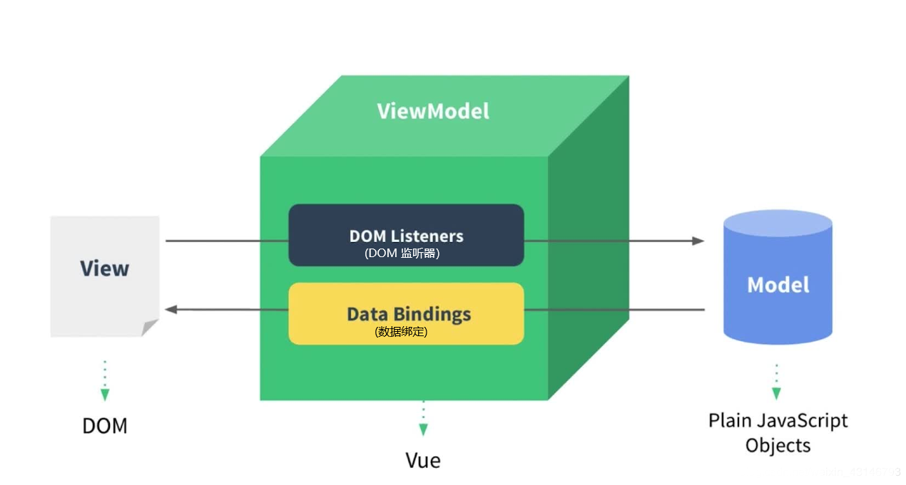

# Vue

------

> Vue是一套用于，构建用户界面的，渐进式JS框架。简单来说就是负责将AJAX取来的数据渲染到HTML页面上的JS框架。
>
> 那什么是渐进式呢？就是，Vue可以自底向上逐层的应用。简单应用只需要一个小巧的Vue核心库；复杂应用可以引入各种的Vue插件。
>
> Vue的特点：
>
> - 采用**组件化**模式，提高代码复用率、且让代码更好维护。它是指，Vue将页面中的某一个板块的HTML、CSS、JS都封装为一个`.vue`结尾的文件，这样用的话直接引入该文件，只需要修改内部的CSS、HTML代码即可。
> - **声明式**编码，让编码人员**无需直接操作DOM**，提高开发效率。它是指，页面中使用特殊的属性和标记，来完成特定的效果，无需我们做编写复杂的JS代码就可以实现，有点类似JSP。
> - 使用**虚拟DOM**和优秀的Diff算法，尽量**复用DOM节点**。
>
> 准备工作：下载`vue.js`文件引入到HTML，下载Vue的开发者工具（crx文件），拖到浏览器的扩展中心即可。

- ### 第一个Vue程序：

  ```html
  <!DOCTYPE html>
  <html lang="en">
  <head>
    <meta charset="UTF-8">
    <meta name="viewport" content="width=device-width, initial-scale=1.0">
    <!-- 引入vue文件后，类似于jQuery，全局中多了一个Vue构造函数 -->
    <script src="./js/vue.js"></script>
    <!-- vue的全局配置 -->
    <script>
      //关闭生产提示
      Vue.config.productionTip = false
    </script>
    <title>test Vue</title>
  </head>
  <body>
  <!-- 准备好一个容器。因为vue采用组件化模式，要将vue的组件放在页面的指定位置上，所以用div包住指定位置 -->
    <div id="root">
      <!-- 先写死 -->
      <!-- <h1>Hello,Vue!</h1> -->
      <!-- 这里面的代码依旧用HTML，只是加入了vue的语法，所以该div容器被称为【Vue模板】 -->
      <h1>Hello,{{user}}!</h1><!-- 这是vue模板的插值语法，里面可以写data对象的属性，或者JS表达式 -->
    </div>
    <script>
      //想让Vue工作，就必须创建对应的Vue实例，传进去配置对象
  	const v = new Vue({
        //vue实例要将组件内容放在这个标签内部。值通常为css选择器串，还可以是dom对象
        el: '#root',
  	  //data中用于存储数据，数据供el指定的容器中使用，值目前先用对象
        data: { user: '尚硅谷' }//一般该对象中只出现属性不出现方法，方法一般不在这儿写
      })
      //修改user中的数据，页面也随之更新，这就是vue的响应式，它会对data中的数据进行监测
      v.user = '尚学堂'
    </script>
  </body>
  </html>
  ```

- ### 第一个程序的细节：

  > - 想让Vue工作，为我们动态渲染页面的数据，就需要创建Vue实例，且要传进去一个配置对象。
  >   - `el`配置项用于指定该Vue实例接管哪个容器，值可以是CSS选择器串，也可以是JS原生的DOM对象。
  >   - `data`配置项用于存储动态的**属性**数据，当数据变了页面对应部分会更新（响应式）。
  >- root容器内的代码依然符合HTML规范，只不过混入了一些特殊的Vue语法，所以root容器内的代码被称为**Vue模版**，需要先让Vue接管容器渲染后才能在页面正确显示。
  > - HTML容器和Vue实例之间是**1对1关系**。Vue实例会从上到下找第1个符合条件的容器去接管，做为Vue模版去解析。（真实开发中只会有一个Vue实例，且会配合着组件一起使用）
  > - **Vue模版**中，`{{}}`中可以写JS表达式时，**表达式中的函数或属性，得是Vue实例上有的**。Vue实例上数据可以在表达式中直接用。
  > - 一旦data中的数据发生了变化，Vue模版会被重新渲染，显示最新的数据，这就是Vue的响应式。
  > - Vue实例对象中有两种属性，一种是以`$`开头的，这些都是Vue供我们用的。剩下的都是Vue内部的底层代码用的，一般不用管。
  > - **（重要）Vue对data的响应式的原理**：
  >   - Vue首先对data对象中的数据做了增强，生成了代理对象，Vue对象的`_data`指向了该代理对象。并且原来指向data的引用也指向了该代理对象。代理对象的对应属性都是虚拟属性，访问和修改的其实都是原来的data对象的属性。
  >   - Vue首先拿到data中的数据，为其中的数据生成getter和setter（虚拟属性）。对`_data`中的数据的访问和修改，最终访问修改的都是原data的数据（且原data对象的引用也指向了代理对象）。这样通过Vue实例（或原data的引用）对data中数据进行修改时，就可以在setter中渲染页面，达到响应式的目的。
  >   - 所以对`_data`中数据的修改，实际上修改的是data中的原始数据；访问`_data`实际上访问的是data中的原始数据，这样修改后可以对页面进行对应的更新。这就是Vue对data做的**数据劫持**。以此来完成对data的响应式。
  >   - data中的属性在Vue对象上也有。实际上Vue对象上的这些属性都是虚拟属性，是通过`Object.defineProperty()`方法的`getter`和`setter`加的，访问和修改的都是`_data`中代理对象的数据。
  > 

------

- ## Vue的模板语法

  - #### 插值语法：

    > 如果是**标签体内容**要实现动态化，就需要用插值语法，用`{{}}`将JS表达式包起来。

  - #### 指令语法：（指令主要用于`解析标签`，形式都是`v-xxx`，可以解析标签属性、标签体内容、绑定事件等....）

    > 如果是**标签属性**要实现动态化，需要用指令语法。例如：其中的`v-bind`指令，`v-bind:属性名='JS表达式'`，它可以实现标签属性的动态化。（有点像`Thymeleaf`中的`th:属性名="${域中的数据}"`）由于该指令很常用，所以**可以简写**`:属性名='JS表达式'`
  
- ## Vue的数据绑定

  > - **单向数据绑定**：其实`v-bind`指令就是一个单向的数据绑定指令，当data中的数据发生了变化，那么对应的属性值就会变。
  >
  > - **双向数据绑定**：`v-model`指令则是双向的数据绑定，属性值发生变化，对应的data中的数据也会变化。它一般用在**有value属性的表单类元素**上。所以`v-model:value='JS表达式'`可以简写为`v-model='JS表达式'`

- ## el和data属性的另一种写法

  > - 声明Vue对象可以不指定el属性，用Vue对象的`$mount()`实例方法，也可以将Vue对象和容器进行1对1绑定：`v.$mount('#root')`，这种方式更灵活。`$mount()`是动态的将容器挂载到Vue对象上。
  >
  > - `data`属性的函数式写法，要求函数的返回值必须是1个对象：（一个原则：**Vue所管理的函数一定不要用箭头函数**）
  >
  >   ```js
  >   const v = new Vue({
  >       el: '#root',
  >       data(){//完整形式为，data:function(){}
  >           console.log(this)//this是当前vue对象
  >           return { user: '张三' }
  >       }
  >   })
  >   ```

------

- ## MVVM模型

  > Vue的设计一定程度上参考了MVVM模型。MVVM是指：
  >
  > - M：模型（Model），对应data中的数据，是一般的JS对象
  > - V：视图（View），Vue关联的容器
  > - VM：视图模型（ViewModel），对应Vue实例对象（因此Vue实例通常叫vm）
  >
  > 

------

- ## 事件处理

  - #### 给元素绑定事件：

    > - 通过指令`v-on:事件名称='表达式'`（简写为：`@事件名称='表达式'`），可以给元素绑定事件，然后在Vue对象的配置里加`methods: {函数}`，里面是需要Vue对象在事件发生时去调用的函数，最终这些函数也会出现在Vue对象上，所以才可以在Vue模版中使用。
    > - `methods`中的函数是被Vue管理的函数。所有被Vue所管理的函数，Vue会帮你将里面的this指向该Vue对象。所以methods中的被Vue管理的函数不要用箭头函数。
    > - 表达式中的函数调用还可以加小括号`()`传参，不加调用时默认也会传`事件对象`。如果要传多个形参，可以用`$event`做事件对象的占位符，避免传其他参数时事件对象消失。（JS中直接在元素上绑定函数的形参是不能传参的）
    > - 和`data`中的数据不同的是，`methods`中的数据Vue不会做数据代理。因为函数不会修改，所以不用做响应式。你要将函数放data中会让Vue很累。所以通常`data`中写经常变的属性数据，`methods`中写不会变的方法、函数等数据。
    
  - #### 事件修饰符：
  
    > 可以在事件名称后面加事件修饰符，来控制事件相关的属性。如：`v-on:click.prevent='表达式'`，常见的事件修饰符有：（可以连着写：`@click.stop.prevent='表达式'`，注意顺序）
    >
    > - `prevent`（常用）：阻止事件的默认行为。只执行表达式，默认的跳转、提交等行为不执行。
    >
    > - `stop`（常用）：阻止事件冒泡。
    >
    > - `once`（常用）：事件只触发一次。之后事件再次发生也不会执行后面的表达式。
    >
    > - `capture`：捕获该事件。改变事件流的方式为捕获，等处理完后事件再往下层DOM上走。
    >
    > - `self`：只有`event.target`是当前元素才执行表达式。也就是说，该事件必须在当前元素上发生才触发表达式的执行。
    >
    > - `passive`：被动的，先执行事件的默认行为，再执行表达式。
  
  - #### 键盘事件的事件修饰符：
  
    > 可以在键盘事件后面加修饰符，给事件再加条件。Enter键按下才触发该事件：`@keydown.enter='表达式'`
    >
    > Vue将常用的按键名都做成了事件修饰符（小写短横线方式），以下是常用的键盘事件的事件修饰符：
    >
    > - `enter`：按下的是回车键才执行表达式
    >- `delete`：退格键、删除键都能触发
    > - `esc`：ESC键
    >- `space`：空格
    > - `tab`：制表（特殊，必须配合`keydown`事件使用）
    >- `caps-lock`：大小写，2个单词的键需要用这种格式
    > - `up`：上箭头
    >- `down`：下箭头
    > - `left`：左箭头
    >- `right`：右箭头
  
    > 几个特殊的系统修饰键（Ctrl、Alt、Shift、WIN键），它们的使用：
    >1. 配合`keyup`使用：按下修饰键的同时，再按下任意其他键，随后释放其他键，事件才会触发。也可以指定按下y键才触发`@keyup.ctrl.y='表达式'`
    > 2. 配合`keydown`：正常触发
  
  - #### v-model指令的事件修饰符：
  
    > - `number`：可以将获取的value属性的字符串值转为Number型，如：`v-model.number='age'`，此时会将收集到的value属性的值给age变量，值是Number类型的。
    > - `lazy`：让input输入框失去焦点时再进行数据收集。不设置的话是实时收集，value属性变化一次马上就收集一次。
    > - `trim`：收集的value数据去掉前后空格。

------

- ## 计算属性（computed）

  > Vue模板内可以使用表达式很不错，可以将取到的数据做运算和操作，但是设计它们的初衷是用于简单运算的，如果在模板中放入太多的复杂的逻辑会让模板过重且难以维护。所以，对于任何复杂的逻辑，都应当使用**计算属性**，使用：
  >
  > ```js
  > const v = new Vue({
  >     el: '#root',
  >     data(){
  >     	name: '张三'
  >     },
  >     //通过computed来指定计算属性
  >     computed: {
  >         fullname: {
  >         	//当读计算属性fullname时，get()方法就会被vue对象调用，返回值是属性fullname的值。它也在vue对象上
  >         	get(){ return '我是'+ this.name },//get方法中的this就是vue对象
  >             //当fullname被修改时，set()方法会被vue对象调用。如果你确定该属性不会被改，那就不用写set
  >         	set(v){ this.name = v }
  >         }
  >     }
  > })
  > ```
  >
  > - 计算属性本身并不存在，要通过已有的属性计算得来。底层是通过`Object.defineProperty()`方法的`get`和`set`方法。
  >
  > - 计算属性最终也会出现在Vue实例上，直接用即可。
  >
  > - 计算属性被推荐的原因是，**它的值会被Vue缓存**。只有**初次读取计算属性**，或**get()方法所依赖的数据发生了变化**时，get()方法才会被调用，所以它的效率较高。
  >
  > - 计算属性可以简写。当确定了计算属性只读不改，不需要`set()`时，可以：`fullname: function(){}`

- ## 监视属性（watch）

  > `watch`可以监视`data`中的属性，当`data`中的属性发生变化时会调用对应的`handler()`方法（**也可以监视计算属性**）。使用：

  ```js
  const v = new Vue({
      el: '#root',
      data(){
      	name: '张三'
      },
      watch: {
          //监视name属性，属性没有也不会报错
          name: {
              immediate: true,//该属性初始化时就调用一次handler，默认false初始化时不调用
              deep: true,//开启深度监视
              handler(niu,old){
                  console.log('name被改了',niu,old)
              }
          }
      }
  })
  ```

  > - 另一种写法：`vm.$watch('name',{})`，这种更灵活。
  > - 如果监视的属性是一个对象，对象中还有属性，那么要监视的属性就得写成**字符串形式**：`'name.first'`
  > - `immediate: true`配置表示：该属性初始化时就调用1次`handler()`函数，默认false初始化时不调用。
  > - 默认`watch`不会进行深度监视，深度监视不会调用`handler()`函数。开启的话：`deep: true`
  > - 如果监视的属性的配置中只有`handler()`，没有其他配置，那么可以简写：`name(niu,old){}`，当然另一种写法也可以简写：`vm.$watch('name',function(niu,old){})`（注意Vue管理的函数不要用箭头函数）

- ## 计算属性和监视属性的区别

  > - `computed`计算属性能完成的任务，`watch`监视属性都能完成。但是`watch`监视属性能完成异步任务，`computed`计算属性不行。
  >  - `computed`计算属性用的较多且代码写起来简单，但是计算属性要依靠`return`将值返回，所以如果是异步任务它就处理不了了。
  >   - `watch`监视属性不依赖返回值，它是亲自处理的数据，可以处理异步任务。
  > 
  > - 注意：所有**被Vue管理的函数，要用普通函数的写法**，这样`this`才是Vue实例或**组件实例对象**。而不被Vue管理的函数（AJAX、Promise、定时器），最好写成箭头函数，这样this指向的还是上下文的Vue实例。

- ## 样式的设置

  > Vue中可以通过`v-bind`指令来动态设置CSS样式，分为两种情况，动态设置类名和动态设置行内样式：

  - ### 动态设置类名：

    > 通过`v-bind:class`来动态设置class属性，如：`:class='表达式'`。表达式的值一般有以下3种：
    >
    > 1. 变量（String型）。如：`:class='mood'`，此时会去Vue对象上找mood属性（普通String型），用该属性的值来给class属性**追加一个动态的类名**。适用于**当某个类名需要动态变化时**。
    > 2. 数组。如：`:class="['happy','sad','alone']"`，此时数组中的类名都是动态的，可以通过往数组中添加和删除元素来管理元素上的多个类名。适用于**要绑定的类名的个数、名字都不确定时**。
    > 3. 对象。如：`:class="{happy: false; sad: true}"`，表示加上sad类名，去掉happy类名。适用于**启用某个类名时**

  - ### 动态设置样式：（行内）

    > 通过`v-bind:style`来动态设置style属性，如：`:style='表达式'`。表达式的值一般有以下2种：
    >
    > 1. 对象。**样式对象**的属性名是CSS的属性名，再改成用小驼峰形式，如：`:style='obj'`，data中的数据：
    >
    >    ```js
    >    data: {
    >    	obj: {
    >    		fontSize: '16px',
    >    		color: 'red',
    >    		backgroundColor: 'orange'
    >    	}
    >    }
    >    ```
    >
    > 2. 数组。里面是多个样式对象，如：`:style='[obj1, obj2]'`，这样obj1和obj2对象中的CSS样式都会以行内样式加入。

- ## 条件渲染

  > 条件渲染对应着不同的指令。当满足某些条件时，页面上才有该DOM元素，否则只有虚拟DOM。条件渲染可以将Vue模版动态化。

  - `v-show`：表达式的值为true时就显示，否则隐藏。它相当于设置了`display: true;`，DOM还在HTML中，只是隐藏了。

  - `v-if`：表达式的值为true时，HTML文档中就有该元素。它是动态的增删HTML节点。对应的还有`v-else`、`v-else-if`，如：

    ```html
    <h1 v-if="awesome">Vue is awesome!</h1>
    <h1 v-else-if="shit">Vue is shit!</h1>
    <h1 v-else>Oh no 😢</h1>
    ```

    > 注意：以上3个标签需要紧紧地挨在一起才能达到if语句的效果。

    > （了解）v-if和`<template>`标签的配合使用，满足条件这3个子标签才会被渲染：
    >
    > ```html
    > <template v-if="ok">
    > 	<h1>Title</h1>
    > 	<p>Paragraph 1</p>
    > 	<p>Paragraph 2</p>
    > </template>
    > ```
    >
    > 注意：**`<template>`标签永远不会影响结构，Vue渲染时会将其删除**

- ## 列表渲染

  > Vue可以根据数据条数来动态生成多个标签元素，通过`v-for`指令。比如在`<ul>`中拼接多个`<li>`，语法：
  >
  > ```html
  > <ul>
  >        <li v-for="p in persons" :key="p.id">
  >        	{{ p.name }}-{{ p.age }}
  >        </li>
  > </ul>
  > <!-- 其实有两个参数，第2个参数是下标。of也可以 -->
  > <!-- <li v-for="(p,index) of persons" :key="index"> -->
  > ```
  >

  - `v-for`指令指令加到哪个标签上，哪个标签就会渲染多个，很像`for in`遍历对象的语法。

  - 遍历的数据可以是Vue对象上的数组、对象、字符串、数值。对象的参数为`(value,key)`，字符串的参数为字符和下标`(char,index)`，数值的参数为次数和下标`(num,index)`

  - 这些个一模一样的`<li>`标签，Vue建议我们：**一定要给每一个标签加上不同的标识**，通过`:key="index"`（动态的key属性）。这个动态的特殊的key属性，Vue内部在维护，标签上没有。

  - 如果不写这个key属性，那么默认用下标index来当做key，这时候在某些情况下可能就会出现问题。原因是：

    > Vue、React中，标签上的key属性有什么作用？
    >
    > 答：key是虚拟DOM的标识。当数据发生变化时，Vue会根据新数据生成新的虚拟DOM，随后用新虚拟DOM和旧的虚拟DOM，通过key进行对比（key只存在虚拟DOM上，真实DOM上没有该属性）。比较规则：
    >
    > - 如果新DOM中key在旧DOM中存在。那么再看DOM中的子DOM变了没：如果没变，那么该虚拟DOM映射成真实DOM时，还用原来的；如果哪个子DOM变了，则生成新的子DOM替换旧的子DOM，并映射成页面上的真实DOM。
    > - 如果不存在，那么就创建新的DOM，并映射成页面上的真实DOM。

  - 所以使用index做为key，当**对数据进行逆序添加、逆序删除等破坏顺序的操作**，就会产生没有必要的DOM更新。如果此时结构中还有输入类的DOM，会产生错误的DOM更新，页面会出问题。

  - 开发中如何选择key？最好使用每一条数据的唯一标识，如：id、手机号、身份证等数据库中的唯一值。

  - 如果**不存在对数据进行逆序添加、逆序删除等破坏原有顺序的操作，只是展示数据，那么用index做为key也是可以的**。

- ## Vue的响应式

  > - 只有刚开始就写在Vue对象的data中的属性，Vue才会对其做响应式，后面再往data或_data上添加的属性，Vue都不会做响应式了。
  > - 可以通过Vue提供的API给data添加属性，这样Vue会对它做数据代理和响应式：`Vue.set(targetObj, 属性名, 值)`，它和`vm.$set()`是一样的。返回值是添加的值。
  > - 该API有局限性：**不能直接在Vue实例或data对象上添加**。（也就是说第1个参数`targetObj`**不能是vm或vm._data**）

  ###### 数组数据的响应式：

  > - 当**通过下标**的方式，对data中的**数组**数据进行修改时，Vue是无法监测到的。因为Vue并没有对数组中每个元素提供getter和setter进行数据代理，所以这种方式修改数组Vue是不知道的。
  > - 只有我们通过：`push()、pop()、shift()、unshift()、splice()、sort()、reverse()`，这些会影响原始数组的方法，去修改数组时Vue才知道。Vue是怎么知道，我们调用了数组对象的这几个方法呢？是这样：Vue对这几个方法做了包装。也就是说这几个方法都是Vue重写的方法，不是Array原型对象上的方法了。
  > - 在Vue封装的方法中，首先调用了原先的push、pop等方法，完成正常的功能，然后再去渲染页面。
  > - 也可以用`Vue.set('vm.student.hobby', 1, '游泳')`，来用下标对数组进行修改。

- ## 表单数据的收集

  > - 多选框：
  >   - 只有该多选框有value属性，且多个多选框`v-model="arr"`绑定的是同一个数组，那么收集的是value组成的数组。
  >   - 其他情况下多选框用`v-model`收集的都是`checked`属性（布尔型true或false）。

- ## 过滤器

  > 过滤器是Vue提供的一个新的数据处理的方式而已，可以对你的数据进行一道道加工产生新数据（你可以选择用或不用）。语法：

  > 过滤器只能在**插值语法`{{}}`**或`v-bind:属性名=''`中使用，如：`{{ time | timeFormat }}`，然后**在Vue对象中定义过滤器**：
  >
  > ```js
  > new Vue({
  >        el: '#root',
  >        data(){
  >        	time: 124134314134313
  >        },
  >        filters: {
  >            //过滤器的本质就是函数
  >            timeFormat(value){
  >            	return dayjs(value).format('yyyy-MM-dd: HH:mm:SSS')
  >            }
  >        }
  > })
  > ```
  >
  > - Vue会将管道符`|`前面的time做为参数，传给过滤器函数`timeFormat`并调用，过滤器函数的返回值做为整个JS表达式的执行结果。
  > - 过滤器也可以传递参数，传递的参数做为过滤器函数的第2、3...个参数，过滤器的第1个参数永远是管道符前面的值。
  > - 类似于Linux的管道操作，多个过滤器也可以串联。
  > - 这种方式的过滤器是局部的，全局过滤器需要**在实例化Vue对象之前**，通过vue的构造函数配置：`Vue.filter('timeFormat', function(value){过滤器函数})`

- ## Vue中其他的内置指令

  - `v-text`：向其所在的标签内部插入文本，它会将标签内部的所有内容全部替换。如：`v-text="name"`（类似于innerText）

  - `v-html`：类似于`v-text`，只是它能够识别文本内的HTML标签（类似于innerHTML）。注意：开发中通常不要在网站上动态渲染HTML结构，这种方式是非常危险的，容易导致XSS攻击。

  - `v-clock`（没有值）：该指令就是标签中的一个特殊的属性，Vue对象在创建并接管容器后，会删掉该属性。它的使用场景：

    > 使用CSS配合v-clock可以解决网速慢时页面展示出未经过Vue渲染的`{{xxx}}`的问题：
    >
    > 我们通常在Vue的根容器上加上该属性，并在style中设置`[v-clock] {display:none;}`，这样在Vue接管该容器之前，这个容器是不会展示在页面上的。

  - `v-once`（没有值）：该指令所在节点在初次动态渲染后，就视为静态内容了。以后数据的改变它不会再渲染了，用于优化性能。

  - `v-pre`（没有值）：该指令可以让Vue，跳过对其所在节点（及其子节点）的渲染。没有用Vue语法的节点加上该属性可以加快编译。

  - **自定义指令**：可以在Vue实例的配置项中通过`directives`来定义自定义指令，里面是指令对应的函数。如：

    ```js
    const v = new Vue({
        el: '#root',
        directives: {
            //参数1是该指令所在的dom元素，参数2是该指令的信息对象
            big(element, binding){//this是window
    			element.innerText = binding.value * 10
            }
        }
    })
    ```

    > - 自定义指令名就是对应的函数名，函数的第1个参数是指令所在的DOM元素，第2个参数是指令的信息对象。
    > - **指令函数中的this是window**
    > - 该`v-big`自定义指令，对应的`big()`函数的调用时机：
    >   1. 指令和元素成功绑定时（刚建立关系，还没转换为真实DOM渲染到页面上）。
    >   2. 指令所在的Vue模版被重新渲染时。
    
    > 还可以使用对象的写法，进行详细控制：
    >
    > ```js
    > directives: {
    >        big: {
    >            //指令和元素成功绑定时（只会执行1次）
    >            bind(element, binding){}//this是window
    >            //指令所在元素被插入页面时（只会执行1次）
    >            inserted(element, binding){}//this是window
    >            //指令所在模版被重新渲染时（只会执行n次）
    >            update(element, binding){}//this是window
    >        }
    >    }
    > ```
    
    > 上面的是局部的配置，全局方式在Vue对象实例化之前配置：
    >
    > ```js
    > Vue.directive('指令名', {})
    > ```
  
- ## Vue的生命周期（还有3个，后面再说）

  > 每个 Vue 实例在被创建时都要经过一系列的初始化过程——如：需要设置数据监听、编译模板、将实例挂载到 DOM 并在数据变化时更新 DOM 等。同时在这个过程中也会调用一些叫做**生命周期钩子**的函数（this是Vue实例），这给了用户在不同阶段执行自己的代码的机会。

  > Vue的生命周期图示：
  >
  > 

  > - `beforeCreate()`：对data的数据代理还未开始。通过vm还无法访问data、methods中的数据。
  >
  > - `created()`：对data的数据代理已经完成。通过vm可以访问data、methods中的数据。
  >
  > - 接下来如果有`el`配置项，那么生命周期继续往下走；没有的话等到调用`vm.$mount()`才继续往下执行生命周期。
  >
  > - 然后看有没有`template`配置项。有的话就将template配置的字符串解析为Vue模版，**去替换el所在的元素**；没有的话就将el所在的元素做为Vue模版。注意：**template中配置的模版只能有一个根元素**。
  >
  >   （到此Vue就开始解析模版语法，并在内存中生成虚拟DOM，但是页面还不能显示解析好的内容）
  >
  > - `beforeMount()`：此时页面呈现的还是未经过编译的DOM，此时对所有DOM的操作最终都不生效，因为一会就被真实DOM替换了。
  >
  > - 接下来将内存中的虚拟DOM通过`render()`函数渲染为真实DOM插入页面。并在`vm.$el`中存了一份真实DOM（用来复用DOM）。
  >
  > - `mounted()`：此时页面中呈现的都是经过编译的DOM。此时对DOM的操作都是有效的但应尽量避免，别你刚初始化反手就改了。一般在此阶段进行：开启定时器、发送网络请求、订阅消息、绑定自定义事件、等初始化操作。
  >
  >   （当你对data中的数据进行了修改，那么就会调用以下两个更新函数并重新渲染Vue模版）
  >
  > - `beforeUpdate()`：此时，数据是新的，但页面是旧的。即页面尚未和数据保持同步。
  >
  > - 接下来会根据新数据生成新的虚拟DOM，随后与旧虚拟DOM进行比较，最终完成页面的更新。
  >
  > - `updated()`：此时，数据是新的，页面也是新的。即页面和数据保持同步。
  >
  >   （当调用了`vm.$destroy()`函数对Vue实例进行了销毁，那么会调用以下两个销毁函数。$destroy()函数会完全销毁一个Vue实例，并清理它与其他Vue实例的链接（销毁子实例），解绑它的全部指令，和所有（自定义事件的）事件监听器）
  >
  > - `beforeDestroy()`：vm销毁前该方法会调用。此时vm中的所有data、methods、指令等，都处于可用状态，马上要执行销毁过程。一般在此阶段关闭定时器、取消订阅消息、解绑自定义事件等收尾操作。（此时对data的更新不会做响应式了，更新阶段过了）
  >
  > - `destroyed()`：vm销毁后该方法会调用（此时vm实例已经消失）。
  >
  >   （注意：无论是通过`vm.$destroy()`还是其他方式销毁的vm对象，这两个销毁的方法都会被调用）

------

