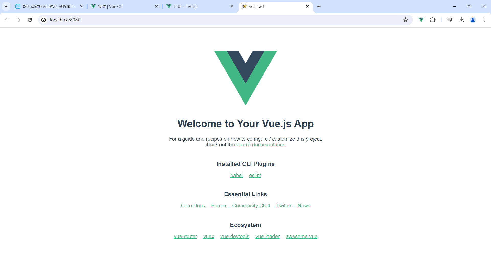
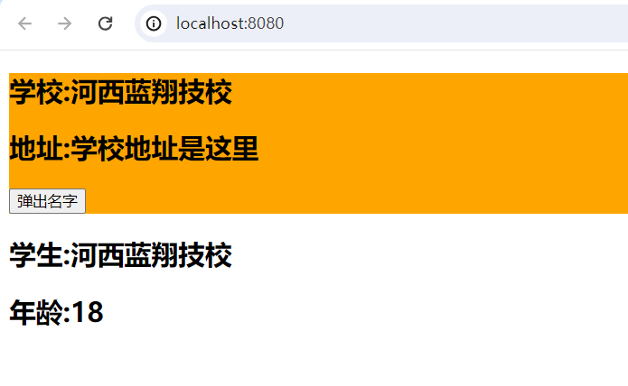

# Vue的组件（Component）

------

> 组件系统是 Vue 的另一个重要概念，因为它是一种抽象，允许我们使用小型、独立和通常可复用的**组件**构建大型应用。仔细想想，几乎任意类型的应用界面都可以抽象为一个组件树：
>
> 
>
> 组件就是：**实现应用中局部功能代码和资源的集合**。在Vue中，一个组件本质上是一个拥有预定义选项的一个Vue实例。使用组件：

- ## 非单文件组件

  > 一个HTML文件中，定义了多个Vue的组件，这就属于**非单文件组件**。用法：

  1. 定义组件：在JS中通过`Vue.extend({})`可以定义一个Vue的组件并返回，参数中的配置对象类似vm中的。注意：

     > - 组件定义时，不能出现`el`配置项。因为最终所有的组件都要被vm对象所管理，由vm来决定服务于哪个Vue模版（容器）。
     >
     > - `data`只能用函数式写法。因为对象式写法多个组件实例会共用这个data对象，数据不独立；而函数式写法会返回一个新的data对象，多个组件实例用的data互不影响。
     >
     > - 组件中通过`template`配置项来配置组件的模版（**组件模版**）：
     >
     >   ```js
     >   const school = Vue.extend({
     >   	template: `
     >   		<div>
     >               <h2>学校:{{name}}</h2>
     >               <h2>地址:{{address}}</h2>
     >   		</div>
     >   	`,
     >       data(){
     >           return {
     >   			name: '河西蓝翔技校',
     >   			address: '学校地址是这里'
     >   		}
     >       },
     >       methods: {
     >           showName(){
     >               alert(this.name)
     >           }
     >       }
     >   })
     >   ```
  
  2. （局部）注册组件：在使用组件的vm对象中，添加一个全新的配置项`components: { school: school, 组件名: 组件,...}`
  
     > 这种方式属于局部注册，用的较多，但是如果其他vm对象想用必须也得配置components去进行局部注册。此时可以用**全局注册**，这样其他所有vm对象接管的Vue容器中都可以编写该组件对应的组件标签了：`Vue.component('组件名', 组件)`
  
  3. 使用组件：在vm对象接管的Vue容器中编写**组件标签**，该标签会被Vue解析并替换为组件中的定义好的**组件模版**。
  
     ```html
     <div id="root">
     	<school></school>
     </div>
     ```
  
  ##### 注意事项：
  
  > - **组件名的规范**：
  >   - 组件名是一个单词（注意别和HTML标签名同名）时：**全小写**或**首字母大写**。
  >   - 组件名是多个单词时：**全小写**中间用`-`隔开，或采用**大驼峰方式（需要Vue脚手架环境支持）**
  > - 组件标签也可以使用单标签，但是**需要Vue脚手架环境的支持**。
  > - 组件定义时可以使用`name: 'abc'`配置项，指定组件在开发者工具中呈现的名字。（只是在Vue工具中显示，其他地方没变）
  > - **定义组件可以简写**：`const school = Vue.extend({})`简写为`const school = {}`，注册组件的时候会自动调用该对象的`Vue.extend({})`
  > - 组件也可以嵌套，在组件中注册其他组件，编写`components`配置项就可以了（注意组件的定义顺序）。通常会有一个管理所有组件的根组件，叫app组件。
  
  ##### 关于`VueComponent`：
  
  > 1. 通过`Vue.extend({})`定义的school组件，本质上是一个名为`VueComponent`的构造函数。该构造函数不是程序员定义的，而是由`Vue.extend()`生成的。**注意**：每次调用`Vue.extend({})`定义一个组件时，返回的都是一个**全新的**`VueComponent`的构造器。
  > 2. 我们只需要写`<school></school>`标签，Vue解析模板时会帮我们创建school组件的**组件实例对象（vc）**，即Vue帮我们执行的：`new VueComponent({配置对象})`
  > 4. 关于组件配置中的`this`：
  >    - 在`new Vue({})`的配置项中，data函数、methods中的函数、watch中的函数、computed中的函数，它们的this都是vm对象。
  >    - 而在`Vue.extend({})`定义组件的配置中，data函数、methods中的函数、watch中的函数、computed中的函数，它们的this都是`VueComponent`构造的**组件实例对象**（小型的vm对象vc）。
  > 5. vm对象上的`$children`是一个`VueComponent`类型（组件实例对象）的数组，保存了在该vm实例上注册的所有组件实例vc。
  
  ##### 一个重要的关系：
  
  > `VueComponent.prototype.__proto__ === Vue.prototype`，即：`VueComponent`是`Vue`的子类。
  
- ## 单文件组件（常用）

  > 每个组件分别定义在了一个`.vue`文件中（必须），这就属于单文件组件。使用：
  
  ##### 首先要知道：
  
  > 这种`.vue`文件浏览器是不能识别的，也就是不能直接在浏览器环境中运行。我们需要将这个`.vue`文件经过webpack工具处理成`.js`文件，才可以引入到HTML中使用：
  >
  > - 我们可以选择手动用**webpack**搭建工作流对`.vue`文件进行处理，但这种方式麻烦，且处理的结果（工作流）不一定是最好的。
  > - 通常我们会选择使用**Vue官方提供的脚手架**。就是Vue团队通过webpack给打造完的工作流，直接用就行。
  
  ##### 单文件组件的使用：
  
  1. 先新建一个`.vue`文件（**定义组件**），该文件的名字同样遵循上面的组件名规范，一般用大写的方式：
  
     > `School.vue`：（VS Code安装插件：Vetur，作者Pine Wu）
  
     ```vue
     <template>
     	<!-- 组件的结构，也就是HTML。这里写的template标签就相当于写在了template配置项中 -->
         <div class="demo">
         	<h2>学校:{{name}}</h2>
         	<h2>地址:{{address}}</h2>
             <button @click="showName()">弹出名字</button>
         </div>
     </template>
     <script>
     	//组件的交互（JS脚本）。注意最后一定要暴露一下该组件，因为vue文件最终会翻译为js文件，不暴露其他JS中没法引入该组件
         export default {//这里省略Vue.extend()，用简写的形式，否则还需要导入Vue文件
             name: 'School',//这里最好和文件名保持一致
             data(){
                 return {
                     name: '河西蓝翔技校',
                     address: '学校地址是这里'
                 }
             },
             methods: {
                 showName(){
                     alert(this.name)
                 }
             }
         }
     </script>
     <style scoped>/* style标签中的是该组件的样式，最终这些都会被JS代码动态添加到HTML的style标签中 */
     	/* 组件的样式CSS，如果不加scoped，那么多个组件整合时，最终样式会混合在一起，本组件的样式可能会污染其他组件 */
         /* App组件中不要加scoped */
         .demo {
             background-color: orange;
         }/* scoped底层就是给该组件模板最外层的div上加一个唯一的属性，然后通过属性选择器和CSS选择器配合完成只给该组件加样式 */
     /* 另外还有lang属性，值可以是css、less、stylus，表示里面用是less写的样式。但是需要Vue脚手架项目中局部安装less-loader */
     </style>
     ```
  
     > - 之前说过，一个Vue组件中包含了HTML、CSS、JS，也就分别对应了单文件组件中的3个标签`<template>`、`<style>`、`<script>`，最终这个`.vue`文件还是会被翻译为一个`.js`文件。
     > - 最后一定要将该配置对象进行暴露。因为最终所有的`.vue`文件都会编译为JS文件，其他JS文件中要用到这个配置对象。
  
     > 再写一个App组件，它管理其他所有的组件，是根组件。`App.vue`：
     >
     > ```vue
     > <template>
     >        <div id="app">
     >        	<!-- 使用组件 -->
     >        	<School/>
     >        </div>
     > </template>
     > <script>
     >    //引入其他文件中的子组件
     >    import School from './School.vue'
     > export default {
     >         name: 'App',
     >         //注册组件
     >         components: { School }
     >     }
     >    </script>
     > <style></style>
     > ```
     
  2. `main.js`入口文件中，将根组件App注册到vm对象上，让Vue实例对象管理起来App组件：
  
     ```js
     import App from './App.vue'
     new Vue({
         el: '#root',
         template: `<App></App>`,
         components: { App }
     })
     ```
     
  3. `index.html`中引入该`main.js`入口文件即可：
  
     ```html
     <!DOCTYPE html>
     <html lang="en">
     <head>
         <meta charset="UTF-8">
         <meta name="viewport" content="width=device-width, initial-scale=1.0">
         <title>主页</title>
         <!-- 引入vue -->
         <script src="./js/vue.js"></script>
     </head>
     <body>
         <div id="root"></div>
         <!-- 引入入口文件main.js，注意顺序 -->
         <script src="./main.js"></script>
     </body>
     </html>
     ```
  

------

# 使用Vue脚手架

> 上面单文件组件如果不用Vue脚手架进行编译的话，是无法直接运行的。因为vue文件还没被编译为JS文件。

- ### 初始化Vue脚手架

  > Vue脚手架（Vue CLI）全称是：Vue命令行接口（Vue Command Line Interface）工具，是Vue官方提供的标准化开发工具（开发平台）。简单来说，Vue脚手架就是一个基于Vue框架进行快速开发的完整系统。它包括一个图形化的项目管理界面和一套完整的脚手架工具，帮助开发者快速搭建Vue项目。脚手架工具目前的最新版本是4.X（一般用最新的），地址https://cli.vuejs.org/zh/

  1. （仅第一次使用）通过npm工具，**全局安装Vue脚手架工具**：`npm i -g @vue/cli`，然后命令行执行`vue`来查看是否安装成功。

  2. 在你要创建项目的目录下，**使用Vue脚手架的命令创建Vue项目**：`vue create vue_test`，然后选择Vue2版本。（创建的项目其实就是创建脚手架环境，只是其中给你准备了一个HelloWorld的项目（该npm项目会初始化为一个本地git仓库））

  3. 接下来cd切换到项目目录下，执行`npm run serve`，它就开始编译运行内置的HelloWorld项目的代码了，并且会启动这个项目对应的服务（修改源码自动重启服务）。在浏览器中输入url即可完成对HelloWorld项目的访问了：

     

- ### 脚手架相关文件的相关说明

  - `package.json`：通过查看其中的`scripts`配置项，我们知道刚才执行的`npm run serve`其实是执行了`vue-cli-service serve`，该命令会部署项目文件并启动一个服务器。`vue-cli-service build`是所有代码写完后，将前端工程化的源代码`.vue`文件，编译为JS文件，并且将组件中`<template>`标签里的**Vue模版**进行了编译。`lint`中是通过`eslint`工具进行语法检查（很少用）。

    ```json
    "scripts": {
    	"serve": "vue-cli-service serve",
    	"build": "vue-cli-service build",
    	"lint": "vue-cli-service lint"
    },
    ```

  - src目录中：

    - `main.js`：该文件是整个Vue项目的入口文件。当执行了`npm run serve`后，直接去运行的该文件。

      ```js
      //引入本地node_modules中vue的js文件包
      import Vue from 'vue'
      //导入App根组件，所有组件的父组件
      import App from './App.vue'
      //关闭vue的开发提示
      Vue.config.productionTip = false
      //创建vue实例
      new Vue({
          //这行代码一会再细说，是它将App组件放入了HTML文件里id为app的容器中
          render: h => h(App),
      }).$mount('#app')//这里也可以用el的方式
      ```
  
    - `App.vue`：
  
      ```vue
      <template>
          <div id="app">
          	
          	<School></School>
          </div>
      </template>
      <script>
          //导入其他子组件
          import School from './components/School.vue'
          export default {
              name: 'App',
              //注册其他子组件
              components: { School }
          }
      </script>
      <style></style>
      ```
      
    - assets目录：该目录中存放前端开发环境下的（需要被打包的）静态资源文件。（打包前用的静态资源）
    
    - components目录：里面存放（App组件所管理的）所有的子组件`.vue`文件。
    
  - public目录中：（存放不需要打包的静态资源）
  
    - `favicon.ico`：网页的图标
    - `index.html`：网站首页，里面没有引入任何文件，只有一个`<div id="app"></div>`（以后我们开发的都是单页面应用）
  
  ###### 将之前我们写的单文件组件代码，放入该脚手架环境中：
  
  > 用我们的`App.vue`替换掉脚手架中的，将`Student.vue`放在components目录中即可。
  
  ###### 可能我们会有一些疑问：
  
  > 1. 凭什么main.js是入口文件？
  >
  >    答：这是在Vue的脚手架中配置好了的。
  >
  > 2. main.js都没有在index.html中进行引入，vm中也没有通过template和components注册和使用App组件标签，为什么就可以找到HTML中的容器并将组件放进去呢？
  >
  >    答：是这行代码做的：`render: h => h(App)`
  >
  
  ###### 接下来命令行执行：`npm run serve`，浏览器中输入url访问成功：
  
  

------

- ### 关于vm中的render配置项

  > 我们如果将render配置项去掉，还用原来的方式：将App组件注册，然后通过template使用`<App/>`组件。运行会报错：你正使用的运行时Vue的模版解析器不可用（所以template配置项不能用），要么将需要预编译的模版交给`render()`函数，要么用完整版的Vue。
  
  ###### 为什么会这样？
  
  > 因为我们脚手架环境中引入的Vue不包含模版解析器（占完整版的30%），不能用template配置项，只有Vue的核心功能。只能通过`render()`函数来将`.vue`文件中的模版渲染HTML中。
  
  ###### 关于`render()`函数：
  
  > - 该函数会在运行`main.js`时被自动调用。该函数有一个函数参数（通常用`createElement`），该函数的返回值是虚拟DOM对象。Vue会用`render()`函数返回的虚拟DOM去渲染页面，替换掉el配置的容器。用法：
  >
  >   ```js
  >   render: function(createElement){
  >   	return createElement('h1','hello')
  >   }
  >   ```
  >
  > - 由于`render()`函数中没用`this`，所以可以用箭头函数的写法：`render: h => h(App)`
  
  ###### 为什么要这么麻烦呢？
  
  > 因为Vue源码中包含了2部分：Vue的核心功能 + 模版解析器（占30%）。其中模版解析器只是刚开始调用一次解析下template中的模版，后面就不再用了。而脚手架环境下已经帮我们将`.vue`文件中的Vue模版做了解析，`main.js`中没必要写Vue模版相关的代码了，所以去掉这个用不到的模版解析器是一个更好的做法，直接通过`render()`将App组件渲染到页面上el指定的位置。
  
  ###### Vue的两个部分：核心程序 + **模版解析器**
  
  > 1. 模板解析器（Template Compiler）：模板解析器是Vue的核心功能之一，它负责将Vue组件中的（template中的）模板代码解析成虚拟DOM。模板解析器会解析Vue组件模板中的指令、插值表达式、事件绑定等语法，将其转换为虚拟DOM树。最终，模板解析器会生成一个渲染函数，用于将虚拟DOM渲染为真实的DOM元素。模板解析器的工作是将模板代码转换为可执行的渲染函数。 
  > 2. 渲染函数（Render Function）：渲染函数是一个JS函数，用于描述Vue组件的渲染逻辑。通过手动编写渲染函数，您可以更灵活地控制组件的渲染过程。渲染函数接收一个h函数（createElement函数）作为参数，通过调用h函数来创建虚拟DOM节点。在渲染函数中，您可以使用JavaScript的逻辑控制、循环等语法来动态生成虚拟DOM节点。渲染函数的灵活性更高，但编写起来相对复杂。
  >
  > 模板解析器是将模板代码转换为渲染函数的工具，而渲染函数则是手动编写的描述组件渲染逻辑的函数。

------

- ### 在`vue.config.js`中配置Vue脚手架（与`package.json`同级）

  > 该文件用于配置Vue脚手架相关的东西，具体配置可以查看Vue脚手架官网。如：配置对象中写`lintOnSave: false`表示关闭语法检查

------

- ### Vue中操作DOM

  > - 有时也要在Vue中操作DOM，这时我们可以给标签加`ref`属性，指定DOM节点的唯一标识（类似id）。
  > - 获取该DOM元素用Vue实例（或组件实例对象）上的`$refs`属性，该属性是一个对象，对象的属性名是ref标识名，值是该DOM对象。
  > - 这种方式和原始JS的`document.getElementById()`的区别是：如果`ref`加在了组件标签上，那么`$refs`获取的是vc组件实例对象。（原始JS获取的是组件对应的DOM元素）

- ### 组件中的props配置项

  > - 组件中的props配置项，可以让组件接收外部传过来的数据（属性或函数），不局限于使用组件中在data或methods里写死的数据。
  > - 当组件模版中用到一些数据，data中没有配置，这些数据是使用组件标签的地方传进来的，传进来的数据要用`props`配置项接收。
  > - props中的数据是只读的，不能通过vc去改。（不过Vue监视的是浅层次的修改，深层次的修改虽然不会报错，但不建议这样做）
  > - 相较于data，props里接收的数据优先被放在vc上。并且props中的数据也是响应式的。
  > - 如果props传过来的数据在data或methods中已经定义了，重名了会报错。
  
  ###### 使用组件的地方，传数据：`<School name="李四" age="13"/>`，一般用`:age="13"`来传数据，这样表达式传的是Number型动态数据
  
  ###### 组件中通过props配置项来接收数据：
  
  ```html
  <script>
      export default {
          name: 'School',
          //组件自己的数据
          data(){
              return {
                  name: '河西蓝翔技校',
                  address: '学校地址是这里'
              }
          },
          //方式1(用的最多)
          props: ['name','age']
          //方式2，接收时对类型进行限制
          props: {
          	name: String,
          	age: Number
      	}
          //方式3
      	props: {
              name: {
                  type: String,
                  required: true
              },
              age: {
                  type: Number,
                  default: 0
              }
          }
      }
  </script>
  ```

------

- ### Mixin混入

  > - `mixin`配置项可以将data、methods、computed等多个地方共用的配置，提取成一个配置对象，这样这些配置项就可以在多个vc、vm上进行使用。
  >
  > - 用法：
  >
  >   > 将公共的配置项提取成一个配置对象放在单独的JS文件中并进行暴露：`export default { data(){}, methods:{} }`，这样其他组件或Vue实例中就可以导入该JS文件中的配置对象，通过配置项`mixins: [obj]`进行局部混入即可（值是对象数组），最终混入的对象中的这些配置项，会和已有的配置项进行整合。
  >
  > - 如果配置冲突了，以本文件中的配置为主。（但如果是生命周期函数配置项，则都会执行，且先执行混合中的）
  >
  > - **全局混入**：在main.js入口文件中通过Vue构造函数进行混入`Vue.mixin(对象)`，相当于在所有的vm、vc上都加了该配置。

------

- ### 插件

  > Vue中的插件本质上是一个对象，该对象中必须包含`install()`方法。通过插件可以对Vue的功能进行增强。

  ###### 在plugins.js中，定义插件：

  ```js
  export default {
      install(Vue,x,y,z){//参数1是Vue构造函数，后面是自定义参数。有了Vue构造函数，可以做很多事情，定义全局的过滤器、指令、混入等..
          console.log("插件执行了！", Vue)
      }
  }
  ```

  ###### main.js中，使用插件：

  ```js
  import plugins from "./plugins.js"
  //使用插件
  Vue.use(plugins,1,2,3)
  ```

------

- ### 自定义事件

  > - 自定义事件是一种组件间通信的方式，适用于**子组件给父组件**传递数据。（目前还无法做到兄弟组件之间传递数据）
  > - **自定义事件是给组件用的**。如：`<Student @atguigu='demo'/>`，表示给该组件实例对象vc上绑定了一个自定义事件atguigu，当事件触发时调用demo函数。给谁绑定的事件，就找谁去触发该事件。所以触发上面的事件就得通过它的`vc.$emit('atguigu')`
  > - 触发事件时还可以传递数据：`vc.$emit('atguigu',a,b,c...)`，此时需要在demo函数定义时，给该函数声明实参进行接收。
  > - 还有一种绑定自定义事件的方式，通过`vc.$on('atguigu', demo)`在代码中给vc实例对象绑定自定义事件。这种方式更灵活。如果是匿名函数的话最好用箭头函数，这样函数中的this仍然是上下文的vc对象：`vc.$on('atguigu',()=>{})`
  > - 事件只触发一次：`<Student @atguigu.once='demo'/>`或`vc.$once('atguigu', demo)`
  > - 解绑事件：`vc.off('atguigu')`，解绑多个：`vc.off(['atguigu','other'])`，解绑所有：`vc.off()`
  > - 组件上也可以用原生的JS事件，需要给事件加`native`修饰符，这样Vue才不会将其当做自定义事件，而是将该事件绑定到组件最外层的HTML容器上。
  > - `$emit()、$on()、$off()`这些API其实是Vue原型上的，所以其实也可以给vm对象绑定自定义事件。

- ### 全局事件总线（Global Event Bus）

  > 全局事件总线可以实现**任意组件之间的通信**。
  
  ###### 原理是这样的：
  
  > - 首先找一个对象x（vm或vc实例），当A组件要给B组件传数据时，由B组件先在对象x上绑定一个自定义事件，事件的回调函数写在B组件中。由A组件写代码触发该事件并传数据过去。这样数据就会在B的回调中，以参数的形式保存。以此完成组件之间的通信。
  >
  > - 该对象x需要满足以下条件：
  >
  >   1. 所有组件都能看到对象x
  >   2. 对象x既然能够绑定事件，所以x必须能够调用`$on()`。也就是说对象x必须是一个vm或vc对象（因为该API在Vue原型上）。
  >
  > - 要满足以上2个条件的话，将vm对象放在Vue原型上即可。放的时候注意时机：
  >
  >   ```js
  >   new Vue({
  >   	el: '#app',
  >   	render: h => h(App),
  >   	//安装全局事件总线，$bus就是当前的vm实例
  >   	beforeCreate(){
  >   		Vue.prototype.$bus = this
  >   	}
  >   })
  >   ```
  >
  > - 这样所有的组件都能给vm对象绑定自定义事件，然后在另一个组件中触发事件并携带数据即可。如：
  >
  >   > B组件中给`$bus`绑定事件：（该B组件销毁之前，一定要将绑定的事件解绑，否则这个名字以后其他组件都用不了了）
  >
  >   ```js
  >   mounted(){
  >       this.$bus.$on('hello', (data)=>{
  >           console.log(data)
  >       })
  >   }
  >   beforeDestroy(){
  >       //该B组件销毁之前，一定要将绑定的事件解绑，否则这个名字以后其他组件都用不了了
  >       this.$bus.$off('hello')
  >   }
  >   ```
  >
  >   > A组件给B传数据，触发`$bus`上B组件绑定的`hello`事件：
  >
  >   ```js
  >   methods: {
  >       sendData(){
  >           this.$bus.$emit('hello',666)
  >       }
  >   }
  >   ```

- ### 消息订阅与发布（了解）

  > 消息订阅与发布技术，同样可以实现任意组件间的通信。

  > - 假如组件A要给组件B发消息，那么B就需要先订阅消息，指定消息名；然后组件A根据消息名，发布消息内容（数据）给B。
  > - 原生的JS没有提供消息订阅与发布相关的库，所以我们这里用第三方的`pubsub-js`（subscribe订阅，publish发布）。使用：

  1. 订阅消息：

     ```js
     //导包，pubsub是一个对象
     import pubsub from 'pubsub-js'
     //组件挂载完毕后，就订阅一个消息
     mounted(){
         //每次订阅消息都会返回一个订阅id，通过该id来取消消息订阅
         this.pubId = pubsub.subscribe('消息名',(msgName,data)=>{//用箭头函数的写法this才是vc
             //发布消息后执行的回调函数
             console.log(`消息名:${msgName},消息数据:${data}`)
         })
     }
     beforeDestroy(){
         //该组件销毁之前，取消消息的订阅
         pubsub.unsubscribe(this.pubId)
     }
     ```

  2. 发布消息：

     ```js
     import pubsub from 'pubsub-js'
     methods: {
         sendData(){
             //发布消息，携带数据
             pubsub.publish('消息名',666)
         }
     }
     ```

- ### $nextTick(callback)

  > 作用：下一次更新DOM后再执行该回调函数。
  >
  > 什么时候用：当数据改变后，要基于更新后的DOM进行的某些操作，就可以放在该回调中，待DOM更新后再执行。

------

