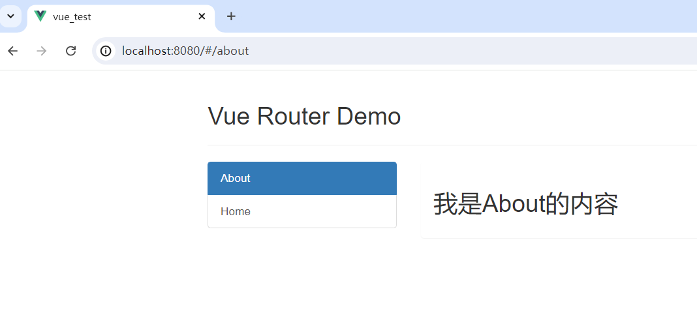
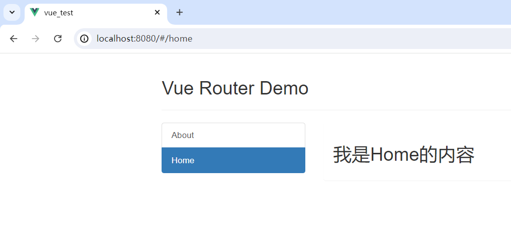

# Vuex

------

> Vuex是Vue团队打造的一个，用于Vue应用程序开发的**状态管理模式（插件）**。它可以在Vue中实现**集中式状态（数据）管理**，以相应的规则保证状态以一种可预测的方式发生变化，可以对Vue中的多个组件的共享状态进行集中式的管理（读/写）。并且Vuex的插件也集成到Vue的官方调试工具DevTools中了，提供了诸如零配置的 time-travel 调试、状态快照导入导出等高级调试功能。https://github.com/vuejs/vuex

###### 什么时候使用Vuex？

> 1. 多个组件依赖同一状态。
> 2. 多个组件要变更同一状态。
>
> 此时这个状态（数据）就应该放在Vuex中。

###### Vuex的工作原理图：


###### Vuex的工作原理：

> - Vuex包含3个重要的部分：（本质上就是被**store对象**所管理的3个普通的对象）
>
>   - **Actions**：行为。里面放我们写好的一些函数，这些函数中一般都包含了很多业务逻辑。处理完业务逻辑之后再通过Mutations完成对State中数据的修改/访问。
>   - **Mutations**：转变。里面放我们写好的一些（直接操作State中数据的）函数，这些函数中没有业务逻辑。最终是由它来操作State中的状态的。
>   - **State**：状态。在这里集中保存所有的状态数据。里面的数据类似data中，会自动做代理，当数据变化后Vue会去重新渲染页面。
> - 所有的Vue组件都可以通过**store对象**的`dispatch()`方法来调用`Actions`中的函数。Actions中需要我们提前写好对应的函数，通过该函数去操作State中的状态。Actions中还包含了一些业务逻辑，操作State前处理完后会继续通过**store对象**的`commit()`方法，去调用`Mutations`中的函数真正完成对State数据的修改/访问。Mutations中只对State进行修改/访问，不包含任何其他的逻辑。最终`State`中的状态（数据）发生变化后，Vue会重新渲染页面（Vue也对State里的数据做了**数据劫持**）。
> - Actions中的函数也可以在处理完逻辑后，不进行commit()而是继续dispatch()调用`Actions`中的其他处理逻辑的函数。
> - Vue组件也可以直接通过**store对象**的`commit()`方法去调用`Mutations`中的函数完成对State的操作，如果访问`State`前不需要做业务处理的话。即跳过`Actions`直接操作`State`中的数据。
> - 其实在`Actions`中不通过Mutations也可以直接操作State中的状态，不过最好按照上面约定的流程来写代码，就像后端遵循3层架构一样。
> 

> 以上Vuex的3个组成部分都需要**以配置项的形式**交给**store对象**去管理，因为两个核心的API（`dispatch()`和`commit()`）都是store对象中的。当我们调了对应的API后，Vuex会根据传入的`Actions`和`Mutations`配置项，去里面找我们写好的函数并调用。

###### 搭建Vuex的工作环境：（要使用Vuex，首先我们必须让所有的vm、vc实例都能拿到Vuex中的核心对象store，进而再通过store去使用Vuex）

1. 安装`vuex`插件：`npm i vuex@3`，（Vue3对应Vuex的4版本，而Vue2要用Vuex的3版本，否则会报错）

2. src下新建文件`vuex/store.js`或`store/index.js`（官方推荐后者），文件中这样写：（该文件用于创建Vuex中最核心的对象`store`）

   ```js
   import Vue from 'vue'
   import Vuex from 'vuex'
   // 使用vuex插件。这样之后创建vue实例时就可以用store配置项了。store配置项的值是store对象，它是整个Vuex的工作环境
   Vue.use(Vuex) // 必须在创建store实例之前执行这行代码
   
   // 准备actions对象，里面的函数用于响应组件中的动作
   const actions = {
       // 一般actions里的函数名是小驼峰格式
       jia(context,value){ // context是一个小型的store对象，value是调用dispatch时传的实参
         	/* commit前先处理业务逻辑... */
           context.commit('JIA',value)
       }
   }
   // 准备mutations对象，里面的函数用于操作state中的状态
   const mutations = {
       // 执行JIA。一般mutations里的函数名全大写
       JIA(state,value){ // value是调用commit传的数据
           state.num += value
       }
   }
   // 准备state对象，用于集中式地存储状态
   const state = { num:0 }
   
   // 创建并暴露store对象，将3个配置项传进去
   export default new Vuex.Store({
       actions,mutations,state
   })
   ```

3. 创建vm实例时使用了`store`配置项后，所有的vm和vc上就都有了一个`$store`，通过它可以访问到**store对象**。

   > main.js：

   ```js
   import Vue from 'vue'
   import App from './App.vue'
   // 引入store对象
   import store from './store'
   
   Vue.config.productionTip = false
   
   new Vue({
       el: '#app',
       render: h => h(App),
       // 添加store配置项，此时所有的vm和vc上就都有了$store可以获取store对象了
       store
   })
   ```
   
   > 此时就可以调用store对象上的API来使用Vuex了：
   >
   > - 组件中读取Vuex中的状态：`vc.$store.state.数据`
   > - 组件中修改Vuex中的状态：`vc.$store.dispatch('jia', 数据)`或直接`vc.$store.commit('JIA', 数据)`

- #### Store中的getters配置项：

  > 类似于state对象，getters也是一个对象，但对象中是方法不是属性。当state中的数据需要经过加工后再使用时，可以使用getters配置项进行加工。getters和state的关系就像computed和data的关系。使用：

  1. 在`./store/index.js`中定义并追加`getters`配置项：

     ```js
     const getters = {
         bigNum(state){
             return state.num * 10
         }
     }
     // 创建并暴露store对象
     export default new Vuex.Store({
         actions,mutations,state,
         // 追加getters配置项
         getters
     })
     ```

  2. 组件中读取经过加工的`getters`中的数据：`vc.$store.getters.bigNum`

- #### mapState与mapGetters

  > 我们发现，如果要在Vue模版中使用`state`和`getters`中的数据，需要`{{$store.state.数据}}`来拿很麻烦，此时可以用计算属性：
  >
  > ```js
  > computed: {
  >        计算属性名(){
  >    		return this.$store.state.数据
  >        },
  >        ...
  > }
  > ```
  >
  > 但是写一堆计算属性也很麻烦，此时可以通过Vuex中提供的`mapState`与`mapGetters`函数，来帮我们**自动生成计算属性函数**，只需要告诉它计算属性名和`state/getters`中的数据名即可。

  ###### 使用：

  ```js
  import { mapState, mapGetters } from 'vuex'
  export default {
      name: 'Count',
      computed: {
          // 写法1：对象写法。mapState()函数返回一个对象，对象中是所有生成的计算属性函数
          ...mapState({计算属性名:"数据名",...}),
          // 写法2：数组写法。当计算属性名和数据名保持一致时使用
          ...mapGetters(['数据名1','数据名2',...]),
      },
  }
  ```
- #### mapActions与mapMutations

  > 如果我们写的函数中，只包含这行代码：`this.$store.dispatch/commit('函数名', 数据)`，那么这个函数也可以让Vuex自动生成，通过`mapActions`和`mapMutations`。

  ###### 使用：

  ```js
  import { mapState, mapGetters, mapActions, mapMutations } from 'vuex'
  export default {
      name: 'Count',
      methods: {
          // 写法1：对象写法
          ...mapActions({methods中的函数名:"Actions中的函数名",...}),
          // 写法2：数组写法。当methods中的函数名和Mutations中的函数名保持一致时使用
          ...mapMutations(['函数名1','函数名2',...]),
      },
  }
  ```

  > 最终生成的methods中的函数是这样的：（注意：dispatch()中的实参需要在调用该函数时，以函数实参的的方式将数据传递过去：`函数名(数据)`）
  >
  > ```js
  > methods: {
  >        函数名(value){
  >    		this.$store.dispatch/commit('Acions/Mutations中的函数名', value)
  >        },
  > }
  > ```

- #### Vuex的模块化

  > 随着组件越来越多，Actions、Mutations、State、Getters中保存的数据和函数也会越来越多，此时我们想找为某些组件服务的数据和函数就很困难。能不能用模块化的思想，将Actions、Mutations、State、Getters中的数据和函数，根据功能类别再分成不同模块（对象），访问时通过`state.模块名.数据`的方式访问呢？可以，这就是Vuex的模块化。使用：

  1. 在外部单独定义两个配置对象：（可以分别放在store/下的不同JS文件中）

     > countOptions.js：
     >
     > ```js
     > export default {
     >        namespaced: true, // 加上这行代码后，mapState才能通过第1个参数去指定的模块中找数据
     >        actions: {},
     >        mutations: {},
     >        state: {},
     >        getters: {}
     > }
     > ```
     >
     > personOptions.js：
     >
     > ```js
     > export default {
     >        namespaced: true,
     >        actions: {},
     >        mutations: {},
     >        state: {},
     >        getters: {}
     > }
     > ```
  
  2. store对象的配置中这样写：

     ```js
     import countOptions from './store/countOptions.js'
     import personOptions from './store/personOptions.js'
     export default new Vuex.Store({
     	modules: {a:countOptions,模块名:personOptions,..}
     })
     ```
  
     > - 这样store对象中的Actions、Mutations、State、Getters就开始分模块了。以后得这样写：
     >
     >   - 访问state：`$store.state.模块名.数据`
     >   - 访问getters：`$store.getters['模块名/数据']`
     >   - 修改：`$store.dispatch/commit('模块名/函数名', 数据)`
     >
     > - mapState方式这样写：
     >
     >   ```js
     >   computed: {
     >       // 第1个参数指定模块名。前提是countOptions对象的namespaced属性值设置为true
     >       ...mapState('a', {计算属性名:"数据名",...}),
     >       ...mapGetters('模块名', ['数据名1','数据名2',...]),
     >   },
     >   ```

------
# 路由（前端路由）

> **路由（Route）**就是一组K-V的对应关系。多个路由需要经过**路由器（Router）**的管理。

> - Vue中的路由是一个Vue的**插件库（vue-router）**，专门为了实现SPA（单页面）应用的。其中K为路径，V是组件。
> - SPA应用（Single Page web Application）的特点：
>   1. 整个应用只有**一个完整的页面**（1个html）。
>   2. 点击页面导航**不会刷新页面，只做局部的组件更换**。
>   3. 数据需要通过AJAX来获取。

###### 前端路由的原理是：当页面导航栏的路径发生变化后（没有发请求），就会被**vue-router**监测到，然后根据路径找对应的组件渲染到页面上。怎么做到的呢？

> - 实际上在React和Vue的路由底层，使用了HTML5的`History API`，这使得可以在不重新加载整个页面的情况下改变URL，并且能更新浏览器的历史记录。
>
>   > Hash模式的路由实现方式不是用的HTML5的`History API`，而是通过`#`号。锚点跳转也会留下历史记录，因此这种Hash模式的路由兼容性好。
>
> - `History API`包括以下几个主要的方法：
>   
>   - `pushState()`：可以向浏览器的历史栈中添加一个新的记录，同时改变当前的URL。
>   - `replaceState()`：类似于`pushState()`，但是它会替换当前的历史记录而不是添加新的记录。
>   - `onpopstate`事件：当用户使用浏览器的前进或后退按钮时触发。
>   
> - 如何工作：当我们在React或Vue应用中导航到一个新的路由时，前端框架会调用`pushState()`来更新URL，并将这个新的URL添加到浏览器的历史记录中。这样，即使URL改变了，也不会触发一个完整的页面刷新，而是由前端框架接管这个URL的变化，并根据这个变化渲染相应的组件。

###### 路由的配置：

1. 安装`vue-router`插件：`npm i vue-router@3`，（Vue3对应vue-router的最新版本4，而Vue2要用vue-router的3版本，否则会报错）

2. src下新建`router/index.js`，里面创建`VueRouter`（路由器）实例并配置路由规则：

   ```js
   // 该文件专门用于创建整个应用的路由器实例
   import VueRouter from "vue-router" // Vue3中：import {createRouter} from 'vue-router'
   
   import About from '../pages/About'
   import Home from '../pages/Home'
   
   // 创建一个路由器实例VueRouter并暴露出去
   export default new VueRouter({ // Vue3中：export default createRouter({})
     routes: [
       {
         path: '/about',
         component: About
       },
       {
         path: '/home',
         component: Home
       }
     ]
   })
   ```
   
   > 其中`routes`配置项的值是对象数组，用于配置多个路由规则。`path`指定路径，`component`是路径对应的**路由组件**。
   
   > **路由组件：**
   >
   > - 通常在routes中配置的组件称为路由组件，和普通组件不同的是，路由组件不需要我们自己写组件标签。且路由组件单独放在`pages/`或`views/`目录下。
   > - 配置好的路由组件实例vc身上会多两个API：`$route`是该路由组件的路由信息对象，`$router`是全局唯一的VueRouter实例（路由器）。
   > - Vue3中，这两个对象（$route/$router）需要调用vue-router的Hook来获取：`useRoute()`和`useRouter()`，返回值分别是路由信息对象和VueRouter实例（响应式的Proxy对象）。
   
3. 入口文件main.js中使用`vue-router`插件，这样vm实例中就可以写`router`配置项了，值是刚刚暴露的VueRouter实例：
   ```js
   import Vue from 'vue'
   import VueRouter from 'vue-router'
   import App from './App.vue'
   // 导入创建好的VueRouter路由器实例
   import router from './router'
   Vue.use(VueRouter)
   
   new Vue({
       el: '#app',
       render: h => h(App),
       // 使用插件后，就可以写router配置项来配置路由器了，值是VueRouter的实例
       router,
   })
   ```
   
   > Vue3中：
   >
   > ```js
   > import {createApp} from 'vue'
   > import App from './App.vue'
   > import router from './router'
   > 
   > const app = createApp(App)
   > app.use(router) // 使用路由器
   > app.mount('#app')
   > ```

###### 使用路由：

1. 找到导航链接所在的`<a>`标签，将其替换为`vue-router`已经给你准备好的`<router-link>`标签（其实就是写好的组件，**本质就是a标签**）。

   > - **注意：**原来a标签的href到了`<router-link>`标签上变成了`to`，to的值写上面`path`配好的路径。
   > - 如果导航链接不是a标签，此时就不能用`<router-link>`了，用后面的**编程式路由导航**。
   > - `<router-link>`标签还有`active-class`属性，用于指定路由导航对应的**组件被激活时**要加的类名。

2. 在要呈现和切换组件的位置加上`<router-view>`标签。

###### 此时点击对应的`<router-link>`标签就会在`<router-view>`所在位置挂载对应的路由组件。路由切换时导航栏路径也随之变化，但是并没有发送网络请求。（当路由组件切换时，默认是将原来的组件实例销毁掉）





------

- #### 多级路由：

  > 路由组件中还可以继续写`<router-link>`和`<router-view>`，这种路由组件的嵌套就形成了**多级路由**。

  ###### 使用：

  1. 路由中通过`children`配置项来配置多级路由：（**注意：子级路由path开头不要加斜杆`/`**）

     ```js
     import VueRouter from 'vue-router'
     import Home from '../pages/Home'
     import About from '../pages/About'
     import Message from '../pages/Message'
     import News from '../pages/News'
     
     export default new VueRouter({
       routes: [
         // 这里是一级路由
         {
           path: '/home',
           component: Home,
           children: [
             // 这里是二级路由。注意：子级路由path开头不要加斜杆/
             {
               path: 'message',
               component: Message
             },
             {
               path: 'news',
               component: News
             }
           ]
         },
         {
           path: '/about',
           component: About
         }
       ]
     })
     ```

  2. Home路由组件中编写路由标签：（**注意：to中要写完整路径**）

     ```html
     <div id="home">
       <h2>Home组件内容</h2>
       <div>
         <ul class="nav nav-tabs">
           <li>
             <!-- 其实to的值还可以是一个对象，下面再看 -->
             <router-link to="/home/news" active-class="active">News</router-link>
           </li>
           <li>
             <router-link to="/home/message" active-class="active">Message</router-link>
           </li>
         </ul>
         <router-view/>
       </div>
     </div>
     ```
     
  
- #### 给路由命名：

  > 如果是多级路由，那么得写很长的路径`to="/home/message/..."`去指定跳转到哪个路径。此时可以通过给路由命名（唯一）来**简化路由的跳转**。

  ###### 使用：通过给路由对象设置`name`属性来给每一条路由进行唯一命名（注意不要重复）

  ```js
  export default new VueRouter({
    routes: [
      {
        name: 'jia',
        path: '/home',
        component: Home
      },
      {
        name: 'guanyu',
        path: '/about',
        component: About
      }
    ]
  })
  ```

  > 此时就可以这样写：`<router-link :to="{name:'jia'}">Home</router-link>`，**指定路由名的方式to的值必须是对象**。

- #### 配置路由的元数据：

  > 其实每一个路由配置对象中都可以写`meta`**元数据配置项**，值是一个对象，用于在路由中存放自定义数据。

- #### 路由的重定向：

  > 可以在路由规则中配置重定向：`{ path:'/', redirect:'/home' }`。

- #### 给路由组件传递数据：

  > 由于路由组件不是直接写组件标签去使用，所以之前给普通组件传递数据的方式：props、自定义事件、事件回调等方式就都不能用了。
  >
  > 其实路由组件可以接收两种参数：**query参数**和**params参数**。

  - ###### 路由组件的query参数（查询字符串）：

    > - 查询字符串参数（query参数）就是，通过在to指定的路径末尾追加`?name=zc&age=18&..`的方式给路由组件传递数据。路由组件中这样接收：`vc.$route.query.Key`，其中query是查询字符串转成的对象。
    >
    > - 但是这种方式传递的数据是固定的字符串，如果想动态化可以这样做：
    >
    >   ```html
    >   <router-link :to="`/home/message?name=${p.name}&age=${p.age}`">Message</router-link>
    >   ```
    >
    > - 其实to的值还可以是一个对象：（推荐）
    >
    >   ```html
    >   <router-link :to="{
    >       path: '/home/message',
    >       query: {
    >         name: p.name,
    >         age: p.age
    >       }
    >     }">
    >     Message
    >   </router-link>
    >   ```

  - ###### 路由组件的params参数：（params参数不能传对象和数组数据）

    > - 所谓params参数就是路径参数（path传参），是Restful风格的参数。
    >
    > - 表面上看不出来哪个是路由哪个是数据，需要在path中指定占位符：`path:'/home/:name/:age?'`，其中?表示可传可不传。数据直接放在路由路径中：`to="/home/zs/18"`。取数据时通过：`vc.$route.params.占位符`，其中params是路径参数转成的对象。
    >
    > - 和query参数类似，传递动态数据还可以用对象，通过指定对象的`params`属性：（**注意：此时对象中只能用name不能用path**）
    >
    >   ```html
    >   <router-link :to="{
    >       // 这里只能通过name指定路由名的方式
    >       name: 'jia',
    >       params: {
    >         // 指定给name占位符传值p.name
    >         name: p.name,
    >         age: p.age
    >       }
    >     }">
    >     Message
    >   </router-link>
    >   ```

- #### 路由的props配置：

  > 路由的props配置项，可以把路由组件接收的query参数和params参数，通过**props的方式**传给组件去使用。使用props从路由组件中取数据更方便。

  ```js
  {
      name: 'guanyu',
      path: '/about',
      component: About,
      // props的第1种写法（推荐）：函数形式
      props($route){
          // 返回的对象中的所有K-V都会以props的形式传递给About组件。About组件配置props接收即可：props:['a','b']
          return {
  			a: $route.query.id,
  			b: $route.params.tittle
          }
      }
      // props的第2种写法：布尔形式。若为true则会把该路由组件收到的所有【params】参数以props的形式传给About组件
      // props: true
  }
  ```

  > props的值还可以是一个普通对象：`props: {}`，但是这种方式传递的是固定的数据，所以很少用了解即可。

- #### `<router-link>`的replace属性：

  > - 点击`<router-link>`写的路由导航时，由于是a标签所以每一次点击更改地址栏路径后，都会形成历史记录。历史记录栈会将当前路径url进行push压栈（默认），栈针默认指向栈顶。而点击前进、后退按钮其实就是在操作历史记录栈的栈针。
  > - 浏览器中有前进和后退按钮，这两个按钮都是依赖于浏览器的历史记录在工作的。浏览器的历史记录有2种写入模式，分别是：push和replace。push是追加历史记录，replace是替换当前记录。`<router-link>`路由导航跳转的时候默认为push。
  > - 对历史记录栈的操作其实还有另一种模式：替换（replace），它是用当前url对栈顶记录进行替换。开启替换模式：`<router-link replace>`

  ###### 所以`<router-link>`的replace属性的作用是：将路由跳转时操作浏览器历史记录的模式改为replace。

------

- #### 编程式路由导航：

  > - 编程式路由导航可以不借助`<router-link>`实现路由的跳转，让路由跳转更加灵活。
  > - 通过路由组件实例来拿到路由器，路由器`$router`上有`push({}/'')、replace({}/'')`方法。方法的参数类似于to的值，可以是对象或字符串。
  > - `$router`上还有几个常用的方法：`back()、forward()、go(n)`，用于操作历史记录栈针。

- #### 缓存路由组件：

  > 我们知道：默认路由的切换是先销毁原来的路由组件，再挂载新的路由组件实例。能不能切换路由时不要销毁原来的路由组件实例，而将其缓存起来呢？可以，用`<keep-alive>`标签将`<router-view>`标签包起来即可。而且通过给`<keep-alive>`标签设置`include='About'`属性可以指定只缓存其中某些组件，**值是组件名**（字符串或字符串数组）。

- #### 路由组件独有的2个生命周期钩子：

  - `actived(){}`：路由组件被激活时触发。
  - `deactived(){}`：路由组件失活时触发。

  > 只要注册的路由组件在页面上呈现（离开），这两个钩子就会执行，不论你是通过路由规则还是手动写组件标签。

- #### 路由守卫：

  > 路由守卫可以对路由进行权限控制，就是前端路由的拦截器，可以在路由跳转前后做一些事情。如：（在`router/index.js`中）
  >
  > ```js
  > const router = new VueRouter({
  > 	routes: [{},{}]
  > })
  > // 通过路由器实例的beforeEach()方法，来设置全局前置路由守卫
  > router.beforeEach((to,from,next)=>{...})
  > export default router
  > ```
  
  ###### 路由守卫分为：

  - **全局路由守卫**：全局路由守卫又分为全局前置路由守卫和全局后置路由守卫。

    - 全局前置路由守卫：`router.beforeEach((to,from,next)=>{})`，该回调函数在，**路由实例VueRouter初始化时**以及**每次切换路由之前**调用。其中to是切换前的路由信息对象，from是切换后的路由信息对象（`$route`），next是放行函数，不执行该函数则所有路由都不会调转。
    - 全局后置路由守卫：`router.afterEach((to,from)=>{})`，该回调函数在**路由实例VueRouter初始化时**以及每次**成功切换路由之后**调用。在路由组件成功切换后，也就是所有的路由守卫都没拦截、成功切换路由组件后，该回调函数会被调用。
  
  - **独享路由守卫/局部路由守卫**：`beforeEnter(to,from,next){}`，如果只想给某一个路由单独设置前置守卫，可以**给路由添加**`beforeEnter`配置项，值是一个函数。
  
  - **组件内路由守卫**：不同与前几种路由守卫，组件内路由守卫是组件实例配置项中的2个方法`beforeRouterEnter(to,from,next)`和`beforeRouterLeave(to,from,next)`，这俩个方法的调用时机是，**只有通过路由规则进入/离开该组件时才被调用**。（不同于路由组件的2个生命周期钩子，这两个方法只有通过路由规则切换路由组件时才会被调用）
  
    > 注意：组件内路由守卫的进入和离开方法中，都需要执行`next()`方法才会完成路由的切换。
  
- #### 路由器的2种工作模式：

  > 我们开启路由后，地址栏上的路径就发生了变化：http://localhost:8080/#/about，其中#号及后面的所有内容（`#/about`）就叫url路径里的**hash值**。哈希值最大的特点是，**它不会随着HTTP请求发送给服务器**。

  ###### 路由器有两种工作模式：（默认）**hash模式**和**history模式**，它俩底层工作原理不同：一个是基于H5的`History API`，另一个是通过`#`号实现的。
  
  > - 通过mode配置项去更改路由器的工作模式：
  >
  >   ```js
  >   export default new VueRouter({
  >       // 通过mode配置项，去更改路由器的工作模式为history，默认值hash
  >       mode: 'history',
  >   	routes: [{},{}]
  >   })
  >   ```
  >
  > - Vue3中这样配置路由的工作模式：（Vue3中最好显示指定路由的工作模式，否则会报错）
  >
  >   ```js
  >   import { createRouter, createWebHistory, createWebHashHistory } from 'vue-router'
  >   export default createRouter({
  >       // 使用 history 模式
  >       // history: createWebHistory(),
  >             
  >       // 或者用 hash 模式（默认）
  >       history: createWebHashHistory(),
  >       routes: [{},..]
  >   })
  >   ```
  
  > 此时浏览器路径就变的很正常了，没有哈希值了：http://localhost:8080/about，那么这两种模式的区别是什么呢？
  
  ###### 路由器两种工作模式，除了哈希模式兼容性略好、地址可能被第三方app识别为非法之外，最主要是项目上线后的区别：
  
  > - 当执行`npm run build`将开发完的Vue项目进行打包后，会在dist目录下生成最纯粹的HTML、CSS、JS文件（以及其他静态资源）。把这些静态资源部署在后端服务器上之后，我们的项目就可以运行了。
  >
  > - 如果此时路由器是history模式，那么注意了：通过点击路由导航虽然可以完成组件的切换、路径也随之变化，但此时都没有向后端发送网络请求。如果此时将地址栏url复制下来新开一个页签去访问，就会报404，因为这个url在服务器上根本没有对应的资源，只有一个index.html，端口号后面的都只是前端路由。如果此时路由器是hash模式，就没有这个问题。
  >
  > - 但并不是说如果项目要上线就只能用hash模式，history模式也可以。此时需要和后端人员进行沟通，让他将所有前端路由都配置下，访问时都返回index.html。
  >
  >
  > > 如果是Node服务器，除了手动配置之外，还可以通过第三方库`connect-history-api-fallback`去解决前端路由404的问题。

------

# Vue UI组件库

> - 所谓的UI组件库就是：将我们常用的元素、样式及交互，封装成各种组件供我们使用。只需要将组件拿过来即可使用。
> - UI组件库分为两大类：移动端和PC端。移动端常用的UI组件库：Vant、Cube UI、Mint UI..，PC端常用的UI组件库：Element UI、IView UI..
> - Vue中常用的组件库是Element UI。

------

