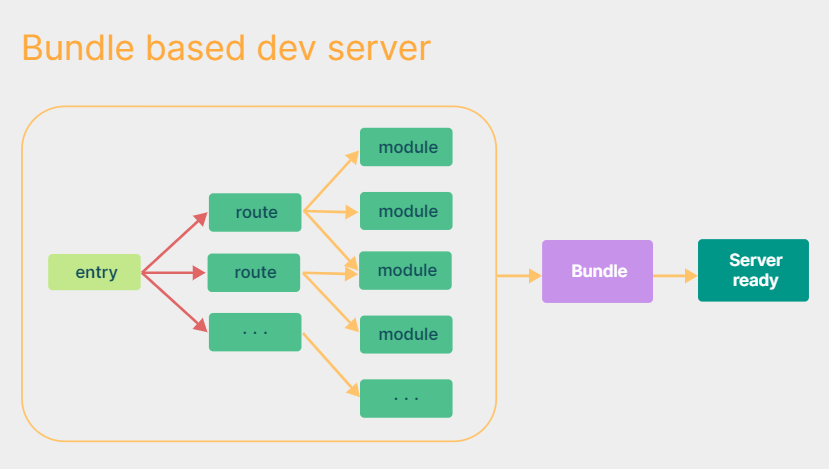
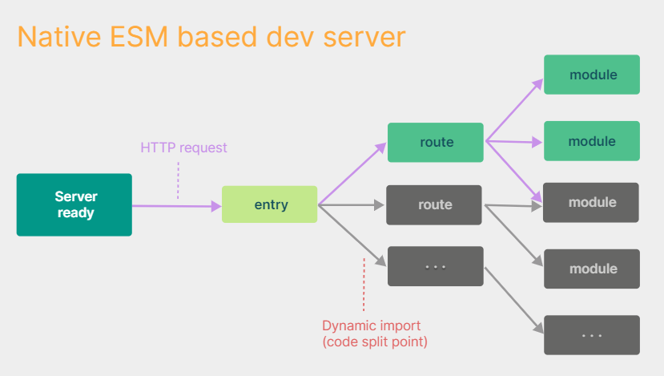

# Vue3

------

- ### Vue3简介

  > 2020年9月18日，Vue发布3.0版本，代号：One Piece（海贼王）。其中经历了：4800+次提交、40+个RFC、600+次PR、300+贡献者。

- ### Vue3相比于2的优势

  1. 性能的提升：

     - 代码打包后的体积减小41%。

     - 初次渲染快55%，更新渲染快133%。

     - 内存减少54%。

       ....

  2. 源码的升级：使用Proxy代替defineProperty实现响应式、重写虚拟DOM的实现和Tree-Shaking、...

  3. 拥抱TS：Vue3可以更好的使用TypeScript。

  4. 新的特性：

     1. 组合式API：setup配置、ref与reactive、watch和watchEffect、provide与inject、...
     2. 新的内置组件：Fragment、Teleport、Suspense、...
     3. 其他的改变：新的声明周期钩子、data配置项应始终用函数写法、移除keyCode作为v-on的修饰符、移除过滤器、...

- ------

- ### 创建Vue3项目

  - 方式1：通过Vue脚手架创建（脚手架是基于Webpack的）。

  - 方式2：使用Vite创建（官方推荐）：

    > Vite是新一代的前端打包工具。官网：https://vitejs.cn/vite3-cn/guide/，它相较于Webpack的优势：
    >
    > - 开发环境中，无需打包操作，可以快速的冷启动。
    >
    > - 更轻量快速的热重载（HMR）。
    >
    > - 真正的按需编译，不再等待整个应用编译完成。
    >
    > - 对于TS、CSS、JSX等，支持开箱即用。
    >
    > - 传统构建与Vite构建对比图：
    >
    >   
    >
    >   
    >
    
    1. `npm create vue@latest`，这一指令将会安装并执行[create-vue](https://github.com/vuejs/create-vue)，它是 Vue3 官方的（基于Vite）项目脚手架工具。执行后按照项目构建提示创建项目即可。
    2. cd进入工程目录后安装依赖：`npm i`，然后运行项目：`npm run dev`。
    
    ###### （基于Vite的）Vue3脚手架和Vue2脚手架创建的工程，目录结构不太一样，这里简单说下：
    
    > - public/：脚手架的根目录。里面只有一个页签图标favicon.ico，项目的页面index.html不在这里了。
    >
    > - src/：前端项目的源码目录。该目录中的所有文件都要通过Vite来编译打包。
    >
    > - env.d.ts：里面的`<reference types="vite/client"/>`可以让项目中的TS代码识别import导入的`.txt/.jpeg/.md/..`文件。
    >
    > - index.html（重点）：它是项目的页面，其中使用ESM引入了项目的入口文件`src/main.ts`。
    >
    >   ```html
    >   <div id="app"></div>
    >   <script type="module" src="/src/main.ts"></script><!-- 引入了主模块src/main.ts -->
    >   ```
    >
    > - vite.config.ts：整个Vite项目的配置文件。（对应Vue2脚手架项目中的vue.config.js）
    >
    > - tsconfig.json/tsconfig.app.json/tsconfig.node.json：TS的配置文件。
    
    ###### 我们接下来还用Vue2脚手架来创建Vue工程。

- ### 关于Vue3的入口文件

  > Vue Cli创建的Vue3项目的目录结构和文件和2是类似的，唯一不同的是Vue3的入口文件。在src/main.js中：

  ```js
  // 采用分别引入的方式引入了createApp工厂函数
  import { createApp } from 'vue'
  import App from './App.vue'
  createApp(App).mount('#root')
  ```

  > `createApp(App)`函数会通过传入App组件，去创建一个**应用实例对象**（其实就是更轻量的vm），通过该对象的mount()方法将App组件挂载到id为root的HTML容器中（填充）。它身上还有unmount()可以从容器中卸载App组件。

  ###### 注意：原来Vue2的入口文件写法在Vue3中不能用了。

- ------

- ### 组合式API的基础——setup配置项

    > - setup是Vue3中的一个新的组件配置项，值是一个函数。它是所有组合式API表演的舞台，组件中所有用到的数据、方法、生命周期钩子等，均要写在setup函数中。（之前在组件中写的配置项叫**选项式API**）
    >
    > - setup函数的2种返回值：
    >
    >   - **若返回一个普通的JS对象，则对象中的属性和方法可以直接在Vue模板中使用。**
    >
    >   - （了解）若返回一个函数，则该函数的返回值将作为Vue模板（虚拟DOM）被渲染到页面上。
    >
    >     ```js
    >     import { h } from 'vue'
    >     export default {
    >         name: 'App',
    >         setup(){
    >             // 渲染函数的返回值是虚拟DOM，创建虚拟DOM需要从vue身上引入h函数（createElement）
    >             return ()=>{ return h('h1','你好') } // 返回的虚拟DOM会被转成真实DOM放到页面上
    >         }
    >     }
    >     ```
    >
    > - setup()函数的2个参数：
    >
    >   - props：值为声明接收的props对象。
    >
    >   - context：它是上下文对象，其中包含attrs、emit()、slots，分别对应了Vue2组件实例上的$attrs、$emit()、$slots。
    >
    > - **注意：**
    >
    >   1. Vue3中尽量不要写Vue2的配置项了，虽然Vue3中的methods、data、computed...配置项仍可用，且其中可以访问到setup返回的属性和方法，但Vue3的setup中不能访问Vue2的data、methods的数据。（若混用后重名了，则setup优先）
    >   1. setup函数会在beforeCreate()之前执行，并且其中的this是undefined。
    >   1. setup不能是一个Async函数。因为Async函数的返回值是一个Promise对象，它需要用then()来获取数据。（后期也可以返回Promise对象）
    >
    > - **setup的语法糖：**
    >
    >   - 可以直接在.vue文件的script标签中加`setup`属性（无值），此时该script标签作用域中的内容实际上是写在了setup()的函数体中。
    >
    >   - setup顶层作用域的所有属性、方法、import导入的内容，都放到对象中return出去了，而且**在setup()中将组件return出去就相当于注册了该组件**，并且setup还会自动解构和暴露数据。
    >
    >   - 这样也导致该标签中不能写组件的其他配置项了，如果有其他配置项只能再写一个script标签了。
    >
    >   - 有时我们想通过name配置项给组件起名字，此时就必须再写一个script标签。（不写组件名，默认是文件名）
    >
    >   - 如果不想就为了给组件起名，还得再写一个script标签，那么可以使用该插件：
    >
    >     1. 安装插件：`npm i vite-plugin-vue-setup-extend -D`
    >
    >     2. vite.config.ts中：
    >
    >        ```ts
    >        import VueSetupExtend from 'vite-plugin-vue-setup-extend'
    >        export default defineConfig({
    >            plugins: [
    >            	vue(),
    >            	VueSetupExtend()
    >            ],
    >        })
    >        ```
    >
    >     3. 给script标签加name属性，给组件起名字：`<script setup lang="ts" name="abc"></script>`
    >
    > - **defineProps**：Vue3中仍然可以用props配置项来声明接收传过来的数据，也可以在setup()函数中用defineProps([])：
    >
    >   ```js
    >   import { defineProps } from 'vue' // defineProps不引入也行，defineXxx都是脚手架里的【宏函数】
    >   const obj = defineProps(['list','name',..]) // 返回值是一个对象
    >   ```
    >
    >   接收并限制类型：
    >
    >   ```ts
    >   import { defineProps } from 'vue'
    >   import { type Persons } from '@/types/Persons.ts'
    >   const obj = defineProps<{list:Persons;name?:string}>(['list','name'])
    >   ```
    >
    >   指定默认值：
    >
    >   ```ts
    >   import { defineProps, withDefaults } from 'vue'
    >   import { type Persons } from '@/types/Persons.ts'
    >   const obj = withDefaults(defineProps<{list:Persons;name?:string}>(['list','name']), {
    >       list: () => [{}],
    >       name: () => '苏无名',
    >   })
    >   ```

------

- ### Vue3常用的组合式API

  > - Vue2中配置项写法的API函数，称为选项式API。而Vue3中的组合式API相较于选项式API的优势在于：我们可以更加优雅的组织我们的代码、函数，让相关功能的代码更加有序的组织在一起。
  > - 组合式API可以让你在任何地方使用methods、data、computed、生命周期钩子..等组件上的配置项，可以极大复用组件代码。
  > - 通过组合式API，可以将组件中的公共功能代码提取到一个Hook函数中，任何需要此功能的组件都可以引入该Hook使用，极大的复用了组件中的代码。即：组合式API的优势在Hook函数中体现的淋漓尽致。
  
  - #### ref()：（所有的组合式API都需要从vue中引入才能用，并且都是函数，可以重复使用）
  
      > 在setup()函数体中直接定义的数据是没有响应式的。Vue3中如果想让数据变成响应式的，需要用ref()加工下：
  
      ```vue
      <template>
      	<span>我的名字是:{{name}}</span>
      	<span>我的年龄是:{{age}}</span>
      </template>
      <script lang="ts"> // 表示里面写的是TS代码
          // 组合式API都需要在vue中引入才能使用
          import { ref } from 'vue'
          export default {
              name: 'App',
              setup(){
                  let name = ref('张三')
                  let age = ref(18)
                  return {name,age} // 经过ref()加工后的name、age，Vue才做了响应式
              }
          }
      </script>
      ```
  
      ###### 说明：
  
      > - 数据经过`ref(initValue)`函数加工后，数据会放在RefImpl对象的value属性中。RefImpl通常被称为**引用对象/ref对象**。
      > - Vue3中，ref()给数据做响应式的原理是：通过`Object.defineProperty()`给RefImpl对象的原型上，定义了虚拟属性value，访问和修改的其实是ref()收集过来的数据。因此要修改name和age**得通过ref对象的value属性去访问和修改**：`name.value='李四'`。
      > - 并且在Vue模板中，如果数据是一个RefImpl对象，那么Vue解析时自动会去读取它的value属性，所有还这样写：`{{name}}`，加了value读取`{{name.value}}`反而会出问题。
      > - 如果传给ref的是一个（引用数据类型）对象：`ref({})`，那么Vue会先将该对象包装成一个Proxy对象，然后再将该Proxy对象放在RefImpl对象的value属性中。也就是对Proxy对象的地址做了响应式。而之所以要将对象包装为Proxy对象，是因为Vue要对对象内部所有层次的数据，都进行响应式处理。（内部是通过Vue3的reactive()函数来给对象做的包装）
  
      
  
  - #### reactive()：
  
      > 我们知道，Vue2中（对象和数组）的响应式存在以下问题：
      >
      > - 新增属性、删除属性，界面不会更新。
      > - 直接通过下标修改数组，界面不会更新。
  
      ###### 虽然Vue2提供了相应的解决方案，但是Vue3的reactive()函数实现的响应式更优秀，可以直接对对象和数组进行增删查改，不存在以上问题：
  
      > - reactive()函数的作用是：给引用（对象或数组）类型的数据做响应式（基本类型不能用它，得用ref）。
      > - reactive()会将普通对象、数组包装为Proxy对象。语法：`const 代理对象/数组 = reactive(源对象/数组)`。
      > - reactive()会给对象/数组所有层次的数据做响应式，并且后续添加的数据也是响应式的。内部是通过ES6的Proxy实现的，通过Proxy代理对象来操作的源对象。
  
      ###### Vue3的响应式原理：
  
      > Vue3中通过reactive()函数为源对象生成了一个Proxy代理对象。Proxy会为对象创建一个代理，从而拦截对象中任意属性的变化（包括增删改查等）。而Proxy中对源对象的增删改查又通过Reflect（反射）来完成。
  
      ###### 这种方式实现的响应式，可以捕获到对代理对象属性的增、删、改、查，因此不存在Vue2的问题。模拟Vue3的响应式：
  
      ```js
      let person = {name:'张三',age:14}
      const p = new Proxy(person, {
          // 当读取源对象person的某个属性时调用
          get(target,propName){
              console.log(`有人读取了源对象的${propName}属性`)
              return Reflect.get(target,propName)
          },
          // 当新增、修改源对象的某个属性时调用
          set(target,propName,value){
              console.log(`有人修改/新增了源对象的${propName}属性`)
              Reflect.set(target,propName,value)
          },
          // 当删除源对象的某个属性时调用
          deleteProperty(target,propName){
          	console.log(`有人删除了源对象的${propName}，我要去更新页面了`)
              return Reflect.deleteProperty(target,propName)
          }
      })
      ```
  
      
  
  - #### computed()：
  
      > Vue3中的计算属性是一个组合式API，是一个函数，需要在vue中引入才能使用。使用：
  
      ```js
      import {reactive,computed} from 'vue'
      export default {
          name: 'App',
          setup(){
              // 普通数据
              let person = reactive({
                  firstName: '张',
                  lastName: '三'
              })
              // 计算出来的数据，计算属性（简写，不考虑修改fullName计算属性）
              person.fullName = computed(()=>{
                  return person.firstName + '-' + person.lastName
              })
              return {person}
          }
      }
      ```
  
      > - computed()函数可以接收一个函数参数，该函数参数的返回值就作为计算属性的值。
      >
      > - computed()返回一个计算属性（`ComputedRefImpl`对象），并且该计算属性也是响应式的。
      >
      > - 计算属性如果会被修改，需要用完整写法，给computed()传一个对象参数：
      >
      >   ```js
      >   person.fullName = computed({
      >       get(){ return person.firstName + '-' + person.lastName }
      >       set(v){
      >           const arr = v.split('-')
      >           person.firstName = arr[0]
      >           person.lastName = arr[1]
      >       }
      >   })
      >   ```
  
      
  
  - #### watch()：
  
      > Vue3中监视属性是一个组合式API，是一个函数，需要在vue中引入才能使用。使用：
  
      ```js
      import {reactive,watch} from 'vue'
      export default {
          name: 'App',
          setup(){
              // 普通数据
              let sum = ref(0)
              let count = ref(0)
              // 监视ref定义的多个响应式数据
      		watch(sum, (niu,old)=>{
                  console.log('sum变了：',niu,old)
              })
              watch(count, (niu,old)=>{
              	console.log('count变了：',niu,old)
              })
              return {sum,count}
          }
      }
      ```
  
      > - watch的第1个参数是监视的数据，可以是**ref对象**或**reactive定义的Proxy对象**。watch的第2个参数是回调。第3个参数是配置对象（可选）：`{ immediate: true, deep: true }`。
      >
      > - 如果watch的第1个参数是ref对象，那么监视的是其中所有的属性。它是浅层次的监视，可以通过配置项来开启深度监视。
      >
      > - 如果参数是Proxy对象，那么监视的是对象中所有层次的数据。它是强制的，deep配置项不起作用。此时回调中的niu和old都是该对象的内存地址，无论怎么修改对象内部的数据，niu和old都指向了同一个对象。
      >
      > - watch的**第1个参数也可以是数组**，数组中必须是ref对象或Proxy对象，用来同时监视多个数据。此时回调的参数niu和old也是数组。
      >
      > - **小技巧：**如果只想监视Proxy对象中的某个数据，那么watch的第1个参数可以这样写：`()=>person.name`，如果要监视Proxy对象中的多个数据，那么就用函数数组：`[()=>person.name,..]`。也就是说，监视的数据也可以是**返回一个值的函数**。
      >
      >   > **特殊情况：**如果监视的Proxy中的数据，类型也是对象，并且层次比较深，那么还需要开启深度监视。
  
      
  
  - #### watchEffect()：
  
      > 它和watch()监视属性不同的是：不用指定去监视哪个属性，监视的回调中用到了哪个属性，就监视哪个属性：
  
      ```js
      watchEffect(()=>{
          console.log(sum.value,person.age)
      })
      ```
  
      > 当一上来组件初始化时、以及回调函数中用到的响应式数据发生变化时，都会执行该回调。
  
      ###### watchEffect和computed有点像，都是依赖的数据发生变化后就执行。不同的是watchEffect不要求返回值。

------

- ### Vue3中组件的生命周期

  

  ###### Vue3组件的生命周期和Vue2中的区别：（没有什么太大的改动）

  > 1. 原来的beforeDestroy()和destroyed()改为了`beforeUnmount()`和`unmounted()`。
  >
  > 2. 由原来的`new Vue()`变为了`createApp(App).mount('#root')`，创建vm实例的同时挂载到页面上。并且销毁vm实例的vm.$destroy()变成了`vm.unmount('#root')`。
  >
  > 3. 并且这些生命周期钩子（选项式API），Vue3中也提供了对应的组合式API函数：（且组合式API的优先级更高）
  >
  >    - beforeCreate()/created()        ==>             setup()
  >    - beforeMount()                        ==>             onBeforeMount()
  >    - mounted()                              ==>              onMounted()
  >    - beforeUpdate()                      ==>              onBeforeUpdate()
  >    - updated()                               ==>              onUpdated()
  >    - beforeUnmount()                  ==>               onBeforeUnmount()
  >    - unmounted()                         ==>               onUnmounted()
  >
  >    > 以上这些组合式API函数中，参数都是一个函数，该函数参数会在对应的生命周期被调用。

------

- ### 自定义Hook

  > Hook本质上就是一个函数，里面使用了一些组合式API函数。使用自定义Hook的优势是：复用代码，让setup的逻辑更简单。我们可以在自定义Hook中，封装多个组件共用的功能代码，从而复用组件中的公共功能。使用：

  > 在src/hooks/usePoint.js中：（Hook函数的名字一般叫useXxx）
  >
  > ```js
  > import { reactive, onMounted, onBeforeUnmount } from 'vue'
  > export default ()=>{ // 获取鼠标点击位置的Hook函数
  >        let point = reactive({x:0,y:0})
  >        function savePoint(e){
  >        	point.x = e.pageX
  >        	point.y = e.pageY
  >        }
  > 
  >        onMounted(()=>{
  >        	window.addEventListener('click',savePoint)
  >        })
  >        onBeforeUnmount(()=>{
  >        	window.removeEventListener('click',savePoint)
  >        })
  >        return point
  > }
  > ```
  >
  > 在App.vue中：
  >
  > ```vue
  > <template>
  > 	<h1>当前鼠标点击的位置是:</h1>
  > 	<span>x坐标:{{x}}</span>
  > 	<span>y坐标:{{y}}</span>
  > </template>
  > <script>
  >        import { ref } from 'vue'
  >        import usePoint from './hooks/usePoint'
  >        export default {
  >            name: 'App',
  >            setup(){
  >            	let {x,y} = usePoint()
  >            	return {x,y}
  >            }
  >        }
  > </script>
  > ```


------

- ### toRef()/toRefs()

    > - 作用：创建一个ref对象，其value值指向另一个对象中的某个属性。语法：`const name = toRef(person,'name')`，返回的name是一个`ObjectRefImpl`对象，里面的虚拟属性value其实就是person.name。
    > - 使用场景：只将响应式对象中的某个属性提供给外部。（如果不用toRef，那么该属性外部只能用不能改，因为外部拿不到Proxy对象只拿到了一个值）
    > - 扩展：toRefs()和toRef()功能类似，它可以批量创建多个ref对象，语法：`const p = toRefs(person)`。此时person中的属性p对象中都有，且值都包装成了ref对象。

------

- ### 其他的组合式API（不常用）

    - #### shallowReactive()与shallowRef()：

        > - shallowReactive()：与reactive()不同的是，shallowReactive()只对对象浅层次的数据做响应式。
        > - shallowRef()：与ref()不同的是，shallowRef()只对基本类型做响应式，引用类型（对象和数组）只变为ref对象，并不会包装为Proxy对象。

        

    - #### readonly()与shallowReadonly()：

        > - readonly()：将一个响应式数据进行包装，返回的新响应式数据是只读的（深层次只读）。
        > - shallowReadonly()：类似与readonly()，只是返回的新响应式数据是浅层次的只读。

        

    - #### toRaw()与markRaw()：

        > - toRaw()：将一个**reactive()生成的响应式对象**变为普通对象。
        > - markRaw()：标记一个对象，使其永远不会变成响应式对象。应用场景：在reactive()生成的对象中添加的任何数据，默认都是响应式的，如果不希望对添加的某个数据做响应式，可以用它标记后再添加。

        

    - #### customRef()：

        > 通过customRef()可以创建一个自定义的ref对象，并对其依赖项**跟踪（track）**和**更新触发（trigger）**进行显示控制。使用：

        ```vue
        <template>
        	<input type="text" v-model="keyword"/>
        	<h3>{{keyword}}</h3>
        </template>
        <script>
            import { customRef } from 'vue'
            export default {
                name: 'App',
                setup(){
                    // 自定义ref函数myRef，不再用原来的ref()了
                    function myRef(value){
                        /*
                            通过customRef方法来创建一个自定义的ref对象并返回。
                            方法中需要传一个函数，该函数必须返回一个对象，对象中需要有set和get方法。
                        */
                        return customRef((track,trigger)=>{ // 
                            return {
                                // 当读取自定义ref对象的value属性时，get被调用
                                get(){
                                    track() // get方法对数据做了缓存，执行track()清空缓存后，return结果才是最新的
                                    return value
                                },
        						// 当修改自定义ref对象的value属性时，set被调用
                                set(v){
        							value = v
                                    trigger() // 通知Vue去重新解析模版
                                }
                            }
                        })
                    }
                    let keyword = myRef('hello') // 使用自定义的ref
        			return {keyword}
                }
            }
        </script>
        ```
    
        
    
    - #### provide和inject：
    
        > Vue3中提供了provide和inject，用于支持祖孙组件间通信。它俩都是组合式API函数。使用：
    
        ###### 祖组件App中：
    
        ```js
        import { provide,ref } from 'vue'
        export default {
            name: 'App',
            setup(){
                let data = ref('AE86')
        		provide('car', data)
            }
        }
        ```
    
        ###### 后代组件Child中：
    
        ```js
        import { inject } from 'vue'
        export default {
            name: 'Child',
            setup(){
        		let data = inject('car')
                return {data}
            }
        }
        ```
    
        
    
    - #### 响应式数据的判断：
    
        > - isRef(v)：检查一个值是否是ref对象。
        > - isReactive(v)：检查一个对象是否是由reactive创建的响应式代理Proxy。
        > - isReadonly(v)：检查一个响应式数据是否是只读的。
        > - isProxy(v)：检查一个对象是否是由reactive()、readonly()方法创建的代理对象。

------

- ### Vue3提供的新组件

  - #### Fragment：

    > Vue2中要求组件模版中只能有一个根标签。而Vue3中组件模版可以没有根标签，此时内部会将多个标签包含在一个`<Fragment>`标签中（虚拟DOM）。这样就减少不必要的标签结构，理论上来说减少了内存占用。

  - #### teleport（传送）：

    > `<teleport to="css选择器">`能够将我们的标签结构传送到指定位置。用法：

    ```html
    <!-- 此时会将里面的div结构，追加到body标签内部 -->
    <teleport to="body">
        <div>我是内容</div>
    </teleport>
    ```

  - #### Suspense：（目前还处在试验阶段，以后跟他相关的API可能会改）

    > **异步组件：**通过Vue3中的defineAsyncComponent()函数（组合式API）引入的组件：（React中也有，是通过lazy()函数加载的）
    >
    > ```js
    > // 静态引入
    > import { defineAsyncComponent } from 'vue'
    > // 动态引入
    > const Child = defineAsyncComponent( ()=>import('./components/Child') )
    > export default {
    >        name: 'App'
    >    }
    > ```
    > 
    >Vue模版中的异步组件不会阻塞渲染，当异步组件请求回来时再渲染展示到页面上。
    
    ###### 但是当网络环境差，请求发生了错误时，如果页面上什么都不没有，用户还以为压根就没这个组件呢。可以使用Suspense来解决：
    
    > `<Suspense>`组件会等待异步组件的渲染，当异步组件还没渲染到页面上时展示一些默认内容，提升用户体验（React也有）。使用：
    
    ```vue
    <!-- 用Suspense组件包住异步组件 -->
    <Suspense fallback={<h1>loading...</h1>}>
    	<template v-slot:default>
    		<Child/>
    	</template>
    	<template v-slot:fallback>
    		<h3>loading....</h3>
    	</template>
    </Suspense>
    ```
    
    > - Suspense底层是通过插槽来实现的，因此需要将异步组件、请求错误时的组件放到对应的插槽中。
    > - Suspense内部有2个插槽：异步组件要放到名为default的插槽中，请求错误时的组件放到名为fallback的插槽中。
    
    ###### 注意：`<Suspense>`和异步组件配合使用时，组件中setup的返回值可以是Promise对象。（Promise对象成功状态的结果值可以是JS对象或渲染函数）

------

- ### Vue3中的其他变化

  - #### 全局API的转移：

    > Vue2中我们可以使用Vue构造器上的全局API和配置：`Vue.component()`。但是Vue3中没有了Vue构造函数，因此这些全局API都放在了vm实例上。原来的`Vue.xxx`都变成了`vm.xxx`，其中：Vue.config.productionTip移除了，原来的`Vue.prototype`变成了`app.config.globalProperties`。
  
  - #### Vue3的ref：
  
    > - Vue3中不能用`vc.refs`来获取ref标记的DOM了，因为组件实例拿不到了。就算有办法拿到了，Vue3中将组件实例保护起来了，变成了Proxy对象，之前Vue2的API在里面都看不到。
    > - Vue3中**ref的值必须是一个ref对象**，此时会将ref标记的DOM元素放到ref对象的value属性中。
  
    1. 给标签加ref属性，值是一个**ref容器/ref对象**：`<div ref="container"/>`
  
    2. 创建一个ref容器，用于存储ref标记的DOM元素：（就是我们之前用的ref()函数，不要传值，空出来value）
  
       ```js
       import { ref } from 'vue'
       let container = ref() // 注意：容器名必须和ref属性值一样
       ```
  
    ###### 注意：其实可以在子组件中定义，想让外部看到的、公开的属性和方法，通过`defineExpose()`函数：（宏函数）
  
    ```js
    import { defineExpose } from 'vue' // defineExpose不引入也行，它是【宏函数】
    let name = ref('张三')
    defineExpose({name})
    ```
  
    > 此时父组件通过ref拿到子组件实例之后，就可以看到导出的name属性了。
  
  - #### 其他：
  
    > - data配置项应该写成一个函数。
    > - 移除了过滤器filter。
    > - 过渡类名v-enter和v-leave变成了`v-enter-from`和`v-leave-from`，和结束类名看起来更配了。
    > - 不再支持按键值的任何写法了。
    > - Vue3中给组件绑定了自定义事件后，必须在组件中用emits配置项去声明接收该自定义事件：`emits:['事件名',..]`，否则会有警告。并且移除了v-on的.native修饰符，只要通过emits配置项声明的事件都是自定义事件，否则就当做原生事件。

------

